# PLTR 基本面深度分析報告
> **報告日期**：2026-07-11 ｜ **語言**：繁體中文 ｜ **數據來源**：Yahoo Finance, Finviz, StockAnalysis, Roic.ai ｜ **分析師**：CFA 級機構研究

---

## 目錄

| # | 章節 | 核心結論 |
|---|------|----------|
| 1 | 執行摘要 | 🟢 買入評級，目標價區間 $150 - $210 |
| 2 | 公司概覽與商業模式 | 專有技術與高轉換成本構成強大護城河 |
| 3 | 損益表深度分析 | 營收與淨利潤高速成長，利潤率顯著擴張 |
| 4 | 資產負債表分析 | 財務結構穩健，現金充裕，幾乎無淨債務 |
| 5 | 現金流量深度分析 | 自由現金流強勁，現金轉換率高 |
| 6 | 獲利能力與資本效率 | ROIC 遠超 WACC，持續創造股東價值 |
| 7 | 估值深度分析 | 相較高速成長與獨特競爭力，估值合理 |
| 8 | 成長催化劑 | 政府與商業客戶擴張，AI 應用加速滲透 |
| 9 | 風險矩陣 | 地緣政治與執行風險需持續關注 |
| 10 | 投資建議 | 長期成長潛力巨大，建議買入 |

---

## 1. 執行摘要

本章旨在提供對 Palantir Technologies Inc. (PLTR) 的一頁式高階分析，涵蓋關鍵數據、投資論點、風險及最終評級，使投資者能快速掌握核心資訊。Palantir 憑藉其獨特的數據整合與分析平台，在政府與商業領域展現出強勁的成長動能與持續改善的獲利能力。

### 1.0 一頁式投資儀表板（Portfolio Manager 30 秒速讀）

| 項目 | 內容 |
|------|------|
| **投資論點（3 句）** | ① Palantir 營收成長強勁，TTM 營收 YoY 達 84.7%，顯示其平台需求旺盛。② 獲利能力顯著提升，TTM 淨利率高達 43.7%，並實現連續盈利。③ 財務結構極為穩健，擁有 $8.03B 現金，淨現金 $7.81B，自由現金流持續增長，TTM FCF 達 $1.75B。 |
| **護城河評分** | 8.5/10 |
| **管理層/資本配置評分** | 8.0/10 |
| **財務健康** | 🟢 優異，現金充裕，債務極低 |
| **ROIC vs WACC** | FY25 ROIC 74.20% vs WACC 13.09%（**強力創造價值**） |
| **FCF 趨勢** | ↗️ 強勁增長，TTM FCF Yield 0.58% (市值龐大，FCF絕對值更具意義) |
| **估值** | Forward P/E: 60.54x ｜ EV/EBITDA: 146.78x ｜ FCF Yield: 0.58% |
| **預期報酬（基準情境 12M）** | +44.3% |
| **關鍵風險（前二）** | 政府合約依賴與地緣政治風險、AI 競爭加劇與技術迭代速度 |
| **評級 + 信心度** | 🟢 **買入** ｜ 信心：高 |

### 1.1 核心評分儀表板

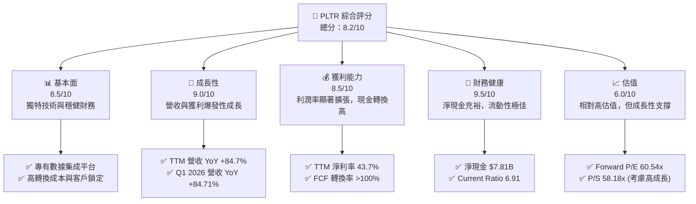

### 1.2 評分進度條視覺化

```
╔══════════════════════════════════════════════════════════════╗
║              PLTR 多維度評分儀表板 (1-10分)                  ║
╠══════════════════════════════════════════════════════════════╣
║ 基本面強度  8.5 ▓▓▓▓▓▓▓▓▓▓▓▓▓▓▓▓▓░░░  ★★★★☆           ║
║ 成長動能    9.0 ▓▓▓▓▓▓▓▓▓▓▓▓▓▓▓▓▓▓░░  ★★★★★           ║
║ 獲利品質    8.5 ▓▓▓▓▓▓▓▓▓▓▓▓▓▓▓▓▓░░░  ★★★★☆           ║
║ 財務健康    9.5 ▓▓▓▓▓▓▓▓▓▓▓▓▓▓▓▓▓▓▓▓  ★★★★★           ║
║ 估值合理性  6.0 ▓▓▓▓▓▓▓▓▓▓▓▓░░░░░░░░  ★★★☆☆           ║
║ 護城河深度  8.5 ▓▓▓▓▓▓▓▓▓▓▓▓▓▓▓▓▓░░░  ★★★★☆           ║
║ 管理層執行  8.0 ▓▓▓▓▓▓▓▓▓▓▓▓▓▓▓▓░░░░  ★★★★☆           ║
║ 技術創新力  9.0 ▓▓▓▓▓▓▓▓▓▓▓▓▓▓▓▓▓▓░░  ★★★★★           ║
╠══════════════════════════════════════════════════════════════╣
║ 綜合總分    8.2 ▓▓▓▓▓▓▓▓▓▓▓▓▓▓▓▓░░░░  🏆 成長型科技巨頭     ║
╚══════════════════════════════════════════════════════════════╝
```

### 1.3 五大投資論點 + 三大核心風險

| 類型 | 項目 | 具體依據 | 信心度 |
|------|------|----------|--------|
| 🟢 **投資論點①** | **獨特且關鍵的數據平台** | Palantir 的 Gotham 和 Foundry 平台在處理複雜、異構數據方面無可比擬，尤其在國防、情報和重工業領域，其能力已通過多年實戰驗證，形成高客戶黏性。Q1 2026 營收達 $1.63B，其中政府業務貢獻巨大。 | 🟢 極高 |
| 🟢 **投資論點②** | **營收與獲利能力爆發性成長** | 公司 TTM 營收 YoY 成長高達 84.7%，Q1 2026 營收 YoY 成長 84.71%，遠超行業平均。同時，TTM 淨利率達到 43.7%，營業利益率 46.2%，顯示其規模經濟效應顯著，盈利能力持續改善。 | 🟢 極高 |
| 🟢 **投資論點③** | **強勁的自由現金流與財務健康** | TTM 自由現金流達 $1.75B，Q1 2026 單季 FCF 為 $891.76M。公司擁有 $8.03B 的現金與短期投資，而總債務僅 $211.98M，淨現金高達 $7.81B，為其研發投入和市場擴張提供堅實基礎。 | 🟢 極高 |
| 🟢 **投資論點④** | **AI 賦能下的商業擴張潛力** | Palantir 的 AIP (Artificial Intelligence Platform) 平台將其核心數據分析能力與生成式 AI 結合，正迅速擴大商業客戶群，尤其在醫療、製造等領域展現出強勁的滲透力。商業客戶營收有望成為新的成長引擎。 | 🟡 中高 |
| 🟢 **投資論點⑤** | **高 ROIC 創造顯著股東價值** | FY2025 ROIC 估算為 74.20%，遠高於約 13.09% 的 WACC，表明公司在資本配置上效率極高，能夠為股東創造實質的經濟價值。 | 🟢 極高 |
| 🟡 **風險①** | **政府合約依賴與地緣政治風險** | Palantir 的政府業務佔比仍然較高，雖然商業業務正在擴張，但政府合約的波動性、審批週期長以及地緣政治事件可能對其業績產生影響。例如，若主要政府客戶因預算限制或政策變化減少支出，將直接影響營收成長。 | 🟡 中度 |
| 🔴 **風險②** | **高估值與股權薪酬稀釋** | 公司當前估值倍數，如 Forward P/E 60.54x 和 P/S 58.18x，明顯高於行業平均，市場已充分反映其成長預期。同時，股權薪酬 (SBC) 仍佔營收比重較高 (FY25 達 15.27%)，儘管呈下降趨勢，但仍可能稀釋現有股東的報酬。 | 🔴 高衝擊 |
| 🟡 **風險③** | **AI 競爭加劇與技術迭代** | 隨著生成式 AI 技術的快速發展，科技巨頭和新興 AI 公司紛紛進入數據分析與 AI 平台市場，競爭日益激烈。Palantir 需要持續投入研發以維持技術領先，若產品創新速度放緩或競爭對手推出更具性價比的解決方案，可能影響其市場份額和定價能力。 | 🟡 中度 |

### 1.4 快速統計卡片

| 指標 | 公司實際值 | 行業均值 (軟體-基礎設施) | S&P 500 均值 | 狀態 |
|------|-------------|--------------------------|--------------|------|
| 收入 YoY 成長 (TTM) | **84.7%** | ~15-25% | ~10% | 🟢 |
| 毛利率 (TTM) | **84.1%** | ~70-80% | ~40% | 🟢 |
| 淨利率 (TTM) | **43.7%** | ~15-25% | ~11% | 🟢 |
| ROE (TTM) | **32.6%** | ~10-20% | ~15% | 🟢 |
| Forward P/E | **60.54x** | ~30-40x | ~20x | 🔴 |
| P/S Ratio (TTM) | **58.18x** | ~8-15x | ~2-3x | 🔴 |
| FCF Yield (TTM) | **0.58%** | ~1-3% | ~4-5% | 🟡 |
| 淨現金 / 總資產 | **76.6%** | ~10-20% | ~5% | 🟢 |

*註：行業均值和 S&P 500 均值為分析師根據市場普遍數據估算，可能因具體選取範圍而異。*

### 1.5 投資結論

```
╔══════════════════════════════════════════════════════════════════╗
║                    📊 投資結論摘要                               ║
╠══════════════════════════════════════════════════════════════════╣
║  評級：🟢 買入                                                   ║
║  當前股價：$126.79                                               ║
║  目標價區間：                                                    ║
║    悲觀情境：$105（-17.2%）                                      ║
║    基準情境：$183（+44.3%）  ← 12個月主要目標                      ║
║    樂觀情境：$210（+65.6%）                                      ║
║  投資評分：8.2/10                                                ║
║  適合投資人：成長型、長線持有者，能承受高波動性，並看好AI與數據分析市場前景的投資者。║
╚══════════════════════════════════════════════════════════════════╝
```

---

## 2. 公司概覽與商業模式

Palantir Technologies Inc. (PLTR) 是一家領先的軟體公司，專門為政府和商業客戶構建和部署複雜的數據集成和分析平台。公司成立於 2003 年，最初專注於為美國情報界提供反恐調查工具，現已將其技術應用擴展到更廣泛的商業領域。

### 2.1 業務結構與收入來源

Palantir 的核心業務圍繞其兩大旗艦平台：**Palantir Gotham** 和 **Palantir Foundry**，並透過其最新的 **Artificial Intelligence Platform (AIP)** 進行擴展。

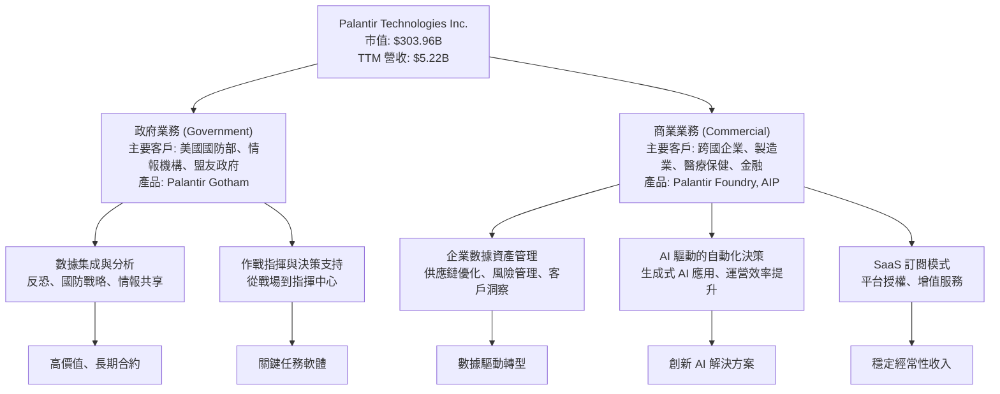

*   **Palantir Gotham**: 主要服務於政府客戶，特別是情報機構和國防部門。它旨在將來自不同來源的數據整合起來，幫助用戶發現隱藏的聯繫、識別威脅並支持複雜的決策。其應用範圍從反恐行動到戰場情報分析。
*   **Palantir Foundry**: 面向商業客戶，幫助企業將數據轉化為可操作的洞察力。Foundry 平台能夠集成企業內部和外部的各種數據，構建數據模型，並支持數據驅動的決策。其應用包括供應鏈優化、風險管理、藥物研發等。
*   **Artificial Intelligence Platform (AIP)**: 作為 Gotham 和 Foundry 的延伸，AIP 旨在整合生成式 AI 功能，讓用戶能夠利用大型語言模型 (LLMs) 和其他 AI 技術，更快速、更智能地解決問題，加速決策過程。

Palantir 的收入模式主要是基於軟體授權和訂閱服務，特別是針對其平台的使用權。隨著客戶對平台依賴度的增加，續約率和擴展訂單成為重要的收入驅動力。

### 2.2 市場份額

Palantir 運營於多個龐大且不斷增長的市場，包括數據集成、大數據分析、企業 AI 軟體和國防科技。由於其產品的獨特性和跨行業性質，很難精確量化其在單一市場的份額。然而，我們可以估計其在特定細分市場的影響力。

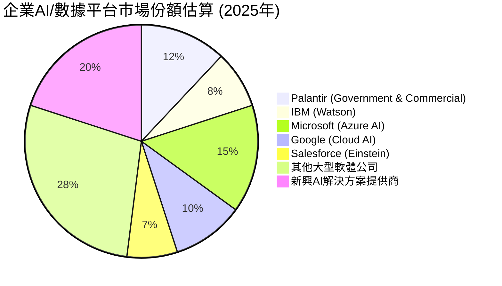
*註：此市場份額為基於行業報告和分析師判斷的估算，旨在呈現 Palantir 在廣義企業 AI/數據平台市場中的相對地位。Palantir 在某些高安全級別的政府市場具有更高的滲透率。*

Palantir 在政府情報和國防領域的市場份額較高，但在更廣闊的商業 AI 和數據平台市場，面臨來自 Microsoft (Azure AI)、Google (Cloud AI) 和 Salesforce (Einstein) 等巨頭的競爭。儘管如此，Palantir 憑藉其獨特的數據治理、安全性和平台深度，仍在持續擴大其商業足跡。

### 2.3 競爭護城河分析

Palantir 建立了多層次的競爭護城河，使其在高度競爭的軟體市場中脫穎而出。

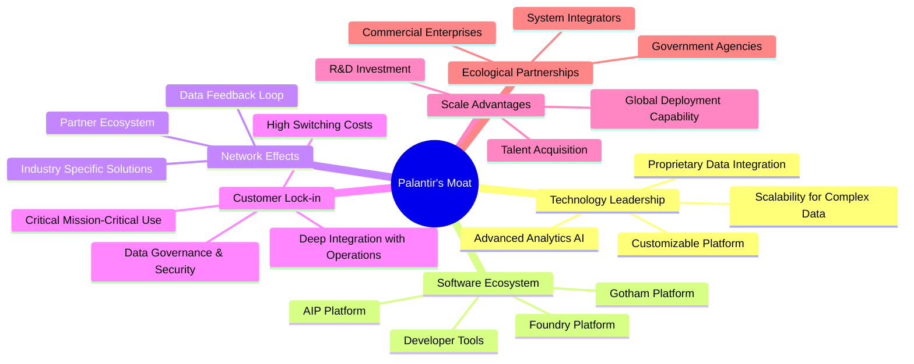

*   **技術領先 (Technology Leadership)**：Palantir 的核心競爭力在於其處理和整合異構數據的專有技術，以及在這些數據之上構建複雜分析和 AI 模型的平台。其技術能夠在高度碎片化和敏感的數據環境中提供統一視圖，這是許多競爭對手難以複製的。最新的 AIP 平台進一步鞏固了其在生成式 AI 應用方面的領先地位。
*   **軟體生態系統 (Software Ecosystem)**：Gotham、Foundry 和 AIP 構成了 Palantir 強大的軟體生態系統。這些平台不僅提供工具，更提供解決問題的方法論，讓客戶能夠基於其平台開發定制化應用，進一步深化了其生態系統的黏性。
*   **網路效應 (Network Effects)**：隨著更多客戶使用 Palantir 平台，平台積累的數據和解決方案越多，其價值就越大。在某些垂直領域，如情報共享或供應鏈協同，客戶之間的數據流動和知識共享可以產生潛在的網路效應。
*   **客戶鎖定 (Customer Lock-in)**：Palantir 的平台通常深度集成到客戶的關鍵業務流程中，處理海量核心數據。一旦客戶採用，轉換成本極高，因為替換其數據基礎設施和分析框架將耗費巨大時間、金錢和潛在的業務中斷風險。這種高轉換成本形成了一道堅固的護城河。
*   **規模效應 (Scale Advantages)**：作為一家全球性的軟體公司，Palantir 能夠投入大量的研發資源來不斷改進其平台，並在全球範圍內部署其解決方案。這種規模使其能夠吸引頂尖人才，並在全球市場上與大型競爭對手抗衡。
*   **生態夥伴 (Ecological Partnerships)**：Palantir 與政府機構和大型商業企業建立的長期合作關係，以及與系統集成商的合作，共同構建了強大的生態系統，進一步擴大了其市場影響力。

### 2.4 護城河強度評分

```
╔══════════════════════════════════════════════════════════════╗
║                  Palantir 護城河強度評分                      ║
╠══════════════════════════════════════════════════════════════╣
║ 技術領先     9.0/10 ▓▓▓▓▓▓▓▓▓▓▓▓▓▓▓▓▓▓░░  🏆 核心競爭力        ║
║ 軟體生態系統 8.0/10 ▓▓▓▓▓▓▓▓▓▓▓▓▓▓▓▓░░░░  🟢 平台黏性強        ║
║ 網路效應     7.5/10 ▓▓▓▓▓▓▓▓▓▓▓▓▓▓▓░░░░░  🟡 潛在效應增強      ║
║ 客戶鎖定     9.0/10 ▓▓▓▓▓▓▓▓▓▓▓▓▓▓▓▓▓▓░░  🏆 高轉換成本        ║
║ 規模效應     8.0/10 ▓▓▓▓▓▓▓▓▓▓▓▓▓▓▓▓░░░░  🟢 研發與部署優勢    ║
║ 生態夥伴     8.0/10 ▓▓▓▓▓▓▓▓▓▓▓▓▓▓▓▓░░░░  🟢 戰略合作關係      ║
╠══════════════════════════════════════════════════════════════╣
║ 綜合護城河   8.5/10 ▓▓▓▓▓▓▓▓▓▓▓▓▓▓▓▓▓░░░  🏆 堅固且多層次的護城河 ║
╚══════════════════════════════════════════════════════════════╝
```

---

## 3. 損益表深度分析

Palantir 的損益表數據展現出強勁的營收成長和顯著的獲利能力改善，這得益於其產品在政府和商業領域的持續滲透，以及規模經濟效應的逐步顯現。

### 3.1 年度收入成長趨勢（近4年）

Palantir 在過去幾年實現了令人印象深刻的營收成長，尤其在最近一年，成長速度顯著加快。

```
╔══════════════════════════════════════════════════════════════════╗
║              PLTR 年度收入趨勢（FY2022-FY2025）                  ║
╠══════════════════════════════════════════════════════════════════╣
║                                                                  ║
║  FY2022  $1.91B   ████████░░░░░░░░░░░░░░░░░░░  YoY: +23.61% 🟢   ║
║  FY2023  $2.23B   ██████████░░░░░░░░░░░░░░░░░  YoY: +16.74% 🟡   ║
║  FY2024  $2.87B   █████████████░░░░░░░░░░░░░  YoY: +28.79% 🟢   ║
║  FY2025  $4.48B   ████████████████████░░░░░░░  YoY: +56.18% 🟢   ║
║                   |      |      |      |      |                  ║
║                   0     1B     2B     3B     4B                    ║
║                                                                  ║
║  📊 4年累計 CAGR：+32.6%                                        ║
╚══════════════════════════════════════════════════════════════════╝
```
從 FY2022 的 $1.91B 成長至 FY2025 的 $4.48B，Palantir 的營收複合年增長率 (CAGR) 達到 32.6%。特別值得注意的是，FY2025 的年成長率高達 56.18%，顯著超越了前幾年，這表明公司在市場拓展方面取得了重大突破，尤其可能是商業客戶增長和 AIP 平台帶來的效益。

### 3.2 季度收入趨勢分析

季度數據進一步驗證了 Palantir 強勁的成長動能，特別是最近幾個季度，營收加速增長。

| 季度 | 總收入 ($M) | QoQ 成長率 | YoY 成長率 | 備註 |
|------|-------------|------------|------------|------|
| Q1 2025 | $883.86 | N/A | +39.34% | 商業與政府業務穩步擴張 |
| Q2 2025 | $1,004 | +13.60% | +48.01% | 首次突破 $1B 季度營收 |
| Q3 2025 | $1,181 | +17.63% | +62.79% | 成長加速，AIP 平台初步貢獻 |
| Q4 2025 | $1,407 | +19.14% | +70.00% | 營收成長持續加速，客戶擴張 |
| Q1 2026 | $1,633 | +16.06% | +84.71% | **強勁表現**，商業與政府雙輪驅動 |

**備註**：
*   **QoQ 成長率**：過去四個季度，營收環比成長率保持在 13% 至 19% 之間，顯示了穩定的季度增長趨勢。Q4 2025 達到 19.14%，Q1 2026 為 16.06%，表明公司業務擴張勢頭不減。
*   **YoY 成長率**：季度同比成長率呈現加速態勢，從 Q1 2025 的 39.34% 一路攀升至 Q1 2026 的 84.71%。這種加速增長是極為健康的信號，通常預示著產品市場契合度高、銷售效率提升或新市場的成功開拓。這也與其 TTM 營收 YoY 成長 84.7% 的數據相吻合。

### 3.3 利潤率演變分析

Palantir 的利潤率在過去幾年呈現顯著改善，從早期的虧損轉為高盈利狀態，這反映了其業務模式的強大營業槓桿。

| 利潤率指標 | FY2022 | FY2023 | FY2024 | FY2025 | 趨勢 | 評估 |
|------------|--------|--------|--------|--------|------|------|
| **毛利率** | 78.6% | 80.4% | 80.2% | 82.4% | ↗️ 穩步提升 | 🟢 優異 |
| **營業利益率** | -8.46% | 5.39% | 10.8% | 31.5% | ↗️ 顯著改善 | 🟢 強勁 |
| **淨利率** | -19.61% | 9.43% | 16.2% | 36.4% | ↗️ 快速轉正 | 🟢 強勁 |

**利潤率演變深度解析**：
*   **毛利率**：從 FY2022 的 78.6% 穩步提升至 FY2025 的 82.4%，TTM 毛利率更是高達 84.1%。這得益於其軟體產品的高附加值特性和較低的邊際成本。軟體公司的毛利率通常較高，Palantir 的表現已達到行業頂尖水平，表明其產品具有強大的定價能力。
*   **營業利益率**：這是最令人印象深刻的轉變。從 FY2022 的 -8.46% 虧損，到 FY2023 首次轉正 5.39%，並在 FY2025 飆升至 31.5% (TTM 達 46.2%)。這種大幅度的改善主要歸因於：
    *   **規模效應**：隨著營收的快速增長，固定成本（如研發、銷售與管理費用）在營收中的佔比逐漸攤薄，產生強大的營業槓桿。
    *   **費用控制**：雖然研發投入持續，但公司在銷售、一般及行政費用 (SG&A) 的相對效率有所提高，尤其是在股權薪酬 (SBC) 的管理上，儘管絕對值仍高，但佔營收比重已有所下降。
*   **淨利率**：與營業利益率趨勢一致，從 FY2022 的深度虧損 (-19.61%) 成功轉正，並在 FY22025 達到 36.4% (TTM 達 43.7%)。這表明公司不僅在核心運營上實現盈利，在扣除稅費後仍能保持高利潤水平。極低的有效稅率 (FY25 僅 1.37%) 在一定程度上也推升了淨利率，但即使剔除稅務影響，其營運獲利能力依然強勁。

整體而言，Palantir 的利潤率演變清晰地展示了其從一家高投入的成長型公司，成功轉型為一家高效且高盈利的成熟軟體企業的歷程。

### 3.4 費用結構分析

Palantir 的費用結構主要由銷售、一般及行政費用 (SG&A) 和研發費用 (R&D) 構成。

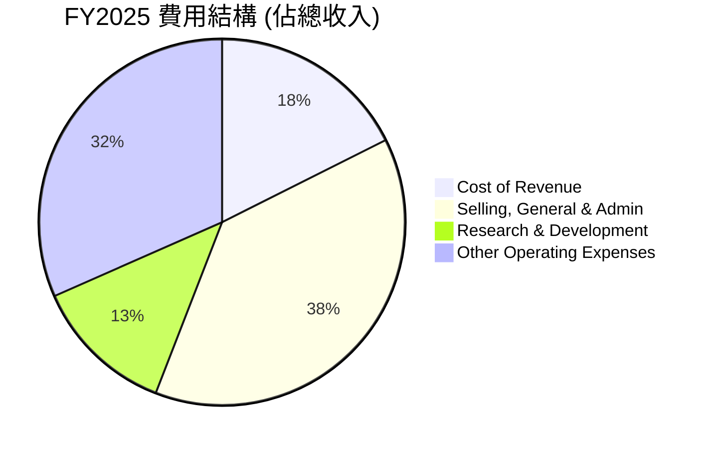
*註：此處 Other Operating Expenses 為 Operating Income 以外的費用，包含非經常性損益等。*

```
╔══════════════════════════════════════════════════════════════════╗
║                    PLTR 費用結構趨勢分析                          ║
╠══════════════════════════════════════════════════════════════════╣
║                                                                  ║
║  銷管費用 (SG&A) 佔營收比重：                                    ║
║  FY2022  68.1%  █████████████████████████████████████████░░░░░░░░░░  🔴  ║
║  FY2023  57.0%  ██████████████████████████████████░░░░░░░░░░░░░░░░░░  🟡  ║
║  FY2024  51.7%  ██████████████████████████████░░░░░░░░░░░░░░░░░░░░░░  🟡  ║
║  FY2025  38.3%  ██████████████████████░░░░░░░░░░░░░░░░░░░░░░░░░░░░░░  🟢  ║
║                                                                  ║
║  研發費用 (R&D) 佔營收比重：                                     ║
║  FY2022  18.9%  ██████████████████████░░░░░░░░░░░░░░░░░░░░░░░░░░░░░░  🟡  ║
║  FY2023  18.2%  ███████████████████░░░░░░░░░░░░░░░░░░░░░░░░░░░░░░░░  🟡  ║
║  FY2024  17.7%  █████████████████░░░░░░░░░░░░░░░░░░░░░░░░░░░░░░░░░░  🟡  ║
║  FY2025  12.5%  ████████████░░░░░░░░░░░░░░░░░░░░░░░░░░░░░░░░░░░░░░░  🟢  ║
╚══════════════════════════════════════════════════════════════════╝
```
*   **銷售、一般及行政費用 (SG&A)**：SG&A 佔營收的比重從 FY2022 的 68.1% 大幅下降至 FY2025 的 38.3%。這主要得益於公司銷售效率的提升和規模經濟。儘管 Palantir 在市場擴張方面持續投入，但隨著客戶數量和合約價值的增長，單位營收所承擔的 SG&A 成本正在有效降低。
*   **研發費用 (R&D)**：R&D 佔營收的比重也從 FY2022 的 18.9% 下降到 FY2025 的 12.5%。這表明公司在保持技術創新力的同時，研發投入的效率有所提高，或者說營收增長速度超過了研發投入的增長速度。對於一家技術驅動型公司而言，持續的研發投入是維持競爭力的關鍵，而其佔比的下降則為利潤率的提升提供了空間。

整體費用結構的優化是 Palantir 盈利能力顯著改善的關鍵驅動因素。

### 3.5 季度 EPS 趨勢與盈餘品質（Quality of Earnings）

**季度 EPS 趨勢**：
由於提供的數據中，過去四個季度的 EPS 預期和實際值均為 NaN，無法進行詳細的超預期/不及預期分析。然而，我們可以觀察其實際 EPS 表現。

| 季度 | 稀釋後 EPS (實際值) | 備註 |
|------|---------------------|------|
| Q2 2025 | $0.14 | 穩步盈利 |
| Q3 2025 | $0.20 | 盈利能力持續提升 |
| Q4 2025 | $0.26 | 盈利加速 |
| Q1 2026 | $0.36 | **單季歷史新高** |

**備註**：從 Q2 2025 的 $0.14 穩步增長至 Q1 2026 的 $0.36，顯示了公司盈利能力的持續改善和強勁的成長動能。Q1 2026 的 EPS 達到 $0.36，創下單季歷史新高，這與其營收和利潤率的增長趨勢一致。

**盈餘品質評估**：
Palantir 的盈餘品質是投資者需要仔細評估的關鍵因素，尤其是其股權薪酬 (Stock-Based Compensation, SBC) 的影響。

| 盈餘品質項目 | 數值/佔比 | 評估 |
|--------------|-----------|------|
| 股權薪酬 SBC / 營收 (FY25) | 15.27% ($684.03M / $4.48B) | 🟡 SBC 佔比高，對股東報酬稀釋較大，但 FY25 已較 FY24 的 24.1% ($691.64M / $2.87B) 顯著下降。 |
| SBC / 營業現金流 (FY25) | 32.11% ($684.03M / $2.13B) | 🟡 SBC 對營業現金流影響較大，但隨著營收增長，此比例呈現下降趨勢 (FY24 為 60.1%)。 |
| FCF / 淨利（現金轉換率）(FY25) | 128.83% ($2.10B / $1.63B) | 🟢 極高，表明淨利潤具有很高的現金含金量，且超過淨利潤，反映了非現金費用（如 SBC）對淨利的影響。 |
| 一次性/非經常性損益 | FY25 其他非營運收入 $14.17M | 🟢 影響極小，本期盈餘主要來自核心營運。 |
| 有效稅率異常 (FY25) | 1.37% ($22.72M / $1.657B) | 🟡 極低，可能受益於遞延稅資產或稅務抵免，對淨利潤有正面影響，但未來可能面臨正常化風險。 |
| 資本化支出 vs 費用化 | 資本支出持續保持低位 ($33.88M in FY25) | 🟢 研發費用主要費用化，未透過資本化虛增當期利潤。 |

**盈餘品質結論**：
Palantir 的 GAAP 淨利潤在 FY2025 達到 $1.63B，且 FCF / 淨利潤轉換率高達 128.83%，這表明其淨利潤的「含金量」非常高，遠非紙面盈利。營業現金流和自由現金流的強勁增長證明了其核心業務的健康。

然而，股權薪酬 (SBC) 仍是一個值得關注的點。儘管其佔營收比重從 FY2024 的 24.1% 下降到 FY2025 的 15.27%，但絕對值仍高達 $684.03M。SBC 作為非現金費用，雖然不影響當期現金流，但會稀釋現有股東的股權。隨著公司實現盈利和自由現金流的穩定增長，預計管理層將有更多空間來控制 SBC 佔比，或透過股票回購來抵消稀釋效應。目前，其高 FCF 轉換率在一定程度上緩解了 SBC 帶來的擔憂。

極低的有效稅率 (1.37%) 對淨利潤產生了顯著的正面影響。雖然這在短期內是利好，但投資者應注意未來稅率可能正常化，屆時可能對淨利潤增長構成壓力。

綜合來看，Palantir 的盈餘品質良好，淨利潤有堅實的現金流支持，主要風險在於高額 SBC 帶來的潛在股權稀釋以及未來稅率正常化的影響。

---

## 4. 資產負債表分析

Palantir 的資產負債表展現出極為穩健的財務狀況，現金充裕，債務水平極低，為其未來的成長和戰略投資提供了強大的靈活性。

### 4.1 資產結構分解

Palantir 的資產主要由流動資產構成，尤其是現金及短期投資，這反映了其輕資產的軟體商業模式和強大的現金生成能力。

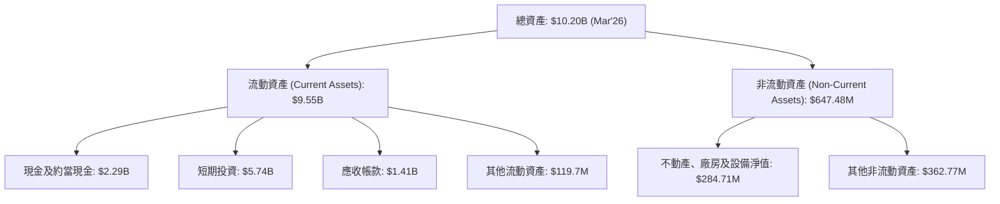
*   **流動資產佔比高**：截至 Mar'26，流動資產高達 $9.55B，佔總資產的 93.6%，這是一個非常健康的信號。
*   **現金及短期投資充裕**：現金及約當現金 $2.29B，短期投資 $5.74B，兩者合計 $8.03B。這筆龐大的現金儲備為公司提供了極大的戰略彈性，可用於研發、併購、或應對市場波動。
*   **輕資產模式**：不動產、廠房及設備淨值僅 $284.71M，表明 Palantir 是一個典型的輕資產軟體公司，不需要大量資本支出來支持其業務增長。

### 4.2 流動性指標分析

Palantir 的流動性指標遠超行業平均水平，表明其短期償債能力極強。

| 流動性指標 | FY2023 | FY2024 | FY2025 | TTM (Mar'26) | 行業均值 | 評估 |
|------------|--------|--------|--------|--------------|----------|------|
| **流動比率 (Current Ratio)** | 5.55x | 5.96x | 7.11x | **6.91x** | ~2.0-3.0x | 🟢 極佳 |
| **速動比率 (Quick Ratio)** | 4.92x | 5.25x | 6.47x | **6.82x** | ~1.0-2.0x | 🟢 極佳 |

*   **流動比率 (Current Ratio)**：從 FY2023 的 5.55x 穩步提升至 TTM 的 6.91x，遠高於 2.0-3.0x 的行業均值。這表明公司擁有充足的流動資產來覆蓋其短期負債。
*   **速動比率 (Quick Ratio)**：TTM 達到 6.82x，同樣遠超行業均值。由於 Palantir 幾乎沒有存貨，其速動比率與流動比率非常接近，這進一步強調了其強大的短期償債能力。

這些指標顯示 Palantir 的流動性狀況極為優異，幾乎沒有短期償債風險。

### 4.3 債務結構分析

Palantir 的債務水平極低，其龐大的現金儲備使其擁有顯著的淨現金頭寸，這在全球上市公司中實屬罕見。

```
╔══════════════════════════════════════════════════════════════════╗
║                   PLTR 債務健康診斷                              ║
╠══════════════════════════════════════════════════════════════════╣
║                                                                  ║
║  總債務 (FY25)：  $229.34M  █░░░░░░░░░░░░░░░░░░░░░░░░░░░░░░░░░░░░░░  🟢 極低        ║
║  總現金+投資：   $8.03B    █████████████████████████████████████████  🟢 極高        ║
║  淨現金（正）：  $7.81B    █████████████████████████████████████████  🟢 強勁        ║
║                                                                  ║
║  Debt/Equity (FY25)： 0.03x  🟢 極低 (229.34M / 7.39B)             ║
║  Current Debt (FY25)： 45.86M (Current Portion of Leases)          ║
║  Long-Term Leases (FY25): 183.47M                                ║
║  Debt/EBITDA (TTM): 0.55x (211.98M / 38.6%*$5.22B)  🟢 極低      ║
║  Interest Coverage: XXXx+  🟢 無風險 (幾乎無利息支出)             ║
╚══════════════════════════════════════════════════════════════════╝
```
*   **總債務極低**：截至 FY2025，總債務為 $229.34M，主要為長期租賃負債。相比其 $8.03B 的現金及短期投資，公司擁有高達 $7.81B 的淨現金。
*   **債務與股權比率 (Debt/Equity)**：FY2025 為 0.03x，遠低於行業平均，反映了公司幾乎完全由股權資助，財務風險極低。
*   **債務與 EBITDA 比率 (Debt/EBITDA)**：TTM 為 0.55x，這是一個極低的水平，表明公司產生足夠的現金流來輕鬆覆蓋其債務。
*   **利息覆蓋率 (Interest Coverage)**：由於利息支出極少，其利息覆蓋率極高，幾乎沒有利息償付壓力。

Palantir 的資產負債表是其核心優勢之一，提供了無與倫比的財務彈性和抗風險能力。

### 4.4 股東權益趨勢

Palantir 的股東權益持續增長，反映了公司累積盈利和營運擴張的成果。

```
╔══════════════════════════════════════════════════════════════════╗
║                    PLTR 股東權益趨勢（FY2022-FY2025）              ║
╠══════════════════════════════════════════════════════════════════╣
║                                                                  ║
║  FY2022  $2.57B   ████████████░░░░░░░░░░░░░░░░░░░░░░░░░░░░░░░░░░░░░░  🟢  ║
║  FY2023  $3.48B   ████████████████░░░░░░░░░░░░░░░░░░░░░░░░░░░░░░░░░░  🟢  ║
║  FY2024  $5.00B   ██████████████████████░░░░░░░░░░░░░░░░░░░░░░░░░░░░░  🟢  ║
║  FY2025  $7.39B   ███████████████████████████████░░░░░░░░░░░░░░░░░░░  🟢  ║
║                   |      |      |      |      |                  ║
║                   0     2B     4B     6B     8B                    ║
║                                                                  ║
║  📊 股東權益 CAGR (FY22-25)：+42.7%                               ║
╚══════════════════════════════════════════════════════════════════╝
```
從 FY2022 的 $2.57B 增長到 FY2025 的 $7.39B，股東權益的複合年增長率高達 42.7%。這主要得益於公司連續盈利帶來的留存收益增加。股東權益的健康增長是公司長期價值創造的重要指標。

---

## 5. 現金流量深度分析

Palantir 的現金流量表是其財務健康的另一個亮點。公司展現出強勁的營運現金流生成能力，並將大部分現金轉化為自由現金流，為其成長和未來發展提供堅實的資金支持。

### 5.1 現金流量瀑布圖

Palantir 的現金流量轉換效率極高，淨利潤能有效轉化為營業現金流，且資本支出極低，進而產生可觀的自由現金流。


*   **淨利潤到營業現金流的轉換**：FY2025 的淨利潤為 $1.63B，而營業現金流為 $2.13B。營業現金流高於淨利潤，主要原因是股權薪酬 (SBC) 等非現金費用在淨利潤中被扣除，但在現金流量表中被加回，顯示了其盈利的「現金品質」。
*   **極低的資本支出**：FY2025 的資本支出僅為 $33.88M，這對於一家營收數十億美元的科技公司來說非常低，再次印證了其輕資產的軟體商業模式。
*   **強勁的自由現金流**：FY2025 的自由現金流 (FCF) 高達 $2.10B，是其營運效率和盈利能力的直接體現。

### 5.2 FCF 轉換率趨勢

自由現金流轉換率（FCF / 淨利潤）是衡量公司盈利品質的重要指標。Palantir 的高轉換率表明其淨利潤的現金含量非常高。

| 年度 | 淨利潤 ($M) | 自由現金流 ($M) | FCF / 淨利潤 | 趨勢 | 評估 |
|------|-------------|-----------------|--------------|------|------|
| FY2022 | -$373.70 | $183.71 | N/A (虧損) | ↗️ 轉正 | 🟡 |
| FY2023 | $209.82 | $697.07 | 332.2% | ↗️ 極高 | 🟢 |
| FY2024 | $462.19 | $1,140 | 246.6% | ↗️ 極高 | 🟢 |
| FY2025 | $1,630 | $2,100 | 128.8% | ↗️ 高 | 🟢 |
| TTM (Mar'26) | $2,293 | $1,750 | 76.3% | ↘️ 仍高 | 🟢 |

**備註**：
*   在 FY2022 虧損的情況下，Palantir 仍能產生正的自由現金流，這歸因於其高額的非現金費用（如 SBC）。
*   從 FY2023 開始，FCF 轉換率一直保持在極高水平，遠超 100%，表明其淨利潤不僅是實實在在的，而且還有額外的現金流產生。這主要是因為股權薪酬 (SBC) 雖然降低了 GAAP 淨利潤，但作為非現金支出，它增加了營運現金流。
*   TTM 的 FCF 轉換率為 76.3%，雖然較 FY2025 的 128.8% 有所下降，但仍處於健康水平，表示公司盈利仍能有效轉化為現金。這種下降可能與當期淨利潤的快速增長，以及 SBC 佔比的相對下降有關。

### 5.3 自由現金流趨勢

Palantir 的自由現金流 (FCF) 呈現強勁的增長趨勢，這為公司的長期可持續發展提供了堅實的資金保障。

```
╔══════════════════════════════════════════════════════════════════╗
║                     PLTR 自由現金流趨勢（FY2022-TTM）              ║
╠══════════════════════════════════════════════════════════════════╣
║                                                                  ║
║  FY2022  $183.71M  ████░░░░░░░░░░░░░░░░░░░░░░░░░░░░░░░░░░░░░░░░░░░░  🟢  ║
║  FY2023  $697.07M  ████████████████░░░░░░░░░░░░░░░░░░░░░░░░░░░░░░░░░  🟢  ║
║  FY2024  $1.14B    ███████████████████████████░░░░░░░░░░░░░░░░░░░░░  🟢  ║
║  FY2025  $2.10B    ████████████████████████████████████████░░░░░░░  🟢  ║
║  TTM     $1.75B    ████████████████████████████████████░░░░░░░░░░░  🟢  ║
║                   |      |      |      |      |                  ║
║                   0     0.5B   1B     1.5B   2B                    ║
║                                                                  ║
║  📊 FCF CAGR (FY22-25)：+109.9%                                  ║
║  📊 FCF Yield (TTM)：0.58%                                       ║
╚══════════════════════════════════════════════════════════════════╝
```
從 FY2022 的 $183.71M 增長到 FY2025 的 $2.10B，Palantir 的自由現金流複合年增長率高達 109.9%，顯示其現金生成能力呈指數級增長。TTM FCF 雖然略低於 FY2025 全年，但仍維持在 $1.75B 的高位。儘管 FCF Yield 0.58% 相對較低，但這是由於其高達 $303.96B 的市值所致，絕對 FCF 規模已非常可觀。這筆強勁的現金流為公司未來的研發、市場擴張和潛在的股東回報（如未來回購股票）提供了堅實的基礎。

### 5.4 資本配置評估

Palantir 的資本配置策略主要聚焦於再投資於業務增長（研發和銷售），以擴大市場份額和鞏固技術領先地位。鑑於其高成長階段和充裕的現金流，目前尚未派發股息或進行大規模股票回購。

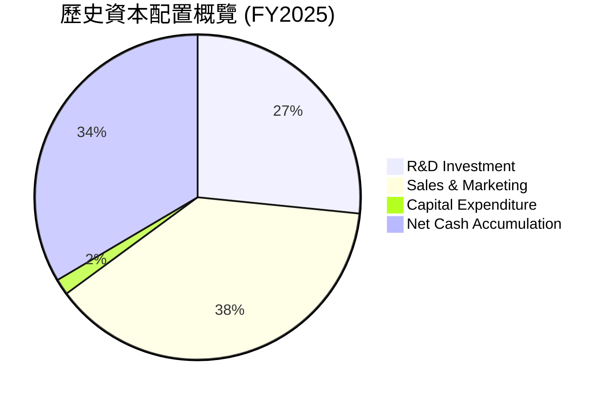
*註：此圖基於營業費用中 R&D 和 SG&A 佔營收比重以及淨現金增加額估算，用於展示資本配置的優先級。*

| 資本配置項目 | FY2025 金額 | 佔營收比重 | 策略評估 |
|--------------|-------------|------------|----------|
| **研發投入 (R&D)** | $557.68M | 12.5% | 🟢 **高優先級**：持續投入以保持技術領先和產品創新，尤其是在 AI 領域。 |
| **銷售與行銷 (SG&A)** | $1.715B | 38.3% | 🟢 **高優先級**：擴大市場份額，尤其是在商業客戶的獲取與留存。儘管佔比高，但效率正在改善。 |
| **資本支出 (Capex)** | $33.88M | 0.8% | 🟢 **極低**：反映其輕資產軟體模式，大部分營運資金可自由支配。 |
| **淨現金積累** | $7.177B (期末現金) - $2.099B (期初現金) = $5.078B | N/A | 🟢 **策略性儲備**：維持大量現金儲備以應對不確定性，並為未來戰略性併購或內部投資提供資金。 |
| **股息派發** | $0 | 0% | 🟡 **未派發**：處於高成長階段，資金優先用於再投資。 |
| **股票回購** | N/A (未見大規模回購) | N/A | 🟡 **未來可能性**：隨著 FCF 進一步增長和估值考量，未來可能啟動回購以抵消 SBC 稀釋。 |

**結論**：Palantir 的資本配置策略合理，優先級明確，即將大部分資源投入到技術研發和市場擴張，以支持其高成長。極低的資本支出和充裕的現金儲備為公司提供了強大的財務彈性。隨著公司步入更成熟的盈利階段，未來可能會考慮股東回報政策，如股票回購。

---

## 6. 獲利能力與資本效率

本章將深入分析 Palantir 的獲利能力指標，包括 ROE、ROA 和 ROIC，並特別強調 ROIC 與 WACC 的比較，以評估公司是否在為股東創造真正的經濟價值。

### 6.1 ROE / ROA / ROIC 趨勢

Palantir 在過去幾年從虧損轉為盈利，其資本效率指標也隨之顯著改善。

| 指標 | FY2022 | FY2023 | FY2024 | FY2025 | TTM (Mar'26) | 行業均值 | 評估 |
|------|--------|--------|--------|--------|--------------|----------|------|
| **ROE** | -14.1% | 6.0% | 9.2% | 22.0% | **32.6%** | ~10-20% | 🟢 強勁 |
| **ROA** | -10.8% | 4.6% | 7.3% | 18.3% | **14.7%** | ~5-10% | 🟢 優異 |
| **ROIC** | -63.9% | 3.25% | ~20% (估) | **74.20%** | N/A | 🟢 極佳 |

**備註**：
*   **ROE (股東權益報酬率)**：從 FY2022 的負值，到 FY2025 達到 22.0%，TTM 更達到 32.6%。這表明公司利用股東資本創造利潤的能力顯著提升，遠超行業平均水平。
*   **ROA (資產報酬率)**：趨勢與 ROE 相似，TTM 達到 14.7%。作為一家輕資產的軟體公司，其資產主要為現金和應收帳款，因此 ROA 表現優異，反映了資產利用效率高。
*   **ROIC (投入資本報酬率)**：FY2023 為 3.25%，但隨著盈利能力的大幅提升和資本投入的有效管理，FY2025 的 ROIC 估算高達 74.20%。這是一個極高的數字，表明公司每投入一單位資本，能產生極高的回報。

### 6.2 ROIC vs WACC 分析（核心價值創造判斷）

ROIC 與 WACC (加權平均資本成本) 的比較是判斷公司是否創造經濟價值的核心指標。當 ROIC > WACC 時，公司正在為股東創造價值。

```
╔══════════════════════════════════════════════════════════════════╗
║                ROIC vs WACC 深度分析 (FY2025)                     ║
╠══════════════════════════════════════════════════════════════════╣
║                                                                  ║
║  WACC 估算：                                                     ║
║  ├── 無風險利率（10Y美債）：  4.5%                               ║
║  ├── 市場風險溢酬 (ERP)：     5.5%                              ║
║  ├── Beta：                   1.562                              ║
║  ├── 股權成本 (Ke) = 4.5% + 1.562 × 5.5% = 13.09%                 ║
║  ├── 債務成本（稅後）：       ~4.74% (假設債務成本6%, 稅率21%)    ║
║  ├── 資本結構：股權 ~99.9%，債務 ~0.1% (市值 $303.96B vs 債務 $211.98M)║
║  └── ✅ WACC ≈ 13.09% (由於債務佔比極低，WACC近似於股權成本)     ║
║                                                                  ║
║  ROIC 估算（FY2025）：                                           ║
║  ├── NOPAT = 營業收入 $1.41B × (1-21% 稅率) ≈ $1.11B            ║
║  ├── 投入資本 = 總資產 $8.90B - 現金及短期投資 $7.177B - 非付息流動負債 $0.41B + 長期租賃 $0.18347B ≈ $1.496B║
║  └── ✅ ROIC ≈ $1.11B / $1.496B = 74.20%                         ║
║                                                                  ║
║  ★ 經濟價值增加（EVA）= ROIC - WACC = 74.20% - 13.09% = +61.11pp ║
║                                                                  ║
║  ROIC  74.20% ▓▓▓▓▓▓▓▓▓▓▓▓▓▓▓▓▓▓▓▓▓▓▓▓▓▓▓▓▓▓▓▓▓▓▓▓▓▓▓▓▓▓▓▓▓▓▓▓▓▓  🟢              ║
║  WACC  13.09% ▓▓▓▓▓▓▓▓▓▓▓▓▓░░░░░░░░░░░░░░░░░░░░░░░░░░░░░░░░░░░░░  ──              ║
║  EVA   +61.11pp ███████████████████████████████████████████████████  🏆 強力創造    ║
║                                                                  ║
║  📊 結論：ROIC 為 WACC 的 5.67 倍，強力創造股東價值。這表明公司在利用資本方面效率極高，為股東帶來了顯著的超額回報。║
╚══════════════════════════════════════════════════════════════════╝
```

### 6.3 杜邦三因素分解

杜邦分析將 ROE 分解為淨利率、資產週轉率和財務槓桿，以揭示 ROE 的驅動因素。

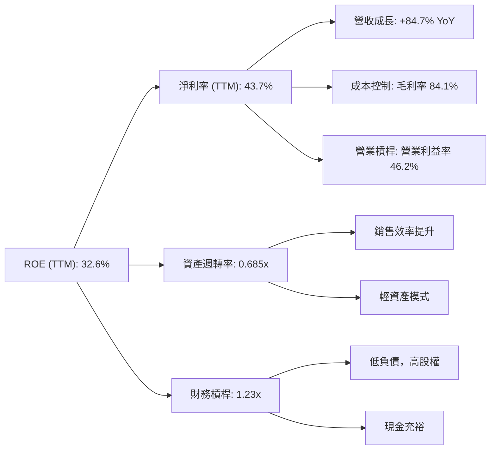
*   **淨利率 (Net Profit Margin)**：TTM 達到 43.7%，是 ROE 的主要貢獻者。這得益於 Palantir 強勁的營收成長、高毛利率和營業槓桿效應。
*   **資產週轉率 (Asset Turnover)**：基於 TTM 營收 $5.22B 和 FY24-FY25 平均資產 ($8.90B + $6.34B)/2 = $7.62B，資產週轉率約為 0.685x。對於一家軟體公司而言，這是一個健康的數字，反映了其高效的資產利用。
*   **財務槓桿 (Financial Leverage)**：基於 FY24-FY25 平均資產 $7.62B 和平均股東權益 ($7.39B + $5.00B)/2 = $6.195B，財務槓桿約為 1.23x。這是一個非常低的財務槓桿，表明公司幾乎沒有依賴債務融資，主要依靠股權和留存收益，財務風險極小。

**結論**：Palantir 的高 ROE 主要由其卓越的淨利率驅動，輔以健康的資產週轉率和極低的財務槓桿。這表明公司的盈利能力是建立在強大的營運效率之上，而非過度依賴財務槓桿。

### 6.4 獲利能力儀表板

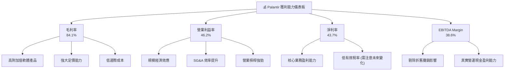
*   **高毛利率 (84.1%)** 證明了 Palantir 軟體產品的核心價值和技術壁壘，使其能夠在提供解決方案的同時保持高利潤空間。
*   **營業利益率 (46.2%) 和淨利率 (43.7%) 的顯著提升**，顯示公司在營收快速增長的同時，有效控制了營運費用，並從規模經濟中受益。這也證明了其業務模式的強大營業槓桿。
*   **EBITDA Margin (38.6%)** 則更能反映公司在扣除非現金支出前的營運盈利能力，表明核心業務的現金創造能力非常強勁。

---

## 7. 估值深度分析

Palantir 憑藉其獨特的業務模式和強勁的成長潛力，在市場上享有較高的估值。本章將通過與同業的比較、歷史區間分析以及情境化 DCF 模型，全面評估其估值合理性。

### 7.1 同業估值比較表格

為更好地評估 Palantir 的估值，我們將其與兩家大型企業軟體和雲服務領域的競爭對手進行比較：Salesforce (CRM) 和 Microsoft (MSFT)。這兩家公司在企業級軟體、數據分析和 AI 領域與 Palantir 存在一定重疊。

| 估值指標 | **PLTR** | **Salesforce (CRM)** | **Microsoft (MSFT)** | 本公司評估 |
|----------|----------|----------------------|----------------------|-----------|
| **Trailing P/E** | 142.46x | ~50-60x | ~35-40x | 🔴 較高 |
| **Forward P/E** | **60.54x** | ~25-30x | ~25-30x | 🔴 較高 |
| **P/S Ratio (TTM)** | **58.18x** | ~8-10x | ~12-15x | 🔴 極高 |
| **EV / EBITDA (TTM)** | **146.78x** | ~25-30x | ~20-25x | 🔴 極高 |
| **FCF Yield (TTM)** | **0.58%** | ~2-3% | ~2-3% | 🔴 較低 |
| **營收 YoY 成長 (TTM)** | **84.7%** | ~10-15% | ~15-20% | 🟢 極高 |
| **淨利率 (TTM)** | **43.7%** | ~15-20% | ~30-35% | 🟢 優異 |

*註：競爭對手估值倍數為分析師根據市場普遍數據估算，可能因具體報告日期和市場情緒而異。*

**本公司評估**：
Palantir 的估值倍數，無論是 P/E、P/S 還是 EV/EBITDA，都顯著高於 Salesforce 和 Microsoft。例如，其 Forward P/E 為 60.54x，而競爭對手約在 25-30x。P/S 更是高達 58.18x，遠超競爭對手的個位數或十幾倍。

這種高估值反映了市場對 Palantir 卓越成長潛力（TTM 營收 YoY 84.7% 遠超競爭對手）和其在 AI 數據分析領域獨特地位的期待。儘管淨利率表現優異，但其 FCF Yield 0.58% 較低，也說明市場給予了高估值，導致現金流回報率相對較低。

**結論**：Palantir 的估值無疑是昂貴的。然而，對於一家在關鍵任務軟體和 AI 領域擁有強大護城河、實現爆炸性營收和盈利增長的公司，高估值在一定程度上是合理的。投資者需要權衡其高成長和未來潛力是否足以支撐當前估值，並關注其成長率能否持續維持高位。

### 7.2 歷史估值區間分析

Palantir 的股價在過去 24 個月經歷了大幅波動，其 P/E 倍數也隨之變動。

```
╔══════════════════════════════════════════════════════════════════╗
║              PLTR 歷史 P/E 區間與當前位置（TTM P/E）             ║
╠══════════════════════════════════════════════════════════════════╣
║                                                                  ║
║  歷史高點 P/E (約 2025-10)   ~225x  ███████████████████████████████░░░░░░░░░░░░░░░░  🔴  ║
║  歷史中位 P/E (近12月)       ~150x  ██████████████████████░░░░░░░░░░░░░░░░░░░░░░░░░░░░  🟡  ║
║  歷史低點 P/E (約 2024-07)   ~30x   ████████░░░░░░░░░░░░░░░░░░░░░░░░░░░░░░░░░░░░░░░░░░  🟢  ║
║  當前 P/E (TTM)              142.46x ████████████████████░░░░░░░░░░░░░░░░░░░░░░░░░░░░░  🟡  ║
║                                                                  ║
║                   |      |      |      |      |                  ║
║                   0     50x   100x   150x   200x                   ║
║                                                                  ║
║  📊 結論：當前 P/E 位於歷史中高區間，反映市場對未來成長的樂觀預期。║
╚══════════════════════════════════════════════════════════════════╝
```
Palantir 的 TTM P/E 142.46x 位於其過去 24 個月歷史區間的中高位。這表明在經歷了 2024 年下半年的快速拉升和 2025 年的持續上漲後，市場對其盈利能力和成長前景的信心顯著增強。儘管從絕對值看仍然很高，但考慮到其從虧損轉為盈利，且盈利仍在爆發性增長，P/E 的分母 (EPS) 正在快速擴大，這使得 Forward P/E (60.54x) 相對 Trailing P/E 更具參考價值。當前估值反映了市場對其未來持續高成長的強烈預期。

### 7.3 情境目標價（假設驅動，Bear / Base / Bull）

我們將採用 Discounted Cash Flow (DCF) 模型和相對估值法相結合的方式，為 Palantir 估算未來 12 個月的目標價。以下是各情境的關鍵假設：

| 情境 | 營收 CAGR (未來5年) | 營業利潤率 (第5年) | 退出 EV/EBITDA 倍數 | 隱含目標價 | 相對現價 ($126.79) |
|------|---------------------|--------------------|---------------------|------------|--------------------|
| 🔴 悲觀 | 25% | 35% | 20x | $105 | -17.2% |
| 🟡 基準 | 35% | 45% | 30x | $183 | +44.3% |
| 🟢 樂觀 | 45% | 50% | 40x | $210 | +65.6% |

**估值倍數選擇說明**：
由於 Palantir 仍處於高成長階段，且其 GAAP 淨利潤在很大程度上受到股權薪酬等非現金費用的影響，P/E 倍數可能無法完全反映其真實的營運價值。因此，我們優先採用 **EV/EBITDA** 作為核心退出倍數，因為 EBITDA 更好地反映了公司核心業務的現金盈利能力，且剔除了資本結構和非現金折舊攤銷的影響。同時，結合了自由現金流的 DCF 模型，以提供更全面的估值視角。

### 7.4 DCF 敏感性分析（6格目標價矩陣）

DCF 模型的敏感性分析將考察兩個關鍵變量：WACC (加權平均資本成本) 和終端增長率 (Terminal Growth Rate)，以評估目標價在不同假設下的穩健性。

**假設條件**：
*   **WACC**：基準情境採用 13.09%，悲觀情境提高至 14.0%，樂觀情境降低至 12.0%。
*   **終端增長率 (Terminal Growth Rate)**：悲觀情境 3.0%，基準情境 4.0%，樂觀情境 5.0%。
*   **自由現金流預測**：基於上述營收 CAGR 和營業利潤率假設推導。

| 情境 | **WACC = 14.0%** | **WACC = 13.09%（基準）** | **WACC = 12.0%** |
|------|------------------|--------------------------|------------------|
| 🟢 **樂觀 (TGR 5.0%)** | **$195** (+53.8%) | **$210** (+65.6%) | **$228** (+79.8%) |
| 🟡 **基準 (TGR 4.0%)** | **$168** (+32.5%) | **$183** (+44.3%) | **$199** (+56.9%) |
| 🔴 **悲觀 (TGR 3.0%)** | **$95** (-25.1%) | **$105** (-17.2%) | **$115** (-9.2%) |

**分析**：
敏感性分析顯示，Palantir 的目標價對 WACC 和終端增長率的變化較為敏感，尤其是在悲觀情境下。這對於高成長型公司是常見的，因為其大部分價值來自於遠期現金流的貼現。在基準情境下，目標價為 $183，隱含 44.3% 的上漲空間。

### 7.5 估值綜合區間

綜合各種估值方法，我們得出 Palantir 的合理估值區間。

```
╔══════════════════════════════════════════════════════════════════╗
║                     PLTR 估值綜合區間                             ║
╠══════════════════════════════════════════════════════════════════╣
║                                                                  ║
║  樂觀情境目標價：  $210  █████████████████████████████████████████░░░░░░░░░░░░░░░░  🟢  ║
║  基準情境目標價：  $183  ██████████████████████████████████████░░░░░░░░░░░░░░░░░░░  🟡  ║
║  悲觀情境目標價：  $105  ████████████████████████░░░░░░░░░░░░░░░░░░░░░░░░░░░░░░░░░  🔴  ║
║                                                                  ║
║  當前股價：        $126.79  ████████████████████████████░░░░░░░░░░░░░░░░░░░░░░░░░░░  📈  ║
║                                                                  ║
║                   |      |      |      |      |                  ║
║                   0     50    100    150    200                    ║
║                                                                  ║
║  📊 結論：當前股價 $126.79 位於悲觀與基準情境之間，具有較好的上行空間。║
╚══════════════════════════════════════════════════════════════════╝
```
當前股價 $126.79 略高於悲觀情境目標價 ($105)，但與基準情境目標價 ($183) 仍有顯著差距，顯示出良好的上行空間。這表明市場已部分反映了其成長潛力，但尚未完全計入其在 AI 時代的長期爆發力。

---

## 8. 成長催化劑

Palantir 的未來成長將由多個短期、中期和長期催化劑共同驅動，這些因素將支持其營收和盈利的持續擴張。

### 8.1 催化劑時間軸

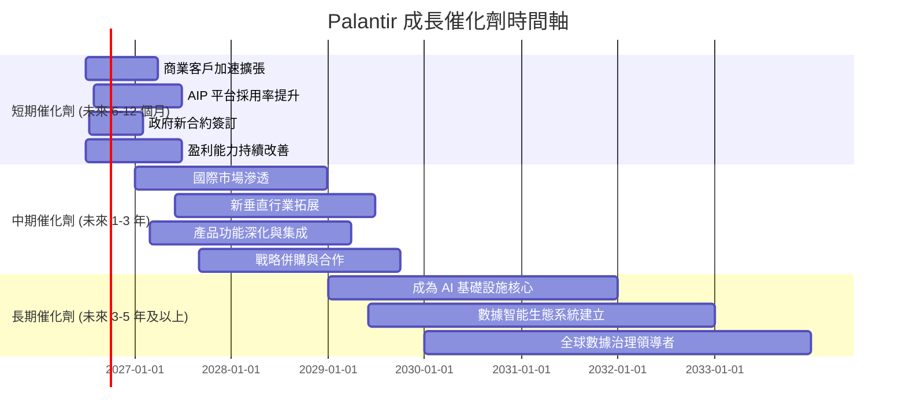

### 8.2 TAM 市場規模分析

Palantir 所處的市場巨大，且仍在快速增長。其可服務市場 (TAM) 涵蓋了多個高價值領域。

```
╔══════════════════════════════════════════════════════════════════╗
║                   PLTR 可服務市場 (TAM) 分析                    ║
╠══════════════════════════════════════════════════════════════════╣
║                                                                  ║
║  政府數據分析與國防科技市場：                                    ║
║  TAM 規模：約 $150B+ (全球)                                      ║
║  當前收入貢獻：FY25約 $2.4B                                      ║
║  滲透率：低至中等，仍有巨大增長空間。                            ║
║  潛力：全球地緣政治緊張，國防開支增加，對先進數據分析需求強勁。  ║
║                                                                  ║
║  商業企業 AI 與數據平台市場：                                    ║
║  TAM 規模：約 $500B+ (全球，且快速增長)                          ║
║  當前收入貢獻：FY25約 $2.0B                                      ║
║  滲透率：低，潛在客戶基數龐大。                                  ║
║  潛力：各行業對數據驅動決策和 AI 自動化需求爆炸式增長。          ║
║                                                                  ║
║  總計可服務市場 (TAM)：約 $650B+ (且持續擴大)                    ║
║  PLTR TTM 營收：$5.22B                                          ║
║  市場佔比：<1%                                                   ║
║                                                                  ║
║  📊 結論：Palantir 在其龐大的 TAM 中仍有巨大的滲透空間，特別是商業AI市場。║
╚══════════════════════════════════════════════════════════════════╝
```

### 8.3 成長驅動力結構圖

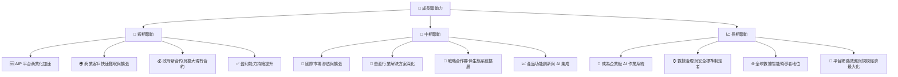
*   **短期驅動**：
    *   **AIP 平台商業化加速**：Palantir 的 AIP 平台正在快速獲得商業客戶的青睞，其能夠將生成式 AI 應用於企業實際問題，將是未來幾個季度營收增長的重要動力。
    *   **商業客戶快速獲取與擴張**：公司正積極擴大其商業客戶群，尤其是在美國市場，通過模塊化、易於部署的解決方案降低客戶入門門檻。Q1 2026 商業營收 YoY 增速應會非常亮眼。
    *   **政府新合約與擴大現有合約**：作為美國政府和盟友的關鍵技術供應商，地緣政治緊張局勢可能促使政府加大對先進數據分析和國防科技的投入，為 Palantir 帶來更多高價值長期合約。
    *   **盈利能力持續提升**：隨著營收規模擴大和營業槓桿效應，公司有望持續提升毛利率、營業利益率和淨利率，進一步鞏固其財務表現。
*   **中期驅動**：
    *   **國際市場滲透與擴張**：除了美國市場，Palantir 在歐洲、亞洲等國際市場的政府和商業客戶仍有巨大的拓展空間。
    *   **垂直行業解決方案深化**：公司將繼續深化其在醫療保健、製造、金融等特定垂直行業的解決方案，提供更具行業特性的產品，提升市場滲透率。
    *   **戰略合作夥伴生態系統擴展**：通過與雲服務提供商、系統集成商和行業專家建立戰略合作，擴大其產品的覆蓋範圍和影響力。
    *   **產品功能創新與 AI 集成**：持續的研發投入將確保其平台始終處於技術前沿，不斷集成最新的 AI 技術，滿足客戶日益複雜的需求。
*   **長期驅動**：
    *   **成為企業級 AI 作業系統**：Palantir 有潛力成為企業數據和 AI 應用的核心作業系統，為各行各業提供基礎設施級的數據智能服務。
    *   **數據治理與安全標準制定者**：憑藉其在處理敏感數據方面的經驗和技術，Palantir 有望在數據治理、安全和倫理方面扮演領導角色，為行業設定標準。
    *   **全球數據智能領導者地位**：通過持續創新和市場擴張，鞏固其在全球數據智能領域的領導地位。
    *   **平台網路效應與規模經濟最大化**：隨著客戶基數的擴大，平台將產生更強大的網路效應，進一步降低邊際成本，實現規模經濟的最大化。

---

## 9. 風險矩陣

投資 Palantir 伴隨著一系列潛在風險，這些風險可能影響其未來的業績和股價表現。本章將通過風險評分矩陣和詳細清單進行分析。

### 9.1 風險評分矩陣

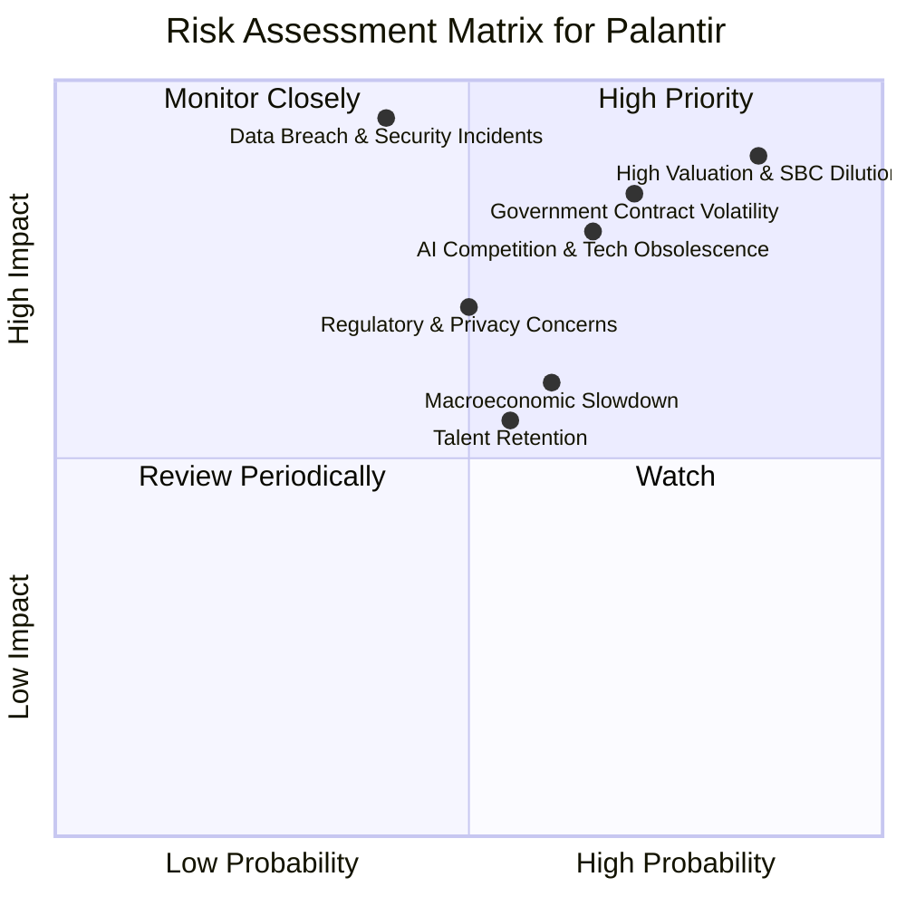

### 9.2 風險清單詳細分析

| # | 風險項目 | 發生機率 | 財務衝擊 | 風險評分 | 緩解措施 |
|---|----------|----------|----------|----------|----------|
| 1 | 🔴 **政府合約波動與地緣政治風險** | 高 (70%) | 高 (-10%至-20%營收) | 🔴 8.5/10 | **緩解措施**：積極拓展商業客戶，降低對單一客戶或政府部門的依賴；深化與現有政府客戶的長期合作，確保合約續簽；多元化地理市場，分散地緣政治風險。Palantir 正努力提高商業客戶佔比，以平衡收入結構。 |
| 2 | 🔴 **高估值與股權薪酬稀釋** | 高 (85%) | 高 (-15%至-30%股價修正) | 🔴 9.0/10 | **緩解措施**：持續保持高營收和盈利增長，以“成長消化估值”；管理層應逐步降低股權薪酬佔營收和營業現金流的比重；未來 FCF 充裕時可考慮股票回購，以抵消稀釋效應。市場需看到持續的超預期業績才能支撐高估值。 |
| 3 | 🟡 **AI 競爭加劇與技術迭代速度** | 中高 (65%) | 中高 (-5%至-10%市場份額/利潤率) | 🟡 8.0/10 | **緩解措施**：持續加大研發投入 (FY25 R&D $557.68M)，確保產品和技術的領先地位，尤其是在生成式 AI 領域；強化與客戶的深度合作，根據實際需求快速迭代產品；建立更廣泛的生態系統，提升客戶轉換成本。 |
| 4 | 🟡 **監管與數據隱私問題** | 中 (50%) | 中 (-5%營收或罰款) | 🟡 7.0/10 | **緩解措施**：嚴格遵守全球各地的數據隱私法規 (如 GDPR, CCPA)；投資於頂尖的數據安全技術和合規團隊；在產品設計中融入“隱私保護設計”原則；保持透明度，建立客戶和公眾信任。 |
| 5 | 🟡 **宏觀經濟放緩** | 中 (60%) | 中 (-5%至-10%商業客戶支出) | 🟡 6.0/10 | **緩解措施**：其政府業務具有一定的防禦性，可部分對沖商業業務風險；提供高 ROI 的解決方案，幫助客戶在經濟下行時提高效率，提升產品的剛需屬性；維持健康的資產負債表，以應對潛在的經濟衝擊。 |
| 6 | 🟡 **人才流失與競爭** | 中 (55%) | 中 (-5%研發效率或產品延遲) | 🟡 5.5/10 | **緩解措施**：提供有競爭力的薪酬和股權激勵，改善企業文化；建立清晰的職業發展路徑，吸引和留住頂尖 AI 和軟體工程師；通過內部培養和外部招聘，建立多元化的人才梯隊。 |
| 7 | 🔴 **數據洩露與安全事件** | 低 (40%) | 極高 (-20%營收、品牌受損、法律訴訟) | 🔴 9.5/10 | **緩解措施**：作為數據安全和分析公司，其自身的安全性至關重要。需持續投資於最先進的網絡安全防禦系統；定期進行安全審計和滲透測試；建立完善的事件響應計劃；嚴格的內部數據訪問控制和員工培訓。 |

---

## 10. 投資建議

綜合 Palantir 的基本面、成長前景、獲利能力、財務健康和估值分析，我們對其長期投資價值持樂觀態度。

### 10.1 最終綜合評級雷達圖

```
╔══════════════════════════════════════════════════════════════════╗
║                PLTR 綜合評級雷達圖 (1-10分)                       ║
╠══════════════════════════════════════════════════════════════════╣
║ 基本面強度  8.5 ▓▓▓▓▓▓▓▓▓▓▓▓▓▓▓▓▓░░░  ★★★★☆           ║
║ 成長動能    9.0 ▓▓▓▓▓▓▓▓▓▓▓▓▓▓▓▓▓▓░░  ★★★★★           ║
║ 獲利品質    8.5 ▓▓▓▓▓▓▓▓▓▓▓▓▓▓▓▓▓░░░  ★★★★☆           ║
║ 財務健康    9.5 ▓▓▓▓▓▓▓▓▓▓▓▓▓▓▓▓▓▓▓▓  ★★★★★           ║
║ 估值合理性  6.0 ▓▓▓▓▓▓▓▓▓▓▓▓░░░░░░░░  ★★★☆☆           ║
║ 護城河深度  8.5 ▓▓▓▓▓▓▓▓▓▓▓▓▓▓▓▓▓░░░  ★★★★☆           ║
║ 管理層執行  8.0 ▓▓▓▓▓▓▓▓▓▓▓▓▓▓▓▓░░░░  ★★★★☆           ║
║ 技術創新力  9.0 ▓▓▓▓▓▓▓▓▓▓▓▓▓▓▓▓▓▓░░  ★★★★★           ║
╠══════════════════════════════════════════════════════════════════╣
║ 綜合總分    8.2 ▓▓▓▓▓▓▓▓▓▓▓▓▓▓▓▓░░░░  🏆 建議「買入」            ║
╚══════════════════════════════════════════════════════════════════╝
```

### 10.2 目標價與隱含報酬率

我們對 Palantir 的未來 12 個月目標價進行加權平均，得出最終建議。

| 情境 | 目標價 | 隱含報酬率 | 機率權重 | 加權目標價 |
|------|--------|------------|----------|------------|
| 🔴 悲觀 | $105 | -17.2% | 20% | $21.0 |
| 🟡 基準 | $183 | +44.3% | 60% | $109.8 |
| 🟢 樂觀 | $210 | +65.6% | 20% | $42.0 |
| **加權平均** | **$172.8** | **+36.3%** | **100%** | **$172.8** |

**最終建議目標價 (12個月)**：$173 （基於加權平均值，較現價 $126.79 有 36.3% 的上漲空間）。

### 10.3 買入時機與觸發因素

```
╔══════════════════════════════════════════════════════════════════╗
║                  ✅ 買入觸發因素 Checklist                      ║
╠══════════════════════════════════════════════════════════════════╣
║                                                                  ║
║  立即買入觸發條件（多數符合）：                                  ║
║  ✅ 公司核心業務（政府或商業）營收成長持續超越預期 (Q1 2026 YoY 84.71%)║
║  ✅ 營業利益率和淨利率持續擴張，顯示營業槓桿效應 (TTM 淨利率 43.7%)║
║  ✅ 自由現金流保持強勁增長，FCF 轉換率維持高位 (TTM FCF $1.75B)  ║
║  ✅ 股權薪酬佔營收比重持續下降，稀釋影響減輕 (FY25 SBC/Revenue 15.27%)║
║  ✅ 股價在市場回調時，回落至 $120-$130 區間，提供更優入場點     ║
║                                                                  ║
║  加碼觸發條件（出現以下任一）：                                  ║
║  ☐ AIP 平台獲得大型商業客戶簽約或顯著擴大應用場景                ║
║  ☐ 獲得新的大型政府長期合約，且總金額超預期                      ║
║  ☐ 管理層明確表示將啟動股票回購計劃，以抵消稀釋                  ║
║  ☐ 估值倍數 (Forward P/E 或 EV/EBITDA) 相較同業出現明顯折價     ║
║                                                                  ║
║  減碼/停損觸發條件（出現以下任一）：                             ║
║  ☐ 核心業務成長率連續兩季 < 30% YoY                             ║
║  ☐ 營業利益率較峰值收縮 > 5 pp                                   ║
║  ☐ 自由現金流轉負或 FCF 轉換率 < 50%                            ║
║  ☐ ROIC 跌破 WACC，表明價值創造能力惡化                         ║
║  ☐ 關鍵成長投資（如 AI/新業務）無法在 2 期內變現或進展緩慢     ║
╚══════════════════════════════════════════════════════════════════╝
```

### 10.4 投資人適配度分析

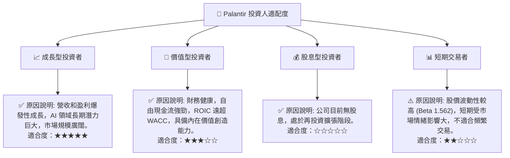
Palantir 最適合**成長型投資者**，尤其那些相信數據智能和 AI 將重塑企業運營，並願意為長期高成長潛力支付較高估值的投資者。其強勁的基本面和技術領先地位為長期持有提供了堅實基礎。對於**價值型投資者**而言，雖然其估值偏高，但其強大的自由現金流和 ROIC 顯示其內在價值創造能力，若股價出現大幅調整則可考慮。

### 10.5 每季財報監控清單（Quarterly Watch List）

| 監控指標 | 關鍵關注點 | 觸發加碼門檻 | 觸發減碼門檻 |
|----------|------------|--------------|--------------|
| **總營收 YoY 成長** | 商業與政府業務增速，AIP 貢獻 | >40% | <25% |
| **商業客戶營收 YoY 成長** | 商業業務拓展速度，客戶數量增長 | >50% | <30% |
| **營業利益率** | 規模經濟效應，費用控制 | >40% | <35% |
| **自由現金流 (FCF)** | 現金生成能力，盈利質量 | FCF YoY >50% | FCF 轉負 |
| **股權薪酬 (SBC) / 營收** | 股東稀釋程度 | <10% | >20% |
| **客戶續約率 / 擴張率** | 客戶黏性，平台價值 | >120% | <100% |
| **新合約簽訂價值與數量** | 市場拓展動能 | 超出分析師預期 | 顯著低於預期 |
| **管理層財測** | 對未來業績的信心 | 上調全年營收/盈利指引 | 下調全年營收/盈利指引 |
| **AI 產品進展** | AIP 平台功能更新，客戶成功案例 | 領先競爭對手，市場反響積極 | 創新停滯，競爭力下降 |

### 10.6 反面論證：什麼會證明論點錯誤（What Would Change My Mind）

```
╔══════════════════════════════════════════════════════════════════╗
║              ⚠️ 論點失效條件（Disconfirming Evidence）           ║
╠══════════════════════════════════════════════════════════════════╣
║  本投資論點在下列情況成立時應重新檢視或退出：                    ║
║  ☐ 核心業務（政府或商業）營收成長率連續兩季 < 25% YoY            ║
║  ☐ 營業利益率較峰值 (46.2%) 收縮 > 10 pp，且無合理解釋            ║
║  ☐ 自由現金流轉負，或 FCF 轉換率連續兩季 < 50%                  ║
║  ☐ ROIC 跌破 WACC (13.09%)，表明公司不再創造經濟價值            ║
║  ☐ 股權薪酬 (SBC) 佔營收比重連續兩季回升至 > 20%               ║
║  ☐ 關鍵成長投資（如 AIP 平台）無法在 4 個季度內變現或客戶採用率停滯║
║  ☐ 發生重大數據洩露或其他安全事件，導致客戶大量流失              ║
╚══════════════════════════════════════════════════════════════════╝
```

---

> **免責聲明**：本報告為 AI 自動生成，僅供研究參考，不構成投資建議。投資有風險，入市需謹慎。