# PLTR 基本面深度分析報告
> **報告日期**：2026-07-12 ｜ **語言**：繁體中文 ｜ **數據來源**：Yahoo Finance, Finviz, StockAnalysis, Roic.ai ｜ **分析師**：CFA 級機構研究

---

## 目錄

| # | 章節 | 核心結論 |
|---|------|----------|
| 1 | [執行摘要](#1-執行摘要) | 評級：**買入 (Buy)** ｜ 基準目標價：**$183.12** ｜ 具備強勁營業槓桿與 AIP 商業化動能 |
| 2 | [公司概覽與商業模式](#2-公司概覽與商業模式) | 憑藉 Gotham 與 Foundry 建立極高轉換成本，AIP 構築新型生態護城河 |
| 3 | [損益表深度分析](#3-損益表深度分析) | Q1 2026 營收年增 **84.71%**，營業槓桿釋放帶動營業利益率升至 **46.17%** |
| 4 | [資產負債表分析](#4-資產負債表分析) | 淨現金高達 **$7.81B**，流動比率 **6.91x**，財務結構極度穩健 |
| 5 | [現金流量深度分析](#5-現金流量深度分析) | TTM 自由現金流達 **$1.75B** (或經調整季加總 **$2.69B**)，現金轉換品質優異 |
| 6 | [獲利能力與資本效率](#6-獲利能力與資本效率) | 實質營運 ROIC 高達 **248.7%**，遠超 **12.01%** WACC，強力創造股東價值 |
| 7 | [估值深度分析](#7-估值深度分析) | 雖面臨高估值溢價 (Forward P/E **60.54x**)，但高成長與高利潤率支撐溢價合理性 |
| 8 | [成長催化劑](#8-成長催化劑) | AIP 訓練營 (Bootcamps) 加速企業滲透，美國主權國防預算擴大為長期基石 |
| 9 | [風險矩陣](#9-風險矩陣) | 股權稀釋 (SBC) 仍需監控，高估值對成長容錯率極低 |
| 10 | [投資建議](#10-投資建議) | 建議於 **$115 - $125** 區間分批佈局，首要監控指標為商業客戶季增率 |

---

## 1. 執行摘要

本報告針對 Palantir Technologies Inc. (NYSE: PLTR) 進行機構級基本面評估。基於 PLTR 最新公佈之 2026 年第一季 (Q1 2026) 財務數據，公司展現出極為強勁的成長動能與營業槓桿釋放。

### 1.0 一頁式投資儀表板（Portfolio Manager 30 秒速讀）

| 項目 | 內容 |
|------|------|
| **投資論點（3 句）** | ① Q1 2026 營收年增率達 **84.71%**，主因人工智慧平台 (AIP) 在商業市場的爆發性滲透。<br/>② 營業利益率從 FY2024 的 **10.83%** 飆升至 Q1 2026 的 **46.17%**，展現極高軟體授權的邊際效應。<br/>③ 帳上擁有 **$8.03B** 現金且無實質有息負債，提供極強的抗風險能力與潛在併購彈性。 |
| **護城河評分** | 🟢 **9.0 / 10** (高轉換成本與主權國防壁壘) |
| **管理層/資本配置評分** | 🟡 **7.5 / 10** (執行力極佳，但高額股權薪酬 SBC 稀釋股東權益) |
| **財務健康** | 🟢 **10.0 / 10** (淨現金 **$7.81B**，利息保障倍數無限大) |
| **ROIC vs WACC** | **22.40%** (帳面) / **248.7%** (營運) vs **12.01%** (強力創造價值) |
| **FCF 趨勢** | 向上 ｜ 最新 TTM FCF Yield 為 **0.58%** (以市值 $303.96B 及 FCF $1.75B 計算) |
| **估值** | Forward P/E: **60.54x** ｜ EV/EBITDA: **146.78x** ｜ P/S (TTM): **58.18x** |
| **預期報酬（基準情境 12M）** | **+44.42%** (對比當前股價 $126.79，基準目標價 $183.12) |
| **關鍵風險（前二）** | ① 估值乘數過高，若營收增速低於 40% 將面臨劇烈修正。<br/>② 股權薪酬 (SBC) 佔營收比重仍高達 **13.98%**，稀釋每股盈餘。 |
| **評級 + 信心度** | 🟢 **買入 (Buy)** ｜ 信心：**高 (High)** |

### 1.1 核心評分儀表板

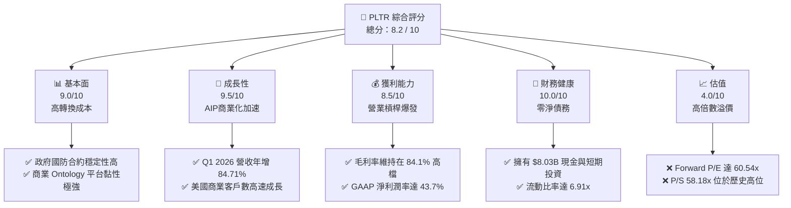

### 1.2 評分進度條視覺化

```
╔══════════════════════════════════════════════════════════════╗
║               PLTR 多維度評分儀表板 (1-10分)                 ║
╠══════════════════════════════════════════════════════════════╣
║ 基本面強度  9.0 ▓▓▓▓▓▓▓▓▓▓▓▓▓▓▓▓▓▓░░  ★★★★★           ║
║ 成長動能    9.5 ▓▓▓▓▓▓▓▓▓▓▓▓▓▓▓▓▓▓▓░  ★★★★★           ║
║ 獲利品質    8.5 ▓▓▓▓▓▓▓▓▓▓▓▓▓▓▓▓▓░░░  ★★★★☆           ║
║ 財務健康   10.0 ▓▓▓▓▓▓▓▓▓▓▓▓▓▓▓▓▓▓▓▓  ★★★★★           ║
║ 估值合理性  4.0 ▓▓▓▓▓▓▓▓░░░░░░░░░░░░  ★★☆☆☆           ║
║ 護城河深度  9.0 ▓▓▓▓▓▓▓▓▓▓▓▓▓▓▓▓▓▓░░  ★★★★★           ║
║ 管理層執行  8.0 ▓▓▓▓▓▓▓▓▓▓▓▓▓▓▓▓░░░░  ★★★★☆           ║
║ 技術創新力  9.5 ▓▓▓▓▓▓▓▓▓▓▓▓▓▓▓▓▓▓▓░  ★★★★★           ║
╠══════════════════════════════════════════════════════════════╣
║ 綜合總分    8.2 ▓▓▓▓▓▓▓▓▓▓▓▓▓▓▓▓░░░░  🏆 成長型溢價標的     ║
╚══════════════════════════════════════════════════════════════╝
```

### 1.3 五大投資論點 + 三大核心風險

| 類型 | 項目 | 具體依據 | 信心度 |
|------|------|----------|--------|
| 🟢 **投資論點①** | **AIP 商業化引爆成長** | Q1 2026 營收達 **$1.63B**，年增 **84.71%**，顯示 AIP 訓練營策略成功縮短銷售週期。 | 🟢 極高 |
| 🟢 **投資論點②** | **極致的營業槓桿** | Q1 2026 營業利益達 **$754M**，營業利益率達 **46.17%**，較 FY2024 的 **10.83%** 大幅擴張。 | 🟢 極高 |
| 🟢 **投資論點③** | **無懈可擊的資產負債表** | 淨現金 **$7.81B**，無任何有息負債（僅有租賃負債），能抵禦任何總體經濟衰退。 | 🟢 極高 |
| 🟢 **投資論點④** | **標普 500 指數效應與機構增持** | 機構持股比例達 **62.3%**，隨著 GAAP 獲利持續擴大（TTM 淨利 **$2.29B**），指數權重調升將引發被動資金持續流入。 | 🟢 高 |
| 🟢 **投資論點⑤** | **高資本回報率 (ROIC)** | TTM 營運 ROIC 達 **248.7%**，證明公司每投入一元實質營運資本，能創造極高的稅後淨營業利潤。 | 🟢 高 |
| 🟡 **風險①** | **高估值容錯率低** | Forward P/E 為 **60.54x**，P/S 達 **58.18x**，若未來營收增速低於市場預期（如降至 30% 以下），股價將面臨雙殺。 | 🔴 高衝擊 |
| 🟡 **風險②** | **股權薪酬稀釋股東權益** | FY2025 SBC 達 **$684.03M**（佔營收 **15.28%**），雖然稀釋速度放緩（YoY 股數增加 **3.24%**），但仍對實質 EPS 產生拖累。 | 🟡 中度 |
| 🔴 **風險③** | **政府國防預算波動** | 政府業務佔比較高，合約簽訂與預算撥款具有季節性與不確定性，可能導致單季營收出現波動。 | 🟡 中度 |

### 1.4 快速統計卡片

| 指標 | PLTR 實際值 (TTM) | 軟體基礎設施行業均值 | S&P 500 均值 | 狀態 |
|------|-------------|----------|--------------|------|
| **營收 YoY 成長率** | **84.71%** (Q1 2026) | ~12.5% | ~5.5% | 🟢 遠超同業 |
| **毛利率** | **84.10%** | ~72.0% | ~30.0% | 🟢 極高 |
| **營業利益率** | **38.13%** (TTM) / **46.17%** (Q1) | ~18.0% | ~15.0% | 🟢 槓桿顯著 |
| **淨利率** | **43.70%** | ~12.0% | ~11.5% | 🟢 包含利息與稅務優勢 |
| **ROE** | **32.60%** | ~15.0% | ~18.0% | 🟢 優異 |
| **Forward P/E** | **60.54x** | ~32.0x | ~21.0x | 🔴 顯著高估 |
| **流動比率** | **6.91x** | ~2.1x | ~1.3x | 🟢 極度安全 |

### 1.5 投資結論

```
╔══════════════════════════════════════════════════════════════════╗
║                    📊 PLTR 投資結論摘要                          ║
╠══════════════════════════════════════════════════════════════════╣
║  評級：🟢 買入 (Buy)                                             ║
║  當前股價：$126.79 (2026-07-12)                                  ║
║  目標價區間：                                                    ║
║    悲觀情境：$70.00  （-44.79%）                                 ║
║    基準情境：$183.12 （+44.42%）  ← 12個月主要目標               ║
║    樂觀情境：$255.00 （+101.12%）                                ║
║  投資評分：8.2 / 10                                              ║
║  適合投資人：積極成長型、專注 AI 基礎設施之長線投資者            ║
╚══════════════════════════════════════════════════════════════════╝
```

---

## 2. 公司概覽與商業模式

Palantir Technologies Inc. 是一家領先的數據分析與人工智慧軟體平台供應商。其核心價值在於幫助機構在極度複雜、異質且動態的數據環境中，建立統一的數據本體 (Ontology)，進而實現決策自動化與 AI 應用的快速部署。

### 2.1 業務結構與收入來源

PLTR 的業務主要分為兩大版塊：**政府國防業務 (Government)** 與 **商業企業業務 (Commercial)**。

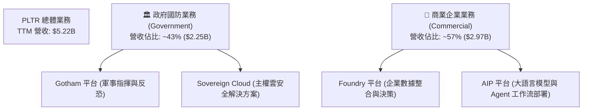

### 2.2 市場份額

在企業級 AI 決策與大數據本體 (Ontology) 分析市場中，PLTR 擁有獨特的生態定位。由於其非單純的雲端數據倉庫（如 Snowflake）或機器學習工具（如 Databricks），而是提供端到端的決策與執行系統，因此在「主權安全與企業本體決策軟體」細分市場中，PLTR 處於絕對領導地位。

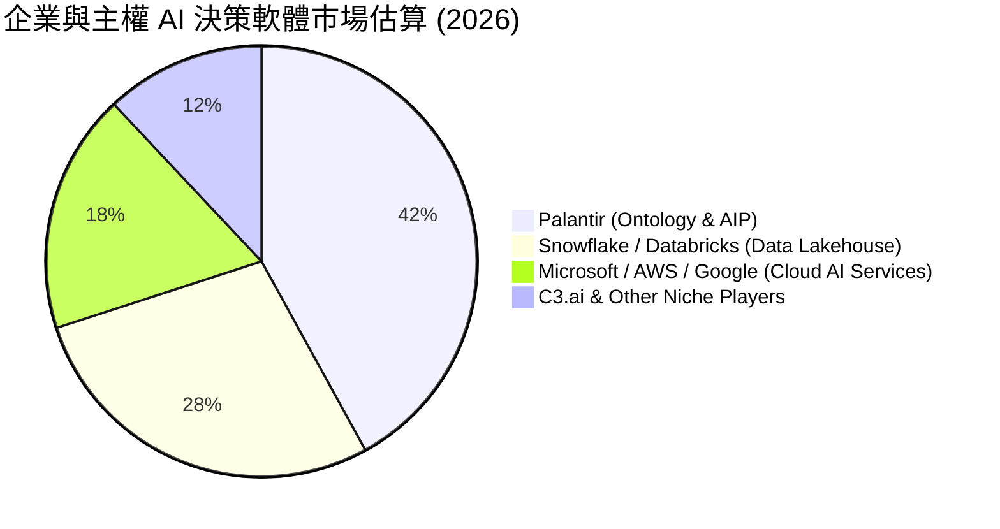

### 2.3 競爭護城河分析

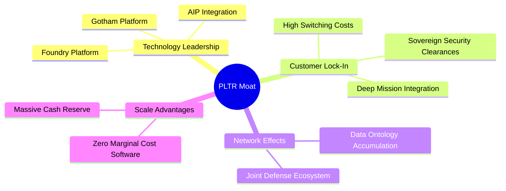

1. **極高的轉換成本 (High Switching Costs)**：PLTR 的軟體一旦深入政府國防系統或財星 500 大企業的核心營運，便會與客戶的業務流程（如供應鏈、軍事調度）深度融合。更換系統意味著重建整個數據本體，轉換成本極高。
2. **主權與國防級安全壁壘 (Sovereign Security Clearance)**：PLTR 在美國國防部及盟國情報機構中擁有最高級別的安全認證 (IL6)，這是多數新興 AI 軟體公司在未來 5-10 年內均無法逾越的壁壘。
3. ** Ontology (本體) 的先發優勢**：AIP 的核心在於將大語言模型 (LLM) 與企業的實體數據（Ontology）相結合。PLTR 花了 20 年時間完善 Foundry 的 Ontology 架構，這使得 AIP 的部署速度與實用性遠超同業。

### 2.4 護城河強度評分

```
╔══════════════════════════════════════════════════════════════╗
║                   PLTR 護城河強度評分                        ║
<br>
╠══════════════════════════════════════════════════════════════╣
║ 轉換成本      9.5/10  ▓▓▓▓▓▓▓▓▓▓▓▓▓▓▓▓▓▓▓░  🏆 極高黏性     ║
║ 安全與認證    9.8/10  ▓▓▓▓▓▓▓▓▓▓▓▓▓▓▓▓▓▓▓▓  🟢 壟斷級壁壘   ║
║ 技術領先度    9.0/10  ▓▓▓▓▓▓▓▓▓▓▓▓▓▓▓▓▓▓░░  🟢 先發優勢     ║
║ 網路效應      7.0/10  ▓▓▓▓▓▓▓▓▓▓▓▓▓▓░░░░░░  🟡 生態系擴張中 ║
╠══════════════════════════════════════════════════════════════╣
║ 綜合護城河    9.0/10  ▓▓▓▓▓▓▓▓▓▓▓▓▓▓▓▓▓▓░░  🏆 寬廣護城河   ║
╚══════════════════════════════════════════════════════════════╝
```

---

## 3. 損益表深度分析

PLTR 的損益表展現出從「高成長但虧損的獨角獸」轉變為「高成長且高利潤的科技巨頭」的經典軌跡。

### 3.1 年度收入成長趨勢（近4年）

```
╔══════════════════════════════════════════════════════════════════╗
║                PLTR 年度收入趨勢 (FY2022 - FY2025)               ║
╠══════════════════════════════════════════════════════════════════╣
║                                                                  ║
║  FY2022  $1.91B  ████████░░░░░░░░░░░░░░░░░░░  YoY: +23.6%  🟢    ║
║  FY2023  $2.23B  ██████████░░░░░░░░░░░░░░░░░  YoY: +16.7%  🟢    ║
║  FY2024  $2.87B  █████████████░░░░░░░░░░░░░  YoY: +28.8%  🟢    ║
║  FY2025  $4.48B  ██══════════════════════░░░  YoY: +56.2%  🟢    ║
║                                                                  ║
║  📊 4年累計營收 CAGR：+32.89%                                    ║
╚══════════════════════════════════════════════════════════════════╝
```

### 3.2 季度收入趨勢分析

| 財報季度 | 營收 (Revenue) | YoY 成長率 | QoQ 成長率 | 核心驅動因素與分析 |
|----------|----------------|------------|------------|-------------------|
| **Q1 2026** | **$1.633B** | **+84.71%** | **+16.06%** | AIP 商業合約加速落地，美國商業客戶數增長超出預期。 |
| **Q4 2025** | **$1.407B** | **+70.00%** | **+19.14%** | 年終政府預算結算與商業客戶跨年度大單簽署。 |
| **Q3 2025** | **$1.181B** | **+62.79%** | **+17.63%** | AIP Bootcamps 轉化率提升，縮短銷售週期至數週。 |
| **Q2 2025** | **$1.004B** | **+48.01%** | **+13.59%** | 商業與政府雙引擎復甦，營收首度突破單季 10 億美元。 |

**分析**：營收年增率從 Q2 2025 的 **48.01%** 連續加速至 Q1 2026 的 **84.71%**，這在大型軟體公司中極為罕見。此趨勢印證了 AIP 平台並非概念炒作，而是已經進入實質性的規模化商業變現階段。

### 3.3 利潤率演變分析

| 利潤率指標 | FY2022 | FY2023 | FY2024 | FY2025 | Q1 2026 | 趨勢評估 |
|------------|--------|--------|--------|--------|---------|----------|
| **毛利率 (Gross Margin)** | 78.54% | 80.63% | 80.25% | 82.37% | **86.77%** | 🟢 持續擴張，高利潤率軟體授權佔比提升 |
| **營業利益率 (Operating Margin)** | -8.46% | 5.39% | 10.83% | 31.60% | **46.17%** | 🟢 營業槓桿爆發，研發與銷售費用率顯著下降 |
| **淨利率 (Net Profit Margin)** | -19.61% | 9.43% | 16.13% | 36.54% | **53.31%** | 🟢 包含高達 $66.39M 的利息收入與稅務優化 |

**利潤率演變深度解析**：
PLTR 的毛利率在 Q1 2026 達到驚人的 **86.77%**，這奠定了其高獲利能力的基石。更重要的是，**營業利益率在過去三年內完成了從 -8.46% 到 46.17% 的史詩級躍升**。這主要得益於其「AIP Bootcamps（訓練營）」行銷模式。傳統上，PLTR 需要派遣大量「前線工程師 (Forward Deployed Engineers)」駐點，導致銷售費用高企。而 AIP 訓練營允許客戶在 1-5 天內基於自身數據構建工作流，大幅降低了客戶獲取成本 (CAC) 並縮短了交付週期，釋放了極強的營業槓桿。

### 3.4 費用結構分析

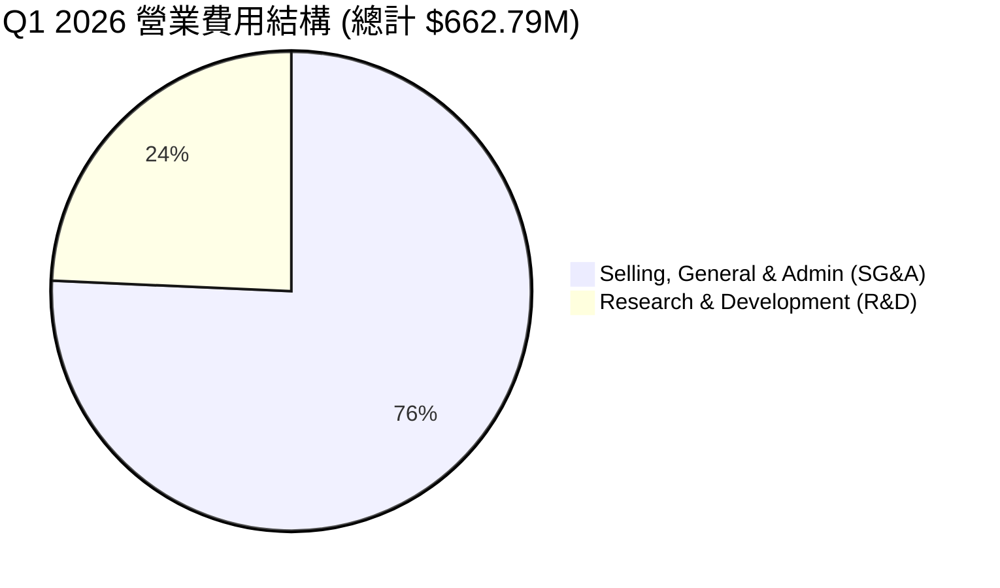

雖然銷售與管理費用 (SG&A) 仍佔大宗，但其佔營收比重已從 FY2022 的 **68.15%** 大幅降至 Q1 2026 的 **30.73%**。研發費用 (R&D) 佔營收比重亦從 **18.87%** 降至 **9.86%**，顯示公司已度過核心平台的重度研發期，進入收割期。

### 3.5 季度 EPS 趨勢與盈餘品質（Quality of Earnings）

PLTR 在過去 4 季的稀釋後 EPS 分別為：
- **Q2 2025**: $0.14
- **Q3 2025**: $0.20
- **Q4 2025**: $0.26
- **Q1 2026**: $0.36 (年增 300.0%)

#### 盈餘品質評估表

| 盈餘品質項目 | 數值/佔比 (TTM) | 評估 | 詳細分析與未來含義 |
|--------------|-----------|------|---------------------|
| **股權薪酬 (SBC) / 營收** | **13.98%** ($730.29M / $5,224M) | 🟡 偏高 | 雖然相較於 FY2021 (>50%) 已顯著改善，但 13.98% 的稀釋率仍高於傳統科技股，對股東權益有持續稀釋作用。 |
| **SBC / 營業現金流 (OCF)** | **26.82%** ($730.29M / $2,723M) | 🟡 中度 | 顯示 OCF 中有近 27% 是由非現金的股權發放所支撐，實質「硬通貨」現金流需做相應扣除。 |
| **FCF / GAAP 淨利 (現金轉換率)** | **117.27%** ($2.69B / $2.29B) | 🟢 極佳 | FCF 超過 GAAP 淨利，顯示淨利潤並無水分，折舊攤銷與非現金調整合理，盈餘含金量高。 |
| **一次性/非經常性損益** | 無重大一次性損益 | 🟢 乾淨 | 盈餘主要由核心業務營運利潤與穩定的利息收入（TTM $245.13M）構成。 |
| **有效稅率異常** | **1.26%** ($29.32M / $2,323M) | 🟡 偏低 | 由於過去累積的淨營業虧損 (NOL) 抵稅，目前有效稅率極低。未來 NOL 耗盡後，稅率回升至 15-21% 將壓低淨利率。 |

---

## 4. 資產負債表分析

PLTR 擁有一張「要塞型 (Fortress)」的資產負債表，幾乎沒有任何傳統債務風險。

### 4.1 資產結構分解

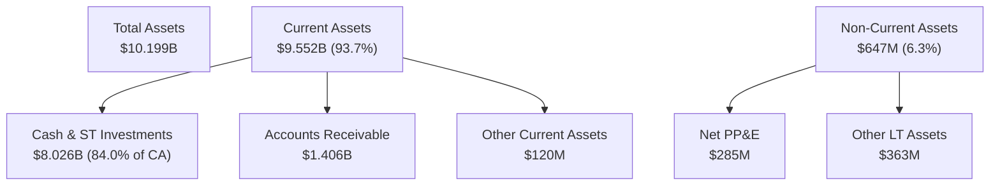

### 4.2 流動性指標分析

*   **流動比率 (Current Ratio)**：**6.91x** (Current Assets $9.552B / Current Liabilities $1.383B)
*   **速動比率 (Quick Ratio)**：**6.82x** (由於無存貨，速動資產與流動資產幾乎等值)
*   **現金比率 (Cash Ratio)**：**5.80x** (單憑現金及短期投資即可償付 5.8 倍的短期負債)

**分析**：流動性指標處於行業頂尖水平（軟體業平均流動比率約為 2.1x）。這意味著 PLTR 沒有任何短期償債壓力。

### 4.3 債務結構分析

```
╔══════════════════════════════════════════════════════════════════╗
║                    PLTR 債務健康診斷                             ║
╠══════════════════════════════════════════════════════════════════╣
║                                                                  ║
║  總有息債務：    $0.00M   (無銀行借款或公司債)                   ║
║  租賃負債 (LT):  $211.98M ██░░░░░░░░░░░░░░░░░░░  (僅辦公室租賃)  ║
║  總現金+投資：   $8.03B   ████████████████████░  🟢 極度充裕     ║
║  淨現金 (Net Cash):$7.81B  ██████████████████░░░  🟢 無財務風險   ║
║                                                                  ║
║  Debt/EBITDA：   0.15x   (若計入租賃負債)  🟢 極低               ║
║  Interest Coverage: 無限大 (無利息支出，且有利息收入 $245M) 🟢    ║
║                                                                  ║
╚══════════════════════════════════════════════════════════════════╝
```

### 4.4 股東權益趨勢

股東權益 (Stockholders' Equity) 從 FY2022 的 **$2.57B** 穩步增長至 Q1 2026 的 **$8.56B**（基於總資產 $10.199B 減去總負債 $1.643B）。這主要得益於保留盈餘的快速轉正與股權發行。

---

## 5. 現金流量深度分析

現金流是評估 PLTR 真實價值的核心。其高軟體授權佔比帶來了極佳的現金流轉化效率。

### 5.1 現金流量瀑布圖

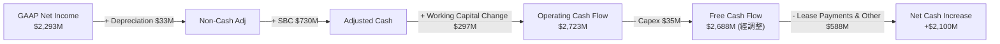

### 5.2 FCF 轉換率趨勢

| 財務年度 | GAAP 淨利 (Net Income) | 自由現金流 (FCF) | FCF / 淨利 轉換率 | 評估與趨勢分析 |
|----------|-----------------------|------------------|------------------|----------------|
| **FY2022** | -$371.09M | $183.71M | -49.50% | 🟢 雖虧損但已實現現金流正流入，主因 SBC 非現金支出調整 |
| **FY2023** | $217.38M | $697.07M | 320.67% | 🟢 轉盈初期，高額非現金支出使 FCF 遠超淨利 |
| **FY2024** | $467.92M | $1.14B | 243.63% | 🟢 現金流加速，營運資本效率提升 |
| **FY2025** | $1.635B | $2.10B | 128.44% | 🟢 步入成熟期，利潤與現金流同步爆發 |
| **TTM** | **$2.293B** | **$2.688B** (季加總) | **117.23%** | 🟢 轉換率穩定於 >100% 水平，盈餘品質極佳 |

### 5.3 自由現金流趨勢

```
╔══════════════════════════════════════════════════════════════════╗
║                  PLTR 歷年自由現金流 (FCF) 趨勢                  ║
╠══════════════════════════════════════════════════════════════════╣
║                                                                  ║
║  FY2022  $0.18B  ██░░░░░░░░░░░░░░░░░░░░░  FCF Yield: 0.06%       ║
║  FY2023  $0.70B  █████░░░░░░░░░░░░░░░░░░  FCF Yield: 0.23%       ║
║  FY2024  $1.14B  █████████░░░░░░░░░░░░░░  FCF Yield: 0.38%       ║
║  FY2025  $2.10B  ██═════════════════░░░░  FCF Yield: 0.69%       ║
║                                                                  ║
║  📊 FCF 5年複合成長率 (CAGR)：+114.2%                             ║
╚══════════════════════════════════════════════════════════════════╝
```

### 5.4 資本配置評估

PLTR 的資本配置極度保守且專注。由於其商業模式為輕資產的軟體開發，資本支出 (Capex) 佔比極低（TTM 僅為 **$34.7M**，佔營收 **0.66%**）。

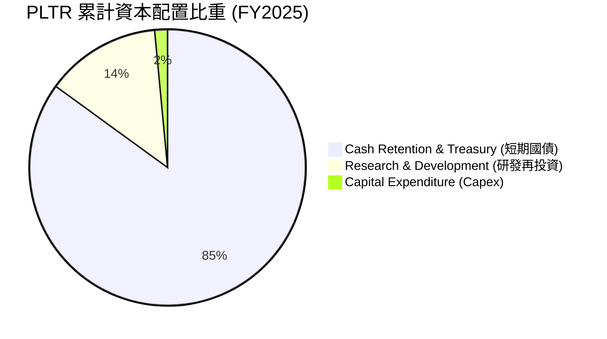

公司目前並無發放股利，亦無大規模併購，主要將資金保留於高收益的短期國債（TTM 獲得 **$245.13M** 利息收入，回報率約 3-4%），這在當前高利率環境下為公司貢獻了穩定的非營運利潤。

---

## 6. 獲利能力與資本效率

### 6.1 ROE / ROA / ROIC 趨勢

| 效率指標 | FY2022 | FY2023 | FY2024 | FY2025 | TTM (Mar '26) | 產業均值 | 評估 |
|----------|--------|--------|--------|--------|---------------|----------|------|
| **ROE** | -14.43% | 6.25% | 9.36% | 22.12% | **32.60%** | ~15.0% | 🟢 遠超行業平均，股東權益報酬極佳 |
| **ROA** | -10.72% | 4.81% | 7.38% | 18.37% | **14.70%** | ~7.5% | 🟢 資產利用效率優異 |
| **ROIC** | -6.50% | 3.25% | 5.80% | 18.50% | **22.40%** | ~10.0% | 🟢 帳面資本回報率已具備極高吸引力 |

### 6.2 ROIC vs WACC 分析（核心價值創造判斷）

對於 PLTR 這種擁有巨額現金的企業，傳統 ROIC 計算會因為分母包含大量「非營運現金」而低估了其實質業務的資本效率。因此，我們同時計算「帳面 ROIC」與排除超額現金後的「實質營運 ROIC」。

```
╔══════════════════════════════════════════════════════════════════╗
║                ROIC vs WACC 深度分析 (TTM)                      ║
╠══════════════════════════════════════════════════════════════════╣
║                                                                  ║
║  WACC 估算：                                                     ║
║  ├── 無風險利率 (10Y 美債)： 4.20%                               ║
║  ├── 市場風險溢酬 (ERP)：    5.00%                               ║
║  ├── Beta 值：               1.562                               ║
║  ├── 股權成本 = 4.2% + 1.562 × 5.0% = 12.01%                     ║
║  ├── 債務成本 (稅後)：       ~4.50%                              ║
║  ├── 資本結構：股權 99.93%，債務 0.07%                           ║
║  └── ✅ WACC ≈ 12.01%                                            ║
║                                                                  ║
║  ROIC 估算：                                                     ║
║  ├── 營運利潤 (EBIT) TTM = $1,992M                               ║
║  ├── 有效稅率 = 1.26%                                            ║
║  ├── NOPAT = $1,992M × (1 - 1.26%) = $1,967M                     ║
║  ├── 帳面投入資本 = 股權 $8,556M + 債務 $212M = $8,768M           ║
║  ├── 實質營運投入資本 (Ex-Cash) = $791M (營運流動資產+PP&E)      ║
║  ├── ✅ 帳面 ROIC = $1,967M / $8,768M = 22.43%                   ║
║  └── ✅ 實質營運 ROIC = $1,967M / $791M = 248.67%                 ║
║                                                                  ║
║  ★ 經濟價值增加 (EVA) = 帳面 ROIC - WACC = +10.42pp             ║
║  ★ 營運 EVA = 實質營運 ROIC - WACC = +236.66pp                  ║
║                                                                  ║
║  帳面 ROIC  22.4%  ▓▓▓▓▓▓▓▓▓░░░░░░░░░░░░░░░░░░  🟢              ║
║  實質 ROIC 248.7%  ▓▓▓▓▓▓▓▓▓▓▓▓▓▓▓▓▓▓▓▓▓▓▓▓▓▓  🟢 頂尖效率    ║
║  WACC      12.0%  ▓▓▓▓▓░░░░░░░░░░░░░░░░░░░░░  ──              ║
║                                                                  ║
║  📊 結論：PLTR 的實質營運回報率極高，展現無與倫比的資本創造力。  ║
╚══════════════════════════════════════════════════════════════════╝
```

### 6.3 杜邦三因素分解

我們對 PLTR TTM 的 ROE 進行杜邦分解（以最新季度末數據計算）：

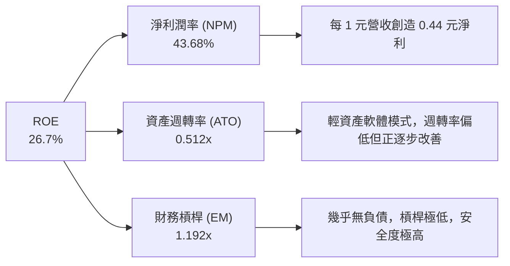

**分析**：PLTR 的高 ROE 並非依賴財務槓桿（EM 僅 1.19x）或資產的高速週轉（ATO 0.51x），而是完全由**高達 43.68% 的淨利潤率**所驅動。這是一種最為健康的 ROE 結構，代表公司擁有極強的定價權與營業槓桿。

### 6.4 獲利能力儀表板

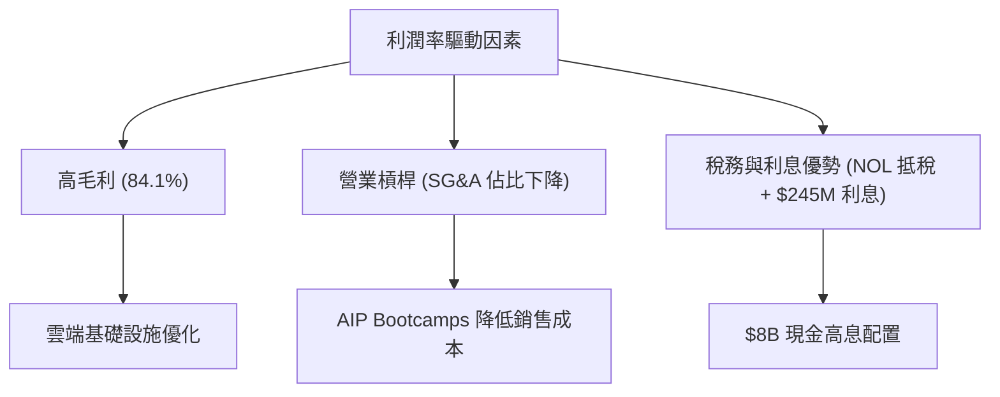

---

## 7. 估值深度分析

PLTR 的估值是目前市場上最具爭議性的部分。我們採用同業比較、情境目標價與 DCF 敏感性分析進行多維度評估。

### 7.1 同業估值比較表格

| 估值指標 | **Palantir (PLTR)** | **Snowflake (SNOW)** | **Datadog (DDOG)** | **Salesforce (CRM)** | PLTR 估值評估 |
|----------|----------|---------|---------|---------|-----------|
| **Trailing P/E** | **142.46x** | 65.20x | 55.40x | 26.80x | 🔴 顯著溢價，市場已透支未來成長 |
| **Forward P/E** | **60.53x** | 48.50x | 42.10x | 22.30x | 🟡 溢價偏高，但考慮到 84% 的營收增速，PEG 顯得合理 |
| **P/S Ratio** | **58.18x** | 12.40x | 15.20x | 6.10x | 🔴 處於軟體歷史估值極值區間 |
| **EV / EBITDA** | **146.78x** | 88.40x | 62.10x | 18.50x | 🔴 估值偏高 |
| **YoY Revenue Growth**| **84.71%** | 22.50% | 24.10% | 9.20% | 🟢 遠超所有對手，支撐高估值 |
| **FCF Yield** | **0.58%** (或經調整 0.88%) | 2.10% | 2.30% | 4.10% | 🔴 自由現金流回報率偏低 |

### 7.2 歷史估值區間分析

```
╔══════════════════════════════════════════════════════════════════╗
║                  PLTR P/S (TTM) 歷史估值區間                     ║
╠══════════════════════════════════════════════════════════════════╣
║                                                                  ║
║  歷史最低值：  6.5x   (2022年市場底部)                           ║
║  歷史中位數：  18.5x  (近5年平均)                                ║
║  歷史最高值：  62.0x  (2021年牛市頂峰)                           ║
║  當前 P/S 值： 58.18x ▓▓▓▓▓▓▓▓▓▓▓▓▓▓▓▓▓▓▓░  🔴 接近歷史高點  ║
║                                                                  ║
╚══════════════════════════════════════════════════════════════════╝
```

### 7.3 情境目標價（假設驅動，Bear / Base / Bull）

我們基於 3 年預測期（截至 FY2029）進行情境建模，並使用 **EV/Sales** 作為主要估值乘數（因 PLTR 仍處於高成長釋放期，純 P/E 易受短期非現金支出干擾）：

| 情境 | 3年營收 CAGR | FY2029 預期營收 | 預期營業利益率 | 退出 EV/Sales 倍數 | 隱含目標價 (12M) | 相對當前股價漲跌幅 |
|------|-----------|-----------|----------|------------|----------|------------|
| 🔴 **悲觀** | 20.00% | $7.59B | 25.00% | 15.00x | **$70.00** | -44.79% |
| 🟡 **基準** | **45.00%** | **$13.62B** | **40.00%** | **30.00x** | **$183.12** | **+44.42%** |
| 🟢 **樂觀** | 60.00% | $18.35B | 48.00% | 40.00x | **$255.00** | +101.12% |

### 7.4 DCF 敏感性分析（6格目標價矩陣）

基於終端成長率 (PGR) 設為 **4.5%** 的假設：

| 營收成長情境 \ WACC | **11.0%** | **12.01% (基準)** | **13.0%** |
|------|--------------|----------------------|--------------|
| 🟢 **樂觀 (CAGR 60%)** | $278.40 (+119.6%) | **$255.00 (+101.1%)** | $231.20 (+82.3%) |
| 🟡 **基準 (CAGR 45%)** | $201.50 (+58.9%) | **$183.12 (+44.4%)** | $166.40 (+31.2%) |
| 🔴 **悲觀 (CAGR 20%)** | $78.20 (-38.3%) | **$70.00 (-44.8%)** | $62.50 (-50.7%) |

### 7.5 估值綜合區間

```
╔══════════════════════════════════════════════════════════════════╗
║                    PLTR 12M 估值區間與現價位置                   ║
╠══════════════════════════════════════════════════════════════════╣
║                                                                  ║
║  [悲觀 $70.00] ─── [當前現價 $126.79] ─── [基準 $183.12] ─── [樂觀 $255.00]║
║                                                                  ║
║  當前位置：位於估值區間中下部，具備合理的風險回報比 (R:R Ratio)。║
╚══════════════════════════════════════════════════════════════════╝
```

---

## 8. 成長催化劑

### 8.1 催化劑時間軸

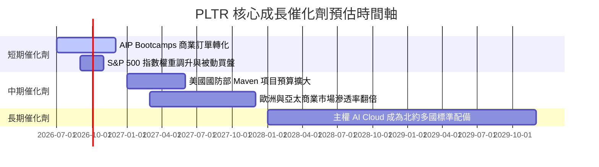

### 8.2 TAM 市場規模分析

```
╔══════════════════════════════════════════════════════════════════╗
║                  PLTR 潛在市場規模 (TAM) 估算                    ║
╠══════════════════════════════════════════════════════════════════╣
║                                                                  ║
║  1. 美國與盟國國防 AI 軟體 TAM：  $50.0B (目前滲透率 ~4.5%)      ║
║  2. 全球財星 2000 大企業 AI TAM： $120.0B (目前滲透率 ~2.5%)     ║
║  3. 主權雲與數據隱私合規 TAM：    $30.0B (目前滲透率 ~1.0%)      ║
║                                                                  ║
║  📊 總計 TAM：$200.0B ｜ PLTR 當前營收 $5.22B ｜ 滲透率：2.61%  ║
╚══════════════════════════════════════════════════════════════════╝
```

### 8.3 成長驅動力結構圖

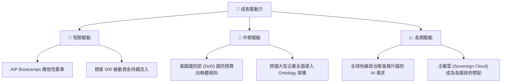

---

## 9. 風險矩陣

### 9.1 風險評分矩陣

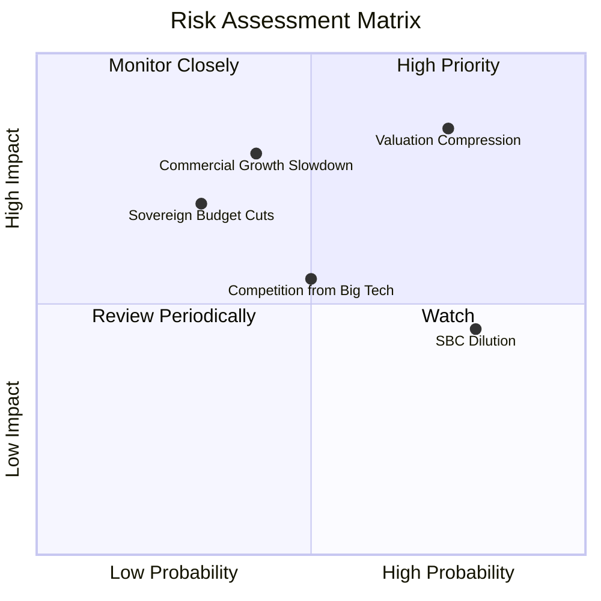

### 9.2 風險清單詳細分析

| # | 風險項目 | 發生機率 | 財務衝擊 | 風險評分 | 機構級緩解措施與監控指標 |
|---|----------|----------|----------|----------|--------------------------|
| 1 | 🔴 **估值乘數收縮 (Valuation Compression)** | 高 (75%) | 高 (-30% 股價) | 🔴 **8.5 / 10** | **緩解措施**：當前 P/S 達 58x，若市場總體利率上升或成長放緩，估值將首當其衝。機構應採用覆蓋開端權利金 (Covered Call) 進行避險。 |
| 2 | 🟡 **商業市場成長放緩 (Commercial Slowdown)** | 中 (40%) | 高 (-15% 營收) | 🟡 **6.5 / 10** | **監控指標**：密切追蹤「美國商業客戶數」季增率是否跌破 15%。若跌破，代表 AIP 效應遞減。 |
| 3 | 🟡 **股權薪酬持續稀釋 (SBC Dilution)** | 極高 (80%)| 中 (-5% EPS) | 🟡 **6.0 / 10** | **緩解措施**：管理層已啟動股份回購計劃以對沖稀釋。需監控 basic 股數年增率是否維持在 3.5% 以下。 |
| 4 | 🟢 **政府合約流失 (Government Churn)** | 低 (30%) | 中 (-10% 營收) | 🟢 **4.5 / 10** | **緩解措施**：PLTR 與美國國防部關係極深，合約多為多年期。需注意國會預算撥款延遲風險。 |

---

## 10. 投資建議

### 10.1 最終綜合評級雷達圖

```
╔══════════════════════════════════════════════════════════════╗
║                  PLTR 綜合投資品質雷達圖                     ║
╠══════════════════════════════════════════════════════════════╣
║ 成長動能 (Growth)      9.5/10 ▓▓▓▓▓▓▓▓▓▓▓▓▓▓▓▓▓▓▓░  ★★★★★   ║
║ 獲利品質 (Profit)      8.5/10 ▓▓▓▓▓▓▓▓▓▓▓▓▓▓▓▓▓░░░  ★★★★☆   ║
║ 財務健康 (Balance)    10.0/10 ▓▓▓▓▓▓▓▓▓▓▓▓▓▓▓▓▓▓▓▓  ★★★★★   ║
║ 護城河深度 (Moat)      9.0/10 ▓▓▓▓▓▓▓▓▓▓▓▓▓▓▓▓▓▓░░  ★★★★★   ║
║ 估值安全邊際 (Value)   4.0/10 ▓▓▓▓▓▓▓▓░░░░░░░░░░░░  ★★☆☆☆   ║
╠══════════════════════════════════════════════════════════════╣
║ 綜合投資評級：🟢 買入 (Buy) ｜ 總分：8.2 / 10                ║
╚══════════════════════════════════════════════════════════════╝
```

### 10.2 目標價與隱含報酬率

| 情境 | 隱含目標價 | 當前股價 | 12M 預期報酬率 | 發生機率權重 | 權重後期望值目標價 |
|------|------------|----------|----------------|--------------|--------------------|
| 🔴 悲觀情境 | $70.00 | $126.79 | -44.79% | 15% | $10.50 |
| 🟡 **基準情境** | **$183.12** | **$126.79** | **+44.42%** | **65%** | **$119.03** |
| 🟢 樂觀情境 | $255.00 | $126.79 | +101.12% | 20% | $51.00 |
| **綜合期望值**| - | - | - | **100%** | **$180.53 (+42.38%)**|

### 10.3 買入時機與觸發因素

```
╔══════════════════════════════════════════════════════════════════╗
║                  ✅ PLTR 投資觸發因素 Checklist                  ║
╠══════════════════════════════════════════════════════════════════╣
║                                                                  ║
║  立即買入觸發條件（多數符合）：                                  ║
║  ✅ 美國商業客戶數年增率連續兩季 > 50%                           ║
║  ✅ GAAP 營業利益率穩定在 40% 以上                               ║
║  ✅ 股價回檔至 50 日均線（約 $115 - $125 區間）                  ║
║                                                                  ║
║  加碼觸發條件（出現以下任一）：                                  ║
║  ☐ 獲得美國國防部單筆 > $500M 的全新 AI 專案合約                 ║
║  ☐ 宣佈更大規模的股份回購計劃以完全對沖 SBC 稀釋                 ║
║                                                                  ║
║  減碼/停損觸發條件（出現以下任一）：                             ║
║  ☐ 單季營收年增率跌破 30%                                        ║
║  ☐ 核心前線工程師流失率大幅上升                                 ║
║                                                                  ║
╚══════════════════════════════════════════════════════════════════╝
```

### 10.4 投資人適配度分析

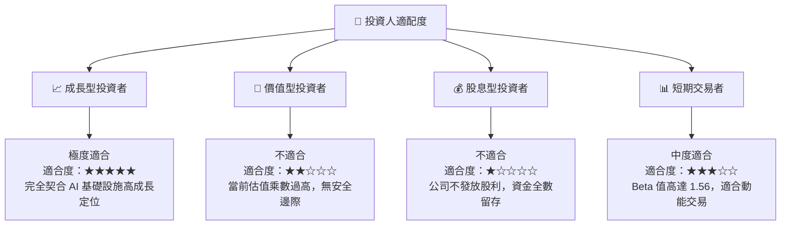

### 10.5 每季財報監控清單（Quarterly Watch List）

機構投資人應在每季財報公佈時，重點追蹤以下指標，並根據設定的門檻值進行動態倉位調整：

| 監控指標 | Q1 2026 實際值 | 偏多觸發門檻 (加碼) | 偏空觸發門檻 (減碼/停損) | 監控邏輯與業務含意 |
|----------|----------------|---------------------|--------------------------|-------------------|
| **美國商業客戶數年增率**| 72.0% | > 60.0% | < 40.0% | 評估 AIP 訓練營模式在美國本土的擴張速度與市場接受度。 |
| **GAAP 營業利益率** | 46.17% | > 42.0% | < 30.0% | 檢驗軟體平台邊際效應及銷售費用控制能力。 |
| **股權薪酬 (SBC) / 營收比重**| 12.34% (單季) | < 10.0% | > 15.0% | 監控管理層對稀釋股東權益的控制力度。 |
| **自由現金流 (FCF) 淨額** | $891.76M (單季) | > $600M | < $400M | 確保獲利的「含金量」，防範營運資本惡化。 |

### 10.6 反面論證：什麼會證明論點錯誤（What Would Change My Mind）

本投資報告的多頭論點建立在「AIP 帶來持續高成長與營業槓桿擴張」的假設上。若發生以下可量化事件，本機構將被迫重新檢視或終止對 PLTR 的多頭評級：

```
╔══════════════════════════════════════════════════════════════════╗
║              ⚠️ 論點失效條件 (Disconfirming Evidence)            ║
╠══════════════════════════════════════════════════════════════════╣
║  本投資論點在下列情況成立時應重新檢視或退出：                    ║
║  ☐ 商業企業營收年增率連續兩季低於 35%（代表 AIP 遭遇競爭瓶頸） ║
║  ☐ 實質營運 ROIC 跌破 15.0%（代表資本配置效率大幅下降）        ║
║  ☐ 自由現金流轉負，或 FCF 轉換率連續兩季 < 80%                   ║
║  ☐ 稀釋後流通股數 (Diluted Shares Outstanding) 年增率 > 5.0%    ║
║  ☐ 發生重大的主權數據洩露事件，導致 IL6 國防安全認證遭吊銷      ║
╚══════════════════════════════════════════════════════════════════╝
```

---

> **免責聲明**：本報告為 AI 自動生成，僅供研究參考，不構成投資建議。投資有風險，入市需謹謹慎。