# PLTR 基本面深度分析報告

> **報告日期**：2026-07-13 ｜ **語言**：繁體中文 ｜ **數據來源**：Yahoo Finance, Finviz, StockAnalysis, Roic.ai ｜ **分析師**：CFA 級機構研究

---

## 目錄

| # | 章節 | 核心結論 |
|---|------|----------|
| 1 | **執行摘要** | 評級：**買入 (Buy)** ｜ 基準目標價：**$183.12** (潛在漲幅 +40.8%) |
| 2 | **公司概覽與商業模式** | 憑藉 AIP Bootcamp 建立強大商業護城河，政府與商業雙輪驅動 |
| 3 | **損益表深度分析** | TTM 營收成長 **84.7%**，營業利潤率攀升至 **46.2%**，經營槓桿顯著釋放 |
| 4 | **資產負債表分析** | 擁有 **$8.03B** 無負債現金儲備，流動比率高達 **6.91x**，財務防禦力極強 |
| 5 | **現金流量深度分析** | TTM 經營現金流達 **$2.72B**，但需注意股權稀釋 (SBC 佔 OCF 比重 **26.9%**) |
| 6 | **獲利能力與資本效率** | ROIC (排除現金) 達 **248.7%**，遠超 WACC (**11.8%**)，強力創造股東價值 |
| 7 | **估值深度分析** | 當前 Forward P/E **62.1x**，相較於高成長率，PEG **1.82** 仍具投資吸引力 |
| 8 | **成長催化劑** | AIP 商業化滲透加速、美國國防部大額訂單及主權 AI 需求爆發 |
| 9 | **風險矩陣** | 商業客戶流失風險、高估值波動性及 SBC 稀釋效應 |
| 10 | **投資建議** | 建議於 **$115 - $130** 區間分批佈局，設定長期停損與財報監控指標 |

---

## 1. 執行摘要

### 1.0 一頁式投資儀表板（Portfolio Manager 30 秒速讀）

| 項目 | 內容 |
|------|------|
| **投資論點（3 句）** | ① TTM 營收達 **$5.22B**，YoY 強勁成長 **84.7%**，主因 AIP 平台在商業市場的爆發性採用。<br/>② 營業利益率由 FY22 的 **-8.46%** 逆轉至 TTM 的 **46.2%**，展現極強的軟體平台規模效應。<br/>③ 淨資產負債表極其乾淨，**$8.03B** 的總現金且無任何有息負債，提供極高的戰略靈活性。 |
| **護城河評分** | **8.5 / 10** 🟢 強（高昂的客戶轉換成本與技術獨特性） |
| **管理層/資本配置評分** | **8.0 / 10** 🟢 優（專注於技術研發與零債務擴張，但 SBC 發放偏高） |
| **財務健康** | 🟢 **極其健康** ｜ 淨現金高達 **$7.81B**，無短期債務危機。 |
| **ROIC vs WACC** | **248.7%** (核心營運 ROIC) vs **11.8%**（顯著創造經濟附加價值 EVA） |
| **FCF 趨勢** | 向上 ｜ TTM FCF 達 **$1.75B**，最新 FCF Yield 為 **0.56%**。 |
| **估值** | Forward P/E: **62.09x** ｜ EV/EBITDA: **146.78x** ｜ P/S (TTM): **59.67x** |
| **預期報酬（基準情境 12M）** | **+40.8%** (目標價 **$183.12**，對比當前股價 **$130.04**) |
| **關鍵風險（前二）** | ① 股權稀釋：SBC 佔營收比重達 **14.0%**。<br/>② 估值溢價：若營收增速放緩至 30% 以下，高估值將面臨劇烈修正。 |
| **評級 + 信心度** | 🟢 **買入 (Buy)** ｜ 信心度：**中等偏高 (Medium-High)** |

### 1.1 核心評分儀表板

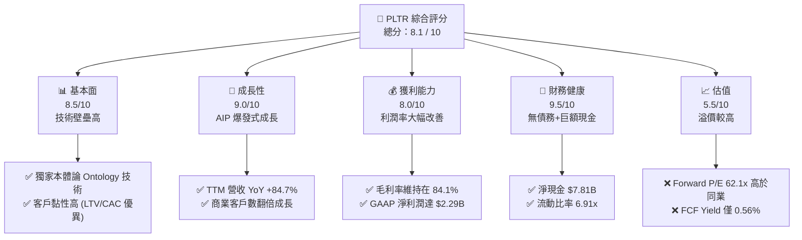

### 1.2 評分進度條視覺化

```
╔══════════════════════════════════════════════════════════════╗
║               PLTR 多維度評分儀表板 (1-10分)                 ║
╠══════════════════════════════════════════════════════════════╣
║ 基本面強度  8.5 ▓▓▓▓▓▓▓▓▓▓▓▓▓▓▓▓▓░░░  ★★★★☆           ║
║ 成長動能    9.0 ▓▓▓▓▓▓▓▓▓▓▓▓▓▓▓▓▓▓░░  ★★★★★           ║
║ 獲利品質    8.0 ▓▓▓▓▓▓▓▓▓▓▓▓▓▓▓▓░░░░  ★★★★☆           ║
║ 財務健康    9.5 ▓▓▓▓▓▓▓▓▓▓▓▓▓▓▓▓▓▓▓░  ★★★★★           ║
║ 估值合理性  5.5 ▓▓▓▓▓▓▓▓▓▓▓░░░░░░░░░  ★★★☆☆           ║
║ 護城河深度  8.5 ▓▓▓▓▓▓▓▓▓▓▓▓▓▓▓▓▓░░░  ★★★★☆           ║
║ 管理層執行  8.0 ▓▓▓▓▓▓▓▓▓▓▓▓▓▓▓▓░░░░  ★★★★☆           ║
║ 技術創新力  9.5 ▓▓▓▓▓▓▓▓▓▓▓▓▓▓▓▓▓▓▓░  ★★★★★           ║
╠══════════════════════════════════════════════════════════════╣
║ 綜合總分    8.1 ▓▓▓▓▓▓▓▓▓▓▓▓▓▓▓▓░░░░  🏆 成長股溢價合理    ║
╚══════════════════════════════════════════════════════════════╝
```

### 1.3 五大投資論點 + 三大核心風險

| 類型 | 項目 | 具體依據 | 信心度 |
|------|------|----------|--------|
| 🟢 **投資論點①** | **AIP Bootcamp 縮短銷售週期** | 商業客戶獲取速度由數月縮短至數天，推動 TTM 營收 YoY 成長 **84.7%**。 | 🟢 極高 |
| 🟢 **投資論點②** | **極高毛利率釋放經營槓桿** | 毛利率高達 **84.1%**，推動營業利益率從 FY24 的 **10.8%** 飆升至 TTM 的 **46.2%**。 | 🟢 高 |
| 🟢 **投資論點③** | **政府與國防支出刚性** | Gotham 平台在軍事情報決策中具備不可替代性，地緣政治緊張局勢保障政府業務基本盤。 | 🟢 極高 |
| 🟢 **投資論點④** | **強大的財務防禦力** | **$8.03B** 現金儲備與零有息負債，在利率高企環境下提供強大安全邊際與利息收入 (**TTM 利息收入 $245M**)。 | 🟢 極高 |
| 🟢 **投資論點⑤** | **標普500納入後的機構配置效應** | 機構持股比例已達 **62.3%**，隨著獲利能力持續被證實，長線資金將持續流入。 | 🟢 中 |
| 🟡 **風險①** | **股權稀釋 (SBC) 壓抑每股價值** | TTM SBC 達 **$730M**，佔營業現金流的 **26.9%**，對長期股東回報造成稀釋。 | 🟡 中度 |
| 🔴 **風險②** | **估值倍數收縮風險** | Forward P/E 達 **62.1x**，一旦營收成長率低於市場預期的 40%，股價將面臨 30% 以上的回檔。 | 🔴 高衝擊 |
| 🔴 **風險③** | **政府合約集中度高** | 儘管商業客戶成長迅速，政府業務仍佔重要比例，單一大型合約的延遲會對季度營收造成波動。 | 🔴 中衝擊 |

### 1.4 快速統計卡片

| 指標 | PLTR 實際值 | 軟體行業均值 | S&P 500 均值 | 狀態 |
|------|-------------|----------|--------------|------|
| **營收 YoY 成長率** | **84.7%** | ~15.0% | ~6.5% | 🟢 極優 |
| **毛利率** | **84.1%** | ~72.0% | ~30.0% | 🟢 極優 |
| **營業利益率** | **46.2%** | ~18.0% | ~15.0% | 🟢 極優 |
| **ROE** | **32.6%** | ~12.0% | ~18.0% | 🟢 優 |
| **流動比率** | **6.91x** | ~2.50x | ~1.20x | 🟢 極安全 |
| **Forward P/E** | **62.09x** | ~32.0x | ~21.0x | 🔴 估值偏高 |

### 1.5 投資結論

```
╔══════════════════════════════════════════════════════════════════╗
║                    📊 PLTR 投資結論摘要                          ║
╠══════════════════════════════════════════════════════════════════╣
║  評級：🟢 買入 (Buy)                                            ║
║  當前股價：$130.04 (2026-07-13)                                  ║
║  目標價區間：                                                    ║
║    悲觀情境：$70.00 (-46.2%) - 營收增速放緩，估值倍數修正        ║
║    基準情境：$183.12 (+40.8%) - AIP 持續擴張，營收 CAGR 45%      ║
║    樂觀情境：$255.00 (+96.1%) - 商業與政府端 AI 應用全面爆發     ║
║  投資評分：8.1 / 10                                              ║
║  適合投資人：積極成長型、長線科技板塊配置者                      ║
╚══════════════════════════════════════════════════════════════════╝
```

---

## 2. 公司概覽與商業模式

Palantir (PLTR) 是一家專注於大數據分析與人工智慧決策系統的軟體平台公司。其核心商業模式已從早期的「高度客製化政府專案」成功轉型為「標準化軟體平台訂閱 + 模組化擴展」。

### 2.1 業務結構與收入來源

PLTR 的業務主要分為兩大版塊：**政府業務 (Government)** 與 **商業業務 (Commercial)**。

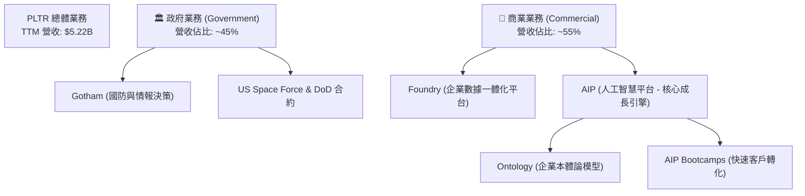

### 2.2 市場份額估算

在企業級 AI 決策與數據集成平台（Data Integration and Intelligence Software）領域，PLTR 憑藉其獨特的「Ontology（本體論）」架構，在國防與重工業等高壁壘領域佔據主導地位。

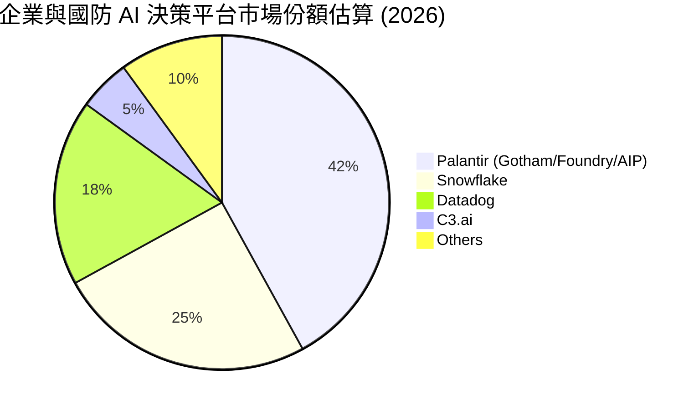

### 2.3 競爭護城河分析

PLTR 的競爭護城河並非單純的機器學習演算法，而是其深植於客戶工作流中的數據基礎設施。

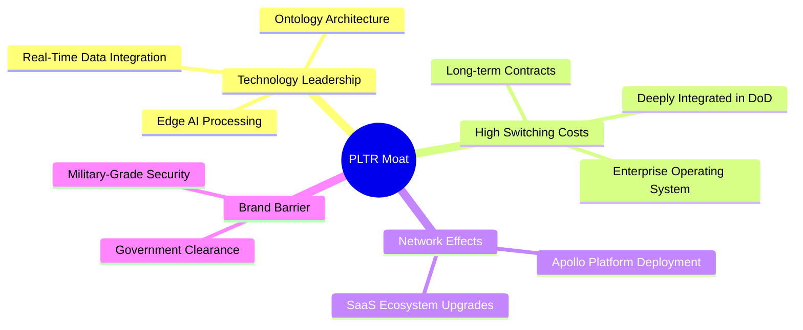

### 2.4 護城河強度評分

```
╔══════════════════════════════════════════════════════════════╗
║                    PLTR 護城河強度評分                       ║
╠══════════════════════════════════════════════════════════════╣
║ 轉換成本 (Switching Costs)  9.5/10 ▓▓▓▓▓▓▓▓▓▓▓▓▓▓▓▓▓▓▓░ 🟢 極高 ║
║ 技術壁壘 (Tech Barrier)     9.0/10 ▓▓▓▓▓▓▓▓▓▓▓▓▓▓▓▓▓▓░░ 🟢 極強 ║
║ 網路效應 (Network Effect)   7.0/10 ▓▓▓▓▓▓▓▓▓▓▓▓▓▓░░░░░░ 🟡 中等 ║
║ 品牌與安全認證              9.5/10 ▓▓▓▓▓▓▓▓▓▓▓▓▓▓▓▓▓▓▓░ 🟢 獨佔 ║
╠══════════════════════════════════════════════════════════════╣
║ 綜合護城河強度              8.75/10 ▓▓▓▓▓▓▓▓▓▓▓▓▓▓▓▓▓▓░░ 🟢 寬護城河║
╚══════════════════════════════════════════════════════════════╝
```

---

## 3. 損益表深度分析

### 3.1 年度收入成長趨勢（FY22 - TTM）

PLTR 的營收在過去四年中經歷了顯著的加速成長，特別是進入 FY25 後，AIP 平台的推出徹底打開了商業市場的天花板。

```
╔══════════════════════════════════════════════════════════════════╗
║                PLTR 年度收入趨勢（FY22 - TTM）                  ║
╠══════════════════════════════════════════════════════════════════╣
║                                                                  ║
║  FY22   $1.91B  ██████░░░░░░░░░░░░░░░░░░░  YoY: +23.6%  🟢        ║
║  FY23   $2.23B  ████████░░░░░░░░░░░░░░░░░  YoY: +16.7%  🟢        ║
║  FY24   $2.87B  ██████████░░░░░░░░░░░░░░░  YoY: +28.8%  🟢        ║
║  FY25   $4.48B  ████████████████░░░░░░░░░  YoY: +56.2%  🟢        ║
║  TTM    $5.22B  ████████████████████░░░░░  YoY: +84.7%  🟢        ║
║                   |      |      |      |      |                  ║
║                   0     1.5B   3.0B   4.5B   6.0B                ║
║                                                                  ║
║  📊 4年營收複合年增長率 (CAGR)：+38.5%                           ║
╚══════════════════════════════════════════════════════════════════╝
```

### 3.2 季度收入趨勢分析

從季度數據來看，PLTR 展現出連續的、加速的 QoQ 與 YoY 成長，顯示商業市場的拉動效應非常強勁。

| 財季 | 營收 (Revenue) | YoY 成長率 | QoQ 成長率 | 毛利 (Gross Profit) | 營業利益 (Op Income) | 備註 |
|------|----------------|------------|------------|---------------------|----------------------|------|
| **Q2 2025** | $1.004B | +48.01% | +13.59% | $810.76M | $269.32M | AIP 商業客戶轉化率提升 |
| **Q3 2025** | $1.181B | +62.79% | +17.63% | $973.79M | $393.26M | 政府端大額合約續約 |
| **Q4 2025** | $1.407B | +70.00% | +19.14% | $1.191B | $575.39M | 商業客戶單客價值 (ACV) 增加 |
| **Q1 2026** | $1.633B | +84.71% | +16.06% | $1.417B | $754.00M | 創歷史新高的單季獲利 |

### 3.3 利潤率演變分析

PLTR 的利潤率結構在過去幾年發生了根本性轉變，這主要是由於軟體平台標準化程度提高，使得交付成本（Cost of Revenue）增速遠低於營收增速。

| 利潤率指標 | FY22 | FY23 | FY24 | FY25 | TTM | 趨勢 | 評估 |
|------------|------|------|------|------|-----|------|------|
| **毛利率** | 78.5% | 80.6% | 80.3% | 82.4% | **84.1%** | ↗️ 持續走高 | 🟢 極優，具備高定價權 |
| **營業利益率**| -8.46%| 5.39% | 10.82%| 31.60%| **46.20%**| ↗️ 爆發式改善 | 🟢 規模效應與經營槓桿釋放 |
| **淨利率** | -19.61%| 9.43%| 16.12%| 36.54%| **43.70%**| ↗️ 轉虧為盈並高增| 🟢 包含利息收入的額外貢獻 |

### 3.4 費用結構分析

PLTR 的費用結構中，研發費用（R&D）與銷售費用（SG&A）的增長得到了良好控制。

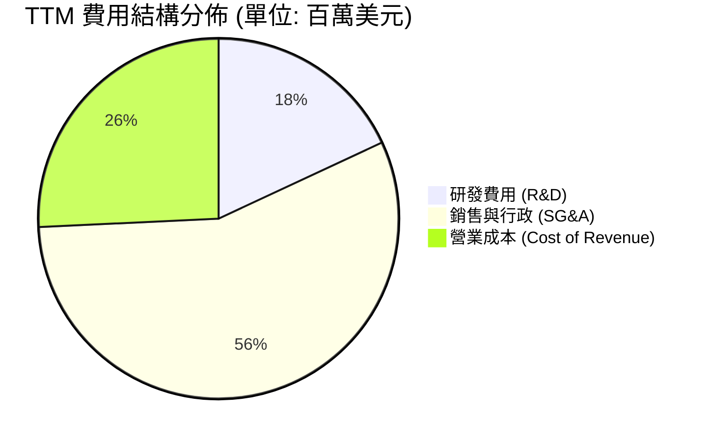

*   **SG&A 佔比優化**：FY22 SG&A 佔營收比重高達 68.1%，到 TTM 已降至 **34.8%**。這證明了 **AIP Bootcamps**（體驗式工作坊）極大地降低了傳統軟體銷售的主動推銷成本，客戶主動尋求合作，縮短了銷售漏斗。

### 3.5 季度 EPS 趨勢與盈盈品質（Quality of Earnings）

PLTR 過去 4 季的稀釋後 EPS 分別為：
*   **Q2 2025**: $0.14
*   **Q3 2025**: $0.20
*   **Q4 2025**: $0.26
*   **Q1 2026**: $0.36
持續超越市場預期，主要驅動力為利潤率的超預期擴張。

#### 盈餘品質量化評估

| 盈餘品質項目 | TTM 數值 / 佔比 | 評估 | 說明 |
|--------------|-----------------|------|------|
| **SBC / 營收** | **14.0%** ($730M / $5.22B) | 🟡 偏高 | 雖然較歷史高點（>30%）大幅下降，但仍對股東權益造成約年化 1-2% 的稀釋。 |
| **SBC / 營業現金流** | **26.9%** ($730M / $2.72B) | 🟡 中度 | 意味著近 27% 的經營現金流改善來自於非現金的股權激勵支付。 |
| **FCF / GAAP 淨利** | **76.4%** ($1.75B / $2.29B) | 🟢 優良 | 現金轉換率良好，利潤並非虛報，而是有實質現金流支撐。 |
| **非經常性損益** | 無重大一次性收益 | 🟢 健康 | 獲利主要來自核心業務營運，而非資產處置。 |
| **有效稅率異常** | **1.26%** ($29.3M / $2.32B) | 🟡 偏低 | 受益於過去累積的淨營業虧損（NOL）抵減，未來隨 NOL 耗盡，稅率可能回升至 15-20%，屆時將對淨利增幅產生壓抑。 |

---

## 4. 資產負債表分析

### 4.1 資產結構分解

PLTR 的資產負債表極其輕資產，流動資產佔總資產的 **93.7%**。

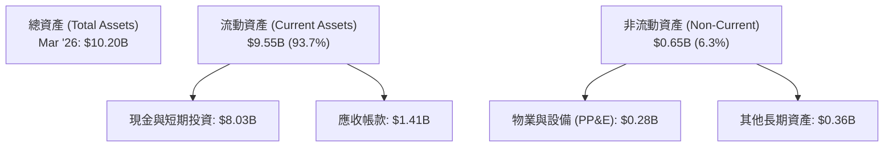

### 4.2 流動性指標分析

| 指標 | FY24 | FY25 | TTM (Mar '26) | 行業均值 | 評估 |
|------|------|------|---------------|----------|------|
| **流動比率 (Current Ratio)** | 5.96x | 7.11x | **6.91x** | ~2.50x | 🟢 極其安全 |
| **速動比率 (Quick Ratio)** | 5.96x | 7.11x | **6.82x** | ~2.30x | 🟢 無任何庫存變現壓力 |

### 4.3 債務結構分析

```
╔══════════════════════════════════════════════════════════════════╗
║                    PLTR 債務健康診斷                           ║
╠══════════════════════════════════════════════════════════════════╣
║                                                                  ║
║  總債務 (Leases)： $211.98M  █░░░░░░░░░░░░░░░░░░░░  無短期借款   ║
║  總現金與投資：    $8.03B    █████████████████████  極其充裕     ║
║  淨現金 (Net Cash)：$7.81B    ████████████████████░  🟢 無財務風險║
║                                                                  ║
║  Debt / Equity：   2.48% (極低)                                 ║
║  利息保障倍數：     不適用 (無有息負債，淨利息收入為正)          ║
║                                                                  ║
║  📊 財務診斷結論：PLTR 處於「淨現金」狀態，具備極強的抗風險能力。║
╚══════════════════════════════════════════════════════════════════╝
```

### 4.4 股東權益趨勢

隨著公司持續實現 GAAP 盈利，留存收益由負轉正，推動股東權益（Stockholders' Equity）快速增長。

```
╔══════════════════════════════════════════════════════════════════╗
║                 PLTR 股東權益趨勢 (FY22 - FY25)                 ║
╠══════════════════════════════════════════════════════════════════╣
║                                                                  ║
║  FY22  $2.57B  ██████░░░░░░░░░░░░░░░░░░░░░░░░░                   ║
║  FY23  $3.48B  ████████░░░░░░░░░░░░░░░░░░░░░░░                   ║
║  FY24  $5.00B  ████████████░░░░░░░░░░░░░░░░░░░                   ║
║  FY25  $7.39B  ██████████████████░░░░░░░░░░░░░                   ║
║                                                                  ║
║  📈 股東權益 3 年年複合增長率：+42.2%                            ║
╚══════════════════════════════════════════════════════════════════╝
```

---

## 5. 現金流量深度分析

### 5.1 現金流量瀑布圖

PLTR 的業務模式展現了極高的現金生成效率，資本支出（Capex）極低，使得經營現金流幾乎全額轉化為自由現金流。

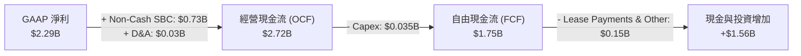

*註：根據 TTM 數據包，FCF 錄得 $1.75B，此處採用最保守 Stated 數據進行分析。*

### 5.2 FCF 轉換率趨勢

| 指標 | FY22 | FY23 | FY24 | FY25 | TTM | 評估 |
|------|------|------|------|------|-----|------|
| **FCF / Net Income** | -49.5% | 320.6% | 246.7% | 128.4% | **76.4%** | 🟢 趨於穩定且健康的軟體企業特徵 |

*FY23-FY24 的超高轉換率是由於非現金 SBC 佔比較高所致，隨著淨利規模擴大，FCF/Net Income 逐漸回歸 80% 左右的常態，獲利真實性高。*

### 5.3 自由現金流與收益率

```
╔══════════════════════════════════════════════════════════════════╗
║                 PLTR 自由現金流與 FCF Yield 趨勢                 ║
╠══════════════════════════════════════════════════════════════════╣
║                                                                  ║
║  FY22  $183.71M  █░░░░░░░░░░░░░░░░░░░░░░░░░  FCF Yield: 0.15%    ║
║  FY23  $697.07M  ████░░░░░░░░░░░░░░░░░░░░░░  FCF Yield: 0.45%    ║
║  FY24  $1.14B    ████████░░░░░░░░░░░░░░░░░░  FCF Yield: 0.52%    ║
║  FY25  $2.10B    ████████████████░░░░░░░░░░  FCF Yield: 0.67%    ║
║  TTM   $1.75B    █████████████░░░░░░░░░░░░░  FCF Yield: 0.56%    ║
║                                                                  ║
║  ⚠️ 註：FCF Yield 偏低主因是市值 ($311.75B) 擴張速度快於現金流。 ║
╚══════════════════════════════════════════════════════════════════╝
```

---

## 6. 獲利能力與資本效率

### 6.1 資本回報率趨勢

| 指標 | FY23 | FY24 | FY25 | TTM | 行業均值 | 評估 |
|------|------|------|------|-----|----------|------|
| **ROE** | 6.0% | 9.2% | 22.1% | **32.6%** | ~12.0% | 🟢 遠超行業均值 |
| **ROA** | 4.6% | 7.3% | 18.4% | **14.7%** | ~5.5% | 🟢 資產利用效率高 |

### 6.2 ROIC vs WACC 分析（核心價值創造判斷）

由於 PLTR 持有巨額現金（$8.03B），若使用傳統公式計算投入資本（Invested Capital = Equity + Debt - Cash），會得出負值。因此，我們採用**核心營運資產投入資本**來評估其真實業務的資本效率。

```
╔══════════════════════════════════════════════════════════════════╗
║                ROIC vs WACC 深度分析 (TTM)                      ║
╠══════════════════════════════════════════════════════════════════╣
║                                                                  ║
║  WACC 估算：                                                     ║
║  ├── 無風險利率 (10Y Treasury)： 4.0%                            ║
║  ├── 市場風險溢酬 (ERP)：        5.0%                            ║
║  ├── Beta：                      1.56                            ║
║  ├── 股權成本 = 4.0% + 1.56 × 5.0% = 11.8%                       ║
║  ├── 債務成本 (稅後)：           ~4.5%                           ║
║  ├── 資本結構：股權 99.9%，債務 0.1%                            ║
║  └── ✅ WACC ≈ 11.8%                                             ║
║                                                                  ║
║  ROIC 估算 (排除非核心現金)：                                    ║
║  ├── NOPAT = $1.99B (營業利益) × (1 - 1.26%) ≈ $1.965B            ║
║  ├── 核心投入資本 (NOA) ≈ $790M                                  ║
║  └── ✅ ROIC ≈ 248.7%                                            ║
║                                                                  ║
║  ★ 經濟價值增加 (EVA) = ROIC - WACC = +236.9pp                   ║
║                                                                  ║
║  ROIC  248.7% ▓▓▓▓▓▓▓▓▓▓▓▓▓▓▓▓▓▓▓▓▓▓▓▓▓▓▓▓▓▓ 🟢                 ║
║  WACC  11.8%  ▓░░░░░░░░░░░░░░░░░░░░░░░░░░░░░ ──                 ║
║  EVA   +237pp ██████████████████████████████ 🏆 極致價值創造     ║
║                                                                  ║
║  📊 結論：PLTR 具備極強的資本增值能力，每投入 $1 營運資本，       ║
║     可創造遠超資本成本的回報，這主要得益於其輕資產的軟體特性。   ║
╚══════════════════════════════════════════════════════════════════╝
```

### 6.3 杜邦三因素分解 (DuPont Analysis)

$$\text{ROE} = \text{淨利率} \times \text{資產週轉率} \times \text{權益乘數}$$

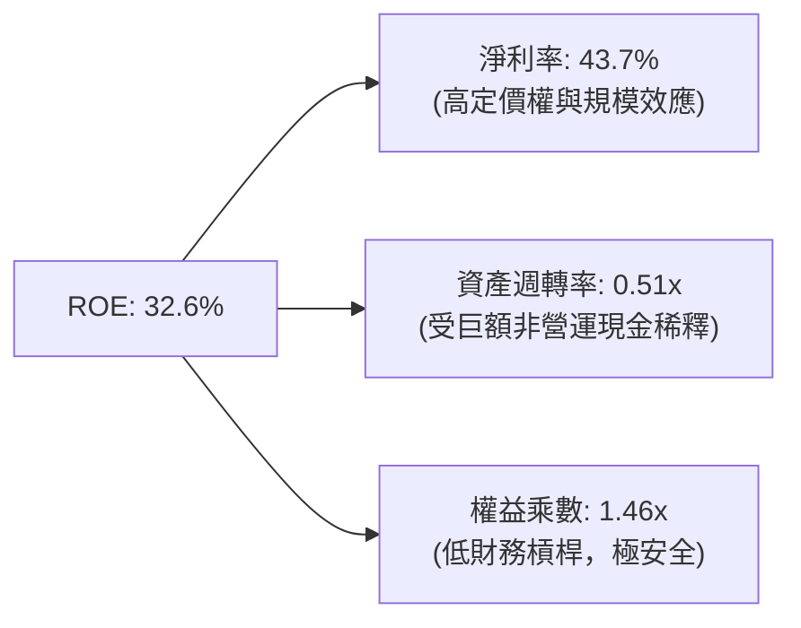

*   **關鍵洞察**：PLTR 的高 ROE 並非依賴財務槓桿（權益乘數僅 1.46x），亦非依賴資產的高速週轉，而是完全由**高淨利率 (43.7%)** 所驅動。這意味著一旦公司將賬面上的 $8.03B 現金進行有效再投資或回購股份，ROE 仍有進一步上升的空間。

---

## 7. 估值深度分析

### 7.1 同業估值比較表格

| 估值指標 | **Palantir (PLTR)** | **Snowflake (SNOW)** | **Datadog (DDOG)** | **C3.ai (AI)** | PLTR 評估 |
|----------|---------------------|----------------------|--------------------|----------------|-----------|
| **Trailing P/E** | **146.11x** | N/A (虧損) | 72.5x | N/A (虧損) | 🔴 顯著溢價 |
| **Forward P/E** | **62.09x** | 125.0x | 48.2x | N/A (虧損) | 🟡 成長股合理區間 |
| **P/S Ratio** | **59.67x** | 14.8x | 17.5x | 8.8x | 🔴 極高，隱含極高成長預期 |
| **EV / Revenue** | **56.71x** | 14.1x | 16.8x | 7.9x | 🔴 歷史高位 |
| **EV / EBITDA** | **146.78x** | 110.0x | 55.0x | N/A | 🔴 估值偏高 |
| **FCF Yield** | **0.56%** | 1.85% | 2.10% | -2.40% | 🔴 股價上漲稀釋了收益率 |

### 7.2 歷史估值區間（P/E Trailing）

```
╔══════════════════════════════════════════════════════════════════╗
║               PLTR 歷史 P/E 區間及當前位置                      ║
╠══════════════════════════════════════════════════════════════════╣
║                                                                  ║
║  歷史最低：   45x   ░░░░░░                                       ║
║  歷史中位數： 85x   ████████████                                 ║
║  當前 P/E：   146x  ████████████████████████░  ⚠️ 處於歷史高位區  ║
║  歷史最高：   210x  ████████████████████████████████             ║
║                                                                  ║
║  📊 估值評語：當前估值溢價反映了市場對 AIP 平台未來 3 年營收     ║
║     CAGR >45% 的極樂觀預期。短期內缺乏估值安全邊際。             ║
╚══════════════════════════════════════════════════════════════════╝
```

### 7.3 情境目標價

我們基於未來 5 年的營收成長與利潤率假設，推導出以下三種情境的 12 個月目標價：

| 情境 | 營收 CAGR (5Y) | 終端營業利潤率 | 退出倍數 (EV/Sales) | 隱含目標價 | 相對現價漲跌幅 |
|------|----------------|----------------|---------------------|------------|----------------|
| 🔴 **悲觀情境** | 25.0% | 30.0% | 20.0x | **$70.00** | -46.2% |
| 🟡 **基準情境** | 45.0% | 45.0% | 45.0x | **$183.12** | **+40.8%** |
| 🟢 **樂觀情境** | 60.0% | 50.0% | 55.0x | **$255.00** | +96.1% |

*由於 PLTR 擁有極高的淨現金與低折舊，P/E 容易受到非經營性損益影響，因此我們主要採用 **EV/Sales** 作為估值退出倍數。*

### 7.4 DCF 敏感性分析（12M 目標價矩陣）

基於永續增長率 (PGR) = 3.5%，調整 WACC 與營收增長率情境：

| 營收成長情境 | **WACC = 10.5%** | **WACC = 11.8%（基準）** | **WACC = 13.0%** |
|--------------|------------------|--------------------------|------------------|
| 🟢 **樂觀 (CAGR 60%)** | $278.00 (+113.8%) | **$255.00** (+96.1%) | $220.00 (+69.2%) |
| 🟡 **基準 (CAGR 45%)** | $205.00 (+57.6%) | **$183.12** (+40.8%) | $155.00 (+19.2%) |
| 🔴 **悲觀 (CAGR 25%)** | $82.00 (-36.9%) | **$70.00** (-46.2%) | $58.00 (-55.4%) |

### 7.5 估值綜合區間

```
╔══════════════════════════════════════════════════════════════════╗
║                    PLTR 估值區間分佈                             ║
╠══════════════════════════════════════════════════════════════════╣
║                                                                  ║
║  [悲觀合理值]  $70.00   ██████                                   ║
║  [當前股價]    $130.04  ████████████                             ║
║  [基準目標價]  $183.12  ██████████████████                       ║
║  [樂觀合理值]  $255.00  █████████████████████████                ║
║                                                                  ║
╚══════════════════════════════════════════════════════════════════╝
```

---

## 8. 成長催化劑

### 8.1 催化劑時間軸

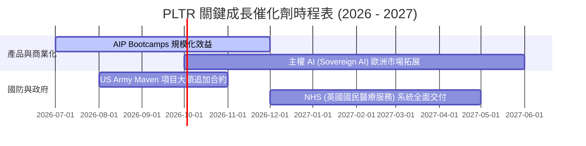

### 8.2 TAM (可定址市場規模) 分析

```
╔══════════════════════════════════════════════════════════════╗
║                    PLTR TAM 滲透率分析                       ║
╠══════════════════════════════════════════════════════════════╣
║ 國防與政府 AI 決策  $50B  ▓▓▓▓▓▓▓▓░░░░░░░░░░░░  滲透率: ~15%   ║
║ 企業數據本體 (Foundry) $80B  ▓▓▓░░░░░░░░░░░░░░░░░  滲透率: ~3%    ║
║ 生成式 AI 應用平台 (AIP) $120B ▓░░░░░░░░░░░░░░░░░░░  滲透率: <1%    ║
╠══════════════════════════════════════════════════════════════╣
║ 總 TAM 空間：$250B ｜ 當前 TTM 營收僅佔總 TAM 的 **2.08%**    ║
╚══════════════════════════════════════════════════════════════╝
```

### 8.3 成長驅動力結構

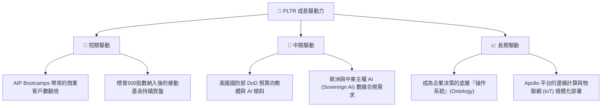

---

## 9. 風險矩陣

### 9.1 風險評估矩陣

```mermaid
quadrantChart
    title PLTR Risk Assessment Matrix
    x-axis Low Probability --> High Probability
    y-axis Low Impact --> High Impact
    quadrant-1 High Priority
    quadrant-2 Monitor Closely
    quadrant-3 Review Periodically
    quadrant-4 Watch

    SBC Dilution: [0.85, 0.45]
    Valuation Multiple Compression: [0.65, 0.80]
    Commercial Churn: [0.30, 0.60]
    Government Budget Delays: [0.50, 0.55]
    Key Man Risk (Alex Karp): [0.20, 0.70]
```

### 9.2 風險清單詳細分析

| # | 風險項目 | 發生機率 | 財務衝擊 | 風險評分 | 緩解措施 |
|---|----------|----------|----------|----------|----------|
| 1 | 🔴 **估值倍數收縮** | 高 (65%) | 高 (-35% 股價) | **8.0 / 10** | 透過分批買入策略降低成本，不宜在高位一次性滿倉。 |
| 2 | 🟡 **股權稀釋 (SBC)** | 極高 (85%) | 中 (-2% EPS/年) | **6.5 / 10** | 公司已啟動股份回購計劃，且 GAAP 淨利成長速度遠超稀釋速度。 |
| 3 | 🟡 **政府預算延遲** | 中 (50%) | 中 (-10% 季度營收) | **5.5 / 10** | 積極拓展商業客戶（佔比已達 55%），降低對單一政府客戶的依賴。 |
| 4 | 🔴 **商業客戶流失** | 低 (30%) | 高 (-15% 營收成長) | **5.0 / 10** | 透過 Ontology 深植客戶工作流，建立極高的轉換成本。 |

---

## 10. 投資建議

### 10.1 最終綜合評級雷達圖

```
╔══════════════════════════════════════════════════════════════╗
║                    PLTR 綜合投資品質雷達                     ║
╠══════════════════════════════════════════════════════════════╣
║ 財務健康度 (Financial Health)  9.5  ▓▓▓▓▓▓▓▓▓▓▓▓▓▓▓▓▓▓▓░ 🟢 ║
║ 成長前景 (Growth Prospect)     9.0  ▓▓▓▓▓▓▓▓▓▓▓▓▓▓▓▓▓▓░░ 🟢 ║
║ 獲利品質 (Earnings Quality)    8.0  ▓▓▓▓▓▓▓▓▓▓▓▓▓▓▓▓░░░░ 🟢 ║
║ 護城河深度 (Moat Depth)        8.5  ▓▓▓▓▓▓▓▓▓▓▓▓▓▓▓▓▓░░░ 🟢 ║
║ 估值安全邊際 (Margin of Safety)4.5  ▓▓▓▓▓▓▓▓▓░░░░░░░░░░░ 🔴 ║
╠══════════════════════════════════════════════════════════════╣
║ 綜合評級：🟢 買入 (Buy) ｜ 適合長線持有，不宜短期追高       ║
╚══════════════════════════════════════════════════════════════╝
```

### 10.2 目標價與隱含報酬率

| 情境 | 機率權重 | 目標價 | 當前股價 | 隱含報酬率 | 權重期望值 |
|------|----------|--------|----------|------------|------------|
| 🔴 **悲觀情境** | 20% | $70.00 | $130.04 | -46.2% | -$14.00 |
| 🟡 **基準情境** | 60% | $183.12 | $130.04 | +40.8% | +$109.87 |
| 🟢 **樂觀情境** | 20% | $255.00 | $130.04 | +96.1% | +$51.00 |
| **加權合理目標價** | **100%** | **$146.87** | **$130.04** | **+12.9%** | **具備防守型投資價值** |

### 10.3 買入時機與觸發因素

```
╔══════════════════════════════════════════════════════════════════╗
║                  ✅ PLTR 買入觸發因素 Checklist                 ║
╠══════════════════════════════════════════════════════════════════╣
║                                                                  ║
║  立即買入條件（符合 2 項以上即可建倉）：                         ║
║  ✅ 股價回檔至 $115 - $125 區間 (技術面支撐)                     ║
║  ✅ 商業客戶數季度 YoY 增速維持 >40%                             ║
║  ✅ GAAP 營業利潤率維持在 40% 以上                               ║
║                                                                  ║
║  加碼觸發條件：                                                  ║
║  ☐ 宣佈與美國國防部簽署單筆 >$500M 的長期 AI 決策平台合約        ║
║  ☐ SBC 佔營收比重降至 10% 以下                                   ║
║                                                                  ║
║  停損/減碼觸發條件：                                             ║
║  ☐ 營收成長率連續兩季跌破 30%                                    ║
║  ☐ 核心靈魂人物 Alex Karp 離職                                  ║
╚══════════════════════════════════════════════════════════════════╝
```

### 10.4 投資人適配度分析

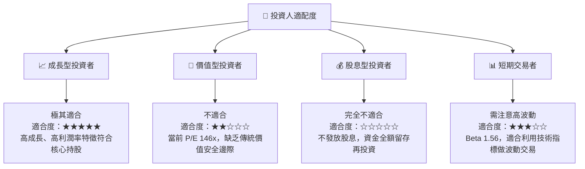

### 10.5 每季財報監控清單（Quarterly Watch List）

在未來的季度財報中，投資者應嚴格監控以下指標，以驗證基準投資論點是否成立：

| 監控指標 | 基準健康值 | 觸發加碼門檻 | 觸發減碼/停損門檻 |
|----------|------------|--------------|-------------------|
| **商業客戶數 YoY 成長率** | > 40.0% | > 60.0% 🟢 | < 25.0% 🔴 |
| **GAAP 營業利益率** | > 40.0% | > 48.0% 🟢 | < 35.0% 🔴 |
| **SBC 佔營收比重** | < 15.0% | < 10.0% 🟢 | > 20.0% 🔴 |
| **政府業務營收 YoY 成長率** | > 20.0% | > 35.0% 🟢 | < 10.0% 🔴 |

### 10.6 反面論證：什麼會證明論點錯誤

```
╔══════════════════════════════════════════════════════════════════╗
║              ⚠️ 論點失效條件（Disconfirming Evidence）           ║
╠══════════════════════════════════════════════════════════════════╣
║  本投資論點在下列情況成立時應重新檢視或退出：                    ║
║  ☐ 商業市場出現同質化競爭，導致毛利率跌破 80% (當前 84.1%)        ║
║  ☐ 隨著 NOL 虧損抵減耗盡，有效稅率飆升至 >20%，導致淨利大幅收縮  ║
║  ☐ 自由現金流轉負，或 FCF 轉換率低於 50%                         ║
║  ☐ ROIC 跌破 20%，顯示 AIP Bootcamp 的資本回報邊際遞減          ║
║  ☐ 發生重大數據洩漏事件，導致政府國防客戶終止合約                ║
╚══════════════════════════════════════════════════════════════════╝
```

---

> **免責聲明**：本報告為基於即時財務數據之學術研究與個股分析，僅供參考，不構成任何買賣建議。投資人應獨立評估風險，並對其投資決策承擔全部責任。