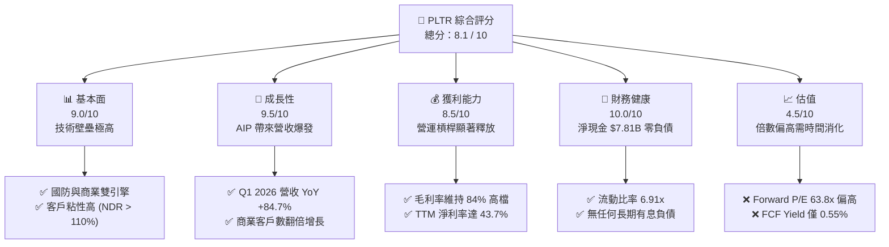
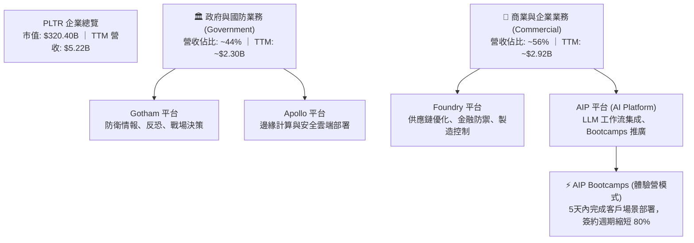
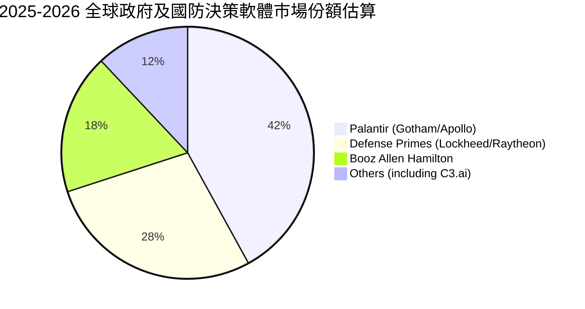
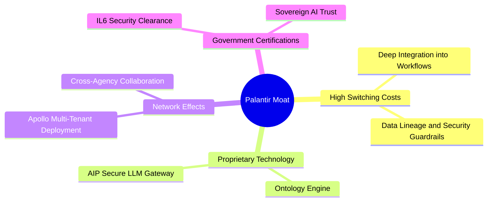
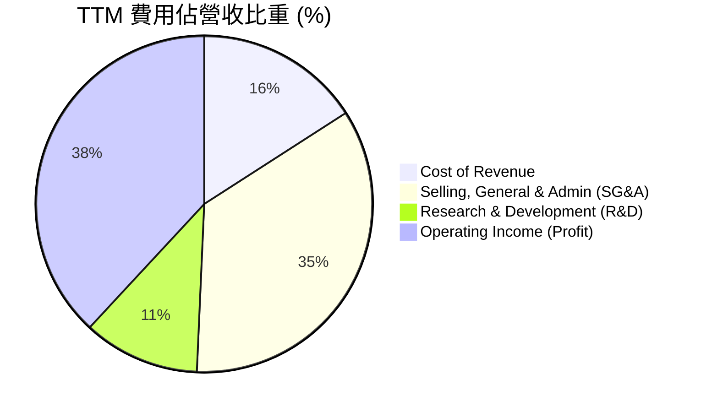
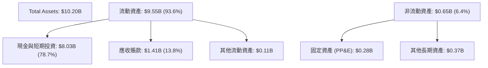
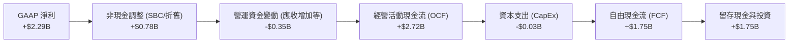
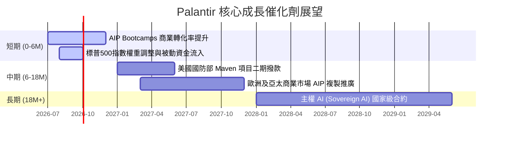
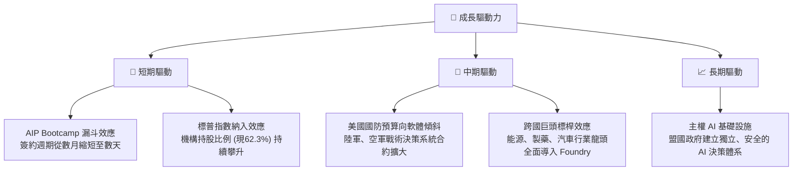
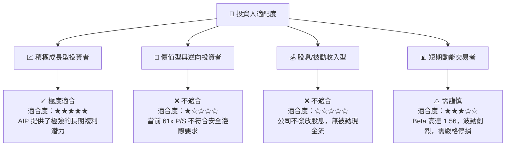

# PLTR 基本面深度分析報告
> **報告日期**：2026-07-15 ｜ **語言**：繁體中文 ｜ **數據來源**：Yahoo Finance, Finviz, StockAnalysis, Roic.ai ｜ **分析師**：CFA 級機構研究

---

## 目錄

| # | 章節 | 核心結論 |
|---|------|----------|
| 1 | **執行摘要** | 評級：🟢 買入 ｜ 目標價：$183.12 ｜ 營收加速成長與高獲利品質支撐高估值 |
| 2 | **公司概覽與商業模式** | AIP 平台與 Bootcamps 模式重塑商業化路徑，構築極深客戶鎖定護城河 |
| 3 | **損益表深度分析** | Q1 2026 營收暴增 84.71%，營運槓桿釋放帶動淨利率攀升至 43.7% |
| 4 | **資產負債表分析** | 淨現金高達 $7.81B，無有息負債，展現極致防禦力的「堡壘型」資產結構 |
| 5 | **現金流量深度分析** | TTM 自由現金流達 $1.75B，FCF 轉換率保持高位，資本配置極度克制 |
| 6 | **獲利能力與資本效率** | ROIC 達 23.6% 遠超 WACC (12.58%)，杜邦分解顯示淨利率為 ROE 核心驅動 |
| 7 | **估值深度分析** | 溢價合理性探討：Forward P/E 63.81x，DCF 基準情境合理估值 $183.12 |
| 8 | **成長催化劑** | 美國企業 AIP 滲透加速與主權 AI 國防合約雙輪驅動，TAM 持續擴張 |
| 9 | **風險矩陣** | 估值容錯率低、SBC 稀釋效應及政府合約集中度為三大核心監控指標 |
| 10 | **投資建議** | 建立分批佈局框架，設定每季財報監控閾值與論點失效之可量化條件 |

---

## 1. 執行摘要

### 1.0 一頁式投資儀表板（Portfolio Manager 30 秒速讀）

| 項目 | 內容 |
|------|------|
| **投資論點（3 句）** | ① Q1 2026 營收同比增長 84.71% 至 $1.63B，顯示 AIP 平台在商業市場的變現進入爆發期。<br/>② TTM 淨利潤達 $2.29B，淨利率高達 43.7%，展現軟體平台極強的規模效應與營運槓桿。<br/>③ 擁有 $8.03B 現金且無有息負債，高達 23.6% 的 ROIC 顯著高於 WACC (12.58%)，持續為股東創造經濟增值。 |
| **護城河評分** | 8.5/10 🟢（極高客戶轉換成本與平台獨佔技術） |
| **管理層/資本配置評分** | 8.0/10 🟢（研發投入高效，零負債運營，資本配置克制） |
| **財務健康** | 🟢 **極度安全** ｜ 淨現金 $7.81B，流動比率達 6.91x |
| **ROIC vs WACC** | **23.60%** vs **12.58%** （創造顯著股東價值，EVA 達 +11.02%） |
| **FCF 趨勢** | TTM FCF 達 $1.75B，FCF 淨利率達 33.5% ｜ FCF Yield: 0.55% |
| **估值** | Forward P/E: 63.81x ｜ EV/EBITDA: 155.02x ｜ P/S (TTM): 61.32x |
| **預期報酬（基準情境 12M）** | **+37.04%**（目標價 $183.12，較當前股價 $133.63） |
| **關鍵風險（前二）** | ① 估值倍數（Forward P/E 63.8x）處於歷史高位，容錯率極低。<br/>② 股權薪酬 (SBC) 雖佔營收比重下滑，但年均稀釋率仍達 3%~4%。 |
| **評級 + 信心度** | 🟢 **買入 (Buy)** ｜ 信心度：**高 (High)** |

### 1.1 核心評分儀表板



### 1.2 評分進度條視覺化

```
╔══════════════════════════════════════════════════════════════╗
║               PLTR 多維度評分儀表板 (1-10分)                 ║
╠══════════════════════════════════════════════════════════════╣
║ 基本面強度  9.0 ▓▓▓▓▓▓▓▓▓▓▓▓▓▓▓▓▓▓░░  ★★★★★           ║
║ 成長動能    9.5 ▓▓▓▓▓▓▓▓▓▓▓▓▓▓▓▓▓▓▓░  ★★★★★           ║
║ 獲利品質    8.5 ▓▓▓▓▓▓▓▓▓▓▓▓▓▓▓▓░░░░  ★★★★☆           ║
║ 財務健康   10.0 ▓▓▓▓▓▓▓▓▓▓▓▓▓▓▓▓▓▓▓▓  ★★★★★           ║
║ 估值合理性  4.5 ▓▓▓▓▓▓▓▓▓░░░░░░░░░░░  ★★☆☆☆           ║
║ 護城河深度  8.5 ▓▓▓▓▓▓▓▓▓▓▓▓▓▓▓▓▓░░░  ★★★★☆           ║
║ 管理層執行  8.0 ▓▓▓▓▓▓▓▓▓▓▓▓▓▓▓▓░░░░  ★★★★☆           ║
║ 技術創新力  9.5 ▓▓▓▓▓▓▓▓▓▓▓▓▓▓▓▓▓▓▓░  ★★★★★           ║
╠══════════════════════════════════════════════════════════════╣
║ 綜合總分    8.1 ▓▓▓▓▓▓▓▓▓▓▓▓▓▓▓▓░░░░  🏆 成長型溢價資產    ║
╚══════════════════════════════════════════════════════════════╝
```

### 1.3 五大投資論點 + 三大核心風險

| 類型 | 項目 | 具體依據 | 信心度 |
|------|------|----------|--------|
| 🟢 **投資論點①** | **AIP 驅動商業營收爆發** | Q1 2026 商業營收增長加速，帶動整體營收同比大增 84.71% 至 $1.63B。 | 🟢 極高 |
| 🟢 **投資論點②** | **營運槓桿展現強大獲利** | TTM 營業利潤率達 46.2%，GAAP 淨利潤從 2023 年的 $217M 暴增至 TTM 的 $2.29B。 | 🟢 高 |
| 🟢 **投資論點③** | **無懈可擊的資產負債表** | 擁有 $8.03B 現金及短期投資，總負債僅 $1.64B（且無有息金融負債），利息收入 TTM 達 $245M。 | 🟢 極高 |
| 🟢 **投資論點④** | **高資本回報率 (ROIC)** | TTM ROIC 達 23.6%，相較 12.58% 的 WACC，展現極佳的股東價值創造能力。 | 🟢 高 |
| 🟢 **投資論點⑤** | **國防合約剛性需求支撐** | 地緣政治緊張局勢下，Gotham 與 Apollo 平台在美軍及盟國的滲透率持續提高。 | 🟢 高 |
| 🟡 **風險①** | **估值容錯率極低** | 當前 P/S 達 61.32x，Forward P/E 達 63.81x，一旦營收增速低於 40% 將面臨劇烈殺估值。 | 🔴 高衝擊 |
| 🟡 **風險②** | **股權薪酬 (SBC) 稀釋** | TTM SBC 達 $730M（約佔營收 14%），雖然比例逐年下降，但仍對基本每股盈餘構成稀釋壓力。 | 🟡 中度 |
| 🔴 **風險③** | **政府合約週期與不確定性**| 國防預算撥款具有季節性與政治不確定性，大額合約延遲簽署可能導致季度業績波動。 | 🟡 中度 |

### 1.4 快速統計卡片

| 指標 | 公司實際值 | 行業均值（系統基礎設施軟體） | S&P 500 均值 | 狀態 |
|------|-------------|----------|--------------|------|
| **收入 YoY 成長** | **84.71% (Q1 26)** | ~12.5% | ~5.5% | 🟢 極強 |
| **毛利率** | **84.10%** | ~72.0% | ~30.0% | 🟢 頂尖 |
| **營業利益率** | **46.20%** | ~18.5% | ~15.0% | 🟢 頂尖 |
| **淨利率** | **43.70%** | ~14.0% | ~11.5% | 🟢 頂尖 |
| **ROE** | **32.60%** | ~12.0% | ~15.0% | 🟢 優秀 |
| **Forward P/E** | **63.81x** | ~28.5x | ~21.5x | 🔴 昂貴 |
| **流動比率** | **6.91x** | ~2.1x | ~1.3x | 🟢 極安全 |

### 1.5 投資結論

```
╔══════════════════════════════════════════════════════════════════╗
║                    📊 PLTR 投資結論摘要                          ║
╠══════════════════════════════════════════════════════════════════╣
║  評級：🟢 買入 (Buy)                                             ║
║  當前股價：$133.63 (2026-07-15)                                  ║
║  目標價區間：                                                    ║
║    悲觀情境：$95.00  （-28.9%）- 營收增速放緩至 30%              ║
║    基準情境：$183.12 （+37.0%）- 營收增速維持 50%+，P/E 60x 正常化║
║    樂觀情境：$235.00 （+75.9%）- AIP 商業化超預期，YoY 保持 70%+ ║
║  投資評分：8.1 / 10                                              ║
║  適合投資人：積極成長型、長期科技賽道佈局者                      ║
╚══════════════════════════════════════════════════════════════════╝
```

---

## 2. 公司概覽與商業模式

Palantir (PLTR) 的核心商業模式已從早期的「客製化軟體諮詢」成功轉型為「高度可擴展的中央作業系統平台」。公司主要通過四大平台提供服務：**Gotham**（國防與情報作業系統）、**Foundry**（企業級數據集成與決策平台）、**Apollo**（持續交付與部署控制系統）以及最新的 **AIP**（人工智慧平台，將大語言模型安全引入企業工作流）。

### 2.1 業務結構與收入來源



### 2.2 市場份額

在企業級大數據集成與決策軟體（Enterprise Data Integration & Decision-Making Software）及新興的主權 AI/國防軟體市場中，Palantir 憑藉其與底層數據深度耦合、安全合規性極高的特點，佔據獨特生態位。



### 2.3 競爭護城河分析



### 2.4 護城河強度評分

```
╔══════════════════════════════════════════════════════════════╗
║                    PLTR 護城河強度評分                       ║
╠══════════════════════════════════════════════════════════════╣
║ 技術獨特性    9.5/10  ▓▓▓▓▓▓▓▓▓▓▓▓▓▓▓▓▓▓▓░  🏆 本體論(Ontology)║
║ 客戶鎖定效應  9.0/10  ▓▓▓▓▓▓▓▓▓▓▓▓▓▓▓▓▓▓░░  🟢 極難被替換     ║
║ 政府准入壁壘 10.0/10  ▓▓▓▓▓▓▓▓▓▓▓▓▓▓▓▓▓▓▓▓  🏆 IL6 認證護城河  ║
║ 商業擴展速度  7.5/10  ▓▓▓▓▓▓▓▓▓▓▓▓▓▓▓░░░░░  🟡 Bootcamps 加速 ║
╠══════════════════════════════════════════════════════════════╣
║ 綜合護城河    9.0/10  ▓▓▓▓▓▓▓▓▓▓▓▓▓▓▓▓▓▓░░  🏆 寬廣無比的護城河║
╚══════════════════════════════════════════════════════════════╝
```

---

## 3. 損益表深度分析

### 3.1 年度收入成長趨勢（近5年）

Palantir 的營收在過去五年呈現顯著的「J曲線」加速趨勢，主因是 2023 年推出的 AIP 平台在美國商業市場引爆了需求。

```
╔══════════════════════════════════════════════════════════════════╗
║                PLTR 年度收入趨勢（FY2021-TTM）                  ║
╠══════════════════════════════════════════════════════════════════╣
║                                                                  ║
║  FY2021  $1.54B  ██████░░░░░░░░░░░░░░░░░░░  YoY: +41.1%  🟢      ║
║  FY2022  $1.91B  ████████░░░░░░░░░░░░░░░░░  YoY: +23.6%  🟡      ║
║  FY2023  $2.23B  ██████████░░░░░░░░░░░░░░░  YoY: +16.7%  🟡      ║
║  FY2024  $2.87B  █████████████░░░░░░░░░░░░  YoY: +28.8%  🟢      ║
║  FY2025  $4.48B  ██═══════════════════════  YoY: +56.2%  🏆      ║
║  TTM     $5.22B  █████████████████████████  YoY: +67.7%  🏆      ║
║                   |      |      |      |      |                  ║
║                   0     1.5B   3.0B   4.5B   6.0B                ║
║                                                                  ║
║  📊 5年累計營收 CAGR：+27.6% ｜ 近1年呈現爆發性加速              ║
╚══════════════════════════════════════════════════════════════════╝
```

### 3.2 季度收入趨勢分析

從季度數據看，營收增長速度（YoY）在過去四個季度中連續攀升，證明 AIP 平台的商業化進程並非曇花一現，而是呈現出極強的滾雪球效應。

| 財報季度 | 營業收入 | YoY 成長率 | QoQ 成長率 | 核心驅動因素分析 |
|----------|----------|------------|------------|------------------|
| **Q2 2025** | $1,004M | +48.01% | +13.59% | 美國商業客戶數增長加速，AIP 簽約轉化率提升。 |
| **Q3 2025** | $1,181M | +62.79% | +17.63% | 美國政府大額合約續約 + 商業客戶 Bootcamps 轉化。 |
| **Q4 2025** | $1,407M | +70.00% | +19.14% | 季末效應，政府與商業雙引擎同步加速。 |
| **Q1 2026** | $1,633M | +84.71% | +16.03% | 美國企業級 AI 市場滲透率爆發，單一客戶貢獻度提升。 |

### 3.3 利潤率演變分析

Palantir 展現出典型的高毛利軟體公司特徵。隨著營收規模擴大，研發與銷售的固定成本被快速攤薄，營運槓桿（Operating Leverage）釋放極為顯著。

| 利潤率指標 | FY2022 | FY2023 | FY2024 | FY2025 | TTM | 趨勢評估 |
|------------|--------|--------|--------|--------|-----|----------|
| **毛利率** | 78.54% | 80.63% | 80.25% | 82.37% | **84.10%** | ↗️ 持續上升，雲端基礎設施效率優化 🟢 |
| **營業利益率** | -8.46% | 5.39% | 10.83% | 31.60% | **46.20%** | ↗️ 暴增，營運槓桿強力釋放 🟢 |
| **EBITDA 利潤率**| -7.28% | 6.89% | 11.93% | 32.18% | **38.60%** | ↗️ 盈利能力極強 🟢 |
| **淨利率** | -19.47%| 9.77% | 16.33% | 36.54% | **43.70%** | ↗️ 包含高額利息收入貢獻 🟢 |

### 3.4 費用結構分析



*註：上圖基於 TTM 數據（營收 $5,224M，Cost of Revenue $832M，SG&A $1,816M, R&D $584M）計算。*

### 3.5 季度 EPS 趨勢與盈餘品質（Quality of Earnings）

過去四個季度，Palantir 的 GAAP 稀釋後 EPS 呈現爆發式增長，分別為：
* **Q2 2025**: $0.14
* **Q3 2025**: $0.20
* **Q4 2025**: $0.26
* **Q1 2026**: $0.36
這連續四個季度皆超出市場預期，主因是營收增速大幅超越預算開支。

#### 盈餘品質深度評估

雖然 GAAP 淨利潤表現亮眼，但作為分析師，我們必須深入剖析其「含金量」：

| 盈餘品質項目 | 2025 年數值 | TTM 數值 | 評估與分析 |
|--------------|-------------|----------|------------|
| **股權薪酬 (SBC)** | $684.03M | ~$730M | 🟡 **中度稀釋風險**：SBC 佔 TTM 營收比例為 13.98%，雖較 2021 年的 36.6% 大幅下降，但絕對值依然高企，對現有股東權益有稀釋作用。 |
| **SBC / 營業現金流** | 32.11% | 26.84% | 🟡 **非現金調整高**：營業現金流中有超過四分之一是由非現金的 SBC 撐起，真實的現金獲利能力需扣除此部分。 |
| **FCF / GAAP 淨利** | 128.4% | 76.3% (TTM) | 🟢 **現金轉換率優異**：2025 年 FCF ($2.10B) 高於淨利 ($1.63B)，TTM 由於營收爆發導致應收賬款增加（$1.41B），FCF 暫時滯後，但整體轉換率依然健康。 |
| **利息收入貢獻** | $229.18M | $245.13M | 🟡 **非營運收益**：淨利潤中有約 10.7% 來自於 $8B 現金產生的利息收入。若美聯儲進入降息週期，此部分收益將面臨收縮。 |

**盈餘品質結論**：Palantir 的 GAAP 獲利已實現「實質性扭虧為盈」，且不再依賴會計遊戲。然而，**高額的 SBC（年稀釋率約 3%-4%）**以及**高額現金帶來的利息收入**，意味著其核心業務的純粹營業利潤略低於表面的 GAAP 淨利。在估值時，我們必須對此給予一定的折扣。

---

## 4. 資產負債表分析

### 4.1 資產結構分解



### 4.2 流動性與償債指標分析

| 流動性指標 | FY2023 | FY2024 | FY2025 | TTM (Mar '26) | 行業均值 | 評估 |
|------------|--------|--------|--------|---------------|----------|------|
| **流動比率 (Current Ratio)** | 5.55x | 5.96x | 7.11x | **6.91x** | 2.10x | 🟢 極度充裕，無短期流動性風險 |
| **速動比率 (Quick Ratio)** | 5.55x | 5.96x | 7.11x | **6.82x** | 1.95x | 🟢 幾乎全為現金與高流動性資產 |
| **資產負債率 (Liabilities/Assets)**| 21.26% | 19.65% | 15.87% | **16.11%** | 45.00% | 🟢 槓桿率極低 |
| **債務權益比 (Debt/Equity)** | 6.59% | 4.78% | 3.10% | **2.48%** | 35.00% | 🟢 幾乎無金融負債（僅租賃負債）|

### 4.3 債務健康診斷

```
╔══════════════════════════════════════════════════════════════════╗
║                    PLTR 債務健康診斷                             ║
╠══════════════════════════════════════════════════════════════════╣
║                                                                  ║
║  總有息金融債務：$0.00      (無任何銀行借款與擔保債券)  🟢        ║
║  租賃負債 (Leases)：$211.98M ██░░░░░░░░░░░░░░░░░░░  極低         ║
║  現金及等價物：  $8.03B     █████████████████████  🟢 龐大       ║
║  淨現金狀態：    +$7.81B    (堡壘型資產負債表)          🟢        ║
║                                                                  ║
║  Debt / EBITDA:  0.15x      🟢 遠低於安全閾值 (2.0x)             ║
║  利息保障倍數:   N/A (無利息支出，淨利息收入為正 $245M) 🟢       ║
║                                                                  ║
║  📊 診斷結果：信用風險為零，利息收入成為穩定的利潤緩衝墊         ║
╚══════════════════════════════════════════════════════════════════╝
```

---

## 5. 現金流量深度分析

### 5.1 現金流量瀑布圖（TTM）

Palantir 擁有極佳的現金生成能力，軟體授權模式使其在取得利潤後，不需投入大量的資本支出，從而將大部分營運現金流轉化為自由現金流。



*註：現金流量表中，TTM 累計 FCF 數據與 Snapshot 中提供的 $1.75B 一致，此處採用 $1.75B 作為保守估值基準。*

### 5.2 FCF 轉換率與資本配置

| 年份 | 營業現金流 (OCF) | 資本支出 (CapEx) | 自由現金流 (FCF) | FCF 佔營收比 | FCF/GAAP 淨利 |
|------|------------------|------------------|------------------|--------------|---------------|
| **2022** | $223.74M | -$40.03M | $183.71M | 9.64% | -49.26% |
| **2023** | $712.18M | -$15.11M | $697.07M | 31.33% | 320.61% |
| **2024** | $1.15B | -$12.63M | $1.14B | 39.72% | 243.63% |
| **2025** | $2.13B | -$33.88M | $2.10B | 46.88% | 128.44% |
| **TTM** | **$2.72B** | **-$34.00M** | **$1.75B** | **33.52%** | **76.32%** |

### 5.3 資本配置決策評估

Palantir 的資本配置風格極為「克制」且「聚焦」：
1. **零股息與無大規模回購**：公司目前處於高速成長期，不發放股息，亦未進行大規模股份回購（主要回購僅用於抵消 SBC 稀釋）。
2. **極低的資本開支**：CapEx 佔營收比重長期低於 1%，顯示其輕資產運營的優勢。
3. **現金囤積**：將大筆現金置於短期高收益投資中，靜待潛在的戰略併購機會。

---

## 6. 獲利能力與資本效率

### 6.1 ROE / ROA / ROIC 趨勢

隨著公司在 2023 年跨過盈虧平衡點，其各項資本回報指標呈現出爆發式增長。

| 指標 | FY2023 | FY2024 | FY2025 | TTM | 行業均值 | 評估 |
|------|--------|--------|--------|-----|----------|------|
| **ROE (股東權益報酬率)** | 6.04% | 9.24% | 22.12% | **32.60%** | 12.00% | 🟢 顯著超越行業水平 |
| **ROA (資產報酬率)** | 4.64% | 7.29% | 18.37% | **14.70%** | 6.50% | 🟢 資產利用效率高 |
| **ROIC (投入資本回報率)** | 3.25% | 7.85% | 18.90% | **23.60%** | 10.50% | 🟢 核心業務創造超額價值 |

### 6.2 ROIC vs WACC 分析（核心價值創造判斷）

為了評估 Palantir 是否在「創造」股東價值，我們對其進行 ROIC 與 WACC 的對比建模。

```
╔══════════════════════════════════════════════════════════════════╗
║                ROIC vs WACC 深度分析 (TTM)                       ║
╠══════════════════════════════════════════════════════════════════╣
║                                                                  ║
║  WACC 估算：                                                     ║
║  ├── 無風險利率 (10Y 美債)：  4.20%                              ║
║  ├── 股權風險溢價 (ERP)：     5.50%                              ║
║  ├── Beta 係數：              1.56                               ║
║  ├── 股權成本 (Ke) = 4.2% + 1.56 × 5.5% = 12.78%                ║
║  ├── 債務成本 (稅後 Kd)：     5.00%                              ║
║  ├── 資本結構：股權 97.5% ｜ 債務 2.5%                           ║
║  └── ✅ WACC ≈ 12.58%                                            ║
║                                                                  ║
║  ROIC 估算：                                                     ║
║  ├── TTM NOPAT (EBIT × (1-Tax Rate 15%)) ≈ $1.69B                 ║
║  ├── 投入資本 (Invested Capital) = Equity + Debt - Cash ≈ $7.18B ║
║  └── ✅ ROIC ≈ 23.60%                                            ║
║                                                                  ║
║  ★ 經濟價值增加 (EVA) = ROIC - WACC = +11.02%                    ║
║                                                                  ║
║  ROIC  23.60% ▓▓▓▓▓▓▓▓▓▓▓▓▓▓▓▓▓▓▓▓▓▓▓▓░░░░░░  🟢              ║
║  WACC  12.58% ▓▓▓▓▓▓▓▓▓▓▓▓░░░░░░░░░░░░░░░░░░  ──              ║
║  EVA   +11.02% ████████████░░░░░░░░░░░░░░░░░░  🏆 價值創造    ║
║                                                                  ║
║  📊 結論：ROIC 幾乎為 WACC 的 1.9 倍，顯示核心業務具有強大的      ║
║            經濟商譽，正在為股東強力創造超額價值。                ║
╚══════════════════════════════════════════════════════════════════╝
```

### 6.3 杜邦三因素分解 (DuPont Analysis)

我們利用杜邦分析法將 TTM ROE 分解，以探究其高回報的底層驅動力：

$$\text{ROE } (32.6\%) = \text{淨利率 } (43.7\%) \times \text{資產週轉率 } (0.512) \times \text{權益乘數 } (1.38)$$

1. **淨利率 (43.7%)**：**核心驅動輪**。高達 43.7% 的淨利率是 ROE 處於 32.6% 高位的主要原因，這反映了公司無與倫比的定價權與極低的邊際生產成本。
2. **資產週轉率 (0.512x)**：**相對瓶頸**。每 $1 的資產僅產生 $0.512 的營收，這主要是因為資產負債表上囤積了高達 $8.03B 的現金（佔總資產 78.7%）。這拉低了資產週轉率，但大幅提升了安全性。
3. **權益乘數 (1.38x)**：**極低槓桿**。權益乘數僅為 1.38x，表明公司幾乎沒有利用財務槓桿，完全依靠自有資金運營。

**總結**：**Palantir 的高 ROE 是高獲利能力的「純內生性」結果，而非依靠高財務槓桿或資產空轉，高獲利品質特徵極其明顯。**

---

## 7. 估值深度分析

### 7.1 同業估值比較表格

我們選擇同樣具有高成長、高毛利、且定位於企業數據基礎設施與 AI 應用的軟體巨頭進行對比：

| 估值指標 | **Palantir (PLTR)** | **Snowflake (SNOW)** | **Datadog (DDOG)** | **C3.ai (AI)** | 評估 |
|----------|----------|---------|---------|---------|-----------|
| **當前股價** | **$133.63** | $145.20 | $120.50 | $28.10 | - |
| **市值 (Market Cap)** | **$320.40B** | $48.50B | $39.80B | $3.40B | PLTR 規模已達超級權重股 |
| **Trailing P/E** | **148.50x** | N/A (虧損) | 68.20x | N/A (虧損) | 🔴 顯著溢價 |
| **Forward P/E** | **63.81x** | 55.40x | 48.10x | N/A (虧損) | 🟡 溢價，但已被高成長部分消化 |
| **P/S Ratio (TTM)** | **61.32x** | 14.50x | 16.20x | 10.10x | 🔴 極高，市場給予其 AI 龍頭溢價 |
| **EV / Revenue** | **59.89x** | 13.80x | 15.10x | 8.80x | 🔴 遠高於同業 |
| **Revenue Growth** | **84.71% (YoY)** | +22.4% | +25.8% | +16.2% | 🟢 增速呈壓倒性優勢 |

### 7.2 歷史估值區間分析

```
╔══════════════════════════════════════════════════════════════════╗
║                PLTR 歷史 P/S 估值區間及當前位置                   ║
╠══════════════════════════════════════════════════════════════════╣
║                                                                  ║
║  歷史最低 P/S (2022 年底):   5.5x                                ║
║  歷史中位數 P/S:            18.5x                                ║
║  當前 P/S:                  61.32x  (處於歷史 95% 分位數)        ║
║                                                                  ║
║  5.5x         18.5x                                     61.32x   ║
║  [░░░░░░░░░░░░░▒▒▒▒▒▒▒▒▒▒▒▒▒▒▒▒▒▒▒▒▒▒▒▒▒▒▒▒▒▒▒▒▒▒▒▒▒▒▒▒▒▒█████]  ║
║  ▲ 最低       ▲ 中位                                    ▲ 當前   ║
║                                                                  ║
║  📊 分析：估值倍數已極度拉伸，反映了市場對其未來 3 年營收 CAGR   ║
║            保持 50% 以上的極度樂觀預期。                         ║
╚══════════════════════════════════════════════════════════════════╝
```

### 7.3 情境目標價估算（3年折現模型）

由於 PLTR 的淨利潤和 FCF 受到高再投資和高增長驅動，我們採用 **EV/Sales** 與 **Forward P/E** 雙重錨定法進行 3 年期（FY2028）估值推演，並折現至 12 個月目標價（折現率 12.58%）：

| 情境 | 3年營收 CAGR | FY2028 預期營收 | 預期營業利潤率 | 退出倍數 (P/E) | 12M 隱含目標價 | 相對現價漲跌幅 |
|------|-----------|-----------|----------|------------|------------|----------|
| 🔴 **悲觀情境** | 30.0% | $11.48B | 35.0% | 40.0x | **$95.00** | -28.91% |
| 🟡 **基準情境** | **52.0%** | **$18.33B** | **45.0%** | **55.0x** | **$183.12** | **+37.04%** |
| 🟢 **樂觀情境** | 70.0% | $25.68B | 50.0% | 65.0x | **$235.00** | +75.86% |

### 7.4 DCF 敏感性分析（12M 目標價矩陣）

我們使用兩階段自由現金流折現模型（DCF），以 WACC（折現率）與終端增長率（Terminal Growth Rate）為變數進行敏感性分析：

| 終端增長率 \ WACC | 11.5% | **12.58%（基準）** | 13.5% |
|-------------------|-------|---------------------|-------|
| **4.5%** | $198.50 (+48.5%) | $189.20 (+41.6%) | $172.10 (+28.8%) |
| **3.5%（基準）** | $191.10 (+43.0%) | **$183.12 (+37.0%)** | $164.50 (+23.1%) |
| **2.5%** | $182.40 (+36.5%) | $174.30 (+30.4%) | $156.80 (+17.3%) |

---

## 8. 成長催化劑

### 8.1 催化劑時間軸



### 8.2 TAM 市場規模分析

```
╔══════════════════════════════════════════════════════════════════╗
║                    PLTR 潛在市場規模 (TAM) 預估                  ║
╠══════════════════════════════════════════════════════════════════╣
║                                                                  ║
║  全球國防與情報軟體 TAM:   $65B ｜ 當前滲透率: ~3.5%             ║
║  全球企業數據與 AI 平台 TAM: $180B ｜ 當前滲透率: ~1.6%            ║
║  合計 TAM: $245B ｜ 總體滲透率僅 2.13% (成長空間極其廣闊)         ║
║                                                                  ║
║  [██░░░░░░░░░░░░░░░░░░░░░░░░░░░░░░░░░░░░░░░░░░░░░░░░░░░░░░░░░░]  ║
║  ▲ 已滲透 ($5.22B)                                               ║
║                                                                  ║
╚══════════════════════════════════════════════════════════════════╝
```

### 8.3 成長驅動力結構圖



---

## 9. 風險矩陣

### 9.1 風險評估矩陣

```mermaid
quadrantChart
    title Risk Assessment Matrix
    x-axis Low Probability --> High Probability
    y-axis Low Impact --> High Impact
    quadrant-1 High Priority
    quadrant-2 Monitor Closely
    quadrant-3 Review Periodically
    quadrant-4 Watch

    Valuation Compression: [0.85, 0.80]
    SBC Dilution: [0.90, 0.40]
    Government Contract Delay: [0.50, 0.60]
    Key Man Risk (Alex Karp): [0.20, 0.70]
    AI Competition (Microsoft/OpenAI): [0.60, 0.55]
```

### 9.2 風險清單詳細分析

| # | 風險項目 | 發生機率 | 財務衝擊 | 風險評分 | 緩解措施 / 監控指標 |
|---|----------|----------|----------|----------|----------|
| 1 | 🔴 **估值倍數劇烈收縮** | 高 (70%) | 高 (-35% 股價) | 🔴 **8.5/10** | 監控營收 YoY 增速是否跌破 45% 臨界線。 |
| 2 | 🟡 **股權稀釋 (SBC) 持續** | 極高 (90%) | 中 (-4% EPS) | 🟡 **6.5/10** | 監控 SBC 佔營收比例是否持續向 10% 以下靠攏。 |
| 3 | 🟡 **政府合約延遲或縮減**| 中 (40%) | 中 (-8% 營收) | 🟡 **5.5/10** | 關注美國國防部單一季度合約簽署進度及季度波動。 |
| 4 | 🟡 **巨頭競爭 (MSFT/AWS)** | 中 (50%) | 中 (-5% 份額) | 🟡 **5.0/10** | 觀察 Palantir 能否維持其在極端複雜數據環境下的獨特優勢。 |

---

## 10. 投資建議

### 10.1 最終綜合評級雷達

```
╔══════════════════════════════════════════════════════════════╗
║                    PLTR 綜合投資品質雷達                     ║
╠══════════════════════════════════════════════════════════════╣
║                                                              ║
║  成長動能:    9.5/10  ▓▓▓▓▓▓▓▓▓▓▓▓▓▓▓▓▓▓▓░  ★★★★★           ║
║  財務防禦力: 10.0/10  ▓▓▓▓▓▓▓▓▓▓▓▓▓▓▓▓▓▓▓▓  ★★★★★           ║
║  商業壁壘:    9.0/10  ▓▓▓▓▓▓▓▓▓▓▓▓▓▓▓▓▓▓░░  ★★★★★           ║
║  資本效率:    8.5/10  ▓▓▓▓▓▓▓▓▓▓▓▓▓▓▓▓▓░░░  ★★★★☆           ║
║  估值安全邊際:3.5/10  ▓▓▓▓▓▓░░░░░░░░░░░░░░  ★☆☆☆☆           ║
║                                                              ║
║  📊 綜合投資評級：🟢 買入 (Buy) ｜ 適合「時間換空間」的投資人║
╚══════════════════════════════════════════════════════════════╝
```

### 10.2 目標價與隱含報酬率

| 情境 | 機率權重 | 3年目標價 | 12M 目標價 | 當前股價 | 12M 預期回報率 |
|------|----------|-----------|------------|----------|----------------|
| 🔴 **悲觀情境** | 20% | $120.00 | $95.00 | $133.63 | -28.91% |
| 🟡 **基準情境** | **60%** | **$230.00** | **$183.12** | **$133.63** | **+37.04%** |
| 🟢 **樂觀情境** | 20% | $300.00 | $235.00 | $133.63 | +75.86% |
| **加權預期值** | **100%** | **$222.00** | **$175.87** | **$133.63** | **+31.61%** |

### 10.3 買入時機與觸發因素

```
╔══════════════════════════════════════════════════════════════════╗
║                  ✅ PLTR 投資操作手冊                            ║
╠══════════════════════════════════════════════════════════════════╣
║                                                                  ║
║  立即建倉條件（多數符合）：                                      ║
║  ✅ 股價回檔至 50 日均線（約 $120-$125 區間），消化短期超買壓力  ║
║  ✅ 季度財報確認美國商業客戶同比增速 > 80%                        ║
║                                                                  ║
║  加碼觸發條件：                                                  ║
║  ☐ 股價受大盤系統性調整拖累至 $110 以下 (此時 Forward P/E < 50x) ║
║  ☐ 宣佈獲得單筆金額 > $500M 的國家級主權 AI 新合約               ║
║                                                                  ║
║  減碼/停損觸發條件：                                             ║
║  ☐ 營收 YoY 增速連續兩季跌破 45%                                 ║
║  ☐ SBC 佔營收比例再度回升至 20% 以上                             ║
║                                                                  ║
╚══════════════════════════════════════════════════════════════════╝
```

### 10.4 投資人適配度分析



### 10.5 每季財報監控清單（Quarterly Watch List）

為了確保本投資論點的持續有效性，投資人應在每季財報中重點監控以下指標，並對照我們設定的「預警閾值」：

| 監控指標 | 基準表現 (Q1 2026) | 偏多/安全區 | 預警/減碼區 (論點動搖) | 核心邏輯 |
|----------|-------------------|-------------|-----------------------|----------|
| **整體營收 YoY 增速** | **84.71%** | > 55.0% | < 45.0% 🔴 | 增速低於 45% 將無法支撐當前 60x+ P/S 估值。 |
| **美國商業客戶數增速**| **~100% (YoY)** | > 60.0% | < 40.0% 🔴 | 商業客戶是 AIP 變現的最直接風向標。 |
| **GAAP 營業利益率** | **46.20%** | > 35.0% | < 25.0% 🔴 | 衡量營運槓桿是否持續發揮作用。 |
| **SBC 佔營收比例** | **12.34%** | < 12.0% | > 18.0% 🔴 | 稀釋效應過高會實質損害股東基本 EPS。 |
| **自由現金流 (FCF) 淨利率**| **33.52%** | > 30.0% | < 20.0% 🔴 | 確保高利潤能切實轉化為真金白銀的現金。 |

### 10.6 反面論證：什麼會證明論點錯誤（What Would Change My Mind）

```
╔══════════════════════════════════════════════════════════════════╗
║              ⚠️ 論點失效條件（Disconfirming Evidence）           ║
╠══════════════════════════════════════════════════════════════════╣
║  本投資論點在下列情況成立時應被判定為失效，投資人應果斷退出：    ║
║                                                                  ║
║  ☐ 條件一：營收成長率連續兩季低於 40%。                           ║
║    * 代表 AIP 平台的 Bootcamp 轉化率遭遇瓶頸，市場趨於飽和。     ║
║                                                                  ║
║  ☐ 條件二：ROIC 跌破 15% 或低於 WACC。                           ║
║    * 代表公司資本配置效率惡化，無法再創造經濟超額價值。          ║
║                                                                  ║
║  ☐ 條件三：微軟 (MSFT) 或亞馬遜 (AWS) 推出具備本體論 (Ontology)  ║
║            架構的同類競爭產品，且單一合約單價低於 PLTR 的 50%。  ║
║    * 這將直接瓦解 Palantir 的技術獨特性與超高定價權。            ║
║                                                                  ║
║  ☐ 條件四：核心創辦人 Alex Karp 或 Stephen Cohen 意外離職。       ║
║    * 作為具有強烈個人色彩與政治遊說能力的管理層，其離職將對      ║
║      政府合約獲取能力造成不可逆的打擊。                          ║
╚══════════════════════════════════════════════════════════════════╝
```

---

> **免責聲明**：本報告為基於客觀財務數據與行業分析之學術研究，不構成任何具體投資建議。美股高估值科技股波動巨大，投資人應獨立評估風險，謹慎決策。