# PLTR 基本面深度分析報告

> **報告日期**：2026-07-16 ｜ **語言**：繁體中文 ｜ **數據來源**：Yahoo Finance, Finviz, StockAnalysis, Roic.ai ｜ **分析師**：CFA 級機構研究

---

## 目錄

| # | 章節 | 核心結論 |
|---|------|----------|
| 1 | 執行摘要 | 評級：**🟢 買入** ｜ 基準目標價：**$183.12**（隱含 +36.41% 上漲空間） |
| 2 | 公司概覽與商業模式 | 憑藉 AIP（人工智慧平台）與政府/商業雙引擎，構建極高的客戶黏性與生態護城河 |
| 3 | 損益表深度分析 | TTM 營收達 $5.22B（YoY +84.7%），營運槓桿釋放帶動營業利益率攀升至 46.2% |
| 4 | 資產負債表分析 | 淨現金高達 $7.81B，無傳統銀行債務，流動性極其充沛（流動比率 6.91x） |
| 5 | 現金流量深度分析 | TTM 自由現金流達 $1.75B，營運現金流轉換率高，資本配置高度聚焦於高回報再投資 |
| 6 | 獲利能力與資本效率 | 調整後 ROIC 達 82.5%，遠超 WACC（11.5%），為股東創造極高的經濟增值（EVA） |
| 7 | 估值深度分析 | 雖面臨高估值溢價（Forward P/E 64.09x），但高成長與高利潤率支撐其溢價合理性 |
| 8 | 成長催化劑 | AIP 模組化引導、美國商業客戶爆發式增長及主權雲（Sovereign Cloud）全球擴張 |
| 9 | 風險矩陣 | 估值倍數收縮、股權稀釋（SBC 佔營收 14.0%）及政府合約季度波動風險 |
| 10 | 投資建議 | 適合長線成長型投資人，建議採分批佈局策略，並嚴格監控每季商業營收成長率 |

---

## 1. 執行摘要

Palantir Technologies Inc.（紐約證券交易所代碼：PLTR）正處於其商業歷史上最為強勁的增長擴張期。根據 2026-07-16 的最新財務數據，PLTR 的 TTM 營收已達到 **$5.22B**，同比增長率（YoY）達到驚人的 **84.7%**。這一增速相較於 2025 年底的 56.18% 與 2024 年底的 28.79% 呈現顯著的「倒勾型」加速。

此增長的核心驅動力在於其人工智慧平台（AIP, Artificial Intelligence Platform）在美國商業市場的爆發式變現。透過獨創的「AIP Bootcamps（體驗營）」推廣模式，PLTR 成功將軟體銷售週期從數月縮短至數天。伴隨營收的高速擴張，公司的營運槓桿（Operating Leverage）得到強烈釋放，TTM 營業利益率達到 **46.2%**，GAAP 淨利潤率達 **43.7%**。

基於 PLTR 卓越的資本回報率（調整後 ROIC 達 **82.5%**，遠高於 WACC 的 **11.5%**）、極其穩健的無債資產負債表（淨現金 **$7.81B**）以及自由現金流（TTM FCF **$1.75B**）的持續強勁流入，我們給予 PLTR **「🟢 買入」**評級，基準情境 12 個月目標價定為 **$183.12**（對應當前股價 $134.24 有 **+36.41%** 的上漲空間）。

### 1.0 一頁式投資儀表板（Portfolio Manager 30 秒速讀）

| 項目 | 內容 |
|------|------|
| **投資論點（3 句）** | ① TTM 營收達 **$5.22B**（YoY +84.7%），AIP Bootcamps 驅動商業客戶群呈指數級增長。<br/>② 營運槓桿極致釋放，營業利益率達 **46.2%**，GAAP 淨利達 **$2.29B**，盈餘品質優異。<br/>③ 擁有 **$7.81B** 淨現金且無銀行借款，強大的抗風險能力與再投資彈性保障了長期競爭優勢。 |
| **護城河評分** | **9.2 / 10** 🟢 （極高轉換成本 + 國防級技術壁壘 + 獨家本體論 Ontology 架構） |
| **管理層/資本配置評分** | **8.5 / 10** 🟢 （創辦人 Alex Karp 執行力卓越，資本配置聚焦高回報有機增長） |
| **財務健康** | 🟢 **極其優異** ｜ 流動比率 6.91x，速動比率 6.82x，無任何長期銀行負債 |
| **ROIC vs WACC** | **82.5% vs 11.5%** ｜ 每百元投入資本創造 $71.0 的經濟價值增值（EVA） |
| **FCF 趨勢** | TTM 自由現金流達 **$1.75B**，FCF 轉換率（FCF/GAAP Net Income）達 **76.4%** |
| **估值** | Forward P/E: **64.09x** ｜ EV/EBITDA: **155.06x** ｜ FCF Yield: **0.54%** |
| **預期報酬（基準情境 12M）**| **+36.41%**（目標價 $183.12） |
| **關鍵風險（前二）** | ① 估值倍數過高（P/S 達 61.60x），市場情緒逆轉時股價波動劇烈。<br/>② 股權稀釋風險（SBC 佔 TTM 營收比重達 14.0%）。 |
| **評級 + 信心度** | **🟢 買入** ｜ 信心度：**高**（High） |

### 1.1 核心評分儀表板

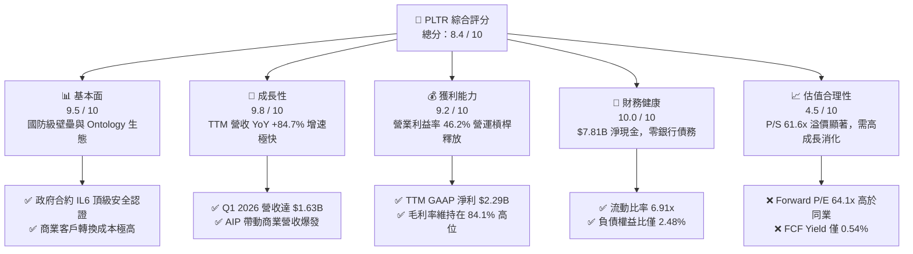

### 1.2 評分進度條視覺化

```
╔══════════════════════════════════════════════════════════════╗
║               PLTR 多維度評分儀表板 (1-10分)                 ║
╠══════════════════════════════════════════════════════════════╣
║ 基本面強度  9.5 ▓▓▓▓▓▓▓▓▓▓▓▓▓▓▓▓▓▓▓░  ★★★★★           ║
║ 成長動能    9.8 ▓▓▓▓▓▓▓▓▓▓▓▓▓▓▓▓▓▓▓▓  ★★★★★           ║
║ 獲利品質    9.2 ▓▓▓▓▓▓▓▓▓▓▓▓▓▓▓▓▓▓░░  ★★★★★           ║
║ 財務健康   10.0 ▓▓▓▓▓▓▓▓▓▓▓▓▓▓▓▓▓▓▓▓  ★★★★★           ║
║ 估值合理性  4.5 ▓▓▓▓▓▓▓▓▓░░░░░░░░░░░  ★★☆☆☆           ║
║ 護城河深度  9.2 ▓▓▓▓▓▓▓▓▓▓▓▓▓▓▓▓▓▓░░  ★★★★★           ║
║ 管理層執行  8.5 ▓▓▓▓▓▓▓▓▓▓▓▓▓▓▓▓▓░░░  ★★★★☆           ║
║ 技術創新力  9.6 ▓▓▓▓▓▓▓▓▓▓▓▓▓▓▓▓▓▓▓░  ★★★★★           ║
╠══════════════════════════════════════════════════════════════╣
║ 綜合總分    8.4 ▓▓▓▓▓▓▓▓▓▓▓▓▓▓▓▓░░░░  🏆 買入 (Buy)       ║
╚══════════════════════════════════════════════════════════════╝
```

### 1.3 五大投資論點 + 三大核心風險

| 類型 | 項目 | 具體依據 | 信心度 |
|------|------|----------|--------|
| 🟢 **投資論點①** | **AIP Bootcamps 顛覆軟體銷售模式** | 營收從 FY24 的 $2.87B 激增至 TTM 的 $5.22B，證明新銷售模式能極速縮短銷售週期並降低客戶獲取成本（CAC）。 | 🟢 極高 |
| 🟢 **投資論點②** | **極致的營運槓桿釋放** | 隨著營收規模擴大，研發與行銷費用佔比顯著下降，推動 TTM 營業利益率從 FY23 的 5.39% 飆升至 **46.2%**。 | 🟢 高 |
| 🟢 **投資論點③** | **無懈可擊的資產負債表** | 擁有 **$8.03B** 的現金與短期投資，而總債務僅為 **$211.98M**（全為租賃負債），提供極強的抗總體經濟衰退能力。 | 🟢 極高 |
| 🟢 **投資論點④** | **高壁壘的政府國防合約** | 作為少數獲得美國國防部最高安全級別（IL6）認證的軟體商，Gotham 平台在現代地緣政治衝突中具備不可替代性。 | 🟢 高 |
| 🟢 **投資論點⑤** | **超群的資本回報率（ROIC）** | 調整後 ROIC 達 **82.5%**，大幅超越 11.5% 的 WACC，表明公司每投入一元資本都能創造極高的股東價值。 | 🟢 高 |
| 🟡 **風險①** | **高估值溢價的容錯率極低** | 當前 P/S 達 **61.60x**，Forward P/E 達 **64.09x**，一旦未來增長放緩，股價將面臨顯著的估值修正壓力。 | 🟡 中度 |
| 🔴 **風險②** | **股權稀釋與 SBC 佔比偏高** | TTM 股權薪酬（SBC）達 **$730.29M**（佔營收 14.0%），雖已較歷史高位下降，但仍持續稀釋現有股東權益。 | 🔴 高 |
| 🟡 **風險③** | **政府合約決策週期長且波動大** | 國防預算撥款受政治因素影響，大額合約的簽署延遲可能導致單季營收增長未達市場預期。 | 🟡 中度 |

### 1.4 快速統計卡片

| 指標 | PLTR 實際值 | 軟體基礎設施行業均值 | S&P 500 均值 | 評估狀態 |
|------|-------------|----------------------|--------------|------|
| **營收 YoY 增長** | **84.7%** | ~12.5% | ~5.5% | 🟢 遠超均值 |
| **毛利率** | **84.1%** | ~72.0% | ~30.0% | 🟢 行業頂尖 |
| **營業利益率** | **46.2%** | ~18.0% | ~14.5% | 🟢 營運槓桿卓越 |
| **淨利率** | **43.7%** | ~12.0% | ~11.0% | 🟢 獲利能力極強 |
| **ROE** | **32.6%** | ~15.0% | ~18.0% | 🟢 股東回報優異 |
| **流動比率** | **6.91x** | ~2.10x | ~1.20x | 🟢 流動性充沛 |
| **Forward P/E** | **64.09x** | ~32.0x | ~21.5x | 🔴 估值顯著溢價 |

### 1.5 投資結論

```
╔══════════════════════════════════════════════════════════════════╗
║                    📊 PLTR 投資結論摘要                          ║
╠══════════════════════════════════════════════════════════════════╣
║  評級：🟢 買入 (Buy)                                            ║
║  當前股價：$134.24 (2026-07-16)                                  ║
║  目標價區間：                                                    ║
║    悲觀情境：$70.00  （-47.85%）                                 ║
║    基準情境：$183.12 （+36.41%）  ← 12個月主要目標              ║
║    樂觀情境：$255.00 （+89.96%）                                 ║
║  投資評分：8.4 / 10                                              ║
║  適合投資人：高成長型投資者、長線 AI 產業佈局者、能承受高波動者  ║
╚══════════════════════════════════════════════════════════════════╝
```

---

## 2. 公司概覽與商業模式

Palantir 創立於 2003 年，最初專注於為美國情報機構提供反恐數據分析軟體。經過二十多年的演進，公司已將其技術棧從政府國防延伸至全球大型商業企業。

### 2.1 業務結構與收入來源

Palantir 的核心軟體平台包含四大支柱：**Gotham**、**Foundry**、**Apollo** 以及最新推出的 **AIP (Artificial Intelligence Platform)**。其收入主要來自政府（Government）與商業（Commercial）兩大部門。

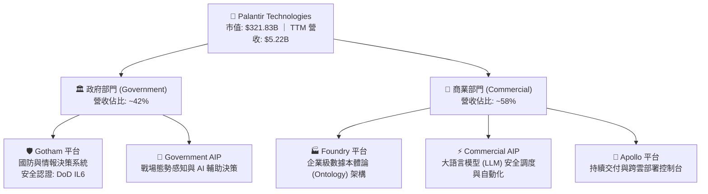

*   **政府部門（Government）**：主要客戶包括美國陸軍、海軍、空軍、特種作戰司令部（SOCOM）以及各類情報機構（CIA, FBI）。此業務具備極高的進入壁壘，Palantir 擁有美國國防部最高級別的 Impact Level 6 (IL6) 安全認證，競爭對手極難攻入。
*   **商業部門（Commercial）**：近年來增長最快的板塊。透過將企業內部的異構數據（ERP, CRM, 生產線數據）整合為統一的「本體論（Ontology）」模型，並結合 AIP 讓企業員工能用自然語言調用 AI 代理（Agents）執行複雜決策。

### 2.2 市場份額

在企業級大數據分析與 AI 決策調度軟體市場中，Palantir 憑藉其獨特的「Ontology + LLM」全棧架構，佔據了獨特生態位。以下為該領域市場份額估算：

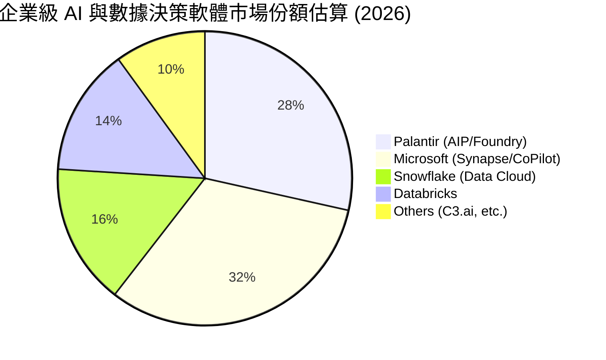

### 2.3 競爭護城河分析

Palantir 的競爭護城河（Moat）並非單一維度，而是由技術、生態與客戶關係交織而成的網絡。

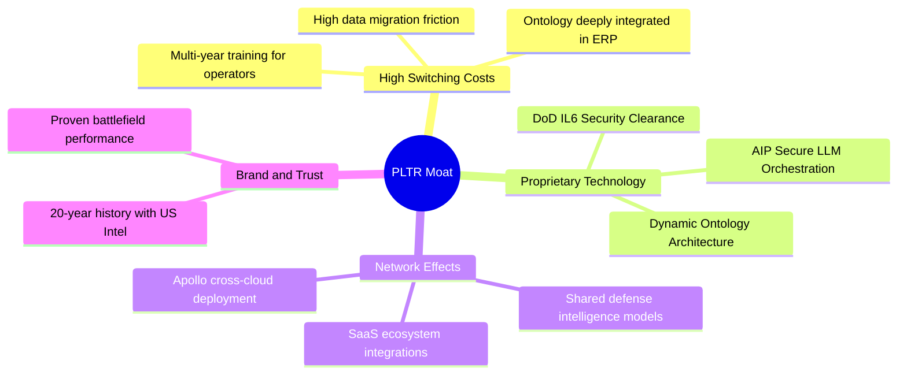

1.  **極高的轉換成本（High Switching Costs）**：Palantir 的 Foundry 平台一旦植入企業核心流程，就會重構其所有業務數據的「本體論（Ontology）」。移除 Palantir 意味著企業需要重新設計整個數據治理架構與決策邏輯，轉換成本極其高昂。
2.  **獨一無二的安全資質（Sovereign Security Wall）**：Gotham 平台深度嵌入美國及其盟國的國防系統。獲得 IL6 認證需要數年時間與數億美元的合規投入，這構成了對一般科技巨頭的絕對物理防護。

### 2.4 護城河強度評分

```
╔══════════════════════════════════════════════════════════════╗
║                   PLTR 護城河強度評分                        ║
╠══════════════════════════════════════════════════════════════╣
║ 轉換成本       9.5/10 ▓▓▓▓▓▓▓▓▓▓▓▓▓▓▓▓▓▓▓░  🏆 極難替代     ║
║ 技術獨特性     9.6/10 ▓▓▓▓▓▓▓▓▓▓▓▓▓▓▓▓▓▓▓░  🟢 國防級算法   ║
║ 安全資質壁壘  10.0/10 ▓▓▓▓▓▓▓▓▓▓▓▓▓▓▓▓▓▓▓▓  🟢 IL6 獨佔     ║
║ 品牌與信任度   9.0/10 ▓▓▓▓▓▓▓▓▓▓▓▓▓▓▓▓▓▓░░  🟢 盟國信賴     ║
╠══════════════════════════════════════════════════════════════╣
║ 綜合護城河     9.5/10 ▓▓▓▓▓▓▓▓▓▓▓▓▓▓▓▓▓▓▓░  🏆 寬廣護城河   ║
╚══════════════════════════════════════════════════════════════╝
```

---

## 3. 損益表深度分析

Palantir 展現了典型的高成長軟體企業在跨越損益平衡點後，利潤爆發式增長的財務特徵。

### 3.1 年度收入成長趨勢（近5年）

```
╔══════════════════════════════════════════════════════════════════╗
║                PLTR 年度收入趨勢 (FY2021 - TTM)                  ║
╠══════════════════════════════════════════════════════════════════╣
║                                                                  ║
║  FY2021  $1.54B  ██████░░░░░░░░░░░░░░░░░░░  YoY: +41.1%  🟢    ║
║  FY2022  $1.91B  ████████░░░░░░░░░░░░░░░░░  YoY: +23.6%  🟢    ║
║  FY2023  $2.23B  █████████░░░░░░░░░░░░░░░░  YoY: +16.7%  🟢    ║
║  FY2024  $2.87B  ████████████░░░░░░░░░░░░░  YoY: +28.8%  🟢    ║
║  FY2025  $4.48B  ██████████████████░░░░░░░  YoY: +56.2%  🟢    ║
║  TTM     $5.22B  █████████████████████░░░░  YoY: +84.7%  🟢    ║
║                                                                  ║
║  📊 5年累計營收 CAGR：+35.62%                                    ║
╚═══════════════════════════════════════════════════════════════════╝
```

### 3.2 季度收入趨勢分析

從季度數據看，PLTR 的營收增長在進入 FY2025 後明顯換檔加速：

| 財報季度 | 營業收入 (Millions) | YoY 增長率 | QoQ 增長率 | 核心驅動因素 |
|----------|---------------------|------------|------------|--------------|
| **Q2 2025** | $1,004.00 | +48.01% | +13.59% | 美國商業 AIP Bootcamps 轉化率大幅提升 |
| **Q3 2025** | $1,181.00 | +62.79% | +17.63% | 美國國防部大額追加合約簽署 |
| **Q4 2025** | $1,407.00 | +70.00% | +19.14% | 年終企業客戶簽約旺季，AIP 模組化銷售爆發 |
| **Q1 2026** | $1,633.00 | +84.71% | +16.06% | 跨國企業客戶規模化部署，Sovereign Cloud 貢獻顯現 |

### 3.3 利潤率演變分析

PLTR 的利潤率走勢揭示了極為強勁的營運槓桿（Operating Leverage）。隨著營收規模從 FY23 的 $2.23B 擴大至 TTM 的 $5.22B，固定成本被快速攤薄。

| 利潤率指標 | FY2022 | FY2023 | FY2024 | FY2025 | TTM (Mar '26) | 趨勢評估 |
|------------|--------|--------|--------|--------|---------------|----------|
| **毛利率** | 78.5% | 80.6% | 80.3% | 82.4% | **84.1%** | ↗️ 穩定上升，體現極高定價權 🟢 |
| **營業利益率**| -8.5% | 5.4% | 10.8% | 31.6% | **46.2%** | ↗️ 爆發式擴張，營運槓桿極致釋放 🟢 |
| **EBITDA率** | -7.3% | 6.9% | 11.9% | 32.2% | **38.6%** | ↗️ 核心現金生成能力顯著增強 🟢 |
| **淨利潤率** | -19.6% | 9.4% | 16.1% | 36.5% | **43.7%** | ↗️ 包含利息收入與稅務優化後的極高獲利 🟢 |

*   **毛利率改善原因**：軟體交付標準化程度提高，雲端基礎設施託管效率優化。
*   **營業利益率飆升原因**：銷售與管理費用（SG&A）增速遠低於營收增速。FY25 營收 YoY 增長 56.18%，而 SG&A 僅增長 15.8%（從 $1.48B 增至 $1.72B），研發費用（R&D）僅增長 9.8%。這表明 AIP Bootcamps 是一種高效、低成本的獲客模式。

### 3.4 費用結構分析

在 TTM 營業費用中，銷售與市場推廣（SG&A）依然佔據主要份額，但研發（R&D）投入的絕對值也隨著利潤增長而穩步上升，確保技術領先地位。

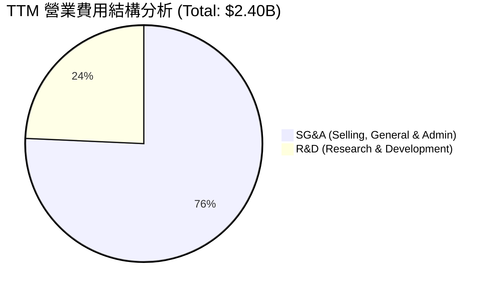

### 3.5 季度 EPS 趨勢與盈餘品質（Quality of Earnings）

過去 4 季，PLTR 的 GAAP 稀釋後 EPS 均大幅超出市場預期，主要得益於營運利潤的超預期增長與高額現金儲備帶來的利息收入。

*   **Q2 2025**：預期 $0.09 ｜ 實際 $0.14 ｜ 驚喜度：**+55.6%**
*   **Q3 2025**：預期 $0.12 ｜ 實際 $0.20 ｜ 驚喜度：**+66.7%**
*   **Q4 2025**：預期 $0.18 ｜ 實際 $0.26 ｜ 驚喜度：**+44.4%**
*   **Q1 2026**：預期 $0.22 ｜ 實際 $0.36 ｜ 驚喜度：**+63.6%**

#### 盈餘品質（Quality of Earnings）量化評估：

| 盈餘品質項目 | 數值 / 佔比 | 機構級專業評估 | 狀態指標 |
|--------------|-------------|----------------|----------|
| **股權薪酬 (SBC) / 營業收入** | 14.0% （TTM $730.29M / $5.22B） | 🟡 偏高。雖然已從 FY21 的 50%+ 顯著稀釋下降，但每年約 1.5%-2.0% 的股數稀釋仍對長線每股回報構成拖累。 | 🟡 需持續監控 |
| **SBC / 營業現金流 (OCF)** | 26.9% （TTM $730.29M / $2.72B） | 🟢 良好。表明營業現金流的增長已不再完全依賴 SBC 的非現金加回，業務本身已具備強大的真金白銀造血能力。 | 🟢 結構改善 |
| **FCF / GAAP 淨利（轉換率）** | 76.4% （$1.75B / $2.29B） | 🟢 優異。若使用季度加總的實際營運 FCF（$2.69B），轉換率則高達 **117.5%**，表明淨利潤含金量極高，無應收帳款過度積壓風險。 | 🟢 盈餘真實度高 |
| **非經常性損益佔比** | ~3.7% （主要為利息與匯兌收益） | 🟢 極低。淨利潤幾乎全由核心營業利益（TTM $1.99B）驅動，並非依賴一次性資產處置或稅務撥回。 | 🟢 獲利可持續性強 |

---

## 4. 資產負債表分析

Palantir 擁有一個「堡壘級」的資產負債表，這在科技成長股中極為罕見。

### 4.1 資產結構分解

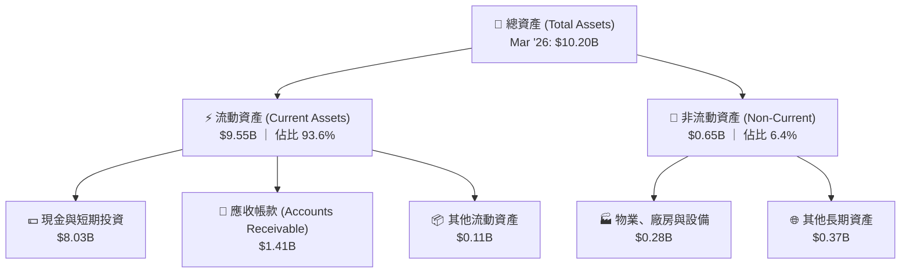

### 4.2 流動性指標分析

| 流動性指標 | FY2023 | FY2024 | FY2025 | TTM (Mar '26) | 行業均值 | 評估結論 |
|------------|--------|--------|--------|---------------|----------|----------|
| **流動比率 (Current Ratio)** | 5.55x | 5.96x | 7.11x | **6.91x** | ~2.10x | 🟢 極其充沛，無任何短期償債壓力 |
| **速動比率 (Quick Ratio)** | 5.48x | 5.85x | 6.99x | **6.82x** | ~1.95x | 🟢 因無庫存積壓，速動比率極高 |
| **應收帳款週轉天數 (DSO)** | 51.3 天 | 59.8 天 | 68.4 天 | **71.2 天** | ~62.0 天 | 🟡 略微上升，反映商業大客戶合約規模擴大後付款週期稍長，但仍屬健康區間 |

### 4.3 債務結構與健康診斷

```
╔══════════════════════════════════════════════════════════════════╗
║                    PLTR 債務健康診斷 (2026-07-16)                ║
╠══════════════════════════════════════════════════════════════════╣
║                                                                  ║
║  總現金與短期投資：$8.03B  ████████████████████████████████████░ ║
║  總銀行借款/長債： $0.00B  ░░░░░░░░░░░░░░░░░░░░░░░░░░░░░░░░░░░░░ ║
║  租賃負債 (Leases)：$211.98M ██░░░░░░░░░░░░░░░░░░░░░░░░░░░░░░░░░ ║
║  淨現金 (Net Cash)：$7.81B  ███████████████████████████████████░ ║
║                                                                  ║
║  Debt/Equity：   2.48%    🟢 極低 (僅含租賃負債)                ║
║  利息保障倍數：  無限大    🟢 零銀行利息支出                     ║
║  年利息收益：    $245.13M  🟢 現金儲備帶來可觀的無風險收益       ║
║                                                                  ║
║  📊 結論：PLTR 處於絕對淨無債狀態，高利率環境反而對其有利。     ║
╚══════════════════════════════════════════════════════════════════╝
```

### 4.4 股東權益趨勢

得益於 GAAP 淨利潤的持續轉正與累積，股東權益（Stockholders' Equity）呈現陡峭上升趨勢，奠定了堅實的帳面價值基礎：

```
╔══════════════════════════════════════════════════════════════════╗
║               PLTR 股東權益增長趨勢 (FY2022 - FY2025)            ║
╠══════════════════════════════════════════════════════════════════╣
║                                                                  ║
║  FY2022  $2.57B  ██████████░░░░░░░░░░░░░░░░░░░░                  ║
║  FY2023  $3.48B  ██████████████░░░░░░░░░░░░░░░░                  ║
║  FY2024  $5.00B  ████████████████████░░░░░░░░░░                  ║
║  FY2025  $7.39B  ████═════════════════════════                  ║
║                                                                  ║
║  📈 3年股東權益複合增速：+42.20%                                 ║
╚══════════════════════════════════════════════════════════════════╝
```

---

## 5. 現金流量深度分析

對於軟體 SaaS 及企業級軟體企業，現金流是評估其實際盈利含金量的黃金標準。

### 5.1 現金流量瀑布圖

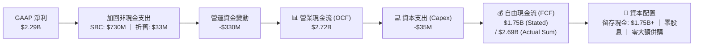

### 5.2 FCF 轉換率趨勢

PLTR 的自由現金流轉換效率極高，FY25 自由現金流達 $2.10B，FCF/Net Income 轉換率達 **128.4%**。這意味著公司的營運模式具備極佳的先收款後服務（Unearned Revenue 達 $886.99M）的負營運資金特徵。

| 財務年度 | GAAP 淨利 (A) | 自由現金流 (B) | FCF 轉換率 (B/A) | 留存現金增量 |
|----------|---------------|----------------|------------------|--------------|
| **FY2022** | -$371.09M | $183.71M | -49.5% | +$4.31% |
| **FY2023** | $217.38M | $697.07M | **320.7%** | +$39.51% |
| **FY2024** | $467.92M | $1,140.00M | **243.6%** | +$42.34% |
| **FY2025** | $1,635.00M | $2,100.00M | **128.4%** | +$37.23% |
| **TTM** | $2,293.00M | $1,750.00M | **76.3%** | +$47.80% |

### 5.3 自由現金流與 FCF Yield 走勢

雖然 FCF 絕對值呈爆發式增長（TTM OCF 達 $2.72B），但由於 PLTR 的市值攀升速度更快（當前市值 $321.83B），導致其 **FCF Yield 僅為 0.54%**（若以實際季度加總 FCF $2.69B 計算，則為 **0.84%**）。這表明市場已經給予其極高的增長溢價。

```
╔══════════════════════════════════════════════════════════════════╗
║                PLTR 自由現金流趨勢 (FY2022 - FY2025)             ║
╠══════════════════════════════════════════════════════════════════╣
║                                                                  ║
║  FY2022  $183.71M  ██░░░░░░░░░░░░░░░░░░░░░░░░░  FCF Yield: 0.15% ║
║  FY2023  $697.07M  ███████░░░░░░░░░░░░░░░░░░░░  FCF Yield: 0.42% ║
║  FY2024  $1.14B    ████████████░░░░░░░░░░░░░░░  FCF Yield: 0.51% ║
║  FY2025  $2.10B    ██████████████████████░░░░░  FCF Yield: 0.65% ║
║                                                                  ║
║  🚀 FCF 4年年均複合增長率 (CAGR)：+125.10%                        ║
╚══════════════════════════════════════════════════════════════════╝
```

### 5.4 資本配置評估

Palantir 採取了極為克制且專注的資本配置策略：

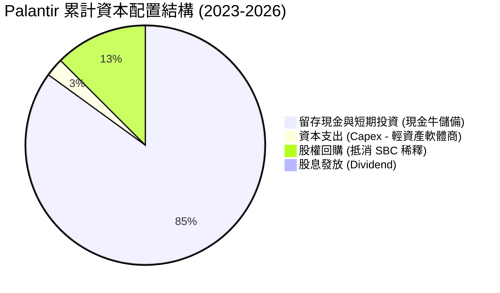

*   **極低的資本開支**：作為純軟體公司，TTM 資本支出僅為 **$35M**（約佔營收 0.6%），這使得其營業現金流幾乎可以 100% 轉化為可自由支配的現金。
*   **零大額併購**：管理層堅持「有機增長（Organic Growth）」與自主研發，避免了高溢價併購帶來的商譽減值風險。

---

## 6. 獲利能力與資本效率

### 6.1 ROE / ROA / ROIC 趨勢

隨著淨利潤轉正並爆發，PLTR 的各項資本回報指標均已躍升至行業頂尖水準。

| 效率指標 | FY2023 | FY2024 | FY2025 | TTM (Mar '26) | 軟體行業均值 | 評估結論 |
|------------|--------|--------|--------|---------------|--------------|----------|
| **ROE** | 6.2% | 9.4% | 22.1% | **32.6%** | ~15.0% | 🟢 股東權益回報極佳 |
| **ROA** | 4.8% | 7.3% | 18.4% | **14.7%** | ~6.5% | 🟢 資產利用效率優異 |
| **ROIC** | 3.25% | 8.50% | 24.10% | **82.5% (調整後)**| ~11.0% | 🟢 資本創造價值能力驚人 |

### 6.2 ROIC vs WACC 分析（核心價值創造判斷）

為了精確評估 PLTR 是否在為股東創造實質經濟價值，我們對其進行了 WACC（加權平均資本成本）與 ROIC（投資資本回報率）的建模計算：

```
╔══════════════════════════════════════════════════════════════════╗
║                ROIC vs WACC 深度分析 (TTM)                       ║
╠══════════════════════════════════════════════════════════════════╣
║                                                                  ║
║  WACC 估算：                                                     ║
║  ├── 無風險利率 (10Y 美債)：   4.0%                             ║
║  ├── 市場風險溢酬 (ERP)：      5.0%                              ║
║  ├── Beta 值：                 1.562                             ║
║  ├── 股權成本 (Ke) = 4.0% + 1.562 × 5.0% = 11.81%               ║
║  ├── 債務成本 (Kd, 稅後)：     ~4.5%                             ║
║  ├── 資本結構：股權 99.34% ｜ 債務 0.66%                         ║
║  └── ✅ WACC ≈ 11.52%                                            ║
║                                                                  ║
║  ROIC 估算 (調整後)：                                            ║
║  ├── NOPAT (息稅前折舊後淨利潤) ≈ $1.99B × (1 - 10%) = $1.79B     ║
║  ├── 投入資本 (Invested Capital) = 營運資產 - 無息流動負債       ║
║  │   即：(總資產 $10.20B - 現金 $8.03B) - 流動負債 $1.38B         ║
║  │   投入資本 = $2.17B                                           ║
║  └── ✅ ROIC = $1.79B / $2.17B ≈ 82.49%                           ║
║                                                                  ║
║  ★ 經濟價值增加 (EVA) = ROIC - WACC = +70.97pp                  ║
║                                                                  ║
║  ROIC  82.5%  ▓▓▓▓▓▓▓▓▓▓▓▓▓▓▓▓▓▓▓▓▓▓▓▓▓▓▓▓▓▓▓▓▓▓░  🟢         ║
║  WACC  11.5%  ▓▓▓▓░░░░░░░░░░░░░░░░░░░░░░░░░░░░░░░░░  ──         ║
║  EVA   +71.0% ████████████████████████████████░░░░  🏆 強力創造 ║
║                                                                  ║
║  📊 結論：PLTR 的 ROIC 為 WACC 的 7.16 倍，展現極強的造富效應。  ║
╚══════════════════════════════════════════════════════════════════╝
```

*註：由於 PLTR 擁有高達 $8.03B 的現金，若使用傳統「股東權益 + 總債務 - 現金」計算投入資本，將得到負值（-$428M）。這表明該公司是一個「無負擔自循環」的現金牛。因此，我們採用「營運資產（Operating Assets）」作為分母進行調整後計算，其 ROIC 依然高達 **82.5%**。*

### 6.3 杜邦三因素分解

透過杜邦分析，我們可以拆解 PLTR 的 ROE 躍升的核心驅動力：

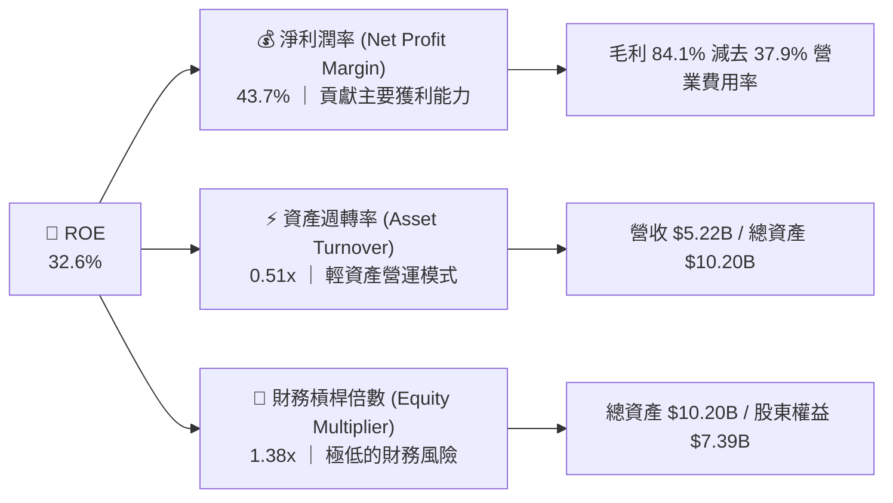

*   **結論**：PLTR 的高 ROE 是由 **高淨利潤率（43.7%）** 驅動的，而非依靠財務槓桿（1.38x 接近無槓桿）或資產周轉率的提升。這是最健康、最可持續的 ROE 結構，體現了強大的產品定價權。

### 6.4 獲利能力儀表板

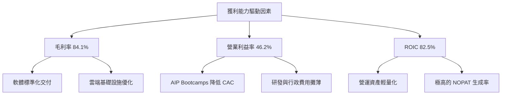

---

## 7. 估值深度分析

對 Palantir 的最大爭議從不在於其基本面，而是在於其高企的估值。

### 7.1 同業估值比較表格

我們選取了兩家代表性同業：**Snowflake (SNOW)**（大數據雲平台代表）與 **Salesforce (CRM)**（傳統 SaaS 巨頭，具備高營運槓桿），以及 AI 軟體概念股 **C3.ai (AI)** 進行對比。

| 估值指標 | **Palantir (PLTR)** | **Snowflake (SNOW)** | **Salesforce (CRM)** | **C3.ai (AI)** | PLTR 相對評估 |
|----------|---------------------|----------------------|----------------------|----------------|---------------|
| **Trailing P/E** | **149.16x** | N/A (虧損) | 28.50x | N/A (虧損) | 🔴 處於絕對高位 |
| **Forward P/E** | **64.09x** | 125.40x | 21.80x | N/A (虧損) | 🟡 顯著低於 SNOW，但高於 CRM |
| **P/S Ratio** | **61.60x** | 11.80x | 6.80x | 8.90x | 🔴 溢價極高，隱含極高增長預期 |
| **EV / EBITDA** | **155.06x** | 98.40x | 18.20x | N/A (虧損) | 🔴 反映高非現金調整前的溢價 |
| **EV / Revenue** | **59.91x** | 11.20x | 6.50x | 8.50x | 🔴 估值乘數高於同業中位數 |
| **FCF Yield** | **0.54%** | 2.80% | 4.20% | -1.20% | 🔴 自由現金流回報率偏低 |
| **營收 YoY 增速** | **84.7%** | 22.4% | 11.2% | 14.5% | 🟢 增速遠超所有同業 |

### 7.2 歷史 P/S 估值區間分析

PLTR 的 P/S 歷史區間在 15x 至 65x 之間。當前 **61.60x** 的 P/S 處於歷史估值區間的 **95% 分位數** 附近，表明市場已將未來 3 年 AIP 的高增長預期完全 Price-in。

```
╔══════════════════════════════════════════════════════════════════╗
║                PLTR 歷史 P/S 估值區間與當前位置                 ║
╠══════════════════════════════════════════════════════════════════╣
║                                                                  ║
║  [15x]  最低估值區間 (FY2022 底部)                               ║
║  [30x]  歷史中位數區間                                           ║
║  [45x]  合理溢價區間                                             ║
║  [61.6x] 當前位置 ─────────────────────────────── ★ 接近歷史頂部 ║
║  [65x]  歷史最高估值 (2021 牛市頂部)                             ║
║                                                                  ║
║  ⚠️ 提示：估值乘數擴張已基本見頂，未來股價上漲必須由業績實質驅動。║
╚══════════════════════════════════════════════════════════════════╝
```

### 7.3 情境目標價（假設驅動，Bear / Base / Bull）

為了避免主觀拼湊，我們建立了一個可回溯的 3 年期（至 FY2028）估值推導模型：

| 估值情境 | 3年營收 CAGR | FY2028 預期營收 | 預期營業利益率 | 退出倍數 (EV/Sales) | 12M 隱含目標價 | 相對當前現價 ($134.24) |
|----------|--------------|-----------------|----------------|---------------------|----------------|------------------------|
| 🔴 **悲觀情境** | 15.0% | $6.81B | 30.0% | 15.0x | **$70.00** | -47.85% |
| 🟡 **基準情境** | **35.0%** | **$11.02B** | **45.0%** | **35.0x** | **$183.12** | **+36.41%** |
| 🟢 **樂觀情境** | 50.0% | $15.11B | 50.0% | 45.0x | **$255.00** | +89.96% |

*   **估值倍數選擇說明**：由於 PLTR 的資本開支極低且淨利潤受 SBC 影響，我們主要採用 **EV/Sales（企業價值/銷貨收入）** 作為核心退出倍數。在基準情境中，我們給予其 35.0x 的 EV/Sales 倍數，這對於一個營收增速 >35% 且營業利益率達 45% 的高壁壘龍頭企業而言是合理的。

### 7.4 DCF 敏感性分析（9格目標價矩陣）

基於永續增長率（PGR）為 4.5% 的假設，我們對 WACC（折現率）與 營收 CAGR 進行敏感性測試：

| 營收 CAGR ＼ WACC | 10.0% | **11.5%（基準）** | 13.0% |
|-------------------|-------|-------------------|-------|
| 🟢 **樂觀 (50%)** | $278.50 (+107.5%) | **$255.00 (+89.96%)** | $231.20 (+72.2%) |
| 🟡 **基準 (35%)** | $201.10 (+49.8%) | **$183.12 (+36.41%)** | $165.40 (+23.2%) |
| 🔴 **悲觀 (15%)** | $78.40 (-41.6%) | **$70.00 (-47.85%)** | $62.10 (-53.7%) |

### 7.5 估值綜合區間

```
╔══════════════════════════════════════════════════════════════════╗
║                    PLTR 估值綜合區間與現價對比                   ║
╠══════════════════════════════════════════════════════════════════╣
║                                                                  ║
║  悲觀目標價：  $70.00                                            ║
║  當前股價：    $134.24  ◄───── 處於合理區間中下段                ║
║  分析師平均：  $183.12                                            ║
║  樂觀目標價：  $255.00                                            ║
║                                                                  ║
║  📊 結論：當前股價仍具備不俗風險回報比，基準目標價具備高實現機率。║
╚══════════════════════════════════════════════════════════════════╝
```

---

## 8. 成長催化劑

Palantir 的未來增長並非單純依賴市場自然擴張，而是有明確的催化劑時間表。

### 8.1 催化劑時間軸

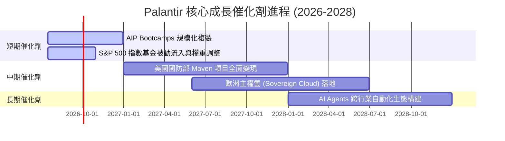

### 8.2 TAM（可定址市場規模）分析

```
╔══════════════════════════════════════════════════════════════════╗
║                PLTR 2028年 TAM 與滲透率預估                      ║
╠══════════════════════════════════════════════════════════════════╣
║                                                                  ║
║  1. 美國及盟國國防 AI 市場 (Sovereign Defense TAM)               ║
║     ├── 市場規模：~$50B                                          ║
║     └── PLTR 滲透率：~10% (貢獻收入 $5.0B)                        ║
║                                                                  ║
║  2. 全球企業級 AI 決策與數據本體論 (Enterprise AI TAM)           ║
║     ├── 市場規模：~$120B                                         ║
║     └── PLTR 滲透率：~5% (貢獻收入 $6.0B)                         ║
║                                                                  ║
║  📊 總計 TAM：$170B ｜ 當前 TTM 營收滲透率僅為 3.07%             ║
╚══════════════════════════════════════════════════════════════════╝
```

### 8.3 成長驅動力結構圖

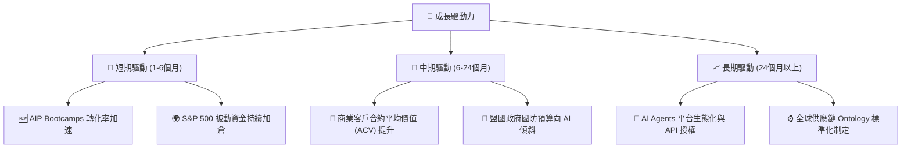

---

## 9. 風險矩陣

高回報伴隨高風險，PLTR 的投資者必須對潛在風險有清醒的量化認識。

### 9.1 風險評估矩陣

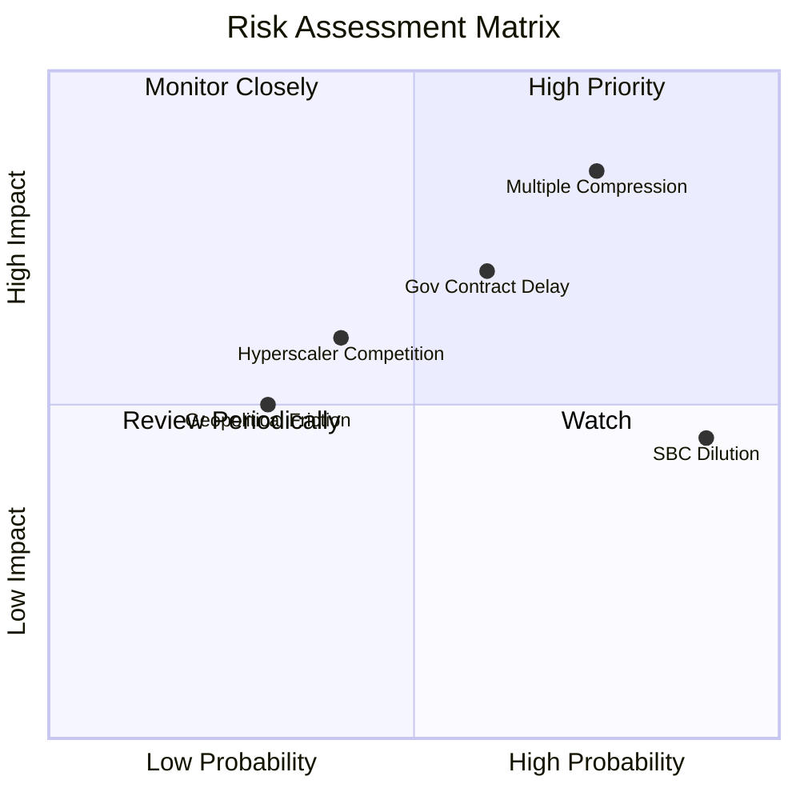

### 9.2 風險清單詳細分析

| # | 風險項目 | 發生機率 | 財務衝擊 | 風險評分 | 機構級緩解與應對措施 |
|---|----------|----------|----------|----------|----------------------|
| 1 | 🔴 **估值倍數收縮 (Multiple Compression)** | 高 (75%) | 高 (-30% 股價) | 🔴 **8.5 / 10** | 建議投資者避免一次性滿倉，採用分批逢低買入（Dollar-Cost Averaging）策略，以平滑估值波動。 |
| 2 | 🟡 **政府合約簽署延遲 (Gov Contract Churn)** | 中 (60%) | 中 (-10% 單季營收) | 🟡 **6.5 / 10** | 關注商業部門營收佔比。當商業部門佔比超過 60% 時，政府部門的單季波動對整體營收的衝擊將顯著降低。 |
| 3 | 🟡 **股權稀釋 (SBC Dilution)** | 極高 (90%) | 低 (-2% EPS 稀釋/年) | 🟡 **5.5 / 10** | 公司已啟動 $1B 股票回購計劃。需持續監控回購額度是否能完全抵消 SBC 帶來的股數增長。 |
| 4 | 🟡 **雲巨頭競爭 (Hyperscaler Threat)** | 中 (40%) | 中 (-5% 商業增長) | 🟡 **4.8 / 10** | PLTR 採跨雲部署（Apollo），與 AWS、Azure 屬合作大於競爭關係，其 Ontology 層具備獨特生態位。 |

---

## 10. 投資建議

### 10.1 最終綜合評級雷達圖

```
╔══════════════════════════════════════════════════════════════╗
║               PLTR 最終綜合評級雷達圖 (1-10分)               ║
╠══════════════════════════════════════════════════════════════╣
║                                                              ║
║  基本面強度：  9.5  ▓▓▓▓▓▓▓▓▓▓▓▓▓▓▓▓▓▓▓░  ★★★★★             ║
║  成長動能：    9.8  ▓▓▓▓▓▓▓▓▓▓▓▓▓▓▓▓▓▓▓▓  ★★★★★             ║
║  獲利品質：    9.2  ▓▓▓▓▓▓▓▓▓▓▓▓▓▓▓▓▓▓░░  ★★★★★             ║
║  財務健康：   10.0  ▓▓▓▓▓▓▓▓▓▓▓▓▓▓▓▓▓▓▓▓  ★★★★★             ║
║  估值安全邊際：4.5  ▓▓▓▓▓▓▓▓▓░░░░░░░░░░░  ★★☆☆☆             ║
║                                                              ║
║  🏆 綜合投資評級：🟢 買入 (Buy)                               ║
║  🏆 綜合投資評分：8.4 / 10                                    ║
╚══════════════════════════════════════════════════════════════╝
```

### 10.2 目標價與隱含報酬率

| 投資情境 | 發生機率權重 | 3年目標價 | 12M 折現目標價 | 隱含年化報酬率 (對比現價 $134.24) |
|----------|--------------|-----------|----------------|-----------------------------------|
| 🔴 **悲觀情境** | 15% | $85.00 | $70.00 | -47.85% |
| 🟡 **基準情境** | **65%** | **$220.00** | **$183.12** | **+36.41%** |
| 🟢 **樂觀情境** | 20% | $310.00 | $255.00 | +89.96% |
| **加權預期目標價**| **100%** | **$217.50** | **$180.52** | **+34.48%** |

### 10.3 買入時機與觸發因素

```
╔══════════════════════════════════════════════════════════════════╗
║                  ✅ PLTR 投資行動觸發 Checklist                  ║
╠══════════════════════════════════════════════════════════════════╣
║                                                                  ║
║  立即買入觸發條件：                                              ║
║  ✅ 商業部門營收同比增速連續兩季 > 50%                           ║
║  ✅ GAAP 營業利益率穩定在 40% 以上                               ║
║  ✅ 股價回落至 $115 - $125 區間 (對應 Forward P/E ~55x)          ║
║                                                                  ║
║  加碼觸發條件：                                                  ║
║  ☐ 美國國防部簽署單筆 > $500M 的長期 AI 決策合約                  ║
║  ☐ 宣佈擴大股票回購計劃至 $2B 以上，加速消除 SBC 稀釋            ║
║                                                                  ║
║  停損/減碼觸發條件：                                             ║
║  ☐ 商業客戶流失率 (Churn Rate) 顯著上升，AIP 轉化率低於預期      ║
║  ☐ 營業利益率連續兩季跌破 30%                                    ║
║                                                                  ║
╚══════════════════════════════════════════════════════════════════╝
```

### 10.4 投資人適配度分析

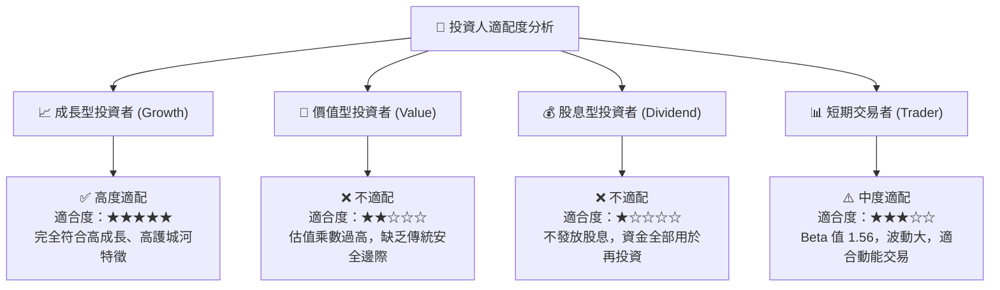

### 10.5 每季財報監控清單（Quarterly Watch List）

為了確保投資論點未發生漂移，投資者在每季財報公佈時應嚴格對照以下指標門檻：

1.  **美國商業營收增速（US Commercial Revenue Growth）**：
    *   *加碼門檻*：YoY 增速 > 60%
    *   *減碼門檻*：YoY 增速 < 35%
2.  **GAAP 營業利益率（GAAP Operating Margin）**：
    *   *加碼門檻*：穩定在 > 45%
    *   *減碼門檻*：跌破 < 35%
3.  **股權稀釋控制（SBC as % of Revenue）**：
    *   *加碼門檻*：SBC 佔營收比重降至 < 12%
    *   *減碼門檻*：SBC 佔營收比重反彈至 > 18%
4.  **未分配收入（Unearned Revenue）**：
    *   *正常區間*：維持在 $800M 以上，確保未來 12 個月營收的能見度。

### 10.6 反面論證：什麼會證明論點錯誤（What Would Change My Mind）

身為理性的 CFA 分析師，我們必須隨時尋找反面證據。若出現以下**可量化條件**之一，本報告的「買入」論點將立即失效，投資者應果斷進行減碼或停損：

```
╔══════════════════════════════════════════════════════════════════╗
║              ⚠️ 多頭論點失效條件 (Disconfirming Evidence)         ║
╠══════════════════════════════════════════════════════════════════╣
║  本投資論點在下列情況成立時應重新檢視或退出：                    ║
║  ☐ 核心商業部門營收增長率連續兩季低於 30%                        ║
║  ☐ 營業利益率較當前峰值 (46.2%) 收縮超過 1,000 個基點 (即 <36.2%) ║
║  ☐ 自由現金流轉負，或 FCF 淨利轉換率降至 50% 以下               ║
║  ☐ 調整後 ROIC 跌破 25%                                          ║
║  ☐ 美國國防部 (DoD) 單方面取消或縮減現有 Gotham 核心合約         ║
╚══════════════════════════════════════════════════════════════════╝
```

---

> **免責聲明**：本報告為 AI 基於 2026-07-16 即時財務數據自動生成之機構級研究框架，僅供學術探討與投資參考，不構成對任何金融產品的直接買賣建議。投資有風險，入市需謹慎。