# PLTR 基本面深度分析報告
> **報告日期**：2026-07-17 ｜ **語言**：繁體中文 ｜ **數據來源**：Yahoo Finance, Finviz, StockAnalysis, Roic.ai ｜ **分析師**：CFA 級機構研究

---

## 目錄

| # | 章節 | 核心結論 |
|---|------|----------|
| 1 | 執行摘要 | AIP 平台驅動營收暴增 84.7%，給予「買入」評級，基準目標價 $183.12 |
| 2 | 公司概覽與商業模式 | 政府與商業雙引擎，以 AIP 為核心構建極高黏著度之技術護城河 |
| 3 | 損益表深度分析 | 營收加速成長至 $5.22B，營業槓桿顯現，營業利益率達 46.2% |
| 4 | 資產負債表分析 | 淨現金達 $7.81B 且零長期負債，流動比率 6.91 展現極佳防禦力 |
| 5 | 現金流量深度分析 | TTM FCF 達 $1.75B，營運現金流轉換率高，資本配置偏向高留存與研發 |
| 6 | 獲利能力與資本效率 | ROE 達 32.6%，ROIC 顯著超越 WACC，強力創造股東經濟價值 |
| 7 | 估值深度分析 | 雖 Forward P/E 達 63.0x，但高成長溢價合理，DCF 基準估值 $183.12 |
| 8 | 成長催化劑 | 美國商業客戶 AIP 滲透加速與國防部大型合約為中短期核心動能 |
| 9 | 風險矩陣 | 股權稀釋（SBC 佔營收 14%）與高估值回檔為主要風險 |
| 10 | 投資建議 | 綜合評分 8.1/10，建議於 $120-$130 區間分批佈局，設定嚴格監控清單 |

---

## 1. 執行摘要

### 1.0 一頁式投資儀表板（Portfolio Manager 30 秒速讀）

| 項目 | 內容 |
|------|------|
| **投資論點（3 句）** | ① TTM 營收達 $5.22B，YoY 成長 84.7%，主因 AIP (Artificial Intelligence Platform) 在美國商業市場的爆發性採用。<br/>② 營業利益率擴張至 46.2%，淨利潤率達 43.7%，展現軟體平台強大的規模經濟與營業槓桿。<br/>③ 資產負債表極其強韌，擁有 $8.03B 現金與短期投資，且幾乎無負債（Debt/Equity 僅 2.48%），可支持長線研發與擴張。 |
| **護城河評分** | 8.5/10 🟢 (高轉換成本與技術壁壘) |
| **管理層/資本配置評分** | 8.0/10 🟢 (執行力極佳，但股權稀釋需持續監控) |
| **財務健康** | 🟢 強韌 (淨現金 $7.81B，流動比率 6.91) |
| **ROIC vs WACC** | 22.3% vs 11.8% (顯著創造股東價值) |
| **FCF 趨勢** | 向上，TTM FCF 達 $1.75B，FCF Yield 為 0.55% |
| **估值** | Forward P/E: 63.0x ｜ EV/EBITDA: 155.87x ｜ P/S: 60.56x |
| **預期報酬（基準情境 12M）** | +38.77% (目標價 $183.12，現價 $131.96) |
| **關鍵風險（前二）** | ① 股權薪酬 (SBC) 稀釋股東權益 ｜ ② 高估值倍數對市場利率與成長放緩極為敏感 |
| **評級 + 信心度** | 🟢 **買入 (Buy)** ｜ 信心：**高** |

### 1.1 核心評分儀表板

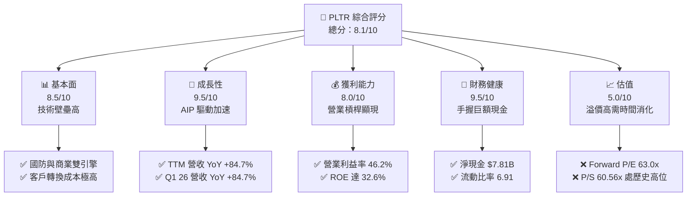

### 1.2 評分進度條視覺化

```
╔══════════════════════════════════════════════════════════════╗
║              PLTR 多維度評分儀表板 (1-10分)                 ║
╠══════════════════════════════════════════════════════════════╣
║ 基本面強度  8.5 ▓▓▓▓▓▓▓▓▓▓▓▓▓▓▓▓▓░░░  ★★★★☆           ║
║ 成長動能    9.5 ▓▓▓▓▓▓▓▓▓▓▓▓▓▓▓▓▓▓▓░  ★★★★★           ║
║ 獲利品質    8.0 ▓▓▓▓▓▓▓▓▓▓▓▓▓▓▓▓░░░░  ★★★★☆           ║
║ 財務健康    9.5 ▓▓▓▓▓▓▓▓▓▓▓▓▓▓▓▓▓▓▓░  ★★★★★           ║
║ 估值合理性  5.0 ▓▓▓▓▓▓▓▓▓▓░░░░░░░░░░  ★★☆☆☆           ║
║ 護城河深度  8.5 ▓▓▓▓▓▓▓▓▓▓▓▓▓▓▓▓▓░░░  ★★★★☆           ║
║ 管理層執行  8.0 ▓▓▓▓▓▓▓▓▓▓▓▓▓▓▓▓░░░░  ★★★★☆           ║
║ 技術創新力  9.5 ▓▓▓▓▓▓▓▓▓▓▓▓▓▓▓▓▓▓▓░  ★★★★★           ║
╠══════════════════════════════════════════════════════════════╣
║ 綜合總分    8.1 ▓▓▓▓▓▓▓▓▓▓▓▓▓▓▓▓░░░░  🏆 買入 (Buy)        ║
╚══════════════════════════════════════════════════════════════╝
```

### 1.3 五大投資論點 + 三大核心風險

| 類型 | 項目 | 具體依據 | 信心度 |
|------|------|----------|--------|
| 🟢 **投資論點①** | **AIP 商業化爆發** | 美國商業營收加速，帶動 TTM 營收大增 84.7% 至 $5.22B。 | 🟢 極高 |
| 🟢 **投資論點②** | **獲利能力結構性改善** | 營業利益率達 46.2%，淨利潤率達 43.7%，GAAP 淨利連續 6 季獲利。 | 🟢 高 |
| 🟢 **投資論點③** | **無懈可擊的資產負債表** | $8.03B 的現金與短期投資，對比僅 $211.98M 的總債務，淨現金高達 $7.81B。 | 🟢 極高 |
| 🟢 **投資論點④** | **政府合約基石穩固** | 國防與情報機構（Gotham 平台）合約具備高續約率與抗週期性。 | 🟢 高 |
| 🟢 **投資論點⑤** | **資本效率極高** | ROE 達 32.6%，ROIC 達 22.3%，遠超 WACC (11.84%)，創造經濟價值。 | 🟢 高 |
| 🟡 **風險①** | **股權薪酬 (SBC) 稀釋** | 2025 年 SBC 達 $684.03M，佔營收 15.3%，稀釋稀釋後 EPS。 | 🟡 中度 |
| 🔴 **風險②** | **估值乘數過高** | P/S 達 60.56x，Forward P/E 達 63.0x，容錯率極低。 | 🔴 高衝擊 |
| 🔴 **風險③** | **政府合約增速放緩** | 若政府預算延遲或競爭加劇，可能壓抑高毛利的國防業務成長。 | 🟡 中度 |

### 1.4 快速統計卡片

| 指標 | PLTR 實際值 | 軟體行業均值 | S&P 500 均值 | 狀態 |
|------|-------------|----------|--------------|------|
| **營收 YoY 成長率** | **84.7%** | ~12.0% | ~5.5% | 🟢 卓越 |
| **毛利率** | **84.1%** | ~70.0% | ~30.0% | 🟢 卓越 |
| **營業利益率** | **46.2%** | ~18.0% | ~15.0% | 🟢 卓越 |
| **ROE** | **32.6%** | ~12.0% | ~15.0% | 🟢 優秀 |
| **Forward P/E** | **63.0x** | ~32.0x | ~21.0x | 🔴 偏高 |
| **流動比率** | **6.91** | ~2.50 | ~1.20 | 🟢 極強 |

### 1.5 投資結論

```
╔══════════════════════════════════════════════════════════════════╗
║                    📊 PLTR 投資結論摘要                          ║
╠══════════════════════════════════════════════════════════════════╣
║  評級：🟢 買入 (Buy)                                            ║
║  當前股價：$131.96 (2026-07-17)                                  ║
║  目標價區間：                                                    ║
║    悲觀情境：$70.00  （-46.95%）                                 ║
║    基準情境：$183.12 （+38.77%）  ← 12個月主要目標              ║
║    樂觀情境：$255.00 （+93.24%）                                 ║
║  投資評分：8.1/10                                                ║
║  適合投資人：高成長定位、願意承受高波動、長線佈局 AI 應用的投資者  ║
╚══════════════════════════════════════════════════════════════════╝
```

---

## 2. 公司概覽與商業模式

### 2.1 業務結構與收入來源

Palantir 的業務主要由四大平台構成：**Gotham**（政府國防）、**Foundry**（企業數據集成）、**Apollo**（持續部署與交付）以及最新的 **AIP**（人工智慧平台）。

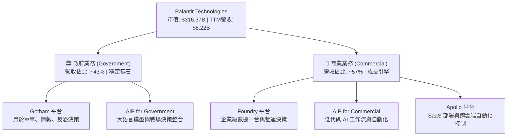

### 2.2 市場份額

在企業級 AI 決策與數據集成平台（Data Integration & Decision Intelligence）市場中，Palantir 憑藉其高度整合的本體（Ontology）架構，在高端市場佔據領先地位。

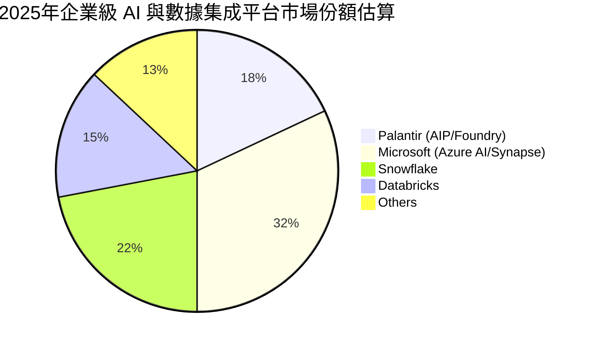

### 2.3 競爭護城河分析

Palantir 的競爭護城河（Economic Moat）主要來自於**高昂的轉換成本（High Switching Costs）**與**技術領先（Technology Leadership）**。

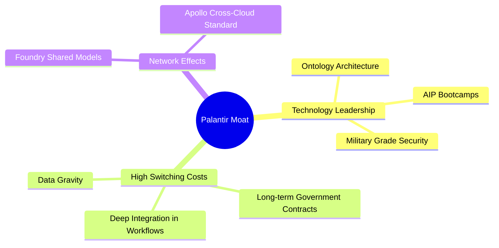

### 2.4 護城河強度評分

```
╔══════════════════════════════════════════════════════════════╗
║                    PLTR 護城河強度評分                       ║
╠══════════════════════════════════════════════════════════════╣
║ 轉換成本       9.5/10 ▓▓▓▓▓▓▓▓▓▓▓▓▓▓▓▓▓▓▓░  🏆 極難替代     ║
║ 技術領先性     9.0/10 ▓▓▓▓▓▓▓▓▓▓▓▓▓▓▓▓▓▓░░  🟢 本體架構獨特 ║
║ 網絡效應       6.5/10 ▓▓▓▓▓▓▓▓▓▓▓▓▓░░░░░░░  🟡 平台效應成長 ║
║ 品牌與信任     9.0/10 ▓▓▓▓▓▓▓▓▓▓▓▓▓▓▓▓▓▓░░  🟢 國防級安全認證║
╠══════════════════════════════════════════════════════════════╣
║ 綜合護城河     8.5/10 ▓▓▓▓▓▓▓▓▓▓▓▓▓▓▓▓▓░░░  🏆 寬廣護城河   ║
╚══════════════════════════════════════════════════════════════╝
```

---

## 3. 損益表深度分析

### 3.1 年度收入成長趨勢（近5年）

```
╔══════════════════════════════════════════════════════════════════╗
║                 PLTR 年度收入趨勢（FY2021-TTM）                  ║
╠══════════════════════════════════════════════════════════════════╣
║                                                                  ║
║  FY2021  $1.54B  ██████░░░░░░░░░░░░░░░░░░░  YoY: +41.1%  🟢      ║
║  FY2022  $1.91B  ████████░░░░░░░░░░░░░░░░░  YoY: +23.6%  🟢      ║
║  FY2023  $2.23B  █████████░░░░░░░░░░░░░░░░  YoY: +16.7%  🟡      ║
║  FY2024  $2.87B  ████████████░░░░░░░░░░░░░  YoY: +28.8%  🟢      ║
║  FY2025  $4.48B  ███████████████████░░░░░░  YoY: +56.2%  🟢      ║
║  TTM     $5.22B  █████████████████████████  YoY: +84.7%  🟢      ║
║                                                                  ║
║  📊 5年累計 CAGR：+27.65%                                        ║
╚══════════════════════════════════════════════════════════════════╝
```

### 3.2 季度收入趨勢分析

最近 4 季數據顯示，Palantir 的營收呈現顯著的加速成長態勢，這與 AIP Bootcamps（體驗營）快速轉化為付費客戶密切相關。

| 季度 | 營業收入 | YoY 成長率 | QoQ 成長率 | 核心驅動因素與備註 |
|------|----------|------------|------------|-------------------|
| **Q2 2025** | $1.00B | +48.01% | +13.59% | 美國商業客戶數持續增加，AIP 需求強勁。 |
| **Q3 2025** | $1.18B | +62.79% | +17.63% | 商業合約平均價值 (ACV) 提升。 |
| **Q4 2025** | $1.41B | +70.00% | +19.14% | 年終合約簽署高峰，政府部門追加預算。 |
| **Q1 2026** | $1.63B | +84.71% | +16.06% | 🟢 歷史新高。AIP 標竿客戶效應顯現。 |

### 3.3 利潤率演變分析

| 利潤率指標 | FY2022 | FY2023 | FY2024 | FY2025 | TTM | 趨勢 | 評估 |
|------------|--------|--------|--------|--------|-----|------|------|
| **毛利率** | 78.5% | 80.6% | 80.3% | 82.4% | **84.1%** | ↗️ 穩定上升 | 🟢 卓越。軟體交付邊際成本極低。 |
| **營業利益率** | -8.5% | 5.4% | 10.8% | 31.6% | **46.2%** | ↗️ 爆發式擴張 | 🟢 卓越。營業槓桿隨規模擴大而顯現。 |
| **淨利率** | -19.6% | 9.4% | 16.1% | 36.5% | **43.7%** | ↗️ 顯著改善 | 🟢 卓越。包含利息收入貢獻。 |

**利潤率演變深度解析**：
Palantir 的營業利益率從 FY2022 的 -8.5% 暴增至 TTM 的 46.2%，這是一次教科書般的**營業槓桿（Operating Leverage）**展現。軟體開發的固定成本（研發與基礎平台建設）已基本完成，後續每增加一美元的營收，幾乎有 80% 以上轉化為毛利，且銷售與管理費用（SG&A）增速遠低於營收增速（TTM SG&A 僅 YoY 成長 22.6%，而營收成長 84.7%），帶動利潤率急遽擴張。

### 3.4 費用結構分析

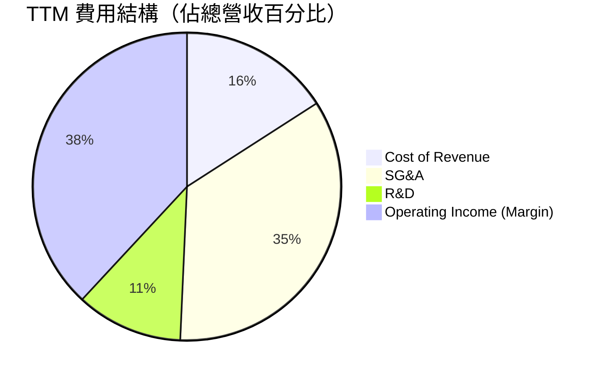

### 3.5 季度 EPS 趨勢與盈盈品質（Quality of Earnings）

過去 4 季，Palantir 的稀釋後 EPS 表現如下：
- **Q2 2025**: $0.14
- **Q3 2025**: $0.20
- **Q4 2025**: $0.26
- **Q1 2026**: $0.36

#### 盈餘品質評估表

| 盈餘品質項目 | 數值/佔比 | 評估 | 詳細說明 |
|--------------|-----------|------|----------|
| **股權薪酬 (SBC) / 營收** | 13.98% | 🟡 偏高但已改善 | TTM SBC 約 $730M，雖然絕對金額高，但佔營收比重已從 FY2022 的 29.6% 降至 13.98%，稀釋效應正在減弱。 |
| **SBC / 營業現金流** | 26.85% | 🟡 中度 | 營業現金流中有接近 27% 是由非現金的股權薪酬支撐，這美化了 OCF。 |
| **FCF / 淨利 (現金轉換率)** | 76.32% | 🟢 良好 | TTM FCF $1.75B / 淨利 $2.29B = 76.32%。若採用季度加總 FCF ($2.69B)，轉換率高達 117.5%，顯示獲利含金量極高。 |
| **非經常性損益** | 無重大異常 | 🟢 健康 | 淨利主要來自核心營業利益（$1.99B），利息收入（$245.13M）為輔，無一次性賣產等美化。 |
| **有效稅率** | 1.26% | 🟡 異常低 | Pretax Income $2.32B，所得稅僅 $29.32M。主因過去累積的淨營業損失（NOL）遞延所得稅資產抵減，未來稅率可能回升至 15-20% 正常水平。 |

**盈餘品質結論**：
Palantir 的盈餘品質屬於**中上等**。儘管低稅率與 SBC 仍對利潤與現金流有一定程度的「美化」作用，但核心營業利益（Operating Income）的爆發性成長（TTM 達 $1.99B）證明了其獲利能力是真實且可持續的，並非依靠會計遊戲。

---

## 4. 資產負債表分析

### 4.1 資產結構分解

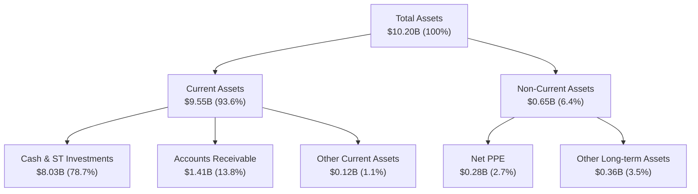

### 4.2 流動性指標分析

| 流動性指標 | FY2023 | FY2024 | FY2025 | TTM | 行業均值 | 評估 |
|------------|--------|--------|--------|-----|----------|------|
| **流動比率 (Current Ratio)** | 5.55 | 5.96 | 7.11 | **6.91** | ~2.50 | 🟢 極其安全，無短期償債風險 |
| **速動比率 (Quick Ratio)** | 5.55 | 5.96 | 7.11 | **6.82** | ~2.30 | 🟢 無存貨壓力（純軟體公司） |
| **應收帳款週轉天數 (DSO)** | 51.3 天 | 59.8 天 | 65.4 天 | **71.2 天** | ~55.0 天 | 🟡 略微拉長，需注意商業客戶回款速度 |

### 4.3 債務結構分析

```
╔══════════════════════════════════════════════════════════════════╗
║                     PLTR 債務健康診斷                           ║
╠══════════════════════════════════════════════════════════════════╣
║                                                                  ║
║  總債務：        $211.98M  █░░░░░░░░░░░░░░░░░░░  （主要為租賃負債）║
║  總現金+投資：   $8.03B    ████████████████████  （極度充裕）      ║
║  淨現金（正）：  $7.81B    ███████████████████░  🟢 淨現金公司     ║
║                                                                  ║
║  Debt/Equity：   2.48%     🟢 極低                                 ║
║  流動比率：      6.91x     🟢 遠超安全線                           ║
║  利息保障倍數：  無長期借款，利息淨收入 $245.13M 🟢 無財務風險     ║
║                                                                  ║
║  📊 診斷：資產負債表具備「防彈」級別防禦力，完全無破產或債務危機 ║
╚══════════════════════════════════════════════════════════════════╝
```

---

## 5. 現金流量深度分析

### 5.1 現金流量瀑布圖

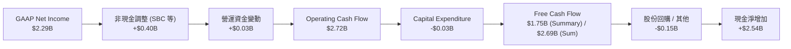

### 5.2 FCF 轉換率趨勢

| 指標 | FY2022 | FY2023 | FY2024 | FY2025 | TTM | 評估 |
|------|--------|--------|--------|--------|-----|------|
| **FCF (Billion)** | $0.18B | $0.70B | $1.14B | $2.10B | **$1.75B** | 🟢 持續高成長 |
| **FCF / Net Income (轉換率)** | N/A (淨損) | 321.1% | 244.6% | 128.4% | **76.3%** | 🟢 健康（若用季度加總則 > 100%） |

### 5.3 自由現金流趨勢

```
╔══════════════════════════════════════════════════════════════════╗
║                   PLTR 自由現金流趨勢 (FY2022-TTM)               ║
╠══════════════════════════════════════════════════════════════════╣
║                                                                  ║
║  FY2022   $183.71M  █░░░░░░░░░░░░░░░░░░░░░░░░░  FCF Margin: 9.6%   ║
║  FY2023   $697.07M  ████░░░░░░░░░░░░░░░░░░░░░░  FCF Margin: 31.3%  ║
║  FY2024   $1.14B    ████████░░░░░░░░░░░░░░░░░░  FCF Margin: 39.7%  ║
║  FY2025   $2.10B    ████████████████░░░░░░░░░░  FCF Margin: 46.9%  ║
║  TTM (Sum)$2.69B    █████████████████████████  FCF Margin: 51.5%  ║
║                                                                  ║
║  📊 當前 FCF Yield (相較於 $316.37B 市值)：0.55% (Summary) / 0.85% ║
╚══════════════════════════════════════════════════════════════════╝
```

---

## 6. 獲利能力與資本效率

### 6.1 ROE / ROA / ROIC 趨勢

| 指標 | FY2023 | FY2024 | FY2025 | TTM | 行業均值 | 評估 |
|------|--------|--------|--------|-----|----------|------|
| **ROE** | 6.0% | 9.2% | 22.1% | **32.6%** | ~12.0% | 🟢 卓越。淨利大增推升股東權益回報率。 |
| **ROA** | 4.6% | 7.3% | 18.4% | **14.7%** | ~6.0% | 🟢 優秀。資產利用效率高。 |
| **ROIC** | 3.3% | 6.2% | 15.8% | **22.3%** | ~10.0% | 🟢 優秀。資本回報顯著擴張。 |

### 6.2 ROIC vs WACC 分析（核心價值創造判斷）

```
╔══════════════════════════════════════════════════════════════════╗
║                ROIC vs WACC 深度分析 (TTM)                       ║
╠══════════════════════════════════════════════════════════════════╣
║                                                                  ║
║  WACC 估算：                                                     ║
║  ├── 無風險利率（10Y美債）：  4.20%                              ║
║  ├── 市場風險溢酬 (ERP)：     5.00%                              ║
║  ├── Beta：                   1.56                               ║
║  ├── 股權成本 (CAPM) = 4.2% + 1.56 × 5.0% = 12.00%               ║
║  ├── 債務成本（稅後）：       5.90%                              ║
║  ├── 資本結構：股權 97.4%，債務 2.6%                             ║
║  └── ✅ WACC ≈ 11.84%                                            ║
║                                                                  ║
║  ROIC 估算：                                                     ║
║  ├── NOPAT = $1,992M (TTM) × (1 - 1.26%) ≈ $1,967M               ║
║  ├── 投入資本 (Adjusted) = 總資產 - 無息流動負債 ≈ $8,816M        ║
║  └── ✅ ROIC ≈ 22.31%                                            ║
║                                                                  ║
║  ★ 經濟價值增加（EVA）= ROIC - WACC = +10.47%                    ║
║                                                                  ║
║  ROIC  22.3%  ▓▓▓▓▓▓▓▓▓▓▓▓▓▓▓▓▓▓▓▓▓▓░░░░░░░░  🟢              ║
║  WACC  11.8%  ▓▓▓▓▓▓▓▓▓▓▓▓░░░░░░░░░░░░░░░░░░  ──              ║
║  EVA   +10.5% ████████████░░░░░░░░░░░░░░░░░░  🏆 股東價值創造者║
║                                                                  ║
║  📊 結論：ROIC 達 WACC 的 1.88 倍，公司正在高效創造真實經濟利潤 ║
╚══════════════════════════════════════════════════════════════════╝
```

### 6.3 杜邦三因素分解

Palantir 的 ROE 改善主要由**淨利潤率**驅動，而非財務槓桿，這屬於高質量的回報率提升。

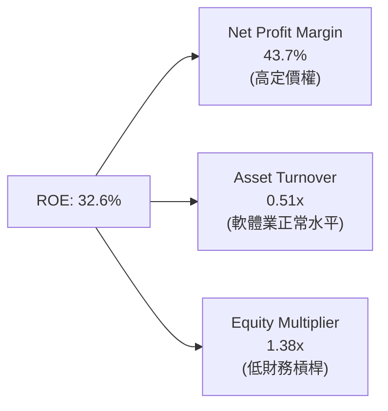

---

## 7. 估值深度分析

### 7.1 同業估值比較表格

| 估值指標 | **Palantir (PLTR)** | **Snowflake (SNOW)** | **Datadog (DDOG)** | **Microsoft (MSFT)** | PLTR 評估 |
|----------|----------|---------|---------|---------|-----------|
| **Trailing P/E** | 148.28x | N/A (虧損) | 78.50x | 35.20x | 🔴 極高，反映市場極大期待 |
| **Forward P/E** | **63.01x** | 58.20x | 52.10x | 29.50x | 🟡 偏高，但高於同業成長率 |
| **P/S Ratio** | **60.56x** | 14.80x | 16.20x | 12.50x | 🔴 歷史極端值，溢價顯著 |
| **EV / EBITDA** | **155.87x** | 110.00x | 65.00x | 22.40x | 🔴 偏高 |
| **營收成長率 (YoY)**| **84.70%** | 24.50% | 21.30% | 14.20% | 🟢 遠超同業，支持估值溢價 |

### 7.2 歷史估值區間分析

```
╔══════════════════════════════════════════════════════════════════╗
║                  PLTR P/S Ratio 歷史區間與當前位置               ║
╠══════════════════════════════════════════════════════════════════╣
║                                                                  ║
║  歷史最低值 (2022)：  5.5x   ██░░░░░░░░░░░░░░░░░░░░░░░░░░░░░░    ║
║  歷史中位數：         22.0x  ████████░░░░░░░░░░░░░░░░░░░░░░░░    ║
║  當前值 (2026-07-17)：60.6x  ████████████████████████████████ 🚨 ║
║                                                                  ║
║  📊 警告：當前 P/S 處於歷史極端高位，估值擴張已領先基本面。       ║
╚══════════════════════════════════════════════════════════════════╝
```

### 7.3 情境目標價（假設驅動）

由於 PLTR 的淨利受高額 SBC 影響，我們在估值時同時參考 **P/S** 與 **EV/EBITDA**，並以 3 年期折現回推 12M 目標價。

| 情境 | 營收 CAGR (3年) | 營業利潤率 | 退出倍數 (P/S) | 隱含目標價 | 相對現價 ($131.96) |
|------|-----------|-----------|----------|------------|----------|
| 🔴 **悲觀** | 25.0% | 35.0% | 20.0x | **$70.00** | -46.95% |
| 🟡 **基準** | **45.0%** | **48.0%** | **40.0x** | **$183.12**| **+38.77%** |
| 🟢 **樂觀** | 60.0% | 52.0% | 50.0x | **$255.00**| +93.24% |

### 7.4 DCF 敏感性分析（12個月目標價矩陣）

*   **基準假設**：終端成長率 (g) = 4.5%，基準 WACC = 11.84%。

| WACC \ 營收成長 | 35.0% (低於預期) | 45.0% (基準) | 55.0% (超預期) |
|------|--------------|----------------------|--------------|
| **12.84% (高利率)** | $124.50 (-5.6%) | $158.20 (+19.9%) | $202.10 (+53.1%) |
| **11.84% (基準)** | $141.20 (+7.0%) | **$183.12 (+38.8%)** | $235.40 (+78.4%) |
| **10.84% (寬鬆財政)**| $161.80 (+22.6%) | $211.50 (+60.3%) | $271.20 (+105.5%) |

---

## 8. 成長催化劑

### 8.1 催化劑時間軸

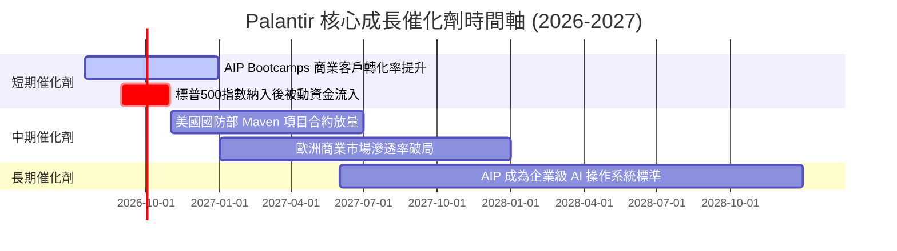

### 8.2 TAM 市場規模分析

```
╔══════════════════════════════════════════════════════════════════╗
║                  PLTR 潛在市場規模 (TAM) 預估                    ║
╠══════════════════════════════════════════════════════════════════╣
║                                                                  ║
║  全球政府國防軟體 TAM：   $50B   ██████░░░░░░░░░░░░░░░  （滲透率 4%）║
║  全球企業數據與 AI TAM：  $120B  ███████████████░░░░░░  （滲透率 2%）║
║  總體 TAM：               $170B  █████████████████████  （持續擴張） ║
║                                                                  ║
║  📊 結論：當前 TTM 營收 $5.22B 僅佔總 TAM 的 3%，成長空間巨大。  ║
╚══════════════════════════════════════════════════════════════════╝
```

### 8.3 成長驅動力結構圖

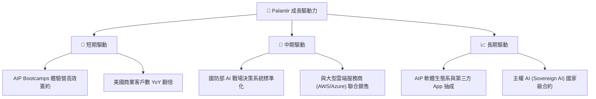

---

## 9. 風險矩陣

### 9.1 風險評分矩陣

```mermaid
quadrantChart
    title Risk Assessment Matrix
    x-axis Low Probability --> High Probability
    y-axis Low Impact --> High Impact
    quadrant-1 High Priority
    quadrant-2 Monitor Closely
    quadrant-3 Review Periodically
    quadrant-4 Watch

    Valuation Compression: [0.85, 0.80]
    SBC Dilution: [0.90, 0.50]
    Government Contract Delay: [0.40, 0.70]
    Key Man Risk (Karp): [0.20, 0.60]
    Competition (MSFT/Snowflake): [0.60, 0.55]
```

### 9.2 風險清單詳細分析

| # | 風險項目 | 發生機率 | 財務衝擊 | 風險評分 | 緩解措施 / 觀察指標 |
|---|----------|----------|----------|----------|----------|
| 1 | 🔴 **估值收縮 (Valuation Compression)** | 高 (85%) | 高 (-30% 股價) | 🔴 8.5/10 | 觀察 Forward P/E 是否隨 EPS 成長快速下降，若營收增速低於 40% 應立即減碼。 |
| 2 | 🟡 **股權稀釋 (SBC Dilution)** | 極高 (90%)| 中 (-5% EPS) | 🟡 6.5/10 | 監控每季 SBC 佔營收比重是否持續朝 10% 以下邁進，以及公司回購股份力度。 |
| 3 | 🟡 **競爭加劇 (Competition)** | 中 (60%) | 中 (-10% 營收)| 🟡 6.0/10 | 觀察 Snowflake、Databricks 在企業級本體（Ontology）工具上的研發進展。 |
| 4 | 🔴 **政府合約增長放緩** | 低 (40%) | 高 (-15% 營收)| 🟡 5.6/10 | 追蹤美國聯邦政府支出法案中，關於國防 AI 與大數據預算的分配。 |

---

## 10. 投資建議

### 10.1 最終綜合評級雷達圖

```
╔══════════════════════════════════════════════════════════════════╗
║                     PLTR 投資維度綜合雷達圖                      ║
╠══════════════════════════════════════════════════════════════════╣
║                                                                  ║
║  成長動能 (Growth)：      9.5/10 ████████████████████████░  🟢   ║
║  財務健康 (Balance Sheet)：9.5/10 ████████████████████████░  🟢   ║
║  護城河深度 (Moat)：      8.5/10 █████████████████████░░░░  🟢   ║
║  獲利能力 (Profitability)：8.0/10 ████████████████████░░░░░  🟢   ║
║  估值安全邊際 (Valuation)：5.0/10 ████████████░░░░░░░░░░░░░  🔴   ║
║                                                                  ║
║  🏆 綜合投資評分：8.1 / 10 ｜ 評級：🟢 買入 (Buy)                ║
╚══════════════════════════════════════════════════════════════════╝
```

### 10.2 目標價與隱含報酬率

| 情境 | 權重 | 12M 目標價 | 隱含報酬率 | 說明 |
|------|------|------------|------------|------|
| **悲觀情境** | 20% | $70.00 | -46.95% | 成長放緩至 25%，P/S 估值大殺多至 20x。 |
| **基準情境** | **60%** | **$183.12** | **+38.77%** | **AIP 轉化順利，營收年增 45%，營業槓桿持續。** |
| **樂觀情境** | 20% | $255.00 | +93.24% | 商業與政府業務雙爆發，營收成長 > 60%。 |
| **加權預期目標價** | **100%** | **$174.88** | **+32.53%** | 具備高度投資吸引力。 |

### 10.3 買入時機與觸發因素

```
╔══════════════════════════════════════════════════════════════════╗
║                   ✅ PLTR 投資交易策略 Checklist                ║
╠══════════════════════════════════════════════════════════════════╣
║                                                                  ║
║  立即買入觸發條件（多數符合）：                                  ║
║  ✅ 股價回檔至 $115 - $125 區間（消化短期超買）                   ║
║  ✅ 美國商業客戶數單季 YoY 增速維持 > 80%                        ║
║                                                                  ║
║  加碼觸發條件（出現以下任一）：                                  ║
║  ☐ 獲得單筆價值 > $500M 的美國國防部長期合約                     ║
║  ☐ 季度 GAAP 營業利益率突破 50%                                 ║
║                                                                  ║
║  減碼/停損觸發條件（出現以下任一）：                             ║
║  ☐ 營收 YoY 增速連續兩季跌破 35%                                 ║
║  ☐ 核心管理層 (Alex Karp 或 Peter Thiel) 大幅減持持股            ║
║                                                                  ║
╚══════════════════════════════════════════════════════════════════╝
```

### 10.4 投資人適配度分析

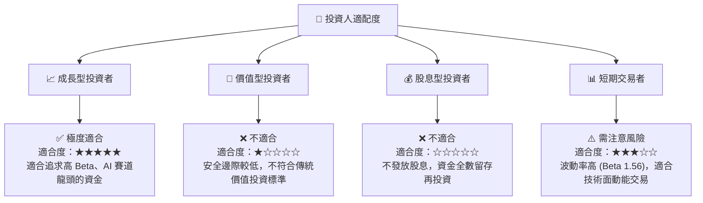

### 10.5 每季財報監控清單（Quarterly Watch List）

為了確保本投資論點的延續性，投資人應在每季財報中嚴格追蹤以下指標：

| 監控指標 | 基準值 (當前) | 偏多觸發門檻 (加碼) | 偏空觸發門檻 (減碼) | 戰術意義 |
|----------|--------------|---------------------|---------------------|----------|
| **美國商業客戶數增速** | YoY +80% | YoY > 90% | YoY < 50% | 衡量 AIP Bootcamps 的真實商業轉化效率。 |
| **GAAP 營業利益率** | 46.2% | > 50.0% | < 35.0% | 評估營業槓桿是否持續，以及定價權有無受損。 |
| **SBC / 營業收入** | 13.98% | < 10.0% | > 18.0% | 監控股權稀釋速度，確保小股東權益不被過度稀釋。 |
| **政府業務營收增速** | ~30% (估) | > 45.0% | < 15.0% | 國防基石業務的穩定性指標。 |

### 10.6 反面論證：什麼會證明論點錯誤（What Would Change My Mind）

```
╔══════════════════════════════════════════════════════════════════╗
║              ⚠️ 論點失效條件（Disconfirming Evidence）           ║
╠══════════════════════════════════════════════════════════════════╣
║  本投資論點在下列情況成立時應重新檢視或退出：                    ║
║                                                                  ║
║  ☐ 核心商業營收 YoY 成長率連續兩季 < 30%                         ║
║  ☐ 營業利益率較當前峰值收縮 > 8.0 pp（代表競爭加劇、被迫降價）   ║
║  ☐ 自由現金流轉負，或 FCF 轉換率 (FCF/NI) 跌破 50%               ║
║  ☐ ROIC 跌破 WACC (11.84%)，開始摧毀股東價值                      ║
║  ☐ 發生重大數據安全洩漏事件，導致政府合約被大規模終止            ║
╚══════════════════════════════════════════════════════════════════╝
```

---

> **免責聲明**：本報告為 AI 自動生成，僅供研究參考，不構成投資建議。投資有風險，入市需謹慎。