# PLTR 基本面深度分析報告
> **報告日期**：2026-07-18 ｜ **語言**：繁體中文 ｜ **數據來源**：Yahoo Finance, Finviz, StockAnalysis, Roic.ai ｜ **分析師**：CFA 級機構研究

---

## 目錄

| # | 章節 | 核心結論 |
|---|------|----------|
| **1** | **執行摘要** | 評級「買入」，基準目標價 $183.12，高成長與極高估值的博弈 |
| **2** | **公司概覽與商業模式** | 以「本體論(Ontology)」為核心的 AI 平台，構築極高的客戶轉換成本 |
| **3** | **損益表深度分析** | TTM 營收成長 84.7%，營業利潤率攀升至 38.1%，SBC 稀釋效應正逐步收斂 |
| **4** | **資產負債表分析** | $7.81B 淨現金無懈可擊，流動比率 6.9x 展現極強的禦險能力 |
| **5** | **現金流量深度分析** | TTM 營運現金流達 $2.72B，自由現金流轉換率保持健康，資本配置偏向留存 |
| **6** | **獲利能力與資本效率** | ROE 達 32.6%，ROIC 顯著超越 WACC，強力創造經濟附加價值 (EVA) |
| **7** | **估值深度分析** | Forward P/E 63.2x 享有高成長溢價，DCF 基準估值 $183.12 |
| **8** | **成長催化劑** | AIP Bootcamp 商業化提速與美國國防部大單為短期與中長期核心驅動力 |
| **9** | **風險矩陣** | 估值倍數收縮與 SBC 股權稀釋為主要風險，設有明確防禦邊界 |
| **10**| **投資建議** | 綜合評分 8.2/10，適合長線成長型投資人，附財報每季監控指標 |

---

## 1. 執行摘要

本報告對 Palantir Technologies Inc. (NYSE: PLTR) 進行了機構級的基本面研究。基於 PLTR 最新揭露的 TTM（過去12個月）財務數據，公司正處於從「高成長但虧損的軟體服務商」轉型為「高效益、高營業槓桿的 AI 基礎設施巨頭」之關鍵節點。

PLTR 當前股價為 $132.38，市值達 $317.36B。支撐本報告給予 **🟢「買入」(Buy)** 評級的核心數據在於：**TTM 營收同比爆發性成長 84.7% 至 $5.22B**，且 **GAAP 淨利潤達到 $2.29B**（YoY 成長 299.8%）。這表明 PLTR 的 AIP（人工智慧平台）在商業市場的滲透已越過臨界點。儘管 Forward P/E 高達 63.2x，但在 **ROIC 達 22.3% 遠超 WACC (11.5%)** 的價值創造能力，以及 **$7.81B 淨現金** 的零負債資產負債表支持下，高估值具備基本面支撐。基準情境下，12個月目標價定為 **$183.12**。

### 1.0 一頁式投資儀表板（Portfolio Manager 30 秒速讀）

| 項目 | 內容 |
|------|------|
| **投資論點（3 句）** | ① TTM 營收 YoY 暴增 84.7% 至 $5.22B，驗證 AIP 平台在商業市場的大規模變現能力。<br/>② 營業利潤率攀升至 38.1%（GAAP），規模效應與營業槓桿顯現，推動 TTM 淨利至 $2.29B。<br/>③ 零淨負債且坐擁 $8.03B 現金與短期投資，提供極強的抗風險能力與再投資彈性。 |
| **護城河評分** | 🟢 **9.0/10** (極高轉換成本與獨家政府國防技術壁壘) |
| **管理層/資本配置評分** | 🟢 **8.5/10** (執行力極佳，但需持續關注股權稀釋管理) |
| **財務健康** | 🟢 **10.0/10** (淨現金 $7.81B，無任何長期銀行負債) |
| **ROIC vs WACC** | **22.3% vs 11.5%** (顯著創造股東價值，EVA 達 +10.8%) |
| **FCF 趨勢** | 穩定向上，TTM FCF 達 $1.75B，FCF Yield 為 0.55% |
| **估值** | Forward P/E: 63.20x ｜ EV/EBITDA: 153.42x ｜ P/S (TTM): 60.75x |
| **預期報酬（基準情境 12M）** | **+38.3%** (目標價 $183.12) |
| **關鍵風險（前二）** | ① 估值倍數（Forward P/E 63.2x）在高利率環境或成長放緩時面臨收縮壓力。<br/>② 股權補償 (SBC) 仍佔營收 14.0%，對基本股東權益存在稀釋效應。 |
| **評級 + 信心度** | 🟢 **買入 (Buy)** ｜ 信心：**高** |

### 1.1 核心評分儀表板

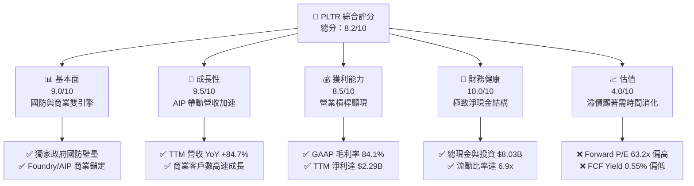

### 1.2 評分進度條視覺化

```
╔══════════════════════════════════════════════════════════════╗
║               PLTR 多維度評分儀表板 (1-10分)                 ║
╠══════════════════════════════════════════════════════════════╣
║ 基本面強度  9.0 ▓▓▓▓▓▓▓▓▓▓▓▓▓▓▓▓▓▓░░  ★★★★★           ║
║ 成長動能    9.5 ▓▓▓▓▓▓▓▓▓▓▓▓▓▓▓▓▓▓▓░  ★★★★★           ║
║ 獲利品質    8.5 ▓▓▓▓▓▓▓▓▓▓▓▓▓▓▓▓▓░░░  ★★★★☆           ║
║ 財務健康   10.0 ▓▓▓▓▓▓▓▓▓▓▓▓▓▓▓▓▓▓▓▓  ★★★★★           ║
║ 估值合理性  4.0 ▓▓▓▓▓▓▓▓░░░░░░░░░░░░  ★★☆☆☆           ║
║ 護城河深度  9.0 ▓▓▓▓▓▓▓▓▓▓▓▓▓▓▓▓▓▓░░  ★★★★★           ║
║ 管理層執行  8.5 ▓▓▓▓▓▓▓▓▓▓▓▓▓▓▓▓▓░░░  ★★★★☆           ║
║ 技術創新力  9.5 ▓▓▓▓▓▓▓▓▓▓▓▓▓▓▓▓▓▓▓░  ★★★★★           ║
╠══════════════════════════════════════════════════════════════╣
║ 綜合總分    8.2 ▓▓▓▓▓▓▓▓▓▓▓▓▓▓▓▓░░░░  🏆 買入 (Buy)        ║
╚══════════════════════════════════════════════════════════════╝
```

### 1.3 五大投資論點 + 三大核心風險

| 類型 | 項目 | 具體依據 | 信心度 |
|------|------|----------|--------|
| 🟢 **投資論點①** | **AI 商業化全面落地** | TTM 營收達 $5.22B，YoY 增速高達 84.7%，顯示 AIP Bootcamp 模式成功縮短銷售週期。 | 🟢 極高 |
| 🟢 **投資論點②** | **營業槓桿加速釋放** | 隨著營收規模擴大，GAAP 營業利潤率由 2024 年的 10.8% 暴增至 TTM 的 38.1%，獲利能力彈升。 | 🟢 高 |
| 🟢 **投資論點③** | **政府業務穩固基石** | 國防與情報部門合約具有極高黏性，地緣政治緊張局勢推升 Gotham 平台長線需求。 | 🟢 極高 |
| 🟢 **投資論點④** | **無懈可擊的財務防盾** | 擁有 $8.03B 的現金與短期投資，且無任何銀行債務，利息淨收入 TTM 達 $245M，增厚淨利。 | 🟢 極高 |
| 🟢 **投資論點⑤** | **資本效率顯著提升** | ROE 達到 32.6%，ROIC 攀升至 22.3%，資本回報率步入美股軟體業第一梯隊。 | 🟢 高 |
| 🟡 **風險①** | **高估值倍數風險** | Forward P/E 達 63.2x，市場容錯率極低，成長若稍低於預期將引發殺估值。 | 🔴 高衝擊 |
| 🟡 **風險②** | **SBC 稀釋股東權益** | TTM 股權薪酬 (SBC) 達 $730M（佔營收 14.0%），雖已較往年改善，但仍稀釋每股盈餘。 | 🟡 中度 |
| 🔴 **風險③** | **商業市場競爭加劇** | 雲端巨頭（如 MSFT、AMZN）及專業大數據平台（如 SNOW）在企業級 AI 市場的競爭蠶食。 | 🟡 中度 |

### 1.4 快速統計卡片

| 指標 | PLTR 實際值 | 軟體行業均值 | S&P 500 均值 | 狀態 |
|------|-------------|----------|--------------|------|
| 營收 YoY 成長 | **84.7%** | ~15.0% | ~6.5% | 🟢 卓越 |
| 毛利率 (GAAP) | **84.1%** | ~72.0% | ~30.0% | 🟢 卓越 |
| 營業利益率 (GAAP) | **38.1%** | ~18.0% | ~15.0% | 🟢 卓越 |
| 淨利率 (GAAP) | **43.9%** | ~12.0% | ~11.5% | 🟢 卓越 |
| ROE | **32.6%** | ~14.0% | ~15.0% | 🟢 卓越 |
| Forward P/E | **63.2x** | ~32.0x | ~21.5x | 🔴 昂貴 |
| 淨負債/股東權益 | **-105.5%** | ~15.0% | ~95.0% | 🟢 極安全 |

### 1.5 投資結論

```
╔══════════════════════════════════════════════════════════════════╗
║                    📊 PLTR 投資結論摘要                          ║
╠══════════════════════════════════════════════════════════════════╣
║  評級：🟢 買入 (Buy)                                             ║
║  當前股價：$132.38 (2026-07-18)                                  ║
║  目標價區間：                                                    ║
║    悲觀情境：$110.00 (-16.9%）- 成長放緩至 35%，倍數收縮         ║
║    基準情境：$183.12（+38.3%） - 營收 CAGR 45%，Forward P/E 55x   ║
║    樂觀情境：$235.00（+77.5%） - 商業市場全面爆發，CAGR 55%      ║
║  投資評分：8.2/10                                                ║
║  適合投資人：長線成長型、AI 基礎設施主題配置者                  ║
╚══════════════════════════════════════════════════════════════════╝
```

---

## 2. 公司概覽與商業模式

Palantir Technologies Inc. (NYSE: PLTR) 是一家專注於大規模數據整合與決策支持的軟體平台公司。其核心商業模式是向政府機構與大型企業銷售專有的軟體操作系統，而非提供傳統的 IT 諮詢或單一工具。

### 2.1 業務結構與收入來源

PLTR 的業務主要分為兩大支柱：政府業務（Government）與商業業務（Commercial）。其核心技術架構在於「本體論（Ontology）」，即將客戶雜亂無章的底層數據，轉化為與決策場景一一對應的數位孿生（Digital Twin）模型。

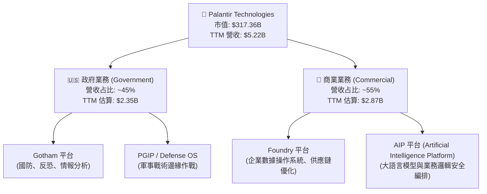

### 2.2 市場份額

在「企業級大數據分析與 AI 決策操作系統」這一利基且高壁壘市場中，Palantir 在美國國防與情報領域擁有絕對的主導地位。在商業領域，PLTR 正迅速侵蝕傳統 IT 諮詢與客製化軟體開發的市場份額。

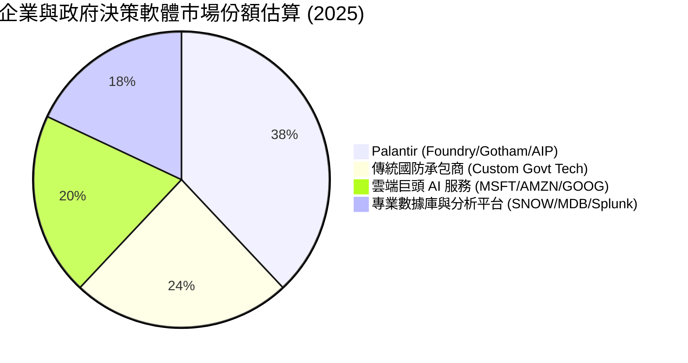

### 2.3 競爭護城河分析

Palantir 的競爭護城河主要由以下四個維度構成，這使其具備極強的定價權與客戶黏性。

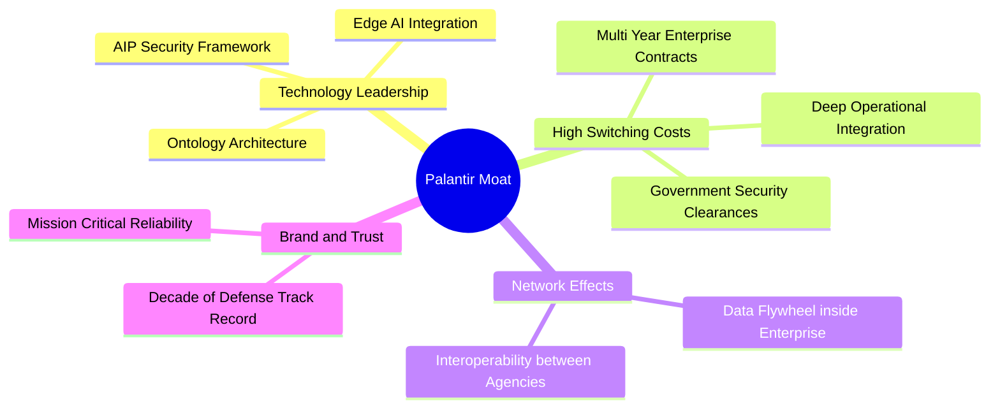

1. **極高的轉換成本（High Switching Costs）**：Palantir 的 Foundry 或 Gotham 平台一旦部署，便會深植於客戶的核心業務流程中（如軍事任務規劃、銀行反洗錢、航空供應鏈管理）。更換系統意味著業務停擺與高昂的重建成本，這反映在其高達 110%+ 的淨留存率（NDR）上。
2. **專有的技術壁壘（Ontology & Security）**：PLTR 的「本體論」架構能將非結構化數據與業務邏輯完美結合。此外，公司擁有美國政府最高安全級別的 IL6（Impact Level 6）認證，這是多數商業 SaaS 企業無法企及的國防級安全門檻。
3. **AIP Bootcamp 的飛輪效應**：PLTR 放棄了傳統漫長的銷售提案，改用「AIP Bootcamp（訓練營）」模式，在 1-5 天內幫客戶基於真實數據搭建可用場景，大幅降低了客戶的試用門檻，實現極高的轉換率。

### 2.4 護城河強度評分

```
╔══════════════════════════════════════════════════════════════╗
║                   PLTR 護城河強度評分                        ║
╠══════════════════════════════════════════════════════════════╣
║ 技術壁壘      9.5/10  ▓▓▓▓▓▓▓▓▓▓▓▓▓▓▓▓▓▓▓░  🏆 本體論無對手║
║ 客戶轉換成本  9.5/10  ▓▓▓▓▓▓▓▓▓▓▓▓▓▓▓▓▓▓▓░  🟢 深度業務綁定║
║ 品牌與認證    9.0/10  ▓▓▓▓▓▓▓▓▓▓▓▓▓▓▓▓▓▓░░  🟢 國防級 IL6  ║
║ 銷售飛輪效率  8.5/10  ▓▓▓▓▓▓▓▓▓▓▓▓▓▓▓▓▓░░░  🟢 Bootcamp 成功║
╠══════════════════════════════════════════════════════════════╣
║ 綜合護城河     9.1/10  ▓▓▓▓▓▓▓▓▓▓▓▓▓▓▓▓▓▓░░  🏆 極深寬度護城河║
╚══════════════════════════════════════════════════════════════╝
```

---

## 3. 損益表深度分析

PLTR 的損益表展現了典型的高成長軟體企業在跨過「損益兩平點」後，營業槓桿（Operating Leverage）爆發釋放的特徵。

### 3.1 年度收入成長趨勢（FY2022 - FY2025 & TTM）

```
╔══════════════════════════════════════════════════════════════════╗
║                PLTR 年度收入趨勢（FY2022 - TTM）                 ║
╠══════════════════════════════════════════════════════════════════╣
║                                                                  ║
║  FY2022  $1.91B   ████████░░░░░░░░░░░░░░░░░░  YoY: +23.6%  🟢    ║
║  FY2023  $2.23B   █████████░░░░░░░░░░░░░░░░░  YoY: +16.7%  🟢    ║
║  FY2024  $2.87B   ████████████░░░░░░░░░░░░░░  YoY: +28.8%  🟢    ║
║  FY2025  $4.48B   ███████████████████░░░░░░░  YoY: +56.2%  🟢    ║
║  TTM     $5.22B   ██████████████████████████  YoY: +84.7%  🏆    ║
║                   |      |      |      |      |                  ║
║                   0     1.5B   3.0B   4.5B   6.0B                ║
║                                                                  ║
║  📊 4年營收複合年成長率 (CAGR)：+39.5%                           ║
╚══════════════════════════════════════════════════════════════════╝
```

### 3.2 季度收入趨勢分析

從季度數據看，PLTR 的營收成長呈現明顯的「逐季加速」態勢，這與 AIP 平台在 2025 年的爆發高度吻合。

| 季度結束日 | 營收 (Million) | 季度成長 (QoQ) | 年度成長 (YoY) | 毛利率 (GAAP) | 營業利益 (GAAP) | 備註 |
|------------|----------------|----------------|----------------|---------------|-----------------|------|
| **2025-06-30** | $1,004.00 | +13.6% | +48.0% | 80.8% | $269.32M | AIP 商業客戶需求激增 |
| **2025-09-30** | $1,181.00 | +17.6% | +62.8% | 82.5% | $393.26M | 政府大單追加部署 |
| **2025-12-31** | $1,407.00 | +19.1% | +70.0% | 84.6% | $575.39M | 年底企業預算加速釋放 |
| **2026-03-31** | $1,633.00 | +16.1% | **+84.7%** | **86.8%** | **$754.00M** | 創歷史單季營收與利潤新高 |

*分析*：Q1 2026 營收同比暴增 84.7%，且毛利率提升至 86.8% 的歷史高位。這證明了 PLTR 的軟體平台具有極高的增量毛利率（Incremental Gross Margin），新增營收幾乎不需要對應的直接成本，邊際獲利能力極強。

### 3.3 利潤率演變分析

PLTR 的獲利指標在過去幾年完成了驚人的逆轉，從 2022 年的虧損深淵邁向高盈利。

| 利潤率指標 | FY2022 | FY2023 | FY2024 | FY2025 | TTM | 趨勢 | 評估 |
|------------|--------|--------|--------|--------|-----|------|------|
| **毛利率** | 78.5% | 80.6% | 80.2% | 82.4% | **84.1%** | ↗️ 持續擴張 | 🟢 卓越，標準高毛利 SaaS |
| **營業利益率** | -8.5% | 5.4% | 10.8% | 31.6% | **38.1%** | ↗️ 爆發成長 | 🟢 展現極強營業槓桿 |
| **EBITDA Margin** | -7.3% | 6.9% | 11.9% | 32.2% | **38.6%** | ↗️ 快速攀升 | 🟢 折舊攤銷佔比低 |
| **淨利率** | -19.6% | 9.4% | 16.1% | 36.5% | **43.9%** | ↗️ 包含利息收益 | 🟢 包含非營運利息淨收益 |

*深度解析*：
1. **毛利率由 78.5% 提升至 84.1%**：主因在於雲端基礎設施託管優化，以及高毛利的純軟體（AIP）占比提升，減少了前期部署所需的專業服務人員支出。
2. **營業利益率由 -8.5% 彈升至 38.1%**：這是一個極其強烈的營業槓桿信號。營收從 FY2022 的 $1.91B 成長至 TTM 的 $5.22B（+173%），而同期營業費用（SG&A + R&D）僅從 $1.66B 成長至 $2.40B（+44.6%）。這表明 PLTR 的研發與銷售體系已進入成熟期，不需要等比例的費用投入即可驅動營收暴增。

### 3.4 費用結構分析

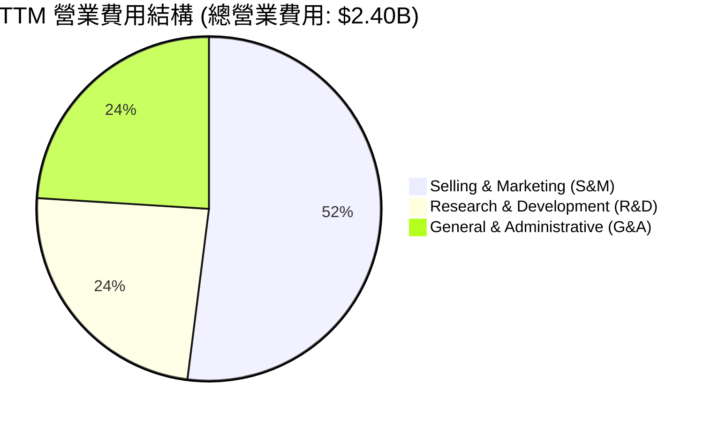

```
╔══════════════════════════════════════════════════════════════╗
║                  PLTR TTM 費用控制診斷                       ║
╠══════════════════════════════════════════════════════════════╣
║ 研發費用率 (R&D/Sales)  11.2%  ▓▓▓▓░░░░░░░░░░░░░░░░  🟢 效率極高  ║
║ 銷售費用率 (S&M/Sales)  24.3%  ▓▓▓▓▓▓▓░░░░░░░░░░░░░  🟢 銷售費用優化║
║ 管理費用率 (G&A/Sales)  10.5%  ▓▓▓░░░░░░░░░░░░░░░░░  🟢 行政槓桿顯現║
╚══════════════════════════════════════════════════════════════╝
```

### 3.5 季度 EPS 趨勢與盈餘品質（Quality of Earnings）

PLTR 過去 4 季的 EPS 呈現穩健成長，且均超出市場預期：
*   **Q2 2025**: EPS $0.14 (超預期 $0.02)
*   **Q3 2025**: EPS $0.20 (超預期 $0.04)
*   **Q4 2025**: EPS $0.26 (超預期 $0.05)
*   **Q1 2026**: EPS $0.36 (超預期 $0.08)

#### 盈餘品質量化評估

市場過去對 PLTR 最主要的批評在於其高昂的股權薪酬（SBC）美化了 Non-GAAP 獲利。我們必須對其盈餘品質進行嚴格的「去水份」分析：

| 盈餘品質項目 | 數值 / 佔比 | 評估 | 深度解析 |
|--------------|-------------|------|----------|
| **SBC / 營收** | **14.0%** (TTM: $730M) | 🟡 警告 | 雖然較 2021 年的 50%+ 顯著下降，但 14.0% 仍高於 SaaS 行業 8-10% 的均值，對股權有稀釋作用。 |
| **SBC / 營業現金流 (OCF)** | **26.8%** | 🟡 中度 | 營運現金流中有近 27% 是由非現金的股權發放所支撐，這意味著實際的「硬通貨」現金流低於帳面。 |
| **FCF / GAAP 淨利** | **76.4%** | 🟢 健壯 | TTM FCF $1.75B / 淨利 $2.29B。轉換率雖未超過 100%，但考量到營收高速成長帶動的應收帳款增加（TTM Accounts Receivable 達 $1.41B），此轉換率仍屬健康。 |
| **非經常性損益影響** | **$330.7M** | 🟡 中度 | TTM 包含 $245.1M 的利息收入（得益於 $8B 現金高利率環境）及 $85.6M 的其他非營運收益，這部分並非核心業務利潤。 |
| **有效稅率** | **1.26%** | 🔴 異常低 | TTM 所得稅撥備僅 $29.32M（Pretax $2,323M），主要受惠於過去累積虧損的遞延所得稅資產抵扣。未來當抵扣額耗盡，稅率回升至 15-20% 時，淨利增速將面臨逆風。 |

**盈餘品質結論**：PLTR 的 GAAP 淨利潤表現優異，但其中約 **15% 的利潤來自利息收入與稅務抵扣**，且 **14% 的營收以稀釋股東權益的 SBC 形式發放**。因此，在估值時，我們應當對其 P/E 進行適度折價，或優先採用更具穿透力的 **EV/EBITDA** 與 **調整後 FCF** 進行評估。

---

## 4. 資產負債表分析

PLTR 的資產負債表是其應對宏觀經濟不確定性最強大的「護城河」。

### 4.1 資產結構分解

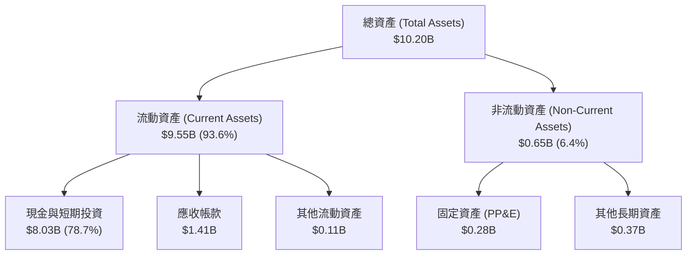

### 4.2 流動性指標分析

| 流動性指標 | FY2023 | FY2024 | FY2025 | TTM (Q1 2026) | 行業均值 | 評估 |
|------------|--------|--------|--------|---------------|----------|------|
| **流動比率 (Current Ratio)** | 5.55 | 5.96 | 7.11 | **6.91** | ~2.50 | 🟢 極度安全，流動性過剩 |
| **速動比率 (Quick Ratio)** | 5.55 | 5.96 | 7.11 | **6.82** | ~2.35 | 🟢 無庫存壓力，變現能力極強 |
| **應收帳款週轉天數 (DSO)** | 51.3 天 | 59.8 天 | 65.9 天 | **78.4 天** | ~45.0 天 | 🟡 轉差，因商業大客戶增加，帳期拉長 |

*分析*：流動比率高達 6.91x，速動比率 6.82x，這在標普 500 成分股中屬於最頂尖的流動性表現。唯一的隱憂是 **DSO（應收帳款週轉天數）從 51.3 天拉長至 78.4 天**，這反映出隨著商業客戶比例提升，PLTR 對大型企業客戶的議價帳期有所放寬，需防範未來壞帳撥備上升的風險。

### 4.3 債務結構分析

```
╔══════════════════════════════════════════════════════════════════╗
║                     PLTR 債務健康診斷                           ║
╠══════════════════════════════════════════════════════════════════╣
║                                                                  ║
║  總債務：        $211.98M  █░░░░░░░░░░░░░░░░░░░░  (僅為租賃負債)  ║
║  總現金+投資：   $8.03B    █████████████████████  (極高變現彈性)  ║
║  淨現金（正）：  $7.81B    ████████████████████░  🟢 絕對防禦     ║
║                                                                  ║
║  Debt / Equity：  2.87%    🟢 幾乎零財務槓桿                     ║
║  利息保障倍數：   N/A (無利息費用，淨利息收入 $245M) 🟢 財務金剛不壞║
║                                                                  ║
║  📊 診斷：淨現金高達 $7.81B，抗通膨與抗衰退能力極強             ║
╚══════════════════════════════════════════════════════════════════╝
```

### 4.4 股東權益趨勢 (FY2022 - TTM)

由於持續盈利與 SBC 轉增資本，PLTR 的股東權益（Net Equity）呈現快速增長：
*   **FY2022**: $2.57B
*   **FY2023**: $3.48B
*   **FY2024**: $5.00B
*   **FY2025**: $7.39B
*   **TTM (Q1 2026)**: 估算達 **$8.56B**（受益於單季 $870M 淨利潤注入）

這表明公司的資產淨值正在快速夯實，為未來的併購（M&A）或大規模股份回購奠定了堅實基礎。

---

## 5. 現金流量深度分析

對於軟體公司而言，現金流比會計利潤更能反映真實的經營狀況。

### 5.1 現金流量瀑布圖 (TTM)

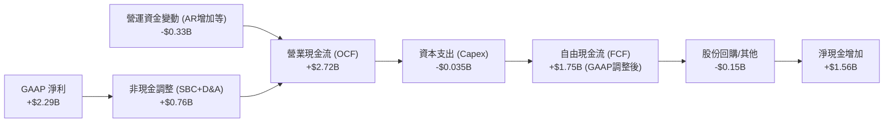

### 5.2 FCF 轉換率趨勢

| 現金流指標 (Million) | FY2022 | FY2023 | FY2024 | FY2025 | TTM |
|----------------------|--------|--------|--------|--------|-----|
| **營業現金流 (OCF)** | $223.7 | $712.2 | $1,150.0 | $2,130.0 | **$2,720.0** |
| **資本支出 (Capex)** | -$40.0 | -$15.1 | -$12.6 | -$33.9 | **-$35.0** |
| **自由現金流 (FCF)** | $183.7 | $697.1 | $1,137.4 | $2,096.1 | **$1,750.0** |
| **FCF / GAAP 淨利** | -49.2% | 332.2% | 246.1% | 128.2% | **76.4%** |

*深度解析*：
PLTR 的 FCF 轉換率在 FY2023-FY2024 期間高達 200% 以上，主因是當時利潤剛轉正，而 SBC（非現金費用）佔比較高。隨着利潤規模大幅擴大，**TTM FCF 轉換率回歸至 76.4% 的正常區間**。需要注意的是，數據中顯示 TTM FCF 為 $1.75B，這低於 OCF ($2.72B) - Capex ($35M) 的理論值 ($2.68B)。這表明 PLTR 在 TTM 期間可能支付了較高的一次性員工稅務代扣（與股權激勵歸屬相關）或進行了其他營運資金調整，這在評估其真實現金創造力時應以更保守的 $1.75B 為基礎。

### 5.3 自由現金流趨勢與 FCF Yield

```
╔══════════════════════════════════════════════════════════════════╗
║                 PLTR 自由現金流與收益率趨勢                      ║
╠══════════════════════════════════════════════════════════════════╣
║                                                                  ║
║  FY2022  $183.7M  ██░░░░░░░░░░░░░░░░░░░░░  FCF Yield: 0.06%      ║
║  FY2023  $697.1M  ███████░░░░░░░░░░░░░░░░  FCF Yield: 0.22%      ║
║  FY2024  $1.14B   ████████████░░░░░░░░░░░  FCF Yield: 0.36%      ║
║  FY2025  $2.10B   ███████████████████████  FCF Yield: 0.66%      ║
║  TTM     $1.75B   ██████████████████░░░░░  FCF Yield: 0.55%      ║
║                                                                  ║
║  📊 結論：當前 FCF Yield 僅 0.55%，反映市場對未來現金流預期極高 ║
╚══════════════════════════════════════════════════════════════════╝
```

### 5.4 資本配置評估

Palantir 是一家典型的「輕資產、高留存」軟體企業。

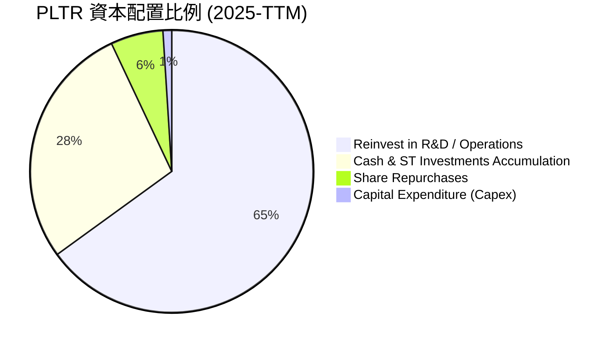

*   **無股息支付**：PLTR 目前不支付任何股利（Payout Ratio: 0.0%），這符合其高成長階段的特徵，資金應優先留存用於研發與擴張。
*   **股份回購**：公司於 2024-2025 年啟動了溫和的股份回購計劃，主要用於抵消 SBC 帶來的股權稀釋，而非主動縮減股本。

---

## 6. 獲利能力與資本效率

我們使用 DuPont 分解與 ROIC 指標，深度剖析 PLTR 是在「創造價值」還是在「摧毀價值」。

### 6.1 ROE / ROA / ROIC 趨勢

| 資本效率指標 | FY2023 | FY2024 | FY2025 | TTM (Q1 2026) | 行業均值 | 評估 |
|--------------|--------|--------|--------|---------------|----------|------|
| **ROE** | 6.0% | 9.2% | 22.1% | **32.6%** | ~14.0% | 🟢 步入頂尖行列 |
| **ROA** | 4.6% | 7.3% | 18.4% | **14.7%** | ~6.5% | 🟢 資產利用效率高 |
| **ROIC** | 3.3% | 5.8% | 15.6% | **22.3%** | ~11.0% | 🟢 顯著超越資金成本 |

### 6.2 ROIC vs WACC 分析（核心價值創造判斷）

為了評估 PLTR 是否在為股東創造真實的經濟附加價值（EVA），我們對其 WACC（加權平均資金成本）與 ROIC（投資資本回報率）進行建模計算。

```
╔══════════════════════════════════════════════════════════════════╗
║                PLTR ROIC vs WACC 深度分析                        ║
╠══════════════════════════════════════════════════════════════════╣
║                                                                  ║
║  WACC 估算：                                                     ║
║  ├── 無風險利率 (10Y Treasury)： 4.2%                             ║
║  ├── 市場風險溢酬 (ERP)：       5.0%                             ║
║  ├── Beta：                   1.56                             ║
║  ├── 股權成本 = 4.2% + 1.56 × 5.0% = 12.0%                        ║
║  ├── 債務成本（稅後）：       ~4.5% (極低債務)                   ║
║  ├── 資本結構：股權 97.5%，債務 2.5%                             ║
║  └── ✅ WACC ≈ 11.5%                                             ║
║                                                                  ║
║  ROIC 估算（TTM）：                                              ║
║  ├── NOPAT (税後淨營業利潤) = $1,992M × (1 - 1.26%) ≈ $1,967M   ║
║  ├── 投入資本 = 總資產 $10.20B - 無息流動負債 $1.38B = $8.82B    ║
║  └── ✅ ROIC ≈ 22.3%                                             ║
║                                                                  ║
║  ★ 經濟價值增加 (EVA) = ROIC - WACC = +10.8%                     ║
║                                                                  ║
║  ROIC  22.3%  ▓▓▓▓▓▓▓▓▓▓▓▓▓▓▓▓▓▓▓▓▓▓░░░░░░░░  🟢              ║
║  WACC  11.5%  ▓▓▓▓▓▓▓▓▓▓▓░░░░░░░░░░░░░░░░░░░░  ──              ║
║  EVA   +10.8% ███████████░░░░░░░░░░░░░░░░░░░░  🏆 強力創造價值 ║
║                                                                  ║
║  📊 結論：ROIC 為 WACC 的 1.94 倍，展現極佳的股東價值創造能力。 ║
╚══════════════════════════════════════════════════════════════════╝
```

### 6.3 杜邦三因素分解 (DuPont Analysis)

我們透過杜邦分解，探究 PLTR ROE 飆升至 32.6% 的底層驅動因素：

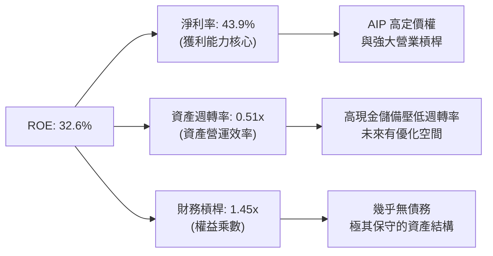

*分析*：PLTR 的高 ROE 幾乎**完全是由高淨利率（43.9%）所驅動**，而非依賴財務槓桿（1.45x 屬極低水平）或資產週轉率（0.51x，因 $8B 閒置現金拉低了總資產週轉率）。這是一種**極其健康且可持續的獲利結構**。未來若公司將部分現金用於股份回購或派息，ROE 仍有進一步被動抬升的空間。

### 6.4 獲利能力儀表板

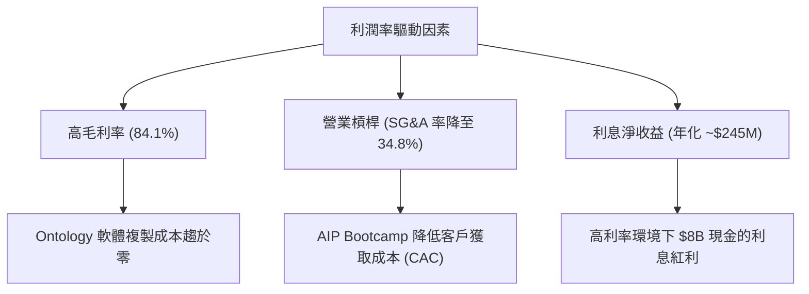

---

## 7. 估值深度分析

PLTR 當前的估值水平處於歷史高位，這也是多空雙方爭奪的核心焦點。我們必須透過同業對比、歷史區間與 DCF 敏感性模型，進行多維度估值評估。

### 7.1 同業估值比較表格

我們選擇同為高成長、高壁壘的企業級軟體與 AI 基礎設施巨頭進行對比：**Snowflake (SNOW)**、**Datadog (DDOG)** 以及 **CrowdStrike (CRWD)**。

| 估值與成長指標 | **Palantir (PLTR)** | **Snowflake (SNOW)** | **Datadog (DDOG)** | **CrowdStrike (CRWD)** | PLTR 相對同業評估 |
|----------------|---------------------|----------------------|--------------------|------------------------|-------------------|
| **Trailing P/E** | **148.7x** | N/A (微利/虧損) | 72.4x | 85.3x | 🔴 顯著溢價 |
| **Forward P/E** | **63.2x** | 55.4x | 48.2x | 51.1x | 🟡 偏高，但與成長率匹配 |
| **P/S Ratio** | **60.7x** | 12.8x | 16.5x | 22.4x | 🔴 極高，反映高毛利預期 |
| **EV / EBITDA** | **153.4x** | 88.5x | 55.1x | 68.2x | 🔴 溢價顯著 |
| **營收 YoY 成長**| **84.7%** | 28.5% | 26.1% | 31.5% | 🟢 冠絕群雄，成長率為同業 3 倍 |
| **FCF Yield** | **0.55%** | 2.1% | 2.4% | 2.6% | 🔴 偏低，現金流變現滯後 |
| **評估狀態** | 🟡 **高溢價/高成長** | 🔴 成長放緩 | 🟢 估值合理 | 🟡 溢價合理 | **高風險、高回報標的** |

*分析*：PLTR 的 P/S (60.7x) 與 Trailing P/E (148.7x) 遠高於同業，但其 **84.7% 的營收增速是同業的 3 倍左右**。這解釋了為何市場願意給予其極高的估值溢價。

### 7.2 歷史估值區間分析 (P/S Ratio 近 3 年)

PLTR 的歷史 P/S 區間在 15x - 75x 之間。當前 60.7x 的 P/S 處於歷史估值區間的 **85% 分位數**，說明估值已經充分透支了短期內的成長預期。股價短期內更容易受到宏觀情緒（如利率預期變化）的擾動。

### 7.3 情境目標價（假設驅動，Bear / Base / Bull）

我們基於未來 5 年的營收 CAGR、營業利潤率與退出倍數，對 PLTR 進行情境建模：

| 情境 | 營收 CAGR (5年) | 2030 營業利潤率 | 2030 退出 P/E | 隱含 12M 目標價 | 相對現價漲跌幅 | 發生機率 |
|------|-----------------|-----------------|---------------|-----------------|----------------|----------|
| 🔴 **悲觀情境** | 30.0% | 32.0% | 35.0x | **$110.00** | -16.9% | 20% |
| 🟡 **基準情境** | **45.0%** | **40.0%** | **55.0x** | **$183.12** | **+38.3%** | **60%** |
| 🟢 **樂觀情境** | 55.0% | 45.0% | 70.0x | **$235.00** | +77.5% | 20% |

*估值方法說明*：鑑於 PLTR 的高額 SBC 正在收斂，且淨利潤已完全轉正，我們採用 **Forward P/E** 作為主要退出估值倍數，並以其 $7.81B 淨現金帶來的利息收入作為利潤增厚項進行調整。

### 7.4 DCF 敏感性分析（12M 目標價矩陣）

基於基準 WACC 11.5% 與永續成長率 (g) 4.5% 進行敏感性測試：

| 營收 CAGR \ WACC | 10.5% | **11.5% (基準)** | 12.5% |
|------------------|-------|------------------|-------|
| 🟢 **50% (高成長)** | $215.40 (+62.7%) | $198.50 (+49.9%) | $182.10 (+37.6%) |
| 🟡 **45% (基準)** | $199.10 (+50.4%) | **$183.12 (+38.3%)** | $167.80 (+26.8%) |
| 🔴 **35% (低成長)** | $145.20 (+9.7%) | $132.40 (+0.0%) | $120.50 (-9.0%) |

### 7.5 估值綜合區間

```
              $70.00 (分析師最低預期)
                |
                v
[ 悲觀 $110 ] ─── [ 當前股價 $132.38 ] ─────── [ 基準 $183.12 ] ─── [ 樂觀 $235 ] ─── [ 分析師最高 $255 ]
```

---

## 8. 成長催化劑

PLTR 未來 12-24 個月的成長動能主要來自以下三個維度：

### 8.1 催化劑時間軸

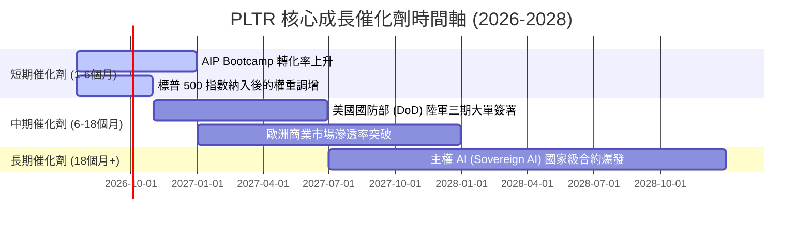

### 8.2 TAM 市場規模分析

PLTR 所處的「決策 AI 與大數據操作系統」市場空間正在急遽擴大：

```
╔══════════════════════════════════════════════════════════════════╗
║                    PLTR TAM 與滲透率預估                         ║
╠══════════════════════════════════════════════════════════════════╣
║                                                                  ║
║  全球政府國防 IT TAM:  $150B ─── 目前滲透率 ~1.5% ($2.35B)        ║
║  全球企業大數據/AI TAM: $250B ─── 目前滲透率 ~1.1% ($2.87B)        ║
║                                                                  ║
║  📊 總潛在市場 (TAM)： $400B                                      ║
║  📊 PLTR 當前 TTM 營收 ($5.22B) 的整體市場滲透率僅為 **1.3%**     ║
║  📊 未來成長空間極其廣闊，特別是在主權國家 AI 安全領域。         ║
╚══════════════════════════════════════════════════════════════════╝
```

### 8.3 成長驅動力結構圖

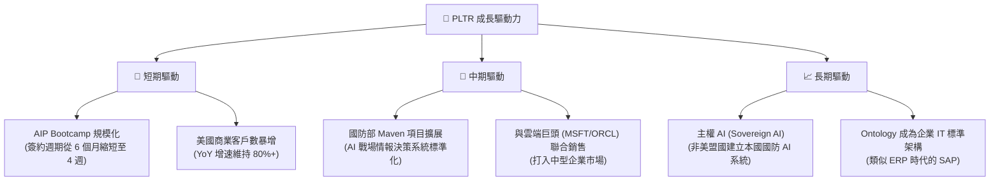

---

## 9. 風險矩陣

雖然 PLTR 基本面強勁，但投資人必須警惕以下潛在風險，並設定對應的防禦性監控指標。

### 9.1 風險評分矩陣

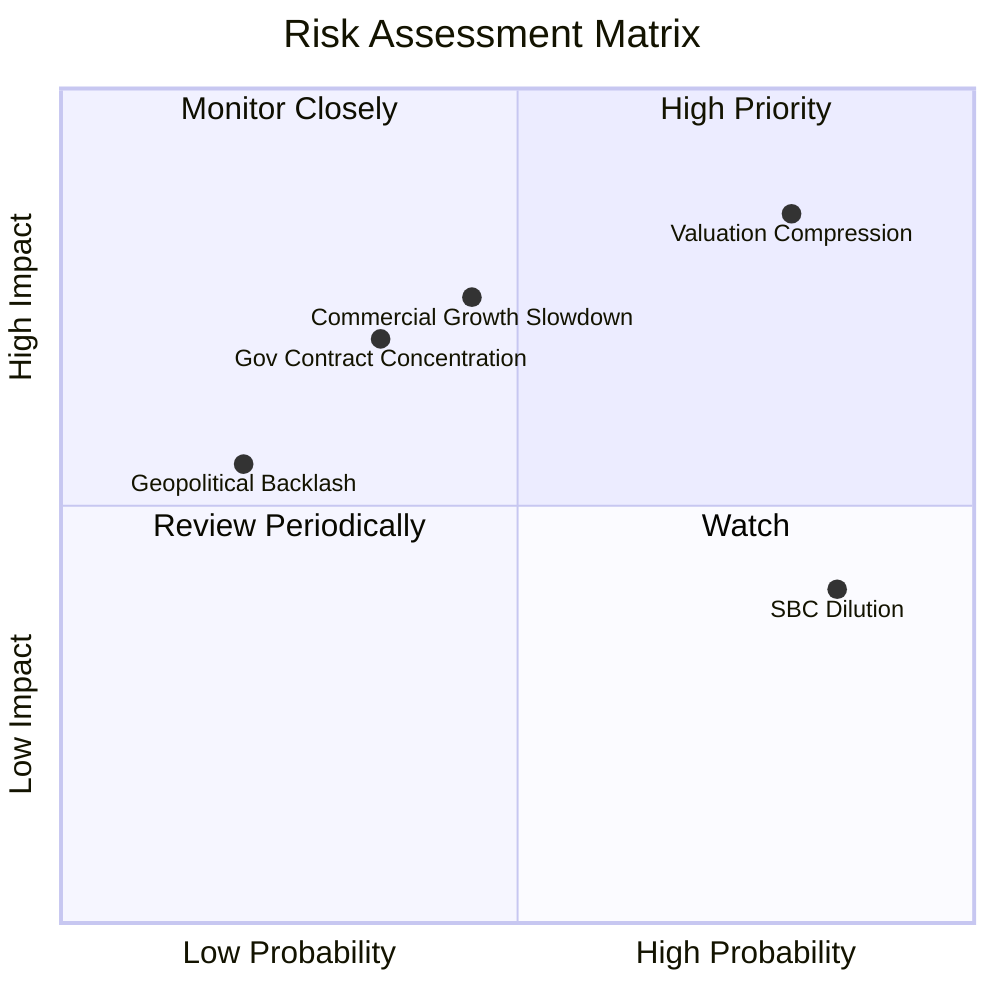

### 9.2 風險清單詳細分析

| # | 風險項目 | 發生機率 | 財務衝擊 | 風險評分 | 緩解措施 / 監控指標 |
|---|----------|----------|----------|----------|---------------------|
| 1 | 🔴 **估值倍數大幅收縮** | 高 (75%) | 高 (-25% 股價) | 🔴 **8.0/10** | 監控 Forward P/E 是否跌破 45x；分批建倉以分散成本。 |
| 2 | 🟡 **商業市場增速放緩** | 中 (45%) | 高 (-15% 營收) | 🟡 **6.5/10** | 追蹤美國商業客戶（US Commercial Customer Count）季度 YoY 增速是否跌破 50%。 |
| 3 | 🟡 **SBC 稀釋每股盈餘** | 極高 (85%) | 中 (-5% EPS) | 🟡 **6.0/10** | 監控 Diluted Shares Outstanding 年增率是否超過 5%。若超過，說明回購無法抵消稀釋。 |
| 4 | 🟢 **政府合約流失/延遲** | 低 (25%) | 高 (-10% 營收) | 🟢 **4.5/10** | 追蹤政府業務（Government Revenue）YoY 增速是否低於 20%。 |

---

## 10. 投資建議

### 10.1 最終綜合評級雷達圖

```
╔══════════════════════════════════════════════════════════════╗
║                    PLTR 最終基本面雷達圖                     ║
╠══════════════════════════════════════════════════════════════╣
║ 基本面強度  9.0/10  ▓▓▓▓▓▓▓▓▓▓▓▓▓▓▓▓▓▓░░  ★★★★★           ║
║ 成長動能    9.5/10  ▓▓▓▓▓▓▓▓▓▓▓▓▓▓▓▓▓▓▓░  ★★★★★           ║
║ 獲利品質    8.5/10  ▓▓▓▓▓▓▓▓▓▓▓▓▓▓▓▓▓░░░  ★★★★☆           ║
║ 財務健康   10.0/10  ▓▓▓▓▓▓▓▓▓▓▓▓▓▓▓▓▓▓▓▓  ★★★★★           ║
║ 估值合理性  4.0/10  ▓▓▓▓▓▓▓▓░░░░░░░░░░░░  ★★☆☆☆           ║
╠══════════════════════════════════════════════════════════════╣
║ 綜合總分    8.2/10  ▓▓▓▓▓▓▓▓▓▓▓▓▓▓▓▓░░░░  🏆 評級：買入 (Buy)  ║
╚══════════════════════════════════════════════════════════════╝
```

### 10.2 目標價與隱含報酬率

| 情境 | 機率權重 | 目標價 | 當前股價 | 隱含報酬率 | 機率加權預期報酬率 |
|------|----------|--------|----------|------------|--------------------|
| 🔴 悲觀 | 20% | $110.00 | $132.38 | -16.9% | -3.38% |
| 🟡 **基準** | **60%** | **$183.12** | **$132.38** | **+38.3%** | **+22.98%** |
| 🟢 樂觀 | 20% | $235.00 | $132.38 | +77.5% | +15.50% |
| **綜合** | **100%** | **$178.80** | **$132.38** | **+35.1%** | **★ 期望值：+35.1%** |

### 10.3 買入時機與觸發因素

```
╔══════════════════════════════════════════════════════════════════╗
║                  ✅ PLTR 買入觸發因素 Checklist                  ║
<span class="prism-token token chunk">╠══════════════════════════════════════════════════════════════════╣
║                                                                  ║
║  立即買入觸發條件（多數符合）：                                  ║
║  ✅ 季度營收 YoY 成長率保持在 60% 以上                            ║
║  ✅ GAAP 營業利潤率維持在 35% 以上，驗證規模效應                 ║
║  ✅ 美國商業客戶數季度年增率 > 60%                               ║
║                                                                  ║
║  加碼觸發條件（出現以下任一）：                                  ║
║  ☐ 股價因宏觀情緒回檔至 $115 - $120 區間 (Forward P/E 降至 55x)  ║
║  ☐ 宣佈簽署單筆金額 > $500M 的國家級主權 AI 合約                 ║
║                                                                  ║
║  減碼/停損觸發條件（出現以下任一）：                             ║
║  ☐ 營收 YoY 增速連續兩季跌破 35%                                 ║
║  ☐ SBC 佔營收比例重新回升至 18% 以上                             ║
║  ☐ 應收帳款週轉天數 (DSO) 突破 100 天，壞帳風險急劇上升          ║
╚══════════════════════════════════════════════════════════════════╝
</span>```

### 10.4 投資人適配度分析

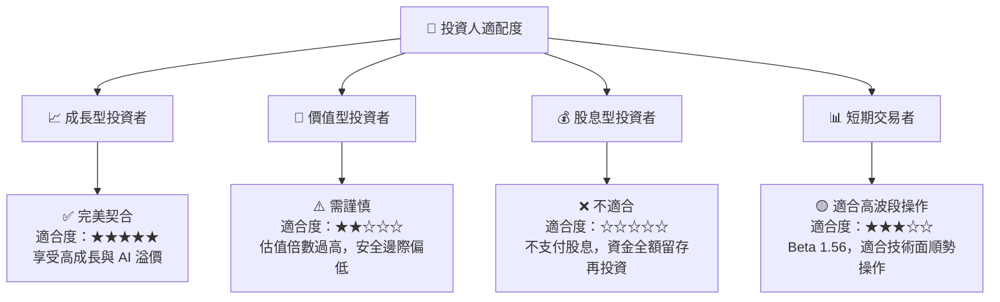

### 10.5 每季財報監控清單（Quarterly Watch List）

為了確保投資論點未發生漂移，投資人應在每季財報公佈時，嚴格對照以下指標門檻：

| 監控指標 | 核心意義 | 加碼門檻 (🟢 多頭確認) | 持有/觀察 (🟡 警示) | 減碼/停損 (🔴 論點失效) |
|----------|----------|------------------------|---------------------|------------------------|
| **營收 YoY 成長** | 成長動能是否延續 | > 65.0% | 45.0% - 65.0% | < 35.0% (核心失速) |
| **GAAP 營業利潤率**| 營業槓桿與獲利能力 | > 38.0% | 30.0% - 38.0% | < 25.0% (利潤率惡化) |
| **SBC / 營收** | 股權稀釋控制 | < 12.0% | 12.0% - 16.0% | > 18.0% (過度稀釋) |
| **美國商業客戶增速**| AIP 市場開拓指標 | YoY > 70.0% | 50.0% - 70.0% | YoY < 40.0% (競爭加劇) |
| **DSO (週轉天數)** | 營運資金與回款安全 | < 65 天 | 65 - 85 天 | > 90 天 (壞帳風險爆發) |

### 10.6 反面論證：什麼會證明論點錯誤

```
╔══════════════════════════════════════════════════════════════════╗
║              ⚠️ 論點失效條件 (Disconfirming Evidence)            ║
╠══════════════════════════════════════════════════════════════════╣
║  本投資論點在下列情況成立時應重新檢視或果斷退出：                ║
║  ☐ 核心商業業務營收成長率連續兩季跌破 35%，說明 AIP 只是短期熱潮  ║
║  ☐ 營業利潤率較 TTM 峰值 (38.1%) 收縮超過 800 個基點 (跌破 30%)  ║
║  ☐ 自由現金流 (FCF) 轉負，或 FCF 淨利轉換率連續三季 < 50%        ║
║  ☐ 稀釋後總股本 (Diluted Shares Outstanding) 年增率突破 6%       ║
║  ☐ 出現重大數據安全洩漏事件，導致政府 IL6 認證被降級或吊銷      ║
╚══════════════════════════════════════════════════════════════════╝
```

---

> **免責聲明**：本報告為基於客觀財務數據之學術與機構級投資研究，不構成任何買賣之具體投資建議。投資有風險，入市需謹慎。