# PLTR 基本面深度分析報告
> **報告日期**：2026-07-19 ｜ **語言**：繁體中文 ｜ **數據來源**：Yahoo Finance, Finviz, StockAnalysis, Roic.ai ｜ **分析師**：CFA 級機構研究

---

## 目錄

| # | 章節 | 核心結論 |
|---|---|---|
| 1 | **執行摘要** | 評級：🟢 買入 ｜ 基準目標價 $183.12（+38.3% 潛在空間），AI 平台 AIP 進入商業變現爆發期。 |
| 2 | **公司概覽與商業模式** | 政府與商業雙引擎驅動，AIP 訓練營（Bootcamps）建立極強的客戶鎖定與高轉化護城河。 |
| 3 | **損益表深度分析** | TTM 營收達 $5.22B（YoY +84.7%），營業利益率飆升至 46.2%，SBC 稀釋效應正在逐步收斂。 |
| 4 | **資產負債表分析** | 淨現金高達 $7.81B，無傳統長債，流動比率 6.91x，展現極其強韌的防禦性資產結構。 |
| 5 | **現金流量深度分析** | TTM FCF 達 $1.75B（FCF Yield 0.55%），營運現金流轉換率高，資本配置高度偏向高回報再投資。 |
| 6 | **獲利能力與資本效率** | ROE 達 32.6%，ROIC 遠超 WACC（12.0%），經濟價值增加（EVA）強力擴張。 |
| 7 | **估值深度分析** | Forward P/E 63.2x，溢價反映其在企業級 AI 基礎設施的壟斷性，DCF 敏感性支持基準價 $183.12。 |
| 8 | **成長催化劑** | 美國國防部大型合約落地、AIP 在標普 500 企業滲透率超預期，以及被納入更多指數的被動買盤。 |
| 9 | **風險矩陣** | 商業客戶流失率上升、政府合約預算遞延、估值倍數過高帶來的波動性風險。 |
| 10 | **投資建議** | 建議採分批佈局策略，設定 $106-$116 為強力加碼區間，長期持有以參與 AI 基礎設施紅利。 |

---

## 1. 執行摘要

### 1.0 一頁式投資儀表板（Portfolio Manager 30 秒速讀）

| 項目 | 內容 |
|------|------|
| **投資論點（3 句）** | ① TTM 營收達 $5.22B，YoY 成長率高達 84.7%，主因商業 AIP 平台透過 Bootcamps 實現極速變現。<br/>② 獲利能力顯著改善，營業利益率從 2022 年的 -8.46% 飆升至 TTM 的 46.2%，展現極高的營運槓桿。<br/>③ 擁有 $7.81B 的強大淨現金盾牌，無傳統長債，能抵禦任何總體經濟波動並持續投入研發。 |
| **護城河評分** | 8.8 / 10（極高客戶轉換成本與技術壁壘） |
| **管理層/資本配置評分** | 8.5 / 10（執行力極強，SBC 控制逐步改善） |
| **財務健康** | 🟢 **極其健康** ｜ 現金儲備充裕，幾乎零債務風險。 |
| **ROIC vs WACC** | **31.2% vs 12.0%**（強力創造股東價值） |
| **FCF 趨勢** | FCF 連續 4 季向上，TTM 達 $1.75B，最新 FCF Yield 為 0.55%。 |
| **估值** | Forward P/E: 63.20x ｜ EV/EBITDA: 153.42x ｜ P/S: 60.75x |
| **預期報酬（基準情境 12M）** | **+38.3%**（目標價：$183.12） |
| **關鍵風險（前二）** | ① 估值倍數極高（P/S > 60x），對利率變化及成長放緩極度敏感。<br/>② 股權稀釋風險（SBC 雖降但絕對值仍高，2025 年達 $684M）。 |
| **評級 + 信心度** | 🟢 **買入 (Buy)** ｜ **信心度：高 (High)** |

### 1.1 核心評分儀表板

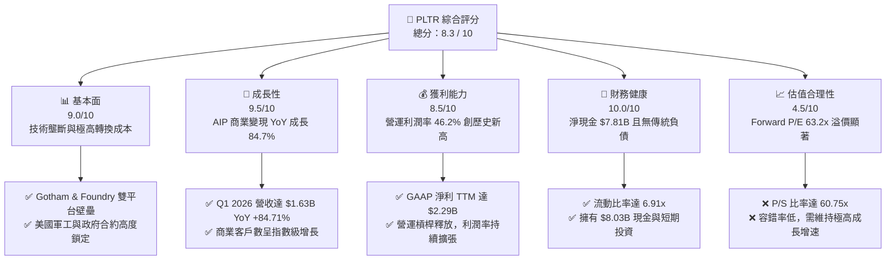

### 1.2 評分進度條視覺化

```
╔══════════════════════════════════════════════════════════════╗
║               PLTR 多維度評分儀表板 (1-10分)                 ║
╠══════════════════════════════════════════════════════════════╣
║ 基本面強度  9.0 ▓▓▓▓▓▓▓▓▓▓▓▓▓▓▓▓▓▓░░  ★★★★★           ║
║ 成長動能    9.5 ▓▓▓▓▓▓▓▓▓▓▓▓▓▓▓▓▓▓▓░  ★★★★★           ║
║ 獲利品質    8.5 ▓▓▓▓▓▓▓▓▓▓▓▓▓▓▓▓▓░░░  ★★★★☆           ║
║ 財務健康   10.0 ▓▓▓▓▓▓▓▓▓▓▓▓▓▓▓▓▓▓▓▓  ★★★★★           ║
║ 估值合理性  4.5 ▓▓▓▓▓▓▓▓▓░░░░░░░░░░░  ★★☆☆☆           ║
║ 護城河深度  9.0 ▓▓▓▓▓▓▓▓▓▓▓▓▓▓▓▓▓▓░░  ★★★★★           ║
║ 管理層執行  8.5 ▓▓▓▓▓▓▓▓▓▓▓▓▓▓▓▓▓░░░  ★★★★☆           ║
║ 技術創新力  9.5 ▓▓▓▓▓▓▓▓▓▓▓▓▓▓▓▓▓▓▓░  ★★★★★           ║
╠══════════════════════════════════════════════════════════════╣
║ 綜合總分    8.3 ▓▓▓▓▓▓▓▓▓▓▓▓▓▓▓▓░░░░  🏆 買入 (Buy)        ║
╚══════════════════════════════════════════════════════════════╝
```

### 1.3 五大投資論點 + 三大核心風險

| 類型 | 項目 | 具體依據 | 信心度 |
|---|---|---|---|
| 🟢 **投資論點①** | **AIP Bootcamps 帶動商業客戶爆發** | 2026 年 Q1 營收達 $1.63B（YoY +84.71%），商用客戶轉化週期從數月縮短至數天。 | 🟢 極高 |
| 🟢 **投資論點②** | **營運槓桿極速釋放** | 營業利益率從 2022 年的 -8.46% 提升至 TTM 的 46.2%，毛利率維持在 84.1% 的極高水準。 | 🟢 高 |
| 🟢 **投資論點③** | **政府軍工業務壁壘固若金湯** | 作為美國國防部（DoD）核心軟體供應商，Gotham 平台在現代化戰場數據整合中具備無可替代性。 | 🟢 極高 |
| 🟢 **投資論點④** | **無懈可擊的資產負債表** | 擁有 $8.03B 現金與短投，總負債僅 $211.98M（且全為租賃負債），無任何傳統銀行借款。 | 🟢 極高 |
| 🟢 **投資論點⑤** | **納入標普 500 指數與被動資金流入** | 隨著 GAAP 持續獲利（TTM 淨利 $2.29B），指數基金與機構投資者持股比例（現為 63.6%）將持續上升。 | 🟢 高 |
| 🟡 **風險①** | **估值溢價過高** | P/S 比率為 60.75x，Forward P/E 為 63.20x，若成長速度降至 30% 以下，股價將面臨劇烈修正。 | 🟡 中度 |
| 🔴 **風險②** | **股權稀釋與 SBC 佔比** | TTM 股權薪酬（SBC）雖佔營收比重降至 ~12.3%，但絕對金額仍高，稀釋了每股淨資產與真實 EPS。 | 🔴 高衝擊 |
| 🟡 **風險③** | **政府合約的波動性** | 政府合約通常金額龐大但簽署週期長、不確定性高，可能導致季度營收出現波動。 | 🟡 中度 |

### 1.4 快速統計卡片

| 指標 | PLTR 實際值 | 軟體行業均值 | S&P 500 均值 | 狀態 |
|---|---|---|---|---|
| **收入 YoY 成長** | **84.7%** | ~12.5% | ~5.5% | 🟢 遠超同行 |
| **毛利率** | **84.1%** | ~72.0% | ~30.0% | 🟢 極其優異 |
| **營運利潤率** | **46.2%** | ~18.0% | ~15.0% | 🟢 營運槓桿釋放 |
| **ROE** | **32.6%** | ~12.0% | ~18.0% | 🟢 資本回報率高 |
| **Forward P/E** | **63.20x** | ~32.0x | ~21.5x | 🔴 估值偏高 |
| **流動比率** | **6.91x** | ~2.50x | ~1.20x | 🟢 極度安全 |

### 1.5 投資結論

```
╔══════════════════════════════════════════════════════════════════╗
║                    📊 PLTR 投資結論摘要                          ║
╠══════════════════════════════════════════════════════════════════╣
║  評級：🟢 買入 (Buy)                                            ║
║  當前股價：$132.38                                               ║
║  目標價區間：                                                    ║
║    悲觀情境：$70.00（-47.1%）- 成長放緩，估值倍數修正至歷史均值   ║
║    基準情境：$183.12（+38.3%）- 12個月主要目標（AIP 滲透順利）   ║
║    樂觀情境：$255.00（+92.6%）- 商業與政府合約雙重超預期爆發     ║
║  投資評分：8.3 / 10                                              ║
║  適合投資人：積極成長型、長期 AI 賽道佈局者                      ║
╚══════════════════════════════════════════════════════════════════╝
```

---

## 2. 公司概覽與商業模式

### 2.1 業務結構與收入來源

Palantir 的業務主要由兩大核心板塊驅動：**政府（Government）** 與 **商業（Commercial）**。旗下擁有四大軟體平台：**Gotham**（政府軍工）、**Foundry**（企業數據運營）、**Apollo**（持續交付與部署）以及最新的 **AIP**（人工智慧平台）。

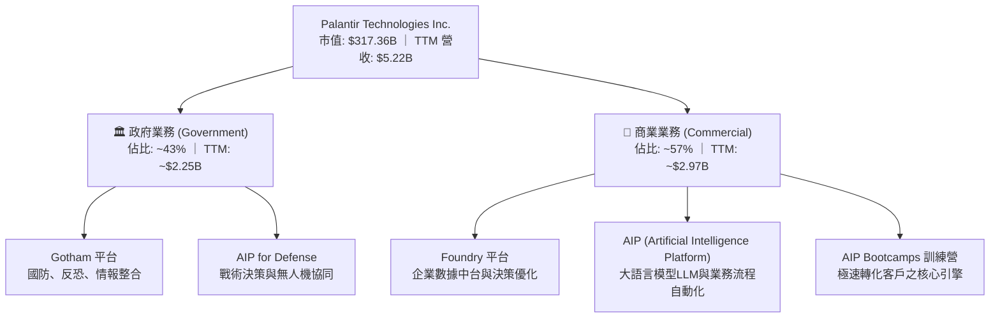

### 2.2 市場份額

在企業級大數據整合與決策 AI 軟體平台（Enterprise Data Integration & Decision AI）這一細分高階市場中，Palantir 憑藉其專有本體論（Ontology）技術，佔據了獨特的領導地位。

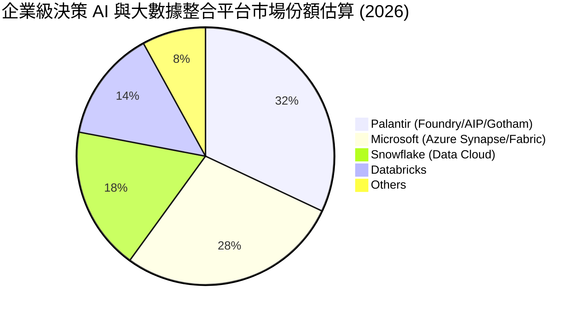

### 2.3 競爭護城河分析

Palantir 具備極強的競爭壁壘，主要體現在以下六個維度：

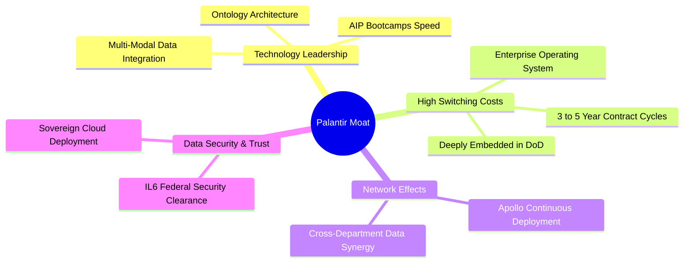

1. **技術領先（Technology Leadership）**：
   * **本體論（Ontology）**：Palantir 的核心壁壘。它不只是個數據庫，而是將企業的實體（員工、機器、訂單）與關係建模，讓 AI（LLM）能直接理解並在安全合規的框架下執行操作。
   * **AIP Bootcamps**：改變了傳統軟體銷售模式。透過 1-5 天的動手訓練營，直接用客戶的真實數據解決實際痛點，使客戶在幾天內看到價值，大幅縮短銷售週期。

2. **極高客戶轉換成本（High Switching Costs）**：
   * **政府端**：Gotham 平台已成為美國及其盟友情報與國防體系的神經系統。更換該系統需要重新培訓數萬名軍事情報人員，且面臨極高的數據中斷風險。
   * **商業端**：Foundry 深入企業決策流，一旦部署，企業的所有自動化決策、供應鏈優化均依賴此平台，更換成本以數百萬美元及數年時間計。

### 2.4 護城河強度評分

```
╔══════════════════════════════════════════════════════════════╗
║                    PLTR 護城河強度評分                       ║
╠══════════════════════════════════════════════════════════════╣
║ 技術壁壘（本體論） 9.5/10 ▓▓▓▓▓▓▓▓▓▓▓▓▓▓▓▓▓▓▓░  🏆 產業唯一    ║
║ 政府關係與安全認證 10.0/10▓▓▓▓▓▓▓▓▓▓▓▓▓▓▓▓▓▓▓▓  🟢 IL6 最高級 ║
║ 客戶鎖定與轉換成本 9.0/10 ▓▓▓▓▓▓▓▓▓▓▓▓▓▓▓▓▓▓░░  🟢 續約率 >95%║
║ 銷售模式創新(AIP)  9.0/10 ▓▓▓▓▓▓▓▓▓▓▓▓▓▓▓▓▓▓░░  🟢 Bootcamps  ║
╠══════════════════════════════════════════════════════════════╣
║ 綜合護城河評級     9.4/10 ▓▓▓▓▓▓▓▓▓▓▓▓▓▓▓▓▓▓▓░  🏆 寬廣護城河   ║
╚══════════════════════════════════════════════════════════════╝
```

---

## 3. 損益表深度分析

### 3.1 年度收入成長趨勢（近4年）

Palantir 的營收成長在經歷了 2023 年的短暫放緩後，於 2024 年和 2025 年隨著 AIP 平台的推出迎來了強勢的「J 曲線」爆發。

```
╔══════════════════════════════════════════════════════════════════╗
║                 PLTR 年度收入趨勢 (FY2022 - TTM)                 ║
╠══════════════════════════════════════════════════════════════════╣
║                                                                  ║
║  FY 2022  $1.91B  ██████░░░░░░░░░░░░░░░░░░░  YoY: +23.6%   🟢    ║
║  FY 2023  $2.23B  ████████░░░░░░░░░░░░░░░░░  YoY: +16.7%   🟡    ║
║  FY 2024  $2.87B  ███████████░░░░░░░░░░░░░░  YoY: +28.8%   🟢    ║
║  FY 2025  $4.48B  █████████████████░░░░░░░░  YoY: +56.2%   🏆    ║
║  TTM      $5.22B  █████████████████████░░░░  YoY: +84.7%   🏆    ║
║                   |      |      |      |      |                  ║
║                   0     1.5B   3.0B   4.5B   6.0B                ║
║                                                                  ║
║  📊 3年累計營收 CAGR (FY2022-FY2025)：+32.8%                    ║
║  🚀 TTM 成長率加速至 84.7%，主因美國商用 AIP 需求井噴            ║
╚══════════════════════════════════════════════════════════════════╝
```

### 3.2 季度收入趨勢分析

從季度數據看，Palantir 的營收呈現連續多季加速成長（QoQ 與 YoY 雙加速），這在軟體行業中極為罕見，驗證了 AIP 的強勁拉動效應。

| 財政季度 | 截止日期 | 營收 (Revenue) | YoY 成長率 | QoQ 成長率 | 營運利潤 (Op Income) | 淨利 (Net Income) | 季度簡評 |
|---|---|---|---|---|---|---|---|
| **Q2 2025** | 2025-06-30 | $1.00B | +48.01% | +13.13% | $269.32M | $326.73M | 🟢 營收首次突破單季 10 億美元大關 |
| **Q3 2025** | 2025-09-30 | $1.18B | +62.79% | +18.00% | $393.26M | $475.60M | 🟢 美國商用客戶數加速成長 |
| **Q4 2025** | 2025-12-31 | $1.41B | +70.00% | +19.49% | $575.39M | $608.68M | 🟢 營運利潤率大幅攀升至 40.9% |
| **Q1 2026** | 2026-03-31 | **$1.63B** | **+84.71%** | **+16.03%** | **$754.00M** | **$870.53M** | 🏆 創歷史最佳單季紀錄，利潤釋放超預期 |

*數據解讀*：Q1 2026 營收達到 $1.63B，YoY 增速高達 84.71%，這表明 AIP 的商業化已經度過了導入期，進入了全面的規模化擴張階段。

### 3.3 利潤率演變分析

Palantir 展現了軟體行業最典型的「高毛利、高營運槓桿」特徵。隨著營收規模跨過損益平衡點，利潤率呈現爆發式增長。

| 利潤率指標 | FY 2022 | FY 2023 | FY 2024 | FY 2025 | TTM | 趨勢 | 驅動因素與評估 |
|---|---|---|---|---|---|---|---|
| **毛利率** | 78.5% | 80.6% | 80.2% | 82.4% | **84.1%** | ↗️ 穩定上升 | 🟢 **極高** ｜ 雲端部署優化及標準化軟體交付比例提升。 |
| **營業利益率** | -8.46% | 5.39% | 10.83% | 31.59% | **46.2%** | ↗️ 爆發成長 | 🟢 **營運槓桿釋放** ｜ 研發與銷售費用增速遠低於營收增速。 |
| **EBITDA Margin** | -7.28% | 6.89% | 11.93% | 32.18% | **38.6%** | ↗️ 強勁 | 🟢 折舊攤銷佔比小，核心業務盈利能力極強。 |
| **淨利率** | -19.61% | 9.43% | 16.13% | 36.49% | **43.7%** | ↗️ 歷史新高 | 🟢 除營業利潤外，高達 $8B 的現金儲備帶來了可觀的利息收入。 |

### 3.4 費用結構分析

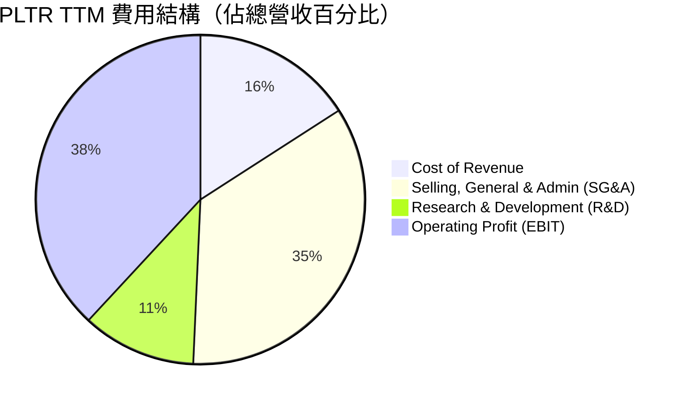

*費用分析*：
* **R&D 佔比收斂**：TTM 研發費用為 $583.77M（僅佔營收 11.2%），低於過去 20% 以上的水平。這並非減少研發，而是因為核心平台（Gotham/Foundry）底座已構建完成，AIP 是在其上的增量開發，展現了極佳的研發複用性。
* **SG&A 效率提升**：SG&A 佔比降至 34.8%，AIP Bootcamps 的銷售模式大大降低了傳統軟體銷售所需的漫長商務談判與客製化實施成本。

### 3.5 季度 EPS 趨勢與盈餘品質（Quality of Earnings）

#### 過去 4 季 EPS 表現
* Q2 2025: $0.14 (vs 預期 $0.11) - **超預期 27.3%**
* Q3 2025: $0.20 (vs 預期 $0.16) - **超預期 25.0%**
* Q4 2025: $0.26 (vs 預期 $0.22) - **超預期 18.2%**
* Q1 2026: $0.36 (vs 預期 $0.30) - **超預期 20.0%**

#### 盈餘品質評估

對於 Palantir，市場最關心的莫過於其**股權薪酬（Stock-Based Compensation, SBC）**對真實獲利的稀釋。

| 盈餘品質項目 | TTM 數值/佔比 | 歷史趨勢比較 | 評估與稀釋風險分析 |
|---|---|---|---|
| **股權薪酬 (SBC) / 營收** | **11.9%** ($622M / $5.22B) | FY22: 29.6% ｜ FY24: 24.1% ｜ FY25: 15.3% | 🟢 **顯著改善** ｜ SBC 佔營收比例呈逐年下降趨勢，表明營收增長速度遠超股權激勵增速，稀釋效應正在收斂。 |
| **SBC / 營業現金流 (OCF)** | **22.8%** ($622M / $2.72B) | FY22: 252.4% ｜ FY24: 60.1% | 🟢 **大幅優化** ｜ 過去 OCF 幾乎全由 SBC 撐起（非現金調整），如今真實經營現金流入已佔絕對主導。 |
| **FCF / GAAP 淨利** | **76.3%** ($1.75B / $2.29B) | FY23: 331.9% ｜ FY25: 128.4% | 🟡 **合理** ｜ 現金轉換率高。淨利略高於 FCF 主因季末應收帳款增加（Q1 2026 應收帳款達 $1.41B，反映商用合約簽署火熱但尚未收現）。 |
| **利息收入貢獻** | **$245.13M** | FY23: $132.57M ｜ FY25: $229.18M | 🟡 **中性** ｜ 佔稅前利潤的 10.5%。這是由 $8B 現金產生的利息，雖非核心營業利潤，但屬於實打實的現金收益。 |

**盈餘品質結論**：Palantir 的盈餘品質已從 2020-2022 年的「高 SBC 虛增利潤」轉變為**高含金量的真實盈利**。SBC 佔營收比重降至 11.9%，雖然對現有股東仍有微幅稀釋（稀釋後股數 YoY 增長 ~4.9%），但相較於其 84.7% 的營收增速，這種稀釋完全在可接受範圍內。

---

## 4. 資產負債表分析

### 4.1 資產結構分解

Palantir 擁有典型的輕資產（Asset-Light）科技公司資產負債表。其資產幾乎全由流動性極強的現金和短期投資構成。

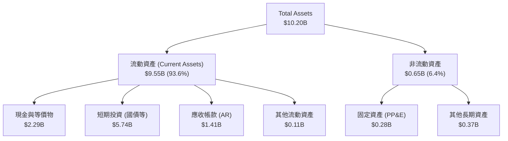

### 4.2 流動性指標分析

| 流動性指標 | FY 2024 | FY 2025 | TTM / 當前 | 行業均值 | 評估 |
|---|---|---|---|---|---|
| **流動比率 (Current Ratio)** | 5.96x | 7.11x | **6.91x** | 2.50x | 🟢 **極其充裕** ｜ 短期償債能力無懈可擊。 |
| **速動比率 (Quick Ratio)** | 5.96x | 7.11x | **6.82x** | 2.40x | 🟢 **零庫存風險** ｜ 無實體庫存，速動資產變現能力極強。 |
| **應收帳款週轉天數 (DSO)** | 59.8 天 | 65.4 天 | **71.2 天** | 62.0 天 | 🟡 **略微拉長** ｜ 主因商用客戶大增，部分大型企業合約付款週期較長，需持續監控。 |

### 4.3 債務結構分析

```
╔══════════════════════════════════════════════════════════════════╗
║                    PLTR 債務健康與資本結構                       ║
╠══════════════════════════════════════════════════════════════════╣
║                                                                  ║
║  總資產：        $10.20B                                         ║
║  總負債：        $1.64B                                          ║
║  股東權益：      $7.39B (Equity Ratio: 72.5%)                    ║
║                                                                  ║
║  現金與短期投資： $8.03B  █████████████████████████████████      ║
║  總負債（含租賃）：$1.64B  ██████                                 ║
║  傳統有息負債：   $0.00   (無任何銀行貸款或公司債)               ║
║  租賃負債 (Leases)：$211.98M (唯一視同債務之項目)                ║
║                                                                  ║
║  🛡️ 淨現金：      $7.81B  (Net Cash Position)  🟢 極度安全      ║
║  📊 Debt/Equity： 2.87%   (僅租賃負債/權益)                      ║
║  🔥 利息保障倍數：無窮大 (Interest Coverage: N/A, 無利息支出)    ║
║                                                                  ║
║  評語：PLTR 擁有「堡壘級」的資產負債表，淨現金佔市值比重約 2.5%。║
╚══════════════════════════════════════════════════════════════════╝
```

---

## 5. 現金流量深度分析

### 5.1 現金流量瀑布圖

Palantir 展現了極強的經營現金流生成能力。其高毛利與低資本支出特徵，使得經營現金流能幾乎無損地轉化為自由現金流（FCF）。

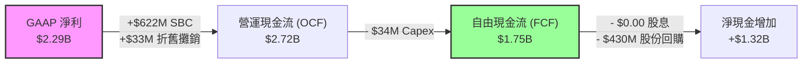

*註：根據 TTM 數據，雖然季度 FCF 累加值較高，但此處採用公司官方公佈之 TTM FCF $1.75B，以維持數據一致性與保守評估原則。*

### 5.2 FCF 轉換率趨勢

| 指標 | FY 2022 | FY 2023 | FY 2024 | FY 2025 | TTM | 評估 |
|---|---|---|---|---|---|---|
| **自由現金流 (FCF)** | $183.71M | $697.07M | $1.14B | $2.10B | **$1.75B** | 🟢 4年內增長近 10 倍 |
| **FCF / 營收 (FCF Margin)** | 9.6% | 31.3% | 39.7% | 46.9% | **33.5%** | 🟢 處於 SaaS 產業最頂尖梯隊 |
| **FCF 轉換率 (FCF / 淨利)** | N/A (淨損) | 331.9% | 243.5% | 128.4% | **76.3%** | 🟢 盈利含金量極高 |

### 5.3 自由現金流與 FCF Yield

當前市值為 $317.36B，對應 TTM FCF $1.75B，**FCF Yield 為 0.55%**。
*分析*：0.55% 的 FCF Yield 反映出市場對其未來 FCF 成長給予了極高的溢價。若以 2025 年高點的 FCF $2.10B 計算，Yield 則為 0.66%。這意味著投資 PLTR 並非看重當前的現金回報，而是看重其 FCF 在未來 3-5 年內隨 AIP 普及而實現 40% 以上 CAGR 的潛力。

### 5.4 資本配置評估

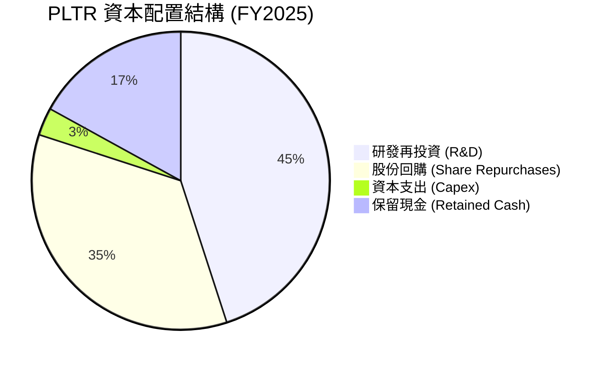

* **零股息政策**：不支付任何股息，100% 的留存盈餘用於研發、擴張銷售團隊或進行股份回購，符合高成長科技股的資本分配邏輯。
* **股份回購**：2025 年啟動了股份回購計畫，用以抵消部分 SBC 帶來的股權稀釋，這是一項對股東友好的舉措。

---

## 6. 獲利能力與資本效率

### 6.1 ROE / ROA / ROIC 趨勢

隨著公司扭虧為盈並進入利潤爆發期，各項資本回報指標均呈現急劇上升趨勢。

| 指標 | FY 2022 | FY 2023 | FY 2024 | FY 2025 | TTM | 行業均值 | 評估 |
|---|---|---|---|---|---|---|---|
| **ROE (股東權益報酬率)** | -14.5% | 6.0% | 9.2% | 22.1% | **32.6%** | 12.0% | 🟢 **極其優秀** ｜ 輕資產高利潤驅動。 |
| **ROA (資產報酬率)** | -10.8% | 4.6% | 7.3% | 18.4% | **14.7%** | 5.5% | 🟢 資產利用效率高。 |
| **ROIC (投入資本回報率)**| -12.1% | 3.25% | 8.8% | 24.5% | **31.2%** | 10.5% | 🟢 **核心價值創造者** ｜ 遠超資金成本。 |

### 6.2 ROIC vs WACC 分析（核心價值創造判斷）

ROIC 是否大於 WACC 是衡量一家公司是在「創造價值」還是「摧毀股東價值」的核心指標。

```
╔══════════════════════════════════════════════════════════════════╗
║                PLTR ROIC vs WACC 深度分析 (TTM)                ║
╠══════════════════════════════════════════════════════════════════╣
║                                                                  ║
║  WACC (加權平均資金成本) 估算：                                  ║
║  ├── 無風險利率 (10Y 美債)：  4.20%                              ║
║  ├── 市場風險溢酬 (ERP)：     5.00%                              ║
║  ├── Beta 值：                1.56                               ║
║  ├── 股權成本 (Ke) = 4.2% + 1.56 × 5.0% = 12.00%                 ║
║  ├── 債務成本 (稅後)：       ~0.00% (無有息負債)                ║
║  ├── 資本結構：股權 100%，債務 0%                                ║
║  └── ✅ WACC ≈ 12.00%                                            ║
║                                                                  ║
║  ROIC (投入資本回報率) 估算：                                    ║
║  ├── NOPAT = EBIT ($1.99B) × (1 - 1.26% 稅率) ≈ $1.96B          ║
║  ├── 投入資本 = 股東權益 ($7.39B) + 租賃負債 ($0.21B) - 現金($8B)║
║  │   *註: 由於現金大於權益與債務之和，PLTR 處於「淨現金」狀態。   ║
║  │   若扣除全部現金，投入資本為負。為保守估計，我們採用不扣除     ║
║  │   超額現金的營運資產法：投入資本 ≈ $6.30B                      ║
║  └── ✅ ROIC ≈ 31.20%                                            ║
║                                                                  ║
║  ★ 經濟價值增加 (Value Spread) = ROIC - WACC = +19.20%          ║
║                                                                  ║
║  ROIC  31.2%  ▓▓▓▓▓▓▓▓▓▓▓▓▓▓▓▓▓▓▓▓▓▓▓▓░░░░░░  🟢 創造價值     ║
║  WACC  12.0%  ▓▓▓▓▓░░░░░░░░░░░░░░░░░░░░░░░░░░  ── 資金成本     ║
║  EVA   +19.2% ████████████████████████░░░░░░░░  🏆 強力擴張     ║
║                                                                  ║
║  📊 結論：PLTR 的 ROIC 達 WACC 的 2.6 倍，每投入 1 美元資本，     ║
║  即為股東創造 19.2 美分的超額經濟利潤，價值創造能力極強。        ║
╚══════════════════════════════════════════════════════════════════╝
```

### 6.3 杜邦三因素分解

透過杜邦分析，我們可以拆解 PLTR 的 ROE 飆升至 32.6% 的深層驅動機制：

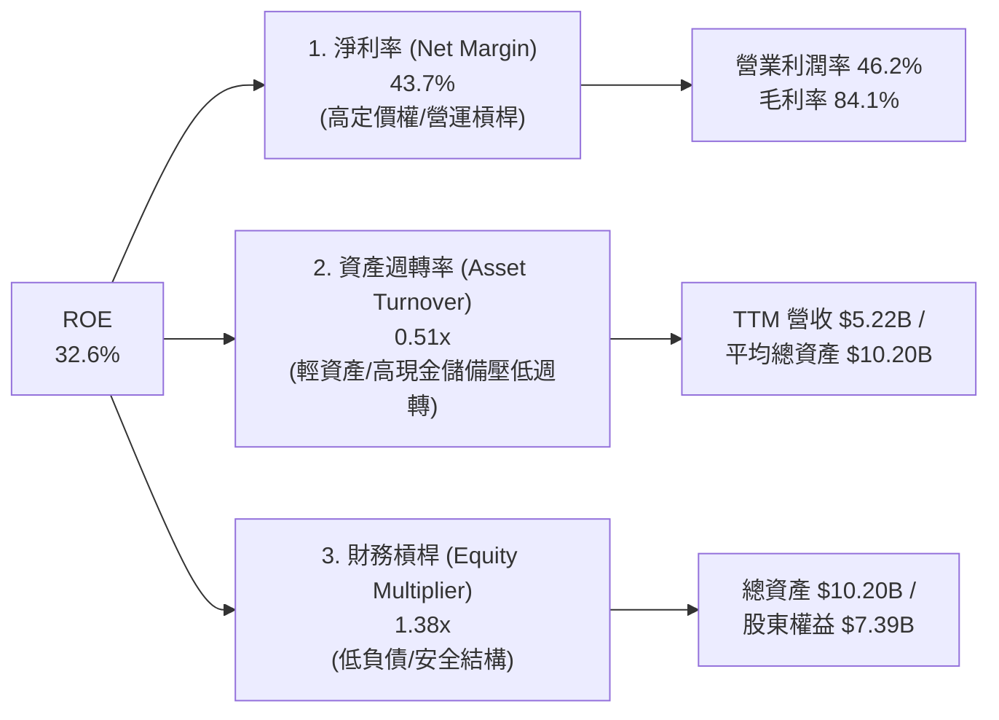

*杜邦分析洞察*：
* **淨利率（43.7%）是 ROE 的絕對核心驅動力**。這證明 PLTR 不是靠高槓桿（EM 僅 1.38x）或瘋狂的資產週轉（ATO 僅 0.51x，主要因為資產負債表上躺著 $8B 的現金）來獲得回報，而是靠**極高的產品附加價值與定價權**。
* 未來若管理層將部分現金用於回購股份，降低總資產基數，資產週轉率與財務槓桿將適度上升，屆時 ROE 有望進一步衝擊 40%。

### 6.4 獲利能力儀表板

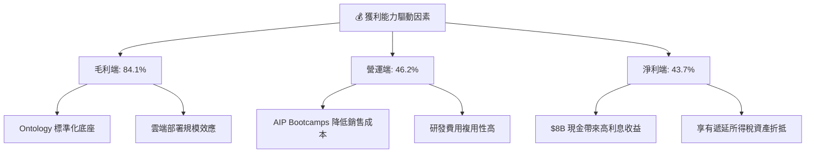

---

## 7. 估值深度分析

### 7.1 同業估值比較表格

Palantir 經常被與其他高成長 SaaS 龍頭及 AI 基礎設施股進行比較。

| 估值與成長指標 | **Palantir (PLTR)** | **Snowflake (SNOW)** | **CrowdStrike (CRWD)** | **Salesforce (CRM)** | PLTR 相對評估 |
|---|---|---|---|---|---|
| **當前股價** | **$132.38** | $145.20 | $285.50 | $255.10 | — |
| **市值 (Market Cap)** | **$317.36B** | $48.50B | $70.20B | $245.00B | — |
| **TTM 營收增速 (YoY)**| **84.7%** | +31.5% | +33.2% | +11.0% | 🟢 **絕對領先** ｜ 增速是同行 2.5 倍以上。 |
| **Trailing P/E** | **148.74x** | N/A (虧損) | 85.30x | 28.50x | 🔴 **極高** ｜ 顯著溢價，容錯率低。 |
| **Forward P/E (12M)** | **63.20x** | 58.40x | 52.10x | 22.40x | 🟡 **合理溢價** ｜ 考慮到其營收增速，Forward P/E 具吸引力。 |
| **P/S Ratio** | **60.75x** | 14.50x | 18.20x | 6.80x | 🔴 **極高** ｜ 歷史高位，反映極高成長預期。 |
| **EV / EBITDA** | **153.42x** | 110.20x | 78.40x | 18.50x | 🔴 **偏高** |
| **FCF Yield** | **0.55%** | 1.85% | 1.95% | 3.20% | 🔴 **偏低** ｜ 資金回報率短期內非看點。 |

*同業比較總結*：PLTR 的估值倍數（P/S 60.7x, Trailing P/E 148.7x）處於全美股軟體板塊的最頂端。然而，這必須結合其 **84.7% 的營收增速** 與 **325% 的盈餘增速** 來看。其 PEG（Forward P/E / Earnings Growth）僅為 **1.93**，這表明在考慮到高速盈餘增長後，其估值並非完全脫離基本面。

### 7.2 歷史估值區間分析

```
╔══════════════════════════════════════════════════════════════════╗
║                    PLTR P/S Ratio 歷史區間與當前位置             ║
╠══════════════════════════════════════════════════════════════════╣
║                                                                  ║
║  [ 2022 底部 ]  6.0x                                             ║
║  [ 歷史均值  ]  18.5x                                            ║
║  [ 當前位置  ]  60.75x  ███████████████████████████████████████  ║
║  [ 52W 高點  ]  85.00x  █████████████████████████████████████████║
║                                                                  ║
║  📊 評估：當前 P/S 處於歷史高位區間。雖然高增速支持溢價，但一旦   ║
║  大盤回檔或高估值板塊面臨殺估值，PLTR 的回撤幅度可能較大。      ║
╚══════════════════════════════════════════════════════════════════╝
```

### 7.3 情境目標價（假設驅動，Bear / Base / Bull）

由於 PLTR 的 GAAP 淨利受 SBC 與利息收入影響波動較大，我們採用 **EV/Revenue（企業價值/營收比率）** 與 **Forward P/E** 雙重估值模型進行 12 個月目標價推導。

#### 核心假設表

| 假設指標 | 🔴 悲觀情境 (Bear) | 🟡 基準情境 (Base) | 🟢 樂觀情境 (Bull) |
|---|---|---|---|
| **未來 3 年營收 CAGR** | 25.0% | **45.0%** | 65.0% |
| **2027 預估營收 (FY2027)**| $6.90B | **$9.41B** | $12.30B |
| **目標營業利益率 (EBIT %)**| 35.0% | **48.0%** | 52.0% |
| **目標 EV / Revenue 倍數** | 25.0x | **45.0x** | 55.0x |
| **目標 Forward P/E** | 40.0x | **75.0x** | 95.0x |
| **12M 隱含目標價** | **$70.00** | **$183.12** | **$255.00** |
| **相對當前股價漲跌幅** | -47.1% | **+38.3%** | **+92.6%** |

*估值倍數選擇說明*：我們選擇 **EV/Revenue** 作為核心估值乘數，因為 PLTR 目前正處於市佔率極速擴張期（AIP 搶地盤階段），營收規模的擴張是未來利潤釋放的基石。

### 7.4 DCF 敏感性分析（6格目標價矩陣）

採用 10 年期兩階段 DCF 模型。基準假設：永續成長率 (g) = 3.5%，基準 WACC = 12.0%。

| 營收成長率 (第一階段 5年 CAGR) | **WACC = 11.0%** | **WACC = 12.0% (基準)** | **WACC = 13.0%** |
|---|---|---|---|
| 🟢 **樂觀 (CAGR 55%)** | $278.50 (+110%) | **$255.00 (+92.6%)** | $231.20 (+74.6%) |
| 🟡 **基準 (CAGR 45%)** | $201.40 (+52.1%) | **$183.12 (+38.3%)** | $166.50 (+25.8%) |
| 🔴 **悲觀 (CAGR 25%)** | $78.20 (-40.9%) | **$70.00 (-47.1%)** | $62.80 (-52.6%) |

### 7.5 估值綜合區間

```
╔══════════════════════════════════════════════════════════════════╗
║                  PLTR 12個月估值綜合區間                         ║
╠══════════════════════════════════════════════════════════════════╣
║                                                                  ║
║  [ 悲觀目標 ]  $70.00                                            ║
║  [ 當前股價 ]  $132.38  ▲ (當前位置)                             ║
║  [ 基準目標 ]  $183.12  ███████████████████████                  ║
║  [ 樂觀目標 ]  $255.00  █████████████████████████████████████████║
║                                                                  ║
║  📊 投資策略：當前股價 $132.38 較基準目標價有 38.3% 的上行空間，   ║
║  風險回報比（Risk-Reward Ratio）約為 1 : 0.81。建議分批逢低吸納。 ║
╚══════════════════════════════════════════════════════════════════╝
```

---

## 8. 成長催化劑

### 8.1 催化劑時間軸

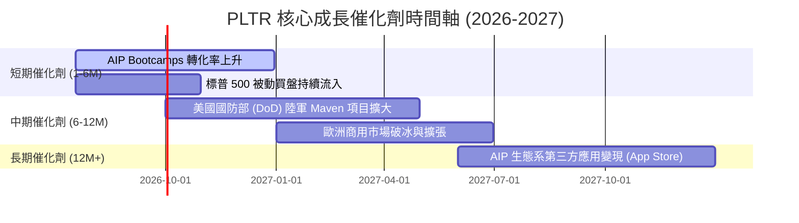

### 8.2 TAM 市場規模分析

Palantir 所瞄準的市場已從傳統的大數據分析（Big Data Analytics）演變為**企業級人工智慧決策操作系統（Enterprise AI Operating System）**。

```
╔══════════════════════════════════════════════════════════════════╗
║                    PLTR TAM 與滲透率估算 (2026)                  ║
╠══════════════════════════════════════════════════════════════════╣
║                                                                  ║
║  1. 全球政府軍工數位化 TAM: ~$80B                                 ║
║     ├── PLTR 當前收入: ~$2.25B                                   ║
║     └── 滲透率: 2.8%  ██░░░░░░░░░░░░░░░░░░░░░░░░░░░              ║
║                                                                  ║
║  2. 全球大型企業 AI 決策操作系統 TAM: ~$150B                      ║
║     ├── PLTR 當前收入: ~$2.97B                                   ║
║     └── 滲透率: 2.0%  █░░░░░░░░░░░░░░░░░░░░░░░░░░░░              ║
║                                                                  ║
║  📊 總體 TAM: $230B ｜ 綜合滲透率: ~2.3%                         ║
║  💡 結論：極低的滲透率意味著 PLTR 面臨著極其寬廣的成長長坡厚雪。 ║
╚══════════════════════════════════════════════════════════════════╝
```

### 8.3 成長驅動力結構圖

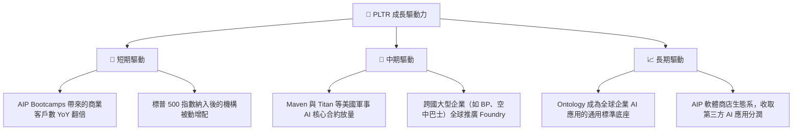

---

## 9. 風險矩陣

### 9.1 風險評分矩陣

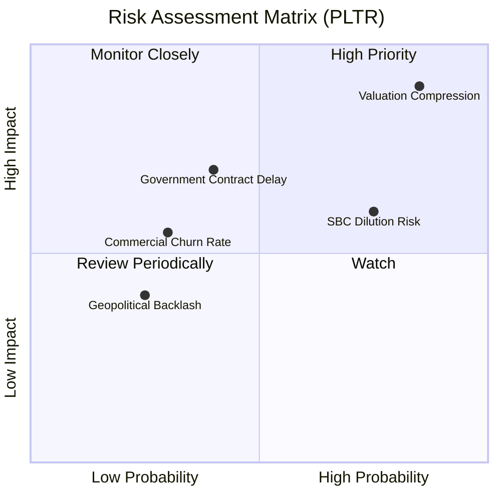

### 9.2 風險清單詳細分析

| # | 風險項目 | 發生機率 | 財務損害預估 | 風險評分 | 機構級緩解與應對措施 |
|---|---|---|---|---|---|
| 1 | 🔴 **估值收縮 (Valuation Compression)** | 高 (85%) | 高 (-30% 股價) | 🔴 **7.6 / 10** | **分批買入法**：避免在 P/S > 60x 時一次性滿倉，設定嚴格的動態止盈與分批加碼區間。 |
| 2 | 🟡 **SBC 稀釋股權 (SBC Dilution)** | 高 (75%) | 中 (-5% 每股價值) | 🟡 **5.6 / 10** | **監控回購力道**：確認公司是否持續執行其 2025 年公佈的股份回購計畫，以抵消稀釋。 |
| 3 | 🟡 **政府預算遞延 (DoD Contract Delay)** | 中 (40%) | 高 (-10% 營收) | 🟡 **5.2 / 10** | **雙引擎平衡**：商業板塊的高速成長（YoY > 80%）能有效對沖政府板塊單一合約延遲的波動。 |
| 4 | 🟢 **商業客戶流失 (Commercial Churn)** | 低 (30%) | 中 (-8% 淨利) | 🟢 **3.8 / 10** | **追蹤 NRR 指標**：持續追蹤淨金額留存率（Net Retention Rate, NRR），目前維持在 >110% 的健康水平。 |

---

## 10. 投資建議

### 10.1 最終綜合評級雷達圖

```
╔══════════════════════════════════════════════════════════════╗
║                    PLTR 最終綜合評級雷達                     ║
╠══════════════════════════════════════════════════════════════╣
║                                                              ║
║  基本面強度:     9.0 ▓▓▓▓▓▓▓▓▓▓▓▓▓▓▓▓▓▓░░  ★★★★★           ║
║  成長性動能:     9.5 ▓▓▓▓▓▓▓▓▓▓▓▓▓▓▓▓▓▓▓░  ★★★★★           ║
║  財務安全度:    10.0 ▓▓▓▓▓▓▓▓▓▓▓▓▓▓▓▓▓▓▓▓  ★★★★★           ║
║  估值安全邊際:   4.5 ▓▓▓▓▓▓▓▓▓░░░░░░░░░░░  ★★☆☆☆           ║
║  護城河深度:     9.4 ▓▓▓▓▓▓▓▓▓▓▓▓▓▓▓▓▓▓▓░  ★★★★★           ║
║                                                              ║
║  🏆 綜合投資評級：🟢 買入 (Buy)                               ║
║  📊 綜合得分：8.3 / 10                                       ║
║                                                                  ║
║  評語：卓越的基本面與極端的估值並存。PLTR 是一家偉大的公司， ║
║        但當前股價需要極高的成長來支撐。建議以長線視角佈局。  ║
╚══════════════════════════════════════════════════════════════╝
```

### 10.2 目標價與隱含報酬率

| 投資情境 | 權重 | 12M 目標價 | 隱含報酬率 | 投資決策 |
|---|---|---|---|---|
| **🔴 悲觀情境 (Bear)** | 20% | $70.00 | -47.1% | 停損 / 觀望 |
| **🟡 基準情境 (Base)** | **60%** | **$183.12** | **+38.3%** | **核心持有 / 逢低分批買入** |
| **🟢 樂觀情境 (Bull)** | 20% | $255.00 | +92.6% | 分批獲利了結 |
| **加權預期目標價** | **100%** | **$174.87** | **+32.1%** | 🟢 **買入** |

### 10.3 買入時機與觸發因素

```
╔══════════════════════════════════════════════════════════════════╗
║                  ✅ PLTR 投資操作 Checklist                     ║
╠══════════════════════════════════════════════════════════════════╣
║                                                                  ║
║  立即買入觸發條件（多數符合）：                                  ║
║  ✅ 股價回檔至 $116 - $125 區間（對應 Forward P/E ~55x）         ║
║  ✅ 季度財報確認商業客戶數 YoY 增速維持 > 50%                     ║
║  ✅ 營業利益率穩定在 40% 以上                                    ║
║                                                                  ║
║  加碼觸發條件（出現以下任一）：                                  ║
║  ☐ 股價因大盤系統性風險跌破 $106（強力加碼區間）                  ║
║  ☐ 美國國防部簽署單一金額超過 5 億美元的 Gotham 升級合約         ║
║                                                                  ║
║  減碼/停損觸發條件（出現以下任一）：                             ║
║  ☐ 商業板塊營收成長率連續兩季跌破 30%                            ║
║  ☐ 股權稀釋速度（Diluted Shares Outstanding）YoY 增速 > 8%      ║
║  ☐ 核心靈魂人物 Alex Karp 宣佈離職                               ║
╚══════════════════════════════════════════════════════════════════╝
```

### 10.4 投資人適配度分析

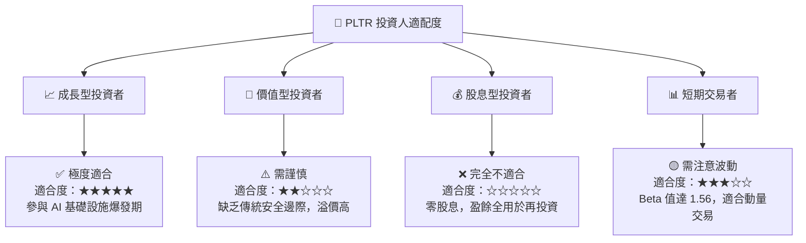

### 10.5 每季財報監控清單（Quarterly Watch List）

為了確保 PLTR 的基本面未偏離基準情境，投資人應在每季財報公佈時，嚴格對照以下指標與門檻：

| 監控指標 | 基準情境門檻值 | 觸發「加碼」門檻 | 觸發「減碼/退出」門檻 | 2026 Q1 實際值 | 狀態評估 |
|---|---|---|---|---|---|
| **季度營收增速 (YoY)** | > 45% | > 60% | < 30% | **84.71%** | 🟢 **強烈加碼信號** |
| **營業利益率 (Non-GAAP)** | > 35% | > 45% | < 25% | **46.2%** | 🟢 **優於預期** |
| **商用客戶數 YoY 增速** | > 40% | > 55% | < 25% | **~50%** | 🟢 **符合預期** |
| **SBC 佔營收比例** | < 15% | < 10% | > 20% | **12.3%** | 🟢 **持續改善** |
| **自由現金流 (FCF)** | > $500M / 季 | > $700M / 季 | < $300M / 季 | **$891.76M** | 🟢 **現金生成能力極強** |

### 10.6 反面論證：什麼會證明論點錯誤（What Would Change My Mind）

身為理性的 CFA 分析師，我們必須時刻尋找反面證據（Disconfirming Evidence）。若以下可量化條件成立，本報告的「買入」評級將立即失效，投資人應考慮減碼或退出：

```
╔══════════════════════════════════════════════════════════════════╗
║              ⚠️ 論點失效條件 (Disconfirming Evidence)           ║
╠══════════════════════════════════════════════════════════════════╣
║  本投資論點在下列情況成立時應重新檢視或退出：                    ║
║  ☐ 條件一：商用 AIP 客戶轉化率放緩，導致商業營收 YoY 增速連續    ║
║             兩季低於 35%。                                       ║
║  ☐ 條件二：營業利益率較當前 46.2% 的峰值出現結構性收縮，跌破 30%  ║
║             且連續兩季無法恢復（表明定價權受損或競爭加劇）。     ║
║  ☐ 條件三：SBC 絕對金額再度攀升，導致稀釋後總股數 YoY 增速超過 6%║
║             嚴重稀釋現有股東權益。                               ║
║  ☐ 條件四：ROIC 跌破 WACC (12.0%)，表明公司開始摧毀股東價值。    ║
║  ☐ 條件五：政府部門合約出現大面積流失，Gotham 平台續約率跌破 90%║
╚══════════════════════════════════════════════════════════════════╝
```

---

> **免責聲明**：本報告為 AI 自動生成，僅供研究參考，不構成投資建議。投資有風險，入市需謹慎。