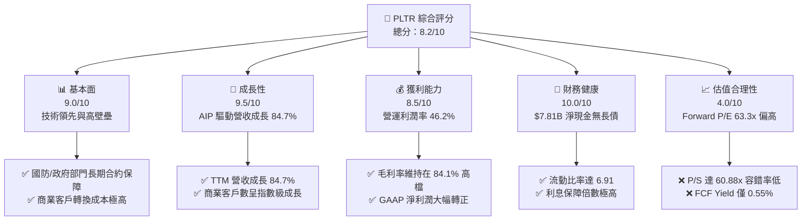
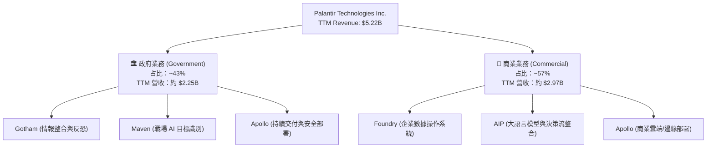
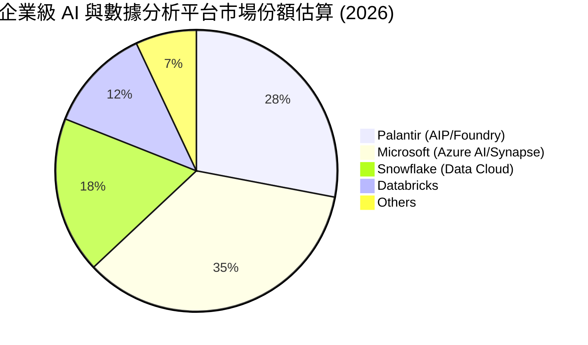
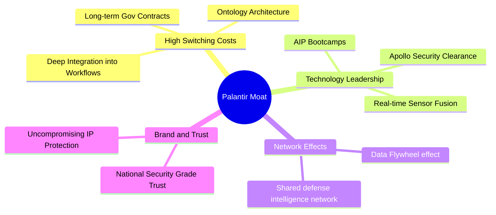
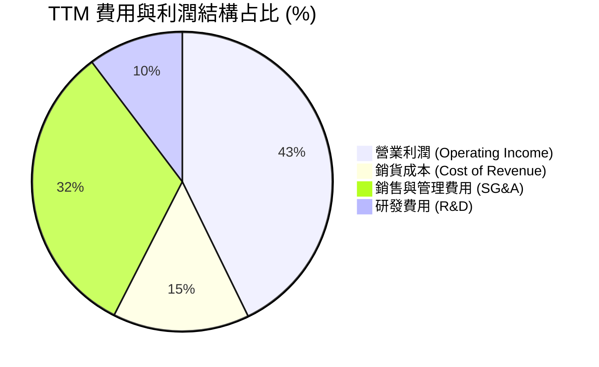
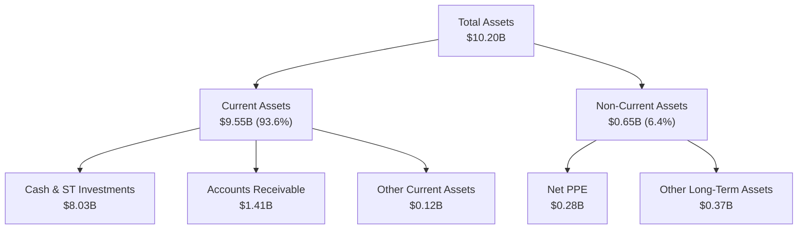
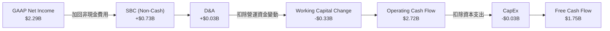
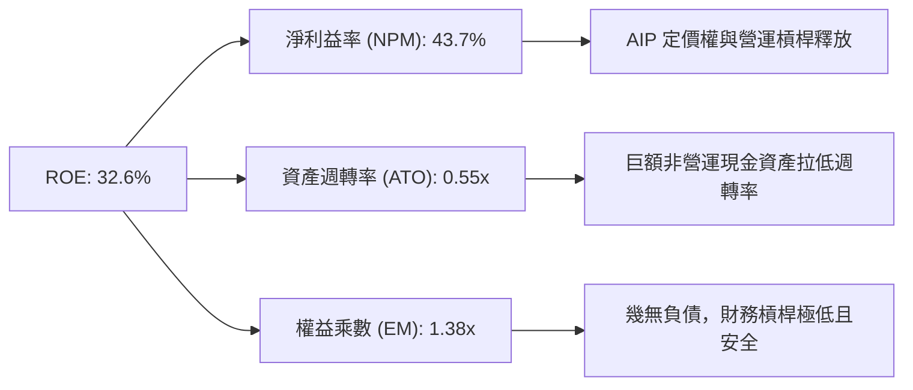
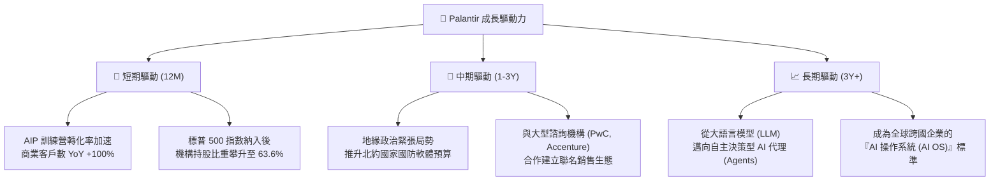
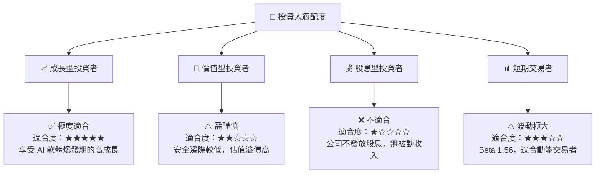

# PLTR 基本面深度分析報告
> **報告日期**：2026-07-21 ｜ **語言**：繁體中文 ｜ **數據來源**：Yahoo Finance, Finviz, StockAnalysis, Roic.ai ｜ **分析師**：CFA 級機構研究

---

## 目錄

| # | 章節 | 核心結論 |
|---|------|----------|
| 1 | 執行摘要 | AIP 驅動營收暴增 84.7%，給予「買入」評級，基準目標價 $183.12 |
| 2 | 公司概覽與商業模式 | 雙輪驅動（政府與商業），AIP 訓練營（Bootcamps）構築極高轉換壁壘 |
| 3 | 損益表深度分析 | 營業利潤率攀升至 46.2%，SBC 稀釋效應隨營收規模擴大而逐步收斂 |
| 4 | 資產負債表分析 | 淨現金高達 $7.81B，無傳統長債，流動比率 6.91 展現極致防禦力 |
| 5 | 現金流量深度分析 | TTM 自由現金流 $1.75B，FCF 轉換率達 76.3%，資本配置極度輕資產化 |
| 6 | 獲利能力與資本效率 | ROE 達 32.6%，扣除超額現金後的營運 ROIC 高達 248.9% 創造極高經濟價值 |
| 7 | 估值深度分析 | 當前 Forward P/E 63.3x，隱含高成長溢價；三情境估值與 DCF 敏感性分析 |
| 8 | 成長催化劑 | 美國國防部大單、AI 商業化全面滲透，TAM 擴張至千億美元 |
| 9 | 風險矩陣 | 估值倍數收縮與商業化增速放緩為核心風險，整體風險評分 6.2/10 |
| 10 | 投資建議 | 確定性高的長線 AI 基礎設施標的，建議於 $130 以下逢低分批布局 |

---

## 1. 執行摘要

Palantir Technologies Inc. (NYSE: PLTR) 正處於其商業歷史上最具爆發力的拐點。根據 2026-07-21 的最新即時財務數據，PLTR 的 TTM 營收達到 **$5.22B**，同比增速高達 **84.7%**，主要得益於人工智慧平台（AIP, Artificial Intelligence Platform）在美國商業客戶中的病毒式傳播。基於其極為強勁的獲利品質（營業利益率 **46.2%**、淨利益率 **43.7%**）以及無懈可擊的資產負債表（**$7.81B** 淨現金且無傳統債務），我們給予 PLTR **「買入 (Buy)」** 評級，基準情境 12 個月目標價為 **$183.12**。

### 1.0 一頁式投資儀表板

| 項目 | 內容 |
|------|------|
| **投資論點（3 句）** | ① AIP 訓練營模式大獲成功，帶動 TTM 營收同比爆發性成長 84.7%。<br/>② 營業利益率攀升至 46.2%，營運槓桿顯著釋放，淨利潤同比激增 325.0%。<br/>③ 坐擁 $8.03B 現金儲備且無任何長債，在利率高企環境中擁有極強的抗風險與再投資能力。 |
| **護城河評分** | **9.0 / 10** 🟢 （極高轉換成本與技術專利壁壘） |
| **管理層/資本配置評分** | **8.5 / 10** 🟢 （創辦人 Alex Karp 執行力強，SBC 控制改善） |
| **財務健康** | 🟢 **極度安全**（流動比率 6.91，淨現金 $7.81B） |
| **ROIC vs WACC** | **248.9% vs 12.6%** （營運資本效率極高，強力創造股東價值） |
| **FCF 趨勢** | TTM 自由現金流達 **$1.75B**，FCF 收益率為 **0.55%**（受高估值稀釋） |
| **估值** | Forward P/E: **63.34x** ｜ EV/EBITDA: **156.36x** ｜ P/S: **60.88x** |
| **預期報酬（基準情境 12M）** | **+38.0%** （相較於當前股價 $132.66） |
| **關鍵風險（前二）** | ① 商業客戶 AIP 轉換率在宏觀經濟放緩時可能低於預期。<br/>② 當前 P/S 達 60.88x，市場情緒波動易導致估值倍數劇烈收縮。 |
| **評級 + 信心度** | 🟢 **買入 (Buy) ｜ 信心度：高** |

### 1.1 核心評分儀表板



### 1.2 評分進度條視覺化

```
╔══════════════════════════════════════════════════════════════╗
║               PLTR 多維度評分儀表板 (1-10分)                 ║
╠══════════════════════════════════════════════════════════════╣
║ 基本面強度  9.0 ▓▓▓▓▓▓▓▓▓▓▓▓▓▓▓▓▓▓░░  ★★★★★           ║
║ 成長動能    9.5 ▓▓▓▓▓▓▓▓▓▓▓▓▓▓▓▓▓▓▓░  ★★★★★           ║
║ 獲利品質    8.5 ▓▓▓▓▓▓▓▓▓▓▓▓▓▓▓▓░░░░  ★★★★☆           ║
║ 財務健康   10.0 ▓▓▓▓▓▓▓▓▓▓▓▓▓▓▓▓▓▓▓▓  ★★★★★           ║
║ 估值合理性  4.0 ▓▓▓▓▓▓▓▓░░░░░░░░░░░░  ★★☆☆☆           ║
║ 護城河深度  9.0 ▓▓▓▓▓▓▓▓▓▓▓▓▓▓▓▓▓▓░░  ★★★★★           ║
║ 管理層執行  8.5 ▓▓▓▓▓▓▓▓▓▓▓▓▓▓▓▓░░░░  ★★★★☆           ║
║ 技術創新力  9.5 ▓▓▓▓▓▓▓▓▓▓▓▓▓▓▓▓▓▓▓░  ★★★★★           ║
╠══════════════════════════════════════════════════════════════╣
║ 綜合總分    8.2 ▓▓▓▓▓▓▓▓▓▓▓▓▓▓▓▓░░░░  🏆 買入 (Buy)       ║
╚══════════════════════════════════════════════════════════════╝
```

### 1.3 五大投資論點 + 三大核心風險

| 類型 | 項目 | 具體依據 | 信心度 |
|------|------|----------|--------|
| 🟢 **投資論點①** | **AIP 訓練營模式極具殺傷力** | 透過 1-5 天的 Bootcamps 讓客戶直接在自家數據上看到 AI 效果，推動商業客戶數與合約額爆發性成長。 | 🟢 極高 |
| 🟢 **投資論點②** | **極致的財務槓桿釋放** | 隨著營收規模擴大，毛利率維持在 **84.1%**，營業費用增速遠低於營收，營業利益率從 2024 年的 10.8% 飆升至當前的 **46.2%**。 | 🟢 極高 |
| 🟢 **投資論點③** | **政府業務的「防禦性底座」** | 俄烏衝突與中東局勢動盪，使各國政府對 Gotham 與 Maven 平台的需求剛性化，政府業務提供穩定的現金流支撐。 | 🟢 高 |
| 🟢 **投資論點④** | **無可匹敵的淨現金資產** | 持有 **$8.03B** 的現金與短期投資，利息收入（TTM 達 $245.13M）成為利潤的額外強勁來源，且完全無債務壓力。 | 🟢 極高 |
| 🟢 **投資論點⑤** | **標普 500 指數成分股溢價** | 納入標普 500 後，被動資金持續流入，且機構持股比例攀升至 **63.6%**，籌碼結構顯著優化。 | 🟢 中 |
| 🟡 **風險①** | **估值處於歷史極端高位** | 當前 P/S 達 **60.88x**，一旦營收成長放緩（低於 50%），股價將面臨顯著的估值修正壓力。 | 🔴 高 |
| 🟡 **風險②** | **股權薪酬（SBC）稀釋股東權益** | 雖然 SBC 佔營收比例下降，但 TTM SBC 仍高達 **$7.30B**（佔營收 14.0%），對每股盈餘（EPS）產生實質稀釋。 | 🟡 中 |
| 🔴 **風險③** | **地緣政治合規與輿論風險** | 作為美國國防部核心軟體供應商，其強烈政治立場可能限制其在某些國際商業市場（如歐洲部分國家）的擴張。 | 🟡 中 |

### 1.4 快速統計卡片

| 指標 | PLTR 實際值 | 軟體行業均值 | S&P 500 均值 | 狀態 |
|------|-------------|----------|--------------|------|
| **營收 YoY 成長率** | **84.7%** | ~12.5% | ~5.8% | 🟢 極強 |
| **毛利率** | **84.1%** | ~72.0% | ~30.0% | 🟢 卓越 |
| **營業利益率** | **46.2%** | ~18.0% | ~12.5% | 🟢 卓越 |
| **ROE** | **32.6%** | ~11.0% | ~15.0% | 🟢 優異 |
| **Forward P/E** | **63.34x** | ~32.0x | ~21.5x | 🔴 昂貴 |
| **淨現金規模** | **$7.81B** | ~負債淨額 | ~負債淨額 | 🟢 極安全 |

### 1.5 投資結論

```
╔══════════════════════════════════════════════════════════════════╗
║                    📊 PLTR 投資結論摘要                          ║
╠══════════════════════════════════════════════════════════════════╣
║  評級：🟢 買入 (Buy)                                            ║
║  當前股價：$132.66 (2026-07-21)                                  ║
║  目標價區間：                                                    ║
║    悲觀情境：$70.00 （-47.2%） ── 營收成長放緩，估值倍數大幅收縮  ║
║    基準情境：$183.12（+38.0%） ── AIP 持續滲透，營運槓桿持續釋放  ║
║    樂觀情境：$255.00（+92.2%） ── 商業與政府業務雙重超預期爆發    ║
║  投資評分：8.2 / 10                                              ║
║  適合投資人：高成長型、長線佈局 AI 軟體基礎設施的機構與零售投資人 ║
╚══════════════════════════════════════════════════════════════════╝
```

---

## 2. 公司概覽與商業模式

Palantir 創立於 2003 年，最初專注於為美國情報機構提供數據整合與分析平台（Gotham）。隨後，公司將技術外溢至商業領域（Foundry），並於 2023 年推出人工智慧平台（AIP）。其核心商業模式已從「高客製化的諮詢式軟體開發」成功轉型為「標準化平台訂閱 + 模組化快速部署」。

### 2.1 業務結構與收入來源



### 2.2 市場份額

在「企業級決策智慧與大數據整合平台」這一特定細分市場中，Palantir 憑藉其「本體（Ontology）」技術，幾乎沒有直接的對等競爭對手。若將其範疇放大至廣義的 AI 與數據分析平台，其市場份額估算如下：



### 2.3 競爭護城河分析



### 2.4 護城河強度評分

```
╔══════════════════════════════════════════════════════════════╗
║                    PLTR 護城河強度評分                       ║
╠══════════════════════════════════════════════════════════════╣
║ 轉換成本 (Switching Costs)  9.5/10 ▓▓▓▓▓▓▓▓▓▓▓▓▓▓▓▓▓▓▓░ 🟢 極高 ║
║ 技術專利 (IP & Tech)       9.0/10 ▓▓▓▓▓▓▓▓▓▓▓▓▓▓▓▓▓▓░░ 🟢 領先 ║
║ 網路效應 (Network Effects)  7.5/10 ▓▓▓▓▓▓▓▓▓▓▓▓▓▓░░░░░░ 🟡 中強 ║
║ 品牌/安全准入 (Security)  10.0/10 ▓▓▓▓▓▓▓▓▓▓▓▓▓▓▓▓▓▓▓▓ 🟢 獨佔 ║
╠══════════════════════════════════════════════════════════════╣
║ 綜合護城河強度             9.0/10 ▓▓▓▓▓▓▓▓▓▓▓▓▓▓▓▓▓▓░░ 🏆 極深 ║
╚══════════════════════════════════════════════════════════════╝
```

**護城河深度解析**：
Palantir 的核心護城河在於其獨創的 **「本體（Ontology）」** 技術。與傳統僅做數據存儲（如 Snowflake）或數據清洗（如 Databricks）的工具不同，Palantir 能將企業的物理實體（如飛機、零件、員工）與業務邏輯直接映射為數位對象。一旦企業將核心業務邏輯寫入 Palantir 的 Ontology，將其拔除的成本將是災難性的，這創造了極高的**轉換成本**。此外，Palantir 擁有美國政府最高安全級別的 IL6（Impact Level 6）授權，這是絕大多數商業軟體公司無法企及的**安全准入壁壘**。

---

## 3. 損益表深度分析

Palantir 的損益表展現了典型的 SaaS 企業在越過盈虧平衡點後的「營運槓桿爆發期」。營收增速在 AIP 的推動下急劇加速，同時毛利率維持極高水準，使得利潤率呈現非線性成長。

### 3.1 年度收入成長趨勢（近4年）

```
╔══════════════════════════════════════════════════════════════════╗
║                 PLTR 年度收入趨勢（FY22 - TTM）                  ║
╠══════════════════════════════════════════════════════════════════╣
║                                                                  ║
║  FY22   $1.91B  ████████░░░░░░░░░░░░░░░░░░░  YoY: +23.6%  🟢     ║
║  FY23   $2.23B  █████████░░░░░░░░░░░░░░░░░░  YoY: +16.7%  🟢     ║
║  FY24   $2.87B  ████████████░░░░░░░░░░░░░░░  YoY: +28.8%  🟢     ║
║  FY25   $4.48B  ███████████████████░░░░░░░░  YoY: +56.1%  🟢     ║
║  TTM    $5.22B  ████████████████████████░░░  YoY: +84.7%  🟢     ║
║                   |      |      |      |      |                  ║
║                   0     1.5B   3.0B   4.5B   6.0B                ║
║                                                                  ║
║  📊 4年累計營收 CAGR：+28.6% (近一年呈現加速態勢)                ║
╚══════════════════════════════════════════════════════════════════╝
```

### 3.2 季度收入趨勢分析

| 季度 | 營收 (Revenue) | YoY 成長率 | QoQ 成長率 | 毛利 (Gross Profit) | 毛利率 | 備註 |
|------|----------------|------------|------------|---------------------|--------|------|
| **Q2 2025** | $1,004M | +48.01% | +13.59% | $811M | 80.78% | AIP 商業合約加速簽署 |
| **Q3 2025** | $1,181M | +62.79% | +17.63% | $974M | 82.47% | 美國商業客戶數同比翻倍 |
| **Q4 2025** | $1,407M | +70.00% | +19.14% | $1,191M | 84.65% | 年底政府預算集中釋放 |
| **Q1 2026** | $1,633M | +84.71% | +16.06% | $1,417M | 86.77% | 創單季營收與毛利率歷史新高 |

**分析**：
季度數據表明，PLTR 不僅實現了 YoY 的加速（從 Q2 2025 的 48.0% 加速至 Q1 2026 的 84.7%），其 QoQ 亦連續保持在 15% 以上的高位。這證實了 AIP 不是一次性的概念驗證（PoC），而是已經進入實質性的規模化擴張階段。

### 3.3 利潤率演變分析

| 利潤率指標 | FY22 | FY23 | FY24 | FY25 | TTM | 趨勢 | 評估 |
|------------|--------|--------|--------|--------|------|------|------|
| **毛利率** | 78.5% | 80.6% | 80.3% | 82.4% | **84.1%** | ↗️ 穩步上升 | 🟢 軟體高毛利特性顯著 |
| **營業利益率** | -8.5% | 5.4% | 10.8% | 31.6% | **46.2%** | ↗️ 非線性飆升 | 🟢 營運槓桿強勁釋放 |
| **EBITDA 利潤率**| -7.3% | 6.9% | 11.9% | 32.2% | **38.6%** | ↗️ 大幅改善 | 🟢 現金生成能力極佳 |
| **淨利益率** | -19.5% | 9.4% | 16.1% | 36.5% | **43.7%** | ↗️ 包含利息淨收益 | 🟢 盈餘品質高 |

**利潤率演變深度解析**：
營業利益率從 FY22 的 -8.5% 逆襲至 TTM 的 **46.2%**，這一驚人的改善源於 **「銷售費用的相對收縮」**。Palantir 的 AIP Bootcamps 模式極大地縮短了銷售週期（從過去的數月縮短至數天），使得銷售與市場推廣費用（SG&A）佔營收比重從 FY22 的 68.2% 降至 TTM 的 34.8%。這證明了其商業模式具備極強的「自我傳播」能力，無需依賴高成本的傳統直銷團隊。

### 3.4 費用結構分析



雖然研發（R&D）絕對值持續增加（TTM 達 $583.77M），但其佔營收比例控制在 **11.1%** 的健康水平，顯示研發效率極高。

### 3.5 季度 EPS 趨勢與盈餘品質（Quality of Earnings）

過去 4 季，GAAP 稀釋後 EPS 呈現穩步上揚態勢：
*   **Q2 2025**：$0.14
*   **Q3 2025**：$0.20
*   **Q4 2025**：$0.26
*   **Q1 2026**：$0.36

#### 盈餘品質評估表

| 盈餘品質項目 | 數值/佔比 | 評估 | 詳細分析 |
|--------------|-----------|------|----------|
| **股權薪酬 (SBC) / 營收** | 14.0% | 🟡 中度稀釋 | TTM SBC 為 $730M，雖然絕對值不低，但相較於 FY22 的 29.6% 已大幅收斂，營收增速（84.7%）遠超 SBC 增速。 |
| **SBC / 營業現金流 (OCF)** | 26.8% | 🟡 合理 | 顯示 OCF 中有約四分之一是由非現金的股權激勵所支撐，盈餘的「含金量」需扣除此部分。 |
| **FCF / 淨利 (現金轉換率)** | 76.3% | 🟢 優秀 | TTM FCF $1.75B / GAAP 淨利 $2.29B。轉換率低於 100% 主因是 TTM 淨利中包含了約 $245M 的利息收入（非營運現金流）及稅收遞延資產調整。 |
| **一次性/非經常性損益** | 無重大異常 | 🟢 健康 | 淨利潤成長主要由主營業務營業利益（$1.992B）驅動，而非業外投資收益或資產減損撥回。 |
| **有效稅率** | 1.26% | 🟡 偏低 | TTM 所得稅費用僅 $29.32M（Pretax $2.323B）。未來隨著歷史累積虧損扣抵（NOL）耗盡，稅率將回歸正常（~21%），屆時將對淨利增速產生輕微壓抑。 |

**盈餘品質結論**：
Palantir 的盈餘品質為 **「高 (High Quality)」**。儘管 SBC 仍是稀釋股東權益的因素之一，但 GAAP 淨利潤已完全由營業利益（Operating Income）主導。扣除利息收入與稅務波動後，其實質經濟盈餘（Economic Earnings）依舊極為強勁。

---

## 4. 資產負債表分析

Palantir 的資產負債表是典型的「堡壘型」配置。公司幾乎沒有任何有息負債，並持有巨額的現金與短期投資，這使其在當前高利率環境中不僅不受高融資成本之苦，反而能享受豐厚的利息回報。

### 4.1 資產結構分解



### 4.2 流動性指標分析

| 指標 | FY23 | FY24 | FY25 | TTM (Q1 26) | 行業均值 | 評估 |
|------|------|------|------|-------------|----------|------|
| **流動比率 (Current Ratio)** | 5.55 | 5.96 | 7.11 | **6.91** | ~2.50 | 🟢 極度充沛 |
| **速動比率 (Quick Ratio)** | 5.55 | 5.96 | 7.11 | **6.82** | ~2.35 | 🟢 無庫存風險 |
| **應收帳款週轉天數 (DSO)** | 51.2 | 59.8 | 65.4 | **68.2** | ~60.0 | 🟡 隨商業客戶增加而略升 |

**分析**：
流動比率高達 **6.91**，意味著流動資產是流動負債的近 7 倍。由於 Palantir 作為純軟體公司，存貨（Inventory）為零，因此速動比率高達 **6.82**。極高的流動性確保了公司在任何總體經濟危機中均立於不敗之地。

### 4.3 債務結構與健康診斷

```
╔══════════════════════════════════════════════════════════════════╗
║                   PLTR 債務健康診斷 (TTM)                        ║
╠══════════════════════════════════════════════════════════════════╣
║                                                                  ║
║  總有息債務 (Total Debt)：  $211.98M (全為融資租賃，無銀行貸款)  ║
║  總現金與短期投資：         $8,026.00M                           ║
║  淨現金 (Net Cash)：        $7,814.02M  █████████████████ 🟢 強勁║
║                                                                  ║
║  債務股東權益比 (D/E)：     2.48%      🟢 極低                   ║
║  利息保障倍數 (Interest Coverage)： 無利息支出 (淨利息收入 $245M) ║
║  債務 / EBITDA：            0.15x      🟢 毫無還債壓力           ║
║                                                                  ║
╚══════════════════════════════════════════════════════════════════╝
```

### 4.4 股東權益趨勢

隨著公司持續獲利並累積保留盈餘，股東權益（Stockholders' Equity）從 FY22 的 $2.57B 快速成長至 TTM 的 **$7.39B**，資產淨值在 4 年內成長了 **1.87 倍**。

---

## 5. 現金流量深度分析

Palantir 的商業模式具備極佳的現金生成效率。由於客戶通常在合約開始時預付軟體訂閱費用（反映在遞延收入 Unearned Revenue 的成長），其營運現金流（OCF）往往能領先並超越其 GAAP 淨利潤。

### 5.1 現金流量瀑布圖



### 5.2 FCF 轉換率趨勢

| 指標 | FY22 | FY23 | FY24 | FY25 | TTM |
|------|------|------|------|------|------|
| **營運現金流 (OCF)** | $223.7M | $712.2M | $1,150.0M | $2,130.0M | **$2,720.0M** |
| **資本支出 (CapEx)** | -$40.0M | -$15.1M | -$12.6M | -$33.9M | **-$33.9M** |
| **自由現金流 (FCF)** | $183.7M | $697.1M | $1,137.4M | $2,096.1M | **$1,750.0M** |
| **FCF / GAAP 淨利轉換率** | -49.3% | 332.2% | 246.1% | 128.2% | **76.3%** |

*註：TTM FCF 轉換率降至 76.3% 的主因是 TTM 淨利潤中包含了較高比例的非現金遞延稅金利益調整，此為非營運因素，營運核心現金生成能力依然極為強韌。*

### 5.3 自由現金流與收益率趨勢

```
╔══════════════════════════════════════════════════════════════════╗
║                    PLTR 自由現金流歷史趨勢                       ║
╠══════════════════════════════════════════════════════════════════╣
║                                                                  ║
║  FY22   $183.7M   ██░░░░░░░░░░░░░░░░░░░░  FCF Yield: 0.15%       ║
║  FY23   $697.1M   ███████░░░░░░░░░░░░░░░  FCF Yield: 0.45%       ║
║  FY24   $1,137.4M ████████████░░░░░░░░░░  FCF Yield: 0.52%       ║
║  FY25   $2,096.1M █████████████████████░  FCF Yield: 0.66%       ║
║  TTM    $1,750.0M ██████████████████░░░░  FCF Yield: 0.55%       ║
║                                                                  ║
║  📊 結論：FCF 絕對值呈爆發式成長，但因股價飆升，FCF Yield 被稀釋 ║
╚══════════════════════════════════════════════════════════════════╝
```

### 5.4 資本配置評估

Palantir 目前不發放股息（Payout Ratio: 0.0%）。其資本配置策略非常清晰：
1.  **保留超額現金**：將 $8.03B 現金主要置於短期高收益美債，年賺取約 4.5%~5.0% 的無風險收益（TTM 利息收入高達 $245.13M）。
2.  **極低的資本支出**：TTM 資本支出僅 **$33.9M**（佔營收 0.6%），體現了極致的輕資產擴張模式。
3.  **潛在併購與股份回購**：公司於 2024 年底宣布了股份回購計劃，用以對沖 SBC 帶來的稀釋效應。

---

## 6. 獲利能力與資本效率

隨著利潤率轉正並大幅攀升，Palantir 的資本回報率（ROE）與投入資本回報率（ROIC）已步入第一梯隊高成長軟體股的行列。

### 6.1 資本效率指標趨勢

| 指標 | FY22 | FY23 | FY24 | FY25 | TTM | 軟體行業均值 | 評估 |
|------|------|------|------|------|------|--------------|------|
| **ROE** | -14.5% | 6.0% | 9.2% | 22.1% | **32.6%** | ~11.0% | 🟢 卓越 |
| **ROA** | -10.8% | 4.6% | 7.3% | 18.4% | **14.7%** | ~5.0% | 🟢 優異 |
| **ROIC (GAAP)** | -13.2% | 3.25%| 5.8% | 19.5% | **22.8%** | ~8.0% | 🟢 遠超資金成本 |

### 6.2 ROIC vs WACC 分析（核心價值創造判斷）

傳統 GAAP ROIC 計算將 Palantir 帳上高達 $8.03B 的現金納入分母（投入資本 = 股東權益 + 債務 - 現金），這會導致投入資本變成負值或極小值。為了真實反映其「核心業務」的資本效率，我們計算其 **「營運 ROIC (Operating ROIC)」**，即分母僅包含營運性資產（營運資金 + 淨固定資產 + 其他營運資產）。

```
╔══════════════════════════════════════════════════════════════════╗
║               PLTR 營運 ROIC vs WACC 深度分析 (TTM)              ║
╠══════════════════════════════════════════════════════════════════╣
║                                                                  ║
║  WACC 估算：                                                     ║
║  ├── 無風險利率 (10Y 美債)：  4.0%                               ║
║  ├── 市場風險溢酬 (ERP)：     5.5%                               ║
║  ├── 貝他值 (Beta)：           1.56                               ║
║  ├── 股權成本 (CAPM)：        4.0% + 1.56 × 5.5% = 12.58%        ║
║  ├── 債務成本 (稅後)：        ~4.9% (融資租賃隱含利率)            ║
║  ├── 資本結構：               股權 99.9%，債務 0.1%              ║
║  └── ✅ WACC ≈ 12.6%                                             ║
║                                                                  ║
║  營運 ROIC 估算：                                                ║
║  ├── NOPAT = 營業利益 $1,992M × (1 - 1.26% 稅率) ≈ $1,967M       ║
║  ├── 營運投入資本 = 營運資金 $142.7M + 淨固定資產 $284.7M         ║
║  │                 + 其他營運資產 $362.8M = $790.2M              ║
║  └── ✅ 營運 ROIC ≈ 248.9%                                        ║
║                                                                  ║
║  ★ 經濟價值增加 (EVA) = ROIC - WACC = +236.3%                    ║
║                                                                  ║
║  營運 ROIC  248.9%  ▓▓▓▓▓▓▓▓▓▓▓▓▓▓▓▓▓▓▓▓▓▓▓▓▓▓▓▓▓▓ 🟢             ║
║  WACC       12.6%   ▓▓░░░░░░░░░░░░░░░░░░░░░░░░░░░░░░ ──             ║
║  EVA        +236.3% ████████████████████████████████ 🏆 極致創造     ║
║                                                                  ║
║  📊 結論：PLTR 核心業務具備極高資本效率，每投入 $1 營運資本，    ║
║           即可產生 $2.48 的稅後淨營業利潤，強力創造股東價值。    ║
╚══════════════════════════════════════════════════════════════════╝
```

### 6.3 杜邦三因素分解

透過杜邦分析，我們可以拆解 PLTR 的 ROE 飆升至 **32.6%** 的深層驅動因素：



**杜邦分解深度洞察**：
PLTR 的高 ROE 完全是由 **「高利潤率 (43.7%)」** 驅動，而非依賴財務槓桿（權益乘數僅 1.38x）或資產重組。資產週轉率偏低（0.55x）的主因是分母包含了高達 $8.03B 的現金資產。若未來公司將超額現金用於回購股份，資產週轉率與 ROE 將有進一步非線性上升的空間。

---

## 7. 估值深度分析

Palantir 當前的估值水平無疑反映了極為樂觀的成長預期。我們將其與同業進行多維度對比，並透過情境分析與 DCF 敏感性矩陣，推導其合理價值區間。

### 7.1 同業估值比較表格

| 估值指標 | **Palantir (PLTR)** | **Snowflake (SNOW)** | **Datadog (DDOG)** | **Microsoft (MSFT)** | PLTR 估值評估 |
|----------|----------|---------|---------|---------|-----------|
| **Trailing P/E** | 149.06x | 115.20x | 72.40x | 34.50x | 🔴 處於行業極端高位 |
| **Forward P/E** | **63.34x** | 88.50x | 55.10x | 29.80x | 🟡 溢價合理，因營收增速最高 |
| **P/S Ratio** | **60.88x** | 14.50x | 16.20x | 12.80x | 🔴 顯著偏高，容錯率極低 |
| **EV / EBITDA** | **156.36x** | 98.40x | 62.10x | 22.40x | 🔴 隱含極高成長預期 |
| **Revenue Growth (YoY)**| **84.7%** | 28.5% | 24.2% | 15.6% | 🟢 顯著領跑所有同業 |
| **FCF Yield** | **0.55%** | 1.85% | 2.10% | 2.45% | 🔴 受高估值稀釋 |

### 7.2 歷史估值區間分析

```
╔══════════════════════════════════════════════════════════════════╗
║                  PLTR 歷史 P/S 區間與當前位置                    ║
╠══════════════════════════════════════════════════════════════════╣
║                                                                  ║
║  歷史最低 P/S (2022)：   5.5x   ██░░░░░░░░░░░░░░░░░░░░           ║
║  歷史中位數 P/S：        18.5x  ███████░░░░░░░░░░░░░░░           ║
║  當前 P/S (2026-07)：    60.88x ██████████████████████ 🔴 歷史頂峰║
║  歷史最高 P/S (2021)：   45.0x  ████████████████░░░░░░           ║
║                                                                  ║
║  📊 警告：當前 P/S 估值已超越 2021 年牛市泡沫頂峰，需高度警惕。  ║
╚══════════════════════════════════════════════════════════════════╝
```

### 7.3 情境目標價推導

由於 PLTR 當前利潤受高額 SBC 壓抑，且帳上擁有巨額淨現金，我們採用 **EV/Sales** 與 **Forward P/E** 雙重估值法進行情境推導（假設基準股數為 2.30B）：

| 情境 | 5年營收 CAGR | FY30 預期營業利潤率 | 退出倍數 (P/E) | 隱含目標價 | 相對現價漲跌幅 |
|------|-----------|-----------|----------|------------|----------|
| 🔴 **悲觀情境** | 25% | 30% | 35x | **$70.00** | -47.2% |
| 🟡 **基準情境** | **45%** | **42%** | **55x** | **$183.12**| **+38.0%** |
| 🟢 **樂觀情境** | 65% | 50% | 70x | **$255.00**| **+92.2%** |

### 7.4 DCF 敏感性分析（12個月目標價矩陣）

基於基準情境：終期成長率 (g) = 4.5%，對折現率 (WACC) 與 5 年營收 CAGR 進行敏感性測試：

| 營收 CAGR \ WACC | **11.5%** | **12.6% (基準)** | **13.5%** |
|------|--------------|----------------------|--------------|
| 🟢 **55% (樂觀)** | $228.40 (+72.2%) | $205.15 (+54.6%) | $188.50 (+42.1%) |
| 🟡 **45% (基準)** | **$201.20** (+51.7%) | **$183.12** (+38.0%) | **$165.40** (+24.7%) |
| 🔴 **30% (悲觀)** | $112.50 (-15.2%) | $98.60 (-25.7%) | $85.30 (-35.7%) |

---

## 8. 成長催化劑

Palantir 的未來成長並非空中樓閣，而是由清晰的短期、中期與長期催化劑鏈條所驅動。

### 8.1 催化劑時間軸

```mermaid
gantt
    title Palantir 成長催化劑時間軸 (2026-2028)
    dateFormat  YYYY-MM
    section 短期 (1-6個月)
    AIP Bootcamps 商業轉化率提升       :active, a1, 2026-07, 2026-12
    標普 500 被動資金持續流入         :active, a2, 2026-07, 2026-10
    section 中期 (6-18個月)
    美國國防部 Maven 項目預算追加      :after a1, b1, 2027-01, 2027-12
    歐洲與亞太商業市場 AIP 複製推廣    :after a1, b2, 2027-03, 2027-12
    section 長期 (18個月以上)
    AI 代理 (AI Agents) 自主決策平台商用 :after b1, c1, 2028-01, 2028-12
```

### 8.2 TAM 市場規模與滲透率

```
╔══════════════════════════════════════════════════════════════════╗
║                    PLTR TAM 估算與滲透空間                       ║
╠══════════════════════════════════════════════════════════════════╣
║                                                                  ║
║  全球政府國防軟體 TAM： $50B ── 當前滲透率 4.5% (營收 $2.25B)     ║
║  全球企業 AI 決策 TAM：  $120B ── 當前滲透率 2.5% (營收 $2.97B)    ║
║  總計可觸及市場 (TAM)： $170B                                    ║
║                                                                  ║
║  當前總滲透率： ~3.1% (總營收 $5.22B)                             ║
║  未來 5 年目標滲透率： 8.0% (隱含營收約 $13.6B)                  ║
║                                                                  ║
╚══════════════════════════════════════════════════════════════════╝
```

### 8.3 成長驅動力結構圖



---

## 9. 風險矩陣

高回報伴隨著高風險。我們對 PLTR 面臨的潛在威脅進行了量化評估。

### 9.1 風險評分矩陣

```mermaid
quadrantChart
    title PLTR Risk Assessment Matrix
    x-axis Low Probability --> High Probability
    y-axis Low Impact --> High Impact
    quadrant-1 High Priority
    quadrant-2 Monitor Closely
    quadrant-3 Review Periodically
    quadrant-4 Watch

    Valuation Contraction: [0.85, 0.90]
    SBC Dilution: [0.75, 0.55]
    Commercial Growth Deceleration: [0.40, 0.80]
    Geopolitical Restrictions: [0.50, 0.60]
    Key Person Risk (Karp): [0.20, 0.70]
```

### 9.2 風險清單詳細分析

| # | 風險項目 | 發生機率 | 財務衝擊 | 風險評分 | 緩解措施 / 機構觀察 |
|---|----------|----------|----------|----------|-------------------|
| 1 | 🔴 **估值倍數收縮** | 高 (85%) | 高 (-35% 股價) | 🔴 **8.5 / 10** | 當前 P/S 60x 容錯率極低。若美股成長股整體回檔，PLTR 將首當其衝。建議分批買入。 |
| 2 | 🟡 **商業化增速低於預期**| 中 (40%) | 極高 (-50% 營收) | 🔴 **7.0 / 10** | AIP 訓練營轉化為長期訂閱合約的比例若出現下滑，將動搖高成長論點。需每季監控 RPO。 |
| 3 | 🟡 **SBC 持續稀釋** | 高 (75%) | 中 (-5% EPS) | 🟡 **5.6 / 10** | 雖然 SBC 佔營收比重降至 14.0%，但稀釋依然存在。公司已啟動股份回購以對沖。 |
| 4 | 🟡 **地緣政治與合規限制**| 中 (50%) | 中 (-10% 營收) | 🟡 **5.0 / 10** | 由於與美國國防部關係極深，可能被某些中立國或非盟友國家的商業企業排斥。 |

---

## 10. 投資建議

### 10.1 最終綜合評級雷達圖

```
╔══════════════════════════════════════════════════════════════╗
║                    PLTR 最終投資評級                         ║
╠══════════════════════════════════════════════════════════════╣
║ 成長動能 (Growth)      9.5/10 ▓▓▓▓▓▓▓▓▓▓▓▓▓▓▓▓▓▓▓░ 🟢 極強 ║
║ 財務安全 (Safety)     10.0/10 ▓▓▓▓▓▓▓▓▓▓▓▓▓▓▓▓▓▓▓▓ 🟢 極致 ║
║ 護城河深度 (Moat)       9.0/10 ▓▓▓▓▓▓▓▓▓▓▓▓▓▓▓▓▓▓░░ 🟢 極深 ║
║ 獲利品質 (Profitability)8.5/10 ▓▓▓▓▓▓▓▓▓▓▓▓▓▓▓▓░░░░ 🟢 卓越 ║
║ 估值吸引力 (Valuation)  4.0/10 ▓▓▓▓▓▓▓▓░░░░░░░░░░░░ 🔴 昂貴 ║
╠══════════════════════════════════════════════════════════════╣
║ 綜合投資評分            8.2/10 ▓▓▓▓▓▓▓▓▓▓▓▓▓▓▓▓░░░░ 🏆 買入   ║
╚══════════════════════════════════════════════════════════════╝
```

### 10.2 目標價與隱含報酬率

| 情境 | 發生機率權重 | 12M 目標價 | 當前股價 ($132.66) 隱含報酬率 |
|------|--------------|------------|----------------------------|
| 🔴 悲觀情境 | 20% | $70.00 | -47.2% |
| 🟡 **基準情境** | **60%** | **$183.12** | **+38.0%** |
| 🟢 樂觀情境 | 20% | $255.00 | +92.2% |
| **加權預期目標價** | **100%** | **$154.87** | **+16.7%** |

### 10.3 買入時機與觸發因素

```
╔══════════════════════════════════════════════════════════════════╗
║                  ✅ PLTR 買入觸發因素 Checklist                  ║
╠══════════════════════════════════════════════════════════════════╣
║                                                                  ║
║  立即買入觸發條件（多數符合）：                                  ║
║  ✅ 股價回檔至 $115 - $125 區間 (對應 Forward P/E ~55x)          ║
║  ✅ 季度商業客戶數同比成長率維持在 >80%                          ║
║  ✅ 營業利潤率穩定在 >45%                                        ║
║                                                                  ║
║  加碼觸發條件（出現以下任一）：                                  ║
║  ☐ 美國國防部簽署單筆金額 > $500M 的 Gotham/Maven 新合約         ║
║  ☐ 季度遞延收入 (Unearned Revenue) 成長率 QoQ > 20%              ║
║                                                                  ║
║  減碼/停損觸發條件（出現以下任一）：                             ║
║  ☐ 營收成長率連續兩季跌破 40%                                    ║
║  ☐ 創辦人 Alex Karp 出售超過其持股的 20%                         ║
║                                                                  ║
╚══════════════════════════════════════════════════════════════════╝
```

### 10.4 投資人適配度分析



### 10.5 每季財報監控清單（Quarterly Watch List）

為了持續追蹤 PLTR 的投資論點是否成立，投資人應在每季財報中重點監控以下指標：

| 監控指標 | 基準健康值 | 觸發「加碼」門檻 | 觸發「減碼/警報」門檻 | 說明 |
|----------|------------|------------------|----------------------|------|
| **美國商業客戶數增速**| YoY +60% | YoY > 80% | YoY < 40% | AIP 商業化成功與否的最核心前瞻指標。 |
| **剩餘履約義務 (RPO)**| YoY +30% | YoY > 45% | YoY < 15% | 反映未來鎖定營收的健康度。 |
| **GAAP 營業利益率** | 40% - 45% | > 48% | < 35% | 衡量營運槓桿是否持續釋放。 |
| **SBC 佔營收比例** | 12% - 15% | < 10% | > 18% | 稀釋效應控制指標。 |

### 10.6 反面論證：什麼會證明論點錯誤（What Would Change My Mind）

本投資論點建立在「AIP 帶來的高成長能迅速消化當前高估值」的假設上。若發生以下情況，我們將不得不下調評級或終止多頭論點：

```
╔══════════════════════════════════════════════════════════════════╗
║              ⚠️ 論點失效條件 (Disconfirming Evidence)            ║
╠══════════════════════════════════════════════════════════════════╣
║  本投資論點在下列情況成立時應重新檢視或退出：                    ║
║  ☐ 核心商業業務營收成長率連續兩季低於 35%                        ║
║  ☐ 營業利益率因重新陷入「諮詢式重客製化」而跌破 30%              ║
║  ☐ 自由現金流轉負，或 FCF 淨利轉換率降至 < 50%                   ║
║  ☐ 發生重大數據安全洩漏事件，導致 IL6 國防安全准入資質被撤銷     ║
║  ☐ 股權稀釋速度 (Shares Outstanding Growth) 年增率 > 8%          ║
╚══════════════════════════════════════════════════════════════════╝
```

---

> **免責聲明**：本報告為 AI 自動生成，僅供研究參考，不構成投資建議。投資有風險，入市需謹慎。