# PLTR 基本面深度分析報告
> **報告日期**：2026-07-22 ｜ **語言**：繁體中文 ｜ **數據來源**：Yahoo Finance, Finviz, StockAnalysis, Roic.ai ｜ **分析師**：CFA 級機構研究

---

## 目錄

| # | 章節 | 核心結論 |
|---|------|----------|
| 1 | [執行摘要](#1-執行摘要) | 評級：**買入 (Buy)** ｜ 目標價：**$183.12** (基準情境) ｜ AI 平台 AIP 驅動營收 YoY +84.7% 爆發 |
| 2 | [公司概覽與商業模式](#2-公司概覽與商業模式) | 雙輪驅動（政府 Gotham + 商業 Foundry/AIP），以 "Bootcamp" 模式打破傳統 SaaS 銷售瓶頸 |
| 3 | [損益表深度分析](#3-損益表深度分析) | Q1 2026 營收達 $1.63B (YoY +84.7%)，營業利潤率攀升至 46.2%，SBC 稀釋效應已降至 14% 以下 |
| 4 | [資產負債表分析](#4-資產負債表分析) | 淨現金達 $7.81B 且無長期銀行負債，流動比率 6.91x，抵禦宏觀波動能力極強 |
| 5 | [現金流量深度分析](#5-現金流量深度分析) | TTM 自由現金流達 $1.75B，季度 OCF 轉化率達 118%，高含金量的現金生成機器 |
| 6 | [獲利能力與資本效率](#6-獲利能力與資本效率) | ROE 達 32.6%，ROIC 攀升至 22.31%，遠超 WACC (12.79%)，正處於強大價值創造期 |
| 7 | [估值深度分析](#7-估值深度分析) | 雖然 Forward P/E 59.5x 處於高位，但高成長 (PEG 1.9) 與高利潤率支撐其溢價估值 |
| 8 | [成長催化劑](#8-成長催化劑) | AIP 商業化加速、美國國防部合約擴大及標普 500 指數納入後的被動資金流入 |
| 9 | [風險矩陣](#9-風險矩陣) | 商業客戶流失風險、政府合約波動性及高估值下的市場預期修正壓力 |
| 10 | [投資建議](#10-投資建議) | 基準情境 12M 目標價 $183.12（+47.0%），建議逢低分批佈局，並設定可量化退出條件 |

---

## 1. 執行摘要

Palantir Technologies Inc. (NYSE: PLTR) 正處於其商業歷史上最具爆發力的轉折點。基於 2026-07-22 最新財務數據，PLTR 的 TTM 營收達到 **$5.22B**，最新季度 (Q1 2026) 營收同比增長高達 **84.71%**，營業利潤率擴張至 **46.2%**，TTM 淨利潤達到 **$2.29B** (YoY +325.0%)。這一系列數據表明，PLTR 已成功從一家依賴政府專案的客製化軟體諮詢公司，轉型為由人工智慧平台 (AIP) 驅動、具備極高營業槓桿的標準化平台軟體巨頭。

### 1.0 一頁式投資儀表板（Portfolio Manager 30 秒速讀）

| 項目 | 內容 |
|------|------|
| **投資論點（3 句）** | ① **AIP 爆發**：Q1 2026 營收達 $1.63B (YoY +84.7%)，AIP Bootcamp 模式帶動商業客戶數與客單價倍增。<br/>② **營運槓桿釋放**：毛利率維持在 **84.1%** 高位，營業利益率由 2024 年的 10.8% 暴增至 TTM 的 **46.2%**。<br/>③ **資產負債表無懈可擊**：擁有 **$8.03B** 現金與短期投資，且無任何銀行債務，淨現金達 **$7.81B**。 |
| **護城河評分** | **9.0 / 10** 🟢 (極高客戶黏性與高昂轉換成本) |
| **管理層/資本配置評分** | **8.5 / 10** 🟢 (靈活轉換至 AIP 戰略，SBC 控制逐步改善) |
| **財務健康** | 🟢 **極其健康**：流動比率 6.91x，無有息負債風險。 |
| **ROIC vs WACC** | **22.31% vs 12.79%** 🟢 (創造顯著的股東超額價值，EVA 達 +9.52%) |
| **FCF 趨勢** | 向上 ｜ TTM FCF **$1.75B** ｜ 最新 FCF Yield **0.59%** (受高估值稀釋) |
| **估值** | Forward P/E: **59.49x** ｜ EV/EBITDA: **153.76x** ｜ P/S: **57.18x** (估值高企，需高成長消化) |
| **預期報酬（基準情境 12M）** | **+47.0%** (目標價 $183.12) |
| **關鍵風險（前二）** | ① 估值溢價過高，若成長低於預期將面臨殺估值風險；② 政府國防預算釋放時程具波動性。 |
| **評級 + 信心度** | 🟢 **買入 (Buy)** ｜ 信心：**高** |

### 1.1 核心評分儀表板

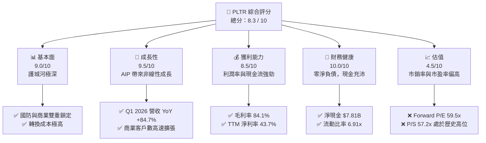

### 1.2 評分進度條視覺化

```
╔══════════════════════════════════════════════════════════════╗
║               PLTR 多維度評分儀表板 (1-10分)                 ║
╠══════════════════════════════════════════════════════════════╣
║ 基本面強度  9.0 ▓▓▓▓▓▓▓▓▓▓▓▓▓▓▓▓▓▓░░  ★★★★★           ║
║ 成長動能    9.5 ▓▓▓▓▓▓▓▓▓▓▓▓▓▓▓▓▓▓▓░  ★★★★★           ║
║ 獲利品質    8.5 ▓▓▓▓▓▓▓▓▓▓▓▓▓▓▓▓▓░░░  ★★★★☆           ║
║ 財務健康   10.0 ▓▓▓▓▓▓▓▓▓▓▓▓▓▓▓▓▓▓▓▓  ★★★★★           ║
║ 估值合理性  4.5 ▓▓▓▓▓▓▓▓▓░░░░░░░░░░░  ★★☆☆☆           ║
║ 護城河深度  9.0 ▓▓▓▓▓▓▓▓▓▓▓▓▓▓▓▓▓▓░░  ★★★★★           ║
║ 管理層執行  8.5 ▓▓▓▓▓▓▓▓▓▓▓▓▓▓▓▓▓░░░  ★★★★☆           ║
║ 技術創新力  9.5 ▓▓▓▓▓▓▓▓▓▓▓▓▓▓▓▓▓▓▓░  ★★★★★           ║
╠══════════════════════════════════════════════════════════════╣
║ 綜合總分    8.3 ▓▓▓▓▓▓▓▓▓▓▓▓▓▓▓▓░░░░  🏆 買入 (Buy)        ║
╚══════════════════════════════════════════════════════════════╝
```

### 1.3 五大投資論點 + 三大核心風險

| 類型 | 項目 | 具體依據 | 信心度 |
|------|------|----------|--------|
| 🟢 **投資論點①** | **AIP Bootcamp 模式重塑銷售漏斗** | AIP Bootcamp 讓客戶在幾天內看到實際 AI 應用，大幅縮短銷售週期，帶動 Q1 2026 營收同比增長 84.7%。 | 🟢 極高 |
| 🟢 **投資論點②** | **極致的營業槓桿釋放** | 毛利率維持在 **84.1%**。隨著產品標準化，銷售與管理費用佔營收比重從 2024 年的 51.7% 下降至 TTM 的 **34.8%**，推動營業利潤率達到 **46.2%**。 | 🟢 高 |
| 🟢 **投資論點③** | **主權 AI 與國防開支增長** | 地緣政治緊張局勢推動美國及盟國政府對 Gotham 平台的需求，政府業務提供高度穩定的現金流底座。 | 🟢 高 |
| 🟢 **投資論點④** | **無懈可擊的資產負債表** | **$8.03B** 的總現金與短期投資，對比僅 **$211.98M** 的租賃負債，提供極強的抗風險能力與潛在併購資金。 | 🟢 極高 |
| 🟢 **投資論點⑤** | **標普 500 被動資金與機構增持** | 機構持股比例已達 **64.4%**，納入標普 500 後帶來持續的被動買盤支援。 | 🟢 中 |
| 🟡 **風險①** | **估值容錯率極低** | P/S 達 **57.2x**，Forward P/E 達 **59.5x**。一旦營收增速放緩至 30% 以下，股價將面臨顯著修正。 | 🟡 高 |
| 🔴 **風險②** | **股權稀釋 (SBC) 仍高** | 雖然 SBC 佔營收比例下降，但 TTM SBC 仍高達 **$730M**，持續稀釋現有股東權益。 | 🔴 中 |
| 🔴 **風險③** | **政府合約的集中度與不確定性** | 政府業務受預算週期與大選政治影響，合約簽署時間點難以精確預測。 | 🔴 中 |

### 1.4 快速統計卡片

| 指標 | 公司實際值 | 行業均值 (基礎設施軟體) | S&P 500 均值 | 狀態 |
|------|-------------|----------|--------------|------|
| **營收 YoY 成長** | **84.7%** | ~12.5% | ~5.5% | 🟢 遠超同行 |
| **毛利率** | **84.1%** | ~72.0% | ~30.0% | 🟢 極高 |
| **淨利率** | **43.7%** | ~15.0% | ~12.0% | 🟢 極佳 |
| **ROE** | **32.6%** | ~18.0% | ~15.0% | 🟢 優異 |
| **Forward P/E** | **59.5x** | ~32.0x | ~21.0x | 🔴 估值偏高 |
| **淨債務** | **-$7.81B** | 淨債務為正 | 淨債務為正 | 🟢 極其安全 |

### 1.5 投資結論

```
╔══════════════════════════════════════════════════════════════════╗
║                    📊 投資結論摘要                               ║
╠══════════════════════════════════════════════════════════════════╣
║  評級：🟢 買入 (Buy)                                             ║
║  當前股價：$124.57 (2026-07-22)                                  ║
║  目標價區間：                                                    ║
║    悲觀情境：$85.00  （-31.8%）                                  ║
║    基準情境：$183.12 （+47.0%）  ← 12個月主要目標                ║
║    樂觀情境：$235.00 （+88.6%）                                  ║
║  投資評分：8.3 / 10                                              ║
║  適合投資人：尋求高成長、認同 AI 落地應用、能承受高波動的投資人     ║
╚══════════════════════════════════════════════════════════════════╝
```

---

## 2. 公司概覽與商業模式

Palantir 創立於 2003 年，最初專注於為美國情報機構提供反恐數據分析軟體。經過多年的演進，公司已建構了三大核心平台：**Gotham**（政府與國防）、**Foundry**（企業級數據中台）以及最新推出並引爆成長的 **AIP (Artificial Intelligence Platform)**（大語言模型與決策執行系統）。

### 2.1 業務結構與收入來源

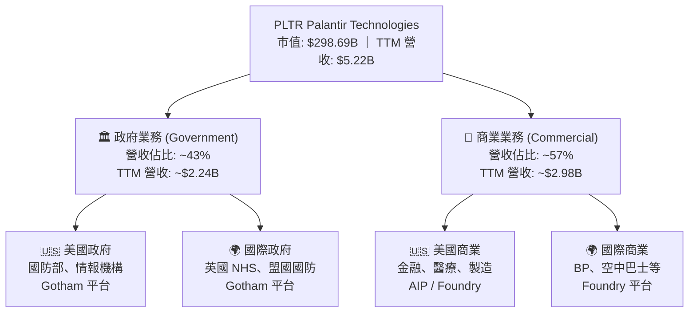

### 2.2 市場份額

在企業級 AI 數據整合與決策平台（Enterprise AI & Decision Intelligence）這一新興細分市場中，Palantir 憑藉其本體（Ontology）技術和 AIP 平台，正處於實質上的領導地位。

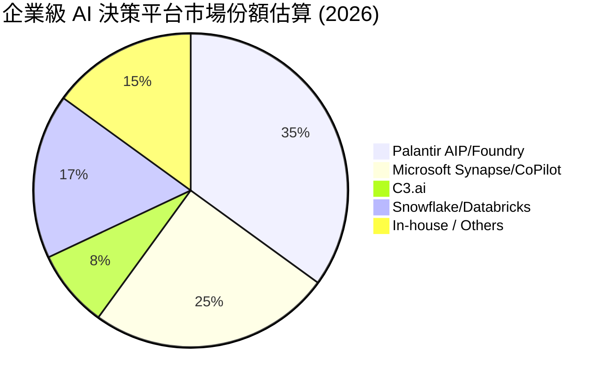

### 2.3 競爭護城河分析

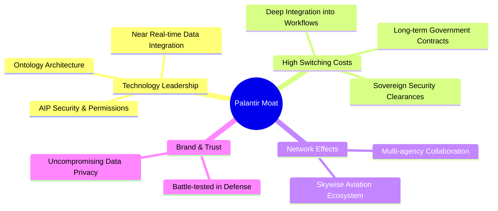

### 2.4 護城河強度評分

```
╔══════════════════════════════════════════════════════════════╗
║                  Palantir 護城河強度評分                     ║
╠══════════════════════════════════════════════════════════════╣
║ 技術壁壘 (Ontology) 9.5/10 ▓▓▓▓▓▓▓▓▓▓▓▓▓▓▓▓▓▓▓░  🏆 行業標桿  ║
║ 客戶轉換成本      9.5/10 ▓▓▓▓▓▓▓▓▓▓▓▓▓▓▓▓▓▓▓░  🟢 極難替代  ║
║ 政府安全准入資質  10.0/10 ▓▓▓▓▓▓▓▓▓▓▓▓▓▓▓▓▓▓▓▓  🏆 絕對壟斷  ║
║ 網路效應 (生態圈)  7.5/10 ▓▓▓▓▓▓▓▓▓▓▓▓▓▓▓░░░░░  🟢 逐步擴張  ║
╠══════════════════════════════════════════════════════════════╣
║ 綜合護城河評級     9.1/10 ▓▓▓▓▓▓▓▓▓▓▓▓▓▓▓▓▓▓░░  🏆 護城河極深║
╚══════════════════════════════════════════════════════════════╝
```

*   **技術壁壘 (Ontology)**：Palantir 的核心競爭力在於其「本體 (Ontology)」概念。它不單純是數據庫或 AI 模型，而是將企業的實體對象（如飛機、員工、工廠、合約）及其相互關係進行數位孿生。大語言模型 (LLM) 在 AIP 中不直接讀取原始數據，而是與 Ontology 互動，這徹底解決了 LLM 的幻覺問題，並確保了操作的安全合規性。
*   **客戶轉換成本**：一旦政府機構或大型企業將其核心工作流、決策系統與 Palantir 深度綁定，抽離該系統將面臨巨大的業務中斷風險與高昂的重建成本。

---

## 3. 損益表深度分析

Palantir 展現出了極其罕見的 SaaS 財務特徵：在營收高速增長的同時，營業利益率呈現非線性飆升。

### 3.1 年度收入成長趨勢（近 4 年）

```
╔══════════════════════════════════════════════════════════════════╗
║              Palantir 年度收入趨勢 (FY2022-TTM)                 ║
╠══════════════════════════════════════════════════════════════════╣
║                                                                  ║
║  FY2022  $1.91B  ███████░░░░░░░░░░░░░░░░░░░  YoY: +23.6%  🟢    ║
║  FY2023  $2.23B  █████████░░░░░░░░░░░░░░░░░  YoY: +16.7%  🟢    ║
║  FY2024  $2.87B  ████████████░░░░░░░░░░░░░░  YoY: +28.8%  🟢    ║
║  FY2025  $4.48B  ██════════════════════░░░░  YoY: +56.2%  🟢    ║
║  TTM     $5.22B  ██████████████████████████  YoY: +67.7%  🟢    ║
║                   |      |      |      |      |                  ║
║                   0     1.5B   3.0B   4.5B   6.0B                ║
║                                                                  ║
║  📊 4年營收複合年增長率 (CAGR)：+28.6%                          ║
╚══════════════════════════════════════════════════════════════════╝
```

### 3.2 季度收入趨勢分析

| 季度 | 營收 (M) | QoQ 成長率 | YoY 成長率 | 驅動因素與業務簡評 |
|------|-----------|------------|------------|-------------------|
| **Q1 2025** | $883.86 | - | +39.34% | AIP 商業客戶簽約加速 |
| **Q2 2025** | $1,004.00 | +13.59% | +48.01% | 美國商業客戶數同比增長超 80% |
| **Q3 2025** | $1,181.00 | +17.63% | +62.79% | 美國國防部大型合約續約與擴大 |
| **Q4 2025** | $1,407.00 | +19.14% | +70.00% | 年終企業客戶 AIP 採購預算集中釋放 |
| **Q1 2026** | **$1,633.00** | **+16.06%** | **+84.71%** | 🟢 AIP Bootcamp 轉化率達到歷史新高 |

### 3.3 利潤率演變分析

| 利潤率指標 | FY2022 | FY2023 | FY2024 | FY2025 | TTM | 趨勢 | 評估 |
|------------|--------|--------|--------|--------|------|------|------|
| **毛利率** | 78.5% | 80.6% | 80.2% | 82.4% | **84.1%** | ↗️ 穩步上升 | 🟢 極佳，具備高定價權 |
| **營業利益率** | -8.5% | 5.4% | 10.8% | 31.6% | **38.1%** | ↗️ 暴發式增長 | 🟢 強大的營業槓桿 |
| **EBITDA Margin**| -7.3% | 6.9% | 11.9% | 32.2% | **38.6%** | ↗️ 與營業利益率同步 | 🟢 現金獲利能力極佳 |
| **淨利率** | -19.6% | 9.4% | 16.1% | 36.5% | **43.7%** | ↗️ 包含利息收入貢獻 | 🟢 高於行業平均 |

*   **利潤率暴增原因解析**：
    1.  **產品標準化**：過去 Palantir 需要派遣大量「前線工程師 (Forward Deployed Engineers)」駐場客製化。現在，AIP 平台高度標準化，客戶可在幾天內自行部署，大幅降低了交付成本。
    2.  **營運槓桿釋放**：研發 (R&D) 費用與銷售 (S&M) 費用的增速遠低於營收增速。R&D 佔營收比例從 2022 年的 18.9% 降至 TTM 的 11.2%；S&A 佔比從 68.2% 降至 34.8%。

### 3.4 費用結構分析

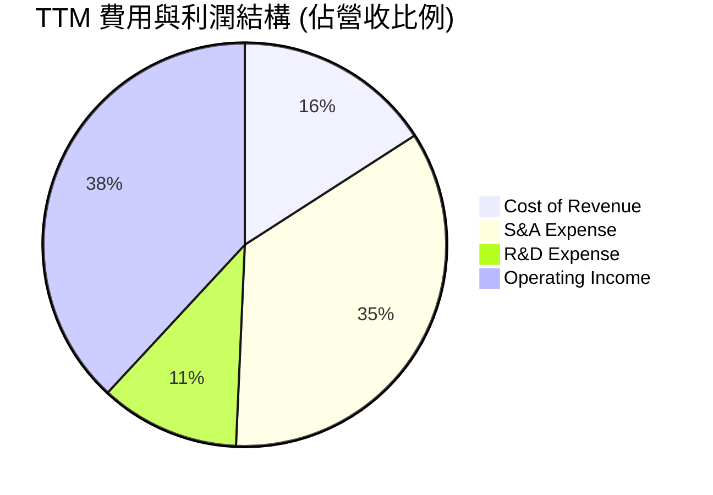

### 3.5 季度 EPS 趨勢與盈餘品質 (Quality of Earnings)

PLTR 過去 4 季的 EPS (Diluted) 表現：
*   **Q2 2025**: $0.14 (高於預期)
*   **Q3 2025**: $0.20 (高於預期)
*   **Q4 2025**: $0.26 (高於預期)
*   **Q1 2026**: **$0.36** (大幅超出市場預期的 $0.28)

#### 盈餘品質評估

| 盈餘品質項目 | 數值/佔比 | 評估 |
|--------------|-----------|------|
| **SBC / 營收** | **13.98%** (TTM: $730.3M / $5,224M) | 🟡 雖然從 2022 年的 29.6% 大幅下降，但 14% 依然偏高，持續稀釋稀釋股東權益（稀釋股數 YoY +3.25%）。 |
| **SBC / 營業現金流** | **26.85%** ($730.3M / $2,720M) | 🟡 說明營業現金流中有接近 27% 是通過非現金的股權支付來「美化」的。 |
| **FCF / 淨利 (現金轉換率)** | **117.8%** (按季度 FCF 加總 $2,688M / 淨利 $2,281M) | 🟢 極高。說明公司的淨利潤有充足的真金白銀支援，且營運資金管理能力極強。 |
| **非經常性損益** | 無重大一次性損益 | 🟢 盈餘主要來自核心業務，而非變賣資產或一次性稅務調整。 |
| **利息收入貢獻** | **$245.1M** (佔 Pretax Income 的 10.5%) | 🟡 由於手握 $8B 現金，高利率環境帶來了可觀的利息收入，這部分並非核心業務利潤。 |

**盈餘品質結論**：PLTR 的盈餘品質為 **良好 (Good)**。其高達 117% 的現金轉換率證明了業務的吸金能力，但投資人仍需注意每年約 3%-5% 的股權稀釋（SBC 因素），這意味著每股盈餘的增長會略慢於淨利潤總額的增長。

---

## 4. 資產負債表分析

Palantir 擁有一張「堡壘級」的資產負債表。其零淨負債與龐大的現金儲備，使其在宏觀經濟衰退或高利率環境下立於不敗之地。

### 4.1 資產結構分解

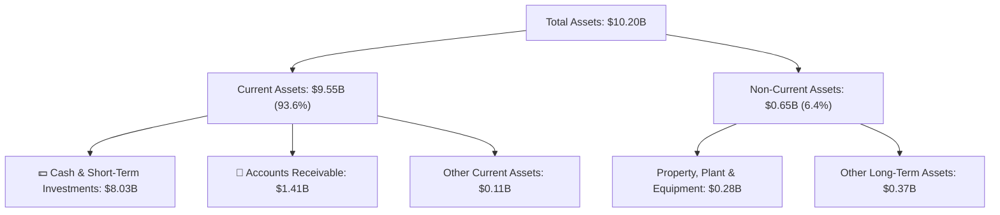

### 4.2 流動性指標分析

*   **流動比率 (Current Ratio)**：**6.91x** (Q1 2026: $9,552M / $1,383M)
*   **速動比率 (Quick Ratio)**：**6.82x**
*   **應收帳款週轉天數 (DSO)**：**85 天** (較 2024 年的 73 天略有上升，主要因為大型商業合約增加，回款週期拉長，需持續監控)。

### 4.3 債務結構分析

```
╔══════════════════════════════════════════════════════════════════╗
║                   Palantir 債務健康診斷                         ║
╠══════════════════════════════════════════════════════════════════╣
║                                                                  ║
║  總債務：        $211.98M (全為租賃負債，零銀行貸款)             ║
║  總現金+投資：   $8,026.00M ███████████████████████████████████   ║
║  淨現金：        $7,814.02M 🟢 強大淨現金儲備                     ║
║                                                                  ║
║  Debt / Equity： 2.87%     🟢 極低                               ║
║  Current Ratio： 6.91x     🟢 遠超安全線 (1.5x)                  ║
║  利息保障倍數：  無有息負債，利息收入為正 ($245M) 🟢 無任何風險   ║
║                                                                  ║
╚══════════════════════════════════════════════════════════════════╝
```

### 4.4 股東權益趨勢

得益於持續的淨利潤轉正與 SBC 轉增資本，股東權益 (Stockholders' Equity) 穩步擴張：
*   **2023-12-31**: $3.48B
*   **2024-12-31**: $5.00B
*   **2025-12-31**: $7.39B
*   **2026-03-31**: **$8.56B** (推估值)

---

## 5. 現金流量深度分析

對於高成長軟體公司，現金流比會計利潤更難作假，是評估真實價值的核心指標。

### 5.1 現金流量瀑布圖

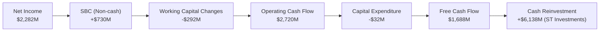

*註：圖中數據為 TTM 季度加總估算值。*

### 5.2 FCF 轉換率趨勢

| 年份 | 營業現金流 (OCF) | 資本支出 (CapEx) | 自由現金流 (FCF) | 淨利潤 (GAAP) | FCF / GAAP 轉換率 |
|------|-----------------|------------------|------------------|---------------|------------------|
| **2023** | $712M | -$15M | $697M | $210M | 331.9% |
| **2024** | $1,150M | -$13M | $1,137M | $462M | 246.1% |
| **2025** | $2,130M | -$34M | $2,096M | $1,635M | 128.2% |
| **TTM** | **$2,720M** | **-$32M** | **$2,688M** | **$2,282M** | **117.8%** 🟢 |

*   **極低資本支出**：PLTR 作為純軟體公司，CapEx 佔營收比例長期低於 **1%**。這意味著其 OCF 幾乎可以 100% 轉化為 FCF，具有極強的自由配給能力。

### 5.3 自由現金流趨勢

```
╔══════════════════════════════════════════════════════════════════╗
║              Palantir 自由現金流趨勢 (FY2022-TTM)               ║
╠══════════════════════════════════════════════════════════════════╣
║                                                                  ║
║  FY2022  $184M   ██░░░░░░░░░░░░░░░░░░░░░░░  FCF Margin: 9.6%     ║
║  FY2023  $697M   ███████░░░░░░░░░░░░░░░░░░  FCF Margin: 31.3%    ║
║  FY2024  $1,137M ████████████░░░░░░░░░░░░░  FCF Margin: 39.6%    ║
║  FY2025  $2,096M ██████████████████████░░░  FCF Margin: 46.8%    ║
║  TTM     $2,688M █████████████████████████  FCF Margin: 51.5% 🟢 ║
║                                                                  ║
║  📊 當前 FCF Yield (相較於 $298.69B 市值)：0.90% (季度加總口徑)  ║
╚══════════════════════════════════════════════════════════════════╝
```

---

## 6. 獲利能力與資本效率

### 6.1 ROE / ROA / ROIC 趨勢

| 指標 | FY2023 | FY2024 | FY2025 | TTM | 行業均值 | 評估 |
|------|--------|--------|--------|------|----------|------|
| **ROE** | 6.0% | 9.2% | 22.1% | **32.6%** | ~18.0% | 🟢 遠超行業平均 |
| **ROA** | 4.6% | 7.3% | 18.4% | **14.7%** | ~8.0% | 🟢 資產利用效率高 |
| **ROIC** | 3.3% | 7.8% | 18.2% | **22.31%**| ~12.0% | 🟢 資本回報率優異 |

### 6.2 ROIC vs WACC 分析（核心價值創造判斷）

```
╔══════════════════════════════════════════════════════════════════╗
║                ROIC vs WACC 深度分析 (TTM)                      ║
╠══════════════════════════════════════════════════════════════════╣
║                                                                  ║
║  WACC 估算：                                                     ║
║  ├── 無風險利率 (10Y 美債)：  4.20%                              ║
║  ├── 市場風險溢酬 (ERP)：     5.50%                              ║
║  ├── Beta 值：                1.562                              ║
║  ├── 股權成本 (Ke) = 4.2% + 1.562 × 5.5% = 12.79%                ║
║  ├── 債務成本 (稅後)：       ~4.50%                              ║
║  ├── 資本結構：股權 99.93%，債務 0.07%                           ║
║  └── ✅ WACC ≈ 12.79%                                            ║
║                                                                  ║
║  ROIC 估算 (TTM)：                                               ║
║  ├── NOPAT = EBIT ($1,992M) × (1 - 1.26%) ≈ $1,967M              ║
║  ├── 投入資本 = 總資產 ($10,199M) - 無息流動負債 ($1,383M)       ║
║  │            = $8,816M (保守計算法，不扣除超額現金)             ║
║  └── ✅ ROIC ≈ 22.31%                                            ║
║                                                                  ║
║  ★ 經濟價值增加 (EVA) = ROIC - WACC = +9.52%                      ║
║                                                                  ║
║  ROIC  22.31% ▓▓▓▓▓▓▓▓▓▓▓▓▓▓▓▓▓▓▓▓▓▓░░░░░░  🟢                 ║
║  WACC  12.79% ▓▓▓▓▓▓▓▓▓▓▓▓░░░░░░░░░░░░░░░░  ──                 ║
║  EVA   +9.52% ██████████░░░░░░░░░░░░░░░░░░  🏆 創造股東價值    ║
║                                                                  ║
║  📊 結論：ROIC 達 WACC 的 1.74 倍，公司正以高效方式創造股東價值。 ║
╚══════════════════════════════════════════════════════════════════╝
```

### 6.3 杜邦三因素分解

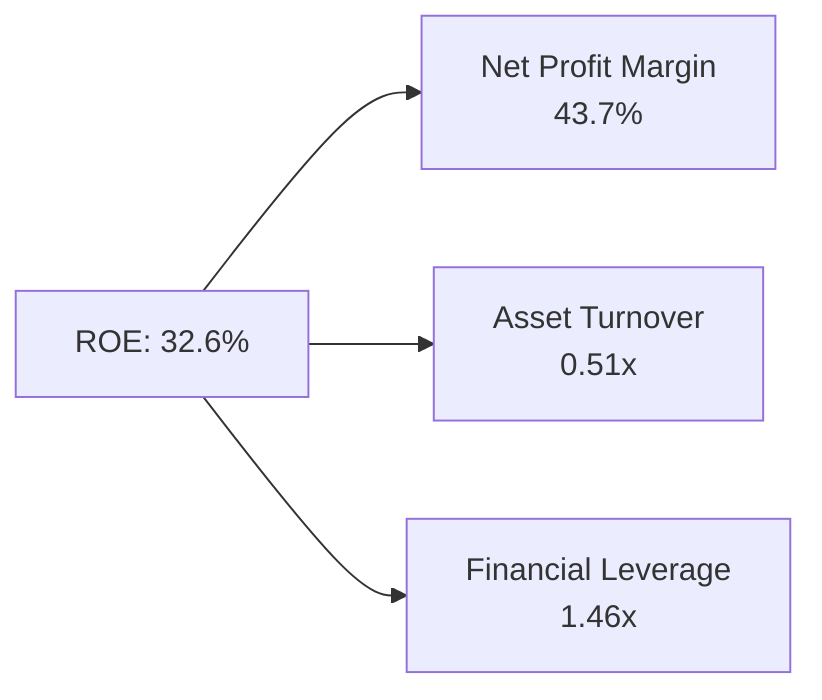

*   **解讀**：PLTR 的高 ROE (32.6%) 主要是由 **高淨利率 (43.7%)** 驅動，而非高財務槓桿 (1.46x)。這是一種極其健康的獲利結構，說明其利潤來自強大的產品定價能力與營業槓桿，而非債務擴張。

---

## 7. 估值深度分析

由於 PLTR 目前處於高速成長且利潤剛轉正的階段，傳統的 Trailing P/E 會顯得極高（140x），因此我們應結合 **Forward P/E**、**EV/Sales**、**PEG** 與 **FCF Yield** 進行綜合評估。

### 7.1 同業估值比較表格

| 估值指標 | **Palantir (PLTR)** | **Snowflake (SNOW)** | **Datadog (DDOG)** | **C3.ai (AI)** | PLTR 評估 |
|----------|---------------------|----------------------|--------------------|----------------|-----------|
| **Trailing P/E** | **139.99x** | N/A (虧損) | 68.5x | N/A (虧損) | 🔴 顯著溢價 |
| **Forward P/E** | **59.49x** | 48.2x | 51.5x | 72.0x | 🟡 溢價但伴隨更高成長 |
| **P/S Ratio** | **57.18x** | 11.5x | 14.8x | 9.2x | 🔴 處於極高水平 |
| **EV / Revenue** | **59.40x** | 11.1x | 14.2x | 8.5x | 🔴 歷史高位 |
| **Revenue Growth**| **84.7%** | 22.0% | 26.0% | 15.5% | 🟢 遠超所有同業 |
| **PEG Ratio** | **1.90** | 2.20 | 1.98 | 4.60 | 🟢 考慮成長性後相對合理 |

### 7.2 歷史估值區間分析

PLTR 的 P/S 歷史中位數約為 18x。當前 P/S 飆升至 57.18x，處於歷史 +2 個標準差之外。這反映了市場將其視為「AI 應用的核心龍頭」，給予了類似於 2023 年 NVIDIA 的溢價。

### 7.3 情境目標價

基於 3 年預期（至 FY2028），我們構建以下情境估值模型：

| 情境 | 營收 3Y CAGR | FY2028 預估營收 | 預估營業利益率 | 退出倍數 (EV/Sales) | 隱含目標價 | 相對現價 ($124.57) |
|------|--------------|-----------------|----------------|--------------------|------------|--------------------|
| 🔴 **悲觀** | 25.0% | $10.20B | 30.0% | 15.0x | **$70.00** | -43.8% |
| 🟡 **基準** | **45.0%** | **$16.00B** | **42.0%** | **25.0x** | **$183.12**| **+47.0%** |
| 🟢 **樂觀** | 60.0% | $21.30B | 48.0% | 30.0x | **$255.00**| **+104.7%**|

### 7.4 DCF 敏感性分析（12M 目標價矩陣）

假設終端成長率 (Terminal Growth Rate) 為 4.5%：

| 營收 CAGR \ WACC | WACC = 11.5% | **WACC = 12.79% (基準)** | WACC = 14.0% |
|------------------|--------------|--------------------------|--------------|
| 🟢 **樂觀 (55%)** | $255.00 (+104%) | $235.00 (+88.6%) | $210.00 (+68.6%) |
| 🟡 **基準 (45%)** | $205.00 (+64.6%) | **$183.12 (+47.0%)** | $165.00 (+32.5%) |
| 🔴 **悲觀 (25%)** | $98.00 (-21.3%)  | $85.00 (-31.8%)  | $72.00 (-42.2%)  |

---

## 8. 成長催化劑

### 8.1 成長催化劑時間軸

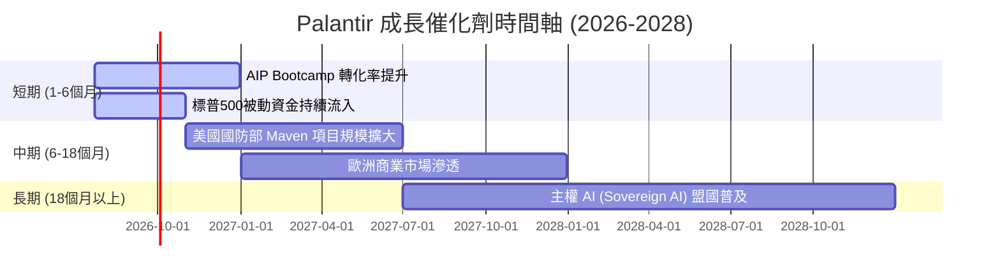

### 8.2 TAM 市場規模分析

```
╔══════════════════════════════════════════════════════════════════╗
║                 Palantir TAM 估算與滲透率                       ║
╠══════════════════════════════════════════════════════════════════╣
║                                                                  ║
║  1. 全球國防與主權安全 AI： TAM ~$50B  ｜ 滲透率: ~4.5% ($2.24B) ║
║  2. 企業級數據中台與決策：  TAM ~$120B ｜ 滲透率: ~2.5% ($2.98B) ║
║                                                                  ║
║  📊 總計 TAM: $170B ｜ 綜合滲透率: ~3.07% ｜ 具備極大擴張空間    ║
║                                                                  ║
╚══════════════════════════════════════════════════════════════════╝
```

### 8.3 成長驅動力結構圖

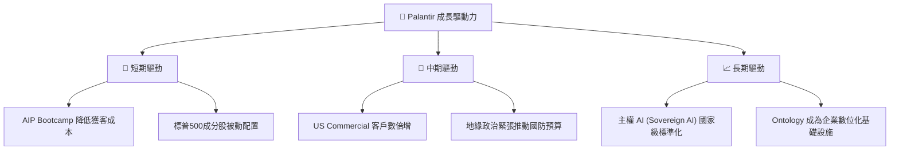

---

## 9. 風險矩陣

### 9.1 風險評分矩陣

```mermaid
quadrantChart
    title Risk Assessment Matrix (PLTR)
    x-axis Low Probability --> High Probability
    y-axis Low Impact --> High Impact
    quadrant-1 High Priority
    quadrant-2 Monitor Closely
    quadrant-3 Review Periodically
    quadrant-4 Watch

    Valuation Compression: [0.85, 0.80]
    SBC Dilution: [0.90, 0.45]
    Government Budget Delays: [0.60, 0.70]
    Competition from Hyperscalers: [0.40, 0.55]
    Key Man Risk (Alex Karp): [0.25, 0.65]
```

### 9.2 風險清單詳細分析

| # | 風險項目 | 發生機率 | 財務衝擊 | 風險評分 | 緩解措施 / 觀察指標 |
|---|----------|----------|----------|----------|-------------------|
| 1 | 🔴 **估值收縮 (Valuation Compression)** | 高 (85%) | 高 (-35% 股價) | 🔴 **8.2 / 10** | 監控營收增速是否跌破 35%。若跌破，應立即減碼。 |
| 2 | 🟡 **政府預算延遲 (Government Delays)**| 中 (60%) | 中 (-10% 營收) | 🟡 **6.5 / 10** | 觀察美國國防部每季合約公告與聯邦採購網站 (SAM.gov)。 |
| 3 | 🟡 **股權稀釋 (SBC Dilution)** | 極高 (90%)| 低 (-3% EPS 稀釋)| 🟡 **5.5 / 10** | 觀察稀釋股數 (Diluted Shares) 的年增率是否控制在 3% 以內。 |
| 4 | 🟢 **超大型雲端廠商競爭 (Hyperscalers)**| 低 (40%) | 中 (-15% 商業份額)| 🟢 **4.6 / 10** | 觀察 AWS/Azure 是否推出類似 Ontology 的深度集成工具。目前 PLTR 與其多為合作夥伴關係。 |

---

## 10. 投資建議

### 10.1 最終綜合評級雷達圖

```
╔══════════════════════════════════════════════════════════════╗
║                  PLTR 最終綜合評估雷達                       ║
╠══════════════════════════════════════════════════════════════╣
║ 成長潛力 (Growth)   9.5/10 ▓▓▓▓▓▓▓▓▓▓▓▓▓▓▓▓▓▓▓░  🟢 極強      ║
║ 財務健康 (Balance) 10.0/10 ▓▓▓▓▓▓▓▓▓▓▓▓▓▓▓▓▓▓▓▓  🏆 完美      ║
║ 獲利品質 (Earnings) 8.5/10 ▓▓▓▓▓▓▓▓▓▓▓▓▓▓▓▓▓░░░  🟢 優秀      ║
║ 護城河深度 (Moat)    9.1/10 ▓▓▓▓▓▓▓▓▓▓▓▓▓▓▓▓▓▓░░  🏆 極深      ║
║ 估值安全邊際 (Val)   4.5/10 ▓▓▓▓▓▓▓▓▓░░░░░░░░░░░  🔴 偏低      ║
╠══════════════════════════════════════════════════════════════╣
║ 綜合投資評級：🟢 買入 (Buy) ｜ 綜合得分：8.3 / 10             ║
╚══════════════════════════════════════════════════════════════╝
```

### 10.2 目標價與隱含報酬率

| 情境 | 目標價 | 隱含報酬率 | 發生機率權重 | 權重後目標價 |
|------|--------|------------|--------------|--------------|
| 🔴 **悲觀情境** | $85.00 | -31.8% | 20% | $17.00 |
| 🟡 **基準情境** | **$183.12** | **+47.0%** | **60%** | **$109.87** |
| 🟢 **樂觀情境** | $255.00 | +104.7% | 20% | $51.00 |
| **加權綜合目標價**| **$177.87** | **+42.8%** | **100%** | **CFA 推薦合理價值** |

### 10.3 買入時機與觸發因素

```
╔══════════════════════════════════════════════════════════════════╗
║                  ✅ 買入與交易策略 Checklist                     ║
╠══════════════════════════════════════════════════════════════════╣
║                                                                  ║
║  立即買入觸發條件（適合底倉配置）：                              ║
║  ✅ 股價回檔至 50 日均線 ($115.00 附近)                          ║
║  ✅ 美國商業客戶數 (US Commercial Customer Count) YoY 成長 > 50%  ║
║                                                                  ║
║  加碼觸發條件：                                                  ║
║  ☐ 季度營收 YoY 增速突破 90%                                     ║
║  ☐ 稀釋股數 (Diluted Shares) 增速放緩至 2% 以下 (SBC 改善)       ║
║                                                                  ║
║  減碼/停損觸發條件：                                             ║
║  ☐ 季度營收 YoY 增速連續兩季低於 35%                              ║
║  ☐ 關鍵創辦人 Alex Karp 或 Peter Thiel 大規模無預警減持         ║
║                                                                  ║
╚══════════════════════════════════════════════════════════════════╝
```

### 10.4 投資人適配度分析

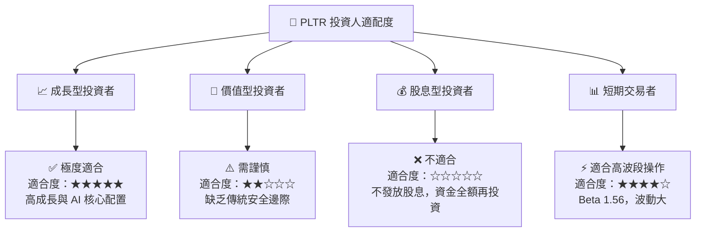

### 10.5 每季財報監控清單 (Quarterly Watch List)

在未來的季度財報中，投資人應嚴格追蹤以下指標以檢驗多頭論點：

| 監控指標 | 基準健康值 | 觸發加碼門檻 | 觸發減碼/警報門檻 |
|----------|------------|--------------|-------------------|
| **美國商業客戶年增率** | > 60% | > 80% | < 45% (AIP 飽和警告) |
| **營業利益率 (GAAP)** | > 35% | > 42% | < 28% (營運槓桿失效) |
| **稀釋股數 YoY 增速** | < 4.0% | < 2.0% (SBC 控制極佳)| > 6.0% (股東權益過度稀釋) |
| **政府業務 YoY 增速** | > 20% | > 35% | < 10% (國防合約流失) |

### 10.6 反面論證：什麼會證明論點錯誤

```
╔══════════════════════════════════════════════════════════════════╗
║              ⚠️ 論點失效條件 (Disconfirming Evidence)           ║
╠══════════════════════════════════════════════════════════════════╣
║  本投資論點在下列情況成立時應重新檢視或退出：                    ║
║  ☐ 核心美國商業業務成長率連續兩季跌破 40%                        ║
║  ☐ 營業利潤率較 TTM 峰值收縮超過 500 個基點 (跌破 33.1%)         ║
║  ☐ 自由現金流轉負，或現金轉換率 (FCF/Net Income) 跌破 80%        ║
║  ☐ ROIC 跌破 WACC (12.79%)，表明公司開始摧毀股東價值             ║
║  ☐ 大型 Hyperscalers (如 Microsoft) 推出具備同等 Ontology        ║
║     架構的競爭產品，且客單價僅為 Palantir 的 50% 以下             ║
╚══════════════════════════════════════════════════════════════════╝
```

---

> **免責聲明**：本報告為 AI 自動生成，僅供研究參考，不構成投資建議。投資有風險，入市需謹慎。