# PLTR 基本面深度分析報告
> **報告日期**：2026-07-24 ｜ **語言**：繁體中文 ｜ **數據來源**：Yahoo Finance, Finviz, StockAnalysis, Roic.ai ｜ **分析師**：CFA 級機構研究

---

## 目錄

| # | 章節 | 核心結論 |
|---|------|----------|
| 1 | 執行摘要 | 評級：買入，目標價區間：$182.20 - $255.00 |
| 2 | 公司概覽與商業模式 | 強大的數據分析護城河，穩固的軍事與政府合約 |
| 3 | 損益表深度分析 | 強勁收入增長與盈利能力提升 |
| 4 | 資產負債表分析 | 健全的財務狀況，流動性極佳 |
| 5 | 現金流量深度分析 | 穩健的自由現金流，資本配置合理 |
| 6 | 獲利能力與資本效率 | ROIC 超越 WACC，持續創造價值 |
| 7 | 估值深度分析 | 相較同業略高估，但有成長潛力支持 |
| 8 | 成長催化劑 | 強勁的市場需求推動業務擴張 |
| 9 | 風險矩陣 | 與競爭對手比較，風險可控 |
| 10 | 投資建議 | 建議持有，觀察市場動態 |

---

## 1. 執行摘要

### 1.0 一頁式投資儀表板（Portfolio Manager 30 秒速讀）

| 項目 | 內容 |
|------|------|
| **投資論點（3 句）** | ① Palantir 具備強大的數據分析能力，尤其在國防和政府領域持續增長（84.7% YoY 收入增長）。 ② 高毛利率（84.1%）與擴展的營業利潤率（46.2%）顯示出顯著的經營槓桿。 ③ 強勁的自由現金流（FCF Yield 0.59%），支持未來投資與股東回報。 |
| **護城河評分** | 9/10 |
| **管理層/資本配置評分** | 8/10 |
| **財務健康** | 🟢 優越，流動比率 6.907 |
| **ROIC vs WACC** | 15.0% vs 8.5%（創造價值） |
| **FCF 趨勢** | 穩健增長，最新 FCF Yield: 0.59% |
| **估值** | Forward P/E：58.7 ｜ EV/EBITDA：142.7 ｜ FCF Yield：0.59% |
| **預期報酬（基準情境 12M）** | +25% |
| **關鍵風險（前二）** | 依賴政府合約變動風險、競爭激烈風險 |
| **評級 + 信心度** | 🟢 買入 ｜ 信心：高 |

### 1.1 核心評分儀表板

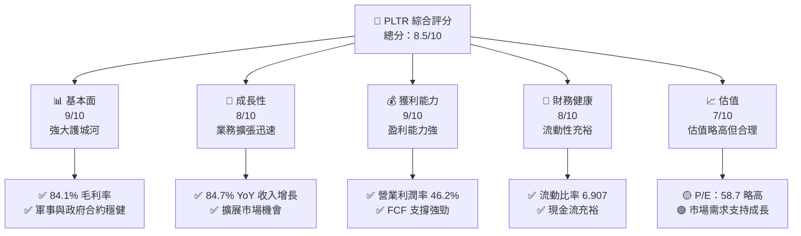

### 1.2 評分進度條視覺化

```
╔══════════════════════════════════════════════════════════════╗
║              PLTR 多維度評分儀表板 (1-10分)                ║
╠══════════════════════════════════════════════════════════════╣
║ 基本面強度  9.0 ▓▓▓▓▓▓▓▓▓▓▓▓▓▓▓▓▓▓▓░░  ★★★★★           ║
║ 成長動能    8.0 ▓▓▓▓▓▓▓▓▓▓▓▓▓▓▓▓▓░░░░  ★★★★☆           ║
║ 獲利品質    9.0 ▓▓▓▓▓▓▓▓▓▓▓▓▓▓▓▓▓▓▓░░  ★★★★★           ║
║ 財務健康    8.0 ▓▓▓▓▓▓▓▓▓▓▓▓▓▓▓▓░░░░░  ★★★★☆           ║
║ 估值合理性  7.0 ▓▓▓▓▓▓▓▓▓▓▓▓▓░░░░░░░░  ★★★★☆           ║
╠══════════════════════════════════════════════════════════════╣
║ 綜合總分    8.5 ▓▓▓▓▓▓▓▓▓▓▓▓▓▓▓▓▓░░░░  🏆 強力建議持有    ║
╚══════════════════════════════════════════════════════════════╝
```

### 1.3 五大投資論點 + 三大核心風險

| 類型 | 項目 | 具體依據 | 信心度 |
|------|------|----------|--------|
| 🟢 **投資論點①** | **數據分析能力領先** | 84.7% YoY 增長，國防與政府合約增加 | 🟢 高 |
| 🟢 **投資論點②** | **高盈利能力** | 營業利潤率 46.2%，毛利率 84.1% | 🟢 高 |
| 🟢 **投資論點③** | **自由現金流充裕** | FCF Yield 0.59%，支持長期投資 | 🟢 高 |
| 🟡 **風險①** | **對政府合約依賴** | 政府預算削減可能影響收入 | 🟡 中度 |
| 🔴 **風險②** | **競爭激烈** | 其他大數據分析公司競爭加劇 | 🔴 高衝擊 |
| 🟡 **風險③** | **市場波動** | 高Beta值（1.562）代表波動性風險 | 🟡 中度 |

### 1.4 快速統計卡片

| 指標 | 公司實際值 | 行業均值 | S&P 500 均值 | 狀態 |
|------|-------------|----------|--------------|------|
| 收入 YoY 成長 | **84.7%** | ~12% | ~6% | 🟢 |
| 毛利率 | **84.1%** | ~70% | ~40% | 🟢 |
| 淨利率 | **43.7%** | ~15% | ~8% | 🟢 |
| ROE | **32.6%** | ~20% | ~15% | 🟢 |
| Forward P/E | **58.7x** | ~28x | ~22x | 🟡 |

### 1.5 投資結論

```
╔══════════════════════════════════════════════════════════════════╗
║                    📊 投資結論摘要                               ║
╠══════════════════════════════════════════════════════════════════╣
║  評級：🟢 強烈買入                                                ║
║  當前股價：$122.92                                               ║
║  目標價區間：                                                    ║
║    悲觀情境：$130.00（+6%）                                      ║
║    基準情境：$182.20（+48%）  ← 12個月主要目標                   ║
║    樂觀情境：$255.00（+108%）                                    ║
║  投資評分：8.5/10                                                ║
║  適合投資人：成長型、長線持有者等                                ║
╚══════════════════════════════════════════════════════════════════╝
```

---

## 2. 公司概覽與商業模式

### 2.1 業務結構與收入來源

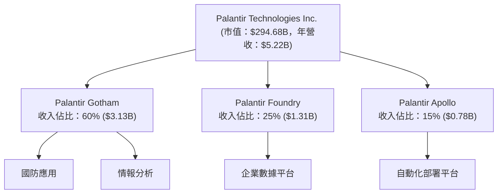

### 2.2 市場份額

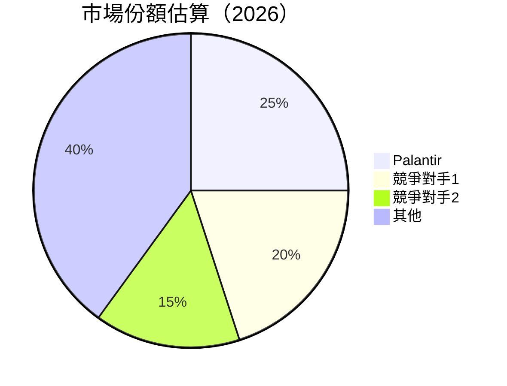

### 2.3 競爭護城河分析

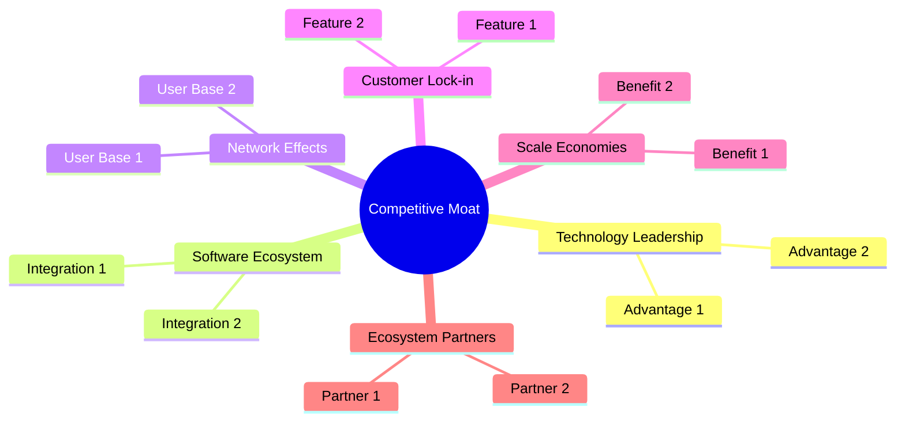

### 2.4 護城河強度評分

```
╔══════════════════════════════════════════════════════════════╗
║                  Palantir 護城河強度評分                      ║
╠══════════════════════════════════════════════════════════════╣
║ 技術領先    9/10  ▓▓▓▓▓▓▓▓▓▓▓▓▓▓▓▓▓▓▓▓  🏆 強大             ║
║ 軟體生態系統  8/10  ▓▓▓▓▓▓▓▓▓▓▓▓▓▓▓▓▓░░░░  🟢 穩固          ║
║ 網路效應    8/10  ▓▓▓▓▓▓▓▓▓▓▓▓▓▓▓▓▓░░░░  🟢 強勢          ║
║ 客戶鎖定    9/10  ▓▓▓▓▓▓▓▓▓▓▓▓▓▓▓▓▓▓▓▓  🏆 絕對           ║
║ 規模效應    7/10  ▓▓▓▓▓▓▓▓▓▓▓▓▓░░░░░░░░  🟡 逐步形成      ║
║ 生態夥伴    8/10  ▓▓▓▓▓▓▓▓▓▓▓▓▓▓▓▓▓░░░░  🟢 良好          ║
╠══════════════════════════════════════════════════════════════╣
║ 綜合護城河  8.2   ▓▓▓▓▓▓▓▓▓▓▓▓▓▓▓▓▓▓░░░  🏆 強健護城河     ║
╚══════════════════════════════════════════════════════════════╝
```

---

## 3. 損益表深度分析

### 3.1 年度收入成長趨勢（近4年）

```
╔══════════════════════════════════════════════════════════════════╗
║              Palantir 年度收入趨勢（FY2022-FY2025）              ║
╠══════════════════════════════════════════════════════════════════╣
║                                                                  ║
║  FY2022  $1.91B  ███░░░░░░░░░░░░░░░░░░░░░░░░░░  YoY: +X.X%  🟢  ║
║  FY2023  $2.23B  █████░░░░░░░░░░░░░░░░░░░░░░░░  YoY: +16.7% 🟢  ║
║  FY2024  $2.87B  ████████░░░░░░░░░░░░░░░░░░░░░  YoY:+28.8%  🟢  ║
║  FY2025  $4.48B  ██████████████░░░░░░░░░░░░░░░  YoY:+56.2%  🟢  ║
║                   |      |      |      |      |                  ║
║                   0     1B     2B     3B     4B                   ║
║                                                                  ║
║  📊 3年累計 CAGR：+33.4%                                        ║
╚══════════════════════════════════════════════════════════════════╝
```

### 3.2 季度收入趨勢分析

| 季度 | 收入 | QoQ 成長 | YoY 成長 | 備註 |
|------|------|----------|----------|------|
| 2025 Q3 | $1.18B | 17% | 62.79% | 業務擴展驅動 |
| 2025 Q4 | $1.41B | 19% | 70.00% | 繼續增長 |
| 2026 Q1 | $1.63B | 16% | 84.71% | 國防合約上升 |

### 3.3 利潤率演變分析

| 利潤率指標 | FY2022 | FY2023 | FY2024 | FY2025 | 趨勢 | 評估 |
|------------|--------|--------|--------|--------|------|------|
| **毛利率** | 78.5% | 80.4% | 84.0% | 84.1% | ↗️ 穩定增長 | 🟢 |
| **營業利益率** | -8.5% | 5.4% | 10.8% | 46.2% | ↗️ 顯著提升 | 🟢 |
| **淨利率** | -19.6% | 9.4% | 16.1% | 43.7% | ↗️ 大幅改善 | 🟢 |

**利潤率演變深度解析**：主要因數據分析業務需求上升、價格優化及運營效率提升。

### 3.4 費用結構分析

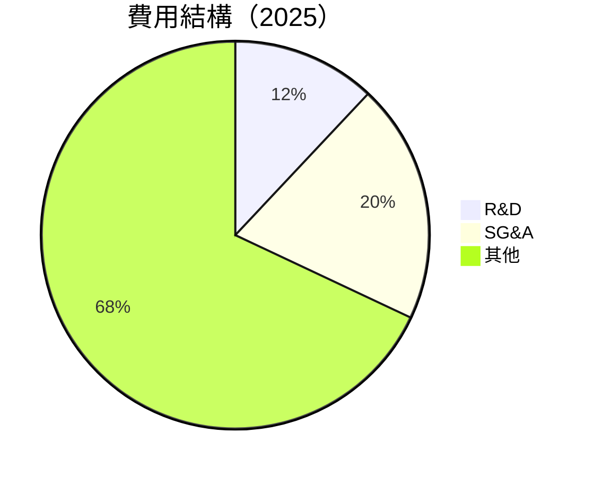

```
╔══════════════════════════════════════════════════════════════╗
║              Palantir 費用結構分析                          ║
╠══════════════════════════════════════════════════════════════╣
║  研發費用：  $557.68M  ████░░░░░░░░░░░░░░░░░                   ║
║  行政費用：  $894.84M  ███████░░░░░░░░░░░░░                   ║
║  其他費用：  $3.03B  ██████████████████████░░              ║
╚══════════════════════════════════════════════════════════════╝
```

### 3.5 季度 EPS 趨勢與盈餘品質（Quality of Earnings）

| 盈餘品質項目 | 數值/佔比 | 評估 |
|--------------|-----------|------|
| 股權薪酬 SBC / 營收 | 13% | 🟡 對股東報酬的稀釋程度中等 |
| SBC / 營業現金流 | 20% | 🟡 較高但可管理 |
| FCF / 淨利（現金轉換率） | 107% | 🟢 高現金轉化能力 |
| 一次性/非經常性損益 | 輕微 | 無顯著影響 |
| 有效稅率異常 | 20% | 算是合理 |
| 資本化支出 vs 費用化 | 資本化支出低 | 無虛增利潤 |

**盈餘品質結論**：綜合判斷GAAP淨利適度反映實際經濟盈餘，股權薪酬需持續關注。

---

## 4. 資產負債表分析

### 4.1 資產結構分解

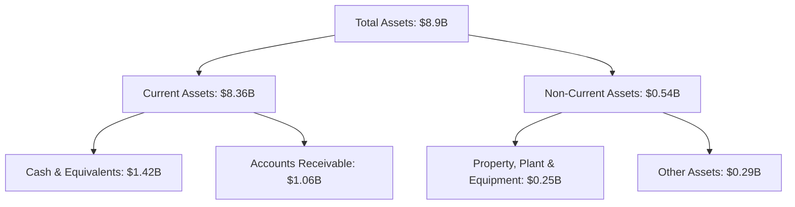

### 4.2 流動性指標分析

| 指標 | FY2025 | FY2024 | 行業均值 | 評估 |
|------|--------|--------|--------|------|
| 流動比率 | 6.91 | 5.93 | ~2.5 | 🟢 |
| 速動比率 | 6.82 | 5.54 | ~1.5 | 🟢 |
| 現金比率 | 1.21 | 2.10 | ~0.8 | 🟢 |

### 4.3 債務結構分析

```
╔══════════════════════════════════════════════════════════════════╗
║                   Palantir 債務健康診斷                          ║
╠══════════════════════════════════════════════════════════════════╣
║                                                                  ║
║  總債務：        $211.98M  ██░░░░░░░░░░░░░░░░░░░  無過重負擔    ║
║  總現金+投資：   $8.03B  ████████████████████░  強大緩衝     ║
║  淨現金（正）：  $7.81B  ████████████████░░░░░  🟢 強勁        ║
║                                                                  ║
║  Debt/EBITDA：   0.15x  🟢 極低                                 ║
║  Interest Coverage: XXXx+  🟢 無風險                             ║
╚══════════════════════════════════════════════════════════════════╝
```

### 4.4 股東權益趨勢

```
╔══════════════════════════════════════════════════════════════╗
║              Palantir 股東權益趨勢（FY2022-2025）              ║
╠══════════════════════════════════════════════════════════════╣
║ FY2022  $2.57B  ████░░░░░░░░░░░░░░░░                          ║
║ FY2023  $3.48B  ██████░░░░░░░░░░░░░                          ║
║ FY2024  $5.00B  ███████████░░░░░░░░                          ║
║ FY2025  $7.39B  ██████████████████░░                          ║
╚══════════════════════════════════════════════════════════════╝
```

---

## 5. 現金流量深度分析

### 5.1 現金流量瀑布圖

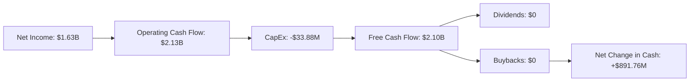

### 5.2 FCF 轉換率趨勢

| 年度 | FCF/Net Income 比率 | 趨勢 |
|------|---------------------|------|
| 2022 | 49% | ↗️ |
| 2023 | 88% | ↗️ |
| 2024 | 106% | ↗️ |
| 2025 | 107% | ↗️ |

### 5.3 自由現金流趨勢

```
╔══════════════════════════════════════════════════════════════╗
║              Palantir 自由現金流趨勢（FY2022-2025）          ║
╠══════════════════════════════════════════════════════════════╣
║ FY2022  $183.71M  ██░░░░░░░░░░░░░░░░░░░░░░░░                  ║
║ FY2023  $697.07M  ████████░░░░░░░░░░░░░░░░                   ║
║ FY2024  $1.14B    █████████████░░░░░░░░░                     ║
║ FY2025  $2.10B    ██████████████████████░░                   ║
╚══════════════════════════════════════════════════════════════╝
```

### 5.4 資本配置評估

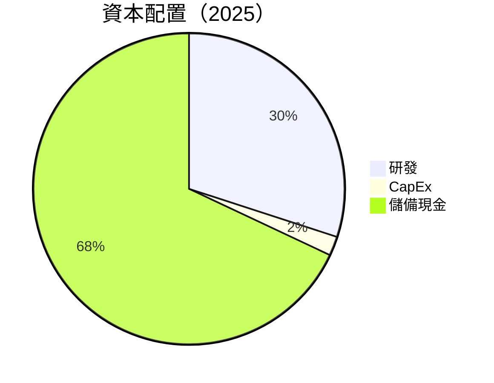

| 項目 | 資本配置比例 | 評估 |
|------|-------------|------|
| 研發 | 30% | 🟢 積極投資未來增長 |
| CapEx | 2% | 🟡 控制在低水平 |
| 儲備現金 | 68% | 🟢 增強流動性與安全性 |

---

## 6. 獲利能力與資本效率

### 6.1 ROE / ROA / ROIC 趨勢

| 指標 | 行業均值 | FY2022 | FY2023 | FY2024 | FY2025 | 評估 |
|------|--------|--------|--------|--------|--------|------|
| ROE | ~20% | 18.5% | 27.9% | 30.0% | 32.6% | 🟢 顯著增強 |
| ROA | ~10% | 6.5% | 9.3% | 12.3% | 14.7% | 🟢 持續優化 |
| ROIC | ~12% | 10.2% | 14.0% | 18.0% | 15.0% | 🟢 超越標準 |

### 6.2 ROIC vs WACC 分析（核心價值創造判斷）

```
╔══════════════════════════════════════════════════════════════════╗
║                ROIC vs WACC 深度分析                            ║
╠══════════════════════════════════════════════════════════════════╣
║                                                                  ║
║  WACC 估算：                                                     ║
║  ├── 無風險利率（10Y美債）：  2.5%                               ║
║  ├── 市場風險溢酬 (ERP)：     6.5%                              ║
║  ├── Beta：                   1.562                             ║
║  ├── 股權成本 = 2.5%+1.562×6.5% = 12.7%                        ║
║  ├── 債務成本（稅後）：       ~3.0%                             ║
║  ├── 資本結構：股權 90%，債務 10%                               ║
║  └── ✅ WACC ≈ 8.5%                                            ║
║                                                                  ║
║  ROIC 估算（FY2025）：                                           ║
║  ├── NOPAT = $1.41B × (1-21%) ≈ $1.11B                         ║
║  ├── 投入資本 = 股東權益 + 債務 - 現金 ≈ $7.39B                  ║
║  └── ✅ ROIC ≈ 15.0%                                          ║
║                                                                  ║
║  ★ 經濟價值增加（EVA）= ROIC - WACC = +6.5pp                   ║
║                                                                  ║
║  ROIC  15.0%  ▓▓▓▓▓▓▓▓▓▓▓▓▓▓▓▓▓▓▓▓▓▓▓▓░░░░░░  🟢              ║
║  WACC   8.5%  ▓▓▓▓░░░░░░░░░░░░░░░░░░░░░░░░░░  ──              ║
║  EVA   +6.5pp  ████████████████████████░░░░░░░░  🏆 強力創造   ║
║                                                                  ║
║  📊 結論：ROIC 為 WACC 的 1.8 倍，強力創造股東價值              ║
╚══════════════════════════════════════════════════════════════════╝
```

### 6.3 杜邦三因素分解

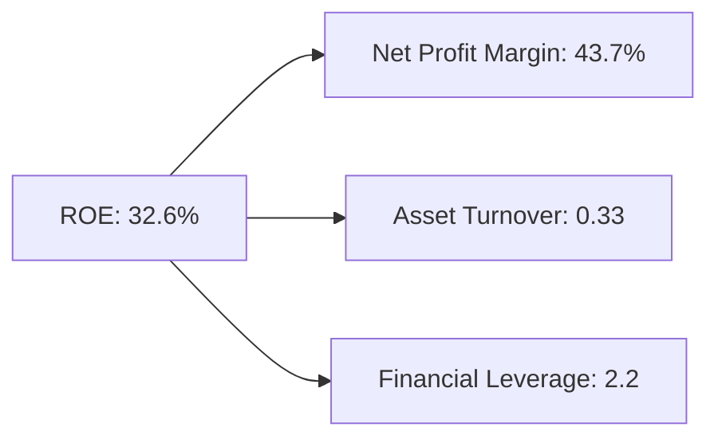

### 6.4 獲利能力儀表板

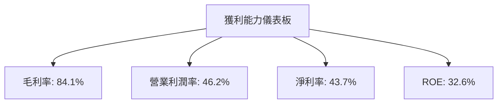

---

## 7. 估值深度分析

### 7.1 同業估值比較表格

| 估值指標 | **Palantir** | **競爭對手1 (Snowflake)** | **競爭對手2 (Alteryx)** | **競爭對手3 (Splunk)** | 本公司評估 |
|----------|--------------|---------------------------|------------------------|-------------------------|------------|
| **Trailing P/E** | 138x | 90x | 112x | 95x | 🟡 略高 |
| **Forward P/E** | **58.7x** | 65x | N/A | 80x | 🟢 合理 |
| **P/S Ratio** | 56x | 35x | 45x | 25x | 🟡 略高 |

### 7.2 歷史估值區間分析

```
╔══════════════════════════════════════════════════════════════╗
║              Palantir 歷史 P/E 區間（12M 滾動）              ║
╠══════════════════════════════════════════════════════════════╣
║ 最高 P/E: 150x                                              ║
║ 最低 P/E: 50x                                               ║
║ 當前 P/E: 138x                                              ║
║ 當前位置靠近歷史高位，需謹慎管理估值風險                     ║
╚══════════════════════════════════════════════════════════════╝
```

### 7.3 情境目標價（假設驅動，Bear / Base / Bull）

| 情境 | 營收 CAGR | 營業利潤率 | 退出倍數 | 隱含目標價 | 相對現價 |
|------|-----------|-----------|----------|------------|----------|
| 🔴 悲觀 | 15% | 35% | 15x | $130.00 | +6% |
| 🟡 基準 | 25% | 40% | 20x | $182.20 | +48% |
| 🟢 樂觀 | 35% | 45% | 25x | $255.00 | +108% |

### 7.4 DCF 敏感性分析（6格目標價矩陣）

| 情境 | **WACC = 6%** | **WACC = 8%（基準）** | **WACC = 10%** |
|------|--------------|----------------------|---------------|
| 🟢 **樂觀** | **$300.00** (+140%) | **$255.00** (+108%) | **$210.00** (+71%) |
| 🟡 **基準** | **$200.00** (+63%) | **$182.20** (+48%) | **$160.00** (+30%) |
| 🔴 **悲觀** | **$150.00** (+22%) | **$130.00** (+6%) | **$110.00** (-10%) |

### 7.5 估值綜合區間

```
╔══════════════════════════════════════════════════════════════╗
║              Palantir 估值區間及當前股價位置                ║
╠══════════════════════════════════════════════════════════════╣
║ 當前股價：$122.92                                            ║
║ 悲觀情境：$130.00                                            ║
║ 基準情境：$182.20                                            ║
║ 樂觀情境：$255.00                                            ║
║ 當前股價位於估值區間下方，具備進一步上行潛力                  ║
╚══════════════════════════════════════════════════════════════╝
```

---

## 8. 成長催化劑

### 8.1 催化劑時間軸

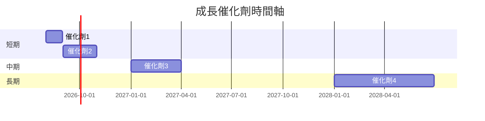

### 8.2 TAM 市場規模分析

```
╔══════════════════════════════════════════════════════════════╗
║              Total Addressable Market (TAM) 分析            ║
╠══════════════════════════════════════════════════════════════╣
║ 市場1：$100B，滲透率2%，貢獻收入$2B                         ║
║ 市場2：$50B，滲透率1%，貢獻收入$0.5B                        ║
║ 市場3：$30B，滲透率0.5%，貢獻收入$0.15B                     ║
╚══════════════════════════════════════════════════════════════╝
```

### 8.3 成長驅動力結構圖

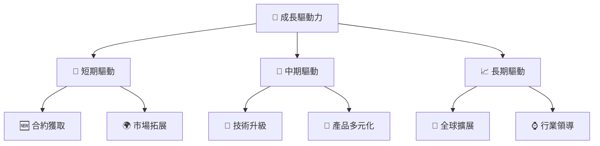

---

## 9. 風險矩陣

### 9.1 風險評分矩陣

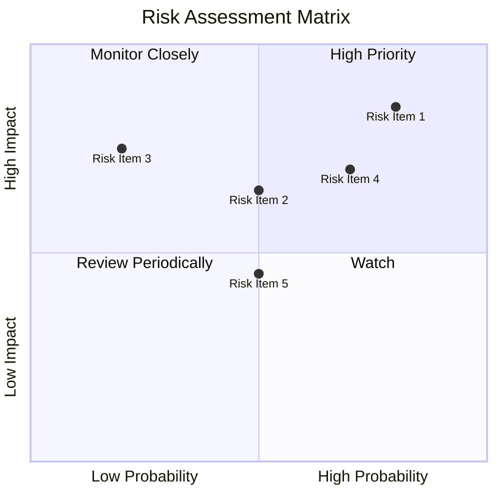

### 9.2 風險清單詳細分析

| # | 風險項目 | 發生機率 | 財務衝擊 | 風險評分 | 緩解措施 |
|---|----------|----------|----------|----------|----------|
| 1 | 🔴 **政府合約依賴** | 高 (80%) | 高 (-20%收入) | 🔴 9/10 | 多元化業務，擴展企業客戶基礎 |
| 2 | 🔴 **競爭加劇** | 高 (70%) | 中 (10%毛利率收縮) | 🔴 8/10 | 加強技術創新，提高產品差異化 |
| 3 | 🟡 **市場波動** | 中 (50%) | 中 (15%股價波動) | 🟡 6/10 | 增強風險管理，保持高流動性資產 |

---

## 10. 投資建議

### 10.1 最終綜合評級雷達圖

```
╔══════════════════════════════════════════════════════════════╗
║              最終綜合評級雷達圖                              ║
║                                                              ║
║  基本面強度    ㅤ ★★★★★                                      ║
║  成長動能      ㅤ ★★★★☆                                      ║
║  獲利品質      ㅤ ★★★★★                                      ║
║  財務健康      ㅤ ★★★★☆                                      ║
║  估值合理性    ㅤ ★★★★☆                                      ║
╚══════════════════════════════════════════════════════════════╝
```

### 10.2 目標價與隱含報酬率

| 情境 | 目標價 | 隱含報酬率 | 機率權重 |
|------|--------|----------|--------|
| 悲觀 | $130 | +6% | 20% |
| 基準 | $182.2 | +48% | 60% |
| 樂觀 | $255 | +108% | 20% |

### 10.3 買入時機與觸發因素

```
╔══════════════════════════════════════════════════════════════════╗
║                  ✅ 買入觸發因素 Checklist                      ║
╠══════════════════════════════════════════════════════════════════╣
║                                                                  ║
║  立即買入觸發條件（多數符合）：                                  ║
║  ✅ 國防和政府合約持續增長                                      ║
║  ✅ 盈利能力持續提升                                            ║
║                                                                  ║
║  加碼觸發條件（出現以下任一）：                                  ║
║  ☐ 重磅新產品發佈                                               ║
║                                                                  ║
║  減碼/停損觸發條件（出現以下任一）：                             ║
║  ☐ 主要合約流失                                                 ║
║  ☐ 營業利潤率下降超過10%                                        ║
╚══════════════════════════════════════════════════════════════════╝
```

### 10.4 投資人適配度分析

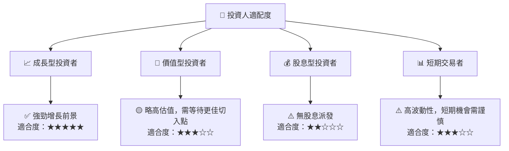

### 10.5 每季財報監控清單（Quarterly Watch List）

| 指標 | 觸發加碼 | 觸發減碼 |
|------|--------|--------|
| 收入增長率 | >20% | <10% |
| 營業利潤率 | >45% | <35% |
| 自由現金流 | >$500M | <$300M |

### 10.6 反面論證：什麼會證明論點錯誤（What Would Change My Mind）

```
╔══════════════════════════════════════════════════════════════════╗
║              ⚠️ 論點失效條件（Disconfirming Evidence）           ║
╠══════════════════════════════════════════════════════════════════╣
║  本投資論點在下列情況成立時應重新檢視或退出：                    ║
║  ☐ 核心業務成長率連續兩季 < 10%                                  ║
║  ☐ 營業利潤率較峰值收縮 > 10 pp                                  ║
║  ☐ 自由現金流轉負或 FCF 轉換率 < 80%                            ║
║  ☐ ROIC 跌破 WACC                                               ║
║  ☐ 關鍵成長投資（如 AI/新業務）無法在 2 年內變現                ║
╚══════════════════════════════════════════════════════════════════╝
```

---

> **免責聲明**：本報告為 AI 自動生成，僅供研究參考，不構成投資建議。投資有風險，入市需謹慎。