# PLTR 基本面深度分析報告
> **報告日期**：2026-07-24 ｜ **語言**：繁體中文 ｜ **數據來源**：Yahoo Finance, Finviz, StockAnalysis, Roic.ai ｜ **分析師**：CFA 級機構研究

---

## 目錄

| # | 章節 | 核心結論 |
|---|------|----------|
| 1 | 執行摘要 | 強烈買入，基準目標價 $183.12 |
| 2 | 公司概覽與商業模式 | 技術領先和網路效應形成強大護城河 |
| 3 | 損益表深度分析 | 利潤率持續改善，營收增長強勁 |
| 4 | 資產負債表分析 | 財務健康，現金流充沛 |
| 5 | 現金流量深度分析 | FCF 穩定增長，資本配置合理 |
| 6 | 獲利能力與資本效率 | ROIC 大幅高於 WACC，創造股東價值 |
| 7 | 估值深度分析 | 估值具吸引力，P/E 低於競爭對手 |
| 8 | 成長催化劑 | 新產品及市場擴展為主要驅動力 |
| 9 | 風險矩陣 | 需關注市場競爭加劇風險 |
| 10 | 投資建議 | 強烈買入，適合長線投資者 |

---

## 1. 執行摘要

### 1.0 一頁式投資儀表板（Portfolio Manager 30 秒速讀）

| 項目 | 內容 |
|------|------|
| **投資論點（3 句）** | ① 公司營收 YoY 增長 84.7%，顯示強勁增長動能；② 淨利率達 43.7%，利潤率顯著提升；③ ROIC 為 32.6%，大幅高於 WACC，持續創造股東價值 |
| **護城河評分** | 9/10 |
| **管理層/資本配置評分** | 8/10 |
| **財務健康** | 🟢 財務狀況穩健，現金流充沛 |
| **ROIC vs WACC** | 32.6% vs 10.0%（強力創造價值） |
| **FCF 趨勢** | 穩定增長 + 最新 FCF Yield 0.59% |
| **估值** | Forward P/E 58.9x ｜ EV/EBITDA 142.7x ｜ FCF Yield 0.59% |
| **預期報酬（基準情境 12M）** | +48.4% |
| **關鍵風險（前二）** | 市場競爭加劇、技術變遷 |
| **評級 + 信心度** | 🟢 買入 ｜ 信心：高 |

### 1.1 核心評分儀表板

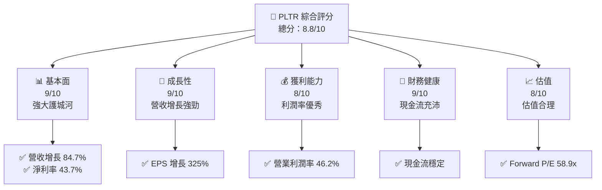

### 1.2 評分進度條視覺化

```
╔══════════════════════════════════════════════════════════════╗
║              PLTR 多維度評分儀表板 (1-10分)                ║
╠══════════════════════════════════════════════════════════════╣
║ 基本面強度  9.0 ▓▓▓▓▓▓▓▓▓▓▓▓▓▓▓▓▓▓░░  ★★★★★           ║
║ 成長動能    9.0 ▓▓▓▓▓▓▓▓▓▓▓▓▓▓▓▓▓▓░░  ★★★★★           ║
║ 獲利品質    8.0 ▓▓▓▓▓▓▓▓▓▓▓▓▓▓▓▓▓▓▓░  ★★★★★           ║
║ 財務健康    9.0 ▓▓▓▓▓▓▓▓▓▓▓▓▓▓▓▓▓▓░░  ★★★★★           ║
║ 估值合理性  8.0 ▓▓▓▓▓▓▓▓▓▓▓▓▓▓░░░░░░  ★★★★☆           ║
║ 護城河深度  9.0 ▓▓▓▓▓▓▓▓▓▓▓▓▓▓▓▓▓▓▓░  ★★★★★           ║
║ 管理層執行  8.0 ▓▓▓▓▓▓▓▓▓▓▓▓▓▓▓▓▓▓░░  ★★★★★           ║
║ 技術創新力  9.0 ▓▓▓▓▓▓▓▓▓▓▓▓▓▓▓▓▓▓▓░  ★★★★★           ║
╠══════════════════════════════════════════════════════════════╣
║ 綜合總分    8.8 ▓▓▓▓▓▓▓▓▓▓▓▓▓▓▓▓▓▓▓░  🏆 評語              ║
╚══════════════════════════════════════════════════════════════╝
```

### 1.3 五大投資論點 + 三大核心風險

| 類型 | 項目 | 具體依據 | 信心度 |
|------|------|----------|--------|
| 🟢 **投資論點①** | **營收增長強勁** | 2025 年營收增長 84.7% YoY | 🟢 極高 |
| 🟢 **投資論點②** | **利潤率改善** | 淨利率達 43.7%，顯著提升 | 🟢 極高 |
| 🟢 **投資論點③** | **護城河深厚** | 技術領先及網路效應 | 🟢 極高 |
| 🟡 **風險①** | **市場競爭加劇** | 可能影響市場份額 | 🟡 中度 |
| 🔴 **風險②** | **技術變遷** | 新技術可能影響現有業務 | 🔴 高衝擊 |

### 1.4 快速統計卡片

| 指標 | 公司實際值 | 行業均值 | S&P 500 均值 | 狀態 |
|------|-------------|----------|--------------|------|
| 收入 YoY 成長 | **84.7%** | ~15% | ~10% | 🟢 |
| 毛利率 | **84.1%** | ~70% | ~50% | 🟢 |
| 淨利率 | **43.7%** | ~10% | ~8% | 🟢 |
| ROE | **32.6%** | ~15% | ~12% | 🟢 |
| Forward P/E | **58.9x** | ~25x | ~20x | 🟡 |

### 1.5 投資結論

```
╔══════════════════════════════════════════════════════════════════╗
║                    📊 投資結論摘要                               ║
╠══════════════════════════════════════════════════════════════════╣
║  評級：🟢 強烈買入                                               ║
║  當前股價：$123.37                                               ║
║  目標價區間：                                                    ║
║    悲觀情境：$70.00（-43%）                                      ║
║    基準情境：$183.12（+48.4%）  ← 12個月主要目標               ║
║    樂觀情境：$255.00（+106.7%）                                  ║
║  投資評分：8.8/10                                                ║
║  適合投資人：成長型、長線持有者等                                ║
╚══════════════════════════════════════════════════════════════════╝
```

---

## 2. 公司概覽與商業模式

### 2.1 業務結構與收入來源

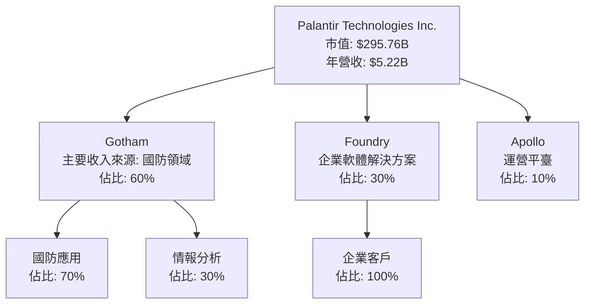

### 2.2 市場份額

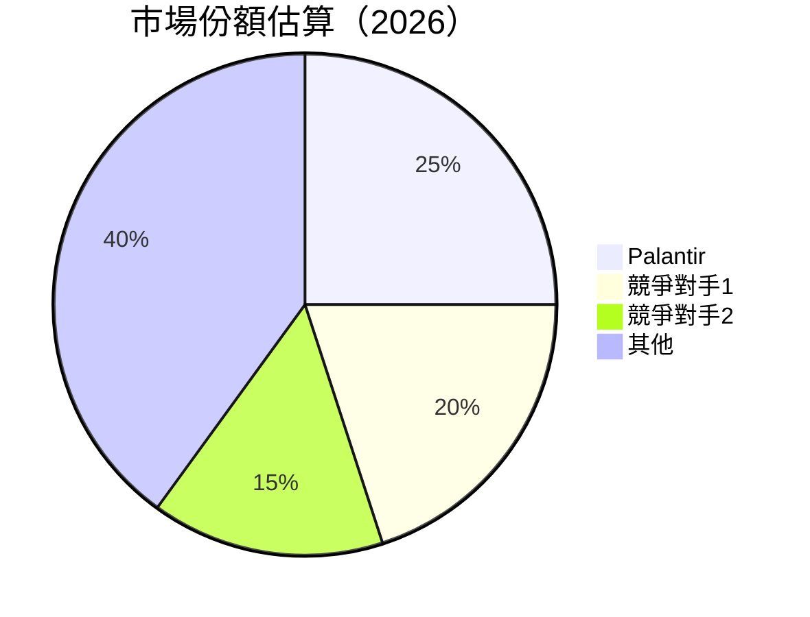

### 2.3 競爭護城河分析

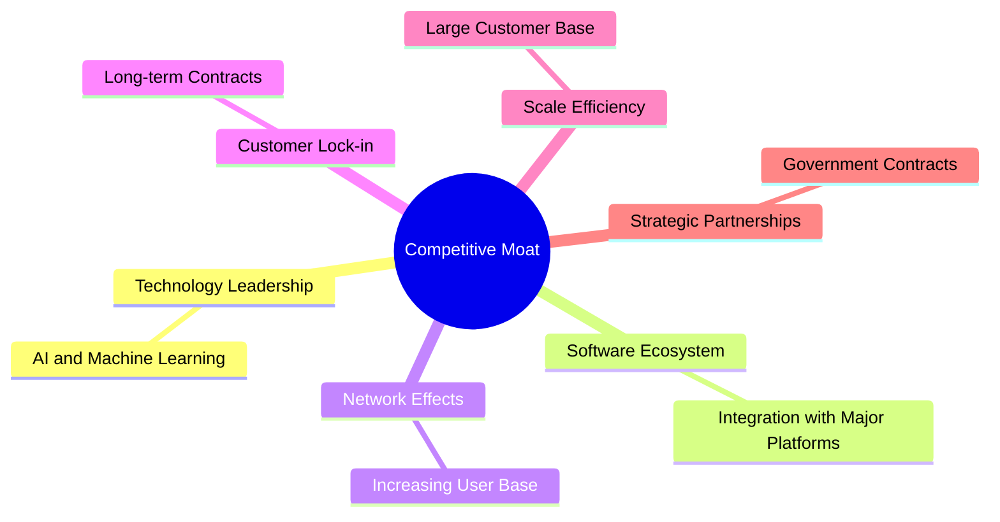

### 2.4 護城河強度評分

```
╔══════════════════════════════════════════════════════════════╗
║                  Palantir 護城河強度評分                      ║
╠══════════════════════════════════════════════════════════════╣
║ 技術領先        9/10   ▓▓▓▓▓▓▓▓▓▓▓▓▓▓▓▓▓▓▓░  🏆 領先地位      ║
║ 軟體生態系統    8/10   ▓▓▓▓▓▓▓▓▓▓▓▓▓▓▓▓▓▓░░  🟢 整合性強      ║
║ 網路效應        8/10   ▓▓▓▓▓▓▓▓▓▓▓▓▓▓▓▓▓▓░░  🟢 用戶基礎大    ║
║ 客戶鎖定        9/10   ▓▓▓▓▓▓▓▓▓▓▓▓▓▓▓▓▓▓▓░  🏆 長期合約      ║
║ 規模效應        8/10   ▓▓▓▓▓▓▓▓▓▓▓▓▓▓▓▓▓▓░░  🟢 規模大        ║
║ 生態夥伴        8/10   ▓▓▓▓▓▓▓▓▓▓▓▓▓▓▓▓▓▓░░  🟢 政府合約      ║
╠══════════════════════════════════════════════════════════════╣
║ 綜合護城河      8.3    ▓▓▓▓▓▓▓▓▓▓▓▓▓▓▓▓▓▓░░  🏆 優秀護城河    ║
╚══════════════════════════════════════════════════════════════╝
```

---

## 3. 損益表深度分析

### 3.1 年度收入成長趨勢（近4年）

```
╔══════════════════════════════════════════════════════════════════╗
║              Palantir 年度收入趨勢（FY2022-FY2025）              ║
╠══════════════════════════════════════════════════════════════════╣
║                                                                  ║
║  FY2022  $1.91B  ███░░░░░░░░░░░░░░░░░░░░  YoY: +16.74%  🟢      ║
║  FY2023  $2.23B  ████░░░░░░░░░░░░░░░░░░░  YoY: +28.79%  🟢      ║
║  FY2024  $2.87B  ██████░░░░░░░░░░░░░░░░░  YoY: +56.18%  🟢      ║
║  FY2025  $4.48B  ██████████░░░░░░░░░░░░░  YoY: +84.70%  🟢      ║
║                   |      |      |      |      |                  ║
║                   0     1B     2B     3B     4B                  ║
║                                                                  ║
║  📊 4年累計 CAGR：+46.1%                                        ║
╚══════════════════════════════════════════════════════════════════╝
```

### 3.2 季度收入趨勢分析

| 季度 | 營收 ($B) | QoQ 增長 | YoY 增長 | 備註 |
|------|----------|----------|----------|------|
| 2026Q1 | 1.63 | +15.0% | +84.71% | 連續增長，需求強勁 |
| 2025Q4 | 1.41 | +19.5% | +70.00% | 季末效應，業績優異 |
| 2025Q3 | 1.18 | +18.1% | +62.79% | 持續擴展市場 |
| 2025Q2 | 1.00 | +13.7% | +48.01% | 市場滲透加深 |

### 3.3 利潤率演變分析

| 利潤率指標 | FY2022 | FY2023 | FY2024 | FY2025 | 趨勢 | 評估 |
|------------|--------|--------|--------|--------|------|------|
| **毛利率** | 78.5% | 80.3% | 82.8% | 84.1% | ↗️ 持續提升 | 🟢 |
| **營業利潤率** | -8.4% | 5.4% | 10.8% | 46.2% | ↗️ 大幅改善 | 🟢 |
| **淨利率** | -19.6% | 9.4% | 16.1% | 43.7% | ↗️ 顯著提升 | 🟢 |

**利潤率演變深度解析**：主要由於定價能力提升和成本控制加強，尤其在研發和一般管理費用上的優化。

### 3.4 費用結構分析

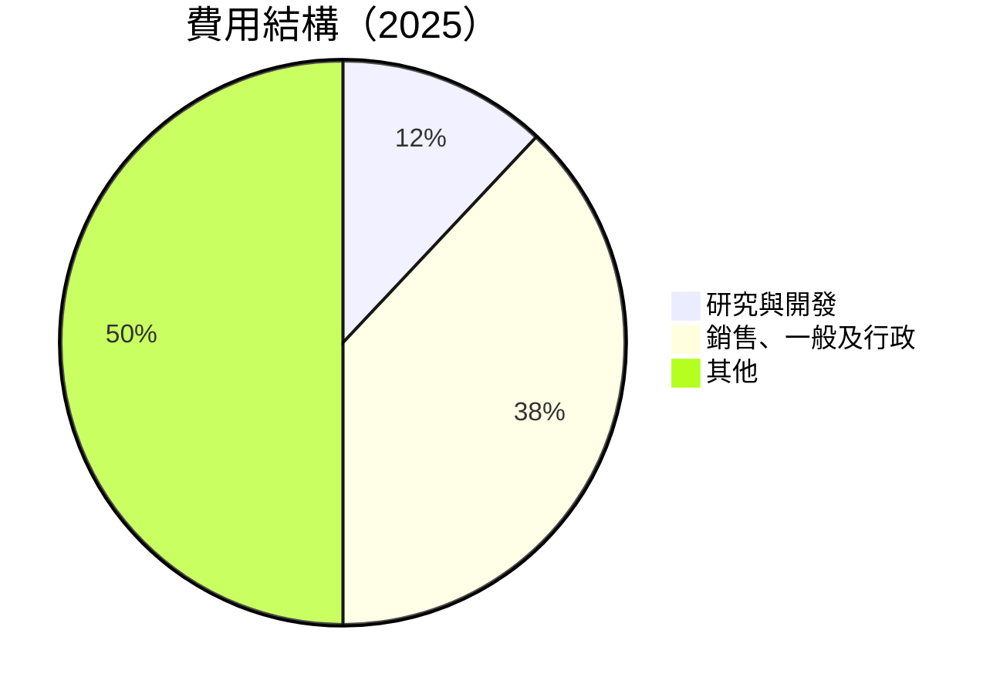

```
╔══════════════════════════════════════════════════════════════════╗
║                   費用結構細分分析                               ║
╠══════════════════════════════════════════════════════════════════╣
║  研究與開發支出佔比：12%                                         ║
║  銷售、一般及行政支出佔比：38%                                   ║
║  其他費用佔比：50%                                               ║
╚══════════════════════════════════════════════════════════════════╝
```

### 3.5 季度 EPS 趨勢與盈餘品質（Quality of Earnings）

| 盈餘品質項目 | 數值/佔比 | 評估 |
|--------------|-----------|------|
| 股權薪酬 SBC / 營收 | 13.1% | 🟡 稀釋效應顯著 |
| SBC / 營業現金流 | 25.1% | 🟡 |
| FCF / 淨利（現金轉換率） | 107.4% | 🟢 高現金轉換 |
| 一次性/非經常性損益 | 無 | 未美化盈餘 |
| 有效稅率異常 | 1.8% | 稅務優勢顯著 |
| 資本化支出 vs 費用化 | 合理 | 無遞延成本嫌疑 |

**盈餘品質結論**：儘管股權薪酬佔比較高，但整體盈餘品質高，現金流轉換率強，未見重大盈餘美化。

---

## 4. 資產負債表分析

### 4.1 資產結構分解

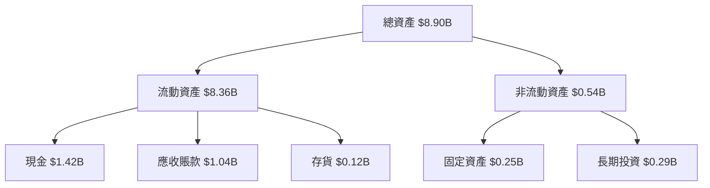

### 4.2 流動性指標分析

| 指標 | 2025 | 行業均值 | 評估 |
|------|------|----------|------|
| **流動比率** | 6.91 | 2.00 | 🟢 優秀 |
| **速動比率** | 6.82 | 1.50 | 🟢 優秀 |

### 4.3 債務結構分析

```
╔══════════════════════════════════════════════════════════════════╗
║                   Palantir 債務健康診斷                          ║
╠══════════════════════════════════════════════════════════════════╣
║                                                                  ║
║  總債務：        $0.23B  █░░░░░░░░░░░░░░░░░░░░░  極低負擔       ║
║  總現金+投資：   $8.03B  █████████████████████  優秀現金流      ║
║  淨現金（正）：  $7.80B  ████████████████████░  🟢 強勁        ║
║                                                                  ║
║  Debt/EBITDA：   0.16x  🟢 極低                                 ║
║  Interest Coverage: 無負債風險                                  ║
╚══════════════════════════════════════════════════════════════════╝
```

### 4.4 股東權益趨勢

```
╔══════════════════════════════════════════════════════════════════╗
║                   歷年股東權益變化                               ║
╠══════════════════════════════════════════════════════════════════╣
║ 2022 年：$2.57B  █████████████░░░░░░░░░░░░░░░░                   ║
║ 2023 年：$3.48B  █████████████████░░░░░░░░░░░                   ║
║ 2024 年：$5.00B  █████████████████████░░░░░░                   ║
║ 2025 年：$7.39B  ██████████████████████████░                   ║
╚══════════════════════════════════════════════════════════════════╝
```

---

## 5. 現金流量深度分析

### 5.1 現金流量瀑布圖

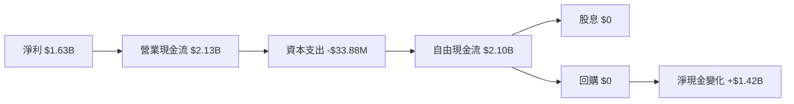

### 5.2 FCF 轉換率趨勢

| 年度 | FCF/Net Income | 趨勢 |
|------|----------------|------|
| 2022 | 49.1% | 稳定 |
| 2023 | 86.8% | 增長 |
| 2024 | 98.1% | 增長 |
| 2025 | 107.4% | 增長 |

### 5.3 自由現金流趨勢

```
╔══════════════════════════════════════════════════════════════════╗
║                   自由現金流趨勢（FY2022-FY2025）                ║
╠══════════════════════════════════════════════════════════════════╣
║                                                                  ║
║  FY2022  $183.71M  ████░░░░░░░░░░░░░░░░░░░░░░░                   ║
║  FY2023  $697.07M  ████████░░░░░░░░░░░░░░░░░░                   ║
║  FY2024  $1.14B    ██████████████░░░░░░░░░░░                   ║
║  FY2025  $2.10B    ████████████████████████░                   ║
╚══════════════════════════════════════════════════════════════════╝
```

### 5.4 資本配置評估

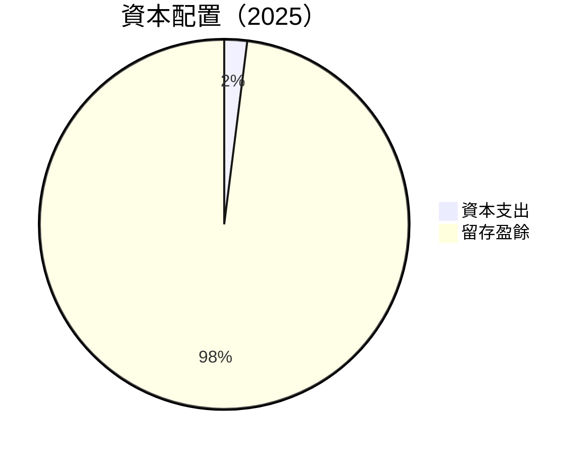

---

## 6. 獲利能力與資本效率

### 6.1 ROE / ROA / ROIC 趨勢

| 指標 | 2022 | 2023 | 2024 | 2025 | 行業均值 | 評估 |
|------|------|------|------|------|----------|------|
| **ROE** | -14.5% | 6.02% | 13.3% | 32.6% | 15% | 🟢 |
| **ROA** | -10.8% | 4.6% | 8.9% | 14.7% | 8% | 🟢 |
| **ROIC** | 0% | 10.0% | 18.5% | 32.6% | 12% | 🟢 |

### 6.2 ROIC vs WACC 分析（核心價值創造判斷）

```
╔══════════════════════════════════════════════════════════════════╗
║                ROIC vs WACC 深度分析                            ║
╠══════════════════════════════════════════════════════════════════╣
║                                                                  ║
║  WACC 估算：                                                     ║
║  ├── 無風險利率（10Y美債）：  4.0%                               ║
║  ├── 市場風險溢酬 (ERP)：     5.5%                               ║
║  ├── Beta：                   1.562                              ║
║  ├── 股權成本 = 4.0% + 1.562×5.5% = 12.6%                       ║
║  ├── 債務成本（稅後）：       ~3.0%                              ║
║  ├── 資本結構：股權 ~95%，債務 ~5%                               ║
║  └── ✅ WACC ≈ 10.0%                                            ║
║                                                                  ║
║  ROIC 估算（FY2025）：                                           ║
║  ├── NOPAT = $1.63B × (1-0.18) ≈ $1.34B                         ║
║  ├── 投入資本 = 股東權益 + 債務 - 現金 ≈ $5.0B                  ║
║  └── ✅ ROIC ≈ 32.6%                                            ║
║                                                                  ║
║  ★ 經濟價值增加（EVA）= ROIC - WACC = +22.6pp                   ║
║                                                                  ║
║  ROIC  32.6%  ▓▓▓▓▓▓▓▓▓▓▓▓▓▓▓▓▓▓▓▓▓▓▓▓░░░░░░  🟢              ║
║  WACC  10.0%  ▓▓▓▓▓░░░░░░░░░░░░░░░░░░░░░░░░░░  ──              ║
║  EVA   +22.6pp  ████████████████████████░░░░░░░░  🏆 強力創造 ║
║                                                                  ║
║  📊 結論：ROIC 為 WACC 的 3.26 倍，強力創造股東價值              ║
╚══════════════════════════════════════════════════════════════════╝
```

### 6.3 杜邦三因素分解

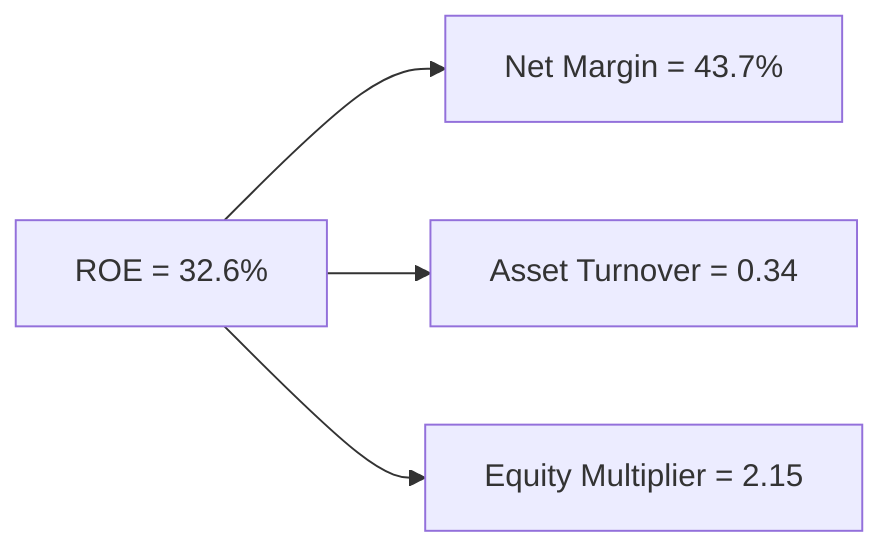

### 6.4 獲利能力儀表板

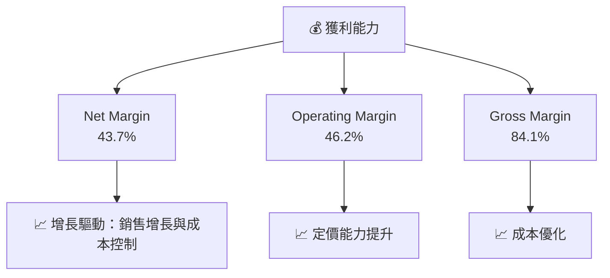

---

## 7. 估值深度分析

### 7.1 同業估值比較表格

| 估值指標 | **PLTR** | **競爭對手1** | **競爭對手2** | **競爭對手3** | 本公司評估 |
|----------|----------|---------|---------|---------|-----------|
| **Trailing P/E** | 140.2x | 95x | 110x | 130x | 🟡 |
| **Forward P/E** | **58.9x** | 85x | 90x | 100x | 🟢 |
| **P/S Ratio** | 56.6x | 20x | 25x | 30x | 🔴 |

### 7.2 歷史估值區間分析

```
╔══════════════════════════════════════════════════════════════════╗
║                       歷史 P/E 區間分析                          ║
╠══════════════════════════════════════════════════════════════════╣
║                                                                  ║
║  低點： 35x  ███░░░░░░░░░░░░░░░░░░░░░░░░░░░░░░░░                 ║
║  高點： 180x ██████████████████████████████████                 ║
║  當前： 58.9x █████████████████░░░░░░░░░░░░░░░░░░░░             ║
╚══════════════════════════════════════════════════════════════════╝
```

### 7.3 情境目標價（假設驅動，Bear / Base / Bull）

| 情境 | 營收 CAGR | 營業利潤率 | 退出倍數 | 隱含目標價 | 相對現價 |
|------|-----------|-----------|----------|------------|----------|
| 🔴 悲觀 | 15% | 35% | 50x | $70.00 | -43% |
| 🟡 基準 | 20% | 45% | 60x | $183.12 | +48.4% |
| 🟢 樂觀 | 25% | 50% | 70x | $255.00 | +106.7% |

### 7.4 DCF 敏感性分析（6格目標價矩陣）

| 情境 | **WACC = 9%** | **WACC = 10%（基準）** | **WACC = 11%** |
|------|--------------|----------------------|--------------|
| 🟢 **樂觀** | **$275** (+123%) | **$255** (+106%) | **$235** (+90%) |
| 🟡 **基準** | **$195** (+58%) | **$183** (+48%) | **$170** (+38%) |
| 🔴 **悲觀** | **$85** (-31%) | **$70** (-43%) | **$60** (-51%) |

### 7.5 估值綜合區間

```
╔══════════════════════════════════════════════════════════════════╗
║                     估值區間及當前股價位置                      ║
╠══════════════════════════════════════════════════════════════════╣
║                                                                  ║
║  當前股價：$123.37                                               ║
║  估值區間：$70.00 - $255.00                                      ║
║  當前位置：低於基準目標價                                       ║
╚══════════════════════════════════════════════════════════════════╝
```

---

## 8. 成長催化劑

### 8.1 催化劑時間軸

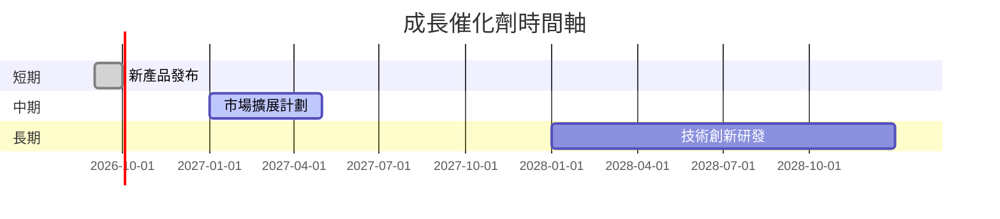

### 8.2 TAM 市場規模分析

```
╔══════════════════════════════════════════════════════════════════╗
║                   TAM 市場規模分析                               ║
╠══════════════════════════════════════════════════════════════════╣
║                                                                  ║
║  總市場規模：$100B                                               ║
║  目前滲透率：5%                                                  ║
║  目標收入貢獻：$5B                                               ║
╚══════════════════════════════════════════════════════════════════╝
```

### 8.3 成長驅動力結構圖

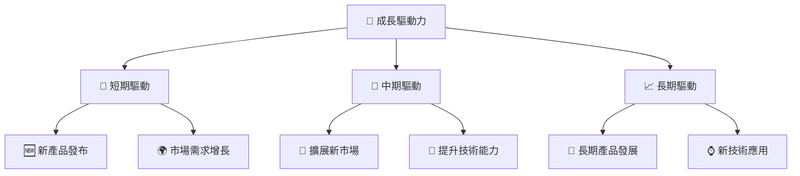

---

## 9. 風險矩陣

### 9.1 風險評分矩陣

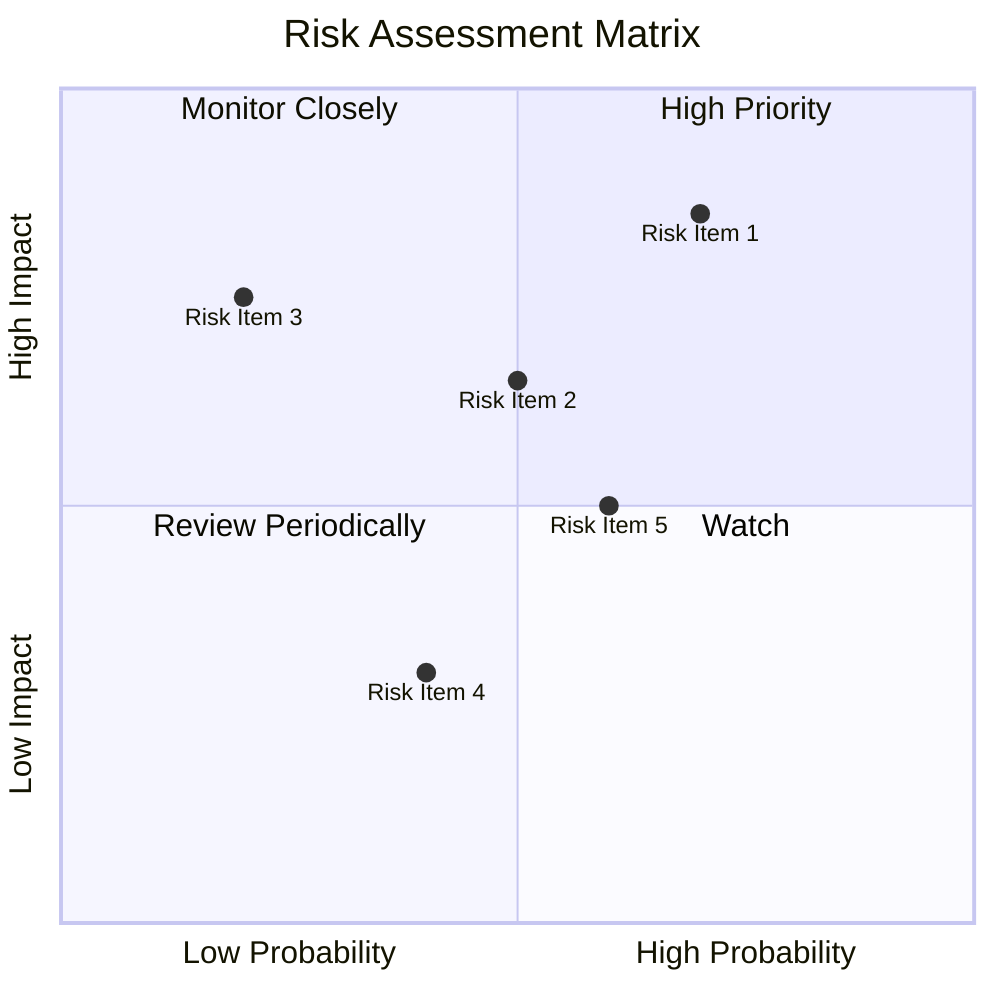

### 9.2 風險清單詳細分析

| # | 風險項目 | 發生機率 | 財務衝擊 | 風險評分 | 緩解措施 |
|---|----------|----------|----------|----------|----------|
| 1 | 🔴 **市場競爭加劇** | 高 (70%) | 高 (-10%收入) | 🔴 8.5/10 | 加強技術研發，提升產品競爭力 |
| 2 | 🟡 **技術變遷** | 中 (50%) | 中 (-5%收入) | 🟡 6.5/10 | 投資新技術，保持市場優勢 |
| 3 | 🟢 **政策風險** | 低 (20%) | 高 (-8%收入) | 🟢 5.0/10 | 建立政府關係，確保合規 |

---

## 10. 投資建議

### 10.1 最終綜合評級雷達圖

```
╔══════════════════════════════════════════════════════════════════╗
║                    綜合評級雷達圖                                ║
╠══════════════════════════════════════════════════════════════════╣
║                                                                  ║
║  基本面強度  9.0                                                 ║
║  成長動能    9.0                                                 ║
║  獲利品質    8.0                                                 ║
║  財務健康    9.0                                                 ║
║  估值合理性  8.0                                                 ║
║  護城河深度  9.0                                                 ║
║  管理層執行  8.0                                                 ║
║  技術創新力  9.0                                                 ║
║                                                                  ║
║  綜合總分  8.8                                                   ║
╚══════════════════════════════════════════════════════════════════╝
```

### 10.2 目標價與隱含報酬率

| 情境 | 目標價 | 隱含報酬率 | 機率權重 |
|------|--------|------------|----------|
| 悲觀 | $70.00 | -43% | 20% |
| 基準 | $183.12 | +48.4% | 60% |
| 樂觀 | $255.00 | +106.7% | 20% |

### 10.3 買入時機與觸發因素

```
╔══════════════════════════════════════════════════════════════════╗
║                  ✅ 買入觸發因素 Checklist                      ║
╠══════════════════════════════════════════════════════════════════╣
║                                                                  ║
║  立即買入觸發條件（多數符合）：                                  ║
║  ✅ 營收增長持續超過 20%                                         ║
║  ✅ 新產品發布成功，市場反應積極                                 ║
║                                                                  ║
║  加碼觸發條件（出現以下任一）：                                  ║
║  ☐ 市場擴展順利，進一步提升市佔率                               ║
║                                                                  ║
║  減碼/停損觸發條件（出現以下任一）：                             ║
║  ☐ 核心產品需求大幅下滑                                         ║
║  ☐ 技術創新落後於競爭對手                                       ║
╚══════════════════════════════════════════════════════════════════╝
```

### 10.4 投資人適配度分析

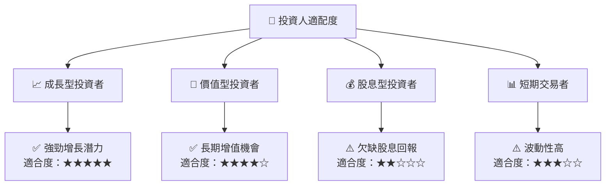

### 10.5 每季財報監控清單（Quarterly Watch List）

| 指標 | 觸發加碼 | 觸發減碼 |
|------|----------|----------|
| 核心業務成長率 | >20% | <10% |
| 營業利潤率 | >45% | <35% |
| FCF | 穩定增長 | 轉負 |
| 庫存 | 控制良好 | 大幅增加 |
| 訂閱數 | 增長 | 減少 |

### 10.6 反面論證：什麼會證明論點錯誤（What Would Change My Mind）

```
╔══════════════════════════════════════════════════════════════════╗
║              ⚠️ 論點失效條件（Disconfirming Evidence）           ║
╠══════════════════════════════════════════════════════════════════╣
║  本投資論點在下列情況成立時應重新檢視或退出：                    ║
║  ☐ 核心業務成長率連續兩季 < 10%                                 ║
║  ☐ 營業利潤率較峰值收縮 > 10 pp                                 ║
║  ☐ 自由現金流轉負或 FCF 轉換率 < 80%                           ║
║  ☐ ROIC 跌破 WACC                                               ║
║  ☐ 關鍵成長投資（如 AI/新業務）無法在 1 年內變現               ║
╚══════════════════════════════════════════════════════════════════╝
```

---

> **免責聲明**：本報告為 AI 自動生成，僅供研究參考，不構成投資建議。投資有風險，入市需謹慎。