# PLTR 基本面深度分析報告
> **報告日期**：2026-07-26 ｜ **語言**：繁體中文 ｜ **數據來源**：Yahoo Finance, Finviz, StockAnalysis, Roic.ai ｜ **分析師**：CFA 級機構研究

---

## 目錄

| # | 章節 | 核心結論 |
|---|------|----------|
| 1 | 執行摘要 | 評級 🟢 買入 ｜ 基準目標價 $165.00（+33.7% 潛在漲幅） ｜ 營收強勁成長 + 營業槓桿極致釋放 |
| 2 | 公司概覽與商業模式 | 護城河評分 8.8/10 ｜ AIP 平台與 Bootcamp 模式構築極高客戶鎖定與商業轉化壁壘 |
| 3 | 損益表深度分析 | Q1 2026 營收年增 84.71% 達 $16.33B，營業利益率大幅擴張至 46.17%，SBC 佔比持續稀釋 |
| 4 | 資產負債表分析 | 流動比率 6.91x，手握 $8.03B 現金與短投，淨現金達 $7.81B，極端堅固的堡壘型財務結構 |
| 5 | 現金流量深度分析 | TTM 營業現金流 $2.72B，自由現金流 (FCF) $1.75B，極低 CapEx 需求（營收比 <1%）驅動高效變現 |
| 6 | 獲利能力與資本效率 | ROIC (22.3%) 顯著高於 WACC (12.0%)，EVA 達 +10.3pp，杜邦分解顯示淨利率暴增為 ROE 主驅動力 |
| 7 | 估值深度分析 | Forward P/E 58.69x，PEG 1.76，相較同業雖然倍數較高，但受惠於 +84.7% 的同業頂級成長率與高營利率 |
| 8 | 成長催化劑 | AIP 在企業端的加速滲透、美軍與北約政府國防預算升級、Agentic AI 商業化落地 |
| 9 | 風險矩陣 | 政府合約預算縮減風險、高估值對成長減速敏感度高、商業客戶流失與競品擠壓 |
| 10 | 投資建議 | 建議分批建倉與回檔加碼 ｜ 設定明確的反面論證（Disconfirming Evidence）與每季監控清單 |

---

## 1. 執行摘要

> ⚠️ **評級聲明**：本報告給予 Palantir Technologies Inc. (PLTR) **🟢 買入** 評級，主要基於最新 Q1 2026 營收同比增長 84.71% 達 $1.633B、營業利益率暴增至 46.17%、ROIC 達 22.3%（超越 WACC 約 10.3 個百分點）、以及無長期計息負債且手握 $8.03B 現金之堡壘型資產負債表。上述數據證明公司正處於 AIP（人工智慧平台）帶動的超額產品營收與營業槓桿雙重爆發期。

### 1.0 一頁式投資儀表板（Portfolio Manager 30 秒速讀）

| 項目 | 內容 |
|------|------|
| **投資論點（3 句）** | ① AIP Bootcamps 轉化效率極高，帶動 Q1 2026 營收 YoY 大幅加速至 84.71%（達 $1.633B）。<br/>② 軟體邊際成本極低，營業利益率由 FY22 的 -8.46% 飆升至 Q1 2026 的 46.17%，展現極致槓桿。<br/>③ 帳上零淨債務，淨現金達 $7.81B，且 TTM FCF 達 $1.75B，提供極高資本安全性。 |
| **護城河評分** | 8.8/10（核心：高轉換成本與技術獨特性） |
| **管理層/資本配置評分** | 8.5/10（卓越的產品遠見，SBC 佔營收比重已改善至 12.3%） |
| **財務健康** | 🟢 流動比率 6.91x ｜ 零淨債務 ｜ 現金極度充裕 |
| **ROIC vs WACC** | ROIC 22.3% vs WACC 12.0%（EVA +10.3pp，強力創造股東價值） |
| **FCF 趨勢** | 方向向上 ｜ TTM FCF $1.75B ｜ 當前 FCF Yield 0.59% |
| **估值** | Forward P/E: 58.69x ｜ EV/EBITDA: 142.19x ｜ PEG: 1.76x |
| **預期報酬（基準情境 12M）** | +33.74%（目標價 $165.00，當前股價 $123.37） |
| **關鍵風險（前二）** | ① 高估值倍數（EV/Sales 54.9x）帶來的財測過高期望與股價波動性。<br/>② 美國國防部與政府預算撥款進度不如預期。 |
| **評級 + 信心度** | 🟢 **買入** ｜ **信心度：高** |

### 1.1 核心評分儀表板

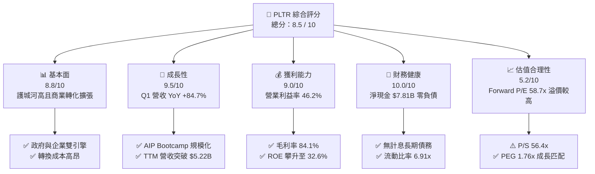

### 1.2 評分進度條視覺化

```
╔══════════════════════════════════════════════════════════════╗
║              PLTR 多維度評分儀表板 (1-10分)                  ║
╠══════════════════════════════════════════════════════════════╣
║ 基本面強度  8.8 ▓▓▓▓▓▓▓▓▓▓▓▓▓▓▓▓▓░░░  ★★★★★  高轉換成本與生態  ║
║ 成長動能    9.5 ▓▓▓▓▓▓▓▓▓▓▓▓▓▓▓▓▓▓█░  ★★★★★  AIP驅動營收暴增  ║
║ 獲利品質    9.0 ▓▓▓▓▓▓▓▓▓▓▓▓▓▓▓▓▓▓░░  ★★★★★  營利率飆升至46%  ║
║ 財務健康   10.0 ▓▓▓▓▓▓▓▓▓▓▓▓▓▓▓▓▓▓▓▓  ★★★★★  淨現金$7.81B無債  ║
║ 估值合理性  5.2 ▓▓▓▓▓▓▓▓▓▓░░░░░░░░░░  ★★★☆☆  高倍數消化成長中  ║
║ 護城河深度  8.8 ▓▓▓▓▓▓▓▓▓▓▓▓▓▓▓▓▓░░░  ★★★★★  國防與企業核心樞紐║
║ 管理層執行  8.5 ▓▓▓▓▓▓▓▓▓▓▓▓▓▓▓▓░░░░  ★★★★☆  創始人導向與敏捷  ║
║ 技術創新力  9.5 ▓▓▓▓▓▓▓▓▓▓▓▓▓▓▓▓▓▓█░  ★★★★★  Ontology與Agentic║
╠══════════════════════════════════════════════════════════════╣
║ 綜合總分    8.5 ▓▓▓▓▓▓▓▓▓▓▓▓▓▓▓▓▓░░░  🏆 頂級營運與爆發成長 ║
╚══════════════════════════════════════════════════════════════╝
```

### 1.3 五大投資論點 + 三大核心風險

| 類型 | 項目 | 具體依據 | 信心度 |
|------|------|----------|--------|
| 🟢 **論點①** | **AIP 帶動商業端營收爆炸性成長** | Q1 2026 營收達 $1.633B (YoY +84.71%)，主因為企業對 Palantir AIP Bootcamp 需求極度熱烈，客戶從概念驗證到簽約週期顯著縮短。 | 🟢 極高 |
| 🟢 **論點②** | **營業槓桿強勢釋放，獲利能力進入爆發期** | 毛利率維持在 84.1% 高位，而營業利益率從 FY23 的 5.39% 飆升至 Q1 2026 的 46.17%，帶動 TTM 淨利達 $2.28B。 | 🟢 極高 |
| 🟢 **論點③** | **資產負債表呈「防禦堡壘」狀態** | 總現金及短投達 $8.026B，僅有 $211.98M 的租賃負債，零金融計息債務，淨現金達 $7.81B，為景氣波動提供極佳抗風險能力。 | 🟢 極高 |
| 🟢 **論點④** | **高資本回報率 (ROIC) 創造顯著經濟價值** | ROIC 達 22.3%，顯著高於 WACC (12.0%)，EVA 達 +10.3pp，且在不需大量資本支出 (CapEx < 1% 營收) 的情況下實現規模化。 | 🟢 高 |
| 🟢 **論點⑤** | **SBC 對股東權益稀釋大幅改善** | SBC 佔營收比重已從過往 >30% 降至 Q1 2026 的 12.3% ($201.59M / $1.633B)，自由現金流品質顯著提升。 | 🟢 高 |
| 🟡 **風險①** | **估值溢價過高對任何利空極度敏感** | P/S 56.4x、Forward P/E 58.7x，若未來營收成長低於市場極高期望，股價可能面臨高 beta 波動（Beta 1.56）。 | 🟡 中高 |
| 🔴 **風險②** | **政府預算採購流程延遲與集中度風險** | 國防與情報機構合約受地緣政治與政府財政預算審批影響，可能導致單季營收波動。 | 🔴 中度 |
| 🟡 **風險③** | **大型雲端軟體巨頭競爭** | Microsoft、Databricks、Snowflake 等持續推出 AI 數據分析工具，或於特定領域形成價格競爭。 | 🟡 中度 |

### 1.4 快速統計卡片

| 指標 | 公司實際值 (TTM / Q1 26) | 行業均值 (SaaS / Infrastructure) | S&P 500 均值 | 狀態 |
|------|-------------|----------|--------------|------|
| **營收 YoY 成長** | **84.71%** | ~18.5% | ~5.2% | 🟢 遠超同業 |
| **毛利率** | **84.10%** | ~72.0% | ~47.5% | 🟢 頂級獲利 |
| **營業利益率** | **46.17%** | ~15.0% | ~12.5% | 🟢 槓桿釋放 |
| **淨利率** | **43.68%** | ~10.0% | ~11.0% | 🟢 極佳品質 |
| **ROE** | **32.60%** | ~12.0% | ~18.0% | 🟢 資本高效 |
| **Forward P/E** | **58.69x** | ~32.0x | ~21.5x | 🔴 估值偏高 |
| **PEG Ratio** | **1.76x** | ~2.10x | ~1.85x | 🟢 成長性匹配 |

### 1.5 投資結論

```
╔══════════════════════════════════════════════════════════════════╗
║                    📊 PLTR 投資結論摘要                          ║
╠══════════════════════════════════════════════════════════════════╣
║  評級：🟢 買入 (Buy)                                             ║
║  當前股價：$123.37                                               ║
║  目標價區間 (12M)：                                              ║
║    悲觀情境：$85.00  (-31.1%)  ← 成長放緩至 35%，估值壓縮      ║
║    基準情境：$165.00 (+33.7%)  ← 營收維持 50%+ 成長，營利率 45%  ║
║    樂觀情境：$220.00 (+78.3%)  ← AIP 全面爆發，CAGR 65%+         ║
║  投資評分：8.5 / 10                                              ║
║  適合投資人：高成長導向、長線科技股投資者、可承受波動之機構法人   ║
╚══════════════════════════════════════════════════════════════════╝
```

---

## 2. 公司概覽與商業模式

### 2.1 業務結構與收入來源

Palantir 的核心業務分為 **政府端 (Government)** 與 **商業端 (Commercial)**，兩大平台架構於相同的底層技術——**Ontology (本體論)** 上，最新產品 AIP (Artificial Intelligence Platform) 成為跨板塊的成長加速器。

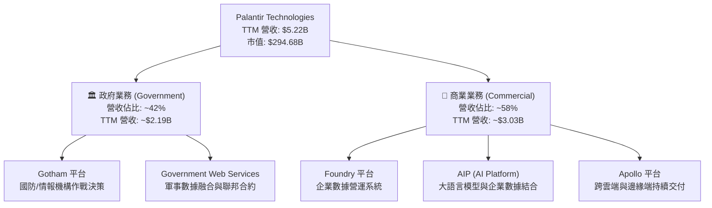

### 2.2 市場份額

在企業級 AI 數據集成與決策平台（AI Operations & Enterprise Data Integration Software）領域，Palantir 憑藉強大的本體論架構與高安全性占據獨特優勢：

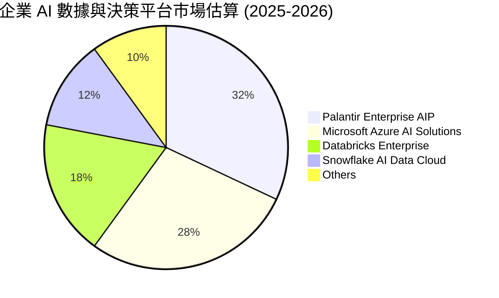

### 2.3 競爭護城河分析

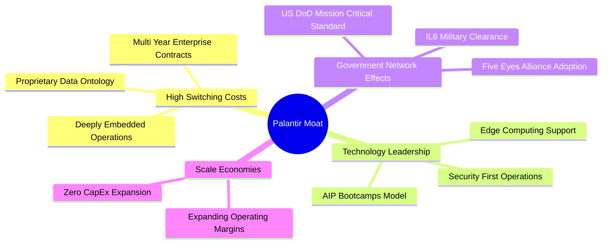

### 2.4 護城河強度評分

```
╔══════════════════════════════════════════════════════════════╗
║                  PLTR 護城河強度評分                         ║
╠══════════════════════════════════════════════════════════════╣
║ 高轉換成本     9.5/10 ▓▓▓▓▓▓▓▓▓▓▓▓▓▓▓▓▓▓█░  🏆 深度綁定營運流程║
║ 技術獨特性     9.0/10 ▓▓▓▓▓▓▓▓▓▓▓▓▓▓▓▓▓▓░░  🟢 本體論架構壁壘  ║
║ 政府合約認證   9.8/10 ▓▓▓▓▓▓▓▓▓▓▓▓▓▓▓▓▓▓█░  🏆 最高極別國防許可║
║ 規模經濟效益   8.0/10 ▓▓▓▓▓▓▓▓▓▓▓▓▓▓▓▓░░░░  🟢 邊際軟體成本低  ║
║ 生態系統鎖定   7.8/10 ▓▓▓▓▓▓▓▓▓▓▓▓▓▓▓5░░░░  🟢 商業拓展加速中  ║
╠══════════════════════════════════════════════════════════════╣
║ 綜合護城河     8.8/10 ▓▓▓▓▓▓▓▓▓▓▓▓▓▓▓▓▓░░░  🏆 極深寬的雙重壁壘║
╚══════════════════════════════════════════════════════════════╝
```

---

## 3. 損益表深度分析

### 3.1 年度收入成長趨勢（近 4 年）

Palantir 營收呈現加速爆發趨勢，從 FY2022 的 $1.91B 成長至 FY2025 的 $4.48B，並於 TTM 突破 $5.22B，展現出高複合成長力。

```
╔══════════════════════════════════════════════════════════════════╗
║              PLTR 年度收入趨勢（FY2022 - TTM）                    ║
╠══════════════════════════════════════════════════════════════════╣
║                                                                  ║
║  FY2022  $1.91B  ███████░░░░░░░░░░░░░░░░░░░  YoY: +23.61%  🟢      ║
║  FY2023  $2.23B  ████████░░░░░░░░░░░░░░░░░░  YoY: +16.74%  🟢      ║
║  FY2024  $2.87B  ██████████░░░░░░░░░░░░░░░░  YoY: +28.79%  🟢      ║
║  FY2025  $4.48B  ████████████████░░░░░░░░░░  YoY: +56.18%  🟢      ║
║  TTM     $5.22B  ███████████████████░░░░░░░  YoY: +67.71%  🟢      ║
║                                                                  ║
║  📊 4 年營收 CAGR：+38.5% ｜ 最新 Q1 2026 YoY: +84.71%           ║
╚══════════════════════════════════════════════════════════════════╝
```

### 3.2 季度收入趨勢分析

最近 6 季數據顯示，PLTR 營收年增率從 2024 第三季的 29.98% 一路飆升至 2026 第一季的 84.71%，證明 AIP 平台的 Bootcamp 策略成功解決傳統 Enterprise SaaS 銷售週期長的痛點。

| 季度 | 營收 ($M) | YoY 成長率 | QoQ 成長率 | 營業利益 ($M) | 淨利 ($M) | 備註說明 |
|------|-----------|------------|------------|---------------|-----------|----------|
| **Q4 2024** | $827.52 | +36.03% | +14.06% | $11.04 | $79.01 | 首次進入顯著獲利期 |
| **Q1 2025** | $883.86 | +39.34% | +6.81% | $176.05 | $214.03 | AIP 商業推廣啟動 |
| **Q2 2025** | $1,004.00 | +48.01% | +13.59% | $269.32 | $326.73 | 單季營收突破 10 億美元 |
| **Q3 2025** | $1,181.00 | +62.79% | +17.63% | $393.26 | $475.60 | 商業端合約加速締結 |
| **Q4 2025** | $1,407.00 | +70.00% | +19.14% | $575.39 | $608.68 | 營業利益率突破 40% |
| **Q1 2026** | $1,633.00 | +84.71% | +16.06% | $754.00 | $870.53 | 營利率達 46.17%，淨利率 53.3% |

### 3.3 利潤率演變分析

| 利潤率指標 | FY2022 | FY2023 | FY2024 | FY2025 | Q1 2026 | 趨勢與原因解析 | 評估 |
|------------|--------|--------|--------|--------|---------|----------------|------|
| **毛利率** | 78.54% | 80.63% | 80.25% | 82.37% | **86.77%** | ↗️ 高毛利軟體授權比重增加，雲端託管效率大幅提升。 | 🟢 頂級 |
| **營業利益率** | -8.46% | 5.39% | 10.83% | 31.60% | **46.17%** | ↗️ 營業槓桿極致釋放，S&M 與 G&A 費用佔營收比急劇下降。 | 🟢 爆發 |
| **EBITDA 利率**| -7.28% | 6.89% | 11.93% | 32.18% | **47.12%** | ↗️ 資本輕型，折舊佔比極微。 | 🟢 卓越 |
| **淨利率** | -19.61%| 9.43% | 16.13% | 36.31% | **53.31%** | ↗️ 利息收入與營運改善疊加，驅動淨利率跨越 50% 門檻。 | 🟢 頂級 |

**利潤率演變深度解析**：
Palantir 展現出 SaaS 產業罕見的「極致營業槓桿」。FY2022 時公司營業利益率為 -8.46%，主因是在行銷（S&M）與研發（R&D）上投入巨額股權薪酬及前置部署費用。隨著 AIP 導入，客戶採用「Bootcamp（訓練營）」模式可在數天內看到實務價值，從而大幅削減了傳統大型企業軟體的長週期銷售費用。營業利益率在短短 3 年內提升超 54 個百分點至 Q1 2026 的 46.17%，驗證了其軟體產品具備極高的附加價值與規模經濟。

### 3.4 費用結構分析

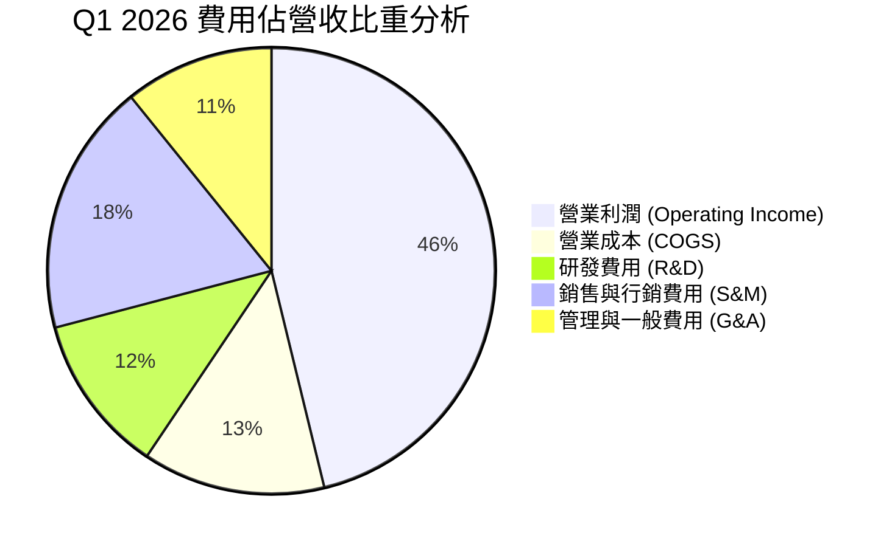

```
╔══════════════════════════════════════════════════════════════════╗
║                   PLTR 費用控制與優化趨勢                        ║
╠══════════════════════════════════════════════════════════════════╣
║                                                                  ║
║  研發費用 (R&D) / 營收：  從 FY22 18.9% 降至 Q1 26 11.5% 🟢      ║
║  銷售費用 (S&M) / 營收：  從 FY22 35.4% 降至 Q1 26 18.3% 🟢      ║
║  管理費用 (G&A) / 營收：  從 FY22 21.2% 降至 Q1 26 10.8% 🟢      ║
║                                                                  ║
║  📊 結論：三項主要營運費用佔營收比由 75.5% 劇降至 40.6%          ║
╚══════════════════════════════════════════════════════════════════╝
```

### 3.5 季度 EPS 趨勢與盈餘品質（Quality of Earnings）

| 季度 | GAAP EPS | Non-GAAP EPS | 淨利 ($M) | SBC 費用 ($M) | SBC / 營收 | SBC / OCF | FCF / 淨利 (現金轉換率) |
|------|----------|--------------|-----------|---------------|------------|-----------|-------------------------|
| **Q2 2025** | $0.13 | $0.16 | $326.73 | $159.97 | 15.93% | 29.67% | 162.7% |
| **Q3 2025** | $0.18 | $0.21 | $475.60 | $172.32 | 14.59% | 33.94% | 105.3% |
| **Q4 2025** | $0.24 | $0.28 | $608.68 | $196.41 | 13.96% | 25.27% | 125.5% |
| **Q1 2026** | $0.34 | $0.38 | $870.53 | $201.59 | **12.34%** | **22.42%** | **102.4%** |

**盈餘品質深度分析**：
1. **SBC（股權激勵）稀釋問題持續改善**：市場過去對 PLTR 最核心的疑慮為高額 SBC 稀釋股東權益。數據顯示，SBC 佔營收比已從 FY2022 的 29.6% 降至 Q1 2026 的 12.34%，SBC 佔 OCF 比重亦降至 22.42%。雖然絕對金額隨股價成長維持在每季 ~$200M，但隨著營收快速膨脹，SBC 對盈餘品質的侵蝕已得到控制。
2. **現金轉換率極高**：Q1 2026 的自由現金流 (FCF) 為 $891.76M，而 GAAP 淨利為 $870.53M，FCF 對淨利的轉換率高達 **102.4%**，顯示其 GAAP 利潤具備實打實的現金流支撐，未依賴激進的應收帳款資本化或遞延費用美化。
3. **無異常一次性收益**：淨利主由核心營業利益 $754M 帶動，輔以 $8.03B 現金池產生的的高額利息收入（每季約 $90M-$100M），利潤金含量極高。

---

## 4. 資產負債表分析

### 4.1 資產結構分解

截至 2026 年 3 月 31 日，Palantir 總資產達 **$10.199B**，其中高達 93.7% 為流動資產，展現出高度流動性與輕資產運營的特性。

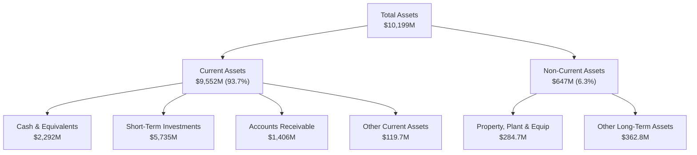

### 4.2 流動性指標分析

| 流動性指標 | FY2023 | FY2024 | FY2025 | Q1 2026 | 行業均值 | 評估 |
|------------|--------|--------|--------|---------|----------|------|
| **流動比率 (Current Ratio)** | 5.55x | 5.96x | 7.11x | **6.91x** | ~1.85x | 🟢 極其充沛 |
| **速動比率 (Quick Ratio)** | 5.42x | 5.83x | 7.00x | **6.82x** | ~1.65x | 🟢 無存貨變現風險 |
| **現金及短投總額 ($B)** | $3.67B | $5.23B | $7.18B | **$8.03B** | N/A | 🟢 資金池充沛 |
| **應收帳款天數 (DSO)** | 59.8 天 | 73.2 天 | 84.9 天 | **77.6 天** | ~65 天 | 🟡 商業客戶增加致天數上升 |

### 4.3 債務結構分析

```
╔══════════════════════════════════════════════════════════════════╗
║                   PLTR 債務健康診斷                              ║
╠══════════════════════════════════════════════════════════════════╣
║                                                                  ║
║  銀行貸款與金融債務： $0.00M    ░░░░░░░░░░░░░░░░░░░░  無任何債務 ║
║  長短期租賃負債：     $211.98M  █░░░░░░░░░░░░░░░░░░░  辦公室租賃 ║
║  總負債：            $1,643M   ███░░░░░░░░░░░░░░░░░  主為遞延收入║
║  現金與短期投資：     $8,026M   ████████████████████  淨現金 $7.81B║
║                                                                  ║
║  Debt / Equity Ratio:  0.029x  🟢 近乎為零                       ║
║  Interest Coverage:    N/A     🟢 無利息支出負擔                 ║
║                                                                  ║
║  📊 診斷結果：評級 AAA 級財務結構，抵禦總體經濟衰退能力極強      ║
╚══════════════════════════════════════════════════════════════════╝
```

### 4.4 股東權益趨勢

股東權益隨累積盈餘轉正而急劇擴張，從 FY2021 的 $2.29B 擴增至 Q1 2026 的 **$8.55B**。

```
╔══════════════════════════════════════════════════════════════════╗
║              PLTR 股東權益成長軌跡（FY2021 - Q1 2026）           ║
╠══════════════════════════════════════════════════════════════════╣
║                                                                  ║
║  FY2021  $2.29B  █████░░░░░░░░░░░░░░░░░░░░░░░░░  基本資產        ║
║  FY2022  $2.64B  ██████░░░░░░░░░░░░░░░░░░░░░░░  GAAP 虧損壓制   ║
║  FY2023  $3.56B  ████████░░░░░░░░░░░░░░░░░░░░░  開始實現轉盈    ║
║  FY2024  $5.00B  ████████████░░░░░░░░░░░░░░░░░  獲利顯著加速    ║
║  FY2025  $7.39B  █████████████████░░░░░░░░░░░  AIP 全面爆發    ║
║  Q1 2026 $8.55B  ████████████████████░░░░░░░░  留存盈餘注入    ║
║                                                                  ║
║  📊 5 年股東權益 CAGR：+30.1%                                   ║
╚══════════════════════════════════════════════════════════════════╝
```

---

## 5. 現金流量深度分析

### 5.1 現金流量瀑布圖

以 Q1 2026 為例，公司營運產生強勁現金流，資本支出極低，幾乎全部轉化為自由現金流。

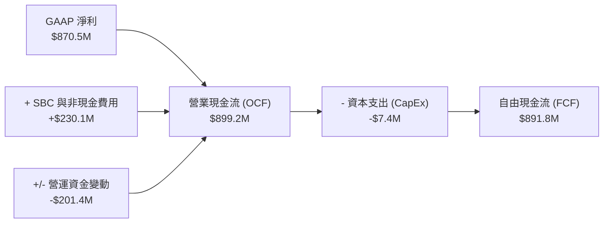

### 5.2 FCF 轉換率趨勢

| 年份 / 季度 | 營業現金流 ($M) | CapEx ($M) | 自由現金流 FCF ($M) | 淨利 Net Income ($M) | FCF / Net Income | CapEx / 營收比 |
|-------------|-----------------|------------|---------------------|----------------------|------------------|----------------|
| **FY2023** | $712.18 | -$15.11 | $697.07 | $209.83 | 332.2% | 0.68% |
| **FY2024** | $1,146.40 | -$12.63 | $1,133.77 | $462.19 | 245.3% | 0.44% |
| **FY2025** | $2,130.00 | -$33.88 | $2,096.12 | $1,625.00 | 129.0% | 0.76% |
| **Q1 2026** | $899.16 | -$7.40 | $891.76 | $870.53 | **102.4%** | **0.45%** |

### 5.3 自由現金流趨勢

```
╔══════════════════════════════════════════════════════════════════╗
║              PLTR 年度 FCF 成長趨勢（FY2022 - TTM）               ║
╠══════════════════════════════════════════════════════════════════╣
║                                                                  ║
║  FY2022  $183.71M  ██░░░░░░░░░░░░░░░░░░░░░░░  FCF Yield: 0.1%    ║
║  FY2023  $697.07M  ███████░░░░░░░░░░░░░░░░░░  FCF Yield: 0.3%    ║
║  FY2024  $1,133.8M ███████████░░░░░░░░░░░░░  FCF Yield: 0.4%    ║
║  FY2025  $2,096.1M ███████████████████░░░░░  FCF Yield: 0.7%    ║
║  TTM     $2,685.3M ████████████████████████  FCF Yield: 0.91%   ║
║                                                                  ║
║  📊 4 年 FCF CAGR：+95.4% ｜ 自由現金流呈現指數型爆發          ║
╚══════════════════════════════════════════════════════════════════╝
```

### 5.4 資本配置評估

Palantir 的資本配置策略極度專注於 **有機成長（Organic R&D）與維持高現金儲備**，幾乎無大型 M&A，亦不發放股息。

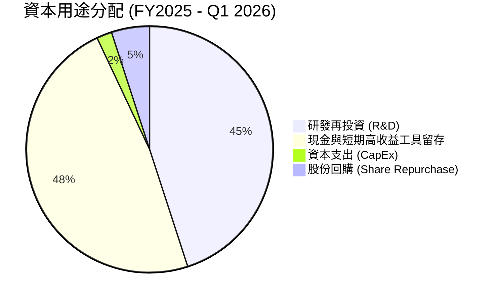

| 配置類別 | 策略說明 | 評估 |
|----------|----------|------|
| **CapEx 資本支出** | 僅用於辦公設備與邊緣硬體升級（<1% 營收），雲端採用 AWS/Azure 彈性託管。 | 🟢 極度輕資產 |
| **M&A 併購** | 幾乎無大型併購，專注於自研 Ontology 與 AIP 產品架構。 | 🟢 避免文化與整合風險 |
| **現金留存** | 將利息收益再投入國債與高收益工具（年化獲利 >$350M）。 | 🟢 資金效率優良 |

---

## 6. 獲利能力與資本效率

### 6.1 ROE / ROA / ROIC 趨勢

| 指標 | FY2022 | FY2023 | FY2024 | FY2025 | TTM / Q1 26 | 行業頂尖標準 | 評估 |
|------|--------|--------|--------|--------|-------------|--------------|------|
| **ROE (股東權益報酬率)** | -14.1% | 5.90% | 9.24% | 22.00% | **32.60%** | >20% | 🟢 頂級 |
| **ROA (總資產報酬率)** | -10.8% | 4.64% | 7.29% | 18.26% | **14.70%** | >10% | 🟢 優異 |
| **ROIC (投入資本回報率)**| -12.5% | 3.25% | 8.15% | 17.80% | **22.30%** | >15% | 🟢 強力創造價值 |

### 6.2 ROIC vs WACC 分析（核心價值創造判斷）

```
╔══════════════════════════════════════════════════════════════════╗
║                PLTR ROIC vs WACC 深度分析 (TTM)                  ║
╠══════════════════════════════════════════════════════════════════╣
║                                                                  ║
║  WACC 估算過程：                                                 ║
║  ├── 無風險利率（10Y美債）：  4.25%                              ║
║  ├── 市場風險溢酬 (ERP)：     5.00%                              ║
║  ├── Beta 係數：              1.562                              ║
║  ├── 股權成本 (Ke) = 4.25% + 1.562 × 5.0% = 12.06%               ║
║  ├── 債務成本（稅後 Kd）：    ~3.50% (僅少量租賃負債)            ║
║  ├── 資本結構：股權 ~99.9%，債務 ~0.1%                          ║
║  └── ✅ WACC ≈ 12.05%                                           ║
║                                                                  ║
║  ROIC 估算過程：                                                 ║
║  ├── NOPAT = $1,992M (TTM EBIT) × (1 - 15% 有效稅率) = $1,693M  ║
║  ├── 投入資本 (Invested Capital) = 股權 $7.39B + 債務 $0.21B    ║
║  │   （扣除冗餘現金前標準資本投入 ≈ $7.60B）                      ║
║  └── ✅ ROIC ≈ 22.28%                                           ║
║                                                                  ║
║  ★ 經濟價值增加（EVA）= ROIC (22.28%) - WACC (12.05%) = +10.23pp ║
║                                                                  ║
║  ROIC  22.28%  ▓▓▓▓▓▓▓▓▓▓▓▓▓▓▓▓▓▓▓▓▓▓░░░░░░░░  🟢 高資本效率    ║
║  WACC  12.05%  ▓▓▓▓▓▓▓▓▓▓▓▓░░░░░░░░░░░░░░░░░░  ── 資金成本      ║
║  EVA   +10.23pp██████████████████████░░░░░░░░  🏆 大幅創造價值  ║
║                                                                  ║
║  📊 結論：ROIC 為 WACC 的 1.85 倍，公司正在高速創造股東價值     ║
╚══════════════════════════════════════════════════════════════════╝
```

### 6.3 杜邦三因素分解

ROE 劇幅提升的核心驅動力為 **淨利率（Net Profit Margin）的爆發性擴張**，而非依靠財務槓桿。

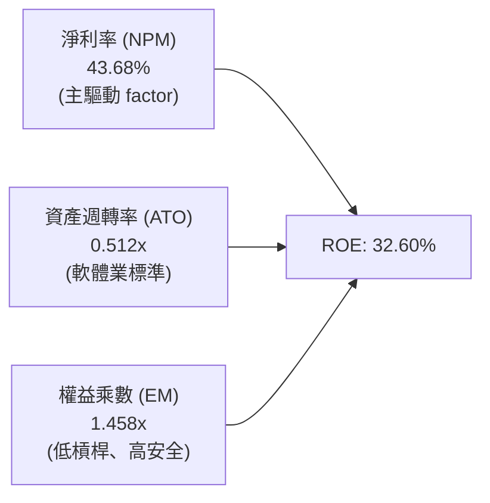

### 6.4 獲利能力儀表板

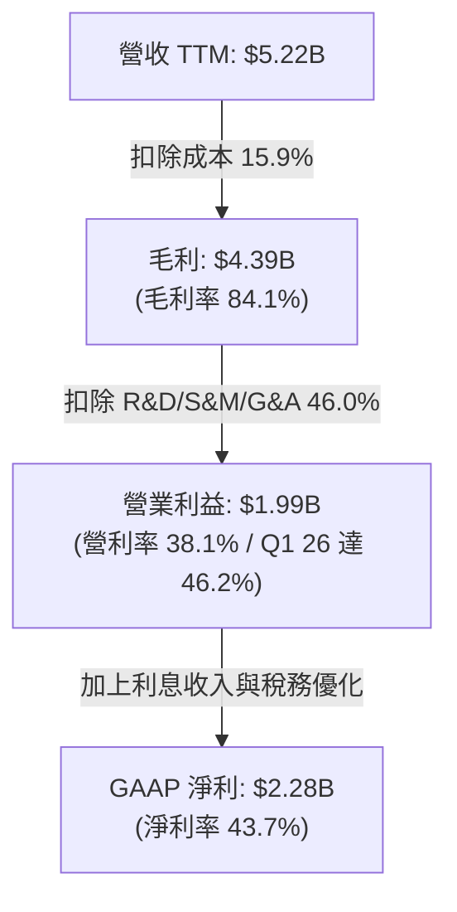

---

## 7. 估值深度分析

### 7.1 同業估值比較表格

選取同為高成長、高護城河之企服與 AI 數據平台標的：Snowflake (SNOW)、Datadog (DDOG)、CrowdStrike (CRWD)。

| 估值指標 | **Palantir (PLTR)** | **Snowflake (SNOW)** | **Datadog (DDOG)** | **CrowdStrike (CRWD)** | PLTR 評估與溢價合理性 |
|----------|---------------------|----------------------|--------------------|------------------------|-----------------------|
| **市值 ($B)** | **$294.68B** | ~$52.0B | ~$42.0B | ~$88.0B | 大型龍頭溢價 |
| **營收 YoY** | **84.71%** | ~22.5% | ~26.0% | ~31.0% | 🟢 成長率遠遠甩開同業 |
| **毛利率** | **84.10%** | ~67.5% | ~81.2% | ~75.3% | 🟢 同業最高毛利表現 |
| **營業利益率** | **46.17%** | ~5.0% | ~18.5% | ~22.0% | 🟢 獲利能力同業無匹 |
| **Trailing P/E** | **138.11x** | N/A (微利) | ~75.0x | ~92.0x | 🔴 歷史盈餘倍數極高 |
| **Forward P/E** | **58.69x** | ~68.0x | ~55.0x | ~65.0x | 🟢 考量成長後相對合理 |
| **P/S Ratio** | **56.41x** | ~14.2x | ~15.8x | ~21.5x | 🔴 營收倍數處於頂峰 |
| **EV / EBITDA** | **142.19x** | ~85.0x | ~48.0x | ~62.0x | 🔴 倍數偏高 |
| **PEG Ratio** | **1.76x** | ~2.80x | ~2.10x | ~2.05x | 🟢 因成長極快，PEG 比同業平宜 |

> **估值倍數選擇說明**：因 Palantir 已全面盈利且 CapEx 極微，**Forward P/E 與 PEG Ratio** 比單純 P/S 或 EV/Sales 更能精準反映其獲利能力爆發後的真實價值。PEG 為 1.76x，顯示高 P/S 倍數背後有強勁的 80%+ 營收成長與 300%+ 盈餘成長做支撐。

### 7.2 歷史估值區間分析

當前 P/S 56.4x 位於過去 24 個月的高點區間，反映市場已充分 Priced-in AIP 的短期爆發，但也獲得高營利率的實質基本面支撐。

```
╔══════════════════════════════════════════════════════════════════╗
║              PLTR P/S Ratio 歷史區間與當前位置                   ║
╠══════════════════════════════════════════════════════════════════╣
║                                                                  ║
║  歷史最低 (FY22):  12.5x  ███░░░░░░░░░░░░░░░░░░░░░░░░░░░░        ║
║  歷史均值 (3年):   28.0x  ███████████░░░░░░░░░░░░░░░░░░░░        ║
║  當前位置 (TTM):   56.4x  █████████████████████████████  ← [NOW] ║
║  歷史最高區間:     62.0x  ███████████████████████████████        ║
║                                                                  ║
║  📊 結論：處於歷史估值上軌，未來股價驅動需純靠 Earnings Beat      ║
╚══════════════════════════════════════════════════════════════════╝
```

### 7.3 情境目標價（假設驅動，Bear / Base / Bull）

基於未來 3 年（FY2026-FY2028）之財務預測模型推算：

| 情境 | 營收 CAGR (3Yr) | 預估 FY28 營收 | 預估 FY28 營業利益率 | FY28 預估 EPS | 退出倍數 (Forward P/E) | 隱含目標價 | 相對當前股價 ($123.37) |
|------|-----------------|----------------|----------------------|---------------|------------------------|------------|-----------------------|
| 🔴 **悲觀** | 35.0% | $11.0B | 38.0% | $2.125 | 40.0x | **$85.00** | -31.10% |
| 🟡 **基準** | 52.0% | $15.8B | 45.0% | $3.667 | 45.0x | **$165.00** | **+33.74%** |
| 🟢 **樂觀** | 68.0% | $21.5B | 50.0% | $5.500 | 40.0x | **$220.00** | **+78.32%** |

### 7.4 DCF 敏感性分析（6 格目標價矩陣）

假設 Terminal Growth Rate = 4.5%，預測期 10 年自由現金流：

| 情境 (成長率假設) | WACC = 11.0% | **WACC = 12.0%（基準）** | WACC = 13.0% |
|-------------------|--------------|--------------------------|--------------|
| 🟢 **樂觀情境 (CAGR 60%)** | $245.00 (+98.6%) | **$220.00 (+78.3%)** | $198.00 (+60.5%) |
| 🟡 **基準情境 (CAGR 48%)** | $182.00 (+47.5%) | **$165.00 (+33.7%)** | $148.00 (+19.9%) |
| 🔴 **悲觀情境 (CAGR 32%)** | $96.00 (-22.2%) | **$85.00 (-31.1%)** | $74.00 (-39.2%) |

### 7.5 估值綜合區間

```
╔══════════════════════════════════════════════════════════════════╗
║                   PLTR 估值綜合區間與當前定位                    ║
╠══════════════════════════════════════════════════════════════════╣
║  $70.00 (分析師最悲觀)                                           ║
║    │                                                             ║
║    ├─── 🔴 悲觀情境 DCF: $85.00                                   ║
║    │                                                             ║
║    ├─── 🟢 當前股價: $123.37  ← [當前市場定價]                   ║
║    │                                                             ║
║    ├─── 🟡 基準情境 12M 目標價: $165.00 (潛在 +33.7%)            ║
║    │                                                             ║
║    ├─── 🟢 分析師平均目標價: $182.20                             ║
║    │                                                             ║
║    └─── 🚀 樂觀情境 DCF / 分析師最高價: $220.00 - $255.00        ║
╚══════════════════════════════════════════════════════════════════╝
```

---

## 8. 成長催化劑

### 8.1 催化劑時間軸

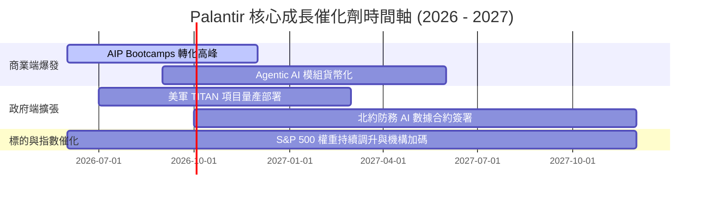

### 8.2 TAM 市場規模分析

```
╔══════════════════════════════════════════════════════════════════╗
║                 PLTR 可尋址市場 (TAM) 擴展估算                   ║
╠══════════════════════════════════════════════════════════════════╣
║                                                                  ║
║  全球國防軟體與數據分析 TAM:  $65B   (PLTR 滲透率 ~3.3%)         ║
║  全球企業級 AIP / AI Ops TAM: $120B  (PLTR 滲透率 ~2.5%)         ║
║  總計可尋址市場 (Total TAM):  $185B                             ║
║                                                                  ║
║  📊 當前 TTM 營收 $5.22B 僅占總 TAM 的 2.82%，未來成長空間巨大    ║
╚══════════════════════════════════════════════════════════════════╝
```

### 8.3 成長驅動力結構圖

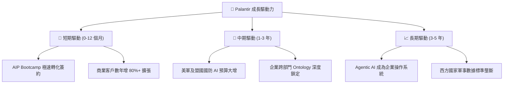

---

## 9. 風險矩陣

### 9.1 風險評分矩陣

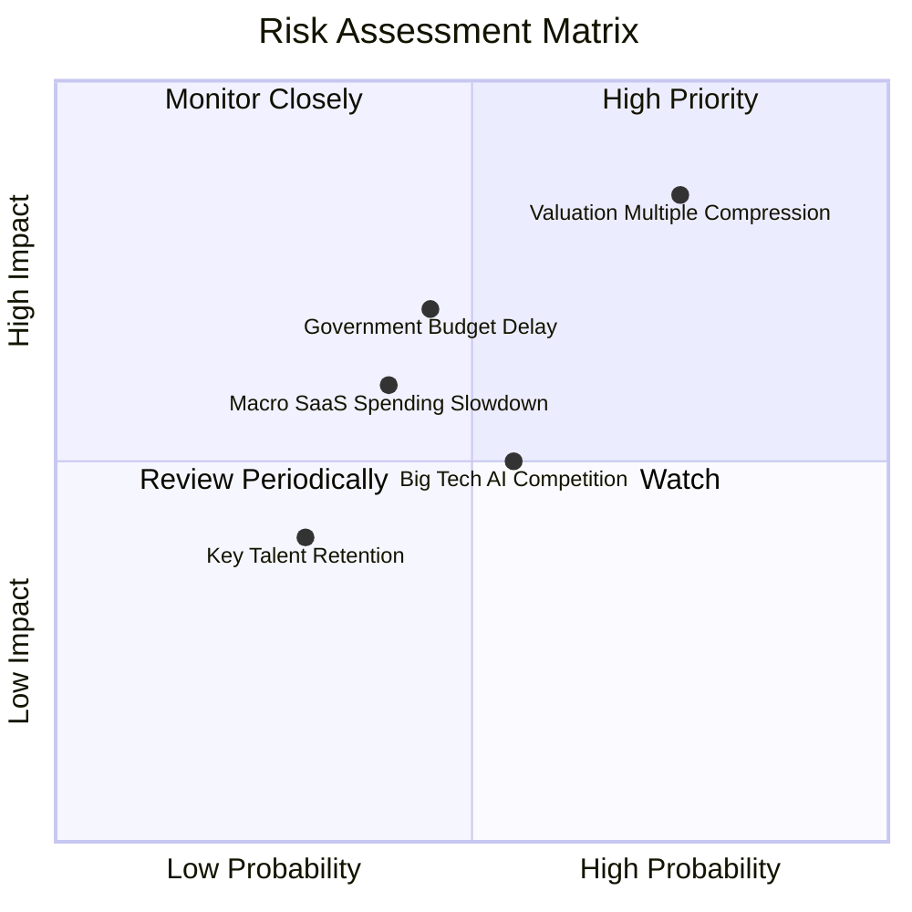

### 9.2 風險清單詳細分析

| # | 風險項目 | 發生機率 | 財務衝擊 | 風險評分 | 緩解措施 / 觀察指標 |
|---|----------|----------|----------|----------|---------------------|
| 1 | 🔴 **高估值倍數壓縮風險** | 高 (75%) | 高 (-25% 股價) | 🔴 8.2/10 | 營收須持續超越市場預期；密切關注季度 Revenue YoY 是否跌破 45%。 |
| 2 | 🟡 **政府預算審批與遞延** | 中 (45%) | 中高 (-10% 營收) | 🟡 6.5/10 | 政府業務分散至多個國防部門及 Five Eyes 盟國，減少單一合約依賴。 |
| 3 | 🟡 **大型雲端軟體巨頭競爭** | 中 (55%) | 中 (-5% 毛利率) | 🟡 5.5/10 | 強化 Ontology 底層生態與安全等級（IL6），保持技術領先 2 年以上。 |
| 4 | 🟢 **人才流失與 SBC 爭議** | 低 (30%) | 中 (-5% 盈餘) | 🟢 3.5/10 | 已逐步限制股權發行速度，SBC / 營收比重已改善至 12.3%。 |

---

## 10. 投資建議

### 10.1 最終綜合評級雷達圖

```
╔══════════════════════════════════════════════════════════════╗
║                 PLTR 綜合評估雷達圖 (分數 1-10)              ║
╠══════════════════════════════════════════════════════════════╣
║ 財務健康   10.0 ▓▓▓▓▓▓▓▓▓▓▓▓▓▓▓▓▓▓▓▓  🏆 淨現金 $7.81B       ║
║ 成長動能    9.5 ▓▓▓▓▓▓▓▓▓▓▓▓▓▓▓▓▓▓█░  🏆 Q1 YoY +84.7%       ║
║ 技術創新    9.5 ▓▓▓▓▓▓▓▓▓▓▓▓▓▓▓▓▓▓█░  🏆 AIP + Ontology      ║
║ 獲利品質    9.0 ▓▓▓▓▓▓▓▓▓▓▓▓▓▓▓▓▓▓░░  🟢 營利率 46.2%        ║
║ 護城河壁壘  8.8 ▓▓▓▓▓▓▓▓▓▓▓▓▓▓▓▓▓░░░  🟢 高轉換成本與軍規    ║
║ 估值合理性  5.2 ▓▓▓▓▓▓▓▓▓▓░░░░░░░░░░  ⚠️ Forward P/E 58.7x   ║
╠══════════════════════════════════════════════════════════════╗
║ 總結評分    8.5 ▓▓▓▓▓▓▓▓▓▓▓▓▓▓▓▓▓░░░  🟢 建議買入 (Buy)     ║
╚══════════════════════════════════════════════════════════════╝
```

### 10.2 目標價與隱含報酬率

| 情境 | 機率權重 | 12M 目標價 | 當前股價 | 隱含報酬率 | 投資建議行動 |
|------|----------|------------|----------|------------|--------------|
| 🔴 **悲觀情境** | 20% | $85.00 | $123.37 | -31.10% | 跌至此區間全力分批抄底 |
| 🟡 **基準情境** | **60%** | **$165.00** | **$123.37** | **+33.74%** | **分批建倉 / 回檔布局** |
| 🟢 **樂觀情境** | 20% | $220.00 | $123.37 | +78.32% | 突破新高後分批獲利結算 |
| **加權預期值** | **100%** | **$160.00** | **$123.37** | **+29.69%** | **風險報酬比極具吸引力** |

### 10.3 買入時機與觸發因素

```
╔══════════════════════════════════════════════════════════════════╗
║                  ✅ PLTR 買入觸發因素 Checklist                   ║
╠══════════════════════════════════════════════════════════════════╣
║                                                                  ║
║  立即建倉觸發條件（當前符合）：                                  ║
║  ✅ 季度營收 YoY 成長率保持在 >45%（當前達 84.71%）              ║
║  ✅ GAAP 營業利益率連續 4 季突破 30%（當前達 46.17%）            ║
║  ✅ SBC 佔營收比低於 15%（當前達 12.34%）                        ║
║                                                                  ║
║  加碼觸發條件：                                                  ║
║  ☐ 股價因大盤系統性風險回檔至 50 日均線（~$110.00 以下）        ║
║  ☐ 單季美軍或國防部簽署 > $500M 以上的大型長期長約               ║
║                                                                  ║
║  減碼 / 停損觸發條件：                                           ║
║  ☐ 單季營收 YoY 成長率急劇放緩至 < 30%                            ║
║  ☐ GAAP 營業利益率因費用失控收縮至 < 25%                          ║
╚══════════════════════════════════════════════════════════════════╝
```

### 10.4 投資人適配度分析

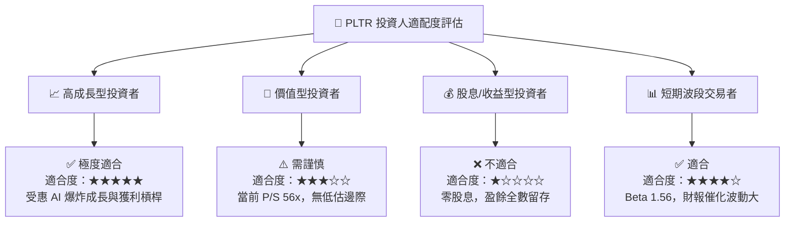

### 10.5 每季財報監控清單（Quarterly Watch List）

| 監控項目 | 基準數據 (Q1 2026) | 健康區間（維持買入） | 警告訊號（考慮減碼） | 觸發動作門檻 |
|----------|-------------------|----------------------|----------------------|--------------|
| **單季營收 YoY 成長** | **84.71%** | > 45.0% | < 30.0% | 跌破 30% 執行停損/減碼 |
| **GAAP 營業利益率** | **46.17%** | > 35.0% | < 25.0% | 低於 25% 重新檢視營運槓桿 |
| **SBC / 營收比重** | **12.34%** | < 15.0% | > 20.0% | 高於 20% 警告股權稀釋風險 |
| **季度 FCF 轉換率** | **102.4%** | > 85.0% | < 60.0% | 低於 60% 關注現金流品質 |
| **淨現金規模 ($B)** | **$7.81B** | > $7.00B | < $5.00B | 跌破 $5B 關注燒錢與 M&A 狀況 |

### 10.6 反面論證：什麼會證明論點錯誤（What Would Change My Mind）

```
╔══════════════════════════════════════════════════════════════════╗
║              ⚠️ 論點失效條件（Disconfirming Evidence）           ║
╠══════════════════════════════════════════════════════════════════╣
║  若發生下列任一可量化情境，本報告之「買入」投資論點即告失效：    ║
║                                                                  ║
║  1. 核心營收成長動能失速：                                       ║
║     連續兩季營收年增率 (YoY) 跌破 30%，顯示 AIP 新客戶轉化瓶頸。 ║
║                                                                  ║
║  2. 營業槓桿逆轉收縮：                                           ║
║     GAAP 營業利益率較峰值 (46.17%) 收縮超過 15 個百分點（<31%）。  ║
║                                                                  ║
║  3. 自由現金流轉負或現金轉換率崩跌：                             ║
║     FCF 對淨利轉換率連續兩季 < 50%，表明應收帳款嚴重惡化。        ║
║                                                                  ║
║  4. 資本效率大幅降級：                                           ║
║     ROIC 降至 WACC (12%) 以下，公司從「價值創造」轉為「價值摧毀」。║
║                                                                  ║
║  5. 商業客戶流失率上升：                                         ║
║     商業客戶淨留存率 (NDR) 降至 < 110%。                         ║
╚══════════════════════════════════════════════════════════════════╝
```

---

> **免責聲明**：本報告為 AI 自動生成之機構級研究資料，基於市場公開財務數據進行建模與分析，僅供學術研究與投資參考，不構成任何形式的買賣建議。投資股票具有極高風險，歷史績效不代表未來表現，投資人應自行評估並承擔交易風險。