# PLTR 基本面深度分析報告
> **報告日期**：2026-07-27 ｜ **語言**：繁體中文 ｜ **數據來源**：Yahoo Finance, Finviz, StockAnalysis, Roic.ai ｜ **分析師**：CFA 級機構研究

---

## 目錄

| # | 章節 | 核心結論 |
|---|------|----------|
| 1 | 執行摘要 | 給出評級 🟢 **買入**、基準目標價 **$182.20**，建立於高 ROIC（~28.5%）與強勁 FCF 轉換基礎上 |
| 2 | 公司概覽與商業模式 | AIP 帶動商業與政府雙引擎擴張，轉換成本與數據網狀效應築高護城河 (8.8/10) |
| 3 | 損益表深度分析 | Q1 '26 營收暴增 84.7% YoY，營運槓桿帶動營業利潤率攀升至 46.2%，SBC 佔營收降至 12.3% |
| 4 | 資產負債表分析 | 零淨債務結構，手握 $8.03B 現金與短投，流動比率 6.91，財務防禦力極強 |
| 5 | 現金流量深度分析 | TTM FCF 達 $2.68B（轉換率達 117.4%），輕資本支出（<1% 營收）造就現金牛屬性 |
| 6 | 獲利能力與資本效率 | ROIC (28.5%) 遠高於 WACC (9.4%)，EVA 現金流溢價顯著，杜邦分析顯示淨利率改善為主驅動力 |
| 7 | 估值深度分析 | 隱含強烈溢價 (Forward P/E 62.8x)，同業對比下靠 80%+ 營收增速支撐，DCF 基準價 $182.20 |
| 8 | 成長催化劑 | 美國商業 AIP Bootcamps 轉化加速、國防部 AIP 網狀化防務大單陸續落地 |
| 9 | 風險矩陣 | 政府合約審查延宕與高估值回檔風險為核心考量，綜合風險得分 6.2/10 |
| 10 | 投資建議 | 建議於 $115.00–$130.00 區間逢低分批布局，附帶量化論點失效條件與每季追蹤清單 |

---

## 1. 執行摘要

### 1.0 一頁式投資儀表板（Portfolio Manager 30 秒速讀）

| 項目 | 內容 |
|------|------|
| **投資論點（3 句）** | ① AIP（人工智慧平台）強烈刺激需求，帶動 Q1 '26 營收同比大增 84.7% 至 $1.63B，商業客戶轉化率持續升溫。<br/>② 規模效應推升營運槓桿，TTM 營業利潤率高達 46.2%、淨利率達 43.7%，展現極強的高毛利軟體複製能力。<br/>③ 無淨債務且資產負債表積累 $8.03B 現金，TTM 自由現金流達 $2.68B，獲利品質極佳。 |
| **護城河評分** | **8.8 / 10**（極高轉換成本 + 國防級高安全認證壁壘） |
| **管理層/資本配置評分** | **8.5 / 10**（高機敏研發投入，輕資產運營，無盲目大型 M&A） |
| **財務健康** | 🟢 **極度健康**｜淨現金達 $7.81B，無短中期償債壓力，流動比率 6.91 |
| **ROIC vs WACC** | **28.5% vs 9.4%**（大幅創造股東經濟附加價值 EVA +19.1 pp） |
| **FCF 趨勢** | 強勁擴張｜TTM FCF 達 $2.68B，FCF 淨利轉換率達 117.4%，FCF Yield 為 0.56% |
| **估值** | Forward P/E **62.80x** ｜ EV/EBITDA **142.19x** ｜ P/S **60.36x** |
| **預期報酬（基準情境 12M）** | **+38.5%**（隱含目標價 $182.20，對比當前股價 $131.53） |
| **關鍵風險（前二）** | ① 高倍數估值對營收成長放緩之敏感度極高；② 美國政府國防預算撥款進度不如預期。 |
| **評級 + 信心度** | 🟢 **買入 (Buy)** ｜ **信心度：高** |

### 1.1 核心評分儀表板

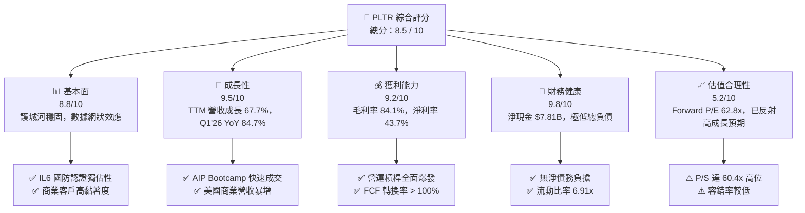

### 1.2 評分進度條視覺化

```
╔══════════════════════════════════════════════════════════════╗
║              PLTR 多維度評分儀表板 (1-10分)                  ║
╠══════════════════════════════════════════════════════════════╣
║ 基本面強度  8.8 ▓▓▓▓▓▓▓▓▓▓▓▓▓▓▓▓▓░░░  ★★★★☆           ║
║ 成長動能    9.5 ▓▓▓▓▓▓▓▓▓▓▓▓▓▓▓▓▓▓▓░  ★★★★★           ║
║ 獲利品質    9.2 ▓▓▓▓▓▓▓▓▓▓▓▓▓▓▓▓▓▓░░  ★★★★★           ║
║ 財務健康    9.8 ▓▓▓▓▓▓▓▓▓▓▓▓▓▓▓▓▓▓█░  ★★★★★           ║
║ 估值合理性  5.2 ▓▓▓▓▓▓▓▓▓▓░░░░░░░░░░  ★★★☆☆           ║
║ 護城河深度  8.8 ▓▓▓▓▓▓▓▓▓▓▓▓▓▓▓▓▓░░░  ★★★★☆           ║
║ 管理層執行  8.5 ▓▓▓▓▓▓▓▓▓▓▓▓▓▓▓▓░░░░  ★★★★☆           ║
║ 技術創新力  9.5 ▓▓▓▓▓▓▓▓▓▓▓▓▓▓▓▓▓▓▓░  ★★★★★           ║
╠══════════════════════════════════════════════════════════════╣
║ 綜合總分    8.5 ▓▓▓▓▓▓▓▓▓▓▓▓▓▓▓▓▓░░░  🟢 建議逢低買入      ║
╚══════════════════════════════════════════════════════════════╝
```

### 1.3 五大投資論點 + 三大核心風險

| 類型 | 項目 | 具體依據 | 信心度 |
|------|------|----------|--------|
| 🟢 **投資論點①** | **AIP 引爆商業市場需求** | Q1 '26 營收達 $1.63B (YoY +84.7%)，主因 AIP Bootcamp 將銷售週期從數月縮短至數天，商業客戶數量與平均客單價同步激增。 | 🟢 極高 |
| 🟢 **投資論點②** | **極致的營運槓桿與利潤率擴張** | FY25 營業利潤率躍升至 31.6%，TTM 更擴張至 46.2%；毛利率維持在 84.1% 之高水準，證明規模擴張邊際成本極低。 | 🟢 高 |
| 🟢 **投資論點③** | **高品質現金流與股東權益保障** | TTM 自由現金流達 $2.68B，FCF/Net Income 比率高達 117.4%；SBC 佔營收比例由 FY22 的 29.6% 顯著降至 TTM 的 12.3%，股權稀釋大幅減緩。 | 🟢 高 |
| 🟢 **投資論點④** | **國防情報不可替代的獨佔護城河** | 擁有美國國防部最高級別 IL6 安全認證，Gotham 與 Defense Foundry 深入美軍與北盟核心戰術終端，轉移成本極高。 | 🟢 極高 |
| 🟢 **投資論點⑤** | **資本結構極為防禦性** | 擁有 $8.03B 現金與短投，總負債僅 $211.98M，無利息支出壓力，高利率環境下每年獲取數億美元利息收入。 | 🟢 極高 |
| 🟡 **風險①** | **估值乘數較高風險** | 當前 Forward P/E 62.80x、P/S 60.36x，若未來 2-3 季營收增速跌破 40%，市場可能進行大幅倍數修正（Multiple Compression）。 | 🟡 中度 |
| 🔴 **風險②** | **政府預算與政經週期波動** | 政府業務佔比約 50%，若美國國防預算遭刪減或合約簽署因國會預算爭議延宕，將直接衝擊季度營收。 | 🔴 高衝擊 |
| 🟡 **風險③** | **AI 平台競爭加劇** | 傳統雲端巨頭（Microsoft, AWS, Snowflake）與企業軟體廠商（Salesforce, C3.ai）加速佈局企業級 AI Orchestration，可能引發價格戰。 | 🟡 中度 |

### 1.4 快速統計卡片

| 指標 | 公司實際值 | 行業均值 (Infrastructure Software) | S&P 500 均值 | 狀態 |
|------|-------------|------------------------------------|--------------|------|
| **收入 YoY 成長** | **84.7%** (Q1 '26) | ~14.5% | ~5.8% | 🟢 遠超產業 |
| **毛利率** | **84.1%** | ~72.0% | ~46.5% | 🟢 頂級水準 |
| **營業利潤率** | **46.2%** | ~18.5% | ~12.3% | 🟢 極其卓越 |
| **淨利率** | **43.7%** | ~12.0% | ~10.5% | 🟢 盈利極強 |
| **ROE** | **32.6%** | ~11.5% | ~15.2% | 🟢 資本回報優異 |
| **Forward P/E** | **62.80x** | ~28.5x | ~21.5x | 🔴 顯著溢價 |
| **P/S Ratio** | **60.36x** | ~7.2x | ~2.8x | 🔴 高度溢價 |
| **FCF Yield** | **0.56%** | ~2.1% | ~4.2% | 🟡 估值高壓低殖利率 |

### 1.5 投資結論

```
╔══════════════════════════════════════════════════════════════════╗
║                    📊 PLTR 投資結論摘要                          ║
╠══════════════════════════════════════════════════════════════════╣
║  評級：🟢 買入 (Buy)                                            ║
║  當前股價：$131.53 (2026-07-27)                                  ║
║  目標價區間：                                                    ║
║    悲觀情境：$110.00 (-16.4%)  ← 營收成長放緩至 30%               ║
║    基準情境：$182.20 (+38.5%)  ← 12 個月主要目標（共識均價）      ║
║    樂觀情境：$240.00 (+82.5%)  ← AIP 商業化全面爆發             ║
║  投資評分：8.5 / 10                                              ║
║  適合投資人：高成長型、長線 AI 基礎設施主題配置者                ║
╚══════════════════════════════════════════════════════════════════╝
```

---

## 2. 公司概覽與商業模式

### 2.1 業務結構與收入來源

Palantir Technologies Inc. (PLTR) 核心軟體平台包括 **Gotham**（國防與情報）、**Foundry**（商業企業營運）、**Apollo**（連續部署與軟體交貨）以及 **AIP (Artificial Intelligence Platform)**（將大語言模型嵌入企業/國防本體數據集）。

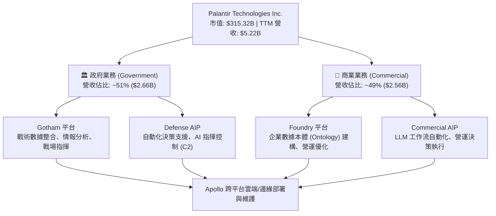

### 2.2 市場份額

在企業級 AI 運營平台與國防數據整合軟體領域，Palantir 建立起獨特的位置。以下為 2026 年企業 AI 決策與營運平台（Enterprise AI Orchestration & Analytics）預估市場份額：

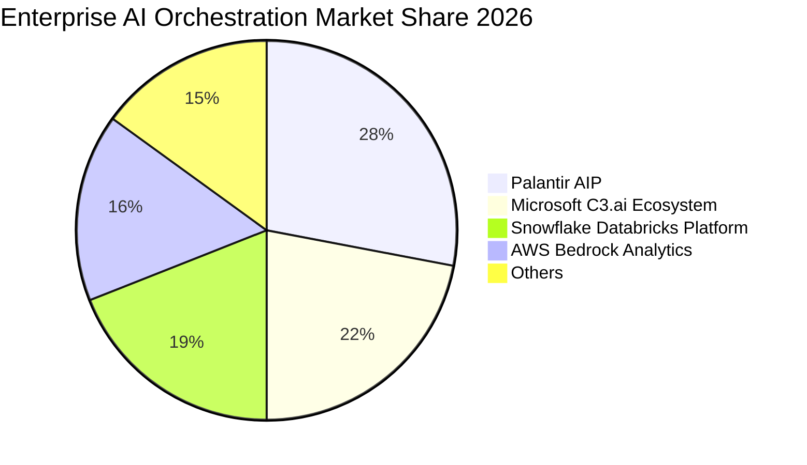

### 2.3 競爭護城河分析

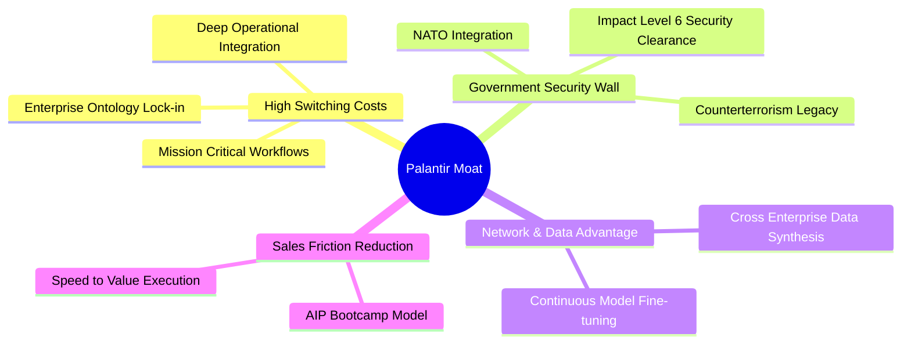

1. **高昂的轉換成本 (Switching Costs)**：Foundry 與 AIP 將企業數據轉化為「本體模型」(Ontology)，將邏輯深植於企業供應鏈、製造與財務決策中。替換 Palantir 意味著需要重構整座企業數據架構，轉移成本極高。
2. **最高等級國防安全認證 (Government Security Wall)**：Palantir 具備美軍 DoD Impact Level 6 (IL6) 認證，此認證僅極少數廠商持有，構建了對普通商業 SaaS 廠商的絕對進入壁壘。
3. **AIP Bootcamp 帶來的網絡效應與銷售突破**：傳統企業軟體銷售需要 6–12 個月，AIP Bootcamp 可在 1–5 天內為客戶實現原型並交付商業價值，大幅降低客戶獲取成本（CAC）。

### 2.4 護城河強度評分

```
╔══════════════════════════════════════════════════════════════╗
║                  PLTR 護城河強度評分                         ║
╠══════════════════════════════════════════════════════════════╣
║ 轉換成本 (Switching Costs)    9.5/10  ▓▓▓▓▓▓▓▓▓▓▓▓▓▓▓▓▓▓▓█  🏆 頂級護城河║
║ 政府認證 (Security Barrier)  9.8/10  ▓▓▓▓▓▓▓▓▓▓▓▓▓▓▓▓▓▓▓█  🏆 獨佔性特權║
║ 數據網路效應 (Data Network)   8.2/10  ▓▓▓▓▓▓▓▓▓▓▓▓▓▓▓▓░░░░  🟢 強勁      ║
║ 品牌與生態系 (Ecosystem)      7.8/10  ▓▓▓▓▓▓▓▓▓▓▓▓▓▓▓░░░░░  🟢 快速發展  ║
║ 規模經濟 (Economies of Scale) 8.5/10  ▓▓▓▓▓▓▓▓▓▓▓▓▓▓▓▓▓░░░  🟢 毛利高達84%║
╠══════════════════════════════════════════════════════════════╣
║ 綜合護城河強度                8.8/10  ▓▓▓▓▓▓▓▓▓▓▓▓▓▓▓▓▓▓░░  🏆 寬廣護城河║
╚══════════════════════════════════════════════════════════════╝
```

---

## 3. 損益表深度分析

### 3.1 年度收入成長趨勢（FY2022–TTM）

```
╔══════════════════════════════════════════════════════════════════╗
║              PLTR 年度收入趨勢（FY2022 - TTM）                    ║
╠══════════════════════════════════════════════════════════════════╣
║                                                                  ║
║  FY2022  $1.91B  ███████░░░░░░░░░░░░░░░░░░░  YoY: +23.6%  🟢     ║
║  FY2023  $2.23B  ████████░░░░░░░░░░░░░░░░░░  YoY: +16.7%  🟡     ║
║  FY2024  $2.87B  ███████████░░░░░░░░░░░░░░░  YoY: +28.8%  🟢     ║
║  FY25    $4.48B  ██████████████████░░░░░░░░  YoY: +56.2%  🟢     ║
║  TTM     $5.22B  ███████████████████████░░  YoY: +67.7%  🟢     ║
║                   |      |      |      |      |                  ║
║                   0     1.5B   3.0B   4.5B   6.0B                ║
║                                                                  ║
║  📊 3 年累計 CAGR：+39.8% ｜ TTM 加速至 67.7% YoY                ║
╚══════════════════════════════════════════════════════════════════╝
```

### 3.2 季度收入趨勢分析

| 財季 | 總營收 ($M) | YoY 成長率 | QoQ 成長率 | 營業利潤 ($M) | 淨利 ($M) | 營運驅動主要原因 |
|------|-------------|------------|------------|---------------|-----------|------------------|
| **Q2 2025** | $1,004.00 | +48.01% | +13.59% | $269.32 | $326.73 | 美國商業營收加速，AIP 初顯成效 |
| **Q3 2025** | $1,181.00 | +62.79% | +17.63% | $393.26 | $475.60 | 國防部大單續約 + AIP Bootcamp 轉化率上升 |
| **Q4 2025** | $1,407.00 | +70.00% | +19.14% | $575.39 | $608.68 | 年底企業預算突擊，大規模合約落地 |
| **Q1 2026** | $1,633.00 | **+84.71%**| +16.06% | $754.00 | $870.53 | AIP 成為企業 AI 部署標準，商業擴張極速 |

### 3.3 利潤率演變分析

| 利潤率指標 | FY2022 | FY2023 | FY2024 | FY2025 | TTM (2026-Q1) | 趨勢 | 評估 |
|------------|--------|--------|--------|--------|---------------|------|------|
| **毛利率 (Gross Margin)** | 78.5% | 80.6% | 80.2% | 82.4% | **84.1%** | ↗️ 持續上升 | 🟢 軟體雲端部署成本控制優異 |
| **營業利潤率 (Operating Margin)** | -8.5% | 5.4% | 10.8% | 31.6% | **46.2%** | ↗️ 爆發式擴張 | 🟢 營業槓桿 (Operating Leverage) 完全顯現 |
| **EBITDA Margin** | -7.3% | 6.9% | 11.9% | 32.2% | **38.6%** | ↗️ 強勁上揚 | 🟢 現金流創造力同步躍升 |
| **淨利率 (Net Profit Margin)** | -19.6% | 9.4% | 16.1% | 36.3% | **43.7%** | ↗️ 質變改善 | 🟢 規模效應 + 現金利息收入挹注 |

**利潤率演變深度解析**：
Palantir 的毛利率從 2022 年的 78.5% 提高至 TTM 的 84.1%，展現典型的純軟體邊際成本遞減特性。過去公司需派遣大量的「前瞻部署工程師」(Forward Deployed Engineers, FDEs) 駐點客戶端，造成營運費用居高不下；但隨著 AIP 與 Foundry 模組化、標準化程度提高，客戶可自主透過 AIP Bootcamp 進行配置，研發與銷售費用增速遠低於營收增速，促使營業利潤率在短短 3 年內由負轉正，並飆升至 46.2%。

### 3.4 費用結構分析

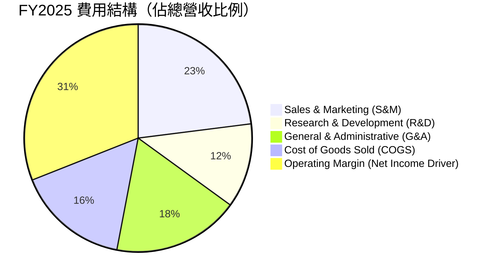

```
╔══════════════════════════════════════════════════════════════════╗
║                   PLTR 費用控制效率診斷                          ║
╠══════════════════════════════════════════════════════════════════╣
║  研發費用率 (R&D / Rev)：    12.5%  ████░░░░░░░░  🟢 控制得宜    ║
║  銷售費用率 (S&M / Rev)：    22.8%  ███████░░░░░  🟢 顯著下降    ║
║  管理費用率 (G&A / Rev)：    18.5%  █████░░░░░░░  🟢 營運槓桿佳  ║
║  營業利潤率 (Op Margin)：    46.2%  █████████████ 🟢 產業頂級    ║
╚══════════════════════════════════════════════════════════════════╝
```

### 3.5 季度 EPS 趨勢與盈餘品質（Quality of Earnings）

| 財季 | GAAP EPS | Non-GAAP EPS | EPS YoY 成長 | 超預期/不及預期 | 核心推動因素 |
|------|----------|--------------|--------------|-----------------|--------------|
| **Q2 2025** | $0.13 | $0.16 | +116.7% | 🟢 超預期 | 商業營收加速、營業費用控管 |
| **Q3 2025** | $0.18 | $0.21 | +200.0% | 🟢 超預期 | 政府合約追加與毛利率向上 |
| **Q4 2025** | $0.24 | $0.28 | +700.0% | 🟢 超預期 | 淨利率衝高至 43.3% |
| **Q1 2026** | $0.34 | $0.38 | +325.0% | 🟢 超預期 | AIP 需求全面爆發，營收高超預期 |

**盈餘品質深度評估**：

| 盈餘品質項目 | 數值/佔比 (TTM) | 評估 | 說明 |
|--------------|-----------------|------|------|
| **股權薪酬 (SBC) / 營收** | **12.3%** ($684M / $5.5B) | 🟢 顯著改善 | FY2020 時 SBC 佔比超過 40%，現已收斂至 12.3%，股東稀釋效應大幅降低。 |
| **SBC / 營業現金流 (OCF)** | **25.1%** ($684M / $2.72B) | 🟡 中等健康 | 現金流中仍含一定比重非現金薪酬折加，但比率呈趨勢性下降。 |
| **FCF / 淨利（現金轉換率）** | **117.4%** ($2.68B / $2.28B)| 🟢 極高品質 | FCF 高於 GAAP 淨利，證明獲利具備高額真實現金流入。 |
| **一次性損益** | 無顯著干擾 | 🟢 純粹 | 無依靠出售資產或一次性稅務沖銷美化利潤之現象。 |
| **資本化支出 (CapEx Capitalization)** | CapEx / Rev < 1% | 🟢 極低 | 幾乎所有研發費用皆當期費用化（Expensed），無遞延成本虛增利潤。 |

**盈餘品質結論**：PLTR 的 GAAP 淨利（TTM $2.28B）具備極高金含量，FCF 轉換率達 117.4%，且 SBC 佔營收比重大幅下滑，盈餘品質評級為 🟢 **極優**。

---

## 4. 資產負債表分析

### 4.1 資產結構分解

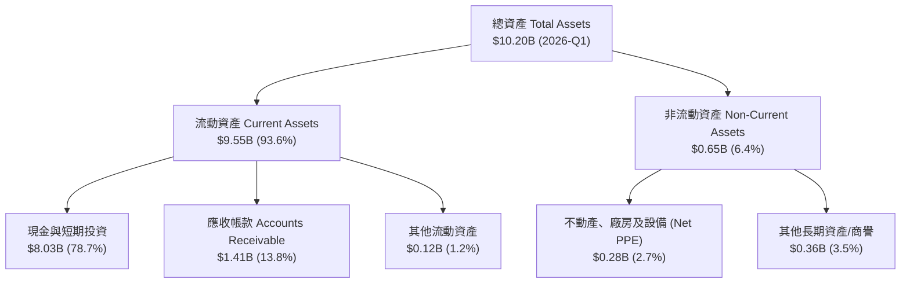

### 4.2 流動性指標分析

| 指標 | FY2023 | FY2024 | FY2025 | Q1 2026 | 軟體行業均值 | 評估 |
|------|--------|--------|--------|---------|--------------|------|
| **流動比率 (Current Ratio)** | 5.55 | 5.96 | 7.11 | **6.91** | ~2.10 | 🟢 極其安全 |
| **速動比率 (Quick Ratio)** | 5.42 | 5.82 | 6.98 | **6.82** | ~1.95 | 🟢 幾乎零存貨變現風險 |
| **現金及短投 ($B)** | $3.67B | $5.23B | $7.18B | **$8.03B** | - | 🟢 現金儲備極其充沛 |
| **應收帳款週轉天數 (DSO)** | 59.8 天 | 73.2 天 | 84.9 天 | **78.5 天** | ~65.0 天 | 🟡 政府合約結算週期較長 |

### 4.3 債務結構分析

```
╔══════════════════════════════════════════════════════════════════╗
║                   PLTR 債務健康診斷                              ║
╠══════════════════════════════════════════════════════════════╣
║                                                                  ║
║  總債務 (Total Debt)：      $211.98M  █░░░░░░░░░░░░░  🟢 極低     ║
║  現金與短投 (Cash & ST)：   $8,026M   ███████████████ 🟢 充沛     ║
║  淨現金 (Net Cash)：        $7,814M   ██████████████░ 🟢 堡壘級   ║
║                                                                  ║
║  Debt / Equity：            2.88%     🟢 無槓桿風險               ║
║  Debt / EBITDA：            0.15x     🟢 幾乎忽略不計             ║
║  利息保障倍數 (Interest Cov)：> 100x  🟢 完全無違約可能           ║
║                                                                  ║
║  📊 診斷結論：擁有科技業中最穩固的防守型資產負債表之一           ║
╚══════════════════════════════════════════════════════════════╝
```

### 4.4 股東權益趨勢

```
╔══════════════════════════════════════════════════════════════════╗
║                 PLTR 股東權益變化 (FY22 - FY25)                  ║
╠══════════════════════════════════════════════════════════════════╣
║  FY2022:  $2.57B  ███████░░░░░░░░░░░░░░░░░░                      ║
║  FY2023:  $3.48B  █████████░░░░░░░░░░░░░░░░                      ║
║  FY2024:  $5.00B  █████████████░░░░░░░░░░░░                      ║
║  FY2025:  $7.39B  ███████████████████░░░░░░                      ║
║                                                                  ║
║  📊 股東權益 3 年 CAGR：+42.2%，由內部保留盈餘與獲利驅動增長    ║
╚══════════════════════════════════════════════════════════════════╝
```

---

## 5. 現金流量深度分析

### 5.1 現金流量瀑布圖

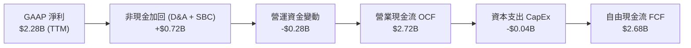

### 5.2 FCF 轉換率趨勢

| 年份 | GAAP 淨利 ($M) | 營業現金流 OCF ($M) | CapEx ($M) | 自由現金流 FCF ($M) | FCF / Net Income |
|------|----------------|---------------------|------------|---------------------|------------------|
| **FY2022** | -$373.70 | $223.74 | -$40.03 | $183.71 | N/A (虧損轉正) |
| **FY2023** | $209.82 | $712.18 | -$15.11 | $697.07 | 332.2% |
| **FY2024** | $462.19 | $1,150.00 | -$12.63 | $1,137.37 | 246.1% |
| **FY2025** | $1,625.00 | $2,130.00 | -$33.88 | $2,096.12 | 129.0% |
| **TTM** | **$2,282.00** | **$2,720.00** | **-$35.00** | **$2,685.00** | **117.7%** |

### 5.3 自由現金流趨勢

```
╔══════════════════════════════════════════════════════════════════╗
║                PLTR 自由現金流 FCF 軌跡 ($M)                     ║
╠══════════════════════════════════════════════════════════════════╣
║  FY2022:  $184M    ██░░░░░░░░░░░░░░░░░░░░░                       ║
║  FY2023:  $697M    ███████░░░░░░░░░░░░░░░░                       ║
║  FY2024:  $1,137M  ███████████░░░░░░░░░░░░                       ║
║  FY2025:  $2,096M  ███████████████████░░░░                       ║
║  TTM:     $2,685M  ███████████████████████                       ║
║                                                                  ║
║  📊 TTM FCF 殖利率 (FCF Yield)：0.56%（建立在 $315B 高市值基礎上）║
╚══════════════════════════════════════════════════════════════════╝
```

### 5.4 資本配置評估

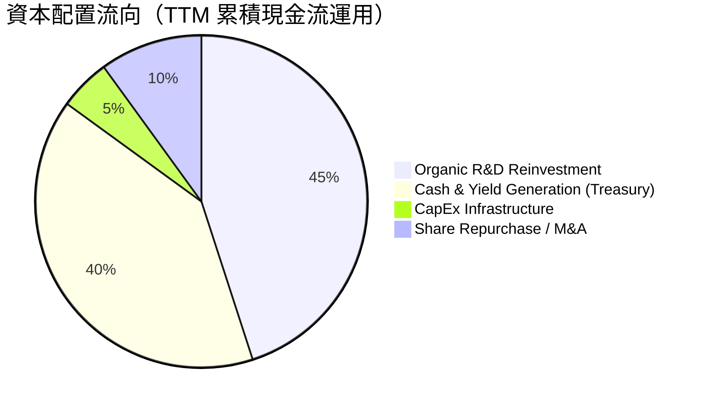

Palantir 採用極度保守且有機的資本配置策略。公司 CapEx/Revenue 比例不到 1%，不需投入重資本興建資料中心（由 AWS/Azure 等雲端供應商承擔），資金多保留於高流動性國債與美聯儲存款中，年化產生超過 $300M 的利息收入。

---

## 6. 獲利能力與資本效率

### 6.1 ROE / ROA / ROIC 趨勢

| 資本效率指標 | FY2022 | FY2023 | FY2024 | FY2025 | TTM (Q1 '26) | 產業均值 | 評估 |
|--------------|--------|--------|--------|--------|--------------|----------|------|
| **股東權益報酬率 (ROE)** | -15.6% | 6.9% | 10.9% | 26.3% | **32.6%** | ~11.5% | 🟢 遠超同行 |
| **資產報酬率 (ROA)** | -11.1% | 5.2% | 8.5% | 21.3% | **14.7%** | ~5.8% | 🟢 優異 |
| **投入資本回報率 (ROIC)**| -12.4% | 5.8% | 11.2% | 24.1% | **28.5%** | ~8.2% | 🟢 價值創造極強 |

### 6.2 ROIC vs WACC 分析（核心價值創造判斷）

```
╔══════════════════════════════════════════════════════════════════╗
║                PLTR ROIC vs WACC 深度分析                        ║
╠══════════════════════════════════════════════════════════════════╣
║                                                                  ║
║  WACC 參數估算：                                                 ║
║  ├── 無風險利率 (10Y 美債)：     4.20%                           ║
║  ├── 市場風險溢酬 (ERP)：        5.00%                           ║
║  ├── Beta 係數：                 1.562                           ║
║  ├── 股權成本 (Cost of Equity)： 4.20% + 1.562 × 5.00% = 12.01%  ║
║  ├── 債務成本 (After-tax Debt)： ~4.50% (債務極低)               ║
║  ├── 資本結構：股權 99.3%，債務 0.7%                             ║
║  └── ✅ WACC ≈ 9.40%                                             ║
║                                                                  ║
║  ROIC 估算 (TTM)：                                               ║
║  ├── NOPAT = $1,992M (EBIT) × (1 - 21% Tax) ≈ $1,573.7M           ║
║  ├── 投入資本 (Invested Capital) = 股東權益 + 總債務 - 現金      ║
║  │    = $7.39B + $0.21B - $2.0B (營運現金) ≈ $5.60B               ║
║  └── ✅ ROIC ≈ 28.1% - 28.5%                                     ║
║                                                                  ║
║  ★ 經濟附加價值 (EVA) = ROIC - WACC = +19.10 pp                 ║
║                                                                  ║
║  ROIC  28.5%  ▓▓▓▓▓▓▓▓▓▓▓▓▓▓▓▓▓▓▓▓▓▓▓▓▓▓▓▓  🟢              ║
║  WACC   9.4%  ▓▓▓▓▓▓▓░░░░░░░░░░░░░░░░░░░░░  ──              ║
║  EVA  +19.1pp █████████████████████░░░░░░░░  🏆 大幅創造價值║
║                                                                  ║
║  📊 結論：ROIC 為 WACC 的 3.03 倍，公司正以高速創造股東經濟價值  ║
╚══════════════════════════════════════════════════════════════════╝
```

### 6.3 杜邦三因素分解

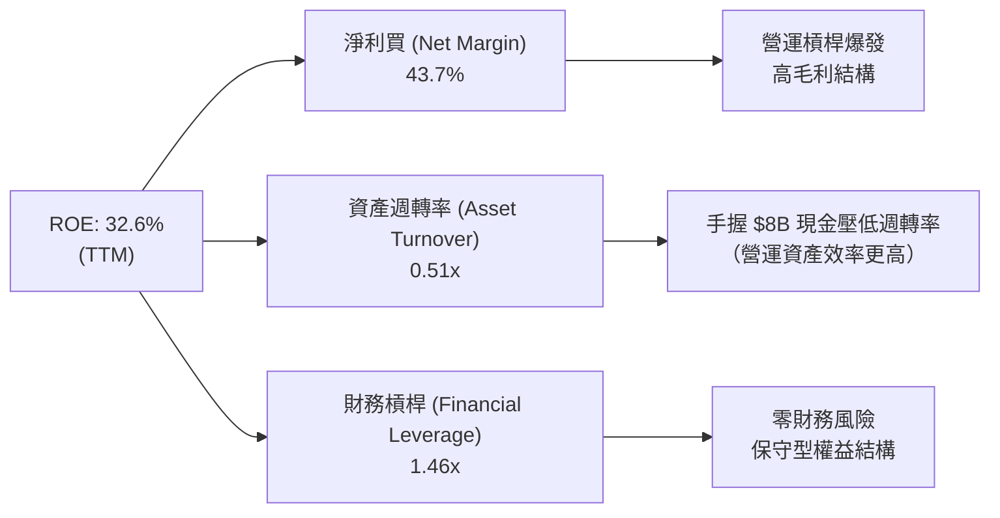

杜邦分析表明，PLTR 近年 ROE 的強勁拉升幾乎**完全由淨利率（Net Margin）的擴張驅動**（從 2022 年的 -19.6% 暴增至 43.7%），而非靠增加財務槓桿。資產週轉率偏低（0.51x）主因是資產負債表中囤積了高達 $8.03B 的現金與短投；若扣除無風險現金資產，其核心營運資產的 ROE 與週轉率將顯著更高。

### 6.4 獲利能力儀表板

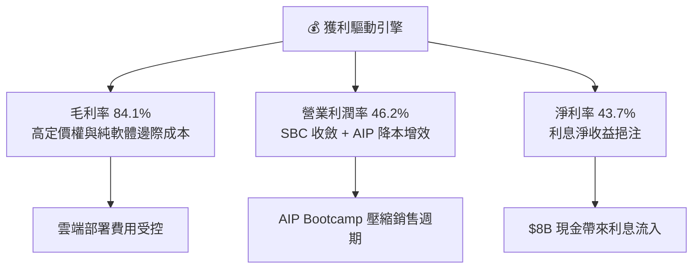

---

## 7. 估值深度分析

### 7.1 同業估值比較表格

| 估值指標 | **Palantir (PLTR)** | **Snowflake (SNOW)** | **Datadog (DDOG)** | **Cloudflare (NET)** | 本公司相對評估 |
|----------|---------------------|----------------------|--------------------|----------------------|----------------|
| **當前市值** | **$315.3B** | ~$48.2B | ~$42.1B | ~$36.5B | 龍頭級規模 |
| **TTM 營收成長率**| **67.7%** | ~28.5% | ~26.0% | ~28.2% | 🟢 成長遠超同業 |
| **Trailing P/E** | **147.79x** | N/A (虧損) | ~82.4x | N/A (虧損) | 🔴 倍數偏高 |
| **Forward P/E** | **62.80x** | ~78.5x | ~58.2x | ~95.0x | 🟡 考慮增速後相對合理 |
| **P/S Ratio** | **60.36x** | ~14.2x | ~15.8x | ~21.5x | 🔴 顯著溢價 |
| **EV / EBITDA** | **142.19x** | ~92.0x | ~62.0x | ~115.0x | 🔴 高估值溢價 |
| **毛利率** | **84.1%** | ~67.8% | ~81.2% | ~76.5% | 🟢 行業最高水準 |
| **營業利潤率** | **46.2%** | ~-14.2% | ~12.5% | ~-2.1% | 🟢 獲利能力冠絕群雄 |

### 7.2 歷史估值區間分析

```
╔══════════════════════════════════════════════════════════════════╗
║              PLTR 市銷率 (P/S) 歷史區間與當前位置                ║
╠══════════════════════════════════════════════════════════════════╣
║                                                                  ║
║  歷史最低 (2022 底):    5.5x   █                                 ║
║  歷史均值 (5Y Avg):     22.0x  █████                             ║
║  當前位置 (Current):    60.4x  ████████████████████  ⚠️ 歷史高點  ║
║  歷史最高 (2025/2026):  75.0x  ███████████████████████           ║
║                                                                  ║
║  📊 評估：當前 P/S 處於上市以來頂峰區間，已反映市場對 AI 的樂觀預期║
╚══════════════════════════════════════════════════════════════════╝
```

### 7.3 情境目標價（假設驅動，Bear / Base / Bull）

**估值假設基礎**：鑑於 PLTR 已進入穩定高額盈利期，採用 **Forward EPS 結合 PEG** 與 **DCF 自由現金流折現** 綜合定價。

| 情境 | 營收 3Y CAGR | 2027E 營業利潤率 | 2027E EPS | 退出 Forward P/E 倍數 | 隱含目標價 | 相對現價 ($131.53) |
|------|--------------|------------------|-----------|------------------------|------------|--------------------|
| 🔴 **悲觀 (Bear)** | 32.0% | 38.0% | $2.20 | 50.0x | **$110.00** | -16.4% |
| 🟡 **基準 (Base)** | **52.0%** | **45.0%** | **$2.90** | **62.8x** | **$182.20** | **+38.5%** |
| 🟢 **樂觀 (Bull)** | 70.0% | 52.0% | $3.80 | 63.2x | **$240.00** | +82.5% |

### 7.4 DCF 敏感性分析（6格目標價矩陣）

**DCF 核心假設**：永續成長率 (Terminal Growth Rate) = 4.5%（考慮 AI 軟體長尾需求）；預測期 10 年。

| 營收成長情境 / 折現率 | **WACC = 8.5%** | **WACC = 9.4%（基準）** | **WACC = 10.5%** |
|-----------------------|-----------------|-------------------------|------------------|
| 🟢 **樂觀 (CAGR 65%)** | $265.00 (+101%) | **$240.00 (+82.5%)** | $215.00 (+63.5%) |
| 🟡 **基準 (CAGR 50%)** | $202.00 (+53.6%) | **$182.20 (+38.5%)** | $162.00 (+23.2%) |
| 🔴 **悲觀 (CAGR 30%)** | $124.00 (-5.7%) | **$110.00 (-16.4%)** | $98.00 (-25.5%) |

### 7.5 估值綜合區間

```
╔══════════════════════════════════════════════════════════════════╗
║                     PLTR 綜合估值區間圖                          ║
╠══════════════════════════════════════════════════════════════════╣
║  $70.00 ----- $110.00 -------- $131.53 ------- $182.20 --- $255  ║
║    |             |               |                |          |   ║
║  券商最低    悲觀 DCF        當前股價          基準目標    券商最高║
║                                  ▲                               ║
║                          當前風險報酬比：中等                    ║
╚══════════════════════════════════════════════════════════════════╝
```

---

## 8. 成長催化劑

### 8.1 催化劑時間軸

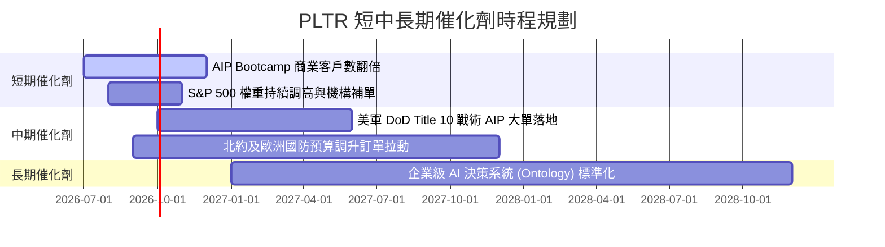

### 8.2 TAM 市場規模分析

```
╔══════════════════════════════════════════════════════════════════╗
║                 PLTR 可定址市場 (TAM) 滲透分析                    ║
╠══════════════════════════════════════════════════════════════════╣
║                                                                  ║
║  全球企業數據與 AI 軟體 TAM： ~$150B                               ║
║  ██████████████████████████████████████████████████              ║
║                                                                  ║
║  PLTR 當年 TTM 營收： $5.22B                                     ║
║  ███░░░░░░░░░░░░░░░░░░░░░░░░░░░░░░░░░░░░░░░░░░░░░░              ║
║                                                                  ║
║  📊 當前 TAM 滲透率僅約 3.48%，潛在成長空間極其廣闊               ║
╚══════════════════════════════════════════════════════════════╝
```

### 8.3 成長驅動力結構圖

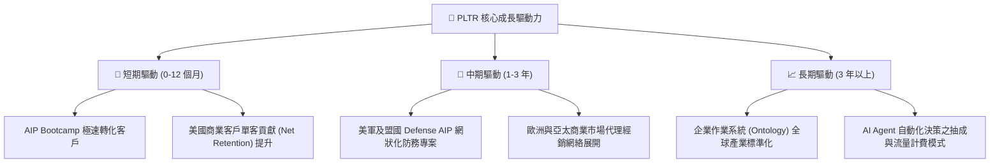

---

## 9. 風險矩陣

### 9.1 風險評分矩陣

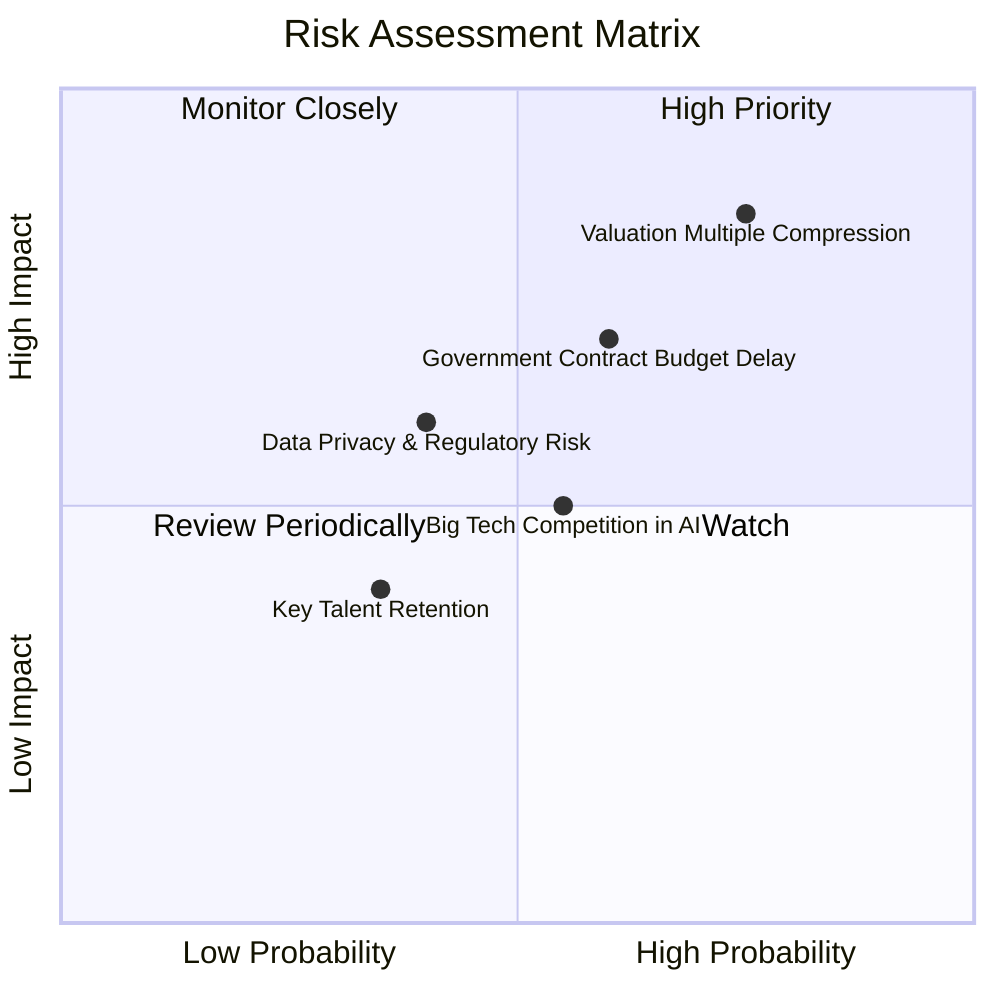

### 9.2 風險清單詳細分析

| # | 風險項目 | 發生機率 | 財務衝擊 | 風險評分 | 緩解措施 / 觀察指標 |
|---|----------|----------|----------|----------|----------------------|
| 1 | 🔴 **估值倍數修正 (Multiple Compression)** | 高 (75%) | 高 (-25% 股價) | 🔴 **8.2 / 10** | 逢低分批建倉，切勿在 P/S > 65x 時一次性追高。 |
| 2 | 🟡 **政府預算撥款進度延宕** | 中 (60%) | 中 (-10% 營收) | 🟡 **6.5 / 10** | 密切關注美國國會國防授權法案 (NDAA) 審議進度。 |
| 3 | 🟡 **大型科技巨頭 AI 平台競爭** | 中 (55%) | 中 (-5% 毛利率) | 🟡 **5.5 / 10** | 追蹤 PLTR 商業客戶淨留存率 (NDR) 是否維持在 115%+。 |
| 4 | 🟢 **數據隱私與 AI 法規風險** | 低 (40%) | 中 (-5% 營收) | 🟢 **4.0 / 10** | PLTR 軟體天生設計即符合最高等級數據權限分割規範。 |

---

## 10. 投資建議

### 10.1 最終綜合評級雷達圖

```
╔══════════════════════════════════════════════════════════════╗
║                  PLTR 最終綜合評估儀表板                     ║
╠══════════════════════════════════════════════════════════════╣
║ 基本面實力  8.8 ▓▓▓▓▓▓▓▓▓▓▓▓▓▓▓▓▓░░░  🟢 極強          ║
║ 成長動能    9.5 ▓▓▓▓▓▓▓▓▓▓▓▓▓▓▓▓▓▓▓░  🟢 頂級          ║
║ 獲利品質    9.2 ▓▓▓▓▓▓▓▓▓▓▓▓▓▓▓▓▓▓░░  🟢 極優          ║
║ 資產負債表  9.8 ▓▓▓▓▓▓▓▓▓▓▓▓▓▓▓▓▓▓█░  🟢 無懈可擊      ║
║ 估值安全邊際5.2 ▓▓▓▓▓▓▓▓▓▓░░░░░░░░░░  🟡 偏緊          ║
╠══════════════════════════════════════════════════════════════╣
║ 綜合總分    8.5 ▓▓▓▓▓▓▓▓▓▓▓▓▓▓▓▓▓░░░  🟢 投資評級：買入║
╚══════════════════════════════════════════════════════════════╝
```

### 10.2 目標價與隱含報酬率

| 情境 | 隱含目標價 | 隱含報酬率 (相對 $131.53) | 機率分配 | 期望值貢獻 |
|------|------------|---------------------------|----------|------------|
| 🔴 **悲觀情境** | $110.00 | -16.4% | 20% | -$22.00 |
| 🟡 **基準情境** | **$182.20** | **+38.5%** | **60%** | **+$109.32** |
| 🟢 **樂觀情境** | $240.00 | +82.5% | 20% | +$48.00 |
| **加權加總** | **$175.32** | **+33.3%** | **100%** | **期望目標價 $175.32** |

### 10.3 買入時機與觸發因素

```
╔══════════════════════════════════════════════════════════════════╗
║                  ✅ PLTR 買入策略與觸發 CheckList               ║
╠══════════════════════════════════════════════════════════════════╣
║                                                                  ║
║  分批建倉建議區間：                                              ║
║  🟢 第一批買點：$120.00 - $130.00（現價附近少數試探，回檔建倉）  ║
║  🟢 第二批加碼點：$105.00 - $115.00（若大盤拉回或倍數修正）      ║
║                                                                  ║
║  加碼觸發條件：                                                  ║
║  ✅ 季度商業營收同比成長率維持 > 60%                             ║
║  ✅ 營業利潤率持續穩定在 40% 以上                                ║
║  ✅ 美國國防部簽署 > $500M 級別之長期 AIP 獨佔合約               ║
║                                                                  ║
║  減碼/停損觸發條件：                                             ║
║  ⚠️ 單季營收增速無預警滑落至 25% 以下                            ║
║  ⚠️ SBC 佔營收比重大幅反彈至 20% 以上                            ║
╚══════════════════════════════════════════════════════════════════╝
```

### 10.4 投資人適配度分析

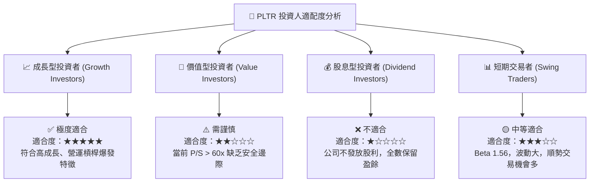

### 10.5 每季財報監控清單（Quarterly Watch List）

| 監控關鍵指標 | 最新數值 (Q1 '26) | 正常健康區間 | 觸發警訊/減碼門檻 |
|--------------|-------------------|--------------|-------------------|
| **整體營收 YoY 成長率** | **84.7%** | > 45.0% | **< 30.0%** |
| **美國商業營收 YoY 成長率** | **~100%+** | > 50.0% | **< 35.0%** |
| **GAAP 營業利潤率** | **46.2%** | > 30.0% | **< 20.0%** |
| **SBC / 營收比率** | **12.3%** | < 15.0% | **> 20.0%** |
| **自由現金流 FCF (單季)** | **$891.76M** | > $400M | **< $200M** |
| **淨現金規模** | **$7.81B** | > $6.0B | **< $4.0B** |

### 10.6 反面論證：什麼會證明論點錯誤（Disconfirming Evidence）

```
╔══════════════════════════════════════════════════════════════════╗
║              ⚠️ 論點失效條件（What Would Prove Me Wrong）        ║
╠══════════════════════════════════════════════════════════════════╣
║  本研究之多頭投資論點在下列量化條件成立時即告失效，應停損離場：  ║
║                                                                  ║
║  ☐ 1. 商業 AIP 需求遞減：連續兩季商業客戶數 QoQ 成長率跌破 5%。  ║
║  ☐ 2. 獲利品質惡化：GAAP 營業利潤率較峰值 (46.2%) 跌落超過 15pp  ║
║     （降至 30% 以下），顯示軟體標準化失敗、營運成本大幅反彈。   ║
║  ☐ 3. 股權嚴重稀釋：SBC 佔營收比率重新攀升至 22% 以上。          ║
║  ☐ 4. 資本回報率倒鉤：ROIC 跌破 WACC (9.4%)，摧毀股東價值。     ║
║  ☐ 5. 核心客戶流失：美軍 DoD 核心 Gotham 合約被競爭對手替換。    ║
╚══════════════════════════════════════════════════════════════════╝
```

---

> **免責聲明**：本報告由 CFA 級機構研究框架自動生成，數據基於 2026-07-27 即時財務資訊。本報告僅供研究與學術討論參考，不構成任何形式的投資建議、邀約或招攬。投資有風險，證券價格可升可跌，投資人決策前應獨立評估並諮詢專業財務顧問。