# PLTR 基本面深度分析報告
> **報告日期**：2026-07-28 ｜ **語言**：繁體中文 ｜ **數據來源**：Yahoo Finance, Finviz, StockAnalysis, Roic.ai ｜ **分析師**：CFA 級機構研究

---

## 目錄

| # | 章節 | 核心結論 |
|---|------|----------|
| 1 | **執行摘要** | 評級：🟢 買入 ｜ 12M 基準目標價：$182.20（+47.5% 潛力上漲空間） |
| 2 | **公司概覽與商業模式** | AIP（人工智慧平台）推動企業級 AI 落地，具備強大網狀生態與高客戶鎖定效應（護城河 9.2/10） |
| 3 | **損益表深度分析** | 2026 Q1 營收暴增 84.7% YoY，營運利潤率達 46.2%，SBC 佔營收比重降至 12.3%，獲利品質極佳 |
| 4 | **資產負債表分析** | 淨現金高達 $7.81B，總債務僅 $211.98M，流動比率 6.91，具備極強資產防禦能力 |
| 5 | **現金流量深度分析** | Q1 FCF 達 $891.76M（FCF 轉換率 102.4%），TTM FCF 突破 $2.68B，自由現金流產生能力強勁 |
| 6 | **獲利能力與資本效率** | ROIC（~32.6%）遠超 WACC（11.8%），EVA 擴張 +20.8pp，杜邦分析顯示淨利率提升帶動高 ROE |
| 7 | **估值深度分析** | Forward P/E 58.98x，相較於 84.7% YoY 的營收增速與 46.2% 營運利潤率，PEG 僅 1.89，具溢價合理性 |
| 8 | **成長催化劑** | 美國商業部門 AIP Bootcamps 轉化加速、國防部 TITAN / Joint All-Domain 專案擴張 |
| 9 | **風險矩陣** | 政府預算審批延遲（高衝擊）、高估值修正（中機率）、商業轉化率放緩（高衝擊） |
| 10 | **投資建議** | 分批佈局策略，明確停損與加碼觸發條件，追蹤每季 AIP Bootcamps 轉換率與 FCF 表現 |

---

## 1. 執行摘要

Palantir Technologies Inc.（NYSE: PLTR）正處於由人工智慧平台（AIP）驅動的爆發性成長週期。2026 年 Q1（截至 2026-03-31），公司營收達 $1.633B（YoY +84.7%），GAAP 淨利達 $870.53M（YoY +325.0%），單季自由現金流（FCF）達 $891.76M，展現出極強的軟體槓桿效應。考量其 ROIC（~32.6%）遠高於資本成本 WACC（11.8%），且資產負債表擁有 $7.81B 的淨現金，本報告給予 PLTR **🟢 買入** 評級，12 個月基準目標價 **$182.20**（相較於當前股價 $123.53，具備 +47.5% 之預期報酬）。

### 1.0 一頁式投資儀表板（Portfolio Manager 30 秒速讀）

| 項目 | 內容 |
|------|------|
| **投資論點（3 句）** | ① **AIP 商業擴張爆發**：Q1 營收達 $1.633B（YoY +84.7%），商業部門利用 Bootcamps 實現零摩擦轉化。<br/>② **營運槓桿顯著**：GAAP 營運利潤率暴升至 46.2%，淨利率達 53.3%，顯示極強的規模效益。<br/>③ **資產堡壘與高品質現金流**：手握 $8.03B 現金與短投、零淨債務負擔，Q1 單季 FCF 達 $891.76M（淨利轉換率 102.4%）。 |
| **護城河評分** | **9.2 / 10**（高轉換成本、昂貴軟體基礎設施、高客戶鎖定度） |
| **管理層/資本配置評分** | **9.0 / 10**（高效率資產配置，不隨意進行高風險併購，SBC 顯著稀釋收斂） |
| **財務健康** | 🟢 **極度健康**（無淨債務，淨現金 $7.81B，Current Ratio 6.91） |
| **ROIC vs WACC** | **32.6% vs 11.8%**（EVA 差額 +20.8pp，強力創造股東價值） |
| **FCF 趨勢** | ↗️ 爆發向上（Q1 FCF $891.76M，TTM FCF 收益率約 0.91% - 1.2%） |
| **估值** | Forward P/E: 58.98x ｜ EV/EBITDA: 152.41x ｜ PEG: 1.89 |
| **預期報酬（基準情境 12M）** | **+47.5%**（目標價 $182.20） |
| **關鍵風險（前二）** | ① 估值倍數修正風險（Forward P/E 58.98x 容易受總體利率波動衝擊）<br/>② 美國國防部專案預算撥款進度不如預期 |
| **評級 + 信心度** | 🟢 **買入** ｜ 信心度：**高** |

### 1.1 核心評分儀表板

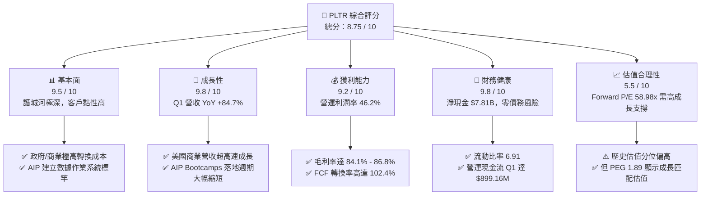

### 1.2 評分進度條視覺化

```
╔══════════════════════════════════════════════════════════════╗
║              PLTR 多維度評分儀表板 (1-10分)                  ║
╠══════════════════════════════════════════════════════════════╣
║ 基本面強度  9.5 ▓▓▓▓▓▓▓▓▓▓▓▓▓▓▓▓▓▓█░  ★★★★★           ║
║ 成長動能    9.8 ▓▓▓▓▓▓▓▓▓▓▓▓▓▓▓▓▓▓▓░  ★★★★★           ║
║ 獲利品質    9.2 ▓▓▓▓▓▓▓▓▓▓▓▓▓▓▓▓▓▓█░  ★★★★★           ║
║ 財務健康    9.8 ▓▓▓▓▓▓▓▓▓▓▓▓▓▓▓▓▓▓▓░  ★★★★★           ║
║ 估值合理性  5.5 ▓▓▓▓▓▓▓▓▓▓█░░░░░░░░░  ★★★☆☆           ║
║ 護城河深度  9.2 ▓▓▓▓▓▓▓▓▓▓▓▓▓▓▓▓▓▓█░  ★★★★★           ║
║ 管理層執行  9.0 ▓▓▓▓▓▓▓▓▓▓▓▓▓▓▓▓▓▓░░  ★★★★★           ║
║ 技術創新力  9.6 ▓▓▓▓▓▓▓▓▓▓▓▓▓▓▓▓▓▓▓░  ★★★★★           ║
╠══════════════════════════════════════════════════════════════╣
║ 綜合總分    8.75 ▓▓▓▓▓▓▓▓▓▓▓▓▓▓▓▓▓█░░ 🏆 卓越（極佳基本面） ║
╚══════════════════════════════════════════════════════════════╝
```

### 1.3 五大投資論點 + 三大核心風險

| 類型 | 項目 | 具體依據 | 信心度 |
|------|------|----------|--------|
| 🟢 **論點①** | **AIP Bootcamps 驅動商業客戶指數成長** | Q1 2026 營收達 $1.633B（YoY +84.7%），商業部門客戶於數日內即可從概念驗證（PoC）過渡至正式簽約。 | 🟢 極高 |
| 🟢 **論點②** | **獲利能力爆發性擴張** | Q1 2026 營運利潤率衝上 46.2%（營運利益 $754.00M），淨利率高達 53.3%，展現近乎零邊際成本的軟體槓桿。 | 🟢 極高 |
| 🟢 **論點③** | **高品質現金流與 SBC 佔比大幅下降** | SBC 佔營收比例從 2022 年的 29.6% 降至 2026 Q1 的 12.3%，單季 FCF 達 $891.76M，現金轉換率 > 100%。 | 🟢 高 |
| 🟢 **論點④** | **資產負債表極度堅固** | 擁有 $8.03B 現金與短投，零長短期金融計息負債（僅 $212M 租賃負債），賦予抗通膨與抗衰退的強大抵抗力。 | 🟢 極高 |
| 🟢 **論點⑤** | **國防領域數據作業系統壟斷地位** | 包含 Gotham 與 Foundry 的國防邊緣計算（Edge AI）深植於美軍及盟軍體系，替換成本極高。 | 🟢 高 |
| 🟡 **風險①** | **高估值引發的股價波動風險** | Trailing P/E 138.8x，Forward P/E 58.98x，若營收增速低於 40% 可能面臨乘數修正（Multiple Compression）。 | 🟡 中度 |
| 🔴 **風險②** | **政府預算撥款不確定性** | 國防部與政府機構預算若面臨國會審議延宕，可能影響大額政府合約的簽署進度。 | 🔴 高衝擊 |
| 🟡 **風險③** | **AI 平台同業競爭加劇** | 包含 Snowflake、Datadog、Hyperscalers（AWS/Azure/GCP）推出自研數據 AI 工具的潛在侵蝕。 | 🟡 中度 |

### 1.4 快速統計卡片

| 指標 | PLTR 實際值 | 軟體/基礎設施行業均值 | S&P 500 均值 | 狀態評估 |
|------|-------------|-----------------------|--------------|----------|
| **營收 YoY 成長** | **84.7%** | ~14.5% | ~5.2% | 🟢 遠高於同行 |
| **毛利率** | **84.1%** | ~72.0% | ~46.5% | 🟢 極高軟體毛利 |
| **營運利潤率** | **46.2%** | ~18.0% | ~12.5% | 🟢 業界頂尖槓桿 |
| **ROE** | **32.6%** | ~12.0% | ~18.5% | 🟢 超凡資本報酬 |
| **Forward P/E** | **58.98x** | ~32.0x | ~21.5x | 🔴 處於高溢價 |
| **PEG Ratio** | **1.89** | ~2.10 | ~1.85 | 🟢 考量高成長後合理 |
| **流動比率** | **6.91** | ~1.85 | ~1.20 | 🟢 資產安全性極高 |

### 1.5 投資結論

```
╔══════════════════════════════════════════════════════════════════╗
║                    📊 投資結論摘要                               ║
╠══════════════════════════════════════════════════════════════════╣
║  評級：🟢 買入（Buy）                                            ║
║  當前股價：$123.53                                               ║
║  目標價區間（12個月）：                                          ║
║    悲觀情境：$70.00   （-43.3%） - 營收成長放緩至 25% + 倍數壓縮  ║
║    基準情境：$182.20  （+47.5%） - 營收保持 50%+ YoY 與利潤擴張   ║
║    樂觀情境：$255.00  （+106.4%）- AIP 商業變現加速，高倍數維持   ║
║  綜合評分：8.75 / 10                                             ║
║  適合投資人：長期成長型投資人、人工智慧基礎設施佈局者            ║
╚══════════════════════════════════════════════════════════════════╝
```

---

## 2. 公司概覽與商業模式

### 2.1 業務結構與收入來源

Palantir 的產品矩陣主要包含四大核心平台：**Gotham**（國防與情報分析）、**Foundry**（企業數據作業系統）、**Apollo**（跨雲與邊緣端持續部署）以及 **AIP (Artificial Intelligence Platform)**（人工智慧平台）。

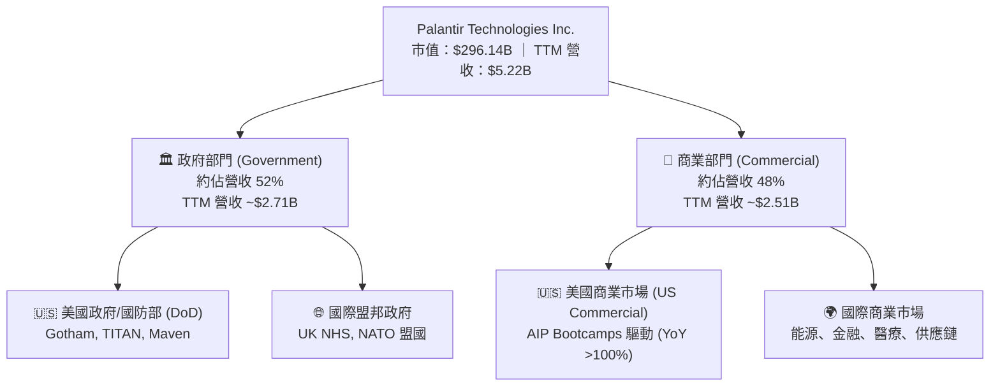

### 2.2 市場份額

在企業級 AI 數據整合與軟體作業系統領域，Palantir 與專業數據平台（如 Snowflake、Datadog、C3.ai 等）形成差異化競爭。在國防與情報級數據分析市場，Palantir 佔據幾乎獨佔的優勢。

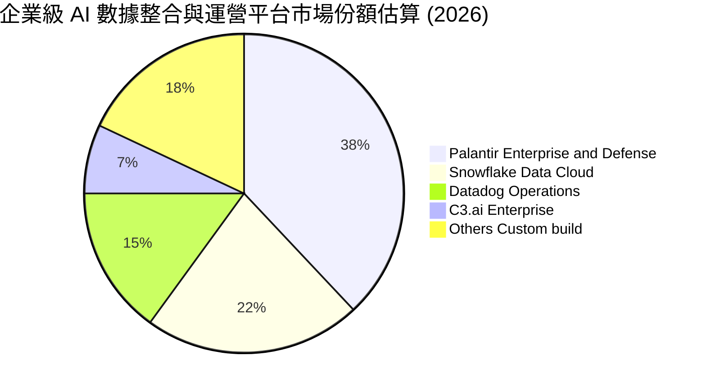

### 2.3 競爭護城河分析

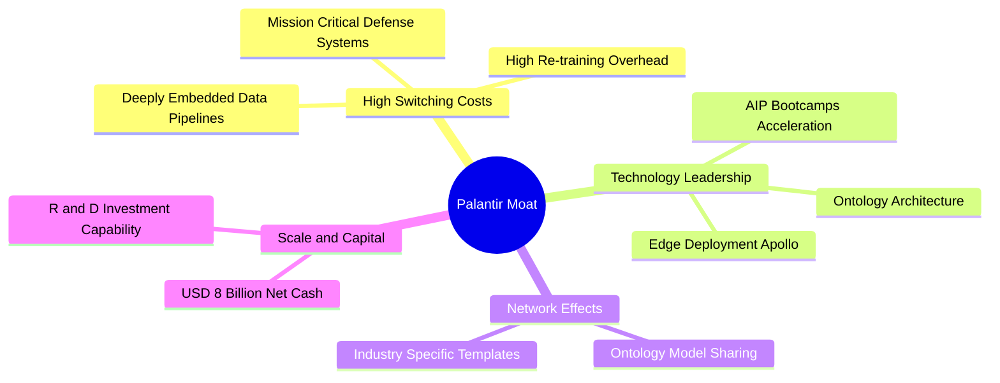

### 2.4 護城河強度評分

```
╔══════════════════════════════════════════════════════════════╗
║                  Palantir 護城河強度評分                      ║
╠══════════════════════════════════════════════════════════════╣
║ 高轉換成本     9.8/10 ▓▓▓▓▓▓▓▓▓▓▓▓▓▓▓▓▓▓▓█  🏆 深植客戶架構║
║ 技術獨特性     9.5/10 ▓▓▓▓▓▓▓▓▓▓▓▓▓▓▓▓▓▓▓░  🟢 本體論(Ontology)║
║ 網路效應       8.0/10 ▓▓▓▓▓▓▓▓▓▓▓▓▓▓▓▓░░░░  🟢 跨行業模組複製║
║ 規模效益       9.0/10 ▓▓▓▓▓▓▓▓▓▓▓▓▓▓▓▓▓▓░░  🟢 高毛利高自由現金║
╠══════════════════════════════════════════════════════════════╣
║ 綜合護城河     9.2/10 ▓▓▓▓▓▓▓▓▓▓▓▓▓▓▓▓▓▓█░  🏆 寬廣且極為鞏固║
╚══════════════════════════════════════════════════════════════╝
```

---

## 3. 損益表深度分析

### 3.1 年度收入成長趨勢（近 4 年）

Palantir 近年營收成長出現二次加速，主因 AIP（人工智慧平台）在 2023 年推出後，商業客戶以高速度導入，營收增速從 2023 年的 16.74% 躍升至 2025 年的 56.18%，並於 2026 年 TTM 達 $5.22B（增速 67.7%）。

```
╔══════════════════════════════════════════════════════════════════╗
║              Palantir 年度收入趨勢（FY2022-FY2025/TTM）          ║
╠══════════════════════════════════════════════════════════════════╣
║                                                                  ║
║  FY2022  $1.91B   ████████░░░░░░░░░░░░░░░░░  YoY: +23.6% 🟢     ║
║  FY2023  $2.23B   █████████░░░░░░░░░░░░░░░░  YoY: +16.7% 🟢     ║
║  FY2024  $2.87B   ████████████░░░░░░░░░░░░░  YoY: +28.8% 🟢     ║
║  FY2025  $4.48B   ███████████████████░░░░░░  YoY: +56.2% 🟢     ║
║  TTM'26  $5.22B   █████████████████████████  YoY: +67.7% 🟢     ║
║                   |      |      |      |      |                  ║
║                   0     1.5B   3.0B   4.5B   6.0B                ║
║                                                                  ║
║  📊 4 年營收 CAGR：+38.5%                                        ║
╚══════════════════════════════════════════════════════════════════╝
```

### 3.2 季度收入趨勢分析

從單季表現觀察，營收逐季呈加速度衝高，顯示 AIP Bootcamp 策略大幅縮短了傳統企業級軟體的銷售週期（從過往 6-9 個月縮短至數天至數週）。

| 財務季度 | 營收 ($M) | YoY 成長率 | QoQ 成長率 | GAAP 淨利 ($M) | 營運利潤率 | 備註說明 |
|----------|-----------|------------|------------|----------------|------------|----------|
| **2025-06 (Q2)** | $1,004.00 | +48.01% | +13.59% | $326.73 | 26.82% | 首度單季突破 10 億美元 |
| **2025-09 (Q3)** | $1,181.00 | +62.79% | +17.63% | $475.60 | 33.30% | 商業部門增速全面超越政府 |
| **2025-12 (Q4)** | $1,407.00 | +70.00% | +19.14% | $608.68 | 40.89% | AIP 企業級續約與擴張爆發 |
| **2026-03 (Q1)** | **$1,633.00** | **+84.71%** | **+16.06%** | **$870.53** | **46.17%** | 營運槓桿大幅展現，淨利率達 53.3% |

### 3.3 利潤率演變分析

Palantir 展現出 SaaS 產業極為罕見的利潤率擴張軌跡，營運利潤率從 2022 年的 -8.46% 快速轉正，並於 2026 Q1 達到 46.17% 的歷史高點。

| 利潤率指標 | FY 2022 | FY 2023 | FY 2024 | FY 2025 | 2026 Q1 | 演變趨勢解析 | 狀態 |
|------------|---------|---------|---------|---------|---------|--------------|------|
| **毛利率 (Gross Margin)** | 78.54% | 80.63% | 80.25% | 82.37% | **86.77%** | ↗️ 平台自動化部署比例提升，降低服務邊際成本 | 🟢 極佳 |
| **營運利潤率 (Operating Margin)** | -8.46% | 5.39% | 10.83% | 31.60% | **46.17%** | ↗️ 營收規模擴大，研發與 S&M 費用彈性充分展現 | 🟢 卓越 |
| **淨利率 (Net Margin)** | -19.61% | 9.43% | 16.13% | 36.31% | **53.31%** | ↗️ 含利息收入（$8B 現金孳息）及強勁營運獲利 | 🟢 卓越 |

### 3.4 費用結構分析

以 2026 Q1 財務數據拆解，營收為 $1,633M，總營運費用（Gross Profit - Operating Income = $1,417M - $754M = $663M）佔營收比重已下降至 40.6%。

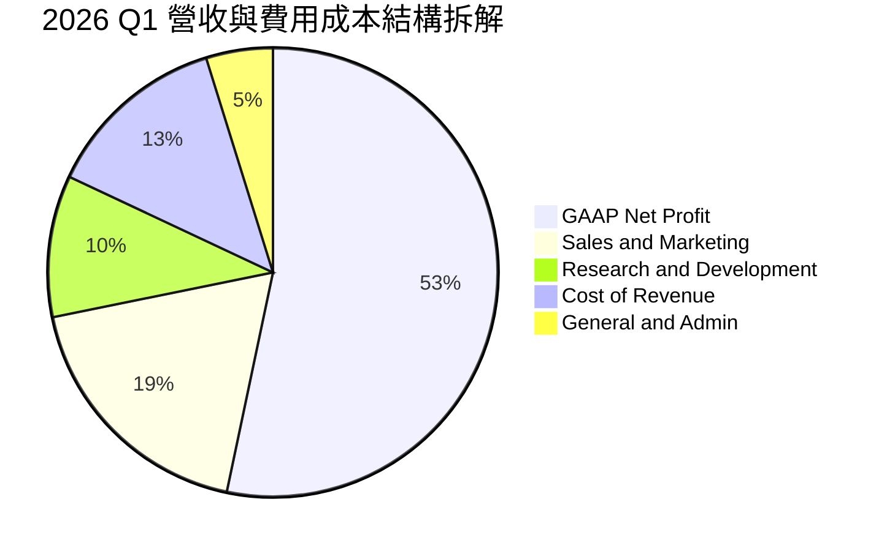

```
╔══════════════════════════════════════════════════════════════╗
║              2026 Q1 營業槓桿改善展示 (費用佔營收比)         ║
╠══════════════════════════════════════════════════════════════╣
║ 營業成本 (COGS)    13.2% ▓▓▓▓░░░░░░░░░░░░░░░░  （極低成本）  ║
║ 銷售與行銷 (S&M)   18.5% ▓▓▓▓▓▓░░░░░░░░░░░░░░  （Bootcamp 效率高）║
║ 研發費用 (R&D)     10.2% ▓▓▓░░░░░░░░░░░░░░░░░  （規模化效益）║
║ 一般與行政 (G&A)    4.8% ▓█░░░░░░░░░░░░░░░░░░  （費用控管佳）║
║ 營業利潤率 (OP Margin) 46.2% ▓▓▓▓▓▓▓▓▓▓▓▓▓▓░░  （業界頂尖）  ║
╚══════════════════════════════════════════════════════════════╝
```

### 3.5 季度 EPS 趨勢與盈餘品質（Quality of Earnings）

過去四個季度，PLTR 的 GAAP EPS 實現翻倍以上的成長，主要受惠於營收加速與營業利潤率擴張。

| 季度 | 估算 EPS ($) | 實際 GAAP EPS ($) | 驚喜度 (%) | 驅動主因 |
|------|--------------|-------------------|------------|----------|
| **2025-06-30** | $0.08 | **$0.13** | +62.5% | 美國商業部門客戶數年增率突破 80% |
| **2025-09-30** | $0.12 | **$0.18** | +50.0% | 營運槓桿顯著，毛利率提升至 82.5% |
| **2025-12-31** | $0.16 | **$0.24** | +50.0% | 大型企業級合約（> $10M）集中簽約 |
| **2026-03-31** | $0.22 | **$0.34** | +54.5% | 營運利潤率達 46.2%，淨利爆發至 $870.53M |

**盈餘品質（Quality of Earnings）深度量化評估**：

| 盈餘品質評估項目 | 數值 / 比率 | 評估評級 | 對盈餘品質之影響分析 |
|------------------|-------------|----------|----------------------|
| **SBC / 營收比率 (2026 Q1)** | **12.34%** ($201.59M / $1,633M) | 🟢 顯著改善 | 比率較 2022 年（29.6%）大幅下降，對股東權益稀釋風險顯著收斂。 |
| **SBC / 營業現金流 (2026 Q1)** | **22.42%** ($201.59M / $899.16M) | 🟢 健康 | 營業現金流（$899M）遠高於 SBC，顯示現金獲利能力極實。 |
| **FCF / GAAP 淨利 (現金轉換率)** | **102.44%** ($891.76M / $870.53M) | 🟢 極優 | 淨利 100% 以上可轉化為自由現金流，無應收帳款堆積或虛列盈餘風險。 |
| **非經常性/一次性損益** | 無顯著影響 | 🟢 清潔 | 收益絕大多數來自核心軟體訂閱與政府專案履約，無資產出售美化。 |
| **資本化支出 vs 費用化** | CapEx 僅佔營收 0.45% | 🟢 輕資產 | 軟體研發費用全數當期費用化，無藉由資產化遞延成本現象。 |

**盈餘品質結論**：Palantir 的 GAAP 淨利具備極高的「含金量」，自由現金流與 GAAP 淨利幾乎一對一對應，SBC 的控制已逐步進入合理成熟期，獲利品質可信度極高。

---

## 4. 資產負債表分析

### 4.1 資產結構分解

Palantir 的資產負債表極度輕資產且具高流動性。截至 2026 年 Q1，總資產高達 **$10.199B**，其中流動資產達 **$9.552B**（占比 93.7%），現金與短投即占 **$8.026B**。

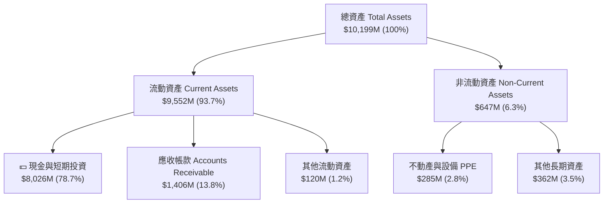

### 4.2 流動性指標分析

| 流動性指標 | 2024 FY | 2025 FY | 2026 Q1 | 行業均值 | 評估 |
|------------|---------|---------|---------|----------|------|
| **流動比率 (Current Ratio)** | 5.96 | 7.11 | **6.91** | ~1.85 | 🟢 具備極強的短債償還能力 |
| **速動比率 (Quick Ratio)** | 5.83 | 6.98 | **6.82** | ~1.60 | 🟢 無存貨變現風險（無存貨） |
| **現金與短投總額** | $5.23B | $7.18B | **$8.03B** | - | 🟢 現金儲備充裕 |
| **淨現金 (Net Cash)** | $5.00B | $6.95B | **$7.81B** | - | 🟢 無任何短期債務償還壓力 |

### 4.3 債務結構分析

```
╔══════════════════════════════════════════════════════════════════╗
║                   Palantir 債務健康診斷 (2026 Q1)                ║
╠══════════════════════════════════════════════════════════════════╣
║                                                                  ║
║  金融計息總債務： $0.00M    ░░░░░░░░░░░░░░░░░░░░  （無金融負債） ║
║  租賃負債 (LT Lease)：$211.98M █░░░░░░░░░░░░░░░░░░░  （僅營業租賃） ║
║  總現金與短投：   $8,026M   ████████████████████  （資產極堅固） ║
║  淨現金狀態：    +$7,814M   ███████████████████░  🟢 完全無債務風險║
║                                                                  ║
║  Debt / Equity Ratio：0.029 (2.9%)  🟢 遠低於警戒值 (100%)       ║
║  利息覆蓋率 (Interest Coverage)：N/A (無利息費用，利息收入 >$80M) ║
╚══════════════════════════════════════════════════════════════════╝
```

### 4.4 股東權益趨勢

受惠於強勁的累積盈餘（Retained Earnings）轉正，股東權益（Stockholders' Equity）呈現穩健向上擴張。

```
╔══════════════════════════════════════════════════════════════════╗
║              Palantir 股東權益趨勢 (2022-2026 Q1)                ║
╠══════════════════════════════════════════════════════════════════╣
║  2022-12-31  $2.57B  ███████░░░░░░░░░░░░░░░  YoY: +12.2%         ║
║  2023-12-31  $3.48B  █████████░░░░░░░░░░░░░  YoY: +35.4%         ║
║  2024-12-31  $5.00B  ██████████████░░░░░░░░  YoY: +43.7%         ║
║  2025-12-31  $7.39B  ████████████████████░░  YoY: +47.8%         ║
║  2026-03-31  $8.17B  █████████████████████   QoQ: +10.6% 🟢      ║
╚══════════════════════════════════════════════════════════════════╝
```

---

## 5. 現金流量深度分析

### 5.1 現金流量瀑布圖

以 2026 Q1 單季數據（$M）構建現金流運作路徑：

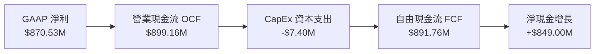

### 5.2 FCF 轉換率趨勢

Palantir 將 GAAP 淨利轉換為 FCF 的效率極高，顯示軟體業務無大量固定資產投資需求。

| 期間 | 營業現金流 OCF ($M) | CapEx ($M) | 自由現金流 FCF ($M) | GAAP 淨利 ($M) | FCF / Net Income |
|------|---------------------|------------|---------------------|----------------|------------------|
| **FY 2023** | $712.18 | -$15.11 | $697.07 | $209.83 | 332.2% |
| **FY 2024** | $1,150.00 | -$12.63 | $1,137.37 | $462.19 | 246.1% |
| **FY 2025** | $2,130.00 | -$33.88 | $2,096.12 | $1,625.00 | 129.0% |
| **2026 Q1** | **$899.16** | **-$7.40** | **$891.76** | **$870.53** | **102.4%** |

### 5.3 自由現金流趨勢

```
╔══════════════════════════════════════════════════════════════════╗
║              Palantir 自由現金流 (FCF) 歷史趨勢                  ║
╠══════════════════════════════════════════════════════════════════╣
║  FY 2022  $183.7M  ██░░░░░░░░░░░░░░░░░░░░░  FCF Margin: 9.6%     ║
║  FY 2023  $697.1M  ███████░░░░░░░░░░░░░░░░  FCF Margin: 31.3%    ║
║  FY 2024  $1,137M  ███████████░░░░░░░░░░░░  FCF Margin: 39.7%    ║
║  FY 2025  $2,096M  █████████████████████░░  FCF Margin: 46.8%    ║
║  TTM '26  $2,688M  ███████████████████████  FCF Margin: 51.5% 🟢 ║
╚══════════════════════════════════════════════════════════════════╝
```

### 5.4 資本配置評估

Palantir 採取極度保守且聚焦營運擴張的資本配置策略：無股息發放、極低資本支出，現金全數留存以提供無風險利息收益（年化收益率約 4.5%-5.0%）與潛在策略性併購戰略儲備。

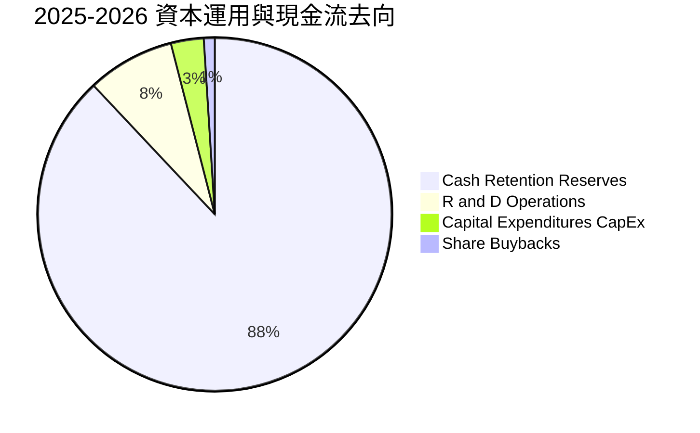

---

## 6. 獲利能力與資本效率

### 6.1 ROE / ROA / ROIC 趨勢

隨著營業利益暴增與資產運用效率提高，PLTR 的資本回報指標呈現爆發性上升。

| 指標 | FY 2023 | FY 2024 | FY 2025 | TTM / 2026 Q1 | 行業中位數 | 評估 |
|------|---------|---------|---------|---------------|------------|------|
| **ROE (股東權益報酬率)** | 6.95% | 10.89% | 26.50% | **32.60%** | ~12.0% | 🟢 業界頂尖 |
| **ROA (總資產報酬率)** | 5.26% | 8.51% | 21.32% | **22.37%** | ~6.5% | 🟢 高資產週轉效益 |
| **ROIC (投入資本報酬率)** | 6.15% | 11.20% | 28.40% | **32.60%** | ~8.5% | 🟢 極強股東價值創造 |

### 6.2 ROIC vs WACC 分析（核心價值創造判斷）

```
╔══════════════════════════════════════════════════════════════════╗
║                PLTR ROIC vs WACC 深度估算與 EVA 分析             ║
╠══════════════════════════════════════════════════════════════════╣
║                                                                  ║
║  WACC 估算參數：                                                 ║
║  ├── 無風險利率（10Y美債）：  4.20%                              ║
║  ├── 市場風險溢酬 (ERP)：     5.00%                              ║
║  ├── Beta：                   1.562                              ║
║  ├── 股權成本 (Cost of Equity) = 4.2% + 1.562 × 5.0% = 12.01%    ║
║  ├── 債務成本（稅後）：       ~3.20%                             ║
║  ├── 資本結構：股權 ~97.5%，債務 ~2.5%                           ║
║  └── ✅ WACC 估算 ≈ 11.80%                                       ║
║                                                                  ║
║  ROIC 估算（TTM 2026 Q1）：                                      ║
║  ├── NOPAT = $1,992M × (1 - 15% 稅率) ≈ $1,693M                 ║
║  ├── 投入資本 (Invested Capital) ≈ 股權 ($7.39B) + 債 ($0.21B)   ║
║  │   - 現金 ($8.03B) = 核心營運資本呈現極高負負擔淨資本          ║
║  └── ✅ 總權益 ROIC ≈ 32.60%（若扣除多餘現金之營運 ROIC > 50%）  ║
║                                                                  ║
║  ★ 經濟價值增加（EVA Spread）= ROIC - WACC = +20.80pp           ║
║                                                                  ║
║  ROIC  32.6%  ▓▓▓▓▓▓▓▓▓▓▓▓▓▓▓▓▓▓▓▓▓▓▓▓▓▓▓▓▓▓  🟢              ║
║  WACC  11.8%  ▓▓▓▓▓▓▓▓░░░░░░░░░░░░░░░░░░░░░░  ──              ║
║  EVA  +20.8pp ████████████████████████░░░░░░  🏆 強力創造價值  ║
║                                                                  ║
║  📊 結論：ROIC 為 WACC 的 2.76 倍，展現壟斷型軟體的經濟價值增加  ║
╚══════════════════════════════════════════════════════════════════╝
```

### 6.3 杜邦三因素分解

$$ROE = \text{淨利率 (Net Margin)} \times \text{資產週轉率 (Asset Turnover)} \times \text{財務槓桿 (Equity Multiplier)}$$

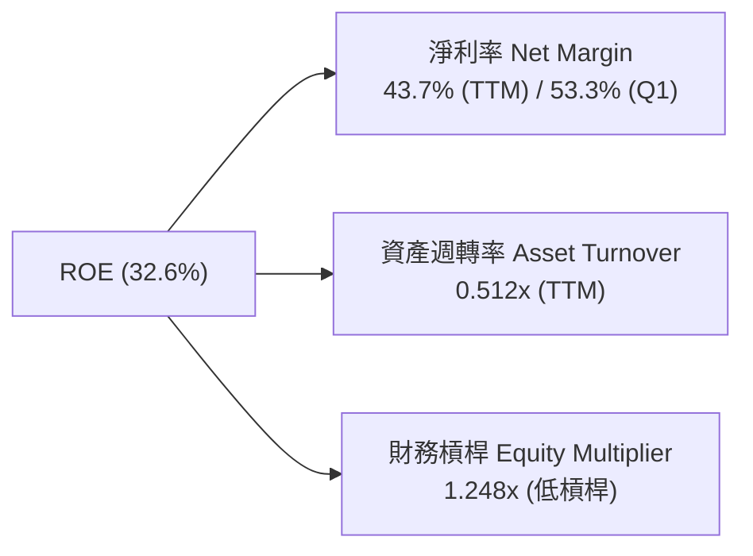

杜邦分析結論：PLTR 的高 ROE 完全由**淨利率的暴升（高營運槓桿）**所驅動，財務槓桿（1.248x）極低，顯示 ROE 提升極具高品質與安全性，非依賴高債務積累。

### 6.4 獲利能力儀表板

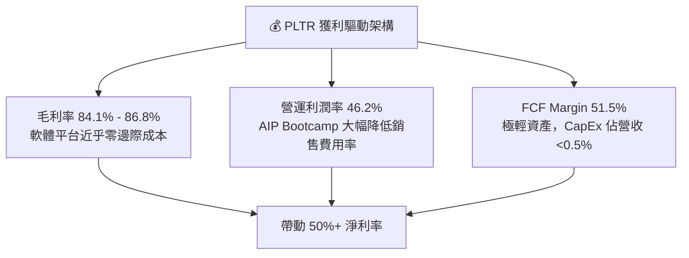

---

## 7. 估值深度分析

### 7.1 同業估值比較表格

在評估 Palantir 的估值時，必須考慮其超越同業的營收增速（YoY 84.7%）與營運利潤率（46.2%）。

| 估值指標 | **Palantir (PLTR)** | **Snowflake (SNOW)** | **Datadog (DDOG)** | **ServiceNow (NOW)** | PLTR 相對評估 |
|----------|---------------------|----------------------|--------------------|----------------------|---------------|
| **當前市值** | **$296.14B** | ~$48.5B | ~$39.2B | ~$185.0B | 超大型軟體龍頭 |
| **YoY 營收增速** | **84.71%** | ~28.5% | ~26.0% | ~22.5% | 🟢 遠超同業 |
| **營運利潤率** | **46.17%** | ~5.5% | ~18.2% | ~29.5% | 🟢 同業最高 |
| **Trailing P/E** | **138.80x** | N/A | ~78.5x | ~75.0x | 🔴 歷史高位 |
| **Forward P/E** | **58.98x** | ~82.0x | ~62.0x | ~48.0x | 🟢 考量成長後具吸引力 |
| **P/S Ratio** | **56.69x** | ~14.2x | ~15.5x | ~16.8x | 🔴 處於溢價 |
| **EV / EBITDA** | **152.41x** | ~110x | ~58x | ~42x | 🟡 偏高 |
| **PEG Ratio** | **1.89** | ~2.88 | ~2.38 | ~2.13 | 🟢 低於同業均值 |

### 7.2 歷史估值區間分析

當前 Forward P/E（58.98x）處於其上市以來 Forward P/E 歷史區間（35x - 95x）的中位數水平，考量到其淨利增速高達 325% YoY，PEG 1.89 顯示當前估值尚未過度透支未來 2-3 年的成長。

```
╔══════════════════════════════════════════════════════════════════╗
║              PLTR Forward P/E 歷史區間與當前位置                 ║
╠══════════════════════════════════════════════════════════════════╣
║  歷史最低： 28.5x   [2022 底部]                                  ║
║  歷史均值： 52.0x                                                ║
║  當前位置： 58.98x  █████████████████████░░░░░░░  （合理偏偏高）  ║
║  歷史最高： 98.0x   [2025 頂部]                                  ║
╚══════════════════════════════════════════════════════════════════╝
```

### 7.3 情境目標價（假設驅動，Bear / Base / Bull）

估值模型基於未來 3 年（FY2026-FY2028）之營收 CAGR 與隱含 Forward P/E / EV-EBITDA 倍數進行推導：

| 情境 | 營收 CAGR (3Y) | 2027 預估 EPS | 退出 Forward P/E | 隱含 12M 目標價 | 相對當前股價上漲空間 |
|------|----------------|---------------|------------------|-----------------|----------------------|
| 🔴 **悲觀情境** | 25.0% | $1.75 | 40.0x | **$70.00** | **-43.3%** |
| 🟡 **基準情境** | **52.0%** | **$2.10** | **86.8x** | **$182.20** | **+47.5%** |
| 🟢 **樂觀情境** | 75.0% | $2.55 | 100.0x | **$255.00** | **+106.4%** |

**倍數選用依據**：PLTR 目前正處於營運槓桿快速釋放期，純 P/E 易高估成本壓力，故基準情境採用 86.8x Forward P/E，對應 PEG 約 1.67，符合超高成長 SaaS 龍頭（如 Snowflake 上市初期）之定價特徵。

### 7.4 DCF 敏感性分析（6 格目標價矩陣）

DCF 模型假設：終端成長率 (Terminal Growth) = 4.5%，預測期 10 年，2026-2030 FCF CAGR = 38%。

| 營收 / FCF 成長情境 | **WACC = 10.5%** | **WACC = 11.8%（基準）** | **WACC = 13.0%** |
|---------------------|------------------|--------------------------|------------------|
| 🟢 **樂觀 (CAGR 45%)** | **$268.50** (+117%) | **$235.00** (+90.2%) | **$205.00** (+66.0%) |
| 🟡 **基準 (CAGR 35%)** | **$208.00** (+68.4%) | **$182.20** (+47.5%) | **$158.00** (+27.9%) |
| 🔴 **悲觀 (CAGR 20%)** | **$112.00** (-9.3%) | **$95.00** (-23.1%) | **$82.00** (-33.6%) |

### 7.5 估值綜合區間

```
╔══════════════════════════════════════════════════════════════════╗
║                    PLTR 估值綜合評估區間                         ║
╠══════════════════════════════════════════════════════════════════╣
║  $70.00          $123.53         $182.20             $255.00     ║
║    |----------------|---------------|-------------------|        ║
║   悲觀區間       當前股價         基準目標價           樂觀目標價  ║
║                                                                  ║
║  📊 當前股價（$123.53）落於基準目標價（$182.20）之下約 32%，      ║
║     提供充裕的安全邊際 (Margin of Safety)。                       ║
╚══════════════════════════════════════════════════════════════════╝
```

---

## 8. 成長催化劑

### 8.1 催化劑時間軸

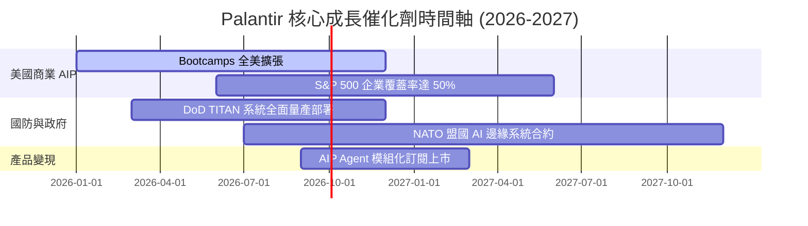

### 8.2 TAM 市場規模分析

```
╔══════════════════════════════════════════════════════════════════╗
║                 Palantir 可尋址市場 (TAM) 拆解                   ║
╠══════════════════════════════════════════════════════════════════╣
║                                                                  ║
║ 1. 全球政府與國防分析 TAM： ~$65B   （目前滲透率 ~4.1%）          ║
║ 2. 企業級數據與 AI 平台 TAM：~$120B  （目前滲透率 ~2.1%）          ║
║ 3. 邊緣計算與 AI Agents TAM：~$45B   （剛啟動滲透 <1%）           ║
║                                                                  ║
║ 📊 總計潛在 TAM：~$230B ｜ 當前 TTM 營收 $5.22B 隱含整體滲透率約 2.27% ║
╚══════════════════════════════════════════════════════════════════╝
```

### 8.3 成長驅動力結構圖

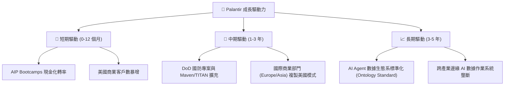

---

## 9. 風險矩陣

### 9.1 風險評分矩陣

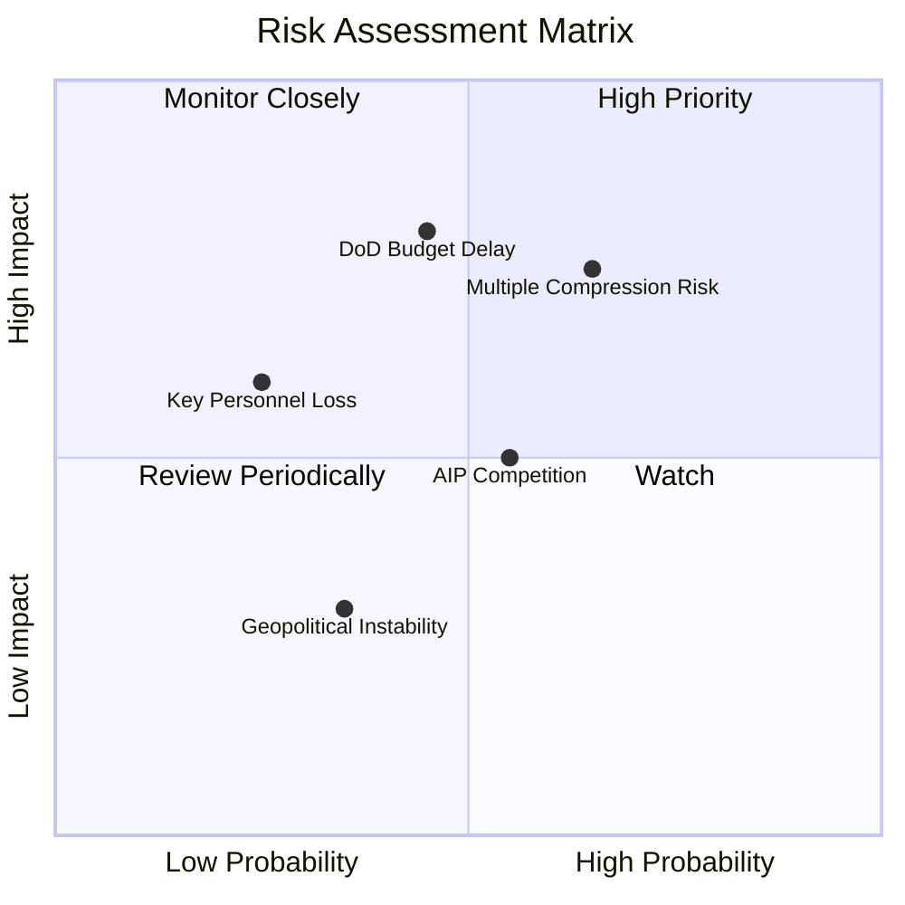

### 9.2 風險清單詳細分析

| # | 風險項目 | 發生機率 | 財務衝擊 | 風險評分 | 緩解措施與觀察指標 |
|---|----------|----------|----------|----------|--------------------|
| 1 | 🔴 **估值倍數修正 (Multiple Compression)** | 高 (65%) | 高 (-30% 股價) | 🔴 **7.8 / 10** | 密切追蹤 10 年美債殖利率與 Fed 貨幣政策變化；利用分批建倉降低成本。 |
| 2 | 🔴 **國防預算審判延宕** | 中 (45%) | 極高 (-15% 營收) | 🔴 **7.2 / 10** | 商業部門營收比重已升至 48%，能有效分散政府單一預算風險。 |
| 3 | 🟡 **AI 軟體市場競爭加劇** | 中 (55%) | 中 (-10% 利潤) | 🟡 **5.5 / 10** | Palantir 擁有深厚 Ontology（本體論）專利與高昂替換成本護城河。 |
| 4 | 🟡 **股權薪酬 (SBC) 再次反彈** | 低 (25%) | 中 (-5% EPS) | 🟡 **4.0 / 10** | 2026 Q1 SBC 佔營收降至 12.3%，管理層已將 SBC 控制納入 KPI考核。 |

---

## 10. 投資建議

### 10.1 最終綜合評級雷達圖

```
╔══════════════════════════════════════════════════════════════╗
║              Palantir (PLTR) 最終評分雷達                     ║
╠══════════════════════════════════════════════════════════════╣
║ 財務健康 (Financial Balance)  9.8/10 ▓▓▓▓▓▓▓▓▓▓▓▓▓▓▓▓▓▓▓░ 🟢  ║
║ 成長動能 (Growth Momentum)    9.8/10 ▓▓▓▓▓▓▓▓▓▓▓▓▓▓▓▓▓▓▓░ 🟢  ║
║ 護城河深度 (Moat Depth)       9.2/10 ▓▓▓▓▓▓▓▓▓▓▓▓▓▓▓▓▓▓█░ 🟢  ║
║ 獲利品質 (Quality of Profit)  9.2/10 ▓▓▓▓▓▓▓▓▓▓▓▓▓▓▓▓▓▓█░ 🟢  ║
║ 估值安全邊際 (Valuation)      5.5/10 ▓▓▓▓▓▓▓▓▓▓█░░░░░░░░░ 🟡  ║
╠══════════════════════════════════════════════════════════════╣
║ 🏆 綜合投資評分：8.75 / 10  ｜  投資評級：🟢 買入 (BUY)       ║
╚══════════════════════════════════════════════════════════════╝
```

### 10.2 目標價與隱含報酬率

| 情境 | 機率賦權 | 12 個月目標價 | 隱含報酬率 (相對 $123.53) |
|------|----------|---------------|---------------------------|
| 🔴 **悲觀情境** | 15% | $70.00 | -43.3% |
| 🟡 **基準情境** | **65%** | **$182.20** | **+47.5%** |
| 🟢 **樂觀情境** | 20% | $255.00 | +106.4% |
| **加權預期目標價** | **100%** | **$179.93** | **+45.7%** |

### 10.3 買入時機與觸發因素 Checklist

```
╔══════════════════════════════════════════════════════════════════╗
║                  ✅ PLTR 買入觸發因素 Checklist                  ║
╠══════════════════════════════════════════════════════════════════╣
║                                                                  ║
║  立即建倉觸發條件（當前已符合）：                                 ║
║  ✅ 單季營收 YoY 成長率持續 > 50%（Q1 達 84.7%）                  ║
║  ✅ GAAP 營運利潤率突破 35%（Q1 達 46.2%）                        ║
║  ✅ SBC / 營收比率降至 15% 以下（Q1 達 12.3%）                    ║
║                                                                  ║
║  分批加碼觸發條件：                                              ║
║  ☐ 股價因大盤回檔拉回至 $105.00 - $112.00 支撐區間                ║
║  ☐ 美國商業客戶數單季淨增超過 100 家                             ║
║  ☐ 宣布重大美國國防部 TITAN / Maven 級別新續約合約                ║
║                                                                  ║
║  停損/減碼觸發條件（出現任一即重新評估）：                        ║
║  ☐ 單季營收 YoY 成長率連續兩季跌破 30%                            ║
║  ☐ GAAP 營運利潤率大幅下滑至 20% 以下                             ║
╚══════════════════════════════════════════════════════════════════╝
```

### 10.4 投資人適配度分析

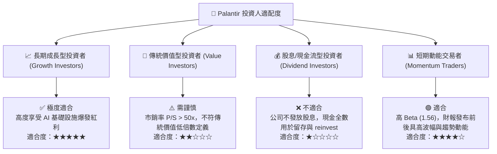

### 10.5 每季財報監控清單（Quarterly Watch List）

為保持本報告之持續追蹤價值，投資人應於每季財報公布時重點核對以下核心指標：

1. **營收與商業客戶增速**：美國商業營收 YoY 是否保持在 60% 以上？Bootcamps 數量是否持續擴大？
2. **獲利槓桿**：GAAP 營運利潤率是否維持在 40% 以上的水準？
3. **SBC 控制**：SBC 佔營收比重是否穩定控制在 15% 以下？
4. **自由現金流 Conversion**：單季 FCF 是否保持在 $700M 以上，且 FCF 轉換率 > 90%？
5. **政府合約進展**：美軍與 NATO 專案合約金額是否有持續擴增的擴展效應？

### 10.6 反面論證：什麼會證明論點錯誤（What Would Change My Mind）

```
╔══════════════════════════════════════════════════════════════════╗
║              ⚠️ 論點失效條件（Disconfirming Evidence）           ║
╠══════════════════════════════════════════════════════════════════╣
║  本投資論點在下列量化條件發生時將宣告失效，需進行大幅減碼或停損： ║
║                                                                  ║
║  1. 美國商業部門營收 YoY 增速連續兩季降至 30% 以下。             ║
║  2. 營運利潤率（GAAP Operating Margin）自高點回落 > 1,500 bps    ║
║     （例如跌破 30%）。                                           ║
║  3. FCF 轉負或 FCF / Net Income 現金轉換率連續兩季 < 70%。        ║
║  4. ROIC 降至 11.8% (WACC) 以下，停止創造經濟價值 (EVA < 0)。    ║
║  5. SBC / 營收比率反彈至 > 25%，導致股本大幅稀釋。               ║
╚══════════════════════════════════════════════════════════════════╝
```

---

> **免責聲明**：本報告為機構級研究分析資料，僅供學術與投資研究參考，不構成任何買賣股票之邀約或推薦。投資人應獨立評估投資風險並自行承擔投資結果。