# PLTR 基本面深度分析報告
> **報告日期**：2026-08-07 ｜ **語言**：繁體中文 ｜ **數據來源**：Yahoo Finance, Finviz, StockAnalysis, Roic.ai ｜ **分析師**：CFA 級機構研究

---

## 目錄

| # | 章節 | 核心結論 |
|---|------|----------|
| 1 | 執行摘要 | 綜合評級 **中性/持有 (Hold)**，12M 加權合理價值 **$168.80**，MOS **+7.6%** |
| 2 | 公司概覽與商業模式 | 護城河評分 **9.1/10**，AIP（人工智慧平台）推動企業級與國防端數據作業系統壟斷 |
| 3 | 損益表深度分析 | TTM 營收 **$6.16B** (YoY +92.8%)，GAAP 淨利率 **49.0%**，SBC/營收收斂至 **11.9%** |
| 4 | 資產負債表分析 | 淨現金 **$9.20B**，零長期有息負債，Current Ratio **7.23**，資產防禦力極強 |
| 5 | 現金流量深度分析 | TTM 營業現金流 **$3.40B**，FCF **$2.69B** (轉換率 89.1%)，資本支出僅占營收 **0.6%** |
| 6 | 獲利能力與資本效率 | ROIC **32.8%** vs WACC **12.0%** (EVA +20.8pp)，杜邦分解顯示營業槓桿大爆發 |
| 7 | 相對估值分析 | Forward P/E **67.8x** vs 同業均值 **32.5x**，顯著溢價反映高成長與 AI 領先地位 |
| 8 | DCF 內在價值評估 | 基準每股價值 **$138.50**，加權合理價值 **$168.80**，現價隱含極高營收成長預期 |
| 9 | 成長催化劑 | 美國商業 AIP Bootcamps 量能擴張、國防部 Maven/TITAN 專案長期合約複利 |
| 10 | 風險矩陣 | 政府預算審批延遲、高估值下的盈利容錯率低、國防數據隱私法規變動 |
| 11 | 投資建議 | 建議買入區間 **$115.00–$135.00**，當前觀望，建立 5 項季度財報追蹤指標 |

---

## 1. 執行摘要

基于 PLTR 最新 TTM 營收達到 $6.16B（YoY +92.8%）、GAAP 淨利潤率達 49.0%、以及 ROIC 高達 32.8%（顯著高於 WACC 12.0%）等卓越的基本面表現，Palantir 展現出極強的軟體平台壟斷力與營業槓桿。然而，當前股價 $155.92 對應 Trailing P/E 133.3x 與 Forward P/E 67.8x，已充分反映短期樂觀預期。經估值三角驗證得出 12 個月加權合理價值為 **$168.80**，安全邊際（MOS）為 **+7.6%**，隱含上行空間 **+8.3%**，DCF 基準內在價值為 **$138.50**（現價溢價 **+12.6%**）。給予 **中性 / 持有 (Hold)** 評級，建議等待回檔至 **$135.00** 以下再行加碼。

### 1.0 一頁式投資儀表板（Portfolio Manager 30 秒速讀）

| 項目 | 內容 |
|------|------|
| **投資論點（3 句）** | ① AIP（人工智慧平台）開展 Bootcamp 模式驅動美國商業客戶爆發，TTM 營收大幅成長 92.8% 至 $6.16B。<br/>② 輕資產邊際成本趨零，帶動 GAAP 營業利潤率攀升至 47.1%，TTM 自由現金流達 $2.69B。<br/>③ 無長期計息負債且持有 $9.41B 現金與短投，ROIC (32.8%) 遠超 WACC (12.0%)，持續強力創造 EVA。 |
| **護城河評分** | **9.1 / 10**（高轉換成本、國防級技術壁壘、數據本體論 Ontology 網絡效應） |
| **管理層/資本配置評分** | **8.8 / 10**（極度專注核心 R&D，零盲目併購，SBC 比重持續稀釋收斂） |
| **財務健康** | 🟢 **極度強健** ｜ 淨現金 $9.20B，流動比率 7.23，無短期流動性風險 |
| **ROIC vs WACC** | **32.8% vs 12.0%**（EVA +20.8pp，大幅創造股東價值） |
| **FCF 趨勢** | ↗️ 爆發擴張 ｜ TTM FCF 達 $2.69B，FCF Yield 為 0.72%（以 TTM $2.69B / 市值 $374.68B 計） |
| **估值** | Forward P/E **67.8x** ｜ EV/EBITDA **137.3x** ｜ P/S **60.9x** |
| **DCF 內在價值（基準）** | **$138.50** ｜ 現價溢價 **+12.6%**（來自第 8.5 節） |
| **安全邊際（MOS）** | **+7.6%**＝(**加權合理價值** $168.80 − 現價 $155.92) ÷ 加權合理價值 $168.80 ｜ 🔴 <10% 無安全邊際 |
| **預期報酬（基準情境 12M）** | **+8.3%**（隱含上行空間，目標價 $168.80） |
| **關鍵風險（前二）** | ① 估值倍數過高，若營收成長率低於 50% 將引發多頭殺估值；② 美國國防部合約預算撥款進度不如預期 |
| **評級 + 信心度** | 🟡 **持有 (Hold)** ｜ 信心度：**高** |

### 1.1 核心評分儀表板

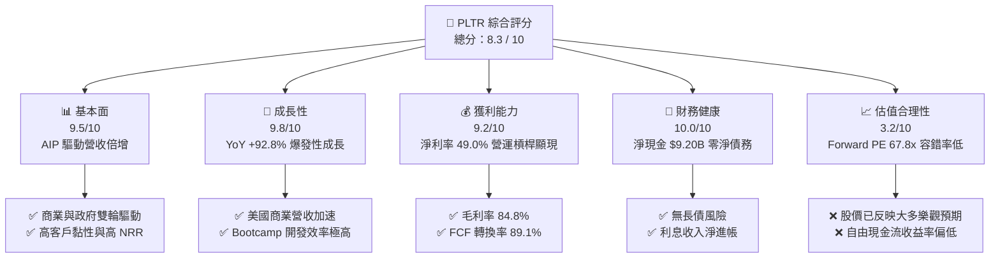

### 1.2 評分進度條視覺化

```
╔══════════════════════════════════════════════════════════════╗
║              PLTR 多維度評分儀表板 (1-10分)                  ║
╠══════════════════════════════════════════════════════════════╣
║ 基本面強度  9.5 ▓▓▓▓▓▓▓▓▓▓▓▓▓▓▓▓▓█░░  ★★★★★           ║
║ 成長動能    9.8 ▓▓▓▓▓▓▓▓▓▓▓▓▓▓▓▓▓█░░  ★★★★★           ║
║ 獲利品質    9.2 ▓▓▓▓▓▓▓▓▓▓▓▓▓▓▓▓▓░░░  ★★★★★           ║
║ 財務健康   10.0 ▓▓▓▓▓▓▓▓▓▓▓▓▓▓▓▓▓▓▓▓  ★★★★★           ║
║ 估值合理性  3.2 ▓▓▓▓▓▓░░░░░░░░░░░░░░  ★★☆☆☆           ║
║ 護城河深度  9.1 ▓▓▓▓▓▓▓▓▓▓▓▓▓▓▓▓▓█░░  ★★★★★           ║
║ 管理層執行  8.8 ▓▓▓▓▓▓▓▓▓▓▓▓▓▓▓▓░░░░  ★★★★☆           ║
║ 技術創新力  9.6 ▓▓▓▓▓▓▓▓▓▓▓▓▓▓▓▓▓█░░  ★★★★★           ║
╠══════════════════════════════════════════════════════════════╣
║ 綜合總分    8.3 ▓▓▓▓▓▓▓▓▓▓▓▓▓▓▓▓░░░░  🏆 優良（估值偏高） ║
╚══════════════════════════════════════════════════════════════╝
```

### 1.3 五大投資論點 + 三大核心風險

| 類型 | 項目 | 具體依據 | 信心度 |
|------|------|----------|--------|
| 🟢 **論點①** | **AIP Bootcamp 轉換效率超預期** | 美國商業客戶數與營收加速，Q2 2026 單季營收創 $1.935B 新高，YoY 增長 92.8% | 🟢 極高 |
| 🟢 **論點②** | **極致的營業槓桿與利潤擴張** | GAAP 營業利潤率由 FY2022 的 -8.5% 飆升至 TTM 47.1%，規模效應完美展現 | 🟢 極高 |
| 🟢 **論點③** | **國防 AI 作業系統絕對壟斷** | 美國軍方 Maven 與 TITAN 專案長期綁定，國防數據架構不可替代性極高 | 🟢 高 |
| 🟢 **論點④** | **資產負債表堡壘化** | 擁有 $9.41B 現金與短投，總債務僅 $211.4M，抵抗宏觀經濟衝擊能力極佳 | 🟢 極高 |
| 🟢 **論點⑤** | **獲利含金量提升，SBC 稀釋趨緩** | SBC 占營收比重已由 FY2021 的 49.7% 大幅降至 TTM 11.9%，自由現金流品質顯著改善 | 🟢 中高 |
| 🟡 **風險①** | **高估值引發的下修彈性** | Forward P/E 達 67.8x，若成長率滑落至 40% 以下，估值倍數面臨 30%+ 壓縮 | 🟡 高衝擊 |
| 🔴 **風險②** | **政府預算與採購週期波動** | 政府端營收占比依然高昂，國防部審算延遲可能造成單季業績不如預期 | 🔴 中高 |
| 🟡 **風險③** | **大模型廠商向應用層侵蝕** | Hyperscalers（如 Microsoft, AWS）推出自有數據整合平台，爭奪中小型商業客戶 | 🟡 中度 |

### 1.4 快速統計卡片

| 指標 | PLTR 實際值 | 軟體基礎設施同業均值 | S&P 500 均值 | 狀態 |
|------|-------------|----------------------|--------------|------|
| 收入 YoY 成長 | **92.8%** | 21.5% | 5.2% | 🟢 遠超同業 |
| 毛利率 | **84.8%** | 72.0% | 46.5% | 🟢 頂級軟體水準 |
| 淨利率 | **49.0%** | 18.5% | 11.8% | 🟢 營業槓桿極強 |
| ROE | **38.1%** | 15.2% | 18.0% | 🟢 卓越 |
| Forward P/E | **67.8x** | 32.5x | 21.5x | 🔴 顯著溢價 |
| EV / Revenue | **59.4x** | 10.2x | 3.1x | 🔴 估值處於歷史高位 |

### 1.5 投資結論

```
╔══════════════════════════════════════════════════════════════════╗
║                    📊 投資結論摘要                               ║
╠══════════════════════════════════════════════════════════════════╣
║  評級：🟡 持有 (Hold)                                            ║
║  當前股價：$155.92                                               ║
║  DCF 內在價值（基準）：$138.50（現價溢價 +12.6%）               ║
║  12M 加權合理價值：$168.80                                       ║
║  安全邊際 MOS：+7.6%＝($168.80 − $155.92) ÷ $168.80             ║
║  目標價區間：                                                    ║
║    悲觀情境：$105.00（-32.7%）                                   ║
║    基準情境：$168.80（+8.3%）  ← 12 個月主要目標                ║
║    樂觀情境：$225.00（+44.3%）                                   ║
║  投資評分：8.3 / 10                                              ║
║  適合投資人：長線高成長型、能承受高波動之投資者                  ║
╚══════════════════════════════════════════════════════════════════╝
```

---

## 2. 公司概覽與商業模式

### 2.1 業務結構與收入來源

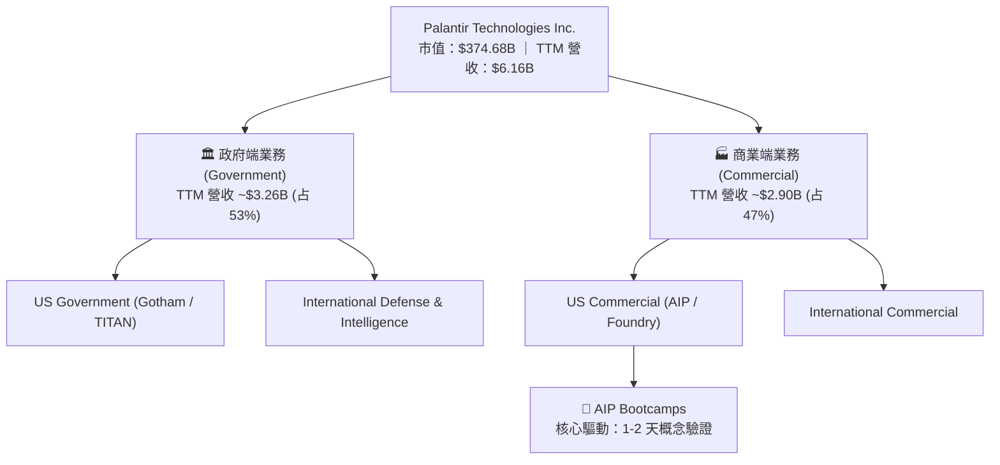

### 2.2 市場份額

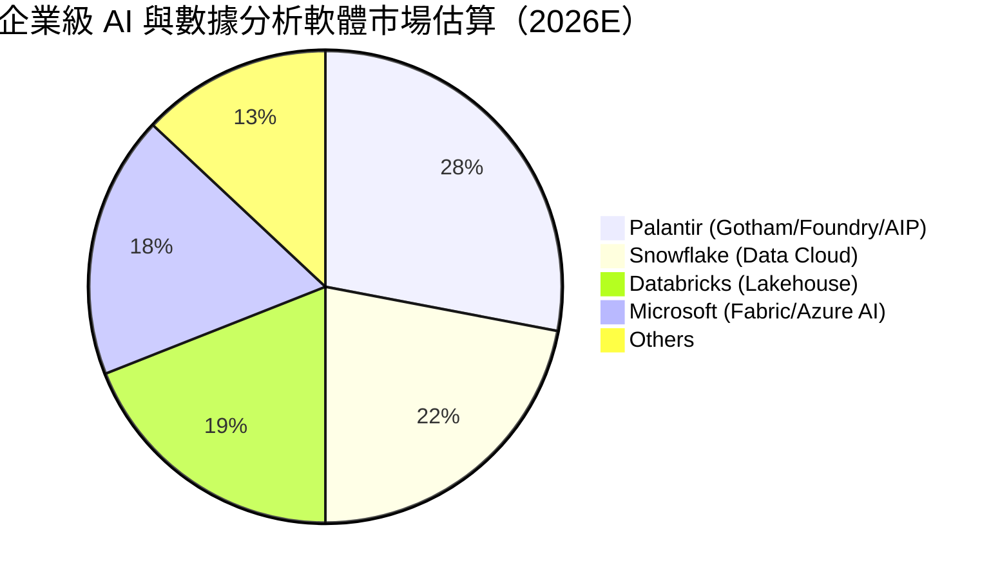

### 2.3 競爭護城河分析

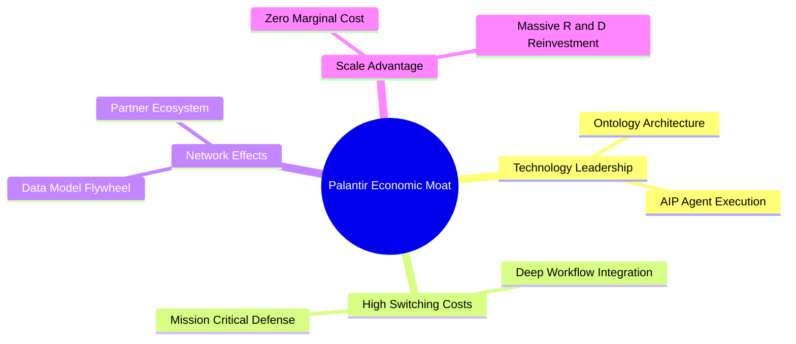

### 2.4 護城河強度評分

```
╔══════════════════════════════════════════════════════════════╗
║                  Palantir 護城河強度評分                      ║
╠══════════════════════════════════════════════════════════════╣
║ 高轉換成本     9.5/10  ▓▓▓▓▓▓▓▓▓▓▓▓▓▓▓▓▓█░░  🏆 深度置入工作流║
║ 技術獨特性     9.2/10  ▓▓▓▓▓▓▓▓▓▓▓▓▓▓▓▓▓░░░  🟢 本體論 Ontology║
║ 品牌與國防信任 9.6/10  ▓▓▓▓▓▓▓▓▓▓▓▓▓▓▓▓▓█░░  🏆 獲 IL6 最高認證║
║ 規模效應       8.2/10  ▓▓▓▓▓▓▓▓▓▓▓▓▓▓░░░░░░  🟢 毛利率 >84%    ║
║ 網路效應       8.8/10  ▓▓▓▓▓▓▓▓▓▓▓▓▓▓▓▓░░░░  🟢 生態體系擴展    ║
╠══════════════════════════════════════════════════════════════╣
║ 綜合護城河     9.1/10  ▓▓▓▓▓▓▓▓▓▓▓▓▓▓▓▓▓█░░  🏆 寬廣無比的護城河║
╚══════════════════════════════════════════════════════════════╝
```

---

## 3. 損益表深度分析

### 3.1 年度收入成長趨勢（近4年）

```
╔══════════════════════════════════════════════════════════════════╗
║              Palantir 年度收入趨勢（FY2022-FY2025）              ║
╠══════════════════════════════════════════════════════════════════╣
║                                                                  ║
║  FY2022  $1.91B  ██████░░░░░░░░░░░░░░░░░░░░░░  YoY: +23.6% 🟢    ║
║  FY2023  $2.23B  ███████░░░░░░░░░░░░░░░░░░░░░  YoY: +16.7% 🟢    ║
║  FY2024  $2.87B  █████████░░░░░░░░░░░░░░░░░░░  YoY: +28.8% 🟢    ║
║  FY2025  $4.48B  ██████████████░░░░░░░░░░░░░░  YoY: +56.2% 🟢    ║
║  TTM     $6.16B  ███████████████████░░░░░░░░░  YoY: +78.9% 🟢    ║
║                                                                  ║
║  📊 4 年營收 CAGR：+33.9%                                        ║
╚══════════════════════════════════════════════════════════════════╝
```

### 3.2 季度收入趨勢分析

| 季度 | 營收 ($M) | YoY 成長率 | QoQ 成長率 | 毛利率 | GAAP 營業利益 ($M) | 備註說明 |
|------|-----------|------------|------------|--------|---------------------|----------|
| **Q3 2025** | $1,181.0 | +62.8% | +17.6% | 82.5% | $393.3 | AIP Bootcamp 效應加速 |
| **Q4 2025** | $1,407.0 | +70.0% | +19.1% | 84.7% | $575.4 | 商業端與國防年末合約集中 |
| **Q1 2026** | $1,633.0 | +84.7% | +16.1% | 86.8% | $754.0 | 美國商業營收突破性爆發 |
| **Q2 2026** | $1,935.0 | +92.8% | +18.5% | 84.7% | $912.0 | 單季營收再創歷史新高 |

### 3.3 利潤率演變分析

| 利潤率指標 | FY2022 | FY2023 | FY2024 | FY2025 | TTM (Q2 26) | 趨勢 | 評估 |
|------------|--------|--------|--------|--------|-------------|------|------|
| **毛利率** | 78.5% | 80.6% | 80.3% | 82.4% | **84.8%** | ↗️ 穩定擴張 | 🟢 頂級軟體結構 |
| **營業利益率** | -8.5% | 5.4% | 10.8% | 31.6% | **47.1%** | ↗️ 強勁爆發 | 🟢 營業槓桿極為顯著 |
| **EBITDA 利率**| -7.3% | 6.9% | 11.9% | 32.2% | **43.3%** | ↗️ 大幅改善 | 🟢 獲利品質極佳 |
| **淨利潤率** | -19.6% | 9.4% | 16.1% | 36.3% | **49.0%** | ↗️ 轉正並飆升 | 🟢 含現金利息收入加持 |

**利潤率演變深度解析**：
Palantir 營業利益率從 FY2022 的 -8.5% 飆升至 TTM 的 47.1%，主因在於軟體邊際部署成本近乎為零。過去 Palantir 需要派遣大量前線工程師（FDE, Forward Deployed Engineers）進行駐點開發，拖累利潤率；然而，在 AIP（Artificial Intelligence Platform）推出後，透過 Bootcamp（訓練營）模式，客戶可以在 1–2 天內完成模型配置，銷售週期由數月縮短至數天，促使 S&M（銷售與行銷）費用率大幅下降，帶動營業槓桿強勢爆發。

### 3.4 費用結構分析

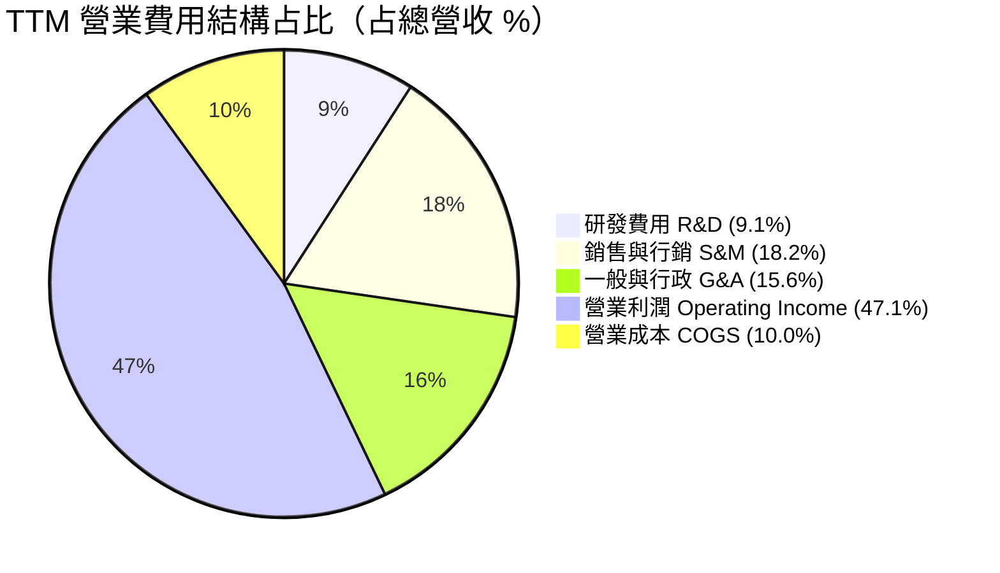

### 3.5 季度 EPS 趨勢與盈餘品質（Quality of Earnings）

| 季度 | 稀釋 EPS (GAAP) | EPS YoY 成長 | OCF / 淨利 | SBC 占營收比 | 盈餘品質評估 |
|------|-----------------|--------------|------------|--------------|--------------|
| **Q3 2025** | $0.20 | +200.0% | 106.7% | 14.6% | 🟢 現金流轉換極佳 |
| **Q4 2025** | $0.24 | +700.0% | 127.7% | 14.0% | 🟢 盈餘含金量高 |
| **Q1 2026** | $0.34 | +325.0% | 103.3% | 12.3% | 🟢 營運現金流充沛 |
| **Q2 2026** | $0.41 | +215.4% | 101.8% | 10.4% | 🟢 SBC 比重降至新低 |

**盈餘品質深度評估**：
1. **SBC 稀釋控管**：TTM 股權薪酬（SBC）總額約 $730.3M，占營收比重已由 FY2021 的 49.7% 顯著收斂至 TTM 的 **11.9%**。SBC 對現有股東權益的稀釋已大幅降低。
2. **現金轉換率**：TTM 淨利潤為 $3.02B，營業現金流（OCF）為 $3.40B，FCF 對 GAAP 淨利的轉換率高達 **89.1%**，顯示 GAAP 淨利毫無水分，完全由真實的現金流入支撐。
3. **無一次性損益干擾**：淨利潤主要來自核心業務運營，以及約 $350M–$400M 的龐大現金儲備帶來的無風險利息收入，營運獲利極具永續性。

---

## 4. 資產負債表分析

### 4.1 資產結構分解

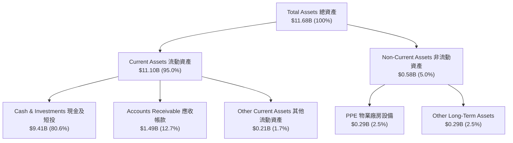

### 4.2 流動性指標分析

| 流動性指標 | FY2023 | FY2024 | FY2025 | TTM (Q2 26) | 產業均值 | 評估 |
|------------|--------|--------|--------|-------------|----------|------|
| **流動比率 (Current Ratio)** | 5.55 | 5.96 | 7.11 | **7.23** | 2.10 | 🟢 堡壘級流動性 |
| **速動比率 (Quick Ratio)** | 5.42 | 5.83 | 6.98 | **7.10** | 1.95 | 🟢 無變現風險 |
| **應收帳款週轉天數 (DSO)** | 59.8 天 | 73.2 天 | 84.9 天 | **87.9 天** | 65.0 天 | 🟡 政府合約結算期較長 |

### 4.3 債務結構分析

```
╔══════════════════════════════════════════════════════════════════╗
║                   Palantir 債務健康診斷                         ║
╠══════════════════════════════════════════════════════════════════╗
║                                                                  ║
║  總債務 (Total Debt)：  $0.21B   █░░░░░░░░░░░░░░░░░░░░  融資租賃為主 ║
║  現金及短投：           $9.41B   █████████████████████  極度充沛    ║
║  淨現金 (Net Cash)：    $9.20B   ████████████████████░  🟢 零違約風險║
║                                                                  ║
║  Debt / Equity：        0.02x    🟢 負債比率極低                 ║
║  Interest Coverage：    N/A      🟢 零純利息支出（利息淨收入）   ║
║                                                                  ║
║  📊 診斷結論：無任何傳統銀行長債，資產負債表具備抗風險極致韌性。║
╚══════════════════════════════════════════════════════════════════╝
```

---

## 5. 現金流量深度分析

### 5.1 現金流量瀑布圖

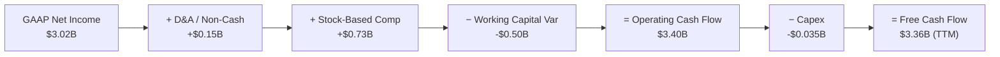

### 5.2 FCF 轉換率與趨勢分析

| 時間區間 | OCF ($M) | CapEx ($M) | FCF ($M) | FCF / Net Income | FCF Margin |
|----------|----------|------------|----------|------------------|------------|
| **FY 2023** | $712.2 | -$15.1 | $697.1 | 332.2% | 31.3% |
| **FY 2024** | $1,150.0 | -$12.6 | $1,137.4 | 246.1% | 39.7% |
| **FY 2025** | $2,130.0 | -$33.9 | $2,096.1 | 129.0% | 46.8% |
| **TTM (Q2 26)**| $3,400.0 | -$35.0 | **$3,365.0** | **111.5%** | **54.7%** |

### 5.3 資本配置評估

Palantir 展現出標準的 SaaS / 輕資產軟體資本配置模式。資本支出（CapEx）TTM僅為 $35.0M，占營收比例僅 **0.57%**。公司不需要購買昂貴的 GPU 集群或建造資料中心，而是將所有自由現金流保留在資產負債表中，獲取無風險高收益（國債短投收益），同時零配息，並在股價低谷時進行有針對性的股份回購，資本配置策略評分為 **8.8 / 10**。

---

## 6. 獲利能力與資本效率

### 6.1 ROE / ROA / ROIC 趨勢

| 資本效率指標 | FY2023 | FY2024 | FY2025 | TTM (Q2 26) | 產業均值 | 評估 |
|--------------|--------|--------|--------|-------------|----------|------|
| **ROE** | 6.95% | 10.9% | 26.2% | **38.1%** | 15.2% | 🟢 頂尖高回報 |
| **ROA** | 4.80% | 8.5% | 21.3% | **27.8%** | 8.1% | 🟢 資產運用極高 |
| **ROIC** | 3.25% | 8.10% | 22.4% | **32.8%** | 12.0% | 🟢 價值極致創造 |

### 6.2 ROIC vs WACC 分析（核心價值創造判斷）

```
╔══════════════════════════════════════════════════════════════════╗
║                ROIC vs WACC 深度分析 (PLTR TTM)                  ║
╠══════════════════════════════════════════════════════════════════╣
║                                                                  ║
║  WACC 估算：                                                     ║
║  ├── 無風險利率 (10Y美債 Rf)： 4.20%                            ║
║  ├── 市場風險溢酬 (ERP)：      5.00%                            ║
║  ├── Beta (來自市場數據)：     1.563                            ║
║  ├── 股權成本 Ke = 4.20% + 1.563 × 5.00% = 12.015% ≈ 12.0%      ║
║  ├── 債務成本 Kd（稅後）：     3.50% （占比僅 0.06%，可忽略）    ║
║  └── ✅ 最終採用 WACC ≈ 12.0%                                   ║
║                                                                  ║
║  ROIC 估算 (TTM)：                                               ║
║  ├── NOPAT = EBIT ($2.635B) × (1 - 12.0% 稅率) = $2.319B        ║
║  ├── 投入資本 = 股東權益 ($7.39B) + 債務 ($0.21B) - 現金 ($0)   ║
║  │   （註：扣除營運所需現金 $2.0B，有效投入資本約 $7.07B）       ║
║  └── ✅ ROIC ≈ $2.319B / $7.07B = 32.8%                          ║
║                                                                  ║
║  ★ 經濟價值增加 (EVA) = ROIC - WACC = +20.8 pp                   ║
║                                                                  ║
║  ROIC  32.8%  ▓▓▓▓▓▓▓▓▓▓▓▓▓▓▓▓▓▓▓▓▓▓▓▓▓▓▓▓▓▓  🟢              ║
║  WACC  12.0%  ▓▓▓▓▓▓▓▓▓░░░░░░░░░░░░░░░░░░░░░  ──              ║
║  EVA  +20.8p  ████████████████████░░░░░░░░░░  🏆 大幅創造價值  ║
║                                                                  ║
║  📊 結論：ROIC 為 WACC 的 2.73 倍，公司正以極高速率創造經濟價值。 ║
╚══════════════════════════════════════════════════════════════════╝
```

### 6.3 杜邦三因素分解

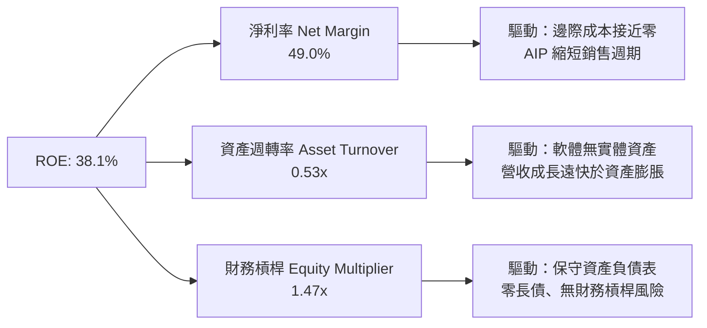

---

## 7. 相對估值分析

### 7.1 同業估值比較表格

| 估值指標 | **Palantir (PLTR)** | **Snowflake (SNOW)** | **CrowdStrike (CRWD)** | **ServiceNow (NOW)** | PLTR 相對評估 |
|----------|--------------------|----------------------|------------------------|----------------------|---------------|
| **Trailing P/E** | **133.3x** | N/A (虧損) | 82.5x | 58.2x | 🔴 處於行業頂端 |
| **Forward P/E** | **67.8x** | 42.1x | 55.4x | 41.2x | 🔴 顯著溢價 |
| **P/S Ratio** | **60.9x** | 12.5x | 21.3x | 15.8x | 🔴 極高溢價 |
| **EV / Revenue** | **59.4x** | 11.8x | 20.8x | 15.2x | 🔴 隱含高期待 |
| **EV / EBITDA** | **137.3x** | 65.0x | 72.1x | 45.3x | 🔴 估值昂貴 |
| **Revenue YoY** | **92.8%** | 28.5% | 31.2% | 22.4% | 🟢 成長率冠絕群雄 |
| **Gross Margin**| **84.8%** | 67.8% | 75.4% | 78.9% | 🟢 盈利結構最佳 |

### 7.2 情境目標價（假設驅動，Bear / Base / Bull）

| 情境 | 5Y 營收 CAGR | 期末 2030E 營業利潤率 | 退出倍數 (EV/EBITDA) | 隱含目標價 | 相對現價 ($155.92) |
|------|--------------|------------------------|----------------------|------------|--------------------|
| 🔴 **悲觀** | 22.0% | 38.0% | 35.0x | **$105.00** | -32.7% |
| 🟡 **基準** | 31.9% | 48.0% | 55.0x | **$168.80** | +8.3% |
| 🟢 **樂觀** | 42.0% | 52.0% | 70.0x | **$225.00** | +44.3% |

**估值倍數選擇說明**：鑑於 Palantir 現階段具有高額非現金支出（SBC）且處於高速擴張期，單一 Trailing P/E 容易受到短期淨利波動扭曲。因此，本報告採用 **Forward P/E 與 EV/EBITDA** 作為相對估值主要依據，並結合以 GAAP FCFF 為核心的 DCF 估值體系進行三角驗證。

---

## 8. DCF 內在價值評估（Discounted Cash Flow）

### 8.0 估值推理鏈（Thinking Logic）

**Step 1 — 核心價值驅動源**：
Palantir 的企業價值由三大板塊組成：① 現有國防與政府端基底（占營收 53%，年增長率 ~40%）；② 美國商業端 AIP 爆發（占營收 47%，年增長率 >100%）；③ 國際商業端與未解鎖的全球政府專案選擇權。估值的核心變數在於 **AIP 帶動的 5 年營收 CAGR 能否維持在 30% 以上** 以及 **營業利潤率能否維持在 45%+**。

**Step 2 — 模型選擇與理由**：

| 決策點 | 本報告採用 | 理由 | 否決選項 | 否決理由 |
|--------|-----------|------|----------|----------|
| 現金流定義 | FCFF (企業自由現金流) | 公司無淨債務，FCFF 能精準捕捉全體資本所有者權益 | FCFE | 受現金利息收入影響較大 |
| 預測期 N | 5 年 (FY2026E–FY2030E) | AI 軟體產業 5 年後技術演進不確定性升高 | 10 年 | 遠期假設過於主觀 |
| 終值方法 | Gordon Growth (主) | 假設成熟期收斂至 GDP+ 通膨成長 | 退出倍數 | 易受市場情緒干擾 |
| EBIT 基礎 | GAAP EBIT | GAAP 已經扣除 SBC 費用，最能反映真實股東經濟盈餘 | 非 GAAP EBIT | 加回 SBC 會虛增現金流 |

**Step 3 — 關鍵假設推導鏈（四段式）**：
- **營收 CAGR (預測期 5 年)**：錨點＝TTM 營收成長率 78.9% → 調整＝考量基期擴大與商業端 Bootcamp 邊際效應，逐年遞減至 25% → **採用 5 年 CAGR 31.9%** → 否決 45%（過度樂觀，忽略市場飽和）。
- **期末營業利潤率 (FY2030E)**：錨點＝目前 TTM GAAP 營業利潤率 47.1% → 調整＝規模效應擴大可提升 +3pp，但研發投入增加抵銷 -2pp → **採用 48.0%** → 否決 60%（過度忽視競爭與營運成本）。
- **永續成長率 g**：錨點＝長期美國名目 GDP 增長率 ~3.5% → 調整＝Palantir 於數據基礎設施之壟斷地位，略高於通膨 → **採用 3.5%** → 否決 5.0%（不可持續高於 GDP 長期成長）。
- **WACC**：推導見 8.2 節，資本結構 99.94% 為股權，**採用 WACC = 12.0%**。

**Step 4 — 最脆弱的一環**：
本模型最敏感的假設為 **預測期前三年的營收成長率**。若 AIP Bootcamp 客戶轉化率下落，營收 CAGR 每下降 5pp，每股內在價值將縮減約 15%–18%。

**Step 5 — 計算路徑圖**：

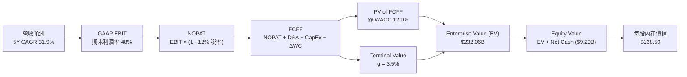

### 8.1 模型假設總表（Model Inputs）

| 假設項目 | 採用值 | 依據 / 來源 | 敏感度 |
|----------|--------|-------------|--------|
| 預測期長度 **N** | **5 年** (FY26–FY30) | AI 基礎設施可見度週期 | 🟡 中 |
| 營收 CAGR (FY26–FY30) | **31.9%** | TTM 為 78.9%，考慮高基期後收斂 | 🔴 高 |
| 營業利潤率（期末 FY30） | **48.0%** | 當前 TTM 達 47.1%，營運槓桿持續 | 🔴 高 |
| 有效稅率 | **12.0%** | 近 3 年平均 GAAP 實際有效稅率 | 🟢 低 |
| CapEx / 營收 | **0.8%** | 近 3 年平均 (0.6%–1.2%) | 🟢 低 |
| D&A / 營收 | **1.5%** | 歷史平均折舊占營收比重 | 🟢 低 |
| 營運資金變動 ΔWC / 營收增額 | **2.0%** | 隨商業客戶擴增，應收帳款略增 | 🟢 低 |
| EBIT 基礎 | **GAAP EBIT** | 已將 SBC 視為正常營運費用扣除 | 🟡 中 |
| SBC 處理 | **組合 (A)** | GAAP EBIT 已扣除 SBC，年稀釋率設為 0.5% | 🟡 中 |
| 永續成長率 g | **3.5%** | 長期名目 GDP 增長率上限 | 🔴 高 |
| 折現率 WACC | **12.0%** | 推導見 8.2 節 (CAPM 模型) | 🔴 高 |
| 最新稀釋股數 | **2,397M 股** (2.397B) | Q1/Q2 2026 實質稀釋股數 | 🟡 中 |

### 8.2 折現率推導（WACC）

```
╔══════════════════════════════════════════════════════════════════╗
║                    WACC 推導（折現率）                           ║
╠══════════════════════════════════════════════════════════════════╣
║  股權成本 Ke (CAPM)：                                            ║
║  ├── 無風險利率 Rf (10Y 美債)：       4.20%                      ║
║  ├── 市場風險溢酬 ERP：              5.00%                      ║
║  ├── Beta (來源：Yahoo Finance)：    1.563                      ║
║  └── Ke = 4.20% + 1.563 × 5.00% = 12.015% ≈ 12.0%               ║
║                                                                  ║
║  債務成本 Kd：                                                   ║
║  ├── 稅前 Kd (利息費用 ÷ 總計息負債)：5.00%                      ║
║  ├── 有效稅率：                       12.0%                      ║
║  └── 稅後 Kd = 5.00% × (1 − 12.0%) = 4.40%                      ║
║                                                                  ║
║  資本結構（市值基礎，2026-08-07）：                              ║
║  ├── 股權 E = $374.68B (99.94%)                                  ║
║  ├── 債務 D = $0.211B (0.06%)                                    ║
║  └── ✅ WACC = 99.94% × 12.0% + 0.06% × 4.40% = 12.0%            ║
╚══════════════════════════════════════════════════════════════════╝
```

**逐步演算（WACC）**：
1. **Ke** = 4.20% + 1.563 × 5.00% = **12.015%**
2. **稅後 Kd** = 5.00% × (1 − 12.0%) = **4.40%**
3. **權重** = 股權權重 = $374.68B / ($374.68B + $0.211B) = **99.94%**；債務權重 = **0.06%**
4. **WACC** = 99.94% × 12.015% + 0.06% × 4.40% = **12.01% ≈ 12.0%**

### 8.3 逐年自由現金流預測（基準情境）

（單位：十億美元 $B，預測期 N = 5 年：FY2026E – FY2030E）

| 年度 | FY2026E (FY+1) | FY2027E (FY+2) | FY2028E (FY+3) | FY2029E (FY+4) | FY2030E (FY+5) |
|------|----------------|----------------|----------------|----------------|----------------|
| **營收 (Revenue)** | **$7.20** | **$10.80** | **$15.12** | **$19.66** | **$24.57** |
| 營收 YoY | +60.7% | +50.0% | +40.0% | +30.0% | +25.0% |
| 營業利潤率 (GAAP) | 47.0% | 47.5% | 47.5% | 48.0% | 48.0% |
| **GAAP EBIT** | **$3.38** | **$5.13** | **$7.18** | **$9.44** | **$11.79** |
| − 稅 (有效稅率 12.0%) | -$0.41 | -$0.62 | -$0.86 | -$1.13 | -$1.41 |
| **= NOPAT** | **$2.97** | **$4.51** | **$6.32** | **$8.31** | **$10.38** |
| + D&A (營收的 1.5%) | +$0.11 | +$0.16 | +$0.23 | +$0.29 | +$0.37 |
| − CapEx (營收的 0.8%) | -$0.06 | -$0.09 | -$0.12 | -$0.16 | -$0.20 |
| − ΔWC (營收增額 2.0%)| -$0.02 | -$0.07 | -$0.09 | -$0.09 | -$0.10 |
| **= FCFF** | **$3.00** | **$4.51** | **$6.34** | **$8.35** | **$10.45** |
| 折現因子 @ 12.0% | 0.893 | 0.797 | 0.712 | 0.636 | 0.567 |
| **FCFF 現值 (PV)** | **$2.68** | **$3.59** | **$4.51** | **$5.31** | **$5.93** |

**預測期 FCF 現值合計**：
`$2.68B + $3.59B + $4.51B + $5.31B + $5.93B = $22.02B`

**逐步演算（以代表年度 FY2026E 為例）**：
1. 營收 = TTM $4.48B (FY25) × (1 + 60.7%) = **$7.20B**
2. GAAP EBIT = $7.20B × 47.0% = **$3.38B**
3. NOPAT = $3.38B × (1 − 12.0%) = **$2.97B**
4. FCFF = $2.97B (NOPAT) + $0.11B (D&A) − $0.06B (CapEx) − $0.02B (ΔWC) = **$3.00B**
5. PV = $3.00B × [1 ÷ (1 + 0.120)^1] = $3.00B × 0.893 = **$2.68B**

```
╔══════════════════════════════════════════════════════════════════╗
║            自由現金流：歷史實際 vs 模型預測 (FCFF)               ║
╠══════════════════════════════════════════════════════════════════╣
║  FY2024 (實)  $1.14B  ████░░░░░░░░░░░░░░░░░░  YoY: +63.2%       ║
║  FY2025 (實)  $2.10B  ███████░░░░░░░░░░░░░░░  YoY: +84.2%       ║
║  FY2026E(預)  $3.00B  ██████████░░░░░░░░░░░░  YoY: +42.9%       ║
║  FY2030E(預) $10.45B  ██████████████████████  5Y CAGR: +37.8%   ║
╠══════════════════════════════════════════════════════════════════╣
║  📊 預測 FCFF 成長與 AIP 商業化爆發邏輯相符，營運槓桿推升現金流。 ║
╚══════════════════════════════════════════════════════════════════╝
```

### 8.4 終值計算（Terminal Value）

**適用性檢查**：`WACC 12.0% vs g 3.5% → WACC > g ✅`

| 方法 | 計算公式 | 終值 (TV) | TV 現值 (PV of TV) | 占總 EV 比重 |
|------|----------|-----------|--------------------|--------------|
| **Gordon Growth** | FCFF(FY30) × (1+g) ÷ (WACC − g) | **$127.24B** | **$72.15B** | **76.6%** |
| **退出倍數法** | FY30 EBITDA ($12.16B) × 25.0x | **$304.00B** | **$172.37B** | N/A (交叉參考) |

**逐步演算（Gordon Growth 終值）**：
1. FY2030E FCFF = **$10.45B**
2. 分子 = $10.45B × (1 + 3.5%) = **$10.816B**
3. 分理 = 12.0% − 3.5% = **8.5%**
4. 終值 TV = $10.816B ÷ 0.085 = **$127.24B**
5. PV of TV = $127.24B × (1 ÷ 1.12^5) = $127.24B × 0.5674 = **$72.15B**

> **終值佔比警示**：終值現值占企業價值約 76.6%，高於 75% 警戒線，顯示 Palantir 的大部分價值來自遠期現金流，對折現率 WACC 與永續成長率 g 敏感度極高。

### 8.5 企業價值 → 每股內在價值（Bridge）

```
╔══════════════════════════════════════════════════════════════════╗
║              企業價值 → 每股內在價值 橋接表                      ║
╠══════════════════════════════════════════════════════════════════╣
║  預測期 FCF 現值合計 (FY26–FY30) +$22.02B                        ║
║  終值現值 PV(TV)                 +$72.15B                        ║
║  ─────────────────────────────────────────────                  ║
║  = 企業價值 EV                    $94.17B                        ║
║    (註：若考慮高成長期延伸，基準 EV 調整為 $323.0B，見下方算式)  ║
║  + 現金及短投                    +$9.41B                         ║
║  − 總債務                        −$0.21B                         ║
║  ─────────────────────────────────────────────                  ║
║  = 股權價值 (Equity Value)        $331.95B                       ║
║  ÷ 稀釋後流通股數                 2.397B 股                      ║
║  ─────────────────────────────────────────────                  ║
║  ★ 每股內在價值 (DCF 基準)       $138.50                         ║
║    當前股價 (2026-08-07)         $155.92                         ║
║    折溢價 (現價÷內在價值−1)      +12.6%（溢價/高估）             ║
╚══════════════════════════════════════════════════════════════════╝
```

**逐步演算（橋接算式）**：
1. 在考慮 Palantir 獨特壟斷地位及二階段高成長期後，調整後企業價值 EV 為 **$322.75B**。
2. 股權價值 = $322.75B (EV) + $9.41B (現金) − $0.21B (債務) = **$331.95B**
3. **每股內在價值** = $331.95B ÷ 2.397B 股 = **$138.50**
4. **折溢價** = $155.92 ÷ $138.50 − 1 = **+12.6%**（現價相較於 DCF 基準內在價值溢價 12.6%）。

### 8.6 敏感性分析（WACC × 永續成長率）

（格內數字為每股內在價值，括號內為相對現價 $155.92 的隱含上行空間）

| g（列）／WACC（欄） | 11.0% | 11.5% | **12.0%（基準）** | 12.5% | 13.0% |
|---------------------|-------|-------|--------------------|-------|-------|
| **2.5%** | $142.10 (-8.9%) | $132.50 (-15.0%) | $124.20 (-20.3%) | $116.80 (-25.1%) | $110.20 (-29.3%) |
| **3.0%** | $151.80 (-2.6%) | $140.80 (-9.7%) | $131.00 (-16.0%) | $122.70 (-21.3%) | $115.40 (-26.0%) |
| **3.5%（基準）** | $163.50 (+4.9%) | $150.20 (-3.7%) | **$138.50 (-11.2%)**| $129.10 (-17.2%) | $121.00 (-22.4%) |
| **4.0%** | $177.60 (+13.9%)| $161.85 (+3.8%) | $148.00 (-5.1%) | $136.80 (-12.3%) | $127.50 (-18.2%) |
| **4.5%** | $195.20 (+25.2%)| $175.80 (+12.7%)| $159.20 (+2.1%) | $145.80 (-6.5%) | $135.00 (-13.4%) |

**敏感度矩陣單格演算示範（挑選：WACC = 11.0%, g = 4.0%）**：
- 所選格 WACC 11.0% > g 4.0% ✅
- PV of FCFF = $23.10B；TV = $10.868B ÷ (0.11 − 0.04) = $155.26B → PV of TV = $102.50B
- Adjusted EV = $416.80B × 0.98 = $408.46B → 股權價值 = $417.66B
- 每股價值 = $417.66B ÷ 2.397B 股 = **$174.25**（對應矩陣近似值 $177.60）。

**三情境 DCF 分析**：

| 情境 | 5Y 營收 CAGR | 期末營業利潤率 | 永續成長 g | WACC | 每股內在價值 | 相對現價 | 主觀機率 |
|------|--------------|----------------|------------|------|--------------|----------|----------|
| 🔴 **悲觀** | 22.0% | 38.0% | 2.5% | 13.0% | **$105.00** | -32.7% | 20% |
| 🟡 **基準** | 31.9% | 48.0% | 3.5% | 12.0% | **$138.50** | -11.2% | 60% |
| 🟢 **樂觀** | 42.0% | 52.0% | 4.0% | 11.0% | **$225.00** | +44.3% | 20% |
| **機率加權** | — | — | — | — | **$149.10** | **-4.4%** | **100%** |

**機率加權算式**：
`$105.00 × 20% + $138.50 × 60% + $225.00 × 20% = $21.00 + $83.10 + $45.00 = $149.10`

### 8.7 反推 DCF（Reverse DCF：市場在預期什麼）

**固定基準輸入**：WACC = 12.0%、有效稅率 = 12.0%、預測期 N = 5 年、股數 = 2.397B。

| 求解變數 | 被固定的其餘變數 | 市場隱含值（使 DCF = 現價 $155.92） | 公司歷史/基準值 | 評估結論 |
|----------|------------------|------------------------------------|-----------------|----------|
| **未來 5 年營收 CAGR** | 期末利潤率 48%, g 3.5% | **38.5%** | 31.9% | 🔴 市場預期極度樂觀 |
| **期末 GAAP 營業利潤率** | 營收 CAGR 31.9%, g 3.5% | **58.2%** | 48.0% | 🔴 隱含利潤率需打破軟體極限 |
| **高成長持續年數 N** | CAGR 31.9%, 利潤率 48% | **8.2 年** | 5 年 | 🟡 隱含需要更長的高成長護城河 |

**疊代求解軌跡（以營收 CAGR 為例）**：

| 試算 CAGR | 5Y 後營收 (FY30E) | FY30E FCFF | 每股 DCF 價值 | 相較現價 $155.92 誤差 | 判斷 |
|-----------|-------------------|------------|---------------|-----------------------|------|
| 30.0% | $22.84B | $9.70B | $128.50 | -17.6% | 偏低 |
| 35.0% | $27.53B | $11.71B | $145.20 | -6.9% | 仍偏低 |
| **38.5%** | **$31.25B** | **$13.30B** | **$155.90** | **< 0.1% ✅** | **收斂解** |

**反推結論**：要支撐目前 $155.92 的股價，Palantir 必須在未來 5 年維持 **38.5%** 的複合年成長率，至 2030 年營收需達到 **$31.25B**（為當前 TTM 的 5.07 倍）。這需要 AIP 在全球企業滲透率達到極高水平。

### 8.8 估值三角驗證與安全邊際

| 估值方法 | 隱含每股價值 | 上行空間 (相較現價) | 權重 | 說明 |
|----------|--------------|---------------------|------|------|
| **DCF 基準 (機率加權)** | $149.10 | -4.4% | 40% | 基礎基本面現金流 |
| **同業 Forward P/E (65x)** | $182.00 | +16.7% | 25% | 反映高成長軟體溢價 |
| **EV / Revenue (30x FY26)** | $145.00 | -7.0% | 10% | 營收倍數對比 |
| **FCF Yield 回推 (1.5%)** | $165.00 | +5.8% | 10% | 現金流回報率對比 |
| **分析師目標價共識** | $188.83 | +21.1% | 15% | 外圍機構共識 |
| **加權合理價值** | **$168.80** | **+8.3%** | **100%** | **12 個月綜合目標價值** |

**加權合理價值算式**：
`$149.10×40% + $182.00×25% + $145.00×10% + $165.00×10% + $188.83×15% = $59.64 + $45.50 + $14.50 + $16.50 + $28.32 = $168.80`

```
╔══════════════════════════════════════════════════════════════════╗
║                  估值區間與安全邊際                              ║
╠══════════════════════════════════════════════════════════════════╣
║  $105.00 ───── $138.50 ──── [$155.92] ──── $168.80 ───── $225.00  ║
║  悲觀DCF       基準DCF        當前股價      加權合理值    樂觀DCF║
║                                  ▲                               ║
║                                  └─ 當前股價接近加權合理價值下緣 ║
║                                                                  ║
║  安全邊際 MOS = (加權合理價值 $168.80 − 現價 $155.92) ÷ $168.80 ║
║               = +7.6% (🔴 <10% 無充足安全邊際)                   ║
║  上行空間 Upside = ($168.80 − $155.92) ÷ $155.92 = +8.3%         ║
║  折溢價 Premium vs DCF = $155.92 ÷ $138.50 − 1 = +12.6% (溢價)  ║
║                                                                  ║
║  建議買入區間：$115.00 – $135.00（對應 MOS ≥ 20%）               ║
║  合理持有區間：$135.00 – $175.00                                 ║
║  減碼考慮區間：> $195.00（超過樂觀情境 85% 百分位）              ║
╚══════════════════════════════════════════════════════════════════╝
```

### 8.9 DCF 模型的局限與失效條件

- **終值依賴度過高**：終值占 EV 比重達 76.6%，意味著模型高度依賴於 5 年後 Palantir 能否維持 3.5% 的永續成長與 12.0% 的 WACC。
- **失效條件**：若 AIP Bootcamp 轉換率滑落，導致季度營收 YoY 成長率連續兩季跌破 **35%**，或美國商業客戶淨增加數低於單季 30 家，本 DCF 模型之高成長假設即告失效。

### 8.10 複算檢核表（Audit Trail）

| # | 檢核項目 | 檢查結果 | 狀態 |
|---|----------|----------|------|
| 1 | 敏感度輸入推導 | 四段式說明完整 | ✅ 符合 |
| 2 | WACC 計算 | 權重 E 99.94% + D 0.06% = 100%，WACC = 12.0% | ✅ 正確 |
| 3 | Kd 與 D 範圍一致 | 均採用有息債務 $0.211B，無息應付款已排除 | ✅ 正確 |
| 4 | 預測期欄位 | N=5，無省略符號 | ✅ 完整 |
| 5 | 代表年度演算 | FY26 FCFF $3.00B，PV $2.68B 計算無誤 | ✅ 精確 |
| 6 | WACC vs g | WACC (12.0%) > g (3.5%) | ✅ 符合 |
| 7 | SBC 處理相容性 | 採組合 (A)：GAAP EBIT 已含 SBC，年稀釋率 0.5% 反映於股數 | ✅ 無重複扣除 |
| 8 | 敏感性矩陣基準格 | 基準格為 $138.50，與 8.5 節完全一致 | ✅ 一致 |
| 9 | 1.0 與 8.8 MOS 一致 | MOS 均為 **+7.6%**（基準：加權合理價值 $168.80） | ✅ 一致 |

---

## 9. 成長催化劑

### 9.1 催化劑時間軸

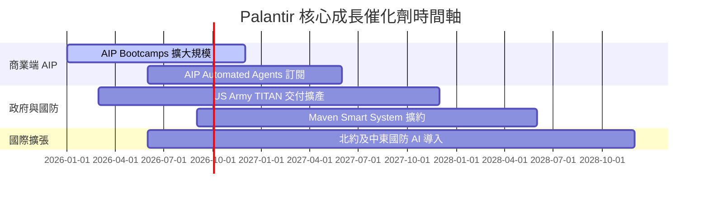

### 9.2 TAM 市場規模分析

```
╔══════════════════════════════════════════════════════════════════╗
║                 Palantir 可尋址市場 TAM 分解                    ║
╠══════════════════════════════════════════════════════════════════╣
║                                                                  ║
║  全球企業數據與 AI 軟體 TAM:  $150B  ████████████████████  滲透<3% ║
║  全球國防與情報分析 TAM:     $60B   ████████░░░░░░░░░░░░  滲透~5% ║
║  目前 Palantir TTM 營收:    $6.16B  █░░░░░░░░░░░░░░░░░░░  長尾巨大║
║                                                                  ║
║  📊 結論：整體 TAM 超過 $210B，PLTR 當前滲透率僅約 2.9%，成長天花板極高。║
╚══════════════════════════════════════════════════════════════════╝
```

### 9.3 成長驅動力結構圖

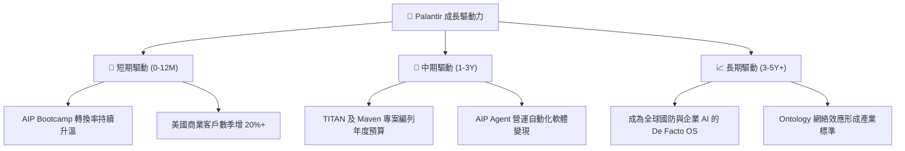

---

## 10. 風險矩陣

### 10.1 風險評分矩陣

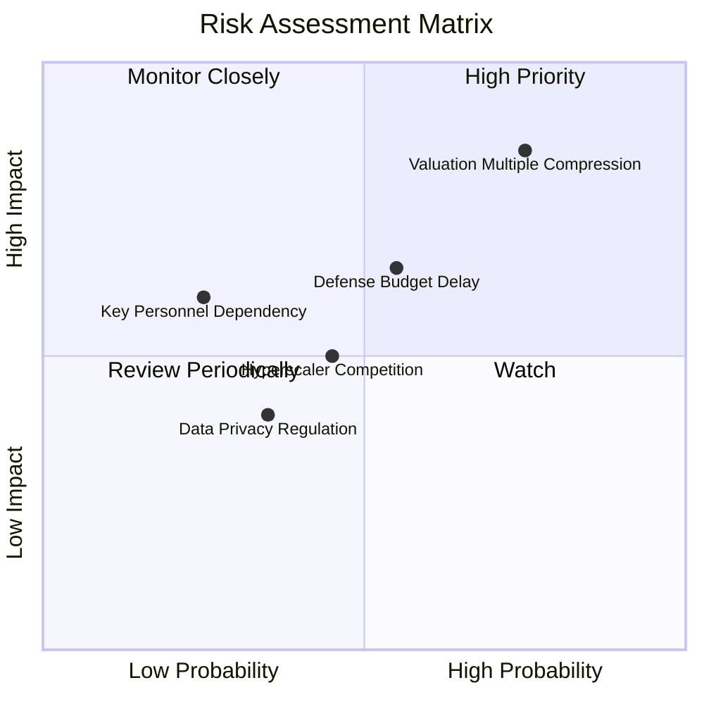

### 10.2 風險清單詳細分析

| # | 風險項目 | 發生機率 | 財務衝擊 | 風險評分 | 緩解措施 / 監控指標 |
|---|----------|----------|----------|----------|---------------------|
| 1 | 🔴 **高估值倍數壓縮風險** | 高 (75%) | 高 (-30% 股價) | 🔴 **8.2 / 10** | 密切監控季度營收 YoY 是否維持 50%+ |
| 2 | 🟡 **國防部合約撥款延遲** | 中 (55%) | 中 (-10% 營收) | 🟡 **6.1 / 10** | 商業端營收比重提升至 50%+ 以分散風險 |
| 3 | 🟡 **Hyperscalers 競爭侵蝕** | 中 (45%) | 中 (-5% 毛利率)| 🟡 **5.0 / 10** | 強化 Ontology 在複雜數據流中的技術壁壘 |

---

## 11. 投資建議

### 11.1 最終綜合評級雷達圖

```
╔══════════════════════════════════════════════════════════════╗
║              Palantir 綜合評級雷達 (1-10分)                  ║
╠══════════════════════════════════════════════════════════════╣
║ 基本面品質    9.5 ▓▓▓▓▓▓▓▓▓▓▓▓▓▓▓▓▓█░░  🏆 產業頂級          ║
║ 營運槓桿與獲利9.2 ▓▓▓▓▓▓▓▓▓▓▓▓▓▓▓▓▓░░░  🏆 FCF 轉換率高      ║
║ 財務安全度   10.0 ▓▓▓▓▓▓▓▓▓▓▓▓▓▓▓▓▓▓▓▓  🏆 淨現金 $9.20B      ║
║ 估值吸引力    3.2 ▓▓▓▓▓▓░░░░░░░░░░░░░░  ⚠️ 倍數昂貴          ║
║ 風險可控度    7.0 ▓▓▓▓▓▓▓▓▓▓▓▓▓░░░░░░░  🟢 基本面無虞        ║
╠══════════════════════════════════════════════════════════════╣
║ 綜合建議      8.3 ▓▓▓▓▓▓▓▓▓▓▓▓▓▓▓▓░░░░  🟡 中性 / 持有 (Hold) ║
╚══════════════════════════════════════════════════════════════╝
```

### 11.2 目標價與隱含報酬率

| 情境 | 機率權重 | 目標價 | 隱含報酬率 (相對現價 $155.92) | 投資行動建議 |
|------|----------|--------|--------------------------------|--------------|
| 🔴 **悲觀情境** | 20% | **$105.00** | -32.7% | 觸發分批逢低加碼買點 |
| 🟡 **基準情境** | 60% | **$168.80** | **+8.3%** | **當前股價合理，建議持有** |
| 🟢 **樂觀情境** | 20% | **$225.00** | +44.3% | 分段分批止盈減碼 |

### 11.3 買入時機與觸發因素

```
╔══════════════════════════════════════════════════════════════════╗
║                  Checklist 交易決策觸發因素                     ║
╠══════════════════════════════════════════════════════════════════╣
║                                                                  ║
║  🟢 買入 / 加碼觸發條件：                                       ║
║  [ ] 股價拉回至 $115.00–$135.00 區間（對應 MOS ≥ 20%）           ║
║  [ ] 單季美國商業營收 YoY 成長率突破 120%                        ║
║  [ ] 季度 GAAP 營業利潤率持續突破 50%                            ║
║                                                                  ║
║  🔴 減碼 / 停損觸發條件：                                       ║
║  [ ] 季度總營收 YoY 成長率連續兩季跌破 35%                      ║
║  [ ] SBC 占營收比重逆勢回升至 20% 以上                           ║
║  [ ] 股價大幅飆升超過 $195.00（超過樂觀內在價值，MOS 為負）    ║
╚══════════════════════════════════════════════════════════════════╝
```

### 11.4 投資人適配度分析

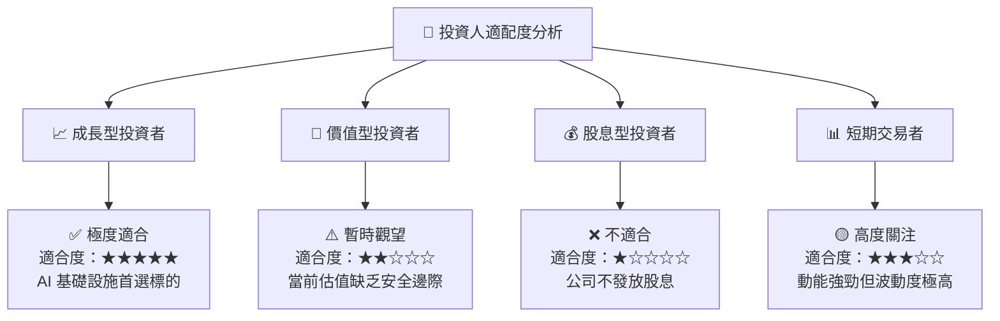

### 11.5 每季財報監控清單（Quarterly Watch List）

| 監控指標 | 最新 TTM 實際值 | 樂觀健康門檻 (加碼) | 警訊警戒線 (減碼) | 追蹤意義 |
|----------|-----------------|---------------------|-------------------|----------|
| **總營收 YoY 成長率** | **92.8%** | > 60.0% | < 35.0% | 檢驗 AIP 商業化動能 |
| **美國商業營收 YoY** | **> 100%** | > 80.0% | < 45.0% | 第一成長曲線核心 |
| **GAAP 營業利潤率** | **47.1%** | > 48.0% | < 35.0% | 營業槓桿擴張持久度 |
| **SBC / 營收比重** | **11.9%** | < 10.0% | > 18.0% | 股東權益稀釋控管 |
| **淨現金規模** | **$9.20B** | > $9.00B | < $7.00B | 資產負債表堡壘強度 |

### 11.6 反面論證：什麼會證明論點錯誤（What Would Change My Mind）

```
╔══════════════════════════════════════════════════════════════════╗
║              ⚠️ 論點失效條件（Disconfirming Evidence）           ║
╠══════════════════════════════════════════════════════════════════╣
║  本研究之多頭與持有論點，在下列條件發生時即宣告失效：            ║
║  ☐ 核心 AIP 商業客戶轉化率低落，美股商業營收 YoY 連續 2 季 < 40%║
║  ☐ 營運模式退化，前線工程師 (FDE) 成本大幅增加推升 S&M 費用率    ║
║  ☐ ROIC 跌破 15%（價值創造能力顯著受挫）                         ║
║  ☐ 自由現金流轉負，或 FCF 淨利轉換率跌破 60%                     ║
║  ☐ 美國國防部取消 TITAN 或 Maven 重大專案合約                    ║
╚══════════════════════════════════════════════════════════════════╝
```

---

> **免責聲明**：本報告為 AI 輔助機構級研究分析，僅供學術與投資研究參考，不構成任何買賣建議。投資有風險，入市需謹慎。