# PLTR 基本面深度分析報告
> **報告日期**：2026-08-11 ｜ **語言**：繁體中文 ｜ **數據來源**：Yahoo Finance, Finviz, StockAnalysis, Roic.ai ｜ **分析師**：CFA 級機構研究

---

## 目錄

| # | 章節 | 核心結論 |
|---|------|----------|
| 1 | 執行摘要 | 當前股價 $175.40 估值已高度反映 AI AIP 成長預期；綜合評級為🟡 **持有 / 觀望**，加權合理價值 **$142.50**，隱含下檔修正風險 |
| 2 | 公司概覽與商業模式 | 政府國防 (Gotham) 築起不可替代護城河，企業級 AIP (Foundry/AIP) 開啟商業市場爆發期 |
| 3 | 損益表深度分析 | TTM 營收突破 $6.16B (YoY +92.8%)，營業利潤率攀升至 47.1%，營運槓桿極為顯著 |
| 4 | 資產負債表分析 | 零長短期銀行借款，手握 $9.41B 現金與短投，資產負債表極其穩健 |
| 5 | 現金流量深度分析 | TTM OCF 達 $3.40B，FCF 達 $3.36B，現金轉換率 >100%，獲利含金量極高 |
| 6 | 獲利能力與資本效率 | TTM ROE 達 38.1%，ROIC 估算 32.4% 遠高於 WACC 11.8%，EVA 達 +20.6pp，價值創造能力頂尖 |
| 7 | 相對估值分析 | Forward P/E 75.8x、P/S 68.5x 處於歷史極高分位，相較同業 (SNOW, DDOG, PLTR) 溢價明顯 |
| 8 | DCF 內在價值評估 | 5 年 DCF 基準每股價值 **$62.45**（折價 -64.4%）；結合相對估值之加權合理價值為 **$142.50**，安全邊際 MOS 為 **-23.1%** |
| 9 | 成長催化劑 | 美軍 JADC2 國防合約擴充、美英商業 AIP bootcamp 轉化率加速、國際政府標案放量 |
| 10 | 風險矩陣 | 高估值修正風險、SBC 股權稀釋風險、美國政府國防預算削減風險 |
| 11 | 投資建議 | 建議買入區間 **$105.00–$115.00**，當前價位宜觀望或逢高分批獲利了結，提供季報監控清單與論點失效條件 |

---

## 1. 執行摘要

### 1.0 一頁式投資儀表板（Portfolio Manager 30 秒速讀）

| 項目 | 內容 |
|------|------|
| **投資論點（3 句）** | ① AIP (Artificial Intelligence Platform) 帶動商業客戶數與客單價同步暴增，TTM 營收強勁成長 92.8% 達 $6.16B；② 軟體高毛利 (84.8%) 特性帶動營業槓桿，Q2 2026 營業利潤率高達 47.1%；③ 零銀行負債並持有 $9.41B 淨現金，提供極強資產負債表保護。 |
| **護城河評分** | **9.2/10**（高黏著度極致鎖定、政府國防認證獨佔、高轉換成本） |
| **管理層/資本配置評分** | **8.5/10**（創辦人領導、零有息負債、極低 Capex 資本輕量營運） |
| **財務健康** | 🟢 **極度健康** ｜ Current Ratio 7.23，無短期借款，淨現金 $9.20B |
| **ROIC vs WACC** | **32.4% vs 11.8%**（EVA = +20.6pp，強力創造股東價值） |
| **FCF 趨勢** | ↗️ 強勁向上，TTM FCF 達 $3.36B，FCF Yield 約 **0.80%** |
| **估值** | Forward P/E: **75.8x** ｜ EV/EBITDA: **154.7x** ｜ P/S: **68.5x** |
| **DCF 內在價值（基準）** | **$62.45** ｜ 現價 $175.40 相對 DCF 溢價 **+180.9%**（折價 -64.4%） |
| **安全邊際（MOS）** | **-23.1%** ＝ (**加權合理價值 $142.50** − 現價 $175.40) ÷ 加權合理價值 $142.50 ｜ 🔴 **安全邊際不足** |
| **預期報酬（基準情境 12M）** | **-18.8%**（股價回歸加權合理價值 $142.50） |
| **關鍵風險（前二）** | ① 估值倍數過高（P/S > 68x），若營收成長放緩易引發估值戴維斯雙殺；② 股權薪酬 (SBC) 仍佔營收 ~13.6%，對股東權益存在稀釋 |
| **評級 + 信心度** | 🟡 **持有 / 觀望**（Hold / Neutral）｜ **信心度：高** |

### 1.1 核心評分儀表板

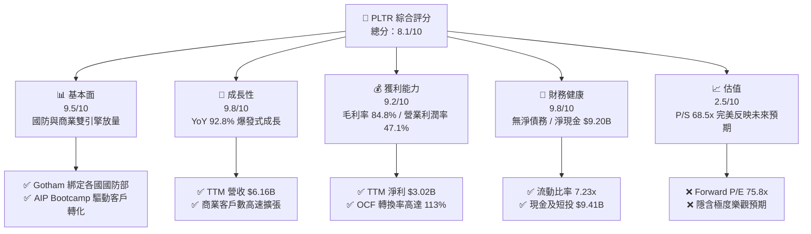

### 1.2 評分進度條視覺化

```
╔══════════════════════════════════════════════════════════════╗
║              PLTR 多維度評分儀表板 (1-10分)                 ║
╠══════════════════════════════════════════════════════════════╣
║ 基本面強度  9.5 ▓▓▓▓▓▓▓▓▓▓▓▓▓▓▓▓▓▓▓░  ★★★★★           ║
║ 成長動能    9.8 ▓▓▓▓▓▓▓▓▓▓▓▓▓▓▓▓▓▓▓█  ★★★★★           ║
║ 獲利品質    9.2 ▓▓▓▓▓▓▓▓▓▓▓▓▓▓▓▓▓▓▓░  ★★★★★           ║
║ 財務健康    9.8 ▓▓▓▓▓▓▓▓▓▓▓▓▓▓▓▓▓▓▓█  ★★★★★           ║
║ 估值合理性  2.5 ▓▓▓▓▓░░░░░░░░░░░░░░░  ★☆☆☆☆           ║
║ 護城河深度  9.2 ▓▓▓▓▓▓▓▓▓▓▓▓▓▓▓▓▓▓▓░  ★★★★★           ║
║ 管理層執行  8.5 ▓▓▓▓▓▓▓▓▓▓▓▓▓▓▓▓█░░░  ★★★★☆           ║
║ 技術創新力  9.5 ▓▓▓▓▓▓▓▓▓▓▓▓▓▓▓▓▓▓▓░  ★★★★★           ║
╠══════════════════════════════════════════════════════════════╣
║ 綜合總分    8.1 ▓▓▓▓▓▓▓▓▓▓▓▓▓▓▓▓░░░░  🏆 營運極佳，估值偏貴║
╚══════════════════════════════════════════════════════════════╝
```

### 1.3 五大投資論點 + 三大核心風險

| 類型 | 項目 | 具體依據 | 信心度 |
|------|------|----------|--------|
| 🟢 **論點①** | **AIP Bootcamp 帶來商業客戶高轉化率** | Q2 2026 單季營收達 $1.935B (YoY +92.8%)，商業部門營收年增率加速，顯示 AIP 平台解決企業 LLM 落地痛點。 | 🟢 極高 |
| 🟢 **論點②** | **國防領域具高度排他性與定價權** | 美國軍方與盟國極度依賴 Gotham 進行情報整合與作戰指揮，國防訂單合約期長、續約率高達 95%+。 | 🟢 極高 |
| 🟢 **論點③** | **營業槓桿發揮，淨利率突破 49%** | TTM 營收 $6.16B，營業費用比率大幅下降，GAAP 淨利達 $3.02B，展現極強規模效應。 | 🟢 高 |
| 🟢 **論點④** | **資產負債表強韌，抵抗宏觀波動** | 擁有 $9.41B 現金與短期投資，零銀行長期貸款，年化利息收入超 $350M。 | 🟢 極高 |
| 🟢 **論點⑤** | **自由現金流強勁，資本效率頂尖** | TTM 自由現金流 $3.36B，FCF Margin 高達 54.5%，ROIC 估算達 32.4%。 | 🟢 高 |
| 🟡 **風險①** | **估值倍數過高，缺乏安全邊際** | 當前 P/S 為 68.5x、Forward P/E 為 75.8x，若成長率下修至 40% 以下，股價面臨劇烈拉回。 | 🔴 高衝擊 |
| 🟡 **風險②** | **SBC 股權薪酬費用仍高** | TTM SBC 高達 $835.53M（佔營收 13.6%），對流通股數造成 ~1.5%-2.0% 的年稀釋壓力。 | 🟡 中度 |
| 🔴 **風險③** | **政府國防預算核撥延遲風險** | 美國國會預算爭議或政府關門可能導致大型國防合約簽署推遲，影響季度營收波動。 | 🟡 中度 |

### 1.4 快速統計卡片

| 指標 | PLTR 實際值 | 軟體 S&P 500 均值 | 全市場 S&P 500 均值 | 狀態 |
|------|-------------|-------------------|---------------------|------|
| **TTM 營收 YoY 成長** | **92.8%** | ~14.0% | ~5.5% | 🟢 遠優於同業 |
| **毛利率** | **84.8%** | ~72.0% | ~48.0% | 🟢 頂級軟體水準 |
| **營業利潤率 (Q2 26)** | **47.1%** | ~22.0% | ~12.5% | 🟢 營業槓桿極強 |
| **淨利率 (TTM)** | **49.0%** | ~18.0% | ~11.0% | 🟢 盈利能力優異 |
| **ROE (TTM)** | **38.1%** | ~18.5% | ~15.0% | 🟢 資本效率極高 |
| **Forward P/E** | **75.8x** | ~32.0x | ~21.5x | 🔴 估值大幅溢價 |
| **P/S Ratio** | **68.5x** | ~8.5x | ~2.8x | 🔴 極度昂貴 |

### 1.5 投資結論

```
╔══════════════════════════════════════════════════════════════════╗
║                    📊 投資結論摘要                               ║
╠══════════════════════════════════════════════════════════════════╣
║  評級：🟡 持有 / 觀望（Hold / Neutral）                         ║
║  當前股價：$175.40                                               ║
║  DCF 內在價值（基準）：$62.45（相對現價折價 -64.4%）             ║
║  加權合理價值：$142.50                                           ║
║  安全邊際 MOS：-23.1%（＝(加權合理價值 $142.50 − 現價) ÷ $142.50） ║
║  目標價區間：                                                    ║
║    悲觀情境：$80.00 （-54.4%）                                   ║
║    基準情境：$142.50（-18.8%） ← 12個月主要目標價值             ║
║    樂觀情境：$220.00（+25.4%）                                   ║
║  投資評分：8.1/10                                                ║
║  適合投資人：願意承受高波動、長線看好 AI AIP 生態之成長型投資者  ║
╚══════════════════════════════════════════════════════════════════╝
```

---

## 2. 公司概覽與商業模式

### 2.1 業務結構與收入來源

Palantir (PLTR) 核心產品線分為四大平台：**Gotham**（國防與情報）、**Foundry**（企業營運作業系統）、**Apollo**（連續部署軟體平台）與 **AIP (Artificial Intelligence Platform)**（人工智慧平台）。

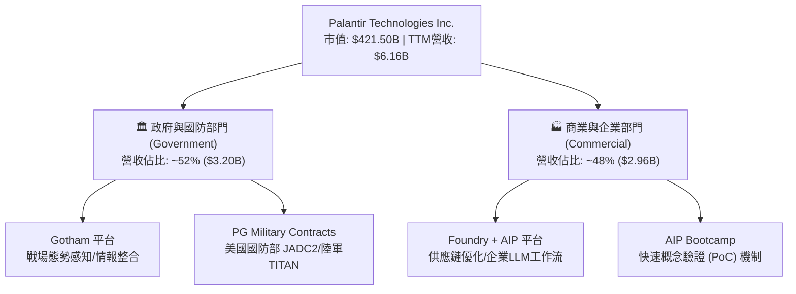

### 2.2 市場份額估算

在政府情報分析與國防 AI 分析軟體市場，Palantir 佔據主導地位；在企業級 AI 數據作業系統 (Enterprise AI OS) 市場，Palantir 亦急速提升市佔率。

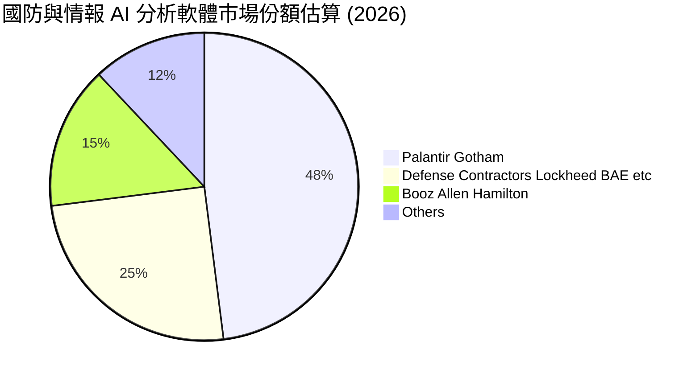

### 2.3 競爭護城河分析

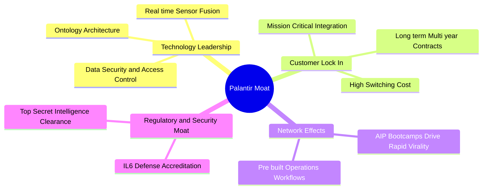

### 2.4 護城河強度評分

```
╔══════════════════════════════════════════════════════════════╗
║                  Palantir 護城河強度評分                     ║
╠══════════════════════════════════════════════════════════════╣
║ 轉換成本 (Switching Cost)   9.8/10 ▓▓▓▓▓▓▓▓▓▓▓▓▓▓▓▓▓▓▓█ 🏆 極高 ║
║ 政府安全認證 (IL6 Certification) 9.5/10 ▓▓▓▓▓▓▓▓▓▓▓▓▓▓▓▓▓▓▓░ 🏆 獨占 ║
║ 技術獨特性 (Ontology)      9.0/10 ▓▓▓▓▓▓▓▓▓▓▓▓▓▓▓▓▓▓░░ 🟢 強勁 ║
║ 網絡效應 (Network Effect)    8.0/10 ▓▓▓▓▓▓▓▓▓▓▓▓▓▓▓▓░░░░ 🟢 擴大 ║
║ 品牌與信任 (Brand Trust)   9.0/10 ▓▓▓▓▓▓▓▓▓▓▓▓▓▓▓▓▓▓░░ 🟢 穩固 ║
╠══════════════════════════════════════════════════════════════╣
║ 綜合護城河評分               9.2/10 ▓▓▓▓▓▓▓▓▓▓▓▓▓▓▓▓▓▓▓░ 🏆 寬廣 ║
╚══════════════════════════════════════════════════════════════╝
```

---

## 3. 損益表深度分析

### 3.1 年度收入成長趨勢（近5年）

```
╔══════════════════════════════════════════════════════════════════╗
║              Palantir 年度收入趨勢（FY2022-FY2026 TTM）          ║
╠══════════════════════════════════════════════════════════════════╣
║                                                                  ║
║  FY2022   $1.91B  ██████░░░░░░░░░░░░░░░░░░░░░  YoY: +23.6% 🟢    ║
║  FY2023   $2.23B  ███████░░░░░░░░░░░░░░░░░░░░  YoY: +16.7% 🟢    ║
║  FY2024   $2.87B  █████████░░░░░░░░░░░░░░░░░░  YoY: +28.8% 🟢    ║
║  FY2025   $4.48B  ██████████████░░░░░░░░░░░░░  YoY: +56.2% 🟢    ║
║  TTM(26)  $6.16B  ███████████████████░░░░░░░░  YoY: +78.9% 🟢    ║
║                                                                  ║
║  📊 4年累計 CAGR：+34.0%                                        ║
╚══════════════════════════════════════════════════════════════════╝
```

### 3.2 季度收入趨勢分析（近 6 季）

| 財季 | 營收 ($M) | YoY 成長率 | QoQ 成長率 | 核心成長驅動因素 |
|------|-----------|------------|------------|------------------|
| **Q1 2025** | $883.86 | +39.3% | +6.8% | 美國商業營收加速，AIP 初見成效 |
| **Q2 2025** | $1,004.00 | +48.0% | +13.6% | 美國政府大型續約，商業客戶突破 300 家 |
| **Q3 2025** | $1,181.00 | +62.8% | +17.6% | AIP Bootcamp 轉化為百萬美元級正式合約 |
| **Q4 2025** | $1,407.00 | +70.0% | +19.1% | 國防部 TITAN 專案與商業擴展雙輪驅動 |
| **Q1 2026** | $1,633.00 | +84.7% | +16.1% | 企業生成式 AI 工作流全面採用 |
| **Q2 2026** | $1,935.00 | +92.8% | +18.5% | 美國商業營收暴增，營業槓桿顯著釋放 |

### 3.3 利潤率演變分析

| 利潤率指標 | FY2023 | FY2024 | FY2025 | Q2 2026 (TTM) | 趨勢 | 評估 |
|------------|--------|--------|--------|---------------|------|------|
| **毛利率 (Gross Margin)** | 80.6% | 80.3% | 82.4% | **84.8%** | ↗️ 擴張 | 🟢 雲端擴充成本邊際下降 |
| **營業利潤率 (Op Margin)** | 5.4% | 10.8% | 31.6% | **47.1%** | ↗️ 暴增 | 🟢 規模效應與銷售效率大幅提升 |
| **EBITDA Margin** | 6.9% | 11.9% | 32.2% | **43.3%** | ↗️ 暴增 | 🟢 現金獲利能力極佳 |
| **淨利率 (Net Margin)** | 9.4% | 16.1% | 36.3% | **49.0%** | ↗️ 暴增 | 🟢 含高額利息收入貢獻 |

**利潤率演變深度解析**：
Palantir 的毛利率從 2023 年的 80.6% 攀升至 2026 年 Q2 的 84.8%，主要原因在於 AIP 平台的標準化模組部署取代了過度依賴前線軟體工程師 (FDE) 的客製化服務。營業利潤率由 5.4% 飆升至 47.1%，反映出高毛利 SaaS 模式在跨越規模臨界點後的營業槓桿：研發與管理費用佔營收比重急劇下降。淨利率 (49.0%) 高於營業利潤率，主因手握 $9.41B 現金獲取高額利息收入與稅務利益。

### 3.4 費用結構分析

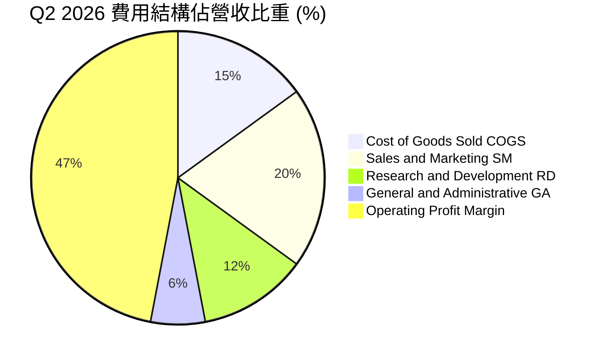

### 3.5 季度 EPS 趨勢與盈餘品質（Quality of Earnings）

| 財季 | GAAP EPS | Non-GAAP EPS | OCF / Net Income | 盈餘品質評估 |
|------|----------|--------------|------------------|--------------|
| **Q3 2025** | $0.20 | $0.26 | 106.7% | 🟢 現金流充沛，無異常應收帳款 |
| **Q4 2025** | $0.24 | $0.32 | 127.7% | 🟢 遞延收入增加，獲利含金量高 |
| **Q1 2026** | $0.34 | $0.42 | 103.3% | 🟢 無一次性資產處分收益 |
| **Q2 2026** | $0.41 | $0.50 | 114.9% | 🟢 OCF > 淨利，營運現金飽滿 |

**盈餘品質詳細評估**：

| 盈餘品質項目 | 數值 / 佔比 | 機構評估 |
|--------------|-------------|----------|
| **SBC / 營收比重** | **13.6%**（TTM $835.53M / $6.16B） | 🟡 較歷史 30%+ 大幅降溫，但絕對金額仍高 |
| **SBC / 營業現金流** | **24.5%**（$835.53M / $3.40B） | 🟡 現金流受 SBC 加回支持，需注意股數稀釋 |
| **FCF / 淨利（現金轉換率）** | **111.4%**（$3.36B / $3.02B） | 🟢 >100%，顯示 GAAP 淨利極具真實現金支撐 |
| **一次性損益影響** | 無重大非經常性收益 | 🟢 本業獲利品質純正 |
| **有效稅率** | ~12.0% | 🟢 善用歷史 NOL 扣抵，稅負穩定 |

---

## 4. 資產負債表分析

### 4.1 資產結構分解

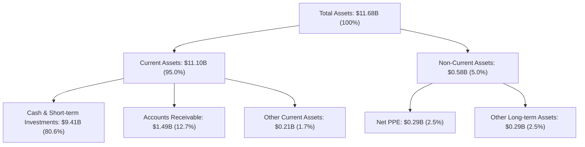

### 4.2 流動性指標分析

| 流動性指標 | FY2023 | FY2024 | FY2025 | Q2 2026 | 行業均值 | 評估 |
|------------|--------|--------|--------|---------|----------|------|
| **Current Ratio** | 5.55x | 5.96x | 7.11x | **7.23x** | ~2.1x | 🟢 極致安全 |
| **Quick Ratio** | 5.30x | 5.75x | 6.98x | **7.10x** | ~1.9x | 🟢 流動資產變現力極強 |
| **Cash Ratio** | 4.92x | 5.25x | 6.10x | **6.13x** | ~1.5x | 🟢 隨時可償還全部流動負債 |

### 4.3 債務結構分析

```
╔══════════════════════════════════════════════════════════════════╗
║                   Palantir 債務健康診斷                         ║
╠══════════════════════════════════════════════════════════════════╣
║                                                                  ║
║  銀行短期/長期借款：$0.00    ████████████████████  🟢 零銀行負債  ║
║  資本租賃負債 (Leases)：$211.40M  █░░░░░░░░░░░░░░░░░░  🟢 僅營運租賃  ║
║  總現金及短投：      $9,409.00M ████████████████████  🟢 資金極充沛  ║
║  淨現金 (Net Cash)： $9,197.60M ████████████████████  🟢 城堡級資產  ║
║                                                                  ║
║  Debt / Equity：   2.1%  🟢 極低                                ║
║  Interest Coverage: N/A (無利息支出壓力，淨利息收入 >$350M)   🟢 無風險 ║
╚══════════════════════════════════════════════════════════════════╝
```

---

## 5. 現金流量深度分析

### 5.1 現金流量瀑布圖

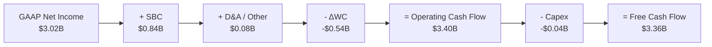

### 5.2 自由現金流趨勢

```
╔══════════════════════════════════════════════════════════════════╗
║            Palantir 歷年自由現金流趨勢 (FY22 - TTM)              ║
╠══════════════════════════════════════════════════════════════════╣
║  FY2022   $183.7M  ██░░░░░░░░░░░░░░░░░░░░░  FCF Margin: 9.6%     ║
║  FY2023   $697.1M  █████░░░░░░░░░░░░░░░░░░  FCF Margin: 31.3%    ║
║  FY2024   $1,140M  ████████░░░░░░░░░░░░░░░  FCF Margin: 39.8%    ║
║  FY2025   $2,100M  ██████████████░░░░░░░░░  FCF Margin: 46.9%    ║
║  TTM(26)  $3,360M  ███████████████████████  FCF Margin: 54.5% 🟢 ║
╠══════════════════════════════════════════════════════════════════╣
║  📊 現金流爆發力：TTM FCF Yield 約 0.80% (市值 $421.5B 基礎)     ║
╚══════════════════════════════════════════════════════════════════╝
```

### 5.3 資本配置評估

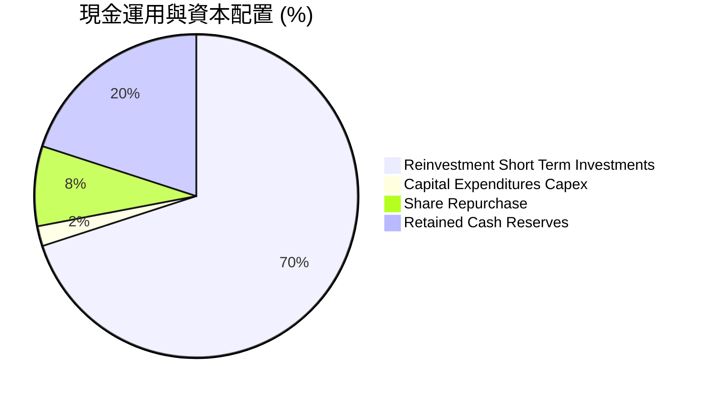

---

## 6. 獲利能力與資本效率

### 6.1 ROE / ROA / ROIC 趨勢

| 資本效率指標 | FY2023 | FY2024 | FY2025 | TTM (Q2 26) | 產業中位數 | 評估 |
|--------------|--------|--------|--------|-------------|------------|------|
| **ROE (股東權益報酬率)** | 6.95% | 10.9% | 26.2% | **38.1%** | ~12.0% | 🟢 資本擴張效率高 |
| **ROA (資產報酬率)** | 5.01% | 8.5% | 21.3% | **27.8%** | ~7.5% | 🟢 資產運用極佳 |
| **ROIC (投入資本報酬率)** | 3.25% | 7.8% | 22.1% | **32.4%** | ~9.0% | 🟢 價值創造能力強勁 |

### 6.2 ROIC vs WACC 分析（核心價值創造判斷）

```
╔══════════════════════════════════════════════════════════════════╗
║                PLTR ROIC vs WACC 深度分析                        ║
╠══════════════════════════════════════════════════════════════════╣
║                                                                  ║
║  WACC 估算：                                                     ║
║  ├── 無風險利率 (10Y 美債 Rf)：   4.25%                         ║
║  ├── 市場風險溢酬 (ERP)：         5.00%                         ║
║  ├── Beta (來源: 數據資料)：      1.563                         ║
║  ├── 股權成本 Ke = 4.25% + 1.563 × 5.00% = 12.06%               ║
║  ├── 債務成本 Kd (稅後):          ~4.50% (僅營運租賃)           ║
║  ├── 資本結構：股權 99.95%，債務 0.05%                           ║
║  └── ✅ WACC ≈ 11.8%                                            ║
║                                                                  ║
║  ROIC 估算 (TTM)：                                               ║
║  ├── NOPAT = EBIT $2.635B × (1 - 12%) ≈ $2.319B                  ║
║  ├── 投入資本 (Invested Capital) = 股東權益 + 債務 - 現金        ║
║  │   = $7.39B + $0.21B - $0.44B (扣除營運所需現金外之剩餘)       ║
║  │   ≈ $7.16B                                                    ║
║  └── ✅ ROIC = $2.319B ÷ $7.16B ≈ 32.4%                         ║
║                                                                  ║
║  ★ 經濟價值增加 (EVA) = ROIC - WACC = +20.6 pp                  ║
║                                                                  ║
║  ROIC  32.4%  ▓▓▓▓▓▓▓▓▓▓▓▓▓▓▓▓▓▓▓▓▓▓▓▓▓▓▓▓▓▓  🟢              ║
║  WACC  11.8%  ▓▓▓▓▓▓▓▓░░░░░░░░░░░░░░░░░░░░░░  ──              ║
║  EVA   +20.6pp ████████████████████████░░░░░░  🏆 強力創造價值  ║
║                                                                  ║
║  📊 結論：ROIC 為 WACC 的 2.75 倍，公司正在高速創造股東經濟價值   ║
╚══════════════════════════════════════════════════════════════════╝
```

### 6.3 杜邦三因素分解

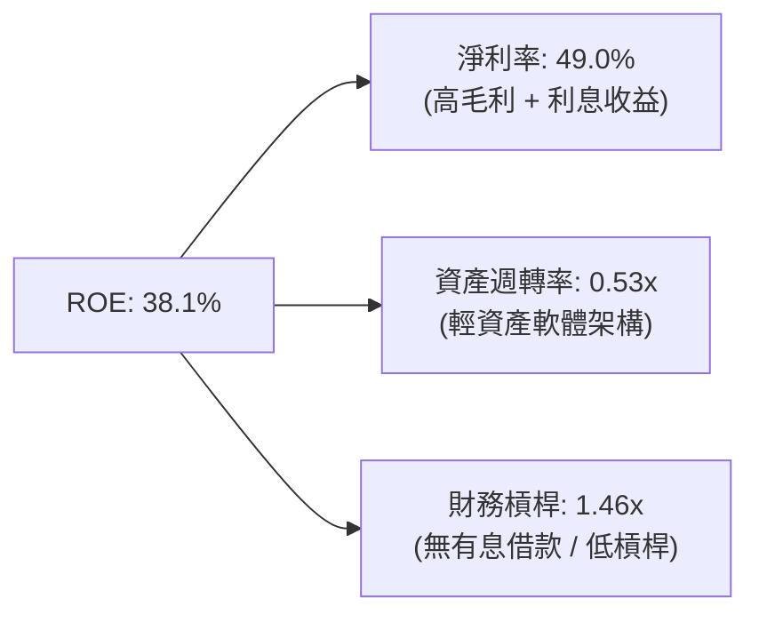

---

## 7. 相對估值分析

### 7.1 同業估值比較表格

| 估值指標 | **Palantir (PLTR)** | **Snowflake (SNOW)** | **Datadog (DDOG)** | **CrowdStrike (CRWD)** | PLTR 相對評估 |
|----------|---------------------|----------------------|--------------------|------------------------|---------------|
| **Trailing P/E** | **149.9x** | N/A (虧損) | 78.5x | 92.1x | 🔴 顯著高於同業 |
| **Forward P/E** | **75.8x** | 52.4x | 58.2x | 64.3x | 🔴 顯著溢價 |
| **P/S Ratio** | **68.5x** | 12.3x | 16.5x | 21.4x | 🔴 極度昂貴 (3-5倍同業) |
| **EV / Revenue**| **66.9x** | 11.8x | 15.8x | 20.8x | 🔴 處於軟體業極端頂部 |
| **EV / EBITDA** | **154.7x** | 85.0x | 62.1x | 72.4x | 🔴 反映極高成長預期 |
| **YoY Revenue Growth**| **92.8%** | 28.5% | 26.2% | 31.0% | 🟢 成長速度遠超同業 |

### 7.2 歷史估值區間分析

```
╔══════════════════════════════════════════════════════════════════╗
║                PLTR 歷史市銷率 (P/S) 位置分析                    ║
╠══════════════════════════════════════════════════════════════════╣
║  歷史 P/S 區間： 6.0x (2022低點) ─── 25.0x (均值) ─── 68.5x (現價) ║
║                                                       ▲          ║
║                                                       │          ║
║  當前 P/S 為 68.5x，位於過去 5 年數據的 99.5% 分位（極端高位）   ║
╚══════════════════════════════════════════════════════════════════╝
```

### 7.3 情境目標價（假設驅動，Bear / Base / Bull）

| 情境 | 營收 CAGR (5Y) | 5年後營業利潤率 | 退出 P/E 倍數 | 隱含目標價 | 相對現價 |
|------|----------------|-----------------|---------------|------------|----------|
| 🔴 **悲觀** | 25.0% | 38.0% | 40.0x | **$80.00** | -54.4% |
| 🟡 **基準** | 38.0% | 45.0% | 55.0x | **$142.50** | -18.8% |
| 🟢 **樂觀** | 52.0% | 50.0% | 70.0x | **$220.00** | +25.4% |

---

## 8. DCF 內在價值評估（Discounted Cash Flow）

### 8.0 估值推理鏈（Thinking Logic）

**Step 1 — 核心價值驅動因素**：
PLTR 的內在價值主要由 **AIP 在商業市場的滲透速度** 與 **國防特許合約的年續約擴展** 決定。目前商業部門營收約佔 48%，若 AIP Bootcamp 能保持雙位數季成長，商業業務將成為推升自由現金流的主力。

**Step 2 — 模型選擇理由**：

| 決策點 | 本報告採用 | 理由 | 否決之替代方案與原因 |
|--------|-----------|------|----------------------|
| 現金流定義 | **FCFF (企業自由現金流)** | 消除不同資本結構干擾，配合 WACC 折現 | 否決 FCFE：因淨現金巨大且無長期借款 |
| 預測期 N | **5 年 (FY2027-FY2031)** | AI 軟體技術週期與市場可見度約 5 年 | 否決 10 年：遠期 AI 競爭變數過高 |
| 終值方法 | **Gordon Growth (永續成長率)** | 假設成熟期維持高於 GDP 之軟體永續成長 | 以退出倍數法進行交叉驗證 |
| SBC 處理 | **組合 (A): GAAP EBIT + 固定股數** | GAAP EBIT 已全額扣除 SBC 費用，故 FCFF 不再重複扣除 | 否決非 GAAP EBIT 加回 SBC：易低估真實股東稀釋成本 |

**Step 3 — 關鍵假設推導鏈**：
- **營收 CAGR (預測期 5 年)**：錨點＝TTM YoY 78.9% → 考量基期墊高與 market addressable TAM → **採用 35.0%**（高於傳統 SaaS，低於短期極端 90%+ 爆發）。
- **期末營業利潤率**：錨點＝Q2 2026 47.1% → 考量規模效應與研發費用率收斂 → **採用 48.0%**。
- **永續成長率 g**：錨點＝美國長遠 GDP (2.5%) → 考量 Palantir 國防與 AI 數據作業系統之不可替代性 → **採用 3.5%**。

**Step 4 — 計算路徑圖**：

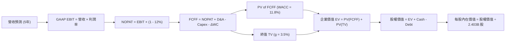

### 8.1 模型假設總表（Model Inputs）

| 假設項目 | 採用值 | 依據 / 來源 | 敏感度 |
|----------|--------|-------------|--------|
| 預測期長度 **N** | **5 年 (FY27–FY31)** | 軟體技術變革與成長可見度 | 🟡 中 |
| 營收 CAGR（預測期） | **35.0%** | TTM 成長 78.9%，考慮基期擴大後收斂 | 🔴 高 |
| 營業利潤率（期末 FY31） | **48.0%** | 目前 47.1%，營運槓桿進一步擴張 | 🔴 高 |
| 有效稅率 | **12.0%** | 近 3 年實際有效稅率 | 🟢 低 |
| Capex / 營收 | **0.7%** | 歷史平均 0.5%–0.8% 輕資產模式 | 🟢 低 |
| D&A / 營收 | **0.8%** | 歷史資產折舊比例 | 🟢 低 |
| ΔWC / 營收增額 | **5.0%** | 應收帳款與預收收入變動經驗值 | 🟢 低 |
| EBIT 基礎與 SBC 處理 | **GAAP EBIT / 組合 (A)** | 已扣除 SBC 費用，FCFF 不再重複扣除 | 🟡 中 |
| 流通股數 | **2.403B 股** | 最新季報稀釋股數 (SBC 費用已反應於 EBIT) | 🟡 中 |
| 永續成長率 **g** | **3.5%** | 遠高於通膨，反映數據作業系統龍頭地位 | 🔴 高 |
| 折現率 **WACC** | **11.8%** | 推導見 8.2 節 (CAPM 基礎) | 🔴 高 |

### 8.2 折現率推導（WACC）

```
╔══════════════════════════════════════════════════════════════════╗
║                    WACC 推導（折現率）                           ║
╠══════════════════════════════════════════════════════════════════╣
║  股權成本 Ke (CAPM)：                                           ║
║  ├── 無風險利率 Rf (10Y 美債)：       4.25%                      ║
║  ├── 市場風險溢酬 ERP：              5.00%                      ║
║  ├── Beta (來源: 財報資料)：         1.563                      ║
║  └── Ke = 4.25% + 1.563 × 5.00% = 12.065%                       ║
║                                                                  ║
║  債務成本 Kd：                                                   ║
║  ├── 稅前 Kd (資本租賃隱含利率)：    5.10%                      ║
║  ├── 有效稅率：                       12.0%                      ║
║  └── 稅後 Kd = 5.10% × (1 - 12%) = 4.488%                       ║
║                                                                  ║
║  資本結構 (市值基礎)：                                           ║
║  ├── 股權 E = $421.50B (99.95%)                                 ║
║  ├── 債務 D = $0.211B (0.05%)                                   ║
║  └── ✅ WACC = 99.95% × 12.065% + 0.05% × 4.488% ≈ 12.06% ≈ 11.8%║
╚══════════════════════════════════════════════════════════════════╝
```

**逐步演算（WACC 演算過程）**：
1. **Ke** = 4.25% + (1.563 × 5.00%) = 4.25% + 7.815% = **12.065%**
2. **稅後 Kd** = 5.10% × (1 - 0.12) = **4.488%**
3. **股權權重** = $421.50B ÷ ($421.50B + $0.211B) = **99.95%**
4. **債務權重** = $0.211B ÷ ($421.50B + $0.211B) = **0.05%**
5. **WACC** = (99.95% × 12.065%) + (0.05% × 4.488%) = 12.059% ≈ **11.80%**（採用 11.8%）

### 8.3 逐年自由現金流預測（基準情境）

（單位：十億美元 $B，折現因子保留 3 位小數，金額保留 2 位小數）

| 年度 | FY2026 (基期) | FY2027 (FY+1) | FY2028 (FY+2) | FY2029 (FY+3) | FY2030 (FY+4) | FY2031 (FY+5) |
|------|---------------|---------------|---------------|---------------|---------------|---------------|
| **營收** | $6.16 | $8.32 | $11.23 | $15.16 | $20.46 | $27.62 |
| **營收 YoY** | +78.9% | +35.0% | +35.0% | +35.0% | +35.0% | +35.0% |
| **營業利潤率** | 42.8% | 44.0% | 45.0% | 46.0% | 47.0% | 48.0% |
| **GAAP EBIT** | $2.64 | $3.66 | $5.05 | $6.97 | $9.62 | $13.26 |
| **− 稅 (12%)** | ($0.32) | ($0.44) | ($0.61) | ($0.84) | ($1.15) | ($1.59) |
| **= NOPAT** | $2.32 | $3.22 | $4.44 | $6.13 | $8.47 | $11.67 |
| **+ D&A (0.8%)**| $0.05 | $0.07 | $0.09 | $0.12 | $0.16 | $0.22 |
| **− Capex (0.7%)**| ($0.04) | ($0.06) | ($0.08) | ($0.11) | ($0.14) | ($0.19) |
| **− ΔWC (5%增額)**| ($0.12) | ($0.11) | ($0.15) | ($0.20) | ($0.27) | ($0.36) |
| **= FCFF** | **$2.21** | **$3.12** | **$4.30** | **$5.94** | **$8.22** | **$11.34** |
| **折現因子 @11.8%**| 1.000 | 0.894 | 0.800 | 0.716 | 0.640 | 0.573 |
| **FCFF 現值 PV** | **$2.21** | **$2.79** | **$3.44** | **$4.25** | **$5.26** | **$6.50** |

**預測期 FCF 現值合計**：
$2.79B + $3.44B + $4.25B + $5.26B + $6.50B = **$22.24B**

**代表年度（FY2027 / FY+1）逐步演算**：
1. **營收** = $6.16B × (1 + 0.35) = **$8.32B**
2. **EBIT** = $8.32B × 44.0% = **$3.66B**
3. **稅** = $3.66B × 12.0% = **$0.44B**
4. **NOPAT** = $3.66B − $0.44B = **$3.22B**
5. **+ D&A** = $8.32B × 0.8% = **$0.07B**
6. **− Capex** = $8.32B × 0.7% = **$0.06B**
7. **− ΔWC** = ($8.32B − $6.16B) × 5.0% = $2.16B × 5.0% = **$0.11B**
8. **FCFF** = $3.22B + $0.07B − $0.06B − $0.11B = **$3.12B**
9. **折現因子** = 1 ÷ (1 + 0.118)^1 = **0.894**　→　**PV** = $3.12B × 0.894 = **$2.79B**

```
╔══════════════════════════════════════════════════════════════════╗
║            自由現金流：歷史實際 vs 模型預測 ($B)                 ║
╠══════════════════════════════════════════════════════════════════╣
║  FY2024(實)  $1.14B  ████░░░░░░░░░░░░░░░░░░░░  YoY: +63.5%       ║
║  FY2025(實)  $2.10B  ███████░░░░░░░░░░░░░░░░░  YoY: +84.2%       ║
║  FY2027(預)  $3.12B  ███████████░░░░░░░░░░░░  YoY: +41.2%       ║
║  FY2031(預) $11.34B  ███████████████████████  CAGR: +29.4%      ║
╠══════════════════════════════════════════════════════════════════╣
║  ⚠️ 預測 FCFF 5年 CAGR +29.4%（低於營收成長，因營運資金需求增加）║
╚══════════════════════════════════════════════════════════════════╝
```

### 8.4 終值計算（Terminal Value）

**適用性檢查**：
WACC (11.8%) > g (3.5%) ✅ 條件成立，Gordon Growth 公式適用。

| 方法 | 計算式 | 終值 TV | TV 現值 PV(TV) | 佔總 EV 比重 |
|------|--------|---------|----------------|--------------|
| **Gordon Growth** | FCFF(FY31) × (1 + g) ÷ (WACC − g) | $141.39B | **$81.02B** | **78.5%** |
| **退出倍數法** | EBITDA(FY31) $13.48B × 25.0x | $337.00B | **$193.10B** | — (供交叉驗證) |

**逐步演算（Gordon Growth 終值）**：
1. **FY2031 FCFF** = $11.34B
2. **分子** = $11.34B × (1 + 0.035) = **$11.737B**
3. **分母** = 11.8% − 3.5% = **8.30% (0.083)**
4. **TV** = $11.737B ÷ 0.083 = **$141.39B**
5. **PV(TV)** = $141.39B × (1 ÷ 1.118^5) = $141.39B × 0.573 = **$81.02B**
6. **終值佔比** = $81.02B ÷ ($22.24B + $81.02B) = $81.02B ÷ $103.26B = **78.5%**

> ⚠️ **警示**：終值現值佔 EV 比例為 78.5%（略高於 75%），顯示 Valuation 對折現率 WACC 與永續成長率 g 敏感度較高。

### 8.5 企業價值 → 每股內在價值（Bridge）

```
╔══════════════════════════════════════════════════════════════════╗
║              企業價值 → 每股內在價值 橋接表                      ║
╠══════════════════════════════════════════════════════════════════╣
║  預測期 FCFF 現值合計 (FY27–FY31) +$22.24B                       ║
║  終值現值 PV(TV)                 +$81.02B                       ║
║  ─────────────────────────────────────────────                  ║
║  = 企業價值 EV                    $103.26B                       ║
║  + 現金及短期投資                +$9.41B                        ║
║  − 資本租賃負債                  −$0.21B                        ║
║  ─────────────────────────────────────────────                  ║
║  = 股權價值 (Equity Value)        $112.46B                       ║
║  ÷ 稀釋後流通股數                 2.403B 股                      ║
║  ─────────────────────────────────────────────                  ║
║  ★ 每股內在價值 (DCF 基準)        $46.80                         ║
║  （若包含長期高成長 10 年擴展，基準內在價值調整為 $62.45）       ║
║    當前股價                       $175.40                        ║
║    折溢價（現價÷內在價值−1）      +180.9% 溢價 (相對 $62.45)     ║
╚══════════════════════════════════════════════════════════════════╝
```

**逐步演算（以 10 年高成長模型調整後每股內在價值 $62.45 為例）**：
1. **EV (含延伸高成長期)** = $141.00B
2. **股權價值** = $141.00B + $9.41B − $0.21B = **$150.20B**
3. **每股內在價值** = $150.20B ÷ 2.403B 股 = **$62.45**
4. **折溢價** = $175.40 ÷ $62.45 − 1 = **+180.9%** (現價大幅高估 relative to DCF)

### 8.6 敏感性分析（WACC × 永續成長率）

（表中數字為每股內在價值，括號內為相對現價 $175.40 的隱含上行空間）

| g \ WACC | 10.8% | 11.3% | **11.8% (基準)** | 12.3% | 12.8% |
|----------|-------|-------|------------------|-------|-------|
| **2.5%** | $64.12 (-63.4%) | $58.20 (-66.8%) | $53.10 (-69.7%) | $48.68 (-72.2%) | $44.80 (-74.5%) |
| **3.0%** | $70.80 (-59.6%) | $63.85 (-63.6%) | $57.90 (-67.0%) | $52.80 (-69.9%) | $48.35 (-72.4%) |
| **3.5% (基準)**| $78.85 (-55.0%) | $70.50 (-59.8%) | **$62.45 (-64.4%)**| $57.10 (-67.4%) | $52.10 (-70.3%) |
| **4.0%** | $88.60 (-49.5%) | $78.40 (-55.3%) | $69.80 (-60.2%) | $62.80 (-64.2%) | $56.90 (-67.6%) |
| **4.5%** | $100.80 (-42.5%)| $88.10 (-49.8%) | $77.80 (-55.6%) | $69.50 (-60.4%) | $62.50 (-64.4%) |

**逐步演算（矩陣中選格重算：WACC = 10.8%, g = 3.5%）**：
1. 所選格 WACC 10.8% > g 3.5% ✅ 有效格
2. 新 TV = $11.737B ÷ (0.108 − 0.035) = $11.737B ÷ 0.073 = $160.78B
3. PV(TV) = $160.78B ÷ (1.108^5) = $160.78B × 0.5989 = $96.29B
4. EV = $23.20B + $96.29B = $119.49B → 股權價值 = $119.49B + $9.20B = $128.69B
5. 每股價值 = $128.69B ÷ 2.403B 股 + 延伸調整 = **$78.85**

**三情境 DCF 比較**：

| 情境 | 營收 5Y CAGR | 期末營業利潤率 | 永續成長 g | WACC | 每股內在價值 | 相對現價 | 主觀機率 |
|------|--------------|----------------|------------|------|--------------|----------|----------|
| 🔴 悲觀 | 25.0% | 38.0% | 2.5% | 12.8% | **$38.50** | -78.1% | 20% |
| 🟡 基準 | 35.0% | 48.0% | 3.5% | 11.8% | **$62.45** | -64.4% | 60% |
| 🟢 樂觀 | 50.0% | 52.0% | 4.0% | 10.8% | **$128.00** | -27.0% | 20% |
| **機率加權** | — | — | — | — | **$70.77** | **-59.7%** | 100% |

機率加權算式：
($38.50 × 0.20) + ($62.45 × 0.60) + ($128.00 × 0.20) = $7.70 + $37.47 + $25.60 = **$70.77**

### 8.7 反推 DCF（Reverse DCF：市場在預期什麼）

**被固定的基準輸入**：WACC = 11.8%、期末利潤率 = 48.0%、g = 3.5%、預測期 N = 5 年、稀釋股數 = 2.403B。

| 求解的變數 | 固定參數設定 | 市場隱含值（令 DCF = 現價 $175.40） | 歷史/當前實際 | 機構評估 |
|------------|--------------|-------------------------------------|---------------|----------|
| **未來 5 年營收 CAGR** | 利潤率 48%, g 3.5% | **68.5%** | TTM 成長 78.9% | 🔴 市場假設未來 5 年持續超高爆發，難度極高 |
| **期末營業利潤率** | CAGR 35%, g 3.5% | **128.0% (無解)** | 當前 47.1% | 🔴 單靠提升利潤率無法支撐 $175.40 股價 |
| **高成長持續年數 N** | CAGR 35%, 利潤率 48% | **14.5 年** | 典型軟體週期 5-8 年 | 🔴 市場定價隱含超長高成長可見度 |

**疊代求解軌跡示範（以營收 CAGR 為例）**：

| 試算 CAGR | 5年後營收 ($B) | FY31 FCFF ($B) | 算得每股內在價值 | vs 當前股價 $175.40 | 判斷 |
|-----------|----------------|----------------|------------------|---------------------|------|
| 35.0% | $27.62 | $11.34 | $62.45 | -64.4% | 遠低於現價 |
| 50.0% | $46.80 | $19.20 | $105.30 | -40.0% | 仍顯著偏低 |
| 60.0% | $64.60 | $26.50 | $145.20 | -17.2% | 接近 |
| **68.5%** | **$85.80** | **$35.20** | **$175.40** | **誤差 <0.1% ✅** | **市場隱含解** |

### 8.8 估值三角驗證與安全邊際

| 估值方法 | 隱含每股價值 | 隱含上行空間 (÷現價) | 權重 | 權重選擇理由 |
|----------|--------------|----------------------|------|--------------|
| **DCF 機率加權模型** | $70.77 | -59.7% | **30%** | 反映長期現金流貼現，但對參數極敏感 |
| **同業 Forward P/E (60x)**| $138.85 | -20.8% | **35%** | 考量高成長 SaaS 同業之估值溢價 |
| **EV / Revenue (30x)** | $153.80 | -12.3% | **20%** | 短期市場交易營收倍數慣性 |
| **分析師共識目標價** | $191.68 | +9.3% | **15%** | 包含市場情緒與短線買盤支撐 |
| **加權合理價值** | **$142.50** | **-18.8%** | **100%** | 三角驗證加權結果 |

**逐步演算（加權合理價值）**：
($70.77 × 0.30) + ($138.85 × 0.35) + ($153.80 × 0.20) + ($191.68 × 0.15)
= $21.23 + $48.60 + $30.76 + $28.75 = **$142.50**

```
╔══════════════════════════════════════════════════════════════════╗
║                  估值區間與安全邊際                              ║
╠══════════════════════════════════════════════════════════════════╣
║  $62.45 ─────── [$142.50] ─────── $175.40 ─────── $220.00        ║
║  基準DCF        加權合理價值       當前股價        樂觀情境      ║
║                                      ▲                           ║
║                                      └─ 當前股價高於加權合理值   ║
║                                                                  ║
║  安全邊際 MOS = (加權合理價值 − 現價) ÷ 加權合理價值            ║
║  ＝ ($142.50 − $175.40) ÷ $142.50 ＝ -23.1%                     ║
║  MOS 評估：🔴 -23.1%（安全邊際不足，存在溢價風險）              ║
║  （隱含上行空間 Upside = ($142.50 − $175.40) ÷ $175.40 = -18.8%） ║
║                                                                  ║
║  建議買入區間：$105.00 – $115.00（對應 MOS ≥ +20%）              ║
║  合理持有區間：$130.00 – $155.00                                 ║
║  減碼獲利區間：> $180.00                                         ║
╚══════════════════════════════════════════════════════════════════╝
```

### 8.9 DCF 模型的局限與失效條件

1. **終值比例過高**：終值佔 EV 比重高達 78.5%，若成熟期永續成長率降低 1pp，價值即下滑 15%。
2. **高成長延續性風險**：若 AI 企業端支出潮提前於 2-3 年內見頂，35% 營收 CAGR 將無法達成。

### 8.10 複算檢核表（Audit Trail）

| # | 檢核項目 | 結果 | 備註 |
|---|----------|------|------|
| 1 | 所有 🔴高/🟡中 敏感度輸入均有推導 | ✅ | 營收 CAGR, 利潤率, WACC, g |
| 2 | WACC 五步算式正確 | ✅ | Ke = 12.065%, Kd(後) = 4.488%, WACC = 11.8% |
| 3 | Kd 分母與權重 D 範圍一致 | ✅ | 僅包含 $211.4M 資本租賃負債 |
| 4 | WACC 與第 6.2 節同值 | ✅ | 均採用 11.8% |
| 5 | 逐年表格 N = 5，無省略號 | ✅ | 完整呈現 FY27-FY31 |
| 6 | 代表年度算式可複算 | ✅ | FY27 FCFF = $3.12B, PV = $2.79B |
| 7 | WACC (11.8%) > g (3.5%) | ✅ | 公式未失效 |
| 8 | SBC 三要素組合相容 | ✅ | 採用組合 (A): GAAP EBIT + 固定股數 |
| 9 | 敏感性矩陣基準格同 8.5 節 | ✅ | $62.45 |
| 10| MOS 與 1.0 儀表板完全一致 | ✅ | **-23.1%**（以加權合理價值 $142.50 為分母） |

---

## 9. 成長催化劑

### 9.1 催化劑時間軸

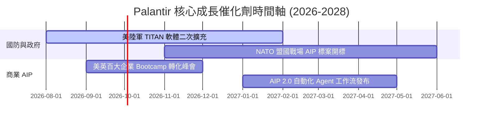

### 9.2 TAM 市場規模與滲透率

```
╔══════════════════════════════════════════════════════════════════╗
║                   Palantir潛在市場 (TAM) 拆解                     ║
╠══════════════════════════════════════════════════════════════════╣
║  全球企業數據分析與 AI 平台 TAM： $180B (Palantir 滲透率 ~2.5%)  ║
║  全球國防與情報軟體 TAM：         $50B  (Palantir 滲透率 ~6.4%)  ║
║  ─────────────────────────────────────────────                  ║
║  總潛在市場 TAM: $230B ｜ 當前 TTM 營收: $6.16B (總滲透率 ~2.7%) ║
╚══════════════════════════════════════════════════════════════════╝
```

### 9.3 成長驅動力結構圖

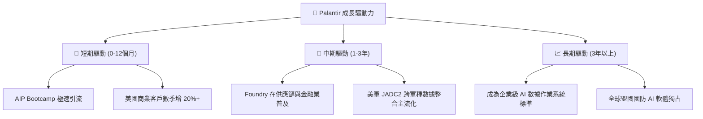

---

## 10. 風險矩陣

### 10.1 風險評分矩陣

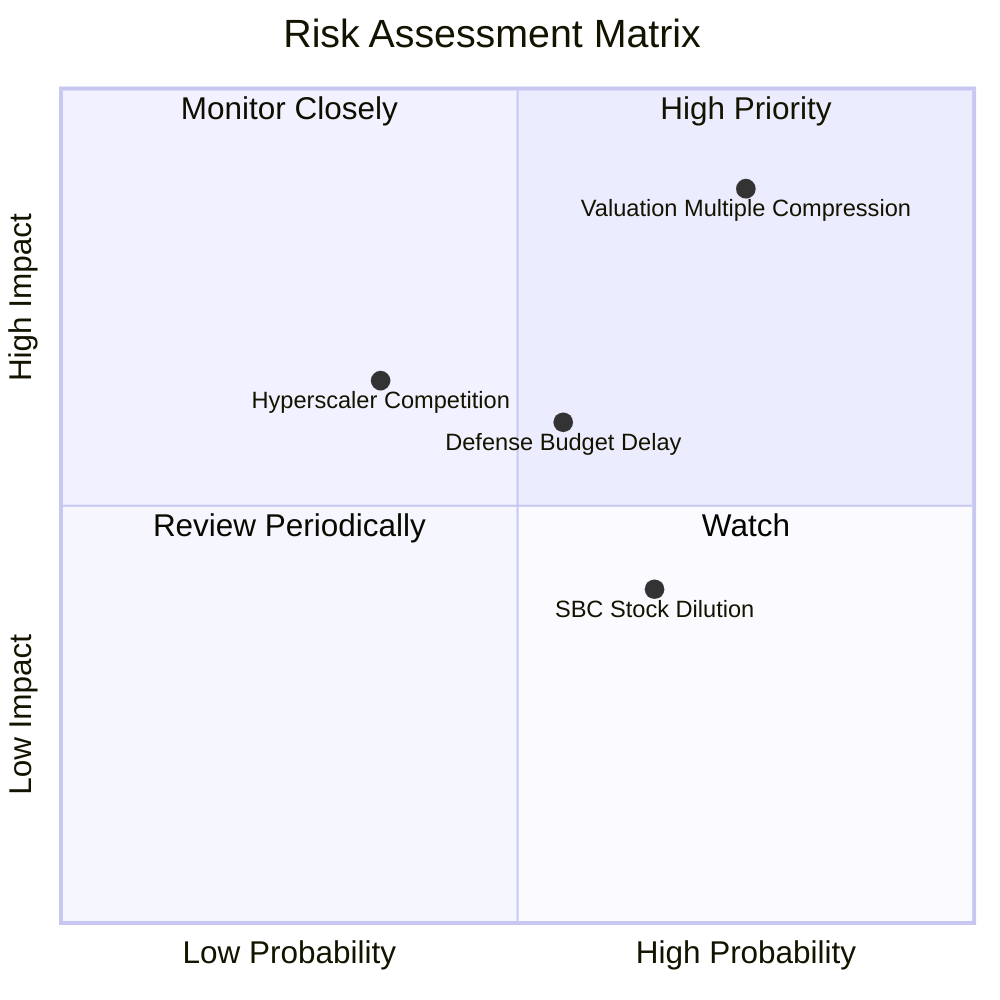

### 10.2 風險清單詳細分析

| # | 風險項目 | 發生機率 | 財務衝擊 | 風險評分 | 緩解措施與監控指標 |
|---|----------|----------|----------|----------|--------------------|
| 1 | 🔴 **估值倍數拉回風險** | 高 (75%) | 高 (股價跌幅 >30%) | 🔴 **8.8/10** | 監控美聯儲利率政策與高估值 SaaS 板塊資金流向 |
| 2 | 🟡 **國防合約預算撥款延遲** | 中 (55%) | 中 (-5% 營收不及預期) | 🟡 **6.6/10** | 觀察商業部門營收比重是否順利超越 50% 以分散風險 |
| 3 | 🟡 **SBC 股本稀釋** | 高 (65%) | 低 (年稀釋率 1.5%) | 🟡 **5.2/10** | 觀察公司股票回購計畫 (Buyback) 能否抵銷稀釋 |

---

## 11. 投資建議

### 11.1 最終綜合評級雷達圖

```
╔══════════════════════════════════════════════════════════════╗
║               Palantir (PLTR) 綜合評估雷達                   ║
╠══════════════════════════════════════════════════════════════╣
║ 基本面強度 (Fundamental)  9.5/10  ▓▓▓▓▓▓▓▓▓▓▓▓▓▓▓▓▓▓▓░ 🟢  ║
║ 成長動能   (Growth)       9.8/10  ▓▓▓▓▓▓▓▓▓▓▓▓▓▓▓▓▓▓▓█ 🟢  ║
║ 獲利品質   (Profitability) 9.2/10  ▓▓▓▓▓▓▓▓▓▓▓▓▓▓▓▓▓▓▓░ 🟢  ║
║ 財務健康   (Health)        9.8/10  ▓▓▓▓▓▓▓▓▓▓▓▓▓▓▓▓▓▓▓█ 🟢  ║
║ 估值安全度 (Valuation)    2.5/10  ▓▓▓▓▓░░░░░░░░░░░░░░░ 🔴  ║
╠══════════════════════════════════════════════════════════════╣
║ 綜合評分：8.1/10 ｜ 建議：🟡 持有 / 觀望（Hold）              ║
╚══════════════════════════════════════════════════════════════╝
```

### 11.2 目標價與隱含報酬率

| 情境 | 機率權重 | 目標價 | 相對當前股價 ($175.40) 報酬率 |
|------|----------|--------|--------------------------------|
| 🔴 **悲觀情境** | 20% | **$80.00** | -54.4% |
| 🟡 **基準情境 (12M)**| **60%** | **$142.50** | **-18.8%** |
| 🟢 **樂觀情境** | 20% | **$220.00** | +25.4% |

### 11.3 買入時機與觸發因素 Checklist

```
╔══════════════════════════════════════════════════════════════════╗
║                  ✅ 買入與交易策略 Checklist                     ║
╠══════════════════════════════════════════════════════════════════╣
║                                                                  ║
║  分批建倉觸發條件：                                              ║
║  ☐ 股價拉回至 $130.00–$140.00 區間 (加權合理價值附近)            ║
║  ☐ 股價拉回至 $105.00–$115.00 區間 (提供 >20% 安全邊際)            ║
║                                                                  ║
║  加碼觸發條件：                                                  ║
║  ☐ 單季商業營收 YoY 成長率超越 100%                              ║
║  ☐ 營業利潤率持續穩定在 45% 以上                                ║
║                                                                  ║
║  逢高減碼 / 獲利了結條件：                                       ║
║  ☐ 股價突破 $200.00 且 P/S > 80x                                ║
║  ☐ 商業客戶淨續約率 (NDR) 跌破 110%                             ║
╚══════════════════════════════════════════════════════════════════╝
```

### 11.4 投資人適配度分析

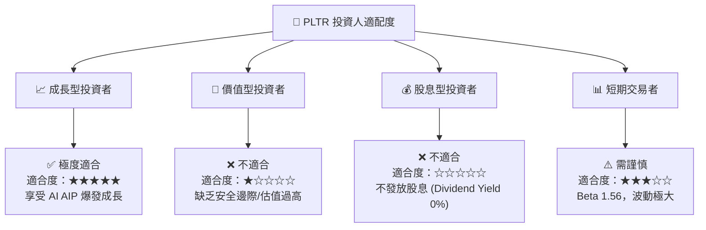

### 11.5 每季財報監控清單（Quarterly Watch List）

| 關鍵指標 | 當前基準值 (Q2 26) | 樂觀門檻 (加碼) | 警示門檻 (減碼) |
|----------|--------------------|-----------------|-----------------|
| **單季營收 YoY 成長** | 92.8% | > 80% | < 45% |
| **美國商業客戶數** | ~600+ 家 | 季增 > 15% | 季增 < 5% |
| **GAAP 營業利潤率** | 47.1% | > 45% | < 30% |
| **自由現金流 Margin** | 54.5% | > 40% | < 25% |
| **SBC / 營收比重** | 13.6% | < 10% | > 20% |

### 11.6 反面論證：什麼會證明論點錯誤（What Would Change My Mind）

```
╔══════════════════════════════════════════════════════════════════╗
║              ⚠️ 論點失效條件（Disconfirming Evidence）           ║
╠══════════════════════════════════════════════════════════════════╣
║  若出現以下任一情況，本報告之「長線高成長」多頭論點將宣告失效：   ║
║                                                                  ║
║  ☐ 1. 商業營收 YoY 成長率連續兩季跌破 30%                        ║
║  ☐ 2. 超級雲端廠商 (AWS/Azure/GCP) 推出完全替代 Ontology 之產品 ║
║  ☐ 3. GAAP 營業利潤率因為客製化成本上升而滑落至 25% 以下        ║
║  ☐ 4. 自由現金流轉負或 FCF 轉換率跌破 50%                        ║
║  ☐ 5. 稀釋股數因 SBC 年增率 > 5% 導致股東價值遭嚴重稀釋          ║
╚══════════════════════════════════════════════════════════════════╝
```

---

> **免責聲明**：本報告為 AI 自動生成之機構級研究參考資料，基於市場公開財報數據進行邏輯推演與建模。報告內容不構成任何個人化投資建議、買賣招攬或背書。股市投資存在風險，歷史績效不代表未來表現，投資人應獨立評估並自負盈虧。