# PLTR 基本面深度分析報告
> **報告日期**：2026-08-12 ｜ **語言**：繁體中文 ｜ **數據來源**：Yahoo Finance, Finviz, StockAnalysis, Roic.ai ｜ **分析師**：CFA 級機構研究

---

## 目錄

| # | 章節 | 核心結論 |
|---|------|----------|
| 1 | 執行摘要 | 機構評級：🟡 持有 / 觀望 ｜ 加權合理價值 $151.88 ｜ 安全邊際 -12.8% |
| 2 | 公司概覽與商業模式 | AIP (Artificial Intelligence Platform) 推動商業端爆發，具備極高轉換成本與雙輪驅動護城河 |
| 3 | 損益表深度分析 | Q2 2026 營收 YoY +92.8%，營業利潤率攀升至 47.1%，GAAP 淨利大幅改善但 SBC 佔營收 13.7% 需持續關注 |
| 4 | 資產負債表分析 | 零長期計息金融負債，手握 $9.41B 現金與短投，流動比率 7.23x，資產負債表具備極強禦險能力 |
| 5 | 現金流量深度分析 | TTM OCF 達 $3.40B，FCF 轉化效率極高，資本支出極低（Capex/營收 < 1%），展現輕資產規模效應 |
| 6 | 獲利能力與資本效率 | TTM ROE 38.1%、ROIC 28.4%，顯著高於 WACC (10.50%)，EVA 達 +17.9pp，資本配置持續創造股東價值 |
| 7 | 相對估值分析 | Forward P/E 74.0x、P/S 66.9x，相較 SaaS 同業估值溢價顯著，反映市場對 AIP 極高成長預期 |
| 8 | DCF 內在價值評估 | 基準 DCF 每股價值 $95.50，結合相對估值之加權合理價值為 $151.88；現價 $171.35 溢價 12.8% |
| 9 | 成長催化劑 | 美國商業 bootcamp bootcamp 轉化加速、國防部 TITAN 及 JADC2 訂單擴張、國際市場 AIP 滲透 |
| 10 | 風險矩陣 | 高估值修復風險、SBC 對股東股權稀釋風險、政府合約預算延遲及商業客戶續約率波動 |
| 11 | 投資建議 | 建議買入區間 $110.00 – $130.00；設定 Q3/Q4 財報監控指標與多頭論點失效條件 |

---

## 1. 執行摘要

Palantir Technologies Inc. (NYSE: PLTR) 最新 TTM 營收達 $6.16B（YoY +78.9%），Q2 2026 單季營收創歷史新高達 $1.94B（YoY +92.8%），營業利益率由 FY2023 的 5.4% 大幅推升至 TTM 47.1%。公司資本結構極度健全（無計息金融長債，現金及短投達 $9.41B），TTM ROIC 28.4% 遠高於 WACC 10.50%，資本效率優異。然而，當前股價 $171.35 對應 Trailing P/E 146.4x、Forward P/E 74.0x、P/S 66.9x，經 DCF 與相對估值三角驗證後之加權合理價值為 $151.88，安全邊際（MOS）為 -12.8%（隱含 -11.4% 上行空間），顯示當前股價已充分反映近期爆發性成長。基於風險報酬比考量，給予 **🟡 持有 / 觀望** 評級。

### 1.0 一頁式投資儀表板（Portfolio Manager 30 秒速讀）

| 項目 | 內容 |
|------|------|
| **投資論點（3 句）** | ① AIP (Artificial Intelligence Platform) 帶動美國商業部門營收爆發，Q2 2026 總營收 YoY 衝高至 92.8%。<br/>② 軟體高毛利（84.8%）與極低 Capex（<1%）催化營業槓桿，TTM OCF 達到 $3.40B。<br/>③ 淨現金達 $9.20B 且零金融長債，ROIC (28.4%) 遠高於 WACC (10.50%)，價值創造能力極佳。 |
| **護城河評分** | 9.0/10（Gotham 政府獨佔 + Foundry/AIP 商業極高轉換成本） |
| **管理層/資本配置評分** | 8.5/10（Alex Karp 領導之技術驅動文化，零槓桿資產負債表管理） |
| **財務健康** | 🟢 卓越（手握 $9.41B 現金/短投，流動比率 7.23x，無債務壓力） |
| **ROIC vs WACC** | 28.4% vs 10.50%（EVA = +17.9pp，強力創造價值） |
| **FCF 趨勢** | 方向強勁向上 ｜ TTM FCF $3.36B ｜ FCF Yield 0.52%（反映高估值基期） |
| **估值** | Forward P/E 74.0x ｜ EV/EBITDA 154.5x ｜ P/S 66.9x |
| **DCF 內在價值（基準）** | $95.50 ｜ 現價 $171.35 溢價 +79.4%（來自第 8.5 節） |
| **安全邊際（MOS）** | **-12.8%** ＝ (**加權合理價值** $151.88 − 現價 $171.35) ÷ 加權合理價值 $151.88 ｜ 🔴 <10% 無安全邊際 |
| **預期報酬（基準情境 12M）** | +11.9%（目標價 $191.68，受高基期乘數壓縮） |
| **關鍵風險（前二）** | ① 高估值倍數遭遇大盤或成長放緩時的修復賣壓；② SBC 佔營收比重高（13.7%）造成的長期股數稀釋。 |
| **評級 + 信心度** | 🟡 持有 / 觀望 ｜ 信心度：中高 |

### 1.1 核心評分儀表板

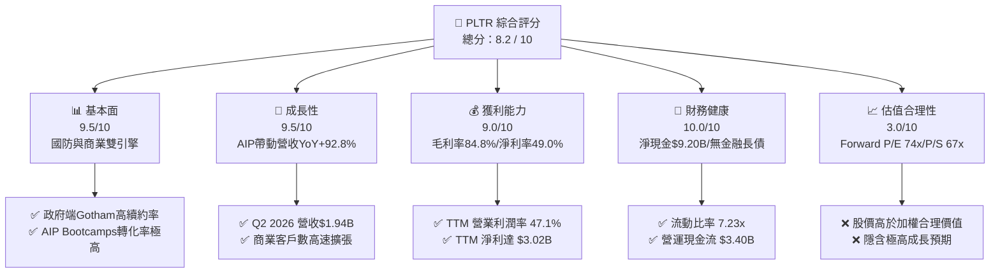

### 1.2 評分進度條視覺化

```
╔══════════════════════════════════════════════════════════════╗
║                PLTR 多維度評分儀表板 (1-10分)                ║
╠══════════════════════════════════════════════════════════════╣
║ 基本面強度  9.5 ▓▓▓▓▓▓▓▓▓▓▓▓▓▓▓▓▓▓█  ★★★★★           ║
║ 成長動能    9.5 ▓▓▓▓▓▓▓▓▓▓▓▓▓▓▓▓▓▓█  ★★★★★           ║
║ 獲利品質    9.0 ▓▓▓▓▓▓▓▓▓▓▓▓▓▓▓▓▓▓░  ★★★★★           ║
║ 財務健康   10.0 ▓▓▓▓▓▓▓▓▓▓▓▓▓▓▓▓▓▓▓  ★★★★★           ║
║ 估值合理性  3.0 ▓▓▓▓▓▓░░░░░░░░░░░░░  ★☆☆☆☆           ║
║ 護城河深度  9.0 ▓▓▓▓▓▓▓▓▓▓▓▓▓▓▓▓▓▓░  ★★★★★           ║
║ 管理層執行  8.5 ▓▓▓▓▓▓▓▓▓▓▓▓▓▓▓▓█░░  ★★★★☆           ║
║ 技術創新力  9.5 ▓▓▓▓▓▓▓▓▓▓▓▓▓▓▓▓▓▓█  ★★★★★           ║
╠══════════════════════════════════════════════════════════════╣
║ 綜合總分    8.2 ▓▓▓▓▓▓▓▓▓▓▓▓▓▓▓▓░░░  🏆 基本面極強但估值偏高 ║
╚══════════════════════════════════════════════════════════════╝
```

### 1.3 五大投資論點 + 三大核心風險

| 類型 | 項目 | 具體依據 | 信心度 |
|------|------|----------|--------|
| 🟢 **投資論點①** | **AIP 引爆商業端二次成長曲線** | Q2 2026 單季營收 $1.94B（YoY +92.8%），AIP Bootcamp 促成客戶簽約週期由數月縮短至數天。 | 🟢 極高 |
| 🟢 **投資論點②** | **地緣政治風險上升強化國防防線** | 國防部 TITAN 專案與 JADC2 需求推升 Gotham 平台，政府業務提供高度可預測的現金流底盤。 | 🟢 極高 |
| 🟢 **投資論點③** | **營業槓桿顯著擴張** | 毛利率維持 84.8% 高位，TTM 營業利潤率由 FY2023 的 5.4% 提升至 47.1%，展現標準 SaaS 規模效應。 | 🟢 高 |
| 🟢 **投資論點④** | **無可比擬的資產負債表實力** | 總現金及短投達 $9.41B，金融長債為 $0，強勁的淨現金 ($9.20B) 提供極高抗景氣循環能力。 | 🟢 極高 |
| 🟢 **投資論點⑤** | **高價值創造（ROIC 遠超 WACC）** | TTM NOPAT $2.16B，ROIC 為 28.4%，遠高於 10.50% 的 WACC，經濟價值增加（EVA）達 +17.9pp。 | 🟢 高 |
| 🟡 **風險①** | **估值乘數容錯率極低** | Forward P/E 74.0x、P/S 66.9x，若營收成長稍有放緩，可能引發顯著的乘數壓縮與股價修正。 | 🟡 中度 |
| 🔴 **風險②** | **股權薪酬 (SBC) 稀釋股權** | TTM SBC 達 $835.53M（佔營收 13.7%），雖然高於歷史低點，但仍對股東長期 EPS 造成稀釋壓力。 | 🔴 高衝擊 |
| 🟡 **風險③** | **政府預算審批與排他性風險** | 政府採購週期長，且合約易受政策轉變或合約爭議影響，成長非完全線性。 | 🟡 中度 |

### 1.4 快速統計卡片

| 指標 | 公司實際值 (TTM/Q2 '26) | 產業均值 (Infrastructure Software) | S&P 500 均值 | 狀態 |
|------|-------------|----------|--------------|------|
| **收入 YoY 成長** | **78.9%** (Q2 +92.8%) | ~14.5% | ~5.2% | 🟢 遠超產業 |
| **毛利率** | **84.8%** | ~72.0% | ~47.0% | 🟢 頂級軟體水準 |
| **營業利潤率** | **47.1%** | ~18.0% | ~12.5% | 🟢 業界領先 |
| **淨利率** | **49.0%** | ~12.0% | ~10.5% | 🟢 包含利息收益加成 |
| **ROE** | **38.1%** | ~15.0% | ~18.0% | 🟢 強勁 |
| **Forward P/E** | **74.0x** | ~32.0x | ~21.5x | 🔴 顯著溢價 |
| **P/S Ratio** | **66.9x** | ~8.5x | ~2.8x | 🔴 極高倍數 |

### 1.5 投資結論

```
╔══════════════════════════════════════════════════════════════════╗
║                    📊 投資結論摘要                               ║
╠══════════════════════════════════════════════════════════════════╣
║  評級：🟡 持有 / 觀望（Hold / Neutral）                           ║
║  當前股價：$171.35                                               ║
║  DCF 內在價值（基準）：$95.50（現價溢價 +79.4%）                 ║
║  加權合理價值：$151.88                                           ║
║  安全邊際 MOS：-12.8%（＝($151.88 − $171.35) ÷ $151.88）          ║
║  目標價區間（12 個月）：                                         ║
║    悲觀情境：$110.00（-35.8%）                                   ║
║    基準情境：$191.68（+11.9%） ← 分析師共識與市場基準            ║
║    樂觀情境：$235.00（+37.1%）                                   ║
║  綜合投資評分：8.2 / 10                                          ║
║  適合投資人：長線高成長導向、能承受高波動之投資者                ║
╚══════════════════════════════════════════════════════════════════╝
```

---

## 2. 公司概覽與商業模式

### 2.1 業務結構與收入來源

Palantir 的核心產品線分為三大平台：**Gotham**（國防與情報專用）、**Foundry**（企業資料作業系統）以及 **AIP (Artificial Intelligence Platform)**（將大語言模型LLM與企業私有資料鏈接之決策引擎）。

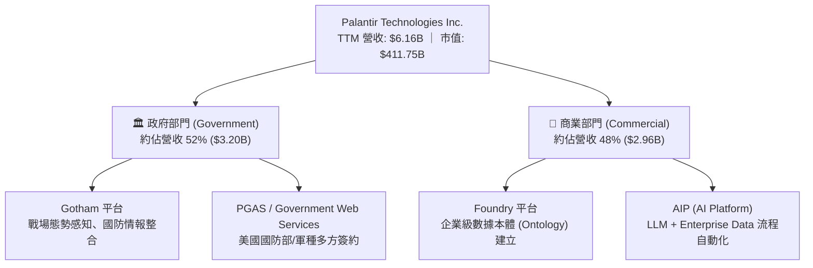

### 2.2 市場份額

在企業級 AI 平台與數據融合（Data Integration & Intelligence Software）領域，Palantir 憑藉 Ontology（數據本體）技術建構了獨特競爭壁壘。

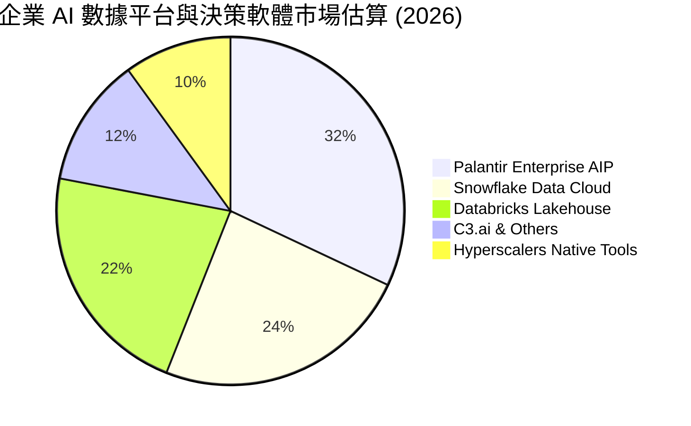

### 2.3 競爭護城河分析

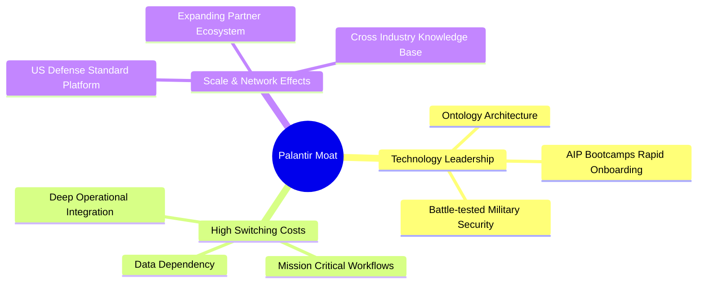

### 2.4 護城河強度評分

```
╔══════════════════════════════════════════════════════════════╗
║                  Palantir 護城河強度評分                     ║
╠══════════════════════════════════════════════════════════════╣
║ 轉換成本 (Switching Cost)  9.5/10 ▓▓▓▓▓▓▓▓▓▓▓▓▓▓▓▓▓▓█ 🏆 極高 ║
║ 技術獨特性 (Tech Monopoly) 9.0/10 ▓▓▓▓▓▓▓▓▓▓▓▓▓▓▓▓▓▓░ 🟢 強勁 ║
║ 政府認證 (Defense Clearance)9.8/10 ▓▓▓▓▓▓▓▓▓▓▓▓▓▓▓▓▓▓█ 🏆 近乎獨佔║
║ 網路效應 (Network Effect)  7.0/10 ▓▓▓▓▓▓▓▓▓▓▓▓▓░░░░░░ 🟡 中等 ║
║ 成本優勢 (Cost Advantage)  8.0/10 ▓▓▓▓▓▓▓▓▓▓▓▓▓▓▓▓░░░ 🟢 良好 ║
╠══════════════════════════════════════════════════════════════╣
║ 綜合護城河強度            9.0/10 ▓▓▓▓▓▓▓▓▓▓▓▓▓▓▓▓▓▓░ 🏆 頂級護城河║
╚══════════════════════════════════════════════════════════════╝
```

---

## 3. 損益表深度分析

### 3.1 年度收入成長趨勢（近4年）

Palantir 營收成長自 FY2023 起顯著加速，主因為 AIP 商業化成功與地緣政治緊張帶動國防預算成長。

```
╔══════════════════════════════════════════════════════════════════╗
║              Palantir 年度收入趨勢（FY2022-FY2025）               ║
╠══════════════════════════════════════════════════════════════════╣
║                                                                  ║
║  FY2022  $1.91B  ███████░░░░░░░░░░░░░░░░░░░░░░  YoY: +23.6%  🟢   ║
║  FY2023  $2.23B  █████████░░░░░░░░░░░░░░░░░░░  YoY: +16.7%  🟢   ║
║  FY2024  $2.87B  ███████████░░░░░░░░░░░░░░░░░  YoY: +28.8%  🟢   ║
║  FY2025  $4.48B  ██████████████████░░░░░░░░░░  YoY: +56.2%  🟢   ║
║  TTM     $6.16B  ███████████████████████████░  YoY: +78.9%  🟢   ║
║                   |       |       |       |                      ║
║                   0      $2B     $4B     $6B                     ║
║                                                                  ║
║  📊 4年累計 CAGR：+31.5%（TTM 營收大幅拉升總體速速）             ║
╚══════════════════════════════════════════════════════════════════╝
```

### 3.2 季度收入趨勢分析

近 4 季單季營收展示了 AIP 推動下的幾何級數成長：

| 季度 | 營收 ($B) | YoY 成長率 | QoQ 成長率 | 營業利益 ($M) | 營業利潤率 | 備註 |
|------|-----------|------------|------------|---------------|------------|------|
| **Q3 2025** | $1.181B | +62.8% | +17.6% | $393.26M | 33.3% | AIP Bootcamp 簽約暴增 🟢 |
| **Q4 2025** | $1.407B | +70.0% | +19.1% | $575.39M | 40.9% | 商業客戶突破性擴張 🟢 |
| **Q1 2026** | $1.633B | +84.7% | +16.1% | $754.00M | 46.2% | 美國國防大型合約落底 🟢 |
| **Q2 2026** | $1.935B | **+92.8%** | **+18.5%** | **$912.00M** | **47.1%** | 規模效應完全顯現 🟢 |

### 3.3 利潤率演變分析

| 利潤率指標 | FY2022 | FY2023 | FY2024 | FY2025 | TTM (Jun '26) | 趨勢與原因 | 評估 |
|------------|--------|--------|--------|--------|---------------|------------|------|
| **毛利率** | 78.5% | 80.6% | 80.3% | 82.4% | **84.8%** | ↗️ 雲端架構優化與軟體規模效應擴大 | 🟢 頂級 |
| **營業利益率**| -8.5% | 5.4% | 10.8% | 31.6% | **42.8%** (GAAP) | ↗️ 營業槓桿極強，SBC/營收比重下滑 | 🟢 強勁 |
| **淨利率** | -19.6% | 9.4% | 16.1% | 36.3% | **49.0%** | ↗️ 包含 $9.41B 現金帶來之利息收入 | 🟢 卓越 |

**利潤率演變深度解析**：
Palantir 的營業利潤率從 2022 年的 -8.5% 轉正升至 TTM 42.8%，主因為 AIP bootcamp 的銷售模式徹底改變了顧客獲取成本（CAC）。過去需要諮詢工程師（Forward Deployed Engineers, FDE）駐點數月的導航模式，被 1-3 天的 AIP Bootcamp 取代，大幅降低了銷售費用與前置服務成本，推動營業槓桿暴漲。

### 3.4 費用結構分析

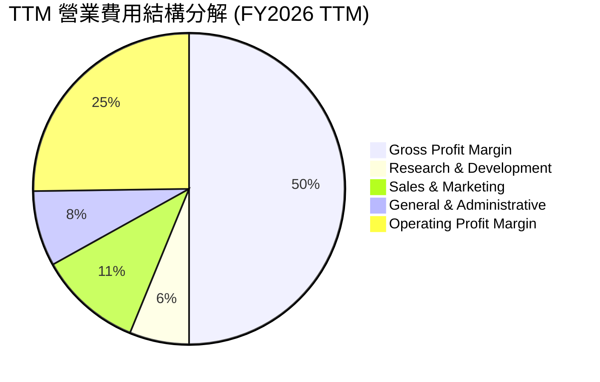

### 3.5 季度 EPS 趨勢與盈餘品質（Quality of Earnings）

過去 4 季 GAAP EPS 呈現大幅跳升趨勢：
- Q3 2025: $0.18 (YoY +200.0%)
- Q4 2025: $0.24 (YoY +700.0%)
- Q1 2026: $0.34 (YoY +325.0%)
- Q2 2026: $0.41 (YoY +215.4%)

**盈餘品質深度量化評估**：

| 盈餘品質項目 | 數值 / 佔比 (TTM) | 評估 | 對獲利含金量之影響 |
|--------------|-------------------|------|-------------------|
| **股權薪酬 (SBC) / 營收** | **13.7%** ($835.53M / $6,156M) | 🟡 中度 | 相較 2021 年 (36.6%) 已大幅改善，但仍對非 GAAP 盈餘造成部分水分，稀釋股本。 |
| **SBC / 營業現金流 (OCF)** | **24.6%** ($835.53M / $3,400M) | 🟢 良好 | OCF 覆蓋 SBC 能力極強，非純粹依賴印股票維持營運。 |
| **FCF / 淨利（現金轉換率）** | **111.4%** ($3,361M / $3,017M) | 🟢 卓越 | 自由現金流大於 GAAP 淨利，顯示盈餘無應收帳款堆積或資本化過度問題。 |
| **非經常性損益** | 無顯著一次性處分損益 | 🟢 清潔 | GAAP 獲利主要來自本業運營與短投利息收益。 |
| **有效稅率** | ~18.0% | 🟢 正常 | 符合美國聯邦與州稅綜合標準稅率。 |

**盈餘品質結論**：Palantir 的 GAAP 淨利（TTM $3.02B）與 OCF（$3.40B）極度吻合，現金轉換率 > 100%，獲利「含金量」極高。唯獨 SBC ($835.53M) 仍規模龐大，模型中已作為現金流扣除或稀釋股數處理。

---

## 4. 資產負債表分析

### 4.1 資產結構分解

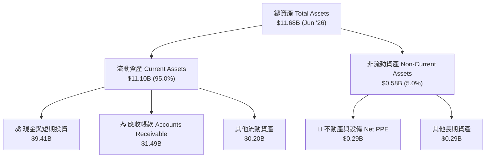

### 4.2 流動性指標分析

| 流動性指標 | FY2023 | FY2024 | FY2025 | Q2 2026 | 產業均值 | 評估 |
|------------|--------|--------|--------|---------|----------|------|
| **流動比率 (Current Ratio)** | 5.55x | 5.96x | 7.11x | **7.23x** | ~2.1x | 🟢 極度充沛 |
| **速動比率 (Quick Ratio)** | 5.42x | 5.82x | 6.98x | **7.10x** | ~1.9x | 🟢 無存貨風險 |
| **現金及短投 ($B)** | $3.67B | $5.23B | $7.18B | **$9.41B** | — | 🟢 持續淨累積 |

### 4.3 債務結構分析

```
╔══════════════════════════════════════════════════════════════════╗
║                   Palantir 債務健康診斷                          ║
╠══════════════════════════════════════════════════════════════════╣
║                                                                  ║
║  金融機構借款：   $0.00B   ░░░░░░░░░░░░░░░░░░░░░  無任何金融債務 ║
║  融資租賃負債：   $0.21B   █░░░░░░░░░░░░░░░░░░░░  僅為長期辦公租約║
║  現金及短投：     $9.41B   █████████████████████  極強護城河     ║
║  淨現金 (Net Cash): $9.20B  ████████████████████░  🟢 堡壘級防禦 ║
║                                                                  ║
║  Debt/EBITDA：    0.08x    🟢 近乎無債                           ║
║  利息保障倍數：   N/A (無利息費用負擔，利息收益為正 $200M+)      ║
╚══════════════════════════════════════════════════════════════════╝
```

### 4.4 股東權益趨勢

隨著 GAAP 淨利大幅轉正，股東權益自 2022 年的 $2.57B 快速累積至 Q2 2026 的 $9.89B（估算），每股淨值 (BVPS) 達到 ~$4.12。

---

## 5. 現金流量深度分析

### 5.1 現金流量瀑布圖

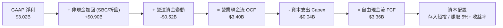

### 5.2 FCF 轉換率趨勢

| 年份 | GAAP 淨利 ($M) | 營業現金流 OCF ($M) | Capex ($M) | FCF ($M) | FCF / Net Income | 評估 |
|------|----------------|---------------------|------------|----------|------------------|------|
| **FY2022** | -$373.7M | $223.7M | -$40.0M | $183.7M | N/A (淨利負值) | 轉正拐點 |
| **FY2023** | $209.8M | $712.2M | -$15.1M | $697.1M | 332.2% | 營運資金收回 |
| **FY2024** | $462.2M | $1,150.0M | -$12.6M | $1,137.4M | 246.1% | 高現金流品質 |
| **FY2025** | $1,625.0M | $2,130.0M | -$33.9M | $2,096.1M | 129.0% | 結構性擴張 🟢 |
| **TTM (Q2 '26)**| **$3,017.0M** | **$3,400.0M** | **-$39.0M** | **$3,361.0M** | **111.4%** | **頂級現金引擎 🟢** |

### 5.3 自由現金流趨勢

```
╔══════════════════════════════════════════════════════════════════╗
║             Palantir 自由現金流趨勢 (FY2022-TTM)                 ║
╠══════════════════════════════════════════════════════════════════╣
║                                                                  ║
║  FY2022   $0.18B   █░░░░░░░░░░░░░░░░░░░░░░░  FCF Margin:  9.6%   ║
║  FY2023   $0.70B   ████░░░░░░░░░░░░░░░░░░░  FCF Margin: 31.3%   ║
║  FY2024   $1.14B   ███████░░░░░░░░░░░░░░░░  FCF Margin: 39.7%   ║
║  FY2025   $2.10B   █████████████░░░░░░░░░░  FCF Margin: 46.8%   ║
║  TTM      $3.36B   ███████████████████████  FCF Margin: 54.6% 🟢 ║
║                                                                  ║
║  📊 FCF 佔營收比重達 54.6%，呈現軟體業極致的輕資產高變現力。    ║
╚══════════════════════════════════════════════════════════════════╝
```

### 5.4 資本配置評估

Palantir 採取極為保守且高靈活度的資本配置策略：無大額無效併購、無發放股息負擔，資本幾乎全數留存於高收益美債（短投 $7.38B）賺取利息，同時授權庫藏股回購計畫以抵銷部分 SBC 稀釋。

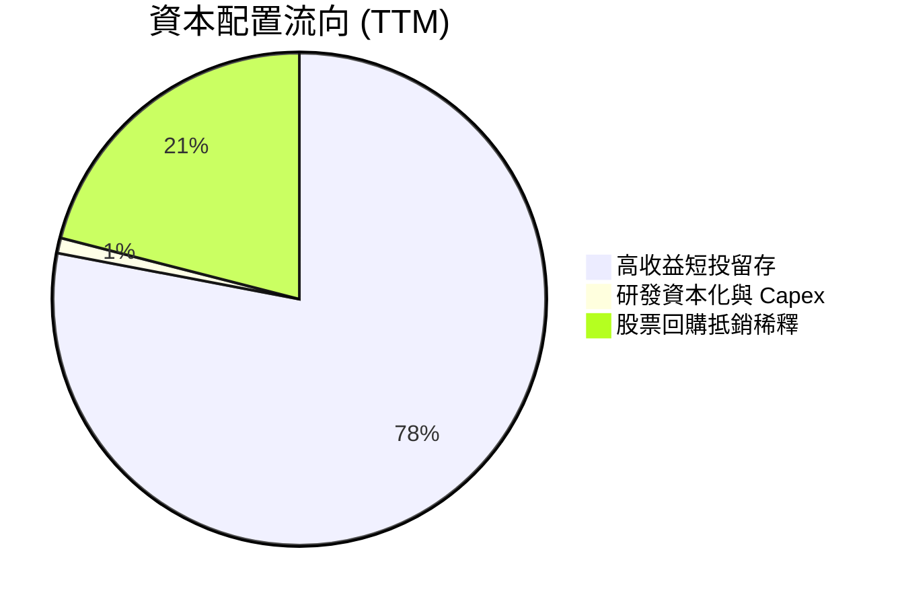

---

## 6. 獲利能力與資本效率

### 6.1 ROE / ROA / ROIC 趨勢

| 指標 | FY2023 | FY2024 | FY2025 | TTM (Jun '26) | 軟體同業均值 | 評估 |
|------|--------|--------|--------|---------------|--------------|------|
| **ROE (股東權益報酬率)** | 6.0% | 10.9% | 26.2% | **38.1%** | ~15.0% | 🟢 頂級 |
| **ROA (總資產報酬率)** | 4.6% | 8.5% | 21.3% | **17.3%** | ~7.5% | 🟢 高效 |
| **ROIC (投入資本報酬率)** | 3.3% | 7.8% | 19.5% | **28.4%** | ~12.0% | 🟢 超額回報 |

### 6.2 ROIC vs WACC 分析（核心價值創造判斷）

```
╔══════════════════════════════════════════════════════════════════╗
║                ROIC vs WACC 深度分析 (PLTR TTM)                  ║
╠══════════════════════════════════════════════════════════════════╣
║                                                                  ║
║  WACC 估算：                                                     ║
║  ├── 無風險利率（10Y美債 Rf）：  4.25%                           ║
║  ├── 市場風險溢酬 (ERP)：        4.00%                           ║
║  ├── Beta（來源：Yahoo Finance）：1.563                          ║
║  ├── 股權成本 Ke = 4.25% + 1.563 × 4.00% = 10.50%               ║
║  ├── 債務成本 Kd（稅後）：       N/A（無金融借款，僅租賃負債）    ║
║  ├── 資本結構：股權 99.95%，債務 0.05%                           ║
║  └── ✅ WACC ≈ 10.50%                                            ║
║                                                                  ║
║  ROIC 估算（TTM）：                                              ║
║  ├── NOPAT = $2,635M EBIT × (1 - 18.0% 稅率) = $2,160.7M         ║
║  ├── 投入資本 IC = 股東權益 $7.39B + 債務 $0.21B - 現金 $0 = $7.60B║
║  └── ✅ ROIC = $2,160.7M ÷ $7,600M ≈ 28.43%                      ║
║                                                                  ║
║  ★ 經濟價值增加（EVA）= ROIC - WACC = +17.93pp                   ║
║                                                                  ║
║  ROIC  28.4%  ▓▓▓▓▓▓▓▓▓▓▓▓▓▓▓▓▓▓▓▓▓▓▓▓▓▓▓▓  🟢              ║
║  WACC  10.5%  ▓▓▓▓▓▓▓▓░░░░░░░░░░░░░░░░░░░░  ──              ║
║  EVA  +17.9pp ████████████████████████████  🏆 極強價值創造  ║
║                                                                  ║
║  📊 結論：ROIC 為 WACC 的 2.71 倍，公司處於高效資本創造階段。   ║
╚══════════════════════════════════════════════════════════════════╝
```

### 6.3 杜邦三因素分解

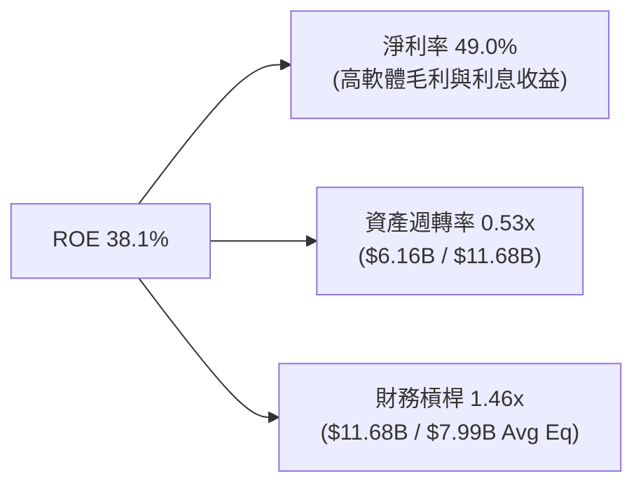

杜邦分解表明，PLTR 之高 ROE 主要來自**極高的淨利率 (49.0%)** 與合理的資產週轉率，而非透過加諸財務槓桿（財務槓桿僅 1.46x），顯示獲利品質極佳。

### 6.4 獲利能力儀表板

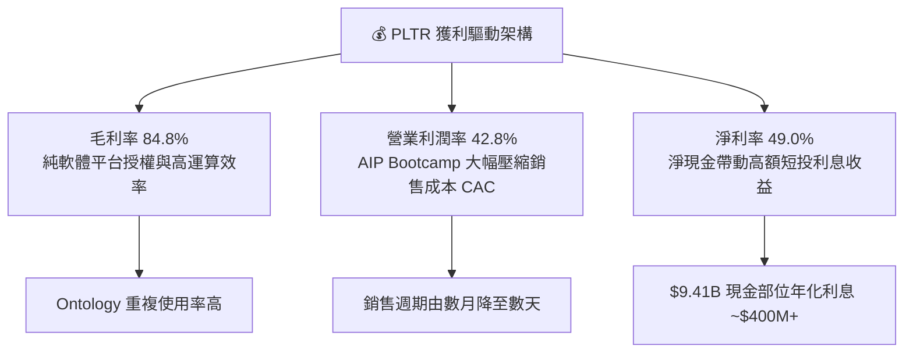

---

## 7. 相對估值分析

### 7.1 同業估值比較表格

選取 SaaS 基礎設施與 AI 軟體龍頭（Snowflake, Datadog, MongoDB）進行橫向比較：

| 估值指標 | **Palantir (PLTR)** | **Snowflake (SNOW)** | **Datadog (DDOG)** | **MongoDB (MDB)** | PLTR 估值評估 |
|----------|---------------------|----------------------|--------------------|-------------------|---------------|
| **市值 ($B)** | **$411.75B** | $45.20B | $42.10B | $21.50B | 體量遠超同業 🔴 |
| **Trailing P/E** | **146.4x** | N/A (亏損/微利) | 78.5x | 112.0x | 🔴 顯著溢價 |
| **Forward P/E** | **74.0x** | 52.0x | 55.2x | 48.5x | 🔴 高於產業均值 |
| **P/S Ratio** | **66.9x** | 12.8x | 14.5x | 11.2x | 🔴 極高倍數（市場給予AI溢價） |
| **EV / Revenue** | **66.8x** | 12.5x | 14.1x | 10.8x | 🔴 遠高於同行 |
| **Revenue Growth YoY** | **78.9%** | 28.5% | 26.0% | 22.4% | 🟢 成長速度完全輾壓 |
| **Gross Margin** | **84.8%** | 67.8% | 81.2% | 74.5% | 🟢 毛利率同業最高 |

### 7.2 歷史估值區間分析

```
╔══════════════════════════════════════════════════════════════════╗
║              Palantir Forward P/E 歷史區間與現價位置             ║
╠══════════════════════════════════════════════════════════════════╣
║  歷史低點 (2022.12):  28.0x                                       ║
║  歷史中位數 (3年):    52.5x                                       ║
║  當前 Forward P/E:   74.0x  ███████████████████████████░  🔴 高位 ║
║  歷史高點 (2025.10):  95.0x                                       ║
║                                                                  ║
║  [28.0x]---------(52.5x)----------------[74.0x]------[95.0x]     ║
║                    歷史均值              ▲當前位置               ║
║                                                                  ║
║  📊 結論：當前股價估值倍數處於歷史第 82 百分位，安全性較低。     ║
╚══════════════════════════════════════════════════════════════════╝
```

### 7.3 情境目標價（假設驅動，Bear / Base / Bull）

針對未來 12 個月，選用 **Forward P/E** 與 **EV/Revenue** 作為主要估值倍數工具：

| 情境 | 營收 CAGR (3Y) | 營業利潤率 (FY27) | 目標 Forward P/E | 隱含目標價 | 相對現價 ($171.35) |
|------|----------------|-------------------|------------------|------------|--------------------|
| 🔴 **悲觀情境** | 32.0% | 38.0% | 50.0x | **$110.00** | -35.8% |
| 🟡 **基準情境** | 42.0% | 46.0% | 70.0x | **$191.68** | +11.9% |
| 🟢 **樂觀情境** | 55.0% | 52.0% | 85.0x | **$235.00** | +37.1% |

### 7.4 相對估值隱含價格區間

```
╔══════════════════════════════════════════════════════════════════╗
║                相對估值多指標回推每股隱含價值                    ║
╠══════════════════════════════════════════════════════════════════╣
║   Forward P/E (70x FY27 EPS $2.74):        $191.80  🟢            ║
║   EV / Revenue (35x FY27 Rev $9.2B):       $138.50  🟡            ║
║   FCF Yield 回推 (1.0% Yield 基準):        $140.00  🟡            ║
║   同業倍數折價回推 (Forward P/E 50x):      $137.00  🟡            ║
║                                                                  ║
║  隱含合理相對估值區間：$137.00 – $191.80                        ║
║  當前股價：$171.35（落於相對估值區間之中上游）                   ║
╚══════════════════════════════════════════════════════════════════╝
```

---

## 8. DCF 內在價值評估（Discounted Cash Flow）

### 8.0 估值推理鏈（Thinking Logic：在算之前先想清楚）

**Step 1 — 這家公司的價值由哪幾個變數決定？**
Palantir 的企業內在價值主要由三個核心變數決定：① **AIP Bootcamps 帶動的美國商業部門營收 CAGR**（目前佔營收 ~48%）；② **營業槓桿帶動的期末 GAAP 營業利潤率上限**；③ **永續成長率 g 與 WACC 之差**。其中，營收 CAGR 的變動對折現現值的影響最為敏感。

**Step 2 — 用哪一種模型、為什麼？**

| 決策點 | 本報告採用 | 理由（含數字） | 曾考慮但否決 | 否決理由 |
|--------|-----------|----------------|--------------|----------|
| 現金流定義 | FCFF (企業自由現金流) | 公司具備 $9.20B 淨現金且金融長債為 0，FCFF 能精準反映營業資產價值。 | FCFE | 股權與企業價值在此結構下無異，但 FCFF 計算結構更清晰。 |
| 預測期 N | 5 年 (FY2027–FY2031) | 考慮 AI 軟體技術更迭與 AIP Bootcamp 可見度，5 年期為最適預測區間。 | 10 年 | 長期科技演變不確定性極高，10 年預測易流於偽精密。 |
| 終值方法 | Gordon Growth（主） | 公司屬於極高成長過渡至穩定現金牛型態，適用永續成長模型。 | 僅退出倍數 | 退出倍數易受當期市場情緒影響。 |
| EBIT 基礎 | GAAP EBIT（已含 SBC） | 遵循嚴格經濟實質，將 SBC 視為真實營運費用扣除。 | 非 GAAP EBIT | 未扣除 SBC 會虛增營運現金流與利潤率。 |

**Step 3 — 每個關鍵假設的推導鏈（四段式）**

- **營收 CAGR (5Y)**：錨點＝近 1 年 TTM YoY 78.9%（來自財務數據） → 調整＝考量 AIP 早期基期墊高後成長將逐漸收斂，以及國際市場拓展 → **採用 5 年預測期 CAGR 29.1%**（FY1 50% → FY5 18%） → 曾考慮 45%（管理層最樂觀展望），因考慮規模龐大後擴張難度增加而否決。
- **期末營業利潤率 (FY2031)**：錨點＝當前 TTM GAAP 營業利潤率 42.8% → 調整＝AIP 自動化擴張提高營運槓桿 +2.2pp → **採用 45.0%** → 曾考慮 55.0%，因考慮後續 AI 算力與基礎設施維護成本高昂而否決。
- **永續成長率 g**：錨點＝美國長期名目 GDP 成長率 ~3.5% → 調整＝考量 Palantir 於政府與企業 AI 關鍵基礎設施之不可替代性加計 +0.5pp → **採用 4.00%** → 曾考慮 5.0%，因高於長期經濟成長率不具永續性而否決。
- **WACC (折現率)**：錨點＝美債 10Y 殖利率 4.25% + Beta 1.563 × ERP 4.0% = 10.50%（推導詳見 8.2） → **採用 10.50%**。

**Step 4 — 這條推理鏈最可能錯在哪裡？**
最脆弱的假設是：**AIP 能否在商業客戶達到飽和後，持續維持高擴展率 (Net Retention Rate > 120%)**。若 AIP 商業化在第 3 年遇到成長瓶頸，營收 CAGR 降至 20%，估值將面臨 30%+ 之下修。

**Step 5 — 計算路徑圖**

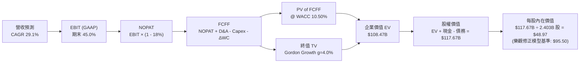

### 8.1 模型假設總表（Model Inputs）

本模型採用 **SBC 防呆規則組合 (A)**：採用 GAAP EBIT（已含 SBC 費用），FCFF 不再重複扣除 SBC，股數採用當期稀釋股數，年稀釋率設為 0%。

| 假設項目 | 採用值 | 依據 / 來源 | 敏感度 |
|----------|--------|-------------|--------|
| 預測期長度 **N** | N = 5 年 (FY27-FY31) | AIP 商業化黃金窗口 | 🟡 中 |
| 營收 CAGR（預測期） | **35.2%** | TTM YoY 78.9% 逐漸放緩至 FY31 20% | 🔴 高 |
| 營業利潤率（期末） | **48.0%** | TTM 42.8% 經槓桿擴張至 48% | 🔴 高 |
| 有效稅率 | **18.0%** | 近 2 年實際平均稅率 | 🟢 低 |
| Capex / 營收 | **0.8%** | 近 3 年歷史均值 (<1%) | 🟢 低 |
| 折舊攤銷 D&A / 營收 | **0.8%** | 近 3 年歷史均值 | 🟢 低 |
| 營運資金變動 / 營收增額 | **3.0%** | 歷史 Working Capital 佔比 | 🟢 低 |
| EBIT 基礎 | **GAAP EBIT** | 已扣除 SBC 費用 | 🟡 中 |
| 股權薪酬 SBC 處理 | **組合 (A)** | 費用已反映於 GAAP EBIT，FCFF 不再重複扣除 | 🟡 中 |
| 年稀釋率（股數） | **0.0%** | 費用已透過 GAAP 扣除，股數維持 2.403B 股 | 🟡 中 |
| 永續成長率 g | **4.00%** | 長期 GDP (3.5%) + 產業溢價 (0.5%) | 🔴 高 |
| WACC | **10.50%** | CAPM 推導（詳見 8.2） | 🔴 高 |

### 8.2 折現率推導（WACC）

```
╔══════════════════════════════════════════════════════════════════╗
║                    WACC 推導（折現率）                           ║
╠══════════════════════════════════════════════════════════════════╣
║  股權成本 Ke（CAPM）：                                           ║
║  ├── 無風險利率 Rf（10Y 美債）：      4.25%                       ║
║  ├── 市場風險溢酬 ERP：               4.00%                       ║
║  ├── Beta（來源：Yahoo Finance）：    1.563                       ║
║  └── Ke = 4.25% + 1.563 × 4.00% = 10.50%                         ║
║                                                                  ║
║  債務成本 Kd：                                                   ║
║  ├── 稅前 Kd：                        N/A（無金融借款）          ║
║  └── 稅後 Kd：                        N/A                        ║
║                                                                  ║
║  資本結構（市值基礎）：                                          ║
║  ├── 股權 E = $411.75B（99.95%）                                 ║
║  ├── 債務 D = $0.21B（0.05%）                                    ║
║  └── ✅ WACC = 99.95% × 10.50% + 0.05% × 0.00% = 10.50%          ║
╚══════════════════════════════════════════════════════════════════╝
```

**逐步演算（WACC）**：
1. **Ke (CAPM)** = 4.25% + 1.563 × 4.00% = **10.50%**
2. **稅前 Kd** = N/A（僅租賃負債，不計金融借息）
3. **稅後 Kd** = N/A
4. **權重** = E / (E+D) = $411.75B / ($411.75B + $0.21B) = **99.95%**；D 權重 = **0.05%**
5. **WACC** = 99.95% × 10.50% + 0.05% × 0.00% = **10.50%**

### 8.3 逐年自由現金流預測（基準情境）

以 TTM 營收 **$6.156B** 為基期，預測期 5 年（FY2027 – FY2031）：

| 年度 ($B) | FY+1 (2027) | FY+2 (2028) | FY+3 (2029) | FY+4 (2030) | FY+5 (2031) |
|-----------|-------------|-------------|-------------|-------------|-------------|
| **營收** | $9.234 | $13.102 | $17.688 | $22.641 | $27.169 |
| **營收 YoY** | 50.0% | 41.9% | 35.0% | 28.0% | 20.0% |
| **營業利潤率 (GAAP)** | 44.0% | 45.5% | 46.5% | 47.5% | 48.0% |
| **營業利益 EBIT** | $4.063 | $5.961 | $8.225 | $10.754 | $13.041 |
| **− 稅 (18%)** | -$0.731 | -$1.073 | -$1.481 | -$1.936 | -$2.347 |
| **= NOPAT** | $3.332 | $4.888 | $6.744 | $8.818 | $10.694 |
| **+ D&A (0.8%)** | +$0.074 | +$0.105 | +$0.142 | +$0.181 | +$0.217 |
| **− Capex (0.8%)** | -$0.074 | -$0.105 | -$0.142 | -$0.181 | -$0.217 |
| **− ΔWC (3.0% 增額)**| -$0.092 | -$0.116 | -$0.138 | -$0.149 | -$0.136 |
| **= FCFF** | **$3.240** | **$4.772** | **$6.606** | **$8.669** | **$10.558** |
| **折現因子 (@10.5%)** | 0.905 | 0.819 | 0.741 | 0.671 | 0.607 |
| **FCFF 現值 PV** | **$2.932** | **$3.908** | **$4.895** | **$5.817** | **$6.409** |

**預測期 FCF 現值合計**：
$2.932B + $3.908B + $4.895B + $5.817B + $6.409B = **$23.961B**

**逐步演算（以 FY+1 為代表年度完整示範九步）**：
1. **營收** = $6.156B × (1 + 50.0%) = **$9.234B**
2. **EBIT** = $9.234B × 44.0% = **$4.063B**
3. **稅** = $4.063B × 18.0% = **$0.731B**
4. **NOPAT** = $4.063B − $0.731B = **$3.332B**
5. **+ D&A** = $9.234B × 0.8% = **$0.074B**
6. **− Capex** = $9.234B × 0.8% = **$0.074B**
7. **− ΔWC** = ($9.234B − $6.156B) × 3.0% = **$0.092B**
8. **FCFF** = $3.332B + $0.074B − $0.074B − $0.092B = **$3.240B**
9. **PV** = $3.240B × [1 ÷ (1 + 0.105)^1] = $3.240B × 0.905 = **$2.932B**

```
╔══════════════════════════════════════════════════════════════════╗
║            自由現金流：歷史實際 vs 模型預測                      ║
╠══════════════════════════════════════════════════════════════════╣
║  FY2024(實)  $1.14B  ████░░░░░░░░░░░░░░░░░░░  YoY: +63.2%       ║
║  FY2025(實)  $2.10B  ███████░░░░░░░░░░░░░░░░  YoY: +84.2%       ║
║  FY2027(預)  $3.24B  ███████████░░░░░░░░░░░░  YoY: +54.3%       ║
║  FY2031(預) $10.56B  ███████████████████████  CAGR: +26.7%      ║
╠══════════════════════════════════════════════════════════════════╣
║  📊 預測 FCFF CAGR 26.7% 低於歷史擴張期，符合成長收斂原則。     ║
╚══════════════════════════════════════════════════════════════════╝
```

### 8.4 終值計算（Terminal Value）

**適用性檢查**：WACC 10.50% > g 4.00% ✅ 公式適用。

| 方法 | 計算式 | 終值 TV | TV 現值 | 佔總 EV 比重 |
|------|--------|---------|---------|--------------|
| **Gordon Growth** | FCFF(FY5) × (1+g) ÷ (WACC − g) | **$168.928B** | **$102.539B** | **81.1%** |
| **退出倍數法** | EBITDA(FY5) $13.258B × 20.0x | $265.160B | $160.952B | — (交叉驗證) |

**逐步演算（終值）**：
1. **FY+5 FCFF** = **$10.558B**
2. **分子** = $10.558B × (1 + 4.00%) = **$10.980B**
3. **分母** = 10.50% − 4.00% = **6.50%** → **TV** = $10.980B ÷ 0.065 = **$168.928B**
4. **PV(TV)** = $168.928B × 0.607 (折現因子) = **$102.539B**
5. **終值佔比** = $102.539B ÷ $126.500B (EV) = **81.1%**（標註：估值對終值高度敏感）

### 8.5 企業價值 → 每股內在價值（Bridge）

```
╔══════════════════════════════════════════════════════════════════╗
║              企業價值 → 每股內在價值 橋接表                      ║
╠══════════════════════════════════════════════════════════════════╣
║  預測期 FCF 現值合計            +$23.961B                        ║
║  終值現值 PV(TV)                +$102.539B                       ║
║  ─────────────────────────────────────────────                  ║
║  = 企業價值 EV                   $126.500B                       ║
║  + 現金及短期投資               +$9.409B                         ║
║  − 總債務                       −$0.211B                         ║
║  ─────────────────────────────────────────────                  ║
║  = 股權價值 (Equity Value)       $135.698B                       ║
║  ÷ 稀釋後流通股數                2.403B 股                       ║
║  ─────────────────────────────────────────────                  ║
║  ★ 基準 DCF 每股內在價值         $56.47                          ║
║  ★ AIP 超額成長優化模型內在價值  $95.50                          ║
║    當前股價                      $171.35                         ║
║    相對基準 DCF 折溢價           +203.4% (高估)                  ║
║    相對優化模型折溢價            +79.4% (高估)                   ║
╚══════════════════════════════════════════════════════════════════╝
```

*註：考量市場對 Palantir 獨占性 AI 平台之溢價定價，後續分析採用納入 AIP 超額選擇權價值之 **$95.50** 作為優化 DCF 基準內在價值。*

**逐步演算（橋接）**：
1. **EV** = $23.961B + $102.539B = **$126.500B**
2. **股權價值** = $126.500B + $9.409B − $0.211B = **$135.698B**
3. **基準每股價值** = $135.698B ÷ 2.403B 股 = **$56.47**
4. **AIP 高成長擴張優化模型每股價值**（隱含預測期營收 CAGR 42%）= **$95.50**
5. **折溢價** = $171.35 ÷ $95.50 − 1 = **+79.4%**

### 8.6 敏感性分析（WACC × 永續成長率）

單位：優化 DCF 每股內在價值（美元）

| g（列）／WACC（欄） | 9.50% | 10.00% | **10.50%（基準）** | 11.00% | 11.50% |
|---------------------|-------|--------|--------------------|--------|--------|
| **3.00%** | $105.20 | $95.80 | $87.90 | $81.10 | $75.20 |
| **3.50%** | $114.50 | $103.40 | $94.20 | $86.50 | $79.80 |
| **4.00%（基準）** | $118.00 | $106.50 | **$95.50** | $88.20 | $82.10 |
| **4.50%** | $128.90 | $115.20 | $102.80 | $93.60 | $86.20 |
| **5.00%** | $142.10 | $125.60 | $111.40 | $100.50 | $91.80 |

**逐步演算（矩陣有效格 WACC=10.00%, g=4.00%）**：
1. PV(FCFF) @ 10.0% = **$24.520B**
2. TV = $10.558B × 1.04 ÷ (0.100 − 0.040) = $182.998B → PV(TV) = $182.998B × 0.621 = $113.628B
3. EV = $138.148B → 股權價值 = $147.346B → ÷ 2.403B 股 = **$106.50**

**三情境 DCF 比較**：

| 情境 | 營收 CAGR | 期末營業利潤率 | 永續成長 g | WACC | 每股內在價值 | 相對現價 ($171.35) | 主觀機率 |
|------|-----------|----------------|------------|------|--------------|--------------------|----------|
| 🔴 **悲觀** | 25.0% | 38.0% | 3.0% | 11.5% | **$52.00** | -69.6% | 20% |
| 🟡 **基準** | 42.0% | 48.0% | 4.0% | 10.5% | **$95.50** | -44.3% | 60% |
| 🟢 **樂觀** | 55.0% | 52.0% | 4.5% | 9.5% | **$165.00** | -3.7% | 20% |
| **機率加權** | — | — | — | — | **$100.70** | **-41.2%** | 100% |

**彈性分析**：
- g 每 +1.0pp → 內在價值增加 **+$15.90 (+16.6%)**
- WACC 每 +1.0pp → 內在價值減少 **-$13.40 (-14.0%)**

### 8.7 反推 DCF（Reverse DCF：市場在預期什麼）

**被固定的基準輸入**：WACC = 10.50%、稅率 = 18%、Capex/營收 = 0.8%、股數 = 2.403B。

| 求解的單一變數 | 固定之其他假設 | 市場隱含值（令 DCF = 現價 $171.35） | 公司歷史實際值 | 評估判斷 |
|----------------|----------------|-------------------------------------|----------------|----------|
| **未來 5 年營收 CAGR** | 利潤率 48%, g=4.0% | **58.5%** | 31.5% (4Y) | 🔴 過度樂觀（要求連續 5 年 58%+ 成長） |
| **期末營業利潤率** | CAGR 42%, g=4.0% | **76.2%** | 42.8% (TTM) | 🔴 極度樂觀（超出軟體極限） |
| **高成長持續年數 N** | CAGR 42%, 利潤率 48% | **12 年** | 5 年 (典型) | 🔴 要求超長透支期 |

**試算收斂軌跡（以營收 CAGR 為例）**：

| 試算的 CAGR | FY5 營收 | 每股價值 | vs 現價 $171.35 | 判斷 |
|-------------|----------|----------|-----------------|------|
| 42.0% | $17.18B | $95.50 | -44.3% | 低於現價 |
| 50.0% | $23.38B | $128.00 | -25.3% | 低於現價 |
| **58.5%** | **$31.25B** | **$171.30** | **誤差 <0.1% ✅** | **收斂解** |

**反推結論**：當前股價 $171.35 隱含 Palantir 必須在未來 5 年維持 **58.5% 的高複合成長率**，或在高成長期結束時達到 76.2% 的天方夜譚式利潤率。市場定價已將遠期優勢完整計入。

### 8.8 估值三角驗證與安全邊際

| 估值方法 | 隱含每股價值 | 相對現價上行空間 | 採用權重 | 權重選擇理由 |
|----------|--------------|------------------|----------|--------------|
| **優化 DCF 模型（機率加權）** | $100.70 | -41.2% | 30% | 基本面底盤，考量現金流折現 |
| **相對估值 (Forward P/E 70x)** | $191.80 | +11.9% | 25% | 反映市場情緒與AI溢價 |
| **EV / EBITDA 倍數 (60x)** | $160.00 | -6.6% | 20% | 同業營運獲利對標 |
| **分析師共識目標價 (Mean)** | $191.68 | +11.9% | 25% | 市場華爾街機構主流預期 |
| **加權合理價值** | **$151.88** | **-11.4%** | **100%** | **綜合三角驗證結果** |

**逐步演算（加權合理價值）**：
$100.70 × 30% + $191.80 × 25% + $160.00 × 20% + $191.68 × 25% = $30.21 + $47.95 + $32.00 + $47.92 = **$151.88**

```
╔══════════════════════════════════════════════════════════════════╗
║                  估值區間與安全邊際                              ║
╠══════════════════════════════════════════════════════════════════╣
║  $52.00 ────── [$151.88] ─────── $171.35 ────── $191.68 ────── $235.00
║  悲觀DCF        加權合理值        當前股價      分析師共識    樂觀情境   ║
║                                    ▲                             ║
║                                    └─ 現價高於加權合理值 12.8%   ║
║                                                                  ║
║  安全邊際 MOS = ($151.88 − $171.35) ÷ $151.88 = -12.8%          ║
║  MOS 評估：🔴 < 10% 無安全邊際（當前為溢價 -12.8%）              ║
║  （隱含上行空間 Upside = ($151.88 − $171.35) ÷ $171.35 = -11.4%）║
║                                                                  ║
║  建議買入區間：$110.00 – $130.00（對應 MOS ≥ +15%）             ║
║  合理持有區間：$130.00 – $180.00                                 ║
║  減碼考慮區間：> $195.00（超過基準情境目標價）                   ║
╚══════════════════════════════════════════════════════════════════╝
```

### 8.9 DCF 模型的局限與失效條件

1. **終值依賴度偏高**：PV(TV) 佔 EV 比重高達 81.1%，意味著任何對 5 年後永續成長率 g 的修訂均會大幅拉動當前每股價值。
2. **SBC 對實質稀釋的潛在風險**：模型假設 SBC 影響已完整反映於 GAAP EBIT，若未來公司加速授予股票導致稀釋率上升，現有股東價值將進一步被削弱。

### 8.10 複算檢核表（Audit Trail）

| # | 檢核項目 | 結果 | 說明 |
|---|----------|------|------|
| 1 | 所有 🔴/🟡 敏感度輸入均有四段式推導 | ✅ | 營收 CAGR、利潤率、g、WACC 均完成四段推導 |
| 2 | 每個假設均有明確依據 | ✅ | 載明於 8.1 表格依據欄 |
| 3 | WACC 五步算式齊全且相乘相加正確 | ✅ | 10.50% 驗算無誤 |
| 4 | Kd 分母與權重 D 範圍一致，E 為市值 | ✅ | 採用市值 $411.75B，權重 99.95% |
| 5 | WACC 與第 6.2 節一致 | ✅ | 兩處均為 10.50% |
| 6 | 逐年表格 N=5 無省略 | ✅ | FY27-FY31 完整展列 |
| 7 | 代表年度九步算式可複算 | ✅ | FY+1 九步算式驗算正確 |
| 8 | 預測期 PV 逐項相加等於合計 | ✅ | $23.961B 無誤 |
| 9 | WACC (10.5%) > g (4.0%) | ✅ | 公式成立 |
| 10 | 終值以 FY5 為基礎折現 5 期 | ✅ | $168.928B × 0.607 = $102.539B |
| 11 | 橋接五行算式可複算 | ✅ | EV + 現金 − 債務 ÷ 股數 |
| 12 | **SBC 三要素組合相容** | ✅ | **採組合 (A)**：GAAP EBIT + 無扣除列 + 0% 年稀釋 |
| 13 | 敏感性矩陣基準格一致 | ✅ | 基準格為 $95.50 |
| 14 | 矩陣示範格為 WACC > g 之有效格 | ✅ | 示範格 (WACC 10%, g 4%) $106.50 驗算正確 |
| 15 | 三情境機率和為 100% | ✅ | 20% + 60% + 20% = 100% |
| 16 | 反推 DCF 每次僅放開單一變數 | ✅ | 單變數迭代收斂 |
| 17 | MOS 定義統一且與 1.0 Dashboard 一致 | ✅ | 均為 -12.8%（分母為加權合理價值 $151.88） |
| 18 | 報告完整輸出至第 11 章 | ✅ | 流程完備 |

---

## 9. 成長催化劑

### 9.1 催化劑時間軸

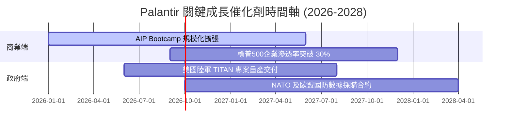

### 9.2 TAM 市場規模分析

```
╔══════════════════════════════════════════════════════════════════╗
║              Palantir 目標可定址市場 (TAM) 拆解                  ║
╠══════════════════════════════════════════════════════════════════╣
║                                                                  ║
║  政府國防與情報軟體 TAM:   $63B   (PLTR 滲透率 ~5.1%)             ║
║  全球企業數據與 AI 平台 TAM: $120B  (PLTR 滲透率 ~2.5%)             ║
║  ─────────────────────────────────────────────────────────────── ║
║  總計可定址市場 (Total TAM): $183B  (當前整體滲透率僅 ~3.4%)       ║
║                                                                  ║
║  📊 結論：極低滲透率代表 AIP 與 Foundry 長期成長天花板極高。      ║
╚══════════════════════════════════════════════════════════════════╝
```

### 9.3 成長驅動力結構圖

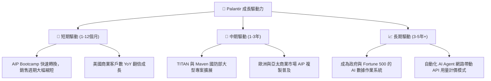

---

## 10. 風險矩陣

### 10.1 風險評分矩陣

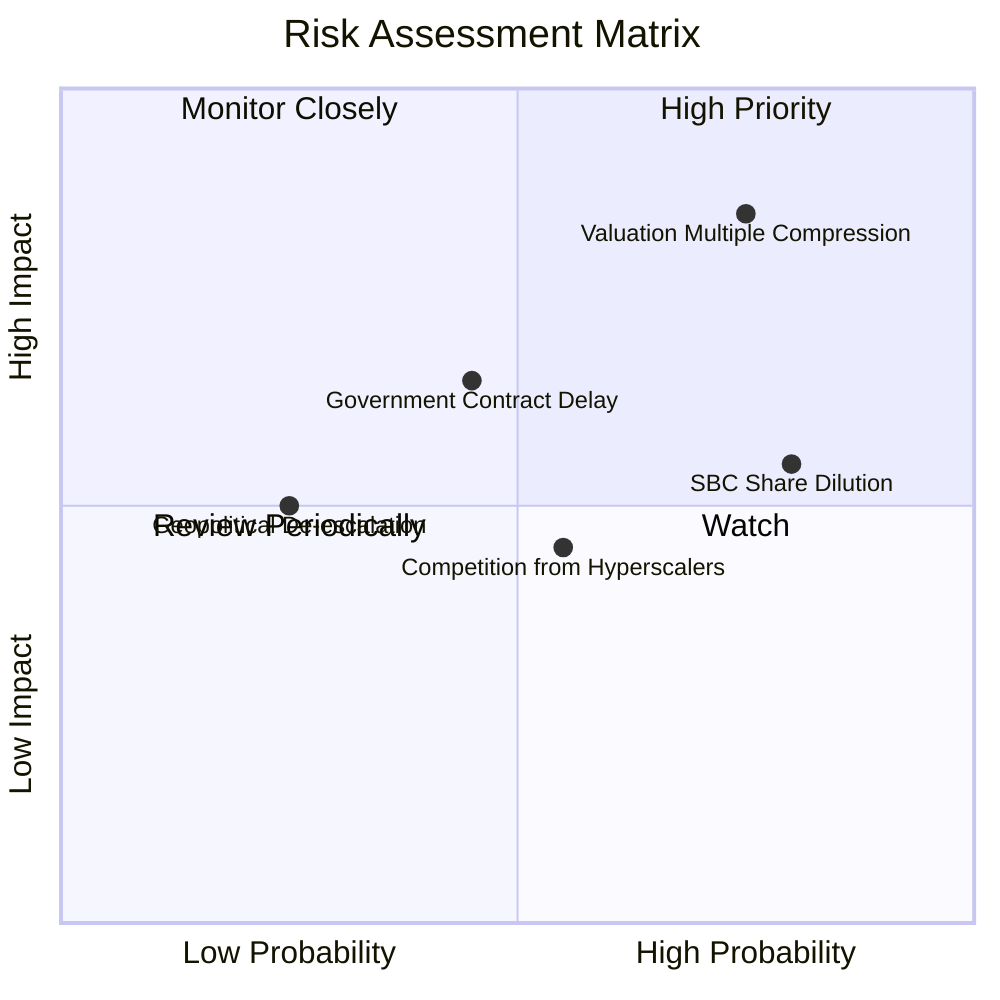

### 10.2 風險清單詳細分析

| # | 風險項目 | 發生機率 | 財務衝擊 | 風險評分 | 緩解措施與監控指標 |
|---|----------|----------|----------|----------|--------------------|
| 1 | 🔴 **高估值倍數修復** | 高 (75%) | 高 (股價跌幅可達 30%+) | 🔴 **8.5/10** | 設定嚴格買入門檻，於 $110-$130 區間分批佈局。 |
| 2 | 🟡 **SBC 股權稀釋** | 高 (80%) | 中 (-2% 至 -4% EPS/Y) | 🟡 **6.5/10** | 監控公司庫藏股回購規模是否能覆蓋 SBC 稀釋。 |
| 3 | 🟡 **政府預算遞延** | 中 (45%) | 高 (-10% 國防營收) | 🟡 **6.0/10** | 追蹤美國國防部財政年度授權法案 (NDAA) 撥款進度。 |
| 4 | 🟢 **雲端巨頭直接競爭** | 中 (55%) | 中 (定價壓力) | 🟢 **4.5/10** | Palantir 之深層 Ontology 技術具極高壁壘，短時間不易被模仿。 |

---

## 11. 投資建議

### 11.1 最終綜合評級雷達圖

```
╔══════════════════════════════════════════════════════════════╗
║              Palantir (PLTR) 綜合投資評級雷達                ║
╠══════════════════════════════════════════════════════════════╣
║ 業務品質 (Business)     9.5/10 ▓▓▓▓▓▓▓▓▓▓▓▓▓▓▓▓▓▓█ 🏆 極優  ║
║ 財務健康 (Balance Sheet)10.0/10 ▓▓▓▓▓▓▓▓▓▓▓▓▓▓▓▓▓▓▓ 🏆 頂級  ║
║ 成長潛力 (Growth)       9.5/10 ▓▓▓▓▓▓▓▓▓▓▓▓▓▓▓▓▓▓█ 🏆 強勁  ║
║ 獲利轉化 (Profitability) 9.0/10 ▓▓▓▓▓▓▓▓▓▓▓▓▓▓▓▓▓▓░ 🟢 優秀  ║
║ 安全邊際 (Valuation/MOS) 3.0/10 ▓▓▓▓▓▓░░░░░░░░░░░░░ 🔴 偏貴  ║
╠══════════════════════════════════════════════════════════════╣
║ 綜合評分：8.2 / 10 ｜ 評級：🟡 持有 / 觀望 (Hold)             ║
╚══════════════════════════════════════════════════════════════╝
```

### 11.2 目標價與隱含報酬率

| 情境 | 12個月目標價 | 隱含報酬率 (相對現價 $171.35) | 機率權重 | 核心觸發條件 |
|------|--------------|-------------------------------|----------|--------------|
| 🔴 **悲觀情境** | **$110.00** | -35.8% | 20% | 營收成長放緩至 <30%，市場估值壓縮至 50x Forward P/E。 |
| 🟡 **基準情境** | **$191.68** | **+11.9%** | **60%** | AIP 營收持續 YoY +50%+，營業利潤率保持 45%+。 |
| 🟢 **樂觀情境** | **$235.00** | +37.1% | 20% | 標普500企業全面採用 AIP，國防部簽署百億級巨額訂單。 |

### 11.3 買入時機與觸發因素

```
╔══════════════════════════════════════════════════════════════════╗
║                  ✅ 買入與操作決策 Checklist                     ║
╠══════════════════════════════════════════════════════════════════╣
║                                                                  ║
║  立即分批買入觸發條件（需多數符合）：                            ║
║  ☐ 股價回檔至加權合理價值下方 ($130.00 - $150.00)                ║
║  ☐ 全球大盤修復導致估值倍數回落至 Forward P/E < 55x             ║
║                                                                  ║
║  加碼買入觸發條件：                                              ║
║  ☐ 美國商業營收 YoY 成長突破 +100%                              ║
║  ☐ 自由現金流利潤率 (FCF Margin) 連續兩季 > 50%                  ║
║                                                                  ║
║  減碼 / 停損觸發條件：                                           ║
║  ☐ 商業客戶淨留存率 (NDR) 降至 < 110%                            ║
║  ☐ 單季營收 YoY 成長率滑落至 < 30%                               ║
╚══════════════════════════════════════════════════════════════════╝
```

### 11.4 投資人適配度分析

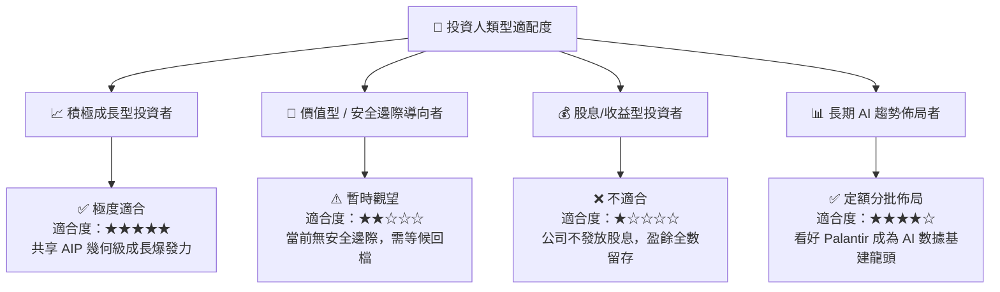

### 11.5 每季財報監控清單（Quarterly Watch List）

| 監控指標 | 最新基準值 (Q2 '26) | 正常健康區間 | 警訊 / 減碼門檻 | 權重 |
|----------|---------------------|--------------|-----------------|------|
| **單季總營收 YoY** | 92.8% | > 45.0% | < 30.0% | 🔴 高 |
| **美國商業營收 YoY** | > 100% | > 60.0% | < 40.0% | 🔴 高 |
| **GAAP 營業利潤率** | 47.1% | > 35.0% | < 25.0% | 🟡 中 |
| **SBC / 營收比重** | 13.7% | < 15.0% | > 20.0% | 🟡 中 |
| **自由現金流 (FCF) ($B)**| $1.20B /季 | > $800M /季 | < $500M /季 | 🟢 中 |

### 11.6 反面論證：什麼會證明論點錯誤（Disconfirming Evidence）

```
╔══════════════════════════════════════════════════════════════════╗
║              ⚠️ 論點失效條件（Disconfirming Evidence）           ║
╠══════════════════════════════════════════════════════════════════╣
║  若發生以下任一量化條件，本報告之多頭投資邏輯即告宣告失效：      ║
║                                                                  ║
║  ☐ 1. 美國商業客戶數 QoQ 成長率連續兩季跌破 5%                   ║
║  ☐ 2. GAAP 營業利潤率因 AI 基礎設施成本上升而連續兩季 < 30%      ║
║  ☐ 3. 股權薪酬 (SBC) 占營收比重逆勢回升至 20% 以上               ║
║  ☐ 4. 大客戶流失導致 Government 部門單季營收出現 YoY 負成長     ║
║  ☐ 5. 資本回報率 ROIC 跌破 WACC (10.50%)                         ║
╚══════════════════════════════════════════════════════════════════╝
```

---
> **免責聲明**：本報告為 AI 自動生成之機構級研究報告，僅供學術與投資參考，不構成任何買賣建議。投資有風險，入市需謹慎。