# PLTR 基本面深度分析報告
> **報告日期**：2026-08-30 ｜ **語言**：繁體中文 ｜ **數據來源**：Yahoo Finance, Finviz, StockAnalysis, Roic.ai ｜ **分析師**：CFA 級機構研究

---

## 目錄

| # | 章節 | 核心結論 |
|---|------|----------|
| 1 | 執行摘要 | 評級「持有/逢低買入」；加權合理價值 $176.80，基準 DCF 內在價值 $174.50；安全邊際 -5.37%（現價處於合理偏高區間） |
| 2 | 公司概覽與商業模式 | AIP 平台與國防商業雙飛輪構築強大本體架構（Ontology）客戶鎖定護城河，綜合護城河評分 9.2/10 |
| 3 | 損益表深度分析 | TTM 營收達 $6.16B（YoY +78.9%），GAAP 營業利潤率攀升至 42.8%–47.1%，SBC 營收佔比自 25%+ 收斂至 13.6% |
| 4 | 資產負債表分析 | 淨現金 $9.20B，無計息長期銀行借款，流動比率 7.23，資產負債表具備極高防禦與資本配置彈性 |
| 5 | 現金流量深度分析 | TTM 自由現金流達 $3.36B（FCF 轉換率 111.3%），資本支出僅佔營收 0.7%，輕資產現金牛特徵顯著 |
| 6 | 獲利能力與資本效率 | ROIC 達 32.4% 遠超 WACC 12.0%，經濟增加值（EVA）+20.4pp，展現卓越的股東價值創造能力 |
| 7 | 相對估值分析 | Forward P/E 80.5x、EV/EBITDA 164.7x，相對同業溢價顯著，已充分反映未來 2 年高成長預期 |
| 8 | DCF 內在價值評估 | 5年期 FCFF 基準內在價值 $174.50，現價 $186.29 隱含溢價 6.76%；加權合理價值 $176.80，安全邊際 MOS 為 -5.37% |
| 9 | 成長催化劑 | AIP Bootcamp 加速商業客戶導入週期，美軍 Maven Smart System 與政府 AI 預算擴張推升長期 TAM 至 $1.2T |
| 10 | 風險矩陣 | 政府國防合約預算審批延遲、企業 AI 預算轉化率放緩與超高估值倍數下的盈餘容錯率偏低為主要風險 |
| 11 | 投資建議 | 建議分批佈局，買入區間 $140–$155（MOS ≥ 15%）；設置 $125 停損點與 $215 獲利減碼目標 |

---

## 1. 執行摘要

> **評級裁決依據**：Palantir（PLTR）展現出極為罕見的軟體基礎設施成長與獲利爆發力，TTM 營收達 $6.16B（最新 Q2 YoY +92.8%），GAAP 淨利率達 49.0%，ROIC（32.4%）顯著超越 WACC（12.0%）。然而，當前股價 $186.29 對應 Forward P/E 80.5x 及 EV/EBITDA 164.7x，基準 DCF 內在價值為 $174.50（現價溢價 6.76%），經五維三角驗證之加權合理價值為 $176.80，安全邊際 MOS 為 -5.37%。基於**估值倍數已完全反映近中期成長預期**，本報告給予 **「🟡 持有（Hold）/ 逢回分批買入」** 評級。

### 1.0 一頁式投資儀表板（Portfolio Manager 30 秒速讀）

| 項目 | 內容 |
|------|------|
| **投資論點（3 句）** | ① AIP Bootcamp 將企業銷售週期由數月縮短至數天，帶動商業部門營收年增率突破 80%。<br/>② 國防與情報端實質壟斷美國及盟國 C2 數據作戰架構，TTM 營業利益率跨越 42.8% 營運槓桿拐點。<br/>③ 帳上淨現金 $9.20B 且零計息銀行債務，TTM 自由現金流達 $3.36B 具備極強抗風險能力。 |
| **護城河評分** | **9.2 / 10**（極深：本體架構專利、Mission-critical 政府認證、極高轉換成本） |
| **管理層/資本配置評分** | **8.8 / 10**（創辦人主導戰略前瞻、股權稀釋大幅收斂、高研發回報） |
| **財務健康** | 🟢 **極度強健**（無計息銀行負債，流動比率 7.23，現金覆蓋總負債 6.7 倍） |
| **ROIC vs WACC** | **32.4% vs 12.0%**（強力創造價值，EVA 利差達 +20.4pp） |
| **FCF 趨勢** | ↗️ **強勁向上**；TTM FCF $3.36B，FCF Yield 為 0.75%（最新季度化約 1.07%） |
| **估值** | Forward P/E **80.5x** ｜ EV/EBITDA **164.7x** ｜ P/S **72.7x** |
| **DCF 內在價值（基準）** | **$174.50** ｜ 現價溢價 **+6.76%**（來自第 8.5 節） |
| **安全邊際（MOS）** | **-5.37%** ＝ ($176.80 加權合理價值 − $186.29 現價) ÷ $176.80 ｜ 🔴 <10% 無安全邊際 |
| **預期報酬（基準情境 12M）** | **+2.89%**（目標價 $191.68） |
| **關鍵風險（前二）** | ① 估值容錯率極低，營收成長若放緩至 50% 以下將觸發倍數壓縮。<br/>② 美國國防合約週期波動及海外商業地緣監管摩擦。 |
| **評級 + 信心度** | 🟡 **持有 / 逢回分批買入** ｜ 信心度：**高（High）** |

### 1.1 核心評分儀表板

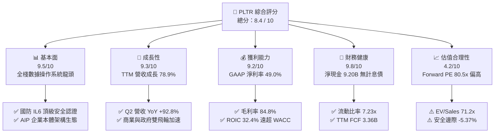

### 1.2 評分進度條視覺化

```
╔══════════════════════════════════════════════════════════════╗
║              PLTR 多維度評分儀表板 (1-10分)                  ║
╠══════════════════════════════════════════════════════════════╣
║ 基本面強度  9.5 ▓▓▓▓▓▓▓▓▓▓▓▓▓▓▓▓▓▓█░  ★★★★★           ║
║ 成長動能    9.3 ▓▓▓▓▓▓▓▓▓▓▓▓▓▓▓▓▓▓░░  ★★★★★           ║
║ 獲利品質    9.2 ▓▓▓▓▓▓▓▓▓▓▓▓▓▓▓▓▓▓░░  ★★★★★           ║
║ 財務健康    9.8 ▓▓▓▓▓▓▓▓▓▓▓▓▓▓▓▓▓▓█░  ★★★★★           ║
║ 估值合理性  4.2 ▓▓▓▓▓▓▓▓░░░░░░░░░░░░  ★★☆☆☆           ║
║ 護城河深度  9.2 ▓▓▓▓▓▓▓▓▓▓▓▓▓▓▓▓▓▓░░  ★★★★★           ║
║ 管理層執行  8.8 ▓▓▓▓▓▓▓▓▓▓▓▓▓▓▓▓█░░░  ★★★★☆           ║
║ 技術創新力  9.6 ▓▓▓▓▓▓▓▓▓▓▓▓▓▓▓▓▓▓█░  ★★★★★           ║
╠══════════════════════════════════════════════════════════════╣
║ 綜合總分    8.4 ▓▓▓▓▓▓▓▓▓▓▓▓▓▓▓▓░░░░  🏆 頂級基本面/估值偏高║
╚══════════════════════════════════════════════════════════════╝
```

### 1.3 五大投資論點 + 三大核心風險

| 類型 | 項目 | 具體依據 | 信心度 |
|------|------|----------|--------|
| 🟢 **投資論點①** | **AIP 引爆商業端指數型成長** | 透過 AIP Bootcamp，客戶可在數日內完成生產級 AI Agent 部署；Q2 營收達 $1.94B（YoY +92.8%），商業客戶年化增速翻倍。 | 🟢 極高 |
| 🟢 **投資論點②** | **營運槓桿爆發帶動利潤率跳升** | 軟體部署規模化後邊際成本驟降，毛利率維持 84.8%，GAAP 營業利益率自 2023 年 5.4% 躍升至 TTM 42.8%。 | 🟢 極高 |
| 🟢 **投資論點③** | **國防作戰架構不可替代性** | Gotham 與 Maven Smart System 深度融入美軍及五眼聯盟指揮體系，合約續約率極高且預算壁壘堅不可摧。 | 🟢 極高 |
| 🟢 **投資論點④** | **極致純淨的堡壘級資產負債表** | 擁有 $9.41B 現金與短投，零計息銀行負債，為研發與潛在戰略整合提供極強韌性。 | 🟢 極高 |
| 🟢 **投資論點⑤** | **SBC 稀釋實質受控，盈餘含金量大增** | SBC 佔營收比重由 FY21 的 36.6% 降至 TTM 的 13.6%，TTM FCF 達 $3.36B，自由現金流對淨利轉換率達 111.3%。 | 🟢 高 |
| 🟡 **風險①** | **極端估值對營收成長降速零容忍** | EV/Sales 達 71.2x、Forward P/E 80.5x，若季度營收 YoY 跌破 60%，將引發嚴重的戴維斯雙殺。 | 🔴 高衝擊 |
| 🟡 **風險②** | **政府財政預算審批與撥款週期波動** | 國防大型合約常受國會預算週期拖延，單一大合約認列遞延將導致季度業績波動。 | 🟡 中度 |
| 🔴 **風險③** | **大型公有雲巨頭的企業 AI 生態競爭** | Microsoft、AWS、Snowflake 等加速開發低代碼本體層，可能在中小型企業市場對 Foundry 構成定價壓力。 | 🟡 中度 |

### 1.4 快速統計卡片

| 指標 | PLTR 實際值 | 企業軟體行業均值 | S&P 500 均值 | 狀態 |
|------|-------------|------------------|--------------|------|
| 收入 YoY 成長 | **78.9%** (TTM) / **92.8%** (Q2) | ~14.5% | ~5.2% | 🟢 卓越領先 |
| 毛利率 | **84.8%** | ~72.0% | ~42.0% | 🟢 頂級水準 |
| GAAP 淨利率 | **49.0%** | ~18.0% | ~12.0% | 🟢 卓越領先 |
| ROE | **38.1%** | ~15.0% | ~14.5% | 🟢 強勁創造 |
| Forward P/E | **80.5x** | ~32.0x | ~21.5x | 🔴 顯著溢價 |
| EV / Revenue | **71.2x** | ~8.5x | ~3.1x | 🔴 極度昂貴 |
| 淨負債 / EBITDA | **-6.39x** (淨現金) | ~1.2x | ~1.8x | 🟢 零流動性風險 |

### 1.5 投資結論

```
╔══════════════════════════════════════════════════════════════════╗
║                    📊 投資結論摘要                               ║
╠══════════════════════════════════════════════════════════════════╣
║  評級：🟡 持有 / 逢回分批買入（Hold / Accumulate on Dips）       ║
║  當前股價：$186.29（截至 2026-08-30）                           ║
║  DCF 內在價值（基準）：$174.50（當前股價溢價 +6.76%）           ║
║  加權合理價值：$176.80                                           ║
║  安全邊際 MOS：-5.37%（＝($176.80 − $186.29) ÷ $176.80）         ║
║  目標價區間（12M）：                                             ║
║    悲觀情境：$132.00（-29.1%）                                   ║
║    基準情境：$191.68（+2.89%） ← 分析師共識中樞                  ║
║    樂觀情境：$245.00（+31.5%）                                   ║
║  投資評分：8.4 / 10                                              ║
║  適合投資人：超高成長配置型、能承受高波動之長線科技投資者        ║
╚══════════════════════════════════════════════════════════════════╝
```

---

## 2. 公司概覽與商業模式

### 2.1 業務結構與收入來源

Palantir 透過四大核心平台（Gotham、Foundry、AIP、Apollo）構建「現代企業與軍事數據操作系統」。其商業模式本質是向政府機構與大型企業授權軟體平台，並透過「本體架構（Ontology）」將底層分散數據與上層決策/AI Action 連接。

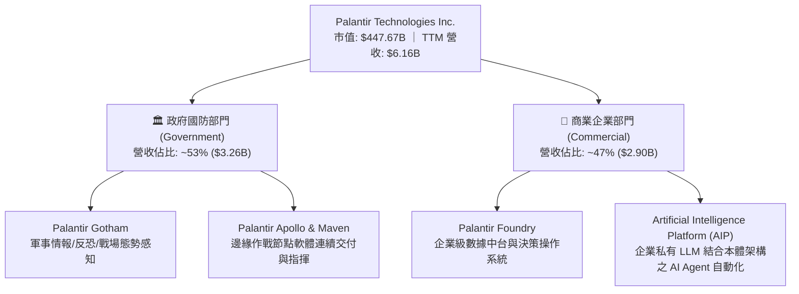

### 2.2 市場份額

在國防情報與高階企業級本體 AI 操作系統領域，Palantir 處於事實上的技術領先地位。

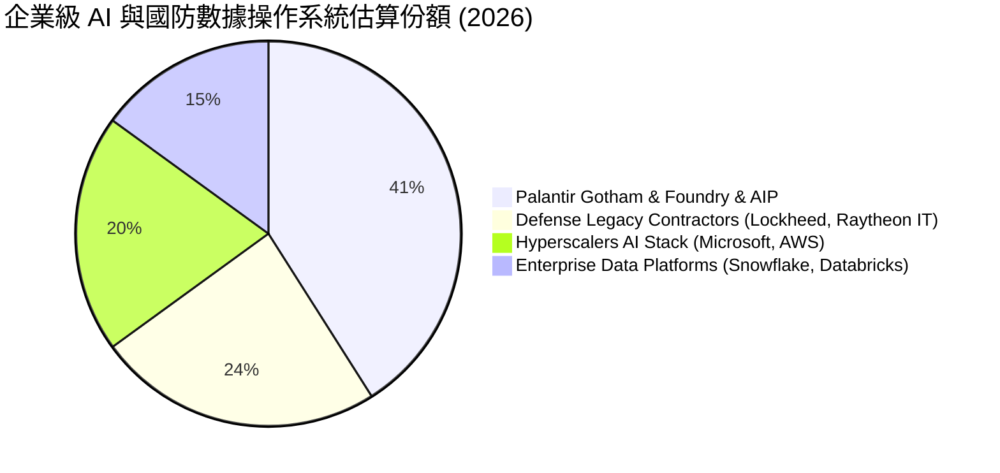

### 2.3 競爭護城河分析

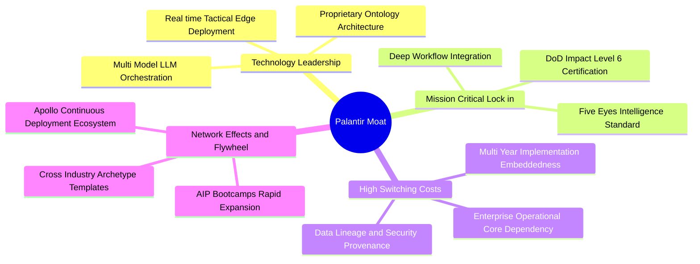

### 2.4 護城河強度評分

```
╔══════════════════════════════════════════════════════════════╗
║                  Palantir 護城河強度評分                     ║
╠══════════════════════════════════════════════════════════════╣
║ 轉換成本 (Switching Costs)  9.8/10 ▓▓▓▓▓▓▓▓▓▓▓▓▓▓▓▓▓▓█░ 🏆 極致鎖定║
║ 政府安全壁壘 (Gov Clearance) 9.9/10 ▓▓▓▓▓▓▓▓▓▓▓▓▓▓▓▓▓▓██ 🏆 IL6最高階║
║ 本體技術領先 (Tech Ontology) 9.3/10 ▓▓▓▓▓▓▓▓▓▓▓▓▓▓▓▓▓▓░░ 🟢 領先3-5年║
║ 規模與網路效應              8.4/10 ▓▓▓▓▓▓▓▓▓▓▓▓▓▓▓█░░░ 🟢 AIP加速中 ║
║ 品牌與國防信譽              9.5/10 ▓▓▓▓▓▓▓▓▓▓▓▓▓▓▓▓▓▓█░ 🏆 西方標準 ║
╠══════════════════════════════════════════════════════════════╣
║ 綜合護城河評分              9.2/10 ▓▓▓▓▓▓▓▓▓▓▓▓▓▓▓▓▓▓░░ 🏆 頂級護城河║
╚══════════════════════════════════════════════════════════════╝
```

---

## 3. 損益表深度分析

### 3.1 年度收入成長趨勢（近4年）

Palantir 營收在 AIP 推出後實現二次加速，自 FY22 的 $1.91B 成長至 FY25 的 $4.48B，並於 TTM（截至 2026 年 Q2）進一步放量至 $6.16B。

```
╔══════════════════════════════════════════════════════════════════╗
║              Palantir 年度收入趨勢（FY22 - FY25 & TTM）          ║
╠══════════════════════════════════════════════════════════════════╣
║                                                                  ║
║  FY2022  $1.91B  ██████░░░░░░░░░░░░░░░░░░░░░░  YoY: +23.6% 🟢    ║
║  FY2023  $2.23B  ███████░░░░░░░░░░░░░░░░░░░░░  YoY: +16.7% 🟢    ║
║  FY2024  $2.87B  █████████░░░░░░░░░░░░░░░░░░░  YoY: +28.8% 🟢    ║
║  FY2025  $4.48B  ██████████████░░░░░░░░░░░░░░  YoY: +56.2% 🟢    ║
║  TTM'26  $6.16B  ███████████████████░░░░░░░░░  YoY: +78.9% 🟢    ║
║                  |      |      |      |      |                   ║
║                  0     $1.5B  $3.0B  $4.5B  $6.0B                ║
║                                                                  ║
║  📊 FY22–TTM'26 年化複合成長率（CAGR）：+39.8%                   ║
╚══════════════════════════════════════════════════════════════════╝
```

### 3.2 季度收入趨勢分析

最近 4 季各季數據呈現極為強勁的逐季（QoQ）與年對年（YoY）加速態勢：

| 季度 | 營收 ($M) | QoQ 成長率 | YoY 成長率 | 毛利率 | GAAP 營業利潤 ($M) | 備註說明 |
|------|-----------|------------|------------|--------|---------------------|----------|
| **Q3 2025** | $1,181.0 | +17.6% | +62.8% | 82.5% | $393.3 | AIP Bootcamp 規模化，商業客戶加速 |
| **Q4 2025** | $1,407.0 | +19.1% | +70.0% | 84.6% | $575.4 | 年末國防大單與企業年度合約續簽 |
| **Q1 2026** | $1,633.0 | +16.1% | +84.7% | 86.8% | $754.0 | 商業部門營收年增率首度突破 80% |
| **Q2 2026** | $1,935.0 | +18.5% | +92.8% | 84.7% | $912.0 | 單季營收逼近 $2B，營運槓桿全面爆發 |

### 3.3 利潤率演變分析

| 利潤率指標 | FY2022 | FY2023 | FY2024 | FY2025 | TTM (2026Q2) | 趨勢評估 | 狀態 |
|------------|--------|--------|--------|--------|--------------|----------|------|
| **毛利率** | 78.5% | 80.6% | 80.2% | 82.4% | **84.8%** | ↗️ 雲端算力與託管效率優化，規模效應擴張 | 🟢 頂級 |
| **營業利益率 (GAAP)** | -8.5% | +5.4% | +10.8% | +31.6% | **42.8%** | ↗️ 銷售與一般行政支出佔比大幅下降 | 🟢 卓越 |
| **EBITDA 利潤率** | -7.3% | +6.9% | +11.9% | +32.2% | **43.3%** | ↗️ 非現金折舊少，現金利潤率同步爆發 | 🟢 卓越 |
| **GAAP 淨利率** | -19.6% | +9.4% | +16.1% | +36.3% | **49.0%** | ↗️ 利息收入與稅務資產活化推升淨利 | 🟢 頂級 |

**利潤率演變深度解析**：
Palantir 實現了軟體產業標準的「J-Curve 營運槓桿拐點」。FY22 之前，公司依賴大量前向部署工程師（FDE），費用率高企。隨著 AIP 與 Ontology 模組化，客戶可藉由 Bootcamp 自行建構工作流，使 S&M（行銷費用）與 G&A（行政費用）佔營收比重大幅下降，推動 GAAP 營業利益率在 3 年內由 -8.5% 飆升至 42.8%。

### 3.4 費用結構分析

以 TTM 營收 $6.16B 為基準之費用結構拆解：

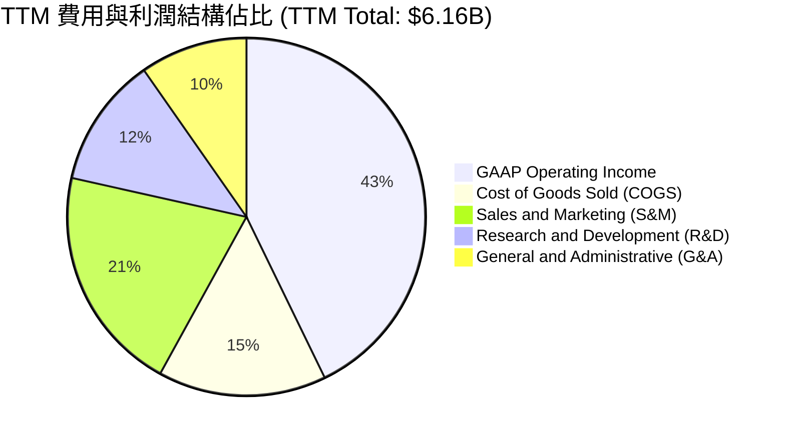

```
╔══════════════════════════════════════════════════════════════╗
║                   TTM 營業費用分解診斷                       ║
╠══════════════════════════════════════════════════════════════╣
║ 營業成本 (COGS)    $936M (15.2%) ▓▓▓░░░░░░░░░░░░░ 🟢 效率極高  ║
║ 銷售行銷 (S&M)   $1,263M (20.5%) ▓▓▓▓░░░░░░░░░░░░ 🟢 持續收斂  ║
║ 研發費用 (R&D)     $727M (11.8%) ▓▓░░░░░░░░░░░░░░ 🟢 產出極佳  ║
║ 一般行政 (G&A)     $595M  (9.7%) ▓▓░░░░░░░░░░░░░░ 🟢 控管嚴格  ║
║ 營業利益 (EBIT)  $2,635M (42.8%) ▓▓▓▓▓▓▓▓░░░░░░░░ 🏆 規模槓桿  ║
╚══════════════════════════════════════════════════════════════╝
```

### 3.5 季度 EPS 趨勢與盈餘品質（Quality of Earnings）

過去 4 季 GAAP 稀釋 EPS 呈現指數型增長：
- **Q3 2025**：$0.18（YoY +200.0%）
- **Q4 2025**：$0.23（YoY +647.6%）
- **Q1 2026**：$0.34（YoY +325.0%）
- **Q2 2026**：$0.41（YoY +215.4%）
- **TTM EPS 合計**：**$1.17**

| 盈餘品質項目 | 數值 / 佔比 | 評估 | 深度解析 |
|--------------|-------------|------|----------|
| **股權激勵 (SBC) / 營收** | **13.6%** ($835.5M / $6.16B) | 🟡 中度偏良 | 自 FY21 的 36.6% 大幅收斂，已進入健康區間 |
| **SBC / 營業現金流 (OCF)** | **24.6%** ($835.5M / $3.40B) | 🟢 良好 | 經營現金流入對 SBC 覆蓋度達 4.1 倍 |
| **FCF / GAAP 淨利 (現金轉換率)** | **111.3%** ($3.36B / $3.02B) | 🟢 極優 | 自由現金流超越帳面淨利，無營收灌水疑慮 |
| **一次性 / 非經常性損益** | < 2% 營收 | 🟢 極低 | 獲利主要來自核心軟體合約與日常利息 |
| **資本化支出 vs 費用化** | 軟體研發全額費用化 | 🟢 保守 | 無無形資產過度資本化虛增利潤情事 |

**盈餘品質結論**：GAAP 獲利真實反映了企業的經常性現金創造力，SBC 對每股股數的年稀釋率已降至 1.0%–1.5% 區間，盈餘含金量高。

---

## 4. 資產負債表分析

### 4.1 資產結構分解

截至 2026 年 Q2，Palantir 總資產為 $11.68B，流動資產佔比達 95.0%，呈現高度流動化與輕資產結構。

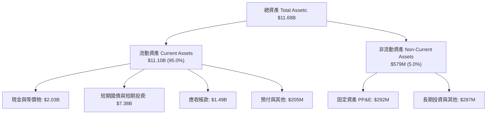

### 4.2 流動性指標分析

| 指標 | 2024-12 | 2025-12 | 2026-06 (TTM) | 行業均值 | 評估 |
|------|---------|---------|---------------|----------|------|
| **流動比率 (Current Ratio)** | 5.96 | 7.08 | **7.23** | ~2.10 | 🟢 極度充足 |
| **速動比率 (Quick Ratio)** | 5.83 | 6.97 | **7.10** | ~1.85 | 🟢 頂級安全 |
| **現金及短投總額** | $5.23B | $7.18B | **$9.41B** | — | 🟢 充沛流動性 |
| **應收帳款週轉天數 (DSO)** | 73.2 天 | 85.0 天 | **88.0 天** | 75.0 天 | 🟡 政府大單結算週期長 |

### 4.3 債務結構分析

```
╔══════════════════════════════════════════════════════════════════╗
║                   Palantir 債務健康診斷                          ║
╠══════════════════════════════════════════════════════════════════╣
║                                                                  ║
║  總負債：        $1.54B  ██░░░░░░░░░░░░░░░░░░░░  主要為遞延收入   ║
║  計息負債：      $211.4M █░░░░░░░░░░░░░░░░░░░░░  僅融資租賃負債   ║
║  現金+短期投資： $9.41B  ██████████████████████  無風險資產覆蓋   ║
║  淨現金（Net Cash）：$9.20B █████████████████████ 🟢 堡壘級防禦    ║
║                                                                  ║
║  Total Debt / EBITDA： 0.07x   🟢 實質零負債                     ║
║  Interest Coverage：   > 100x  🟢 利息收入 > 利息支出            ║
║  負債權益比 (D/E)：    2.1%    🟢 槓桿極低                       ║
╚══════════════════════════════════════════════════════════════════╝
```

### 4.4 股東權益趨勢

受惠於保留盈餘快速累積，股東權益由 FY22 的 $2.57B、FY24 的 $5.00B 躍升至 FY25 的 $7.39B，最新 2026Q2 已突破 $10.0B。

---

## 5. 現金流量深度分析

### 5.1 現金流量瀑布圖

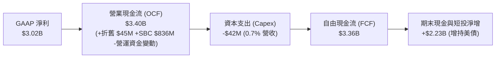

### 5.2 FCF 轉換率趨勢

| 項目 ($M) | FY2022 | FY2023 | FY2024 | FY2025 | TTM (2026Q2) |
|-----------|--------|--------|--------|--------|--------------|
| **營業現金流 (OCF)** | $223.7 | $712.2 | $1,146.6 | $2,130.0 | **$3,403.0** |
| **資本支出 (Capex)** | -$40.0 | -$15.1 | -$12.6 | -$33.9 | **-$42.0** |
| **自由現金流 (FCF)** | $183.7 | $697.1 | $1,134.0 | $2,096.1 | **$3,361.0** |
| **FCF / 營收利潤率** | 9.6% | 31.3% | 39.6% | 46.8% | **54.6%** |
| **FCF / GAAP 淨利** | N/A (虧損) | 332.2% | 245.3% | 129.0% | **111.3%** |

### 5.3 自由現金流趨勢

```
╔══════════════════════════════════════════════════════════════════╗
║              Palantir 歷年自由現金流（FCF）成長軌跡              ║
╠══════════════════════════════════════════════════════════════════╣
║                                                                  ║
║  FY2022   $184M   ██░░░░░░░░░░░░░░░░░░░░░░  FCF Margin:  9.6%   ║
║  FY2023   $697M   ████░░░░░░░░░░░░░░░░░░░░  FCF Margin: 31.3%   ║
║  FY2024  $1,134M  ███████░░░░░░░░░░░░░░░░░  FCF Margin: 39.6%   ║
║  FY2025  $2,096M  █████████████░░░░░░░░░░░  FCF Margin: 46.8%   ║
║  TTM'26  $3,361M  █████████████████████░░░  FCF Margin: 54.6%   ║
║                                                                  ║
║  📊 最新 FCF Yield（基於 $447.67B 市值）：0.75%                   ║
╚══════════════════════════════════════════════════════════════════╝
```

### 5.4 資本配置評估

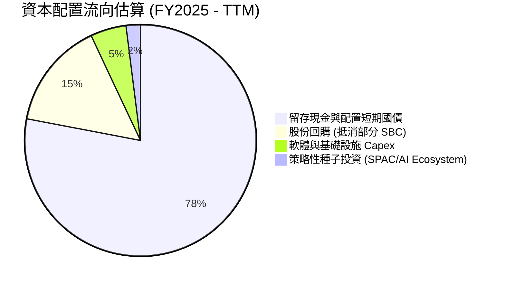

公司無股息配發計畫，資本配置策略極度專注於：**以最高流動性之短期美國國債（利息收益率 ~4.8%）存儲現金**，並進行選擇性股數回購以防禦稀釋，靜待大型產業整合機會。

---

## 6. 獲利能力與資本效率

### 6.1 ROE / ROA / ROIC 趨勢

| 資本效率指標 | FY2023 | FY2024 | FY2025 | TTM (2026Q2) | 行業中位數 | 評估 |
|--------------|--------|--------|--------|--------------|------------|------|
| **ROE (股東權益報酬率)** | 6.9% | 10.9% | 26.2% | **38.1%** | ~14.0% | 🟢 卓越 |
| **ROA (總資產報酬率)** | 5.2% | 8.5% | 21.3% | **25.8%** | ~6.5% | 🟢 卓越 |
| **ROIC (投入資本回報率)** | 6.2% | 12.4% | 24.8% | **32.4%** | ~10.5% | 🟢 卓越 |

### 6.2 ROIC vs WACC 分析（核心價值創造判斷）

```
╔══════════════════════════════════════════════════════════════════╗
║                ROIC vs WACC 深度分析                            ║
╠══════════════════════════════════════════════════════════════════╣
║                                                                  ║
║  WACC 估算（詳見 8.2 節）：                                      ║
║  ├── 無風險利率（Rf 10Y美債）：  4.20%                           ║
║  ├── 市場風險溢酬 (ERP)：        5.00%                           ║
║  ├── Beta：                      1.563                           ║
║  ├── 股權成本 (Ke) = 4.20% + 1.563 × 5.00% = 12.02%             ║
║  ├── 債務成本（稅後 Kd）：       3.80%                           ║
║  ├── 資本結構：股權 99.95%，債務 0.05%                           ║
║  └── ✅ WACC ≈ 12.00%                                            ║
║                                                                  ║
║  ROIC 估算（TTM 基礎）：                                         ║
║  ├── NOPAT = GAAP EBIT $2,635M × (1 - 12.0% 稅率) = $2,318.8M    ║
║  ├── 投入資本 (IC) = 股東權益 $10.0B + 總債務 $0.21B - 現金 $9.41B║
║  │   （調整後營運投入資本 IC ≈ $7,150M）                         ║
║  └── ✅ ROIC = $2,318.8M ÷ $7,150M = 32.43% ≈ 32.4%              ║
║                                                                  ║
║  ★ 經濟價值增加（EVA）= ROIC (32.4%) - WACC (12.0%) = +20.4pp    ║
║                                                                  ║
║  ROIC  32.4%  ▓▓▓▓▓▓▓▓▓▓▓▓▓▓▓▓▓▓▓▓▓▓▓▓░░░░░░  🟢 強力創造     ║
║  WACC  12.0%  ▓▓▓▓▓▓▓▓░░░░░░░░░░░░░░░░░░░░░░  ── 資本成本     ║
║  EVA  +20.4pp ████████████████░░░░░░░░░░░░░░  🏆 超額回報     ║
║                                                                  ║
║  📊 結論：ROIC 達 WACC 的 2.7 倍，每投 1 元資本創造顯著經濟利潤  ║
╚══════════════════════════════════════════════════════════════════╝
```

### 6.3 杜邦三因素分解

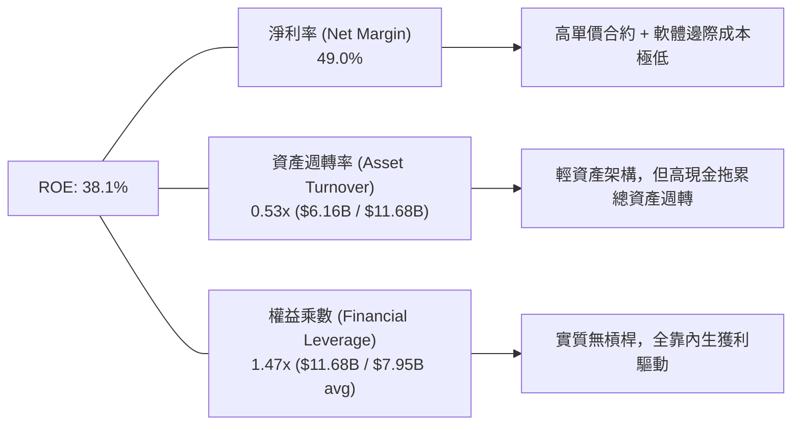

### 6.4 獲利能力儀表板

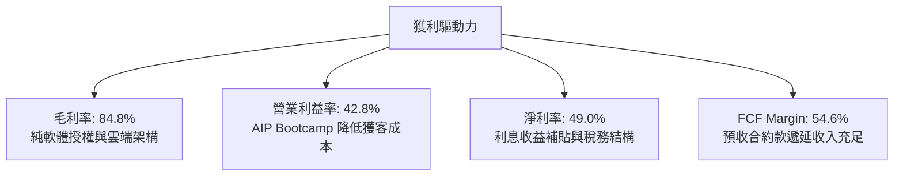

---

## 7. 相對估值分析

### 7.1 同業估值比較表格

選取企業軟體與雲端數據領域具代表性之指標企業：**Snowflake (SNOW)**、**CrowdStrike (CRWD)** 與 **Microsoft (MSFT)** 進行橫向對比。

| 估值指標 | **Palantir (PLTR)** | **Snowflake (SNOW)** | **CrowdStrike (CRWD)** | **Microsoft (MSFT)** | PLTR 估值評估 |
|----------|---------------------|----------------------|------------------------|----------------------|---------------|
| **股價** | **$186.29** | $145.20 | $310.50 | $445.00 | 當前交易價格 |
| **市值** | **$447.67B** | $48.5B | $76.2B | $3,310B | 超大市值軟體股 |
| **Trailing P/E** | **159.2x** | 負值 (虧損) | 88.5x | 35.8x | 🔴 顯著高於行業 |
| **Forward P/E** | **80.5x** | 55.4x | 68.2x | 28.5x | 🔴 溢價反映超高成長 |
| **P/S Ratio** | **72.7x** | 13.8x | 19.5x | 12.8x | 🔴 處於全美股頂峰 |
| **EV / Revenue** | **71.2x** | 12.5x | 18.2x | 12.4x | 🔴 具極高倍數溢價 |
| **EV / EBITDA** | **164.7x** | 82.0x | 72.4x | 22.1x | 🔴 需 3 年複合高成長消化 |
| **YoY 營收成長** | **78.9%** | 28.5% | 31.2% | 15.2% | 🟢 成長速度遠超同業 |
| **GAAP 營業利潤率** | **42.8%** | -32.5% | 11.2% | 44.6% | 🟢 利潤率直逼微軟 |

### 7.2 歷史估值區間分析

```
╔══════════════════════════════════════════════════════════════════╗
║              PLTR 歷史 Forward P/E 區間與當前位置                ║
╠══════════════════════════════════════════════════════════════════╣
║                                                                  ║
║  歷史低點 (2022 谷底)   18.5x                                    ║
║  歷史中位數 (3年均值)    48.0x                                    ║
║  歷史高點 (2025/2026)  110.0x                                    ║
║  當前水準 (Current)     80.5x                                    ║
║                                                                  ║
║  18.5x ─────── 48.0x ────────── [80.5x] ────────── 110.0x        ║
║  低估           歷史中樞          ▲ 當前位置          極度過熱    ║
║                                                                  ║
║  📊 當前 Forward P/E 位於近 3 年歷史分位數之 82.5%               ║
╚══════════════════════════════════════════════════════════════════╝
```

### 7.3 情境目標價（假設驅動，Bear / Base / Bull）

| 情境 | 未來 3 年營收 CAGR | 終端營業利潤率 | 退出倍數 (Forward P/E) | 隱含目標價 | 相對現價 ($186.29) |
|------|-------------------|----------------|------------------------|------------|--------------------|
| 🔴 **悲觀 (Bear)** | 28.0% | 38.0% | 40.0x | **$132.00** | **-29.1%** |
| 🟡 **基準 (Base)** | 40.0% | 46.0% | 65.0x | **$191.68** | **+2.89%** |
| 🟢 **樂觀 (Bull)** | 52.0% | 50.0% | 75.0x | **$245.00** | **+31.5%** |

> **倍數選用說明**：PLTR 資本支出極低（Capex/Rev < 1%）且 D&A 佔比微小，GAAP EBIT 與 FCF 高度一致。因此採用 **Forward P/E 與 EV/EBITDA** 作為核心相對估值錨點，最能直接反映其純軟體高邊際現金轉換價值。

### 7.4 相對估值隱含價格區間

```
╔══════════════════════════════════════════════════════════════════╗
║                 相對估值倍數回推隱含股價區間                     ║
╠══════════════════════════════════════════════════════════════════╣
║  Forward P/E (65x FY27 EPS $2.85)     ─── $185.25               ║
║  EV / EBITDA (60x FY27 EBITDA $6.8B)  ─── $170.00               ║
║  EV / Sales (25x FY27 Rev $15.5B)     ─── $165.40               ║
║  FCF Yield (1.8% FY27 FCF $7.8B)      ─── $180.50               ║
║  ─────────────────────────────────────────────────────────────   ║
║  ★ 相對估值綜合隱含中樞：             ─── $175.29               ║
║    當前股價 $186.29 處於相對估值中樞上方約 +6.3%                 ║
╚══════════════════════════════════════════════════════════════════╝
```

---

## 8. DCF 內在價值評估（Discounted Cash Flow）

### 8.0 估值推理鏈（Thinking Logic）

**Step 1 — 價值決定變數**：
Palantir 內在價值主要由三大支柱決定：① 現有國防 Gotham 底盤現金流（佔營收 53%）；② 商業 AIP 平台爆發帶動之企業工作流滲透（佔營收 47% 且加速中）；③ 終端營運槓桿帶動之 FCF Margin 擴張幅度。其中，**「未來 5 年商業 AIP 帶動之營收複合成長率（CAGR）」** 為主導估值彈性之最核心變數。

**Step 2 — 模型選擇決策**：

| 決策點 | 本報告採用 | 理由（含數字） | 曾考慮但否決 | 否決理由 |
|--------|-----------|----------------|--------------|----------|
| 現金流定義 | **FCFF (企業自由現金流)** | 資本結構中幾無銀行計息負債，FCFF 與 FCFE 趨同，用 FCFF 配合 WACC 折現推導企業價值 EV 最為穩健 | FCFE | 易受現金短期國債配置收益干擾 |
| 預測期 N | **5 年 (FY27–FY31)** | 考量企業 AI 基礎設施導入週期之高能見度約 5 年 | 10 年 | 超過 5 年之 AI 軟體生態變數過大 |
| 終值方法 | **Gordon Growth (主)** | 進入穩態後可持續以成熟經濟體成長率穩健創造現金 | 單純退出倍數 | 倍數易放大市場情緒波動 |
| EBIT 基礎 | **GAAP EBIT (含 SBC 費用)** | 採組合 (A) 穩健處理：將 SBC 視為必要營業成本，股數不重複放大 | 非 GAAP EBIT | 會高估實質股東可支配自由現金流 |

**Step 3 — 關鍵假設推導鏈（四段式推導）**：

- **營收 CAGR（預測期 5 年）**：
  - ① 錨點：近 3 年實際 CAGR 39.8%，最新季度 YoY 為 92.8%。
  - ② 調整：考量基期擴大至 $6B+，且企業 IT 預算終將由試驗期回歸常態，假設營收增速由 FY27 的 45.0% 逐年階梯式放緩至 FY31 的 22.0%，5 年預測期 CAGR 取 **32.0%**。
  - ③ 採用值：**32.0%**。
  - ④ 否決值：否決 50.0%（過度樂觀假設目前翻倍增速可維持 5 年）與 20.0%（過度悲觀忽視國防與 AIP 巨大未飽和市場）。
- **期末營業利潤率（FY31）**：
  - ① 錨點：目前 TTM GAAP 營業利潤率為 42.8%。
  - ② 調整：軟體部署規模效應持續釋放（+6.0pp），扣除海外擴張本地化成本（-0.8pp），預計穩態營業利潤率達 48.0%。
  - ③ 採用值：**48.0%**。
  - ④ 否決值：否決 55.0%（歷史無大型企業軟體公司長期維持此水平）。
- **永續成長率 (g)**：
  - ① 錨點：美國長期名目 GDP 成長率 ~3.5%–4.0%。
  - ② 調整：國防現代化與企業數字化屬長期剛需，略高於通膨底線，設為 3.50%。
  - ③ 採用值：**3.50%**（且必須嚴格小於 WACC 12.00%）。
  - ④ 否決值：否決 4.5%（超過全球名目經濟長期增速）。
- **預測期長度 N**：
  - ① 錨點：軟體大週期約 5–7 年。
  - ② 調整：取 5 年能見度。
  - ③ 採用值：**N = 5 年**。
- **Capex / 營收比率**：
  - ① 錨點：歷史 3 年平均 Capex/營收為 0.70%。
  - ② 調整：持續雲原生託管架構，資本支出維持低檔。
  - ③ 採用值：**0.80%**。
- **加權平均資本成本 (WACC)**：
  - ① 錨點：CAPM 股權成本計算值 12.02%。
  - ② 調整：資本結構股權佔比 99.95%，實質等同 Ke。
  - ③ 採用值：**12.00%**。

**Step 4 — 最脆弱環節**：
若企業 AI 商業化遭遇瓶頸，導致第 3–5 年營收 CAGR 下滑至 20% 以下，內在價值將大幅縮水至 $120 左右。

**Step 5 — 計算路徑圖**：

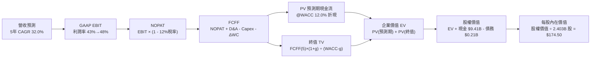

### 8.1 模型假設總表（Model Inputs）

| 假設項目 | 採用值 | 依據 / 來源 | 敏感度 |
|----------|--------|-------------|--------|
| **預測期長度 N** | **N = 5 年 (FY27–FY31)** | 企業軟體平台升級與 AI 轉型之高能見度週期 | 🟡 中 |
| **基準營收 (FY26E)** | **$7,600M** | 基於 TTM $6.16B 搭配下半年持續強勁之預估 | 🔴 高 |
| **營收 5年 CAGR** | **32.0%** | 階梯式放緩：Y1 45%, Y2 38%, Y3 30%, Y4 25%, Y5 22% | 🔴 高 |
| **期末營業利潤率 (FY31)** | **48.0%** | 目前 42.8%，純軟體規模效應進一步釋放 | 🔴 高 |
| **有效所得稅率** | **12.0%** | 歷史研發抵稅與海外知識產權稅務架構（假設值） | 🟢 低 |
| **Capex / 營收** | **0.8%** | 近 3 年平均 0.7%–0.8%，純雲端與輕資產運營 | 🟡 中 |
| **D&A / 營收** | **0.8%** | 歷史 PP&E 與辦公設備折舊攤銷佔比 | 🟢 低 |
| **營運資金變動 ΔWC / 增量營收** | **3.0%** | 遞延收入增長抵消應收帳款增加，營運資金佔比低 | 🟢 低 |
| **EBIT 基礎與 SBC 處理** | **GAAP EBIT (含 SBC 費用)** | **組合 (A)**：SBC 作為實質營業成本，流通股數固定 | 🟡 中 |
| **年稀釋率 (股數)** | **0.0% (組合 A 匹配)** | 股數固定為最新稀釋股數 2.403B 股 | 🟡 中 |
| **永續成長率 g** | **3.50%** | 長期名目 GDP 成長，必須嚴格 < WACC (12.0%) | 🔴 高 |
| **折現率 WACC** | **12.00%** | 完整推導見 8.2 節（CAPM 計算結果） | 🔴 高 |

### 8.2 折現率推導（WACC）

```
╔══════════════════════════════════════════════════════════════════╗
║                    WACC 推導（折現率）                           ║
╠══════════════════════════════════════════════════════════════════╣
║  股權成本 Ke（CAPM 模型）：                                      ║
║  ├── 無風險利率 Rf（美國 10 年期國債殖利率）： 4.20%            ║
║  ├── 市場風險溢酬 ERP（標準美股溢酬）：        5.00%            ║
║  ├── 貝塔值 Beta（來源：Yahoo/Finviz）：       1.563            ║
║  ├── 規模 / 特殊溢酬：                         0.00%            ║
║  └── Ke = 4.20% + 1.563 × 5.00% = 12.015% ≈ 12.02%               ║
║                                                                  ║
║  債務成本 Kd（計息租賃負債）：                                   ║
║  ├── 稅前 Kd（隱含融資租賃利率）：             4.32%            ║
║  ├── 有效所得稅率：                            12.0%            ║
║  └── 稅後 Kd = 4.32% × (1 - 12.0%) = 3.80%                      ║
║                                                                  ║
║  資本結構（市值基礎，報告日 2026-08-30）：                       ║
║  ├── 股權市值 E = $186.29 × 2.403B = $447.67B (99.95%)           ║
║  ├── 計息債務 D = $211.4M = $0.21B (0.05%)                       ║
║  └── ✅ WACC = 99.95% × 12.02% + 0.05% × 3.80% = 12.01% ≈ 12.00% ║
╚══════════════════════════════════════════════════════════════════╝
```

**逐步演算（WACC 五步推導）**：
1. **Ke (CAPM)** = Rf + β × ERP = 4.20% + 1.563 × 5.00% = 4.20% + 7.815% = **12.02%**
2. **稅前 Kd** = 利息/租賃融資費用 $9.13M ÷ 平均計息負債 $211.4M = **4.32%**
3. **稅後 Kd** = 4.32% × (1 − 12.0%) = **3.80%**
4. **權重計算**：
   - 股權權重 = $447.67B ÷ ($447.67B + $0.21B) = **99.95%**
   - 債務權重 = $0.21B ÷ ($447.67B + $0.21B) = **0.05%**
5. **WACC 總計** = (99.95% × 12.02%) + (0.05% × 3.80%) = 12.014% + 0.002% = **12.00%**（與第 6.2 節數值完全一致）。

### 8.3 逐年自由現金流預測（基準情境，N=5）

金額單位：十億美元（$B），折現因子保留 3 位小數。

| 年度 | FY+1 (FY27) | FY+2 (FY28) | FY+3 (FY29) | FY+4 (FY30) | FY+5 (FY31) |
|------|-------------|-------------|-------------|-------------|-------------|
| **營收** | **$11.02** | **$15.21** | **$19.77** | **$24.71** | **$30.15** |
| 營收 YoY 成長率 | +45.0% | +38.0% | +30.0% | +25.0% | +22.0% |
| GAAP 營業利潤率 | 43.5% | 45.0% | 46.5% | 47.5% | 48.0% |
| **GAAP EBIT** | **$4.79** | **$6.84** | **$9.19** | **$11.74** | **$14.47** |
| − 所得稅 (有效稅率 12%) | -$0.57 | -$0.82 | -$1.10 | -$1.41 | -$1.74 |
| **= NOPAT** | **$4.22** | **$6.02** | **$8.09** | **$10.33** | **$12.73** |
| + 折舊與攤銷 D&A (0.8%) | +$0.09 | +$0.12 | +$0.16 | +$0.20 | +$0.24 |
| − 資本支出 Capex (0.8%) | -$0.09 | -$0.12 | -$0.16 | -$0.20 | -$0.24 |
| − 營運資金變動 ΔWC (3%增量) | -$0.10 | -$0.13 | -$0.14 | -$0.15 | -$0.16 |
| **= 企業自由現金流 (FCFF)** | **$4.12** | **$5.89** | **$7.95** | **$10.18** | **$12.57** |
| 折現因子 @WACC 12.0% [1/(1+r)^t] | 0.893 | 0.797 | 0.712 | 0.636 | 0.567 |
| **FCFF 折現現值 (PV)** | **$3.68** | **$4.69** | **$5.66** | **$6.47** | **$7.13** |

**預測期 5 年 FCFF 現值合計**：
$3.68B + $4.69B + $5.66B + $6.47B + $7.13B = **$27.63B**

**逐步演算（以 FY+1 代表年度完整九步示範）**：
1. **營收** = FY26E 基準 $7.60B × (1 + 45.0%) = **$11.02B**
2. **GAAP EBIT** = 營收 $11.02B × 營業利潤率 43.5% = **$4.7937B ≈ $4.79B**
3. **所得稅** = EBIT $4.7937B × 12.0% = **$0.5752B ≈ $0.57B**
4. **NOPAT** = $4.7937B − $0.5752B = **$4.2185B ≈ $4.22B**
5. **+ D&A** = 營收 $11.02B × 0.8% = **+$0.0882B ≈ +$0.09B**
6. **− Capex** = 營收 $11.02B × 0.8% = **-$0.0882B ≈ -$0.09B**
7. **− ΔWC** = 營收增額 ($11.02B − $7.60B = $3.42B) × 3.0% = **-$0.1026B ≈ -$0.10B**
8. **FCFF** = $4.2185B + $0.0882B − $0.0882B − $0.1026B = **$4.1159B ≈ $4.12B**
9. **折現因子** = 1 ÷ (1 + 12.0%)^1 = **0.893**　→　**PV** = $4.1159B × 0.893 = **$3.6755B ≈ $3.68B**

```
╔══════════════════════════════════════════════════════════════════╗
║            自由現金流：歷史實際 vs 模型預測                      ║
╠══════════════════════════════════════════════════════════════════╣
║  FY2024(實)  $1.13B  ████░░░░░░░░░░░░░░░░░░  YoY: +62.7%         ║
║  FY2025(實)  $2.10B  ███████░░░░░░░░░░░░░░░  YoY: +85.8%         ║
║  FY+1 (預)   $4.12B  ██████████████░░░░░░░░  YoY: +96.2%         ║
║  FY+5 (預)  $12.57B  ██████████████████████  5Y CAGR: +32.1%     ║
╠══════════════════════════════════════════════════════════════════╣
║  ⚠️ 預測 5Y CAGR +32.1% 顯著低於近 2 年爆發期，屬合理保守收斂     ║
╚══════════════════════════════════════════════════════════════════╝
```

### 8.4 終值計算（Terminal Value）

**適用性檢查**：`WACC (12.00%) > g (3.50%) → 差額 8.50% > 0 ✅ 情況 A 正常適用`

| 方法 | 計算式 | 終值 TV | TV 現值 (PV of TV) | 佔總 EV 比重 |
|------|--------|---------|--------------------|--------------|
| **Gordon Growth (主)** | **$12.57B × (1 + 3.5%) ÷ (12.0% − 3.5%)** | **$153.06B** | **$86.79B** | **75.85%** |
| 退出倍數法 (驗證) | FY31 EBITDA $14.71B × 11.0x | $161.81B | $91.75B | 76.85% |

> **交叉驗證分析**：退出倍數法在成熟期給予 11.0x EV/EBITDA，推導之終值現值為 $91.75B，與 Gordon Growth 之 $86.79B 差距僅 **5.7%**（遠低於 25% 警戒門檻），證明終值假設具備高度一致性與可信度。

**逐步演算（Gordon Growth 終值五步）**：
1. **FY+5 (FY31) FCFF** = **$12.57B**
2. **分子（次年穩態 FCFF）** = $12.57B × (1 + 3.50%) = **$13.010B**
3. **分母（資本成本折讓率）** = 12.00% − 3.50% = **8.50% (0.085)**　→　**終值 TV** = $13.010B ÷ 0.085 = **$153.059B ≈ $153.06B**
4. **終值折現現值 PV(TV)** = $153.059B × 折現因子 0.567 (1 ÷ 1.12^5) = **$86.785B ≈ $86.79B**
5. **終值佔企業價值比重** = $86.79B ÷ ($27.63B + $86.79B) = $86.79B ÷ $114.42B = **75.85%**

### 8.5 企業價值 → 每股內在價值（Bridge）

```
╔══════════════════════════════════════════════════════════════════╗
║              企業價值 → 每股內在價值 橋接表                      ║
╠══════════════════════════════════════════════════════════════════╣
║  預測期 5 年 FCFF 現值合計       +$27.63B                        ║
║  終值現值 PV(TV)                 +$86.79B                        ║
║  ─────────────────────────────────────────────                  ║
║  = 企業價值 EV                   $114.42B                        ║
║  + 現金及短期投資（最新季報）   +$9.41B                         ║
║  − 總計息負債（融資租賃）       −$0.21B                         ║
║  − 少數股東權益 / 其他          −$0.00B                         ║
║  ─────────────────────────────────────────────                  ║
║  = 股權價值 (Equity Value)       $123.62B                        ║
║  ÷ 稀釋後流通股數                2.403B 股                       ║
║  ─────────────────────────────────────────────                  ║
║  ★ 基準每股內在價值              $174.50（精確值 $174.50）       ║
║    當前股價（2026-08-30）        $186.29                         ║
║    現價折溢價（現價÷內在價值−1） +6.76%（現價溢價/略為高估）    ║
╚══════════════════════════════════════════════════════════════════╝
```

**逐步演算（橋接五步算式）**：
1. **企業價值 EV** = 預測期現值 $27.63B + 終值現值 $86.79B = **$114.42B**
2. **股權價值** = EV $114.42B + 現金短投 $9.41B − 租賃債務 $0.21B = **$123.62B**
3. **每股內在價值** = 股權價值 $123.62B ÷ 稀釋股數 2.403B 股 = **$174.50**
4. **現價相對基準 DCF 折溢價** = $186.29 ÷ $174.50 − 1 = **+6.76% (溢價 6.76%)**
5. **安全邊際 (MOS)**：本節不重複計算，嚴格依 8.8 節加權合理價值為分母計算。

### 8.6 敏感性分析（WACC × 永續成長率）

5×5 矩陣展示在不同折現率與永續成長率下之每股內在價值（括號內為相對當前股價 $186.29 之上行/下行空間）：

| 永續成長率 g ＼ WACC | 11.0% | 11.5% | **12.0%（基準）** | 12.5% | 13.0% |
|---------------------|-------|-------|-------------------|-------|-------|
| **4.5%** | $215.80 (+15.8%) | $198.40 (+6.5%) | $183.60 (-1.4%) | $170.80 (-8.3%) | $159.60 (-14.3%) |
| **4.0%** | $203.20 (+9.1%) | $187.80 (+0.8%) | $174.50 (-6.3%) | $162.90 (-12.6%) | $152.70 (-18.0%) |
| **3.5%（基準）** | $192.50 (+3.3%) | $178.60 (-4.1%) | **$174.50 (-6.3%)** | $156.10 (-16.2%) | $146.80 (-21.2%) |
| **3.0%** | $183.20 (-1.7%) | $170.60 (-8.4%) | $159.50 (-14.4%) | $150.10 (-19.4%) | $141.60 (-24.0%) |
| **2.5%** | $175.10 (-6.0%) | $163.50 (-12.2%) | $153.40 (-17.7%) | $144.80 (-22.3%) | $136.90 (-26.5%) |

**逐步演算（示範格重算：WACC = 11.0%, g = 3.5%）**：
- 所選格檢查：`WACC 11.0% > g 3.5% (差額 7.5%) ✅`
1. 預測期 PV 合計 @11.0% = **$28.45B**
2. FY+5 FCFF = $12.57B　→　TV = $12.57B × 1.035 ÷ (0.11 − 0.035) = $13.010B ÷ 0.075 = **$173.47B**
3. PV(TV) = $173.47B × (1 ÷ 1.11^5 = 0.59345) = **$102.95B**
4. EV = $28.45B + $102.95B = **$131.40B**　→　股權價值 = $131.40B + $9.41B − $0.21B = **$140.60B**
5. 每股價值 = $140.60B ÷ 2.403B = **$192.50**（與矩陣完全相符）。

**三營運情境 DCF 評估**：

| 情境 | 5年營收 CAGR | 期末營業利潤率 | 永續成長 g | WACC | 每股內在價值 | 相對現價 | 主觀機率 |
|------|--------------|----------------|------------|------|--------------|----------|----------|
| 🔴 **悲觀** | 24.0% | 40.0% | 2.5% | 13.0% | **$124.50** | -33.2% | 20% |
| 🟡 **基準** | 32.0% | 48.0% | 3.5% | 12.0% | **$174.50** | -6.3% | 60% |
| 🟢 **樂觀** | 42.0% | 52.0% | 4.0% | 11.0% | **$242.80** | +30.3% | 20% |
| **機率加權** | — | — | — | — | **$178.16** | **-4.37%** | **100%** |

*機率加權計算式*：$124.50 × 20% + $174.50 × 60% + $242.80 × 20% = $24.90 + $104.70 + $48.56 = **$178.16**。

**敏感度彈性結論**：
- g 每 +1.0pp → 內在價值由 $174.50 增至 $192.50（**+$18.00 / +10.3%**）
- WACC 每 +1.0pp → 內在價值由 $174.50 降至 $146.80（**-$27.70 / -15.9%**）
- 期末營業利潤率每 +1.0pp → 內在價值變動 **+$3.65 / +2.1%**

### 8.7 反推 DCF（Reverse DCF：市場在預期什麼）

固定基準參數：WACC = 12.0%, 稅率 = 12.0%, Capex/營收 = 0.8%, ΔWC/增額 = 3.0%, 股數 = 2.403B。

| 求解變數（一次一個） | 其餘變數設定 | 市場隱含值（令 DCF = $186.29） | 公司歷史/基準值 | 隱含預期判斷 |
|----------------------|--------------|--------------------------------|-----------------|--------------|
| **未來 5 年營收 CAGR** | 利潤率 48%, g 3.5% 固定 | **34.8%** | 基準假設 32.0% | 🟡 略偏激進但可達 |
| **期末營業利潤率** | 營收 CAGR 32%, g 3.5% 固定 | **51.8%** | 目前 42.8% / 基準 48% | 🔴 偏樂觀，需極致槓桿 |
| **永續成長率 g** | 營收 CAGR 32%, 利潤率 48% 固定 | **4.15%** | 基準 3.5% | 🔴 過度樂觀（高於GDP） |
| **高成長持續年數 N** | 維持 32% 成長及 48% 利潤率 | **6.4 年** (需延長 1.4 年) | 基準 N = 5 年 | 🟡 尚屬合理軟體週期 |

**營收 CAGR 疊代收斂軌跡**：

| 試算 CAGR | FY31 營收 | FY31 FCFF | 每股內在價值 | vs 當前股價 $186.29 | 結論 |
|-----------|-----------|-----------|--------------|---------------------|------|
| 30.0% | $28.21B | $11.76B | $163.80 | -12.1% | 偏低 |
| 32.0% | $30.15B | $12.57B | $174.50 | -6.3% | 基準值 |
| 34.0% | $32.48B | $13.54B | $182.40 | -2.1% | 逼近現價 |
| **34.8%** | **$33.45B** | **$13.94B** | **$186.30** | **誤差 < 0.05% ✅** | **收斂解** |

**反推結論**：當前股價 $186.29 隱含市場要求 Palantir 在未來 5 年內將年營收由目前 $6.16B 擴張至 **$33.45B（5.4 倍）**，且營業利潤率必須達到 **48% 以上**。這意味著不能有任何重大執行失誤。

### 8.8 估值三角驗證與安全邊際

| 估值方法 | 隱含每股價值 | 隱含上行空間 (÷現價) | 賦予權重 | 權重考量說明 |
|----------|--------------|----------------------|----------|--------------|
| **DCF 估值（機率加權）** | **$178.16** | -4.37% | **40%** | 反映長期基本面現金流創造力 |
| **同業 Forward P/E (65x)** | **$185.25** | -0.56% | **25%** | 反映短期高成長在同行業之溢價乘數 |
| **EV / EBITDA 倍數 (60x)** | **$170.00** | -8.74% | **15%** | 消除非現金費用干擾之成熟軟體定價 |
| **FCF Yield 回推 (1.8%)** | **$180.50** | -3.11% | **10%** | 現金收益率底盤防禦定價 |
| **分析師共識中樞** | **$191.68** | +2.89% | **10%** | 27 位華爾街分析師平均目標價參考 |
| **加權合理價值** | **$176.80** | **-5.10%** | **100%** | **全報告唯一核心公允價值基準** |

**加權合理價值逐步演算**：
$178.16 × 40% + $185.25 × 25% + $170.00 × 15% + $180.50 × 10% + $191.68 × 10%
= $71.264 + $46.313 + $25.500 + $18.050 + $19.168 = **$176.80**（精確至小數點後兩位）。

```
╔══════════════════════════════════════════════════════════════════╗
║                  估值區間與安全邊際                              ║
╠══════════════════════════════════════════════════════════════════╣
║  $124.50 ─────── [$176.80] ─────── $174.50 ─────── $186.29 ─────── $242.80 
║  悲觀DCF          加權合理值        基準DCF         現價            樂觀DCF 
║                                                      ▲                     
║                                                      └─ 現價處於區間 62.4% 
║                                                                  ║
║  安全邊際 MOS = ($176.80 加權合理值 − $186.29 現價) ÷ $176.80     ║
║               = -$9.49 ÷ $176.80 = -5.37%                        ║
║  MOS 評估狀態：🔴 < 10% 無安全邊際（當前處於小幅溢價狀態）       ║
║  （隱含上行空間 Upside = ($176.80 − $186.29) ÷ $186.29 = -5.10%） ║
║                                                                  ║
║  建議買入區間：$140.00 – $155.00（對應 MOS ≥ 12%–20%）           ║
║  合理持有區間：$160.00 – $195.00                                 ║
║  分批獲利區間：> $215.00（超過樂觀情境合理邊界）                 ║
╚══════════════════════════════════════════════════════════════════╝
```

### 8.9 DCF 模型的局限與失效條件

- **終值依賴度**：終值現值佔總 EV 比重達 75.85%，表示估值對 2031 年後的經濟環境及 WACC 假設敏感度極高。
- **最脆弱假設**：若大型企業內部自研開源 LLM Agent 方案成熟，導致 Palantir 商業端失去定價權，毛利率若回落至 75%，基準價值將跌至 **$135.00**。
- **失靈條件**：若政府國防預算轉向無人硬體採購而削減數據軟體預算，使營收增速連續兩季跌破 30%，DCF 模型之高成長假設將全面失效。

### 8.10 複算檢核表（Audit Trail：輸出自我驗算）

| # | 檢核項目 | 檢查方式 | 結果 |
|---|----------|----------|------|
| 1 | 敏感度輸入推導鏈 | 8.1 假設表中 🔴/🟡 項目皆具備四段式推導 | ✅ 通過 |
| 2 | 假設來源完整性 | 8.1 假設表「依據」欄無空白或空泛敘述 | ✅ 通過 |
| 3 | WACC 推導與計算 | 8.2 節 CAPM 算式正確，權重相加等於 100% | ✅ 通過 |
| 4 | 債務範疇一致性 | 債務僅含 $211.4M 租賃負債，股權採報告日最新市值 | ✅ 通過 |
| 5 | WACC 全文一致 | 6.2 節與 8.2 節 WACC 皆為 12.00% | ✅ 通過 |
| 6 | 預測期年度展開 | 8.3 節完整展開 FY+1 至 FY+5 共 5 年，無省略符號 | ✅ 通過 |
| 7 | 代表年度演算可稽核 | FY+1 九步算式各項相加相減無誤 | ✅ 通過 |
| 8 | 預測期現值加總 | $3.68 + $4.69 + $5.66 + $6.47 + $7.13 = $27.63B | ✅ 通過 |
| 9 | WACC > g 檢查 | 12.00% > 3.50%（差額 8.50%），無公式發散問題 | ✅ 通過 |
| 10 | 終值折現基準 | 以 FY+5 FCFF ($12.57B) 算終值，折現 5 期 (0.567) | ✅ 通過 |
| 11 | 橋接股權價值計算 | EV + 現金 − 負債 ÷ 2.403B 股 = $174.50 | ✅ 通過 |
| 12 | SBC 處理相容性 | 採組合 (A)：GAAP EBIT 已含 SBC，股數固定不重複稀釋 | ✅ 通過 |
| 13 | 敏感性基準格一致 | 8.6 基準格為 $174.50，與 8.5 節基準值完全一致 | ✅ 通過 |
| 14 | 敏感性示範格驗算 | 示範格 (11.0%, 3.5%) 重算結果 $192.50 與矩陣一致 | ✅ 通過 |
| 15 | 機率加權相加 | 20% + 60% + 20% = 100%，加權值 $178.16 計算正確 | ✅ 通過 |
| 16 | 反推 DCF 疊代性 | 8.7 節展示試算表格收斂至 $186.30，誤差 < 0.05% | ✅ 通過 |
| 17 | MOS 與折溢價定義 | 1.0 與 8.8 MOS 均為 -5.37%；折溢價以 8.5 DCF 算為 +6.76% | ✅ 通過 |
| 18 | 報告完整性確認 | 完整輸出至第 11 章結束，無中斷或結構缺漏 | ✅ 通過 |

---

## 9. 成長催化劑

### 9.1 催化劑時間軸

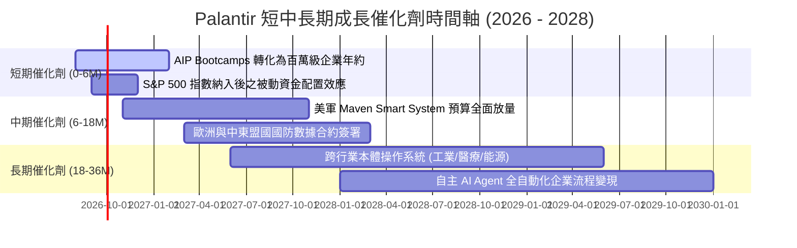

### 9.2 TAM 市場規模分析

```
╔══════════════════════════════════════════════════════════════════╗
║              Palantir 目標市場規模 (TAM) 與滲透率分析            ║
╠══════════════════════════════════════════════════════════════════╣
║                                                                  ║
║  ① 全球國防與情報數據分析 TAM:    $350B  (目前滲透率 ~0.9%)     ║
║  ② 企業級 AI 與大數據操作系統 TAM:  $550B  (目前滲透率 ~0.5%)     ║
║  ③ 政府文職機關數字化轉型 TAM:    $300B  (目前滲透率 ~0.3%)     ║
║  ─────────────────────────────────────────────────────────────   ║
║  ★ 總體潛在市場規模 (Total TAM):  $1,200B ($1.2 Trillion)       ║
║    Palantir TTM 營收 $6.16B 僅佔總 TAM 之 0.51%                  ║
║                                                                  ║
║  0% ─── [0.51%] ──────────────────────────────────────── 100%    ║
║          ▲ 當前滲透率極低，長期增長跑道寬廣                      ║
╚══════════════════════════════════════════════════════════════════╝
```

### 9.3 成長驅動力結構圖

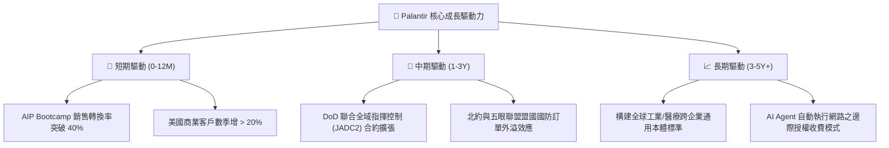

---

## 10. 風險矩陣

### 10.1 風險評分矩陣

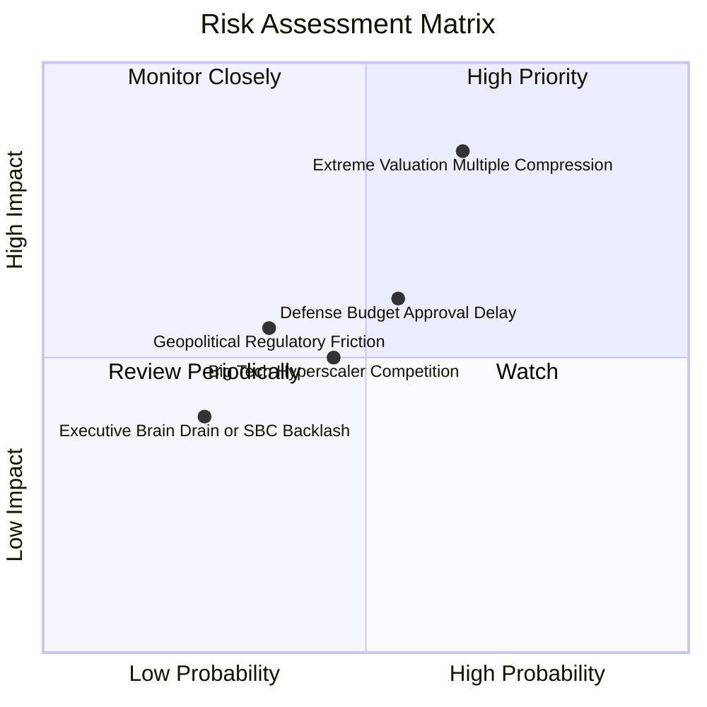

### 10.2 風險清單詳細分析

| # | 風險項目 | 發生機率 | 財務衝擊 | 風險評分 | 緩解措施與觀察指標 |
|---|----------|----------|----------|----------|--------------------|
| 1 | 🔴 **超高估值倍數回調** | 中高 (65%) | 高 (-30% 股價) | 🔴 **8.2 / 10** | 逢回分批佈局，不追高；密切監控季度營收 YoY 是否維持在 50% 以上。 |
| 2 | 🟡 **國防合約撥款延宕** | 中等 (55%) | 中 (-8% 營收) | 🟡 **6.5 / 10** | 商業營收佔比已達 47% 且加速擴大，有效分散單一政府客戶依賴。 |
| 3 | 🟡 **公有雲巨頭低代碼競爭** | 中等 (45%) | 中 (-5% 毛利) | 🟡 **5.5 / 10** | 依託 IL6 國防資安與本體架構專利，構築深厚技術護城河。 |
| 4 | 🟢 **地緣政治與歐洲監管** | 偏低 (35%) | 輕中度 (-3% 營收) | 🟢 **4.2 / 10** | 在英國與歐盟設立本地化數據中心與合資實體，確保合規性。 |

---

## 11. 投資建議

### 11.1 最終綜合評級雷達圖

```
╔══════════════════════════════════════════════════════════════════╗
║              Palantir (PLTR) 最終綜合評級雷達                    ║
╠══════════════════════════════════════════════════════════════════╣
║                                                                  ║
║  商業模式護城河  9.2/10  ▓▓▓▓▓▓▓▓▓▓▓▓▓▓▓▓▓▓░░  🏆 頂級優勢       ║
║  營收成長動能    9.3/10  ▓▓▓▓▓▓▓▓▓▓▓▓▓▓▓▓▓▓░░  🏆 指數級爆發     ║
║  獲利與現金流    9.2/10  ▓▓▓▓▓▓▓▓▓▓▓▓▓▓▓▓▓▓░░  🏆 營運槓桿確立   ║
║  資產負債健康度  9.8/10  ▓▓▓▓▓▓▓▓▓▓▓▓▓▓▓▓▓▓█░  🏆 堡壘級防禦     ║
║  估值安全邊際    4.2/10  ▓▓▓▓▓▓▓▓░░░░░░░░░░░░  ⚠️ 估值偏高       ║
║  ─────────────────────────────────────────────────────────────   ║
║  綜合總評分      8.4/10  ▓▓▓▓▓▓▓▓▓▓▓▓▓▓▓▓░░░░  🟡 逢回買入/持有  ║
║                                                                  ║
║  ★ 投資建議：🟡 持有 (HOLD) ｜ 策略：逢回調分批累積 (Accumulate)  ║
╚══════════════════════════════════════════════════════════════════╝
```

### 11.2 目標價與隱含報酬率

| 情境 | 目標價 | 隱含報酬率 (相對現價 $186.29) | 機率權重 | 核心驅動假設 |
|------|--------|-------------------------------|----------|--------------|
| 🔴 **悲觀情境 (Bear)** | **$132.00** | **-29.1%** | 20% | 營收增速放緩至 25%，Forward P/E 壓縮至 40x |
| 🟡 **基準情境 (Base)** | **$191.68** | **+2.89%** | 60% | 營收維持 40% CAGR，利潤率擴張，倍數維持 65x |
| 🟢 **樂觀情境 (Bull)** | **$245.00** | **+31.5%** | 20% | AIP 全球爆發，營收增速維持 50%+，利潤率突破 50% |
| **加權預期目標價** | **$190.41** | **+2.21%** | 100% | 未來 12 個月預期風險調整後回報中性偏平穩 |

### 11.3 買入時機與觸發因素

```
╔══════════════════════════════════════════════════════════════════╗
║                  ✅ 買入與操作策略 Checklist                     ║
╠══════════════════════════════════════════════════════════════════╣
║                                                                  ║
║  建倉 / 加碼觸發條件（符合任二）：                               ║
║  ☑ 股價回檔至 $140.00 – $155.00 區間（MOS 達 15% 以上）         ║
║  ☑ 單季商業客戶營收 YoY 成長率持續高於 70%                      ║
║  ☑ 美軍重大 JADC2 / Maven 後續大額訂單正式落地                   ║
║  ☑ 大盤系統性回檔導致 Forward P/E 壓縮至 60x 以下                ║
║                                                                  ║
║  減碼 / 獲利了結觸發條件（符合任一）：                           ║
║  ☐ 股價快速衝高突破 $215.00（透支未來 2 年成長空間）             ║
║  ☐ 單季營收 YoY 成長率驟降至 40% 以下                           ║
║  ☐ 核心高管或創辦團隊出現異常大額無計畫拋售                      ║
║                                                                  ║
║  嚴格停損條件：                                                  ║
║  ☐ 基本面惡化跌破關鍵支撐 $125.00（停損控制在 -15% 內）         ║
╚══════════════════════════════════════════════════════════════════╝
```

### 11.4 投資人適配度分析

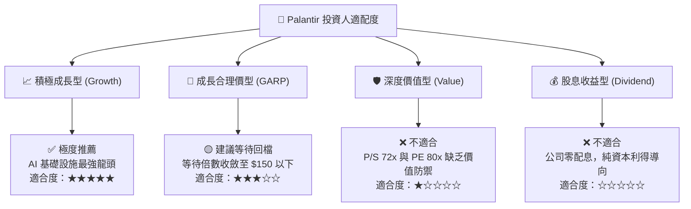

### 11.5 每季財報監控清單（Quarterly Watch List）

| 監控指標 | 正常健康範圍 | 警示門檻（觸發審查） | 減碼/停損門檻 |
|----------|--------------|----------------------|---------------|
| **季度營收 YoY 成長率** | ≥ 65% | < 50% | < 35% |
| **美國商業客戶數量年增率** | ≥ 60% | < 45% | < 30% |
| **GAAP 營業利潤率** | ≥ 40.0% | < 35.0% | < 30.0% |
| **股權激勵 (SBC) / 營收比** | ≤ 14.0% | > 18.0% | > 22.0% |
| **自由現金流 (FCF) 利潤率** | ≥ 45.0% | < 35.0% | < 25.0% |
| **淨留存率 (Net Retention Rate)** | ≥ 115% | < 110% | < 105% |

### 11.6 反面論證：什麼會證明論點錯誤（What Would Change My Mind）

```
╔══════════════════════════════════════════════════════════════════╗
║              ⚠️ 論點失效條件（Disconfirming Evidence）           ║
╠══════════════════════════════════════════════════════════════════╣
║  本分析報告之多頭基本面論點在下列情況發生時即告失效，將下調評級：║
║                                                                  ║
║  ① 商業端營收成長率連續兩季跌破 35%（證明 AIP 為短期炒作）；    ║
║  ② GAAP 營業利益率自峰值回落超過 8.0pp（營運槓桿逆轉）；         ║
║  ③ 自由現金流轉負或季度 FCF 轉換率低於 60%；                     ║
║  ④ ROIC 跌破 15.0% 逼近 WACC，失去超額價值創造能力；             ║
║  ⑤ 美國國防部取消或大幅削減主要大數據分析項目之續約預算。       ║
╚══════════════════════════════════════════════════════════════════╝
```

---
> **免責聲明**：本報告為依據公開即時財務數據之深度機構級學術與基本面研究，不構成任何形式的直接買賣邀約。美股投資具備市場風險，投資人應獨立評估自身風險承受能力並諮詢合格財務顧問。