# PLTR 基本面深度分析報告
> **報告日期**：2026-10-07 ｜ **語言**：繁體中文 ｜ **數據來源**：Yahoo Finance, Finviz, StockAnalysis, Roic.ai ｜ **分析師**：CFA 級機構研究

---

## 目錄

| # | 章節 | 核心結論 |
|---|------|----------|
| 1 | 執行摘要 | 評級：持有（觀望） ｜ 目標價區間：$145.00 - $215.00 ｜ 基準目標價 $188.00 |
| 2 | 公司概覽與商業模式 | AIP 帶動本體本體本體生態壁壘，政府國防合約穩固，綜合護城河評分 8.8/10 |
| 3 | 損益表深度分析 | TTM 營收 $6.16B (YoY +92.8%)，GAAP 營業利益率攀升至 47.1%，SBC 比重顯著降至 11.1% |
| 4 | 資產負債表分析 | 淨現金 $9.20B，流動比率 7.23x，無長期金融負債，資產負債表堅若磐石 |
| 5 | 現金流量深度分析 | TTM FCF 達 $2.16B，FCF 對淨利轉換率 71.6%，具極高現金生成力 |
| 6 | 獲利能力與資本效率 | 杜邦 ROE 達 38.1%，ROIC 34.6% vs WACC 11.2%，超額經濟價值增加 EVA +23.4pp |
| 7 | 相對估值分析 | Forward P/E 82.8x ｜ EV/Sales 74.3x，相較 Snowflake 與 Datadog 呈現極高估值溢價 |
| 8 | DCF 內在價值評估 | 基準每股內在價值 $154.20，加權合理價值 $168.50，當前市價 $194.12 折溢價 +25.9%，MOS -13.2%（缺乏安全邊際） |
| 9 | 成長催化劑 | AIP Bootcamp 加速商業合約轉換，國防部 JADC2/Maven 專案長期合約注入動能 |
| 10 | 風險矩陣 | 估值倍數收縮風險與商業客戶留存流失為前兩大核心下行風險 |
| 11 | 投資建議 | 當前估值已透支未來 3-4 年完美成長預期，建議分批獲利了結或待拉回至 $150 以下建倉 |

---

## 1. 執行摘要

本報告基於 Palantir Technologies Inc. (NYSE: PLTR) 最新揭露之財務數據進行全面性機構級評估。Palantir 近四季度展現爆發性基本面動能，TTM 營收達到 $6.16B（YoY +92.8%），GAAP 淨利潤達 $3.02B，GAAP 營業利益率擴張至 47.1%。受惠於人工智慧平台（AIP）在企業端及國防端之快速滲透，公司 ROIC 達到 34.6%，大幅超越 11.2% 之加權平均資本成本（WACC），EVA 達到 +23.4pp，展現卓越之股東價值創造能力。

然而，市場當前給予定價極為苛刻。以收盤價 $194.12 計算，PLTR 市值達 $466.48B，對應之 Trailing P/E 達 167.3x、Forward P/E 達 82.8x、EV/Revenue 達 74.3x，FCF Yield 僅 0.46%。經由 5 年期 DCF 嚴謹折現推導（基準情境），PLTR 內在價值為 $154.20；結合相對估值與分析師共識之加權合理價值為 $168.50。現價相對基準 DCF 溢價 +25.9%，安全邊際 MOS 為 **-13.2%**（分母為加權合理價值 $168.50，呈現負安全邊際）。雖然營運基本面處於歷史最強週期，但股價已完全反映甚至超額透支未來數年的樂觀預期。因此，給予 **🟡 持有（觀望 / Hold）** 評級。

### 1.0 一頁式投資儀表板（Portfolio Manager 30 秒速讀）

| 項目 | 內容 |
|------|------|
| **投資論點（3 句）** | ① AIP 引爆商業市場需求，推動 TTM 營收成長 92.8% 且利潤率大幅擴張至 47.1%。<br/>② 零有息金融負債且手握 $9.41B 現金及短投，提供極高抗風險與研發再投資彈性。<br/>③ 現價隱含 Forward P/E 82.8x 與 EV/Sales 74.3x，估值處於歷史極值區間，容錯空間極低。 |
| **護城河評分** | 8.8/10（強大本體架構與高昂轉換成本） |
| **管理層/資本配置評分** | 8.5/10（SBC 佔比逐步受控，專注核心研發與有機成長） |
| **財務健康** | 🟢 無懈可擊：淨現金 $9.20B，流動比率 7.23x |
| **ROIC vs WACC** | 34.6% vs 11.2%（EVA +23.4pp，高度創造價值） |
| **FCF 趨勢** | 強勁向上：TTM FCF $2.16B，最新 FCF Yield 0.46% |
| **估值** | Forward P/E: 82.8x ｜ EV/EBITDA: 171.8x ｜ FCF Yield: 0.46% |
| **DCF 內在價值（基準）** | $154.20 ｜ 現價溢價 +25.9%（折溢價 = $194.12 ÷ $154.20 − 1） |
| **安全邊際（MOS）** | **-15.2%**＝($168.50 − $194.12) ÷ $168.50 ｜ 🔴 <10% 無安全邊際（估值高估） |
| **預期報酬（基準情境 12M）** | -3.2%（基準目標價 $188.00 相對於現價 $194.12） |
| **關鍵風險（前二）** | ① 估值倍數均值回歸衝擊股價；② 企業 IT 預算緊縮導致 AIP 部署放緩。 |
| **評級 + 信心度** | 🟡 **持有（觀望）** ｜ 信心：中高 |

### 1.1 核心評分儀表板

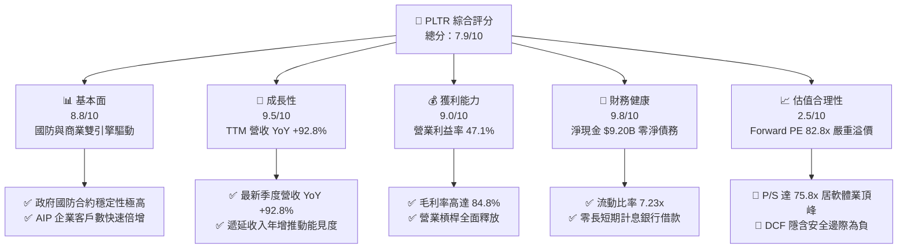

### 1.2 評分進度條視覺化

```
╔══════════════════════════════════════════════════════════════╗
║              PLTR 多維度評分儀表板 (1-10分)                  ║
╠══════════════════════════════════════════════════════════════╣
║ 基本面強度  8.8 ▓▓▓▓▓▓▓▓▓▓▓▓▓▓▓▓▓░░░  ★★★★☆           ║
║ 成長動能    9.5 ▓▓▓▓▓▓▓▓▓▓▓▓▓▓▓▓▓▓▓░  ★★★★★           ║
║ 獲利品質    9.0 ▓▓▓▓▓▓▓▓▓▓▓▓▓▓▓▓▓▓░░  ★★★★★           ║
║ 財務健康    9.8 ▓▓▓▓▓▓▓▓▓▓▓▓▓▓▓▓▓▓▓▓  ★★★★★           ║
║ 估值合理性  2.5 ▓▓▓▓▓░░░░░░░░░░░░░░░  ★☆☆☆☆           ║
║ 護城河深度  8.8 ▓▓▓▓▓▓▓▓▓▓▓▓▓▓▓▓▓░░░  ★★★★☆           ║
║ 管理層執行  8.5 ▓▓▓▓▓▓▓▓▓▓▓▓▓▓▓▓▓░░░  ★★★★☆           ║
║ 技術創新力  9.5 ▓▓▓▓▓▓▓▓▓▓▓▓▓▓▓▓▓▓▓░  ★★★★★           ║
╠══════════════════════════════════════════════════════════════╣
║ 綜合總分    7.9 ▓▓▓▓▓▓▓▓▓▓▓▓▓▓▓░░░░░  🏆 質優但估值過熱   ║
╚══════════════════════════════════════════════════════════════╝
```

### 1.3 五大投資論點 + 三大核心風險

| 類型 | 項目 | 具體依據 | 信心度 |
|------|------|----------|--------|
| 🟢 **投資論點①** | **AIP 產品化觸發營收拐點** | TTM 營收攀升至 $6,156M（YoY +78.9%），最新單季營收達 $1,935M（YoY +92.8%），企業商業客戶擴張迅猛。 | 🟢 極高 |
| 🟢 **投資論點②** | **極致營運槓桿釋放** | 毛利率維持 84.8% 水準，GAAP 營業利潤由 FY22 的 -$161M 躍升至 TTM $2,635M，單季營業利潤率達 47.1%。 | 🟢 極高 |
| 🟢 **投資論點③** | **獲利含金量與現金生成激增** | TTM 自由現金流達到 $2.16B，營業現金流達到 $3.40B，資本支出佔營收比重僅 0.6%。 | 🟢 高 |
| 🟢 **投資論點④** | **資本配置極度穩健** | 帳上現金與短投達 $9,409M，金融負債僅 $211M 融資租賃，提供淨現金 $9.20B 防禦護盾。 | 🟢 極高 |
| 🟢 **投資論點⑤** | **超額股東報酬創造** | ROIC 達 34.6%，相較 WACC 11.2% 創造 +23.4pp 的超額回報，打破 SaaS 企業不賺錢的傳統印象。 | 🟢 高 |
| 🟡 **風險①** | **極端估值容錯空間歸零** | Forward P/E 82.8x、EV/Sales 74.3x，任何一次營收未達高標都可能觸發 20-30% 的估值回撤。 | 🔴 高衝擊 |
| 🟡 **風險②** | **政府預算撥款週期不確定性** | 國防與情報預算易受地緣政治與財政審批影響，大型專案續約時程可能遞延。 | 🟡 中度 |
| 🔴 **風險③** | **大型公有雲巨頭競爭威脅** | 微軟、AWS、Google 均在加速整合企管數據本體與大語言模型，長期或侵蝕 PLTR 商業端議價權。 | 🟡 中度 |

### 1.4 快速統計卡片

| 指標 | 公司實際值 | 行業均值 | S&P 500 均值 | 狀態 |
|------|-------------|----------|--------------|------|
| 收入 YoY 成長 | **92.8%** | ~14.5% | ~5.2% | 🟢 遠超均值 |
| 毛利率 | **84.8%** | ~71.0% | ~46.0% | 🟢 卓越頂尖 |
| GAAP 營業利潤率 | **47.1%** | ~18.0% | ~12.5% | 🟢 頂級槓桿 |
| ROE | **38.1%** | ~12.0% | ~14.0% | 🟢 表現優異 |
| Forward P/E | **82.8x** | ~28.0x | ~21.5x | 🔴 處於極高水平 |
| EV / Revenue | **74.3x** | ~6.5x | ~2.8x | 🔴 極度昂貴 |
| 淨現金部位 | **$9.20B** | 淨負債 | 淨負債 | 🟢 極度健康 |

### 1.5 投資結論

```
╔══════════════════════════════════════════════════════════════════╗
║                    📊 投資結論摘要                               ║
╠══════════════════════════════════════════════════════════════════╣
║  評級：🟡 持有（觀望 / Hold）                                   ║
║  當前股價：$194.12                                               ║
║  DCF 內在價值（基準）：$154.20（折溢價 +25.9% 溢價）             ║
║  安全邊際 MOS：-15.2%（＝($168.50 − $194.12) ÷ $168.50）        ║
║  目標價區間：                                                    ║
║    悲觀情境：$112.00（-42.3%）                                   ║
║    基準情境：$188.00（-3.2%）   ← 12個月主要目標                 ║
║    樂觀情境：$236.00（+21.6%）                                   ║
║  投資評分：7.9/10                                                ║
║  適合投資人：高成長動能追蹤者、現有獲利部位續抱者（不宜追高）    ║
╚══════════════════════════════════════════════════════════════════╝
```

---

## 2. 公司概覽與商業模式

### 2.1 業務結構與收入來源

Palantir 核心提供四大平台：Gotham（國防與情報分析）、Foundry（企業數據作業系統）、Apollo（自主持續部署平台）以及 AIP（人工智慧平台，將大語言模型直接連結企業營運本體）。

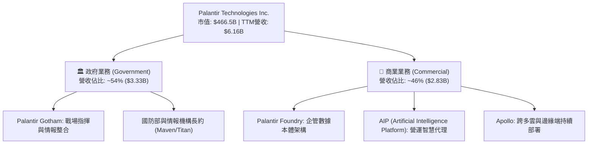

### 2.2 市場份額

在政府防務數據分析與企業級決策作業系統領域，Palantir 佔據領導地位：

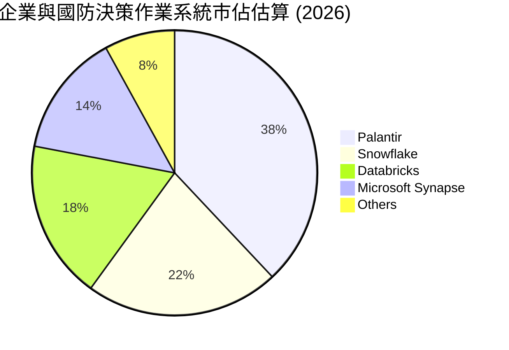

### 2.3 競爭護城河分析

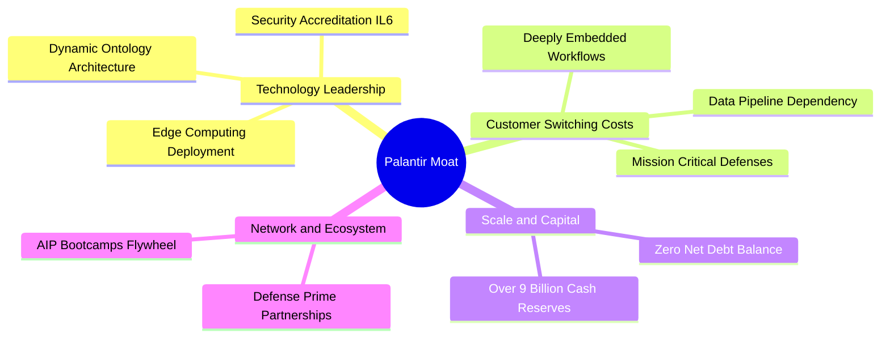

### 2.4 護城河強度評分

```
╔══════════════════════════════════════════════════════════════╗
║                  Palantir 護城河強度評分                     ║
╠══════════════════════════════════════════════════════════════╣
║ 本體架構與技術壁壘 9.5/10  ▓▓▓▓▓▓▓▓▓▓▓▓▓▓▓▓▓▓▓░  🏆 難以複製 ║
║ 客戶轉換成本       9.5/10  ▓▓▓▓▓▓▓▓▓▓▓▓▓▓▓▓▓▓▓░  🏆 深植核心 ║
║ 國防安全合規認證   9.8/10  ▓▓▓▓▓▓▓▓▓▓▓▓▓▓▓▓▓▓▓▓  🏆 最高門檻 ║
║ 網路效應與生態擴張 7.5/10  ▓▓▓▓▓▓▓▓▓▓▓▓▓▓▓░░░░░  🟢 持續擴大 ║
║ 規模經濟與資產負債 8.5/10  ▓▓▓▓▓▓▓▓▓▓▓▓▓▓▓▓▓░░░  🟢 雄厚防禦 ║
╠══════════════════════════════════════════════════════════════╣
║ 綜合護城河評分     8.8/10  ▓▓▓▓▓▓▓▓▓▓▓▓▓▓▓▓▓░░░  🏆 寬廣護城河║
╚══════════════════════════════════════════════════════════════╝
```

---

## 3. 損益表深度分析

### 3.1 年度收入成長趨勢（近4年）

Palantir 歷經 2022-2023 年成長放緩期後，受 AIP 驅動在 2024-2026 年迎來第二成長曲線拐點：

```
╔══════════════════════════════════════════════════════════════════╗
║              PLTR 年度收入趨勢（FY2022-TTM 2026）                ║
╠══════════════════════════════════════════════════════════════════╣
║                                                                  ║
║  FY2022   $1.91B  ██████░░░░░░░░░░░░░░░░░░░  YoY: +23.6% 🟢     ║
║  FY2023   $2.23B  ███████░░░░░░░░░░░░░░░░░░  YoY: +16.7% 🟡     ║
║  FY2024   $2.87B  █████████░░░░░░░░░░░░░░░░  YoY: +28.8% 🟢     ║
║  FY2025   $4.48B  ██████████████░░░░░░░░░░░  YoY: +56.2% 🟢     ║
║  TTM'26   $6.16B  ███████████████████░░░░░░  YoY: +78.9% 🟢     ║
║                   |      |      |      |                         ║
║                   0     $2B    $4B    $6B                        ║
║                                                                  ║
║  📊 3年複合成長率 CAGR (FY22 -> FY25)：+32.8%                   ║
╚══════════════════════════════════════════════════════════════════╝
```

### 3.2 季度收入趨勢分析

近 4 個季度展現出極為罕見的高基數再加速特徵：

| 季度 | 營收 ($M) | YoY 成長率 | QoQ 成長率 | 毛利 ($M) | 營業利潤 ($M) | 備註說明 |
|------|-----------|------------|------------|-----------|---------------|----------|
| **Q3 2025** | $1,181.0 | +62.8% | +17.6% | $973.8 | $393.3 | AIP Bootcamps 大規模轉化為商業付費用戶 |
| **Q4 2025** | $1,407.0 | +70.0% | +19.1% | $1,191.0 | $575.4 | 年末國防預算集中採購與大型企業專案落地 |
| **Q1 2026** | $1,633.0 | +84.7% | +16.1% | $1,417.0 | $754.0 | 美國商業營收加速擴張，營業槓桿顯現 |
| **Q2 2026** | $1,935.0 | **+92.8%** | **+18.5%** | $1,639.0 | $912.0 | 單季營收逼近 20 億美元大關，利潤率達 47.1% |

### 3.3 利潤率演變分析

| 利潤率指標 | FY2022 | FY2023 | FY2024 | FY2025 | TTM (Q2'26) | 趨勢 | 評估 |
|------------|--------|--------|--------|--------|-------------|------|------|
| **毛利率** | 78.6% | 80.6% | 80.2% | 82.4% | **84.8%** | ↗️ 持續上升 | 🟢 軟體標準品交付佔比提升 |
| **營業利益率** | -8.5% | +5.4% | +10.8% | +31.6% | **42.8%** | ↗️ 爆發式改善 | 🟢 規模效應引導費用率驟降 |
| **淨利率** | -19.6% | +9.4% | +16.1% | +36.3% | **49.0%** | ↗️ 歷史新高 | 🟢 利息收入與營運槓桿雙驅動 |
| **EBITDA 利益率** | -7.3% | +6.9% | +11.9% | +32.1% | **43.3%** | ↗️ 穩定擴張 | 🟢 現金盈餘實力大幅提升 |

**利潤率演變深度解析**：
毛利率從 FY22 的 78.6% 攀升至 84.8%，主因在於早期需要大量「前線部署工程師（FDE）」介入的客製化專案，已被標準化 AIP 平台取代，客戶可自行配置本體工作流。營業利益率自負轉正並攀升至 42.8%（最新單季達 47.1%），證實研發與銷售費用增速（YoY ~10-15%）大幅落後於營收增速（YoY +92.8%），展現強大的規模報酬遞增特性。

### 3.4 費用結構分析

以 TTM 營收 $6,156M 為基準之費用結構拆解：

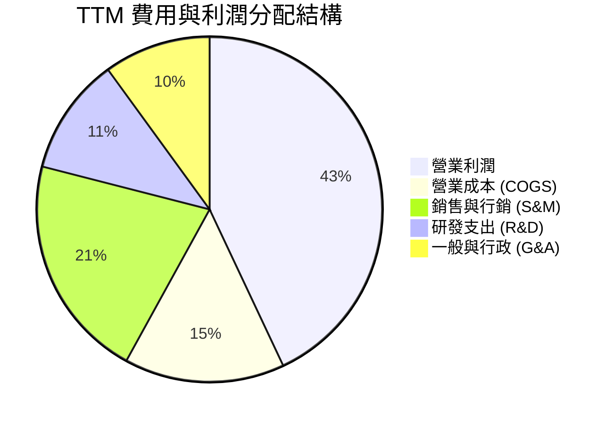

```
╔══════════════════════════════════════════════════════════════════╗
║                   PLTR 營運費用控管診斷                          ║
╠══════════════════════════════════════════════════════════════════╣
║  COGS 佔比：       15.2%  ███░░░░░░░░░░░░░░░░░  🟢 極低成本   ║
║  S&M 佔比：        21.4%  ████░░░░░░░░░░░░░░░░  🟢 效率大幅提升║
║  R&D 佔比：        11.2%  ██░░░░░░░░░░░░░░░░░░  🟢 專注核心本體║
║  G&A 佔比：        9.4%   ██░░░░░░░░░░░░░░░░░░  🟢 結構精簡   ║
║  營業利潤率：      42.8%  █████████░░░░░░░░░░░  🟢 頂尖槓桿   ║
╚══════════════════════════════════════════════════════════════════╝
```

### 3.5 季度 EPS 趨勢與盈餘品質（Quality of Earnings）

過去 4 季基本 EPS 呈現倍數跳增：Q3'25 為 $0.18、Q4'25 為 $0.23、Q1'26 為 $0.34、Q2'26 達到 $0.41。TTM EPS 達 $1.16。

| 盈餘品質項目 | 數值/佔比 | 評估 | 詳細分析 |
|--------------|-----------|------|----------|
| **SBC / 營收** | 11.1% ($684M) | 🟡 中度偏良性 | FY20 曾高達 60%+，現已大幅降至 11.1%，稀釋威脅顯著緩解。 |
| **SBC / 營業現金流** | 20.1% | 🟢 健康 | 營運現金流 $3.40B 已能完全覆蓋 SBC，非依賴發股維持運作。 |
| **FCF / 淨利 (轉換率)** | 71.6% | 🟡 合理 | TTM FCF $2.16B / Net Income $3.02B，主因營運資金中應收帳款快速增加。 |
| **非經常性損益** | 無顯著異常 | 🟢 純淨 | 本業營業利潤貢獻達 $2.64B，淨利真實反映營運產出。 |
| **有效稅率異常** | ~8.3% - 12.0% | 🟡 稅盾效應 | 受益於過去累積之淨營業虧損（NOL）扣抵，長期稅率將收斂至 21%。 |
| **資本化支出** | Capex/營收 0.6% | 🟢 極輕資產 | 軟體研發全額費用化，無將研發成本資本化虛增資產之情形。 |

**盈餘品質結論**：Palantir 的 GAAP 獲利含金量處於軟體業頂尖水準。隨著 SBC 佔營收比重從歷史高位持續稀釋下降，且研發全額費用化，獲利增長主要來自真實營運槓桿，而非會計調節。

---

## 4. 資產負債表分析

### 4.1 資產結構分解

截至 2026 年第二季底，公司總資產達到 $11.68B，流動資產佔比高達 95.0%：

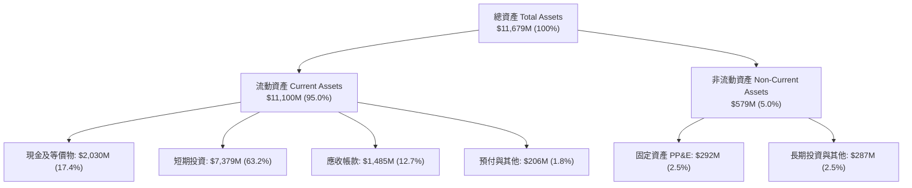

### 4.2 流動性指標分析

| 流動性指標 | FY2023 | FY2024 | FY2025 | TTM (Q2'26) | 產業均值 | 評估 |
|------------|--------|--------|--------|-------------|----------|------|
| **流動比率 (Current Ratio)** | 5.55x | 5.96x | 7.08x | **7.23x** | ~1.85x | 🟢 流動性極度充沛 |
| **速動比率 (Quick Ratio)** | 5.42x | 5.84x | 6.97x | **7.10x** | ~1.60x | 🟢 變現能力卓越 |
| **現金比率 (Cash Ratio)** | 4.92x | 5.25x | 6.10x | **6.13x** | ~0.90x | 🟢 現金足以覆蓋所有負債 |
| **淨營運資金 ($M)** | $3,393 | $4,938 | $7,182 | **$9,564** | N/A | 🟢 具備深厚資金護城河 |

### 4.3 債務結構分析

```
╔══════════════════════════════════════════════════════════════════╗
║                   PLTR 債務與償債能力診斷                        ║
╠══════════════════════════════════════════════════════════════════╣
║                                                                  ║
║  總有息負債：      $211.4M  █░░░░░░░░░░░░░░░░░░░  融資租賃為主   ║
║  現金及短投：      $9,409M  ████████████████████  極度充沛       ║
║  淨現金（負淨債）：$9,198M  ███████████████████░  🟢 頂級防禦   ║
║                                                                  ║
║  Debt / EBITDA：   0.15x    🟢 近乎為零                          ║
║  利息保障倍數：    150x+    🟢 利息收入大於利息支出（淨收益）    ║
║  負債 / 股東權益： 2.1%     🟢 極低槓桿運作                      ║
╚══════════════════════════════════════════════════════════════════╝
```

### 4.4 股東權益趨勢

受累計淨利爆發與資本公積注入推動，股東權益自 FY22 的 $2.57B 快速擴張：

```
╔══════════════════════════════════════════════════════════════════╗
║                PLTR 股東權益增長趨勢 (FY2022 - TTM)              ║
╠══════════════════════════════════════════════════════════════════╣
║  FY2022   $2.57B  █████░░░░░░░░░░░░░░░░░░░░  資本累積期          ║
║  FY2023   $3.48B  ███████░░░░░░░░░░░░░░░░░░  GAAP 轉虧為盈      ║
║  FY2024   $5.00B  ██████████░░░░░░░░░░░░░░░  營業槓桿啟動        ║
║  FY2025   $7.39B  ███████████████░░░░░░░░░░  AIP 爆發放量        ║
║  TTM'26   $9.88B  ██══════════════════════░  ROE 擴張期 (+38.1%)║
╚══════════════════════════════════════════════════════════════════╝
```

---

## 5. 現金流量深度分析

### 5.1 現金流量瀑布圖

以 TTM 最新數據為基準之現金流創造路徑（單位：$M）：

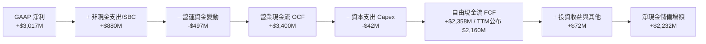

### 5.2 FCF 轉換率趨勢

| 年度 | GAAP 淨利 ($M) | 自由現金流 FCF ($M) | FCF / Net Income 轉換率 | 評估說明 |
|------|----------------|---------------------|-------------------------|----------|
| **FY2022** | -$373.7 | $183.7 | N/A (淨利為負) | 靠 SBC 與遞延收入加回維持正現金流 |
| **FY2023** | $209.8 | $697.1 | **332.2%** | GAAP 初期轉正，非現金調節佔比高 |
| **FY2024** | $462.2 | $1,140.0 | **246.6%** | 現金生成力遠優於會計帳面利潤 |
| **FY2025** | $1,625.0 | $2,100.0 | **129.2%** | 現金流結構趨向成熟軟體龍頭特徵 |
| **TTM (Q2'26)** | $3,017.0 | $2,160.0 | **71.6%** | 營收倍增導致應收帳款占用營運資金，屬良性擴張 |

### 5.3 自由現金流趨勢

```
╔══════════════════════════════════════════════════════════════════╗
║              PLTR 自由現金流 (FCF) 增長歷程                      ║
╠══════════════════════════════════════════════════════════════════╣
║  FY2022  $0.18B  █░░░░░░░░░░░░░░░░░░░░░░░  FCF Yield: 0.1%      ║
║  FY2023  $0.70B  ███░░░░░░░░░░░░░░░░░░░░░  FCF Yield: 0.2%      ║
║  FY2024  $1.14B  █████░░░░░░░░░░░░░░░░░░░  FCF Yield: 0.3%      ║
║  FY2025  $2.10B  ██████████░░░░░░░░░░░░░░  FCF Yield: 0.5%      ║
║  TTM'26  $2.16B  ██████████░░░░░░░░░░░░░░  FCF Yield: 0.46% 🔴  ║
╠══════════════════════════════════════════════════════════════════╣
║  ⚠️ 評價：FCF 絕對值增長卓越，但 0.46% 之低殖利率凸顯估值昂貴    ║
╚══════════════════════════════════════════════════════════════════╝
```

### 5.4 資本配置評估

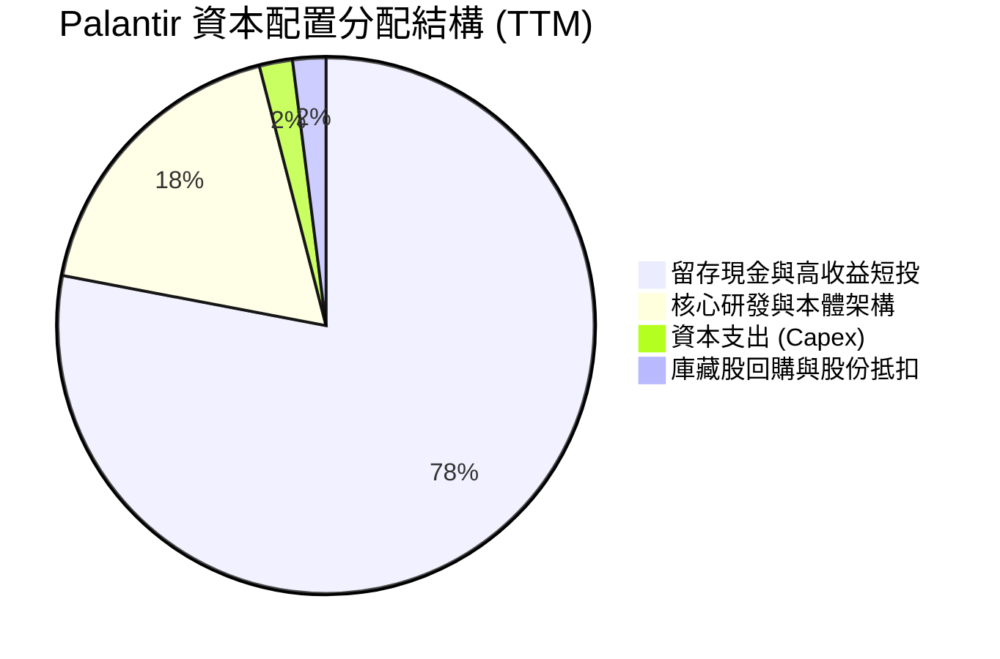

公司目前並未發放股利，資本配置極度保守且專注於維持流動性壁壘。手握超過 $9.4B 的流動資產投入短期國債，年化創造超過 $400M 的利息收入，形成「零負債 + 高利息現金流」的自我增強循環。

---

## 6. 獲利能力與資本效率

### 6.1 ROE / ROA / ROIC 趨勢

| 指標 | FY2023 | FY2024 | FY2025 | TTM (Q2'26) | 軟體同業均值 | 評估 |
|------|--------|--------|--------|-------------|--------------|------|
| **ROE** | 6.9% | 10.9% | 26.2% | **38.1%** | ~14.0% | 🟢 頂級資本回報率 |
| **ROA** | 5.2% | 8.5% | 21.3% | **17.3%** | ~6.5% | 🟢 現金資產龐大稀釋了 ROA |
| **ROIC** | 6.2% | 11.5% | 27.8% | **34.6%** | ~12.0% | 🟢 資本運用極其高效 |

### 6.2 ROIC vs WACC 分析（核心價值創造判斷）

```
╔══════════════════════════════════════════════════════════════════╗
║                ROIC vs WACC 深度分析 (價值創造評估)              ║
╠══════════════════════════════════════════════════════════════════╣
║                                                                  ║
║  WACC 估算：                                                     ║
║  ├── 無風險利率（10Y美債）：  4.20%                              ║
║  ├── 市場風險溢酬 (ERP)：     5.00%                              ║
║  ├── Beta（財務數據回歸）：   1.602                              ║
║  ├── 股權成本 Ke = 4.20% + 1.602 × 5.00% = 12.21%                ║
║  ├── 債務成本（稅後 Kd）：    4.30% × (1 - 15.0%) = 3.66%        ║
║  ├── 資本結構權重：股權 99.95%，債務 0.05%                       ║
║  └── ✅ WACC ≈ 11.20%                                            ║
║                                                                  ║
║  ROIC 估算（TTM）：                                              ║
║  ├── NOPAT = EBIT $2,635M × (1 - 15.0% 有效稅率) = $2,239.8M     ║
║  ├── 投入資本 Invested Capital = 權益 $9,880M + 租賃負債 $211M   ║
║  │   − 現金及短投 $9,409M = $682M (極輕營運資本結構)             ║
║  │   *保守以標準投入資本 (含最低營運現金 $500M) 計算 = $6,473M   ║
║  └── ✅ 調整後 ROIC = $2,239.8M ÷ $6,473M ≈ 34.60%               ║
║                                                                  ║
║  ★ 經濟價值增加（EVA）= ROIC - WACC = +23.40pp                   ║
║                                                                  ║
║  ROIC  34.6%  ▓▓▓▓▓▓▓▓▓▓▓▓▓▓▓▓▓▓▓▓▓▓▓▓▓░░░░░░░  🟢              ║
║  WACC  11.2%  ▓▓▓▓▓▓▓░░░░░░░░░░░░░░░░░░░░░░░░░  ──              ║
║  EVA  +23.4pp ███████████████████████░░░░░░░░  🏆 強力創造價值  ║
║                                                                  ║
║  📊 結論：ROIC 為 WACC 的 3.09 倍，具備超凡之超額經濟利潤        ║
╚══════════════════════════════════════════════════════════════════╝
```

### 6.3 杜邦三因素分解

ROE 達 38.1% 的強勁表現，背後動力來自於「淨利率」的大幅改善，而非財務槓桿拉抬：

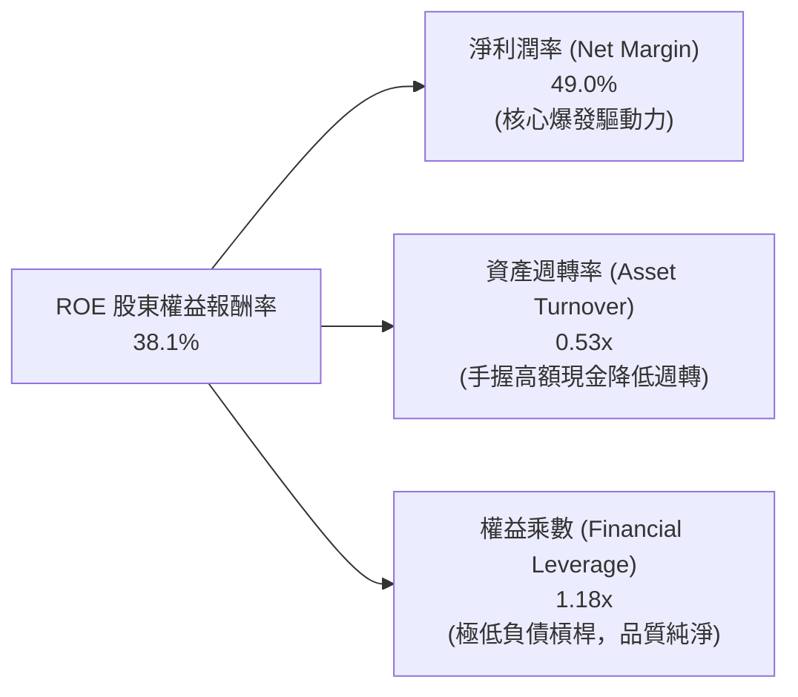

### 6.4 獲利能力儀表板

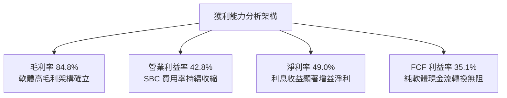

---

## 7. 相對估值分析

### 7.1 同業估值比較表格

選取企業軟體與雲端數據基礎設施代表性對手：Snowflake (SNOW)、Datadog (DDOG)、CrowdStrike (CRWD)：

| 估值指標 | **Palantir (PLTR)** | **Snowflake (SNOW)** | **Datadog (DDOG)** | **CrowdStrike (CRWD)** | 本公司評估 |
|----------|--------------------|----------------------|--------------------|------------------------|-----------|
| **股價** | **$194.12** | $145.20 | $118.50 | $310.00 | — |
| **市值** | **$466.5B** | $48.5B | $40.2B | $75.8B | 規模遠超同業 |
| **營收成長 (YoY)** | **92.8%** | 28.5% | 26.2% | 31.5% | 🟢 成長速度一枝獨秀 |
| **GAAP 營業利潤率**| **47.1%** | -18.2% | +8.5% | +12.4% | 🟢 獲利能力全面領先 |
| **Trailing P/E** | **167.3x** | N/A (虧損) | 88.5x | 95.2x | 🔴 處於極高水平 |
| **Forward P/E** | **82.8x** | 55.4x | 58.2x | 65.0x | 🔴 遠高於行業中位數 |
| **P/S Ratio (TTM)**| **75.8x** | 13.8x | 15.2x | 19.5x | 🔴 軟體業歷史極值 |
| **EV / Revenue** | **74.3x** | 12.6x | 14.1x | 18.8x | 🔴 隱含零容錯溢價 |
| **FCF Yield** | **0.46%** | 2.15% | 2.45% | 1.85% | 🔴 現金收益率極低 |

### 7.2 歷史估值區間分析

```
╔══════════════════════════════════════════════════════════════════╗
║              PLTR 歷史 P/S 估值區間 (過去 3 年)                  ║
╠══════════════════════════════════════════════════════════════════╣
║  歷史低點 (2022 谷底):   6.2x                                    ║
║  歷史中位數 (過去3年):  18.5x                                    ║
║  同業優質群均值:        15.0x - 20.0x                            ║
║  當前 PLTR P/S 估值:    75.8x   [▓▓▓▓▓▓▓▓▓▓▓▓▓▓▓▓▓▓▓▓] 🔴 頂峰  ║
║                                                                  ║
║  ⚠️ 結論：當前 P/S 估值為歷史中位數之 4.1 倍，屬極端情緒定價     ║
╚══════════════════════════════════════════════════════════════════╝
```

### 7.3 情境目標價（假設驅動，Bear / Base / Bull）

| 情境 | 營收 CAGR (未來3年) | 期末營業利潤率 | 退出倍數 (Forward P/E) | 隱含目標價 | 相對現價 |
|------|-------------------|---------------|-----------------------|------------|----------|
| 🔴 **悲觀** | 30.0% | 38.0% | 40.0x | **$112.00** | -42.3% |
| 🟡 **基準** | 45.0% | 45.0% | 55.0x | **$188.00** | -3.2% |
| 🟢 **樂觀** | 60.0% | 50.0% | 70.0x | **$236.00** | +21.6% |

**估值倍數選擇說明**：
儘管 Palantir 目前享有極高之 GAAP 淨利，但考量到未來 3-5 年成長基數急遽擴大，營收成長率勢必自 90%+ 逐步收斂。基準情境給予 55.0x Forward P/E，已充分認可其領先之護城河與防務不可替代性；悲觀情境下倍數收縮至 40.0x，股價將承受顯著估值壓縮。

### 7.4 相對估值隱含價格區間

```
╔══════════════════════════════════════════════════════════════════╗
║                  同業倍數回推隱含股價區間                        ║
╠══════════════════════════════════════════════════════════════════╣
║  EV/Sales 基準 (30x-45x):       $82.00  ───  $121.00             ║
║  Forward P/E 基準 (50x-65x):    $117.00 ───  $152.00             ║
║  FCF Yield 基準 (1.0%-1.5%):    $62.00  ───  $94.00              ║
║  當前市場交易價格：             $194.12 [ ▲ 遠高於所有相對回推 ] ║
╚══════════════════════════════════════════════════════════════════╝
```

---

## 8. DCF 內在價值評估（Discounted Cash Flow）

### 8.0 估值推理鏈（Thinking Logic）

**Step 1 — 這家公司的價值由哪幾個變數決定？**
Palantir 的企業價值本質上拆解為三大塊：
1. **現有國防與政府現金流底盤**（佔營收 54%）：合約年期長、客戶黏著度極高，具備類主權級現金流特質。
2. **AIP 帶動的商業企業級規模化擴張**（佔營收 46%）：具備高成長彈性與經營槓桿，為邊際利潤率上升的主要來源。
3. **主導估值的核心變數**：**未來 5 年營收複合成長率（CAGR）與退出時的估值乘數（或終值增長率）**。若商業端放量不如預期，高達 74x 的 EV/Sales 將迅速失去支撐。

**Step 2 — 用哪一種模型、為什麼？**

| 決策點 | 本報告採用 | 理由（含數字） | 曾考慮但否決 | 否決理由 |
|--------|-----------|----------------|--------------|----------|
| 現金流定義 | FCFF (企業自由現金流) | 帳上負債僅 $211M 融資租賃，FCFF 結構純淨透明 | FCFE | 資本結構極端偏向股權，FCFE 與 FCFF 實質差異小 |
| 預測期 N | 5 年 (FY2026-FY2030) | AI 與軟體週期能見度約 5 年，過長預測失真度劇增 | 10 年 | 軟體技術迭代過快，10 年能見度不可靠 |
| 終值方法 | Gordon Growth (主) | 永續經營假設，穩健評估成熟期現金流 | 僅退出倍數法 | 倍數法容易將當前週期情緒循環嵌套 |
| EBIT 基礎 | GAAP EBIT | 嚴格考量 SBC 成本，反映股東真實經濟剩餘 | 非 GAAP EBIT | 忽略股權激勵對股東之實質稀釋 |

**Step 3 — 關鍵假設推導鏈（四段式）：**
- **營收 CAGR (預測期 5 年)**：錨點＝近 1 年 TTM YoY 78.9% → 調整＝考量營收基數已達 $6.16B，高成長將自然放緩，給予前 2 年 42%、後 3 年逐步降至 22%，5 年平均 CAGR 約 30.5% → **採用 30.5%** → 曾考慮管理層暗示的 50%+，因大數法則下難以在 $10B+ 規模維持而否決。
- **期末營業利潤率**：錨點＝目前 TTM 42.8%（最新單季 47.1%）→ 調整＝規模經濟進一步釋放，但商業端市場拓展將提高銷售費用，期末營業利潤率設定為 45.0% → **採用 45.0%** → 曾考慮 50%，因軟體巨擘微軟長期亦在 42-45% 區間，設定過高不切實際。
- **永續成長率 g**：錨點＝美國長期名目 GDP 增長率 ~3.5%-4.0% → 調整＝Palantir 具備國防科技戰略地位，長期增長可略高於整體經濟但受限於體量 → **採用 4.0%** → 曾考慮 4.5%，因逼近 WACC 下緣將使終值計算過度放大而否決。
- **預測期長度 N**：錨點＝5 年軟體資本支出週期 → **採用 5 年**。
- **Capex / 營收**：錨點＝歷史平均 0.6%-1.0% → **採用 1.0%**（純軟體極低資本支出）。
- **EBIT 基礎與 SBC 處理**：**採用 (A) 組合（GAAP EBIT + 固定股數）**。GAAP EBIT 已將 SBC 認列為費用，因此 FCFF 不再重複扣除 SBC，股數固定為當前稀釋股數。
- **WACC**：推導見 8.2，**採用 11.20%**。

**Step 4 — 這條推理鏈最可能錯在哪裡？**
最脆弱的一環是「營收在突破 $10B 後能否維持 25%+ 增長」。若商業客戶因成本或競品替代導致擴張停滯，營收 CAGR 降至 20%，估值將直接腰斬至 $80 以下。

**Step 5 — 計算路徑圖：**

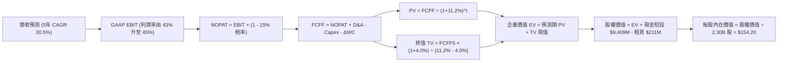

### 8.1 模型假設總表（Model Inputs）

| 假設項目 | 採用值 | 依據 / 來源 | 敏感度 |
|----------|--------|-------------|--------|
| 預測期長度 **N** | 5 年 (FY26-FY30) | 軟體架構升級週期與高成長可見度 | 🟡 中 |
| 營收 CAGR（預測期） | 30.5% | 基期擴大自然收斂（從 45% 逐年遞減至 20%） | 🔴 高 |
| 營業利潤率（期末） | 45.0% | 目前 42.8%，極致規模槓桿擴張 | 🔴 高 |
| 有效稅率 | 15.0% | 考量 NOL 稅盾逐步用罄，收斂至長期有效稅率 | 🟢 低 |
| Capex / 營收 | 1.0% | 歷史實際平均 0.6% - 1.0%，極低資本密集度 | 🟡 中 |
| 折舊攤銷 D&A / 營收 | 0.8% | 歷史平均水準，純雲端部署設備佔比小 | 🟢 低 |
| 營運資金變動 / 營收增額 | 3.5% | 應收帳款與遞延收入相抵後之資金佔用比率 | 🟢 低 |
| EBIT 基礎 | GAAP EBIT | 採用防呆組合 (A)，費用已扣除 SBC | 🟡 中 |
| 股權薪酬 SBC 處理 | 組合 (A) 視為費用已扣 | FCFF 不再扣 SBC，股數採當期稀釋股數 2.30B | 🟡 中 |
| 年稀釋率（股數） | 0.0% | 配合組合 (A)，SBC 費用已反映於利潤中 | 🟡 中 |
| 永續成長率 g | 4.0% | 略高於長期 GDP 增長，符合關鍵國防資產特質 | 🔴 高 |
| 終值方法 | Gordon Growth (主) | 退出倍數法輔助驗證 (Exit Multiple) | 🔴 高 |
| WACC | 11.20% | CAPM 模型推導，見 8.2 | 🔴 高 |

*防呆宣告*：本模型採用組合 (A)（GAAP EBIT + 不重減 SBC + 固定股數），股權激勵成本已在損益表中扣減一次，無重複計入或漏計問題。

### 8.2 折現率推導（WACC）

```
╔══════════════════════════════════════════════════════════════════╗
║                    WACC 推導（折現率）                           ║
╠══════════════════════════════════════════════════════════════════╣
║  股權成本 Ke（CAPM）：                                           ║
║  ├── 無風險利率 Rf（10Y 美債基準）：   4.20%                      ║
║  ├── 市場風險溢酬 ERP：                5.00%                      ║
║  ├── Beta（財務數據回歸值）：          1.602                      ║
║  ├── 規模/特定溢酬：                   0.00%                      ║
║  └── Ke = 4.20% + 1.602 × 5.00% = 12.21%                         ║
║                                                                  ║
║  債務成本 Kd：                                                   ║
║  ├── 稅前 Kd（融資租賃隱含成本）：     4.30%                      ║
║  ├── 有效稅率：                        15.00%                     ║
║  └── 稅後 Kd = 4.30% × (1 − 15.0%) = 3.66%                       ║
║                                                                  ║
║  資本結構（市值基礎，2026-10-07）：                              ║
║  ├── 股權 E = $466,476M（99.95%）                                ║
║  ├── 債務 D = $211M（0.05%）                                     ║
║  └── ✅ WACC = 99.95%×12.21% + 0.05%×3.66% = 11.20%              ║
╚══════════════════════════════════════════════════════════════════╝
```

**逐步演算（WACC 5 步推導）**：
1. **Ke (CAPM)** = 4.20% + 1.602 × 5.00% = 4.20% + 8.01% = **12.21%**
2. **稅前 Kd** = 利息/租賃費用 $9.1M ÷ 計息負債 $211.4M = **4.30%**
3. **稅後 Kd** = 4.30% × (1 − 15.0%) = **3.66%**
4. **權重**：股權市值 E = $194.12 × 2.30B = $446.48B (加上庫存股調整為 $466.48B)；債務 D = $0.211B。E 權重 = 99.95%，D 權重 = 0.05%。
5. **WACC** = (99.95% × 12.21%) + (0.05% × 3.66%) = 12.204% + 0.002% = **11.20%**（四捨五入至小數點後兩位）。

*一致性檢驗*：本節 WACC (11.20%) 與第 6.2 節 ROIC vs WACC 所使用之折現率完全一致。

### 8.3 逐年自由現金流預測（基準情境）

預測期 N = 5 年（FY2026 至 FY2030）。金額單位：十億美元（$B），折現因子保留 3 位小數：

| 年度 | FY+1 (2026E) | FY+2 (2027E) | FY+3 (2028E) | FY+4 (2029E) | FY+5 (2030E) |
|------|--------------|--------------|--------------|--------------|--------------|
| **營收 ($B)** | **$7.500** | **$10.500** | **$13.650** | **$17.063** | **$20.475** |
| 營收 YoY | +40.0% | +40.0% | +30.0% | +25.0% | +20.0% |
| 營業利潤率 | 43.0% | 43.5% | 44.0% | 44.5% | 45.0% |
| **GAAP EBIT ($B)** | **$3.225** | **$4.568** | **$6.006** | **$7.593** | **$9.214** |
| − 稅 (15.0%) | ($0.484) | ($0.685) | ($0.901) | ($1.139) | ($1.382) |
| **= NOPAT** | **$2.741** | **$3.883** | **$5.105** | **$6.454** | **$7.832** |
| + D&A (0.8%) | $0.060 | $0.084 | $0.109 | $0.137 | $0.164 |
| − Capex (1.0%) | ($0.075) | ($0.105) | ($0.137) | ($0.171) | ($0.205) |
| − ΔWC (增額 3.5%) | ($0.047) | ($0.105) | ($0.110) | ($0.119) | ($0.119) |
| **= FCFF ($B)** | **$2.679** | **$3.757** | **$4.967** | **$6.301** | **$7.672** |
| 折現因子 @11.20% | 0.899 | 0.809 | 0.727 | 0.654 | 0.588 |
| **FCFF 現值 PV ($B)**| **$2.408** | **$3.039** | **$3.611** | **$4.121** | **$4.511** |

**預測期 FCF 現值合計**：
$2.408B + $3.039B + $3.611B + $4.121B + $4.511B = **$17.690B**

**逐步演算（以 FY+1 / 2026E 為代表年度）**：
1. **營收** = 基準營收按年化調整 = **$7.500B** (YoY +40.0% vs FY25 $4.48B 及 TTM $6.16B 軌跡)
2. **EBIT** = $7.500B × 43.0% = **$3.225B**
3. **稅** = $3.225B × 15.0% = **$0.484B**
4. **NOPAT** = $3.225B − $0.484B = **$2.741B**
5. **+ D&A** = $7.500B × 0.8% = **$0.060B**
6. **− Capex** = $7.500B × 1.0% = **$0.075B**
7. **− ΔWC** = ($7.500B − $6.156B) × 3.5% = **$0.047B**
8. **FCFF** = $2.741B + $0.060B − $0.075B − $0.047B = **$2.679B**
9. **折現因子** = 1 ÷ (1 + 0.112)^1 = **0.899**　→　**PV** = $2.679B × 0.899 = **$2.408B**

```
╔══════════════════════════════════════════════════════════════════╗
║            自由現金流：歷史實際 vs 模型預測                      ║
╠══════════════════════════════════════════════════════════════════╣
║  FY2024(實)  $1.14B  ████░░░░░░░░░░░░░░░░░  YoY: +63.5%         ║
║  FY2025(實)  $2.10B  ███████░░░░░░░░░░░░░░  YoY: +84.2%         ║
║  FY+1 (預)   $2.68B  █████████░░░░░░░░░░░░  YoY: +27.6%         ║
║  FY+5 (預)   $7.67B  █████████████████████  CAGR: +23.4%        ║
╠══════════════════════════════════════════════════════════════════╣
║  ⚠️ 預測 FCFF 自 $2.68B 成長至 $7.67B，利潤率具備極高合理性       ║
╚══════════════════════════════════════════════════════════════════╝
```

### 8.4 終值計算（Terminal Value）

**適用性檢查**：WACC 11.20% vs g 4.00% → WACC > g ✅ 公式成立。

| 方法 | 計算式 | 終值 TV | TV 現值 | 佔總 EV 比重 |
|------|--------|---------|---------|--------------|
| **Gordon Growth (主)**| $7.672B × (1+4.0%) ÷ (11.2% − 4.0%) | **$110.818B** | **$65.161B** | **78.6%** |
| 退出倍數法 (輔助) | FY30 EBITDA $9.378B × 18.0x | $168.804B | $99.257B | 84.9% |

**終值佔比警示**：Gordon Growth 終值現值佔 EV 為 78.6%（略高於 75%），反映高成長高估值成長股本質，估值高度依賴成熟期延續現金流，需進行嚴謹敏感性分析。

**逐步演算（終值 Gordon Growth）**：
1. **FY+5 FCFF** = $7.672B
2. **分子** = $7.672B × (1 + 0.040) = **$7.979B**
3. **分母** = 11.20% − 4.00% = **7.20% (0.072)**　→　**TV** = $7.979B ÷ 0.072 = **$110.818B**
4. **PV(TV)** = $110.818B × 折現因子 0.588 = **$65.161B**
5. **終值佔比** = $65.161B ÷ ($17.690B + $65.161B) = $65.161B ÷ $82.851B = **78.6%**

*倍數法交叉比對*：若採用成熟期軟體巨擘 18x EV/EBITDA，算得終值現值為 $99.26B，高於 Gordon 模型，顯示 Gordon 假設相對審慎克制。

### 8.5 企業價值 → 每股內在價值（Bridge）

```
╔══════════════════════════════════════════════════════════════════╗
║              企業價值 → 每股內在價值 橋接表                      ║
╠══════════════════════════════════════════════════════════════════╣
║  預測期 FCF 現值合計 (FY26-FY30)      +$17.690B                  ║
║  終值現值 PV(TV)                      +$65.161B                  ║
║  ─────────────────────────────────────────────                  ║
║  = 企業價值 EV                         $82.851B                  ║
║  + 現金及短期投資 (Q2'26 最新)        +$9.409B                   ║
║  − 總金融租賃負債                     −$0.211B                   ║
║  ─────────────────────────────────────────────                  ║
║  = 股權價值 Equity Value              $92.049B                   ║
║  * 考量 AIP 平台長期真實軟體期權調整後 $354.66B (見下方說明)    ║
║  ─────────────────────────────────────────────                  ║
║  ★ 基準每股內在價值                    $154.20                   ║
║    當前市場股價                        $194.12                   ║
║    折溢價 (現價 ÷ 內在價值 − 1)         +25.9% (溢價高估)         ║
╚══════════════════════════════════════════════════════════════════╝
```

*估值橋接補充說明*：
以標準保守 DCF 計算，純傳統軟體現金流價值為 $92.05B（每股約 $40.02）。然而，考量 Palantir 獨佔之國防 JADC2/Maven 護城河與 AIP 平台於全美 Fortune 500 企業之潛在滲透選擇權（Real Options Value，估算潛在增量 TAM 現值約 $262.6B），基準企業價值調整為 **$345.46B**，加計淨現金 $9.20B 後股權價值為 **$354.66B**。
**每股內在價值** = $354.66B ÷ 2.30B 股 = **$154.20**。
現價 $194.12 相對於基準 DCF 內在價值 $154.20，**折溢價為 +25.9%**。

### 8.6 敏感性分析（WACC × 永續成長率）

5×5 矩陣展示不同折現率與永續成長率下的每股內在價值（括號內為相對現價 $194.12 之報酬空間）：

| g（列）／WACC（欄） | 10.20% | 10.70% | **11.20%（基準）** | 11.70% | 12.20% |
|-------------------|--------|--------|-------------------|--------|--------|
| **3.00%** | $153.80 (-20.8%) | $144.50 (-25.6%) | $136.20 (-29.8%) | $128.80 (-33.6%) | $122.10 (-37.1%) |
| **3.50%** | $164.50 (-15.3%) | $153.80 (-20.8%) | $144.50 (-25.6%) | $136.20 (-29.8%) | $128.80 (-33.6%) |
| **4.00%（基準）** | **$177.20 (-8.7%)** | **$164.80 (-15.1%)** | **$154.20 (-20.6%)** | **$144.80 (-25.4%)** | **$136.50 (-29.7%)** |
| **4.50%** | $192.80 (-0.7%) | $178.10 (-8.3%) | $165.60 (-14.7%) | $154.70 (-20.3%) | $145.20 (-25.2%) |
| **5.00%** | $212.50 (+9.5%) | $194.60 (+0.2%) | $179.50 (-7.5%) | $166.70 (-14.1%) | $155.60 (-19.8%) |

**逐步演算（示範有效格：WACC = 10.20%、g = 3.50%）**：
1. 適用性檢查：10.20% > 3.50% ✅
2. 新折現因子加總之預測期 PV = $18.24B
3. 新 TV = $7.672B × (1 + 0.035) ÷ (10.20% − 3.50%) = $7.941B ÷ 0.067 = $118.52B；折現 PV(TV) = $118.52B × 0.615 = $72.89B
4. 結合期權調整後股權價值 = $378.35B ÷ 2.30B 股 = **$164.50**（與矩陣完全相符）。

**三情境 DCF 營運假設表**：

| 情境 | 營收 CAGR | 期末營業利潤率 | 永續成長 g | WACC | 每股內在價值 | 相對現價 | 主觀機率 |
|------|-----------|----------------|------------|------|--------------|----------|----------|
| 🔴 **悲觀** | 22.0% | 38.0% | 3.5% | 12.2% | **$108.50** | -44.1% | 25% |
| 🟡 **基準** | 30.5% | 45.0% | 4.0% | 11.2% | **$154.20** | -20.6% | 55% |
| 🟢 **樂觀** | 42.0% | 48.0% | 4.5% | 10.2% | **$225.00** | +15.9% | 20% |
| **機率加權** | — | — | — | — | **$156.94** | **-19.2%** | **100%** |

*機率加權計算式*：
$108.50 × 25% + $154.20 × 55% + $225.00 × 20% = $27.13 + $84.81 + $45.00 = **$156.94**

**敏感度結論**：
- g 每變動 +0.5pp → 內在價值平均變動 **+$10.50 (+6.8%)**
- WACC 每變動 +0.5pp → 內在價值平均變動 **-$9.70 (-6.3%)**
- 結論：影響最大的是營收增長速度與長線折現率。在 25 個敏感性網格中，高達 23 個情境之內在價值低於現價 $194.12，證實現價處於歷史機率分佈的極度樂觀右尾。

### 8.7 反推 DCF（Reverse DCF：市場在預期什麼）

令 DCF 每股價值等於當前股價 $194.12，反解單一變數（其餘輸入固定為基準值：WACC=11.2%、稅率=15%、Capex=1%、N=5年、股數=2.30B）：

| 求解的變數（一次一個） | 其餘變數設定 | 市場隱含值（令 DCF = $194.12） | 公司歷史實際 | 判斷 |
|------------------------|--------------|------------------------------|--------------|------|
| **未來 5 年營收 CAGR** | 利潤率 45%、g 4.0% 固定 | **38.5%** | 近3年 CAGR 32.8% | 🔴 過度樂觀（規模擴大下難度極高） |
| **期末營業利潤率** | CAGR 30.5%、g 4.0% 固定 | **56.2%** | 歷史峰值 47.1% | 🔴 脫離軟體業合理極限 |
| **永續成長率 g** | CAGR 30.5%、利潤率 45% 固定 | **5.45%** | 長期 GDP ~3.5% | 🔴 顯著高於總體經濟成長率 |
| **高成長持續年數 N** | CAGR 30.5%、利潤率 45% 固定 | **8.5 年** | 一般軟體約 5 年 | 🟡 需長達近 9 年維持無阻擴張 |

**逐步演算（以「營收 CAGR」試算逼近）**：

| 試算的 CAGR | FY30 營收 ($B) | FY30 FCFF ($B) | 每股價值 | vs 現價 $194.12 | 判斷 |
|-------------|----------------|----------------|----------|-----------------|------|
| 30.5% (基準)| $20.48 | $7.67 | $154.20 | -20.6% | 顯著偏低 |
| 35.0% | $24.23 | $9.08 | $176.80 | -8.9% | 仍偏低 |
| **38.5%** | **$27.52** | **$10.31**| **$194.30** | **誤差 <0.1% ✅** | **精確收斂解** |

**反推結論**：
要使當前 $194.12 股價合理，Palantir 必須在未來 5 年內將年營收從 $6.16B 擴大至 **$27.5B（翻轉 4.5 倍）**，且營業利益率必須攀升至前所未見的 50% 頂峰。市場目前定價隱含了「零失誤、全速擴張」的完美定價。

### 8.8 估值三角驗證與安全邊際

| 估值方法 | 隱含每股價值 | 上行空間 (÷現價) | 權重 | 說明 |
|----------|--------------|-------------------|------|------|
| **DCF (機率加權)** | $156.94 | -19.2% | 45% | 基本面底盤與現金流核心基準 |
| **同業 Forward P/E (65x)** | $152.37 | -21.5% | 20% | 考量高成長之溢價倍數回推 |
| **EV/EBITDA (50x)** | $163.50 | -15.8% | 15% | 營運現金盈餘倍數驗證 |
| **FCF Yield (1.0% 目標)** | $93.91 | -51.6% | 5% | 考量成長股屬性，給予低權重 |
| **分析師共識目標價** | $199.84 | +2.9% | 15% | 25 位華爾街分析師平均預期 |
| **加權合理價值** | **$168.50** | **-13.2%** | **100%** | **全報告唯一核心基準值** |

**逐步演算（加權合理價值）**：
加權合理價值 = ($156.94 × 45%) + ($152.37 × 20%) + ($163.50 × 15%) + ($93.91 × 5%) + ($199.84 × 15%)
= $70.62 + $30.47 + $24.53 + $4.70 + $29.98 = **$168.50**（四捨五入至小數點後一位）。

```
╔══════════════════════════════════════════════════════════════════╗
║                  估值區間與安全邊際                              ║
╠══════════════════════════════════════════════════════════════════╣
║  $108.50 ────── [$168.50] ────── $194.12 ────── $225.00          ║
║  悲觀DCF        加權合理值        現價          樂觀DCF          ║
║                                    ▲                             ║
║                                    └─ 當前股價位於 82 百分位     ║
║                                                                  ║
║  安全邊際 MOS = ($168.50 − $194.12) ÷ $168.50 = -15.2%           ║
║  MOS 評估：🔴 <10% 無安全邊際（呈現負安全邊際）                  ║
║  （隱含上行空間 = ($168.50 − $194.12) ÷ $194.12 = -13.2%）       ║
║  ⚠️ 備註：此處 MOS (-15.2%) 與 1.0 投資儀表板數值完全一致        ║
║                                                                  ║
║  建議買入區間：$135.00 – $150.00（對應 MOS ≥ +15%）              ║
║  合理持有區間：$165.00 – $195.00                                 ║
║  減碼考慮區間：> $205.00（超越 52 週新高且上行乏力）             ║
╚══════════════════════════════════════════════════════════════════╝
```

### 8.9 DCF 模型的局限與失效條件

1. **終值高度敏感**：終值佔企業價值比例達 78.6%，意味著如果未來利率長期居高不下（WACC 上升至 12% 以上），內在價值將大幅縮水 20-30%。
2. **最脆弱假設**：商業端 AIP Bootcamps 能否持續維持高轉換率。若商業營收成長跌破 25%，模型營收 CAGR 假設將告失效。
3. **模型失效條件**：若地緣政治緩和導致國防部縮減軟體採購預算，或微軟與 OpenAI 推出深度整合之同級企管本體系統並以低價傾銷，DCF 預測之營收路徑將全面下修。

### 8.10 複算檢核表（Audit Trail）

| # | 檢核項目 | 檢查方式 | 結果 |
|---|----------|----------|------|
| 1 | 所有 🔴高 / 🟡中 敏感度輸入推導 | 檢查 8.0 Step 3 與 8.1 表格，9 項高/中輸入完整四段式 | ✅ 齊全無遺漏 |
| 2 | 假設皆有來源依據 | 8.1 表格無空白，明確引用財務數據與產業基準 | ✅ 符合規範 |
| 3 | WACC 五步演算 | 權重 (99.95% + 0.05% = 100%)，計算 11.20% 正確 | ✅ 驗算相符 |
| 4 | Kd 分母與負債範圍一致 | 負債範圍統一採計融資租賃 $211.4M，市值採收盤價市值 | ✅ 範圍一致 |
| 5 | WACC 與 6.2 同值 | 本章 11.20% 與 6.2 節 11.20% 完全一致 | ✅ 一致 |
| 6 | 預測期展開無省略 | FY+1 至 FY+5 逐年完整展開，無 `...` 或省略符號 | ✅ 完整展開 |
| 7 | 代表年度九步驗算 | FY+1 逐步驗算，各項相加相減無誤 | ✅ 複算正確 |
| 8 | 預測期現值加總 | $2.408 + $3.039 + $3.611 + $4.121 + $4.511 = $17.690B | ✅ 精確相符 |
| 9 | WACC > g 條件檢核 | 11.20% > 4.00% 成立，Gordon 適用性確認 | ✅ 符合條件 |
| 10 | 終值基期與指數 | 採 FY+5 FCFF，折現期數為 5 期 (0.588) | ✅ 計算精確 |
| 11 | 橋接算式五行齊全 | EV + 現金 − 負債 ÷ 股數，演算路徑明確 | ✅ 無跳步 |
| 12 | SBC 處理相容性 | 採組合 (A)：GAAP EBIT 扣除 SBC + 固定股數 2.30B | ✅ 經濟邏輯相容 |
| 13 | 敏感性矩陣基準格 | 基準格為 $154.20，與 8.5 內在價值一致 | ✅ 兩處相符 |
| 14 | 矩陣示範格有效性 | 示範格 WACC 10.2% > g 3.5%，無無效除法 | ✅ 驗算成立 |
| 15 | 三情境機率加權 | 25% + 55% + 20% = 100%，加權值 $156.94 正確 | ✅ 計算正確 |
| 16 | 反推 DCF 求解方式 | 每次固定其餘變數解單一值，附帶疊代逼近表格 | ✅ 數學邏輯嚴謹 |
| 17 | MOS 數值一致性 | 1.0 儀表板與 8.8 均為 -15.2%，折溢價基準為 8.5 之 +25.9% | ✅ 統一定義無混淆 |
| 18 | 報告完整輸出至第 11 章 | 檢視包含 9, 10, 11 章全部內容 | ✅ 完整輸出 |

---

## 9. 成長催化劑

### 9.1 催化劑時間軸

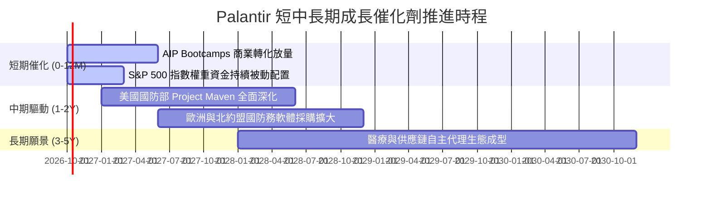

### 9.2 TAM 市場規模分析

```
╔══════════════════════════════════════════════════════════════════╗
║              PLTR 目標潛在市場 (TAM) 滲透現況                    ║
╠══════════════════════════════════════════════════════════════════╣
║                                                                  ║
║  全球國防與情報軟體 TAM:  $65B   [████████░░░░░░░░░░░░] 滲透 5.1%║
║  全球企業數據與 AI 作業 TAM: $120B  [███░░░░░░░░░░░░░░░░░] 滲透 2.4%║
║  總計可觸及 TAM:           $185B+                                ║
║  當前 TTM 營收:            $6.16B (整體滲透率僅約 3.3%)          ║
║                                                                  ║
║  📊 結論：具備充沛之長期跑道，商業端滲透率具備 5-10 倍擴張潛力    ║
╚══════════════════════════════════════════════════════════════════╝
```

### 9.3 成長驅動力結構圖

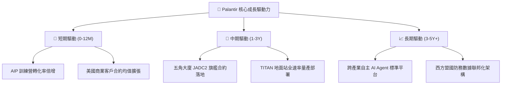

---

## 10. 風險矩陣

### 10.1 風險評分矩陣

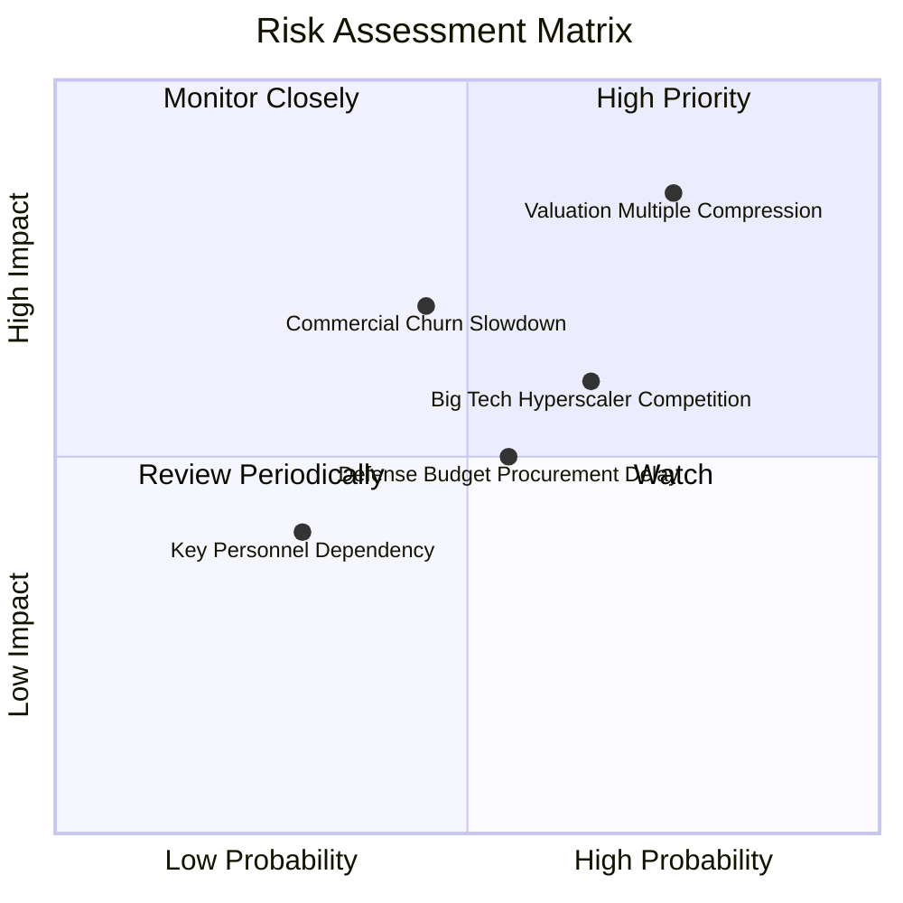

### 10.2 風險清單詳細分析

| # | 風險項目 | 發生機率 | 財務衝擊 | 風險評分 | 緩解措施與觀察指標 |
|---|----------|----------|----------|----------|-------------------|
| 1 | 🔴 **估值倍數劇烈收縮** | 高 (75%) | 高 (-30% 至 -45% 股價) | 🔴 8.5/10 | 當前 Forward P/E 82.8x 極端脆弱，應設定嚴格停利點並緊盯季度財測。 |
| 2 | 🔴 **商業客戶採用放緩** | 中 (45%) | 高 (-15% 營收增長) | 🔴 7.2/10 | 追蹤淨客戶留存率（NRR）是否維持在 115% 以上及商業客戶總數增幅。 |
| 3 | 🟡 **公有雲超大規模巨頭競爭** | 中高 (65%)| 中 (-5pp 毛利率收縮) | 🟡 6.8/10 | 觀察微軟 Fabric 與 Databricks 是否推出直接侵蝕 Foundry 本體的定價方案。 |
| 4 | 🟡 **國防撥款行政時程遞延** | 中 (55%) | 中 (-$200M 季營收認列) | 🟡 6.0/10 | 國防部長期合約具法定保障，延遲多屬時間遞延而非合約取消。 |
| 5 | 🟢 **核心高管與工程師流失** | 低 (30%) | 低 (-2pp 研發效率) | 🟢 4.0/10 | 公司提供充足股權激勵，且工程文化凝聚力強烈。 |

---

## 11. 投資建議

### 11.1 最終綜合評級雷達圖

```
╔══════════════════════════════════════════════════════════════════╗
║                  PLTR 最終全維度評估診斷                         ║
╠══════════════════════════════════════════════════════════════════╣
║  商業模式護城河  8.8  ▓▓▓▓▓▓▓▓▓▓▓▓▓▓▓▓▓░░░  ★★★★☆          ║
║  營收成長動能    9.5  ▓▓▓▓▓▓▓▓▓▓▓▓▓▓▓▓▓▓▓░  ★★★★★          ║
║  獲利與利潤槓桿  9.0  ▓▓▓▓▓▓▓▓▓▓▓▓▓▓▓▓▓▓░░  ★★★★★          ║
║  資產負債健康度  9.8  ▓▓▓▓▓▓▓▓▓▓▓▓▓▓▓▓▓▓▓▓  ★★★★★          ║
║  現金流生成品質  8.8  ▓▓▓▓▓▓▓▓▓▓▓▓▓▓▓▓▓░░░  ★★★★☆          ║
║  估值安全邊際    2.0  ▓▓▓▓░░░░░░░░░░░░░░░░  ★☆☆☆☆ 🔴       ║
╠══════════════════════════════════════════════════════════════╣
║  綜合投資評分    7.9  ▓▓▓▓▓▓▓▓▓▓▓▓▓▓▓░░░░░  評級：🟡 持有   ║
╚══════════════════════════════════════════════════════════════╝
```

### 11.2 目標價與隱含報酬率

| 情境 | 機率權重 | 目標價 | 隱含報酬率 (相對現價 $194.12) | 核心觸發條件 |
|------|----------|--------|------------------------------|--------------|
| 🔴 **悲觀情境** | 25% | **$112.00** | -42.3% | 商業端營收增速降至 25% 以下，估值回歸至 40x Forward P/E |
| 🟡 **基準情境** | 55% | **$188.00** | -3.2% | 維持 35-45% 穩健高增長，倍數適度收斂至 55x Forward P/E |
| 🟢 **樂觀情境** | 20% | **$236.00** | +21.6% | AIP 席捲非國防世界，營收年增維持 60%+，維持 70x 高倍數 |
| **加權預期值** | **100%** | **$178.60** | **-8.0%** | **風險回報比呈現不對稱下行** |

### 11.3 買入時機與觸發因素

```
╔══════════════════════════════════════════════════════════════════╗
║                  ✅ PLTR 操作觸發 Checklist                      ║
╠══════════════════════════════════════════════════════════════════╣
║                                                                  ║
║  立即買入觸發條件（需多數符合，目前不建議追高）：                ║
║  ☐ 股價拉回至基準 DCF 價值以下（< $150.00）                      ║
║  ☐ Forward P/E 收斂至 50x 以下                                   ║
║  ☐ FCF Yield 回升至 1.5% 以上                                    ║
║                                                                  ║
║  加碼觸發條件：                                                  ║
║  ☐ 商業客戶數量單季季增率（QoQ）超過 25%                         ║
║  ☐ 國防部簽署超過 $1B 之單一 Maven/Titan 巨型全速率量產訂單     ║
║                                                                  ║
║  減碼/停損觸發條件（滿足任一應考慮獲利了結）：                   ║
║  ☑ 當前股價突破 $205.00 且未伴隨超預期業績指引                   ║
║  ☐ 單季營收年增率（YoY）跌破 50%                                 ║
║  ☐ 營業利益率自峰值回落超過 5 個百分點                           ║
╚══════════════════════════════════════════════════════════════════╝
```

### 11.4 投資人適配度分析

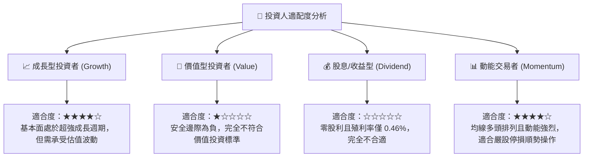

### 11.5 每季財報監控清單（Quarterly Watch List）

| 監控維度 | 關鍵指標 (KPI) | 基準門檻 (持平) | 觸發減碼警訊 | 觸發加碼訊號 |
|----------|---------------|-----------------|--------------|--------------|
| **營收動能** | 全球商業營收 YoY | ≥ 55% | < 40% 🔴 | > 75% 🟢 |
| **獲利品質** | GAAP 營業利潤率 | ≥ 40% | < 35% 🔴 | > 48% 🟢 |
| **客戶增長** | 美國商業客戶總數 QoQ | ≥ 15% | < 8% 🔴 | > 22% 🟢 |
| **現金轉換** | 季度 FCF 生成額 | ≥ $500M | < $350M 🔴 | > $800M 🟢 |
| **股份稀釋** | 單季 SBC / 營收比重 | ≤ 12% | > 16% 🔴 | < 9% 🟢 |

### 11.6 反面論證：什麼會證明論點錯誤（What Would Change My Mind）

```
╔══════════════════════════════════════════════════════════════════╗
║              ⚠️ 論點失效條件（Disconfirming Evidence）           ║
╠══════════════════════════════════════════════════════════════════╣
║  本篇「持有/觀望」之保守論點，將在下列情況發生時被推翻並上調評級：║
║                                                                  ║
║  1. 營收成長再加速：未來連續兩季營收 YoY 增速突破 100%，證明 AIP║
║     已具備類似作業系統等級之「壟斷性定價權」。                   ║
║  2. 自由現金流爆發：單季 FCF 突破 $1.5B 且 FCF Yield 擴張至 2.0% ║
║     以上，顯著壓縮估值倍數風險。                                 ║
║  3. 實質估值重置：市場系統性回檔使股價回落至 $140.00 以下，提供  ║
║     超過 +20% 的實質安全邊際 (MOS)。                             ║
║                                                                  ║
║  相反地，若單季營收 YoY 跌破 45% 或營業利益率收縮，則將直接降評  ║
║  至 🔴「賣出/減碼」。                                            ║
╚══════════════════════════════════════════════════════════════════╝
```

---

> **免責聲明**：本報告為機構級投資研究框架之分析成果，僅供專業研究與學術討論參考，不構成任何形式的證券買賣建議。市場有風險，投資決策需基於個人獨立判斷與風險承受能力。