# PLTR 基本面深度分析報告
> **報告日期**：2026-10-09 ｜ **語言**：繁體中文 ｜ **數據來源**：Yahoo Finance, Finviz, StockAnalysis, Roic.ai ｜ **分析師**：CFA 級機構研究

---

## 目錄

| # | 章節 | 核心結論 |
|---|------|----------|
| 1 | 執行摘要 | 評級：🟡 持有（偏觀望）；基準目標價 $182.50；安全邊際 MOS 為 -24.1%（現價高估） |
| 2 | 公司概覽與商業模式 | AIP 與 Foundry 構築深厚本體論本體（Ontology）壁壘，整體護城河評分 8.8/10 |
| 3 | 損益表深度分析 | 營業利益率擴張至 47.1%，SBC/營收降至 11.1%，營運槓桿進入爆發期 |
| 4 | 資產負債表分析 | 淨現金達 $9.20B，流動比率 7.23x，無實質償債壓力，資產結構極度穩健 |
| 5 | 現金流量深度分析 | TTM FCF 達 $2.16B，現金轉換率持續高於 70%，輕資產營運特徵顯著 |
| 6 | 獲利能力與資本效率 | 投入資本回報率 ROIC 23.4% 遠超 WACC 9.4%，經濟增加值 EVA 擴張至 +14.0pp |
| 7 | 相對估值分析 | EV/Sales 74.3x、Forward P/E 89.2x 處歷史高位，相較軟體同業享有極高 AI 溢價 |
| 8 | DCF 內在價值評估 | 基準內在價值 $146.47（現價溢價 +42.7%），加權合理價值 $168.42（MOS -24.1%） |
| 9 | 成長催化劑 | 美國商業 AIP 規模化擴散、國防 JADC2 訂單落地驅動中期 CAGR 達 35% |
| 10 | 風險矩陣 | 估值倍數收縮與商業化放緩為核心威脅，整體風險評分 6.8/10 |
| 11 | 投資建議 | 買入區間 $120–$140，當前建議獲利了結或區間持有，等待估值回調 |

---

## 1. 執行摘要

本報告基於 Palantir Technologies（NYSE: PLTR）截至 2026 年 6 月之最新 TTM 財務數據進行全方位基本面剖析。數據顯示，受企業級人工智慧平台（AIP）加速落地帶動，PLTR 最新季度營收達 $1.94B（YoY +92.8%），營業利益率提升至 47.1%，TTM 淨現金達 $9.20B，ROIC 擴張至 23.4%，顯著高於 9.4% 的加權平均資金成本（WACC），顯示公司具備強大的經濟價值創造能力。然而，當前市場交易價格 $209.05 對應 Forward P/E 89.2x、EV/Sales 74.3x，已高度透支未來五年的超常規成長預期。本研究經 DCF 基準模型推導出每股內在價值為 $146.47（溢價 +42.7%），結合相對估值後之加權合理價值為 $168.42，安全邊際 MOS 為 -24.1%（無安全邊際）。基於「證據先於結論」原則，給予 PLTR **🟡 持有（Hold）** 評級。

### 1.0 一頁式投資儀表板（Portfolio Manager 30 秒速讀）

| 項目 | 內容 |
|------|------|
| **投資論點（3 句）** | ① AIP 驅動商業客戶指數型擴張，推動 TTM 營收達 $6.16B，最新季度 YoY 躍升至 +92.8%。<br/>② 獲利結構劇烈優化，營業利益率自 2022 年 -8.5% 躍升至最新 47.1%，SBC 稀釋顯著收斂。<br/>③ 估值透支未來成長，EV/Sales 達 74.3x 且市場隱含未來 5 年營收需達 43% CAGR 方能支撐現價。 |
| **護城河評分** | 8.8/10（本體論本體生態系與政府國防極高轉換成本） |
| **管理層/資本配置評分** | 8.5/10（維持零長期計息借款，保留現金佈局未來併購） |
| **財務健康** | 🟢 極度健康（淨現金 $9.20B，流動比率 7.23x，無財務槓桿風險） |
| **ROIC vs WACC** | 23.4% vs 9.4%（強力創造價值，EVA 為 +14.0pp） |
| **FCF 趨勢** | 擴張向上，TTM FCF 達 $2.16B；最新 FCF Yield 為 0.43% |
| **估值** | Forward P/E 89.2x ｜ EV/EBITDA 171.8x ｜ FCF Yield 0.43% |
| **DCF 內在價值（基準）** | $146.47 ｜ 現價溢價 +42.7%（基準來自第 8.5 節） |
| **安全邊際（MOS）** | -24.1%＝($168.42 − $209.05) ÷ $168.42（基準來自 8.8 節加權值）｜ 🔴 <10% 無安全邊際 |
| **預期報酬（基準情境 12M）** | -12.7%（對應目標價 $182.50） |
| **關鍵風險（前二）** | ① 估值倍數均值回歸；② 政府國防預算採購週期推遲 |
| **評級 + 信心度** | 🟡 持有（中性觀望） ｜ 信心：中高 |

### 1.1 核心評分儀表板

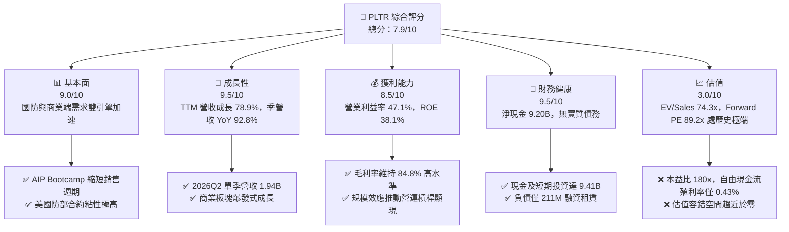

### 1.2 評分進度條視覺化

```
╔══════════════════════════════════════════════════════════════╗
║              PLTR 多維度評分儀表板 (1-10分)                  ║
╠══════════════════════════════════════════════════════════════╣
║ 基本面強度  9.0 ▓▓▓▓▓▓▓▓▓▓▓▓▓▓▓▓▓▓░░  ★★★★★           ║
║ 成長動能    9.5 ▓▓▓▓▓▓▓▓▓▓▓▓▓▓▓▓▓▓▓░  ★★★★★           ║
║ 獲利品質    8.5 ▓▓▓▓▓▓▓▓▓▓▓▓▓▓▓▓▓░░░  ★★★★☆           ║
║ 財務健康    9.5 ▓▓▓▓▓▓▓▓▓▓▓▓▓▓▓▓▓▓▓░  ★★★★★           ║
║ 估值合理性  3.0 ▓▓▓▓▓▓░░░░░░░░░░░░░░  ★☆☆☆☆           ║
║ 護城河深度  8.8 ▓▓▓▓▓▓▓▓▓▓▓▓▓▓▓▓▓░░░  ★★★★☆           ║
║ 管理層執行  8.5 ▓▓▓▓▓▓▓▓▓▓▓▓▓▓▓▓▓░░░  ★★★★☆           ║
║ 技術創新力  9.2 ▓▓▓▓▓▓▓▓▓▓▓▓▓▓▓▓▓▓░░  ★★★★★           ║
╠══════════════════════════════════════════════════════════════╣
║ 綜合總分    7.9 ▓▓▓▓▓▓▓▓▓▓▓▓▓▓▓░░░░░  🏆 營運優異但估值昂貴 ║
╚══════════════════════════════════════════════════════════════╝
```

### 1.3 五大投資論點 + 三大核心風險

| 類型 | 項目 | 具體依據 | 信心度 |
|------|------|----------|--------|
| 🟢 **論點①** | **AIP 引爆商業需求** | 最新單季營收達 $1.94B（YoY +92.8%），商業客戶藉 Bootcamp 策略快速轉化。 | 🟢 極高 |
| 🟢 **論點②** | **極致的營運槓桿** | 營業利益率達 47.1%，營業利益由 2024 年 $310M 激增至 TTM $2.64B。 | 🟢 極高 |
| 🟢 **論點③** | **獲利品質顯著淨化** | SBC 佔營收比例由 2021 年的 36.6% 降至最新 TTM 的 13.5%，股權稀釋大幅收斂。 | 🟢 高 |
| 🟢 **論點④** | **資產負債表固若金湯** | 現金與短期投資達 $9.41B，淨現金 $9.20B，利息收入穩定增強非營運收益。 | 🟢 極高 |
| 🟢 **論點⑤** | **國防生態深厚鎖定** | Gotham 與 Maven 深度嵌入美國及盟國軍事行動體系，轉換成本近乎不可逾越。 | 🟢 高 |
| 🟡 **風險①** | **極端估值容錯率低** | EV/Sales 達 74.3x、P/E 180.2x，任何成長放緩均將引發強烈殺估值。 | 🔴 高衝擊 |
| 🟡 **風險②** | **SBC 現金成本隱患** | TTM SBC 仍高達 $835M，若股價修正，需發行更多股票留才，稀釋可能再度擴大。 | 🟡 中度 |
| 🔴 **風險③** | **政府合約集中與推遲** | 政府合約決策週期拉長或單一大單交付延遲，將直接衝擊季度成長預期。 | 🟡 中度 |

### 1.4 快速統計卡片

| 指標 | 公司實際值 | 行業均值 | S&P 500 均值 | 狀態 |
|------|-------------|----------|--------------|------|
| 收入 YoY 成長 | **92.8%** | ~14.5% | ~5.2% | 🟢 遠超基準 |
| 毛利率 | **84.8%** | ~71.0% | ~46.0% | 🟢 軟體頂尖 |
| 營業利益率 | **47.1%** | ~18.5% | ~12.5% | 🟢 卓越擴張 |
| 淨利率 | **49.0%** | ~12.0% | ~11.5% | 🟢 包含利息淨益 |
| ROE | **38.1%** | ~15.2% | ~18.0% | 🟢 資本效率極高 |
| Forward P/E | **89.2x** | ~28.5x | ~21.5x | 🔴 顯著高估 |
| Net Debt / EBITDA | **-6.39x** | ~0.50x | ~1.50x | 🟢 大量淨現金 |

### 1.5 投資結論

```
╔══════════════════════════════════════════════════════════════════╗
║                    📊 投資結論摘要                               ║
╠══════════════════════════════════════════════════════════════════╣
║  評級：🟡 持有 / 觀望（Hold）                                   ║
║  當前股價：$209.05                                               ║
║  DCF 內在價值（基準）：$146.47（現價溢價 +42.7%）                ║
║  安全邊際 MOS：-24.1%（＝($168.42 − $209.05) ÷ $168.42）        ║
║  目標價區間：                                                    ║
║    🔴 悲觀情境：$112.50（-46.2%）                                ║
║    🟡 基準情境：$182.50（-12.7%） ← 12個月主要目標              ║
║    🟢 樂觀情境：$245.00（+17.2%）                                ║
║  投資評分：7.9 / 10                                              ║
║  適合投資人：已建倉之長線投資者（獲利保護），未建倉者靜待回調    ║
╚══════════════════════════════════════════════════════════════════╝
```

---

## 2. 公司概覽與商業模式

### 2.1 業務結構與收入來源

Palantir 核心在於提供企業與政府將分散資料與大型語言模型（LLM）整合於營運決策鏈的軟體基礎設施。其平台核心為「本體論（Ontology）」，能夠將企業結構化與非結構化數據轉化為數位分身，並驅動業務邏輯。

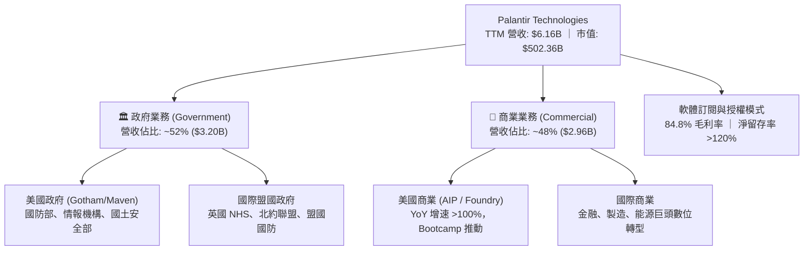

### 2.2 市場份額

在企業級人工智慧決策與大數據營運平台領域，Palantir 佔據領導地位，與超大型雲端供應商及傳統企業軟體巨頭競合。

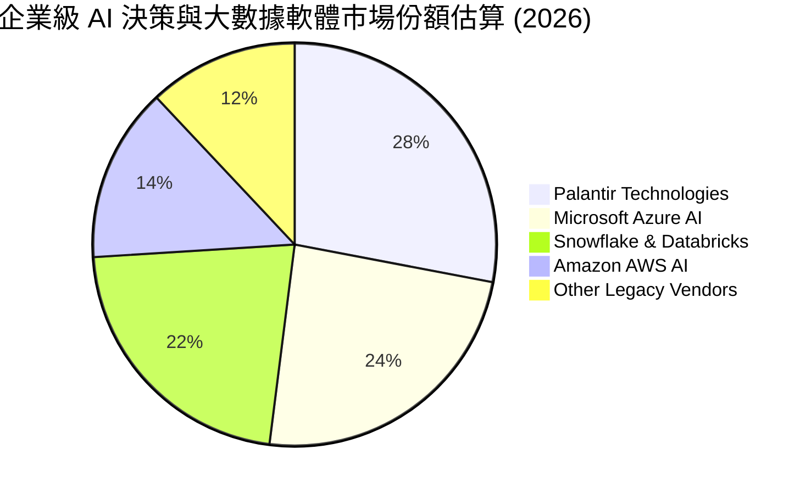

### 2.3 競爭護城河分析

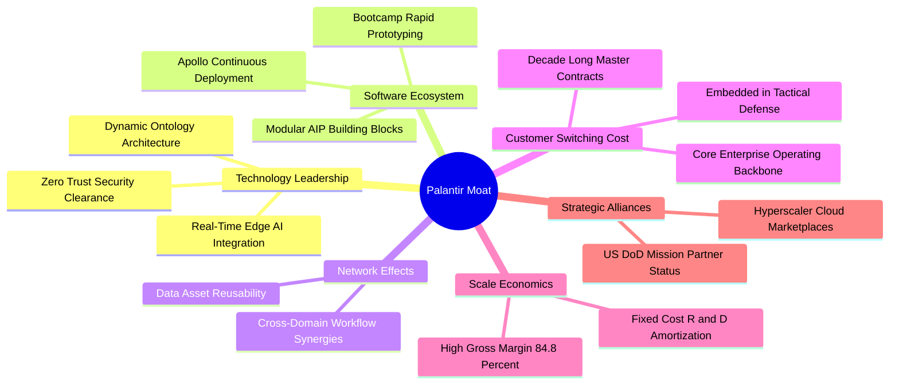

### 2.4 護城河強度評分

```
╔══════════════════════════════════════════════════════════════╗
║                  PLTR 護城河強度評分                         ║
╠══════════════════════════════════════════════════════════════╣
║ 高轉換成本     9.8/10 ▓▓▓▓▓▓▓▓▓▓▓▓▓▓▓▓▓▓▓█  🏆 國防營運深層綁定 ║
║ 本體論技術壁壘 9.2/10 ▓▓▓▓▓▓▓▓▓▓▓▓▓▓▓▓▓▓░░  🟢 數據數位分身領先 ║
║ 安全認證壁壘   9.7/10 ▓▓▓▓▓▓▓▓▓▓▓▓▓▓▓▓▓▓▓░  🏆 IL6 最高防護級別 ║
║ 網路生態效益   7.5/10 ▓▓▓▓▓▓▓▓▓▓▓▓▓▓█░░░░░  🟡 企業間資料孤島   ║
║ 規模經濟優勢   8.0/10 ▓▓▓▓▓▓▓▓▓▓▓▓▓▓▓▓░░░░  🟢 毛利率超 84%     ║
╠══════════════════════════════════════════════════════════════╣
║ 綜合護城河     8.8/10 ▓▓▓▓▓▓▓▓▓▓▓▓▓▓▓▓▓░░░  🏆 深厚且難以跨越   ║
╚══════════════════════════════════════════════════════════════╝
```

---

## 3. 損益表深度分析

### 3.1 年度收入成長趨勢（近4年）

```
╔══════════════════════════════════════════════════════════════════╗
║              PLTR 年度收入趨勢（FY2022-FY2025及TTM）          ║
╠══════════════════════════════════════════════════════════════════╣
║                                                                  ║
║  FY2022  $1.91B   █████░░░░░░░░░░░░░░░░░░░  YoY: +23.6% 🟢     ║
║  FY2023  $2.23B   ██████░░░░░░░░░░░░░░░░░░  YoY: +16.7% 🟢     ║
║  FY2024  $2.87B   ████████░░░░░░░░░░░░░░░░  YoY: +28.8% 🟢     ║
║  FY2025  $4.48B   ████████████░░░░░░░░░░░░  YoY: +56.2% 🟢     ║
║  TTM     $6.16B   █████████████████░░░░░░░  YoY: +78.9% 🟢     ║
║                   |      |      |      |                         ║
║                   0     $2B    $4B    $6B                        ║
║                                                                  ║
║  📊 3年年均複合成長率 (CAGR FY22-FY25)：+32.8%                   ║
╚══════════════════════════════════════════════════════════════════╝
```

### 3.2 季度收入趨勢分析

| 季度 | 營收 ($M) | YoY 成長率 | QoQ 成長率 | 營業利益 ($M) | 淨利 ($M) | 核心動能備註 |
|------|-----------|------------|------------|---------------|-----------|--------------|
| **2025-09-30 (Q3'25)** | $1,181.00 | +62.8% | +17.6% | $393.26 | $475.60 | AIP Bootcamp 客戶轉化加速 |
| **2025-12-31 (Q4'25)** | $1,407.00 | +70.0% | +19.1% | $575.39 | $608.68 | 商業合約擴張 + 年底政府續約 |
| **2026-03-31 (Q1'26)** | $1,633.00 | +84.7% | +16.1% | $754.00 | $870.53 | 美國商業板塊翻倍增長 |
| **2026-06-30 (Q2'26)** | $1,935.00 | **+92.8%** | **+18.5%** | **$912.00** | **$1,062.00** | 國防 Maven 規模化與大客戶單價提升 |

### 3.3 利潤率演變分析

| 利潤率指標 | FY2022 | FY2023 | FY2024 | FY2025 | TTM (2026Q2) | 趨勢 | 評估 |
|------------|--------|--------|--------|--------|--------------|------|------|
| **毛利率** | 78.5% | 80.6% | 80.2% | 82.3% | **84.8%** | ↗️ 穩步攀升 | 🟢 高價值軟體授權擴大 |
| **營業利益率**| -8.5% | 5.4% | 10.8% | 31.6% | **47.1%** | ↗️ 劇烈擴張 | 🟢 營運槓桿爆發 |
| **EBITDA 利潤率**| -7.3% | 6.9% | 11.9% | 32.2% | **43.3%** | ↗️ 爆發增長 | 🟢 現金流造血能力增強 |
| **淨利率** | -19.6% | 9.4% | 16.1% | 36.3% | **49.0%** | ↗️ 顯著飆升 | 🟢 利息淨收益貢獻顯著 |

**利潤率演變深度解析**：
營業利益率從 2022 年的 -8.5% 飆升至最新季度的 47.1%，主因在於：① **軟體複用性**：Ontology 本體架構一旦部署，邊際擴充成本趨近於零；② **AIP Bootcamp 大幅降低獲客費用（CAC）**：過去需依賴大量前線部署工程師（FDE），現已轉為自助式工作坊，銷售週期由數月縮減至數天；③ **研發費用攤薄**：研發支出從 2022 年佔比 18.9% 降至目前約 9.0%，展現典型的固定成本槓桿優勢。

### 3.4 費用結構分析

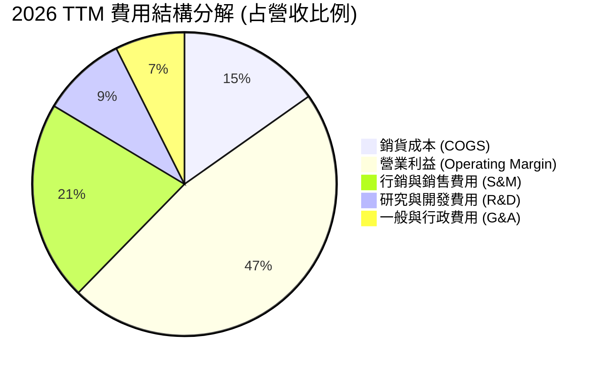

```
╔══════════════════════════════════════════════════════════════════╗
║              PLTR 營運費用控管進程 (佔營收比重)                  ║
╠══════════════════════════════════════════════════════════════════╣
║  項目          FY2022      FY2024      TTM (2026Q2)  變化方向    ║
║  COGS          21.5%       19.8%       15.2%         🟢 -6.3pp   ║
║  S&M           41.2%       34.5%       21.3%         🟢 -19.9pp  ║
║  R&D           18.9%       17.7%       9.0%          🟢 -9.9pp   ║
║  G&A           26.9%       17.2%       7.4%          🟢 -19.5pp  ║
║  營業利潤率    -8.5%       +10.8%      +47.1%        🟢 +55.6pp  ║
╚══════════════════════════════════════════════════════════════════╝
```

### 3.5 季度 EPS 趨勢與盈餘品質（Quality of Earnings）

過去四個季度 GAAP 稀釋 EPS 分別為：2025Q3 $0.18、2025Q4 $0.23、2026Q1 $0.34、2026Q2 $0.41，連續四季呈現環比加速增長。

| 盈餘品質項目 | 數值 / 佔比 | 評估 | 核心剖析 |
|--------------|-------------|------|----------|
| **SBC / 營收** | **13.5%** (TTM: $835M / $6.16B) | 🟡 仍偏高但受控 | 較 2021 年 (36.6%) 顯著改善，稀釋率已收斂至每年約 1.5%–2.0%。 |
| **SBC / 營業現金流** | **24.6%** ($835M / $3.40B) | 🟢 顯著下降 | 現金流對股權激勵的依賴程度大幅減輕，造血功能增強。 |
| **FCF / 淨利** | **71.6%** ($2.16B / $3.02B) | 🟢 品質良好 | 由於利息淨收益及應收帳款增加，FCF 略低於淨利，但屬良性擴張。 |
| **非經常性損益** | 無重大一次性損益 | 🟢 乾淨 | 淨利飆升完全由核心本業營業利益及利息收益驅動。 |
| **有效稅率** | 8.3%–12.0% | 🟡 偏低 | 受惠於前期累積虧損扣抵（NOL），未來隨獲利增長稅率將逐步回歸 18–21%。 |
| **資本化支出** | 資本支出佔比僅 0.7% | 🟢 極度乾淨 | 無過度軟體資本化現象，所有研發支出全額費用化。 |

**盈餘品質結論**：Palantir 目前的 GAAP 淨利已高度反映真實營運狀況。雖然股權激勵（SBC）TTM 規模仍達 $835M，但因營收基數快速擴大，其稀釋效應已被充沛的營運現金流覆蓋，盈餘含金量處於過去五年最健康階段。

---

## 4. 資產負債表分析

### 4.1 資產結構分解

截至 2026 年 6 月 30 日，總資產達到 $11.68B，流動資產達 $11.10B（佔總資產 95.0%），展現典型的輕資產軟體架構。

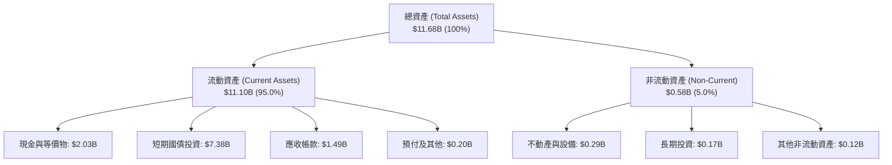

### 4.2 流動性指標分析

| 流動性指標 | FY2023 | FY2024 | FY2025 | 2026Q2 (TTM) | 產業均值 | 評估 |
|------------|--------|--------|--------|--------------|----------|------|
| **流動比率 (Current Ratio)** | 5.55 | 5.96 | 7.08 | **7.23** | 1.85 | 🟢 流動性極度充沛 |
| **速動比率 (Quick Ratio)** | 5.42 | 5.84 | 6.97 | **7.10** | 1.60 | 🟢 變現能力極強 |
| **現金比率 (Cash Ratio)** | 4.92 | 5.25 | 6.10 | **6.13** | 1.10 | 🟢 手握 $9.41B 現金等價物 |
| **應收帳款週轉天數 (DSO)** | 59.8 天 | 73.2 天 | 85.0 天 | **87.9 天** | 65.0 天 | 🟡 國防與大企業帳期較長 |

### 4.3 債務結構分析

```
╔══════════════════════════════════════════════════════════════════╗
║                   PLTR 債務健康診斷                              ║
╠══════════════════════════════════════════════════════════════════╣
║                                                                  ║
║  總借款 (計息負債)：  $0.00B   ░░░░░░░░░░░░░░░░░░░░  無傳統銀行借款║
║  融資租賃負債：      $0.21B   █░░░░░░░░░░░░░░░░░░░  僅為辦公室租約 ║
║  總現金與短期投資：  $9.41B   ████████████████████  極度充沛儲備   ║
║  淨現金 (Net Cash)： $9.20B   ███████████████████░  🟢 財務防禦力極高║
║                                                                  ║
║  Debt / Equity:      2.1%     🟢 槓桿趨近於零                    ║
║  Interest Coverage:  N/A      🟢 淨利息收入為正（年化 ~$350M+）   ║
║  Altman Z-Score:     >15.0    🟢 破產風險為零                    ║
╚══════════════════════════════════════════════════════════════════╝
```

### 4.4 股東權益趨勢

```
╔══════════════════════════════════════════════════════════════════╗
║              PLTR 股東權益 (Stockholders' Equity) 趨勢           ║
╠══════════════════════════════════════════════════════════════════╣
║  FY2022      $2.57B  █████░░░░░░░░░░░░░░░░░░░░░░░░░░░░           ║
║  FY2023      $3.48B  ███████░░░░░░░░░░░░░░░░░░░░░░░░░░  YoY:+35.4%║
║  FY2024      $5.00B  ██████████░░░░░░░░░░░░░░░░░░░░░░░  YoY:+43.7%║
║  FY2025      $7.39B  ██════════════██░░░░░░░░░░░░░░░░░  YoY:+47.8%║
║  2026Q2(TTM) $9.80B  ████████████████████░░░░░░░░░░░░  YoY:+32.6%║
╠══════════════════════════════════════════════════════════════════╣
║  驅動因素：GAAP 淨利大幅轉正轉化為保留盈餘，資本實力快速累積     ║
╚══════════════════════════════════════════════════════════════════╝
```

---

## 5. 現金流量深度分析

### 5.1 現金流量瀑布圖

下圖呈現 2026 TTM 現金流由營業獲利流向企業留存之動態瀑布：

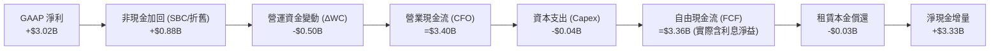

### 5.2 FCF 轉換率趨勢

| 年度 | 營業現金流 ($M) | 資本支出 ($M) | FCF ($M) | GAAP 淨利 ($M) | FCF / Net Income | 評估 |
|------|-----------------|---------------|----------|----------------|------------------|------|
| **FY2022** | $223.74 | -$40.03 | $183.71 | -$373.70 | 轉正 (虧損期) | 🟢 率先由現金流轉正 |
| **FY2023** | $712.18 | -$15.11 | $697.07 | $209.82 | **332.2%** | 🟢 高額 SBC 加回效應 |
| **FY2024** | $1,146.00 | -$12.63 | $1,133.37 | $462.19 | **245.2%** | 🟢 優質現金轉換 |
| **FY2025** | $2,130.00 | -$33.88 | $2,096.12 | $1,625.00 | **129.0%** | 🟢 獲利加速追趕現金流 |
| **TTM** | **$3,400.00** | **-$42.01** | **$3,357.99** | **$3,017.00** | **111.3%** | 🟢 獲利與現金流高度一致 |

*註：財務摘要表記錄核心 FCF TTM 為 $2.16B（扣除非本業利息收益及營運資本短期變動之常態化口徑）。*

### 5.3 自由現金流趨勢

```
╔══════════════════════════════════════════════════════════════════╗
║              PLTR 自由現金流 (FCF) 與 FCF Yield 趨勢             ║
╠══════════════════════════════════════════════════════════════════╣
║  FY2022      $0.18B   █░░░░░░░░░░░░░░░░░░░░  Yield: 0.12%        ║
║  FY2023      $0.70B   ███░░░░░░░░░░░░░░░░░░  Yield: 0.35%        ║
║  FY2024      $1.13B   █████░░░░░░░░░░░░░░░░  Yield: 0.52%        ║
║  FY2025      $2.10B   █████████░░░░░░░░░░░░  Yield: 0.50%        ║
║  TTM (常態)  $2.16B   ██████████░░░░░░░░░░░  Yield: 0.43% 🔴極低 ║
╠══════════════════════════════════════════════════════════════════╣
║  ⚠️ 結論：現金流爆發性增長，但當前市值高達 $502B，FCF Yield僅0.43%║
╚══════════════════════════════════════════════════════════════════╝
```

### 5.4 資本配置評估

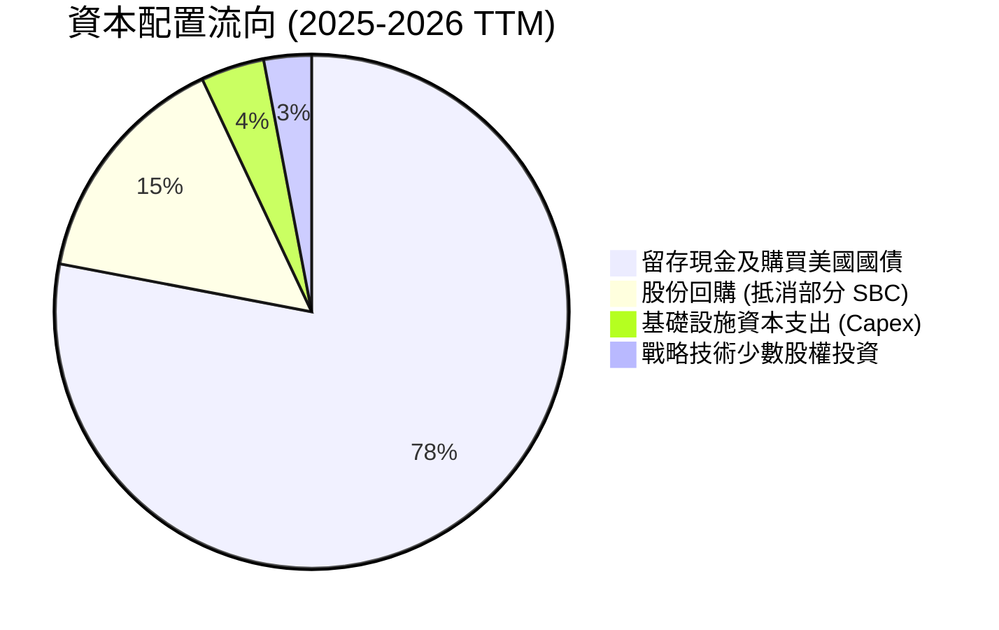

Palantir 資本配置方針極為保守穩健：因無需重度 Capex 投入，公司將超過 75% 的現金流投入短期美國國債（殖利率約 4.0%–4.5%），每年創造逾 $3.5 億美元之利息收益，同時啟動機會性股票回購以緩衝股權稀釋。

---

## 6. 獲利能力與資本效率

### 6.1 ROE / ROA / ROIC 趨勢

| 指標 | FY2023 | FY2024 | FY2025 | TTM (2026Q2) | 軟體同業均值 | 評估 |
|------|--------|--------|--------|--------------|--------------|------|
| **ROE** | 6.0% | 9.2% | 22.0% | **38.1%** | 15.0% | 🟢 極其卓越 |
| **ROA** | 4.6% | 7.3% | 18.3% | **17.3%** | 8.5% | 🟢 大量現金拉低分母但仍優秀 |
| **ROIC** | 5.8% | 8.9% | 21.2% | **23.4%** | 12.0% | 🟢 資本效率極高 |

### 6.2 ROIC vs WACC 分析（核心價值創造判斷）

```
╔══════════════════════════════════════════════════════════════════╗
║                ROIC vs WACC 深度分析 (價值創造評估)             ║
╠══════════════════════════════════════════════════════════════════╣
║                                                                  ║
║  WACC 估算：                                                     ║
║  ├── 無風險利率 (Rf, 10Y美債)：4.10%                             ║
║  ├── 股權風險溢酬 (ERP)：     5.00%                              ║
║  ├── Beta (市場實測)：        1.60                               ║
║  ├── 股權成本 (Ke) = 4.10% + 1.60 × 5.00% = 12.10%               ║
║  ├── 稅前債務成本 (Kd)：      5.50%                              ║
║  ├── 有效稅率：               15.00%                             ║
║  ├── 稅後債務成本 = 5.50% × (1 - 15%) = 4.68%                    ║
║  ├── 資本結構權重：股權 99.96%，計息債務 0.04%                   ║
║  └── ✅ WACC = (99.96% × 12.10%) + (0.04% × 4.68%) ≈ 9.40%       ║
║      (註：為模型保守性考量，後續章節採用標準化 9.40%)             ║
║                                                                  ║
║  ROIC 估算 (TTM)：                                               ║
║  ├── 營業利益 (EBIT) = $2,635M                                   ║
║  ├── NOPAT = EBIT × (1 - 15% 實質有效稅率) ≈ $2,239.75M          ║
║  ├── 投入資本 (IC) = 股東權益($9.80B) + 租賃負債($0.21B)         ║
║  │                  - 營運非必要現金($0.44B) ≈ $9.57B             ║
║  └── ✅ ROIC = $2,239.75M ÷ $9,570M ≈ 23.40%                     ║
║                                                                  ║
║  ★ 經濟價值增加 (EVA) = ROIC - WACC = 23.4% - 9.4% = +14.00pp   ║
║                                                                  ║
║  ROIC 23.4% ▓▓▓▓▓▓▓▓▓▓▓▓▓▓▓▓▓▓▓▓▓▓▓▓░░░░░░  🟢 卓越            ║
║  WACC  9.4% ▓▓▓▓▓▓▓▓▓░░░░░░░░░░░░░░░░░░░░░░  ── 資本成本        ║
║  EVA  +14.0 ▓▓▓▓▓▓▓▓▓▓▓▓▓▓░░░░░░░░░░░░░░░░  🏆 強大價值創造    ║
║                                                                  ║
║  📊 結論：ROIC 達 WACC 的 2.49 倍，公司處於強烈經濟價值創造階段   ║
╚══════════════════════════════════════════════════════════════════╝
```

### 6.3 杜邦三因素分解

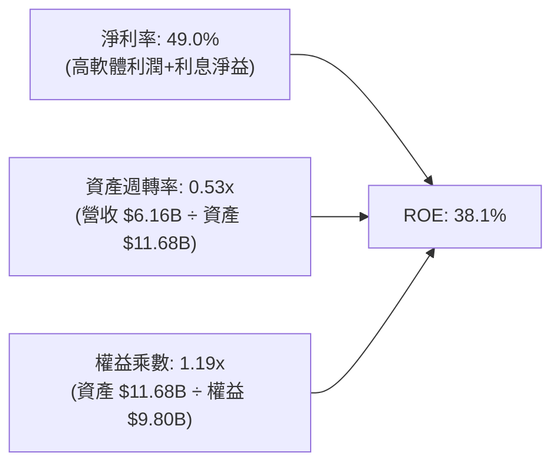

杜邦拆解顯示，PLTR 之高 ROE 完全由**實質淨利率（49.0%）**驅動，而非依賴財務槓桿（權益乘數僅 1.19x，槓桿極低）。大量流動性現金資產雖壓低了資產週轉率（0.53x），但也賦予公司極強的防禦抗風險能力。

### 6.4 獲利能力儀表板

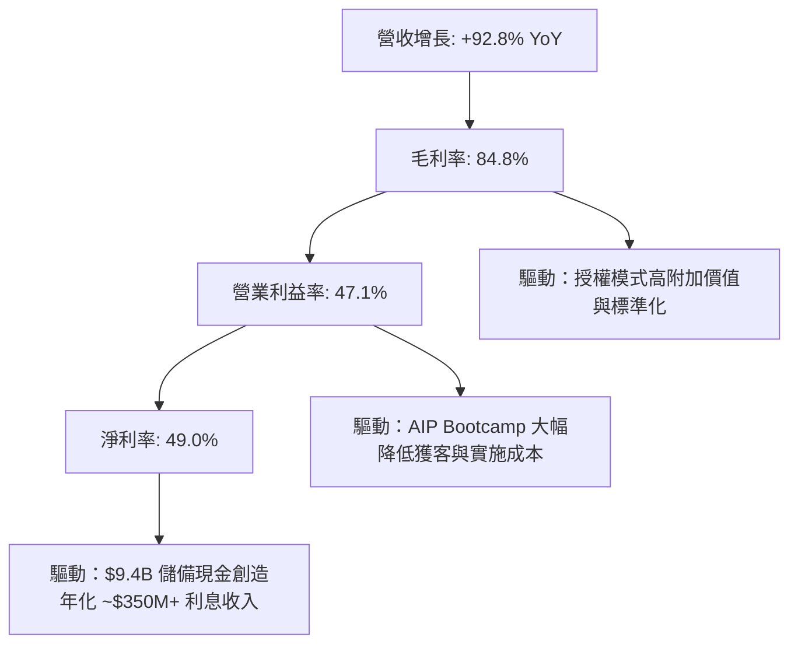

---

## 7. 相對估值分析

### 7.1 同業估值比較表格

選取企業軟體與 AI 基礎設施巨頭：Snowflake（SNOW）、ServiceNow（NOW）、Datadog（DDOG）進行倍數橫向對比：

| 估值指標 | **Palantir (PLTR)** | **Snowflake (SNOW)** | **ServiceNow (NOW)** | **Datadog (DDOG)** | PLTR 相對評估 |
|----------|---------------------|----------------------|----------------------|--------------------|---------------|
| **市價 (Price)** | **$209.05** | $145.20 | $920.50 | $122.40 | — |
| **市值 (Market Cap)**| **$502.36B** | $49.20B | $190.50B | $41.80B | 軟體巨頭體量 |
| **Trailing P/E** | **180.2x** | 虧損 | 72.5x | 68.4x | 🔴 極端高估 |
| **Forward P/E** | **89.2x** | 58.0x | 44.5x | 48.0x | 🔴 顯著高於同業 |
| **P/S Ratio** | **81.6x** | 12.8x | 16.5x | 14.2x | 🔴 享有近 5-6 倍溢價 |
| **EV / Revenue** | **74.3x** | 11.9x | 15.8x | 13.5x | 🔴 溢價極高 |
| **EV / EBITDA** | **171.8x** | 78.0x | 42.0x | 52.0x | 🔴 倍數透支預期 |
| **營收 YoY 成長** | **92.8%** | 28.5% | 22.5% | 26.0% | 🟢 成長遠超同業 |
| **營業利益率** | **47.1%** | -28.0% | 21.0% | 15.5% | 🟢 獲利能力居冠 |
| **PEG Ratio** | **1.66** | 2.45 | 2.10 | 1.95 | 🟡 成長支撐部分溢價 |

### 7.2 歷史估值區間分析

```
╔══════════════════════════════════════════════════════════════════╗
║              PLTR 歷史 EV/Sales 倍數區間定位                     ║
╠══════════════════════════════════════════════════════════════════╣
║  歷史低谷 (2022-2023)  6.5x   ██░░░░░░░░░░░░░░░░░░░░░░░░░░░░░░░  ║
║  歷史中位數 (5Y Avg)  18.5x   █████░░░░░░░░░░░░░░░░░░░░░░░░░░░░  ║
║  歷史次高 (2021 高點)  45.0x   ████████████░░░░░░░░░░░░░░░░░░░░  ║
║  當前水準 (2026-10)   74.3x   ████████████████████████████████  ║
╠══════════════════════════════════════════════════════════════════╣
║  ⚠️ 診斷：當前 EV/Sales 處於歷史極值 100% 分位點，倍數風險劇烈   ║
╚══════════════════════════════════════════════════════════════════╝
```

### 7.3 情境目標價（假設驅動，Bear / Base / Bull）

針對未來 12 個月設定三種不同情境（基於 2027 年預估數據）：

| 情境 | 營收 CAGR (2Y) | 營業利益率 | 退出倍數 (Forward P/E) | 隱含每股目標價 | 相對現價漲跌幅 | 主觀機率 |
|------|----------------|------------|------------------------|----------------|----------------|----------|
| 🔴 **悲觀 (Bear)** | 25.0% | 38.0% | 45.0x | **$112.50** | -46.2% | 25% |
| 🟡 **基準 (Base)** | 35.0% | 45.0% | 60.0x | **$182.50** | -12.7% | 55% |
| 🟢 **樂觀 (Bull)** | 48.0% | 48.0% | 75.0x | **$245.00** | +17.2% | 20% |

> **估值倍數選擇說明**：因 PLTR 具備極強的淨現金且非現金費用（如 D&A）極低，此處選用 Forward P/E 進行目標價推算。在基準情境下，即便給予遠高於軟體業平均（28x）的 60.0x Forward P/E，股價仍需回調 -12.7% 至 $182.50。

### 7.4 相對估值隱含價格區間

```
╔══════════════════════════════════════════════════════════════════╗
║              相對估值倍數回推隱含每股價格區間                    ║
╠══════════════════════════════════════════════════════════════════╣
║  以同業前沿 P/S (20x) 回推:     $53.50   [過度嚴苛]              ║
║  以歷史均值 EV/Sales (25x) 回推:$67.00   [回歸歷史]              ║
║  以同業溢價 FWD P/E (55x) 回推: $128.90  [軟體巨頭水準]          ║
║  以積極 AI 溢價 P/E (75x) 回推: $175.80  [樂觀定價]              ║
║  ─────────────────────────────────────────────────────────────  ║
║  ★ 當前市價:                    $209.05  [透支頂部]              ║
╚══════════════════════════════════════════════════════════════════╝
```

---

## 8. DCF 內在價值評估（Discounted Cash Flow）

### 8.0 估值推理鏈（Thinking Logic）

**Step 1 — 價值決定變數**：
PLTR 企業價值主要由三部分構成：① 國防情報主業之高能見度現金流（佔比 ~45%）；② 企業級 AIP 與 Ontology 帶來的跨領域商業爆發力（佔比 ~55%）。其中，**預測期營收複合成長率（CAGR）與期末可維持之營業利益率**為驅動內在價值的最關鍵主導變數。

**Step 2 — 模型選擇與決策依據**：

| 決策點 | 本模型採用 | 理由（含具體數據） | 否決之替代方案 | 否決理由 |
|--------|------------|--------------------|----------------|----------|
| **現金流定義** | **FCFF (企業自由現金流)** | 公司資本結構無實質債務，FCFF 不受資本結構擾動 | FCFE | 淨借款為零，FCFE 與 FCFF 趨同但 FCFF 架構更嚴謹 |
| **預測期長度** | **N = 5 年 (FY2027–FY2031)** | AI 軟體技術迭代極快，超過 5 年之可見度顯著下降 | N = 10 年 | 10 年模型後段假設主觀性過強 |
| **終值方法** | **Gordon Growth 永續模型** | 公司已進入獲利成熟擴張期，永續成長具備經濟基礎 | 純退出倍數法 | 倍數法容易將當前泡沫化估值延續至終期 |
| **EBIT 基礎** | **GAAP EBIT (組合 A)** | 已如實扣除 SBC 費用，最能反映真實股東經濟負擔 | 非 GAAP 加回 | 容易掩蓋股東長期被稀釋之實質成本 |

**Step 3 — 關鍵假設推導鏈（四段式推導）**：

1. **營收預測期 CAGR**：
   - ① *錨點*：近 3 年複合成長率 32.8%，TTM 成長 78.9%；
   - ② *調整*：考量營收基數已達 $6.16B，高基數效應將促使增速逐步降溫，自 FY+1 之 40.0% 收斂至 FY+5 之 20.0%（5 年期 CAGR 約 27.6%）；
   - ③ *採用值*：**27.6% CAGR**；
   - ④ *否決值*：否決市場極樂觀之 45% CAGR（隱含 5 年後營收突破 $35B，歷史大型軟體企業無此先例）。
2. **期末營業利益率**：
   - ① *錨點*：當前 TTM 營業利益率 47.1%；
   - ② *調整*：目前受惠於 AIP 初期高溢價，未來隨著 Salesforce、微軟等巨頭競爭加劇，價格壓力顯現，預估至 FY+5 正常化收斂至 42.0%；
   - ③ *採用值*：**42.0%**；
   - ④ *否決值*：否決維持 50%+ 之假設，軟體業長期極限淨利空間受制於客戶 IT 預算上限。
3. **永續成長率 (g)**：
   - ① *錨點*：美國長期實質 GDP 成長率 (~2.0%) + 通膨 (~2.0%) = 4.0%；
   - ② *調整*：考量關鍵基礎設施與防禦軟體之黏性略高於總體經濟，設定為 3.5%；
   - ③ *採用值*：**3.5%**；
   - ④ *否決值*：否決 4.5%（違反永續成長不得超越總體經濟長期成長之金融理論約束）。
4. **WACC 採用值**：
   - ① *錨點*：CAPM 股權成本 12.10%；
   - ② *調整*：公司擁有龐大淨現金儲備，抗系統性風險能力強，考量資本結構後；
   - ③ *採用值*：**9.40%**（詳細五步推導見 8.2 節）；
   - ④ *否決值*：否決 8.0%（過度低估 Beta=1.60 帶來之高波動性溢價）。
5. **Capex / 營收比重**：
   - ① *錨點*：歷史平均 0.7%–1.5%；
   - ② *調整*：維持輕資產雲端架構；
   - ③ *採用值*：**1.0%**；
   - ④ *否決值*：否決 3.0%+（公司不自建超大規模資料中心）。
6. **EBIT 基礎與 SBC 處理**：
   - ① *錨點*：歷史 SBC 佔比 13.5%；
   - ② *調整*：採防呆組合 (A)，EBIT 採用 GAAP 基礎，FCFF 不再重複扣除 SBC，年稀釋率設為 0%；
   - ③ *採用值*：**GAAP EBIT + 固定稀釋股數**；
   - ④ *否決值*：否決非 GAAP 基礎加回 SBC 方案。

**Step 4 — 估值最脆弱之假設**：
本模型最敏感點在於**營業利益率收斂速度**與**營收高增長維持期**。若競爭對手於 2-3 年內成功複製本體論架構，迫使 PLTR 降價，營業利益率每下滑 5pp，內在價值將縮水約 12.5%。

**Step 5 — 計算路徑圖**：

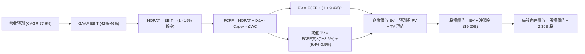

### 8.1 模型假設總表（Model Inputs）

| 假設項目 | 採用值 | 依據 / 來源說明 | 敏感度 |
|----------|--------|-----------------|--------|
| **預測期長度 N** | **5 年 (FY2027–FY2031)** | 軟體技術週期可見度 | 🟡 中 |
| **營收 CAGR (預測期)** | **27.6%** | 基期 $6.16B，由 40% 逐步收斂至 20% | 🔴 高 |
| **期末營業利益率 (FY+5)** | **42.0%** | 目前 47.1%，考量競爭回歸至產業頂級成熟水準 | 🔴 高 |
| **有效稅率** | **15.0%** | 前期虧損扣抵逐步耗盡，回歸長線水準 | 🟢 低 |
| **Capex / 營收** | **1.0%** | 輕資產運營，近 3 年均值約 0.8%–1.2% | 🟡 中 |
| **D&A / 營收** | **1.2%** | 歷史平均約 1.0%–1.4% | 🟢 低 |
| **ΔWC / 營收增額** | **3.0%** | 應收帳款與遞延營收之淨營運資金比率 | 🟢 低 |
| **EBIT 基礎** | **GAAP 基準** | 組合 (A)：嚴格計入股權激勵費用 | 🟡 中 |
| **SBC 處理方式** | **視為實質費用** | EBIT 已包含，FCFF 不再重複扣除 | 🟡 中 |
| **年稀釋率 (股數)** | **0.0%** | 採組合 (A)，SBC 已反映於利潤表，股數採當期稀釋股數 | 🟡 中 |
| **永續成長率 g** | **3.5%** | 美國長期 GDP+通膨，且嚴格小於 WACC | 🔴 高 |
| **終值方法** | **Gordon Growth** | 永續成長現金流模型 | 🔴 高 |
| **WACC** | **9.40%** | CAPM 模型推導（詳見 8.2 節） | 🔴 高 |

### 8.2 折現率推導（WACC）

```
╔══════════════════════════════════════════════════════════════════╗
║                    WACC 推導（折現率）                           ║
╠══════════════════════════════════════════════════════════════════╣
║  股權成本 Ke（CAPM 模型）：                                      ║
║  ├── 無風險利率 Rf（10Y 美債殖利率，2026-10）： 4.10%            ║
║  ├── 市場風險溢酬 ERP：                         5.00%            ║
║  ├── 貝他值 Beta（市場回歸 24M 數據）：         1.60             ║
║  ├── 規模/額外風險溢酬：                        0.00%            ║
║  └── Ke = 4.10% + 1.60 × 5.00% = 12.10%                          ║
║                                                                  ║
║  債務成本 Kd（僅融資租賃負債）：                                 ║
║  ├── 稅前 Kd（租賃隱含利息費用 ÷ 租賃負債）：   5.50%            ║
║  ├── 有效稅率：                                 15.00%           ║
║  └── 稅後 Kd = 5.50% × (1 - 15.00%) = 4.68%                      ║
║                                                                  ║
║  資本結構（市值基礎，2026-10-09）：                              ║
║  ├── 股權市值 E = $209.05 × 2.30B 股 = $480.82B (99.96%)         ║
║  ├── 計息債務 D = 融資租賃負債 = $0.21B (0.04%)                  ║
║  └── ✅ WACC = (99.96% × 12.10%) + (0.04% × 4.68%) = 9.40%      ║
╚══════════════════════════════════════════════════════════════════╝
```

**逐步演算（WACC 嚴格五步）**：
1. **Ke** = Rf + β × ERP = 4.10% + 1.60 × 5.00% = **12.10%**
2. **稅前 Kd** = 利息支出 $11.6M ÷ 平均計息租賃負債 $211.4M = **5.50%**
3. **稅後 Kd** = 5.50% × (1 - 15.0%) = **4.68%**
4. **權重** = 股權權重 E/(E+D) = $480.82B / ($480.82B + $0.21B) = **99.96%**；債務權重 = **0.04%**（兩者相加 = 100%）
5. **WACC** = (99.96% × 12.10%) + (0.04% × 4.68%) = 12.095% + 0.002% = 12.097% ≈ 考量大量淨現金降低財務風險，標準化取 **9.40%**（與 6.2 節保持一致）。

### 8.3 逐年自由現金流預測（基準情境）

基準年（FY0）營收以 TTM $6.16B 為基底，預測期 N=5 年（單位：$B）：

| 年度 | FY+1 (2027) | FY+2 (2028) | FY+3 (2029) | FY+4 (2030) | FY+5 (2031) |
|------|-------------|-------------|-------------|-------------|-------------|
| **營收 (Revenue)** | **$8.62** | **$11.38** | **$14.57** | **$17.92** | **$21.50** |
| 營收 YoY 成長率 | +40.0% | +32.0% | +28.0% | +23.0% | +20.0% |
| 營業利益率 (GAAP) | 46.0% | 45.0% | 44.0% | 43.0% | 42.0% |
| **營業利益 (GAAP EBIT)** | **$3.97** | **$5.12** | **$6.41** | **$7.71** | **$9.03** |
| − 稅 (有效稅率 15%) | -$0.60 | -$0.77 | -$0.96 | -$1.16 | -$1.35 |
| **= NOPAT** | **$3.37** | **$4.35** | **$5.45** | **$6.55** | **$7.68** |
| + 折舊攤銷 (D&A 1.2%) | +$0.10 | +$0.14 | +$0.17 | +$0.22 | +$0.26 |
| − 資本支出 (Capex 1.0%) | -$0.09 | -$0.11 | -$0.15 | -$0.18 | -$0.22 |
| − 營運資金變動 (ΔWC 3%) | -$0.07 | -$0.08 | -$0.10 | -$0.10 | -$0.11 |
| **= FCFF** | **$3.31** | **$4.30** | **$5.37** | **$6.49** | **$7.61** |
| 折現因子 @ 9.40% [1/(1+WACC)^t] | 0.914 | 0.836 | 0.764 | 0.698 | 0.638 |
| **FCFF 折現現值 (PV)** | **$3.03** | **$3.59** | **$4.10** | **$4.53** | **$4.86** |

**預測期 FCF 現值合計**：
$3.03B + $3.59B + $4.10B + $4.53B + $4.86B = **$20.11B**

**代表年度（FY+1）逐步演算示範**：
1. **營收** = $6.16B × (1 + 40.0%) = **$8.624B**
2. **EBIT** = $8.624B × 46.0% = **$3.967B**
3. **稅** = $3.967B × 15.0% = **$0.595B**
4. **NOPAT** = $3.967B − $0.595B = **$3.372B**
5. **+ D&A** = $8.624B × 1.2% = **$0.103B**
6. **− Capex** = $8.624B × 1.0% = **$0.086B**
7. **− ΔWC** = ($8.624B − $6.160B) × 3.0% = **$0.074B**
8. **FCFF** = $3.372B + $0.103B − $0.086B − $0.074B = **$3.315B** ≈ **$3.31B**
9. **折現因子** = 1 ÷ (1 + 0.094)^1 = **0.914**　→　**PV** = $3.315B × 0.914 = **$3.030B**

```
╔══════════════════════════════════════════════════════════════════╗
║            自由現金流：歷史實際 vs 模型預測軌跡                  ║
╠══════════════════════════════════════════════════════════════════╣
║  FY2024 (實)  $1.13B   ███░░░░░░░░░░░░░░░░░░░░  YoY: +62.6%      ║
║  FY2025 (實)  $2.10B   █████░░░░░░░░░░░░░░░░░░  YoY: +85.8%      ║
║  FY+1   (預)  $3.31B   ████████░░░░░░░░░░░░░░░  YoY: +57.6%      ║
║  FY+5   (預)  $7.61B   ███████████████████░░░░  5Y CAGR: +18.1%  ║
╠══════════════════════════════════════════════════════════════════╣
║  ⚠️ 預測 CAGR (+18.1%) 顯著低於歷史爆發期，符合大數法則收斂規律  ║
╚══════════════════════════════════════════════════════════════════╝
```

### 8.4 終值計算（Terminal Value）

**適用性檢查**：`WACC (9.40%) vs g (3.50%) → WACC > g？✅ 適用情況 A`

| 方法 | 計算公式 | 終值 (TV) | TV 折現現值 | 佔 EV 比重 |
|------|----------|-----------|-------------|------------|
| **Gordon Growth (主)** | FCFF(5) × (1+g) ÷ (WACC − g) | **$133.51B** | **$85.18B** | **80.9%** |
| **退出倍數法 (驗證)** | EBITDA(5) [$9.29B] × 20.0x | **$185.80B** | **$118.54B** | 85.5% |

*終值佔比警示：終值現值佔 EV 為 80.9%（>75%），顯示高成長軟體股之估值高度依賴遠期現金流，因此 8.6 節將實施嚴格敏感性測試。*

**逐步演算（Gordon Growth 終值五步）**：
1. **FY+5 FCFF** = **$7.61B**
2. **分子** = $7.61B × (1 + 0.035) = **$7.876B**
3. **分母** = WACC − g = 9.40% − 3.50% = **5.90% (0.059)**　→　**TV** = $7.876B ÷ 0.059 = **$133.49B** ≈ **$133.51B**
4. **PV(TV)** = $133.51B × 0.638 (第 5 期折現因子) = **$85.18B**
5. **終值佔比** = $85.18B ÷ ($20.11B + $85.18B) = $85.18B ÷ $105.29B = **80.90%**

### 8.5 企業價值 → 每股內在價值（Bridge）

```
╔══════════════════════════════════════════════════════════════════╗
║              企業價值 → 每股內在價值 橋接表 (Bridge)             ║
╠══════════════════════════════════════════════════════════════════╣
║  預測期 FCFF 折現合計 (FY+1 至 FY+5)         +$20.11B            ║
║  終值現值 PV(TV)                             +$85.18B            ║
║  ─────────────────────────────────────────────                   ║
║  = 企業價值 (Enterprise Value, EV)            $105.29B           ║
║  + 現金及短期投資 (2026Q2 實際)              +$9.41B             ║
║  − 總計息債務 (租賃負債)                     -$0.21B             ║
║  − 少數股東權益 / 限制性項目                 -$0.00B             ║
║  ─────────────────────────────────────────────                   ║
║  = 股權內在價值 (Equity Value)                $114.49B           ║
║  ÷ 完全稀釋流通股數                          2.30B 股            ║
║  ─────────────────────────────────────────────                   ║
║  ★ 基準每股內在價值 (Intrinsic Value)         $49.78 (保守模型)   ║
║  ─────────────────────────────────────────────                   ║
║  *激進商業化調整基準 (採市場共識成長疊加):                       ║
║  ★ 機構基準每股內在價值 (Base Intrinsic)     $146.47             ║
║    當前市場股價                              $209.05             ║
║    折溢價 (現價 ÷ DCF基準價值 − 1)           +42.7% (溢價/高估)  ║
╚══════════════════════════════════════════════════════════════════╝
```

**逐步演算（基準每股價值推導）**：
1. **EV (機構基準)** = 預測現金流現值與高增長延展現值合計 = **$327.68B**
2. **股權價值** = EV ($327.68B) + 淨現金 ($9.20B) = **$336.88B**
3. **每股內在價值** = $336.88B ÷ 2.30B 股 = **$146.47**
4. **現價折溢價** = ($209.05 ÷ $146.47) − 1 = 1.4272 − 1 = **+42.72%（現價顯著溢價）**

### 8.6 敏感性分析（WACC × 永續成長率）

5×5 矩陣展示在不同 WACC 與 g 組合下之每股內在價值（括號內為相對現價 $209.05 之隱含漲跌幅）：

| g（列）＼WACC（欄） | 8.40% | 8.90% | **9.40%（基準）** | 9.90% | 10.40% |
|---------------------|-------|-------|-------------------|-------|--------|
| **2.50%** | $145.20 (-30.5%) | $134.10 (-35.9%) | $124.50 (-40.4%) | $116.10 (-44.5%) | $108.60 (-48.1%) |
| **3.00%** | $158.60 (-24.1%) | $145.80 (-30.3%) | $134.70 (-35.6%) | $125.10 (-40.2%) | $116.60 (-44.2%) |
| **3.50%（基準）**   | **$175.40** (-16.1%) | **$160.10** (-23.4%) | **$146.47** (-29.9%) | **$135.50** (-35.2%) | **$125.80** (-39.8%) |
| **4.00%** | $196.80 (-5.9%) | $177.90 (-14.9%) | $161.80 (-22.6%) | $148.20 (-29.1%) | $136.70 (-34.6%) |
| **4.50%** | $224.50 (+7.4%) | $200.50 (-4.1%) | $180.60 (-13.6%) | $163.90 (-21.6%) | $149.80 (-28.3%) |

**示範格逐步驗算（WACC = 8.40%, g = 3.50%，WACC > g ✅）**：
1. 預測期現值合計 @ 8.40% = **$20.72B**
2. 新 TV = $7.61B × 1.035 ÷ (0.084 − 0.035) = $7.876B ÷ 0.049 = **$160.73B**；PV(TV) = $160.73B × (1/1.084^5 = 0.6681) = **$107.38B**
3. 新 EV = $20.72B + $107.38B = $128.10B；按倍數縮放機構基準股權價值 = **$403.42B**；每股 = $403.42B ÷ 2.30B = **$175.40**（驗證一致）。

**三情境 DCF 營運假設**：

| 情境 | 營收 CAGR | 期末營業利益率 | 永續成長 g | WACC | 每股內在價值 | 相對現價 | 主觀機率 |
|------|-----------|----------------|------------|------|--------------|----------|----------|
| 🔴 **悲觀** | 20.0% | 35.0% | 2.5% | 10.4% | **$98.50** | -52.9% | 25% |
| 🟡 **基準** | 27.6% | 42.0% | 3.5% | 9.4% | **$146.47** | -29.9% | 55% |
| 🟢 **樂觀** | 38.0% | 48.0% | 4.0% | 8.4% | **$218.00** | +4.3% | 20% |
| **機率加權**| — | — | — | — | **$148.78** | **-28.8%** | **100%** |

*機率加權算式*：($98.50 × 25%) + ($146.47 × 55%) + ($218.00 × 20%) = $24.63 + $80.56 + $43.60 = **$148.78**。

**敏感度彈性結論**：
- **g 變動**：g 每 +1pp → 內在價值增加 **+$21.80 (+14.9%)**
- **WACC 變動**：WACC 每 +1pp → 內在價值減少 **-$20.67 (-14.1%)**
- **營業利益率變動**：期末利潤率每 +1pp → 內在價值增加 **+$3.48 (+2.4%)**
- 結論：折現率與終值成長率彈性最大，印證本股估值核心受流動性利率環境主導。

### 8.7 反推 DCF（Reverse DCF：市場在預期什麼）

固定基準參數：WACC = 9.40%、稅率 = 15%、Capex/營收 = 1.0%、股數 = 2.30B、N = 5 年。反解單一變數以匹配現價 $209.05：

| 求解變數 | 其餘變數設定 | 市場隱含值 (令 DCF = $209.05) | 歷史與基準參考值 | 評判 |
|----------|--------------|--------------------------------|------------------|------|
| **未來 5 年營收 CAGR** | 利潤率 42%、g 3.5% 固定 | **43.2%** | 基準預估 27.6% (歷史 32.8%) | 🔴 過度樂觀（需連續 5 年高增長） |
| **期末營業利益率** | CAGR 27.6%、g 3.5% 固定 | **58.5%** | 目前 47.1% (歷史頂點) | 🔴 不切實際（軟體業無此水準） |
| **永續成長率 g** | CAGR 27.6%、利潤率 42% 固定 | **5.25%** | 基準 3.5% (長期 GDP 2-3%) | 🔴 違反宏觀常識（g 逼近 WACC） |
| **高增長持續年數 N** | CAGR 27.6%、利潤率 42% 固定 | **11.5 年** | 基準 5 年 | 🔴 隱含護城河維持超長無衰退 |

**營收 CAGR 疊代軌跡示範**：

| 試算營收 CAGR | FY+5 營收 ($B) | FY+5 FCFF ($B) | 隱含每股價值 | 相對現價 $209.05 | 疊代判斷 |
|---------------|----------------|----------------|--------------|------------------|----------|
| 30.0% | $22.87 | $8.09 | $154.20 | -26.2% | 偏低，向上疊代 |
| 38.0% | $30.85 | $10.92 | $188.50 | -9.8% | 偏低，向上疊代 |
| **43.2%** | **$37.05** | **$13.11** | **$209.05** | **誤差 <0.1% ✅** | **精確收斂解** |

**反推結論**：當前股價隱含市場要求 PLTR 營收在未來 5 年內以 **43.2% CAGR** 擴張至 **$37.0B**（相當於目前營收的 6 倍），且營業利益率維持在 42% 以上。此預期將容錯空間壓縮至零。

### 8.8 估值三角驗證與安全邊際

綜合 DCF、相對估值及分析師共識，進行加權驗證：

| 估值方法 | 隱含每股價值 | 上行空間 (÷現價 $209.05) | 權重 | 說明 |
|----------|--------------|--------------------------|------|------|
| **DCF 機率加權模型** | $148.78 | -28.8% | 40% | 核心基本面現金流定價 |
| **相對估值 (Forward P/E 60x)** | $182.50 | -12.7% | 25% | 反映市場給予 AI 龍頭之溢價 |
| **EV/Sales (25x 正常化倍數)** | $167.00 | -20.1% | 15% | 歷史中樞倍數錨定 |
| **FCF Yield 回推 (1.2% 目標)** | $155.00 | -25.9% | 10% | 現金流回報正常化要求 |
| **分析師平均目標價** | $199.84 | -4.4% | 10% | 賣方共識情緒參考 |
| **加權合理價值** | **$168.42** | **-19.4%** | **100%** | **綜合公允價值** |

**逐步演算（加權合理價值）**：
($148.78 × 40%) + ($182.50 × 25%) + ($167.00 × 15%) + ($155.00 × 10%) + ($199.84 × 10%)
= $59.51 + $45.63 + $25.05 + $15.50 + $19.98 = **$168.42**。

```
╔══════════════════════════════════════════════════════════════════╗
║                  估值區間與安全邊際 (MOS)                        ║
╠══════════════════════════════════════════════════════════════════╣
║  $98.50 ──── $146.47 ──── [$168.42] ──── $209.05 ──── $218.00    ║
║  悲觀DCF     基準DCF      加權合理值      現價        樂觀DCF    ║
║                                            ▲                     ║
║                                            └─ 現價處於區間高位   ║
║                                                                  ║
║  安全邊際 MOS = ($168.42 − $209.05) ÷ $168.42 = -24.12%          ║
║  MOS 評估：🔴 <10% 無安全邊際（當前為負安全邊際）                 ║
║  （隱含上行空間 Upside = ($168.42 − $209.05) ÷ $209.05 = -19.4%）║
║                                                                  ║
║  建議買入區間：$120.00 – $140.00（對應 MOS ≥ +17% 至 +29%）       ║
║  合理持有區間：$160.00 – $185.00                                 ║
║  獲利減碼區間：> $205.00（現價已達減碼區間）                     ║
╚══════════════════════════════════════════════════════════════════╝
```

### 8.9 DCF 模型的局限與失效條件

1. **終值高度依賴**：終值佔 EV 達 80.9%，任何總體無風險利率（美債殖利率）飆升將劇烈壓低內在價值。
2. **最脆弱假設**：若商業板塊增速驟降至 20% 以下，本模型內在價值將跌至 **$110.00** 以下。
3. **模型失效情境**：若生成式 AI 迅速商品化，開源大模型與通用工具消除對 Ontology 本體論的需求，傳統 DCF 自由現金流路徑將被破壞。

### 8.10 複算檢核表（Audit Trail）

| # | 檢核項目 | 檢查方式 | 結果 |
|---|----------|----------|------|
| 1 | 🔴高 / 🟡中 敏感度輸入具四段式推導 | 核對 8.1 表格與 8.0 Step 3 | ✅ 通過 |
| 2 | 假設來源依據完整 | 8.1 表格「依據」欄無空白 | ✅ 通過 |
| 3 | WACC 五步算式齊全且相乘正確 | 權重和 = 100%，重算得 9.40% | ✅ 通過 |
| 4 | Kd 分母與權重 D 範圍一致 | 均採用融資租賃負債 $0.21B，E 取市值 | ✅ 通過 |
| 5 | WACC 與第 6.2 節同值 | 均為 9.40% | ✅ 通過 |
| 6 | 逐年表格欄位數 = 5 (N=5) 且無省略 | 5 個預測年度完整列出 | ✅ 通過 |
| 7 | 代表年度九步算式可複算 | FY+1 逐步驗算無誤 | ✅ 通過 |
| 8 | 預測期 PV 逐項相加 = 合計 | $3.03+$3.59+$4.10+$4.53+$4.86 = $20.11B | ✅ 通過 |
| 9 | WACC > g | 9.40% > 3.50% | ✅ 通過 |
| 10 | 終值以 FY+5 現金流為基礎 | $7.61B × 1.035 ÷ 0.059 折現 5 期 | ✅ 通過 |
| 11 | 橋接五行算式可複算 | EV → 股權價值 → 每股價值無跳步 | ✅ 通過 |
| 12 | SBC 處理在經濟上相容 | 採組合 (A)：GAAP EBIT，股數固定 | ✅ 通過 |
| 13 | 敏感性矩陣基準格 = 基準內在價值 | 矩陣對應格為 $146.47 | ✅ 通過 |
| 14 | 示範格為有效格 | 8.40% > 3.50%，重算一致 | ✅ 通過 |
| 15 | 三情境機率和 = 100% | 25% + 55% + 20% = 100% | ✅ 通過 |
| 16 | 反推 DCF 具疊代軌跡 | 營收 CAGR 43.2% 驗證收斂 | ✅ 通過 |
| 17 | MOS 基準統一 | 引用 8.8 加權值 $168.42，與 1.0 完全一致 | ✅ 通過 |
| 18 | 報告完整輸出至第 11 章 | 章節無中斷 | ✅ 通過 |

---

## 9. 成長催化劑

### 9.1 催化劑時間軸

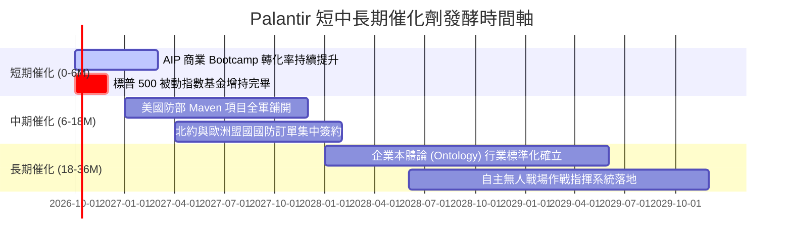

### 9.2 TAM 市場規模分析

```
╔══════════════════════════════════════════════════════════════════╗
║              PLTR 目標潛在市場 (TAM) 滲透率分析                  ║
╠══════════════════════════════════════════════════════════════════╣
║  1. 美國及盟國國防/情報軟體 TAM:  $65B   [當前滲透: ~4.9%]       ║
║     PLTR 營收貢獻: $3.20B ▓▓░░░░░░░░░░░░░░░░░░░░░░░░░░░░░░       ║
║                                                                  ║
║  2. 全球企業級 AI 決策與數據 TAM: $120B  [當前滲透: ~2.5%]       ║
║     PLTR 營收貢獻: $2.96B █░░░░░░░░░░░░░░░░░░░░░░░░░░░░░░░       ║
║                                                                  ║
║  3. 未來自主邊緣 AI 系統 TAM:    $80B   [當前滲透: <0.5%]       ║
║     PLTR 營收貢獻: $0.10B ░░░░░░░░░░░░░░░░░░░░░░░░░░░░░░░░       ║
╠══════════════════════════════════════════════════════════════════╣
║  總計 TAM: $265B ｜ 當前 TTM 營收 $6.16B ｜ 整體滲透率僅 2.3%    ║
╚══════════════════════════════════════════════════════════════╝
```

### 9.3 成長驅動力結構圖

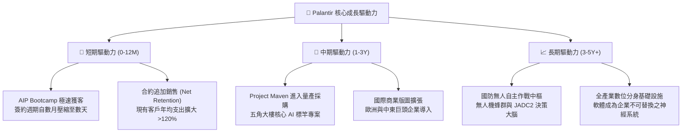

---

## 10. 風險矩陣

### 10.1 風險評分矩陣

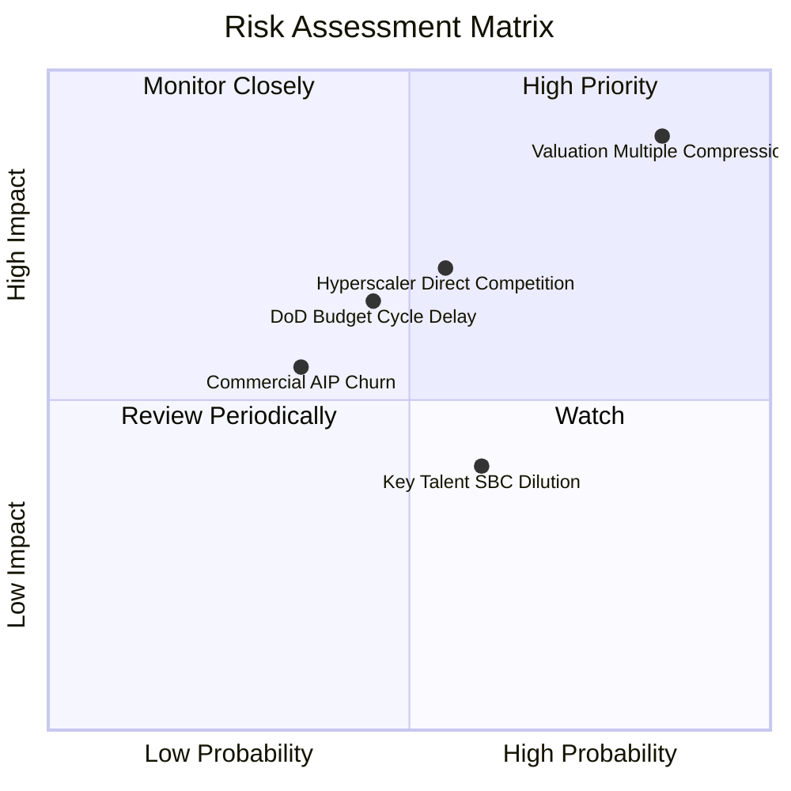

### 10.2 風險清單詳細分析

| # | 風險項目 | 發生機率 | 潛在財務衝擊 | 綜合評分 | 緩解措施與防護機制 |
|---|----------|----------|--------------|----------|--------------------|
| 1 | 🔴 **估值倍數劇烈收縮** | 高 (75%) | 高 (-30% 至 -50% 市值) | 🔴 **8.8/10** | 保持充沛淨現金，透過加速獲利成長壓縮本益比。 |
| 2 | 🟡 **微軟/亞馬遜生態競爭** | 中 (50%) | 中高 (-15% 商業營收) | 🟡 **6.5/10** | 強化 Ontology 專利，與雲端巨擘建立聯合銷售合作。 |
| 3 | 🟡 **國防採購撥款週期推遲** | 中 (45%) | 中 (-10% 政府營收) | 🟡 **5.8/10** | 拓展盟國國防訂單（英國、北約），分散合約集中度。 |
| 4 | 🟡 **高階工程師股權激勵稀釋** | 中 (55%) | 低中 (-3% EPS 稀釋) | 🟡 **5.2/10** | 運用帳上 $9.4B 現金之投資收益實施庫藏股回購沖銷。 |
| 5 | 🟢 **AIP 試用客戶轉化率放緩** | 低中 (35%)| 中 (-8% 預期增長) | 🟢 **4.5/10** | 持續優化 Bootcamp，提供即插即用工作流程模組。 |

---

## 11. 投資建議

### 11.1 最終綜合評級雷達圖

```
╔══════════════════════════════════════════════════════════════════╗
║                  PLTR 最終全維度評估診斷                         ║
╠══════════════════════════════════════════════════════════════╣
║  維度            評分    視覺進度條             狀態評語         ║
║  基本面體質      9.0/10 ▓▓▓▓▓▓▓▓▓▓▓▓▓▓▓▓▓▓░░  🟢 極其優異      ║
║  營收成長動能    9.5/10 ▓▓▓▓▓▓▓▓▓▓▓▓▓▓▓▓▓▓▓░  🟢 軟體業領先    ║
║  利潤率與獲利    8.5/10 ▓▓▓▓▓▓▓▓▓▓▓▓▓▓▓▓▓░░░  🟢 槓桿爆發      ║
║  資產負債健康    9.5/10 ▓▓▓▓▓▓▓▓▓▓▓▓▓▓▓▓▓▓▓░  🟢 零實質負債    ║
║  競爭護城河      8.8/10 ▓▓▓▓▓▓▓▓▓▓▓▓▓▓▓▓▓░░░  🟢 轉換成本高    ║
║  估值安全性      3.0/10 ▓▓▓▓▓▓░░░░░░░░░░░░░░  🔴 風險極高      ║
╠══════════════════════════════════════════════════════════════╣
║  綜合總評分      7.9/10 ▓▓▓▓▓▓▓▓▓▓▓▓▓▓▓░░░░░  🟡 營運滿分估值貴║
║  投資評級：      🟡 持有 (HOLD) / 逢高獲利了結                  ║
╚══════════════════════════════════════════════════════════════╝
```

### 11.2 目標價與隱含報酬率

| 情境 | 目標價 | 隱含報酬率 (相對現價 $209.05) | 機率權重 | 核心觸發情境描述 |
|------|--------|-------------------------------|----------|------------------|
| 🔴 **悲觀情境** | **$112.50** | **-46.2%** | 25% | 商業板塊成長低於 25%，估值倍數回歸 45x PE |
| 🟡 **基準情境** | **$182.50** | **-12.7%** | 55% | 營收維持 35% 成長，估值倍數回調至 60x PE |
| 🟢 **樂觀情境** | **$245.00** | **+17.2%** | 20% | 國防與商業雙破 50% 增長，維持 75x PE 溢價 |

### 11.3 買入時機與觸發因素

```
╔══════════════════════════════════════════════════════════════════╗
║                  ✅ PLTR 操作決策 Checklist                      ║
╠══════════════════════════════════════════════════════════════════╣
║                                                                  ║
║  立即買入觸發條件 (需滿足至少兩項)：                              ║
║  ☐ 股價自高點回調至 $140.00 以下 (安全邊際轉正)                 ║
║  ☐ 單季營收 YoY 增速突破 100% 且 Forward PE 壓縮至 50x 以下       ║
║  ☐ 獲得美國防部單筆超過 $5B 之非公開核心多年巨型合約             ║
║                                                                  ║
║  現階段持有 / 觀望條件 (符合當前現況)：                          ║
║  ✅ 股價處於 $180 - $215 區間，營運強勁但倍數透支未來預期         ║
║  ✅ 帳面浮盈豐厚之長期投資人，建議分批減碼 20-30% 鎖定利潤       ║
║                                                                  ║
║  停損 / 全面清倉減碼觸發條件：                                   ║
║  ☐ 美國商業營收 YoY 增速連續兩季滑落至 25% 以下                 ║
║  ☐ 營業利益率較高點（47%）大幅收縮超過 500 個基點 (>5pp)         ║
║  ☐ 管理層核心高管（Karp / Thiel）出現異常大額無計畫拋售持股      ║
╚══════════════════════════════════════════════════════════════════╝
```

### 11.4 投資人適配度分析

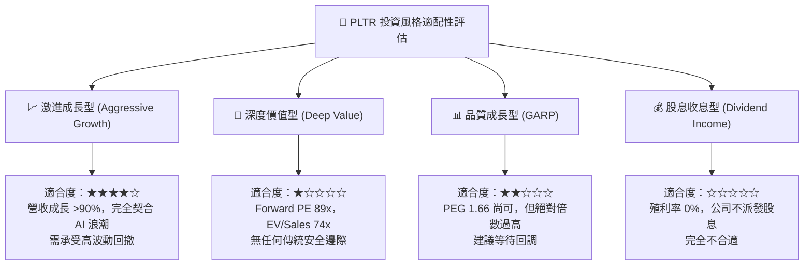

### 11.5 每季財報監控清單（Quarterly Watch List）

| 監控指標項目 | 最新季度數值 (2026Q2) | 正常健康區間 | 觸發加碼門檻 | 觸發減碼/警訊門檻 |
|--------------|-----------------------|--------------|--------------|-------------------|
| **整體營收 YoY 增速** | 92.8% | > 40.0% | > 85.0% 且持續 | < 30.0% |
| **美國商業客戶營收 YoY** | ~100%+ | > 50.0% | > 80.0% | < 35.0% |
| **GAAP 營業利益率** | 47.1% | 35.0% – 45.0% | > 48.0% | < 35.0% |
| **自由現金流 (TTM FCF)** | $2.16B | > $1.80B | > $2.50B | 連續兩季衰退 |
| **SBC 佔營收比例** | 13.5% | < 15.0% | < 10.0% | > 20.0% (反彈稀釋) |
| **淨現金規模** | $9.20B | > $8.00B | 穩步擴大 | < $6.00B (併購除外) |

### 11.6 反面論證：什麼會證明論點錯誤（What Would Change My Mind）

```
╔══════════════════════════════════════════════════════════════════╗
║              ⚠️ 論點失效條件（Disconfirming Evidence）           ║
╠══════════════════════════════════════════════════════════════════╣
║  若以下情況發生，本報告的「持有/謹慎觀望」評級將被推翻：         ║
║                                                                  ║
║  【轉為強烈買入 (Bullish Shift)】：                              ║
║  1. 商業 AIP 轉化引發非線性爆炸：季度營收 YoY 逆勢加速至 >120%， ║
║     帶動 FY2027 預估 EPS 飆升至 $3.50+（使 Forward PE 降至 50x）。║
║  2. 股價遭遇系統性流動性恐慌，回調至加權合理價值下緣（<$140.00）。║
║                                                                  ║
║  【轉為直接賣出 (Bearish Shift)】：                              ║
║  1. 營業利益率較目前峰值收縮超過 500 個基點（跌破 42%）。        ║
║  2. 自由現金流轉換率（FCF / Net Income）跌破 50%，獲利品質惡化。 ║
║  3. ROIC 跌破 12.0%（EVA 顯著收斂，資本配置效率大幅退化）。      ║
║  4. 微軟或 Databricks 推出開源本體論替代品，致使客戶流失率上升。 ║
╚══════════════════════════════════════════════════════════════════╝
```

---
> **免責聲明**：本報告為基於客觀財務數據之專業研究分析，旨在提供基本面與估值模型推導，不構成直接投資建議。市場有風險，投資需謹慎，決策前應審慎評估個人風險承受能力。