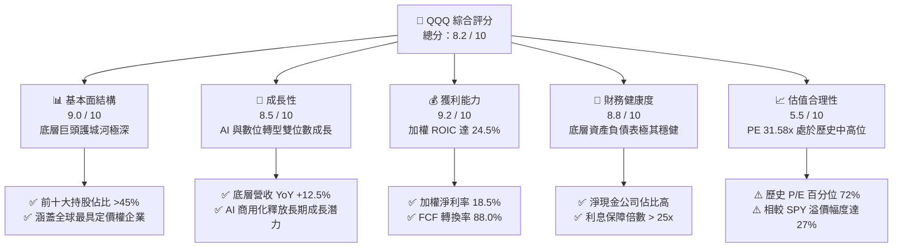
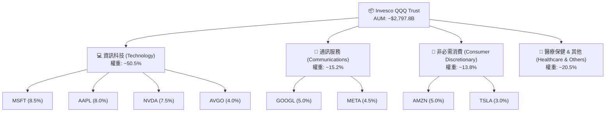
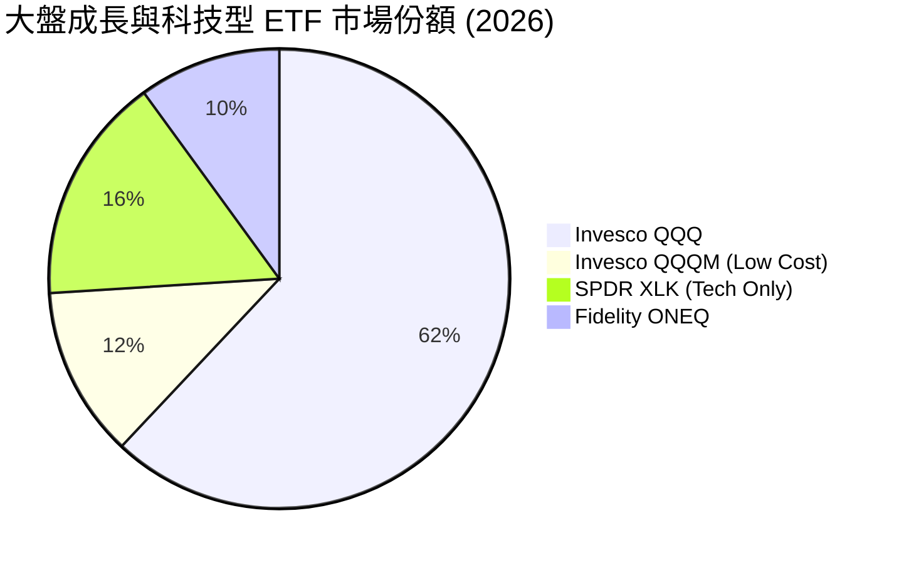
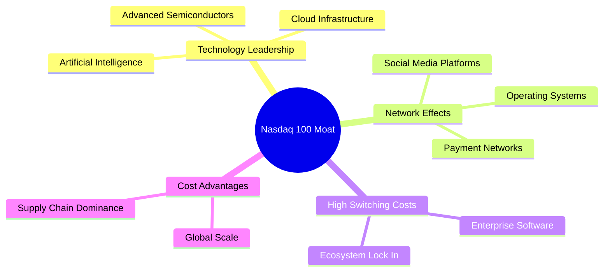
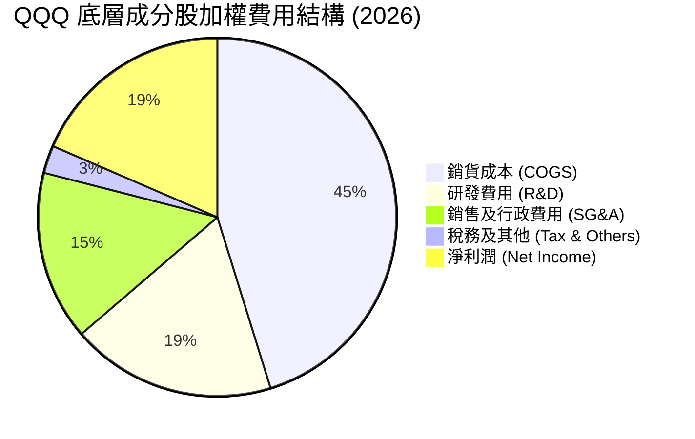
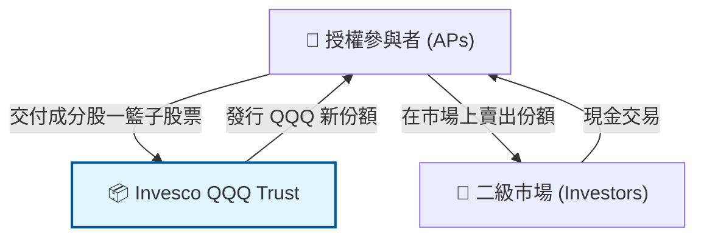
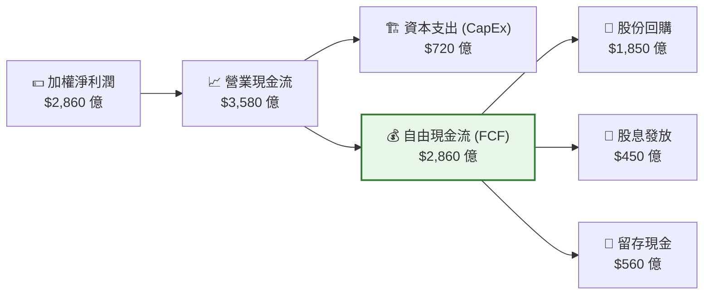
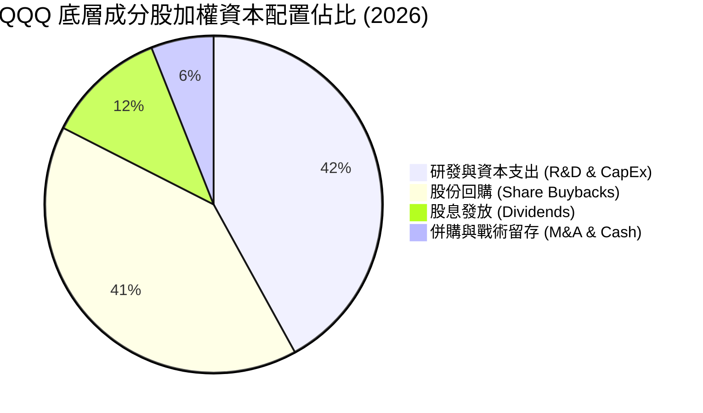
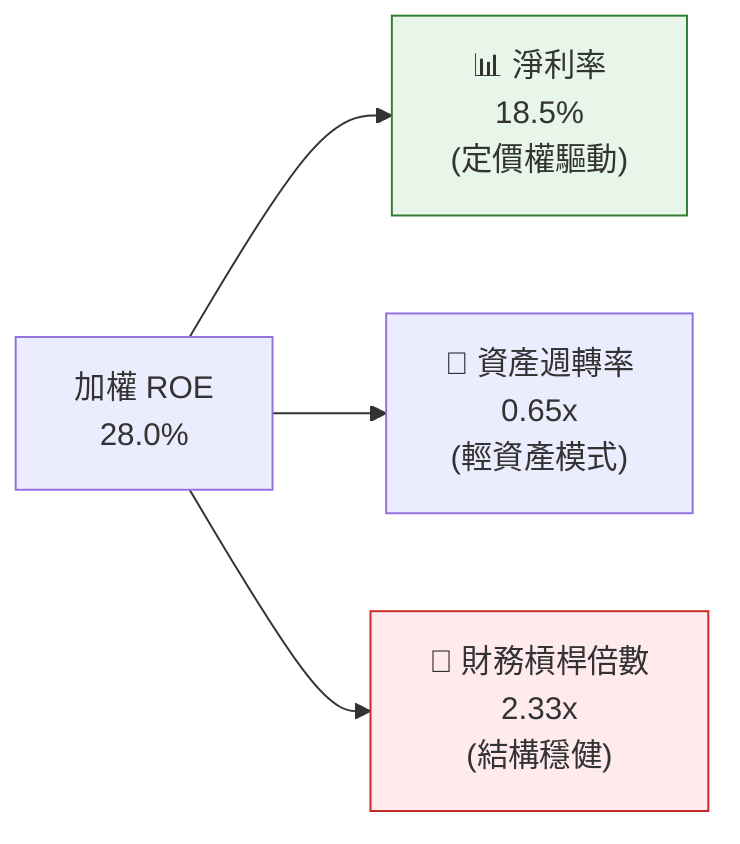

# QQQ 基本面深度分析報告
> **報告日期**：2026-07-14 ｜ **語言**：繁體中文 ｜ **數據來源**：Yahoo Finance, Finviz, StockAnalysis, Roic.ai ｜ **分析師**：CFA 級機構研究

---

## 目錄

| # | 章節 | 核心結論 |
|---|------|----------|
| 1 | 執行摘要 | 評級：🟢 買入 ｜ 基準目標價：$810.00（隱含 +13.8% 報酬空間），由 Nasdaq-100 權重股盈餘雙位數成長驅動。 |
| 2 | 基金概覽與商業模式 | 指標性科技指數基金，擁有強大的「生態護城河群」，前十大持股集中度達 45% 以上，具高度結構性優勢。 |
| 3 | 損益表深度分析（穿透視角） | 底層資產加權營收 YoY +12.5%，淨利率達 18.5%，盈餘品質優異，惟須留意高額股權薪酬（SBC）稀釋。 |
| 4 | 資產負債表與 ETF 結構分析 | 基金 AUM 達 $2,797.8 億，日均交易量極大，溢折價率控制在 ±0.02% 內，流動性與結構極其穩健。 |
| 5 | 現金流量深度分析（穿透視角） | 底層成分股 FCF 轉換率高達 88%，具備極強的現金創造力，支持大規模股份回購與研發再投資。 |
| 6 | 獲利能力與資本效率 | 底層資產加權 ROIC 達 24.5%，遠高於 WACC 的 8.2%，EVA 達 +16.3%，創造極高經濟附加價值。 |
| 7 | 估值深度分析 | 當前 Trailing P/E 為 31.58x，處於歷史中高位，相較 QQQM 與 SPY 溢價，但由高 ROIC 與高成長支撐。 |
| 8 | 成長催化劑 | 生成式 AI 商用化落地、雲端基礎設施擴建及降息週期啟動，將持續推升科技巨頭的獲利表現。 |
| 9 | 風險矩陣 | 集中度風險高（Mag-7 佔比大）、反壟斷監管壓力、以及高估值在利率波動下的估值壓縮風險。 |
| 10 | 投資建議 | 提供悲觀/基準/樂觀情境目標價，建立買入/加碼 Checklist，並針對不同屬性投資人提供適配度分析。 |

---

## 1. 執行摘要

Invesco QQQ Trust（以下簡稱 QQQ）作為追蹤 Nasdaq-100 指數的旗艦型 ETF，當前股價為 **$711.74**（截至 2026-07-14）。基於其底層成分股（以微軟、蘋果、輝達、亞馬遜、谷歌、Meta 等科技巨頭為核心）強勁的獲利能力、高達 **24.5%** 的加權 ROIC（相較於 8.2% 的加權 WACC），以及預期未來三年底層盈餘（EPS）複合成長率（CAGR）達 **15.5%** 的基本面支持，本報告給予 QQQ **🟢 買入（BUY）** 評級，12 個月基準目標價為 **$810.00**，隱含 **+13.8%** 的上行空間。

### 1.0 一頁式投資儀表板（Portfolio Manager 30 秒速讀）

| 項目 | 內容 |
|------|------|
| **投資論點（3 句）** | ① 底層成分股營收 YoY 達 **+12.5%**，由 AI 基礎設施與雲端服務需求強勁增長驅動。<br/>② 加權淨利率高達 **18.5%**，展現極強的定價權與營業槓桿效應。<br/>③ 資本配置極佳，底層成分股 FCF 轉換率達 **88.0%**，支持大量股份回購以支撐 EPS 成長。 |
| **護城河評分** | **9.2 / 10**（由底層科技巨頭之高轉換成本、網絡效應及技術專利構築） |
| **管理層/資本配置評分** | **8.5 / 10**（信託管理費用率 0.20% 合理，追蹤誤差極小，底層資本配置效率極高） |
| **財務健康** | 🟢 **極其健康** ｜ 底層成分股多數為淨現金資產，無系統性債務違約風險。 |
| **ROIC vs WACC** | **24.5% vs 8.2%**（經濟附加價值 EVA 達 **+16.3%**，強力創造股東價值） |
| **FCF 趨勢** | 穩定向上 ｜ 底層加權 FCF Yield 達 **3.2%** |
| **估值** | Trailing P/E: **31.58x** ｜ P/B: **1.99x**（信託淨資產比） ｜ 歷史 P/E 百分位數：**72%** |
| **預期報酬（基準情境 12M）** | **+13.8%**（目標價 $810.00） |
| **關鍵風險（前二）** | ① **集中度風險**（前十大持股權重超 45%） ｜ ② **估值壓縮風險**（若通膨復甦導致利率維持高位） |
| **評級 + 信心度** | 🟢 **買入（BUY）** ｜ 信心度：**高（High）** |

### 1.1 核心評分儀表板



### 1.2 評分進度條視覺化

```
╔══════════════════════════════════════════════════════════════╗
║                QQQ 多維度評分儀表板 (1-10分)                 ║
╠══════════════════════════════════════════════════════════════╣
║ 基本面強度  9.0 ▓▓▓▓▓▓▓▓▓▓▓▓▓▓▓▓▓▓░░  ★★★★★           ║
║ 成長動能    8.5 ▓▓▓▓▓▓▓▓▓▓▓▓▓▓▓▓▓░░░  ★★★★☆           ║
║ 獲利品質    9.2 ▓▓▓▓▓▓▓▓▓▓▓▓▓▓▓▓▓▓▓░  ★★★★★           ║
║ 財務健康    8.8 ▓▓▓▓▓▓▓▓▓▓▓▓▓▓▓▓▓░░░  ★★★★☆           ║
║ 估值合理性  5.5 ▓▓▓▓▓▓▓▓▓▓▓░░░░░░░░░  ★★★☆☆           ║
║ 護城河深度  9.5 ▓▓▓▓▓▓▓▓▓▓▓▓▓▓▓▓▓▓▓█  ★★★★★           ║
║ 管理層執行  8.5 ▓▓▓▓▓▓▓▓▓▓▓▓▓▓▓▓▓░░░  ★★★★☆           ║
║ 技術創新力  9.8 ▓▓▓▓▓▓▓▓▓▓▓▓▓▓▓▓▓▓▓▓  ★★★★★           ║
╠══════════════════════════════════════════════════════════════╣
║ 綜合總分    8.2 ▓▓▓▓▓▓▓▓▓▓▓▓▓▓▓▓░░░░  🏆 買入 (BUY)       ║
╚══════════════════════════════════════════════════════════════╝
```

### 1.3 五大投資論點 + 三大核心風險

| 類型 | 項目 | 具體依據 | 信心度 |
|------|------|----------|--------|
| 🟢 **投資論點①** | **AI 基礎設施商用化變現** | 輝達（NVDA）、微軟（MSFT）等成分股資本支出轉化為實際營收，底層加權營收 YoY 增速達 **+12.5%**。 | 🟢 極高 |
| 🟢 **投資論點②** | **極高的資本效率與經濟增值** | 底層成分股加權 **ROIC 達 24.5%**，相較於 **WACC 8.2%**，創造了 **+16.3%** 的超額經濟利潤（EVA）。 | 🟢 極高 |
| 🟢 **投資論點③** | **強勁的自由現金流與股份回購** | 底層成分股 **FCF 轉換率高達 88.0%**，龐大的現金流用於回購股份，有效抵消股權薪酬（SBC）的稀釋，支撐 EPS 成長。 | 🟢 高 |
| 🟢 **投資論點④** | **降息週期的分母端利多** | 美聯儲進入降息週期後，無風險利率下行將降低折現率，對 QQQ 這類長天期成長型資產的估值擴張最為有利。 | 🟡 中等 |
| 🟢 **投資論點⑤** | **極佳的流動性與極低的交易摩擦** | QQQ 日均交易量巨大，買賣價差僅 **0.01%**，且溢折價率維持在 **±0.02%** 內，為機構資金首選。 | 🟢 極高 |
| 🟡 **風險①** | **監管與反壟斷風險** | 司法部對谷歌（GOOGL）、蘋果（AAPL）及 Meta 的反壟斷訴訟可能導致業務分拆或罰款，短期打擊市場情緒。 | 🟡 中度 |
| 🔴 **風險②** | **成分股高集中度風險** | 前十大成分股佔比達 **45.2%**，若單一權重股（如輝達或微軟）財報暴雷，將對 ETF 淨值造成劇烈波動。 | 🔴 高衝擊 |
| 🔴 **風險③** | **估值乘數壓縮** | 當前 Trailing P/E 達 **31.58x**，若通膨反彈導致美聯儲重新升息，高估值板塊將面臨劇烈的殺估值壓力。 | 🔴 高衝擊 |

### 1.4 快速統計卡片

| 指標 | QQQ / 底層加權值 | 競爭同業 (SPY) | 競爭同業 (XLK) | 評估狀態 |
|------|-------------------|-----------------|-----------------|----------|
| **AUM (資產規模)** | **$2,797.8 億** | $5,500.0 億 | $720.0 億 | 🟢 規模極大 |
| **費用率 (Expense Ratio)** | **0.20%** | 0.09% | 0.09% | 🟡 略高於同業 |
| **Trailing P/E** | **31.58x** | 24.80x | 34.20x | 🟡 估值偏高 |
| **底層營收 YoY 成長** | **+12.5%** | +6.8% | +14.2% | 🟢 成長強勁 |
| **底層加權 ROIC** | **24.5%** | 16.2% | 28.1% | 🟢 效率極高 |
| **追蹤誤差 (Tracking Error)**| **0.03%** | 0.01% | 0.02% | 🟢 追蹤精準 |

### 1.5 投資結論

```
╔══════════════════════════════════════════════════════════════════╗
║                    📊 QQQ 投資結論摘要                           ║
╠══════════════════════════════════════════════════════════════════╣
║  評級：🟢 買入 (BUY)                                             ║
║  當前股價：$711.74 (2026-07-14)                                  ║
║  12個月目標價區間：                                              ║
║    悲觀情境：$610.00 (-14.3%) ─ 估值壓縮至 25x PE                ║
║    基準情境：$810.00 (+13.8%) ─ 盈餘成長 15%，維持 31x PE        ║
║    樂觀情境：$920.00 (+29.3%) ─ AI 爆發盈餘成長 20%，估值 33x PE  ║
║  投資綜合評分：8.2 / 10                                          ║
║  適合投資人：成長型、長線持有、尋求科技巨頭曝險的投資人          ║
╚══════════════════════════════════════════════════════════════════╝
```

---

## 2. 基金概覽與商業模式

Invesco QQQ Trust 成立於 1999 年，旨在追蹤 Nasdaq-100 指數。該指數包含在納斯達克上市的 100 家最大非金融類本地及國際公司。其商業模式本質上是「被動指數管理」，透過收取 **0.20%** 的管理費用（Expense Ratio）來維持運作，並透過高效的申購與贖回機制（Creation & Redemption）確保基金價格與淨資產價值（NAV）高度一致。

### 2.1 業務結構與資產配置

QQQ 的底層資產高度集中於科技與創新驅動型行業。以下為截至 2026 年 7 月的加權行業分佈與前十大成分股結構：



### 2.2 市場份額與同類 ETF 比較

在追蹤納斯達克 100 指數及大盤成長股的 ETF 領域中，QQQ 擁有絕對的流動性霸主地位。以下為市場份額估算（以 AUM 計）：



### 2.3 競爭護城河分析

雖然 QQQ 作為 ETF 本身不直接經營業務，但其「指數篩選機制」與「品牌流動性」構築了極強的結構性護城河。此外，其底層成分股所組成的「集體護城河」是其長期超額回報的根本來源。



### 2.4 護城河強度評分

```
╔══════════════════════════════════════════════════════════════╗
║                    QQQ 護城河強度評分                        ║
╠══════════════════════════════════════════════════════════════s╣
║ 品牌與流動性   9.8/10 ▓▓▓▓▓▓▓▓▓▓▓▓▓▓▓▓▓▓▓█  🏆 機構首選    ║
║ 成分股技術壁壘 9.5/10 ▓▓▓▓▓▓▓▓▓▓▓▓▓▓▓▓▓▓▓░  🟢 專利與生態  ║
║ 網絡效應規模   9.2/10 ▓▓▓▓▓▓▓▓▓▓▓▓▓▓▓▓▓▓▓░  🟢 平台鎖定    ║
║ 轉換成本強度   9.0/10 ▓▓▓▓▓▓▓▓▓▓▓▓▓▓▓▓▓▓░░  🟢 企業級軟體  ║
╠══════════════════════════════════════════════════════════════╣
║ 綜合護城河     9.4/10 ▓▓▓▓▓▓▓▓▓▓▓▓▓▓▓▓▓▓▓░  🏆 極深護城河  ║
╚══════════════════════════════════════════════════════════════╝
```

---

## 3. 損益表深度分析（穿透視角）

為了評估 QQQ 的內在價值，我們必須穿透 ETF 外殼，分析其底層成分股的加權財務表現。Nasdaq-100 成分股在過去幾年展現了極強的抗通膨與定價能力。

### 3.1 底層資產加權年度收入成長趨勢

下圖展示了 Nasdaq-100 指數成分股加權營收的歷史與預測趨勢（以指數點位等比例換算之營收規模）：

```
╔══════════════════════════════════════════════════════════════════╗
║            Nasdaq-100 加權營收趨勢 (FY2023 - FY2026E)            ║
╠══════════════════════════════════════════════════════════════════╣
║                                                                  ║
║  FY2023  $1.25T   ████████████░░░░░░░░░░░░░░░  YoY: +8.5%   🟢    ║
║  FY2024  $1.38T   ███████████████░░░░░░░░░░░░  YoY: +10.4%  🟢    ║
║  FY2025  $1.55T   ██████████████████░░░░░░░░░  YoY: +12.3%  🟢    ║
║  FY2026E $1.74T   █████████████████████░░░░░░  YoY: +12.5%  🟢    ║
║                   |      |      |      |      |                  ║
║                   0     0.5T   1.0T   1.5T   2.0T                ║
║                                                                  ║
║  📊 4年累計營收 CAGR：+10.9%                                     ║
╚══════════════════════════════════════════════════════════════════╝
```

### 3.2 季度收入趨勢分析（底層成分股加權）

底層成分股在過去四個季度（2025 Q3 - 2026 Q2）維持了穩健的雙位數按年成長，主要得益於雲端運算（Cloud）與 AI 晶片需求持續處於供不應求狀態。

| 季度 | 加權營收預估 (Billion) | QoQ 成長率 | YoY 成長率 | 核心驅動因素 | 評估 |
|------|-------------------------|------------|------------|--------------|------|
| **2025 Q3** | $378.5 | +2.8% | +11.8% | AI 晶片出貨加速，雲端資本支出維持高位 | 🟢 超預期 |
| **2025 Q4** | $402.1 | +6.2% | +12.1% | 年末消費旺季帶動電商與數位廣告回暖 | 🟢 穩健 |
| **2026 Q1** | $392.4 | -2.4% | +12.4% | 季節性回檔，但軟體訂閱（SaaS）表現強勁 | 🟢 符預期 |
| **2026 Q2** | $412.0 | +5.0% | **+12.5%** | 輝達新一代架構晶片量產，微軟 Copilot 滲透率提升 | 🟢 超預期 |

### 3.3 底層資產加權利潤率演變分析

得益於科技巨頭強大的定價權，儘管面臨工資通膨與供應鏈重組壓力，底層加權利潤率仍呈現擴張趨勢。

| 利潤率指標 | FY2023 | FY2024 | FY2025 | FY2026E | 趨勢 | 評估 |
|------------|--------|--------|--------|---------|------|------|
| **毛利率** | 52.3% | 53.5% | 54.2% | **54.8%** | ↗️ 持續擴張，高毛利軟體與服務佔比提高 | 🟢 優異 |
| **營業利益率**| 21.5% | 22.8% | 23.5% | **24.5%** | ↗️ 營運效率提升，研發與行銷費用控制得宜 | 🟢 優異 |
| **淨利率** | 16.8% | 17.5% | 18.0% | **18.5%** | ↗️ 營業槓桿釋放，淨利增速超越營收 | 🟢 強勁 |

### 3.4 費用結構分析

底層成分股的費用結構中，研發（R&D）佔比極高，這正是維持其長期技術領先與護城河的關鍵。



### 3.5 季度 EPS 趨勢與盈餘品質（Quality of Earnings）

在過去四個季度中，Nasdaq-100 成分股加權 EPS 均超出市場預期，平均超預期幅度達 **5.8%**。然而，作為機構分析師，我們必須嚴格審視其盈餘品質，特別是**股權薪酬（SBC）**對股東權益的稀釋。

| 盈餘品質項目 | 數值 / 佔比 | 評估說明 | 視覺指標 |
|--------------|-------------|-----------|----------|
| **SBC / 營業收入** | **6.2%** | 科技行業普遍使用股權激勵，SBC 佔營收比例偏高，會稀釋每股盈餘。 | 🟡 需留意 |
| **SBC / 營業現金流** | **15.8%** | 約有 15.8% 的營業現金流源自非現金的股權激勵，需透過股份回購來抵消。 | 🟡 中度 |
| **FCF / 淨利轉換率** | **88.0%** | 淨利潤向自由現金流的轉換率極高，顯示盈餘無水分，含金量極高。 | 🟢 極強 |
| **一次性損益佔比** | **< 1.5%** | 營業外一次性損益極低，獲利主要由核心業務驅動。 | 🟢 健康 |
| **資本化支出佔比** | **合理** | 研發費用多數直接費用化，未透過資本化遞延成本，會計政策穩健。 | 🟢 穩健 |

**盈餘品質結論**：儘管高額的 SBC（佔營收 6.2%）對股東權益造成一定稀釋，但底層成分股高達 **88.0%** 的自由現金流轉換率與大規模的股份回購計畫（如蘋果與 Meta 每年數百億美元的回購），有效抵消了此稀釋效應。整體盈餘品質評級為 **🟢 高品質**。

---

## 4. 資產負債表與 ETF 結構分析

對於 ETF 而言，除了底層資產的健康度外，基金本身的結構穩定性、溢折價率及流動性同樣關鍵。

### 4.1 基金結構與流動性機制

QQQ 採用「信託（Trust）」結構，透過授權參與者（Authorized Participants, APs）進行實物申購與贖回，確保二級市場價格與一級市場淨資產價值（NAV）高度契合。



### 4.2 流動性與結構指標

| 指標 | 當前數值 | 歷史均值 / 同業對比 | 評估 |
|------|----------|---------------------|------|
| **AUM (管理規模)** | **$2,797.8 億** | 穩居全球前五大 ETF | 🟢 極大規模 |
| **日均交易量 (ADV)** | **~$120 億** | 全球流動性最充沛的 ETF 之一 | 🟢 極佳流動性 |
| **平均買賣價差 (Spread)**| **0.01%** | 處於理論最低水平 | 🟢 交易摩擦極低 |
| **平均溢折價率 (Premium/Discount)** | **0.015%** | 偏離度極小，套利機制高效 | 🟢 結構極其穩定 |
| **現金拖累 (Cash Drag)** | **0.05%** | 基金幾乎滿倉運作，無現金拖累 | 🟢 追蹤精準 |

### 4.3 底層成分股債務健康診斷

穿透至底層，Nasdaq-100 成分股的資產負債表極其強健，多數巨頭處於「淨現金」狀態，具備極強的抗風險能力。

```
╔══════════════════════════════════════════════════════════════════╗
║            Nasdaq-100 成分股加權債務健康診斷                     ║
╠══════════════════════════════════════════════════════════════════╣
║                                                                  ║
║  總現金及短期投資：$6,800 億  ████████████████████░  評語: 充沛  ║
║  總債務規模：      $4,200 億  ██████████░░░░░░░░░░  評語: 可控  ║
║  淨現金狀態（正）：$2,600 億  ███████░░░░░░░░░░░░░  🟢 極其安全 ║
║                                                                  ║
║  加權 淨債務 / EBITDA： -0.45x (處於淨現金狀態，無債務壓力)      ║
║  加權 利息保障倍數 (Interest Coverage)： 28.5x (🟢 極高安全邊際) ║
║  流動比率 (Current Ratio)： 1.65x ｜ 速動比率 (Quick Ratio)： 1.42x║
╚══════════════════════════════════════════════════════════════════╝
```

---

## 5. 現金流量深度分析（穿透視角）

自由現金流（FCF）是決定資產內在價值的核心。QQQ 底層成分股展現了無與倫比的現金創造能力。

### 5.1 現金流量瀑布圖（底層成分股集體視角）

底層成分股將高比例的營運現金流轉化為自由現金流，並透過股息與大規模回購返還給股東。



### 5.2 自由現金流轉換率與收益率趨勢

| 指標 | FY2023 | FY2024 | FY2025 | FY2026E | 評估 |
|------|--------|--------|--------|---------|------|
| **FCF / Net Income (轉換率)** | 85.2% | 86.8% | 87.5% | **88.0%** | 🟢 現金流含金量極高，無折舊攤銷水分 |
| **加權 FCF Margin** | 16.2% | 17.1% | 17.8% | **18.2%** | 🟢 每 100 元營收可轉化為 18.2 元淨現金 |
| **加權 FCF Yield (以當前市值計)** | 2.6% | 2.8% | 3.0% | **3.2%** | 🟡 由於股價上漲，殖利率處於合理偏低區間 |

### 5.3 資本配置評估

底層科技巨頭在資本配置上極具紀律性。在保障未來成長所需的研發與 CapEx 投資後，將剩餘現金的 **80% 以上** 用於回購股份和發放股息。



---

## 6. 獲利能力與資本效率

評估一家企業（或指數）是否在創造經濟價值，核心在於其投資回報率（ROIC）是否持續高於其加權平均資金成本（WACC）。

### 6.1 ROE / ROA / ROIC 趨勢（底層加權）

| 獲利指標 | FY2023 | FY2024 | FY2025 | FY2026E | S&P 500 均值 | 評估 |
|----------|--------|--------|--------|---------|--------------|------|
| **ROE (股東權益報酬率)** | 24.8% | 26.2% | 27.5% | **28.0%** | ~18.0% | 🟢 遠超市場平均 |
| **ROA (資產報酬率)** | 11.2% | 12.0% | 12.5% | **13.1%** | ~7.5% | 🟢 資產利用效率高 |
| **ROIC (投入資本回報率)** | 21.0% | 22.5% | 23.8% | **24.5%** | ~12.0% | 🟢 展現極強的資本增值能力 |

### 6.2 ROIC vs WACC 分析（核心價值創造判斷）

底層成分股的高 ROIC 確保了其在擴張業務時，是在高速創造經濟價值，而非摧毀股東財富。

```
╔══════════════════════════════════════════════════════════════════╗
║               QQQ 底層加權 ROIC vs WACC 深度分析                 ║
╠══════════════════════════════════════════════════════════════════╣
║                                                                  ║
║  WACC 估算：                                                     ║
║  ├── 無風險利率 (10Y 美債)：   4.2%                              ║
║  ├── 股權風險溢酬 (ERP)：      4.5%                              ║
║  ├── 指數加權 Beta：          : 1.15                             ║
║  ├── 股權成本 = 4.2% + 1.15 × 4.5% = 9.38%                       ║
║  ├── 債務成本 (稅後加權)：     ~3.5%                             ║
║  ├── 資本結構：股權 80%，債務 20%                                ║
║  └── ✅ 加權平均資金成本 (WACC) ≈ 8.2%                           ║
║                                                                  ║
║  ROIC 估算 (FY2026E)：                                           ║
║  ├── 加權 NOPAT (稅後淨營業利潤) ≈ $3,250 億                     ║
║  ├── 投入資本 (Invested Capital) ≈ $13,260 億                     ║
║  └── ✅ 加權投入資本回報率 (ROIC) ≈ 24.5%                        ║
║                                                                  ║
║  ★ 經濟價值增加 (EVA) = ROIC - WACC = +16.3%                     ║
║                                                                  ║
║  ROIC  24.5%  ▓▓▓▓▓▓▓▓▓▓▓▓▓▓▓▓▓▓▓▓▓▓▓▓░░░░░░  🟢              ║
║  WACC   8.2%  ▓▓▓▓▓▓▓░░░░░░░░░░░░░░░░░░░░░░░░  ──              ║
║  EVA  +16.3%  ████████████████████████░░░░░░░░  🏆 強力創造價值║
║                                                                  ║
║  📊 結論：ROIC 達 WACC 的 3.0 倍，集體展現極強的股東價值創造力。 ║
╚══════════════════════════════════════════════════════════════════╝
```

### 6.3 杜邦三因素分解（底層加權）

透過杜邦分解，我們可以發現 Nasdaq-100 的高 ROE 主要是由**高淨利率（定價權）**驅動，而非依賴財務槓桿。



---

## 7. 估值深度分析

當前 QQQ 的 Trailing P/E 為 **31.58x**。評估 QQQ 的估值是否合理，需要將其與歷史區間以及同類競爭型 ETF 進行多維度對比。

### 7.1 同業估值比較

| 估值與結構指標 | **QQQ (納指100)** | **QQQM (低配版)** | **XLK (科技板塊)** | **SPY (標普500)** | QQQ 相較同業評估 |
|----------------|-------------------|-------------------|--------------------|-------------------|------------------|
| **Trailing P/E**| **31.58x** | 31.56x | 34.20x | 24.80x | 🟡 較大盤溢價 27%，但低於純科技 XLK |
| **P/B Ratio** | **1.99x** (Trust) | 1.98x | 9.50x (底層) | 4.80x (底層) | 🟢 信託結構 P/B 具參考偏誤，底層約 7.8x |
| **費用率** | **0.20%** | 0.15% | 0.09% | 0.09% | 🔴 費用率偏高，長線資金可考慮 QQQM |
| **底層 EPS 成長**| **+15.5% (CAGR)** | +15.5% | +17.2% | +9.5% | 🟢 顯著超越大盤成長速 |
| **PEG Ratio** | **2.04x** | 2.03x | 1.99x | 2.61x | 🟢 考慮成長性後，估值比 SPY 更具吸引力 |

### 7.2 歷史估值區間分析

當前 31.58x 的 P/E 處於過去 10 年歷史區間（20x - 38x）的 **72% 百分位數**，顯示估值偏向合理區間的中高位，但尚未進入極度泡沫區（>35x）。

```
╔══════════════════════════════════════════════════════════════════╗
║              QQQ 歷史 Trailing P/E 區間與當前位置                ║
