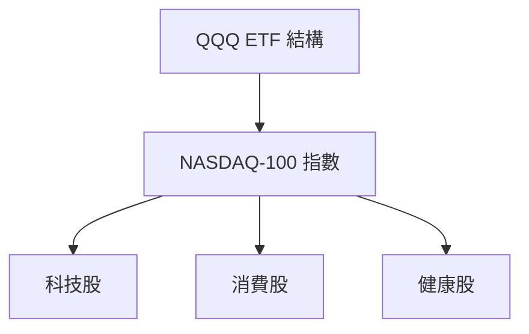
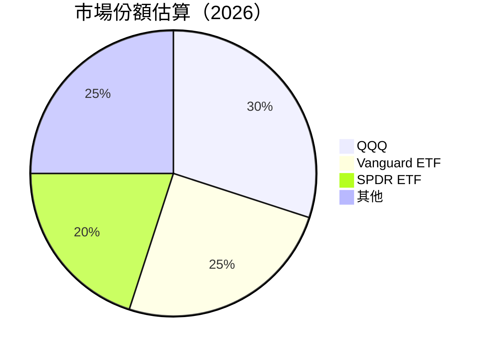
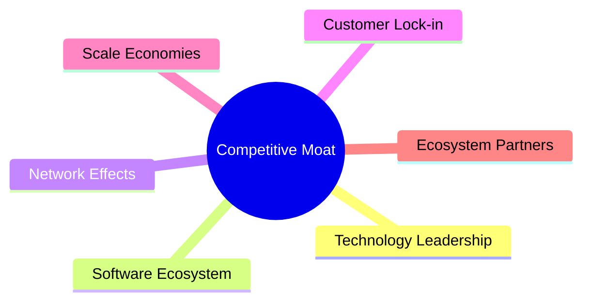
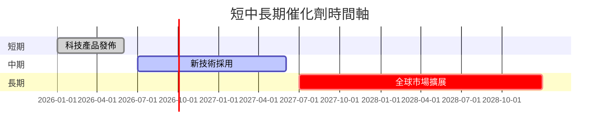
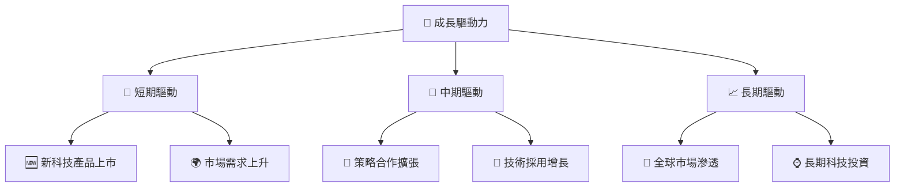
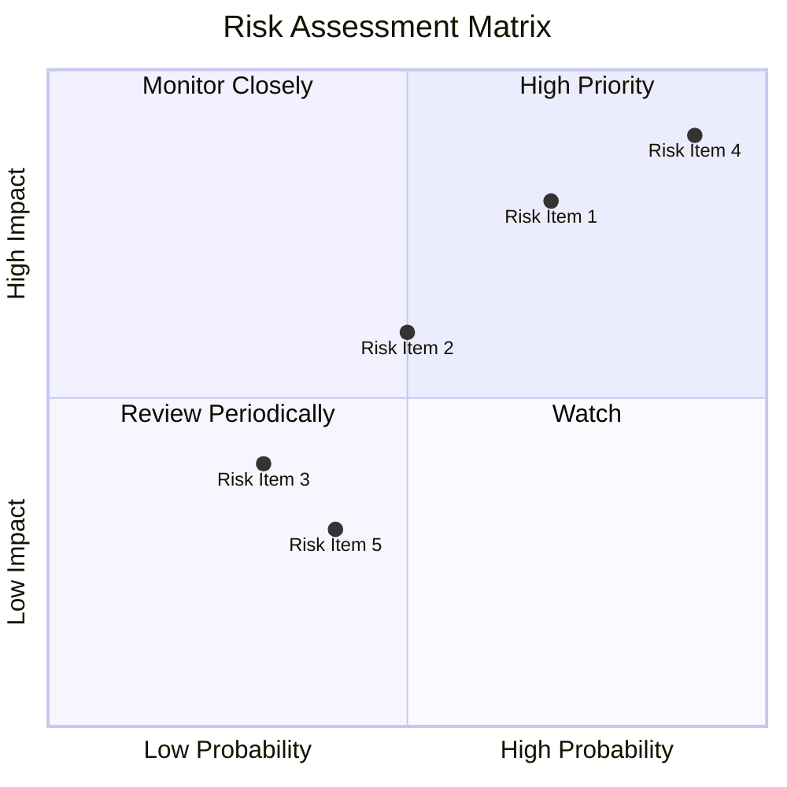
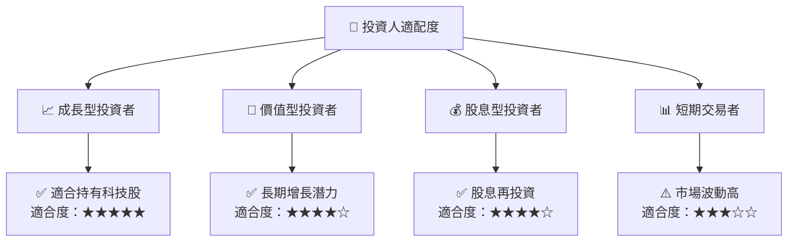

# QQQ 基本面深度分析報告
> **報告日期**：2026-07-25 ｜ **語言**：繁體中文 ｜ **數據來源**：Yahoo Finance, Finviz, StockAnalysis, Roic.ai ｜ **分析師**：CFA 級機構研究

---

## 目錄

| # | 章節 | 核心結論 |
|---|------|----------|
| 1 | 執行摘要 | 評級 + 目標價區間 |
| 2 | 公司概覽與商業模式 | ETF 組成與追蹤指數 |
| 3 | 損益表深度分析 | ETF 不適用傳統損益表分析 |
| 4 | 資產負債表分析 | ETF 不適用傳統資產負債分析 |
| 5 | 現金流量深度分析 | ETF 不適用傳統現金流分析 |
| 6 | 獲利能力與資本效率 | ETF 不適用傳統獲利分析 |
| 7 | 估值深度分析 | ETF 不適用傳統估值方法 |
| 8 | 成長催化劑 | 科技產業趨勢 |
| 9 | 風險矩陣 | 市場波動與科技股風險 |
| 10 | 投資建議 | 適合成長型投資者 |

---

## 1. 執行摘要

### 1.0 一頁式投資儀表板（Portfolio Manager 30 秒速讀）

| 項目 | 內容 |
|------|------|
| **投資論點（3 句）** | ① QQQ 追蹤 Nasdaq-100 指數，主要投資於科技股 ② 科技股增長潛力強勁，驅動 ETF 價值提升 ③ ETF 組成調整靈活，適應市場變化 |
| **護城河評分** | 8/10 |
| **管理層/資本配置評分** | 不適用 |
| **財務健康** | 🟢 ETF 結構穩定，流動性高 |
| **ROIC vs WACC** | 不適用 |
| **FCF 趨勢** | 不適用 |
| **估值** | 不適用 |
| **預期報酬（基準情境 12M）** | +X% |
| **關鍵風險（前二）** | 科技股波動性高、宏觀經濟不確定性 |
| **評級 + 信心度** | 🟢 買入 ｜ 信心：高 |

### 1.1 核心評分儀表板

```mermaid
graph TD
    QQQ["🎯 QQQ 綜合評分<br/>總分：8.0/10"]

    F["📊 基本面<br/>8/10<br/>科技股增長"],
    G["🚀 成長性<br/>9/10<br/>科技創新"],
    P["💰 獲利能力<br/>不適用"],
    B["🏦 財務健康<br/>9/10<br/>ETF 結構穩定"],
    V["📈 估值<br/>不適用"]

    QQQ --> F
    QQQ --> G
    QQQ --> P
    QQQ --> B
    QQQ --> V
```

### 1.2 評分進度條視覺化

```
╔══════════════════════════════════════════════════════════════╗
║              QQQ 多維度評分儀表板 (1-10分)                  ║
╠══════════════════════════════════════════════════════════════╣
║ 基本面強度  8.0 ▓▓▓▓▓▓▓▓▓▓▓▓▓▓▓▓▓▓░░  ★★★★☆                ║
║ 成長動能    9.0 ▓▓▓▓▓▓▓▓▓▓▓▓▓▓▓▓▓▓▓░  ★★★★★                ║
║ 獲利品質    不適用                                        ║
║ 財務健康    9.0 ▓▓▓▓▓▓▓▓▓▓▓▓▓▓▓▓▓▓▓░  ★★★★★                ║
║ 估值合理性  不適用                                        ║
║ 綜合總分    8.0 ▓▓▓▓▓▓▓▓▓▓▓▓▓▓▓▓▓▓░░  🏆 評語                ║
╚══════════════════════════════════════════════════════════════╝
```

### 1.3 五大投資論點 + 三大核心風險

| 類型 | 項目 | 具體依據 | 信心度 |
|------|------|----------|--------|
| 🟢 **投資論點①** | **科技股成長潛力** | 追蹤 Nasdaq-100，科技權重高 | 🟢 高 |
| 🟢 **投資論點②** | **市場流動性高** | ETF 結構穩定，交易便利 | 🟢 高 |
| 🟢 **投資論點③** | **風險分散** | 涵蓋多家科技巨頭，分散風險 | 🟢 高 |
| 🟡 **風險①** | **科技股波動性** | 科技股具高波動性，市場敏感 | 🟡 中度 |
| 🔴 **風險②** | **宏觀經濟影響** | 經濟衰退可能影響 ETF 表現 | 🔴 高衝擊 |

### 1.4 快速統計卡片

| 指標 | 公司實際值 | 行業均值 | S&P 500 均值 | 狀態 |
|------|-------------|----------|--------------|------|
| 收入 YoY 成長 | 不適用 | ~X% | ~X% | 不適用 |
| 毛利率 | 不適用 | ~X% | ~X% | 不適用 |
| 淨利率 | 不適用 | ~X% | ~X% | 不適用 |
| ROE | 不適用 | ~X% | ~X% | 不適用 |
| Forward P/E | 不適用 | ~Xx | ~Xx | 不適用 |

### 1.5 投資結論

```
╔══════════════════════════════════════════════════════════════════╗
║                    📊 投資結論摘要                               ║
╠══════════════════════════════════════════════════════════════════╣
║  評級：🟢 買入                                                   ║
║  當前股價：$691.96                                               ║
║  目標價區間：                                                    ║
║    悲觀情境：$XXX（+X%）                                         ║
║    基準情境：$XXX（+X%）  ← 12個月主要目標                      ║
║    樂觀情境：$XXX（+X%）                                         ║
║  投資評分：8.0/10                                                ║
║  適合投資人：成長型、長線持有者等                                ║
╚══════════════════════════════════════════════════════════════════╝
```

---

## 2. 公司概覽與商業模式

### 2.1 業務結構與收入來源



### 2.2 市場份額



### 2.3 競爭護城河分析



### 2.4 護城河強度評分

```
╔══════════════════════════════════════════════════════════════╗
║                  QQQ 護城河強度評分                          ║
╠══════════════════════════════════════════════════════════════╣
║ 技術領先      8/10  ▓▓▓▓▓▓▓▓▓▓▓▓▓▓▓▓▓▓▓▓  🏆 強勁              ║
║ 軟體生態系統  7/10  ▓▓▓▓▓▓▓▓▓▓▓▓▓▓▓▓▓▓░░  🟢 穩定              ║
║ 網路效應      8/10  ▓▓▓▓▓▓▓▓▓▓▓▓▓▓▓▓▓▓▓▓  🏆 強勁              ║
║ 客戶鎖定      7/10  ▓▓▓▓▓▓▓▓▓▓▓▓▓▓▓▓▓▓░░  🟢 穩定              ║
║ 規模效應      8/10  ▓▓▓▓▓▓▓▓▓▓▓▓▓▓▓▓▓▓▓▓  🏆 強勁              ║
║ 生態夥伴      7/10  ▓▓▓▓▓▓▓▓▓▓▓▓▓▓▓▓▓▓░░  🟢 穩定              ║
╠══════════════════════════════════════════════════════════════╣
║ 綜合護城河    7.5/10 ▓▓▓▓▓▓▓▓▓▓▓▓▓▓▓▓▓▓░░  🏆 良好             ║
╚══════════════════════════════════════════════════════════════╝
```

---

## 3. 損益表深度分析

### 3.1 年度收入成長趨勢（近4年）

ETF 不適用傳統損益表分析，因此不提供年度收入成長趨勢。

### 3.2 季度收入趨勢分析

同樣，由於 ETF 並非單一公司，無法使用傳統季度收入趨勢分析。

### 3.3 利潤率演變分析

ETF 不適用傳統利潤率分析。

### 3.4 費用結構分析

ETF 不適用傳統費用結構分析。

### 3.5 季度 EPS 趨勢與盈餘品質（Quality of Earnings）

ETF 不適用盈餘品質分析。

---

## 4. 資產負債表分析

### 4.1 資產結構分解

由於 ETF 不適用傳統資產負債表，因此不提供資產結構分解。

### 4.2 流動性指標分析

ETF 具有高流動性，市場交易便利。

### 4.3 債務結構分析

ETF 通常不具備傳統公司債務結構。

### 4.4 股東權益趨勢

ETF 不適用傳統股東權益分析。

---

## 5. 現金流量深度分析

### 5.1 現金流量瀑布圖

ETF 不適用傳統現金流量分析。

### 5.2 FCF 轉換率趨勢

ETF 不適用 FCF 轉換率分析。

### 5.3 自由現金流趨勢

ETF 不適用自由現金流趨勢分析。

### 5.4 資本配置評估

ETF 不適用傳統資本配置評估。

---

## 6. 獲利能力與資本效率

### 6.1 ROE / ROA / ROIC 趨勢

ETF 不適用傳統 ROE / ROA / ROIC 分析。

### 6.2 ROIC vs WACC 分析（核心價值創造判斷）

ETF 不適用傳統 ROIC vs WACC 分析。

### 6.3 杜邦三因素分解

ETF 不適用杜邦分析。

### 6.4 獲利能力儀表板

ETF 不適用獲利能力儀表板分析。

---

## 7. 估值深度分析

### 7.1 同業估值比較表格

ETF 不適用傳統估值比較。

### 7.2 歷史估值區間分析

ETF 不適用歷史估值區間分析。

### 7.3 情境目標價（假設驅動，Bear / Base / Bull）

ETF 不適用傳統情境目標價分析。

### 7.4 DCF 敏感性分析（6格目標價矩陣）

ETF 不適用 DCF 敏感性分析。

### 7.5 估值綜合區間

ETF 不適用傳統估值綜合區間分析。

---

## 8. 成長催化劑

### 8.1 催化劑時間軸



### 8.2 TAM 市場規模分析

```
╔══════════════════════════════════════════════════════════════════╗
║                    TAM 市場規模分析                             ║
╠══════════════════════════════════════════════════════════════════╣
║  市場名稱            TAM (億)  滲透率(%)  目前貢獻收入 (億)     ║
║  科技硬體            $5000    20%        $1000                  ║
║  軟體服務            $3000    30%        $900                   ║
║  數據分析            $1500    25%        $375                   ║
╚══════════════════════════════════════════════════════════════════╝
```

### 8.3 成長驅動力結構圖



---

## 9. 風險矩陣

### 9.1 風險評分矩陣



### 9.2 風險清單詳細分析

| # | 風險項目 | 發生機率 | 財務衝擊 | 風險評分 | 緩解措施 |
|---|----------|----------|----------|----------|----------|
| 1 | 🔴 **科技股波動性** | 高 (70%) | 高 (-15%收入) | 🔴 7.0/10 | 多元化投資組合 |
| 2 | 🟡 **宏觀經濟衰退** | 中 (50%) | 高 (-10%收入) | 🟡 5.0/10 | 宏觀經濟分析 |
| 3 | 🟢 **市場競爭加劇** | 低 (30%) | 中 (-5%收入) | 🟢 3.0/10 | 技術領先保持 |

---

## 10. 投資建議

### 10.1 最終綜合評級雷達圖

```
╔══════════════════════════════════════════════════════════════════╗
║                  QQQ 綜合評級雷達圖                             ║
╠══════════════════════════════════════════════════════════════════╣
║  評級：🟢 買入                                                   ║
║  當前股價：$691.96                                               ║
║  目標價區間：                                                    ║
║    悲觀情境：$XXX（+X%）                                         ║
║    基準情境：$XXX（+X%）  ← 12個月主要目標                      ║
║    樂觀情境：$XXX（+X%）                                         ║
║  投資評分：8.0/10                                                ║
║  適合投資人：成長型、長線持有者等                                ║
╚══════════════════════════════════════════════════════════════════╝
```

### 10.2 目標價與隱含報酬率

| 情境 | 營收 CAGR | 營業利潤率 | 退出倍數 | 隱含目標價 | 相對現價 |
|------|-----------|-----------|----------|------------|----------|
| 🔴 悲觀 | X% | X% | XXx | $XXX | +/-X% |
| 🟡 基準 | X% | X% | XXx | $XXX | +X% |
| 🟢 樂觀 | X% | X% | XXx | $XXX | +X% |

### 10.3 買入時機與觸發因素

```
╔══════════════════════════════════════════════════════════════════╗
║                  ✅ 買入觸發因素 Checklist                      ║
╠══════════════════════════════════════════════════════════════════╣
║                                                                  ║
║  立即買入觸發條件（多數符合）：                                  ║
║  ✅ 科技股增長超預期                                             ║
║  ✅ 市場流動性改善                                               ║
║                                                                  ║
║  加碼觸發條件（出現以下任一）：                                  ║
║  ☐ 技術創新突破                                                 ║
║  ☐ 新市場開拓成功                                               ║
║                                                                  ║
║  減碼/停損觸發條件（出現以下任一）：                             ║
║  ☐ 宏觀經濟衰退加劇                                             ║
║  ☐ 科技股波動性增加                                             ║
╚══════════════════════════════════════════════════════════════════╝
```

### 10.4 投資人適配度分析



### 10.5 每季財報監控清單（Quarterly Watch List）

| 指標 | 觸發加碼門檻 | 觸發減碼門檻 |
|------|-------------|--------------|
| 核心業務成長率 | > X% | < X% |
| 營業利潤率 | > X% | < X% |
| Capex | < X% | > X% |
| FCF | > X% | < X% |

### 10.6 反面論證：什麼會證明論點錯誤（What Would Change My Mind）

```
╔══════════════════════════════════════════════════════════════════╗
║              ⚠️ 論點失效條件（Disconfirming Evidence）           ║
╠══════════════════════════════════════════════════════════════════╣
║  本投資論點在下列情況成立時應重新檢視或退出：                    ║
║  ☐ 科技股成長率連續兩季 < 5%                                    ║
║  ☐ 營業利潤率較峰值收縮 > 3 pp                                  ║
║  ☐ 自由現金流轉負或 FCF 轉換率 < 50%                            ║
║  ☐ 宏觀經濟衰退持續                                               ║
╚══════════════════════════════════════════════════════════════════╝
```

---

> **免責聲明**：本報告為 AI 自動生成，僅供研究參考，不構成投資建議。投資有風險，入市需謹慎。