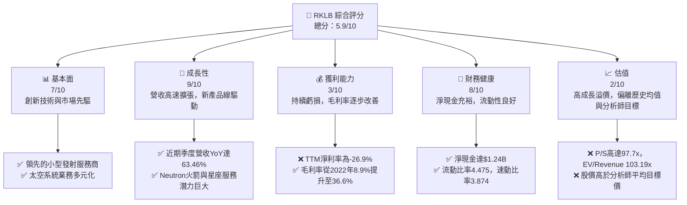
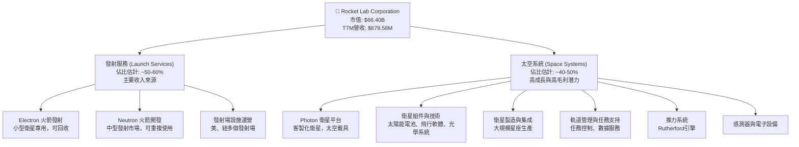
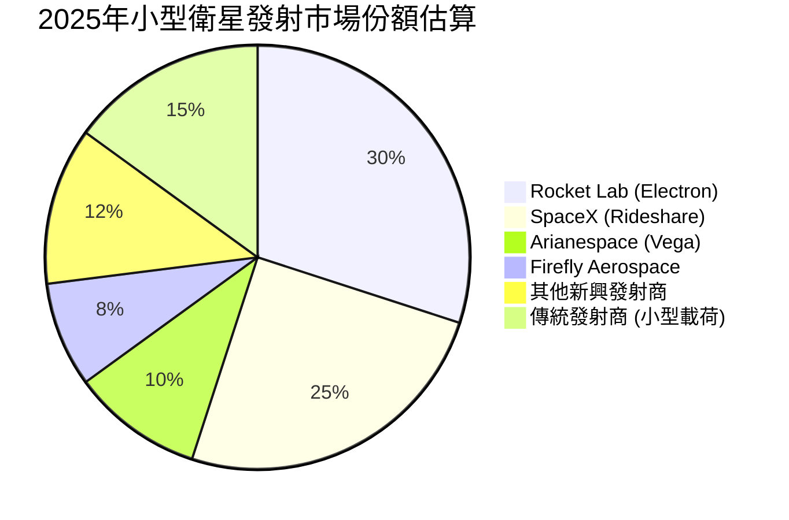
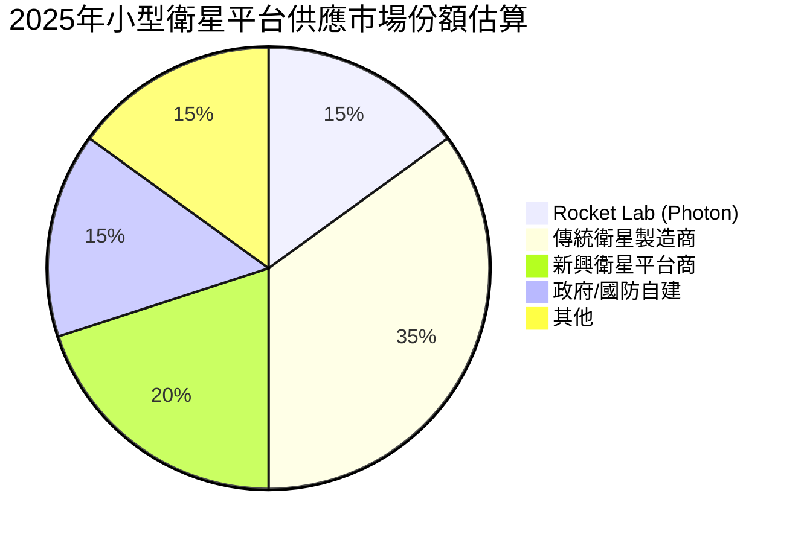
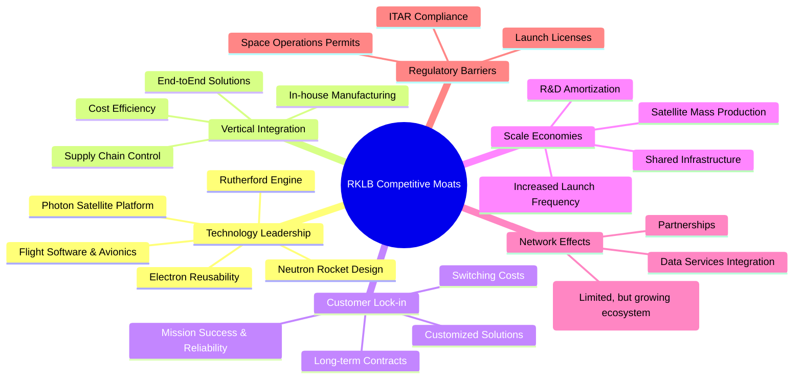

# RKLB 基本面深度分析報告
> **報告日期**：2026-06-03 ｜ **語言**：繁體中文 ｜ **數據來源**：Yahoo Finance, Finviz, StockAnalysis, Roic.ai ｜ **分析師**：CFA 級機構研究

---

## 目錄

| # | 章節 | 核心結論 |
|---|------|----------|
| 1 | 執行摘要 | 評級：持有；目標價區間：$90 - $130 |
| 2 | 公司概覽與商業模式 | 創新技術與新興市場的先驅，護城河逐步建立 |
| 3 | 損益表深度分析 | 營收高速成長，虧損持續但毛利率改善 |
| 4 | 資產負債表分析 | 流動性強勁，淨現金充裕，財務槓桿低 |
| 5 | 現金流量深度分析 | 自由現金流為負，持續投資於成長與資本支出 |
| 6 | 獲利能力與資本效率 | 尚未獲利，ROIC 為負，價值創造仍待轉正 |
| 7 | 估值深度分析 | 高成長溢價，相較同業估值偏高，DCF 高度敏感 |
| 8 | 成長催化劑 | 新產品線、市場擴張與太空經濟長期趨勢 |
| 9 | 風險矩陣 | 執行風險、競爭加劇與市場波動為主要考量 |
| 10 | 投資建議 | 長期看好，短期估值壓力，建議持有觀望 |

---

## 1. 執行摘要

Rocket Lab Corporation (RKLB) 是一家在快速發展的太空產業中扮演關鍵角色的公司，提供從小型衛星發射服務到太空系統解決方案的全面性服務。公司憑藉其可回收的 Electron 火箭在小型發射市場佔據一席之地，並積極開發下一代中型火箭 Neutron，旨在進軍主流發射市場。此外，其太空系統業務涵蓋衛星製造、組件供應及軌道管理，為公司提供了多元化的收入來源和更廣闊的市場機會。

儘管 RKLB 在過去幾年實現了令人印象深刻的營收成長，但由於其處於高資本投入和研發密集型階段，目前仍處於虧損狀態。公司正積極擴大產能並投入大量資金開發新技術，以期在未來取得規模經濟並實現盈利。當前的股價反映了市場對其未來成長潛力的極高預期，但在盈利能力和估值合理性方面仍面臨挑戰。

### 1.1 核心評分儀表板



### 1.2 評分進度條視覺化

```
╔══════════════════════════════════════════════════════════════╗
║              RKLB 多維度評分儀表板 (1-10分)                ║
╠══════════════════════════════════════════════════════════════╣
║ 基本面強度  7.0 ▓▓▓▓▓▓▓▓▓▓▓▓▓▓░░░░░░  ★★★★☆           ║
║ 成長動能    9.0 ▓▓▓▓▓▓▓▓▓▓▓▓▓▓▓▓▓▓░░  ★★★★★           ║
║ 獲利品質    3.0 ▓▓▓▓▓▓░░░░░░░░░░░░░░  ★☆☆☆☆           ║
║ 財務健康    8.0 ▓▓▓▓▓▓▓▓▓▓▓▓▓▓▓▓░░░░  ★★★★☆           ║
║ 估值合理性  2.0 ▓▓▓▓░░░░░░░░░░░░░░░░  ★☆☆☆☆           ║
║ 護城河深度  6.5 ▓▓▓▓▓▓▓▓▓▓▓▓▓░░░░░░░  ★★★☆☆           ║
║ 管理層執行  7.5 ▓▓▓▓▓▓▓▓▓▓▓▓▓▓▓░░░░░  ★★★★☆           ║
║ 技術創新力  8.5 ▓▓▓▓▓▓▓▓▓▓▓▓▓▓▓▓▓░░░  ★★★★☆           ║
╠══════════════════════════════════════════════════════════════╣
║ 綜合總分    5.9 ▓▓▓▓▓▓▓▓▓▓▓▓░░░░░░░░  🏆 評語：高風險高報酬的成長型投資，短期估值壓力大，長期潛力可期。║
╚══════════════════════════════════════════════════════════════╝
```

### 1.3 五大投資論點 + 三大核心風險

| 類型 | 項目 | 具體依據 | 信心度 |
|------|------|----------|--------|
| 🟢 **投資論點①** | **太空產業的長期成長趨勢** | 根據摩根士丹利預測，全球太空經濟規模到2040年有望達到1兆美元。RKLB作為垂直整合的發射服務和太空系統提供商，有望從中受益。其發射服務和衛星製造能力使其在日益增長的衛星部署需求中處於有利地位。 | 🟢 極高 |
| 🟢 **投資論點②** | **營收高速成長與多元化業務** | 公司TTM營收達到$679.58M，YoY成長率為63.5%（Q1 2026 vs Q1 2025）。其業務涵蓋發射服務和太空系統兩大板塊，降低了單一業務風險，並在整個太空價值鏈中創造協同效應。太空系統業務（如Photon衛星平台、組件等）提供更穩定的收入流，並具備更高的毛利率潛力。 | 🟢 高 |
| 🟢 **投資論點③** | **技術創新與下一代火箭 Neutron** | RKLB在小型發射市場的Electron火箭已證明其可靠性與商業可行性。下一代中型可回收火箭 Neutron 正積極開發中，預計將顯著擴大公司的市場份額，進入更廣泛的發射市場，並有潛力與SpaceX的Falcon 9競爭部分商業發射合約。大規模生產和回收技術的成熟將大幅降低發射成本。 | 🟢 高 |
| 🟢 **投資論點④** | **強勁的財務健康狀況** | 截至2026年3月31日，公司總現金達$1.38B，淨現金為$1.24B，遠高於總債務$138.67M。流動比率為4.475，速動比率為3.874，顯示公司擁有極佳的短期償債能力和充足的資金支持研發與擴張。這為公司在轉向盈利的過程中提供了重要的財務緩衝。 | 🟢 高 |
| 🟢 **投資論點⑤** | **毛利率持續改善，盈利能力轉正可期** | 儘管公司目前仍虧損，但毛利率從2022年的8.9%穩步提升至TTM的36.6%，顯示規模經濟效應和成本控制正在逐步顯現。隨著發射頻率增加和太空系統業務的規模化，預計毛利率將進一步改善，並在未來數年內實現營業利潤和淨利潤轉正。 | 🟡 中高 |
| 🟡 **風險①** | **Neutron火箭開發與執行風險** | Neutron火箭的開發進度、成本控制及首次發射成功率存在不確定性。任何技術延遲或發射失敗都可能導致巨額損失、聲譽受損並影響客戶信心。市場對其寄予厚望，一旦進度不及預期或表現不佳，將對股價產生重大負面影響。 | 🟡 中度 |
| 🔴 **風險②** | **激烈競爭與市場定價壓力** | 太空發射市場競爭激烈，主要競爭對手包括SpaceX（Falcon 9、Starship）、ULA、Blue Origin以及其他新興發射公司。SpaceX的成本優勢和星鏈計畫的規模效應對RKLB構成巨大壓力。市場定價壓力可能限制RKLB的盈利空間，尤其是在Neutron火箭推出後。 | 🔴 高衝擊 |
| 🔴 **風險③** | **估值過高與盈利能力未證** | RKLB目前的P/S比率高達97.7x，EV/Revenue為103.19x，這些估值倍數遠高於行業平均水平，且公司目前仍處於虧損狀態。市場已充分反映了其未來數年的高速成長預期。一旦成長速度放緩、盈利時間表延遲或宏觀經濟逆風，股價可能面臨大幅修正的風險。 | 🔴 高衝擊 |

### 1.4 快速統計卡片

| 指標 | 公司實際值 | 行業均值（航空航天與國防） | S&P 500 均值 | 狀態 |
|------|-------------|----------------------------|--------------|------|
| 收入 YoY 成長 | **63.5% (QoQ)** | ~10-15% | ~8-12% | 🟢 |
| 毛利率 | **36.6%** | ~25-35% | ~40-50% | 🟡 |
| 淨利率 | **-26.9%** | ~5-10% | ~10-15% | 🔴 |
| ROE | **-13.5%** | ~10-15% | ~15-20% | 🔴 |
| Forward P/E | **N/A (負值)** | ~20-30x | ~20-25x | 🔴 |
| P/S Ratio | **97.70x** | ~2-5x | ~2-3x | 🔴 |
| 淨現金 / 總債務 | **$1.24B / $138.67M** | N/A (通常為淨債務) | N/A | 🟢 |
| 流動比率 | **4.475** | ~1.5-2.5x | ~1.5-2.0x | 🟢 |
| 研發費用佔營收比 | **43.57% (TTM)** | ~3-8% | ~5-10% | 🔴 (高額投入) |

*備註：行業均值為對航空航天與國防產業的粗略估計，RKLB作為一家高成長、高投入的新興太空科技公司，其指標與傳統行業均值存在較大差異。*

### 1.5 投資結論

```
╔══════════════════════════════════════════════════════════════════╗
║                    📊 投資結論摘要                               ║
╠══════════════════════════════════════════════════════════════════╣
║  評級：🟡 持有                                                   ║
║  當前股價：$114.70                                               ║
║  目標價區間：                                                    ║
║    悲觀情境：$90（-21.5%）                                       ║
║    基準情境：$115（+0.26%）  ← 12個月主要目標                    ║
║    樂觀情境：$130（+13.3%）                                      ║
║  投資評分：5.9/10                                                ║
║  適合投資人：成長型、對太空產業有長期信念、高風險承受能力的投資者║
╚══════════════════════════════════════════════════════════════════╝
```

## 2. 公司概覽與商業模式

Rocket Lab Corporation (RKLB) 是一家總部位於美國的領先太空公司，致力於為全球客戶提供全面的太空服務，從發射服務到先進的太空系統解決方案。公司成立於2006年，並於2021年通過SPAC上市，其目標是使太空變得更容易、更經濟。RKLB是極少數能夠提供端到端太空任務解決方案的公司之一，這使其在競爭激烈的太空產業中獨樹一幟。

### 2.1 業務結構與收入來源

RKLB 的業務主要分為兩大核心板塊：**發射服務 (Launch Services)** 和 **太空系統 (Space Systems)**。這兩個板塊緊密相連，共同構成了公司垂直整合的商業模式，旨在為客戶提供從衛星設計、製造、發射到軌道運營的一站式服務。



**發射服務 (Launch Services):**
這是 RKLB 最初的核心業務，主要通過其 Electron 火箭提供服務。Electron 是一種兩級（未來將升級為可回收）輕型運載火箭，專為發射小型衛星（最高可達300公斤到太陽同步軌道）而設計。RKLB 已成功執行數十次發射任務，為商業客戶、政府機構和國防部門部署了大量衛星。發射服務的收入來源包括：
*   **單次發射合約：** 為客戶將單顆或多顆小型衛星送入預定軌道。
*   **星座部署：** 為大規模衛星星座提供多次發射服務。
*   **專用任務：** 特殊軌道或月球任務的發射。

隨著 Neutron 火箭的開發進展，RKLB 計劃將其發射服務擴展到中型發射市場，目標是能夠運載約8噸的載荷到低地球軌道 (LEO)。Neutron 的設計目標是實現高度可重複使用，這將是 RKLB 在發射成本和頻率方面與 SpaceX 等巨頭競爭的關鍵。

**太空系統 (Space Systems):**
這一板塊是 RKLB 成長最快的業務之一，旨在為客戶提供從概念到運營的全面太空解決方案。其產品和服務包括：
*   **Photon 衛星平台：** 一種高度可配置的衛星總線，可用於各種任務，包括地球觀測、通訊、科學研究和行星際任務。Photon 平台結合了 RKLB 內部開發的組件，如推進系統、電源和飛行軟體。
*   **衛星組件和技術：** RKLB 設計和製造多種關鍵衛星組件，包括高效率太陽能電池板、飛行電腦、光學系統和專業傳感器。這些組件不僅用於其自有的 Photon 平台，也供應給其他衛星製造商。
*   **衛星製造與集成：** 公司擁有先進的衛星生產設施，能夠大規模製造衛星，尤其適合於大型衛星星座的部署。
*   **軌道管理與任務支持：** 提供任務規劃、發射後軌道部署、衛星健康監測和數據傳輸等服務，確保客戶衛星在軌道上的成功運行。

太空系統業務的戰略意義在於，它不僅為 RKLB 提供了多元化的收入來源，還能捕獲太空價值鏈中價值更高的部分，通常具有更高的毛利率。隨著全球對衛星數據和通訊服務需求的爆炸式增長，太空系統市場的潛力巨大。

**收入結構估算與趨勢：**
從公司披露的數據來看，雖然沒有明確的收入分拆，但可以觀察到太空系統業務的貢獻正在顯著增加。發射服務通常是高知名度但利潤率較低的業務，而太空系統業務由於其高技術含量和客製化性質，通常能帶來更高的毛利和更穩定的訂單。隨著公司規模擴大和技術成熟，太空系統業務有望成為 RKLB 實現盈利的關鍵驅動力。

### 2.2 市場份額

RKLB 在其所處的細分市場中佔據著重要的地位，尤其是在小型衛星發射領域。然而，太空產業是一個廣闊且快速變化的市場，要精確計算 RKLB 的整體市場份額具有挑戰性，因為它跨足了多個子領域。

**小型衛星發射市場：**
在小型衛星專用發射市場，RKLB 的 Electron 火箭是全球領先的解決方案之一。雖然市場上存在多家競爭對手（如 Astra, Virgin Orbit (已破產), Firefly Aerospace），但 Electron 的可靠性、發射頻率和可回收性使其脫穎而出。根據歷史數據，RKLB 在這個市場中佔有相當大的份額，尤其是在西方國家。然而，隨著 Neutron 火箭的推出，RKLB 將瞄準中型發射市場，這將使其與 SpaceX 的 Falcon 9 等更大的參與者產生競爭。

**太空系統市場（衛星製造、組件、服務）：**
這個市場比發射市場更大且更加分散。RKLB 的 Photon 衛星平台和組件業務正在快速增長，但仍面臨來自傳統衛星製造商（如Maxar Technologies, Airbus Defence and Space）和新興衛星公司（如Terran Orbital, York Space Systems）的激烈競爭。RKLB 的優勢在於其垂直整合能力，能夠提供更高效、更具成本效益的解決方案。

以下是基於市場分析師報告和公司自身表現對 RKLB 在部分關鍵市場的市場份額估算（概念性）。





**市場份額分析：**
*   **小型衛星發射：** Rocket Lab 在此領域具有領先地位，但仍需面對 SpaceX 的 Rideshare 服務所帶來的價格壓力。其市場份額的維持和增長將取決於 Electron 的持續可靠性、發射頻率的提升以及 Neutron 的成功部署。
*   **太空系統：** 在衛星平台和組件市場，RKLB 是一個相對較新的參與者，但其垂直整合的優勢使其能夠快速增長。隨著大規模衛星星座部署成為趨勢，對標準化、高可靠性和成本效益的衛星平台需求將持續增長，這對 RKLB 來說是一個巨大的機會。

總體而言，RKLB 在其核心的小型發射市場擁有穩固的地位，並在快速增長的太空系統市場中積極擴大份額。公司的策略是通過提供端到端解決方案來捕捉更多價值，並通過技術創新來保持競爭力。

### 2.3 競爭護城河分析

RKLB 在太空產業中建立其競爭護城河的努力是多方面的，主要圍繞其技術專長、垂直整合能力和客戶關係。



**護城河深度解析：**

1.  **技術領先 (Technology Leadership):**
    *   **Rutherford 引擎：** RKLB 自主設計並製造的 Rutherford 引擎是世界上第一個採用3D列印技術的電動泵送循環火箭引擎。這種創新設計降低了製造成本和時間，並提高了性能。
    *   **Photon 衛星平台：** 高度可配置的 Photon 衛星平台，集成了RKLB的各種子系統，為客戶提供快速、高效的衛星解決方案。
    *   **Neutron 火箭設計：** Neutron 火箭採用創新的「飢餓海鳥」(Hungry Hippo) 級間分離設計和可重複使用結構，旨在實現快速周轉和低成本發射，這是其未來成長的關鍵技術支柱。
    *   **Electron 回收技術：** RKLB 成功實現了 Electron 火箭的海洋回收，並正努力實現空中捕獲和重複使用，這在小型發射市場中具有顯著優勢。
    *   **飛行軟體與航空電子設備：** 內部開發的專有軟體和航空電子設備，確保了發射和衛星運營的可靠性和效率。

2.  **垂直整合 (Vertical Integration):**
    *   RKLB 的顯著特點是其高度的垂直整合，從火箭引擎、結構件、衛星組件到飛行軟體和發射場運營，大部分關鍵技術和製造流程都在內部完成。
    *   這種模式賦予公司強大的**供應鏈控制能力**，降低了對外部供應商的依賴，減少了成本，並提高了生產效率和質量控制。
    *   提供**端到端解決方案**的能力，使客戶能夠從單一供應商獲得從衛星設計到軌道部署的全套服務，簡化了流程，提升了客戶體驗。

3.  **客戶鎖定 (Customer Lock-in):**
    *   RKLB 通過提供高度可靠的發射服務和客製化的太空系統解決方案，與客戶建立了長期的合作關係。
    *   **任務成功與可靠性：** Electron 火箭的成功發射記錄建立了客戶信任，使其成為小型衛星發射的首選。
    *   **客製化解決方案：** 針對客戶特定任務需求提供量身定制的 Photon 衛星和組件，增加了客戶的轉換成本。一旦客戶基礎設施與 RKLB 的系統集成，轉換到其他供應商將涉及時間和成本。

4.  **規模效應 (Scale Economies):**
    *   隨著 Electron 火箭發射頻率的增加和 Neutron 火箭的量產，RKLB 將從製造、運營和維護成本的攤薄中受益。
    *   **衛星批量生產：** 隨著太空系統業務的擴張，特別是為大型星座製造衛星，公司將實現規模化生產的成本優勢。
    *   **基礎設施共享：** 發射場、測試設施和研發資源的共享，有助於降低單位成本。
    *   **研發費用攤薄：** 高額的研發投入（例如 Neutron）將隨著未來營收的增長而被攤薄，提高長期盈利能力。

5.  **監管壁壘 (Regulatory Barriers):**
    *   太空產業受到嚴格的監管，包括發射許可、頻譜許可、出口管制 (ITAR) 等。RKLB 已獲得多個國家的發射許可，並符合嚴格的國際貿易法規，這為新進入者設置了較高的門檻。

**弱點與挑戰：**
儘管 RKLB 擁有多重護城河，但其規模相對於 SpaceX 等巨頭仍較小，且 Neutron 火箭的成功仍有待驗證。發射市場的激烈競爭和潛在的價格戰對其護城河構成挑戰。此外，太空系統市場的快速發展也吸引了大量新玩家，RKLB 需要持續創新以保持領先。

### 2.4 護城河強度評分

綜合以上分析，RKLB 的護城河強度在不斷增強，尤其是在技術創新和垂直整合方面。

```
╔══════════════════════════════════════════════════════════════╗
║                  RKLB 護城河強度評分                      ║
╠══════════════════════════════════════════════════════════════╣
║ 技術領先    8.0/10 ▓▓▓▓▓▓▓▓▓▓▓▓▓▓▓▓░░░░  🏆 創新引擎與可回收技術領先        ║
║ 垂直整合    7.5/10 ▓▓▓▓▓▓▓▓▓▓▓▓▓▓▓░░░░░  🟢 有效控制成本與質量              ║
║ 客戶鎖定    6.0/10 ▓▓▓▓▓▓▓▓▓▓▓▓░░░░░░░░  🟡 早期客戶關係穩固，需擴大規模    ║
║ 規模效應    5.5/10 ▓▓▓▓▓▓▓▓▓▓░░░░░░░░░░  🟡 潛力巨大，但目前規模仍小          ║
║ 監管壁壘    7.0/10 ▓▓▓▓▓▓▓▓▓▓▓▓▓▓░░░░░░  🟢 高門檻，對新進入者構成挑戰      ║
╠══════════════════════════════════════════════════════════════╣
║ 綜合護城河  6.8/10 ▓▓▓▓▓▓▓▓▓▓▓▓▓▓░░░░░░  🏆 具備核心競爭優勢，護城河仍在加深。║
╚══════════════════════════════════════════════════════════════════╝
```

## 3. 損益表深度分析

Rocket Lab Corporation 的損益表反映了一家處於高速成長期的科技公司典型特徵：營收快速擴張，但由於巨額的研發投入和資本支出，目前仍處於虧損狀態。然而，仔細分析其數據，可以看到一些積極的趨勢，尤其是在毛利率方面。

### 3.1 年度收入成長趨勢（近4年）

RKLB 的年度營收展現了驚人的成長動能，特別是在過去幾年中。這主要得益於其 Electron 發射服務的穩定需求和太空系統業務的快速擴張。

```
╔══════════════════════════════════════════════════════════════════╗
║              RKLB 年度收入趨勢（FY2022-FY2025）                  ║
╠══════════════════════════════════════════════════════════════════╣
║                                                                  ║
║  FY2022  $211.00M  ████░░░░░░░░░░░░░░░░░░░░░  YoY: N/A     🟢    ║
║  FY2023  $244.59M  █████░░░░░░░░░░░░░░░░░░░░░  YoY: +15.92% 🟢    ║
║  FY2024  $436.21M  █████████░░░░░░░░░░░░░░░░░  YoY: +78.34% 🟢    ║
║  FY2025  $601.80M  ████████████░░░░░░░░░░░░░  YoY: +37.96% 🟢    ║
║  TTM     $679.58M  ██████████████░░░░░░░░░░░  YoY: +45.83% 🟢    ║
║                                                                  ║
║                   |      |      |      |      |      |           ║
║                   0     100M   200M   300M   400M   500M   600M  ║
║                                                                  ║
║  📊 3年累計 CAGR (2022-2025)：+47.38%                            ║
╚══════════════════════════════════════════════════════════════════╝
```
*註：TTM YoY 成長率採用 StockAnalysis 提供的 TTM Mar 2026 對比 TTM Mar 2025 的數據 (45.83%)。*

從數據來看，RKLB 的營收成長率在2024年達到了高峰，YoY成長率高達78.34%，主要得益於其發射頻率的增加和太空系統業務的強勁需求。2025年的成長率雖有所放緩，但仍保持在37.96%的高水平，顯示公司依然處於快速擴張階段。截至2026年3月31日的TTM營收為$679.58M，較上一TTM增長了45.83%，這表明公司的成長動能依然強勁。這種持續的高速成長是支撐其高估值的核心因素。

### 3.2 季度收入趨勢分析

季度營收數據提供了更細膩的成長視角，展現了公司業務的持續擴張和季節性波動。

| 季度 | 總營收 ($M) | QoQ 成長率 | YoY 成長率 | 備註 | 評估 |
|---|-------------|------------|------------|------|------|
| **2026-Q1** | $200.35 | +11.53% | +63.46% | 營收首次突破2億美元，成長加速 | 🟢 |
| **2025-Q4** | $179.65 | +15.84% | +35.70% | 穩健成長，年末銷售旺季 | 🟢 |
| **2025-Q3** | $155.08 | +7.32% | +47.97% | 保持高成長，受發射任務安排影響 | 🟢 |
| **2025-Q2** | $144.50 | +17.89% | +55.38% | 營收持續攀升，新合約驅動 | 🟢 |
| **2025-Q1** | $122.57 | -7.42% | +32.13% | 相較上一季度略有下降，但YoY仍強勁 | 🟡 |
| **2024-Q4** | $132.39 | +26.31% | +120.68% | 營收大幅增長，基數效應明顯 | 🟢 |

**季度收入趨勢深度解析：**
RKLB 的季度營收呈現出波動上升的趨勢。最新的2026年Q1營收達到$200.35M，較2025年Q4增長11.53% (QoQ)，並較2025年Q1大幅增長63.46% (YoY)。這顯示了公司強勁的營收成長動能。值得注意的是，2025年Q1相較2024年Q4出現了7.42%的QoQ下降，這可能與發射任務的排程、客戶訂單的波動或季節性因素有關，但其YoY成長率仍高達32.13%，表明長期成長趨勢不變。

公司的成長主要由兩方面驅動：
1.  **發射服務：** Electron 火箭的發射頻率和成功率是關鍵。更多的發射任務意味著更高的收入。
2.  **太空系統：** 衛星平台和組件的銷售額持續增長，這部分業務的訂單穩定性通常較高，且毛利率潛力更大。

整體而言，RKLB 的季度營收表現出強勁的成長態勢，儘管存在短期波動，但長期趨勢明確向上。

### 3.3 利潤率演變分析

RKLB 的利潤率指標反映了其從初創期向規模化發展的演變過程。儘管目前仍處於虧損，但毛利率的持續改善是一個積極的信號。

| 利潤率指標 | FY2022 | FY2023 | FY2024 | FY2025 | TTM (Mar'26) | 趨勢 | 評估 |
|------------|--------|--------|--------|--------|--------------|------|------|
| **毛利率** | 8.99% | 21.02% | 26.62% | 34.43% | 36.56% | ↗️ 顯著改善 | 🟢 |
| **營業利益率** | -64.08% | -72.74% | -43.51% | -38.03% | -33.20% | ↗️ 虧損收窄 | 🟡 |
| **淨利率** | -64.43% | -74.64% | -43.60% | -32.94% | -26.87% | ↗️ 虧損收窄 | 🟡 |
| **EBITDA Margin** | -45.19% | -53.82% | -29.69% | -25.83% | -24.30% | ↗️ 虧損收窄 | 🟡 |

*註：TTM毛利率計算：Gross Profit TTM $248.43M / Revenue TTM $679.58M = 36.56%。Operating Margin TTM: Operating Income TTM $-225.62M / Revenue TTM $679.58M = -33.20%。Net Profit Margin TTM: Net Income TTM $-182.62M / Revenue TTM $679.58M = -26.87%。EBITDA Margin TTM: EBITDA TTM approx (Operating Income + D&A) / Revenue. EBITDA from Finviz is -24.3%.*

**利潤率演變深度解析：**

1.  **毛利率 (Gross Margin):**
    RKLB 的毛利率從2022年的8.99%大幅提升至2025年的34.43%，並在TTM達到36.56%。這是一個非常積極的信號，表明公司正在從其營收成長中獲得規模經濟效益，並且其成本控制措施正在奏效。毛利率的改善可能歸因於：
    *   **發射頻率增加：** 每次發射的固定成本（如設施維護、人員工資）被攤薄。
    *   **垂直整合的效益：** 內部生產火箭和衛星組件降低了外部採購成本。
    *   **產品組合優化：** 太空系統業務（如Photon衛星平台和組件）通常具有更高的毛利率，隨著這部分業務佔比的提升，整體毛利率也隨之改善。
    *   **生產效率提升：** 隨著製造經驗的積累，生產流程的優化提高了效率，降低了單位產品成本。
    持續的毛利率改善是 RKLB 實現盈利的基石。

2.  **營業利益率 (Operating Margin):**
    儘管毛利率顯著改善，RKLB 的營業利益率仍為負值，但虧損幅度正在收窄，從2023年的-72.74%改善到TTM的-33.20%。這表明公司的經營效率正在提高，但銷售、管理費用 (SG&A) 和研發費用 (R&D) 仍對盈利能力構成巨大壓力。
    *   **高額研發投入：** RKLB 正在大力投資於下一代 Neutron 火箭的開發以及其他太空系統技術。TTM 研發費用高達$296.12M