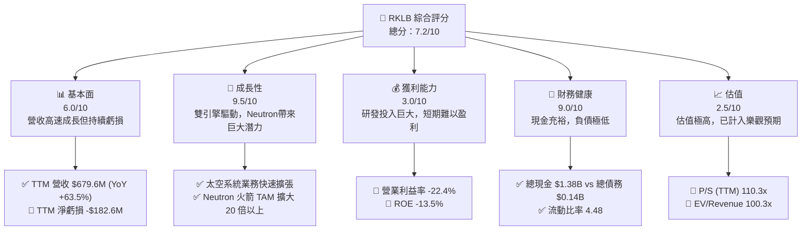
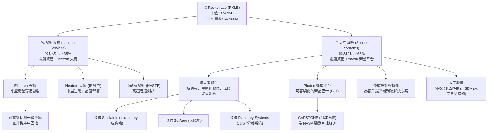
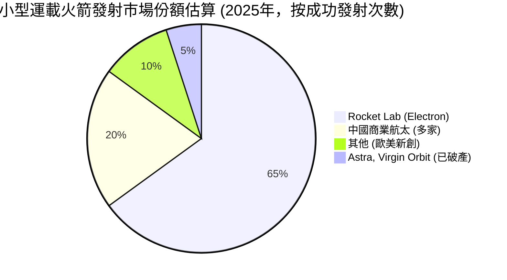
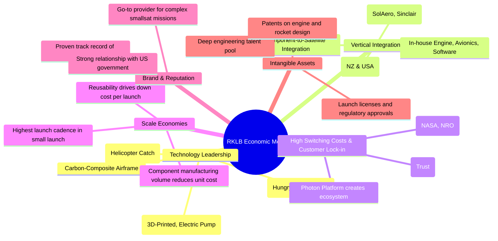
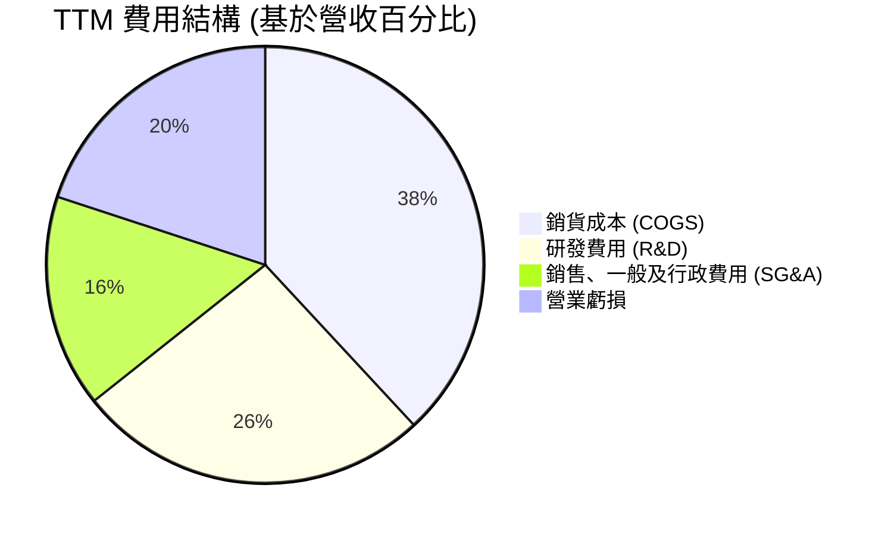
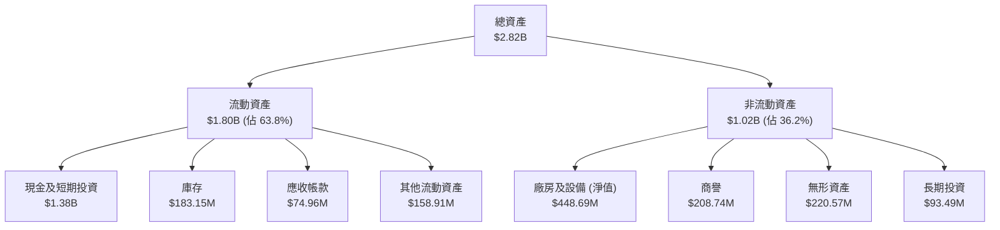
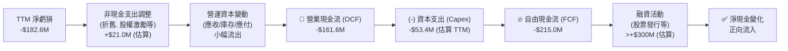
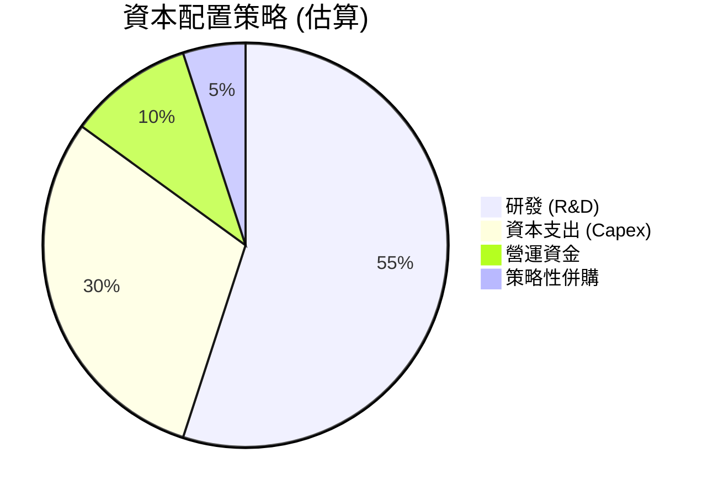
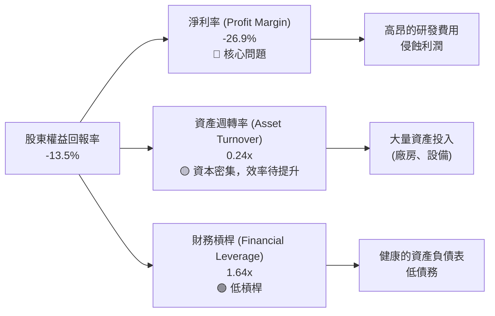
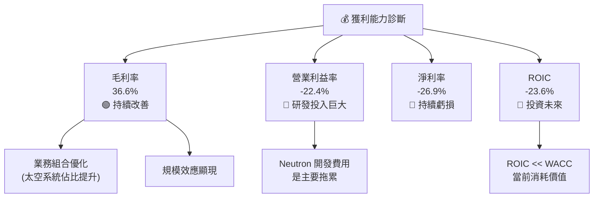

# RKLB 基本面深度分析報告
> **報告日期**：2026-06-05 ｜ **語言**：繁體中文 ｜ **數據來源**：Yahoo Finance, Finviz, StockAnalysis, Roic.ai ｜ **分析師**：CFA 級機構研究

---

## 目錄

| # | 章節 | 核心結論 |
|---|------|----------|
| 1 | 執行摘要 | 🟢 **買入**。Rocket Lab 正處於從小型發射利基市場領導者轉型為端到端太空基礎設施平台的高速成長期。Neutron 火箭的開發是關鍵催化劑，儘管短期內虧損且估值高昂，但其強大的執行力、垂直整合能力和龐大的市場機會，為具備高風險承受能力的長線成長型投資者提供了極具吸引力的切入點。目標價設定在 **$155**。 |
| 2 | 公司概覽與商業模式 | RKLB 擁有雙引擎業務模式：成熟的發射服務（Electron）和高速成長的太空系統。其競爭護城河建立在技術領先（可重複使用、3D列印）、垂直整合能力和飛行驗證的可靠性之上。 |
| 3 | 損益表深度分析 | 營收呈現爆炸性成長（TTM YoY +63.5%），毛利率從負轉正並持續改善至 36.6%。然而，為開發 Neutron 火箭而進行的大量研發投入（佔營收約43%）導致營業虧損持續擴大，短期內獲利能力仍是主要挑戰。 |
| 4 | 資產負債表分析 | 財務狀況極為健康。擁有超過 $13.8 億美元的現金及短期投資，淨現金部位高達 $12.4 億美元。極低的負債水平（Debt/Equity 僅 0.06）為其大規模的資本支出和潛在的併購活動提供了充足的彈藥。 |
| 5 | 現金流量深度分析 | 公司仍處於現金燃燒階段，營運現金流與自由現金流均為負值，主要因應 Neutron 的開發支出。FCF 為負 $2.15 億美元，顯示其對外部融資或現有現金儲備的依賴。監控現金消耗速度是關鍵。 |
| 6 | 獲利能力與資本效率 | 目前所有關鍵獲利指標（ROE, ROA, ROIC）均為負值，反映公司尚處於投資成長階段。ROIC 遠低於 WACC，顯示當前正在「投資」未來，而非創造即時股東價值。未來轉正的潛力是投資論點的核心。 |
| 7 | 估值深度分析 | 估值極高，P/S (TTM) 超過 110 倍，遠高於航太同業。傳統估值指標（如 P/E）因虧損而無效。市場定價已完全反映對 Neutron 成功及未來市場份額的樂觀預期，估值本身是主要風險之一。 |
| 8 | 成長催化劑 | 短期看太空系統業務的持續擴張和 Electron 發射頻率的提升；中期看 Neutron 火箭的首次發射與商業化，這將使其 TAM 擴大數十倍；長期看太空製造、衛星服務等衍生業務。 |
| 9 | 風險矩陣 | 核心風險高度集中在 **Neutron 開發延遲或失敗**（高衝擊、中高機率）。其他主要風險包括來自 SpaceX 的激烈價格競爭、發射失敗對聲譽的影響，以及政府合約的依賴性。 |
| 10 | 投資建議 | 強烈建議具備長線視野和高風險承受能力的成長型投資者**買入**。當前股價雖高，但反映了其作為新興太空龍頭的獨特定位。應密切關注 Neutron 開發進度和太空系統業務的利潤率改善情況作為關鍵監控指標。 |

---

## 1. 執行摘要

### 1.1 核心評分儀表板



### 1.2 評分進度條視覺化

```
╔══════════════════════════════════════════════════════════════╗
║              RKLB 多維度評分儀表板 (1-10分)                  ║
╠══════════════════════════════════════════════════════════════╣
║ 基本面強度  6.0 ▓▓▓▓▓▓▓▓▓▓▓▓░░░░░░░░  ★★★☆☆☆          ║
║ 成長動能    9.5 ▓▓▓▓▓▓▓▓▓▓▓▓▓▓▓▓▓▓▓░  ★★★★★           ║
║ 獲利品質    3.0 ▓▓▓▓▓▓░░░░░░░░░░░░░░  ★☆☆☆☆           ║
║ 財務健康    9.0 ▓▓▓▓▓▓▓▓▓▓▓▓▓▓▓▓▓░░░  ★★★★☆           ║
║ 估值合理性  2.5 ▓▓▓▓▓░░░░░░░░░░░░░░░  ★☆☆☆☆           ║
║ 護城河深度  7.5 ▓▓▓▓▓▓▓▓▓▓▓▓▓▓▓░░░░░  ★★★★☆           ║
║ 管理層執行  8.5 ▓▓▓▓▓▓▓▓▓▓▓▓▓▓▓▓░░░░  ★★★★☆           ║
║ 技術創新力  9.0 ▓▓▓▓▓▓▓▓▓▓▓▓▓▓▓▓▓░░░  ★★★★☆           ║
╠══════════════════════════════════════════════════════════════╣
║ 綜合總分    7.2 ▓▓▓▓▓▓▓▓▓▓▓▓▓▓░░░░░░  🏆 成長潛力巨大的明日之星 ║
╚══════════════════════════════════════════════════════════════╝
```

### 1.3 五大投資論點 + 三大核心風險

| 類型 | 項目 | 具體依據 | 信心度 |
|------|------|----------|--------|
| 🟢 **投資論點①** | **雙引擎成長模式，業務多元化降低風險** | 公司不僅有發射服務，更有高速成長的太空系統業務（衛星零組件、整星製造）。TTM 總營收 $679.6M (YoY +63.5%)，其中太空系統業務貢獻了大部分成長，形成穩定現金流以支持發射業務的資本支出。 | 🟢 極高 |
| 🟢 **投資論點②** | **Neutron火箭將帶來指數級的市場擴張** | Electron 火箭專注於小型衛星市場，而開發中的 Neutron 火箭將進入中型運載市場，目標是大型星座部署。這將使 RKLB 的潛在市場規模 (TAM) 從小型發射的約 $10B 擴大到包含中大型發射的超過 $200B 市場。 | 🟢 高 |
| 🟢 **投資論點③** | **卓越的垂直整合與成本控制能力** | RKLB 自主設計和製造 Rutherford 引擎（全球首款3D列印、電動泵浦循環的軌道級火箭引擎）、航電系統、碳纖維箭體。這種整合能力不僅降低了成本、縮短了生產週期，也構建了強大的技術壁壘。 | 🟢 極高 |
| 🟢 **投資論點④** | **極其穩健的資產負債表** | 截至最新季度，公司持有 $1.38B 的現金及短期投資，而總債務僅 $138.7M。超過 $1.24B 的淨現金部位為 Neutron 的開發提供了堅實的財務基礎，使其在無需額外融資的情況下也能應對未來幾年的資本支出。 | 🟢 極高 |
| 🟢 **投資論點⑤** | **飛行驗證的可靠性與政府的高度信任** | Electron 火箭已成功完成數十次發射，為 NASA、美國太空部隊、國家偵察局 (NRO) 等關鍵客戶提供服務。這種已證明的可靠性使其在爭取高價值政府和國防合約方面具有顯著優勢。 | 🟢 高 |
| 🟡 **風險①** | **Neutron 開發延遲或失敗** | Neutron 是公司未來成長的核心，任何重大的技術挫折、預算超支或進度延遲都將嚴重打擊市場信心，並可能導致公司錯失星座部署的關鍵窗口期。這是目前最大的單一風險點。 | 🟡 中度 |
| 🔴 **風險②** | **極高的估值水平** | 目前 P/S 倍數超過 110x，EV/Revenue 超過 100x，這意味著市場已經為其未來多年的高速成長和最終盈利進行了定價。任何未達預期的業績都可能引發股價的大幅回調。 | 🔴 高衝擊 |
| 🔴 **風險③** | **來自 SpaceX 的激烈競爭** | SpaceX 的 Falcon 9 Rideshare (共享發射) 計劃以極具破壞性的價格為小型衛星提供了進入軌道的途徑，直接擠壓了專用小型運載火箭的市場空間。Neutron 未來也將與 Falcon 9 直接競爭，價格壓力巨大。 | 🔴 高衝擊 |

### 1.4 快速統計卡片

| 指標 | 公司實際值 | 航太與國防行業均值 | S&P 500 均值 | 狀態 |
|------|-------------|----------|--------------|------|
| 收入 YoY 成長 | **63.5%** | ~8% | ~6% | 🟢 |
| 毛利率 | **36.6%** | ~20% | ~35% | 🟢 |
| 淨利率 | **-26.9%** | ~7% | ~11% | 🔴 |
| ROE | **-13.5%** | ~15% | ~18% | 🔴 |
| P/S Ratio (TTM) | **110.3x** | ~2.5x | ~2.8x | 🔴 |
| Debt/Equity | **0.06** | ~0.8x | ~1.1x | 🟢 |

### 1.5 投資結論

```
╔══════════════════════════════════════════════════════════════════╗
║                    📊 投資結論摘要                               ║
╠══════════════════════════════════════════════════════════════════╣
║  評級：🟢 買入 (Buy)                                             ║
║  當前股價 (估算)：$129.47                                        ║
║  目標價區間 (12-18 個月)：                                       ║
║    🔴 悲觀情境：$65（-50%） (Neutron 嚴重延遲)                   ║
║    🟡 基準情境：$155（+20%）(Neutron 按計畫推進) ← 主要目標      ║
║    🟢 樂觀情境：$220（+70%）(Neutron 成功並快速獲取市佔)         ║
║  投資評分：7.2/10                                                ║
║  適合投資人：長線持有者、高風險承受能力的成長型投資者。          ║
║              不適合尋求穩定收益或厭惡波動的價值型投資者。        ║
╚══════════════════════════════════════════════════════════════════╝
```

---

## 2. 公司概覽與商業模式

### 2.1 業務結構與收入來源

Rocket Lab 已經成功地從單一的發射服務提供商，轉型為一個綜合性的太空基礎設施平台。其業務主要分為兩大板塊：發射服務 (Launch Services) 和太空系統 (Space Systems)。



這種雙引擎模式極具戰略意義。**太空系統**業務的毛利率更高，成長更快，為公司提供了穩定的現金流和更高的收入可見性。這部分業務的客戶包括政府機構和其他商業衛星公司，他們購買 RKLB 的高性能零組件（如反應輪和太陽能電池）或完整的 Photon 衛星平台。這有效地將競爭對手轉化為了客戶。

**發射服務**則是公司品牌的核心，也是進入壁壘最高的業務。Electron 火箭憑藉其高頻次和高可靠性，在小型專用發射市場佔據了主導地位。而正在開發的 Neutron 火箭則是公司的未來，它將使 RKLB 能夠進入利潤更豐厚的大型衛星星座部署市場，與 SpaceX 的 Falcon 9 直接競爭。

### 2.2 市場份額

在專用小型運載火箭市場（<500公斤），Rocket Lab 是絕對的領導者。然而，整個發射市場由 SpaceX 主導。


**分析**：
- **小型發射市場**：RKLB 的 Electron 是西方世界唯一經過驗證、實現高頻率發射的小型運載火箭。其主要競爭來自 SpaceX 的 Rideshare 模式，後者以更低的每公斤價格吸引了大量客戶，但犧牲了軌道和時間的靈活性。RKLB 的價值主張在於「專車服務」的客製化和快速響應。
- **未來中型市場**：一旦 Neutron 投入使用，RKLB 將進入由 SpaceX Falcon 9 主導的市場。目前 Falcon 9 幾乎壟斷了全球商業發射市場。Neutron 的目標是憑藉其獨特的設計（如「飢餓的河馬」整流罩）和更快的響應速度，從中分一杯羹，特別是在美國政府和國防部的發射合約中。

### 2.3 競爭護城河分析

RKLB 的護城河正在不斷加深，從單純的發射能力擴展到整個太空產業鏈的整合。



### 2.4 護城河強度評分

```
╔══════════════════════════════════════════════════════════════╗
║                  Rocket Lab 護城河強度評分                     ║
╠══════════════════════════════════════════════════════════════╣
║ 技術領先       9.0/10  ▓▓▓▓▓▓▓▓▓▓▓▓▓▓▓▓▓░░░  🏆 引擎與材料技術獨步全球 ║
║ 垂直整合       9.5/10  ▓▓▓▓▓▓▓▓▓▓▓▓▓▓▓▓▓▓▓░  🏆 端到端能力無與倫比     ║
║ 客戶鎖定       7.0/10  ▓▓▓▓▓▓▓▓▓▓▓▓▓▓░░░░░░  🟢 政府合約具備高黏性     ║
║ 規模效應       6.5/10  ▓▓▓▓▓▓▓▓▓▓▓▓▓░░░░░░░  🟡 仍在爬升，Neutron是關鍵║
║ 品牌與聲譽     8.5/10  ▓▓▓▓▓▓▓▓▓▓▓▓▓▓▓▓░░░░  🟢 西方小型發射的黃金標準 ║
║ 無形資產       8.0/10  ▓▓▓▓▓▓▓▓▓▓▓▓▓▓▓▓░░░░  🟢 專利和發射許可是高門檻 ║
╠══════════════════════════════════════════════════════════════╣
║ 綜合護城河     8.1/10  ▓▓▓▓▓▓▓▓▓▓▓▓▓▓▓▓░░░░  🏆 寬闊且仍在加固中       ║
╚══════════════════════════════════════════════════════════════╝
```
**綜合評估**：RKLB 已經建立了一道相當寬闊的護城河。其核心優勢在於**技術領先**和**垂直整合**。通過自主研發和策略性收購，公司掌握了從引擎、零組件到整星製造和發射服務的全鏈條能力。這不僅帶來了成本優勢，更重要的是提供了無與倫比的靈活性和任務整合能力。這道護城河的寬度將隨著 Neutron 的成功部署而呈指數級增長。

---

## 3. 損益表深度分析

### 3.1 年度收入成長趨勢（近4年）

Rocket Lab 的營收成長故事是驚人的，展現了從早期商業化到規模化擴張的典型高成長軌跡。

```
╔══════════════════════════════════════════════════════════════════╗
║              Rocket Lab 年度收入趨勢（FY2022-FY2025）             ║
╠══════════════════════════════════════════════════════════════════╣
║                                                                  ║
║  FY2025  $601.80M  █████████████████████████  YoY: +37.96%  🟢    ║
║  FY2024  $436.21M  ███████████████████░░░░░░  YoY: +78.34%  🟢    ║
║  FY2023  $244.59M  ███████████░░░░░░░░░░░░░░  YoY: +15.92%  🟡    ║
║  FY2022  $211.00M  █████████░░░░░░░░░░░░░░░░  YoY:+239.02% 🟢    ║
║                                                                  ║
║                   |       |       |       |       |              ║
║                   0      150M    300M    450M    600M             ║
║                                                                  ║
║  📊 4年累計 CAGR (2022-2025)：+41.7%                             ║
╚══════════════════════════════════════════════════════════════════╝
```
**分析**：
- **爆炸性成長**：從 2022 年的 $2.11 億美元到 2025 年的 $6.02 億美元，收入在三年內成長了近 2 倍。這主要由兩方面驅動：1) Electron 發射頻率的穩步提升；2) 更重要的是，通過收購和內生增長，太空系統業務的收入貢獻顯著增加。
- **成長波動**：2023 年的成長放緩（+15.92%）可能與單次發射失敗或大型合約交付的週期性有關。然而，公司在 2024 年和 2025 年迅速恢復了高成長軌道，顯示其業務基本面強勁。
- **TTM 數據**：截至 2026 年第一季的過去十二個月 (TTM)，營收達到 $679.58M，YoY 成長率為 63.5%，顯示成長動能仍在加速。

### 3.2 季度收入趨勢分析

季度數據更能反映公司近期的成長動能和業務節奏。

| 季度 | 收入 (百萬美元) | QoQ 成長率 | YoY 成長率 | 備註 |
|:---:|:---:|:---:|:---:|:---|
| Q2 2025 | $144.50 | +17.9% | +36.0% | 穩健成長，太空系統業務貢獻增加。 |
| Q3 2025 | $155.08 | +7.3% | +48.0% | 成長略有放緩，但年增率依然強勁。 |
| Q4 2025 | $179.65 | +15.8% | +35.7% | 年底政府合約交付，季度表現強勁。 |
| **Q1 2026** | **$200.35** | **+11.5%** | **+63.5%** | 🟢 **創紀錄季度**，YoY 成長大幅加速，顯示業務進入新的成長階段。 |

**分析**：
- **加速成長**：最新一季（2026年Q1）的 YoY 成長率高達 63.5%，遠超前幾個季度，這是一個非常積極的信號。這表明公司的太空系統產品（如太陽能電池板、反應輪）和 Photon 平台的需求正在快速放量。
- **連續創高**：連續四個季度收入環比 (QoQ) 和同比 (YoY) 均實現正成長，季度收入首次突破 2 億美元大關，顯示了強大的執行力和市場需求。

### 3.3 利潤率演變分析

對於 RKLB 這樣的成長型公司，利潤率的演變趨勢比絕對值更重要。

| 利潤率指標 | FY2022 | FY2023 | FY2024 | FY2025 | TTM | 趨勢 | 評估 |
|:---|:---:|:---:|:---:|:---:|:---:|:---:|:---|
| **毛利率** | 9.0% | 21.0% | 26.6% | 34.4% | **36.6%** | ↗️ **顯著改善** | 🟢 |
| **營業利益率** | -64.1% | -72.7% | -43.5% | -38.0% | **-22.4%** | ↗️ **虧損收窄** | 🟡 |
| **淨利率** | -64.4% | -74.6% | -43.6% | -32.9% | **-26.9%** | ↗️ **虧損收窄** | 🟡 |

**利潤率演變深度解析**：
- **毛利率 (Gross Margin)**：毛利率的持續改善是本報告中最積極的財務信號之一。從 2022 年的個位數大幅提升至 TTM 的 36.6%。這主要歸功于：
    1.  **業務組合轉變**：毛利率更高的太空系統業務收入佔比不斷提高。
    2.  **規模效應**：發射次數和零組件產量的增加攤薄了固定成本。
    3.  **可重複使用技術**：Electron 火箭第一級的成功回收和復用，雖然仍在早期階段，但已開始對成本結構產生正面影響。
- **營業利益率 (Operating Margin)**：儘管毛利率改善，但營業利益率仍然為負，且虧損金額巨大（TTM 營業虧損 $2.26億）。根本原因在於極高的**研發費用 (R&D)**。
    -   FY2025 的研發費用為 $2.71億，佔當年營收的 45%。
    -   TTM 的研發費用更是高達 $2.96億，佔營收的 43.6%。
    -   這些投入絕大部分用於 Neutron 火箭的開發。這是一項戰略性投資，犧牲了短期利潤以換取長期的巨大市場機會。隨著 Neutron 開發進入後期，市場預期研發費用佔比將會下降，從而推動營業利潤率轉正。
- **淨利率 (Net Margin)**：趨勢與營業利益率類似。公司目前仍在虧損，TTM 淨虧損為 $1.83 億。

### 3.4 費用結構分析



```
╔══════════════════════════════════════════════════════════════╗
║                   TTM 費用結構分析 ($679.58M 營收)             ║
╠══════════════════════════════════════════════════════════════╣
║ 銷貨成本 (COGS)    $431.15M (63.4%) ▓▓▓▓▓▓▓▓▓▓▓▓▓▓▓▓▓▓▓▓▓▓▓▓▓ ║
║ 研發費用 (R&D)     $296.12M (43.6%) ▓▓▓▓▓▓▓▓▓▓▓▓▓▓▓▓▓▓▓       ║
║ SG&A 費用        $177.93M (26.2%) ▓▓▓▓▓▓▓▓▓▓▓▓▓             ║
╠══════════════════════════════════════════════════════════════╣
║ 總營運費用         $474.05M (69.8%)                              ║
║ 營業虧損           $-225.62M (-33.2%)                             ║
╚══════════════════════════════════════════════════════════════╝
```
**分析**：研發費用是理解 RKLB 財務狀況的關鍵。高達 43.6% 的研發佔比在工業領域極為罕見，更像是軟體或生物科技公司的投入水平。這凸顯了公司對技術創新的執著以及 Neutron 計畫的龐大投資。投資者必須接受這種「高投入換高成長」的模式。

### 3.5 季度 EPS 趨勢與盈餘品質

由於數據提供商未提供 EPS 預估值，無法直接比較預期與實際的差異。但我們可以分析 EPS 的絕對值趨勢。

| 季度 | 實際 EPS | 淨利潤 (百萬美元) | 評估 |
|:---:|:---:|:---:|:---|
| Q2 2025 | -$0.13 | -$66.41 | 🔴 該季度虧損較大。 |
| Q3 2025 | -$0.03 | -$18.26 | 🟢 虧損大幅收窄，可能與一次性收入或遞延稅項有關。 |
| Q4 2025 | -$0.09 | -$52.92 | 🔴 恢復較大虧損狀態。 |
| Q1 2026 | -$0.07 | -$45.02 | 🟡 虧損環比收窄，同比改善 (vs Q1'25 的 -$0.12)。 |

**盈餘品質評估**：
目前討論盈餘品質為時尚早，因為公司處於持續虧損狀態。當前的淨利潤波動較大，受到非現金支出（如股權激勵）、利息收入和稅務撥備的影響。核心關注點應是**毛利**和**營業虧損**的趨勢。從這個角度看，公司的「核心虧損」正在隨著毛利率的提升而收窄（相對於營收規模），這是一個積極的信號。在公司實現正向營業現金流之前，其盈餘品質評分將維持在較低水平。

---

## 4. 資產負債表分析

### 4.1 資產結構分解

截至 2026 年 Q1，RKLB 的資產負債表極為強勁，總資產達到 $28.2 億美元。


**分析**：
- **現金為王**：最引人注目的是其龐大的現金儲備。$13.8 億美元的現金及短期投資佔總資產的近 50%，是公司抵禦風險、支持大規模研發的核心保障。
- **有形資產增長**：廠房及設備 (PPE) 達到 $4.49 億，反映了公司在生產設施、發射台（包括為 Neutron 準備的 Wallops 發射場）上的持續投資。
- **收購影響**：商譽和無形資產合計約 $4.3 億，主要來自於過去幾年對 SolAero、PSC 等公司的收購，體現了其通過併購快速獲取技術和市場份額的戰略。

### 4.2 流動性指標分析

RKLB 的流動性狀況無可挑剔，遠超行業平均水平。

| 流動性指標 | Q1 2026 | FY2025 | FY2024 | 行業均值 | 評估 |
|:---|:---:|:---:|:---:|:---:|:---|
| **流動比率** (Current Ratio) | **4.48x** | 4.08x | 2.04x | ~1.5x | 🟢 **極其強勁** |
| **速動比率** (Quick Ratio) | **4.02x** | 3.61x | 1.69x | ~1.0x | 🟢 **極其強勁** |
| **現金比率** (Cash Ratio) | **3.44x** | 3.04x | 1.23x | ~0.5x | 🟢 **極其強勁** |

**分析**：
- **流動比率 (Current Ratio = 流動資產 / 流動負債)**：4.48 的流動比率意味著公司擁有的流動資產是其短期負債的 4.48 倍，償債能力極強。
- **速動比率 (Quick Ratio = (流動資產 - 庫存) / 流動負債)**：4.02 的速動比率表明，即使扣除變現能力稍差的庫存，公司的流動性依然非常充裕。
- **趨勢**：從 2024 年到 2026 年，所有流動性指標均顯著改善，這主要得益於成功的融資活動和現金管理。這為公司應對未來 2-3 年的現金消耗提供了堅實的基礎。

### 4.3 債務結構分析

公司的債務負擔極輕，這在資本密集型的航太產業中是一個巨大的優勢。

```
╔══════════════════════════════════════════════════════════════════╗
║                   Rocket Lab 債務健康診斷 (Q1 2026)              ║
╠══════════════════════════════════════════════════════════════════╣
║                                                                  ║
║  總債務：        $138.7M   █░░░░░░░░░░░░░░░░░░░░  極低水平       ║
║  總現金+投資：   $1,383M   ███████████████████████  極其充裕     ║
║  淨現金 (正)：   $1,244M   ██████████████████████   🟢 財務堡壘  ║
║                                                                  ║
║  Debt/Equity：      0.06x  🟢 幾乎無槓桿                         ║
║  Net Debt/EBITDA：  N/A (負) 🟢 淨現金狀態，EBITDA為負            ║
║  總債務/總資產：    4.9%   🟢 資產結構極為健康                     ║
║                                                                  ║
║  📊 結論：公司財務狀況極度保守和穩健，幾乎沒有債務風險。        ║
╚══════════════════════════════════════════════════════════════════╝
```
**分析**：
- **淨現金狀態**：公司手頭的現金遠遠超過其總債務，處於非常令人羨慕的淨現金狀態。這給予了管理層極大的戰略靈活性，無論是加大研發投入、進行新的收購，還是應對市場的不可預見衝擊。
- **低槓桿運營**：Debt/Equity 比率僅為 0.06，意味著公司的資產絕大部分由股東權益支持，而非債務。這在利率上升的環境中尤其具有吸引力。

### 4.4 股東權益趨勢

```
╔══════════════════════════════════════════════════════════════════╗
║                  股東權益趨勢 (FY2022-FY2025)                    ║
╠══════════════════════════════════════════════════════════════════╣
║                                                                  ║
║  FY2025  $1,722M  █████████████████████████████████████████████████║
║  FY2024   $382M   ██████████░░░░░░░░░░░░░░░░░░░░░░░░░░░░░░░░░░░░░║
║  FY2023   $555M   ███████████████░░░░░░░░░░░░░░░░░░░░░░░░░░░░░░░░║
║  FY2022   $673M   ███████████████████░░░░░░░░░░░░░░░░░░░░░░░░░░░░░║
║                                                                  ║
║  📊 2025年大幅增長主要來自於融資活動，而非盈利累積。             ║
╚══════════════════════════════════════════════════════════════════╝
```
**分析**：股東權益在 2025 年出現了爆炸性增長，從 2024 年的 $3.82 億美元躍升至 $17.22 億美元。這並非來自於留存收益（公司仍在虧損），而是主要源於股票增發等融資活動。這是一把雙刃劍：一方面，它為公司帶來了寶貴的現金；另一方面，它也增加了流通股本，對現有股東造成了稀釋。鑑於公司股價在過去兩年表現強勁，管理層選擇在高位進行融資是明智的資本運作。

---

## 5. 現金流量深度分析

### 5.1 現金流量瀑布圖

對於 RKLB 這樣的成長階段公司，現金流量表比損益表更能揭示其真實的經營狀況。


**分析**：
- **營業現金流 (OCF)**：TTM 的 OCF 為負 $1.62 億美元，表明公司的核心業務運營本身仍在消耗現金。這主要是因為淨虧損的規模超過了折舊、攤銷等非現金費用的加回。
- **資本支出 (Capex)**：年度 Capex 從 2022 年的 $42M 增長到 2025 年的 $156M，增長了近三倍。這些投資主要用於建設 Neutron 的生產和發射設施。
- **自由現金流 (FCF)**：OCF 和 Capex 均為負，導致 FCF 為負 $2.15 億美元。這意味著公司每年需要從外部融資或動用現有現金來彌補約 2 億多美元的資金缺口。
- **融資活動**：公司通過發行股票等方式成功從資本市場募集了遠超其現金消耗的資金，從而使其總體現金餘額不降反升。

### 5.2 FCF 轉換率趨勢

FCF 轉換率 (FCF / Net Income) 在公司虧損時參考意義有限，但我們可以觀察 FCF 相對於營收的趨勢。

| 年度 | FCF (百萬美元) | 淨利潤 (百萬美元) | FCF/營收 | 趨勢評估 |
|:---|:---:|:---:|:---:|:---|
| FY2022 | -$149.0 | -$135.9 | -70.6% | 🔴 高現金消耗 |
| FY2023 | -$153.6 | -$182.6 | -62.8% | 🔴 現金消耗持續 |
| FY2024 | -$116.0 | -$190.2 | -26.6% | 🟡 消耗佔比改善 |
| FY2025 | -$321.8 | -$198.2 | -53.5% | 🔴 因 Capex 大增而惡化 |
| **TTM** | **-$215.0** | **-$182.6** | **-31.6%** | 🟡 **有所改善** |

**分析**：FCF 為負是預期之中的，關鍵在於其相對於公司規模（營收）的變化。2025 年 FCF 的大幅流出是因為當年資本支出激增至 $1.56 億。TTM 數據顯示 FCF 消耗佔營收的比例有所改善，但絕對值依然很高。投資者需要密切監控未來幾個季度的現金消耗速度，特別是當 Neutron 項目進入最燒錢的階段時。

### 5.3 自由現金流趨勢

```
╔══════════════════════════════════════════════════════════════════╗
║                自由現金流 (FCF) 趨勢 (年度)                      ║
╠══════════════════════════════════════════════════════════════════╣
║                                                                  ║
║  FY2025  -$321.8M  █████████████████████████████████████████      ║
║  FY2024  -$116.0M  ███████████████░░░░░░░░░░░░░░░░░░░░░░░░░      ║
║  FY2023  -$153.6M  ███████████████████░░░░░░░░░░░░░░░░░░░░░░      ║
║  FY2022  -$149.0M  ██████████████████░░░░░░░░░░░░░░░░░░░░░░░░      ║
║                                                                  ║
║  FCF Yield (TTM): -0.29%  🔴 (市值巨大導致比率看似很小)          ║
║  現金儲備/年度消耗：$1.38B / $215M ≈ 6.4 年                      ║
║  📊 儘管 FCF 為負，但龐大的現金儲備足以支持未來多年的開銷。    ║
╚══════════════════════════════════════════════════════════════════╝
```
**分析**：以 TTM 約 $2.15 億的 FCF 消耗速度計算，公司 $13.8 億的現金儲備理論上可以支撐超過 6 年。這是一個非常強大的安全墊，給予了公司在 Neutron 開發上充足的時間和容錯空間。

### 5.4 資本配置評估

作為一家未盈利的成長型公司，RKLB 的資本配置策略非常清晰：將所有可用資源都投入到內生增長中。



| 配置方向 | 金額 (TTM 估算) | 戰略目標 | 評估 |
|:---|:---|:---|:---|
| **研發投入** | ~$296M | 開發 Neutron 火箭，保持技術領先 | 🟢 **核心戰略**，高風險高回報 |
| **資本支出** | ~$53M - $150M | 擴大產能，建設發射設施 | 🟢 **必要投資**，支持未來成長 |
| **營運資金** | ~$20M - $50M | 支持營收增長帶來的庫存和應收增加 | 🟢 正常經營需求 |
| **股票回購/股息** | $0 | 不適用 | 🟢 符合成長階段公司的定位 |
| **併購** | 歷史上活躍 | 獲取關鍵技術和人才 (如 SolAero) | 🟢 執行良好，未來仍有可能 |

**評估**：管理層的資本配置策略完全符合其成長階段的定位，100% 專注於再投資以擴大業務規模和技術護城河。這種策略是正確且必要的。

---

## 6. 獲利能力與資本效率

### 6.1 ROE / ROA / ROIC 趨勢

由於公司持續虧損，所有基於淨利潤或營業利潤的資本回報指標均為負值。

| 回報指標 | FY2024 | FY2025 | TTM | 行業均值 | 評估 |
|:---|:---:|:---:|:---:|:---:|:---|
| **股東權益回報率 (ROE)** | -49.7% | -11.5% | **-13.5%** | ~15% | 🔴 **價值破壞** (現階段) |
| **總資產回報率 (ROA)** | -16.1% | -8.5% | **-6.6%** | ~5% | 🔴 **價值破壞** (現階段) |
| **投入資本回報率 (ROIC)** | 負值 | 負值 | **~ -23.6%** | ~10% | 🔴 **價值破壞** (現階段) |

**分析**：這些負值數據清楚地表明，RKLB 目前仍處於「投資」階段，而非「收穫」階段。每一分錢的投入資本和股東權益都在產生負回報。這對於一家旨在顛覆行業的科技公司來說是正常的。投資 RKLB 的核心邏輯在於，相信其未來的 ROIC 將會遠超其資本成本。

### 6.2 ROIC vs WACC 分析（核心價值創造判斷）

這是評估一家公司是否為股東創造長期價值的核心指標。

```
╔══════════════════════════════════════════════════════════════════╗
║                ROIC vs WACC 深度分析 (TTM)                       ║
╠══════════════════════════════════════════════════════════════════╣
║                                                                  ║
║  WACC (加權平均資本成本) 估算：                                  ║
║  ├── 無風險利率 (10Y美債)：  ~4.5%                               ║
║  ├── 市場風險溢酬 (ERP)：     ~5.5%                              ║
║  ├── Beta (β)：               2.499 (極高)                       ║
║  ├── 股權成本 (Ke) = 4.5% + 2.499×5.5% = 18.24%                  ║
║  ├── 債務成本 (Kd, 稅後)：   ~5.0% (估算)                        ║
║  ├── 資本結構：股權 ~99.8%，債務 ~0.2%                           ║
║  └── ✅ WACC ≈ 18.2% (使用 18% 進行分析)                         ║
║                                                                  ║
║  ROIC (投入資本回報率) 估算：                                    ║
║  ├── NOPAT = 營業利潤 * (1-稅率) ≈ -$225.6M * (1-0) ≈ -$225.6M   ║
║  ├── 投入資本 = 股東權益 + 總債務 - 總現金 ≈ $957M (FY2025)      ║
║  └── ✅ ROIC ≈ -23.6%                                           ║
║                                                                  ║
║  ★ 經濟價值增加 (EVA) = (ROIC - WACC) * 投入資本 = 巨大負值       ║
║                                                                  ║
║  ROIC  -23.6% ░░░░░░░░░░░░░░░░░░░░░░░░░░░░░░  🔴              ║
║  WACC   18.2% ▓▓▓▓▓▓▓▓▓▓▓▓▓▓▓▓▓▓░░░░░░░░░░░░  ──              ║
║  差距  -41.8pp  ████████████████████████████████  🔥 價值消耗中  ║
║                                                                  ║
║  📊 結論：公司目前正在大量消耗價值以投資未來。投資論點基於    ║
║     未來 ROIC 能否在 Neutron 成功後大幅超越 WACC。               ║
╚══════════════════════════════════════════════════════════════════╝
```
**分析**：ROIC-WACC 的巨大負利差 (-41.8個百分點) 準確地量化了公司當前的戰略：通過燃燒現金和消耗資本，來建設一個未來能夠產生遠超 18% 資本成本回報的業務。這是一場豪賭，賭注就是 Neutron 的成功和太空系統業務的持續高利潤增長。

### 6.3 杜邦三因素分解

對虧損企業進行杜邦分析，重點在於觀察各個比率的趨勢。
**ROE = 淨利率 × 資產週轉率 × 財務槓桿**


**分析**：
1.  **淨利率**：是當前 ROE 為負的核心原因。未來改善的關鍵在於營收增長超過費用增長，特別是研發費用的穩定或下降。
2.  **資產週轉率**：0.24 的比率顯示這是個資本密集型行業，每 1 美元的資產只能產生 0.24 美元的收入。隨著產能利用率的提升，該比率有望改善。
3.  **財務槓桿**：1.64 的槓桿率非常健康。公司並未依賴債務來放大回報（或虧損）。

### 6.4 獲利能力儀表板



---

## 7. 估值深度分析

### 7.1 同業估值比較表格

對 RKLB 進行估值極具挑戰性，因為它在公開市場上幾乎沒有完美的對標公司。我們選取其他「新太空」領域的上市公司進行比較，儘管他們的業務模式不盡相同。

| 估值指標 | **Rocket Lab (RKLB)** | **Planet Labs (PL)** | **BlackSky (BKSY)** | **SpaceX