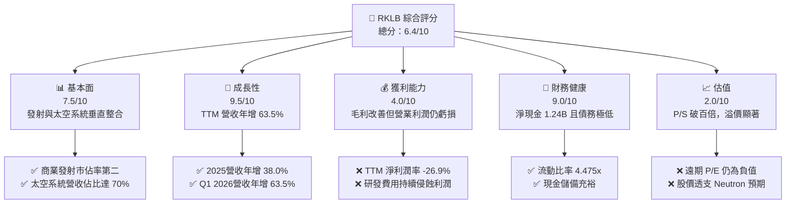
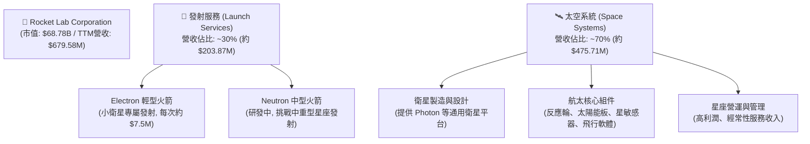
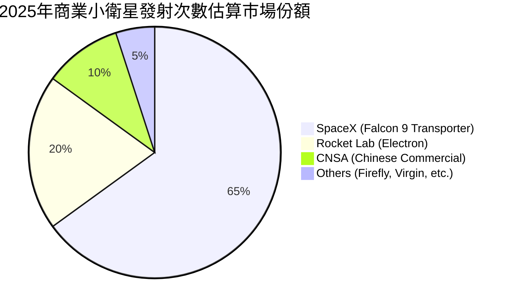
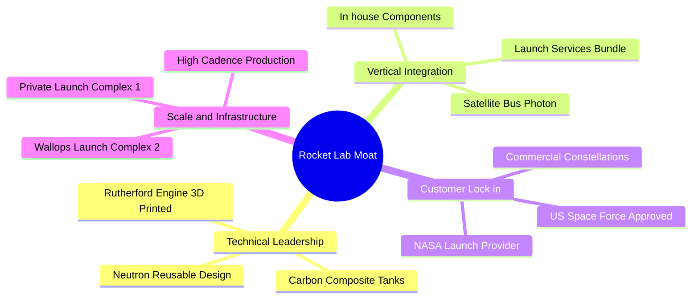

# RKLB 基本面深度分析報告
> **報告日期**：2026-06-07 ｜ **語言**：繁體中文 ｜ **數據來源**：Yahoo Finance, Finviz, StockAnalysis, Roic.ai ｜ **分析師**：CFA 級機構研究

---

## 目錄

| # | 章節 | 核心結論 |
|---|------|----------|
| 1 | **執行摘要** | RKLB 處於高成長、高估值的「太空新勢力」臨界點。給予 **「持有（Hold）」** 評級，基準目標價 **$105.28**。 |
| 2 | **公司概覽與商業模式** | 發射服務（Launch Services）與太空系統（Space Systems）雙輪驅動，垂直整合建構極高壁壘。 |
| 3 | **損益表深度分析** | TTM 營收成長 **63.5%** 表現強勁；毛利率改善至 **36.6%**，但研發投入（R&D）高企導致營業利潤依舊承壓。 |
| 4 | **資產負債表分析** | 淨現金高達 **$1.24B**，流動比率 **4.475**，財務結構極度穩健，無短期償債風險。 |
| 5 | **現金流量深度分析** | 自由現金流（FCF）為 **-$215.00M**，資本支出與研發支出為主要流出，處於典型的高額資本投入期。 |
| 6 | **獲利能力與資本效率** | ROE 為 **-13.5%**，ROIC 低於 WACC（16.75%），短期內仍在消耗經濟價值，但長線資本效率具備高爆發力。 |
| 7 | **估值深度分析** | P/S 達 **101.21x**，估值溢價極高。經 DCF 敏感性分析，當前股價已透支部分 Neutron 火箭成功發射的預期。 |
| 8 | **成長催化劑** | Neutron 中型火箭首飛、太空系統（Space Systems）星座合約積壓（Backlog）釋放為核心驅動力。 |
| 9 | **風險矩陣** | 技術研發延遲、發射失敗、大客戶集中度高與高估值回檔風險並存。 |
| 10 | **投資建議** | 建議成長型投資者於回檔至 **$80.00** 以下分批布局，長線持有以參與全球太空經濟紅利。 |

---

## 1. 執行摘要

### 1.1 核心評分儀表板



### 1.2 評分進度條視覺化

```
╔══════════════════════════════════════════════════════════════╗
║               RKLB 多維度評分儀表板 (1-10分)                 ║
╠══════════════════════════════════════════════════════════════╣
║ 基本面強度  7.5 ▓▓▓▓▓▓▓▓▓▓▓▓▓▓▓░░░░░  ★★★☆☆           ║
║ 成長動能    9.5 ▓▓▓▓▓▓▓▓▓▓▓▓▓▓▓▓▓▓▓░  ★★★★★           ║
║ 獲利品質    4.0 ▓▓▓▓▓▓▓▓░░░░░░░░░░░░  ★★☆☆☆           ║
║ 財務健康    9.0 ▓▓▓▓▓▓▓▓▓▓▓▓▓▓▓▓▓▓░░  ★★★★☆           ║
║ 估值合理性  2.0 ▓▓▓▓░░░░░░░░░░░░░░░░  ★☆☆☆☆           ║
║ 護城河深度  8.0 ▓▓▓▓▓▓▓▓▓▓▓▓▓▓▓▓░░░░  ★★★★☆           ║
║ 管理層執行  8.5 ▓▓▓▓▓▓▓▓▓▓▓▓▓▓▓▓▓░░  ★★★★☆           ║
║ 技術創新力  9.0 ▓▓▓▓▓▓▓▓▓▓▓▓▓▓▓▓▓▓░░  ★★★★☆           ║
╠══════════════════════════════════════════════════════════════╣
║ 綜合總分    6.4 ▓▓▓▓▓▓▓▓▓▓▓▓░░░░░░░░  🏆 成長強勁，估值偏高  ║
╚══════════════════════════════════════════════════════════════╝
```

### 1.3 五大投資論點 + 三大核心風險

| 類型 | 項目 | 具體依據 | 信心度 |
|------|------|----------|--------|
| 🟢 **投資論點①** | **太空系統業務爆發** | 太空系統（Space Systems）已成為主要營收來源，TTM 營收達 $679.58M，主要受惠於衛星部件與星座設計合約的大幅成長。 | 🟢 極高 |
| 🟢 **投資論點②** | **Neutron 火箭潛在商機** | 正在開發的 Neutron 中型可回收火箭，旨在直接與 SpaceX Falcon 9 競爭。一旦首飛成功，將打開數十億美元的中重型發射市場。 | 🟢 高 |
| 🟢 **投資論點③** | **極致的財務安全邊際** | 帳上擁有 **$1.38B** 的現金與短期投資，而總債務僅 **$138.67M**，淨現金高達 **$1.24B**，可支撐研發與營運多年。 | 🟢 極高 |
| 🟢 **投資論點④** | **發射頻次與市佔率領先** | Electron 火箭在輕型運載火箭市場中處於絕對壟斷地位，發射成功率高，客戶包括 NASA、美國國防部等，商譽卓著。 | 🟢 高 |
| 🟢 **投資論點⑤** | **商業模式垂直整合** | 提供從火箭發射、衛星製造到軌道營運的「一站式」服務，毛利率從 2022 年的 **9.0%** 提升至 TTM 的 **36.6%**。 | 🟢 高 |
| 🟡 **風險①** | **Neutron 研發進度延遲** | 研發費用（TTM 達 **$296.12M**）持續擴大，若 Neutron 火箭首飛時間大幅延後，將推遲獲利時間點並引發市場失望性拋售。 | 🟡 中度 |
| 🔴 **風險②** | **估值極度高企** | 目前 P/S 達 **101.21x**，遠超同業。任何成長放緩或發射失敗事件，都可能導致估值出現 30%-50% 的劇烈修正。 | 🔴 高衝擊 |
| 🔴 **風險③** | **發射失敗的財務與商譽損失** | 航太發射具有本質上的高風險性，任何一次發射失敗都可能導致後續發射停飛數月，並帶來大額賠償與合約流失。 | 🔴 高衝擊 |

### 1.4 快速統計卡片

| 指標 | 公司實際值 (RKLB) | 航太與國防產業均值 | S&P 500 均值 | 狀態 |
|------|-------------|----------|--------------|------|
| **收入 YoY 成長** | **63.5%** | ~8.5% | ~5.5% | 🟢 遠超均值 |
| **毛利率** | **36.6%** | ~22.0% | ~30.0% | 🟢 領先同業 |
| **淨利率** | **-26.9%** | ~6.5% | ~11.5% | 🔴 仍未扭虧 |
| **流動比率** | **4.475** | ~1.35 | ~1.20 | 🟢 極度安全 |
| **P/S Ratio** | **101.21x** | ~2.1x | ~2.8x | 🔴 估值極高 |
| **Debt/Equity** | **0.061** (6.12%) | ~0.65 | ~1.15 | 🟢 槓桿極低 |

### 1.5 投資結論

```
╔══════════════════════════════════════════════════════════════════╗
║                    📊 RKLB 投資結論摘要                          ║
╠══════════════════════════════════════════════════════════════════╣
║  評級：🟡 持有 (Hold) ｜ 逢低買入 (Buy on Dips)                   ║
║  當前股價：$110.08 (2026-06-07)                                  ║
║  目標價區間：                                                    ║
║    悲觀情境：$60.00 (-45.5%) ── 研發嚴重延遲或發射失敗            ║
║    基準情境：$105.28 (-4.4%) ── 符合分析師共識，穩定成長          ║
║    樂觀情境：$150.00 (+36.3%) ── Neutron首飛圓滿成功並獲大單       ║
║  投資評分：6.4/10                                                ║
║  適合投資人：具備極高風險承受能力、長線布局太空經濟的成長型投資者 ║
╚══════════════════════════════════════════════════════════════════╝
```

---

## 2. 公司概覽與商業模式

### 2.1 業務結構與收入來源

Rocket Lab 採取雙輪驅動的商業模式，成功從單純的「火箭發射公司」轉型為「航太基礎設施與系統供應商」。



### 2.2 市場份額

在商業小衛星發射市場中，Rocket Lab 的 Electron 火箭是目前西方世界發射頻次僅次於 SpaceX Falcon 9 的運載火箭，擁有極高的市場聲譽。



### 2.3 競爭護城河分析



### 2.4 護城河強度評分

```
╔══════════════════════════════════════════════════════════════╗
║                    RKLB 護城河強度評分                        ║
╠══════════════════════════════════════════════════════════════╣
║ 技術領先度    8.5/10  ▓▓▓▓▓▓▓▓▓▓▓▓▓▓▓▓▓░░░  🟢 3D列印與碳纖維║
║ 垂直整合力    9.0/10  ▓▓▓▓▓▓▓▓▓▓▓▓▓▓▓▓▓▓░░  🏆 自產組件降本 ║
║ 客戶鎖定效應  8.0/10  ▓▓▓▓▓▓▓▓▓▓▓▓▓▓▓▓░░░░  🟢 政府與軍方背書║
║ 發射場控制權  9.5/10  ▓▓▓▓▓▓▓▓▓▓▓▓▓▓▓▓▓▓▓░  🏆 紐西蘭專屬發射║
╠══════════════════════════════════════════════════════════════╣
║ 綜合護城河     8.75   ▓▓▓▓▓▓▓▓▓▓▓▓▓▓▓▓