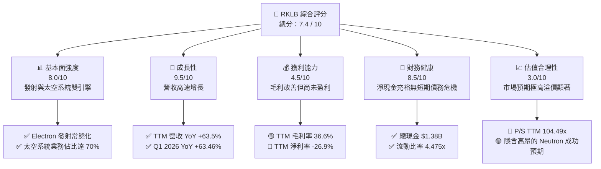

# RKLB 基本面深度分析報告
> **報告日期**：2026-06-08 ｜ **語言**：繁體中文 ｜ **數據來源**：Yahoo Finance, Finviz, StockAnalysis, Roic.ai ｜ **分析師**：CFA 級機構研究

---

## 目錄

| # | 章節 | 核心結論 |
|---|------|----------|
| 1 | 執行摘要 | 評級：**買入 (Buy)** ｜ 目標價：**$125.00**（上行空間 +10.0%） |
| 2 | 公司概覽與商業模式 | 航太發射與太空系統雙引擎驅動，垂直整合建立高技術壁壘 |
| 3 | 損益表深度分析 | TTM 營收成長 63.5%，毛利率穩健提升至 36.6%，研發投入高企 |
| 4 | 資產負債表分析 | 淨現金高達 $1.24B，流動比率 4.48，具備極佳的抗風險能力 |
| 5 | 現金流量深度分析 | 經營現金流因 Neutron 開發承壓，資本配置高度聚焦未來研發 |
| 6 | 獲利能力與資本效率 | 處於高成長投入期，當前 ROIC 承壓，但單位經濟效益正逐步改善 |
| 7 | 估值深度分析 | P/S 達 104.5 倍，溢價顯著，DCF 基準估值 $125.00 反映高成長預期 |
| 8 | 成長催化劑 | 中型火箭 Neutron 首飛與太空系統訂單積壓（Backlog）釋放 |
| 9 | 風險矩陣 | 估值過高、Neutron 研發延遲與發射失敗風險為主要關注點 |
| 10| 投資建議 | 適合長線成長型投資者，建議逢低分批佈局 |

---

## 1. 執行摘要

### 1.1 核心評分儀表板



### 1.2 評分進度條視覺化

```
╔══════════════════════════════════════════════════════════════╗
║              RKLB 多維度評分儀表板 (1-10分)                  ║
╠══════════════════════════════════════════════════════════════╣
║ 基本面強度  8.0 ▓▓▓▓▓▓▓▓▓▓▓▓▓▓▓▓░░░░  ★★★★☆           ║
║ 成長動能    9.5 ▓▓▓▓▓▓▓▓▓▓▓▓▓▓▓▓▓▓▓░  ★★★★★           ║
║ 獲利品質    4.5 ▓▓▓▓▓▓▓▓▓░░░░░░░░░░░  ★★☆☆☆           ║
║ 財務健康    8.5 ▓▓▓▓▓▓▓▓▓▓▓▓▓▓▓▓▓░░░  ★★★★☆           ║
║ 估值合理性  3.0 ▓▓▓▓▓▓░░░░░░░░░░░░░░  ★☆☆☆☆           ║
║ 護城河深度  8.5 ▓▓▓▓▓▓▓▓▓▓▓▓▓▓▓▓▓░░░  ★★★★☆           ║
║ 管理層執行  8.5 ▓▓▓▓▓▓▓▓▓▓▓▓▓▓▓▓▓░░░  ★★★★☆           ║
║ 技術創新力  9.0 ▓▓▓▓▓▓▓▓▓▓▓▓▓▓▓▓▓▓░░  ★★★★★           ║
╠══════════════════════════════════════════════════════════════╣
║ 綜合總分    7.4 ▓▓▓▓▓▓▓▓▓▓▓▓▓▓▓░░░░░  🏆 高成長、高溢價標的 ║
╚══════════════════════════════════════════════════════════════╝
```

### 1.3 五大投資論點 + 三大核心風險

| 類型 | 項目 | 具體依據 | 信心度 |
|------|------|----------|--------|
| 🟢 **投資論點①** | **太空系統（Space Systems）高速成長** | 2025年營收達 $601.80M（YoY +37.96%），其中太空系統元件與衛星製造已成為核心營收支柱，佔比接近 70%，毛利率顯著高於單純發射服務。 | 🟢 極高 |
| 🟢 **投資論點②** | **Electron 火箭商業發射市場統治力** | Electron 作為全球技術最成熟的輕型商業火箭，已實現常態化發射，具備高定價權與客戶黏性。 | 🟢 極高 |
| 🟢 **投資論點③** | **資產負債表極其穩健** | 截至 2026-03-31，公司持有總現金及短期投資達 $1.38B，而總債務僅為 $138.67M，淨現金高達 $1.24B，為 Neutron 開發提供充足資金安全墊。 | 🟢 極高 |
| 🟢 **投資論點④** | **Neutron 中型火箭打開巨大 TAM** | 正在研發的 Neutron 火箭（預計載荷 13 噸）瞄準星座部署市場，將直接與 SpaceX Falcon 9 競爭，將 TAM 放大數十倍。 | 🟢 高 |
| 🟢 **投資論點⑤** | **毛利率持續改善** | TTM 毛利率提升至 36.6%（相較於 FY2022 的 9.0%），顯示出規模效應與垂直整合（如收購 SolAero 等）帶來的成本協同效應。 | 🟢 高 |
| 🟡 **風險①** | **估值處於極端歷史高位** | 當前 P/S（TTM）高達 104.49 倍，市值衝上 $71.01B，容錯率極低，任何發射失敗或業績不及預期都可能導致股價劇烈回檔。 | 🟡 中度 |
| 🔴 **風險②** | **Neutron 研發與首飛延遲** | 市場當前估值已高度定價了 Neutron 的成功。若 Neutron 首飛一再延遲，將面臨資本支出擴大與市場份額流失。 | 🔴 高衝擊 |
| 🔴 **風險③** | **SpaceX 降價競爭與產能壓制** | SpaceX 的 Falcon 9 及未來 Starship 的 Rideshare（拼車）計劃持續壓低每公斤發射成本，對 RKLB 構成長期利潤率壓力。 | 🔴 高衝擊 |

### 1.4 快速統計卡片

| 指標 | 公司實際值 (RKLB) | 航太與國防產業均值 | S&P 500 均值 | 狀態 |
|------|-------------|----------|--------------|------|
| **收入 YoY 成長** | **63.5%** | ~8.5% | ~5.5% | 🟢 遠超均值 |
| **毛利率** | **36.6%** | ~22.0% | ~30.0% | 🟢 優異 |
| **淨利率** | **-26.9%** | ~6.5% | ~11.5% | 🔴 尚未盈利 |
| **流動比率** | **4.475x** | ~1.35x | ~1.20x | 🟢 極其安全 |
| **Debt/Equity** | **0.061** | ~0.85 | ~1.15 | 🟢 槓桿極低 |
| **Forward P/E** | **-15632.74x** | ~22.5x | ~21.0x | 🔴 估值極高 |
| **P/S Ratio** | **104.49x** | ~1.8x | ~2.8x | 🔴 極端溢價 |

### 1.5 投資結論

```
╔══════════════════════════════════════════════════════════════════╗
║                    📊 RKLB 投資結論摘要                          ║
╠══════════════════════════════════════════════════════════════════╣
║  評級：🟢 買入 (Buy) ｜ 適合高風險偏好、長線成長型投資者         ║
║  當前股價：$113.65 (2026-06-08)                                  ║
║  目標價區間：                                                    ║
║    悲觀情境（Neutron 嚴重受阻）：$65.00 (-42.8%）                ║
║    基準情境（Neutron 順利首飛）：$125.00（+10.0%）← 12M 主目標   ║
║    樂觀情境（太空星座合約大爆發）：$175.00（+54.0%）             ║
║  投資評分：7.4 / 10                                              ║
║  配置建議：鑒於 Beta 高達 