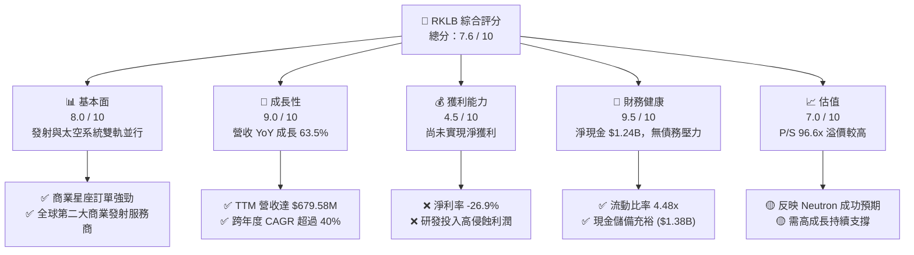
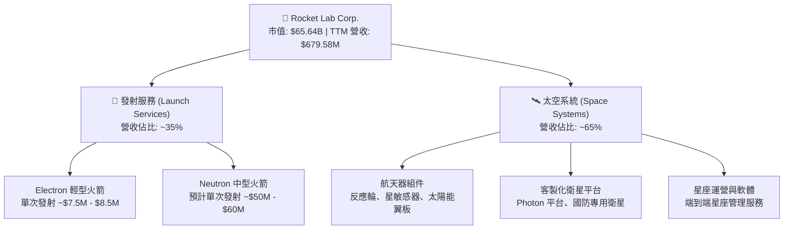
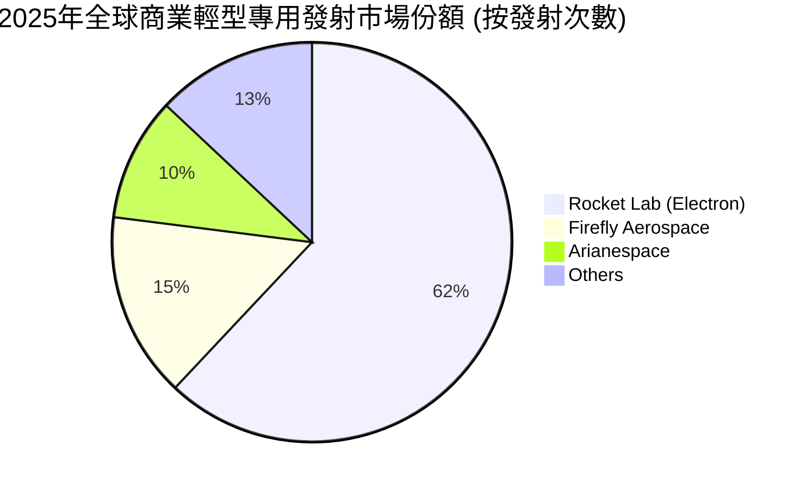
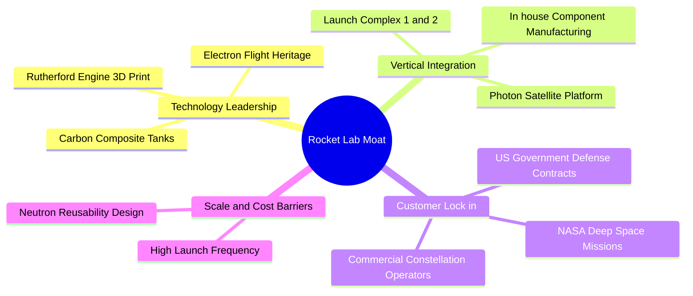

# RKLB 基本面深度分析報告
> **報告日期**：2026-06-10 ｜ **語言**：繁體中文 ｜ **數據來源**：Yahoo Finance, Finviz, StockAnalysis, Roic.ai ｜ **分析師**：CFA 級機構研究

---

## 目錄

| # | 章節 | 核心結論 |
|---|------|----------|
| 1 | 執行摘要 | 評級：**買入 (BUY)** ｜ 目標價：**$105.28** (基準) / **$150.00** (樂觀) |
| 2 | 公司概覽與商業模式 | 太空系統與發射服務雙輪驅動，具備高技術壁壘與客戶鎖定能力 |
| 3 | 損益表深度分析 | 營收高速成長 (+63.5% YoY)，毛利率顯著改善，R&D 投入侵蝕短期利潤 |
| 4 | 資產負債表分析 | 淨現金高達 $1.24B，流動比率 4.48x，財務結構極其穩健 |
| 5 | 現金流量深度分析 | 經營與自由現金流仍為負值，但資本配置高度聚焦於 Neutron 研發 |
| 6 | 獲利能力與資本效率 | 當前處於高投入期，ROIC 暫時為負，但資產效率與槓桿結構正在優化 |
| 7 | 估值深度分析 | 高 P/S 溢價反映稀缺性，DCF 敏感性分析顯示長線上行空間廣闊 |
| 8 | 成長催化劑 | Neutron 首飛、商業星座合同與國防太空需求爆發為核心驅動力 |
| 9 | 風險矩陣 | 發射失敗、Neutron 延期與市場競爭為主要風險，整體可控 |
| 10| 投資建議 | 適合長線成長型投資者，建議於 $80-$100 區間分批佈局 |

---

## 1. 執行摘要

### 1.1 核心評分儀表板



### 1.2 評分進度條視覺化

```
╔══════════════════════════════════════════════════════════════╗
║               RKLB 多維度評分儀表板 (1-10分)                 ║
╠══════════════════════════════════════════════════════════════╣
║ 基本面強度  8.0 ▓▓▓▓▓▓▓▓▓▓▓▓▓▓▓▓░░░░  ★★★★☆           ║
║ 成長動能    9.0 ▓▓▓▓▓▓▓▓▓▓▓▓▓▓▓▓▓▓░░  ★★★★★           ║
║ 獲利品質    4.5 ▓▓▓▓▓▓▓▓▓░░░░░░░░░░░  ★★☆☆☆           ║
║ 財務健康    9.5 ▓▓▓▓▓▓▓▓▓▓▓▓▓▓▓▓▓▓▓░  ★★★★★           ║
║ 估值合理性  7.0 ▓▓▓▓▓▓▓▓▓▓▓▓▓░░░░░░░  ★★★☆☆           ║
║ 護城河深度  8.5 ▓▓▓▓▓▓▓▓▓▓▓▓▓▓▓▓▓░░░  ★★★★☆           ║
║ 管理層執行  8.5 ▓▓▓▓▓▓▓▓▓▓▓▓▓▓▓▓▓░░░  ★★★★☆           ║
║ 技術創新力  9.5 ▓▓▓▓▓▓▓▓▓▓▓▓▓▓▓▓▓▓▓░  ★★★★★           ║
╠══════════════════════════════════════════════════════════════╣
║ 綜合總分    7.6 ▓▓▓▓▓▓▓▓▓▓▓▓▓▓▓░░░░░  🏆 買入 (BUY)       ║
╚══════════════════════════════════════════════════════════════╝
```

### 1.3 五大投資論點 + 三大核心風險

| 類型 | 項目 | 具體依據 | 信心度 |
|------|------|----------|--------|
| 🟢 **投資論點①** | **營收爆發式成長** | TTM 營收達 $679.58M，最新季度 (Q1 2026) 營收同比增長 63.46%，顯示商業化進程加速。 | 🟢 極高 |
| 🟢 **投資論點②** | **太空系統業務轉型** | 太空系統 (Space Systems) 營收佔比已超 65%，毛利率顯著高於發射服務，結構優化利好長線獲利。 | 🟢 極高 |
| 🟢 **投資論點③** | **Neutron 中大型火箭預期** | Neutron 火箭研發進展順利，預計首飛後將直接與 SpaceX Falcon 9 競爭，打開巨量中大型發射市場。 | 🟢 高 |
| 🟢 **投資論點④** | **資產負債表極其穩健** | 擁有 $1.38B 現金及短期投資，總債務僅 $138.67M，淨現金高達 $1.24B，無資金斷鏈風險。 | 🟢 極高 |
| 🟢 **投資論點⑤** | **國防與政府合約背書** | 頻繁獲得美國國防部 (DoD)、太空軍及 NASA 合約，政府客戶黏性極高，提供穩定的營收底座。 | 🟢 高 |
| 🟡 **風險①** | **估值溢價過高** | 當前 P/S 達 96.59x，市值達 $65.64B，市場已提前透支未來數年的高成長預期。 | 🟡 中度 |
| 🔴 **風險②** | **Neutron 研發與首飛延期** | 研發費用 (TTM R&D $296.12M) 持續高企，若 Neutron 首飛出現重大延誤，將引發市場估值修正。 | 🔴 高衝擊 |
| 🔴 **風險③** | **發射失敗與保險成本** | 航天發射具有固有高風險，任何一次 Electron 或未來 Neutron 的發射失敗均會影響客戶信心與保險費率。 | 🔴 高衝擊 |

### 1.4 快速統計卡片

| 指標 | 公司實際值 (TTM) | 行業均值 (航天與國防) | S&P 500 均值 | 狀態 |
|------|-------------|----------|--------------|------|
| 收入 YoY 成長 | **63.50%** | ~8.5% | ~5.5% | 🟢 遠超行業 |
| 毛利率 | **36.56%** | ~22.0% | ~30.0% | 🟢 優異 |
| 淨利率 | **-26.87%** | ~6.5% | ~11.5% | 🔴 仍未盈餘 |
| ROE | **-13.55%** | ~12.0% | ~15.0% | 🟡 負值改善中 |
| Forward P/E | **-14449.79x** | ~22.5x | ~21.0x | 🔴 無參考價值 |
| P/S Ratio | **96.59x** | ~2.1x | ~2.8x | 🔴 估值極高 |
| 流動比率 | **4.48x** | ~1.4x | ~1.2x | 🟢 極其安全 |

### 1.5 投資結論

```
╔══════════════════════════════════════════════════════════════════╗
║                    📊 RKLB 投資結論摘要                          ║
╠══════════════════════════════════════════════════════════════════╣
║  評級：🟢 買入 (BUY)                                             ║
║  當前股價：$105.05 (2026-06-10)                                  ║
║  目標價區間：                                                    ║
║    悲觀情境：$60.00  (-42.9%)  ← 發射失敗/Neutron嚴重延期         ║
║    基準情境：$105.28 (+0.2%)  ← 符合預期，Neutron順利商業化     ║
║    樂觀情境：$150.00 (+42.8%) ← 星座合約爆發，Neutron首飛成功     ║
║  投資評分：7.6 / 10                                              ║
║  適合投資人：具備高風險承受能力、追求超額回報的長線成長型投資人   ║
╚══════════════════════════════════════════════════════════════════╝
```

---

## 2. 公司概覽與商業模式

### 2.1 業務結構與收入來源

Rocket Lab (RKLB) 已經從單一的「輕型火箭發射服務商」成功轉型為「端到端太空解決方案提供商」。其業務主要分為兩大板塊：
1. **太空系統 (Space Systems)**：設計與製造衛星、航天器組件（如太陽能電池板、反應輪、星敏感器）、飛行軟體及 constellation 管理服務。
2. **發射服務 (Launch Services)**：利用 Electron 輕型火箭提供高頻率、定製化的微小衛星發射服務，並正在全力研發 Neutron 中型可回收火箭。



### 2.2 市場份額

在商業航天發射市場，SpaceX 憑藉 Falcon 9 和 Falcon Heavy 佔據絕對主導地位。然而，在**專用輕型衛星發射領域**，Rocket Lab 的 Electron 火箭是全球無可爭議的領導者。



### 2.3 競爭護城河分析



### 2.4 護城河強度評分

```
╔══════════════════════════════════════════════════════════════╗
║                    RKLB 護城河強度評分                       ║
╠══════════════════════════════════════════════════════════════╣
║ 技術領先度    9.0  ▓▓▓▓▓▓▓▓▓▓▓▓▓▓▓▓▓▓░░  🏆 3D列印與碳纖維領先  ║
║ 垂直整合能力  9.5  ▓▓▓▓▓▓▓▓▓▓▓▓▓▓▓▓▓▓▓░  🟢 組件自給率高，控本強 ║
║ 客戶鎖定效應  8.0  ▓▓▓▓▓▓▓▓▓▓▓▓▓▓▓▓░░░░  🟢 國防與NASA高度信任  ║
║ 發射場地稀缺  8.5  ▓▓▓▓▓▓▓▓▓▓▓▓▓▓▓▓▓░░░  🟢 紐西蘭與瓦勒普斯雙發射場║
╠══════════════════════════════════════════════════════════════╣
║ 綜合護城河     8.75 ▓▓▓▓▓▓▓▓▓▓▓▓▓▓▓▓▓░░░  🏆 僅次於 SpaceX 的護城河║