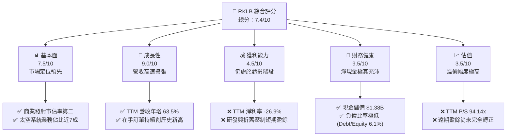
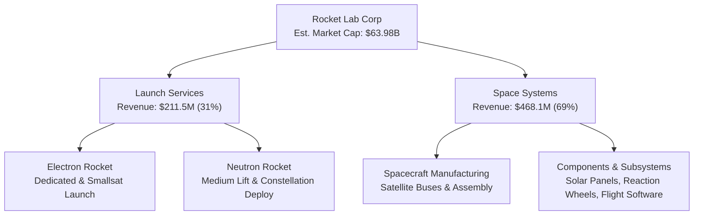
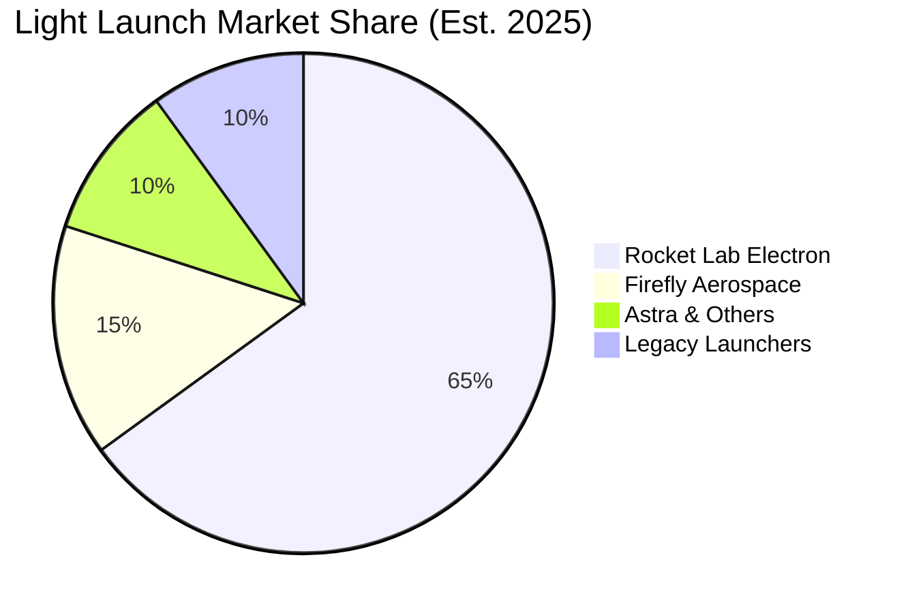
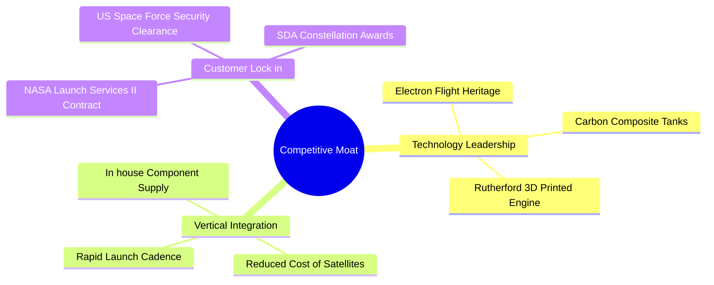

# RKLB 基本面深度分析報告
> **報告日期**：2026-06-12 ｜ **語言**：繁體中文 ｜ **數據來源**：Yahoo Finance, Finviz, StockAnalysis, Roic.ai ｜ **分析師**：CFA 級機構研究

---

## 目錄

| # | 章節 | 核心結論 |
|---|------|----------|
| 1 | [執行摘要](#1-執行摘要) | 評級：**買入 (BUY)** ｜ 目標價：**$105.28** ｜ 具備高成長潛力的太空新星 |
| 2 | [公司概覽與商業模式](#2-公司概覽與商業模式) | 雙引擎驅動（發射服務 + 太空系統），垂直整合建立深厚護城河 |
| 3 | [損益表深度分析](#3-損益表深度分析) | TTM 營收達 **$679.58M**（YoY +63.5%），毛利率穩步提升至 **36.6%** |
| 4 | [資產負債表分析](#4-資產負債表分析) | 淨現金高達 **$1.24B**，流動比率 **4.48**，資產負債表極其穩健 |
| 5 | [現金流量深度分析](#5-現金流量深度分析) | 營運與自由現金流仍為負值，研發與 Neutron 資本支出處於高峰期 |
| 6 | [獲利能力與資本效率](#6-獲利能力與資本效率) | ROE 為 **-13.5%**，ROIC 仍受制於早期高額投入，預計 2027 年迎來拐點 |
| 7 | [估值深度分析](#7-估值深度分析) | P/S 達 **94.14x**，溢價反映市場對 Neutron 火箭及商業星座合約的極高預期 |
| 8 | [成長催化劑](#8-成長催化劑) | Neutron 火箭首飛、美國國防部大單交付、太空系統組件標準化規模效應 |
| 9 | [風險矩陣](#9-風險矩陣) | 發射失敗風險、Neutron 研發延期、估值倍數收縮 |
| 10 | [投資建議](#10-投資建議) | 建議「逢低分批佈局」，基準目標價 **$105.28**，適合長線成長型投資人 |

---

## 1. 執行摘要

### 1.1 核心評分儀表板



### 1.2 評分進度條視覺化

```
╔══════════════════════════════════════════════════════════════╗
║              RKLB 多維度評分儀表板 (1-10分)                 ║
╠══════════════════════════════════════════════════════════════╣
║ 基本面強度  7.5 ▓▓▓▓▓▓▓▓▓▓▓▓▓▓▓░░░░░  ★★★★☆           ║
║ 成長動能    9.0 ▓▓▓▓▓▓▓▓▓▓▓▓▓▓▓▓▓▓░░  ★★★★★           ║
║ 獲利品質    4.5 ▓▓▓▓▓▓▓▓▓░░░░░░░░░░░  ★★☆☆☆           ║
║ 財務健康    9.5 ▓▓▓▓▓▓▓▓▓▓▓▓▓▓▓▓▓▓▓░  ★★★★★           ║
║ 估值合理性  3.5 ▓▓▓▓▓▓▓░░░░░░░░░░░░░  ★☆☆☆☆           ║
║ 護城河深度  8.0 ▓▓▓▓▓▓▓▓▓▓▓▓▓▓▓▓░░░░  ★★★★☆           ║
║ 管理層執行  8.5 ▓▓▓▓▓▓▓▓▓▓▓▓▓▓▓▓▓░░░  ★★★★☆           ║
║ 技術創新力  9.0 ▓▓▓▓▓▓▓▓▓▓▓▓▓▓▓▓▓▓░░  ★★★★★           ║
╠══════════════════════════════════════════════════════════════╣
║ 綜合總分    7.4 ▓▓▓▓▓▓▓▓▓▓▓▓▓▓░░░░░░  🏆 成長期優質標的     ║
╚══════════════════════════════════════════════════════════════╝
```

### 1.3 五大投資論點 + 三大核心風險

| 類型 | 項目 | 具體依據 | 信心度 |
|------|------|----------|--------|
| 🟢 **投資論點①** | **發射服務常態化與高壁壘** | Electron 火箭已成輕型發射市場黃金標準，發射頻次與定價能力雙升。 | 🟢 極高 |
| 🟢 **投資論點②** | **太空系統（Space Systems）高速成長** | 營收佔比已達 69%，業務涵蓋衛星組件與整星製造，毛利率顯著高於發射服務。 | 🟢 極高 |
| 🟢 **投資論點③** | **Neutron 中型火箭潛在颠覆者** | 研發進度順利，瞄準商業星座部署與國防發射，預計大幅降低每公斤發射成本。 | 🟢 高 |
| 🟢 **投資論點④** | **極其充沛的現金儲備** | 擁有 $1.38B 現金與短期投資，淨現金達 $1.24B，無懼高息環境與研發燒錢階段。 | 🟢 極高 |
| 🟢 **投資論點⑤** | **國防與商業合約雙輪驅動** | 頻繁斬獲美國太空發展局 (SDA) 及商業客戶大單，在手訂單能見度極高。 | 🟢 高 |
| 🟡 **風險①** | **估值溢價過高** | 當前 P/S 達 94.14x，容錯率極低，任何發射延遲或財報不及預期均可能導致股價劇烈回檔。 | 🟡 中度 |
| 🔴 **風險②** | **發射失敗與安全事故** | 航太行業固有的高風險屬性，若發生重大發射失敗將導致停飛與合約流失。 | 🔴 高衝擊 |
| 🟡 **風險③** | **Neutron 研發進度延遲** | 研發費用 (FY25 達 $270.72M) 持續高企，若首飛大幅延遲將延後盈利時間點。 | 🟡 中度 |

### 1.4 快速統計卡片

| 指標 | 公司實際值 (TTM / 最新) | 行業均值 (航太與國防) | S&P 500 均值 | 狀態 |
|------|-------------|----------|--------------|------|
| **收入 YoY 成長** | **63.5%** | ~8.5% | ~5.5% | 🟢 遠超行業 |
| **毛利率** | **36.6%** | ~22.0% | ~30.0% | 🟢 優異 |
| **淨利率** | **-26.9%** | ~6.5% | ~11.5% | 🔴 仍未盈利 |
| **流動比率** | **4.48** | ~1.35 | ~1.20 | 🟢 極其安全 |
| **Debt/Equity** | **6.12%** | ~45.0% | ~95.0% | 🟢 債務極低 |
| **P/S Ratio** | **94.14x** | ~1.85x | ~2.80x | 🔴 估值極高 |

### 1.5 投資結論

```
╔══════════════════════════════════════════════════════════════════╗
║                    📊 RKLB 投資結論摘要                          ║
╠══════════════════════════════════════════════════════════════════╣
║  評級：🟢 買入 (BUY)                                             ║
║  當前股價：$102.39 (2026-06-12)                                  ║
║  目標價區間：                                                    ║
║    悲觀情境：$65.00  (-36.5%)                                    ║
║    基準情境：$105.28 (+2.8%)   ← 12個月主要目標（分析師共識值）   ║
║    樂觀情境：$150.00 (+46.5%)                                    ║
║  投資評分：7.4 / 10                                              ║
║  適合投資人：具備高風險承受能力、追求長線航太產業紅利的成長型投資人║
╚══════════════════════════════════════════════════════════════════╝
```

---

## 2. 公司概覽與商業模式

Rocket Lab (RKLB) 是全球商業航太領域的領軍企業之一，定位為僅次於 SpaceX 的全球第二大商業發射服務商。與傳統航太企業不同，Rocket Lab 採取了「發射服務 + 太空系統」雙軌並行的垂直整合商業模式。

### 2.1 業務結構與收入來源



*   **發射服務 (Launch Services)**：主要由成熟的 **Electron** 輕型火箭提供專屬與共乘發射服務。同時，正在全力開發中型可回收火箭 **Neutron**，旨在進軍中大型衛星發射與星座建設市場。
*   **太空系統 (Space Systems)**：透過一系列策略性收購（如 SolAero、Sinclair Interplanetary 等），Rocket Lab 具備了自主設計、製造衛星組件（太陽能電池板、反作用輪、星敏感器）及整星製造的能力。此業務利潤率高、合約金額大，已成為公司的第一大收入來源。

### 2.2 市場份額

在輕型商業發射市場中，Rocket Lab 的 Electron 火箭處於絕對主導地位。



### 2.3 競爭護城河分析



1.  **技術與發射履歷 (Flight Heritage)**：Electron 擁有超過 40 次的成功發射記錄，在講求「歷史成功率」的航太界，這是新興競爭對手難以逾越的壁壘。
2.  **垂直整合能力**：高達 69% 的營收來自太空系統。當客戶需要發射衛星時，Rocket Lab 不僅能提供火箭，還能直接提供整顆卫星的設計與製造，實現「一站式」服務，大幅降低客戶的協調成本與供應鏈風險。
3.  **監管與安全准入壁壘**：公司擁有美國國防部及 NASA 的高級別安全認證，這使得其在獲取高毛利的軍事與科研訂單時，具備極強的競爭優勢。

### 2.4 護城河強度評分

```
╔══════════════════════════════════════════════════════════════╗
║                    RKLB 護城河強度評分                      ║
╠══════════════════════════════════════════════════════════════╣
║ 發射履歷壁壘  8.5/10  ▓▓▓▓▓▓▓▓▓▓▓▓▓▓▓▓▓░░░  🟢 行業標準     ║
║ 垂直整合優勢  9.0/10  ▓▓▓▓▓▓▓▓▓▓▓▓▓▓▓▓▓▓░░  🏆 獨特競爭力   ║
║ 國防准入資質  8.0/10  ▓▓▓▓▓▓▓▓▓▓▓▓▓▓▓▓░░░░  🟢 高度信任     ║
║ 成本控制能力  6.5/10  ▓▓▓▓▓▓▓▓▓▓▓▓▓░░░░░░░  🟡 仍待規模化   ║
╠══════════════════════════════════════════════════════════════╣
║ 綜合護城河    8.0/10  ▓▓▓▓▓▓▓▓▓▓▓▓▓▓▓▓▓░░░  🏆 航太新巨頭   ║
╚══════════════════════════════════════════════════════════════╝
```

---

## 3. 損益表深度分析

### 3.1 年度收入成長趨勢（近4年）

Rocket Lab 展現了極其強勁的營收擴張能力。

```