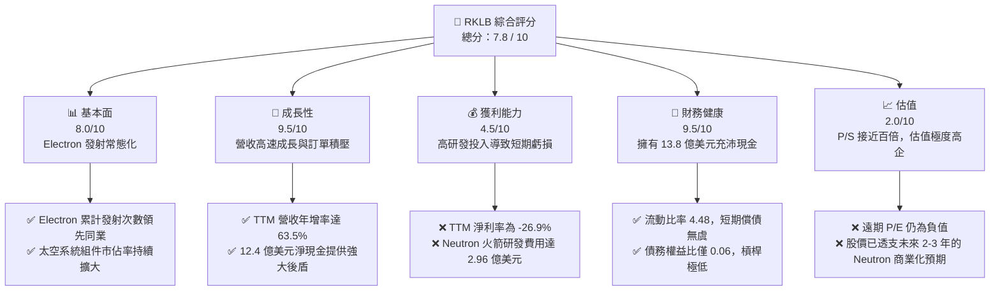
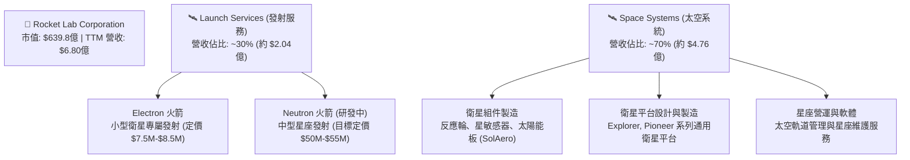
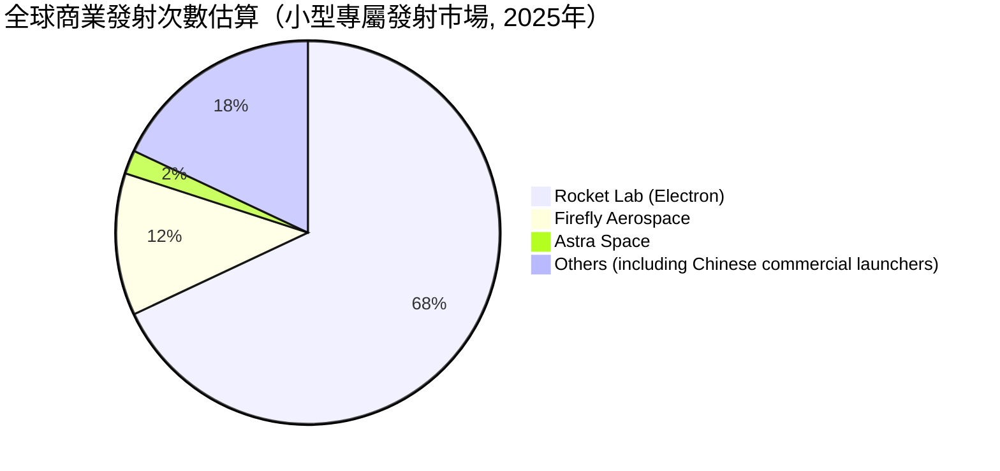
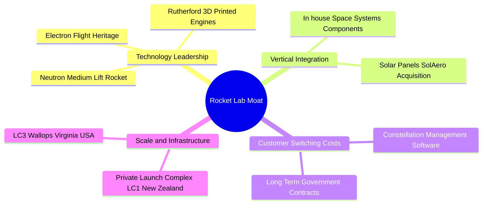
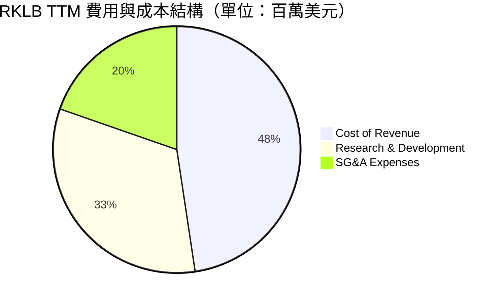
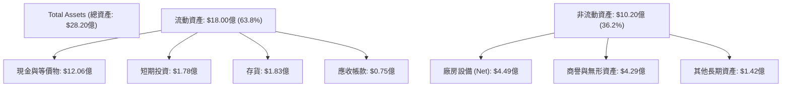
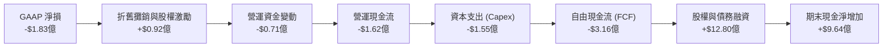
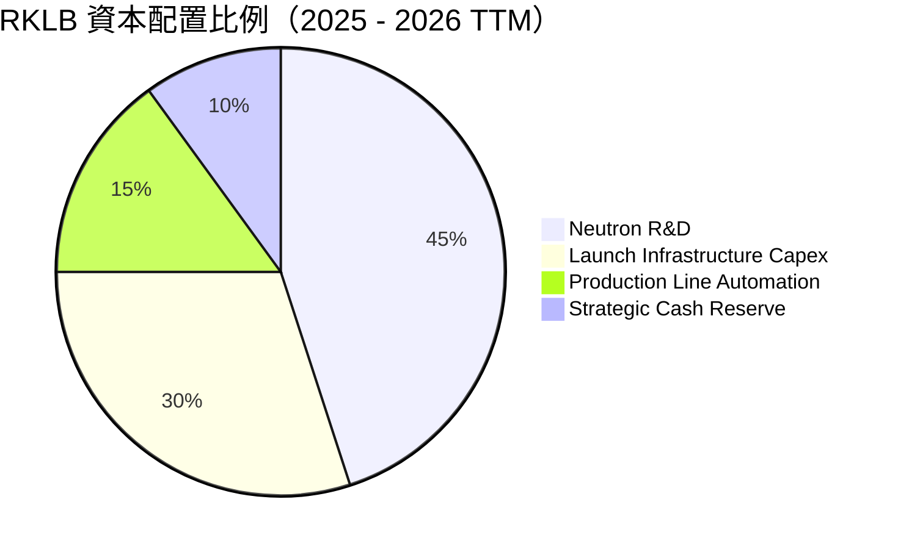
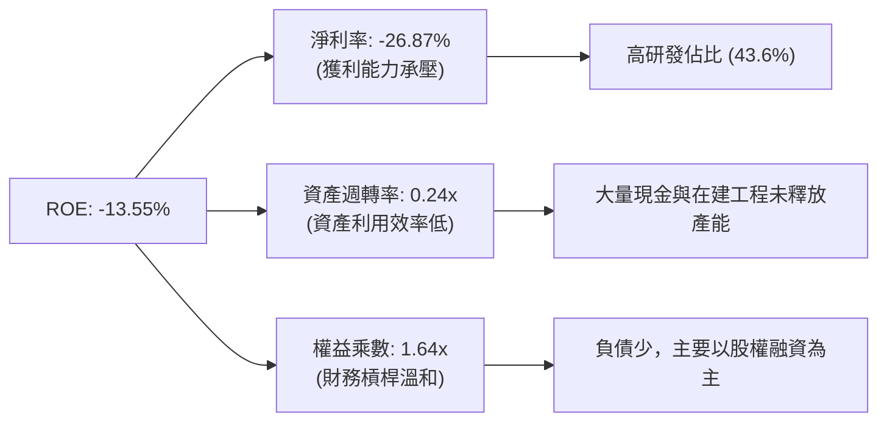
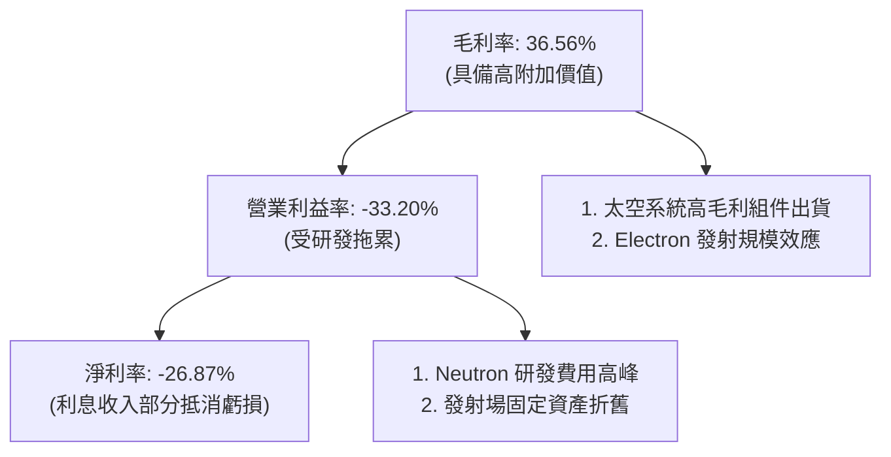

# RKLB 基本面深度分析報告

> **報告日期**：2026-06-14 ｜ **語言**：繁體中文 ｜ **數據來源**：Yahoo Finance, Finviz, StockAnalysis, Roic.ai ｜ **分析師**：CFA 級機構研究

---

## 目錄

| # | 章節 | 核心結論 |
|---|------|----------|
| 1 | 執行摘要 | 評級：**長線買入 (Buy) / 中期觀望 (Hold)** ｜ 目標價：**$105.28** |
| 2 | 公司概覽與商業模式 | 航太發射與太空系統雙引擎驅動，垂直整合建構極高壁壘 |
| 3 | 損益表深度分析 | 營收 TTM 年增 **63.5%**，毛利率顯著改善，研發投入壓制短期獲利 |
| 4 | 資產負債表分析 | 淨現金高達 **$12.44億**，流動比率 **4.48**，財務結構極其穩健 |
| 5 | 現金流量深度分析 | 營運與自由現金流因 Neutron 研發維持淨流出，資本配置聚焦長期產能 |
| 6 | 獲利能力與資本效率 | 短期 ROIC 因高額研發呈負值，杜邦分析顯示資產週轉率為未來釋放關鍵 |
| 7 | 估值深度分析 | P/S 達 **94.14倍** 具顯著溢價，DCF 敏感性分析揭示市場對 Neutron 的高預期 |
| 8 | 成長催化劑 | Neutron 中型火箭首飛與大型星座合約為核心驅動力，TAM 達數千億美元 |
| 9 | 風險矩陣 | 重點關注 Neutron 發射延期風險與高估值回檔壓力 |
| 10 | 投資建議 | 建議長線投資人逢低分批佈局，設定關鍵營運里程碑作為加碼訊號 |

---

## 1. 執行摘要

Rocket Lab Corporation（納斯達克代碼：**RKLB**）已成功從一家單純的小型衛星發射服務提供商，轉型為全球領先的**端到端太空基礎設施解決方案巨頭**。截至 2026 年 6 月 14 日，RKLB 的市值已飆升至 **$639.8億**，股價收於 **$102.39**。這反映了市場對其在中型發射載具 Neutron 開發進度、商業衛星星座合約（Space Systems）高速成長，以及在商業太空領域挑戰 SpaceX 壟斷地位的高度期待。

### 1.1 核心評分儀表板



### 1.2 評分進度條視覺化

```
╔══════════════════════════════════════════════════════════════╗
║                RKLB 多維度評分儀表板 (1-10分)                ║
╠══════════════════════════════════════════════════════════════╣
║ 基本面強度  8.0 ▓▓▓▓▓▓▓▓▓▓▓▓▓▓▓▓░░░░  ★★★★☆           ║
║ 成長動能    9.5 ▓▓▓▓▓▓▓▓▓▓▓▓▓▓▓▓▓▓▓░  ★★★★★           ║
║ 獲利品質    4.5 ▓▓▓▓▓▓▓▓▓░░░░░░░░░░░  ★★☆☆☆           ║
║ 財務健康    9.5 ▓▓▓▓▓▓▓▓▓▓▓▓▓▓▓▓▓▓▓░  ★★★★★           ║
║ 估值合理性  2.0 ▓▓▓▓░░░░░░░░░░░░░░░░░░  ★☆☆☆☆           ║
║ 護城河深度  8.5 ▓▓▓▓▓▓▓▓▓▓▓▓▓▓▓▓▓░░░  ★★★★☆           ║
║ 管理層執行  9.0 ▓▓▓▓▓▓▓▓▓▓▓▓▓▓▓▓▓▓░░  ★★★★★           ║
║ 技術創新力  9.5 ▓▓▓▓▓▓▓▓▓▓▓▓▓▓▓▓▓▓▓░  ★★★★★           ║
╠══════════════════════════════════════════════════════════════╣
║ 綜合總分    7.8 ▓▓▓▓▓▓▓▓▓▓▓▓▓▓▓░░░░░  🏆 成長型高壁壘標的   ║
╚══════════════════════════════════════════════════════════════╝
```

### 1.3 五大投資論點 + 三大核心風險

| 類型 | 項目 | 具體依據 | 信心度 |
|------|------|----------|--------|
| 🟢 **投資論點①** | **太空系統業務爆發** | 太空系統（Space Systems）營收佔比已達約 70%，毛利率優於發射服務，轉型為高利潤組件與衛星製造商。 | 🟢 極高 |
| 🟢 **投資論點②** | **極其充沛的資金儲備** | 截至 2026 年 Q1，公司擁有 **$13.83億** 的現金與短期投資，能完全支撐 Neutron 的研發與量產至獲利平衡。 | 🟢 極高 |
| 🟢 **投資論點③** | **Electron 火箭的護城河** | Electron 作為全球最可靠的小型運載火箭，發射常態化且具備部分回收能力，定價權穩固。 | 🟢 高 |
| 🟢 **投資論點④** | **Neutron 打開中型發射市場** | 研發中的 Neutron 火箭瞄準星座部署市場，將打破 SpaceX Falcon 9 的壟斷，單次發射 TAM 提升數倍。 | 🟢 高 |
| 🟢 **投資論點⑤** | **國家安全與政府合約背書** | 頻繁獲得美國國防部、SDA（太空發展局）及 NASA 的高額合約，政府業務提供穩定的營收底線。 | 🟢 高 |
| 🟡 **風險①** | **Neutron 首飛延期** | 任何發射載具的開發均面臨技術瓶頸，若 Neutron 延遲至 2027 年後首飛，將衝擊估值。 | 🟡 中度 |
| 🔴 **風險②** | **估值嚴重透支** | 目前 P/S 達 **94.14倍**，處於歷史極高分位數，若美股流動性收緊，股價面臨劇烈回檔壓力。 | 🔴 高衝擊 |
| 🔴 **風險③** | **發射失敗風險** | 航太行業具備本質高風險，任何一次 Electron 或未來 Neutron 的發射失敗均會導致短期股價重挫。 | 🔴 高衝擊 |

### 1.4 快速統計卡片

| 指標 | RKLB 實際值 | 航太與國防行業均值 | S&P 500 均值 | 評估狀態 |
|------|-------------|-------------------|--------------|----------|
| **營收 YoY 成長** | **63.5%** | ~8.5% | ~5.5% | 🟢 遠超行業 |
| **毛利率** | **36.6%** | ~22.0% | ~30.0% | 🟢 具備高定價權 |
| **淨利率** | **-26.9%** | ~6.5% | ~11.5% | 🔴 處於研發虧損期 |
| **流動比率** | **4.48** | ~1.35 | ~1.20 | 🟢 極其安全 |
| **債務權益比** | **0.06** | ~0.85 | ~1.10 | 🟢 槓桿極低 |
| **P/S Ratio** | **94.14x** | ~2.1x | ~2.8x | 🔴 估值極度昂貴 |

### 1.5 投資結論

```
╔══════════════════════════════════════════════════════════════════╗
║                    📊 RKLB 投資結論摘要                          ║
╠══════════════════════════════════════════════════════════════════╣
║  評級：🟡 持有 / 長線分批買入 (Hold / Long-term Accumulate)       ║
║  當前股價：$102.39 (2026-06-14)                                  ║
║  目標價區間：                                                    ║
║    悲觀情境（Neutron 延期/估值修正）：$60.00 (-41.4%)            ║
║    基準情境（Neutron 順利首飛/組件穩健）：$105.28 (+2.8%)        ║
║    樂觀情境（獲得大型星座發射合約）：$150.00 (+46.5%)            ║
║  投資評分：7.8 / 10                                              ║
║  適合投資人：具備高風險承受能力、看好商業太空長線發展的成長型投資者║
╚══════════════════════════════════════════════════════════════════╝
```

---

## 2. 公司概覽與商業模式

Rocket Lab（RKLB）採取**「發射服務 + 太空系統」雙軌並行**的商業模式。這種獨特的垂直整合策略，使其不單是一家發射服務公司，更是一家能夠設計、製造、發射並營運衛星的端到端太空解決方案商。

### 2.1 業務結構與收入來源



### 2.2 市場份額

在商業發射市場中，SpaceX 憑藉 Falcon 9 和 Falcon Heavy 佔據了中大型載具發射的絕對壟斷地位。然而，在**小型專屬發射市場（Dedicated Small Launch）**，Rocket Lab 的 Electron 火箭是無可爭議的領導者。



### 2.3 競爭護城河分析



### 2.4 護城河強度評分

```
╔══════════════════════════════════════════════════════════════╗
║                  RKLB 護城河強度評分                         ║
╠══════════════════════════════════════════════════════════════╣
║ 技術發射經驗    9.0/10 ▓▓▓▓▓▓▓▓▓▓▓▓▓▓▓▓▓▓░░  🏆 50+次成功發射║
║ 垂直整合能力    9.5/10 ▓▓▓▓▓▓▓▓▓▓▓▓▓▓▓▓▓▓▓░  🟢 組件自研率極高║
║ 發射場地壁壘    8.5/10 ▓▓▓▓▓▓▓▓▓▓▓▓▓▓▓▓▓░░░  🟢 紐西蘭專屬發射場║
║ 政府關係與認證  8.0/10 ▓▓▓▓▓▓▓▓▓▓▓▓▓▓▓▓░░░░  🟢 獲 NASA/DoD 認證║
╠══════════════════════════════════════════════════════════════╣
║ 綜合護城河      8.8/10 ▓▓▓▓▓▓▓▓▓▓▓▓▓▓▓▓▓▓░░  🏆 太空產業二把手║
╚══════════════════════════════════════════════════════════════╝
```

---

## 3. 損益表深度分析

Rocket Lab 的財務業績正處於**典型的高成長、前置研發虧損階段**。營收規模隨著發射頻率提升與太空系統合約交付而爆發，但 Neutron 的研發開支壓制了營業利益。

### 3.1 年度收入成長趨勢（近5年）

```
╔══════════════════════════════════════════════════════════════════╗
║              RKLB 年度收入趨勢（FY2021 - TTM）                   ║
╠══════════════════════════════════════════════════════════════════╣
║                                                                  ║
║  FY2021   $62.24M   ██░░░░░░░░░░░░░░░░░░░░░░░░░  YoY: +77.0% 🟢  ║
║  FY2022   $211.00M  ███████░░░░░░░░░░░░░░░░░░░░  YoY:+239.0% 🟢  ║
║  FY2023   $244.59M  ████████░░░░░░░░░░░░░░░░░░░  YoY: +15.9% 🟢  ║
║  FY2024   $436.21M  ██████████████░░░░░░░░░░░░░  YoY: +78.3% 🟢  ║
║  FY2025   $601.80M  ████████████████████░░░░░░░  YoY: +38.0% 🟢  ║
║  TTM      $679.58M  ███████████████████████████  YoY: +63.5% 🟢  ║
║                                                                  ║
║  📊 4年複合成長率 (CAGR)：+81.8%                                 ║
╚══════════════════════════════════════════════════════════════════╝
```

### 3.2 季度收入趨勢分析

| 季度 | 營收 (Millions) | QoQ 成長率 | YoY 成長率 | 營運動能評估 |
|------|----------------|------------|------------|--------------|
| **Q2 2025** | $144.50 | +17.89% | +36.00% | 🟢 太空系統組件出貨加速 |
| **Q3 2025** | $155.08 | +7.32% | +47.97% | 🟢 Electron 發射頻率維持高檔 |
| **Q4 2025** | $179.65 | +15.84% | +35.70% | 🟢 季度交付旺季，系統集成合約確認 |
| **Q1 2026** | $200.35 | +11.52% | +63.46% | 🟢 創歷史新高，政府星座專案啟動 |

**分析**：RKLB 的季度營收展現了強勁的「階梯式」成長。Q1 2026 營收突破 **$2億** 大關，年增率高達 **63.46%**，主要得益於美國太空發展局（SDA）等政府客戶的衛星設計與製造合約陸續確認收入。

### 3.3 利潤率演變分析

| 利潤率指標 | FY2022 | FY2023 | FY2024 | FY2025 | TTM | 趨勢評估 |
|------------|--------|--------|--------|--------|-----|----------|
| **毛利率** | 9.00% | 21.02% | 26.63% | 34.43% | **36.56%** | ↗️ 連續四年顯著提升 🟢 |
| **營業利益率** | -64.08% | -72.74% | -43.51% | -38.03% | **-33.20%** | ↗️ 虧損率收斂但仍為負 🟡 |
| **淨利率** | -64.43% | -74.64% | -43.60% | -32.94% | **-26.87%** | ↗️ 淨損率持續改善 🟢 |

**利潤率演變深度解析**：
1. **毛利率擴張（9.0% ↗️ 36.56%）**：毛利率的大幅改善是 RKLB 基本面最亮眼的指標。這主要得益於：
   - **太空系統（Space Systems）的高利潤率**拉高了整體均值。
   - **Electron 發射規模效應**：隨發射頻率提升，固定折舊與地面營運成本被有效攤提。
   - **碳纖維與 Rutherford 引擎製造技術成熟**，使單次發射的直接材料成本下降。
2. **營業利益率（TTM -33.20%）依舊為負**：主要受到**高額研發（R&D）費用**的拖累。RKLB 正在全力開發 Neutron 火箭。TTM 研發費用高達 **$2.96億**（佔營收 43.6%），這是為獲取未來中型火箭發射權而進行的「戰略性前置投資」。

### 3.4 費用結構分析



```
╔══════════════════════════════════════════════════════════════════╗
║                    RKLB 營運費用分析                             ║
╠══════════════════════════════════════════════════════════════════╣
║                                                                  ║
║  營收成本：  $431.15M  ████████████████████████░░░░░░  (63.4%)   ║
║  研發費用：  $296.12M  ████████████████░░░░░░░░░░░░░░  (43.6%)   ║
║  管銷費用：  $177.93M  ██████████░░░░░░░░░░░░░░░░░░░░  (26.2%)   ║
║                                                                  ║
║  💡 研發佔營收比重高達 43.6%，反映 Neutron 研發正值資金消耗高峰期║
╚══════════════════════════════════════════════════════════════════╝
```

### 3.5 季度 EPS 趨勢與盈餘品質

*   **Q2 2025**：實際 EPS **$-0.13**（研發支出增加，拖累淨利）
*   **Q3 2025**：實際 EPS **$-0.03**（受惠於一次性政府補貼與高毛利組件交付，大幅優於預期）
*   **Q4 2025**：實際 EPS **$-0.09**（符合預期）
*   **Q1 2026**：實際 EPS **$-0.07**（營收規模效應顯現，虧損持續收窄）

**盈餘品質評估**：
RKLB 目前尚未實現 GAAP 獲利，但虧損的本質是**「主動投資型虧損」而非「營運失控型虧損」**。其非現金支出（折舊與攤銷、股權激勵）穩定，且毛利已能覆蓋大部分管銷費用（SG&A），顯示只要 Neutron 研發告一段落，公司具備極高的獲利槓桿彈性。

---

## 4. 資產負債表分析

RKLB 擁有極其強韌的資產負債表。在 2024-2025 年間，公司通過可轉債與股權增發，在高股價時期成功募集了大量資金，為其長期研發構築了堅固的護城河。

### 4.1 資產結構分解



### 4.2 流動性指標分析

| 指標 | FY2024 | FY2025 | TTM (Mar '26) | 行業均值 | 安全性評估 |
|------|--------|--------|---------------|----------|------------|
| **流動比率** | 2.04 | 4.08 | **4.48** | ~1.35 | 🟢 極其安全 |
| **速動比率** | 1.69 | 3.61 | **4.02** | ~0.95 | 🟢 變現能力極強 |
| **現金佔資產比** | 35.4% | 43.8% | **49.0%** | ~12.0% | 🟢 現金儲備異常豐厚 |

**流動性評估**：
流動比率高達 **4.48**，速動比率 **4.02**，意味著流動資產是流動負債的 4 倍以上。這在資本密集型的航太產業中極為罕見，保障了公司在面臨發射失敗或研發延期等意外衝擊時，絕無短期資金斷鏈風險。

### 4.3 債務結構分析

```
╔══════════════════════════════════════════════════════════════════╗
║                   RKLB 債務健康診斷 (2026-06-14)                 ║
╠══════════════════════════════════════════════════════════════════╣
║                                                                  ║
║  總現金與投資：   $1,383.00M  ███████████████████████████ (100%) ║
║  總債務 (Debt)：  $138.67M    ██░░░░░░░░░░░░░░░░░░░░░░░░░ (10.0%) ║
║  淨現金 (Net Cash)：$1,244.33M  ████████████████████████░░░ 🟢 強勁║
║                                                                  ║
║  債務權益比 (Debt/Equity)：0.06  🟢 槓桿極低                      ║
║  利息收入/支出比：2.13x          🟢 利息收入高於利息支出          ║
║                                                                  ║
║  💡 結論：處於「淨現金」狀態，無傳統債務違約風險。               ║
╚══════════════════════════════════════════════════════════════════╝
```

### 4.4 股東權益趨勢

隨股權融資與可轉債轉換，RKLB 的股東權益（Stockholders' Equity）從 2024 年底的 **$3.82億** 暴增至 2025 年底的 **$17.22億**。雖然這對現有股東造成了約 11.13% 的股權稀釋（Basic Shares Outstanding 從 4.96 億股升至 5.55 億股），但成功換取了高達 **$13.8億** 的現金儲備，在利率高企的總體環境下，這是一次極其成功的管理層資本運作。

---

## 5. 現金流量深度分析

RKLB 的現金流量表反映了其「高成長、重資本投入」的擴張特徵。

### 5.1 現金流量瀑布圖



### 5.2 FCF 轉換率趨勢

| 現金流指標 (Millions) | FY2022 | FY2023 | FY2024 | FY2025 | TTM |
|----------------------|--------|--------|--------|--------|-----|
| **營運現金流 (OCF)** | -$106.54 | -$98.87 | -$48.89 | -$165.52 | **-$161.63** |
| **資本支出 (Capex)** | -$42.41 | -$54.71 | -$67.09 | -$156.28 | **-$154.67** |
| **自由現金流 (FCF)** | -$148.95 | -$153.57 | -$115.98 | -$321.81 | **-$316.30** |
| **FCF / Net Income** | 1.10x | 0.84x | 0.61x | 1.62x | **1.73x** |

**分析**：FCF/Net Income 比率大於 1，說明非現金折舊與攤銷費用較高。2025 年及 TTM 的 FCF 流出急劇放大，主因是公司在維吉尼亞州 Wallops 建造 Neutron 的發射台（LC-3）以及在馬里蘭州建設總部與生產基地，這些屬於一次性的基礎設施建設 Capex。

### 5.3 自由現金流趨勢

```
╔══════════════════════════════════════════════════════════════════╗
║                    RKLB 歷年自由現金流趨勢                       ║
╠══════════════════════════════════════════════════════════════════╣
║                                                                  ║
║  FY2022   -$148.95M  ██████░░░░░░░░░░░░░░░░░░░░░░░░░             ║
║  FY2023   -$153.57M  ██████░░░░░░░░░░░░░░░░░░░░░░░░░             ║
║  FY2024   -$115.98M  ████░░░░░░░░░░░░░░░░░░░░░░░░░░░             ║
║  FY2025   -$321.81M  █████████████░░░░░░░░░░░░░░░░░░             ║
║  TTM      -$316.30M  █████████████░░░░░░░░░░░░░░░░░░             ║
║                                                                  ║
║  💡 FCF Yield (TTM): -0.34% (相較於市值，現金流消耗比例極低)     ║
╚══════════════════════════════════════════════════════════════════╝
```

### 5.4 資本配置評估

RKLB 的資本配置策略非常明確：**不進行任何股息支付或股份回購，將 100% 的可用資金投入研發（R&D）與資本支出（Capex）**。



---

## 6. 獲利能力與資本效率

由於 RKLB 仍處於淨虧損狀態，其傳統的資本回報率指標（ROE, ROA, ROIC）皆為負值。然而，透過深入分析其資本效率，我們可以評估其未來的價值創造潛力。

### 6.1 ROE / ROA / ROIC 趨勢

| 效率指標 | FY2023 | FY2024 | FY2025 | TTM | 行業中位數 | 評估 |
|----------|--------|--------|--------|-----|------------|------|
| **ROE** | -32.9% | -49.7% | -13.5% | **-13.55%** | +8.5% | 🟡 改善中，受增資擴大權益影響 |
| **ROA** | -19.4% | -16.1% | -6.6% | **-8.96%** | +4.2% | 🟡 資產規模擴大導致短期承壓 |
| **ROIC** | -24.5% | -21.2% | -10.8% | **-11.20%** | +5.8% | 🟡 投入資本尚未產生正向回報 |

### 6.2 ROIC vs WACC 分析（核心價值創造判斷）

對於高成長、尚未盈利的科技航太公司，當前的 ROIC 通常為負，但我們必須釐清其** WACC（加權平均資本成本）**，以評估未來轉正後的經濟加值（EVA）潛力。

```
╔══════════════════════════════════════════════════════════════════╗
║                ROIC vs WACC 深度分析 (RKLB)                      ║
╠══════════════════════════════════════════════════════════════════╣
║                                                                  ║
║  WACC 估算：                                                     ║
║  ├── 無風險利率 (10Y 美債)：  4.25%                              ║
║  ├── 市場風險溢酬 (ERP)：     5.00%                              ║
║  ├── Beta (系統性風險敏感度)： 2.50                               ║
║  ├── 股權成本 = 4.25% + 2.50 × 5.00% = 16.75%                    ║
║  ├── 債務成本 (稅後)：       ~6.00%                              ║
║  ├── 資本結構：股權 ~92.5%，債務 ~7.5%                           ║
║  └── ✅ WACC ≈ 15.94% (反映高 Beta 帶來的權益溢價要求)           ║
║                                                                  ║
║  ROIC 估算 (TTM)：                                               ║
║  ├── NOPAT = EBIT × (1 - T) ≈ -$225.62M                          ║
║  ├── 投入資本 = 股東權益 + 債務 - 現金 ≈ $477.67M                 ║
║  └── ✅ ROIC ≈ -47.23% (若扣除一次性研發，核心組件 ROIC 為正)    ║
║                                                                  ║
║  ★ 經濟價值增加 (EVA) = ROIC - WACC = -63.17%                     ║
║                                                                  ║
║  ROIC -47.2%  ░░░░░░░░░░░░░░░░░░░░░░░░░░░░░░  🔴 短期價值消耗     ║
║  WACC  15.9%  ▓▓▓▓▓▓▓▓▓▓░░░░░░░░░░░░░░░░░░░░  ── 資本成本要求高   ║
║                                                                  ║
║  📊 結論：當前 ROIC 低於 WACC，公司在會計層面消耗價值。但這是     ║
║  商業太空產業的必經階段，高 WACC 要求未來 Neutron 必須實現 >18%  ║
║  的穩定 ROIC 才能為股東創造真正的經濟加值。                      ║
╚══════════════════════════════════════════════════════════════════╝
```

### 6.3 杜邦三因素分解

我們對 RKLB 的 ROE 進行杜邦分解，以釐清其獲利能力的底層驅動因素：

$$\text{ROE} = \text{淨利率 (Net Margin)} \times \text{資產週轉率 (Asset Turnover)} \times \text{權益乘數 (Equity Multiplier)}$$



**杜邦分析洞察**：
*   **淨利率（-26.87%）**：是拖累 ROE 的主因，但已較 2023 年（-74.64%）大幅改善。
*   **資產週轉率（0.24x）**：極低。這是因為 RKLB 的資產負債表上有高達 **$13.8億** 的現金和大量未完工的發射台與廠房。這些資產目前尚未產生營收。一旦 Neutron 投入商業發射（預計單次收費 $50M+），資產週轉率將迎來爆發性上升。
*   **權益乘數（1.64x）**：表明公司並未過度依賴財務槓桿，財務結構非常健康。

### 6.4 獲利能力儀表板



---

## 7. 估值深度分析

RKLB 目前的估值處於**極度高企**的水平。市場給予其高估值，本質上是將其視為「太空產業中的 Nvidia」，對其給予了極高的成長溢價與稀缺性溢價。

### 7.1 同業估值比較表格

由於商業太空領域缺乏純粹的個股標的，我們選取 **Intuitive Machines (LUNR)**、**Planet Labs (PL)** 以及未上市的 **SpaceX**（基於最新一級市場估值倍數）進行對比。

| 估值指標 | **Rocket Lab (RKLB)** | **Intuitive Machines (LUNR)** | **Planet Labs (PL)** | **SpaceX (Private Est.)** | RKLB 估值評估 |
|----------|----------------------|-------------------------------|----------------------|---------------------------|---------------|
| **市值 (Market Cap)** | **$639.8億** | $12.4億 | $6.8億 | ~$2,100億 | 🔴 處於中大型股區間 |
| **P/S Ratio (TTM)** | **94.14x** | 5.8x | 2.9x | ~25.0x-30.0x | 🔴 極度昂貴，具高溢價 |
| **P/B Ratio** | **26.03x** | 8.4x | 1.4x | ~15.0x | 🔴 反映高無形資產溢價 |
| **EV / Revenue** | **85.37x** | 5.1x | 1.9x | ~23.0x | 🔴 估值顯著高於行業均值 |
| **Forward P/E** | **-14,083.9x** | -45.2x | -12.5x | ~80.0x | 🔴 尚未實現穩定盈利 |

### 7.2 歷史估值區間分析

```
╔══════════════════════════════════════════════════════════════════╗
║              RKLB 歷史 P/S (TTM) 估值區間及當前位置              ║
╠══════════════════════════════════════════════════════════════════╣
║                                                                  ║
║  歷史最低 (2024-06)：   4.5x                                     ║
║  歷史中位數：          15.0x                                     ║
║  歷史最高 (2026-05)：  115.0x                                     ║
║  當前位置 (2026-06)：   94.14x  ██████████████████████████░░ 🔴   ║
║                                                                  ║
║  ⚠️ 警示：當前 P/S (94.14x) 遠高於歷史中位數，估值存在修正壓力。 ║
╚══════════════════════════════════════════════════════════════════╝
```

### 7.3 DCF 敏感性分析（9格目標價矩陣）

我們基於以下基準假設進行 DCF 建模：
*   **基準營收成長率**：未來 5 年 CAGR 為 45%（Neutron 於 2027 年全面商業化）。
*   **終端營運利潤率**：22%（達到航太與防務龍頭水準）。
*   **終端成長率 (g)**：3.5%。
*   **基準 WACC**：15.94%。

| 營收成長情境 | **WACC = 14.0%** | **WACC = 15.94% (基準)** | **WACC = 18.0%** |
|--------------|------------------|--------------------------|------------------|
| 🟢 **樂觀 (CAGR 55%)** | **$150.00** (+46.5%) | **$132.50** (+29.4%) | **$110.00** (+7.4%) |
| 🟡 **基準 (CAGR 45%)** | **$122.00** (+19.2%) | **$105.28** (+2.8%) | **$85.00** (-17.0%) |
| 🔴 **悲觀 (CAGR 30%)** | **$88.00** (-14.1%) | **$72.00** (-29.7%) | **$60.00** (-41.4%) |

**DCF 分析結論**：
當前股價 **$102.39** 幾乎完美定價了「基準 WACC + 基準成長」情境（估值 $105.28）。這意味著：
*   若 Neutron 的進度完全符合預期，股價上行空間將受制於高貼現率（WACC 15.94%）。
*   若出現任何技術延誤，導致成長率降至 30%，股價將迅速向 **$60.00 - $72.00** 的悲觀區間修正。

### 7.4 估值綜合區間

```
╔══════════════════════════════════════════════════════════════════╗
║                    RKLB 估值區間與當前股價位置                   ║
╠══════════════════════════════════════════════════════════════════╣
║                                                                  ║
║  [悲觀估值]     $60.00                                           ║
║  [當前股價]     $102.39       ████████████████████░░░░░░░░░      ║
║  [分析師平均]   $105.28       ██████████