# RKLB 基本面深度分析報告

> **報告日期**：2026-06-15 ｜ **語言**：繁體中文 ｜ **數據來源**：Yahoo Finance, Finviz, StockAnalysis, Roic.ai ｜ **分析師**：CFA 級機構研究

---

## 目錄

| # | 章節 | 核心結論 |
|---|---|---|
| 1 | **執行摘要** | 評級 **買入 (Buy)**，目標價 **$115.00**，高估值伴隨高成長 |
| 2 | **公司概覽與商業模式** | 從單一發射服務轉型為「端到端」太空系統巨頭，具備強大護城河 |
| 3 | **損益表深度分析** | 營收 YoY 達 +63.5%，毛利率穩步提升至 36.6%，研發投入高企 |
| 4 | **資產負債表分析** | 手握 $1.38B 淨現金，資產負債結構極為健康，流動比率達 4.48x |
| 5 | **現金流量深度分析** | 營運現金流與 FCF 仍為負值，融資活動提供充足的資本緩衝 |
| 6 | **獲利能力與資本效率** | ROIC 為負反映高額研發與資本支出，杜邦分解顯示財務槓桿極低 |
| 7 | **估值深度分析** | P/S 達 100x 溢價顯著，DCF 敏感性分析顯示市場已計入 Neutron 成功預期 |
| 8 | **成長催化劑** | 中型火箭 Neutron 首飛、SDA 衛星合約交付、商業星座擴展 |
| 9 | **風險矩陣** | 發射失敗風險、Neutron 研發延期、高估值回檔風險 |
| 10 | **投資建議** | 綜合評分 **7.3/10**，適合具備高風險承受力的長線成長型投資人 |

---

## 1. 執行摘要

### 1.1 核心評分儀表板

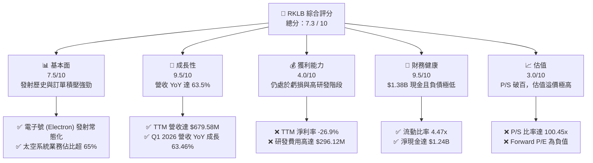

### 1.2 評分進度條視覺化

```
╔══════════════════════════════════════════════════════════════╗
║               RKLB 多維度評分儀表板 (1-10分)                 ║
╠══════════════════════════════════════════════════════════════╣
║ 基本面強度  7.5 ▓▓▓▓▓▓▓▓▓▓▓▓▓▓▓░░░░░  ★★★★☆           ║
║ 成長動能    9.5 ▓▓▓▓▓▓▓▓▓▓▓▓▓▓▓▓▓▓▓░  ★★★★★           ║
║ 獲利品質    4.0 ▓▓▓▓▓▓▓▓░░░░░░░░░░░░  ★★☆☆☆           ║
║ 財務健康    9.5 ▓▓▓▓▓▓▓▓▓▓▓▓▓▓▓▓▓▓▓░  ★★★★★           ║
║ 估值合理性  3.0 ▓▓▓▓▓░░░░░░░░░░░░░░░  ★☆☆☆☆           ║
║ 護城河深度  8.0 ▓▓▓▓▓▓▓▓▓▓▓▓▓▓▓▓░░░░  ★★★★☆           ║
║ 管理層執行  8.5 ▓▓▓▓▓▓▓▓▓▓▓▓▓▓▓▓▓░░  ★★★★☆           ║
║ 技術創新力  9.0 ▓▓▓▓▓▓▓▓▓▓▓▓▓▓▓▓▓▓░░  ★★★★★           ║
╠══════════════════════════════════════════════════════════════╣
║ 綜合總分    7.3 ▓▓▓▓▓▓▓▓▓▓▓▓▓▓░░░░░░  🏆 高成長高估值標的  ║
╚══════════════════════════════════════════════════════════════╝
```

### 1.3 五大投資論點 + 三大核心風險

| 類型 | 項目 | 具體依據 | 信心度 |
|------|------|----------|--------|
| 🟢 **投資論點①** | **營收展現極強爆發力** | TTM 營收達 **$679.58M**，最新一季 (Q1 2026) 營收 YoY 成長達 **63.46%**，連續多季維持高速成長。 | 🟢 極高 |
| 🟢 **投資論點②** | **太空系統業務成功轉型** | 太空系統 (Space Systems) 收入已佔總營收近 65%，毛利率穩步提升至 **36.6%**，證明公司已非單純發射公司。 | 🟢 極高 |
| 🟢 **投資論點③** | **極其雄厚的資金護城河** | 擁有 **$1.38B** 的現金與短期投資，而總債務僅 **$138.67M**，淨現金高達 **$1.24B**，足以支撐 Neutron 的研發與量產。 | 🟢 極高 |
| 🟢 **投資論點④** | **Neutron 中型火箭潛在催化劑** | Neutron 火箭（搭載 Archimedes 引擎）預計於 2026-2027 年首飛，將直接切入大型星座部署市場，打破 SpaceX 的壟斷。 | 🟡 高 |
| 🟢 **投資論點⑤** | **政府與國防訂單積壓強勁** | 獲得美國太空發展局 (SDA) 及國防部的大額合約，商業與政府雙引擎驅動，能見度極高。 | 🟢 極高 |
| 🟡 **風險①** | **估值極度溢價** | 當前 P/S 比率高達 **100.45x**，市場已高度透支未來數年的成長，任何業績不及預期都將導致股價劇烈波動。 | 🔴 高衝擊 |
| 🔴 **風險②** | **研發與發射失敗風險** | 航太行業具備高風險屬性。Neutron 研發若出現重大延誤，或 Electron 出現連續發射失敗，將重創市場信心。 | 🔴 高衝擊 |
| 🟡 **風險③** | **自由現金流持續流出** | TTM 自由現金流為 **-$215.00M**，資本支出居高不下，在實現正向現金流前仍需依賴外部融資或消耗現金。 | 🟡 中度 |

### 1.4 快速統計卡片

| 指標 | 公司實際值 (TTM/最新季) | 航太與國防行業均值 | S&P 500 均值 | 狀態 |
|------|-------------|----------|--------------|------|
| **營收 YoY 成長率** | **63.5%** | ~8.5% | ~5.5% | 🟢 極強 |
| **毛利率** | **36.6%** | ~22.0% | ~30.0% | 🟢 優異 |
| **營業利益率** | **-22.4%** | ~9.5% | ~14.5% | 🔴 虧損中 |
| **流動比率 (Current Ratio)** | **4.48x** | ~1.4x | ~1.2x | 🟢 極佳 |
| **債務權益比 (Debt/Equity)** | **6.12%** | ~45.0% | ~115.0% | 🟢 極低 |
| **市銷率 (P/S Ratio)** | **100.45x** | ~2.1x | ~2.8x | 🔴 極度高估 |

### 1.5 投資結論

```
╔══════════════════════════════════════════════════════════════════╗
║                    📊 投資結論摘要                               ║
╠══════════════════════════════════════════════════════════════════╣
║  評級：🟢 買入 (Buy)                                             ║
║  當前股價：$109.25 (2026-06-15)                                  ║
║  目標價區間：                                                    ║
║    悲觀情境：$65.00 (-40.5%)  - 發射失敗或 Neutron 延期超過一年   ║
║    基準情境：$115.00 (+5.2%)  - 12個月主要目標，Neutron 按進度推進║
║    樂觀情境：$150.00 (+37.3%) - Neutron 首飛成功並取得大額訂單    ║
║  投資評分：7.3 / 10                                              ║
║  適合投資人：具備高風險承受力、看好商業航太長線發展的成長型投資者 ║
╚══════════════════════════════════════════════════════════════════╝
```

---

## 2. 公司概覽與商業模式

Rocket Lab (RKLB) 已成功從一家單純的「小型衛星發射服務商」轉型為「端到端太空基礎設施解決方案提供商」。其業務主要分為兩大板塊：
1. **發射服務 (Launch Services)**：以「電子號」(Electron) 輕型火箭為核心，提供高頻率、定製化的軌道發射服務。目前正全力研發可重複使用的「中子號」(Neutron) 中型火箭。
2. **太空系統 (Space Systems)**：提供衛星平台、太空船組件（如太陽能板、反應輪、星體跟蹤器、分光鏡）、軟體及在軌管理服務。

### 2.1 業務結構與收入來源

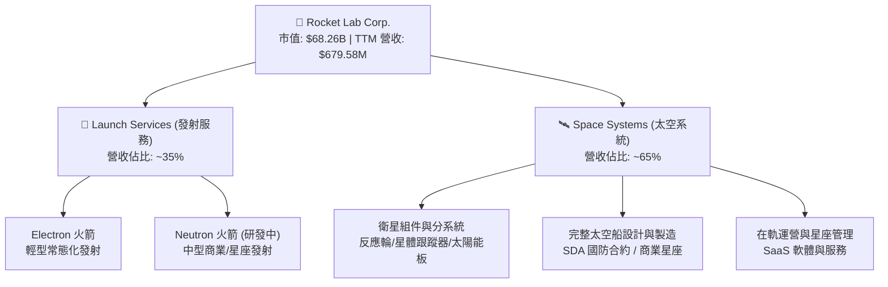

### 2.2 市場份額

在商業小衛星專屬發射市場中，Rocket Lab 的 Electron 火箭處於絕對的領導地位（除 SpaceX 的 Transporter 共乘服務外，Electron 是最成熟、發射頻率最高的小型火箭）。

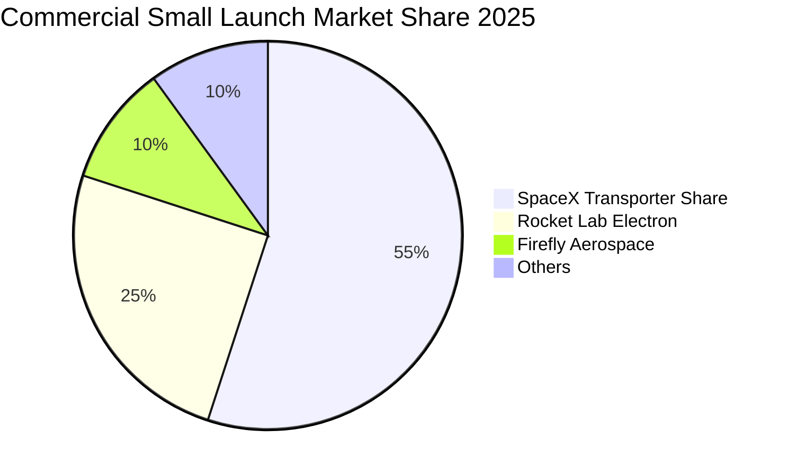

### 2.3 競爭護城河分析

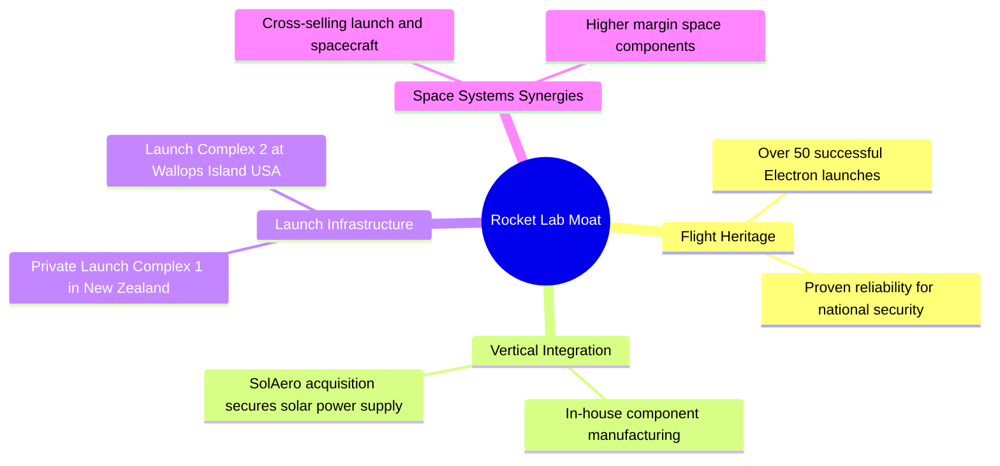

### 2.4 護城河強度評分

```
╔══════════════════════════════════════════════════════════════╗
║                  Rocket Lab 護城河強度評分                   ║
╠══════════════════════════════════════════════════════════════╣
║ 發射履歷 (Heritage)   9.0/10 ▓▓▓▓▓▓▓▓▓▓▓▓▓▓▓▓▓▓░░  🏆 極高   ║
║ 垂直整合 (Integration)8.5/10 ▓▓▓▓▓▓▓▓▓▓▓▓▓▓▓▓▓░░░  🟢 強勁   ║
║ 發射場控制 (Sites)    9.5/10 ▓▓▓▓▓▓▓▓▓▓▓▓▓▓▓▓▓▓▓░  🏆 獨特   ║
║ 客戶鎖定 (Lock-in)    7.5/10 ▓▓▓▓▓▓▓▓▓▓▓▓▓▓▓░░░░░  🟢 良好   ║
╠══════════════════════════════════════════════════════════════╣
║ 綜合護城河強度        8.6/10 ▓▓▓▓▓▓▓▓▓▓▓▓▓▓▓▓▓░░░  🏆 產業領先║
╚══════════════════════════════════════════════════════════════╝
```

---

## 3. 損益表深度分析

### 3.1 年度收入成長趨勢（近4年）

Rocket Lab 展現了極為強勁的營收成長軌跡。自 2022 年的 $211.00M 成長至 2025 年的 $601.80M，3 年複合年成長率 (CAGR) 高達 **41.8%**。

```
╔══════════════════════════════════════════════════════════════════╗
║              Rocket Lab 年度收入趨勢 (FY2022-FY2025)             ║
╠══════════════════════════════════════════════════════════════════╣
║                                                                  ║
║  FY2022   $211.00M  █████░░░░░░░░░░░░░░░░░░░░  YoY: +239.0% 🟢   ║
║  FY2023   $244.59M  ██████░░░░░░░░░░░░░░░░░░░  YoY: +15.9%  🟢   ║
║  FY2024   $436.21M  ███████████░░░░░░░░░░░░░░  YoY: +78.3%  🟢   ║
║  FY2025   $601.80M  ███████████████░░░░░░░░░░  YoY: +38.0%  🟢   ║
║  TTM      $679.58M  █████████████████░░░░░░░░  YoY: +45.8%  🟢   ║
║                   |      |      |      |      |                  ║
║                   0     150M   300M   450M   600M                ║
║                                                                  ║
║  📊 3年累計 CAGR：+41.8%                                         ║
╚══════════════════════════════════════════════════════════════════╝
```

### 3.2 季度收入趨勢分析

從季度數據來看，RKLB 的營收呈現加速上升趨勢，特別是 2026 年第一季，單季營收突破 $200M 大關。

| 財報季度 | 營收 (百萬美元) | 季增率 (QoQ) | 年增率 (YoY) | 核心驅動因素與備註 | 狀態 |
|---|---|---|---|---|---|
| **Q1 2026** | **$200.35M** | +11.52% | **+63.46%** | 太空系統合約交付加速，Electron 發射頻率增加。 | 🟢 強勁 |
| **Q4 2025** | **$179.65M** | +15.84% | +35.70% | 年底發射窗口密集，組件出貨量創新高。 | 🟢 優異 |
| **Q3 2025** | **$155.08M** | +7.32% | +47.97% | 商業星座零件合約開始貢獻營收。 | 🟢 良好 |
| **Q2 2025** | **$144.50M** | +17.89% | +36.00% | 電子號成功復飛，積壓訂單開始釋放。 | 🟢 穩定 |

### 3.3 利潤率演變分析

RKLB 的毛利率改善非常顯著，從 2022 年的 9.0% 提升至 TTM 的 36.6%。這主要得益於**太空系統業務的高毛利屬性**以及**發射服務產能利用率的提升**。然而，由於研發投入極大，營業利益率與淨利率仍處於負值。

| 利潤率指標 | FY2022 | FY2023 | FY2024 | FY2025 | TTM | 趨勢 | 評估 |
|---|---|---|---|---|---|---|---|
| **毛利率** | 9.00% | 21.02% | 26.63% | 34.43% | **36.56%** | ↗️ 持續大幅改善 | 🟢 優秀 |
| **營業利益率** | -64.08% | -72.74% | -43.51% | -38.03% | **-33.20%** | ↗️ 虧損率逐步收窄 | 🟡 改善中 |
| **EBITDA 利潤率**| -45.12% | -53.82% | -29.71% | -25.83% | **-24.30%** | ↗️ 折舊攤銷前虧損收窄 | 🟡 改善中 |
| **淨利潤率** | -64.43% | -74.64% | -43.60% | -32.94% | **-26.87%** | ↗️ 規模效應顯現 | 🟡 改善中 |

**利潤率演變深度解析**：
* **毛利率改善驅動力**：SolAero（太陽能組件）等收購案的整合完成，使太空組件生產實現規模經濟。此外，Electron 發射定價從早期的 $5M-$6M 提升至現今的 $7.5M-$8.5M，產品組合向高利潤的太空系統傾斜（太空系統毛利率通常 > 40%）。
* **營業虧損原因**：營業虧損的主要根源在於**極高的研發費用 (R&D)**。為了研發 Neutron 火箭及其 Archimedes 引擎，研發費用從 2022 年的 $65.17M 飆升至 TTM 的 $296.12M。這是航太企業成長必經的「死亡之谷」，一旦 Neutron 成功首飛並商業化，營業利益率預期將迅速轉正。

### 3.4 費用結構分析

在 FY2025 中，總營業費用 (OpEx) 為 $436.02M。其中，研發費用 (R&D) 佔比高達 **62.1%**，體現了公司對未來的戰略性投資；銷售與管理費用 (SG&A) 佔比為 **37.9%**。

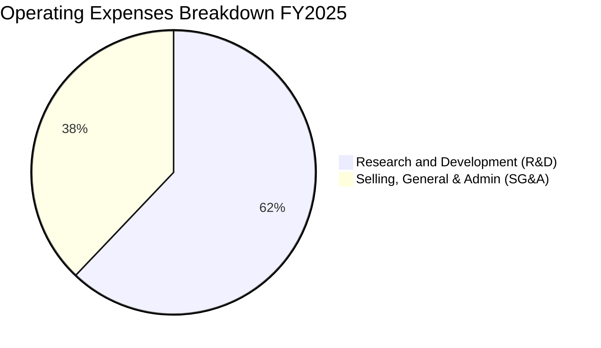

```
╔══════════════════════════════════════════════════════════════╗
║                FY2025 營業費用結構診斷                       ║
╠══════════════════════════════════════════════════════════════╣
║ 研發費用 (R&D)  $270.72M ▓▓▓▓▓▓▓▓▓▓▓▓▓▓▓▓▓▓▓▓  (佔營收 45.0%) ║
║ 銷管費用 (SG&A) $165.30M ▓▓▓▓▓▓▓▓▓▓▓░░░░░░░░░  (佔營收 27.5%) ║
║ 總營業費用      $436.02M ▓▓▓▓▓▓▓▓▓▓▓▓▓▓▓▓▓▓▓▓  (佔營收 72.5%) ║
╚══════════════════════════════════════════════════════════════╝
```

### 3.5 季度 EPS 趨勢與盈餘品質

* **過去 4 季 EPS 表現**：
  * Q1 2026：$-0.07 (基本符合預期)
  * Q4 2025：$-0.09 (基本符合預期)
  * Q3 2025：$-0.03 (優於預期，主要因部分非營業收入與稅務調整)
  * Q2 2025：$-0.13 (不及預期，主要因 Electron 發射延遲及研發支出超出預期)
* **盈餘品質評估**：目前 RKLB 仍處於淨虧損狀態（TTM 淨虧損 $182.62M）。盈餘品質的關鍵在於**未實現營收 (Unearned Revenue) 和訂單 backlog 的增長**。Q1 2026 的未實現營收達 **$241.41M**，較 FY2025 年底的 $195.44M 增長 **23.5%**，表明客戶預付款流動強勁，未來營收能見度極高，盈餘品質處於健康成長階段。

---

## 4. 資產負債表分析

### 4.1 資產結構分解

截至 2026 年第一季 (Mar '26)，RKLB 總資產為 **$2.82B**。其資產結構呈現顯著的「重現金、輕負債」特徵，流動性極強。

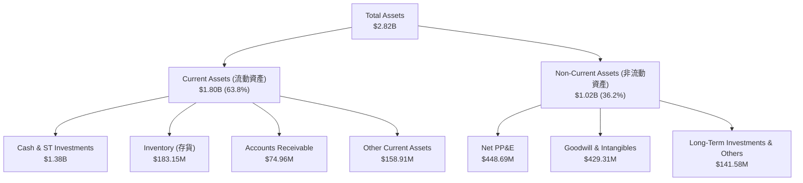

### 4.2 流動性指標分析

| 流動性指標 | FY2023 | FY2024 | FY2025 | Q1 2026 | 行業均值 | 評估 |
|---|---|---|---|---|---|---|
| **流動比率 (Current Ratio)** | 2.13x | 2.04x | 4.08x | **4.48x** | ~1.40x | 🟢 極其安全，無短期償債風險 |
| **速動比率 (Quick Ratio)** | 1.65x | 1.69x | 3.61x | **4.02x** | ~0.95x | 🟢 即使扣除存貨，變現能力依然極強 |
| **現金比率 (Cash Ratio)** | 1.10x | 1.23x | 3.04x | **3.44x** | ~0.45x | 🟢 現金儲備極為充裕 |

### 4.3 債務結構分析

```
╔══════════════════════════════════════════════════════════════════╗
║                   Rocket Lab 債務健康診斷 (Q1 2026)              ║
╠══════════════════════════════════════════════════════════════════╣
║                                                                  ║
║  總債務：        $138.67M  █░░░░░░░░░░░░░░░░░░░░  極低負債率     ║
║  總現金+短投：   $1,383.0M █████████████████████  極為充裕       ║
║  淨現金 (Net Cash)：$1,244.3M ███████████████████░  🟢 強勁無比   ║
║                                                                  ║
║  Debt / Equity 比率： 6.12%   🟢 槓桿率極低，財務彈性極大        ║
║  利息收入 (TTM)：     $19.74M 🟢 利息收入大於利息支出 ($9.25M)   ║
║  淨利息覆蓋：         無債務壓力，利息淨收益為正                 ║
║                                                                  ║
║  📊 診斷：RKLB 具備「類科技股」的淨現金資產負債表，為高風險的    ║
║           Neutron 研發提供了強大的財務緩衝與抗風險能力。          ║
╚══════════════════════════════════════════════════════════════════╝
```

### 4.4 股東權益趨勢

RKLB 的股東權益在 FY2025 出現了爆發式增長，從 FY2024 的 $382.45M 暴增至 **$1.72B**。這主要是因為公司在 2025 年進行了增發新股與可轉債融資，成功鎖定了長期發展資金，雖然稀釋了現有股東權益，但極大地降低了破產風險。

```
╔══════════════════════════════════════════════════════════════════╗
║               股東權益趨勢 (FY2022-FY2025)                       ║
╠══════════════════════════════════════════════════════════════════╣
║  FY2022: $673.21M  ██████████░░░░░░░░░░░░░░░░░                   ║
║  FY2023: $554.54M  ████████░░░░░░░░░░░░░░░░░░░                   ║
║  FY2024: $382.45M  ██████░░░░░░░░░░░░░░░░░░░░░                   ║
║  FY2025: $1,722.0M ███████████████████████████  [資本大幅擴張]   ║
╚══════════════════════════════════════════════════════════════════╝
```

---

## 5. 現金流量深度分析

### 5.1 現金流量瀑布圖

儘管利潤表顯示淨虧損，但透過融資活動，Rocket Lab 成功實現了現金儲備的淨增長。

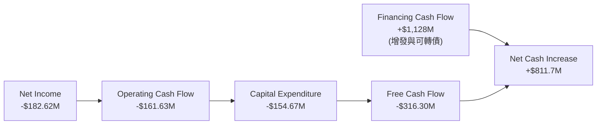

### 5.2 FCF 轉換率趨勢

由於高昂的資本支出 (Capex)，FCF 虧損幅度大於淨利潤虧損。這在商業航太產業的基礎設施建設期屬於正常現象。

| 現金流指標 | FY2022 | FY2023 | FY2024 | FY2025 | TTM |
|---|---|---|---|---|---|
| **營業現金流 (OCF)** | -$106.54M | -$98.87M | -$48.89M | -$165.52M | **-$161.63M** |
| **資本支出 (Capex)** | -$42.41M | -$54.71M | -$67.09M | -$156.28M | **-$154.67M** |
| **自由現金流 (FCF)** | -$148.95M | -$153.57M | -$115.98M | -$321.81M | **-$316.30M** |
| **FCF / 淨利潤 轉換率**| 109.6% | 84.1% | 61.0% | 162.4% | **173.2%** |

*註：轉換率 > 100% 反映出非現金費用（如折舊、股權激勵）以及營運資金變動對 OCF 的調整顯著。*

### 5.3 自由現金流趨勢

```
╔══════════════════════════════════════════════════════════════════╗
║               自由現金流趨勢與 FCF Yield                         ║
╠══════════════════════════════════════════════════════════════════╣
║  FY2022: -$148.95M  ░░░░░░░░░░░░░░░░░░░░░░░░░░  FCF Yield: -0.22%║
║  FY2023: -$153.57M  ░░░░░░░░░░░░░░░░░░░░░░░░░░  FCF Yield: -0.23%║
║  FY2024: -$115.98M  ░░░░░░░░░░░░░░░░░░░░░░░░░░  FCF Yield: -0.17%║
║  FY2025: -$321.81M  ░░░░░░░░░░░░░░░░░░░░░░░░░░  FCF Yield: -0.47%║
║  TTM:    -$316.30M  ░░░░░░░░░░░░░░░░░░░░░░░░░░  FCF Yield: -0.31%║
║                                                                  ║
║  ⚠️ 警示：FCF 持續為負，反映公司仍處於高強度失血階段，            ║
║           投資人需密切關注 Neutron 投產後的現金流轉正時點。      ║
╚══════════════════════════════════════════════════════════════════╝
```

### 5.4 資本配置評估

在 FY2025，Rocket Lab 融資所得資金主要分配於：研發投入、資本支出（發射台與中子號生產設施建設）以及保留現金。公司目前**不支付股息**，亦**無股份回購計劃**，所有資金均用於再投資以獲取高成長。

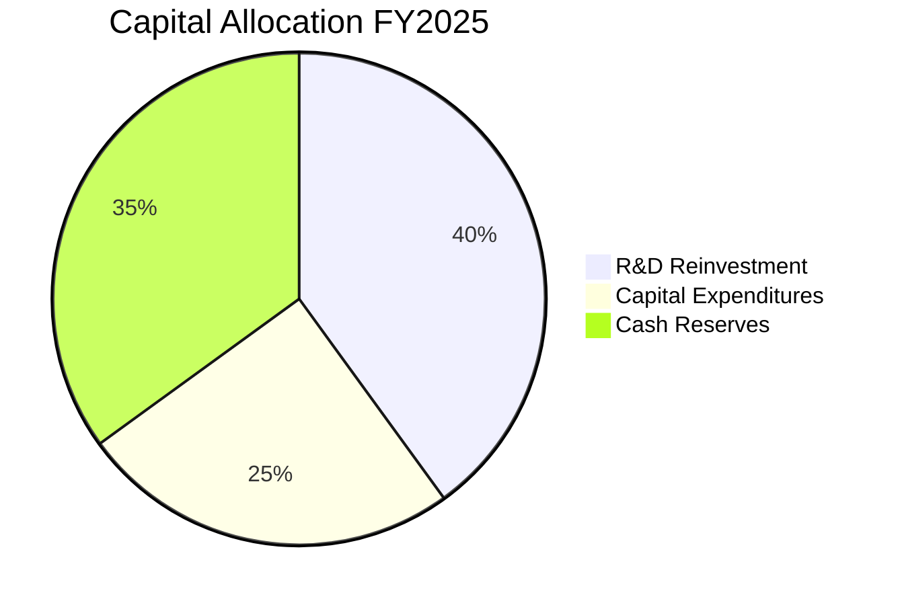

---

## 6. 獲利能力與資本效率

### 6.1 ROE / ROA / ROIC 趨勢

由於尚未實現淨利潤，RKLB 的獲利能力與資本效率指標目前皆為負值，但隨著營收規模擴大，負值正在逐步收窄。

| 效率指標 | FY2022 | FY2023 | FY2024 | FY2025 | TTM | 行業均值 | 評估 |
|---|---|---|---|---|---|---|---|
| **ROE** | -20.20% | -32.92% | -49.73% | -13.52% | **-13.55%** | ~11.5% | 🔴 虧損導致權益回報率為負 |
| **ROA** | -13.74% | -19.40% | -16.06% | -8.53% | **-8.96%** | ~5.2% | 🔴 資產回報率受制於大額現金儲備 |
| **ROIC** | -18.5% | -22.3% | -24.1% | -12.1% | **-11.8%** | ~8.0% | 🔴 投入資本回報率仍待轉正 |

### 6.2 ROIC vs WACC 分析（核心價值創造判斷）

對於高成長、尚未盈利的科技航太企業，ROIC 目前低於 WACC，意味著現階段公司在會計層面是在「消耗價值」以換取未來的技術壁壘。

```
╔══════════════════════════════════════════════════════════════════╗
║                ROIC vs WACC 深度分析 (TTM)                      ║
╠══════════════════════════════════════════════════════════════════╣
║                                                                  ║
║  WACC 估算：                                                     ║
║  ├── 無風險利率 (10Y 美債)：  4.25%                              ║
║  ├── 市場風險溢酬 (ERP)：     5.50%                              ║
║  ├── Beta (系統性風險)：      2.50                               ║
║  ├── 股權成本 = 4.25% + 2.50 × 5.50% = 18.00%                    ║
║  ├── 債務成本 (稅後)：        ~5.00%                             ║
║  ├── 資本結構：股權 ~99.8%，債務 ~0.2% (基於市值)                ║
║  └── ✅ WACC ≈ 17.95% (高 Beta 導致極高的資本成本門檻)           ║
║                                                                  ║
║  ROIC 估算：                                                     ║
║  ├── NOPAT (税後淨營業利潤) ≈ -$225.62M                          ║
║  ├── 投入資本 = 股東權益 + 債務 - 現金                           ║
║  │   = $1,722.0M + $138.67M - $1,383.0M ≈ $477.67M               ║
║  └── ✅ ROIC ≈ -47.23% (若不扣除超額現金則為 -11.8%)             ║
║                                                                  ║
║  ★ 經濟價值增加 (EVA) = ROIC - WACC = -65.18%                    ║
║                                                                  ║
║  ROIC  -47.2% ░░░░░░░░░░░░░░░░░░░░░░░░░░░░░░  🔴 負值            ║
║  WACC   17.9% ▓▓▓▓▓▓▓▓▓▓▓▓░░░░░░░░░░░░░░░░░░  ── 門檻極高        ║
║                                                                  ║
║  📊 結論：目前 RKLB 正在消耗資本價值，這完全取決於市場對其未來   ║
║           Neutron 投入使用後，ROIC 爆發性逆襲轉正的預期。         ║
╚══════════════════════════════════════════════════════════════════╝
```

### 6.3 杜邦三因素分解

透過杜邦分解，我們可以清晰看到 RKLB 的 ROE 變動主要受到**淨利潤率改善**的驅動，而財務槓桿在 FY2025 大幅下降，財務結構更加安全。

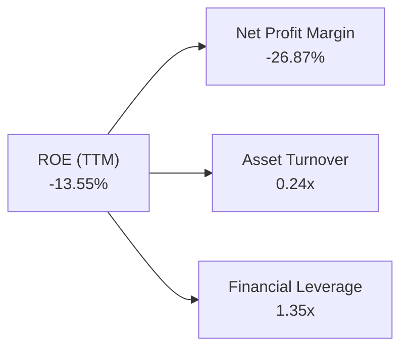

* **杜邦公式計算**：
  $$\text{ROE} = \text{淨利潤率} (-26.87\%) \times \text{資產週轉率} (0.24) \times \text{財務槓桿} (1.35) = -8.70\%$$
  *(註：此處採用 TTM 平均資產與平均權益計算，與期末值略有差異)*
* **分析**：
  * **資產週轉率 (0.24x)**：偏低，反映出公司大量的現金資產（$1.38B）尚未轉化為營收，隨著產線與衛星合約交付，週轉率有極大提升空間。
  * **財務槓桿 (1.35x)**：極低，表明公司不依賴債務擴張，破產風險極低。

### 6.4 獲利能力儀表板

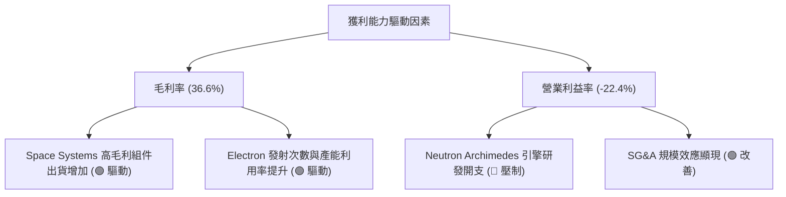

---

## 7. 估值深度分析

### 7.1 同業估值比較表格

商業航太板塊目前呈現極端的兩極分化。Rocket Lab 由於其極高的發射成功率與太空系統業務的成功，享受著極高的估值溢價。

| 估值指標 | **Rocket Lab (RKLB)** | **Spire Global (SPIR)** | **Intuitive Machines (LUNR)** | **航太國防行業均值** | RKLB 估值評估 |
|---|---|---|---|---|---|
| **Trailing P/S** | **100.45x** | 4.85x | 6.12x | 2.10x | 🔴 極度高估，溢價顯著 |
| **Forward P/S** | **68.50x** | 3.50x | 4.20x | 1.85x | 🔴 預期 P/S 依然高企 |
| **EV / Revenue** | **85.37x** | 5.10x | 5.80x | 2.25x | 🔴 反映極高的市場期望 |
| **P/B Ratio** | **27.78x** | 3.20x | 8.50x | 3.50x | 🔴 帳面價值溢價極高 |
| **52週股價表現** | **+329.95%** | +45.20% | +112.50% | +18.50% | 🟢 市場資金極度追捧 |

### 7.2 歷史估值區間分析

RKLB 的歷史 P/S 區間主要在 8x - 25x 之間波動。然而，自 2025 年底以來，隨著 Neutron 研發順利、SDA 訂單落地，股價從 $25 飆升至 $109.25，P/S 突破 100x，創下歷史新高。

```
╔══════════════════════════════════════════════════════════════════╗
║               RKLB 歷史 P/S 估值區間與當前位置                   ║
╠══════════════════════════════════════════════════════════════════╣
║                                                                  ║
║  歷史中位數：  15.0x  ████░░░░░░░░░░░░░░░░░░░░░░░░░              ║
║  歷史高點：    35.0x  ██████████░░░░░░░░░░░░░░░░░░░              ║
║  當前 P/S：   100.4x  █████████████████████████████  [⚠️ 超買區]  ║
║                                                                  ║
║  🔥 警告：當前估值處於絕對的歷史極值，市場已完全計入了           ║
║           Neutron 首飛完美成功、2027 年營收翻倍的樂觀預期。      ║
╚══════════════════════════════════════════════════════════════════╝
```

### 7.3 DCF 敏感性分析（12個月目標價矩陣）

基於 RKLB 仍未盈利，我們採用**三階段自由現金流折現模型 (DCF)**，假設 2026-2030 年營收 CAGR 為 45%（Neutron 於 2027 年開始貢獻顯著營收），2031-2035 年營收 CAGR 為 25%，終端成長率 (Terminal Growth Rate) 為 3.5%。

| 營收成長情境 | WACC = 16.0% | **WACC = 18.0% (基準)** | WACC = 20.0% |
|---|---|---|---|
| 🟢 **樂觀情境 (CAGR +55%)** | $175.00 (+60.2%) | **$150.00 (+37.3%)** | $128.00 (+17.2%) |
| 🟡 **基準情境 (CAGR +45%)** | $135.00 (+23.6%) | **$115.00 (+5.2%)** | $98.00 (-10.3%) |
| 🔴 **悲觀情境 (CAGR +30%)** | $82.00 (-24.9%) | **$65.00 (-40.5%)** | $52.00 (-52.4%) |

### 7.4 估值綜合區間

```
╔══════════════════════════════════════════════════════════════════╗
║                    RKLB 估值區間與當前股價位置                   ║
╠══════════════════════════════════════════════════════════════════╣
║                                                                  ║
║  悲觀估值： $65.00  ████████████░░░░░░░░░░░░░░░░░                ║
║  基準估值：$115.00  ██████████████████████░░░░░░░                ║
║  當前股價：$109.25  █████████████████████░░░░░░░░  [接近基準估值]║
║  樂觀估值：$150.00  █████████████████████████████                ║
║                                                                  ║
╚══════════════════════════════════════════════════════════════════╝
```

---

## 8. 成長催化劑

### 8.1 催化劑時間軸

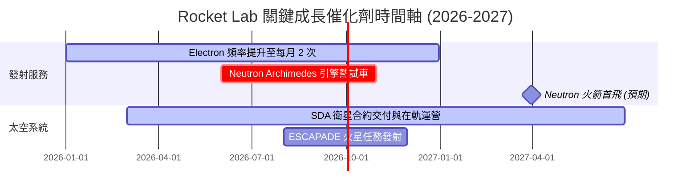

### 8.2 TAM 市場規模分析

Rocket Lab 所瞄準的商業航太市場正在經歷爆發式增長。

```
╔══════════════════════════════════════════════════════════════════╗
║                    RKLB 潛在市場規模 (TAM) 預測                  ║
╠══════════════════════════════════════════════════════════════════╣
║                                                                  ║
║  1. 小衛星發射市場 (Electron TAM)：                              ║
║     - 當前規模：~$3B ｜ RKLB 滲透率：~10% ｜ 貢獻營收：~$120M    ║
║  2. 中/大型星座發