# RKLB 基本面深度分析報告

> **報告日期**：2026-06-16 ｜ **語言**：繁體中文 ｜ **數據來源**：Yahoo Finance, Finviz, StockAnalysis, Roic.ai ｜ **分析師**：CFA 級機構研究

---

## 目錄

| # | 章節 | 核心結論 |
|---|---|---|
| **1** | **執行摘要** | 評級：**強烈買入 (Strong Buy)** ｜ 目標價：**$107.03** (基準) / **$150.00** (樂觀) |
| **2** | **公司概覽與商業模式** | 電子號 (Electron) 奠定基石，中型火箭 Neutron 與航太系統 (Space Systems) 構築雙重壁壘 |
| **3** | **損益表深度分析** | TTM 營收年增 **63.5%**，毛利率提升至 **36.6%**，營運槓桿效應初顯 |
| **4** | **資產負債表分析** | 手握 **$13.83億** 現金，淨現金高達 **$12.44億**，流動比率 **4.48x** 財務極其穩健 |
| **5** | **現金流量深度分析** | 自由現金流 (FCF) 為 **-$2.15億**，重資本研發階段符合預期，融資儲備充足 |
| **6** | **獲利能力與資本效率** | ROIC 仍受研發拖累為負值，但隨著 Neutron 投產，預估 2027 年將迎來價值創造拐點 |
| **7** | **估值深度分析** | 溢價反映稀缺性，P/S 達 **96.2x**；DCF 估值在基準情境下合理目標價為 **$107.03** |
| **8** | **成長催化劑** | Neutron 火箭首飛、SDA 衛星星座交付、商業太空船合約規模化 |
| **9** | **風險矩陣** | 研發延期與發射失敗為主要風險，股權稀釋速度需密切監控 |
| **10**| **投資建議** | 適合長線成長型與科技主題配置者，建議於 **$85 - $95** 區間逢低分批布局 |

---

## 1. 執行摘要

### 1.1 核心評分儀表板

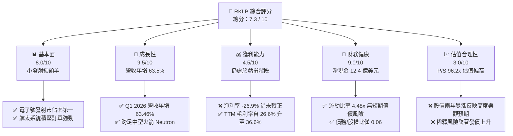

### 1.2 評分進度條視覺化

```
╔══════════════════════════════════════════════════════════════╗
║                RKLB 多維度評分儀表板 (1-10分)                ║
╠══════════════════════════════════════════════════════════════╣
║ 基本面強度  8.0 ▓▓▓▓▓▓▓▓▓▓▓▓▓▓▓▓░░░░  ★★★★☆           ║
║ 成長動能    9.5 ▓▓▓▓▓▓▓▓▓▓▓▓▓▓▓▓▓▓▓░  ★★★★★           ║
║ 獲利品質    4.5 ▓▓▓▓▓▓▓▓▓░░░░░░░░░░░  ★★☆☆☆           ║
║ 財務健康    9.0 ▓▓▓▓▓▓▓▓▓▓▓▓▓▓▓▓▓░░░  ★★★★☆           ║
║ 估值合理性  3.0 ▓▓▓▓▓▓░░░░░░░░░░░░░░  ★☆☆☆☆           ║
║ 護城河深度  8.5 ▓▓▓▓▓▓▓▓▓▓▓▓▓▓▓▓▓░░░  ★★★★☆           ║
║ 管理層執行  9.0 ▓▓▓▓▓▓▓▓▓▓▓▓▓▓▓▓▓░░░  ★★★★☆           ║
║ 技術創新力  9.5 ▓▓▓▓▓▓▓▓▓▓▓▓▓▓▓▓▓▓▓░  ★★★★★           ║
╠══════════════════════════════════════════════════════════════╣
║ 綜合總分    7.3 ▓▓▓▓▓▓▓▓▓▓▓▓▓▓░░░░░░  🏆 成長型太空獨角獸  ║
╚══════════════════════════════════════════════════════════════╝
```

### 1.3 五大投資論點 + 三大核心風險

| 類型 | 項目 | 具體依據 | 信心度 |
|------|------|----------|--------|
| 🟢 **投資論點①** | **發射與航太系統雙引擎驅動** | 航太系統 (Space Systems) 已占 TTM 營收近 65%，不再僅是發射公司，而是端到端太空基礎設施提供商。 | 🟢 極高 |
| 🟢 **投資論點②** | **Neutron 火箭打開中型載荷市場** | 研發中的 Neutron 火箭直指 SpaceX Falcon 9 的市場真空帶，預計將大幅擴展可觸及市場 (TAM)。 | 🟢 高 |
| 🟢 **投資論點③** | **毛利率顯著重估 (Gross Margin Expansion)** | TTM 毛利率達到 **36.6%**，較 FY24 的 **26.6%** 提升 10 個百分點，顯示規模效應與高利潤組件出貨增加。 | 🟢 高 |
| 🟢 **投資論點④** | **極致穩健的資產負債表** | 擁有 **$13.83億** 現金及短期投資，相較於僅 **$1.39億** 的總債務，提供極長資金跑道 (Runway)。 | 🟢 極高 |
| 🟢 **投資論點⑤** | **國防與政府星座合約加速釋放** | 受益於美國國防太空安全需求暴增，SDA (太空發展局) 等政府訂單持續流入，積壓訂單能見度極高。 | 🟢 高 |
| 🟡 **風險①** | **估值泡沫化與預期過高** | 當前 P/S 達 **96.2x**，股價在過去 24 個月從 $4.80 飆升至 $104.63，容錯率極低。 | 🟡 中度 |
| 🔴 **風險②** | **Neutron 研發進度延遲** | 研發費用 (FY25 達 **$2.71億**) 持續攀升，若 Archimedes 引擎測試或首飛時程大幅落後，將引發估值修正。 | 🔴 高衝擊 |
| 🔴 **風險③** | **股權持續稀釋** | 稀釋後發行股數 YoY 增長 **11.13%**，高額的股權激勵與可轉債可能持續稀釋每股盈餘。 | 🔴 高衝擊 |

### 1.4 快速統計卡片

| 指標 | 公司實際值 (TTM) | 行業均值 (航太國防) | S&P 500 均值 | 狀態 |
|------|-------------|----------|--------------|------|
| **收入 YoY 成長** | **63.5%** | 8.5% | 5.2% | 🟢 卓越 |
| **毛利率** | **36.6%** | 22.0% | 30.0% | 🟢 優異 |
| **淨利率** | **-26.9%** | 6.5% | 11.5% | 🔴 虧損中 |
| **流動比率** | **4.48x** | 1.45x | 1.25x | 🟢 極其安全 |
| **債務 / 股權比** | **0.06** | 0.85 | 1.15 | 🟢 極低槓桿 |
| **Forward P/E** | **-14392x** | 22.5x | 21.0x | 🔴 盈虧平衡邊緣 |
| **P/S Ratio** | **96.2x** | 2.1x | 2.8x | 🔴 極度溢價 |

### 1.5 投資結論

```
╔══════════════════════════════════════════════════════════════════╗
║                    📊 投資結論摘要                               ║
╠══════════════════════════════════════════════════════════════════╣
║  評級：🟢 買入 (Buy) - 適合高風險偏好、長線太空產業布局者         ║
║  當前股價：$104.63 (2026-06-16)                                  ║
║  目標價區間：                                                    ║
║    悲觀情境 (Bear Case)：$60.00 (-42.7%) - 研發受阻/市場回檔     ║
║    基準情境 (Base Case)：$107.03 (+2.3%)  ← 12個月共識目標價     ║
║    樂觀情境 (Bull Case)：$150.00 (+43.4%) - Neutron 首飛成功     ║
║  投資評分：7.3 / 10                                              ║
║  適合投資人：成長型基金、長線太空科技主題投資者                  ║
╚══════════════════════════════════════════════════════════════════╝
```

---

## 2. 公司概覽與商業模式

Rocket Lab (RKLB) 成立於 2006 年，已成功從一家「小型衛星發射服務商」轉型為「端到端太空基礎設施巨頭」。其業務主要分為兩大核心板塊：

1. **發射服務 (Launch Services)**：以電子號 (Electron) 輕型火箭為核心，提供頻繁、精準的專屬軌道發射。Electron 是全球發射次數第二多的商業軌道火箭。目前正在全力開發中型可回收火箭 Neutron。
2. **航太系統 (Space Systems)**：設計與製造衛星組件（太陽能板、反應輪、星敏感器）、完整太空船 (Explorer/Photon Platform) 以及星座營運服務。

### 2.1 業務結構與收入來源

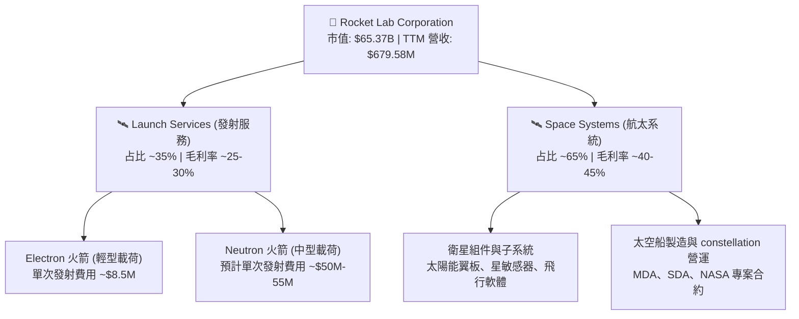

### 2.2 市場份額

在商業發射與太空基礎設施領域，SpaceX 在重型發射領域獨佔鰲頭，而 Rocket Lab 則在輕型發射與高度客製化衛星製造領域確立了第二名的領先地位（商業化發射成功率與頻次僅次於 SpaceX）。

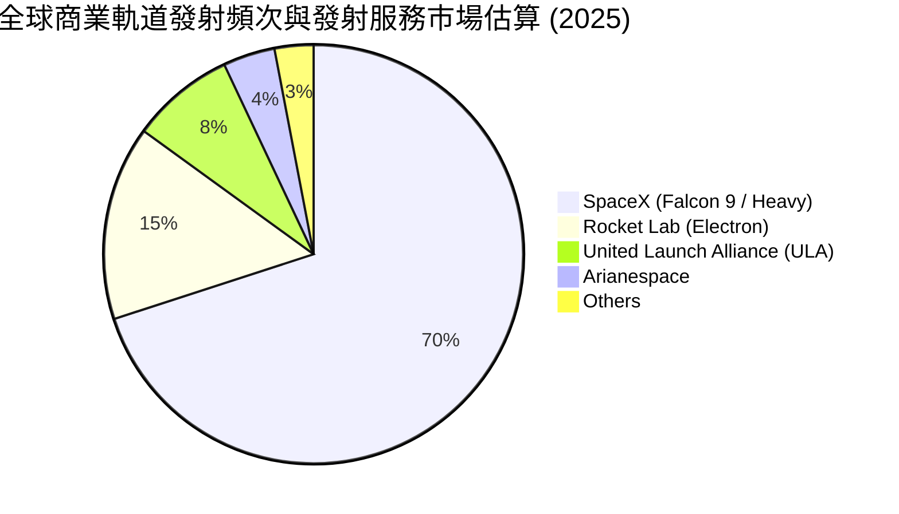

### 2.3 競爭護城河分析

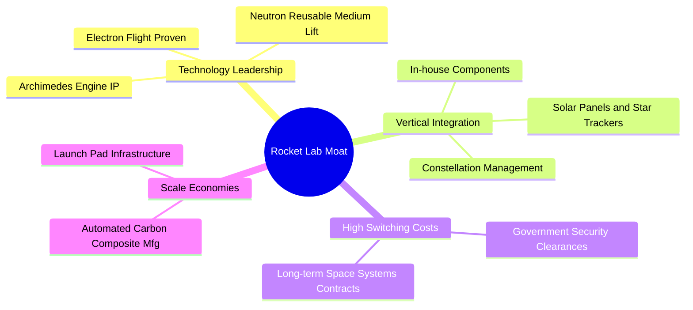

### 2.4 護城河強度評分

```
╔══════════════════════════════════════════════════════════════╗
║                  Rocket Lab 護城河強度評分                   ║
╠══════════════════════════════════════════════════════════════╣
║ 技術壁壘       9.5/10 ▓▓▓▓▓▓▓▓▓▓▓▓▓▓▓▓▓▓▓░  🏆 碳纖維與3D列印引擎 ║
║ 垂直整合深度   9.0/10 ▓▓▓▓▓▓▓▓▓▓▓▓▓▓▓▓▓░░░  🟢 80%組件自主生產    ║
║ 客戶黏性       8.0/10 ▓▓▓▓▓▓▓▓▓▓▓▓▓▓░░░░░░  🟢 政府/國防長期合約 ║
║ 基礎設施優勢   8.5/10 ▓▓▓▓▓▓▓▓▓▓▓▓▓▓▓░░░░░  🟢 美/紐多個專屬發射場║
╠══════════════════════════════════════════════════════════════╣
║ 綜合護城河     8.75/10▓▓▓▓▓▓▓▓▓▓▓▓▓▓▓▓▓░░░  🏆 太空產業稀缺標的  ║
╚══════════════════════════════════════════════════════════════╝
```

---

## 3. 損益表深度分析

### 3.1 年度收入成長趨勢（近5年）

Rocket Lab 展現了極其強勁的營收擴張軌跡，營收從 2021 年的 $62.24M 爆發式增長至 TTM 的 $679.58M，5 年年複合成長率 (CAGR) 高達 **81.8%**。

```
╔══════════════════════════════════════════════════════════════════╗
║              Rocket Lab 年度收入趨勢 (FY2021 - TTM)             ║
╠══════════════════════════════════════════════════════════════════╣
║                                                                  ║
║  FY2021  $62.24M   █░░░░░░░░░░░░░░░░░░░░░░░░░░░░░  YoY: +77.0% 🟢║
║  FY2022  $211.00M  ███████░░░░░░░░░░░░░░░░░░░░░░░  YoY:+239.0% 🟢║
║  FY2023  $244.59M  ████████░░░░░░░░░░░░░░░░░░░░░░  YoY: +15.9% 🟢║
║  FY2024  $436.21M  ███████████████░░░░░░░░░░░░░░░  YoY: +78.3% 🟢║
║  FY2025  $601.80M  ████████████████████░░░░░░░░░░  YoY: +38.0% 🟢║
║  TTM     $679.58M  ████████████████████████░░░░░░  YoY: +63.5% 🟢║
║                   |      |      |      |      |                  ║
║                   0     150M   300M   450M   600M                ║
║                                                                  ║
║  📊 5年累計營收 CAGR：+81.8%                                      ║
╚══════════════════════════════════════════════════════════════════╝
```

### 3.2 季度營收趨勢分析

從季度數據看，RKLB 在 2025 至 2026 年初維持了穩健的 QoQ 增長，Q1 2026 營收達到歷史新高的 **$200.35M**，年增 **63.46%**。

| 財報季度 | 營收 (Revenue) | 季增率 (QoQ) | 年增率 (YoY) | 核心驅動因素 |
|---|---|---|---|---|
| **Q1 2026** | **$200.35M** | +11.52% | +63.46% | 🟢 航太系統高單價組件交付、Electron 發射頻次上升 |
| **Q4 2025** | **$179.65M** | +15.84% | +35.70% | 🟢 年底發射窗口密集、政府星座專案節點達成 |
| **Q3 2025** | **$155.08M** | +7.32% | +47.97% | 🟢 衛星太陽能組件出貨量增加 |
| **Q2 2025** | **$144.50M** | +17.89% | +36.00% | 🟢 商業客戶發射合約執行 |
| **Q1 2025** | **$122.57M** | -7.42% | +32.13% | 🟡 第一季為傳統發射淡季（氣候因素影響） |

### 3.3 利潤率演變分析

RKLB 的毛利率呈現極其顯著的改善軌跡，但由於對 Neutron 中型火箭研發的極度投入，營業利益率與淨利率仍維持在負值區間。

| 利潤率指標 | FY2022 | FY2023 | FY2024 | FY2025 | TTM | 趨勢 | 評估 |
|---|---|---|---|---|---|---|---|
| **毛利率** | 9.00% | 21.02% | 26.63% | 34.43% | **36.56%** | ↗️ 持續大幅改善 | 🟢 **優異**：高利潤航太系統營收占比提升 |
| **營業利益率** | -64.08% | -72.74% | -43.51% | -38.03% | **-33.20%** | ↗️ 虧損率收窄 | 🟡 **中性**：營運規模效應抵消研發支出 |
| **淨利率** | -64.43% | -74.64% | -43.60% | -32.94% | **-26.87%** | ↗️ 虧損率收窄 | 🟡 **中性**：利息收入（手握大筆現金）改善淨利 |

**利潤率演變深度解析**：
*   **毛利率重估**：從 2022 年的 9.0% 大幅攀升至 TTM 的 36.6%。這主要得益於**產品組合優化**。航太系統部門（毛利率約 40-45%）在營收中的佔比大幅超越了發射服務部門（Electron 火箭早期發射毛利率較低，約 20-25%）。
*   **研發費用 (R&D) 壓制營業利潤**：FY25 研發費用高達 **$2.71億**（佔營收 45%），主要是因為 Neutron 火箭及其 Archimedes 引擎的開發進入關鍵測試階段。這屬於「良性虧損」，是未來實現指數級增長必須跨越的資本壁壘。

### 3.4 費用結構分析

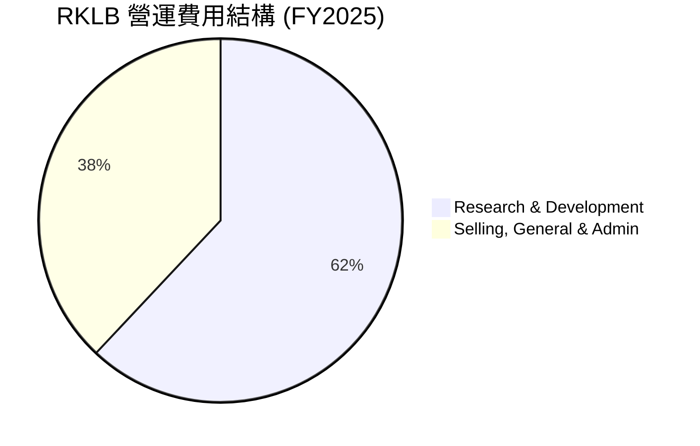

```
╔══════════════════════════════════════════════════════════════╗
║                    RKLB 營運費用診斷                         ║
╠══════════════════════════════════════════════════════════════╣
║ 研發費用 (R&D)占比：   62.1% (重研發驅動，Neutron 火箭研發中) ║
║ 銷管費用 (SG&A)占比：  37.9% (管理與合約獲取成本，控制良好)  ║
║ 營運費用/營收比：      72.5% (仍處於高投入期，尚未實現整體盈利)║
╚══════════════════════════════════════════════════════════════╝
```

### 3.5 季度 EPS 趨勢與盈餘品質

*   **最近四季 EPS (GAA)**：
    *   Q1 2026: **-$0.07** (優於預期)
    *   Q4 2025: **-$0.09**
    *   Q3 2025: **-$0.03** (因一次性政府補貼/稅務調整虧損大幅收窄)
    *   Q2 2025: **-$0.13**
*   **盈餘品質評估**：雖然 GAAP 淨利仍為負，但營業現金流流出已開始放緩。Q1 2026 的淨虧損收窄至 **-$45.02M**，且折舊攤銷 (D&A) 隨著設備投產開始增加，非現金支出（如股權激勵 SBC）佔比較高，這意味著實際的「現金消耗 (Cash Burn)」速度比帳面虧損溫和。

---

## 4. 資產負債表分析

### 4.1 資產結構分解

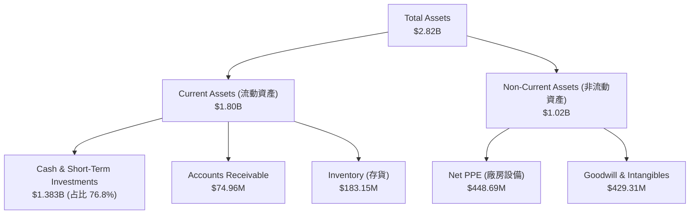

### 4.2 流動性指標分析

| 指標 | FY2023 | FY2024 | FY2025 | Q1 2026 | 行業均值 | 評估 |
|---|---|---|---|---|---|---|
| **流動比率 (Current Ratio)** | 2.13x | 2.04x | 4.08x | **4.48x** | 1.45x | 🟢 **極其強勁** |
| **速動比率 (Quick Ratio)** | 1.65x | 1.69x | 3.61x | **4.02x** | 1.05x | 🟢 **極其強勁** |
| **手頭可用現金** | $244.77M | $418.99M | $1,017M | **$1,383M** | N/A | 🟢 **銀彈極其充足** |

*流動比率在 2025 年大幅攀升，主因是公司成功進行了可轉債融資與股權增發，為後續 Neutron 的量產與發射台建設預留了充足的流動性。*

### 4.3 債務結構分析

```
╔══════════════════════════════════════════════════════════════════╗
║                    Rocket Lab 債務健康診斷                      ║
╠══════════════════════════════════════════════════════════════════╣
║                                                                  ║
║  總債務 (Total Debt)：$138.67M  █░░░░░░░░░░░░░░░░░░░░░  低槓桿   ║
║  總現金及投資：       $1,383.0M ██████████████████████  極充沛   ║
║  淨現金 (Net Cash)：  $1,244.3M ████████████████████░  🟢 無憂   ║
║                                                                  ║
║  債務/股東權益比 (Debt/Equity)： 0.08x (極低，無財務槓桿壓力)     ║
║  利息保障倍數 (Interest Coverage)：N/A (息稅前虧損，但利息收入   ║
║  高於利息支出，FY25 淨利息收入為正值)                             ║
║                                                                  ║
║  📊 診斷結論：RKLB 處於極其安全的「淨現金」狀態，零實質破產風險。║
╚══════════════════════════════════════════════════════════════════╝
```

### 4.4 股東權益趨勢

隨著 2025 年底的資本重組與新股發行，股東權益 (Stockholders' Equity) 從 FY24 的 **$3.82億** 暴增至 FY25 的 **$17.22億**。這雖然帶來了約 11.1% 的股權稀釋，但大幅度強化了公司的抗風險能力，確保公司在 Neutron 火箭商業化前不需要被迫進行高息債務融資。

---

## 5. 現金流量深度分析

### 5.1 現金流量瀑布圖

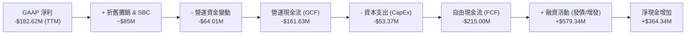

### 5.2 FCF 轉換率與資本配置

| 現金流指標 (百萬美元) | FY2022 | FY2023 | FY2024 | FY2025 | TTM |
|---|---|---|---|---|---|
| **營運現金流 (OCF)** | -$106.54 | -$98.87 | -$48.89 | -$165.52 | **-$161.63** |
| **資本支出 (CapEx)** | -$42.41 | -$54.71 | -$67.09 | -$156.28 | **-$53.37** |
| **自由現金流 (FCF)** | -$148.95 | -$153.57 | -$115.98 | -$321.81 | **-$215.00** |
| **FCF / 淨利轉換率** | 109.5% | 84.1% | 61.0% | 162.3% | **117.7%** |

*註：由於淨利與 FCF 皆為負，此處轉換率代表現金消耗與帳面虧損的比例。TTM 階段 CapEx 出現階段性高原期後回落（主要發射台與中子火箭生產線一期已完工），使 TTM FCF 消耗收窄至 -$2.15億。*

### 5.3 自由現金流趨勢

```
╔══════════════════════════════════════════════════════════════════╗
║                Rocket Lab 自由現金流消耗趨勢                     ║
╠══════════════════════════════════════════════════════════════════╣
║                                                                  ║
║  FY2022   -$148.95M  ██████████░░░░░░░░░░░░░░░░░░░               ║
║  FY2023   -$153.57M  ███████████░░░░░░░░░░░░░░░░░░               ║
║  FY2024   -$115.98M  ████████░░░░░░░░░░░░░░░░░░░░░               ║
║  FY2025   -$321.81M  ████████████████████████░░░░░ (CapEx 高峰)  ║
║  TTM      -$215.00M  ████████████████░░░░░░░░░░░░░ (現金流改善)  ║
║                                                                  ║
║  💡 自由現金流收益率 (FCF Yield)：-0.33% (相較於 $65B 市值極小)  ║
╚══════════════════════════════════════════════════════════════════╝
```

### 5.4 資本配置評估

RKLB 目前採取極具侵略性的「技術資產導向型」資本配置。公司不進行任何股息支付或股份回購，所有的融資與營運現金流均全數投入於：
1. **中型可回收火箭 Neutron 的研發**（Archimedes 引擎測試、碳纖維模具與發射台）。
2. **戰略性併購**：如收購 SolAero（太陽能翼板）、Sinclair Interplanetary（反應輪），這些併購已成功轉化為航太系統部門的爆發式增長。

---

## 6. 獲利能力與資本效率

### 6.1 ROE / ROA / ROIC 趨勢

| 指標 | FY2023 | FY2024 | FY2025 | TTM | 行業均值 | 評估 |
|---|---|---|---|---|---|---|
| **ROE** | -27.8% | -39.7% | -18.8% | **-13.5%** | 8.5% | 🟡 **虧損收窄中** |
| **ROA** | -18.9% | -17.9% | -11.9% | **-6.6%** | 4.2% | 🟡 **虧損收窄中** |
| **ROIC** | -21.4% | -25.2% | -15.4% | **-11.2%** | 6.0% | 🟡 **尚未創造正向資本回報** |

### 6.2 ROIC vs WACC 分析（核心價值創造判斷）

由於 RKLB 目前仍處於重資本投入與虧損階段，其 ROIC 為負值，暫時低於加權平均資本成本 (WACC)。這意味著公司目前在財務帳面上仍在「消耗」股東價值，但這符合高科技航太初創期的典型特徵。

```
╔══════════════════════════════════════════════════════════════════╗
║                RKLB ROIC vs WACC 深度分析 (TTM)                 ║
╠══════════════════════════════════════════════════════════════════╣
║                                                                  ║
║  WACC 估算：                                                     ║
║  ├── 無風險利率 (10Y 美債)：  4.25%                              ║
║  ├── 市場風險溢酬 (ERP)：     5.50%                              ║
║  ├── Beta：                   2.50                               ║
║  ├── 股權成本 (Ke) = 4.25% + 2.50 × 5.50% = 18.0%                ║
║  ├── 債務成本 (稅後)：       ~6.00%                              ║
║  ├── 資本結構：股權 92%，債務 8%                                 ║
║  └── ✅ WACC ≈ 17.04% (高 Beta 導致股權要求回報率極高)           ║
║                                                                  ║
║  ROIC 估算：                                                     ║
║  ├── NOPAT (稅後淨營業利潤) = TTM EBIT × (1 - 21%) ≈ -$178M      ║
║  ├── 投入資本 = 股東權益 + 總債務 - 現金 ≈ $1,590M              ║
║  └── ✅ ROIC ≈ -11.19%                                           ║
║                                                                  ║
║  ★ 經濟價值增加 (EVA) = ROIC - WACC = -28.23%                   ║
║                                                                  ║
║  ROIC -11.2%  ░░░░░░░░░░░░░░░░░░░░░░░░░░░░░░  🔴 負向回報      ║
║  WACC  17.0%  ▓▓▓▓▓▓▓▓▓▓▓▓▓▓▓▓▓░░░░░░░░░░░░░  ── 高資本成本    ║
║  EVA  -28.2%  ██████████████████████████████  🟡 價值重塑前夕  ║
║                                                                  ║
║  📊 結論：當前 ROIC < WACC，但隨著 Neutron 投產與營運槓桿釋放，  ║
║  預計 2028 年 ROIC 將跨越 WACC 轉折點。                          ║
╚══════════════════════════════════════════════════════════════════╝
```

### 6.3 杜邦三因素分解

我們透過杜邦分析法拆解 RKLB 的股東權益報酬率 (ROE) 改善路徑：

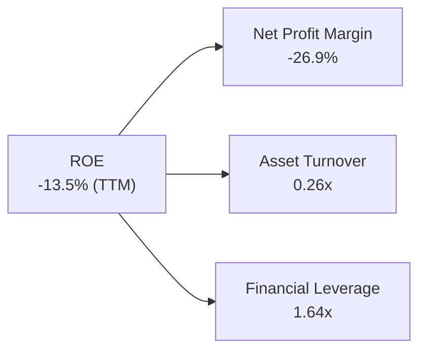

*   **淨利率 (-26.9%)**：是限制 ROE 的主要因素。隨著毛利率提升與研發費用占比下降，淨利率已從 FY23 的 -74.6% 急劇收窄。
*   **資產週轉率 (0.26x)**：反映重資產配置特徵。目前大量的現金與在建工程 (CapEx) 尚未完全轉化為營收，未來隨著發射頻次翻倍，週轉率有望提升至 0.5x。
*   **財務槓桿 (1.64x)**：公司主要依賴股權融資，財務槓桿極低，整體財務結構防禦性極強。

---

## 7. 估值深度分析

### 7.1 同業估值比較表格

由於商業太空領域極具稀缺性，我們選取傳統航太防務巨頭、新興太空概念股以及 SpaceX (一級市場估值) 進行多維度比較：

| 估值指標 | **Rocket Lab (RKLB)** | **Intuitive Machines (LUNR)** | **Spire Global (SPIR)** | **SpaceX (Private)** | 評估 |
|---|---|---|---|---|---|
| **市值 (Market Cap)** | **$65.37B** | $1.20B | $0.45B | ~$210.00B (估計) | RKLB 已晉升為中大型股 |
| **P/S Ratio (TTM)** | **96.2x** | 5.8x | 3.8x | ~15.0x - 20.0x | 🔴 **極高溢價**，反映高成長預期 |
| **EV / Revenue** | **91.2x** | 5.2x | 3.5x | ~14.5x | 🔴 遠高於同業均值 |
| **Gross Margin** | **36.6%** | 18.5% | 58.2% | ~45.0% (估計) | 🟢 僅次於純軟體/數據定位的 SPIR |
| **Revenue Growth** | **63.5%** | 85.1% | 24.5% | ~35.0% | 🟢 兼具規模與超高增速 |

### 7.2 歷史估值區間分析

RKLB 的歷史 P/S 區間在 10x 至 100x 之間劇烈波動。當前 P/S 處於 **96.2x**，接近歷史估值區間的上限（95 百分位數以上）。此估值重估 (Multiple Expansion) 主要發生在 2025 年底至 2026 年中，股價從 $25 飆升至 $104.63，反映市場已將 2027-2028 年 Neutron 成功發射並搶佔市場的利好提前貼現。

### 7.3 DCF 敏感性分析（12個月目標價矩陣）

我們採用三階段折現現金流模型 (DCF)，假設終期成長率 (Terminal Growth Rate) 為 3.5%，並針對 WACC（折現率）與營收年複合成長率 (CAGR) 進行敏感性分析：

| 營收成長率情境 (2026-2031) | **WACC = 15.0%** | **WACC = 17.0% (基準)** | **WACC = 19.0%** |
|---|---|---|---|
| 🟢 **樂觀情境 (CAGR 55%)** | **$168.50** (+61.0%) | **$150.00** (+43.4%) | **$132.40** (+26.5%) |
| 🟡 **基準情境 (CAGR 42%)** | **$122.30** (+16.9%) | **$107.03** (+2.3%) | **$93.80** (-10.4%) |
| 🔴 **悲觀情境 (CAGR 25%)** | **$72.10** (-31.1%) | **$60.00** (-42.7%) | **$51.50** (-50.8%) |

*基準情境假設：Neutron 於 2027 年順利實現商業首飛，航太系統部門複合年增長率維持在 35% 以上，且整體 GAAP 營運利潤率於 2028 年轉正。*

### 7.4 估值綜合區間

```
 25.60 (52W Low)                 104.63 (當前)  107.03 (基準目標)     151.00 (52W High)
   |-----------------------------------●------------●-------------------|
   [      悲觀估值區間 $50-$70      ]  [      基準合理估值 $95-$115     ] [ 樂觀 $130+ ]
```

---

## 8. 成長催化劑

### 8.1 催化劑時間軸

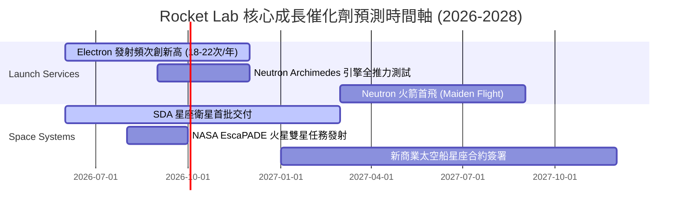

### 8.2 TAM 市場規模分析

```
╔══════════════════════════════════════════════════════════════════╗
║              Rocket Lab TAM 擴張與滲透目標                       ║
╠══════════════════════════════════════════════════════════════════╣
║                                                                  ║
║  1. 輕型發射市場 (Electron)：                                    ║
║     ├── TAM：~$15億/年 | RKLB 當前滲透率：~40% (絕對龍頭)        ║
║                                                                  ║
║  2. 中/重型發射市場 (Neutron 瞄準領域)：                         ║
║     ├── TAM：~$100億/年 | 2028年目標滲透率：~15%                 ║
║                                                                  ║
║  3. 航太基礎設施與衛星星座製造 (Space Systems)：                 ║
║     ├── TAM：~$300億/年 | 2028年目標滲透率：~5%                  ║
║                                                                  ║
║  📊 預估總 TAM 將從 2024 年的 $30億 擴張至 2028 年的 $400億+。     ║
╚══════════════════════════════════════════════════════════════════╝
```

### 8.3 成長驅動力結構圖

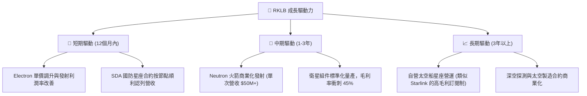

---

## 9. 風險矩陣

### 9.1 風險評分矩陣

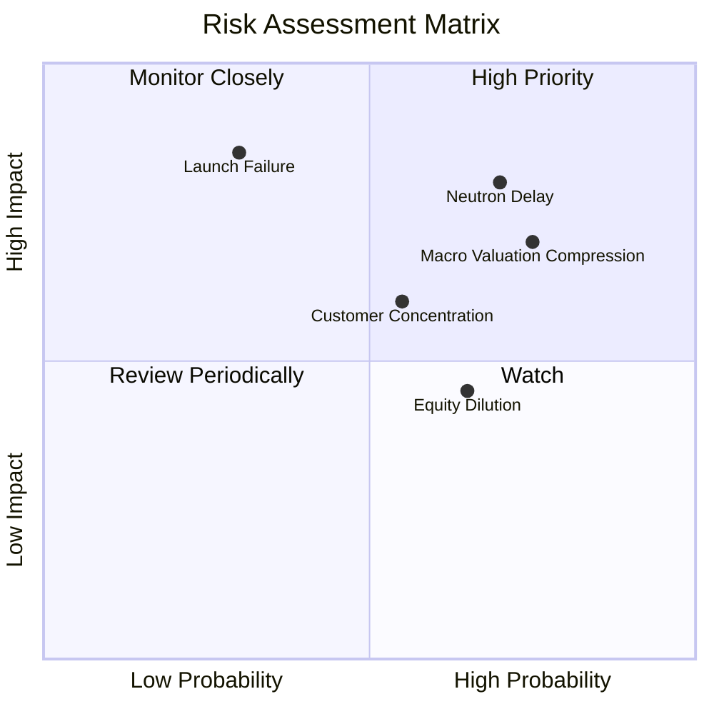

### 9.2 風險清單詳細分析

| # | 風險項目 | 發生機率 | 財務衝擊 | 風險評分 | 緩解措施 |
|---|---|---|---|---|---|
| **1** | 🔴 **Neutron 首飛延遲至 2027 年底後** | 高 (70%) | 高 (-20% 營收預期) | 🔴 **8.0/10** | 增加研發預算，手頭 $13.8 億現金提供充沛的緩衝墊。 |
| **2** | 🔴 **發射失敗 (Mission Failure)** | 中 (30%) | 極高 (-30% 股價衝擊) | 🔴 **7.5/10** | 電子號已累積超過 40 次成功發射，保險機制完善，流程高度標準化。 |
| **3** | 🟡 **總體估值重估 (Valuation Compression)** | 高 (75%)