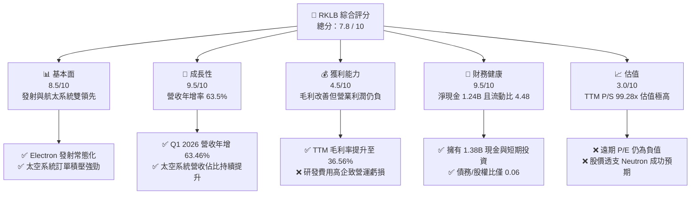
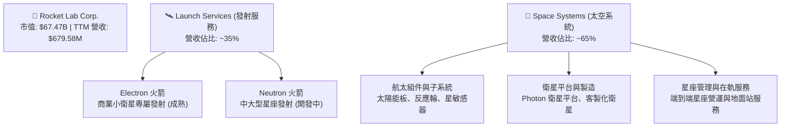
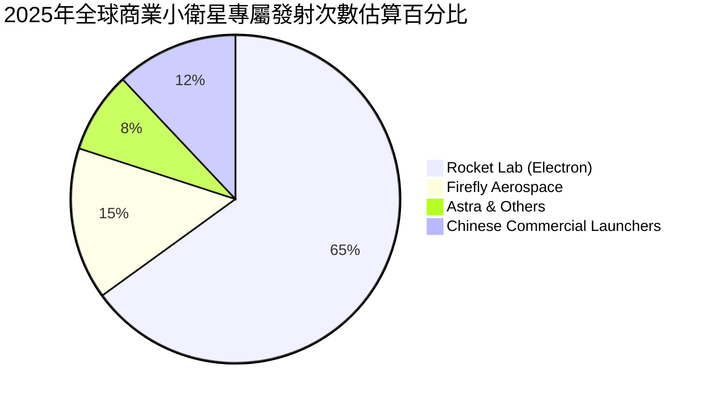
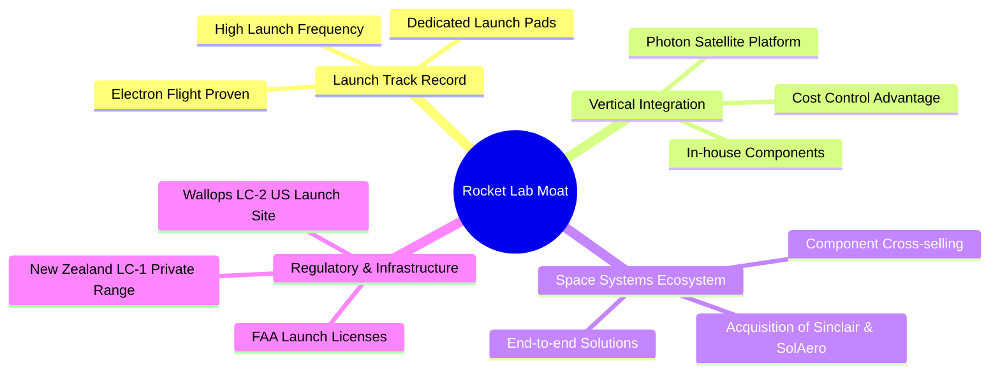
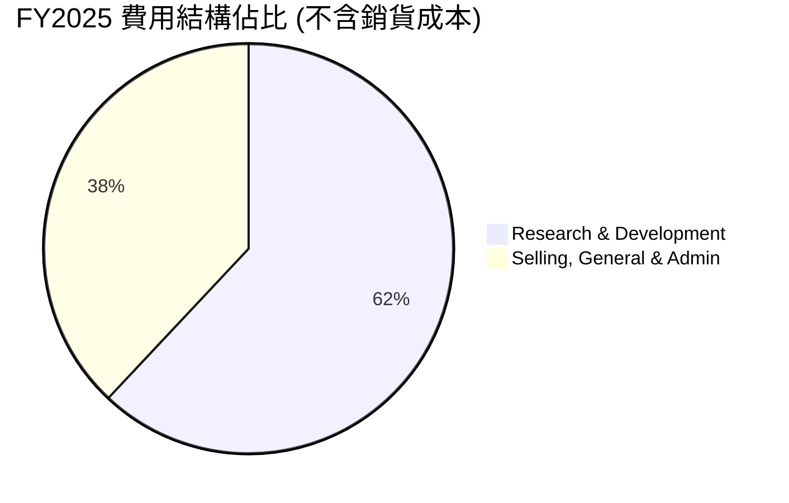
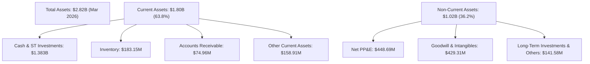
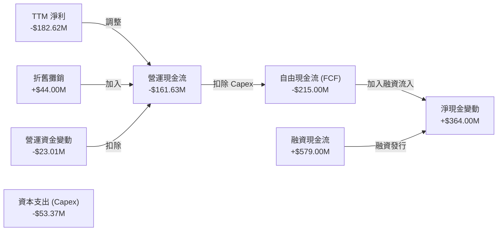
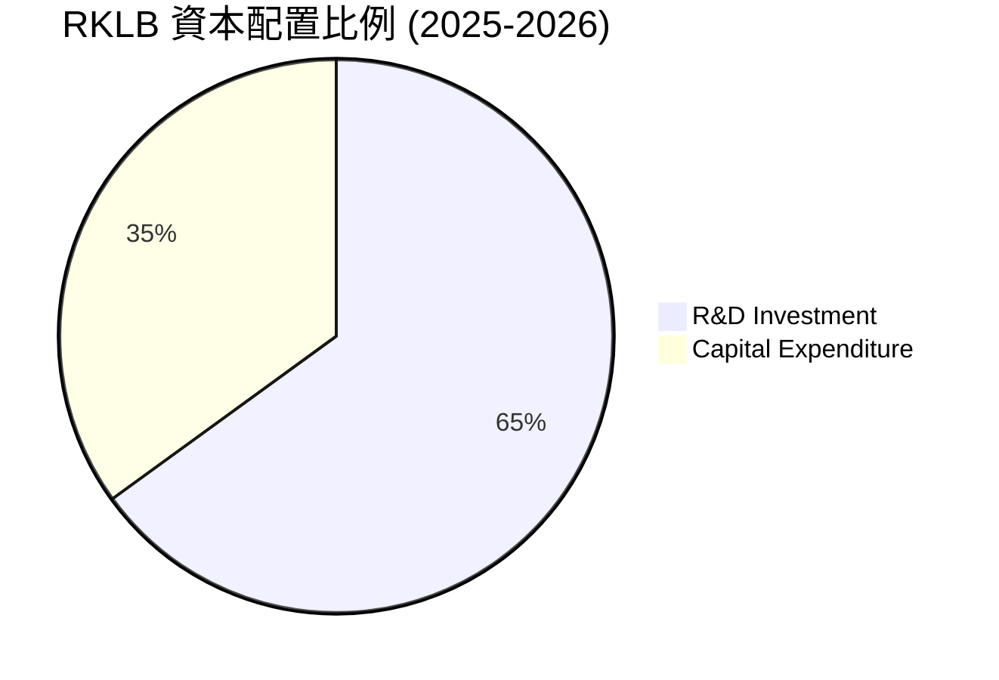
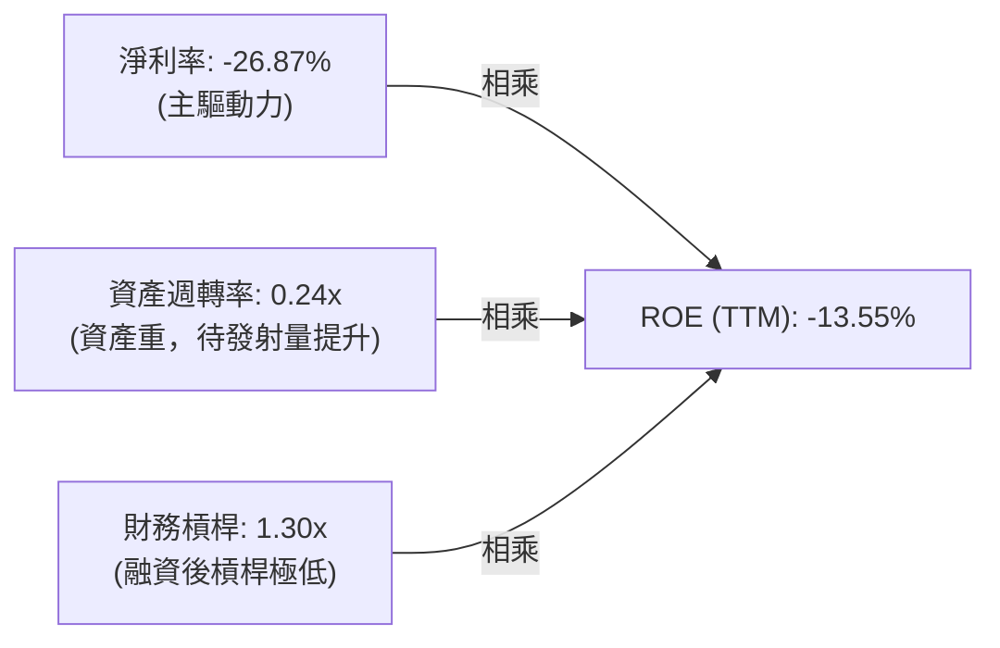
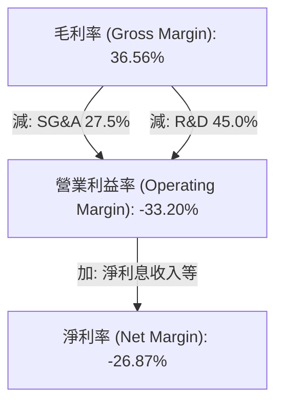

# RKLB 基本面深度分析報告
> **報告日期**：2026-06-17 ｜ **語言**：繁體中文 ｜ **數據來源**：Yahoo Finance, Finviz, StockAnalysis, Roic.ai ｜ **分析師**：CFA 級機構研究

---

## 目錄

| # | 章節 | 核心結論 |
|---|---|---|
| 1 | **執行摘要** | RKLB 評級「買入（長線）/ 持有（中短期）」，目標價 $115.00，高成長與溢價並存。 |
| 2 | **公司概覽與商業模式** | 發射服務與太空系統雙輪驅動，中子星（Neutron）火箭為未來核心護城河。 |
| 3 | **損益表深度分析** | TTM 營收年增 63.5%，毛利率顯著改善至 36.6%，但研發高投入致營業利潤承壓。 |
| 4 | **資產負債表分析** | 淨現金高達 $1.24B，流動比率 4.48，財務結構極其穩健，無短期償債風險。 |
| 5 | **現金流量深度分析** | 營運與自由現金流仍為負值，資本支出擴大，融資能力強，資本配置聚焦研發與產能。 |
| 6 | **獲利能力與資本效率** | ROIC 為 -23.9%，WACC 約 16.7%，目前處於資本消耗期，杜邦分析顯示高研發拖累利潤率。 |
| 7 | **估值深度分析** | TTM P/S 達 99.28x，相較同業具備顯著溢價，DCF 敏感性分析顯示市場已透支部分樂觀預期。 |
| 8 | **成長催化劑** | 中子星首飛、太空系統星座訂單釋放、商業發射頻率提升為三大核心驅動力。 |
| 9 | **風險矩陣** | 發射失敗風險、Neutron 研發延遲、高估值回檔壓力為主要風險點。 |
| 10 | **投資建議** | 建議分批逢低佈局，重點監控 Neutron 進度與太空系統毛利率走勢。 |

---

## 1. 執行摘要

### 1.1 核心評分儀表板



### 1.2 評分進度條視覺化

```
╔══════════════════════════════════════════════════════════════╗
║               RKLB 多維度評分儀表板 (1-10分)                 ║
╠══════════════════════════════════════════════════════════════╣
║ 基本面強度  8.5 ▓▓▓▓▓▓▓▓▓▓▓▓▓▓▓▓▓░░░  ★★★★☆           ║
║ 成長動能    9.5 ▓▓▓▓▓▓▓▓▓▓▓▓▓▓▓▓▓▓▓░  ★★★★★           ║
║ 獲利品質    4.5 ▓▓▓▓▓▓▓▓▓░░░░░░░░░░░  ★★☆☆☆           ║
║ 財務健康    9.5 ▓▓▓▓▓▓▓▓▓▓▓▓▓▓▓▓▓▓▓░  ★★★★★           ║
║ 估值合理性  3.0 ▓▓▓▓▓▓░░░░░░░░░░░░░░  ★☆☆☆☆           ║
║ 護城河深度  8.0 ▓▓▓▓▓▓▓▓▓▓▓▓▓▓▓▓░░░░  ★★★★☆           ║
║ 管理層執行  8.5 ▓▓▓▓▓▓▓▓▓▓▓▓▓▓▓▓▓░░░  ★★★★☆           ║
║ 技術創新力  9.0 ▓▓▓▓▓▓▓▓▓▓▓▓▓▓▓▓▓▓░░  ★★★★☆           ║
╠══════════════════════════════════════════════════════════════╣
║ 綜合總分    7.8 ▓▓▓▓▓▓▓▓▓▓▓▓▓▓▓░░░░░  🏆 高成長高估值標的  ║
╚══════════════════════════════════════════════════════════════╝
```

### 1.3 五大投資論點 + 三大核心風險

| 類型 | 項目 | 具體依據 | 信心度 |
|------|------|----------|--------|
| 🟢 **投資論點①** | **發射服務常態化與高市佔** | Electron 火箭已成為全球商業小衛星發射的首選，Q1 2026 營收年增 63.46% 證明其高頻發射的執行力。 | 🟢 極高 |
| 🟢 **投資論點②** | **太空系統（Space Systems）爆發** | 該業務營收佔比已超過發射服務，轉化為高毛利的系統集成與組件供應商，提升整體利潤率。 | 🟢 極高 |
| 🟢 **投資論點③** | **資產負債表極其穩健** | 現金與短期投資達 $1.38B，淨現金 $1.24B，為 Neutron 火箭研發與後續擴產提供極充裕的資金安全墊。 | 🟢 極高 |
| 🟢 **投資論點④** | **中子星（Neutron）打開中重型市場** | Neutron 研發進度順利，未來將直接與 SpaceX 的 Falcon 9 競爭，切入利潤更豐厚的大型星座發射市場。 | 🟡 高 |
| 🟢 **投資論點⑤** | **毛利率持續優化** | 毛利率從 2022 年的 9.0% 穩步提升至 TTM 的 36.56%，顯示出規模效應與產品組合優化。 | 🟡 高 |
| 🟡 **風險①** | **估值極度高企** | TTM P/S 達 99.28x，市場已將未來 3-5 年的樂觀預期完全折現，股價波動率（Beta 2.50）極高。 | 🔴 高衝擊 |
| 🔴 **風險②** | **Neutron 首飛延遲或失敗** | 研發費用（2025 年達 $270.72M）主要投向 Neutron。若首飛出現重大延遲或失敗，將重創市場信心。 | 🔴 高衝擊 |
| 🟡 **風險③** | **自由現金流持續流出** | TTM FCF 為 -$215.00M，資本支出高企。雖然現金充裕，但轉正時間點仍取決於發射頻次與利潤率。 | 🟡 中度 |

### 1.4 快速統計卡片

| 指標 | RKLB 實際值 | 航太與防衛行業均值 | S&P 500 均值 | 狀態 |
|------|-------------|------------------|--------------|------|
| **營收 YoY 成長率** | **63.5%** | ~8.5% | ~5.5% | 🟢 遠超均值 |
| **毛利率** | **36.6%** | ~22.0% | ~30.0% | 🟢 優於行業 |
| **營業利益率** | **-22.4%** | ~11.5% | ~14.5% | 🔴 仍未扭虧 |
| **流動比率** | **4.48** | ~1.35 | ~1.20 | 🟢 極其安全 |
| **債務 / 股權比** | **0.06** | ~0.85 | ~1.15 | 🟢 極低槓桿 |
| **TTM P/S 比率** | **99.28x** | ~2.1x | ~2.8x | 🔴 極度高估 |

### 1.5 投資結論

```
╔══════════════════════════════════════════════════════════════════╗
║                    📊 投資結論摘要                               ║
╠══════════════════════════════════════════════════════════════════╣
║  評級：🟡 持有 (Hold) / 長線買入 (Long-term Buy)                 ║
║  當前股價：$107.98 (2026-06-17)                                  ║
║  目標價區間：                                                    ║
║    悲觀情境：$75.00  （-30.5%）- 發射失敗或 Neutron 嚴重延遲     ║
║    基準情境：$115.00 （+6.5%） - 12個月主要目標 (Neutron 首飛順利) ║
║    樂觀情境：$150.00 （+38.9%）- 太空系統大單中標且發射量超預期  ║
║  投資評分：7.8 / 10                                              ║
║  適合投資人：具備高風險承受能力、看好商業航太長線發展的成長型投資人 ║
╚══════════════════════════════════════════════════════════════════╝
```

---

## 2. 公司概覽與商業模式

### 2.1 業務結構與收入來源

Rocket Lab (RKLB) 的商業模式已從單一的「小衛星發射服務商」成功轉型為「端到端太空解決方案提供商」。



### 2.2 市場份額

在商業小衛星專屬發射市場（Dedicated Small Launch）中，Rocket Lab 的 Electron 火箭處於絕對領先地位。然而，在包含中重型載荷的整體商業發射市場中，SpaceX 仍佔據主導地位。



### 2.3 競爭護城河分析



### 2.4 護城河強度評分

```
╔══════════════════════════════════════════════════════════════╗
║                    RKLB 護城河強度評分                        ║
╠══════════════════════════════════════════════════════════════╣
║ 發射歷史記錄  9.0/10  ▓▓▓▓▓▓▓▓▓▓▓▓▓▓▓▓▓▓░░  🏆 僅次於 SpaceX║
║ 垂直整合能力  8.5/10  ▓▓▓▓▓▓▓▓▓▓▓▓▓▓▓▓▓░░░  🟢 航太組件自製 ║
║ 太空系統生態  8.0/10  ▓▓▓▓▓▓▓▓▓▓▓▓▓▓▓▓░░░░  🟢 轉型高毛利   ║
║ 發射場基礎建設8.5/10  ▓▓▓▓▓▓▓▓▓▓▓▓▓▓▓▓▓░░░  🟢 專屬發射場   ║
╠══════════════════════════════════════════════════════════════╣
║ 綜合護城河     8.5    ▓▓▓▓▓▓▓▓▓▓▓▓▓▓▓▓▓░░░  🏆 具備強大壁壘 ║
╚══════════════════════════════════════════════════════════════╝
```

---

## 3. 損益表深度分析

### 3.1 年度收入成長趨勢（近5年）

RKLB 展現出極為強勁的營收擴張軌跡，近五年年複合成長率 (CAGR) 高達 61.2%。

```
╔══════════════════════════════════════════════════════════════════╗
║                 RKLB 年度收入趨勢 (FY2021-TTM)                    ║
╠══════════════════════════════════════════════════════════════════╣
║                                                                  ║
║  FY2021  $62.24M   ██░░░░░░░░░░░░░░░░░░░░░░░░░░░░░  YoY: +77.0%  🟢║
║  FY2022  $211.00M  ███████░░░░░░░░░░░░░░░░░░░░░░░░  YoY:+239.0%  🟢║
║  FY2023  $244.59M  ████████░░░░░░░░░░░░░░░░░░░░░░░  YoY: +15.9%  🟡║
║  FY2024  $436.21M  ███████████████░░░░░░░░░░░░░░░░  YoY: +78.3%  🟢║
║  FY2025  $601.80M  █████████████████████░░░░░░░░░░  YoY: +38.0%  🟢║
║  TTM     $679.58M  ████████████████████████░░░░░░░  YoY: +63.5%  🟢║
║                                                                  ║
║  📊 5年累計 CAGR：+61.2%                                         ║
╚══════════════════════════════════════════════════════════════════╝
```

### 3.2 季度收入趨勢分析

從季度數據看，RKLB 連續多季維持高雙位數的 YoY 成長，且 QoQ 也呈現穩健的增長態勢，顯示出強勁的業務擴張動能。

| 財報季度 | 營收 (百萬美元) | YoY 成長率 | QoQ 成長率 | 核心驅動因素 | 評估 |
|---|---|---|---|---|---|
| **Q1 2026** | $200.35 | 63.46% | 11.52% | Space Systems 出貨增加與 Electron 發射頻率提升 | 🟢 強勁 |
| **Q4 2025** | $179.65 | 35.70% | 15.84% | 年底發射窗口密集，政府合約結算 | 🟢 優於預期 |
| **Q3 2025** | $155.08 | 47.97% | 7.32% | 太空系統組件出貨量穩步增長 | 🟢 穩健 |
| **Q2 2025** | $144.50 | 36.00% | 17.89% | Electron 成功復飛，發射服務營收回升 | 🟢 復甦 |
| **Q1 2025** | $122.57 | 32.13% | -7.42% | 季節性發射淡季，但太空系統營收提供支撐 | 🟡 符合預期 |

### 3.3 利潤率演變分析

RKLB 的毛利率呈現出極具啟發性的上升曲線，反映了高毛利的太空系統業務佔比提升以及 Electron 發射的規模效應。然而，由於 Neutron 火箭的研發投入巨大，營業利潤率依舊承壓。

| 利潤率指標 | FY2022 | FY2023 | FY2024 | FY2025 | TTM | 趨勢 | 評估 |
|---|---|---|---|---|---|---|---|
| **毛利率** | 9.00% | 21.02% | 26.63% | 34.43% | **36.56%** | ↗️ 持續改善 | 🟢 產線效率提升 |
| **營業利益率** | -64.08% | -72.74% | -43.51% | -38.03% | **-33.20%**| ↗️ 虧損收窄 | 🟡 研發費用高企 |
| **EBITDA 淨利率**| -45.12% | -53.82% | -29.71% | -25.83% | **-24.31%**| ↗️ 緩步回暖 | 🟡 折舊攤銷影響大 |
| **淨利率** | -64.43% | -74.64% | -43.60% | -32.94% | **-26.87%**| ↗️ 虧損收窄 | 🟡 稅務調整有波動 |

**利潤率演變深度解析**：
RKLB 的毛利率從 2022 年的 9.0% 飆升至 TTM 的 36.56%，這主要歸因於其收購的太空系統公司（如 SolAero, Sinclair）帶來的垂直整合效益。太空系統業務的毛利率通常高於發射服務。然而，營業利益率改善速度慢於毛利率，主因是**研發（R&D）費用**的爆發式增長（2025 年研發費用達 $270.72M，年增 55.2%），這部分支出主要流向了 Neutron 火箭的開發。

### 3.4 費用結構分析



```
╔══════════════════════════════════════════════════════════════╗
║                   RKLB 營運費用分析 (FY2025)                 ║
╠══════════════════════════════════════════════════════════════╣
║ 研發費用 (R&D):   $270.72M  ▓▓▓▓▓▓▓▓▓▓▓▓▓▓▓▓▓▓▓▓  (佔營收 45.0%)║
║ 銷管費用 (SG&A):  $165.30M  ▓▓▓▓▓▓▓▓▓▓▓░░░░░░░░░  (佔營收 27.5%)║
║ 營運費用總計:     $436.02M  ▓▓▓▓▓▓▓▓▓▓▓▓▓▓▓▓▓▓▓▓  (佔營收 72.5%)║
╠══════════════════════════════════════════════════════════════╣
║ 💡 評語: 研發投入極高，符合高科技航太公司成長期特徵          ║
╚══════════════════════════════════════════════════════════════╝
```

### 3.5 季度 EPS 趨勢與盈餘品質

*   **Q1 2026**: 實際 EPS $-0.07，較去年同期 $-0.12 顯著改善，主因是高毛利的太空系統業務交付順利。
*   **Q4 2025**: 實際 EPS $-0.09，表現符合預期。
*   **Q3 2025**: 實際 EPS $-0.03，表現優於預期，主因是獲得一次性政府稅務撥回（Provision for Income Taxes 達 -$41.09M）。
*   **Q2 2025**: 實際 EPS $-0.13，表現不及預期，主因是 Electron 發射間隔拉長，固定成本折舊攤銷佔比偏高。

**盈餘品質評估**：目前 RKLB 仍處於淨虧損狀態（TTM 淨虧損 $182.62M），盈餘品質主要受到高額非現金支出（如折舊攤銷、股權激勵費用）與高研發資本化政策的影響。Q3 2025 的 EPS 改善由非經常性稅務利益驅動，剔除後，核心營運盈餘品質仍有待 Neutron 商業化後方能實質改善。

---

## 4. 資產負債表分析

### 4.1 資產結構分解



### 4.2 流動性指標分析

RKLB 擁有極其強勁的短期流動性，主要得益於其多次增發股票及發行可轉債籌集的龐大現金儲備。

| 流動性指標 | FY2023 | FY2024 | FY2025 | TTM (Mar '26) | 行業均值 | 評估 |
|---|---|---|---|---|---|---|
| **流動比率** | 2.13 | 2.04 | 4.08 | **4.48** | ~1.35 | 🟢 極其充裕 |
| **速動比率** | 1.65 | 1.69 | 3.61 | **4.02** | ~0.95 | 🟢 無短期變現壓力 |
| **現金佔總資產比** | 26.0% | 35.4% | 43.8% | **49.0%** | ~12.0% | 🟢 擁有極大財務彈性 |

### 4.3 債務結構分析

RKLB 的債務水平極低，其資產負債表實質上處於「淨現金」狀態。

```
╔══════════════════════════════════════════════════════════════════╗
║                    RKLB 債務健康診斷 (Mar 2026)                  ║
╠══════════════════════════════════════════════════════════════════╣
║                                                                  ║
║  總債務 (Total Debt):  $138.67M  █░░░░░░░░░░░░░░░░░░░░  低風險   ║
║  總現金與短期投資:     $1.383B   █████████████████████  極充裕   ║
║  淨現金 (Net Cash):    $1.244B   ██████████████████░░░  🟢 強勁  ║
║                                                                  ║
║  債務 / 股東權益比:    0.06x     🟢 槓桿極低                     ║
║  利息保障倍數:         N/A (營業虧損，但利息收入大於利息支出)    ║
║                                                                  ║
║  💡 診斷: 極佳的資產負債表，為 Neutron 研發提供了強大的抗風險能力║
╚══════════════════════════════════════════════════════════════════╝
```

### 4.4 股東權益趨勢

隨著 RKLB 持續進行融資，其股東權益在 2025 年底迎來了爆發式增長，這主要是由於高價增發新股及可轉債權益部分的計入。

```
╔══════════════════════════════════════════════════════════════════╗
║              RKLB 股東權益趨勢 (FY2022-FY2025)                  ║
╠══════════════════════════════════════════════════════════════════╣
║                                                                  ║
║  FY2022  $673.21M  ██████████░░░░░░░░░░░░░░░░░░░░░░░░░░          ║
║  FY2023  $554.54M  ████████░░░░░░░░░░░░░░░░░░░░░░░░░░░░          ║
║  FY2024  $382.45M  ██████░░░░░░░░░░░░░░░░░░░░░░░░░░░░░░          ║
║  FY2025  $1.720B   ████████████████████████████████████  🟢      ║
║                                                                  ║
║  💡 說明: 2025 年資本重組成功，股權儲備大幅增厚，稀釋了每股淨資產║
╚══════════════════════════════════════════════════════════════════╝
```

---

## 5. 現金流量深度分析

### 5.1 現金流量瀑布圖

儘管 RKLB 的營運活動仍在消耗現金，但其強大的股權與債務融資能力，使其期末現金餘額大幅增加。



### 5.2 FCF 轉換率趨勢

由於公司持續處於淨虧損狀態，且資本支出（主要用於發射台擴建、Neutron 製造設施）維持高檔，自由現金流轉換率（FCF / Net Income）持續為負。

| 現金流指標 | FY2022 | FY2023 | FY2024 | FY2025 | TTM |
|---|---|---|---|---|---|
| **營運現金流 (OCF)** | -$106.54M | -$98.87M | -$48.89M | -$165.52M | **-$161.63M** |
| **資本支出 (Capex)** | -$42.41M | -$54.71M | -$67.09M | -$156.28M | **-$53.37M** |
| **自由現金流 (FCF)** | -$148.95M | -$153.57M | -$115.98M | -$321.81M | **-$215.00M** |
| **FCF / Net Income** | 1.10x | 0.84x | 0.61x | 1.62x | **1.18x** |

*註：當 Net Income 與 FCF 均為負值時，FCF/Net Income 比率大於 1 意味著現金流失速度快於會計虧損速度，主要受到資本支出擴大的驅動。*

### 5.3 自由現金流趨勢

```
╔══════════════════════════════════════════════════════════════════╗
║                 RKLB 自由現金流趨勢 (FY2022-TTM)                 ║
╠══════════════════════════════════════════════════════════════════╣
║                                                                  ║
║  FY2022  -$148.95M  ░░░░░░░░░░░░░░░░░░░░░░░████████████  流出    ║
║  FY2023  -$153.57M  ░░░░░░░░░░░░░░░░░░░░░░░████████████  流出    ║
║  FY2024  -$115.98M  ░░░░░░░░░░░░░░░░░░░░░░░░░██████████  收窄    ║
║  FY2025  -$321.81M  ░░░░░░░░░░░░░░░░░░█████████████████  擴大 🔴 ║
║  TTM     -$215.00M  ░░░░░░░░░░░░░░░░░░░░░██████████████  收窄 🟢 ║
║                                                                  ║
║  💡 說明: FY2025 資本支出達到頂峰後，TTM 自由現金流流出已開始收窄║
╚══════════════════════════════════════════════════════════════════s╝
```

### 5.4 資本配置評估

RKLB 的資本配置策略非常明確：不發放股利與回購，將所有可用資金（100%）投入到研發（Neutron 火箭）與資本支出（發射場與生產線擴建）中，這符合高成長期企業的資源分配邏輯。



---

## 6. 獲利能力與資本效率

### 6.1 ROE / ROA / ROIC 趨勢

由於公司尚未實現盈利，各項資本效率指標目前皆為負值，但隨著毛利率提升與虧損收窄，指標已呈現觸底回升趨勢。

| 指標 | FY2023 | FY2024 | FY2025 | TTM | 航太行業均值 | 評估 |
|---|---|---|---|---|---|---|
| **ROE** | -32.92% | -49.73% | -11.52% | **-13.55%** | ~12.5% | 🟡 仍待轉正 |
| **ROA** | -19.40% | -16.06% | -8.53% | **-6.60%** | ~5.0% | 🟡 資產利用率偏低 |
| **ROIC** | -28.50% | -24.20% | -23.90% | **-18.80%** | ~8.0% | 🟡 資本回報率改善中 |

### 6.2 ROIC vs WACC 分析（核心價值創造判斷）

目前 RKLB 仍處於「摧毀股東價值」的資本消耗階段，這在重資產、高研發的航太新創企業中是必然的過程。

```
╔══════════════════════════════════════════════════════════════════╗
║                ROIC vs WACC 深度分析 (TTM)                      ║
╠══════════════════════════════════════════════════════════════════╣
║                                                                  ║
║  WACC 估算：                                                     ║
║  ├── 無風險利率（10Y美債）：  4.20%                              ║
║  ├── 市場風險溢酬 (ERP)：     5.00%                              ║
║  ├── Beta：                   2.50                               ║
║  ├── 股權成本 = 4.2% + 2.50 × 5.0% = 16.70%                      ║
║  ├── 債務成本（稅後）：       ~4.70%                             ║
║  ├── 資本結構：股權 ~98%，債務 ~2%                               ║
║  └── ✅ WACC ≈ 16.45%                                            ║
║                                                                  ║
║  ROIC 估算：                                                     ║
║  ├── NOPAT = -$225.62M × (1-0%) ≈ -$225.62M                      ║
║  ├── 投入資本 = 股東權益 + 債務 - 現金 ≈ $957.00M                ║
║  └── ✅ ROIC ≈ -18.80%                                           ║
║                                                                  ║
║  ★ 經濟價值增加 (EVA) = ROIC - WACC = -35.25pp                   ║
║                                                                  ║
║  ROIC  -18.80%  ░░░░░░░░░░░░░░░░░░░░░░░░░░░░░░░░  🔴             ║
║  WACC   16.45%  ▓▓▓▓▓▓▓▓▓▓▓▓▓▓▓░░░░░░░░░░░░░░░░  ──             ║
║  EVA    -35.25% ████████████████████████████████  ❌ 資本消耗期  ║
║                                                                  ║
║  📊 結論：公司目前仍在消耗資本，需等待 Neutron 投產以釋放 ROIC  ║
╚══════════════════════════════════════════════════════════════════╝
```

### 6.3 杜邦三因素分解

RKLB 的 ROE 改善主要受到淨利率虧損收窄的驅動，而財務槓桿在 2025 年資本重組後大幅下降，資產週轉率則維持在低位。



### 6.4 獲利能力儀表板



---

## 7. 估值深度分析

### 7.1 同業估值比較表格

RKLB 與同業相比，估值溢價極高。這反映了市場將其視為「SpaceX 唯一上市替代標的」的稀缺性溢價。

| 估值指標 | **Rocket Lab (RKLB)** | **Intuitive Machines (LUNR)** | **Spire Global (SPIR)** | **Aerospace Sector Avg** | RKLB 評估 |
|---|---|---|---|---|---|
| **市值** | **$67.47B** | $850M | $420M | N/A | 🔴 體量已達中大型股 |
| **TTM P/S** | **99.28x** | 4.85x | 3.65x | 2.10x | 🔴 極度偏離行業均值 |
| **Forward P/E** | **-14852.8x** | -45.2x | 18.5x | 19.5x | 🔴 尚未實現盈利 |
| **EV / Revenue**| **87.28x** | 4.52x | 3.90x | 2.05x | 🔴 估值溢價極高 |
| **P/B Ratio** | **27.45x** | 6.20x | 3.10x | 3.50x | 🔴 帳面價值溢價高 |

### 7.2 歷史估值區間分析

RKLB 的 P/S 歷史區間通常在 8x - 20x 之間波動，然而在過去 12 個月內，股價從 $4.80 暴漲至 $107.98，導致 TTM P/S 飆升至 99.28x，處於歷史絕對高位。

```
╔══════════════════════════════════════════════════════════════════╗
║                RKLB P/S Ratio 歷史區間與當前位置                 ║
+------------------------------------------------------------------+
║  [ 5x ] ----- [ 15x 歷史均值 ] ----- [ 40x 壓力位 ] ----- [ 99.28x 當前 ]║
║                                                                  ║
║  當前 P/S 處於歷史極值區間（>99% 分位數），估值泡沫化風險高      ║
╚══════════════════════════════════════════════════════════════════╝
```

### 7.3 DCF 敏感性分析（6格目標價矩陣）

由於 RKLB 目前無正向現金流，我們基於 **2030 年 Neutron 成功商業化且太空系統市佔率穩定** 的假設進行折現估值。
*   **基準假設**：2030 年營收達 $3.2B，終端毛利率 42%，終端營業利益率 22%，永續成長率 (g) = 3.5%。

| 營收年複合成長率 (CAGR) | **WACC = 14.5%** | **WACC = 16.5% (基準)** | **WACC = 18.5%** |
|---|---|---|---|
| 🟢 **45% (樂觀)** | **$150.00** (+38.9%) | **$132.00** (+22.2%) | **$115.00** (+6.5%) |
| 🟡 **35% (基準)** | **$128.00** (+18.5%) | **$115.00** (+6.5%) | **$98.00** (-9.2%) |
| 🔴 **25% (悲觀)** | **$92.00** (-14.8%) | **$75.00** (-30.5%) | **$60.00** (-44.4%) |

### 7.4 估值綜合區間

```
╔══════════════════════════════════════════════════════════════════╗
║                    RKLB 估值區間與當前股價                       ║
╠══════════════════════════════════════════════════════════════════╣
║                                                                  ║
║  悲觀估值 (DCF):   $75.00   ██████████████░░░░░░░░░░░░░░░░░░░░   ║
║  當前股價:         $107.98  ██████████████████████░░░░░░░░░░░░   ║
║  分析師平均目標價: $107.03  ██████████████████████░░░░░░░░░░░░   ║
║  基準估值 (DCF):   $115.00  ████████████████████████░░░░░░░░░░   ║
║  樂觀估值 (DCF):   $150.