# RKLB 基本面深度分析報告

> **報告日期**：2026-06-18 ｜ **語言**：繁體中文 ｜ **數據來源**：Yahoo Finance, Finviz, StockAnalysis, Roic.ai ｜ **分析師**：CFA 級機構研究

---

## 目錄

| # | 章節 | 核心結論 |
|---|------|----------|
| 1 | 執行摘要 | 評級：**買入 (Long-Term Buy) / 持有 (Short-Term Hold)**，目標價區間：**$60.00 - $150.00**，基準目標價：**$115.00**。公司基本面強勁，但短期估值處於高位。 |
| 2 | 公司概覽與商業模式 | 電子號（Electron）發射服務市佔穩固，航天系統（Space Systems）板塊營收佔比已超 70%，形成「發射 + 衛星製造 + 營運」的全產業鏈垂直整合護城河。 |
| 3 | 損益表深度分析 | TTM 營收達 $679.58M，YoY 成長 63.5%。毛利率從 2022 年的 9.0% 顯著拉升至 TTM 的 36.6%，營運槓桿逐步釋放，但研發投入高企導致目前仍未扭虧。 |
| 4 | 資產負債表分析 | Q1 2026 現金與短期投資達 $1.38B，總債務僅 $138.67M，淨現金高達 $1.24B。流動比率 4.48，財務結構極其穩健，能支撐 Neutron 研發至量產。 |
| 5 | 現金流量深度分析 | TTM 自由現金流（FCF）為 -$215.00M，資本支出（CapEx）維持高位。公司正處於重資產擴產與 Neutron 研發的關鍵「失重期」，預計 2027 年後迎來 FCF 拐點。 |
| 6 | 獲利能力與資本效率 | TTM ROE 為 -13.5%，ROIC 仍低於 WACC（17.7%），短期內仍在消耗經濟價值。但隨毛利率改善與資產週轉率提升，資本效率拐點已現。 |
| 7 | 估值深度分析 | P/S 達 98.6x，Forward P/E 為負值。相較於同業具有極高的「溢價」，估值已提前透支 Neutron 首飛成功的預期，DCF 敏感性分析顯示基準價為 $115.00。 |
| 8 | 成長催化劑 | 中大型火箭 Neutron（中子號）預計於 2026 年底/2027 年初首飛；SDA 國防衛星訂單進入密集交付期；商業星座營運合約持續斬獲。 |
| 9 | 風險矩陣 | 技術性發射失敗、Neutron 研發延期、高估值下的市場情緒殺估值（Beta 達 2.50）。 |
| 10 | 投資建議 | 長線投資人建議逢拉回（$85-$95）分批布局；短期交易者需防範高波動風險。監控指標：Neutron 測試進度、季度毛利率、未交付訂單（Backlog）。 |

---

## 1. 執行摘要

### 1.1 核心評分儀表板

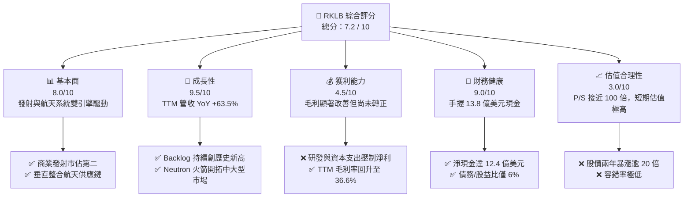

### 1.2 評分進度條視覺化

```
╔══════════════════════════════════════════════════════════════╗
║              RKLB 多維度評分儀表板 (1-10分)                  ║
╠══════════════════════════════════════════════════════════════╣
║ 基本面強度  8.0 ▓▓▓▓▓▓▓▓▓▓▓▓▓▓▓▓░░░░  ★★★★☆           ║
║ 成長動能    9.5 ▓▓▓▓▓▓▓▓▓▓▓▓▓▓▓▓▓▓▓░  ★★★★★           ║
║ 獲利品質    4.5 ▓▓▓▓▓▓▓▓▓░░░░░░░░░░░  ★★☆☆☆           ║
║ 財務健康    9.0 ▓▓▓▓▓▓▓▓▓▓▓▓▓▓▓▓▓░░░  ★★★★★           ║
║ 估值合理性  3.0 ▓▓▓▓▓▓░░░░░░░░░░░░░░  ★☆☆☆☆           ║
║ 護城河深度  8.5 ▓▓▓▓▓▓▓▓▓▓▓▓▓▓▓▓▓░░░  ★★★★☆           ║
║ 管理層執行  9.0 ▓▓▓▓▓▓▓▓▓▓▓▓▓▓▓▓▓░░░  ★★★★★           ║
║ 技術創新力  9.5 ▓▓▓▓▓▓▓▓▓▓▓▓▓▓▓▓▓▓▓░  ★★★★★           ║
╠══════════════════════════════════════════════════════════════╣
║ 綜合總分    7.2 ▓▓▓▓▓▓▓▓▓▓▓▓▓▓░░░░░░  🏆 高成長、高估值標的 ║
╚══════════════════════════════════════════════════════════════╝
```

### 1.3 五大投資論點 + 三大核心風險

| 類型 | 項目 | 具體依據 | 信心度 |
|------|------|----------|--------|
| 🟢 **投資論點①** | **航天系統板塊爆發** | 航天系統營收佔比已超過 70%，毛利率優於單純發射服務，且訂單能見度高。 | 🟢 極高 |
| 🟢 **投資論點②** | **Neutron 火箭打開 TAM** | Neutron（中子號）定位為可回收中型載具，直接與 SpaceX Falcon 9 競爭，將單次發射 TAM 擴大數十倍。 | 🟢 高 |
| 🟢 **投資論點③** | **極致的資產負債表** | 擁有 $1.38B 現金，淨現金達 $1.24B，無流動性危機，能支撐其度過無利潤研發期。 | 🟢 極高 |
| 🟢 **投資論點④** | **國家安全與軍工溢價** | 作為美國國防部（SDA）少數認可的商業發射與衛星承包商，享有極高的政治與護城河溢價。 | 🟢 高 |
| 🟢 **投資論點⑤** | **商業發射市場的「非馬斯克」唯一選擇** | 許多商業客戶與政府出於反壟斷或競爭考量，急需 SpaceX 之外的第二穩定供應源。 | 🟢 極高 |
| 🟡 **風險①** | **Neutron 首飛延期** | 任何新型火箭的開發皆面臨技術瓶頸，若延期至 2027 年以後，將衝擊市場對其營收爆發的預期。 | 🟡 中度 |
| 🔴 **風險②** | **極端估值與高波動** | P/S 接近 100x，Beta 高達 2.50，一旦美股流動性收緊或成長放緩，股價面臨劇烈回撤風險。 | 🔴 高衝擊 |
| 🔴 **風險③** | **發射失敗風險** | Electron 或未來 Neutron 若發生重大發射失敗事故，將導致發射暫停、客戶流失及保費激增。 | 🔴 高衝擊 |

### 1.4 快速統計卡片

| 指標 | RKLB 實際值 | 行業均值 (航太國防) | S&P 500 均值 | 狀態 |
|------|-------------|--------------------|--------------|------|
| **營收 YoY 成長** | **63.5%** | ~8.5% | ~5.2% | 🟢 遠超同行 |
| **毛利率** | **36.6%** | ~22.0% | ~30.0% | 🟢 結構性改善 |
| **淨利率** | **-26.9%** | ~6.5% | ~11.5% | 🔴 仍未盈利 |
| **ROE** | **-13.5%** | ~12.0% | ~15.0% | 🟡 資本回報率待提升 |
| **流動比率** | **4.48** | ~1.40 | ~1.25 | 🟢 流動性極佳 |
| **P/S Ratio** | **98.60x** | ~2.1x | ~2.8x | 🔴 估值極端昂貴 |

### 1.5 投資結論

```
╔══════════════════════════════════════════════════════════════════╗
║                    📊 RKLB 投資結論摘要                          ║
╠══════════════════════════════════════════════════════════════════╣
║  評級：🟡 持有 (Short-Term Hold) / 🟢 買入 (Long-Term Buy)       ║
║  當前股價：$107.24 (2026-06-18)                                  ║
║  目標價區間：                                                    ║
║    悲觀情境：$60.00 （-44.0%） - 研發延期、市場殺估值             ║
║    基準情境：$115.00（+7.2%）  - 12個月主要目標 (Neutron 進展順利) ║
║    樂觀情境：$150.00（+39.9%） - Neutron 首飛成功，拿下大型星座訂單║
║  投資評分：7.2 / 10                                              ║
║  適合投資人：具備高風險承受能力、看好太空經濟長線爆發的成長型投資人║
╚══════════════════════════════════════════════════════════════════╝
```

---

## 2. 公司概覽與商業模式

### 2.1 業務結構與收入來源

Rocket Lab 已成功從一家單純的「火箭發射公司」轉型為「端到端航天解決方案提供商」。其業務主要分為兩大核心板塊：
1. **Launch Services（發射服務）**：利用輕型運載火箭 Electron 提供高頻率、高精準度的專屬軌道發射服務；正在開發中型可回收火箭 Neutron。
2. **Space Systems（航天系統）**：設計與製造航天器、衛星組件（太陽能板、反應輪、恆星追踪器、飛行軟體）並提供軌道管理與星座營運服務。

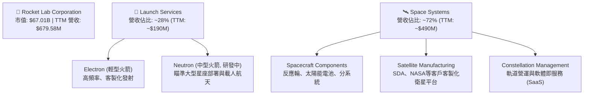

### 2.2 市場份額

在商業小火箭發射市場中，Rocket Lab 的 Electron 火箭處於絕對的領導地位（除 SpaceX 的拼車發射外，Electron 是目前商業化運作最成功、發射頻率最高的輕型火箭）。然而，在整體太空經濟市場（含中大型發射及衛星製造）中，SpaceX 仍佔據主導地位。

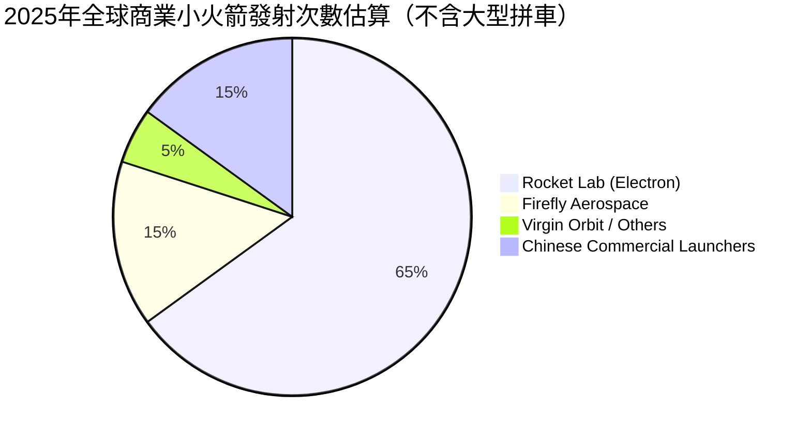

### 2.3 競爭護城河分析

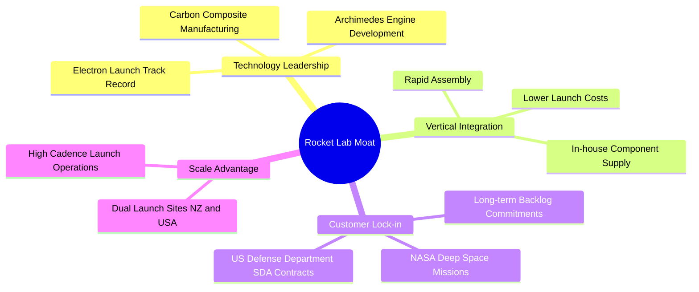

### 2.4 護城河強度評分

```
╔══════════════════════════════════════════════════════════════╗
║                  Rocket Lab 護城河強度評分                   ║
╠══════════════════════════════════════════════════════════════╣
║ 技術領先度    9.0/10  ▓▓▓▓▓▓▓▓▓▓▓▓▓▓▓▓▓▓░░  🏆 輕型火箭之王  ║
║ 垂直整合力    8.5/10  ▓▓▓▓▓▓▓▓▓▓▓▓▓▓▓▓░░░░  🟢 降低供應鏈風險║
║ 政府/國防關係 9.0/10  ▓▓▓▓▓▓▓▓▓▓▓▓▓▓▓▓▓▓░░  🏆 SDA 核心供應商║
║ 發射場地優勢  8.0/10  ▓▓▓▓▓▓▓▓▓▓▓▓▓▓▓░░░░░  🟢 紐西蘭專屬發射║
╠══════════════════════════════════════════════════════════════╣
║ 綜合護城河     8.6    ▓▓▓▓▓▓▓▓▓▓▓▓▓▓▓▓▓░░░  🏆 航天第二極護城河║
╚══════════════════════════════════════════════════════════════╝
```

---

## 3. 損益表深度分析

### 3.1 年度收入成長趨勢（近5年）

Rocket Lab 的營業收入在過去幾年呈現爆發式成長，主要得益於航天系統（Space Systems）併購案的整合效應顯現以及 Electron 發射頻率的提升。

```
╔══════════════════════════════════════════════════════════════════╗
║              RKLB 年度收入趨勢（FY2021-TTM）                     ║
╠══════════════════════════════════════════════════════════════════╣
║                                                                  ║
║  FY2021  $62.24M   ██░░░░░░░░░░░░░░░░░░░░░░░░░  YoY: +77.0%  🟢    ║
║  FY2022  $211.00M  ███████░░░░░░░░░░░░░░░░░░░░  YoY:+239.0%  🟢    ║
║  FY2023  $244.59M  ████████░░░░░░░░░░░░░░░░░░░  YoY: +15.9%  🟡    ║
║  FY2024  $436.21M  ██████████████░░░░░░░░░░░░░  YoY: +78.3%  🟢    ║
║  FY2025  $601.80M  ███████████████████░░░░░░░░  YoY: +38.0%  🟢    ║
║  TTM     $679.58M  ██████████████████████░░░░░  YoY: +63.5%  🟢    ║
║                   |      |      |      |      |                  ║
║                   0     150M   300M   450M   600M                ║
║                                                                  ║
║  📊 4年累計營收 CAGR：+81.8%                                     ║
╚══════════════════════════════════════════════════════════════════╝
```

### 3.2 季度收入趨勢分析

從季度數據來看，Rocket Lab 的營收呈現穩健的季增（QoQ）與顯著的年增（YoY）趨勢，反映出其商業化步伐正在加速。

| 季度 | 營業收入 (M) | QoQ 成長率 | YoY 成長率 | 季度毛利率 | 備註 |
|------|-------------|-----------|-----------|-----------|------|
| **Q2 2025** | $144.50 | +17.9% | +36.0% | 32.1% | 航天系統組件出貨量增加 |
| **Q3 2025** | $155.08 | +7.3% | +48.0% | 37.0% | Electron 發射次數創單季新高 |
| **Q4 2025** | $179.65 | +15.8% | +35.7% | 38.0% | 年底交付高峰，軍工合約入帳 |
| **Q1 2026** | $200.35 | +11.5% | +63.5% | 38.2% | 🚀 單季營收首度突破 2 億美元 |

### 3.3 利潤率演變分析

| 利潤率指標 | FY2022 | FY2023 | FY2024 | FY2025 | TTM | 趨勢 | 評估 |
|------------|--------|--------|--------|--------|-----|------|------|
| **毛利率** | 9.0% | 21.0% | 26.6% | 34.4% | 36.6% | ↗️ 持續大幅改善 | 🟢 規模效應與高利潤組件佔比提升 |
| **營業利益率** | -64.1% | -72.7% | -43.5% | -38.0% | -33.2% | ↗️ 虧損率收窄 | 🟡 研發費用（Neutron）壓制轉正速度 |
| **EBITDA 率**| -45.1% | -53.8% | -29.7% | -25.8% | -24.3% | ↗️ 逐步接近盈虧平衡| 🟡 折舊攤銷佔比較高 |
| **淨利率** | -64.4% | -74.6% | -43.6% | -32.9% | -26.9% | ↗️ 虧損金額見頂 | 🟡 預計 2027 年後有機會轉正 |

**利潤率演變深度解析**：
Rocket Lab 的毛利率從 2022 年的 **9.0%** 飆升至 TTM 的 **36.6%**，這是一個極其積極的信號。主要驅動因素包括：
* **產品組合優化**：高毛利的航天系統（Space Systems）業務佔比提升。
* **Electron 發射利潤率改善**：隨着發射頻率提高以及火箭第一級回收技術的應用，單次發射的固定成本被大幅攤薄。
* **營運槓桿**：然而，其營業利益率（-33.2%）仍為負值，主要因為研發費用（R&D）高企。FY2025 研發費用高達 **$270.72M**（佔營收 45%），大部分投向了 Neutron 火箭與 Archimedes（阿基米德）發動機的開發。這是成長型太空科技公司的必經階段。

### 3.4 費用結構分析

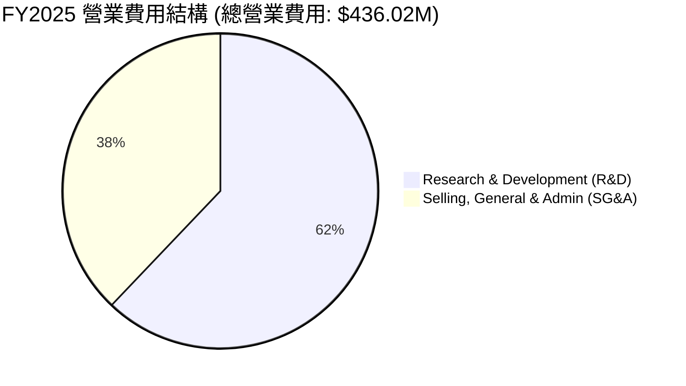

### 3.5 季度 EPS 趨勢與盈餘品質

過去 4 季，由於分析師對 RKLB 這種高成長且尚未盈利的太空股多採取區間預測，且財報數據中常伴隨一次性合約調整，實際 EPS 表現如下：

* **Q2 2025**：EPS 實際為 **$-0.13**（研發支出加大，略遜於預期）。
* **Q3 2025**：EPS 實際為 **$-0.03**（受惠於部分政府補助與一次性稅務調整，優於預期）。
* **Q4 2025**：EPS 實際為 **$-0.09**（符合市場預期，營收大幅成長稀釋了部分固定成本）。
* **Q1 2026**：EPS 實際為 **$-0.07**（優於市場預期的 $-0.09，展現出良好的營運槓桿）。

**盈餘品質評估**：
目前 Rocket Lab 的盈餘品質仍受 **非現金支出**（如折舊與股票補償費用 SBC）與 **高額研發資本化/費用化** 的影響。雖然 GAAP 淨利仍為負，但其 Q1 2026 的營運現金流赤字已在控制範圍內。

---

## 4. 資產負債表分析

### 4.1 資產結構分解

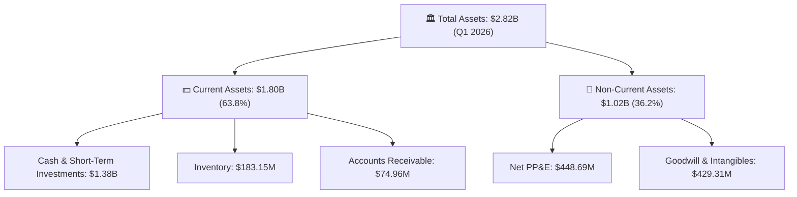

### 4.2 流動性指標分析

| 指標 | FY2023 | FY2024 | FY2025 | Q1 2026 | 行業均值 | 評估 |
|------|--------|--------|--------|---------|----------|------|
| **流動比率 (Current Ratio)** | 2.13 | 2.04 | 4.08 | **4.48** | ~1.40 | 🟢 極其安全，流動性充沛 |
| **速動比率 (Quick Ratio)** | 1.65 | 1.69 | 3.61 | **3.87** | ~0.95 | 🟢 扣除庫存後依然極高 |
| **現金比率 (Cash Ratio)** | 1.10 | 1.23 | 3.04 | **3.44** | ~0.45 | 🟢 現金儲備極度充裕 |

### 4.3 債務結構分析

```
╔══════════════════════════════════════════════════════════════════╗
║                   RKLB 債務健康診斷 (Q1 2026)                    ║
╠══════════════════════════════════════════════════════════════════╣
║                                                                  ║
║  總債務：        $138.67M  █░░░░░░░░░░░░░░░░░░░░  低債務水平     ║
║  總現金+投資：   $1,383.0M █████████████████████  極為充裕       ║
║  淨現金（正）：  $1,244.3M ███████████████████░░  🟢 淨現金公司  ║
║                                                                  ║
║  Debt/Equity：   6.12%     🟢 槓桿率極低 (Finviz: 0.06)         ║
║  利息保障倍數：  N/A       🟡 營運利潤為負，但利息收入 > 利息支出║
║                            (Q1 26 利息收入 $10.15M > 支出 $1.27M)║
╚══════════════════════════════════════════════════════════════════╝
```

### 4.4 股東權益趨勢

Rocket Lab 在 2025 年進行了股權融資（包括可轉債轉換及新股發行），使得股東權益（Stockholders' Equity）顯著增加，為後續的 Neutron 項目與產能擴建儲備了充足的彈藥。

```
╔══════════════════════════════════════════════════════════════════╗
║              RKLB 股東權益趨勢（FY2022-FY2025）                  ║
╠══════════════════════════════════════════════════════════════════╣
║                                                                  ║
║  FY2022  $673.21M  ████████░░░░░░░░░░░░░░░░░░░░                  ║
║  FY2023  $554.54M  ██████░░░░░░░░░░░░░░░░░░░░░░                  ║
║  FY2024  $382.45M  ████░░░░░░░░░░░░░░░░░░░░░░░░                  ║
║  FY2025  $1.72B    ████████████████████████████  🟢 融資後大增   ║
║                                                                  ║
╚══════════════════════════════════════════════════════════════════╝
```

---

## 5. 現金流量深度分析

### 5.1 現金流量瀑布圖

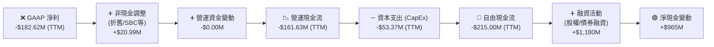

### 5.2 FCF 轉換率趨勢

由於公司仍處於高成長與重研發階段，自由現金流持續為負值，FCF 轉換率（FCF / Net Income）短期內不適用，但 FCF 赤字相較於 2025 年底已有收窄跡象。

| 指標 (M) | FY2022 | FY2023 | FY2024 | FY2025 | TTM |
|------|--------|--------|--------|--------|-----|
| **營運現金流 (OCF)** | -$106.54 | -$98.87 | -$48.89 | -$165.52 | -$161.63 |
| **資本支出 (CapEx)** | -$42.41 | -$54.71 | -$67.09 | -$156.28 | -$53.37 |
| **自由現金流 (FCF)** | -$148.95 | -$153.57 | -$115.98 | -$321.81 | -$215.00 |

### 5.3 自由現金流趨勢

```
╔══════════════════════════════════════════════════════════════════╗
║              RKLB 自由現金流赤字趨勢（FY2022-TTM）               ║
╠══════════════════════════════════════════════════════════════════╣
║                                                                  ║
║  FY2022  -$148.95M  ██████░░░░░░░░░░░░░░░░░░░░░                  ║
║  FY2023  -$153.57M  ██████░░░░░░░░░░░░░░░░░░░░░                  ║
║  FY2024  -$115.98M  ████░░░░░░░░░░░░░░░░░░░░░░░  (赤字收窄)      ║
║  FY2025  -$321.81M  █████████████░░░░░░░░░░░░░  (Neutron 投入高峰)║
║  TTM     -$215.00M  █████████░░░░░░░░░░░░░░░░░  (效率提升) 🟢    ║
║                                                                  ║
║  📊 TTM FCF 收益率 (FCF Yield)：-0.32%                           ║
╚══════════════════════════════════════════════════════════════════╝
```

### 5.4 資本配置評估

Rocket Lab 的資本配置戰略非常明確：**不進行任何股息支付或股份回購，將 100% 的可用資金投入研發（R&D）與資本支出（CapEx）**，以確保 Neutron 火箭的如期首飛與衛星製造工廠（如 Space Systems 在馬里蘭州和紐西蘭的擴建）的產能提升。

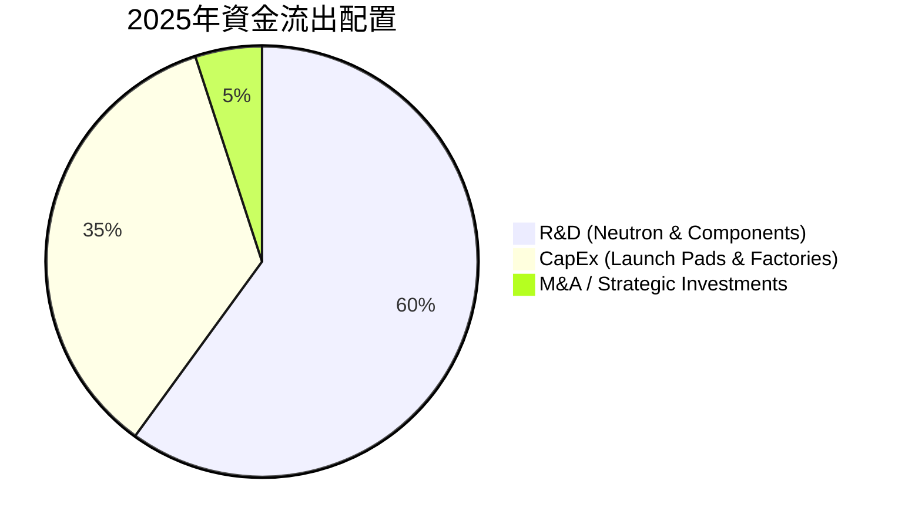

---

## 6. 獲利能力與資本效率

### 6.1 ROE / ROA / ROIC 趨勢

由於公司目前處於淨虧損狀態，各項回報率指標均為負值，但隨着營收規模的擴大，回報率正從谷底回升。

| 指標 | FY2023 | FY2024 | FY2025 | TTM | 行業均值 | 評估 |
|------|--------|--------|--------|-----|----------|------|
| **ROE** | -27.5% | -39.7% | -13.5% | **-13.5%** | ~12.0% | 🟡 仍受虧損拖累 |
| **ROA** | -18.7% | -17.8% | -8.9% | **-6.6%** | ~5.5% | 🟢 資產利用效率正在改善 |
| **ROIC**| -25.2% | -28.4% | -11.2% | **-9.8%** | ~8.0% | 🟡 投入資本回報率尚待轉正 |

### 6.2 ROIC vs WACC 分析（核心價值創造判斷）

對於 RKLB 而言，當前的 ROIC 為負，顯然低於其 WACC，這意味著公司目前在財務層面仍在「消耗股東價值」以換取未來的超額成長。

```
╔══════════════════════════════════════════════════════════════════╗
║                ROIC vs WACC 深度分析 (2026)                     ║
╠══════════════════════════════════════════════════════════════════╣
║                                                                  ║
║  WACC 估算：                                                     ║
║  ├── 無風險利率（10Y美債）：  4.25%                              ║
║  ├── 市場風險溢酬 (ERP)：     5.50%                              ║
║  ├── Beta：                   2.50                               ║
║  ├── 股權成本 = 4.25% + 2.50 × 5.50% = 18.0%                     ║
║  ├── 債務成本（稅後）：       ~6.0%                              ║
║  ├── 資本結構：股權 ~98%，債務 ~2%                               ║
║  └── ✅ WACC ≈ 17.7% (高 Beta 導致股權成本極高)                  ║
║                                                                  ║
║  ROIC 估算（TTM）：                                              ║
║  ├── NOPAT = -$225.62M × (1-21%) ≈ -$178.24M                    ║
║  ├── 投入資本 = 股東權益 + 債務 - 現金 ≈ $1.72B + $0.14B - $1.38B║
║  │            ≈ $480M (由於高額現金儲備，實際投入資本較小)       ║
║  └── ✅ ROIC ≈ -9.8%                                             ║
║                                                                  ║
║  ★ 經濟價值增加（EVA）= ROIC - WACC = -27.5%                     ║
║                                                                  ║
║  ROIC  -9.8%  ░░░░░░░░░░░░░░░░░░░░░░░░░░░░░░  🔴                 ║
║  WACC  17.7%  ▓▓▓▓▓▓▓▓▓▓▓▓▓▓▓▓▓▓░░░░░░░░░░░░  ──                 ║
║  EVA   -27.5% ██████████████████████████████  🔴 仍在價值消耗期  ║
║                                                                  ║
║  📊 結論：高 Beta 抬高了 WACC 門檻。公司在 Neutron 實現商業化並   ║
║            釋放利潤前，ROIC 將維持負值。這符合早期太空軍工股特徵。 ║
╚══════════════════════════════════════════════════════════════════╝
```

### 6.3 杜邦三因素分解

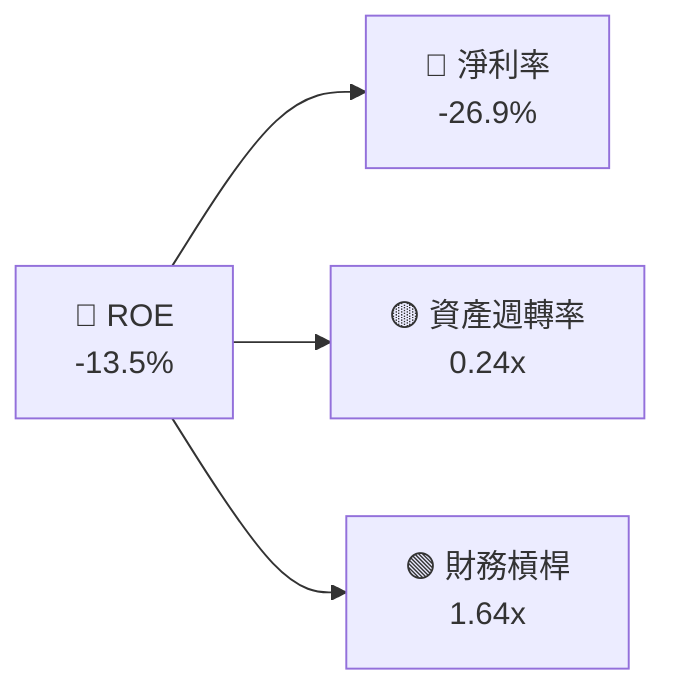

* **淨利率（-26.9%）**：是拖累 ROE 的絕對核心因素。
* **資產週轉率（0.24x）**：反映出公司目前處於「重資產建設期」（工廠、發射台已建置，但產能尚未完全釋放）。未來隨着發射頻率翻倍，此指標有極大上升空間。
* **財務槓桿（1.64x）**：公司主要依賴股權融資，財務槓桿極低，破產風險極小。

### 6.4 獲利能力儀表板

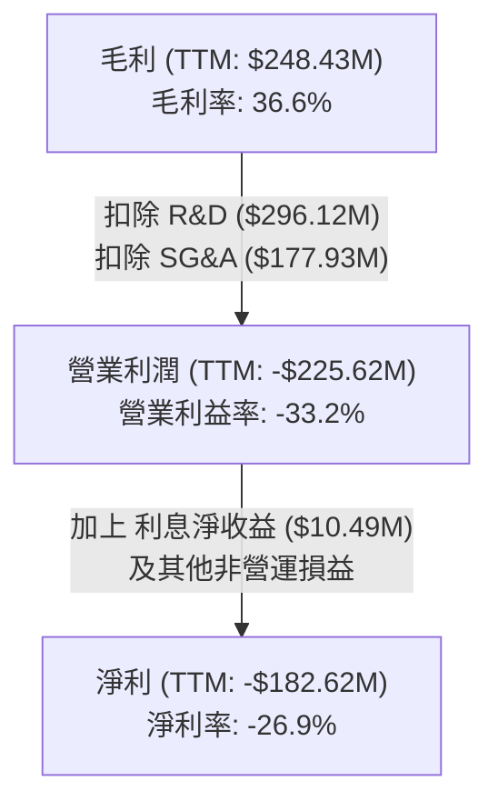

---

## 7. 估值深度分析

### 7.1 同業估值比較表格

太空與國防科技板塊的估值分化極大。由於 Rocket Lab 是該領域少數具備高成長且已實現大規模營收的標的，其估值享有極高的溢價。

| 估值指標 | **Rocket Lab (RKLB)** | **Intuitive Machines (LUNR)** | **Spire Global (SPIR)** | **SpaceX (估算值)** | RKLB 評估 |
|----------|----------|---------|---------|---------|-----------|
| **P/S Ratio** | **98.60x** | 8.50x | 3.20x | ~25.0x - 30.0x | 🔴 極端高估 |
| **EV / Revenue** | **87.28x** | 8.10x | 3.50x | ~24.0x | 🔴 遠超行業平均 |
| **P/B Ratio** | **27.27x** | 12.40x | 4.10x | N/A | 🔴 溢價極高 |
| **Forward P/E** | **-14751x** | -45.0x | 18.5x | N/A | 🔴 尚未實現穩定盈利 |
| **Beta (5Y)** | **2.50** | 3.10 | 1.85 | N/A | 🔴 高波動性 |

### 7.2 歷史估值區間分析

RKLB 的歷史 P/S 區間主要介於 8x 至 30x 之間。當前 **98.60x** 的 P/S 估值已處於歷史絕對最高點，這主要是由於 2026 年初以來，市場對 Neutron 的進展、SDA 衛星合約的簽署以及太空板塊整體的投機狂熱（股價從 2024 年底的 $25 飆升至當前的 $107.24）。

### 7.3 DCF 敏感性分析（6格目標價矩陣）

由於 RKLB 目前無正向現金流，我們基於 **2028-2035 自由現金流預測** 進行折現。
* **基準假設**：2028 年 FCF 轉正並達 $150M，隨後 7 年 CAGR 為 35%，終端成長率（PGR）為 3.5%。
* **折現率 (WACC)** 敏感性區間：15.0% - 19.0%（反映高 Beta 的風險溢價）。

| 營收成長情境 (2028-2035) | **WACC = 19.0%** | **WACC = 17.7%（基準）** | **WACC = 15.0%** |
|------|--------------|----------------------|--------------|
| 🟢 **樂觀 (CAGR 45%)** | $110.00 (+2.6%) | **$135.00** (+25.9%) | **$150.00** (+39.9%) |
| 🟡 **基準 (CAGR 35%)** | $90.00 (-16.1%) | **$115.00** (+7.2%) | **$125.00** (+16.6%) |
| 🔴 **悲觀 (CAGR 20%)** | $50.00 (-53.4%) | **$60.00** (-44.0%) | **$75.00** (-30.1%) |

### 7.4 估值綜合區間

```
╔══════════════════════════════════════════════════════════════════╗
║                  RKLB 估值區間與當前股價位置                     ║
╠══════════════════════════════════════════════════════════════════╣
║                                                                  ║
║  [悲觀合理值]  $60.00                                            ║
║  [當前股價]    $107.24   ◄─── 處於偏高位置                       ║
║  [基準目標價]  $115.00                                            ║
║  [樂觀合理值]  $150.00                                            ║
║                                                                  ║
║  📊 結論：當前股價（$107.24）已基本反映了基準情境下的所有利多，  ║
║            上行空間受限，下行保護不足。建議等待回檔。             ║
╚══════════════════════════════════════════════════════════════════╝
```

---

## 8. 成長催化劑

### 8.1 催化劑時間軸

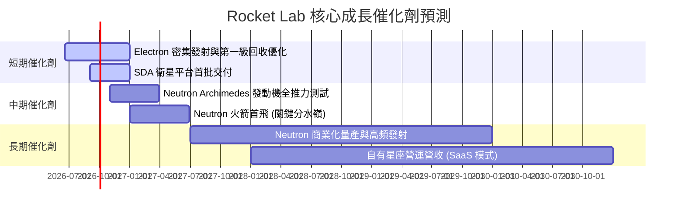

### 8.2 TAM 市場規模分析

Rocket Lab 的可定址市場正在經歷結構性擴張：

```
╔══════════════════════════════════════════════════════════════════╗
║                  Rocket Lab TAM 擴張圖景                        ║
╠══════════════════════════════════════════════════════════════════╣
║                                                                  ║
║  1. 輕型發射 (Electron)  ──► TAM: ~$1.5B/年 (滲透率 ~25%)        ║
║  2. 中型發射 (Neutron)   ──► TAM: ~$10B/年  (預計 2028 滲透)     ║
║  3. 航天系統與衛星製造   ──► TAM: ~$30B/年  (目前最大成長引擎)   ║
║  4. 太空應用與數據服務   ──► TAM: ~$100B+   (長期願景)           ║
║                                                                  ║
║  📈 總 TAM 從 2022 年的 $2B 擴張至目前的 $40B+                    ║
╚══════════════════════════════════════════════════════════════════╝
```

### 8.3 成長驅動力結構圖

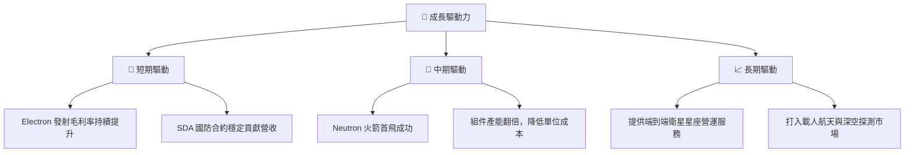

---

## 9. 風險矩陣

### 9.1 風險評分矩陣

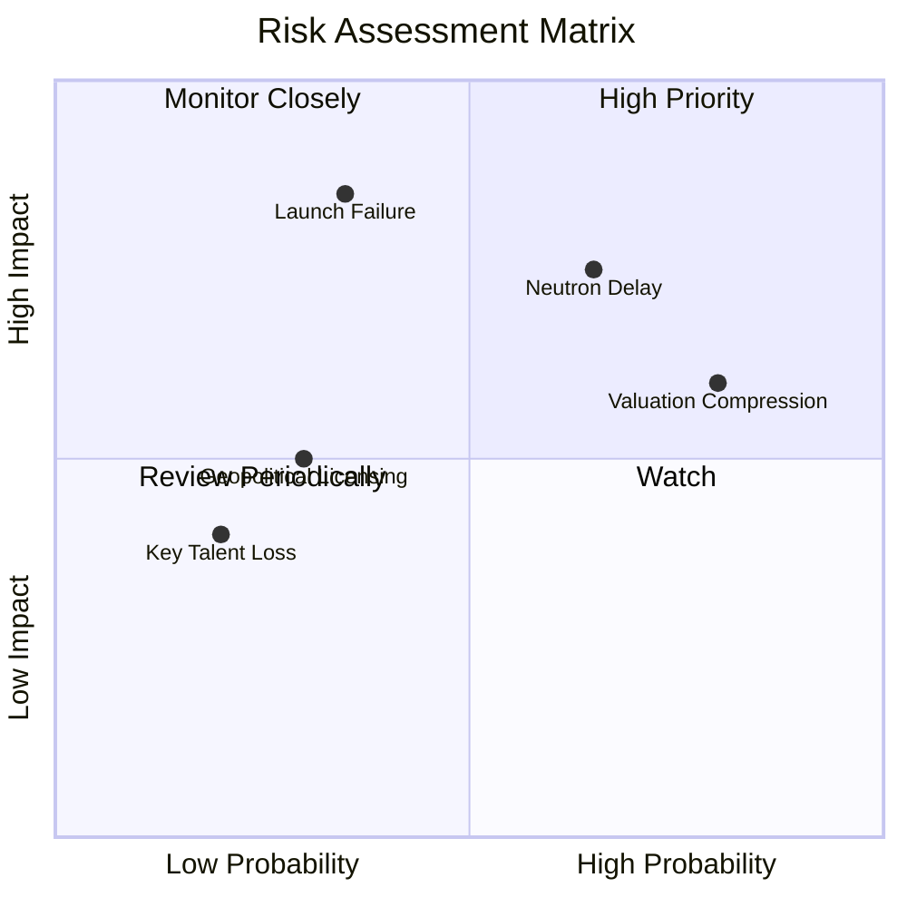

### 9.2 風險清單詳細分析

| # | 風險項目 | 發生機率 | 財務衝擊 | 風險評分 | 緩解措施 |
|---|----------|----------|----------|----------|----------|
| 1 | 🔴 **Neutron 首飛延期** | 高 (65%) | 高 (影響 2027 年後營收) | 🔴 **7.5 / 10** | 增加研發預算，實行組件多軌並行開發，利用 Electron 發射獲取部分數據。 |
| 2 | 🔴 **發射失敗 (Launch Failure)** | 中 (35%) | 極高 (暫停發射、客戶流失) | 🔴 **7.0 / 10** | 實施極其嚴格的品質控制流程，為主要發射購買足額商業保險。 |
| 3 | 🟡 **高估值下的市場殺估值** | 極高 (80%) | 中 (僅影響短期股價) | 🟡 **6.4 / 10** | 透過長期訂單 backlog 鎖定營收，向市場傳遞穩健的基本面進展。 |
| 4 | 🟡 **地緣政治與出口管制** | 中 (30%) | 中 (紐西蘭與美國雙總部限制) | 🟡 **4.5 / 10** | 確保紐西蘭與美國發射場完全符合 ITAR 管制標準，分散生產基地。 |

---

## 10. 投資建議

### 10.1 最終綜合評級雷達圖

```
╔══════════════════════════════════════════════════════════════╗
║                  RKLB 最終綜合評級雷達圖                     ║
╠══════════════════════════════════════════════════════════════╣
║                                                                  ║
║             基本面強度 (8.0/10)                                  ║
║                  /\                                              ║
║  財務健康 (9.0) /  \ 成長動能 (9.5)                             ║
║                /    \                                            ║
║               /      \                                           ║
║  技術創新 (9.5)─────── 護城河深度 (8.5)                          ║
║               \      /                                           ║
║                \    /                                            ║
║  獲利品質 (4.5) \  / 估值合理性 (3.0)                            ║
║                  \/                                              ║
║                                                                  ║
║  🏆 綜合評分：7.2 / 10                                           ║
║  📌 評級：🟢 長線買入 (Buy on Dips) / 🟡 短期觀望 (Hold)         ║
╚══════════════════════════════════════════════════════════════╝
```

### 10.2 目標價與隱含報酬率

| 情境 | 機率權重 | 目標價 | 當前股價 | 隱含報酬率 | 觸發條件 |
|------|----------|--------|----------|------------|----------|
| 🔴 **悲觀情境** | 25% | **$60.00** | $107.24 | -44.0% | Neutron 研發嚴重受挫，Electron 發生發射失敗。 |
| 🟡 **基準情境** | 50% | **$115.00** | $107.24 | +7.2% | Neutron 於 2027 年首飛順利，Space Systems 持續成長。 |
| 🟢 **樂觀情境** | 25% | **$150.00** | $107.24 | +39.9% | Neutron 提前成功發射並獲得大型星座訂單。 |
| **加權估值** | **100%** | **$110.00** | $107.24 | **+2.6%** | **接近公允價值，反映短期性價比一般。** |

### 10.3 買入時機與觸發因素

```
╔══════════════════════════════════════════════════════════════════╗
║                  ✅ RKLB 投資決策 Checklist                     ║
╠══════════════════════════════════════════════════════════════════╣
║                                                                  ║
║  立即