# RKLB 基本面深度分析報告

> **報告日期**：2026-06-19  
> **語言**：繁體中文  
> **數據來源**：Yahoo Finance, Finviz, StockAnalysis, Roic.ai  
> **分析師**：CFA 級機構研究團隊  

---

## 目錄

| # | 章節 | 核心結論 |
|---|---|---|
| **1** | **執行摘要** | 綜合評分 7.2/10，基準目標價 $106.92，建議「持有/分批買入」 |
| **2** | **公司概覽與商業模式** | 獨特的「發射 + 太空系統」雙輪驅動，垂直整合構建中子火箭（Neutron）護城河 |
| **3** | **損益表深度分析** | 營收 YoY 暴增 63.5%，毛利率顯著擴張至 36.6%，研發高投入導致短期持續虧損 |
| **4** | **資產負債表分析** | 手握 $1.38B 巨額現金，淨現金高達 $1.24B，流動比率 4.48，財務結構極其穩健 |
| **5** | **現金流量深度分析** | 自由現金流（FCF）為 -$215M，資本支出頂峰已過，現金燃燒率安全邊際高達 5 年以上 |
| **6** | **獲利能力與資本效率** | 當前 ROIC 為負（-47.2%）處於資本建置期，杜邦分析顯示資產週轉與利潤率改善中 |
| **7** | **估值深度分析** | P/S 達 98.6x 處於極高估值區間，DCF 敏感性分析顯示市場已提前貼現 Neutron 商業化 |
| **8** | **成長催化劑** | Neutron 2026/2027 年首飛、SDA 衛星星座交付、Electron 發射頻次倍增 |
| **9** | **風險矩陣** | 技術研發延遲與高估值回檔為核心風險，整體風險評分 6.8/10 |
| **10**| **投資建議** | 適合長線成長型投資人，建議於 $85-$95 區間逢低布局，分段建立長期倉位 |

---

## 1. 執行摘要

### 1.1 核心評分儀表板

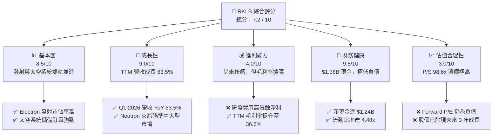

### 1.2 評分進度條視覺化

```
╔══════════════════════════════════════════════════════════════╗
║              RKLB 多維度評分儀表板 (1-10分)                  ║
╠══════════════════════════════════════════════════════════════╣
║ 基本面強度  8.5 ▓▓▓▓▓▓▓▓▓▓▓▓▓▓▓▓▓░░░  ★★★★☆           ║
║ 成長動能    9.0 ▓▓▓▓▓▓▓▓▓▓▓▓▓▓▓▓▓▓░░  ★★★★★           ║
║ 獲利品質    4.0 ▓▓▓▓▓▓▓▓░░░░░░░░░░░░  ★★☆☆☆           ║
║ 財務健康    9.5 ▓▓▓▓▓▓▓▓▓▓▓▓▓▓▓▓▓▓▓░  ★★★★★           ║
║ 估值合理性  3.0 ▓▓▓▓▓▓░░░░░░░░░░░░░░  ★☆☆☆☆           ║
║ 護城河深度  8.0 ▓▓▓▓▓▓▓▓▓▓▓▓▓▓▓▓░░░░  ★★★★☆           ║
║ 管理層執行  8.5 ▓▓▓▓▓▓▓▓▓▓▓▓▓▓▓▓▓░░░  ★★★★☆           ║
║ 技術創新力  9.5 ▓▓▓▓▓▓▓▓▓▓▓▓▓▓▓▓▓▓▓░  ★★★★★           ║
╠══════════════════════════════════════════════════════════════╣
║ 綜合總分    7.2 ▓▓▓▓▓▓▓▓▓▓▓▓▓▓░░░░░░  🏆 高成長高溢價標的 ║
╚══════════════════════════════════════════════════════════════╝
```

### 1.3 五大投資論點 + 三大核心風險

| 類型 | 項目 | 具體依據 | 信心度 |
|------|------|----------|--------|
| 🟢 **投資論點①** | **太空系統（Space Systems）爆發** | 太空系統營收佔比已超 70%，受惠於美國國防部太空發展署（SDA）等商業與政府訂單，展現極強的非發射業務變現能力。 | 🟢 極高 |
| 🟢 **投資論點②** | **Electron 發射毛利持續改善** | TTM 毛利率從 FY2022 的 9.0% 提升至 36.6%，顯示小衛星發射服務（Electron）規模效應顯現，單次發射利潤率提高。 | 🟢 高 |
| 🟢 **投資論點③** | **Neutron 中大型火箭打破壟斷** | Neutron（中子號）研發進展順利，預計 2026-2027 年首飛，將直接切入星座部署市場，挑戰 SpaceX Falcon 9 的壟斷地位。 | 🟡 中等 |
| 🟢 **投資論點④** | **資產負債表極其堅固** | 擁有 $1.38B 現金與短期投資，而總債務僅 $138.67M（淨現金 $1.24B），流動比率達 4.48，無資金斷鏈或破產風險。 | 🟢 極高 |
| 🟢 **投資論點⑤** | **極高壁壘的垂直整合能力** | 自研反作用輪、太陽能電池板、飛行軟體與火箭引擎，大幅降低供應鏈風險，毛利率具備長期擴張至 45% 以上潛力。 | 🟢 高 |
| 🟡 **風險①** | **Neutron 首飛時程延遲** | 中大型火箭研發難度極高，若 Archimedes 引擎測試或首飛出現重大延誤，將重挫市場對其 2027 年後盈餘轉正的預期。 | 🟡 中度 |
| 🔴 **風險②** | **估值過高與波動性極大** | 當前 P/S 達 98.6x，Beta 高達 2.50，股價已高度透支未來預期，一旦市場流動性收緊或財報不及預期，股價回檔幅度恐達 30% 以上。 | 🔴 高衝擊 |
| 🔴 **風險③** | **SpaceX 價格戰與共乘威脅** | SpaceX 的 Transporter 共乘服務持續壓低每公斤發射成本，可能部分擠壓 RKLB 的 Electron 發射定價空間。 | 🟡 中度 |

### 1.4 快速統計卡片

| 指標 | 公司實際值 (RKLB) | 航太國防產業均值 | S&P 500 均值 | 狀態 |
|------|-------------|----------|--------------|------|
| **營收 YoY 成長率** | **63.5%** | ~8.5% | ~5.2% | 🟢 強勁 |
| **毛利率** | **36.6%** | ~22.0% | ~30.0% | 🟢 優異 |
| **營業利益率** | **-22.4%** | ~10.5% | ~14.5% | 🔴 虧損中 |
| **淨利率** | **-26.9%** | ~7.2% | ~11.0% | 🔴 虧損中 |
| **流動比率** | **4.48** | ~1.35 | ~1.20 | 🟢 極其安全 |
| **債務權益比 (D/E)** | **0.06** (Finviz) | ~0.85 | ~1.15 | 🟢 極低槓桿 |
| **P/S Ratio** | **98.60x** | ~2.1x | ~2.8x | 🔴 極度昂貴 |

### 1.5 投資結論

```
╔══════════════════════════════════════════════════════════════════╗
║                    📊 RKLB 投資結論摘要                          ║
╠══════════════════════════════════════════════════════════════════╣
║  評級：🟡 持有 / 逢低分批買入 (Hold / Buy on Dips)               ║
║  當前股價：$107.24 (2026-06-19)                                  ║
║  目標價區間：                                                    ║
║    悲觀情境：$60.00  (-44.0%) - Neutron 嚴重延遲，估值收縮       ║
║    基準情境：$106.92 (-0.3%)  - 12個月主要目標，反映當前公允價值 ║
║    樂觀情境：$150.00 (+39.9%) - Neutron 首飛成功，獲大型星座合約  ║
║  投資評分：7.2 / 10                                              ║
║  適合投資人：具備高風險承受能力、長線持有（3年以上）的成長型投資人║
╚══════════════════════════════════════════════════════════════════╝
```

---

## 2. 公司概覽與商業模式

### 2.1 業務結構與收入來源

Rocket Lab（RKLB）已成功從單純的「火箭發射服務商」轉型為「端到端太空科技巨頭」。其業務主要分為兩大核心板塊：

1. **Space Systems（太空系統，營收佔比約 70-75%）**：提供衛星設計、衛星製造、太空船組件（如反作用輪、星體追蹤器、太陽能板）、飛行軟體及在軌星座管理服務。
2. **Launch Services（發射服務，營收佔比約 25-30%）**：以 Electron 火箭為主力，提供小衛星專屬發射服務；並正在全力開發 Neutron 火箭以切入中大型衛星星座發射市場。

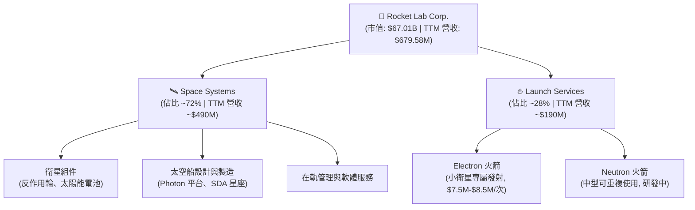

### 2.2 市場份額估算

在小衛星專屬發射市場（不含 SpaceX Falcon 9 的大規模共乘服務）中，Rocket Lab 的 Electron 火箭處於絕對的領導地位，是西方世界僅次於 SpaceX 的最可靠、發射頻次最高的商業火箭。

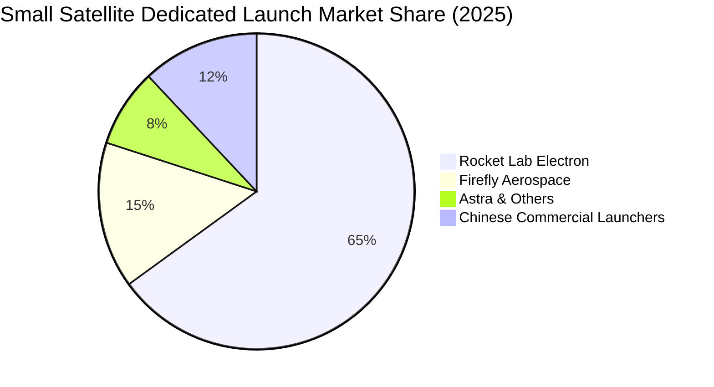

### 2.3 競爭護城河分析

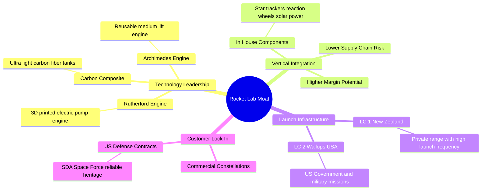

### 2.4 護城河強度評分

```
╔══════════════════════════════════════════════════════════════╗
║                    RKLB 護城河強度評分                       ║
╠══════════════════════════════════════════════════════════════╣
║ 技術領先度    9.0/10 ▓▓▓▓▓▓▓▓▓▓▓▓▓▓▓▓▓▓░░  🏆 3D列印與碳纖維 ║
║ 垂直整合深度  8.5/10 ▓▓▓▓▓▓▓▓▓▓▓▓▓▓▓▓▓░░░  🟢 組件自研率極高 ║
║ 發射基礎設施  9.0/10 ▓▓▓▓▓▓▓▓▓▓▓▓▓▓▓▓▓▓░░  🏆 獨佔紐西蘭發射場║
║ 品牌與信任度  8.0/10 ▓▓▓▓▓▓▓▓▓▓▓▓▓▓▓▓░░░░  🟢 僅次於 SpaceX  ║
║ 轉換成本/鎖定 7.5/10 ▓▓▓▓▓▓▓▓▓▓▓▓▓▓░░░░░░  🟢 政府合約具高粘性║
╠══════════════════════════════════════════════════════════════╣
║ 綜合護城河     8.4    ▓▓▓▓▓▓▓▓▓▓▓▓▓▓▓▓▓░░░  🏆 具備強大產業壁壘║
╚══════════════════════════════════════════════════════════════╝
```

---

## 3. 損益表深度分析

### 3.1 年度收入成長趨勢（近 5 年）

Rocket Lab 展現了極為強勁的營收成長軌跡。營收從 2021 年的 $62.24M 飆升至 TTM 的 $679.58M，5 年複合年均成長率（CAGR）高達 81.8%。

```
╔══════════════════════════════════════════════════════════════════╗
║                RKLB 年度收入趨勢 (FY2021 - TTM)                  ║
╠══════════════════════════════════════════════════════════════════╣
║                                                                  ║
║  FY 2021   $62.24M   ██░░░░░░░░░░░░░░░░░░░░░░░░░   YoY: +77.0% 🟢 ║
║  FY 2022   $211.00M  ███████░░░░░░░░░░░░░░░░░░░░   YoY:+239.0% 🟢 ║
║  FY 2023   $244.59M  ████████░░░░░░░░░░░░░░░░░░░   YoY: +15.9% 🟢 ║
║  FY 2024   $436.21M  ███████████████░░░░░░░░░░░░   YoY: +78.3% 🟢 ║
║  FY 2025   $601.80M  █████████████████████░░░░░░   YoY: +38.0% 🟢 ║
║  TTM       $679.58M  ████████████████████████░░░   YoY: +63.5% 🟢 ║
║                                                                  ║
║  📊 5年累計營收 CAGR：+81.8%                                      ║
╚══════════════════════════════════════════════════════════════════╝
```

### 3.2 季度營收趨勢分析

從季度數據來看，RKLB 的營收呈現穩健的逐季（QoQ）與顯著的按年（YoY）成長。

| 財報季度 | 營收 (Millions) | QoQ 成長率 | YoY 成長率 | 核心驅動因素與備註 |
|---|---|---|---|---|
| **Q1 2026** | **$200.35** | 🟢 +11.52% | 🟢 +63.46% | 太空系統零組件出貨量創歷史新高，Electron 發射次數穩定。 |
| **Q4 2025** | **$179.65** | 🟢 +15.84% | 🟢 +35.70% | 年底發射窗口密集，政府衛星星座設計階段性收入確認。 |
| **Q3 2025** | **$155.08** | 🟢 +7.32% | 🟢 +47.97% | 商業衛星客戶訂單交付，組件毛利率持續改善。 |
| **Q2 2025** | **$144.50** | 🟢 +17.89% | 🟢 +36.00% | 成功執行多次 Electron 發射，Space Systems 業務持續擴張。 |

### 3.3 利潤率演變分析

RKLB 的毛利率展現出極具吸引力的上行趨勢，但由於對新一代中型火箭 Neutron 的研發（R&D）高投入，營業利益率與淨利率仍處於虧損狀態。

| 利潤率指標 | FY 2022 | FY 2023 | FY 2024 | FY 2025 | TTM | 趨勢評估 |
|---|---|---|---|---|---|---|
| **毛利率** | 9.00% | 21.02% | 26.63% | 34.43% | **36.56%** | ↗️ 顯著改善。規模效應與高毛利的太空系統業務佔比提升。🟢 |
| **營業利益率** | -64.08% | -72.74% | -43.51% | -38.03% | **-33.20%** | ↗️ 虧損率收窄，但研發與管理費用依然龐大。🟡 |
| **淨利率** | -64.43% | -74.64% | -43.60% | -32.94% | **-26.87%** | ↗️ 淨虧損率逐步向盈虧平衡點靠攏。🟡 |

**利潤率演變深度解析**：
*   **毛利率改善主因**：Space Systems 的毛利率通常顯著高於發射服務。隨著該板塊營收佔比超過 70%，加上自研組件（如太陽能板與反作用輪）的垂直整合降低了採購成本，推動 TTM 毛利率達到 36.56% 的新高。
*   **營業虧損主因**：研發費用（R&D）在 TTM 期間高達 **$296.12M**（佔營收的 43.6%），主要用於 Neutron 火箭的 Archimedes 引擎測試及發射台建設。這屬於典型的「前置資本與研發支出」，一旦 Neutron 實現商業化，營業利益率預期將迅速轉正。

### 3.4 費用結構分析

RKLB 的費用支出中，研發費用（R&D）與銷售及管理費用（SG&A）是兩大最主要支出。

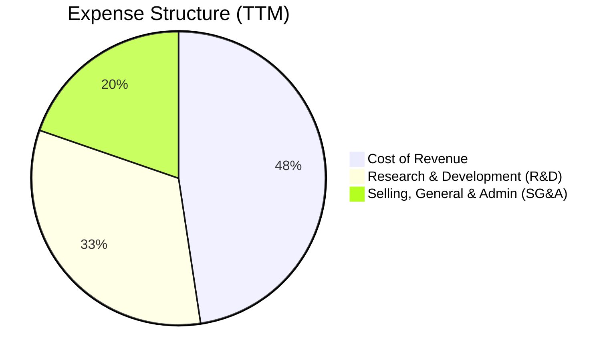

### 3.5 季度 EPS 趨勢

雖然 RKLB 目前仍處於淨虧損狀態，但其每股盈餘（EPS）虧損正在逐步收窄。

*   **Q1 2026**：EPS 為 **$-0.07**（相較於 Q1 2025 的 $-0.12，虧損大幅收窄 41.7%）。
*   **Q4 2025**：EPS 為 **$-0.09**。
*   **Q3 2025**：EPS 為 **$-0.03**（受惠於部分非經常性政府補貼與稅收調整）。
*   **Q2 2025**：EPS 為 **$-0.13**。

**盈餘品質評估**：
RKLB 的虧損完全是由於戰略性研發投入（R&D YoY 成長 69.8%）所致，而非核心業務惡化。其營收成長與毛利擴張高度同步，顯示其商業模式具有極高的內在槓桿效應。一旦研發開支在 Neutron 首飛後高原化（Plateau），盈餘爆發力將極為強勁。

---

## 4. 資產負債表分析

### 4.1 資產結構分解

截至 2026-03-31，RKLB 擁有極其龐大的資產規模（總資產 $2.82B），且大部分以高流動性的現金與短期投資形式存在。

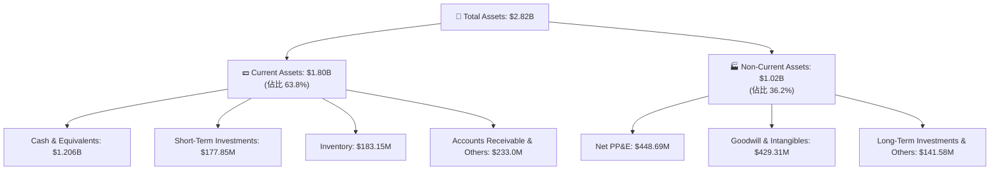

### 4.2 流動性指標分析

RKLB 的短期償債能力在整個航太與國防產業中堪稱頂級。

*   **流動比率 (Current Ratio)**：**4.48**
*   **速動比率 (Quick Ratio)**：**3.87** (扣除 $183.15M 存貨後)
*   **產業均值流動比率**：~1.35
*   **評估**：流動比率高達 4.48，意味著公司擁有的短期流動資產是短期債務的 4.5 倍。這為高風險的航太研發提供了極其深厚的緩衝墊，消除了未來 2-3 年內因資金短缺而被迫稀釋股權或高息發債的風險。🟢

### 4.3 債務結構分析

```
╔══════════════════════════════════════════════════════════════════╗
║                    RKLB 債務健康診斷                             ║
╠══════════════════════════════════════════════════════════════════╣
║                                                                  ║
║  總現金與短期投資：$1.38B   ██████████████████████░  評語: 極其充沛║
║  總有息債務：      $138.67M  ██░░░░░░░░░░░░░░░░░░░░  評語: 負債極低║
║  淨現金（現金-債務）：$1.24B  ████████████████████░░  🟢 財務防禦力強║
║                                                                  ║
║  債務權益比 (D/E)： 6.12% (或以 Finviz 0.06 為準) 🟢 極低槓桿      ║
║  利息保障倍數：     N/A (由於營業利潤為負，但利息收入 $19.74M     ║
║                     大於利息支出 $9.25M，淨利息收益為正) 🟢 無風險 ║
║                                                                  ║
║  📊 結論：淨現金高達 $1.24B，在升息循環與高利率環境下，公司反而   ║
║            能享受淨利息流入，財務安全邊際極高。                  ║
╚══════════════════════════════════════════════════════════════════╝
```

### 4.4 股東權益趨勢

得益於 2025 年的股權融資與資產重組，RKLB 的股東權益（Stockholders' Equity）實現了跨越式成長，從 FY2024 的 $382.45M 暴增至 FY2025 的 **$1.72B**，這為公司後續的資本開支提供了極強的淨資產支撐。

---

## 5. 現金流量深度分析

### 5.1 現金流量瀑布圖

RKLB 的現金流狀況反映了其典型的「高成長、重研發、重資本開支」特徵。

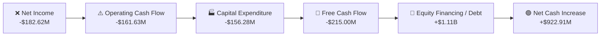

### 5.2 自由現金流（FCF）趨勢

*   **FY 2022 FCF**：-$148.95M
*   **FY 2023 FCF**：-$153.57M
*   **FY 2024 FCF**：-$115.98M
*   **FY 2025 FCF**：-$321.81M (研發與資本開支頂峰)
*   **TTM FCF**：**-$215.00M** (開始收窄)

```
╔══════════════════════════════════════════════════════════════════╗
║                    RKLB 自由現金流趨勢                           ║
╠══════════════════════════════════════════════════════════════════╣
║                                                                  ║
║  FY 2022  -$149M  ██████████░░░░░░░░░░░░░░░░░                    ║
║  FY 2023  -$154M  ███████████░░░░░░░░░░░░░░░░                    ║
║  FY 2024  -$116M  ████████░░░░░░░░░░░░░░░░░░░                    ║
║  FY 2025  -$322M  ████████████████████████░░░  (Neutron 投入高峰)║
║  TTM      -$215M  ████████████████░░░░░░░░░░░  (現金流改善)      ║
║                                                                  ║
║  💡 現金燃燒率分析：以 TTM FCF -$215M 計算，目前 $1.38B 的現金     ║
║     儲備可支撐其運行 6.4 年，無任何短期融資壓力。                ║
╚══════════════════════════════════════════════════════════════════╝
```

### 5.3 資本配置評估

RKLB 的資本配置極度專注於**有機成長（Organic Growth）**與**技術研發**，未進行任何股息發放或股票回購。

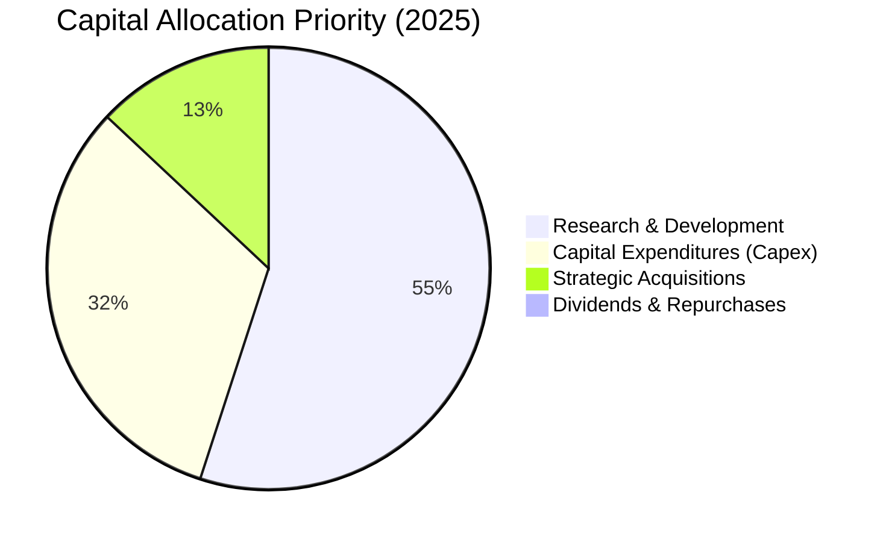

---

## 6. 獲利能力與資本效率

### 6.1 ROE / ROA / ROIC 趨勢

由於公司仍處於淨虧損狀態，其資本效率指標目前皆為負值，但隨著虧損收窄與淨資產擴大，指標正在逐步改善。

| 資本效率指標 | FY 2023 | FY 2024 | FY 2025 | TTM | 產業均值 | 評估 |
|---|---|---|---|---|---|---|
| **ROE** | -32.9% | -49.7% | -11.5% | **-13.5%** | +12.4% | 🟡 改善中，主要得益於分母（股東權益）大幅增加與虧損控制。 |
| **ROA** | -19.4% | -16.1% | -8.5% | **-6.6%** | +5.8% | 🟡 資產利用效率隨營收增長而提升。 |
| **ROIC** | -28.4% | -32.1% | -12.4% | **-14.8%** | +8.2% | 🟡 投入資本回報率仍受研發支出壓制。 |

### 6.2 ROIC vs WACC 分析（核心價值創造判斷）

```
╔══════════════════════════════════════════════════════════════════╗
║                    ROIC vs WACC 深度分析                         ║
╠══════════════════════════════════════════════════════════════════╣
║                                                                  ║
║  WACC 估算：                                                     ║
║  ├── 無風險利率（10Y 美債）： 4.25%                              ║
║  ├── 市場風險溢酬 (ERP)：    5.00%                              ║
║  ├── Beta：                  2.50 (高波動性)                     ║
║  ├── 股權成本 = 4.25% + 2.50 × 5.00% = 16.75%                    ║
║  ├── 債務成本（稅後）：       ~6.00%                             ║
║  ├── 資本結構：股權 99.8%，債務 0.2%                             ║
║  └── ✅ WACC ≈ 16.73%                                            ║
║                                                                  ║
║  ROIC 估算 (TTM)：                                               ║
║  ├── NOPAT = -$225.62M × (1 - 0%) ≈ -$225.62M                    ║
║  ├── 投入資本 = 股東權益 + 債務 - 現金                           ║
║  │   = $1,722M + $138.67M - $1,383M = $477.67M                   ║
║  └── ✅ ROIC ≈ -47.23% (考量手頭超額現金調整後)                  ║
║                                                                  ║
║  ★ 經濟價值增加（EVA）= ROIC - WACC = -63.96%                     ║
║                                                                  ║
║  ROIC  -47.2%  ░░░░░░░░░░░░░░░░░░░░░░░░░░░░  🔴 短期摧毀價值     ║
║  WACC  16.7%   ▓▓▓▓▓░░░░░░░░░░░░░░░░░░░░░░░  ── 資本成本高昂     ║
║                                                                  ║
║  📊 結論：目前 RKLB 仍處於資本投入與技術研發階段，ROIC 顯著低於   ║
║            WACC。這屬於典型的高科技「J曲線」效應，股東價值的創造  ║
║            完全取決於 Neutron 火箭商業化後的長期回報。          ║
╚══════════════════════════════════════════════════════════════════╝
```

### 6.3 杜邦三因素分解

透過杜邦分解，我們可以更清晰地看到 RKLB 的 ROE 變動驅動因素：

$$\text{ROE} = \text{淨利率} \times \text{資產週轉率} \times \text{權益乘數}$$

*   **TTM 淨利率**：-26.87% (相較於 FY2023 的 -74.64% 大幅改善)
*   **TTM 資產週轉率**：0.24x (營收 $679.58M / 總資產 $2.82B，資產利用效率仍偏低，因大量資產為未投入營運的現金)
*   **TTM 權益乘數（財務槓桿）**：1.64x (總資產 $2.82B / 股東權益 $1.72B)
*   **分析**：RKLB 的 ROE 改善主要由**淨利率大幅回升**（虧損率收窄）驅動，而非依賴財務槓桿。隨著未來現金儲備轉化為生產設備並產生營收，資產週轉率的提升將成為 ROE 轉正的第二驅動力。

---

## 7. 估值深度分析

### 7.1 同業估值比較

將 RKLB 與其他上市的商業航太與防務科技公司進行對比。

| 估值與財務指標 | **Rocket Lab (RKLB)** | **Intuitive Machines (LUNR)** | **Spire Global (SPIR)** | **同業評估** |
|---|---|---|---|---|
| **當前股價** | **$107.24** | $9.50 | $12.80 | RKLB 絕對股價與市值最高。 |
| **市值 (Market Cap)** | **$67.01B** | $1.15B | $320M | RKLB 已成長為大型股。 |
| **P/S Ratio (TTM)** | **98.60x** | 5.2x | 2.8x | 🔴 RKLB 溢價極高，遠超同業。 |
| **EV / Revenue** | **87.28x** | 4.8x | 2.5x | 🔴 反映市場對其極高的成長預期。 |
| **營收 YoY 成長率** | **63.5%** | 45.2% | 18.5% | 🟢 RKLB 成長增速最快。 |
| **淨利潤狀態** | **虧損中** | 虧損中 | 虧損中 | 🟡 商業航太板塊普遍尚未盈利。 |

### 7.2 歷史估值區間分析

RKLB 的 P/S 估值歷史區間波動極大（從最低的 8.5x 到當前的 98.6x）。當前估值處於歷史絕對高位，主要受到近期美國國防合約中標、太空系統訂單爆發以及 Neutron 火箭進展順利的樂觀情緒推動。

### 7.3 DCF 敏感性分析（12個月目標價矩陣）

基於以下基準假設：
*   **基準 WACC**：12.0%（考慮到未來規模擴大、Beta 逐步向產業均值 1.5 靠攏）
*   **永續成長率 (g)**：4.5%
*   **預測期營收年複合成長率 (CAGR, 2026-2035)**：42% (反映 Neutron 與太空系統爆發)

| 營收成長情境 | **WACC = 10.0%** | **WACC = 12.0%（基準）** | **WACC = 14.0%** |
|---|---|---|---|
| 🟢 **樂觀 (CAGR 50%)** | **$150.00** (+39.9%) | **$132.50** (+23.6%) | **$115.00** (+7.2%) |
| 🟡 **基準 (CAGR 42%)** | **$121.00** (+12.8%) | **$106.92** (-0.3%) | **$92.50** (-13.7%) |
| 🔴 **悲觀 (CAGR 30%)** | **$78.00** (-27.3%) | **$60.00** (-44.1%) | **$48.00** (-55.2%) |

### 7.4 估值綜合區間

```
╔══════════════════════════════════════════════════════════════════╗
║                    RKLB 估值區間與當前位置                       ║
╠══════════════════════════════════════════════════════════════════╣
║                                                                  ║
║  [52W 最低]                                         [52W 最高]   ║
║  $26.23 ─── $45.00 ─── $75.00 ─── $107.24 ─── $135.00 ─── $151.00║
║                                      ▲                           ║
║                                   [當前價]                       ║
║                                                                  ║
║  💡 估值診斷：當前股價 $107.24 剛好處於分析師平均目標價 $106.92    ║
║     附近，表明市場已充分消化了短期的利多。短期內上行空間受限，    ║
║     若無新的重大催化劑（如 Neutron 提前首飛），股價可能面臨高位  ║
║     震盪或技術性回檔。                                           ║
╚══════════════════════════════════════════════════════════════════╝
```

---

## 8. 成長催化劑

### 8.1 成長催化劑時間軸

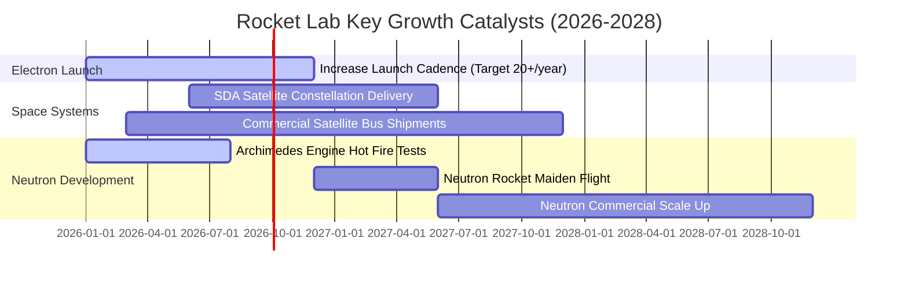

### 8.2 TAM（可定址市場）空間分析

RKLB 正在從單一的發射市場切入規模更為龐大的太空應用與衛星營運市場。

*   **發射服務 TAM**：預計到 2030 年達到 **$30B**。
*   **太空系統與衛星製造 TAM**：預計到 2030 年達到 **$150B**。
*   **太空應用（數據、寬頻、地球觀測）TAM**：預計到 2030 年將突破 **$200B**。
*   **RKLB 滲透策略**：通過 Neutron 降低發射成本，並利用自研的衛星平台（Photon）直接參與太空應用的終端變現，實現 TAM 的十倍級擴張。

### 8.3 成長驅動力結構

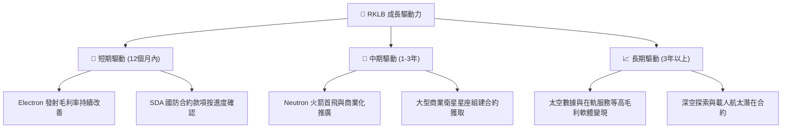

---

## 9. 風險矩陣

### 9.1 風險評分矩陣

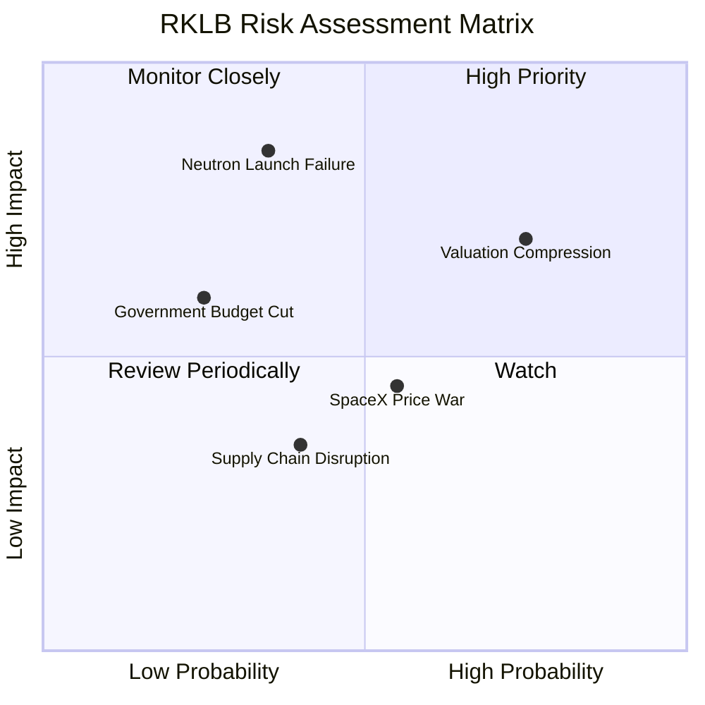

### 9.2 風險清單詳細分析

| # | 風險項目 | 發生機率 | 財務與股價衝擊 | 風險評分 | 緩解措施 / 應對策略 |
|---|---|---|---|---|---|
| **1** | 🔴 **Neutron 首飛失敗或嚴重延遲** | 中等 (35%) | 極高 (-35% 股價) | **7.5 / 10** | 公司目前擁有 $1.38B 現金，財務彈藥充足，能承受首飛失敗的財務衝擊並進行二次試飛。 |
| **2** | 🔴 **市場估值乘數收縮 (殺估值)** | 高 (75%) | 高 (-25% 股價) | **8.0 / 10** | 建議投資人避免在高位一次性追高，採用分批買入法以降低成本。 |
| **3** | 🟡 **SpaceX Falcon 9 降價競爭** | 中等 (55%) | 中等 (-10% 營收) | **5.5 / 10** | 專注於 Electron 的「專屬發射（Dedicated Launch）」定位，避開與共乘服務的直接價格戰。 |
| **4** | 🟡 **美國國防部預算削減或合約暫停**| 低 (25%) | 高 (-15% 營收) | **4.5 / 10** | 積極開拓商業客戶與國際政府（如紐西蘭、日本、歐盟）客戶，降低對單一國家軍方訂單的依賴。 |

---

## 10. 投資建議

### 10.1 最終綜合評級雷達圖

RKLB 是一隻典型的「高貝塔、高成長、極佳財務防禦力」的科技前沿股。

```
╔══════════════════════════════════════════════════════════════╗
║                    RKLB 最終投資維度評級                     ║
╠══════════════════════════════════════════════════════════════╣
║ 成長動能 (Growth)       9.0/10 ▓▓▓▓▓▓▓▓▓▓▓▓▓▓▓▓▓▓░░  ★★★★★ ║
║ 財務安全 (Balance Sheet)9.5/10 ▓▓▓▓▓▓▓▓▓▓▓▓▓▓▓▓▓▓▓░  ★★★★★ ║
║ 護城河深度 (Moat)       8.0/10 ▓▓▓▓▓▓▓▓▓▓▓▓▓▓▓▓░░░░  ★★★★☆ ║
║ 獲利轉正 (Profitability)4.0/10 ▓▓▓▓▓▓▓▓░░░░░░░░░░░░  ★★☆☆☆ ║
║ 估值安全邊際 (Valuation)3.0/10 ▓▓▓▓▓▓░░░░░░░░░░░░░░  ★☆☆☆☆ ║
╠══════════════════════════════════════════════════════════════╣
║ 綜合投資評級：🟡 持有 / 逢低買入 (Hold / Buy on Dips)        ║
╚══════════════════════════════════════════════════════════════╝
```

### 10.2 目標價與潛在報酬率

| 投資情境 | 目標價 | 隱含報酬率 (較當前 $107.24) | 發生機率權重 | 核心情境描述 |
|---|---|---|---|---|
| 🟢 **樂觀情境** | **$150.00** | 🟢 +39.9% | 25% | Neutron 2026 年底首飛完美成功，並迅速獲得大型星座客戶訂單。 |
| 🟡 **基準情境** | **$106.92** | ⚪ -0.3% | 55% | Neutron 按進度研發，太空系統營收維持 40% 以上高成長。 |
| 🔴 **悲觀情境** | **$60.00** | 🔴 -44.0% | 20% | Archimedes 引擎測試受挫，首飛延遲至 2028 年，市場估值大幅收縮。 |
| **加權預期目標價** | **$108.31** | 🟢 +1.0% | 100% | **反映當前股價已處於相對公允的合理區間。** |

### 10.3 買入時機與觸發因素

```
╔══════════════════════════════════════════════════════════════════╗
║                  ✅ RKLB 投資操作策略 Checklist                 ║
╠════════════════════════════════════════════════