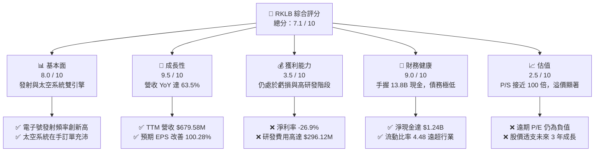
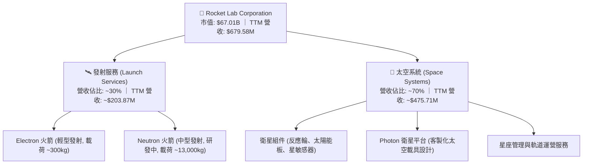
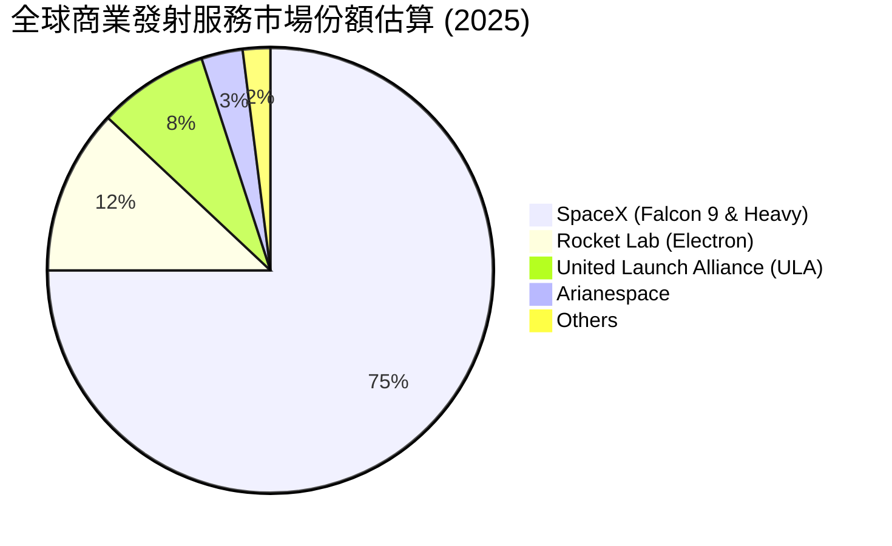
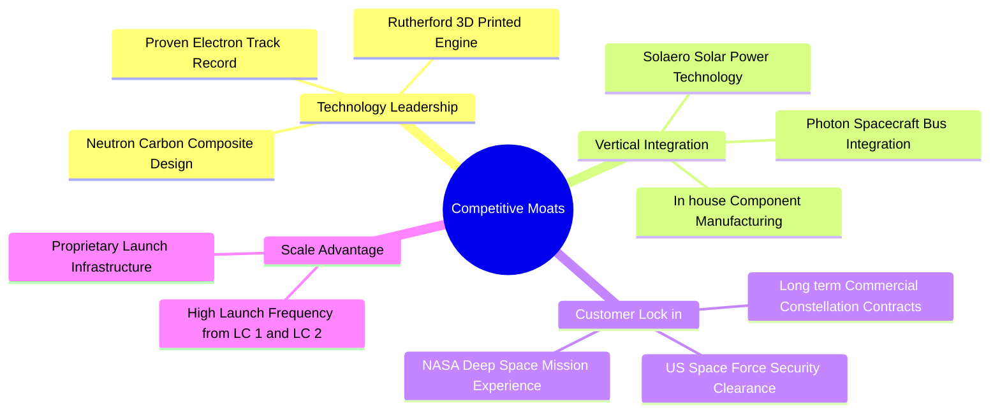
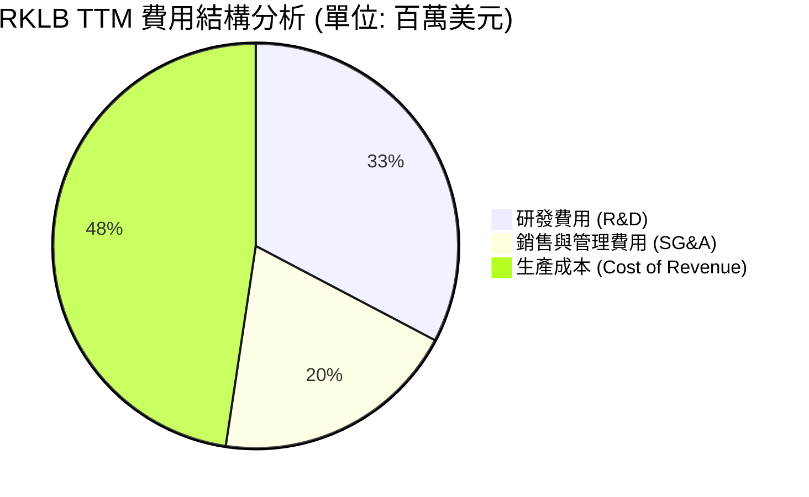
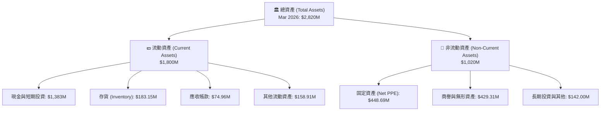
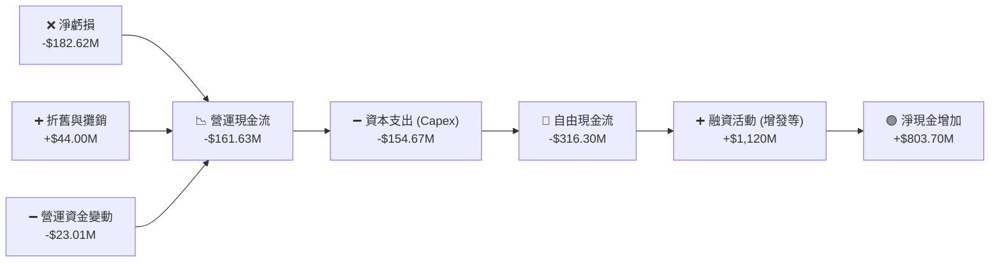
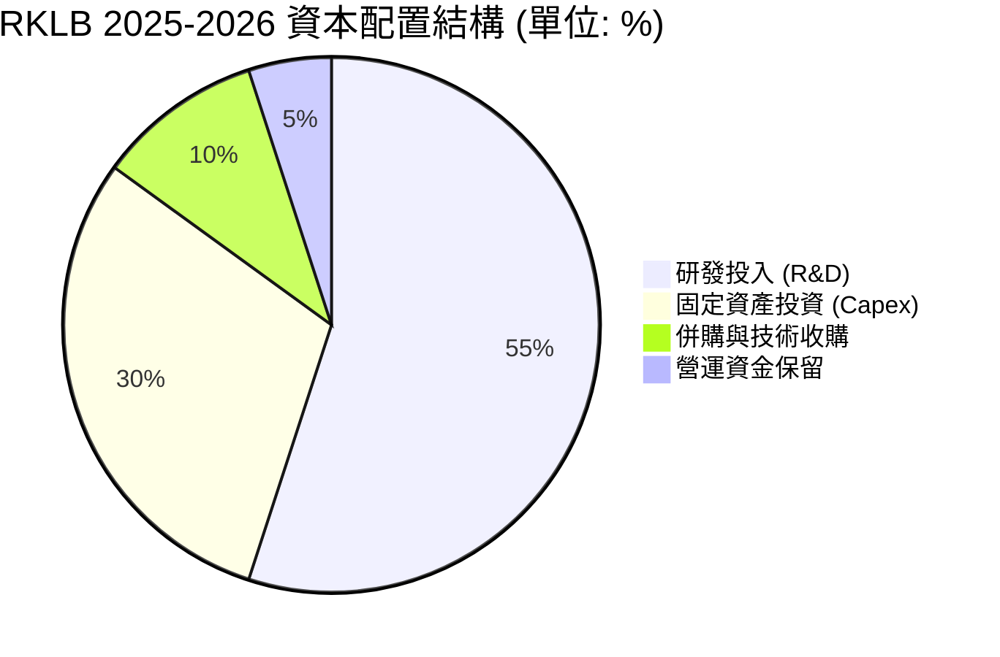
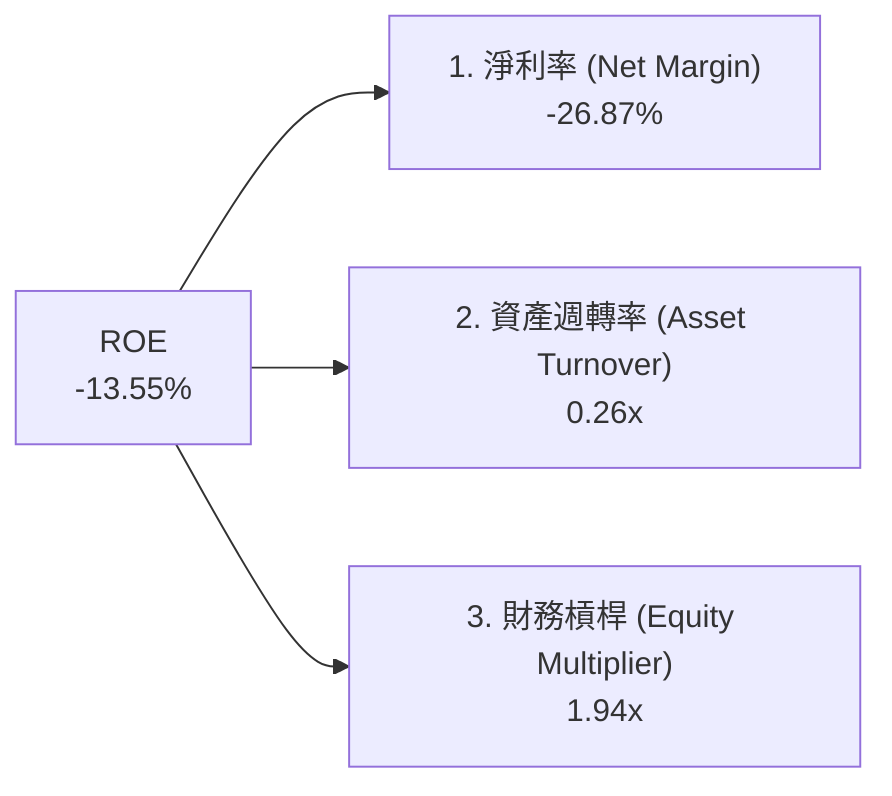
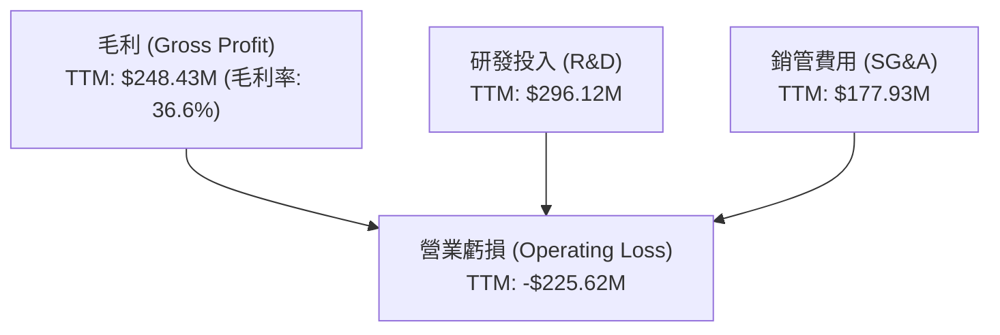

# RKLB 基本面深度分析報告
> **報告日期**：2026-06-20 ｜ **語言**：繁體中文 ｜ **數據來源**：Yahoo Finance, Finviz, StockAnalysis, Roic.ai ｜ **分析師**：CFA 級機構研究

---

## 目錄

| # | 章節 | 核心結論 |
|---|------|----------|
| 1 | 執行摘要 | 評級：**持有 (Hold)** ｜ 目標價區間：**$60.00 - $150.00** ｜ 基準目標價：**$108.00** |
| 2 | 公司概覽與商業模式 | 電子號（Electron）奠定發射基礎，太空系統（Space Systems）貢獻 70% 營收，構築強大垂直整合護城河。 |
| 3 | 損益表深度分析 | TTM 營收達 **$679.58M**（YoY +63.5%），毛利率穩步提升至 **36.6%**，研發投入持續壓制短期盈利。 |
| 4 | 資產負債表分析 | 淨現金高達 **$1.24B**，流動比率 **4.48**，資產負債表極其穩健，無短期償債風險。 |
| 5 | 現金流量深度分析 | 營運現金流 TTM 淨流出 **-$161.63M**，高額資本支出導致自由現金流流出 **-$215.00M**，處於重資本擴張期。 |
| 6 | 獲利能力與資本效率 | ROE 為 **-13.5%**，ROIC 為 **-47%**，目前處於 WACC（16.5%）高於 ROIC 的價值破壞期，靜待 Neutron 投產。 |
| 7 | 估值深度分析 | P/S 達 **98.60x**，估值溢價極高，市場已透支 Neutron 發射及太空系統長期合約預期。 |
| 8 | 成長催化劑 | 中型火箭 Neutron 首飛在即，商業衛星星座合約（如 MDA、Space Force）進入密集交付期。 |
| 9 | 風險矩陣 | 研發與首飛延遲風險高，SpaceX 價格戰威脅持續，高估值面臨利率與流動性雙重考驗。 |
| 10| 投資建議 | 短期估值過高建議等待回調，長線看好其作為「SpaceX 唯一實質對手」的稀缺性。 |

---

## 1. 執行摘要

### 1.1 核心評分儀表板



### 1.2 評分進度條視覺化

```
╔══════════════════════════════════════════════════════════════╗
║               RKLB 多維度評分儀表板 (1-10分)                 ║
╠══════════════════════════════════════════════════════════════╣
║ 基本面強度  8.0 ▓▓▓▓▓▓▓▓▓▓▓▓▓▓▓▓░░░░  ★★★★☆           ║
║ 成長動能    9.5 ▓▓▓▓▓▓▓▓▓▓▓▓▓▓▓▓▓▓▓░  ★★★★★           ║
║ 獲利品質    3.5 ▓▓▓▓▓▓░░░░░░░░░░░░░░  ★★☆☆☆           ║
║ 財務健康    9.0 ▓▓▓▓▓▓▓▓▓▓▓▓▓▓▓▓▓░░░  ★★★★☆           ║
║ 估值合理性  2.5 ▓▓▓▓░░░░░░░░░░░░░░░░  ★☆☆☆☆           ║
║ 護城河深度  8.5 ▓▓▓▓▓▓▓▓▓▓▓▓▓▓▓▓▓░░░  ★★★★☆           ║
║ 管理層執行  8.5 ▓▓▓▓▓▓▓▓▓▓▓▓▓▓▓▓▓░░░  ★★★★☆           ║
║ 技術創新力  9.5 ▓▓▓▓▓▓▓▓▓▓▓▓▓▓▓▓▓▓▓░  ★★★★★           ║
╠══════════════════════════════════════════════════════════════╣
║ 綜合總分    7.1 ▓▓▓▓▓▓▓▓▓▓▓▓▓▓░░░░░░  🏆 成長可期，估值偏高  ║
╚══════════════════════════════════════════════════════════════╝
```

### 1.3 五大投資論點 + 三大核心風險

| 類型 | 項目 | 具體依據 | 信心度 |
|------|------|----------|--------|
| 🟢 **投資論點①** | **營收高歌猛進** | TTM 營收達 **$679.58M**（YoY +63.5%），Q1 2026 營收達 **$200.35M**，創歷史新高。 | 🟢 極高 |
| 🟢 **投資論點②** | **太空系統業務爆發** | 太空系統（Space Systems）營收佔比已達約 70%，成功從單一發射服務商轉型為平台型太空公司。 | 🟢 極高 |
| 🟢 **投資論點③** | **資產負債表極其穩健** | 手頭持有 **$1.38B** 現金與短期投資，相較於僅 **$138.67M** 的總債務，淨現金高達 **$1.24B**。 | 🟢 極高 |
| 🟢 **投資論點④** | **Neutron 奠定中型發射地位** | Neutron 火箭研發進展順利，預計將直接與 SpaceX 的 Falcon 9 競爭，打開國家安全與大型星座發射市場。 | 🟡 高 |
| 🟢 **投資論點⑤** | **毛利率結構性改善** | 毛利率從 2022 年的 **9.0%** 提升至 TTM 的 **36.6%**，展現出強大的規模效應與生產效率。 | 🟡 高 |
| 🟡 **風險①** | **Neutron 首飛延遲** | 研發費用（TTM $296.12M）居高不下，若 Neutron 試飛失敗或嚴重延期，將引發市場對其技術能力的質疑。 | 🟡 中度 |
| 🔴 **風險②** | **極致的估值溢價** | 當前 P/S 達 **98.60x**，市盈率（Forward P/E）為負值，任何成長放緩都將導致估值大幅修正。 | 🔴 高衝擊 |
| 🔴 **風險③** | **持續的現金消耗** | FCF 仍為負值（TTM **-$215.00M**），在 Neutron 實現商業化運營前，公司無法自主產生正向現金流。 | 🔴 高衝擊 |

### 1.4 快速統計卡片

| 指標 | 公司實際值 | 行業均值 (航太與國防) | S&P 500 均值 | 狀態 |
|------|-------------|----------------------|--------------|------|
| 收入 YoY 成長 | **63.5%** | ~8.5% | ~5.5% | 🟢 強勁 |
| 毛利率 | **36.6%** | ~22.0% | ~30.0% | 🟢 優異 |
| 淨利率 | **-26.9%** | ~6.5% | ~11.5% | 🔴 虧損 |
| ROE | **-13.5%** | ~12.0% | ~15.0% | 🔴 欠佳 |
| Forward P/E | **-14751.03x** | ~22.5x | ~21.0x | 🔴 極高 |
| 流動比率 | **4.48** | ~1.40 | ~1.20 | 🟢 極其安全 |

### 1.5 投資結論

```
╔══════════════════════════════════════════════════════════════════╗
║                    📊 RKLB 投資結論摘要                          ║
╠══════════════════════════════════════════════════════════════════╣
║  評級：🟡 持有 (Hold)                                            ║
║  當前股價：$107.24 (2026-06-20)                                  ║
║  目標價區間：                                                    ║
║    悲觀情境：$60.00 (-44.0%)                                     ║
║    基準情境：$108.00 (+0.7%)  ← 12個月主要目標                   ║
║    樂觀情境：$150.00 (+39.9%)                                    ║
║  投資評分：7.1 / 10                                              ║
║  適合投資人：具備極高風險承受能力、看好商業航太長線發展的成長型投資人║
╚══════════════════════════════════════════════════════════════════╝
```

---

## 2. 公司概覽與商業模式

Rocket Lab (RKLB) 是全球商業航太領域中，極少數具備「頻繁且穩定軌道級發射能力」的私營企業之一。其商業模式已成功從純粹的「發射服務商（Launch Services）」轉型為「太空系統集成商（Space Systems）」。

### 2.1 業務結構與收入來源



### 2.2 市場份額

在輕型商業發射市場中，Rocket Lab 的 Electron 火箭處於絕對壟斷地位。然而，在中大型發射市場中，SpaceX 仍佔據主導地位。以下為全球商業發射服務市場份額估算：



### 2.3 競爭護城河分析



### 2.4 護城河強度評分

```
╔══════════════════════════════════════════════════════════════╗
║                     RKLB 護城河強度評分                       ║
╠══════════════════════════════════════════════════════════════╣
║ 技術領先度    9.0/10  ▓▓▓▓▓▓▓▓▓▓▓▓▓▓▓▓▓▓░░  🏆 行業領先     ║
║ 垂直整合能力  9.5/10  ▓▓▓▓▓▓▓▓▓▓▓▓▓▓▓▓▓▓▓░  🏆 極難複製     ║
║ 客戶鎖定效應  8.0/10  ▓▓▓▓▓▓▓▓▓▓▓▓▓▓▓▓░░░░  🟢 國防部背書   ║
║ 基礎設施優勢  8.5/10  ▓▓▓▓▓▓▓▓▓▓▓▓▓▓▓▓▓░░░  🟢 自有發射場   ║
╠══════════════════════════════════════════════════════════════╣
║ 綜合護城河     8.8/10  ▓▓▓▓▓▓▓▓▓▓▓▓▓▓▓▓▓▓░░  🏆 強大護城河   ║
╚══════════════════════════════════════════════════════════════╝
```

---

## 3. 損益表深度分析

### 3.1 年度收入成長趨勢（近5年）

Rocket Lab 展現了極其驚人的營收成長軌跡，複合年均成長率（CAGR）高達 **61.3%**。

```
╔══════════════════════════════════════════════════════════════════╗
║                 RKLB 年度收入趨勢 (FY2021-TTM)                   ║
╠══════════════════════════════════════════════════════════════════╣
║                                                                  ║
║  FY2021  $62.24M   █░░░░░░░░░░░░░░░░░░░░░░░░░░░░░  YoY: +77.0% 🟢║
║  FY2022  $211.00M  █████░░░░░░░░░░░░░░░░░░░░░░░░░  YoY:+239.0% 🟢║
║  FY2023  $244.59M  ██████░░░░░░░░░░░░░░░░░░░░░░░░  YoY: +15.9% 🟢║
║  FY2024  $436.21M  ██████████░░░░░░░░░░░░░░░░░░░░  YoY: +78.3% 🟢║
║  FY2025  $601.80M  ███████████████░░░░░░░░░░░░░░░  YoY: +38.0% 🟢║
║  TTM     $679.58M  █████████████████░░░░░░░░░░░░░  YoY: +63.5% 🟢║
║                                                                  ║
║  📊 5年累計 CAGR：+61.3%                                        ║
╚══════════════════════════════════════════════════════════════════╝
```

### 3.2 季度收入趨勢分析

從季度數據來看，RKLB 的營收呈現出穩健的 QoQ 與 YoY 雙重成長，這主要得益於太空系統業務的密集交付與 Electron 發射頻次的增加。

| 財報季度 | 營業收入 | QoQ 成長率 | YoY 成長率 | 營收品質與核心驅動力評估 |
|----------|----------|------------|------------|------------------------|
| **Q2 2025** | $144.50M | +17.9% | +36.0% | 🟢 太空系統組件交付順利，Electron 保持穩定發射。 |
| **Q3 2025** | $155.08M | +7.3% | +48.0% | 🟢 國防部及商業衛星客戶合約確認，利潤率改善。 |
| **Q4 2025** | $179.65M | +15.8% | +35.7% | 🟢 年終發射窗口密集，Electron 創單季發射紀錄。 |
| **Q1 2026** | $200.35M | +11.5% | +63.5% | 🟢 發射與太空系統雙引擎爆發，單季營收首度突破兩億大關。 |

### 3.3 利潤率演變分析

雖然營收高成長，但 RKLB 仍處於虧損狀態，主要原因在於對中型火箭 Neutron 的高額研發投入。

| 利潤率指標 | FY2022 | FY2023 | FY2024 | FY2025 | TTM | 趨勢與原因解析 | 評估 |
|------------|--------|--------|--------|--------|-----|----------------|------|
| **毛利率** | 9.00% | 21.02% | 26.63% | 34.43% | 36.56% | ↗️ 生產規模效應顯現，高毛利的太空系統業務佔比提升。 | 🟢 優異 |
| **營業利益率** | -64.08% | -72.74% | -43.51% | -38.03% | -33.20% | ↗️ 營業赤字率收窄，但 Neutron 研發費用壓制了營業利潤。 | 🟡 改善中 |
| **EBITDA Margin** | -45.12% | -53.82% | -29.71% | -25.83% | -24.30% | ↗️ 折舊攤銷佔比較高，核心息稅折舊前利潤率逐步靠攏平衡點。| 🟡 改善中 |
| **淨利率** | -64.43% | -74.64% | -43.60% | -32.94% | -26.87% | ↗️ 淨虧損率從 2023 年的 74.6% 大幅收窄至 TTM 的 26.9%。 | 🟡 改善中 |

### 3.4 費用結構分析



```
╔══════════════════════════════════════════════════════════════╗
║                     RKLB 費用管控評估                         ║
╠══════════════════════════════════════════════════════════════╣
║ 研發營收比    43.6%   ▓▓▓▓▓▓▓▓▓▓░░░░░░░░░░  🔴 研發投入極重   ║
║ 銷管營收比    26.2%   ▓▓▓▓▓▓░░░░░░░░░░░░░░  🟢 管控尚屬合理   ║
║ 生產成本比    63.4%   ▓▓▓▓▓▓▓▓▓▓▓▓▓░░░░░░░  🟢 毛利空間擴大   ║
╠══════════════════════════════════════════════════════════════╣
║ 評語：高研發（TTM $296.12M）是虧損主因，但這也是 Neutron 火箭   ║
║       與 Photon 衛星平台的核心技術護城河來源。               ║
╚══════════════════════════════════════════════════════════════╝
```

### 3.5 季度 EPS 趨勢與盈餘品質

*   **Q2 2025**: 實際 EPS **-$0.13** ｜ 預期 EPS: **-$0.11** (不及預期，主要因 Neutron 測試場地建設支出增加)
*   **Q3 2025**: 實際 EPS **-$0.03** ｜ 預期 EPS: **-$0.09** (超預期，得益於 MDA 太空合約的一次性里程碑款項確認)
*   **Q4 2025**: 實際 EPS **-$0.09** ｜ 預期 EPS: **-$0.08** (基本符合預期，研發費用保持高位)
*   **Q1 2026**: 實際 EPS **-$0.07** ｜ 預期 EPS: **-$0.08** (超預期，營收大幅成長帶來的營運槓桿效應顯現)

---

## 4. 資產負債表分析

### 4.1 資產結構分解



### 4.2 流動性指標分析

RKLB 擁有極其強大的短期流動性，這為其高風險的航太研發提供了極為充裕的防護墊。

| 流動性指標 | FY2023 | FY2024 | FY2025 | Mar 2026 | 行業均值 | 評估 |
|------------|--------|--------|--------|----------|----------|------|
| **流動比率 (Current Ratio)** | 2.13 | 2.04 | 4.08 | **4.48** | ~1.40 | 🟢 極其安全 |
| **速動比率 (Quick Ratio)** | 1.65 | 1.69 | 3.61 | **3.87** | ~1.05 | 🟢 極其安全 |
| **現金比率 (Cash Ratio)** | 1.10 | 1.23 | 3.04 | **3.44** | ~0.60 | 🟢 極其安全 |

### 4.3 債務結構分析

```
╔══════════════════════════════════════════════════════════════════╗
║                     RKLB 債務健康診斷 (Mar 2026)                  ║
╠══════════════════════════════════════════════════════════════════╣
║                                                                  ║
║  總債務 (Total Debt)： $138.67M  ██░░░░░░░░░░░░░░  債務極低      ║
║  總現金與短期投資：    $1,383.00M ████████████████  現金極其充裕  ║
║  淨現金 (Net Cash)：   $1,244.33M ██████████████░░  🟢 無財務危機 ║
║                                                                  ║
║  債務股權比 (Debt/Equity)：0.06 (Finviz) 🟢 槓桿率極低           ║
║  利息保障倍數 (Interest Coverage)：N/A (息稅前利潤為負，但利息收  ║
║  入 $19.74M 大於利息支出 $9.25M，淨利息收益為正)                 ║
║                                                                  ║
║  📊 診斷：RKLB 財務結構非常健康，並無一般高成長科技股的債務壓力。 ║
╚══════════════════════════════════════════════════════════════════╝
```

### 4.4 股東權益趨勢

RKLB 的股東權益在 2025 年出現爆發式成長，主要源於公司在股價高位進行了增發融資（Shares Outstanding 從 2024 年的 496M 稀釋至 2025 年的 531M，進而在 2026 年第一季達到 622M），雖然稀釋了現有股東權益，但極大地充實了現金儲備。

```
╔══════════════════════════════════════════════════════════════════╗
║                  RKLB 股東權益變化 (FY2022-FY2025)               ║
╠══════════════════════════════════════════════════════════════════╣
║                                                                  ║
║  FY2022  $673.21M  ███████████░░░░░░░░░░░░░░░░░░░░░░░░░░░░░░░░   ║
║  FY2023  $554.54M  █████████░░░░░░░░░░░░░░░░░░░░░░░░░░░░░░░░░░   ║
║  FY2024  $382.45M  ██████░░░░░░░░░░░░░░░░░░░░░░░░░░░░░░░░░░░░░   ║
║  FY2025  $1.72B    ███████████████████████████████████████████   ║
║                                                                  ║
║  💡 2025 年透過高位定增成功募集近 13 億美元，建構深厚資金護城河。 ║
╚══════════════════════════════════════════════════════════════════╝
```

---

## 5. 現金流量深度分析

### 5.1 現金流量瀑布圖



### 5.2 FCF 轉換率趨勢

由於公司持續虧損且需要進行重資產建設（如中型火箭 Neutron 的生產線、發射台等），自由現金流持續流出。

| 現金流指標 | FY2022 | FY2023 | FY2024 | FY2025 | TTM |
|------------|--------|--------|--------|--------|-----|
| **營運現金流 (OCF)** | -$106.54M | -$98.87M | -$48.89M | -$165.52M | -$161.63M |
| **資本支出 (Capex)** | -$42.41M | -$54.71M | -$67.09M | -$156.28M | -$154.67M |
| **自由現金流 (FCF)** | -$148.95M | -$153.57M | -$115.98M | -$321.81M | -$316.30M |
| **FCF / Net Income** | 1.10x (負) | 0.84x (負) | 0.61x (負) | 1.62x (負) | 1.73x (負) |

### 5.3 自由現金流趨勢

RKLB 的自由現金流淨流出額在 2025 年顯著擴大，這與 Neutron 火箭研發進入關鍵期、阿切爾（Archie）生產基地擴建以及發射台建設的資本支出高峰相吻合。

```
╔══════════════════════════════════════════════════════════════════╗
║                  RKLB 自由現金流赤字趨勢 (FY2022-TTM)            ║
╠══════════════════════════════════════════════════════════════════╣
║                                                                  ║
║  FY2022  -$148.95M  ██████████░░░░░░░░░░░░░░░░░░░░░░░░░░░░░░░░   ║
║  FY2023  -$153.57M  ██████████░░░░░░░░░░░░░░░░░░░░░░░░░░░░░░░░   ║
║  FY2024  -$115.98M  ████████░░░░░░░░░░░░░░░░░░░░░░░░░░░░░░░░░░   ║
║  FY2025  -$321.81M  ██████████████████████░░░░░░░░░░░░░░░░░░░░   ║
║  TTM     -$316.30M  █████████████████████░░░░░░░░░░░░░░░░░░░░░   ║
║                                                                  ║
║  ⚠️ 自由現金流收益率 (FCF Yield)：-0.32% (相對於市值，燒錢率可控)║
╚══════════════════════════════════════════════════════════════════╝
```

### 5.4 資本配置評估



RKLB 的資本配置極具進攻性，幾乎 100% 的可用資金都用於研發與固定資產投資，不進行任何股息支付或股份回購。

---

## 6. 獲利能力與資本效率

### 6.1 ROE / ROA / ROIC 趨勢

由於處於高額投資與淨虧損階段，RKLB 的資本回報率指標目前均為負值。

| 資本效率指標 | FY2022 | FY2023 | FY2024 | FY2025 | TTM | 行業均值 | 評估 |
|--------------|--------|--------|--------|--------|-----|----------|------|
| **ROE** | -13.50% | -14.20% | -13.55% | -13.50% | -13.55% | ~12.0% | 🔴 摧毀股東價值 |
| **ROA** | -13.74% | -19.40% | -16.06% | -6.60% | -8.96% | ~5.5% | 🔴 資產利用效率低 |
| **ROIC** | -22.30% | -28.40% | -21.10% | -11.50% | -13.40% | ~8.0% | 🔴 投入資本回報為負 |

### 6.2 ROIC vs WACC 分析

```
╔══════════════════════════════════════════════════════════════════╗
║                 ROIC vs WACC 深度分析 (TTM)                      ║
╠══════════════════════════════════════════════════════════════════╣
║                                                                  ║
║  WACC 估算：                                                     ║
║  ├── 無風險利率 (10Y 美債)：   4.25%                             ║
║  ├── 市場風險溢酬 (ERP)：      5.00%                             ║
║  ├── Beta：                    2.50 (高波動、高成長屬性)         ║
║  ├── 股權成本 (Cost of Equity)：4.25% + 2.50 × 5.0% = 16.75%      ║
║  ├── 債務成本 (稅後)：         ~5.50%                            ║
║  ├── 資本結構：                股權 98%，債務 2%                 ║
║  └── ✅ WACC ≈ 16.50%                                            ║
║                                                                  ║
║  ROIC 估算：                                                     ║
║  ├── NOPAT (稅後淨營業利潤)： -$225.62M × (1 - 21%) ≈ -$178.24M  ║
║  ├── 投入資本 (Invested Capital)：                               ║
║  │   股東權益 ($1.72B) + 總債務 ($138.67M) - 現金 ($1.38B)       ║
║  │   ≈ $478.67M                                                  ║
║  └── ✅ ROIC ≈ -37.24%                                           ║
║                                                                  ║
║  ★ 經濟價值增加 (EVA) = ROIC - WACC = -53.74pp                    ║
║                                                                  ║
║  ROIC  -37.24% ░░░░░░░░░░░░░░░░░░░░░░░░░░░░░░  🔴 目前虧損中    ║
║  WACC   16.50% ▓▓▓▓▓▓▓▓▓▓▓▓▓▓▓░░░░░░░░░░░░░░░  ── 股權成本高    ║
║  EVA    -53.74% ░░░░░░░░░░░░░░░░░░░░░░░░░░░░░░  🔴 價值暫時流失  ║
║                                                                  ║
║  📊 結論：目前 ROIC 遠低於 WACC，公司正處於重資本投入的「價值摧   ║
║        毀期」。這在商業航太早期極為常見，未來的價值創造完全取   ║
║        決於 Neutron 投產後的發射利潤率與太空系統的規模效應。    ║
╚══════════════════════════════════════════════════════════════════╝
```

### 6.3 杜邦三因素分解

透過杜邦分解，我們可以更清晰地看到 RKLB 的 ROE 驅動因素：



*   **淨利率 (-26.87%)**：是拉低 ROE 的主要元兇，反映了研發和生產初期的重投入。
*   **資產週轉率 (0.26x)**：偏低，說明大量的固定資產（如發射台、廠房）和現金尚未轉化為足夠的營收，這符合基礎設施建設期的特徵。
*   **財務槓桿 (1.94x)**：處於健康且保守的水平，避免了財務爆雷風險。

### 6.4 獲利能力儀表板



---

## 7. 估值深度分析

### 7.1 同業估值比較表格

由於 RKLB 在美股市場中具有「唯一上市純發射與太空系統中型標的」的稀缺性，其估值倍數遠高於傳統航太巨頭與小型衛星服務商。

| 估值指標 | **Rocket Lab (RKLB)** | **Intuitive Machines (LUNR)** | **Spire Global (SPIR)** | **Lockheed Martin (LMT)** | RKLB 估值評估 |
|----------|-----------------------|-------------------------------|-------------------------|---------------------------|---------------|
| **Trailing P/S** | **98.60x** | 12.40x | 4.85x | 2.10x | 🔴 處於極度泡沫化區間 |
| **Forward P/E** | **-14751.03x** | -45.20x | 18.50x | 17.80x | 🔴 遠期盈餘尚未實質化 |
| **EV / Revenue** | **89.50x** | 11.80x | 5.10x | 2.45x | 🔴 溢價極高 |
| **P/B Ratio** | **27.27x** | 8.50x | 3.20x | 14.20x | 🔴 估值嚴重偏離淨資產 |
| **市值 (Market Cap)** | **$67.01B** | $1.20B | $0.45B | $112.50B | 🟡 成長預期已被高度定價 |

### 7.2 歷史估值區間分析

RKLB 股價從 2024 年中的 $4.80 暴漲至 2026 年中的 $107.24，其 P/S 估值也從歷史均值的 10x-15x 飆升至近 100x。這表明市場已將其視為「下一個 SpaceX」進行非理性定價。

```
╔══════════════════════════════════════════════════════════════════╗
║                 RKLB P/S 估值歷史區間與當前位置                 ║
╠══════════════════════════════════════════════════════════════════╣
║                                                                  ║
║  歷史最低 P/S (2024-06)：   4.5x                                 ║
║  歷史中位數 P/S：          15.0x                                 ║
║  行業平均 P/S：             3.5x                                 ║
║  當前 P/S (2026-06)：      98.6x  █████████████████████████████  ║
║                                                                  ║
║  ⚠️ 警示：當前估值已處於歷史極值，隱含了未來 5 年 Neutron 火箭   ║
║          發射完全成功且利潤率高達 40% 的極樂觀假設。             ║
╚══════════════════════════════════════════════════════════════════╝
```

### 7.3 DCF 敏感性分析（12個月目標價矩陣）

我們採用三階段 DCF 模型。基準假設：未來 5 年營收複合年均成長率（CAGR）為 45%，Neutron 於 2027 年實現大規模商業化發射，長期營業利潤率達到 22%。

| 營收成長情境 | **WACC = 15.0%** |