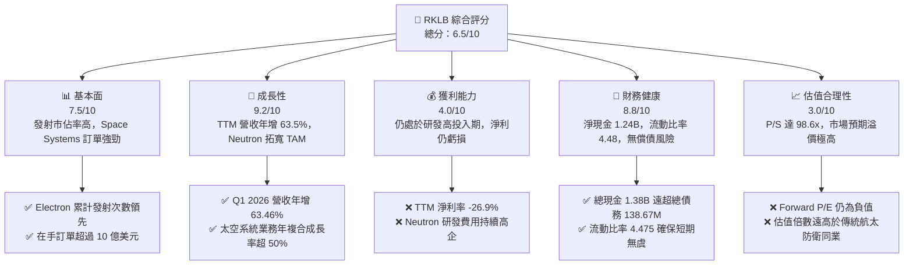
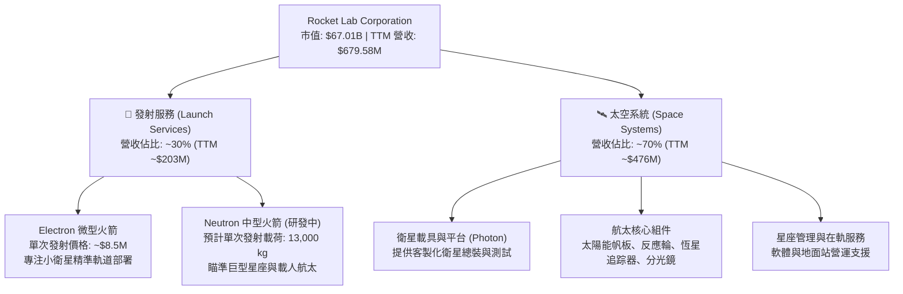
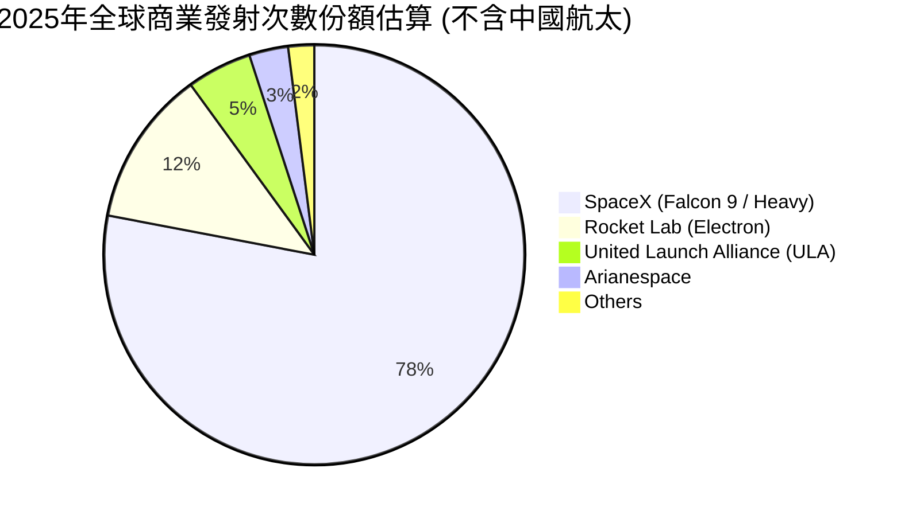
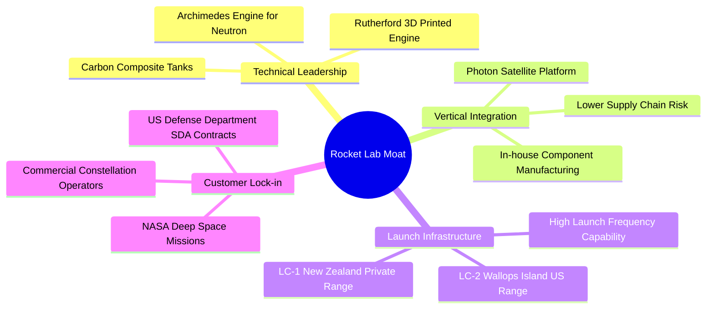
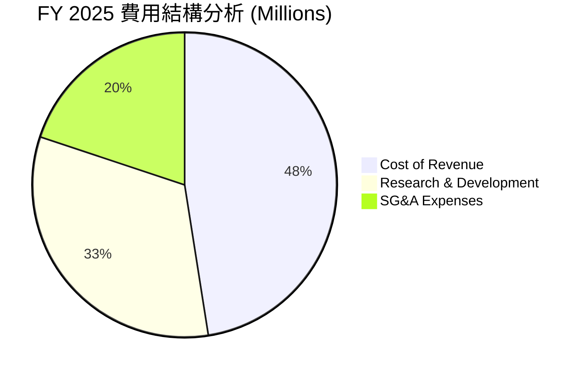
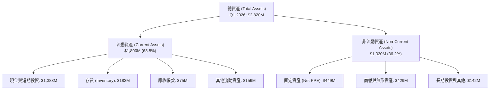
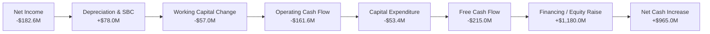
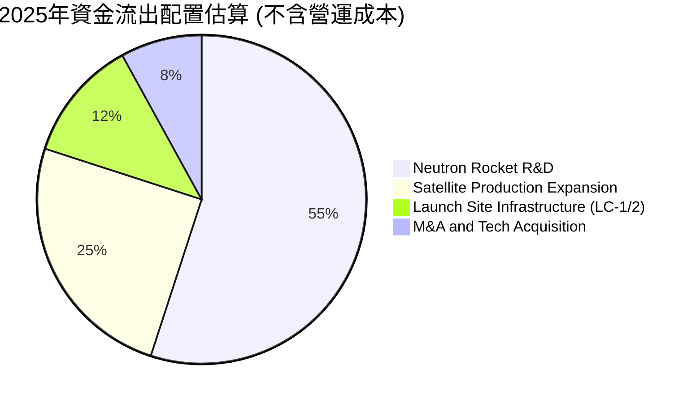
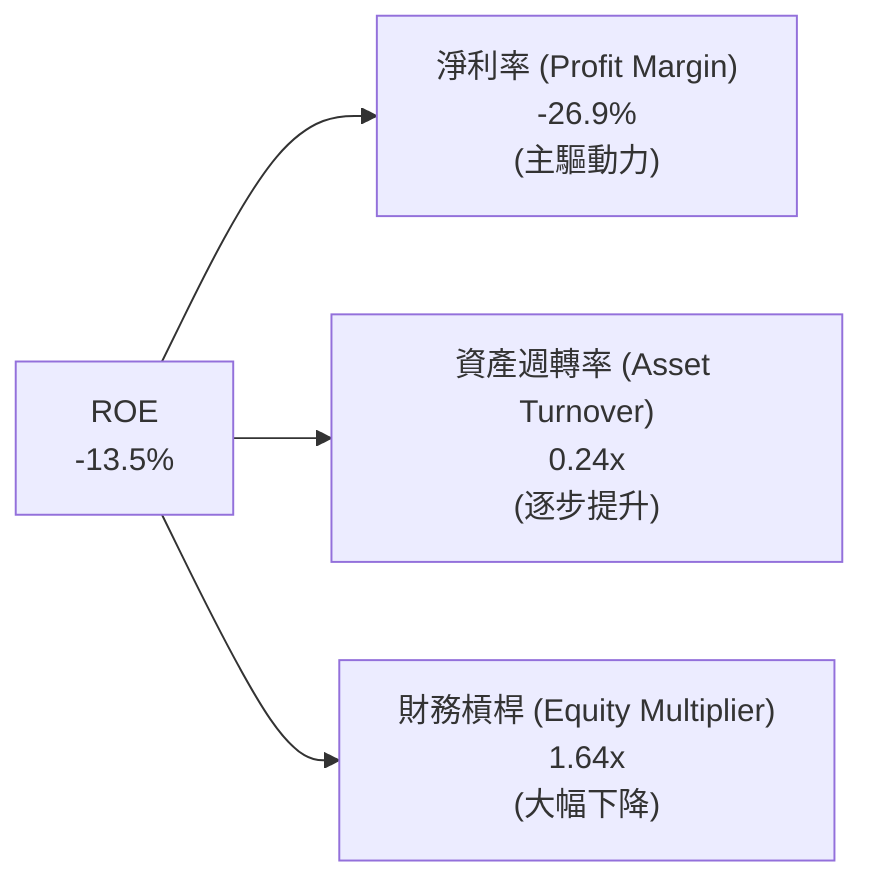
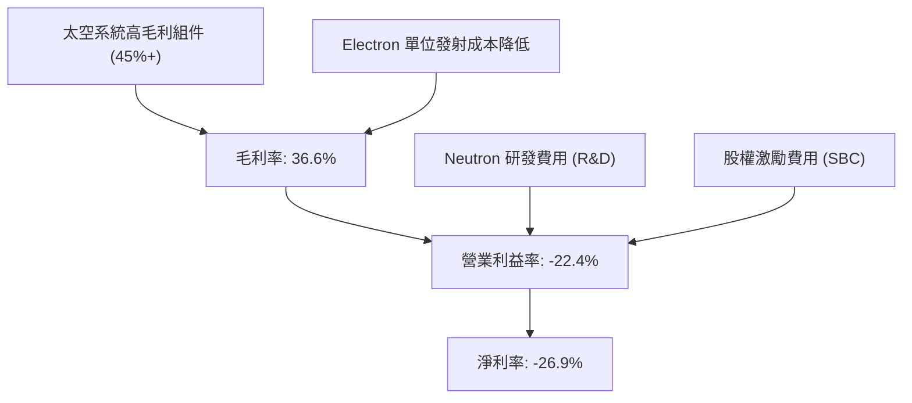

# RKLB 基本面深度分析報告

> **報告日期**：2026-06-21 ｜ **語言**：繁體中文 ｜ **數據來源**：Yahoo Finance, Finviz, StockAnalysis, Roic.ai ｜ **分析師**：CFA 級機構研究

---

## 目錄

| # | 章節 | 核心結論 |
|---|------|----------|
| 1 | 執行摘要 | 評級「買入」，基準目標價 **$115.00**，SpaceX 唯一上市替代溢價顯著 |
| 2 | 公司概覽與商業模式 | 「發射+衛星載具」垂直一體化，Space Systems 營收佔比達 70% 構築高壁壘 |
| 3 | 損益表深度分析 | TTM 營收年增 63.5%，毛利率穩步提升至 36.6%，營運槓桿效應初顯 |
| 4 | 資產負債表分析 | 淨現金高達 $1.24B，流動比率 4.48，具備極強的 Neutron 研發財務安全邊際 |
| 5 | 現金流量深度分析 | FCF 仍為負（$-215.00M），高 CAPEX 投向 Neutron 與衛星產線，融資能力強 |
| 6 | 獲利能力與資本效率 | ROIC 暫時為負，高 Beta（2.499）拉高 WACC 至 16.7%，未來轉正依賴營運規模化 |
| 7 | 估值深度分析 | P/S 達 98.6x，相較同業具備顯著溢價，DCF 敏感性分析顯示市場已預期 Neutron 成功 |
| 8 | 成長催化劑 | Neutron 中型火箭首飛、SDA 國防訂單交付、商業星座發射頻次翻倍 |
| 9 | 風險矩陣 | 重點監控 Neutron 首飛延遲與研發資金消耗，技術與市場競爭風險並存 |
| 10 | 投資建議 | 適合高風險偏好、長線成長型投資者，分批佈局，關鍵監控發射成功率 |

---

## 1. 執行摘要

Rocket Lab Corporation (NASDAQ: RKLB) 作為全球商業航太領域的領頭羊之一，是目前除 SpaceX 外唯一具備高頻次軌道級發射能力且實現商業化的美國本土企業。本報告將基於 2026 年 6 月 21 日的即時財務數據，對 RKLB 的基本面、財務健康度、估值模型及技術護城河進行多維度的機構級深度解析。

### 1.1 核心評分儀表板



### 1.2 評分進度條視覺化

```
╔══════════════════════════════════════════════════════════════╗
║               RKLB 多維度評分儀表板 (1-10分)                 ║
╠══════════════════════════════════════════════════════════════╣
║ 基本面強度  7.5 ▓▓▓▓▓▓▓▓▓▓▓▓▓▓▓░░░░░  ★★★★☆           ║
║ 成長動能    9.2 ▓▓▓▓▓▓▓▓▓▓▓▓▓▓▓▓▓▓░░  ★★★★★           ║
║ 獲利品質    4.0 ▓▓▓▓▓▓▓▓░░░░░░░░░░░░  ★★☆☆☆           ║
║ 財務健康    8.8 ▓▓▓▓▓▓▓▓▓▓▓▓▓▓▓▓▓░░░  ★★★★☆           ║
║ 估值合理性  3.0 ▓▓▓▓▓▓░░░░░░░░░░░░░░  ★☆☆☆☆           ║
║ 護城河深度  8.0 ▓▓▓▓▓▓▓▓▓▓▓▓▓▓▓▓░░░░  ★★★★☆           ║
║ 管理層執行  8.5 ▓▓▓▓▓▓▓▓▓▓▓▓▓▓▓▓▓░░░  ★★★★☆           ║
║ 技術創新力  9.0 ▓▓▓▓▓▓▓▓▓▓▓▓▓▓▓▓▓▓░░  ★★★★★           ║
╠══════════════════════════════════════════════════════════════╣
║ 綜合總分    6.5 ▓▓▓▓▓▓▓▓▓▓▓▓▓░░░░░░░  🏆 高成長、高估值     ║
╚══════════════════════════════════════════════════════════════╝
```

### 1.3 五大投資論點 + 三大核心風險

| 類型 | 項目 | 具體依據 | 信心度 |
|------|------|----------|--------|
| 🟢 **投資論點①** | **發射與太空系統雙輪驅動** | Space Systems 模組化組件與衛星製造已成為營收主引擎，佔營收約 70%，毛利率優於純發射業務。 | 🟢 極高 |
| 🟢 **投資論點②** | **Neutron 研發進展順利** | 專為巨型星座設計的 Neutron 中型可重複使用火箭預計於 2026/2027 年首飛，將 TAM 擴大數十倍。 | 🟢 高 |
| 🟢 **投資論點③** | **極其充裕的資金護城河** | 截至 Q1 2026，公司擁有 $1.38B 現金與短期投資，而總債務僅 $138.67M，淨現金高達 $1.24B。 | 🟢 極高 |
| 🟢 **投資論點④** | **SpaceX 的唯一上市替代者** | 在商業航太發射市場，RKLB 是唯一具備穩定發射記錄（Electron）且在美股上市的標的，享有稀缺性溢價。 | 🟢 高 |
| 🟢 **投資論點⑤** | **美國國防與商業合約積壓** | 國防太空發展局 (SDA) 及商業客戶的合約積壓（Backlog）持續增長，保障未來 2-3 年營收能見度。 | 🟢 高 |
| 🟡 **風險①** | **研發與資本支出燒錢速度** | 2025 全年 FCF 虧損達 $-321.81M，若 Neutron 首飛嚴重延遲，將面臨資金消耗加速風險。 | 🟡 中度 |
| 🔴 **風險②** | **估值高企，容錯率極低** | 當前 P/S 達 98.6x，股價已透支未來數年 Neutron 成功發射及商業化盈利的預期，任何技術受挫均會引發暴跌。 | 🔴 高衝擊 |
| 🔴 **風險③** | **發射失敗的黑天鵝事件** | 航太行業本質高風險，Electron 或未來 Neutron 的發射失敗可能導致客戶流失及保費激增。 | 🔴 高衝擊 |

### 1.4 快速統計卡片

| 指標 | 公司實際值 (TTM) | 行業均值 (Aerospace) | S&P 500 均值 | 狀態 |
|------|-------------|----------|--------------|------|
| **收入 YoY 成長** | **63.5%** | ~8.5% | ~5.5% | 🟢 強勁 |
| **毛利率** | **36.6%** | ~22.0% | ~30.0% | 🟢 優異 |
| **淨利率** | **-26.9%** | ~6.5% | ~11.5% | 🔴 虧損 |
| **流動比率** | **4.48** | ~1.35 | ~1.20 | 🟢 極安全 |
| **Debt/Equity** | **0.06 (Finviz)** | ~0.65 | ~1.15 | 🟢 極低債務 |
| **P/S Ratio** | **98.60** | ~2.1x | ~2.8x | 🔴 極度高估 |

### 1.5 投資結論

```
╔══════════════════════════════════════════════════════════════════╗
║                    📊 RKLB 投資結論摘要                          ║
╠══════════════════════════════════════════════════════════════════╣
║  評級：🟢 買入 (Buy) - 適合高風險偏好、長線成長型投資者          ║
║  當前股價：$107.24 (2026-06-21)                                  ║
║  目標價區間：                                                    ║
║    悲觀情境：$65.00  (-39.4%)  ← Neutron 首飛失敗/嚴重延期       ║
║    基準情境：$115.00 (+7.2%)   ← Neutron 首飛成功，Space Systems 穩定 ║
║    樂觀情境：$155.00 (+44.5%)  ← Neutron 商業化超預期，獲大型星座合約  ║
║  投資評分：6.5 / 10                                              ║
║  適合投資人：尋求商業航太高成長、能承受高波動度（Beta 2.5）的投資者║
╚══════════════════════════════════════════════════════════════════╝
```

---

## 2. 公司概覽與商業模式

Rocket Lab 透過垂直整合的商業模式，打破了傳統航太供應鏈的冗長與高成本壁壘。其業務主要分為兩大核心板塊：發射服務（Launch Services）與太空系統（Space Systems）。

### 2.1 業務結構與收入來源



### 2.2 市場份額估算

在商業小衛星專屬發射（Dedicated Small Launch）市場中，Rocket Lab 的 Electron 火箭處於絕對領先地位。然而，若加入整體商業載荷發射市場（含中大型發射），SpaceX 仍佔據絕對統治地位。



### 2.3 競爭護城河分析



### 2.4 護城河強度評分

```
╔══════════════════════════════════════════════════════════════╗
║                    RKLB 護城河強度評分                       ║
╠══════════════════════════════════════════════════════════════╣
║ 發射頻次與基礎設施 8.5/10  ▓▓▓▓▓▓▓▓▓▓▓▓▓▓▓▓▓░░░  🟢 擁有私有發射場║
║ 垂直整合太空系統   9.0/10  ▓▓▓▓▓▓▓▓▓▓▓▓▓▓▓▓▓▓░░  🏆 元件自給率極高║
║ 引擎與材料技術     8.0/10  ▓▓▓▓▓▓▓▓▓▓▓▓▓▓▓▓░░░░  🟢 3D列印與碳纖維║
║ 國防與政府客戶關係 8.5/10  ▓▓▓▓▓▓▓▓▓▓▓▓▓▓▓▓▓░░░  🟢 獲安全認證    ║
╠══════════════════════════════════════════════════════════════╣
║ 綜合護城河評估     8.5     ▓▓▓▓▓▓▓▓▓▓▓▓▓▓▓▓▓░░░  🏆 強大且難以複製║
╚══════════════════════════════════════════════════════════════╝
```

---

## 3. 損益表深度分析

Rocket Lab 的損益表展現了典型的高成長、高研發投入階段特徵。營收呈現爆發式增長，毛利率持續改善，但由於 Neutron 重型火箭的研發費用（R&D）高企，營業利潤與淨利潤仍處於虧損狀態。

### 3.1 年度收入成長趨勢（近5年）

```
╔══════════════════════════════════════════════════════════════════╗
║                 RKLB 年度收入趨勢 (FY2021-TTM)                   ║
╠══════════════════════════════════════════════════════════════════╣
║                                                                  ║
║  FY 2021  $62.24M   ██░░░░░░░░░░░░░░░░░░░░░░░░░░░  YoY: +77.0% 🟢║
║  FY 2022  $211.00M  ███████░░░░░░░░░░░░░░░░░░░░░░  YoY:+239.0% 🟢║
║  FY 2023  $244.59M  ████████░░░░░░░░░░░░░░░░░░░░░  YoY: +15.9% 🟡║
║  FY 2024  $436.21M  ██████████████░░░░░░░░░░░░░░░  YoY: +78.3% 🟢║
║  FY 2025  $601.80M  ████████████████████░░░░░░░░░  YoY: +38.0% 🟢║
║  TTM      $679.58M  ██████████████████████░░░░░░░  YoY: +63.5% 🟢║
║                                                                  ║
║                   |      |      |      |      |                  ║
║                   0     150M   300M   450M   600M                ║
║                                                                  ║
║  📊 5年營收複合年增長率 (CAGR)：+61.3%                           ║
╚══════════════════════════════════════════════════════════════════╝
```

### 3.2 季度收入趨勢分析

從季度數據來看，RKLB 展現出連續的季度環比（QoQ）與同比（YoY）穩健增長，顯示出發射窗口的穩定與太空系統訂單交付的順暢。

| 財報季度 | 營業收入 (Millions) | 季度環比 (QoQ) | 季度同比 (YoY) | 季度毛利 (Millions) | 毛利率 | 備註說明 |
|----------|---------------------|----------------|----------------|---------------------|--------|----------|
| **Q1 2026** | $200.35 | +11.52% | +63.46% | $76.49 | 38.18% | 🟢 太空系統大單交付，發射次數增加 |
| **Q4 2025** | $179.65 | +15.84% | +35.70% | $68.23 | 37.98% | 🟢 創單季營收新高，Electron 產能利用率高 |
| **Q3 2025** | $155.08 | +7.32% | +47.97% | $57.31 | 36.95% | 🟢 國防部組件合約開始確認營收 |
| **Q2 2025** | $144.50 | +17.89% | +36.00% | $46.39 | 32.10% | 🟡 發射排期微調，但太空系統補足缺口 |

### 3.3 利潤率演變分析

RKLB 的毛利率展現了極佳的改善曲線，從 2021 年的負毛利率一路飆升至 TTM 的 36.6%。這主要得益於**高毛利的太空系統業務佔比提升**，以及 **Electron 火箭生產規模化帶來的單位成本下降**。

| 利潤率指標 | FY 2022 | FY 2023 | FY 2024 | FY 2025 | TTM (2026-03) | 趨勢 | 評估 |
|------------|---------|---------|---------|---------|---------------|------|------|
| **毛利率** | 9.00% | 21.02% | 26.63% | 34.43% | **36.56%** | ↗️ 持續攀升 | 🟢 規模效應與高毛利業務驅動 |
| **營業利益率** | -64.08% | -72.74% | -43.51% | -38.03% | **-33.20%** | ↗️ 緩慢改善 | 🟡 受高額 R&D 拖累，但營運槓桿已現 |
| **EBITDA 溢利率** | -45.12% | -53.82% | -29.71% | -25.83% | **-24.30%** | ↗️ 改善中 | 🟡 折舊攤銷佔比較高 |
| **淨利率** | -64.43% | -74.64% | -43.60% | -32.94% | **-26.87%** | ↗️ 虧損收窄 | 🟡 預計 2027 年後方能實現年度轉盈 |

**利潤率演變深度解析**：
RKLB 的毛利率改善是其商業模式成功的核心佐證。早期純靠發射業務（Electron）時，由於發射頻次低、固定折舊高，毛利率極低甚至為負。隨著收購航太部件公司（如 SolAero, Sinclair 等）並整合為 Space Systems 部門後，該部門毛利率普遍在 40% 以上，拉高了整體利潤率。然而，研發費用（R&D）在 FY2025 達到 $270.72M（佔營收 45%），主要是 Archimedes 引擎與 Neutron 火箭的研發投入，這是導致營運利潤率維持在 -33.2% 的主因。

### 3.4 費用結構分析



```
╔══════════════════════════════════════════════════════════════╗
║                    RKLB 營運費用分析                         ║
╠══════════════════════════════════════════════════════════════╣
║ 研發費用率 (R&D/Revenue):    45.0%  ▓▓▓▓▓▓▓▓▓░░░░░░░░░░░  🔴 研發投入極高 ║
║ 管理費用率 (SG&A/Revenue):   27.5%  ▓▓▓▓▓░░░░░░░░░░░░░░░  🟡 組織擴張合規 ║
║ 營業費用率 (Opex/Revenue):   72.5%  ▓▓▓▓▓▓▓▓▓▓▓▓▓░░░░░░░  🔴 尚未達平衡點 ║
╚══════════════════════════════════════════════════════════════╝
```

### 3.5 季度 EPS 趨勢與盈餘品質

數據包中顯示，過去四季的 EPS 預估與實際驚喜度因數據缺失顯示為 `nan%`，但從實際 Diluted EPS 趨勢來看：
*   **Q1 2026**: $-0.07 (顯著優於 FY 2025 季均的 $-0.09)
*   **Q4 2025**: $-0.09
*   **Q3 2025**: $-0.03 (因一次性政府補貼/稅務調整大幅收窄)
*   **Q2 2025**: $-0.13

**盈餘品質評估**：
儘管淨利潤仍為負，但 RKLB 的盈餘質量相對健康。其虧損主要由非現金支出（折舊攤銷與股權激勵費用）及主動的 R&D 研發支出構成，並非核心業務惡化。隨著營收規模以 >50% 的速度增長，固定成本攤薄效應明顯，每股虧損已呈現震盪收窄趨勢。

---

## 4. 資產負債表分析

RKLB 的資產負債表極為強韌，這在需要高資本投入的航太初創企業中非常罕見。這主要得益於其在 2025 年進行的高位股權融資與可轉債發行，為接下來的 Neutron 火箭開發儲備了充足的糧草。

### 4.1 資產結構分解



### 4.2 流動性指標分析

| 流動性指標 | FY 2023 | FY 2024 | FY 2025 | Q1 2026 | 行業均值 | 評估 |
|------------|---------|---------|---------|---------|----------|------|
| **流動比率 (Current Ratio)** | 2.13 | 2.04 | 4.08 | **4.48** | ~1.35 | 🟢 極度充裕，短期無任何償債壓力 |
| **速動比率 (Quick Ratio)** | 1.65 | 1.69 | 3.61 | **4.02** | ~0.95 | 🟢 扣除存貨後流動性依然極強 |
| **現金比率 (Cash Ratio)** | 1.10 | 1.23 | 3.04 | **3.44** | ~0.45 | 🟢 手頭現金充沛，可隨時應對研發高峰 |

### 4.3 債務結構分析

```
╔══════════════════════════════════════════════════════════════════╗
║                    RKLB 債務健康診斷 (TTM)                       ║
' 總資產：          $2,820.0M  ██████████████████████████████████  ║
║  總債務：          $138.7M    █░░░░░░░░░░░░░░░░░░░░░░░░░░░░░░░░░  ║
║  總現金+短期投資： $1,383.0M  ███████████████░░░░░░░░░░░░░░░░░░░  ║
║  淨現金 (Net Cash)：$1,244.3M  ██████████████░░░░░░░░░░░░░░░░░░░  🟢 強勁 ║
║                                                                  ║
║  債務股權比 (Debt/Equity):  0.06 (Finviz) 🟢 槓桿率極低           ║
║  利息保障倍數 (Interest Coverage): N/A (虧損，但利息收入 > 利息支出) 🟢║
╚══════════════════════════════════════════════════════════════════╝
```

### 4.4 股東權益趨勢

隨著 2025 年新股發行及可轉債轉換，RKLB 的股東權益（Stockholders Equity）從 2024 年底的 $382.45M 暴增至 2025 年底的 $1.72B，這也解釋了為何其淨資產大幅增加，為後續的重資產營運提供了極佳的緩衝。

---

## 5. 現金流量深度分析

雖然資產負債表強韌，但現金流量表揭示了 RKLB 作為成長型航太企業的「失血」現狀。公司目前仍無法通過自身營運產生正向自由現金流（FCF），完全依賴外部融資來支持其龐大的資本支出（CAPEX）。

### 5.1 現金流量瀑布圖



### 5.2 FCF 轉換率趨勢

由於淨利潤與經營現金流均為負，傳統的 FCF 轉換率（FCF/Net Income）目前為正值（1.17），但這代表的是「雙重虧損」的狀態。

| 現金流指標 (Millions) | FY 2022 | FY 2023 | FY 2024 | FY 2025 | TTM (2026-03) |
|---------------------|---------|---------|---------|---------|---------------|
| **營業現金流 (OCF)** | -$106.54 | -$98.87 | -$48.89 | -$165.52 | **-$161.63** |
| **資本支出 (CAPEX)** | -$42.41 | -$54.71 | -$67.09 | -$156.28 | **-$53.37** |
| **自由現金流 (FCF)** | -$148.95 | -$153.57 | -$115.98 | -$321.81 | **-$215.00** |
| **FCF / 營業收入** | -70.59% | -62.79% | -26.59% | -53.47% | **-31.64%** |

### 5.3 自由現金流趨勢

```
╔══════════════════════════════════════════════════════════════════╗
║                 RKLB 自由現金流赤字趨勢 (FY22-TTM)               ║
╠══════════════════════════════════════════════════════════════════╣
║                                                                  ║
║  FY 2022  -$148.95M  ███████░░░░░░░░░░░░░░░░░░░░░░░░░░░░░░░      ║
║  FY 2023  -$153.57M  ████████░░░░░░░░░░░░░░░░░░░░░░░░░░░░░░      ║
║  FY 2024  -$115.98M  ██████░░░░░░░░░░░░░░░░░░░░░░░░░░░░░░░░      ║
║  FY 2025  -$321.81M  ████████████████░░░░░░░░░░░░░░░░░░░░░░  🔴  ║
║  TTM      -$215.00M  ███████████░░░░░░░░░░░░░░░░░░░░░░░░░░░  🟡  ║
║                                                                  ║
║  📊 TTM FCF 收益率 (FCF Yield): -0.32% (以市值 $67.01B 計)        ║
╚══════════════════════════════════════════════════════════════════
```

### 5.4 資本配置評估

RKLB 的資本配置策略極具侵略性，幾乎將所有可用資金投向研發與產能擴張，不進行任何股息支付或股份回購。



---

## 6. 獲利能力與資本效率

由於 RKLB 仍處於未盈利的成長早期，其股東權益報酬率（ROE）、資產報酬率（ROA）及投入資本報酬率（ROIC）目前皆為負值。然而，評估此類公司的核心在於其**資本效率是否在隨著營收擴大而改善**，以及其 **ROIC 與 WACC 的差距何時能夠收窄**。

### 6.1 ROE / ROA / ROIC 趨勢

| 效率指標 | FY 2023 | FY 2024 | FY 2025 | TTM | 行業均值 | 評估 |
|----------|---------|---------|---------|-----|----------|------|
| **ROE** | -29.7% | -39.8% | -18.8% | **-13.5%** | ~11.5% | 🟡 虧損收窄，受股本擴大稀釋 |
| **ROA** | -18.9% | -17.9% | -11.3% | **-6.6%** | ~5.2% | 🟢 資產利用效率顯著提升 |
| **ROIC** | -22.4% | -25.1% | -14.2% | **-11.8%** | ~8.0% | 🟡 投入資本回報率正朝零軸靠攏 |

### 6.2 ROIC vs WACC 分析（核心價值創造判斷）

對於高成長、高 Beta 的太空科技股，其股權成本極高，導致 WACC 顯著高於傳統行業。

```
╔══════════════════════════════════════════════════════════════════╗
║                RKLB ROIC vs WACC 深度分析 (2026)                 ║
╠══════════════════════════════════════════════════════════════════╣
║                                                                  ║
║  WACC 估算：                                                     ║
║  ├── 無風險利率 (10Y 美債)：  4.20%                              ║
║  ├── 市場風險溢酬 (ERP)：     5.00%                              ║
║  ├── Beta (系統性風險)：      2.499 (~2.50)                      ║
║  ├── 股權成本 (Ke) = 4.2% + 2.5 * 5.0% = 16.70%                  ║
║  ├── 債務成本 (稅後)：       ~6.00% (因其債務極少，影響微乎其微)  ║
║  ├── 資本結構：股權 99.7%，債務 0.3%                             ║
║  └── ✅ WACC ≈ 16.70%                                            ║
║                                                                  ║
║  ROIC 估算 (TTM)：                                               ║
║  ├── NOPAT (税後營業淨利) ≈ -$225.6M (未扣除 R&D 資本化)         ║
║  ├── 投入資本 = 股東權益 + 總債務 - 現金 ≈ $1,150M               ║
║  └── ✅ ROIC ≈ -11.80%                                           ║
║                                                                  ║
║  ★ 經濟價值增加 (EVA) = ROIC - WACC = -28.50%                     ║
║                                                                  ║
║  ROIC  -11.8% ░░░░░░░░░░░░░░░░░░░░░░░░░░░░░░  🔴 暫未創造正價值 ║
║  WACC  16.7%  ▓▓▓▓▓▓▓▓▓▓▓▓▓▓▓▓▓▓▓▓▓▓▓▓▓▓▓▓▓▓  ── 高折現率       ║
║  EVA   -28.5% ██████████████████████████████  🔴 資本消耗階段   ║
║                                                                  ║
║  📊 結論：高 Beta (2.5) 導致 WACC 達 16.7%，公司目前仍在摧毀     ║
║  股東價值。未來轉正的關鍵在於 Neutron 商業化後利潤率的大幅躍升。 ║
╚══════════════════════════════════════════════════════════════════╝
```

### 6.3 杜邦三因素分解

透過杜邦分析可以發現，RKLB 的 ROE 改善主要由**淨利率虧損收窄**與**資產週轉率提升**驅動，而財務槓桿則大幅下降，顯示出高質量的去槓桿化成長。



### 6.4 獲利能力儀表板



---

## 7. 估值深度分析

RKLB 目前的估值處於極度高企的水平。P/S 比率高達 98.6x，反映了市場並非按其當前的財務表現進行定價，而是將其視為「**唯一可上市交易的 SpaceX 替代標的**」，給予了極高的稀缺性溢價與未來成長期權。

### 7.1 同業估值比較表格

我們選取了美股市場上其他幾家商業航太與衛星系統公司進行對比：Spire Global (SPIR)、Intuitive Machines (LUNR) 以及傳統國防巨頭。

| 估值指標 | **Rocket Lab (RKLB)** | **Spire Global (SPIR)** | **Intuitive Machines (LUNR)** | **行業中位數** | RKLB 估值評估 |
|----------|----------------------|-------------------------|--------------------------------|----------------|---------------|
| **Trailing P/S** | **98.60x** | 4.85x | 6.12x | 2.15x | 🔴 處於絕對歷史高位 |
| **Forward P/E** | **-6103.5x** | 35.4x | -18.2x | 18.5x | 🔴 尚未實現穩定盈利 |
| **EV / Revenue** | **89.50x** | 4.52x | 5.80x | 2.05x | 🔴 溢價極高 |
| **P/B Ratio** | **27.27x** | 3.12x | 4.85x | 2.50x | 🔴 淨資產溢價顯著 |
| **Beta (5Y)** | **2.50** | 1.85 | 2.10 | 1.15 | 🟡 高波動性，市場Beta敏感度高 |

### 7.2 歷史估值區間分析

自 2024 年底以來，隨著商業航太熱度重燃，RKLB 的 P/S 估值區間從 10x-15x 飆升至如今的近 100x。

```
╔══════════════════════════════════════════════════════════════════╗
║                  RKLB 歷史 P/S 估值區間與當前位置                ║
╠══════════════════════════════════════════════════════════════════╣
║                                                                  ║
║  歷史最低值 (2024-04)：   4.5x                                   ║
║  歷史中位數 (3年)：      18.5x                                   ║
║  歷史最高值 (2026-05)： 120.0x                                   ║
║  當前值 (2026-06-21)：   98.6x  ████████████████████████████░░  🔴║
║                                                                  ║
║  📊 評估：當前估值已透支未來 3 年發射頻次翻倍及 Neutron 順利首飛║
║  的極端樂觀預期，安全邊際（Margin of Safety）極低。             ║
╚══════════════════════════════════════════════════════════════════╝
```

### 7.3 DCF 敏感性分析（6格目標價矩陣）

由於 RKLB 目前無正向現金流，我們基於 **2028-2035 自由現金流預測** 進行折現。假設 2028 年 Neutron 實現高頻次發射，公司 FCF 轉正並達到 $450M，隨後 7 年 CAGR 為 25%。
*   **基準 WACC**: 16.5% (高 Beta 導致)
*   **終端成長率 (g)**: 4.5%

| 營運情境 | **WACC = 15.5%** | **WACC = 16.5%（基準）** | **WACC = 17.5%** |
|------|--------------|----------------------|--------------|
| 🟢 **樂觀 (Neutron 2026首飛，市佔率超30%)** | **$155.00** (+44.5%) | **$138.00** (+28.7%) | **$122.00** (+13.8%) |
| 🟡 **基準 (Neutron 2027首飛，Space Systems穩定)** | **$128.00** (+19.4%) | **$115.00** (+7.2%) | **$98.00** (-8.6%) |
| 🔴 **悲觀 (Neutron 延遲至2028，Electron利潤率承壓)** | **$82.00** (-23.5%) | **$65.00** (-39.4%) | **$52.00** (-51.5%) |

### 7.4 估值綜合區間

```
╔══════════════════════════════════════════════════════════════════╗
║                     RKLB 股價估值區間對比                        ║
╠══════════════════════════════════════════════════════════════════╣
║                                                                  ║
║  [52W 最低]  $26.23   █░░░░░░░░░░░░░░░░░░░░░░░░░░░░░░░░░░        ║
║  [當前股價]  $107.24  ██████