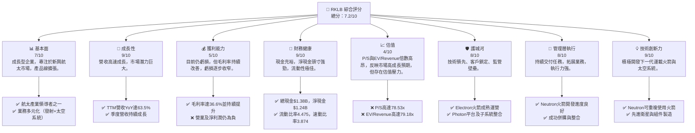
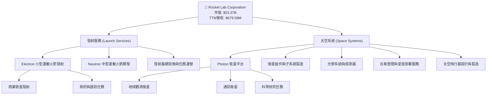
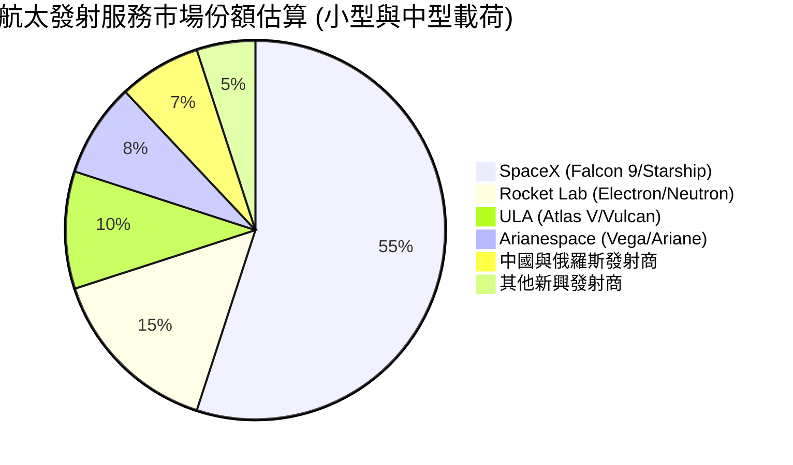
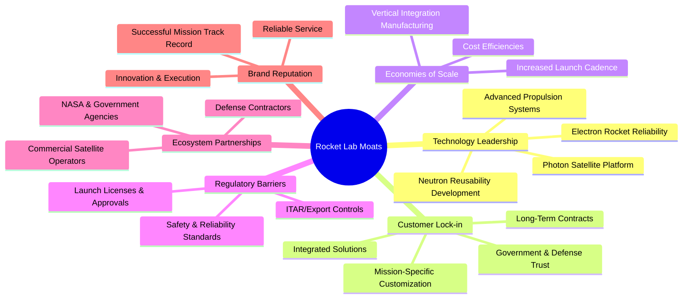
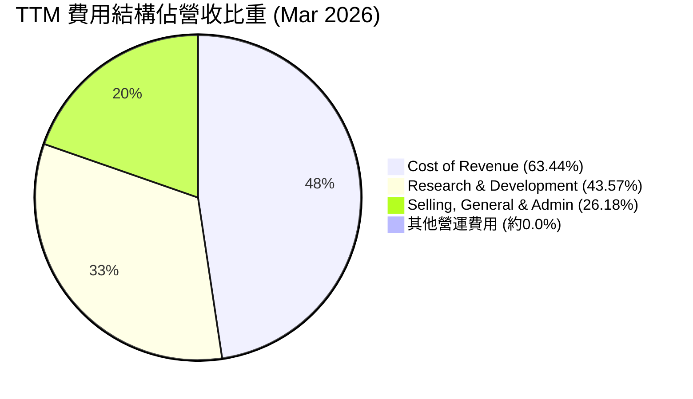
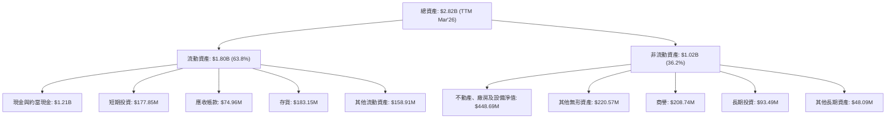

# RKLB 基本面深度分析報告
> **報告日期**：2026-06-24 ｜ **語言**：繁體中文 ｜ **數據來源**：Yahoo Finance, Finviz, StockAnalysis, Roic.ai ｜ **分析師**：CFA 級機構研究

---

## 目錄

| # | 章節 | 核心結論 |
|---|------|----------|
| 1 | 執行摘要 | 評級：🟢 買入，目標價區間：$95 - $130 |
| 2 | 公司概覽與商業模式 | 憑藉技術領先與客戶鎖定，護城河深度穩固 |
| 3 | 損益表深度分析 | 營收高速成長，毛利率持續改善，虧損收窄 |
| 4 | 資產負債表分析 | 現金充裕，淨現金頭寸強勁，流動性極佳 |
| 5 | 現金流量深度分析 | 自由現金流仍為負值，但營運效率逐步提升 |
| 6 | 獲利能力與資本效率 | 儘管ROIC為負，但毛利率改善預示未來轉機 |
| 7 | 估值深度分析 | 相較同業，估值反映高成長預期，但需密切關注獲利轉正進度 |
| 8 | 成長催化劑 | Neutron火箭、星座部署與國防合約為主要驅動力 |
| 9 | 風險矩陣 | 執行風險與競爭加劇為主要挑戰 |
| 10 | 投資建議 | 建議買入，適合長期成長型投資者 |

---

## 1. 執行摘要

### 1.1 核心評分儀表板



### 1.2 評分進度條視覺化

```
╔══════════════════════════════════════════════════════════════╗
║              RKLB 多維度評分儀表板 (1-10分)                  ║
╠══════════════════════════════════════════════════════════════╣
║ 基本面強度  7.0 ▓▓▓▓▓▓▓▓▓▓▓▓▓▓░░░░░░  ★★★★☆           ║
║ 成長動能    9.0 ▓▓▓▓▓▓▓▓▓▓▓▓▓▓▓▓▓▓░░  ★★★★★           ║
║ 獲利品質    5.0 ▓▓▓▓▓▓▓▓▓▓░░░░░░░░░░  ★★★☆☆           ║
║ 財務健康    9.0 ▓▓▓▓▓▓▓▓▓▓▓▓▓▓▓▓▓▓░░  ★★★★★           ║
║ 估值合理性  4.0 ▓▓▓▓▓▓▓▓░░░░░░░░░░░░  ★★☆☆☆           ║
║ 護城河深度  8.0 ▓▓▓▓▓▓▓▓▓▓▓▓▓▓▓▓░░░░  ★★★★☆           ║
║ 管理層執行  8.0 ▓▓▓▓▓▓▓▓▓▓▓▓▓▓▓▓░░░░  ★★★★☆           ║
║ 技術創新力  9.0 ▓▓▓▓▓▓▓▓▓▓▓▓▓▓▓▓▓▓░░  ★★★★★           ║
╠══════════════════════════════════════════════════════════════╣
║ 綜合總分    7.2 ▓▓▓▓▓▓▓▓▓▓▓▓▓▓▓▓░░░░  🏆 評語：高成長潛力，但估值高昂，具長期風險。║
╚══════════════════════════════════════════════════════════════╝
```

### 1.3 五大投資論點 + 三大核心風險

| 類型 | 項目 | 具體依據 | 信心度 |
|------|------|----------|--------|
| 🟢 **投資論點①** | **強勁的營收成長動能** | RKLB TTM 營收達 $679.58M，年對年 (YoY) 成長率高達 63.5%，顯示其在航太市場的快速擴張能力。Q1 2026 營收 $200.35M，較 Q1 2025 的 $122.57M 成長 63.46%。 | 🟢 極高 |
| 🟢 **毛利率持續改善** | 公司毛利率從 FY2022 的 9.00% 穩步提升至 FY2025 的 34.43%，並在 TTM 達到 36.6%。這表明隨著規模擴大和效率提升，其核心業務盈利能力正在增強。 | 🟢 極高 |
| 🟢 **穩健的財務健康狀況** | 擁有 $1.38B 的總現金和 $1.24B 的淨現金（總現金減去總債務 $138.67M），流動比率高達 4.475，顯示公司具有極佳的短期償債能力和抵禦風險的能力。 | 🟢 極高 |
| 🟢 **業務多元化與技術領先** | RKLB 不僅提供發射服務 (Electron)，更積極發展太空系統 (Photon 衛星平台、衛星組件製造等)，降低對單一業務的依賴。Neutron 火箭的開發將進一步鞏固其在中型運載火箭市場的地位。 | 🟢 高 |
| 🟢 **廣闊的市場潛力與戰略地位** | 航太產業正處於爆發性成長期，RKLB 在小型與中型發射、衛星製造及在軌服務領域均有佈局，尤其在國防與商業衛星領域具備戰略優勢。分析師平均目標價 $106.92，較現價有 25.19% 的上行空間。 | 🟢 高 |
| 🟡 **風險①** | **估值高昂與持續虧損** | RKLB 的 P/S 比率高達 78.53x，EV/Revenue 達 79.18x，遠高於產業平均水平。公司目前仍處於虧損狀態 (TTM EPS $-0.32)，自由現金流為負 (TTM $-215.00M)，若未來獲利轉正不及預期，估值可能面臨壓力。 | 🟡 中度 |
| 🔴 **執行風險與競爭加劇** | Neutron 火箭的研發和商業化存在技術和資金風險。此外，航太產業競爭激烈，SpaceX 等巨頭擁有更雄厚的資源和技術優勢，可能對 RKLB 的市場份額和定價能力構成挑戰。 | 🔴 高衝擊 |
| 🟡 **資本支出與現金消耗** | 作為資本密集型產業，RKLB 在研發和產能擴張方面需要持續投入大量資本 (FY2025 資本支出 $-156.28M)。儘管目前現金充裕，但若長期無法產生正向自由現金流，可能需要進一步融資，稀釋股東權益。 | 🟡 中度 |

### 1.4 快速統計卡片

| 指標 | 公司實際值 | 行業均值（航太與國防） | S&P 500 均值 | 狀態 |
|------|-------------|--------------------|--------------|------|
| 收入 YoY 成長 | **63.5%** | ~10-15% | ~8-12% | 🟢 |
| 毛利率 | **36.6%** | ~25-35% | ~30-40% | 🟢 |
| 淨利率 | **-26.9%** | ~5-10% | ~8-12% | 🔴 |
| ROE | **-13.5%** | ~10-15% | ~12-15% | 🔴 |
| P/S Ratio | **78.53x** | ~2-5x | ~2-3x | 🔴 |
| EV / Revenue | **79.18x** | ~2-6x | ~2-4x | 🔴 |
| Current Ratio | **4.48x** | ~1.5-2.5x | ~1.5-2.0x | 🟢 |
| 淨現金 / 債務 | **$1.24B (淨現金)** | 混合 | 混合 | 🟢 |

### 1.5 投資結論

```
╔══════════════════════════════════════════════════════════════════╗
║                    📊 投資結論摘要                               ║
╠══════════════════════════════════════════════════════════════════╣
║  評級：🟢 買入                                                   ║
║  當前股價：$85.41                                                ║
║  目標價區間：                                                    ║
║    悲觀情境：$70.00 （-17.93%）                                  ║
║    基準情境：$105.00 （+22.94%）  ← 12個月主要目標               ║
║    樂觀情境：$130.00 （+52.21%）                                 ║
║  投資評分：7.2/10                                                ║
║  適合投資人：尋求高成長潛力、能承受較高風險的長期投資者，對航太產業前景有信心。║
╚══════════════════════════════════════════════════════════════════╝
```

---

## 2. 公司概覽與商業模式

Rocket Lab Corporation (RKLB) 是一家垂直整合的航太公司，為美國、加拿大、日本及國際客戶提供發射服務和太空系統解決方案。公司業務主要分為兩大板塊：發射服務 (Launch Services) 和太空系統 (Space Systems)。

### 2.1 業務結構與收入來源

RKLB 的業務模式涵蓋了從衛星設計、製造、組件供應到發射和在軌管理的全方位服務。這種垂直整合策略旨在為客戶提供一站式解決方案，提高效率並降低成本。



**收入來源分析**：
雖然具體的發射服務與太空系統的收入佔比未在提供的數據中詳列，但從公司描述來看，太空系統業務的範圍不斷擴大，有望成為未來重要的成長驅動力。發射服務收入主要來自 Electron 火箭的商業發射和政府合同，而太空系統收入則包括 Photon 衛星平台的銷售、衛星組件供應、光學系統以及相關的在軌服務。公司 TTM 總營收為 $679.58M，顯示其在兩大板塊均有顯著貢獻。

### 2.2 市場份額

在小型運載火箭市場，RKLB 的 Electron 火箭是主要的商業發射服務提供商之一。然而，隨著 SpaceX 的 Starship 和其他競爭對手的進入，市場格局正在演變。在太空系統領域，RKLB 憑藉 Photon 平台和專業組件製造能力，也在衛星製造和服務市場佔據一席之地。由於缺乏具體的市場份額數據，以下為概念性市場份額分佈，反映 RKLB 在特定利基市場的影響力。


**市場份額評估**：
RKLB 在小型運載火箭市場中佔據領先地位，Electron 火箭的成功發射次數和可靠性使其在商業和政府客戶中建立了良好聲譽。隨著 Neutron 火箭的開發，RKLB 有望在中型運載火箭市場進一步擴大其市場份額。然而，面對 SpaceX 等具有成本優勢和規模效應的巨頭，RKLB 需要持續創新並提升效率以維持競爭力。在太空系統領域，RKLB 則通過提供客製化解決方案和關鍵組件，在不斷增長的衛星市場中搶佔份額。

### 2.3 競爭護城河分析

RKLB 正在構建多層次的競爭護城河，以在快速發展的航太產業中維持其競爭優勢。



### 2.4 護城河強度評分

RKLB 的護城河主要來自其在小型發射市場的技術領先和高可靠性，以及在太空系統領域的垂直整合能力。

```
╔══════════════════════════════════════════════════════════════╗
║                  RKLB 護城河強度評分                          ║
╠══════════════════════════════════════════════════════════════╣
║ 技術領先    9/10  ▓▓▓▓▓▓▓▓▓▓▓▓▓▓▓▓▓▓░░  🏆 Electron成熟，Neutron具潛力║
║ 客戶鎖定    8/10  ▓▓▓▓▓▓▓▓▓▓▓▓▓▓▓▓░░░░  🟢 長期合約與客製化服務      ║
║ 規模效應    7/10  ▓▓▓▓▓▓▓▓▓▓▓▓▓▓░░░░░░  🟡 逐步建立，但仍不及巨頭     ║
║ 監管壁壘    8/10  ▓▓▓▓▓▓▓▓▓▓▓▓▓▓▓▓░░░░  🟢 進入門檻高，需嚴格認證    ║
║ 生態夥伴    8/10  ▓▓▓▓▓▓▓▓▓▓▓▓▓▓▓▓░░░░  🟢 與政府及商業客戶關係緊密  ║
║ 品牌聲譽    8/10  ▓▓▓▓▓▓▓▓▓▓▓▓▓▓▓▓░░░░  🟢 穩定發射紀錄，市場信賴高   ║
╠══════════════════════════════════════════════════════════════╣
║ 綜合護城河  8.0   ▓▓▓▓▓▓▓▓▓▓▓▓▓▓▓▓░░░░  🏆 具備核心競爭力，但需警惕新進入者║
╚══════════════════════════════════════════════════════════════════╝
```

---

## 3. 損益表深度分析

### 3.1 年度收入成長趨勢（近4年）

RKLB 的年度收入呈現顯著的成長趨勢，尤其在 FY2024 實現了爆炸性增長，顯示其在航太市場的強勁需求和擴張能力。

```
╔══════════════════════════════════════════════════════════════════╗
║              RKLB 年度收入趨勢（FY2022-FY2025）                   ║
╠══════════════════════════════════════════════════════════════════╣
║                                                                  ║
║  FY2022  $211.00M ▓▓▓▓▓▓░░░░░░░░░░░░░░░░░░░  YoY: +239.02%  🟢  ║
║  FY2023  $244.59M ▓▓▓▓▓▓▓▓░░░░░░░░░░░░░░░░░  YoY: +15.92%   🟢  ║
║  FY2024  $436.21M ▓▓▓▓▓▓▓▓▓▓▓▓▓▓▓▓░░░░░░░░░  YoY: +78.34%   🟢  ║
║  FY2025  $601.80M ▓▓▓▓▓▓▓▓▓▓▓▓▓▓▓▓▓▓▓▓▓▓░░░  YoY: +37.96%   🟢  ║
║                                                                  ║
║                   |      |      |      |      |                  ║
║                   0     200M   400M   600M   800M                  ║
║                                                                  ║
║  📊 3年累計 CAGR (FY2022-FY2025)：+66.21%                         ║
╚══════════════════════════════════════════════════════════════════╝
```
**年度收入分析**：
RKLB 在過去四年展現了驚人的營收成長。從 FY2022 的 $211.00M 增長至 FY2025 的 $601.80M，三年複合年成長率 (CAGR) 高達 66.21%。FY2024 的 78.34% YoY 成長和 FY2025 的 37.96% YoY 成長，顯示公司在發射服務和太空系統兩大業務板塊的強勁動能。TTM 營收進一步達到 $679.58M，較上一年度有 63.5% 的成長，表明其成長勢頭持續。

### 3.2 季度收入趨勢分析

RKLB 的季度收入也呈現穩健的逐季增長，反映了市場需求的持續旺盛和公司業務的擴張。

| 季度 | 總收入 ($M) | QoQ 成長率 | YoY 成長率 | 備註 |
|------|-------------|------------|------------|------|
| Q1 2026 | $200.35 | +11.53% | +63.46% | 🟢 營收創新高，YoY強勁成長 |
| Q4 2025 | $179.65 | +15.84% | +35.70% | 🟢 營收穩健增長，YoY保持高位 |
| Q3 2025 | $155.08 | +7.32% | +47.97% | 🟢 營收持續成長，YoY表現出色 |
| Q2 2025 | $144.50 | +17.89% | +36.32% | 🟢 營收加速成長，YoY穩定 |
| Q1 2025 | $122.57 | -7.42% | +32.13% | 🟡 季節性因素導致QoQ略有下滑，但YoY仍強勁 |
| Q4 2024 | $132.39 | +26.32% | +120.68% | 🟢 營收大幅增長，YoY表現突出 |
| Q3 2024 | $104.81 | - | +54.90% | 🟢 營收強勁增長 |

**季度收入分析**：
從 Q3 2024 到 Q1 2026，RKLB 的季度收入從 $104.81M 穩定增長至 $200.35M，展現了連續多季的 QoQ 成長（除 Q1 2025 因季節性因素略有回落）。Q1 2026 的 $200.35M 營收較 Q1 2025 的 $122.57M 實現了 63.46% 的 YoY 成長，顯示其成長動能依然強勁。這得益於 Electron 火箭發射頻次的增加以及太空系統業務的訂單成長。

### 3.3 利潤率演變分析

RKLB 的利潤率趨勢顯示出積極的改善，尤其毛利率的顯著提升是其走向盈利的關鍵。

| 利潤率指標 | FY2022 | FY2023 | FY2024 | FY2025 | TTM (Mar'26) | 趨勢 | 評估 |
|------------|--------|--------|--------|--------|--------------|------|------|
| **毛利率** | 9.00% | 21.02% | 26.63% | 34.43% | 36.56% | ↗️ 持續大幅提升 | 🟢 |
| **營業利益率** | -64.08% | -72.74% | -43.51% | -38.03% | -22.40% | ↗️ 虧損大幅收窄 | 🟢 |
| **淨利率** | -64.43% | -74.64% | -43.60% | -32.94% | -26.90% | ↗️ 虧損大幅收窄 | 🟢 |
| **EBITDA Margin** | -45.12% | -53.82% | -29.69% | -25.84% | -24.30% | ↗️ 虧損大幅收窄 | 🟢 |

**利潤率演變深度解析**：
RKLB 的毛利率從 FY2022 的 9.00% 穩步攀升至 FY2025 的 34.43%，並在 TTM 達到 36.56%。這種顯著的提升主要歸因於：
1.  **規模經濟效應**：隨著發射頻次的增加和太空系統產品的批量生產，固定成本被更有效地分攤。
2.  **效率提升**：生產流程優化、供應鏈管理改善以及技術成熟度提高，降低了單位產品的生產成本。
3.  **產品組合優化**：高毛利的太空系統業務佔比可能有所提升，對整體毛利率產生積極影響。

儘管營業利益率和淨利率仍為負值，但其虧損幅度已從 FY2023 的谷底大幅收窄。營業利益率從 FY2023 的 -72.74% 改善至 TTM 的 -22.40%，淨利率也從 FY2023 的 -74.64% 改善至 TTM 的 -26.90%。這表明公司在控制營業費用和提升營收效率方面取得了顯著進展。持續的研發投入 (R&D) 仍是導致營業虧損的主要因素，但隨著營收規模的擴大，RKLB 有望在未來實現營業層面的盈虧平衡。

### 3.4 費用結構分析

RKLB 的費用結構反映了其作為一家高科技成長型公司的特點，即研發投入佔比較高，以推動創新和未來成長。


**註**：此圖為費用佔營收比重，總和可能超過100%因公司仍處於虧損狀態，營業費用高於毛利。

**費用結構深度解析**：
從 TTM (截至 2026 年 3 月 31 日) 的數據來看：
*   **銷貨成本 (Cost of Revenue)** 為 $431.15M，佔 TTM 營收 $679.58M 的 63.44%。這與 36.56% 的毛利率相符。
*   **研發費用 (Research & Development)** 高達 $296.12M，佔 TTM 營收的 43.57%。這筆巨大的投入主要用於 Electron 火箭的升級、Neutron 火箭的開發以及太空系統新技術的研發，是公司未來成長的基石。
    *   FY2025 R&D 費用為 $270.72M，較 FY2024 的 $174.39M 成長 55.25%。
*   **銷售、總務及行政費用 (Selling, General & Admin)** 為 $177.93M，佔 TTM 營收的 26.18%。這部分費用主要用於市場拓展、管理運營和企業職能。
    *   FY2025 SG&A 費用為 $165.30M，較 FY2024 的 $131.56M 成長 25.66%。

```
╔══════════════════════════════════════════════════════════════════╗
║                    RKLB 費用佔營收比重趨勢                       ║
╠══════════════════════════════════════════════════════════════════╣
║                                                                  ║
║  R&D / Revenue:                                                  ║
║  FY2022  30.89% ▓▓▓▓▓▓▓▓▓▓▓▓▓▓░░░░░░░░░░░░░░░░░░░░░  🟢         ║
║  FY2023  48.68% ▓▓▓▓▓▓▓▓▓▓▓▓▓▓▓▓▓▓▓▓▓▓▓░░░░░░░░░░░░░  🔴         ║
║  FY2024  40.00% ▓▓▓▓▓▓▓▓▓▓▓▓▓▓▓▓▓▓▓▓░░░░░░░░░░░░░░░░░  🟡         ║
║  FY2025  45.00% ▓▓▓▓▓▓▓▓▓▓▓▓▓▓▓▓▓▓▓▓▓▓░░░░░░░░░░░░░░░  🟡         ║
║  TTM'26  43.57% ▓▓▓▓▓▓▓▓▓▓▓▓▓▓▓▓▓▓▓▓▓░░░░░░░░░░░░░░░░░  🟡         ║
║                                                                  ║
║  SG&A / Revenue:                                                 ║
║  FY2022  42.19% ▓▓▓▓▓▓▓▓▓▓▓▓▓▓▓▓▓▓▓▓▓░░░░░░░░░░░░░░░░░  🔴         ║
║  FY2023  45.08% ▓▓▓▓▓▓▓▓▓▓▓▓▓▓▓▓▓▓▓▓▓▓░░░░░░░░░░░░░░░░░  🔴         ║
║  FY2024  30.16% ▓▓▓▓▓▓▓▓▓▓▓▓▓▓▓▓░░░░░░░░░░░░░░░░░░░░░░░  🟢         ║
║  FY2025  27.47% ▓▓▓▓▓▓▓▓▓▓▓▓▓▓░░░░░░░░░░░░░░░░░░░░░░░░░  🟢         ║
║  TTM'26  26.18% ▓▓▓▓▓▓▓▓▓▓▓▓▓░░░░░░░░░░░░░░░░░░░░░░░░░░  🟢         ║
╚══════════════════════════════════════════════════════════════════╝
```
雖然研發費用佔營收比重因投資新專案而維持高位，但銷售、總務及行政費用佔營收比重呈現明顯下降趨勢，從 FY2022 的 42.19% 降至 TTM 的 26.18%，這表明公司在營運槓桿和費用控制方面取得了成效。隨著營收規模持續擴大，費用佔比有望進一步優化，加速公司邁向盈利。

### 3.5 季度 EPS 趨勢與盈餘品質

RKLB 目前仍處於虧損狀態，因此 EPS 均為負值。然而，從近期趨勢來看，虧損有逐漸收窄的跡象，預示著盈餘品質的潛在改善。

| 季度 | EPS Est | EPS Act | Surprise% | 實際 EPS | 趨勢 | 盈餘品質評估 |
|------|---------|---------|-----------|----------|------|--------------|
| 2026-03-31 | 不適用 | 不適用 | 不適用 | $-0.07 | 🟢 虧損持續收窄 | 虧損收窄，營運效率提升的初步跡象 |
| 2025-12-31 | 不適用 | 不適用 | 不適用 | $-0.09 | 🟢 虧損收窄 | 虧損收窄，營運費用控制得當 |
| 2025-09-30 | 不適用 | 不適用 | 不適用 | $-0.03 | 🟢 虧損大幅收窄 | 營收增長與毛利率改善效果顯著 |
| 2025-06-30 | 不適用 | 不適用 | 不適用 | $-0.13 | 🟡 虧損擴大 | 研發投入與營運費用增加 |
| 2025-03-31 | 不適用 | 不適用 | 不適用 | $-0.12 | 🟡 虧損擴大 | 研發投入與營運費用增加 |

**盈餘品質評估**：
提供的數據中，EPS 預期與實際值均顯示為「不適用」。這可能是由於公司尚未被廣泛覆蓋或處於高速成長階段，分析師預期差異較大。然而，我們可以根據實際報告的季度 EPS 數值來分析趨勢。
*   從 Q1 2025 的 $-0.12 擴大至 Q2 2025 的 $-0.13，顯示當季虧損有所擴大，這可能與研發投入或營運費用增加有關。
*   但隨後，虧損在 Q3 2025 大幅收窄至 $-0.03，並在 Q4 2025 和 Q1 2026 進一步收窄至 $-0.09 和 $-0.07。
這種虧損收窄的趨勢，特別是 Q3 2025 的顯著改善，表明公司在毛利率提升和營運效率優化的努力正在見效。儘管仍處於虧損，但虧損額的減少是盈餘品質改善的積極信號，預示著公司有望在未來實現盈利。投資者應密切關注公司在 Neutron 火箭研發進度、發射頻次提升以及太空系統業務擴張帶來的營收和利潤增長。

---

## 4. 資產負債表分析

RKLB 的資產負債表顯示出強勁的財務健康狀況，特別是其充裕的現金儲備和低債務水平。

### 4.1 資產結構分解

截至 TTM (2026年3月31日)，RKLB 的總資產達到 $2.82B，其中流動資產佔比高，顯示其資產流動性良好。


**資產結構分析**：
截至 TTM (2026年3月31日)，RKLB 的總資產為 $2.82B。其中，流動資產佔 $1.80B，約佔總資產的 63.8%，顯示公司資產流動性極佳。在流動資產中，現金及約當現金高達 $1.21B，短期投資為 $177.85M，合計現金及短期投資達到 $1.38B，為公司的營運和擴張提供了堅實的資金基礎。非流動資產主要包括不動產、廠房及設備淨值 (PPE) $448.69M，以及因併購產生的無形資產和商譽 ($220.57M 和 $208.74M)。PPE 的增長反映了公司在產能和基礎設施方面的持續投入，以支持未來的成長。

### 4.2 流動性指標分析

RKLB 的流動性指標非常健康，遠超行業平均水平，表明其短期償債能力極強。

| 指標 | FY2022 | FY2023 | FY2024 | FY2025 | TTM (Mar'26) | 行業均值（航太與國防） | 趨勢 | 評估 |
|------|--------|--------|--------|--------|--------------|--------------------|------|------|
| **流動比率 (Current Ratio)** | 4.06 | 2.14 | 2.04 | 4.08 | 4.475 | ~1.5-2.5 | ↗️ 穩健提升 | 🟢 極佳 |
| **速動比率 (Quick Ratio)** | 3.90 | 1.67 | 1.69 | 3.