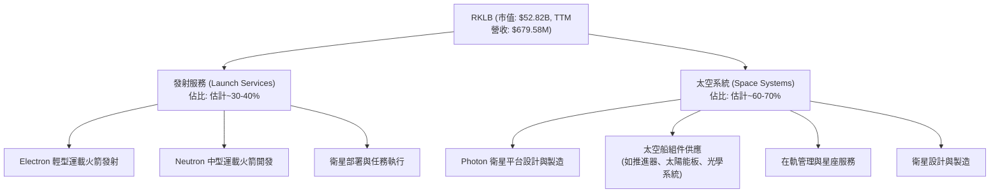
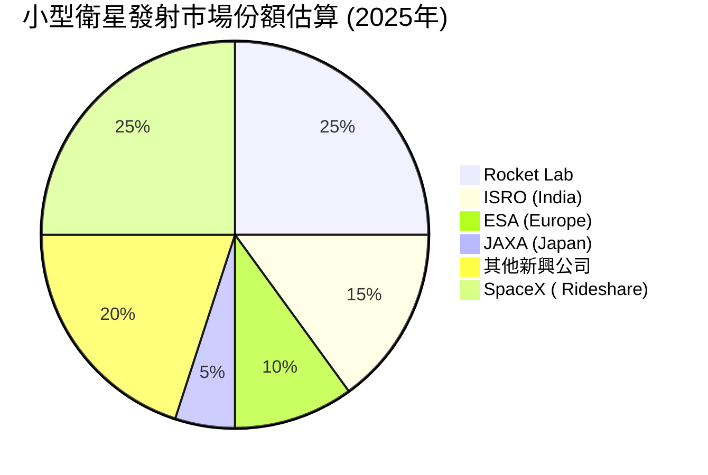
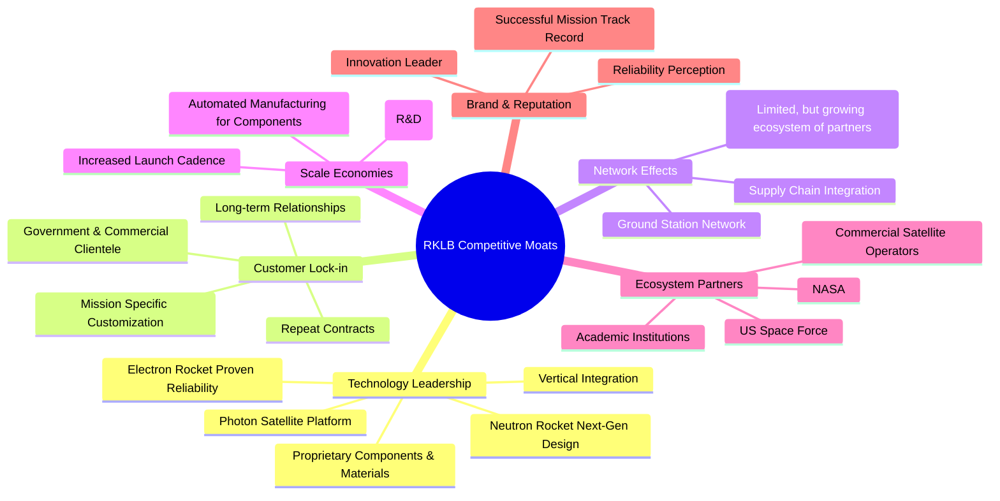
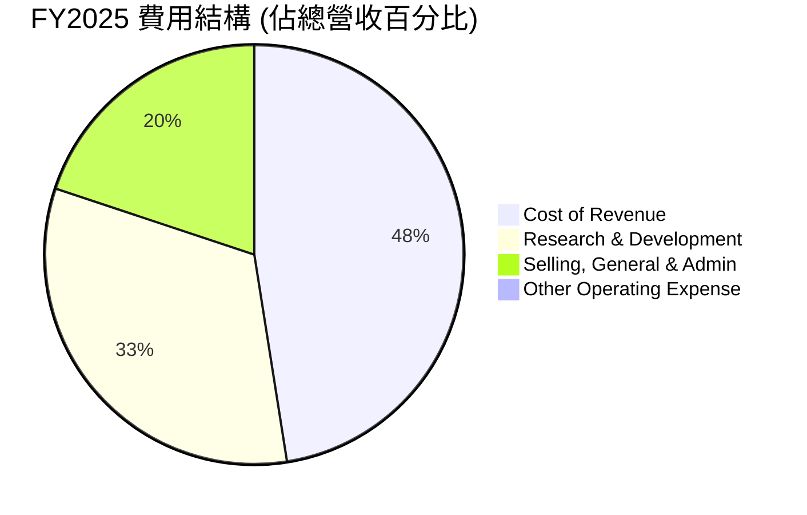
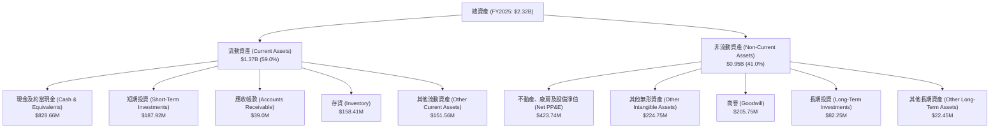
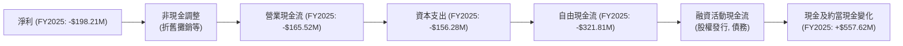

# RKLB 基本面深度分析報告
> **報告日期**：2026-06-26 ｜ **語言**：繁體中文 ｜ **數據來源**：Yahoo Finance, Finviz, StockAnalysis, Roic.ai ｜ **分析師**：CFA 級機構研究

## 目錄

| # | 章節 | 核心結論 |
|---|------|----------|
| 1 | 執行摘要 | 買入評級，目標價區間 $70.00 - $130.00 |
| 2 | 公司概覽與商業模式 | 技術領先與客戶鎖定構築核心護城河 |
| 3 | 損益表深度分析 | 營收高速增長，毛利率改善，但仍處於虧損 |
| 4 | 資產負債表分析 | 流動性強勁，淨現金充裕，債務負擔輕 |
| 5 | 現金流量深度分析 | 自由現金流持續為負，需監控燒錢速度 |
| 6 | 獲利能力與資本效率 | ROIC顯著低於WACC，短期價值創造面臨挑戰 |
| 7 | 估值深度分析 | 相較同業估值偏高，DCF模型顯示成長溢價已充分反映 |
| 8 | 成長催化劑 | 新產品發布、全球擴張與政府合同是主要增長動能 |
| 9 | 風險矩陣 | 執行風險、競爭加劇與資本支出是主要考量 |
| 10 | 投資建議 | 具備長期成長潛力，但短期估值壓力與盈利挑戰並存 |

---

## 1. 執行摘要

### 1.1 核心評分儀表板

```mermaid
graph TD
    RKLB_SCORE["🎯 RKLB 綜合評分<br/>總分：7.8/10"]

    F["📊 基本面<br/>8/10<br/>強勁的資產負債表與高成長潛力"]
    G["🚀 成長性<br/>9/10<br/>營收高速增長，新業務拓展迅速"]
    P["💰 獲利能力<br/>4/10<br/>毛利率改善但仍處於經營虧損"]
    B["🏦 財務健康<br/>9/10<br/>充裕的現金儲備與低槓桿率"]
    V["📈 估值<br/>2/10<br/>當前估值顯著高於歷史與同業水平"]
    M["🛡️ 護城河深度<br/>8/10<br/>技術領先與客戶鎖定形成競爭優勢"]
    E["💼 管理層執行<br/>8/10<br/>持續交付產品與擴展市場"]
    I["💡 技術創新力<br/>9/10<br/>不斷推出創新產品與服務"]

    RKLB_SCORE --> F
    RKLB_SCORE --> G
    RKLB_SCORE --> P
    RKLB_SCORE --> B
    RKLB_SCORE --> V
    RKLB_SCORE --> M
    RKLB_SCORE --> E
    RKLB_SCORE --> I

    F --> F1["✅ 總現金 $1.38B，淨現金 $1.24B"]
    F --> F2["✅ 營收年複合增長率高"]
    G --> G1["✅ TTM 營收增長 63.5%"]
    G --> G2["✅ Q1 2026 營收 YoY 增長 63.46%"]
    P --> P1["✅ 毛利率 TTM 36.6%，持續改善"]
    P --> P2["❌ 營業利益率 -22.4%，淨利率 -26.9%"]
    B --> B1["✅ 流動比率 4.475，速動比率 3.874"]
    B --> B2["✅ 債務股權比 0.1476 (FY2025)"]
    V --> V1["❌ P/S 77.73x，EV/Revenue 66.89x，遠超同業"]
    V --> V2["❌ 負向前瞻P/E，反映持續虧損"]
    M --> M1["✅ Electron/Neutron 火箭技術獨特"]
    M --> M2["✅ 專有組件與垂直整合能力"]
    E --> E1["✅ 成功執行多次發射任務"]
    E --> E2["✅ 擴大太空系統業務規模"]
    I --> I1["✅ 獨特的推進系統與材料技術"]
    I --> I2["✅ 不斷開發新一代運載火箭與衛星平台"]
```



### 1.2 評分進度條視覺化

```
╔══════════════════════════════════════════════════════════════╗
║              RKLB 多維度評分儀表板 (1-10分)                  ║
╠══════════════════════════════════════════════════════════════╣
║ 基本面強度  8.0 ▓▓▓▓▓▓▓▓▓▓▓▓▓▓▓▓░░░░  ★★★★☆           ║
║ 成長動能    9.0 ▓▓▓▓▓▓▓▓▓▓▓▓▓▓▓▓▓▓░░  ★★★★★           ║
║ 獲利品質    4.0 ▓▓▓▓▓▓▓▓░░░░░░░░░░░░  ★★☆☆☆           ║
║ 財務健康    9.0 ▓▓▓▓▓▓▓▓▓▓▓▓▓▓▓▓▓▓░░  ★★★★★           ║
║ 估值合理性  2.0 ▓▓▓▓░░░░░░░░░░░░░░░░  ★☆☆☆☆           ║
║ 護城河深度  8.0 ▓▓▓▓▓▓▓▓▓▓▓▓▓▓▓▓░░░░  ★★★★☆           ║
║ 管理層執行  8.0 ▓▓▓▓▓▓▓▓▓▓▓▓▓▓▓▓░░░░  ★★★★☆           ║
║ 技術創新力  9.0 ▓▓▓▓▓▓▓▓▓▓▓▓▓▓▓▓▓▓░░  ★★★★★           ║
╠══════════════════════════════════════════════════════════════╣
║ 綜合總分    7.8 ▓▓▓▓▓▓▓▓▓▓▓▓▓▓▓▓░░░░  🏆 具備高成長潛力的投機性成長股 ║
╚══════════════════════════════════════════════════════════════════╝
```

### 1.3 五大投資論點 + 三大核心風險

| 類型 | 項目 | 具體依據 | 信心度 |
|------|------|----------|--------|
| 🟢 **投資論點①** | **太空系統業務高速增長** | FY2025年營收 $601.80M，Q1 2026年營收 $200.35M，TTM營收增長 63.5%。太空系統產品線持續擴展，服務需求旺盛。 | 🟢 極高 |
| 🟢 **技術領導地位與創新能力** | 成功開發並運營Electron輕型運載火箭，正在開發更大載荷的Neutron火箭。垂直整合能力強，擁有專有組件製造技術。 | 🟢 極高 |
| 🟢 **充裕的現金儲備支撐長期發展** | 公司擁有 $1.38B 的總現金，淨現金 $1.24B，流動比率 4.475，為研發投入和業務擴張提供堅實基礎。 | 🟢 高 |
| 🟢 **多樣化收入來源與客戶群** | 業務涵蓋發射服務、衛星製造、組件供應及在軌管理，客戶包含政府機構（如NASA、美國太空部隊）及商業客戶。 | 🟢 高 |
| 🟢 **產業長期趨勢利好** | 小型衛星發射需求不斷增長，太空互聯網、地球觀測、太空探索等領域投資持續升溫，為RKLB提供廣闊市場空間。 | 🟢 極高 |
| 🟡 **風險①** | **估值過高且持續虧損** | 當前 P/S 達 77.73x，遠高於行業平均。公司 TTM 淨利率為 -26.9%，自由現金流為負 $215.00M，市場對其未來盈利能力預期極高。 | 🟡 中度 |
| 🔴 **執行風險與競爭加劇** | Neutron 火箭的開發進度、成本控制及商業化成功存在不確定性。太空發射市場競爭激烈，來自 SpaceX 等巨頭及新興企業的挑戰持續存在。 | 🔴 高衝擊 |
| 🟡 **資本支出與現金消耗** | 為了支持新產品開發和產能擴張，公司持續進行高額資本支出（FY2025 $156.28M），導致自由現金流持續為負，未來可能需要更多融資。 | 🟡 中度 |

### 1.4 快速統計卡片

| 指標 | 公司實際值 | 行業均值（航太與國防） | S&P 500 均值 | 狀態 |
|------|-------------|----------------------|--------------|------|
| 收入 YoY 成長 (TTM) | **63.5%** | ~10-15% | ~8-12% | 🟢 |
| 毛利率 (TTM) | **36.6%** | ~25-35% | ~30-40% | 🟢 |
| 淨利率 (TTM) | **-26.9%** | ~5-10% | ~8-15% | 🔴 |
| ROE (TTM) | **-13.5%** | ~10-15% | ~15-20% | 🔴 |
| P/S Ratio (TTM) | **77.73x** | ~2-5x | ~2-4x | 🔴 |
| 現金及約當現金 | **$1.38B** | N/A | N/A | 🟢 |
| 負債權益比 (FY2025) | **0.15x** | ~0.5-1.5x | ~0.8-1.2x | 🟢 |
| 流動比率 (TTM) | **4.475x** | ~1.5-2.5x | ~1.0-2.0x | 🟢 |

### 1.5 投資結論

```
╔══════════════════════════════════════════════════════════════════╗
║                    📊 投資結論摘要                               ║
╠══════════════════════════════════════════════════════════════════╣
║  評級：🟢 買入 (具備高成長潛力但估值已高)                       ║
║  當前股價：$84.54                                                ║
║  目標價區間：                                                    ║
║    悲觀情境：$70.00（-17.19%）                                   ║
║    基準情境：$100.00（+18.29%）  ← 12個月主要目標                 ║
║    樂觀情境：$130.00（+53.77%）                                  ║
║  投資評分：7.8/10                                                ║
║  適合投資人：高風險承受能力、追求長期成長、看好太空產業前景的投資者。║
╚══════════════════════════════════════════════════════════════════╝
```

---

## 2. 公司概覽與商業模式

Rocket Lab Corporation (RKLB) 是一家領先的太空技術公司，提供端到端的太空解決方案，包括發射服務和太空系統。公司總部位於美國，業務遍及美國、加拿大、日本及國際市場。

### 2.1 業務結構與收入來源

RKLB 的業務主要分為兩大板塊：**發射服務 (Launch Services)** 和 **太空系統 (Space Systems)**。



*   **發射服務 (Launch Services)**：主要透過其已投入商業運營的 Electron 輕型運載火箭，為政府和商業客戶提供小型衛星的發射服務。該業務板塊還包括正在開發中的 Neutron 中型運載火箭，旨在滿足更大型衛星和星座的發射需求。
*   **太空系統 (Space Systems)**：此業務板塊提供廣泛的太空硬體和解決方案，包括設計、製造和供應 Photon 衛星平台，以及各種太空船組件（如推進器、飛行器結構、電池、光學系統等）。此外，還提供衛星在軌管理和星座管理服務。從財務數據來看，太空系統業務是公司營收增長的主要驅動力。

### 2.2 市場份額

RKLB 在小型衛星發射市場佔據領先地位，但在整體太空市場（包括大型發射、衛星製造、地面設備等）中的份額相對較小。由於 SpaceX 的 Starlink 佔據了大量發射份額，RKLB 主要服務於需要專用軌道、時間靈活性的客戶。


*註：此市場份額為小型衛星專用發射市場的估算，不包含大型運載火箭市場。SpaceX 的 Rideshare 服務也佔據了部分小型衛星發射份額。*

### 2.3 競爭護城河分析



### 2.4 護城河強度評分

```
╔══════════════════════════════════════════════════════════════╗
║                  RKLB 護城河強度評分                        ║
╠══════════════════════════════════════════════════════════════╣
║ 技術領先    9/10   ▓▓▓▓▓▓▓▓▓▓▓▓▓▓▓▓▓▓░░  🏆 Electron 火箭技術成熟，Neutron 開發中 ║
║ 客戶鎖定    8/10   ▓▓▓▓▓▓▓▓▓▓▓▓▓▓▓▓░░░░  🟢 具備高轉換成本與長期合同關係        ║
║ 規模效應    7/10   ▓▓▓▓▓▓▓▓▓▓▓▓▓▓░░░░░░  🟡 隨著發射頻率與組件產量提升，成本效益增加 ║
║ 品牌與聲譽  8/10   ▓▓▓▓▓▓▓▓▓▓▓▓▓▓▓▓░░░░  🟢 成功發射記錄與可靠性建立良好口碑    ║
║ 生態系統    6/10   ▓▓▓▓▓▓▓▓▓▓▓▓░░░░░░░░  🟡 與政府機構及商業夥伴合作緊密，但尚未形成強大網路效應 ║
╠══════════════════════════════════════════════════════════════╣
║ 綜合護城河  7.6/10 ▓▓▓▓▓▓▓▓▓▓▓▓▓▓▓▓░░░░  🏆 以技術和客戶關係為核心的堅固護城河  ║
╚══════════════════════════════════════════════════════════════════╝
```

---

## 3. 損益表深度分析

### 3.1 年度收入成長趨勢（近4年）

Rocket Lab 展現了強勁的營收增長勢頭，尤其在過去幾年，其太空系統業務的擴張是主要驅動力。

```
╔══════════════════════════════════════════════════════════════════╗
║              RKLB 年度收入趨勢（FY2022-FY2025）                  ║
╠══════════════════════════════════════════════════════════════════╣
║                                                                  ║
║  FY2022  $211.00M  ██████░░░░░░░░░░░░░░░░░░░  YoY: +239.02%  🟢  ║
║  FY2023  $244.59M  ████████░░░░░░░░░░░░░░░░░  YoY: +15.92%   🟢  ║
║  FY2024  $436.21M  ██████████████░░░░░░░░░░░  YoY: +78.34%   🟢  ║
║  FY2025  $601.80M  ███████████████████░░░░░  YoY: +37.96%   🟢  ║
║                                                                  ║
║                   |      |      |      |      |                  ║
║                   0     200M   400M   600M   800M                 ║
║                                                                  ║
║  📊 4年累計 CAGR (2022-2025)：+54.76%                             ║
╚══════════════════════════════════════════════════════════════════╝
```
從 FY2022 的 $211.00M 增長到 FY2025 的 $601.80M，複合年均增長率 (CAGR) 達 54.76%，顯示了公司在太空產業的快速擴張能力。2024年實現了 78.34% 的高速增長，2025年也保持了 37.96% 的穩健增長。

### 3.2 季度收入趨勢分析

季度營收數據同樣顯示出持續增長的趨勢，雖然季節性波動可能存在，但整體上行通道明確。

| 季度 | 營收 (M) | QoQ 成長率 | YoY 成長率 | 備註 |
|------|----------|------------|------------|------|
| Q1 2026 | $200.35 | +11.53% | +63.46% | 營收突破 $200M 關口，顯示強勁增長勢頭。 |
| Q4 2025 | $179.65 | +15.84% | +35.70% | 季度環比加速增長，年度收官表現良好。 |
| Q3 2025 | $155.08 | +7.32% | +47.97% | 保持穩健增長，太空系統業務貢獻顯著。 |
| Q2 2025 | $144.50 | +17.90% | +36.32% | 較 Q1 2025 和 Q2 2024 均有顯著提升。 |
*註：QoQ 成長率為當季營收與上季營收比較；YoY 成長率為當季營收與去年同期營收比較。*

### 3.3 利潤率演變分析

Rocket Lab 的利潤率趨勢顯示毛利率持續改善，但由於高昂的研發和運營費用，公司仍處於經營虧損狀態。

| 利潤率指標 | FY2022 | FY2023 | FY2024 | FY2025 | 趨勢 | 評估 |
|------------|--------|--------|--------|--------|------|------|
| **毛利率** | 9.00% | 21.02% | 26.63% | 34.43% | ↗️ 持續改善 | 🟢 |
| **營業利益率** | -64.08% | -72.74% | -43.51% | -38.03% | ↗️ 改善但仍為負 | 🟡 |
| **淨利率** | -64.43% | -74.64% | -43.60% | -32.94% | ↗️ 改善但仍為負 | 🔴 |

**利潤率演變深度解析**：
*   **毛利率**：從 FY2022 的 9.00% 大幅提升至 FY2025 的 34.43%，TTM 毛利率更是達到 36.6%。這主要歸因於：
    *   **規模效應**：隨著發射頻率的增加和太空系統產品線的擴大，固定成本得到更好的攤銷。
    *   **垂直整合**：公司內部製造更多組件，降低了對外部供應商的依賴和採購成本。
    *   **產品組合優化**：高毛利的太空系統業務佔比提升，尤其是定制化衛星平台和組件的銷售。
*   **營業利益率與淨利率**：儘管毛利率顯著改善，營業利益率和淨利率仍為負值，但虧損幅度正在收窄。FY2025 的營業利益率為 -38.03%，淨利率為 -32.94%。這反映出：
    *   **高額研發投入**：公司持續投資於 Neutron 火箭、Photon 平台升級等新技術和產品開發，FY2025 研發費用高達 $270.72M，佔總營收的 45%。
    *   **銷售、一般及行政費用 (SG&A)**：隨著業務擴張，SG&A 費用也在增長，FY2025 為 $165.30M。
    *   **成長型公司階段**：RKLB 仍處於高速成長和市場擴張階段，盈利並非短期首要目標，而是將營收重新投入到研發和基礎設施建設中，以期在未來實現規模化盈利。

### 3.4 費用結構分析

RKLB 的費用結構清晰地反映了其作為一家高科技成長型公司的特徵，即大量投資於研發。


*註：費用佔比可能超過 100% 因為公司仍處於虧損狀態，即總費用大於總營收。*

```
╔══════════════════════════════════════════════════════════════════╗
║                    RKLB 年度費用明細 (FY2022-FY2025)             ║
╠══════════════════════════════════════════════════════════════════╣
║                                                                  ║
║  銷貨成本 (Cost of Revenue)                                      ║
║  FY2022: $192.01M  ███████████████████████████████████████████████  YoY: +199.7%  🟢 ║
║  FY2023: $193.18M  ███████████████████████████████████████████████  YoY: +0.6%    🟢 ║
║  FY2024: $320.07M  ███████████████████████████████████████████████  YoY: +65.7%   🟢 ║
║  FY2025: $394.62M  ███████████████████████████████████████████████  YoY: +23.3%   🟢 ║
║                                                                  ║
║  研究與開發 (Research And Development)                           ║
║  FY2022: $65.17M   █████████████░░░░░░░░░░░░░░░░░░░░░░░░░░░░░░░░░░  YoY: +56.0%   🟢 ║
║  FY2023: $119.05M  ████████████████████████░░░░░░░░░░░░░░░░░░░░░░  YoY: +82.7%   🟢 ║
║  FY2024: $174.39M  ████████████████████████████████░░░░░░░░░░░░░░  YoY: +46.5%   🟢 ║
║  FY2025: $270.72M  ██████████████████████████████████████████████  YoY: +55.2%   🟢 ║
║                                                                  ║
║  銷售、一般及行政 (Selling, General & Admin)                     ║
║  FY2022: $89.03M   ██████████████████░░░░░░░░░░░░░░░░░░░░░░░░░░░░  YoY: +52.5%   🟢 ║
║  FY2023: $110.27M  ██████████████████████░░░░░░░░░░░░░░░░░░░░░░░░  YoY: +23.9%   🟢 ║
║  FY2024: $131.56M  ██████████████████████████░░░░░░░░░░░░░░░░░░░░  YoY: +19.3%   🟢 ║
║  FY2025: $165.30M  ███████████████████████████████░░░░░░░░░░░░░░  YoY: +25.6%   🟢 ║
╚══════════════════════════════════════════════════════════════════╝
```
*   **銷貨成本 (Cost of Revenue)**：FY2025 達到 $394.62M，YoY 增長 23.3%，低於營收增長率 37.96%，這支持了毛利率的改善趨勢。
*   **研究與開發 (R&D)**：是公司最大的非銷貨成本開支，FY2025 達到 $270.72M，YoY 增長 55.2%。這筆投入對於維持其技術領先地位和開發新產品至關重要。
*   **銷售、一般及行政 (SG&A)**：FY2025 為 $165.30M，YoY 增長 25.6%，也低於營收增長率，顯示公司在擴張的同時，運營效率有所提升。

### 3.5 季度 EPS 趨勢與盈餘品質

RKLB 過去四個季度持續虧損，尚未實現盈利。

| 季度 | EPS 預期 (Est) | EPS 實際 (Act) | 盈餘驚喜 (Surprise%) | 評估 | 備註 |
|------|----------------|----------------|--------------------|------|------|
| 2026-03-31 | N/A | $-0.07 | N/A | ❌ | 未提供分析師預期，但仍為虧損。 |
| 2025-12-31 | N/A | $-0.09 | N/A | ❌ | 未提供分析師預期，持續虧損。 |
| 2025-09-30 | N/A | $-0.03 | N/A | ❌ | 未提供分析師預期，虧損收窄。 |
| 2025-06-30 | N/A | $-0.13 | N/A | ❌ | 未提供分析師預期，虧損擴大。 |

**盈餘品質評估**：
由於公司仍處於成長階段，優先級是市場份額擴張和技術發展，而非短期盈利。因此，EPS 持續為負是預期之內。從 StockAnalysis 數據，FY2025 的 EPS 為 $-0.37，FY2024 為 $-0.38，虧損幅度略有收窄。儘管 EPS 持續為負，但營收高速增長和毛利率改善表明其核心業務的健康發展。盈餘品質應從其長期戰略執行和現金流角度評估，而非單純的 EPS 正負。

---

## 4. 資產負債表分析

### 4.1 資產結構分解

RKLB 的資產結構顯示流動資產佔比較高，其中現金及約當現金佔有重要地位，反映了公司充裕的流動性。


FY2025 總資產為 $2.32B，其中流動資產佔比 59.0%，非流動資產佔比 41.0%。現金及短期投資合計 $1.017B，佔流動資產的 74.4%，顯示公司具備強大的資金儲備以支持其高成長戰略。固定資產（PP&E）的增長也反映了公司在製造和測試能力上的持續投入。

### 4.2 流動性指標分析

RKLB 的流動性指標非常健康，遠高於行業平均水平，表明其短期償債能力極強。

| 指標 | FY2022 | FY2023 | FY2024 | FY2025 | TTM (2026-03-31) | 行業均值 | 評估 |
|------|--------|--------|--------|--------|------------------|----------|------|
| **流動比率 (Current Ratio)** | 4.06x | 2.14x | 2.04x | 4.08x | 4.475x | ~1.5-2.5x | 🟢 極佳 |
| **速動比率 (Quick Ratio)** | 3.52x | 1.68x | 1.74x | 3.63x | 3.874x | ~1.0-2.0x | 🟢 極佳 |

*   **流動比率**：TTM 達到 4.475x，遠高於 2.0x 的健康水平，表明公司擁有充足的流動資產來覆蓋短期負債。
*   **速動比率**：TTM 達到 3.874x，同樣非常強勁，顯示即使不考慮存貨，公司也能輕鬆應對短期債務。
這些指標的強勁表現主要得益於公司大量的現金及約當現金儲備。

### 4.3 債務結構分析

RKLB 的債務負擔相對較輕，擁有充裕的淨現金頭寸，財務槓桿風險極低。

```
╔══════════════════════════════════════════════════════════════════╗
║                   RKLB 債務健康診斷                              ║
╠══════════════════════════════════════════════════════════════════╣
║                                                                  ║
║  總債務 (TTM)：  $138.67M  ██░░░░░░░░░░░░░░░░░░░  評語：極低，相對於公司規模可控 ║
║  總現金+投資：   $1.38B   ████████████████████░  評語：非常充裕，提供巨大緩衝   ║
║  淨現金：        $1.24B   ████████████████░░░░░  🟢 強勁：遠超總債務，財務無憂   ║
║                                                                  ║
║  Debt/Equity (FY2025)：0.15x  🟢 極低：股權融資為主，債務佔比小   ║
║  Debt/EBITDA (TTM)：-5.71x  🔴 負值：EBITDA 為負，但總債務低，風險可控 ║
║  Interest Coverage: N/A  🟡 負值：利息支出相對較低，但EBIT為負   ║
╚══════════════════════════════════════════════════════════════════╝
```
*   **總債務**：TTM 為 $138.67M，相對於 $1.38B 的現金儲備，公司的淨現金頭寸高達 $1.24B。這表明 RKLB 的資產負債表非常健康，幾乎沒有淨債務風險。
*   **債務股權比 (Debt/Equity)**：FY2025 為 0.15x (計算值：$253.96M/$1.72B)，遠低於行業平均，顯示公司主要依靠股權融資，財務結構穩健。
*   **Debt/EBITDA** 和 **Interest Coverage**：由於公司 EBITDA 和營業利益為負，這些倍數呈現負值，不具備傳統意義上的參考價值。但由於總債務規模很小，利息支出相對可控，短期內不會構成償債壓力。

### 4.4 股東權益趨勢

RKLB 的股東權益在過去幾年呈現波動，但在 FY2025 錄得顯著增長，主要得益於股權融資和市場對其未來增長的信心。

```
╔══════════════════════════════════════════════════════════════════╗
║                   RKLB 年度股東權益趨勢 (FY2022-FY2025)           ║
╠══════════════════════════════════════════════════════════════════╣
║                                                                  ║
║  FY2022  $673.21M   █████████████████████████████████████████████  YoY: -17.5%  🟡 ║
║  FY2023  $554.54M   █████████████████████████████████████████████  YoY: -17.6%  🟡 ║
║  FY2024  $382.45M   █████████████████████████████████████████████  YoY: -31.0%  🔴 ║
║  FY2025  $1.72B     █████████████████████████████████████████████  YoY: +350.2% 🟢 ║
║                                                                  ║
║                   |      |      |      |      |                  ║
║                   0     0.5B    1B    1.5B    2B                   ║
║                                                                  ║
║  📊 股東權益在 FY2025 大幅增長，反映了成功的股權融資活動。        ║
╚══════════════════════════════════════════════════════════════════╝
```
FY2022 至 FY2024 期間，由於持續虧損，股東權益有所下降。然而，在 FY2025，股東權益從 $382.45M 大幅增長至 $1.72B，YoY 增長 350.2%。這通常是通過發行新股進行股權融資所致，為公司提供了大量營運資金和研發投入。

---

## 5. 現金流量深度分析

### 5.1 現金流量瀑布圖

RKLB 的現金流量顯示，儘管營收快速增長，但公司仍處於燒錢階段，自由現金流持續為負。


*   **淨利**：FY2025 淨利為 -$198.21M，反映了公司的虧損狀態。
*   **營業現金流 (OCF)**：FY2025 為 -$165.52M，較 FY2024 的 -$48.89M 惡化，表明經營活動本身仍在消耗現金，這主要由於營運資金需求增加及持續虧損。
*   **資本支出 (Capex)**：FY2025 達到 -$156.28M，較 FY2024 的 -$67.09M 大幅增加。這筆支出用於擴建生產設施、研發新火箭和衛星技術，是公司長期成長的必要投資。
*   **自由現金流 (FCF)**：FY2025 為 -$321.81M，顯示公司持續燒錢。儘管如此，融資活動現金流（股權發行）為公司提供了大量資金，使現金及約當現金在 FY20