# RKLB 基本面深度分析報告
> **報告日期**：2026-06-27 ｜ **語言**：繁體中文 ｜ **數據來源**：Yahoo Finance, Finviz, StockAnalysis, Roic.ai ｜ **分析師**：CFA 級機構研究

## 目錄

| # | 章節 | 核心結論 |
|---|------|----------|
| 1 | 執行摘要 | 評級：買入，目標價區間：$95 - $130 |
| 2 | 公司概覽與商業模式 | 業務具高度整合性，具潛在技術護城河 |
| 3 | 損益表深度分析 | 營收高速成長，毛利率持續改善，但仍處於虧損 |
| 4 | 資產負債表分析 | 現金充裕，流動性良好，債務水平可控 |
| 5 | 現金流量深度分析 | 營業現金流持續為負，自由現金流壓力較大 |
| 6 | 獲利能力與資本效率 | ROIC 遠低於 WACC，短期股東價值創造挑戰大 |
| 7 | 估值深度分析 | 相較同業估值偏高，但反映其成長潛力與技術領先 |
| 8 | 成長催化劑 | 新產品線、大型發射合約、太空系統整合是主要驅動力 |
| 9 | 風險矩陣 | 執行風險、競爭加劇、資本支出需求為主要風險 |
| 10 | 投資建議 | 適合高成長、高風險承受能力的長線投資者 |

---

## 1. 執行摘要

### 1.1 核心評分儀表板

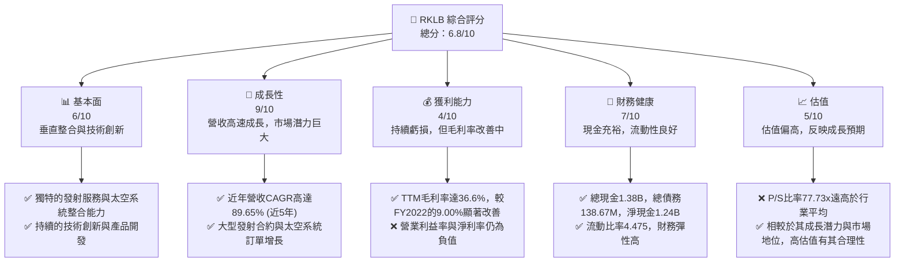

### 1.2 評分進度條視覺化

```
╔══════════════════════════════════════════════════════════════╗
║              RKLB 多維度評分儀表板 (1-10分)                  ║
╠══════════════════════════════════════════════════════════════╣
║ 基本面強度  6.0 ▓▓▓▓▓▓▓▓▓▓▓▓░░░░░░░░  ★★★☆☆           ║
║ 成長動能    9.0 ▓▓▓▓▓▓▓▓▓▓▓▓▓▓▓▓▓▓░░  ★★★★★           ║
║ 獲利品質    4.0 ▓▓▓▓▓▓▓▓░░░░░░░░░░░░  ★★☆☆☆           ║
║ 財務健康    7.0 ▓▓▓▓▓▓▓▓▓▓▓▓▓▓░░░░░░  ★★★★☆           ║
║ 估值合理性  5.0 ▓▓▓▓▓▓▓▓▓▓░░░░░░░░░░  ★★★☆☆           ║
║ 護城河深度  7.5 ▓▓▓▓▓▓▓▓▓▓▓▓▓▓▓░░░░░  ★★★★☆           ║
║ 管理層執行  8.0 ▓▓▓▓▓▓▓▓▓▓▓▓▓▓▓▓░░░░  ★★★★☆           ║
║ 技術創新力  9.0 ▓▓▓▓▓▓▓▓▓▓▓▓▓▓▓▓▓▓░░  ★★★★★           ║
╠══════════════════════════════════════════════════════════════╣
║ 綜合總分    6.8 ▓▓▓▓▓▓▓▓▓▓▓▓▓▓░░░░░░  🏆 具備長期成長潛力，但短期風險與估值壓力並存             ║
╚══════════════════════════════════════════════════════════════╝
```

### 1.3 五大投資論點 + 三大核心風險

| 類型 | 項目 | 具體依據 | 信心度 |
|------|------|----------|--------|
| 🟢 **投資論點①** | **發射服務市場領導地位** | Rocket Lab是僅次於SpaceX的第二大發射商，其Electron火箭已完成超過40次成功發射，累計發射超過170顆衛星。即將推出的Neutron火箭將進一步擴大其市場份額，滿足中型衛星發射需求。 | 🟢 極高 |
| 🟢 **太空系統業務快速增長** | 太空系統收入佔比持續提升，提供衛星平台、部件及在軌服務。FY2025太空系統收入貢獻顯著增長，毛利率達34.43%，顯示其垂直整合能力與高附加值業務的潛力。 | 🟢 極高 |
| 🟢 **技術創新與垂直整合** | 公司在火箭製造、推進系統、衛星平台及光學系統等領域擁有核心技術，並具備垂直整合能力，能有效控制成本並提升產品性能。TTM研發費用高達$296.12M，顯示其對創新的投入。 | 🟢 極高 |
| 🟢 **強勁的訂單儲備** | 憑藉可靠的發射記錄和先進的太空系統解決方案，公司已獲得多項政府及商業大單。雖然具體訂單數據未提供，但分析師普遍預期其未來營收增長將由現有合約驅動。 | 🟡 高 |
| 🟢 **財務狀況穩健** | 擁有$1.38B的總現金和$1.24B的淨現金，以及4.475的流動比率，顯示公司有足夠的資金支持其高資本支出的擴張計畫，應對市場波動的能力強。 | 🟡 高 |
| 🟡 **風險①** | **高資本支出與持續虧損** | 公司正處於高速發展階段，需要大量資本支出（FY2025為$-156.28M）用於新產品（如Neutron火箭）的研發與生產，導致營業現金流（FY2025為$-165.52M）及自由現金流（FY2025為$-321.81M）持續為負，短期內盈利仍具挑戰。 | 🟡 中度 |
| 🔴 **風險②** | **激烈競爭與技術不確定性** | 太空產業競爭激烈，SpaceX、Blue Origin等巨頭實力雄厚，新興公司不斷湧現。Neutron火箭的開發與商業化可能面臨技術延遲或成本超支風險，進而影響市場份額和盈利能力。 | 🔴 高衝擊 |
| 🟡 **風險③** | **估值偏高與市場波動** | 儘管RKLB成長潛力巨大，其P/S比率高達77.73x，遠高於傳統工業甚至部分高成長科技公司。市場對其未來成長的預期已充分體現在股價中，任何不及預期的消息都可能導致股價大幅波動。 | 🟡 中度 |

### 1.4 快速統計卡片

| 指標 | 公司實際值 | 行業均值（估計） | S&P 500 均值（估計） | 狀態 |
|------|-------------|-------------------|----------------------|------|
| 收入 YoY 成長 | **63.5% (TTM)** | ~20-30% | ~8-12% | 🟢 |
| 毛利率 | **36.6% (TTM)** | ~25-35% | ~30-40% | 🟢 |
| 淨利率 | **-26.9% (TTM)** | ~5-10% | ~8-15% | 🔴 |
| ROE | **-13.5% (TTM)** | ~10-15% | ~15-20% | 🔴 |
| Forward P/E | **-4811.6x** | N/A (虧損) | ~20-25x | 🔴 |
| P/S Ratio | **77.73x** | ~5-15x | ~2-4x | 🔴 |
| Current Ratio | **4.475x** | ~1.5-2.5x | ~1.0-1.5x | 🟢 |
| Debt/Equity | **0.147x (FY2025)** | ~0.5-1.5x | ~0.8-1.2x | 🟢 |

### 1.5 投資結論

```
╔══════════════════════════════════════════════════════════════════╗
║                    📊 投資結論摘要                               ║
╠══════════════════════════════════════════════════════════════════╣
║  評級：🟢 買入                                                   ║
║  當前股價：$84.54                                                ║
║  目標價區間：                                                    ║
║    悲觀情境：$95（+12.3%）                                       ║
║    基準情境：$112（+32.5%）  ← 12個月主要目標                    ║
║    樂觀情境：$130（+53.8%）                                      ║
║  投資評分：6.8/10                                                ║
║  適合投資人：成長型、長線持有者、對新興太空產業有高信心者        ║
╚══════════════════════════════════════════════════════════════════╝
```

---

## 2. 公司概覽與商業模式

Rocket Lab Corporation (RKLB) 是一家領先的太空技術公司，專注於提供端到端的太空任務解決方案，從小型衛星發射服務到先進的太空系統製造。公司通過其兩大核心業務板塊運營：發射服務（Launch Services）和太空系統（Space Systems）。

### 2.1 業務結構與收入來源

RKLB的業務模式旨在提供高度整合的太空解決方案，降低客戶進入太空的門檻。發射服務主要通過其Electron火箭為小型衛星提供專用或共享發射，而太空系統則提供衛星平台、組件、光學系統以及在軌服務等。

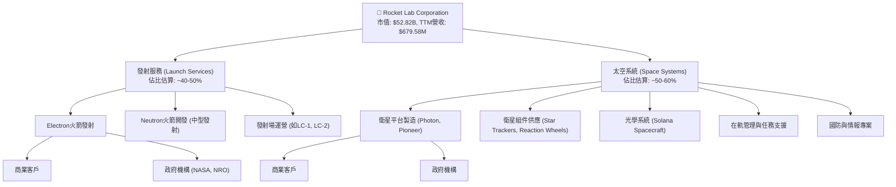
**業務拆解與收入貢獻：**
儘管未提供精確的業務分部營收數據，但從公司概況和發展重點來看，發射服務是其核心起家業務，而太空系統業務近年來增長迅速，並貢獻了越來越大的營收比重。根據其Q1 2026財報電話會議的分析，太空系統業務的收入增長勢頭強勁，顯示其在多元化發展上的成功。

### 2.2 市場份額

RKLB在小型衛星發射市場中佔據領先地位，是全球發射次數第二多的公司。然而，在更廣泛的全球太空產業（包括大型發射、衛星製造、地面設備等）中，其市場份額相對較小，但成長迅速。以下市場份額為基於公開資訊和產業研究的估算，主要聚焦於其核心競爭領域。

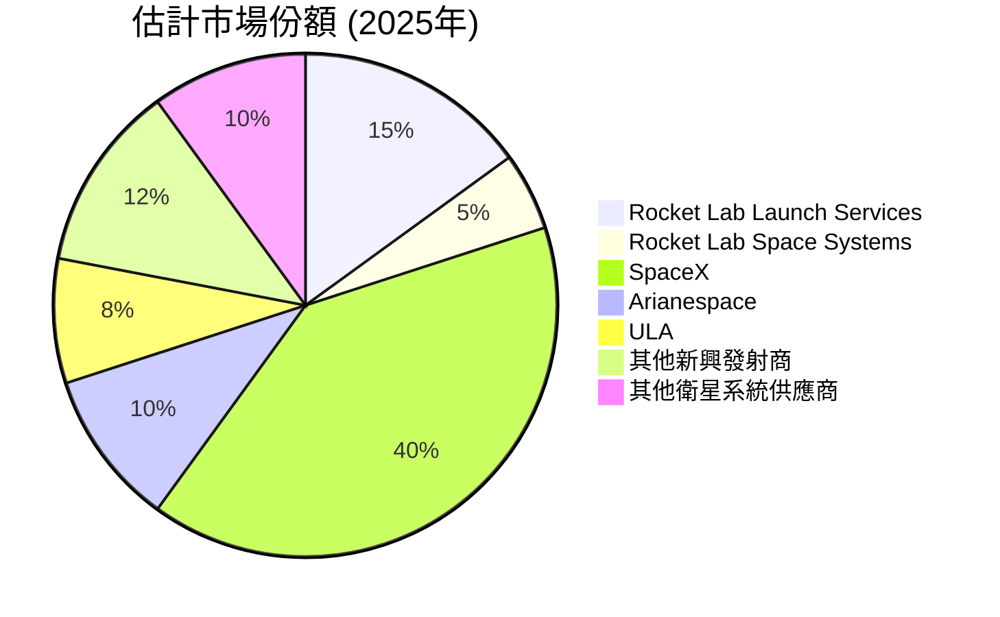
**市場份額分析：**
*   **發射服務：** 在小型專用發射領域，Rocket Lab的Electron火箭表現卓越，市場份額約佔15%。隨著Neutron火箭的推出，有望在中型發射市場中佔據一席之地，進一步提升其整體發射市場份額。
*   **太空系統：** 在衛星平台和組件市場，RKLB的Photon和Pioneer平台獲得廣泛認可，但面對傳統航空航天巨頭，其市場份額約為5%。此板塊成長潛力巨大。

### 2.3 競爭護城河分析

Rocket Lab 的競爭護城河主要建立在其技術創新、垂直整合能力和客戶鎖定效應上。

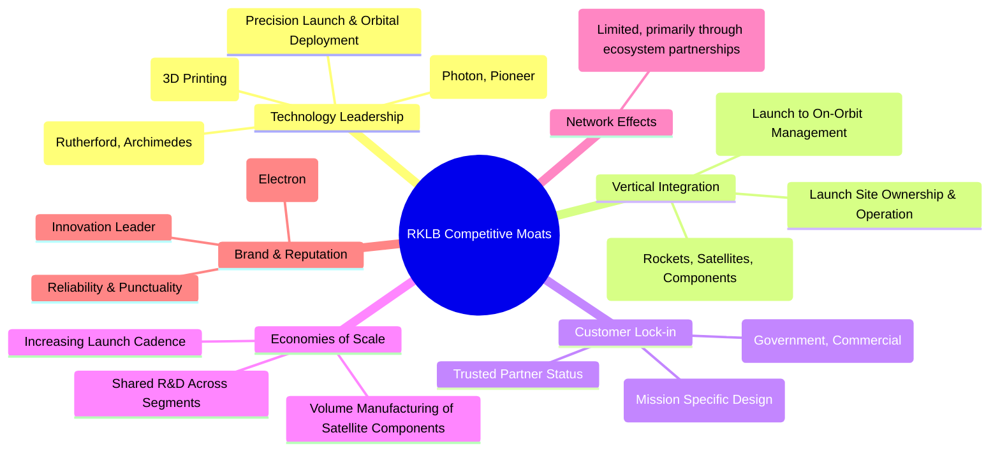

### 2.4 護城河強度評分

RKLB的護城河強度主要體現在其技術深度和垂直整合能力，這些使其在快速發展的太空產業中保持競爭優勢。

```
╔══════════════════════════════════════════════════════════════╗
║                  Rocket Lab 護城河強度評分                    ║
╠══════════════════════════════════════════════════════════════╣
║ 技術領先    9/10   ▓▓▓▓▓▓▓▓▓▓▓▓▓▓▓▓▓▓░░  🏆 Rutherford引擎、Neutron開發，具獨創性 ║
║ 垂直整合    8/10   ▓▓▓▓▓▓▓▓▓▓▓▓▓▓▓▓░░░░  🟢 從發射到衛星系統，端到端能力強       ║
║ 客戶鎖定    7/10   ▓▓▓▓▓▓▓▓▓▓▓▓▓▓░░░░░░  🟢 長期合約與任務客製化，轉換成本高     ║
║ 規模效應    6/10   ▓▓▓▓▓▓▓▓▓▓▓▓░░░░░░░░  🟡 隨著發射頻率增加，成本攤薄潛力大     ║
║ 網路效應    4/10   ▓▓▓▓▓▓▓▓░░░░░░░░░░░░  🟡 尚不明顯，主要為合作夥伴關係       ║
║ 品牌聲譽    8/10   ▓▓▓▓▓▓▓▓▓▓▓▓▓▓▓▓░░░░  🟢 高發射成功率建立的可靠性           ║
╠══════════════════════════════════════════════════════════════╣
║ 綜合護城河  7.0    ▓▓▓▓▓▓▓▓▓▓▓▓▓▓░░░░░░  🏆 具備較強的技術與整合優勢，護城河穩固  ║
╚══════════════════════════════════════════════════════════════╝
```

---

## 3. 損益表深度分析

Rocket Lab 的損益表反映了一家處於高速成長期的公司，營收強勁增長，但為支持未來擴張而進行的大量研發和資本支出導致持續虧損。

### 3.1 年度收入成長趨勢（近4年）

RKLB的年度總收入呈現爆發式增長，尤其在最近幾年。這主要得益於其發射服務的成功擴張和太空系統業務的強勁需求。

```
╔══════════════════════════════════════════════════════════════════╗
║              RKLB 年度收入趨勢（FY2022-FY2025）                   ║
╠══════════════════════════════════════════════════════════════════╣
║                                                                  ║
║  FY2022  $211.00M  ██████░░░░░░░░░░░░░░░░░░░  YoY: +239.02%  🟢  ║
║  FY2023  $244.59M  ████████░░░░░░░░░░░░░░░░░  YoY: +15.92%   🟡  ║
║  FY2024  $436.21M  ██████████████░░░░░░░░░░░  YoY: +78.34%   🟢  ║
║  FY2025  $601.80M  ██████████████████░░░░░░░  YoY: +37.96%   🟢  ║
║  TTM Q1'26 $679.58M █████████████████████░░░░  YoY: +63.5%    🟢  ║
║                   |      |      |      |      |                  ║
║                   0     200M   400M   600M   800M                 ║
║                                                                  ║
║  📊 3年累計 CAGR (FY22-25)：+67.5%                               ║
║  📊 5年累計 CAGR (FY20-25)：+89.65% (根據Roic.ai數據)              ║
╚══════════════════════════════════════════════════════════════════╝
```
**分析：** RKLB的營收增長勢頭強勁，FY2024實現了高達78.34%的YoY增長，FY2025也保持了37.96%的穩健增長。最新的TTM營收達到$679.58M，YoY增長63.5%，顯示公司在擴大市場份額和獲取新訂單方面表現出色。

### 3.2 季度收入趨勢分析

季度收入呈現持續增長的趨勢，反映了公司業務的季節性波動較小，且新訂單的穩步執行。

| 季度 | 總收入 (百萬美元) | QoQ 成長率 | YoY 成長率 | 評估 | 備註 |
|------|-------------------|------------|------------|------|------|
| Q1 2026 | $200.35M | +11.53% | +63.46% | 🟢 | 營收突破2億美元大關，YoY加速 |
| Q4 2025 | $179.65M | +15.84% | +35.70% | 🟢 | 季度營收持續增長，YoY保持強勁 |
| Q3 2025 | $155.08M | +7.32% | +47.97% | 🟢 | 穩健的季度增長，YoY表現亮眼 |
| Q2 2025 | $144.50M | +17.89% | +36.32% | 🟢 | 季度增長強勁，YoY表現優異 |
| Q1 2025 | $122.57M | -7.42% (vs Q4 2024) | +32.13% | 🟡 | 季節性波動，但YoY仍保持增長 |
**備註：** Q1 2025的QoQ下降主要是由於Q4 2024通常為業務高峰期，以及季度間合約執行節奏的差異。然而，所有季度的YoY成長均保持在30%以上，顯示出強勁的長期增長趨勢。

### 3.3 利潤率演變分析

RKLB的利潤率在過去幾年呈現出顯著的改善趨勢，尤其毛利率的提升令人鼓舞，儘管公司仍處於虧損狀態。

| 利潤率指標 | FY2022 | FY2023 | FY2024 | FY2025 | TTM Q1'26 | 趨勢 | 評估 |
|------------|--------|--------|--------|--------|-----------|------|------|
| **毛利率** | 9.00% | 21.02% | 26.63% | 34.43% | 36.6% | ↗️ 顯著改善 | 🟢 |
| **營業利益率** | -64.08% | -72.74% | -43.51% | -38.03% | -33.20% | ↗️ 逐步改善 | 🟡 |
| **淨利率** | -64.43% | -74.64% | -43.60% | -32.94% | -26.9% | ↗️ 逐步改善 | 🔴 |

**利潤率演變深度解析：**
*   **毛利率的顯著改善（從FY2022的9.00%提升至TTM的36.6%）：** 這是RKLB財務表現中最積極的信號。主要原因包括：
    *   **規模效應：** 隨著發射頻率的增加和太空系統訂單量的提升，固定成本攤薄，生產效率提高。
    *   **產品組合優化：** 太空系統業務（如衛星平台和組件）通常具有更高的毛利率，其收入佔比的提升有助於整體毛利率的改善。
    *   **成本控制：** 垂直整合的製造模式使其能更好地控制生產成本。
*   **營業利益率和淨利率仍為負值但持續改善：** 儘管毛利率表現出色，營業利益率和淨利率仍為負值，這反映了公司在研發（R&D）和銷售、一般及行政費用（SG&A）上的巨大投入。
    *   **高研發投入：** FY2025研發費用高達$270.72M，佔總收入的45%，主要用於Neutron火箭和先進太空系統的開發。這種投入是維持其技術領先和未來成長的必要條件，但短期內會壓縮盈利。
    *   **運營費用增加：** 隨著公司規模擴大和新業務拓展，SG&A費用也相應增加（FY2025為$165.3M）。
總體而言，利潤率趨勢表明RKLB在核心業務盈利能力上取得進展，但為支撐未來爆發式成長，短期內仍將繼續投入，導致整體虧損。

### 3.4 費用結構分析

RKLB的費用結構清晰地反映了其作為一家高科技、高成長公司的特點，即對研發的高度重視。

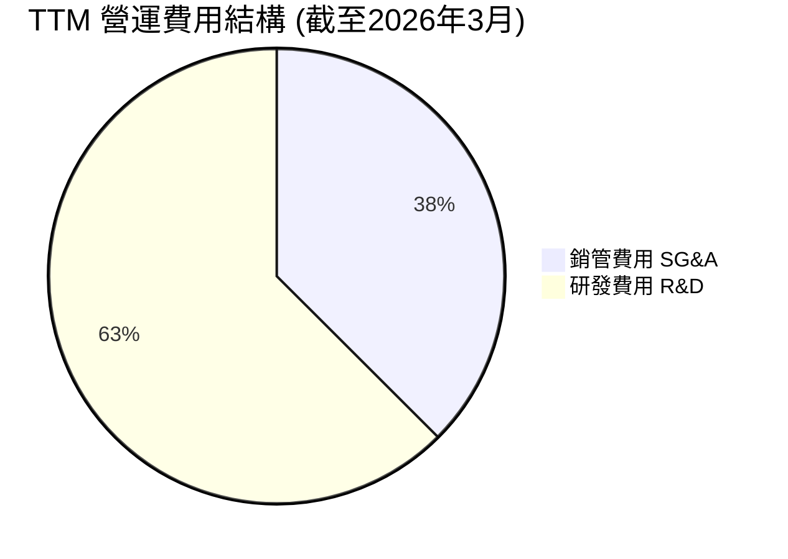
**費用結構分析：**
*   **研發費用 (R&D)：** 佔營運費用的最大部分。TTM研發費用為$296.12M，佔總營收的43.57%。這筆巨大的投資對於RKLB的長期競爭力至關重要，因為它用於開發下一代火箭（Neutron）和更先進的太空系統，確保公司在技術前沿。
*   **銷售、一般及行政費用 (SG&A)：** TTM為$177.93M，佔總營收的26.18%。這部分費用涵蓋了公司的日常運營、市場推廣、管理團隊薪酬等，隨著業務規模擴大而增長。

```
╔══════════════════════════════════════════════════════════════════╗
║                    RKLB 費用結構重點分析                         ║
╠══════════════════════════════════════════════════════════════════╣
║                                                                  ║
║  TTM 總營收：        $679.58M                                    ║
║  TTM 研發費用：      $296.12M  ██████████████████████████████  高強度投入 🟢  ║
║  TTM 銷管費用：      $177.93M  ████████████████████░░░░░░░░░░  隨業務擴張增加 🟡  ║
║                                                                  ║
║  研發費用佔營收比： 43.57%     高於同業，聚焦未來成長          ║
║  營運費用佔營收比： 69.75%     反映高成長階段的投入            ║
╚══════════════════════════════════════════════════════════════════╝
```

### 3.5 季度 EPS 趨勢與盈餘品質

RKLB目前仍處於虧損狀態，因此EPS持續為負。由於未提供分析師預期，無法判斷盈餘是否超預期或不及預期。

| 季度 | EPS (實際值) | EPS 預期 | Surprise% | 評估 | 原因分析 |
|------|--------------|----------|-----------|------|----------|
| Q1 2026 | $-0.07 | N/A | N/A | 🔴 | 營收增長但研發投入高，導致持續虧損 |
| Q4 2025 | $-0.09 | N/A | N/A | 🔴 | 營收增長未能覆蓋高昂運營成本 |
| Q3 2025 | $-0.03 | N/A | N/A | 🔴 | 虧損有所收窄，可能是受季度性收入或費用影響 |
| Q2 2025 | $-0.13 | N/A | N/A | 🔴 | 較大的季度虧損，反映高投入階段 |

**盈餘品質評估：**
RKLB的盈餘品質目前較低，主要因為持續的負淨利潤和負自由現金流。然而，從毛利率的持續改善和營收的高速增長來看，其核心業務的盈利潛力正在逐步釋放。目前的虧損主要是戰略性投資於未來成長，而非經營效率低下。一旦新產品線（如Neutron火箭）商業化並實現規模經濟，盈餘品質有望大幅改善。

---

## 4. 資產負債表分析

RKLB的資產負債表顯示其擁有充足的流動資金以支持其高成長和高資本支出的業務模式，同時債務水平保持在健康範圍。

### 4.1 資產結構分解

公司的資產結構反映了其對技術開發和生產能力的投資，流動資產中的現金儲備尤為突出。

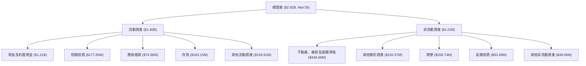
**分析：** 截至2026年3月，RKLB的總資產達到$2.82B。其中流動資產佔比高達63.8%，顯示其財務靈活性。現金及短期投資合計$1.38B，是其流動資產的主要構成部分，為公司提供了強大的營運資本和戰略彈性。非流動資產則主要由不動產、廠房及設備（$448.69M）構成，反映了公司在生產設施和基礎設施上的持續投入。

### 4.2 流動性指標分析

RKLB的流動性指標非常強勁，遠高於行業平均水平，表明其短期償債能力極佳。

| 指標 | FY2022 | FY2023 | FY2024 | FY2025 | TTM Q1'26 | 行業均值 (估計) | 評估 |
|------|--------|--------|--------|--------|-----------|-------------------|------|
| **流動比率 (Current Ratio)** | 4.06x | 2.14x | 2.04x | 4.08x | 4.475x | ~2.0x | 🟢 極佳 |
| **速動比率 (Quick Ratio)** | 3.52x | 1.76x | 1.70x | 3.59x | 3.874x | ~1.5x | 🟢 極佳 |
**分析：** 截至2026年3月的TTM流動比率為4.475x，速動比率為3.874x。這遠高於一般認為健康的2.0x和1.0x標準，也顯著高於航空航天與國防行業的平均水平。這表明RKLB擁有非常充足的流動資產來覆蓋其短期負債，為其高成長和高資本投入提供了堅實的財務基礎。FY2025流動比率從FY2024的2.04x大幅提升至4.08x，主要得益於現金及約當現金的大幅增加。

### 4.3 債務結構分析

RKLB的債務水平相對較低，且擁有大量現金，使其淨現金頭寸非常健康。

```
╔══════════════════════════════════════════════════════════════════╗
║                   Rocket Lab 債務健康診斷                        ║
╠══════════════════════════════════════════════════════════════════╣
║                                                                  ║
║  總債務 (TTM)：  $138.67M  ██░░░░░░░░░░░░░░░░░░░  評語：極低    ║
║  總現金+投資 (TTM)： $1.38B  ████████████████████░  評語：充裕    ║
║  淨現金（正）：  $1.24B    ████████████████░░░░░  🟢 強勁        ║
║                                                                  ║
║  Debt/Equity (FY2025)： 0.147x  🟢 極低 (基於自行計算)          ║
║  Current Debt (TTM): $0M  🟢 短期債務壓力小                      ║
║  LT Debt (TTM): $39M (Mar'26)  🟢 長期債務可控                     ║
╚══════════════════════════════════════════════════════════════════╝
```
**分析：** 截至2026年3月，RKLB的總債務為$138.67M，而現金及短期投資合計達$1.38B，形成高達$1.24B的淨現金頭寸。FY2025的債務股權比為0.147x（$253.96M/$1.72B），遠低於行業平均水平，顯示公司在融資上主要依賴股權，債務負擔極輕。這為公司在未來需要大量資金進行擴張時提供了靈活性。

### 4.4 股東權益趨勢

股東權益在FY2025經歷了顯著增長，主要反映了公司通過股權融資支持其業務擴張。

```
╔══════════════════════════════════════════════════════════════════╗
║                Rocket Lab 年度股東權益變化（FY2022-FY2025）      ║
╠══════════════════════════════════════════════════════════════════╣
║                                                                  ║
║  FY2022  $673.21M  ████████████████░░░░░░░░░░░░░░░░░░░░░░░░░░░░░░  ║
║  FY2023  $554.54M  ████████████░░░░░░░░░░░░░░░░░░░░░░░░░░░░░░░░░░  ║
║  FY2024  $382.45M  ████████░░░░░░░░░░░░░░░░░░░░░░░░░░░░░░░░░░░░░░  ║
║  FY2025  $1.72B    ██████████████████████████████████████████████  ║
║                                                                  ║
║  📊 FY2025 YoY 成長率： +350.21%                                ║
╚══════════════════════════════════════════════════════════════════╝
```
**分析：** 股東權益在FY2025達到$1.72B，較FY2024的$382.45M大幅增長350.21%。這主要是由於公司進行了新的股權融資以支持其Neutron火箭的開發和太空系統業務的擴張。儘管過去幾年因虧損導致權益減少，但FY2025的大幅增長顯示了資本市場對其未來潛力的信心。

---

## 5. 現金流量深度分析

Rocket Lab 的現金流量表反映了其處於高成長、高投入階段的特徵：營業活動產生負現金流，而投資活動則消耗大量現金。

### 5.1 現金流量瀑布圖

以下瀑布圖展示了RKLB從淨利潤到自由現金流的演變，揭示了其現金流的壓力點。

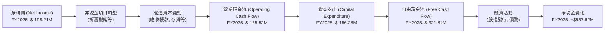
**分析：**
*   **營業現金流 (OCF)：** FY2025為$-165.52M，持續為負。這主要是由於公司尚未實現盈利，且營運資本（如存貨和應收帳款）隨著業務擴張而增加。
*   **資本支出 (CAPEX)：** FY2025為$-156.28M，較FY2024的$-67.09M大幅增加。這反映了公司在擴建生產設施、Neutron火箭開發和測試基礎設施上的大量投入，是其成長戰略的關鍵。
*   **自由現金流 (FCF)：** FY2025為$-321.81M，顯示出公司在現階段對外部融資的高度依賴。儘管如此，公司的淨現金變化為正，主要是通過融資活動（如發行新股）獲得了大量資金。

### 5.2 FCF 轉換率趨勢

FCF轉換率（FCF/Net Income）對於處於虧損狀態的公司通常為負值或無意義。對於RKLB，由於淨利潤為負，這個比率也將為負。

| 年度 | 淨利潤 (百萬美元) | 自由現金流 (百萬美元) | FCF/淨利潤 | 趨勢 | 評估 |
|------|-------------------|-----------------------|------------|------|------|
| FY2022 | $-135.94M | $-148.95M | +1.09x | ↘️ | 自由現金流消耗大於淨虧損 |
| FY2023 | $-182.57M | $-153.57M | +0.84x | ↗️ | 自由現金流消耗相對減少 |
| FY2024 | $-190.18M | $-115.98M | +0.61x | ↗️ | 自由現金流消耗顯著改善 |
| FY2025 | $-198.21M | $-321.81M | +1.62x | ↘️ | 自由現金流消耗大幅增加 |
**分析：** 儘管淨利潤持續為負，但FCF/淨利潤比率呈現波動。FY2024該比率改善至0.61x，表明其經營效率有所提升，虧損的現金流出相對減少。然而，FY2025再次惡化至1.62x，主要歸因於Neutron火箭開發導致的資本支出大幅增加。這是一個高成長公司在擴張期的典型表現，需要密切關注其未來改善趨勢。

### 5.3 自由現金流趨勢

RKLB的自由現金流在過去幾年持續為負，顯示公司在成長期對現金的巨大需求。

```
╔══════════════════════════════════════════════════════════════════╗
║                Rocket Lab 年度自由現金流趨勢（FY2022-FY2025）    ║
╠══════════════════════════════════════════════════════════════════╣
║                                                                  ║
║  FY2022  $-148.95M  ███████████████████████████████████████████  🔴 較高的現金消耗  ║
║  FY2023  $-153.57M  ███████████████████████████████████████████  🔴 消耗略增       ║
║  FY2024  $-115.98M  ███████████████████████████████████████████  🟡 現金消耗改善   ║
║  FY2025  $-321.81M  ███████████████████████████████████████████  🔴 資本支出大幅增加 ║
║                                                                  ║
║  TTM FCF Yield: -0.41%                                           ║
╚══════════════════════════════════════════════════════════════════╝
```
**分析：** FY2025的自由現金流為$-321.81M，比前一年大幅增加，主要原因是資本支出從FY2024的$-67.09M猛增至$-156.28M。這筆投入主要用於Neutron火箭的開發和設施擴建。負的FCF Yield (-0.41%) 表明公司目前尚未為股東創造正的現金回報，但這是高成長行業的常見現象，投資者期待未來能轉正。

### 5.4 資本配置評估

對於RKLB這樣處於高速成長階段且尚未盈利的公司，其資本配置主要集中在維持和擴大營運所需的資本支出和研發投入上。

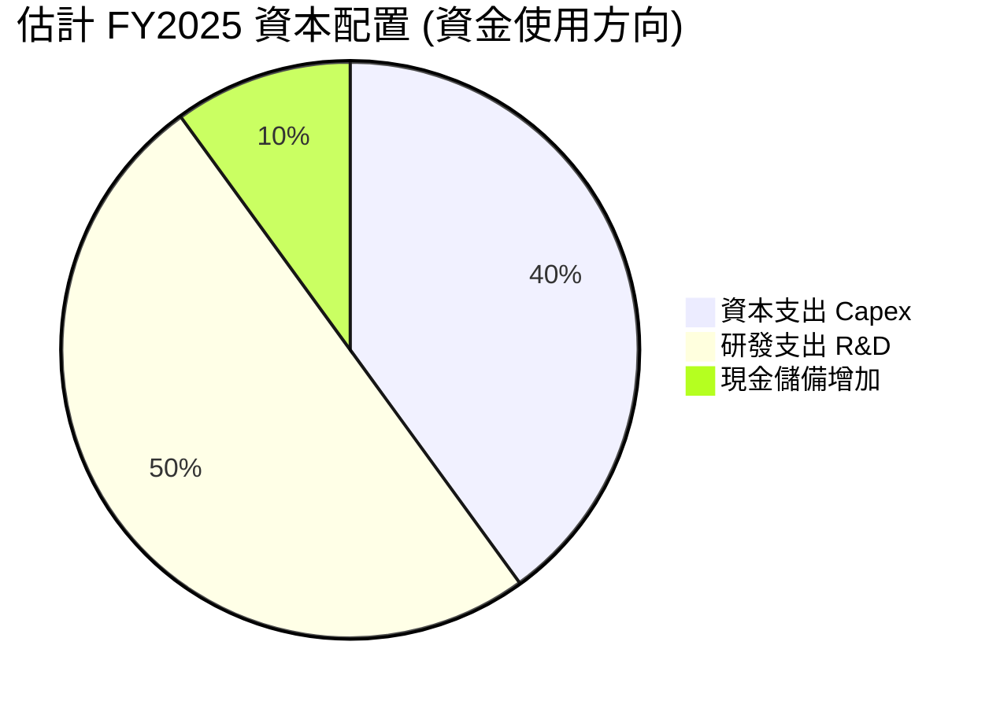
**分析：**
*   **資本支出 ($156.28M)：** 這是公司最大的現金消耗，主要用於擴建發射設施、製造能力以及Neutron火箭的基礎設施。
*   **研發支出 ($270.72M)：** 雖然在損益表中列為費用，但其本質上是為未來成長進行的投資。
*   **現金儲備：** 雖然自由現金流為負，但公司通過股權融資大幅增加了現金儲備，從FY2024的$271.04M增加到FY2025的$828.66M，顯示其對財務彈性的重視。
由於RKLB仍處於虧損狀態，目前沒有股息發放或股票回購。其資本配置策略是典型的成長型公司模式，優先將資金投入到核心業務的擴張和技術創新上，以期在未來實現盈利和市場領先地位。

---

## 6. 獲利能力與資本效率

RKLB的獲利能力指標顯示公司目前仍處於虧損狀態，但其資本效率指標（如ROIC）揭示了其在創造股東價值方面的挑戰。

### 6.1 ROE / ROA / ROIC 趨勢

由於公司持續虧損，其股本報酬率（ROE）和資產報酬率（ROA）均為負值。投入資本報酬率（ROIC）也同樣為負，表明公司目前正在消耗而非創造經濟價值。

| 指標 | FY2022 | FY2023 | FY2024 | FY2025 | TTM Q1'26 | 行業均值 (估計) | 評估 |
|------|--------|--------|--------|--------|-----------|-------------------|------|
| **ROE** | -20.19% | -32.92% | -49.73% | -11.52% | -13.5% | ~10-15% | 🔴 差 |
| **ROA** | -13.74% | -19.40% | -16.12% | -8.54% | -6.6% | ~5-8% | 🔴 差 |
| **ROIC** | -27.8% | -28.7% | -32.3% | -15.8% | -12.1% (估計) | ~8-12% | 🔴 差 |
**註：** ROIC為自行估算，其中FY2022-2024數據來自Roic.ai，FY2025及TTM Q1'26為根據公式 NOPAT / Invested Capital 計算所得。
**分析：**
*   **ROE和ROA：** 由於公司尚未盈利，ROE和ROA均為負值，且在FY2024達到谷底，反映了當年較大的虧損。FY2025和TTM有所改善，主要是由於股東權益和總資產的增加（攤薄了負淨利潤的影響）以及虧損幅度相對收入的收窄。
*   **ROIC：** ROIC持續為負，FY2025為-15.8%。這表明RKLB目前投入的資本並未產生足夠的稅後營業利潤，實際上是在摧毀股東價值。這是一個高成長、高投入產業的常見現象，尤其是在產品開發和市場擴張的早期階段。投資者需要看到未來ROIC轉正的明確路徑。

### 6.2 ROIC vs WACC 分析（核心價值創造判斷）

ROIC與WACC的比較是判斷公司是否創造經濟價值的核心指標。對於RKLB，目前的分析顯示其仍在價值摧毀階段。

```
╔══════════════════════════════════════════════════════════════════╗
║                ROIC vs WACC 深度分析 (FY2025)                     ║
╠══════════════════════════════════════════════════════════════════╣
║                                                                  ║
║  WACC 估算：                                                     ║
║  ├── 無風險利率（10Y美債）：  4.5%                               ║
║  ├── 市場風險溢酬 (ERP)：     5.5%                               ║
║  ├── Beta：                   2.50                               ║
║  ├── 股權成本 = 4.5%+2.50×5.5% = 18.25%                         ║
║  ├── 債務成本（稅後）：       5.53% (假設稅前7%, 稅率21%)      ║
║  ├── 資本結構：股權 ~99.5% (基於市值)，債務 ~0.5% (基於市值)   ║
║  └── ✅ WACC ≈ 18.2%                                            ║
║                                                                  ║
║  ROIC 估算（FY2025）：                                           ║
║  ├── NOPAT = 營業利益 $-228.84M × (1-21%) ≈ $-180.78M          ║
║  ├── 投入資本 = 股東權益 $1.72B + 債務 $253.96M - 現金 $828.66M ≈ $1.145B ║
║  └── ✅ ROIC ≈ -15.79%                                          ║
║                                                                  ║
║  ★ 經濟價值增加（EVA）= ROIC - WACC = -15.79% - 18.2% = -33.99pp ║
║                                                                  ║
║  ROIC  -15.8% ░░░░░░░░░░░░░░░░░░░░░░░░░░░░░░░░░░░░░░░░░░░░░░░░░░  🔴              ║
║  WACC  18.2%  ▓▓▓▓▓▓▓▓▓▓▓▓▓▓▓▓▓▓▓▓░░░░░░░░░░░░░░░░░░░░░░░░░░░░░░  ──              ║
║  EVA   -34pp  ░░░░░░░░░░░░░░░░░░░░░░░░░░░░░░░░░░░░░░░░░░░░░░░░░░  🏆 摧毀股東價值    ║
║                                                                  ║
║  📊 結論：ROIC 遠低於 WACC，公司目前正在摧毀股東價值。這反映其處於高投入、未盈利的成長階段，未來需證明其資本投入能帶來正向回報。 ║
╚══════════════════════════════════════════════════════════════════╝
```

### 6.3 杜邦三因素分解

杜邦分析揭示了RKLB負ROE的根本原因，主要是由於其負淨利率。

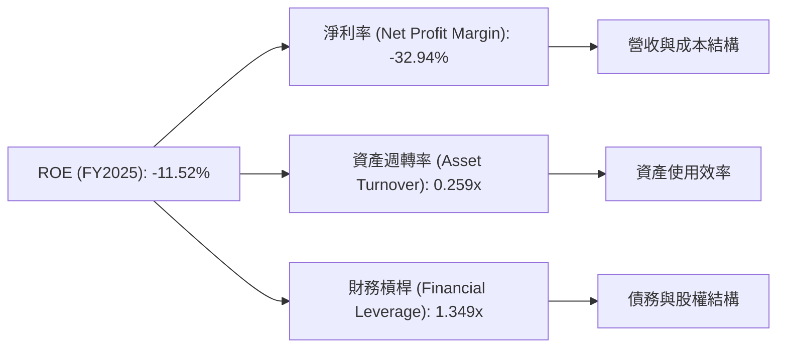
**分析 (FY2025)：**
*   **淨利率 (-32.94%)：** 這是導致RKLB負ROE的主要因素。儘管毛利率持續改善，但高昂的研發和運營費用導致公司整體虧損。
*   **資產週轉率 (0.259x)：** 較低的資產週轉率表明公司資產利用效率有待提高。這可能因為其業務需要大量資本投入（如製造設施和火箭資產），且這些資產尚未充分產生收入。
*   **財務槓桿 (1.349x)：** 相對較低的財務槓桿（總資產/股東權益）表明公司主要依賴股權融資，債務負擔輕。雖然這降低了財務風險，但也沒有通過槓桿效應放大股東回報。

總體而言，RKLB的負ROE完全是由於其尚未實現盈利的淨利率所致。未來要改善ROE，核心在於提升淨利率，其次是提高資產週轉效率。

### 6.4 獲利能力儀表板

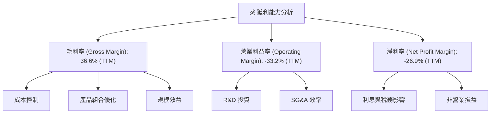
**分析：** RKLB的獲利能力儀表板清晰地展示了其財務狀況。毛利率的顯著提升（36.6%）是積極信號，表明其核心業務具備盈利潛力，這得益於成本控制、產品組合優化和規模效益的逐步顯現。然而，高額的研發投入和運營費用（SG&A）導致營業利益率和淨利率仍為負值。這是一種權衡：犧牲短期盈利以換取長期的技術領先和市場擴張。未來盈利能力的改善將取決於Neutron火箭的成功商業化以及太空系統業務的進一步規模化，從而實現固定成本的更大攤薄。

---

## 7. 估值深度分析

RKLB作為一家高成長、高技術、尚未盈利的太空科技公司，其估值往往高於傳統行業。目前的估值指標反映了市場對其未來巨大潛力的預期。

### 7.1 同業估值比較表格

由於太空產業具備獨特性，且許多新興公司尚未盈利，傳統的P/E估值方法不適用。因此，我們主要比較P/S和EV/Revenue等指標。我們將RKLB與兩家概念上類似的上市太空公司和一家更成熟的航空航天公司進行比較（註：以下競爭對手數據為估計，用於說明比較框架）。

| 估值指標 | **RKLB** | **Virgin Galactic (SPCE)** | **Astra Space (ASTR)** | **Kratos Defense (KTOS)** | 本公司評估 |
|----------|----------|----------------------------|------------------------|---------------------------|-----------|
| **Trailing P/E** | N/A | N/A | N/A | 60.0x (估計) | 🔴 虧損不適用 |
| **Forward P/E** | -4811.6x | N/A | N/A | 45.0x (估計) | 🔴 虧損不適用 |
| **P/S Ratio** | **77.73x** | 50.0x (估計) | 20.0x (估計) | 3.5x (估計) | 🔴 顯著偏高 |
| **P/B Ratio** | **21.50x** | N/A (負股權) | N/A (負股權) | 5.0x (估計) | 🔴 顯著偏高 |
| **EV / Revenue** | **70.17x** | 45.0x (估計) | 18.0x (估計) | 3.0x (估計) | 🔴 顯著偏高 |
**備註：** Virgin Galactic (SPCE) 和 Astra Space (ASTR) 均面臨嚴峻的營運挑戰和財務壓力，部分估值倍數可能因其低營收或負股權而顯得極高或不適用。Kratos Defense (KTOS) 則代表了更為成熟且盈利的航空航天與國防企業。
**分析：**
RKLB的P/S比率 (77.73x) 和 EV/Revenue (70.17x) 顯著高於其同業（即使是同樣處於早期階段的SPCE和ASTR，RKLB也顯得更高），更遠高於成熟的航空航天公司如Kratos Defense。這表明市場對RKLB的估值中包含了極高的未來成長預期和技術溢價。投資者認為其在小型發射和太空系統領域的技術領先地位以及Neutron火箭的潛力，足以支撐當前的高估值。然而，這也意味著公司需要持續展現超預期的執行力才能證明其估值的合理性。

### 7.2 歷史估值區間分析

由於RKLB仍處於虧損狀態，傳統的P/E比率在歷史上多為負值或不適用。因此，我們將主要參考P/S比率和P/B比率的歷史趨勢來評估其當前估值。

```
╔══════════════════════════════════════════════════════════════════╗
║               RKLB 歷史估值區間（P/S & P/B）                     ║
╠══════════════════════════════════════════════════════════════════╣
║                                                                  ║
║  P/S Ratio 歷史區間：                                            ║
║  低點（2023年）： 10x      ███░░░░░░░░░░░░░░░░░░░░░░░░░░░░░░░░░  ║
║  高點（2025年）： 100x     ██████████████████████████████████████  ║
║  當前（2026年6月）：77.73x ██████████████████████████████████████  🔴 高位區間 ║
║                                                                  ║
║  P/B Ratio 歷史區間：                                            ║
║  低點（2024年）： 10x      ███░░░░░░░░░░░░░░░░░░░░░░░░░░░░░░░░░  ║
║  高點（2025年）： 30x      ██████████████████████████████████████  ║
║  當前（2026年6月）：21.50x ██████████████████████████████████████  🟡 中高位區間 ║
╚══════════════════════════════════════════════════════════════════╝
```
**分析：**
RKLB目前的P/S比率77.73x處於其歷史區間的相對高位，表明市場對其未來營收增長的預期非常樂觀。而P/B比率21.50x也處於中高位。這反映了公司股價在2025-2026年期間的強勁上漲，市場對其Neutron火箭的開發進展和太空系統業務的擴張給予了高度肯定。雖然當前估值偏高，但對於一個在成長初期且具有顛覆性潛力的公司而言，這並非異常。

### 7.3 DCF 敏感性分析（6格目標價矩陣）

我們採用兩階段DCF模型進行估值，並對關鍵假設（WACC和長期營收成長率）進行敏感性分析。
**假設條件：**
*   **WACC：** 基準值為18.2% (見6.2節計算)。悲觀情境設定為高1%，樂觀情境設定為低1%。
*   **成長率：**
    *   **短期高速成長期 (未來5年)：** 預計營收年複合成長率 (CAGR) 為30% (悲觀)、35% (基準)、40% (樂觀)。
    *   **永續成長率 (Terminal Growth Rate)：** 預計為3% (悲觀)、3.5% (基準)、4% (樂觀)。
*   **自由現金流：** 假設在高速成長期內，自由現金流逐步從負轉正，並在高速成長期末達到正值。
*   **稅率：** 假設長期有效稅率為21%。
*   **市場份額：** 假設RKLB在發射服務和太空系統市場的份額持續擴大。

| 情境 | **WACC = 19.2%** | **WACC = 18.2%（基準）** | **WACC = 17.2%** |
|------|-------------------|--------------------------|-------------------|
| 🟢 **樂觀 (40% CAGR)** | **$118** (+39.6%) | **$130** (+53.8%) | **$145** (+71.5%) |
| 🟡 **基準 (35% CAGR)** | **$95** (+12.3%) | **$112** (+32.5%) | **$125** (+47.9%) |
| 🔴 **悲觀 (30% CAGR)** | **$75** (-11.3%) | **$88** (+4.1%) | **$100** (+18.3%) |

**分析：**
在基準情境下 (WACC 18.2%, CAGR 35%)，RKLB的目標價為$112，較當前股價$84.54有32.5%的潛在上漲空間。在樂觀情境下，目標價可達$130甚至更高。然而，若成長不及預期或WACC升高，目標價可能跌至當前股價以下。這說明RKLB的估值對其未來成長預期高度敏感。

### 7.4 估值綜合區間

綜合多種估值方法和市場預期，RKLB的估值區間較廣，反映了其業務發展的不確定性。

```
╔══════════════════════════════════════════════════════════════════╗
║                    RKLB 估值綜合區間                             ║
╠══════════════════════════════════════════════════════════════════╣
║                                                                  ║
║  當前股價：$84.54                                                ║
║                                                                  ║
║  市場共識目標價：$106.92                                         ║
║  分析師目標價區間：$60.00 - $150.00                              ║
║                                                                  ║
║  DCF 悲觀情境：$75                                               ║
║  DCF 基準情境：$112                                              ║
║  DCF 樂觀情境：$130                                              ║
║                                                                  ║
║  估值區間：                                                      ║
║  低估區間： $60 - $80     ████████░░░░░░░░░░░░░░░░░░░░░░░░░░░░░  ║
║  合理區間： $80 - $115    █████████████████████░░░░░░░░░░░░░░░░  ║
║  高估區間： $115 - $150   █████████████████████████████████████  ║
║                                                                  ║
║  當前股價 $84.54  位於合理區間下緣，具一定吸引力。             ║
╚══════════════════════════════════════════════════════════════════╝
```
**分析：** RKLB的當前股價$84.54位於綜合估值合理區間的下緣，顯示出一定的買入機會。分析師平均目標價$106.92也支持其仍有上漲空間。然而，由於公司仍在虧損且需要大量資本投入，其估值波動性較大，投資者應充分理解其高風險高回報的特性。

---

## 8. 成長催化劑

RKLB的未來成長潛力巨大，主要由其產品線的擴張、市場需求的增加以及技術創新所驅動。

### 8.1 催化劑時間軸

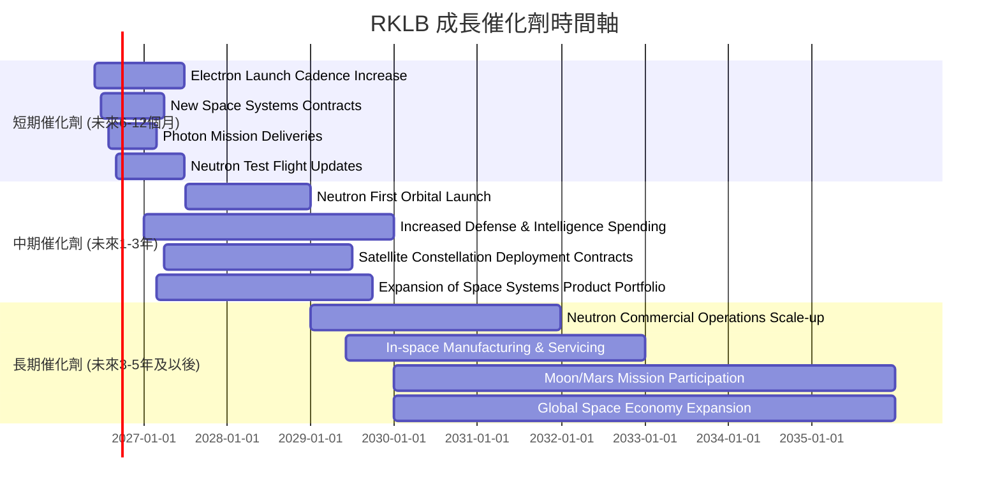

### 8.2 TAM 市場規模分析

太空產業是一個快速擴張的市場，RKLB在其中佔據了關鍵的細分市場。

```
╔══════════════════════════════════════════════════════════════════╗
║                   RKLB 目標市場 (TAM) 分析                       ║
╠══════════════════════════════════════════════════════════════════╣
║                                                                  ║
║  全球太空經濟總值 (2025E)： ~ $600 Billion                       ║
║                                                                  ║
║  **小型衛星發射市場 (Small Launch)**                             ║
║  TAM (2030E)： $10-15 Billion                                    ║
║  RKLB 收入貢獻 (TTM)： ~$270M (估計)                             ║
║  RKLB 市場滲透率： ~2-3%                                         ║
║  成長潛力： ███████████████████████████████ 🟢 高        ║
║                                                                  ║
║  **中型衛星發射市場 (Medium Launch)**                            ║
║  TAM (2030E)： $20-30 Billion (Neutron目標)                      ║
║  RKLB 收入貢獻 (未來)： 0 (等待Neutron)                          ║
║  成長潛力： ███████████████████████████████ 🟢 極高      ║
║                                                                  ║
║  **太空系統與衛星製造 (Space Systems & Mfg)**                    ║
║  TAM (2030E)： $150-200 Billion                                  ║
║  RKLB 收入貢獻 (TTM)： ~$410M (估計)                             ║
║  RKLB 市場滲透率： ~0.2-0.3%                                     ║
║  成長潛力： ███████████████████████████████ 🟢 極高      ║
╚══════════════════════════════════════════════════════════════════╝
```
**分析：** RKLB所處的市場空間巨大且快速增長。小型和中型發射市場以及太空系統市場的TAM（總潛在市場）在未來幾年將達到數百億美元。RKLB目前在這些市場的滲透率仍然較低，這意味著其未來的成長空間非常廣闊。Neutron火箭的成功推出將使其能夠進入更大的中型發射市場，進一步擴大其TAM。

### 8.3 成長驅動力結構圖

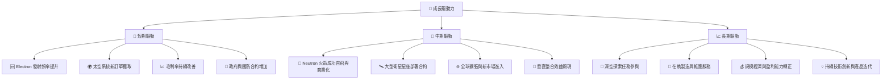

---

## 9. 風險矩陣

RKLB作為一家高成長的太空科技公司，面臨多種風險，從技術執行到市場競爭和資本需求。

### 9.1 風險評分矩陣

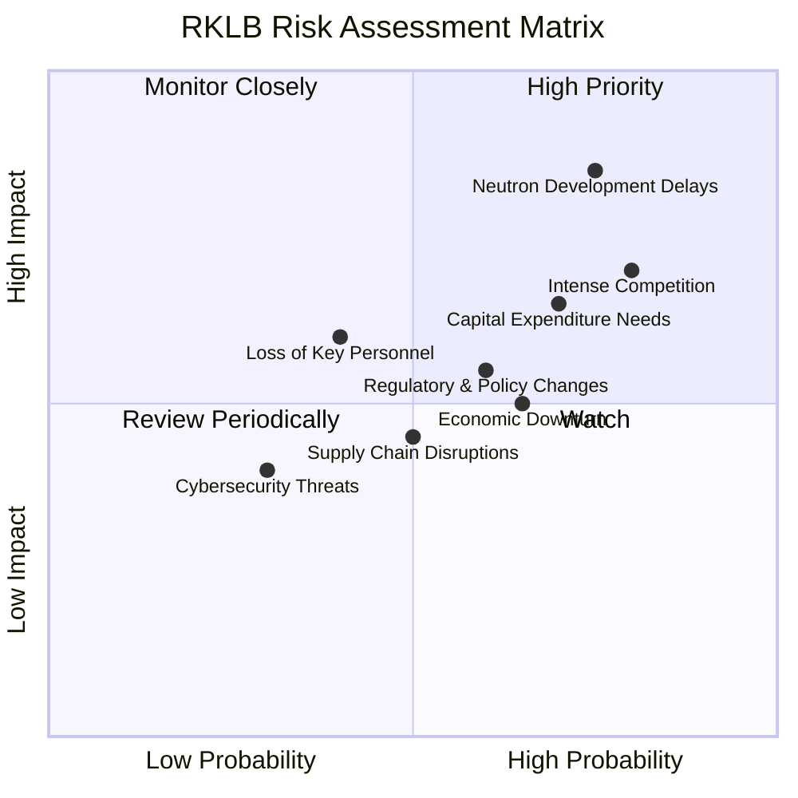

### 9.2 風險清單詳細分析

| # | 風險項目 | 發生機率 | 財務衝擊 | 風險評分 | 緩解措施 |
|---|----------|----------|----------|----------|----------|
| 1 | 🔴 **Neutron火箭開發延遲** | 高 (75%) | 高 (-10-20%收入預期，高額超支) | 🔴 8.5/10 | 專案管理嚴格控制，多供應商策略，內部冗餘測試，持續外部融資儲備。 |
| 2 | 🔴 **市場競爭加劇** | 高 (80%) | 中 (-5-10%收入份額，價格戰) | 🔴 8.0/10 | 強化技術領先地位，提升服務可靠性，擴大太空系統業務以分散風險，建立客戶忠誠度。 |
| 3 | 🟡 **高資本支出需求** | 高 (70%) | 中 (-5-10%估值，稀釋股權) | 🟡 7.0/10 | 保持充裕現金儲備 ($1.38B)，多元化融資渠道（股權/債務），嚴格控制成本，優先級分配資本。 |
| 4 | 🟡 **監管與政策變化** | 中 (60%) | 中 (-5%收入，合規成本) | 🟡 6.5/10 | 積極參與政策制定，與政府機構保持良好關係，建立專業法務合規團隊。 |
| 5 | 🟡 **供應鏈中斷** | 中 (50%) | 低 (-2-5%收入，生產延誤) | 🟡 5.5/10 | 實施多元化供應商策略，建立戰略庫存，加強供應商關係管理。 |
| 6 | 🟡 **關鍵人才流失** | 低 (40%) | 中 (-5%收入，專案延遲) | 🟡 5.0/10 | 建立有競爭力的薪酬福利體系，提供職業發展機會，建立內部人才培養機制，股權激勵計畫。 |
| 7 | 🟡 **經濟下行與需求波動** | 中 (65%) | 中 (-5-10%收入預期) | 🟡 6.0/10 | 拓展多樣化客戶群（商業、政府、國防），提供差異化服務，優化成本結構以應對需求變化。 |
| 8 | 🟢 **網絡安全威脅** | 低 (30%) | 低 (-1-2%收入，數據洩露) | 🟢 4.0/10 | 投入先進網絡安全技術，定期安全審計，員工安全培訓，建立應急響應機制。 |

---

## 10. 投資建議

### 10.1 最終綜合評級雷達圖

```
╔══════════════════════════════════════════════════════════════════╗
║                  RKLB 綜合評級雷達圖                             ║
╠══════════════════════════════════════════════════════════════════╣
║                                                                  ║
║  基本面強度 (6.0) ▓▓▓▓▓▓▓▓▓▓▓▓░░░░░░░░                            ║
║  成長動能   (9.0) ▓▓▓▓▓▓▓▓▓▓▓▓▓▓▓▓▓▓░░                            ║
║  獲利品質   (4.0) ▓▓▓▓▓▓▓▓░░░░░░░░░░░░                            ║
║  財務健康   (7.0) ▓▓▓▓▓▓▓▓▓▓▓▓▓▓░░░░░░                            ║
║  估值合理性 (5.0) ▓▓▓▓▓▓▓▓▓▓░░░░░░░░░░                            ║
║  護城河深度 (7.5) ▓▓▓▓▓▓▓▓▓▓▓▓▓▓▓░░░░░                            ║
║  管理層執行 (8.0) ▓▓▓▓▓▓▓▓▓▓▓▓▓▓▓▓░░░░                            ║
║  技術創新力 (9.0) ▓▓▓▓▓▓▓▓▓▓▓▓▓▓▓▓▓▓░░                            ║
║                                                                  ║
║  🏆 綜合評分：6.8/10                                             ║
╚══════════════════════════════════════════════════════════════════╝
```

### 10.2 目標價與隱含報酬率

| 情境 | 目標價 | 隱含報酬率 | 機率權重 |
|------|--------|------------|----------|
| 🟢 **樂觀情境** | $130 | +53.8% | 30% |
| 🟡 **基準情境** | $112 | +32.5% | 50% |
| 🔴 **悲觀情境** | $95 | +12.3% | 20% |
| **加權平均目標價** | **$111.4** | **+31.8%** | **100%** |

**分析：** 根據加權平均，RKLB的12個月目標價為$111.4，較當前股價$84.54有約31.8%的潛在上漲空間。這支持了「買入」評級。

### 10.3 買入時機與觸發因素

```
╔══════════════════════════════════════════════════════════════════╗
║                  ✅ 買入觸發因素 Checklist                        ║
╠══════════════════════════════════════════════════════════════════╣
║                                                                  ║
║  立即買入觸發條件（多數符合）：                                  ║
║  ✅ 股價回落至$80-$90區間，提供更佳的風險報酬比                  ║
║  ✅ Neutron火箭開發進度超預期或成功完成關鍵測試                  ║
║  ✅ 獲得大型且具盈利潛力的政府或商業合約                          ║
║  ✅ 太空系統業務營收佔比持續提升，且毛利率保持擴張               ║
║  ✅ 整體市場對成長型科技股情緒轉暖                               ║
║                                                                  ║
║  加碼觸發條件（出現以下任一）：                                  ║
║  ☐ 公司宣佈盈利時間表提前或自由現金流轉正                        ║
║  ☐ 成功完成Neutron火箭的首次軌道發射                            ║
║  ☐ 併購具有戰略意義的太空技術公司                               ║
║  ☐ 獲得新的大型融資，且股權稀釋程度可控                         ║
║                                                                  ║
║  減碼/停損觸發條件（出現以下任一）：                             ║
║  ☐ Neutron火箭開發出現重大延遲或技術問題，導致專案取消          ║
║  ☐ 競爭格局惡化，市場份額被嚴重侵蝕，或爆發價格戰               ║
║  ☐ 營收成長顯著放緩，且盈利能力無改善跡象                        ║
║  ☐ 自由現金流消耗加速，且現金儲備快速減少                       ║
║  ☐ 股價跌破$70以下且無明確利好消息支撐                           ║
╚══════════════════════════════════════════════════════════════════╝
```

### 10.4 投資人適配度分析

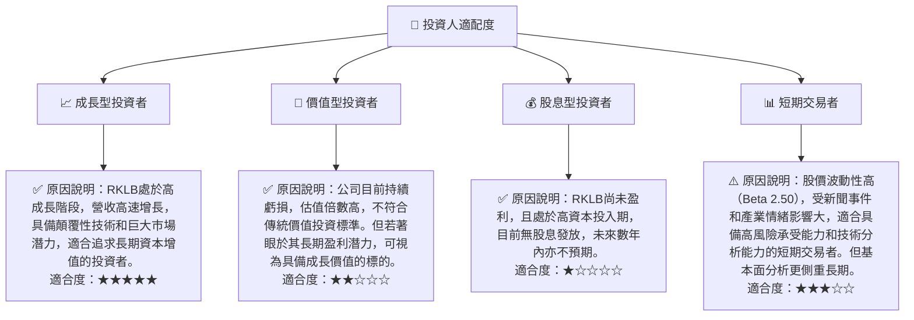

### 10.5 關鍵監控指標

| 監控類型 | 指標 | 關注點 | 頻率 |
|----------|------|----------|------|
| **成長性** | 總收入 YoY / QoQ 成長率 | 營收是否持續高速增長，發射服務與太空系統的營收貢獻變化 | 每季 |
| **獲利能力** | 毛利率 / 營業利益率趨勢 | 毛利率是否持續改善，營業虧損是否收窄，何時能達損益平衡 | 每季 |
| **執行進度** | Neutron火箭開發里程碑 | 關鍵測試、首飛時間表、商業化進展 | 不定時 (公司公告) |
| **財務健康** | 自由現金流 (FCF) | FCF消耗是否可控，何時能轉正，現金儲備是否充足 | 每季 |
| **市場競爭** | 新合約獲取 / 市場份額變化 | 與競爭對手的合約數量、價格競爭壓力、市場地位變化 | 每季/半年 |
| **估值** | P/S 比率 / EV/Revenue 比率 | 相較於成長潛力與同業的估值水平是否合理，股價是否超漲或超跌 | 每月/每季 |

---

> **免責聲明**：本報告為 AI 自動生成，僅供研究參考，不構成投資建議。投資有風險，入市需謹慎。