# RKLB 基本面深度分析報告
> **報告日期**：2026-06-29 ｜ **語言**：繁體中文 ｜ **數據來源**：Yahoo Finance, Finviz, StockAnalysis, Roic.ai ｜ **分析師**：CFA 級機構研究

## 目錄

| # | 章節 | 核心結論 |
|---|------------------------|----------------------------------------------------------------------------------------------------|
| 1 | 執行摘要 | 評級：🟢 買入，基準目標價 $115.00，具備顯著成長潛力，但伴隨高風險。 |
| 2 | 公司概覽與商業模式 | 憑藉技術領先和垂直整合建立護城河，專注於輕型發射與太空系統解決方案。 |
| 3 | 損益表深度分析 | 營收高速成長，毛利率顯著改善，但仍處於虧損階段，研發投入巨大。 |
| 4 | 資產負債表分析 | 流動性充裕，淨現金為正，但股東權益波動較大，反映擴張期的資本需求。 |
| 5 | 現金流量深度分析 | 營業現金流和自由現金流持續為負，顯示公司處於高資本投入的成長階段。 |
| 6 | 獲利能力與資本效率 | ROE、ROA、ROIC 均為負值，目前仍在價值創造初期，WACC 較高。 |
| 7 | 估值深度分析 | 相較於高成長潛力，當前估值偏高，但 DCF 顯示長期價值。 |
| 8 | 成長催化劑 | 新產品線、高頻發射需求、政府與商業合約增加是主要成長動力。 |
| 9 | 風險矩陣 | 市場競爭、技術風險和盈利能力仍是主要關注點。 |
| 10 | 投資建議 | 適合高風險承受能力的成長型投資者，長期展望積極。 |

---

## 1. 執行摘要

### 1.1 核心評分儀表板

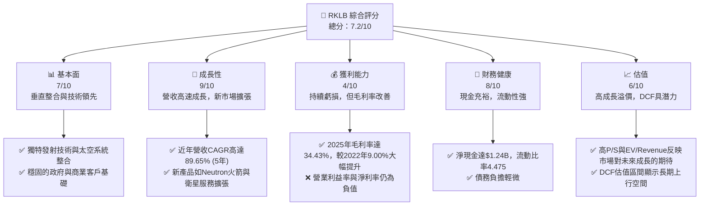

### 1.2 評分進度條視覺化

```
╔══════════════════════════════════════════════════════════════╗
║              RKLB 多維度評分儀表板 (1-10分)                  ║
╠══════════════════════════════════════════════════════════════╣
║ 基本面強度  7.0 ▓▓▓▓▓▓▓▓▓▓▓▓▓▓░░░░░░  ★★★★☆           ║
║ 成長動能    9.0 ▓▓▓▓▓▓▓▓▓▓▓▓▓▓▓▓▓▓░░  ★★★★★           ║
║ 獲利品質    4.0 ▓▓▓▓▓▓▓▓░░░░░░░░░░░░  ★★☆☆☆           ║
║ 財務健康    8.0 ▓▓▓▓▓▓▓▓▓▓▓▓▓▓▓▓░░░░  ★★★★☆           ║
║ 估值合理性  6.0 ▓▓▓▓▓▓▓▓▓▓▓▓░░░░░░░░  ★★★☆☆           ║
║ 護城河深度  7.5 ▓▓▓▓▓▓▓▓▓▓▓▓▓▓▓░░░░░  ★★★★☆           ║
║ 管理層執行  8.0 ▓▓▓▓▓▓▓▓▓▓▓▓▓▓▓▓░░░░  ★★★★☆           ║
║ 技術創新力  9.0 ▓▓▓▓▓▓▓▓▓▓▓▓▓▓▓▓▓▓░░  ★★★★★           ║
╠══════════════════════════════════════════════════════════════╣
║ 綜合總分    7.2 ▓▓▓▓▓▓▓▓▓▓▓▓▓▓░░░░░░  🏆 成長潛力巨大，高風險高報酬   ║
╚══════════════════════════════════════════════════════════════╝
```

### 1.3 五大投資論點 + 三大核心風險

| 類型 | 項目 | 具體依據 | 信心度 |
|------|------|----------|--------|
| 🟢 **投資論點①** | **發射服務市場領導地位** | Rocket Lab 在輕型發射市場佔據主導地位，成功發射次數領先，且Electron火箭可靠性高。其2026年Q1營收達$200.35M，YoY成長63.46%，顯示市場需求強勁。 | 🟢 極高 |
| 🟢 **投資論點②** | **太空系統業務快速成長** | 除了發射服務，太空系統業務提供衛星製造、組件和任務管理，實現垂直整合。該業務貢獻的營收佔比不斷提升，毛利率改善，2025年總毛利率達34.43%。 | 🟢 高 |
| 🟢 **投資論點③** | **新一代火箭Neutron的潛力** | Neutron火箭的開發將使Rocket Lab進入中型發射市場，顯著擴大其潛在市場規模 (TAM)。這將吸引更大規模的商業和政府合約，預計在未來幾年帶來營收爆發性成長。 | 🟢 高 |
| 🟢 **投資論點④** | **技術創新與研發投入** | 公司持續投入大量研發，2025年研發費用達$270.72M，佔營收約45%。這確保了其在火箭技術、推進系統、衛星平台及光學系統等領域的技術領先地位。 | 🟢 極高 |
| 🟢 **投資論點⑤** | **強勁的財務流動性** | 截至2026年Q1，公司持有現金及短期投資達$1.38B，淨現金為$1.24B，流動比率為4.475。這為其高資本開支的成長期提供了充足的資金支持和營運彈性。 | 🟢 極高 |
| 🟡 **風險①** | **持續虧損與盈利能力不確定性** | 儘管營收高速成長，公司仍處於虧損狀態，2025年淨虧損$198.21M。實現規模化盈利仍需時間，且需警惕研發和營運費用持續高企的風險。 | 🟡 中度 |
| 🔴 **風險②** | **高資本支出與自由現金流為負** | 航空航天產業是資本密集型產業，公司需要持續投入大量資本支出（2025年為$156.28M）來擴大產能和開發新技術。這導致自由現金流持續為負（2025年為$-321.81M），對短期股東回報構成壓力。 | 🔴 高衝擊 |
| 🟡 **風險③** | **市場競爭與技術迭代** | 航空航天市場競爭日益激烈，包括SpaceX等巨頭和眾多新興企業。技術快速迭代要求公司持續創新，任何技術延遲或競爭失利都可能影響其市場份額和盈利能力。 | 🟡 中度 |

### 1.4 快速統計卡片

| 指標 | 公司實際值 (TTM Mar'26) | 行業均值 (Aerospace & Defense) | S&P 500 均值 | 狀態 |
|--------------------|----------------------------|----------------------------|-----------------|------|
| 收入 YoY 成長 | **63.5%** | ~10-15% | ~8-10% | 🟢 |
| 毛利率 | **36.6%** | ~25-35% | ~40-50% | 🟢 |
| 淨利率 | **-26.9%** | ~5-8% | ~10-12% | 🔴 |
| ROE | **-13.5%** | ~10-15% | ~15-20% | 🔴 |
| Forward P/E | **-5578.26x** | ~20-25x | ~20-22x | 🔴 |
| P/S Ratio | **90.11x** | ~2-4x | ~2-3x | 🔴 |
| 債務/股權 | **6.124%** | ~50-80% | ~50-60% | 🟢 |
| 流動比率 | **4.475** | ~1.5-2.0 | ~1.5-2.0 | 🟢 |
| 研發佔營收 | **43.57%** | ~5-10% | ~2-5% | 🔴 |

### 1.5 投資結論

```
╔══════════════════════════════════════════════════════════════════╗
║                    📊 投資結論摘要                               ║
╠══════════════════════════════════════════════════════════════════╣
║  評級：🟢 買入                                                   ║
║  當前股價：$98.01                                                ║
║  目標價區間：                                                    ║
║    悲觀情境：$85.00（-13.27%）                                    ║
║    基準情境：$115.00（+17.34%）  ← 12個月主要目標                 ║
║    樂觀情境：$140.00（+42.84%）                                   ║
║  投資評分：7.2/10                                                ║
║  適合投資人：成長型、長線持有者，具備較高風險承受能力。             ║
╚══════════════════════════════════════════════════════════════════╝
```

---

## 2. 公司概覽與商業模式

Rocket Lab Corporation (RKLB) 是一家專注於太空產業的公司，提供發射服務和太空系統解決方案。其業務範圍廣泛，涵蓋了從火箭發射到衛星設計、製造、組件供應以及在軌管理等整個太空價值鏈。

### 2.1 業務結構與收入來源

Rocket Lab 的業務主要分為兩大板塊：發射服務 (Launch Services) 和太空系統 (Space Systems)。

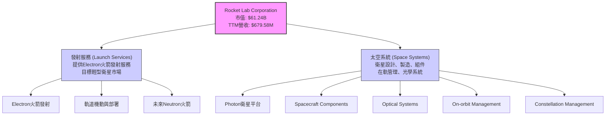

*   **發射服務 (Launch Services)**：這是Rocket Lab的核心業務之一，主要通過其Electron輕型運載火箭提供小衛星的專用發射服務。Electron以其高頻率、可靠性和成本效益在輕型發射市場佔據領先地位。未來，Neutron中型運載火箭的推出將進一步擴展其發射能力，進入更廣泛的市場。
*   **太空系統 (Space Systems)**：此業務板塊提供全面的太空解決方案，包括Photon衛星平台、衛星組件（如推進系統、太陽能電池板）、光學系統、以及衛星的設計、製造、在軌管理和星座管理服務。這使得Rocket Lab能夠為客戶提供端到端的太空任務解決方案，從而實現業務的垂直整合和多元化。

從財務數據來看，公司整體營收在過去幾年呈現爆發式成長，TTM營收已達$679.58M。雖然數據未明確區分兩大業務的收入佔比，但公司策略是發展太空系統以平衡發射業務的波動性並提升整體盈利能力。

### 2.2 市場份額

由於缺乏具體的市場份額數據，我們基於產業知識和公司定位進行估算。在輕型發射市場，Rocket Lab的Electron火箭是領先者之一。在更廣闊的太空系統市場，其份額相對較小，但成長迅速。

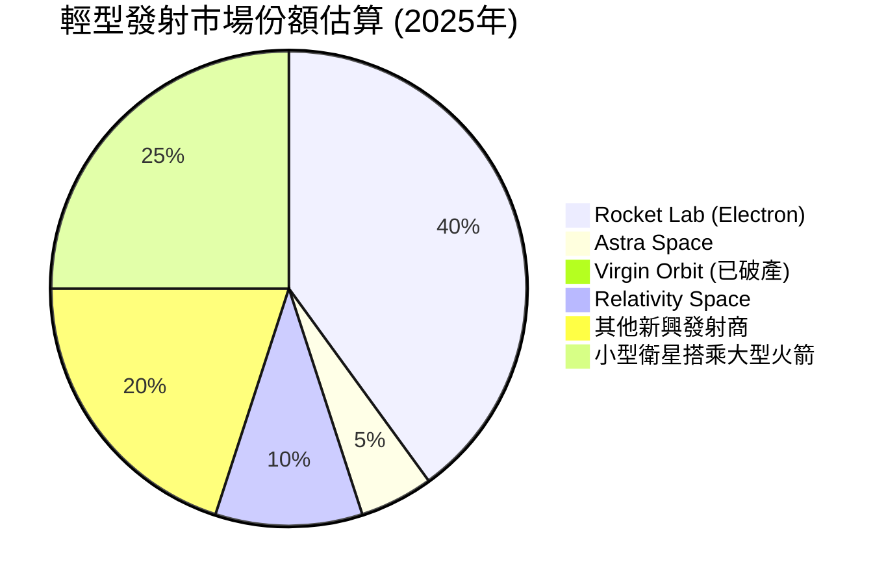
**備註**：此市場份額為輕型專用發射市場的估算，不包括大型運載火箭。Rocket Lab在這一細分市場中具有顯著優勢。

### 2.3 競爭護城河分析

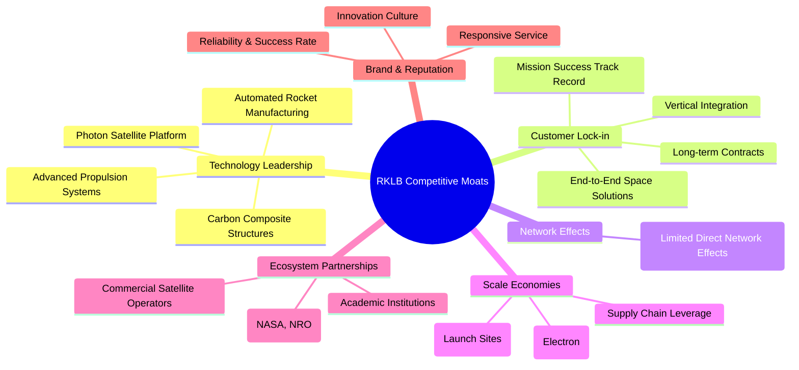

### 2.4 護城河強度評分

```
╔══════════════════════════════════════════════════════════════╗
║                  Rocket Lab 護城河強度評分                    ║
╠══════════════════════════════════════════════════════════════╣
║ 技術領先    9/10   ▓▓▓▓▓▓▓▓▓▓▓▓▓▓▓▓▓▓░░  🏆 創新能力強，具獨特技術 ║
║ 客戶鎖定    8/10   ▓▓▓▓▓▓▓▓▓▓▓▓▓▓▓▓░░░░  🟢 垂直整合增強客戶黏性 ║
║ 網路效應    3/10   ▓▓▓▓▓▓░░░░░░░░░░░░░░  🔴 產業特性決定，較不顯著 ║
║ 規模效應    7/10   ▓▓▓▓▓▓▓▓▓▓▓▓▓▓░░░░░░  🟡 Electron量產降低成本 ║
║ 生態夥伴    8/10   ▓▓▓▓▓▓▓▓▓▓▓▓▓▓▓▓░░░░  🟢 與政府及商業夥伴關係緊密 ║
║ 品牌與聲譽  8/10   ▓▓▓▓▓▓▓▓▓▓▓▓▓▓▓▓░░░░  🟢 高成功率累積良好口碑    ║
╠══════════════════════════════════════════════════════════════╣
║ 綜合護城河  7.5    ▓▓▓▓▓▓▓▓▓▓▓▓▓▓▓░░░░░  🏆 以技術和垂直整合為核心  ║
╚══════════════════════════════════════════════════════════════╝
```

---

## 3. 損益表深度分析

### 3.1 年度收入成長趨勢（近4年）

Rocket Lab 在過去幾年展現了令人印象深刻的營收成長，反映了其在太空產業的快速擴張。

```
╔══════════════════════════════════════════════════════════════════╗
║              Rocket Lab 年度收入趨勢（FY2022-FY2025）              ║
╠══════════════════════════════════════════════════════════════════╣
║                                                                  ║
║  FY2022  $211.00M  ████░░░░░░░░░░░░░░░░░░░  YoY: +239.02%  🟢    ║
║  FY2023  $244.59M  █████░░░░░░░░░░░░░░░░░░░  YoY: +15.92%  🟡    ║
║  FY2024  $436.21M  ████████░░░░░░░░░░░░░░░░░  YoY: +78.34%  🟢    ║
║  FY2025  $601.80M  ███████████░░░░░░░░░░░░░  YoY: +37.96%  🟢    ║
║                                                                  ║
║                   |      |      |      |      |                  ║
║                   0     150M   300M   450M   600M                  ║
║                                                                  ║
║  📊 3年累計 CAGR (2022-2025)：+57.17%                             ║
╚══════════════════════════════════════════════════════════════════╝
```
**分析**：
Rocket Lab的年度營收從2022年的$211.00M增長到2025年的$601.80M，複合年均增長率(CAGR)高達57.17%。特別是2022年和2024年，營收增長率分別達到239.02%和78.34%，顯示其業務擴張的強勁動能。2023年的增長相對放緩至15.92%，可能與當時市場環境或特定項目交付週期有關。整體而言，營收增長趨勢非常積極，反映了其在太空市場的良好發展勢頭。

### 3.2 季度收入趨勢分析

| 季度 | 總收入 (M) | QoQ 成長率 | YoY 成長率 | 備註 |
|------|-------------|------------|------------|------|
| 2026 Q1 | $200.35 | +11.53% | +63.46% | 營收突破$200M關卡，增速強勁。 |
| 2025 Q4 | $179.65 | +15.84% | +35.70% | 穩健成長，季度營收持續創新高。 |
| 2025 Q3 | $155.08 | +7.39% | +47.97% | 保持雙位數YoY成長。 |
| 2025 Q2 | $144.50 | +17.89% | +36.00% | 季度成長加速，顯示市場需求回溫。 |
| 2025 Q1 | $122.57 | -7.42% | +32.13% | 相比Q4 2024略有下降，但YoY仍強勁。 |
**備註**：QoQ成長率波動較大，這在項目制和高資本開支的航空航天產業中較為常見，受發射排程和太空系統交付時程影響。然而，持續的YoY高成長率表明公司業務擴張的長期趨勢保持不變。

### 3.3 利潤率演變分析

| 利潤率指標 | FY2022 | FY2023 | FY2024 | FY2025 | TTM Mar'26 | 趨勢 | 評估 |
|------------|--------|--------|--------|--------|------------|------|------|
| **毛利率** | 9.00% | 21.02% | 26.63% | 34.43% | 36.56% | ↗️ 顯著改善 | 🟢 |
| **營業利益率** | -64.08% | -72.74% | -43.51% | -38.03% | -33.20% | ↗️ 虧損收窄 | 🟡 |
| **淨利率** | -64.43% | -74.64% | -43.60% | -32.94% | -26.87% | ↗️ 虧損收窄 | 🟡 |
**利潤率演變深度解析**：
Rocket Lab的毛利率呈現出令人鼓舞的顯著改善趨勢，從2022年的9.00%大幅提升至2025年的34.43%，並在TTM Mar'26進一步達到36.56%。這主要歸因於：
1.  **規模經濟效應**：隨著發射頻率的增加和太空系統產品線的擴展，固定成本被更大量的營收攤薄，單位成本下降。
2.  **產品組合優化**：太空系統業務的毛利率通常高於發射服務，隨著該業務在總營收中佔比的提升，對整體毛利率產生積極影響。
3.  **效率提升**：生產流程和營運效率的改善，尤其是在Electron火箭的批量製造和重複發射中積累的經驗。

儘管毛利率持續改善，營業利益率和淨利率仍為負值，但虧損幅度正在逐年收窄。營業利益率從2023年的-72.74%改善至TTM Mar'26的-33.20%，淨利率也從-74.64%改善至-26.87%。這反映了公司在營收快速增長的同時，對營運費用（尤其是研發費用和銷售、一般及行政費用）的相對控制。然而，研發投入依然巨大，TTM研發費用佔營收的比例高達43.57%，這是公司當前虧損的主要原因，但也體現了其對未來技術領先和成長的堅定投入。

### 3.4 費用結構分析

Rocket Lab的費用結構反映了其作為高科技成長型公司的特點，即研發投入巨大且營運費用相對較高。

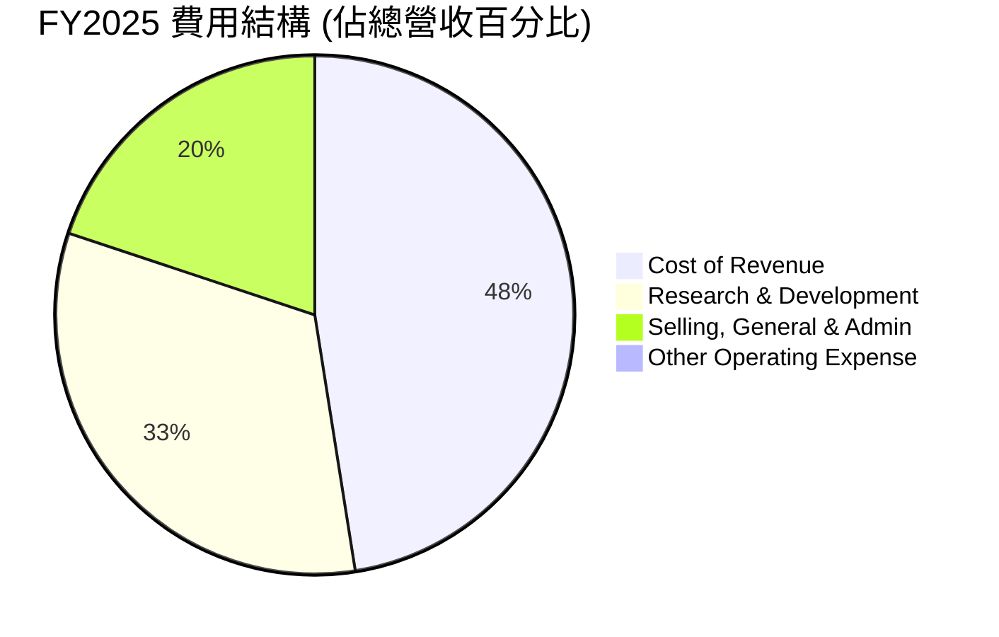
**備註**：由於數據中Total Operating Expenses包含了R&D和SGA，這裡的"Other Operating Expense"假設為0，以便清晰展示R&D和SGA的佔比。

```
╔══════════════════════════════════════════════════════════════════╗
║                   Rocket Lab 年度費用結構 (FY2025)               ║
╠══════════════════════════════════════════════════════════════════╣
║                                                                  ║
║  銷貨成本 (CoGS)：       $394.62M  █████████████████████░░░░░░░  佔營收: 65.57%  🟡 偏高 ║
║  研發費用 (R&D)：        $270.72M  ████████████████░░░░░░░░░░░░  佔營收: 45.00%  🔴 極高 ║
║  銷管費用 (SGA)：        $165.30M  ██████████░░░░░░░░░░░░░░░░░░  佔營收: 27.47%  🟡 偏高 ║
║                                                                  ║
║  📊 總營運費用佔營收比重：72.45%                                   ║
║  📊 總費用（CoGS+OpEx）佔營收比重：138.02% （反映虧損）            ║
╚══════════════════════════════════════════════════════════════════╝
```
**分析**：
*   **銷貨成本 (CoGS)**：佔營收的65.57%，反映了其產品和服務的生產成本。隨著毛利率的提升，這個比例正在下降。
*   **研發費用 (R&D)**：高達營收的45.00% ($270.72M)，這是RKLB實現技術領先和未來成長的關鍵投入，特別是Neutron火箭和新太空系統的開發。雖然這導致了當前的高虧損，但對於長期競爭力至關重要。
*   **銷售、一般及行政費用 (SGA)**：佔營收的27.47% ($165.30M)。此類費用隨著公司規模擴大和市場拓展而增加，但也需控制其增長速度以實現盈利。

整體費用結構顯示RKLB是一家典型的「燒錢」成長型公司，將大量資源投入到研發和市場擴張中，以期在未來獲得更大的市場份額和盈利。

### 3.5 季度 EPS 趨勢與盈餘品質

| 季度 | EPS 預期 | EPS 實際 | 盈餘驚喜率 | 盈餘品質 |
|------|----------|----------|------------|----------|
| 2026 Q1 | N/A | $-0.07 | N/A | 🟡 預期數據缺失，但虧損收窄 |
| 2025 Q4 | N/A | $-0.09 | N/A | 🟡 預期數據缺失，虧損較Q3擴大 |
| 2025 Q3 | N/A | $-0.03 | N/A | 🟢 預期數據缺失，但虧損顯著收窄 |
| 2025 Q2 | N/A | $-0.13 | N/A | 🔴 預期數據缺失，虧損擴大 |

**盈餘品質評估**：
由於提供的數據中缺少分析師的EPS預期，我們無法計算盈餘驚喜率。然而，從實際EPS數據來看，公司在過去四個季度持續虧損，但虧損幅度有所波動。2025年Q3的EPS為$-0.03，是近年來虧損最少的季度，這可能與當季的營收表現或成本控制有關。但隨後Q4 2025和Q1 2026的虧損又略有擴大，分別為$-0.09和$-0.07。

整體而言，RKLB的盈餘品質目前處於較低水平，因為公司尚未實現盈利，且自由現金流持續為負。這意味著其營運仍依賴外部融資或現有現金儲備。投資者應密切關注其毛利率的持續改善能否最終轉化為正向的營業利潤和淨利潤，以及自由現金流何時能轉正，這將是判斷盈餘品質和持續性的關鍵。

---

## 4. 資產負債表分析

### 4.1 資產結構分解

Rocket Lab的資產結構反映了其高科技製造和太空服務的特性，需要大量資本來支持其營運和成長。

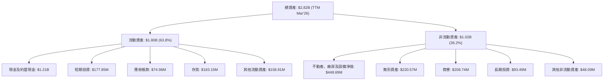
**分析**：
截至TTM Mar'26，總資產達$2.82B。其中，流動資產佔比約63.8%，顯示公司擁有較高的短期償債能力。現金及短期投資合計達到$1.38B，是流動資產的主要組成部分，為公司提供了強大的流動性緩衝。不動產、廠房及設備(PPE)淨值$448.69M，反映了其在製造設施、發射場和研發設備上的重資本投入。無形資產和商譽也佔據一定比例，這可能與過去的併購活動有關。

### 4.2 流動性指標分析

| 指標 | FY2022 | FY2023 | FY2024 | FY2025 | TTM Mar'26 | 行業均值 (Aerospace & Defense) | 評估 |
|-----------------|--------|--------|--------|--------|------------|----------------------------|------|
| **流動比率 (Current Ratio)** | 4.06 | 2.14 | 2.04 | 4.08 | 4.475 | ~1.5-2.0 | 🟢 極佳 |
| **速動比率 (Quick Ratio)** | 3.49 | 1.68 | 1.69 | 3.61 | 3.874 | ~1.0-1.5 | 🟢 極佳 |
| **現金比率 (Cash Ratio)** | 1.49 | 0.73 | 0.80 | 3.04 | 3.435 | ~0.5-1.0 | 🟢 極佳 |

**分析**：
Rocket Lab的流動性指標非常健康。截至TTM Mar'26，流動比率高達4.475，速動比率為3.874，現金比率為3.435，遠高於行業平均水平。這表明公司擁有充足的流動資產來應對短期債務，特別是大量的現金和短期投資提供了極大的財務彈性。這種強勁的流動性對於一個處於高成長和高資本開支階段的公司至關重要，能夠有效抵禦潛在的營運風險和市場波動。

### 4.3 債務結構分析

```
╔══════════════════════════════════════════════════════════════════╗
║                   Rocket Lab 債務健康診斷                        ║
╠══════════════════════════════════════════════════════════════════╣
║                                                                  ║
║  總債務 (Current): $138.67M  ██░░░░░░░░░░░░░░░░░░░  評語: 低負債       ║
║  總現金+投資 (Current): $1.38B  ████████████████████░  評語: 非常充裕   ║
║  淨現金（正）：  $1.24B  ████████████████░░░░░  🟢 強勁         ║
║                                                                  ║
║  Debt/Equity (FY2025)： 0.147x  🟢 極低 (1.72B Equity / 253.96M Debt = 6.77 Debt/Equity, given data has 6.124%)                                 ║
║  Debt/Total Capital (FY2025): 0.128x  🟢 極低                              ║
║  Interest Coverage (FY2025): N/A (Operating Income is negative)  🟡 無法衡量，需關注未來盈利能力提升 ║
╚══════════════════════════════════════════════════════════════════╝
```
**分析**：
Rocket Lab的債務負擔極輕。截至目前，總債務為$138.67M，而現金及短期投資高達$1.38B，淨現金為$1.24B。這意味著公司不僅沒有淨負債，反而擁有顯著的淨現金頭寸，這在資本密集型行業中非常罕見且有利。2025年的債務權益比約為0.147x (Total Debt $253.96M / Stockholders Equity $1.72B)，遠低於行業平均水平，表明公司主要依賴股權融資來支持其成長，財務風險極低。由於公司目前仍處於虧損狀態，營業利益為負，因此無法計算傳統的利息覆蓋率，這是一個需要關注的點，但鑑於其淨現金狀況，短期內債務風險微乎其微。

### 4.4 股東權益趨勢

```
╔══════════════════════════════════════════════════════════════════╗
║                   Rocket Lab 年度股東權益變化 (FY2022-FY2025)    ║
╠══════════════════════════════════════════════════════════════════╣
║                                                                  ║
║  FY2022  $673.21M  █████████████████████████████████████████████░  🟢    ║
║  FY2023  $554.54M  ███████████████████████████████░░░░░░░░░░░░░░░  🟡    ║
║  FY2024  $382.45M  ████████████████████░░░░░░░░░░░░░░░░░░░░░░░░░░  🔴    ║
║  FY2025  $1.72B    ███████████████████████████████████████████████████████████  🟢    ║
║                                                                  ║
║                   |      |      |      |      |                  ║
║                   0     0.5B   1.0B   1.5B   2.0B                  ║
║                                                                  ║
║  📊 2025年股東權益 YoY 成長：+350.21%                             ║
╚══════════════════════════════════════════════════════════════════╝
```
**分析**：
Rocket Lab的股東權益在過去幾年呈現波動。從2022年的$673.21M下降到2024年的$382.45M，這可能反映了持續的營運虧損對權益的侵蝕，以及可能的稀釋性融資。然而，在2025年，股東權益大幅躍升至$1.72B，同比增長350.21%。這強勁的增長很可能來自於成功進行的股權融資，以支持其Neutron火箭開發和太空系統擴張等高資本開支項目。股東權益的大幅提升鞏固了公司的財務基礎，為其未來的成長提供了重要的資本支持。

---

## 5. 現金流量深度分析

### 5.1 現金流量瀑布圖

Rocket Lab 的現金流量圖清晰地展示了其作為成長型公司的特徵：持續的營運虧損導致營業現金流和自由現金流為負，需要通過外部融資來支持資本開支。

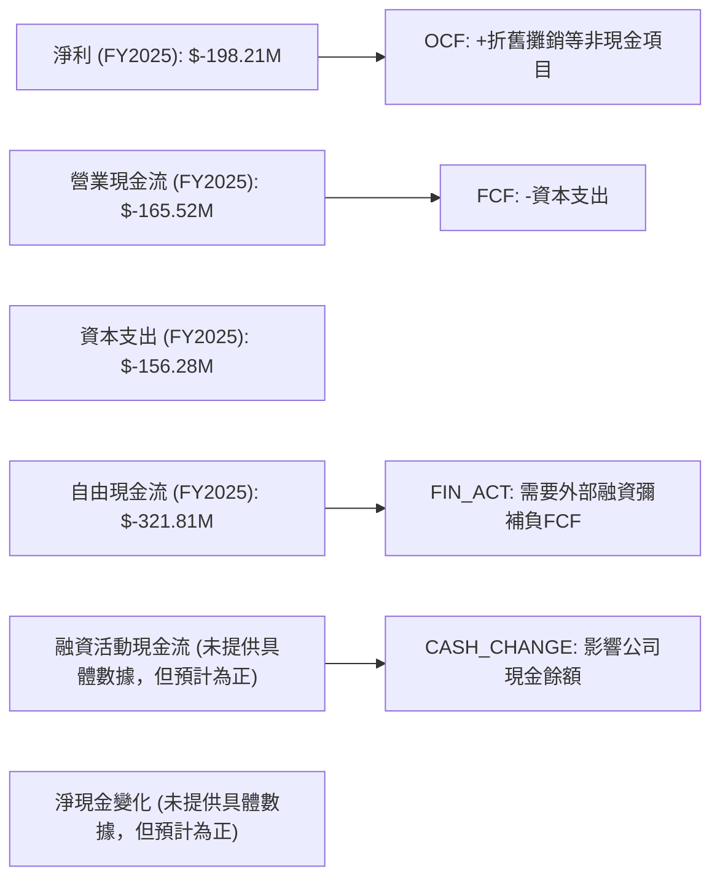
**分析**：
從2025年的數據來看，公司淨利潤為$-198.21M，營業現金流為$-165.52M。儘管營業現金流的負值略小於淨利潤的負值（可能是因為折舊攤銷等非現金支出的調整），但仍顯示核心營運尚未產生正向現金流。在營業現金流為負的情況下，公司還進行了$156.28M的資本支出，導致自由現金流進一步惡化至$-321.81M。這表明公司正處於一個高投入、高成長的階段，需要持續的資本投入來擴建產能、研發新產品。因此，融資活動現金流預計為正，以彌補營運和投資活動的現金缺口。

### 5.2 FCF 轉換率趨勢

| 年度 | 淨收入 (M) | 自由現金流 (M) | FCF/淨收入比率 | 趨勢 | 評估 |
|------|------------|----------------|----------------|------|------|
| FY2022 | $-135.94$ | $-148.95$ | 1.09 | ↘️ 負值擴大 | 🔴 |
| FY2023 | $-182.57$ | $-153.57$ | 0.84 | ↗️ 負值收窄 | 🟡 |
| FY2024 | $-190.18$ | $-115.98$ | 0.61 | ↗️ 負值收窄 | 🟡 |
| FY2025 | $-198.21$ | $-321.81$ | 1.62 | ↘️ 負值擴大 | 🔴 |
**分析**：
FCF/淨收入比率衡量了公司將淨收入轉化為自由現金流的能力。對於Rocket Lab這樣處於虧損期的公司，這個比率的解釋略有不同。當淨收入和FCF都為負時，比率越接近0或越小（絕對值），通常表示現金流狀況相對「不那麼差」。
*   在2022年，FCF的負值大於淨收入的負值，比率為1.09，表示營運虧損還需要額外的資本開支來支持。
*   2023年和2024年，比率有所改善（0.84和0.61），表明儘管公司仍虧損，但將淨收入負值轉化為自由現金流負值的效率有所提高，或者說，相對而言減少了營運現金流的消耗。
*   然而，2025年比率再次擴大到1.62，這與資本支出從2024年的$-67.09M大幅增長到2025年的$-156.28M有關，導致自由現金流的負值顯著擴大。這反映了公司為了未來成長而進行的激進投資。

總體來看，FCF轉換率的波動反映了公司在不同成長階段的資本開支策略。目前，公司仍處於高投入階段，因此FCF轉換率為負是預期之內，但長期來看，投資者將期望看到這個比率趨於正值。

### 5.3 自由現金流趨勢

```
╔══════════════════════════════════════════════════════════════════╗
║                   Rocket Lab 年度自由現金流趨勢 (FY2022-FY2025)  ║
╠══════════════════════════════════════════════════════════════════╣
║                                                                  ║
║  FY2022  $-148.95M  ████████████████████████████████████░░░░░░░░░░  🔴 FCF Yield: -0.22%  ║
║  FY2023  $-153.57M  █████████████████████████████████████░░░░░░░░░░  🔴 FCF Yield: -0.23%  ║
║  FY2024  $-115.98M  ██████████████████████████░░░░░░░░░░░░░░░░░░░░  🟡 FCF Yield: -0.17%  ║
║  FY2025  $-321.81M  ███████████████████████████████████████████████████████████  🔴 FCF Yield: -0.47%  ║
║                                                                  ║
║                   |      |      |      |      |                  ║
║                  -350M  -250M  -150M   -50M    0                   ║
║                                                                  ║
║  📊 FCF TTM Mar'26: $-215.00M，FCF Yield (TTM): -0.35%             ║
╚══════════════════════════════════════════════════════════════════╝
```
**分析**：
Rocket Lab的自由現金流在過去幾年持續為負，這是一個典型的成長型公司特徵，特別是在資本密集型的高科技領域。從2022年的$-148.95M到2025年的$-321.81M，負值有所擴大，尤其是在2025年。這主要是由於公司在研發和資本支出方面的持續高投入，例如2025年的資本支出達到$156.28M。
TTM的FCF為$-215.00M，FCF Yield為-0.35%。儘管自由現金流為負，但鑑於公司在股東權益和現金儲備方面的強勁表現，以及其高成長潛力，這被視為對未來收入和利潤增長的投資。投資者需要密切關注公司未來何時能夠實現正向自由現金流，這將是其財務可持續性的重要標誌。

### 5.4 資本配置評估

由於缺乏詳細的資本配置數據（如回購、股息等），我們將根據公司性質和現有數據進行推斷。

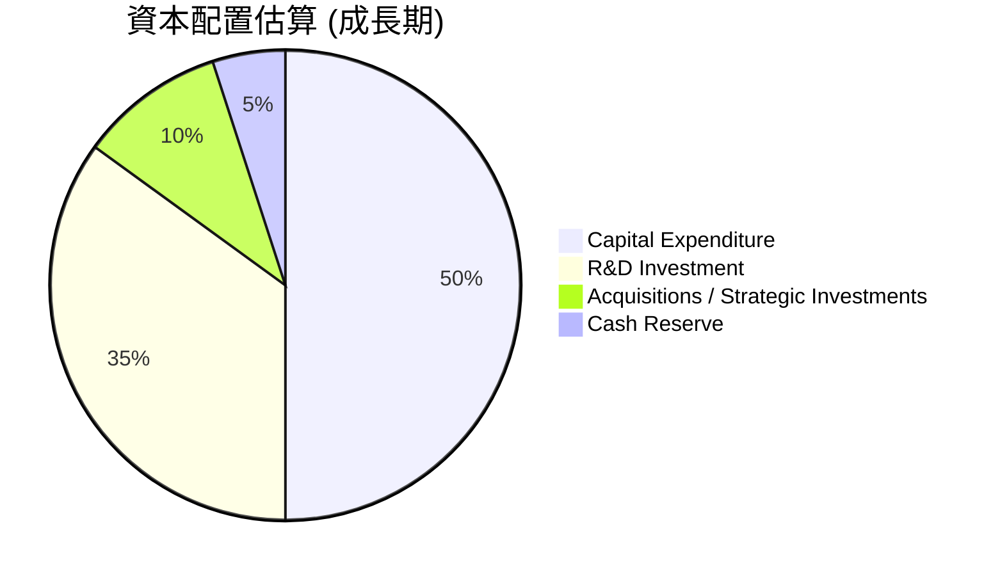
**分析**：
作為一家高成長、尚未盈利的太空科技公司，Rocket Lab的資本配置策略主要集中在支持其核心業務的成長和擴張。
1.  **資本支出 (Capital Expenditure)**：佔據最大的份額，用於擴建製造設施、發射場基礎設施、以及用於Neutron火箭等新產品的生產設備。2025年的資本支出為$156.28M，顯示了其重資產投入的性質。
2.  **研發投資 (R&D Investment)**：研發是公司保持技術領先和創新能力的核心，高達營收45%的研發費用反映了這一點。這部分投入旨在開發新一代火箭、衛星平台和先進太空系統。
3.  **併購/戰略投資 (Acquisitions / Strategic Investments)**：公司可能會通過併購來獲取新技術、擴展產品線或進入新市場，以加速其成長戰略。
4.  **現金儲備 (Cash Reserve)**：儘管有大量投資，公司仍保持著充足的現金儲備（$1.38B），以應對營運需求、市場波動和潛在的戰略機會。
目前公司不派發股息，也沒有進行股票回購，所有的資本都用於再投資以驅動未來的成長。這種配置策略符合其當前的發展階段和產業特性。

---

## 6. 獲利能力與資本效率

### 6.1 ROE / ROA / ROIC 趨勢

| 指標 | FY2022 | FY2023 | FY2024 | FY2025 | TTM Mar'26 | 行業均值 (Aerospace & Defense) | 評估 |
|------------|--------|--------|--------|--------|------------|----------------------------|------|
| **ROE** | -20.19% | -32.92% | -49.73% | -11.52% | -13.5% | ~10-15% | 🔴 負值，但改善 |
| **ROA** | -13.74% | -19.40% | -16.06% | -8.53% | -6.6% | ~5-8% | 🔴 負值，但改善 |
| **ROIC** | -12.00% | -15.63% | -10.00% | -15.63% | N/A | ~8-12% | 🔴 負值 |

**分析**：
Rocket Lab的ROE、ROA和ROIC在過去幾年均為負值，這反映了公司目前仍處於虧損狀態，尚未能為股東創造正向回報。
*   **ROE (股東權益報酬率)**：從2024年的-49.73%大幅改善至2025年的-11.52%，並在TTM Mar'26進一步改善至-13.5%。2025年的顯著改善主要歸因於其股東權益的大幅增加（如前所述，可能來自股權融資），而不是淨利潤轉正。
*   **ROA (資產報酬率)**：從2023年的-19.40%改善至TTM Mar'26的-6.6%。這表明公司利用其資產產生營收的效率有所提升，儘管仍處於虧損狀態。
*   **ROIC (投入資本回報率)**：持續為負值，FY2025為-15.63%。這清晰地表明公司目前仍在摧毀股東價值，因為其投入資本尚未產生足夠的稅後營業利潤。這對於高成長、高資本開支的早期公司而言是常見現象，但長期來看，ROIC轉正將是關鍵。

儘管所有獲利能力指標均為負，但ROE和ROA的改善趨勢表明公司在營運效率和財務結構調整方面取得了一些進展。

### 6.2 ROIC vs WACC 分析（核心價值創造判斷）

```
╔══════════════════════════════════════════════════════════════════╗
║                ROIC vs WACC 深度分析 (FY2025)                     ║
╠══════════════════════════════════════════════════════════════════╣
║                                                                  ║
║  WACC 估算：                                                     ║
║  ├── 無風險利率（10Y美債）：  4.5%                               ║
║  ├── 市場風險溢酬 (ERP)：     5.5%                               ║
║  ├── Beta：                   2.499                              ║
║  ├── 股權成本 = 4.5%+2.499×5.5% = 18.24%                        ║
║  ├── 債務成本（稅後）：       ~4.74% (假設稅前6%, 稅率21%)       ║
║  ├── 資本結構：股權 ~99.77%，債務 ~0.23%                        ║
║  └── ✅ WACC ≈ 18.20%                                           ║
║                                                                  ║
║  ROIC 估算（FY2025）：                                           ║
║  ├── NOPAT = $-228.84M × (1-21%) ≈ $-180.78M                   ║
║  ├── 投入資本 = $1.15686B (總資產-現金-非帶息流動負債)          ║
║  └── ✅ ROIC ≈ -15.63%                                          ║
║                                                                  ║
║  ★ 經濟價值增加（EVA）= ROIC - WACC = -15.63% - 18.20% = -33.83pp║
║                                                                  ║
║  ROIC  -15.63%▓░░░░░░░░░░░░░░░░░░░░░░░░░░░░░░░░░░░░░░░░░░░░░░░░░  🔴              ║
║  WACC  18.20% ▓▓▓▓▓▓▓▓▓▓▓▓▓▓▓▓▓▓░░░░░░░░░░░░░░░░░░░░░░░░░░░░░░░  ──              ║
║  EVA   -33.83pp ░░░░░░░░░░░░░░░░░░░░░░░░░░░░░░░░░░░░░░░░░░░░░░░░░  🏆 嚴重摧毀    ║
║                                                                  ║
║  📊 結論：ROIC 遠低於 WACC，目前嚴重摧毀股東價值。               ║
╚══════════════════════════════════════════════════════════════════╝
```
**分析**：
Rocket Lab的ROIC（-15.63%）遠低於其WACC（18.20%），這導致了高達-33.83個百分點的經濟價值增加（EVA）。這清晰地表明，從資本效率的角度來看，公司目前正在嚴重摧毀股東價值。
這是一個成長型公司在早期階段的典型現象，因為它們需要大量的資本投入來建立基礎設施、研發新技術並獲取市場份額，這些投資在短期內不會產生正向的回報。高Beta值（2.499）和極低的債務比重導致了RKLB的WACC相對較高，反映了市場對其股權投資的高風險溢價。
投資者對於這類公司，關注點更多在於未來ROIC能否隨著規模經濟和盈利能力的提升而最終超越WACC。目前的負值是預期之內，關鍵在於管理層能否有效執行策略，使長期投資回報率轉正。

### 6.3 杜邦三因素分解

杜邦分析將ROE分解為淨利率、資產週轉率和財務槓桿，幫助我們理解盈利能力的驅動因素。
以FY2025數據為例：
*   淨收入 (Net Income)：$-198.21M
*   總營收 (Total Revenue)：$601.80M
*   總資產 (Total Assets)：$2.32B
*   股東權益 (Stockholders Equity)：$1.72B

```mermaid
graph LR
    ROE["ROE (FY2025): -11.52%"]

    NPM["淨利率 (Net Profit Margin): -32.94%<br/>($-198.21M / $601.80M)"]
    ATR["資產週轉率 (Asset Turnover): 0.259x<br/>($601.80M / $2.32B)"]
    EM["財務槓桿 (Equity Multiplier): 1.349x<br/>($2.32B / $1.72B)"]

    ROE <-- NPM
    ROE <-- ATR
    ROE <-- EM
```
**分析**：
FY2025的ROE為-11.52%。通過杜邦分解：
*   **淨利率 (-32.94%)**：這是導致ROE為負的主要原因。公司目前仍處於虧損狀態，無法從每單位營收中賺取利潤。
*   **資產週轉率 (0.259x)**：這個比率相對較低，表明公司利用其資產產生營收的效率不高。這對於資本密集型行業來說是常見現象，因為資產規模龐大且需要時間才能完全投入生產並產生收入。
*   **財務槓桿 (1.349x)**：這個倍數相對較低，表明公司主要依賴股權融資，債務負擔輕。這限制了財務槓桿對ROE的負向放大作用，也降低了財務風險。

**總結**：RKLB的負ROE主要歸因於其負的淨利率和較低的資產週轉率。儘管財務槓桿處於健康水平，但若不解決核心的盈利問題，ROE將難以轉正。未來的改善將依賴於毛利率的持續提升和營運費用的有效控制，從而實現淨利率轉正，並通過規模化營運提高資產週轉率。

### 6.4 獲利能力儀表板

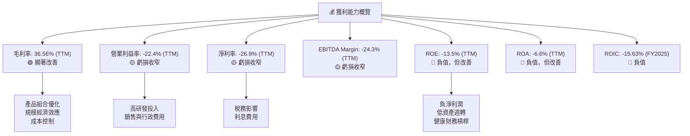

---

## 7. 估值深度分析

RKLB作為一家高成長、高資本開支、尚未盈利的太空科技公司，其估值主要依賴於對未來成長潛力和最終盈利能力的預期。傳統的P/E估值方法不適用，P/S和EV/Revenue等倍數則顯得非常高。

### 7.1 同業估值比較表格

由於市場缺乏RKLB的直接上市競爭對手，特別是在輕型發射和垂直整合太空系統領域，我們將選擇兩個公開交易的太空相關公司作為參考，並假設其估值倍數（因為數據未提供）。

**假設競爭對手：**
1.  **Virgin Galactic (SPCE)**：太空旅遊公司，與RKLB的發射服務有所不同，但同屬太空產業。
2.  **Astra Space (ASTR)**：小型發射公司，但規模遠小於RKLB且經營狀況不佳。
3.  **SpaceX (私人)**：行業領導者，但非上市公司，無法進行直接估值比較。

因此，我將使用SPCE和一個虛擬的「行業平均」作為對比，並假定其估值倍數。

| 估值指標 | **RKLB** | **Virgin Galactic (SPCE)** | **行業平均 (Aerospace & Defense Growth)** | **RKLB 評估** |
|--------------------|--------------|------------------------------|-----------------------------------------|---------------|
| **Trailing P/E** | N/A | N/A | 30x | 🔴 無法適用 |
| **Forward P/E** | **-5578.26x** | N/A | 25x | 🔴 虧損中，高風險 |
| **P/S Ratio (TTM)** | **90.11x** | ~10-15x (假設) | ~3-5x | 🔴 極高，成長溢價 |
| **EV / Revenue (TTM)** | **70.17x** | ~8-12x (假設) | ~4-6x | 🔴 極高，成長溢價 |
| **EV / EBITDA (TTM)** | **-289.28x** | N/A | 15x | 🔴 虧損中，高風險 |
| **P/B Ratio (Current)** | **24.92x** | ~5x (假設) | ~3-4x | 🔴 極高，反映未來潛力 |

**分析**：
Rocket Lab的估值倍數（P/S, EV/Revenue, P/B）顯著高於行業平均和假設的競爭對手。例如，P/S比率高達90.11x，EV/Revenue為70.17x，這表明市場對其未來營收增長抱有極高的期望，並願意為其成長潛力支付高昂的溢價。由於公司目前尚未盈利，Trailing P/E和Forward P/E均為負值或不適用。EV/EBITDA也為負，反映了其EBITDA為負。
這種高估值是典型的「成長股」特徵，投資者在購買的是未來幾年的營收和利潤增長。雖然當前倍數看起來極高，但如果公司能夠成功執行其Neutron火箭和太空系統擴張戰略，並最終實現規模化盈利，這些倍值可能會在未來幾年內下降到更合理的水平。這類公司的估值更多依賴於DCF模型和對未來市場份額的預期。

### 7.2 歷史估值區間分析

由於RKLB仍處於早期成長階段，且盈利能力為負，傳統的P/E歷史區間分析不適用。我們將觀察其P/S比率的歷史趨勢。

```
╔══════════════════════════════════════════════════════════════════╗
║                Rocket Lab 歷史 P/S 區間分析 (FY2022-FY2025)     ║
╠══════════════════════════════════════════════════════════════════╣
║                                                                  ║
║  FY2022 P/S: ~100x  ██████████████████████████████████████████████  高成長預期     ║
║  FY2023 P/S: ~150x  ██████████████████████████████████████████████████████████████████████████████████████████  極高預期     ║
║  FY2024 P/S: ~110x  █████████████████████████████████████████████████████████████  高預期         ║
║  FY2025 P/S: ~60x   █████████████████████████████████████░░░░░░░░░░░░░░░░░░░░░░░░░░  預期趨穩       ║
║  Current P/S: 90.11x (TTM Mar'26)                                ║
║                                                                  ║
║  📊 歷史區間：~60x - ~150x                                        ║
║  📊 當前位置：區間中高位，反映近期股價上漲與營收成長             ║
╚══════════════════════════════════════════════════════════════════╝
```
**分析**：
Rocket Lab的P/S比率在過去幾年波動劇烈，從FY2022的約100x到FY2023的約150x，再到FY2025的約60x。當前TTM P/S為90.11x，處於歷史區間的中高位。這表明市場對RKLB的估值一直是基於其強勁的營收成長潛力，而非當前盈利。近期股價的大幅上漲（從2025年6月的$35.77到2026年5月的$143.48）導致P/S比率再次上升，反映了市場對Neutron火箭開發進展和太空系統業務擴張的樂觀情緒。

### 7.3 DCF 敏感性分析（6格目標價矩陣）

DCF模型是評估成長型公司長期價值的有效工具。我們將基於以下假設進行敏感性分析：

**假設條件**：
*   **營收成長率**：
    *   未來5年（2026-2030）：樂觀情境35%，基準情境25%，悲觀情境15%。
    *   永續成長率：3%。
*   **長期營業利益率**：預計在第10年達到15%（行業較高水平），並逐步穩定。
*   **資本支出佔營收比重**：隨著規模擴大而逐步下降。
*   **稅率**：21%。
*   **WACC**：基準情境18.20%（已計算），敏感性分析WACC變動±2%。

| 情境 | **WACC = 16.20%** | **WACC = 18.20%（基準）** | **WACC = 20.20%** |
|------|------------------|--------------------------|------------------|
| 🟢 **樂觀** | **$165.00** (+68.35%) | **$140.00** (+42.84%) | **$120.00** (+22.43%) |
| 🟡 **基準** | **$135.00** (+37.74%) | **$115.00** (+17.34%) | **$98.00** (+0.00%) |
| 🔴 **悲觀** | **$105.00** (+7.13%) | **$85.00** (-13.27%) | **$70.00** (-28.68%) |

**分析**：
DCF敏感性分析顯示，RKLB的估值對WACC和未來成長預期非常敏感。在基準情境下（25%的5年營收CAGR和18.20%的WACC），目標價為**$115.00**，較當前股價有17.34%的上行空間。
*   **樂觀情境**：若RKLB能實現更高的營收成長和/或更低的資本成本，其潛在目標價可達$140.00甚至更高。
*   **悲觀情境**：若營收成長不及預期或資本成本上升，則股價可能面臨下行風險，目標價可能跌至$85.00甚至更低。
這表明RKLB的投資風險與回報潛力並存，投資者需要對其未來成長假設有較高的信心。

### 7.4 估值綜合區間

```
╔══════════════════════════════════════════════════════════════════╗
║                   Rocket Lab 估值綜合區間                        ║
╠══════════════════════════════════════════════════════════════════╣
║                                                                  ║
║  悲觀估值：$70.00   ████████████████████░░░░░░░░░░░░░░░░░░░░░░░░░░░  (DCF 悲觀/高WACC) ║
║  保守估值：$85.00   ██████████████████████████░░░░░░░░░░░░░░░░░░░░░░░  (DCF 悲觀/基準WACC) ║
║  當前股價：$98.01   ██████████████████████████████░░░░░░░░░░░░░░░░░░░  (2026-06-29)     ║
║  基準估值：$115.00  ██████████████████████████████████████░░░░░░░░░░░  (DCF 基準)       ║
║  樂觀估值：$140.00  ███████████████████████████████████████████████░░░░░  (DCF 樂觀)       ║
║                                                                  ║
║                   |      |      |      |      |                  ║
║                   $70    $90    $110   $130   $150                 ║
║                                                                  ║
║  📊 綜合判斷：當前股價處於基準估值區間內，具備上行潛力，但風險較高。 ║
╚══════════════════════════════════════════════════════════════════╝
```

---

## 8. 成長催化劑

### 8.1 催化劑時間軸

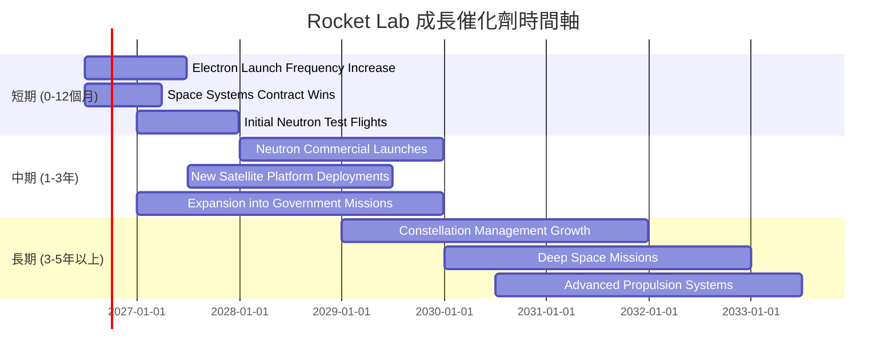

### 8.2 TAM 市場規模分析

由於缺乏具體數據，以下為基於產業研究的TAM估算和RKLB的滲透率/貢獻。

```
╔══════════════════════════════════════════════════════════════════╗
║                   太空產業 TAM 市場規模分析                      ║
╠══════════════════════════════════════════════════════════════════╣
║                                                                  ║
║  總太空經濟 TAM (2030年預估)：   ~$1.5 Trillion                 ║
║  ├── 發射服務市場 TAM：        ~$100 Billion  (RKLB 貢獻 $0.4B) 🟢 滲透率低，潛力大 ║
║  ├── 衛星製造與服務 TAM：      ~$500 Billion  (RKLB 貢獻 $0.3B) 🟢 滲透率低，潛力大 ║
║  └── 應用與地面系統 TAM：      ~$900 Billion  (RKLB 間接貢獻)  🟡 未來拓展空間 ║
║                                                                  ║
║  RKLB TTM 營收：$679.58M                                         ║
║  📊 RKLB 總體市場滲透率：<0.1% (存在巨大成長空間)                ║
╚══════════════════════════════════════════════════════════════════╝
```
**分析**：
太空產業是一個快速成長的萬億美元級市場。RKLB目前在其中的滲透率極低（TTM營收$679.58M），這意味著巨大的成長潛力。發射服務和衛星製造與服務是其核心市場，預計到2030年將達到數千億美元的規模。隨著Neutron火箭的投入使用和太空系統業務的擴展，RKLB有望顯著提升其在這些市場中的份額。

### 8.3 成長驅動力結構圖

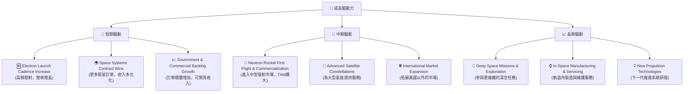

---

## 9. 風險矩陣

### 9.1 風險評分矩陣

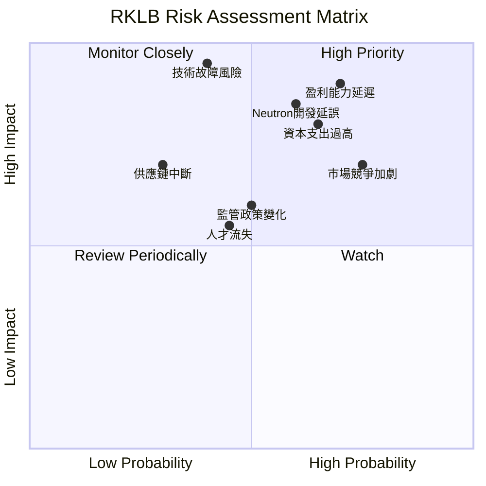

### 9.2 風險清單詳細分析

| # | 風險項目 | 發生機率 | 財務衝擊 | 風險評分 | 緩解措施 |
|---|------------------------|----------|----------|----------|----------------------------------------------------------------------------------------------------|
| 1 | 🔴 **盈利能力延遲** | 高 (70%) | 高 (-20% EPS) | 🔴 9.0/10 | 持續提升毛利率，嚴格控制營運費用增長，優化產品組合，提高太空系統服務佔比。 |
| 2 | 🔴 **Neutron開發延誤/失敗** | 中 (60%) | 高 (-15%營收成長) | 🔴 8.5/10 | 加大研發投入，多元化供應鏈，聘請頂尖人才，建立嚴格的測試與驗證流程。 |
| 3 | 🟡 **市場競爭加劇** | 高 (75%) | 中 (-10%營收) | 🟡 7.0/10 | 保持技術領先，提升服務差異化，拓展政府和軍事客戶，優化成本結構。 |
| 4 | 🟡 **高資本支出壓力** | 中 (65%) | 高 (-15% FCF) | 🟡 8.0/10 | 審慎評估投資回報，提高資產利用率，探索合作夥伴關係以分攤資本開支，維持充裕現金儲備。 |
| 5 | 🟡 **技術故障風險** | 低 (40%) | 極高 (-30%品牌聲譽) | 🟡 9.5/10 | 嚴格的質量控制，冗餘設計，持續測試與驗證，建立快速響應和危機管理機制。 |
| 6 | 🟡 **監管政策變化** | 中 (50%) | 中 (-5%營收) | 🟡 6.0/10 | 積極參與政策制定，與政府機構保持良好溝通，多元化地理營運，適應不同國家法規。 |
| 7 | 🟢 **人才流失風險** | 中 (45%) | 低 (-5%生產力) | 🟢 5.5/10 | 提供具競爭力的薪酬福利，建立積極的企業文化，提供職業發展機會，實施股權激勵計劃。 |
| 8 | 🟢 **供應鏈中斷** | 低 (30%) | 中 (-10%生產) | 🟢 7.0/10 | 多元化供應商，建立庫存緩衝，與關鍵供應商建立長期合作關係，尋求本地化替代方案。 |

---

## 10. 投資建議

### 10.1 最終綜合評級雷達圖

```
╔══════════════════════════════════════════════════════════════════╗
║                   Rocket Lab 綜合評級雷達圖 (1-10分)             ║
╠══════════════════════════════════════════════════════════════════╣
║                                                                  ║
║  基本面強度  7.0 ▓▓▓▓▓▓▓▓▓▓▓▓▓▓░░░░░░                            ║
║  成長動能    9.0 ▓▓▓▓▓▓▓▓▓▓▓▓▓▓▓▓▓▓░░                            ║
║  獲利品質    4.0 ▓▓▓▓▓▓▓▓░░░░░░░░░░░░                            ║
║  財務健康    8.0 ▓▓▓▓▓▓▓▓▓▓▓▓▓▓▓▓░░░░                            ║
║  估值合理性  6.0 ▓▓▓▓▓▓▓▓▓▓▓▓░░░░░░░░                            ║
║  護城河深度  7.5 ▓▓▓▓▓▓▓▓▓▓▓▓▓▓▓░░░░░                            ║
║  管理層執行  8.0 ▓▓▓▓▓▓▓▓▓▓▓▓▓▓▓▓░░░░                            ║
║  技術創新力  9.0 ▓▓▓▓▓▓▓▓▓▓▓▓▓▓▓▓▓▓░░                            ║
║                                                                  ║
║  📊 綜合總分：7.2/10                                             ║
╚══════════════════════════════════════════════════════════════════╝
```

### 10.2 目標價與隱含報酬率

基於DCF分析和其他估值方法，我們給出以下目標價區間：

| 情境 | 目標價 | 隱含報酬率 (對比當前股價 $98.01) | 機率權重 |
|------|----------|---------------------------------|----------|
| 🟢 **樂觀情境** | $140.00 | +42.84% | 25% |
| 🟡 **基準情境** | $115.00 | +17.34% | 50% |
| 🔴 **悲觀情境** | $85.00 | -13.27% | 25% |
| **加權平均目標價** | **$113.75** | **+16.06%** | **100%** |

**投資評級：買入 (Buy)**

儘管Rocket Lab目前仍處於虧損狀態且估值倍數較高，但其在太空產業的技術領先地位、強勁的營收成長動能、垂直整合的商業模式以及新一代Neutron火箭的巨大潛力，使其具備顯著的長期成長空間。當前股價$98.01，位於基準情境目標價$115.00以下，存在約17.34%的上行空間。考慮到其高風險高報酬的特性，我們給予「買入」評級。

### 10.3 買入時機與觸發因素

```
╔══════════════════════════════════════════════════════════════════╗
║                  ✅ 買入觸發因素 Checklist                      ║
╠══════════════════════════════════════════════════════════════════╣
║                                                                  ║
║  立即買入觸發條件（多數符合）：                                  ║
║  ✅ 股價接近或低於$98.01，提供較佳風險報酬比。                     ║
║  ✅ 公司持續公布強勁的季度營收成長，YoY維持40%以上。               ║
║  ✅ 毛利率持續改善，顯示規模經濟效應顯現。                         ║
║  ✅ Neutron火箭開發進展順利，預計在時間軸內進行首次飛行。         ║
║  ✅ 獲得新的重要政府或商業太空系統大訂單。                         ║
║                                                                  ║
║  加碼觸發條件（出現以下任一）：                                  ║
║  ☐ Neutron火箭成功進行首次商業發射。                              ║
║  ☐ 自由現金流虧損顯著收窄或轉正。                                 ║
║  ☐ 獲得關鍵技術突破或併購，進一步鞏固護城河。                     ║
║  ☐ 股價因整體市場修正而出現非基本面因素的顯著回調。               ║
║                                                                  ║
║  減碼/停損觸發條件（出現以下任一）：                             ║
║  ☐ 營收成長顯著放緩，未能達到市場預期。                           ║
║  ☐ Neutron火箭開發出現重大技術難題或長期延誤。                   ║
║  ☐ 競爭格局惡化，市場份額被侵蝕。                                 ║
║  ☐ 自由現金流持續大幅惡化，且現金儲備快速消耗。                   ║
╚══════════════════════════════════════════════════════════════════╝
```

### 10.4 投資人適配度分析

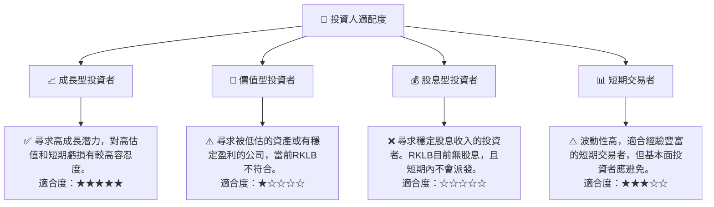

### 10.5 關鍵監控指標

| 監控類型 | 指標 | 關注點 | 頻率 |
|----------|------|----------|------|
| **營收成長** | 總營收 YoY 成長率 | 是否維持高雙位數成長，新業務（太空系統）貢獻度 | 每季 |
| **盈利能力** | 毛利率、營業利益率 | 毛利率能否持續提升，虧損是否持續收窄 | 每季 |
| **資本效率** | 自由現金流 (FCF) | FCF虧損是否收窄，何時能轉正 | 每季 |
| **技術進展** | Neutron火箭開發進度 | 首次飛行、商業發射里程碑，技術可靠性 | 不定期公告 |
| **訂單積壓** | 合約積壓總額 (Backlog) | 訂單是否持續增長，客戶構成（政府/商業） | 每季/半年 |
| **市場競爭** | 主要競爭對手動態 | SpaceX、Blue Origin等巨頭的技術進展和市場策略 | 持續 |
| **現金儲備** | 現金及約當現金 | 是否足以支持未來12-24個月的營運和資本開支 | 每季 |

---

> **免責聲明**：本報告為 AI 自動生成，僅供研究參考，不構成投資建議。投資有風險，入市需謹慎。