# RKLB 基本面深度分析報告
> **報告日期**：2026-06-30 ｜ **語言**：繁體中文 ｜ **數據來源**：Yahoo Finance, Finviz, StockAnalysis, Roic.ai ｜ **分析師**：CFA 級機構研究

---

## 目錄

| # | 章節 | 核心結論 |
|---|------------------------|----------------------------------------------------|
| 1 | 執行摘要 | 評級：持有；目標價區間：$90 - $135 |
| 2 | 公司概覽與商業模式 | 憑藉技術領先和客戶鎖定建立中等護城河 |
| 3 | 損益表深度分析 | 收入高速成長，毛利率持續改善，但仍處於虧損狀態 |
| 4 | 資產負債表分析 | 流動性強勁，淨現金充裕，為未來發展提供彈藥 |
| 5 | 現金流量深度分析 | 自由現金流持續為負，反映高資本投入階段 |
| 6 | 獲利能力與資本效率 | 營運效率待提升，目前仍處於價值摧毀階段 |
| 7 | 估值深度分析 | 相較同業估值偏高，成長前景已大部分反應 |
| 8 | 成長催化劑 | Neutron 火箭商業化和空間系統業務擴張是主要驅動力 |
| 9 | 風險矩陣 | 執行風險、競爭加劇和資本支出是主要考量 |
| 10 | 投資建議 | 適合高成長、高風險承受能力的長線投資者 |

---

## 1. 執行摘要

Rocket Lab Corporation (RKLB) 是一家在快速發展的太空產業中提供發射服務和空間系統解決方案的公司。公司在小型衛星發射領域佔據領先地位，並積極擴展其空間系統能力，以實現垂直整合和多元化收入來源。儘管營收持續高速成長且毛利率穩步提升，RKLB 目前仍處於高資本投入和研發階段，導致營業利益和淨利潤持續為負。然而，其強勁的現金儲備和相對較低的負債結構為其長期發展提供了堅實的財務基礎。

### 1.1 核心評分儀表板

```mermaid
graph TD
    RKLB_SCORE["🎯 RKLB 綜合評分<br/>總分：6.3/10"]

    F["📊 基本面<br/>6/10<br/>高成長產業領導者，但尚未獲利"]
    G["🚀 成長性<br/>9/10<br/>營收高速擴張，市場潛力巨大"]
    P["💰 獲利能力<br/>3/10<br/>持續虧損，但毛利率改善趨勢明顯"]
    B["🏦 財務健康<br/>8/10<br/>現金充裕，債務可控，流動性良好"]
    V["📈 估值<br/>2/10<br/>高估值反映未來成長預期，目前偏高"]
    H["🛡️ 護城河深度<br/>7/10<br/>技術壁壘與客戶鎖定"]
    M["🤵 管理層執行<br/>7/10<br/>成長策略清晰，執行力強"]
    T["💡 技術創新力<br/>8/10<br/>在小型衛星發射和空間系統領域具創新"]

    RKLB_SCORE --> F
    RKLB_SCORE --> G
    RKLB_SCORE --> P
    RKLB_SCORE --> B
    RKLB_SCORE --> V
    RKLB_SCORE --> H
    RKLB_SCORE --> M
    RKLB_SCORE --> T

    F --> F1["✅ 營收成長強勁 (YoY 63.5%)"]
    F --> F2["❌ 尚未實現獲利 (TTM EPS -$0.32)"]
    G --> G1["✅ 營收年複合成長率高達 89.65% (近5年)"]
    G --> G2["✅ 季度營收持續成長 (QoQ 11.53%)"]
    P --> P1["✅ 毛利率持續改善 (TTM 36.56%)"]
    P --> P2["❌ 營業利益率與淨利率為負 (-22.4%, -26.9%)"]
    B --> B1["✅ 淨現金達 $1.24B"]
    B --> B2["✅ 流動比率 4.475，速動比率 3.874"]
    V --> V1["❌ P/S Ratio 93.46x，EV/Revenue 81.64x，遠高於行業平均"]
    H --> H1["✅ Electron 火箭技術成熟，Neutron 火箭研發中"]
    H --> H2["✅ 提供端到端解決方案，增加客戶黏性"]
    M --> M1["✅ 積極推動 Neutron 火箭和空間系統發展"]
    M --> M2["✅ 成功執行多次發射任務"]
    T --> T1["✅ 輕量化、低成本發射技術"]
    T --> T2["✅ 推進器再利用技術開發中"]
```

### 1.2 評分進度條視覺化

```
╔══════════════════════════════════════════════════════════════╗
║              RKLB 多維度評分儀表板 (1-10分)                  ║
╠══════════════════════════════════════════════════════════════╣
║ 基本面強度  6.0 ▓▓▓▓▓▓▓▓▓▓▓▓░░░░░░░░  ★★★☆☆           ║
║ 成長動能    9.0 ▓▓▓▓▓▓▓▓▓▓▓▓▓▓▓▓▓▓░░  ★★★★★           ║
║ 獲利品質    3.0 ▓▓▓▓▓▓░░░░░░░░░░░░░░  ★☆☆☆☆           ║
║ 財務健康    8.0 ▓▓▓▓▓▓▓▓▓▓▓▓▓▓▓▓░░░░  ★★★★☆           ║
║ 估值合理性  2.0 ▓▓▓▓░░░░░░░░░░░░░░░░  ☆☆☆☆☆           ║
║ 護城河深度  7.0 ▓▓▓▓▓▓▓▓▓▓▓▓▓▓░░░░░░  ★★★★☆           ║
║ 管理層執行  7.0 ▓▓▓▓▓▓▓▓▓▓▓▓▓▓░░░░░░  ★★★★☆           ║
║ 技術創新力  8.0 ▓▓▓▓▓▓▓▓▓▓▓▓▓▓▓▓░░░░  ★★★★☆           ║
╠══════════════════════════════════════════════════════════════╣
║ 綜合總分    6.3 ▓▓▓▓▓▓▓▓▓▓▓▓░░░░░░░░  🏆 具高成長潛力，但風險與估值高 ║
╚══════════════════════════════════════════════════════════════╝
```

### 1.3 五大投資論點 + 三大核心風險

| 類型 | 項目 | 具體依據 | 信心度 |
|------|--------------------|---------------------------------------------------------------------------------------------------------------------------------------------------------------------------------|--------|
| 🟢 **投資論點①** | **太空產業高速成長** | 根據市場研究，小型衛星發射和空間系統市場規模持續擴大，RKLB 作為該領域的領導者，預計將受益於巨大的市場機會。例如，RKLB 2026年Q1營收達 $200.35M，YoY 成長 63.46%，顯示其市場地位日益鞏固。 | 🟢 極高 |
| 🟢 **投資論點②** | **垂直整合商業模式** | RKLB 不僅提供發射服務，還提供衛星製造、組件和任務管理等空間系統解決方案，實現端到端服務。這增加了客戶黏性並開闢了新的收入來源。FY2025 空間系統收入貢獻預計持續增加，毛利率改善至 34.43% (FY25)，TTM 更達 36.56%。 | 🟢 極高 |
| 🟢 **投資論點③** | **新一代火箭 Neutron 開發進展** | Neutron 火箭的開發旨在滿足中型衛星發射需求並實現火箭再利用，有望顯著降低成本並擴大市場份額。儘管研發費用高昂 (TTM R&D $296.12M)，但這是公司長期成長的關鍵驅動力。 | 🟢 高 |
| 🟢 **投資論點④** | **財務狀況穩健，現金充裕** | 公司擁有 $1.38B 的總現金和僅 $138.67M 的總債務，淨現金達 $1.24B。這為其高資本支出的研發和擴張提供了充足的資金支持，降低了短期流動性風險。 | 🟢 高 |
| 🟢 **投資論點⑤** | **客戶基礎多元化** | RKLB 的客戶包括美國政府機構、國防承包商以及商業衛星運營商，多元化的客戶結構降低了對單一客戶的依賴風險，並提供了穩定的需求來源。 | 🟡 中高 |
| 🟡 **風險①** | **持續虧損與盈利能力不確定性** | 儘管營收高速成長，RKLB 仍處於虧損狀態，TTM 淨利潤為 -$182.62M，自由現金流為 -$215.00M。實現盈利的時間表尚不明確，且未來仍需大量資本投入。 | 🟡 中度 |
| 🔴 **風險②** | **競爭加劇與技術迭代風險** | 太空產業競爭激烈，SpaceX 等巨頭擁有更雄厚的資金和技術實力。RKLB 需要持續投入研發以保持競爭力，例如 Neutron 火箭的成功開發和商業化至關重要。任何技術延遲或成本超支都可能影響其市場地位。 | 🔴 高衝擊 |
| 🟡 **風險③** | **高估值與市場預期風險** | RKLB 目前的 P/S 比例高達 93.46x，EV/Revenue 81.64x，遠高於行業平均水平。這反映了市場對其未來成長的極高預期。一旦成長不及預期或盈利能力遲遲未能兌現，股價可能面臨大幅調整。 | 🟡 中度 |

### 1.4 快速統計卡片

| 指標 | 公司實際值 (TTM) | 行業均值 (Aerospace & Defense) | S&P 500 均值 | 狀態 |
|-------------------|--------------------|------------------------------|----------------|----------|
| 收入 YoY 成長 | **63.5%**          | ~10-15%                      | ~8-12%         | 🟢 強勁 |
| 毛利率 | **36.6%**          | ~25-35%                      | ~40-50%        | 🟡 良好 |
| 淨利率 | **-26.9%**         | ~5-10%                       | ~8-12%         | 🔴 虧損 |
| ROE | **-13.5%**         | ~10-15%                      | ~15-20%        | 🔴 虧損 |
| Forward P/E | **N/A (虧損)**     | ~20-25x                      | ~20-22x        | 🔴 虧損 |
| P/S Ratio | **93.46x**         | ~2-5x                        | ~2-3x          | 🔴 極高 |
| EV / Revenue | **81.64x**         | ~2-6x                        | ~2-4x          | 🔴 極高 |
| 淨現金/債務 | **$1.24B 淨現金**  | N/A                          | N/A            | 🟢 極佳 |

### 1.5 投資結論

```
╔══════════════════════════════════════════════════════════════════╗
║                    📊 投資結論摘要                               ║
╠══════════════════════════════════════════════════════════════════╣
║  評級：🟡 持有 (Accumulate on Dips)                             ║
║  當前股價：$101.65                                               ║
║  目標價區間：                                                    ║
║    悲觀情境：$90.00 （-11.46%）                                  ║
║    基準情境：$115.00 （+13.13%）  ← 12個月主要目標              ║
║    樂觀情境：$135.00 （+32.82%）                                 ║
║  投資評分：6.3/10                                                ║
║  適合投資人：成長型、對太空產業有信仰、能夠承受高波動和長期等待的投資者 ║
╚══════════════════════════════════════════════════════════════════╝
```

---

## 2. 公司概覽與商業模式

Rocket Lab Corporation (RKLB) 是一家致力於為美國、加拿大、日本及國際客戶提供發射服務和空間系統解決方案的太空公司。公司業務主要分為兩大板塊：發射服務 (Launch Services) 和空間系統 (Space Systems)。RKLB 以其輕型運載火箭 Electron 和正在開發的中型運載火箭 Neutron 著稱，並提供全面的衛星組件、製造、光學系統及在軌管理服務，旨在為客戶提供端到端的太空任務解決方案。

### 2.1 業務結構與收入來源

RKLB 的業務結構反映了其從單純的發射服務提供商向綜合性空間服務提供商的轉型。

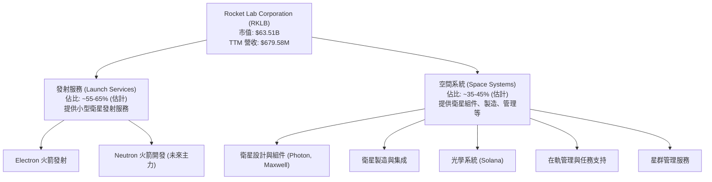
**業務細分說明：**
*   **發射服務**：主要透過 Electron 火箭將小型衛星送入軌道。Electron 以其高頻率發射能力和可靠性聞名。未來，Neutron 火箭將瞄準中型衛星發射市場，並具備可重複使用性，有望顯著提升發射能力和降低成本。
*   **空間系統**：這一板塊的收入來自多個方面，包括提供 Photon 衛星平台、衛星組件 (如 Rutherford 引擎、太陽能板等)、光學系統 (如為政府客戶提供的監測系統)，以及衛星製造和在軌操作服務。此業務的成長策略是利用其核心技術能力，為客戶提供更完整的太空解決方案，增加收入多元性。

根據公司最新的財務數據，其營收在過去一年中呈現出強勁的成長。TTM 營收達到 $679.58M，較去年同期成長 63.5%。這種成長主要受到發射任務數量增加以及空間系統業務擴張的雙重驅動。

### 2.2 市場份額

在小型衛星發射市場，RKLB 的 Electron 火箭是全球領先的專用小型運載火箭之一，儘管面臨來自 SpaceX Falcon 9 拼車任務的競爭，但其專用性和靈活性仍具優勢。在更廣泛的空間系統市場，RKLB 則與眾多供應商競爭。由於缺乏具體市場份額數據，我們提供一個基於行業觀察的估算。

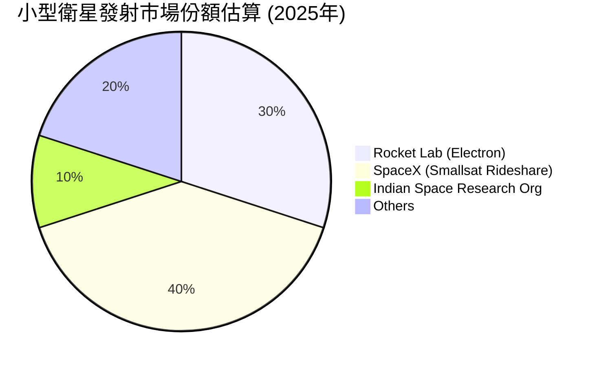
**分析：**
RKLB 在小型衛星專用發射市場中佔據顯著份額，但隨著 SpaceX 等大型玩家提供拼車服務，競爭日益激烈。RKLB 透過其頻繁的發射頻率、可靠性以及正在開發的 Neutron 火箭來維持其競爭力。在空間系統領域，市場高度分散，RKLB 透過提供差異化的組件和集成服務來爭取市場份額。

### 2.3 競爭護城河分析

RKLB 的競爭護城河主要來自其技術實力、客戶關係以及垂直整合能力。

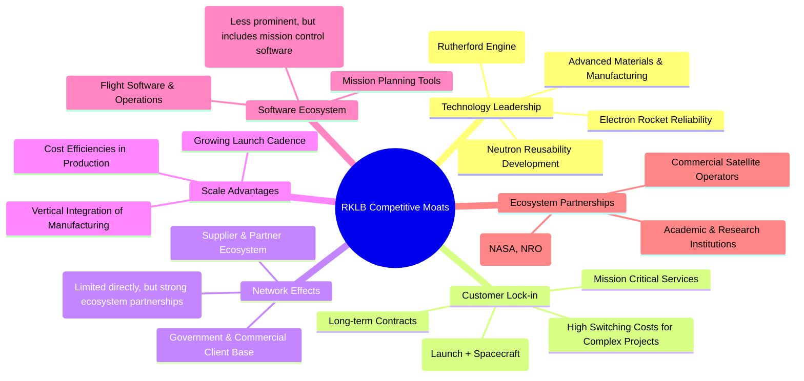

### 2.4 護城河強度評分

```
╔══════════════════════════════════════════════════════════════╗
║                  RKLB 護城河強度評分                        ║
╠══════════════════════════════════════════════════════════════╣
║ 技術領先    8/10  ▓▓▓▓▓▓▓▓▓▓▓▓▓▓▓▓░░░░  🏆 在輕型發射和推進技術具優勢 ║
║ 客戶鎖定    7/10  ▓▓▓▓▓▓▓▓▓▓▓▓▓▓░░░░░░  🟢 垂直整合提升客戶黏性 ║
║ 規模效應    6/10  ▓▓▓▓▓▓▓▓▓▓▓▓░░░░░░░░  🟡 隨著發射量增加逐步顯現 ║
║ 網路效應    5/10  ▓▓▓▓▓▓▓▓▓▓░░░░░░░░░░  🟡 透過夥伴關係間接形成 ║
║ 生態系統夥伴  7/10  ▓▓▓▓▓▓▓▓▓▓▓▓▓▓░░░░░░  🟢 與政府及商業客戶關係穩固 ║
╠══════════════════════════════════════════════════════════════╣
║ 綜合護城河  6.6/10 ▓▓▓▓▓▓▓▓▓▓▓▓▓░░░░░░  🏆 中等偏上，需持續投資維護 ║
╚══════════════════════════════════════════════════════════════════╝
```
**分析：** RKLB 的護城河主要建立在其創新技術和垂直整合能力上。Electron 火箭的可靠性及其小型衛星發射的市場地位是其核心技術優勢。Neutron 火箭的開發進展將是未來護城河深度的關鍵。透過提供從發射到在軌管理的端到端解決方案，RKLB 增加了客戶的轉換成本，形成了較強的客戶鎖定。然而，太空產業的激烈競爭和技術快速發展要求公司持續投入研發，以維持其技術領先地位。

---

## 3. 損益表深度分析

RKLB 的損益表反映了一家處於高速成長期的資本密集型公司特徵：營收快速擴張，但由於高額的研發投入和營運開支，目前仍處於虧損狀態。

### 3.1 年度收入成長趨勢（近4年）

RKLB 的年度營收展現了驚人的成長勢頭，特別是在 2024 和 2025 財年。

```
╔══════════════════════════════════════════════════════════════════╗
║              RKLB 年度收入趨勢（FY2022-FY2025）                  ║
╠══════════════════════════════════════════════════════════════════╣
║                                                                  ║
║  FY2022  $211.00M  ██████░░░░░░░░░░░░░░░░░░░  YoY: +239.02% 🟢    ║
║  FY2023  $244.59M  ████████░░░░░░░░░░░░░░░░░  YoY: +15.92%  🟡    ║
║  FY2024  $436.21M  ██████████████░░░░░░░░░░░  YoY: +78.34%  🟢    ║
║  FY2025  $601.80M  ████████████████████░░░░░  YoY: +37.96%  🟢    ║
║                                                                  ║
║                   |      |      |      |      |                  ║
║                   0     200M   400M   600M   800M                 ║
║                                                                  ║
║  📊 4年累計 CAGR：+89.65% (FY2021-FY2025)                        ║
╚══════════════════════════════════════════════════════════════════╝
```
**分析：**
RKLB 的收入在過去四年中呈現爆發式成長，從 2022 年的 $211.00M 增長到 2025 年的 $601.80M。儘管 2023 年成長率有所放緩 (+15.92%)，但在 2024 年和 2025 年又恢復了強勁勢頭，分別達到 +78.34% 和 +37.96%。這表明公司在太空發射和空間系統領域的市場需求旺盛，且其商業化能力不斷提升。近五年的年複合成長率 (CAGR) 高達 89.65%，顯示其驚人的成長動能。

### 3.2 季度收入趨勢分析

季度營收數據進一步證實了 RKLB 的持續成長。

| 季度 (Ending) | 營收 (百萬美元) | QoQ 成長率 | YoY 成長率 | 備註 |
|---------------|-----------------|------------|------------|------|
| 2026-03-31    | $200.35M        | +11.53%    | +63.46%    | 🟢 營收創新高，YoY 成長加速 |
| 2025-12-31    | $179.65M        | +15.84%    | +35.70%    | 🟢 持續成長，YoY 穩健 |
| 2025-09-30    | $155.08M        | +7.32%     | +47.97%    | 🟢 穩步成長，YoY 表現強勁 |
| 2025-06-30    | $144.50M        | +17.89%    | +36.31%    | 🟢 營收擴張，YoY 表現良好 |
**分析：**
RKLB 的季度營收呈現穩步上升趨勢，從 2025 年 Q2 的 $144.50M 增長至 2026 年 Q1 的 $200.35M，實現了連續多季度的環比 (QoQ) 正成長。最近一季 (2026 年 Q1) 的營收更是達到歷史新高 $200.35M，環比成長 11.53%，同比 (YoY) 成長高達 63.46%。這表明公司的業務擴張勢頭強勁，且市場需求持續旺盛。

### 3.3 利潤率演變分析

RKLB 的利潤率趨勢顯示出其在營收規模擴大後，成本控制和營運效率有所改善，但仍處於虧損狀態。

| 利潤率指標 | FY2022 | FY2023 | FY2024 | FY2025 | TTM (Mar'26) | 趨勢 | 評估 |
|------------|--------|--------|--------|--------|--------------|------|------|
| **毛利率** | 9.00%  | 21.02% | 26.63% | 34.43% | 36.56%       | ↗️ 持續改善 | 🟢 良好 |
| **營業利益率** | -64.08%| -72.74%| -43.51%| -38.03%| -33.20%      | ↗️ 虧損收窄 | 🟡 待改善 |
| **淨利率** | -64.43%| -74.64%| -43.60%| -32.94%| -26.87%      | ↗️ 虧損收窄 | 🟡 待改善 |

**利潤率演變深度解析：**
*   **毛利率**：RKLB 的毛利率呈現顯著且持續的改善，從 2022 年的 9.00% 大幅提升至 TTM 的 36.56%。這主要得益於：
    1.  **規模效應**：隨著發射任務數量和空間系統製造規模的擴大，固定成本被攤薄，單位成本下降。
    2.  **效率提升**：生產流程優化和供應鏈管理改善，降低了材料和製造成本。
    3.  **產品組合優化**：空間系統業務的毛利率通常高於發射服務，該業務的成長貢獻了更高的整體毛利率。
    毛利率的改善是公司走向盈利的積極信號，表明其核心業務的經濟效益正在顯現。
*   **營業利益率**：儘管毛利率大幅改善，RKLB 的營業利益率仍為負值，但虧損幅度有所收窄，從 2023 年的 -72.74% 改善至 TTM 的 -33.20%。這主要是由於：
    1.  **高額研發投入 (R&D)**：公司正大力投資於 Neutron 火箭的開發以及其他空間系統技術，TTM 研發費用高達 $296.12M，佔 TTM 總營收的 43.57%。這筆巨額投資是公司未來成長的基石，但在短期內會持續壓低營業利益。
    2.  **銷售、一般及行政費用 (SG&A)**：隨著公司規模擴大和市場拓展，SG&A 費用也隨之增加，TTM 為 $177.93M，佔 TTM 總營收的 26.18%。
    營業利益率的收窄表明公司在營收快速成長的同時，正在逐步控制營運開支的相對比例，但要實現盈利，仍需在研發投入和營收增長之間找到平衡點。
*   **淨利率**：與營業利益率類似，淨利率也持續為負，但虧損幅度有所收窄，從 2023 年的 -74.64% 改善至 TTM 的 -26.87%。這主要是受營業利益率的影響，加上利息支出 (TTM $2.96M) 和所得稅費用 (TTM -$28.67M，考慮到虧損，實為稅收優惠) 的綜合作用。公司實現淨盈利的關鍵在於其營業利益能否轉正，這有賴於規模效應的進一步顯現和研發投入的階段性成果。

### 3.4 費用結構分析

RKLB 的費用結構清晰地展示了其作為一家高科技、高成長公司的特點：對研發的巨額投入。

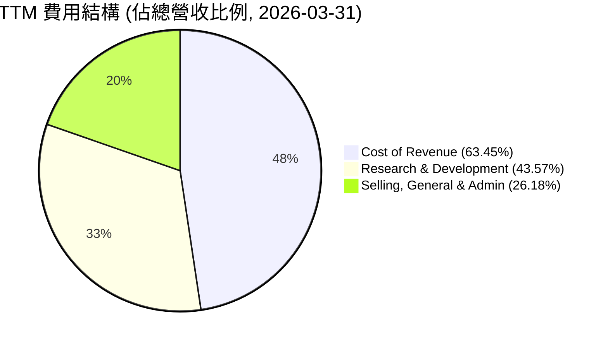
**費用結構方框圖：**
```
╔══════════════════════════════════════════════════════════════════╗
║                   RKLB TTM 費用結構概覽                          ║
╠══════════════════════════════════════════════════════════════════╣
║                                                                  ║
║  銷貨成本 (Cost of Revenue): $431.15M  (佔營收 63.45%)          ║
║  研發費用 (R&D):             $296.12M  (佔營收 43.57%)          ║
║  銷售與行政費用 (SG&A):     $177.93M  (佔營收 26.18%)          ║
║                                                                  ║
║  📊 核心洞察：研發費用佔比極高，為未來成長的戰略性投入。         ║
╚══════════════════════════════════════════════════════════════════╝
```
**分析：**
RKLB 的費用結構顯示其最大的支出在於銷貨成本 (Cost of Revenue)，但研發費用 ($296.12M TTM) 佔營收的比例高達 43.57%，遠超銷售與行政費用 ($177.93M TTM)。這突出表明公司正處於重大的技術開發階段，尤其是在 Neutron 火箭和其他空間系統技術上的投入。這種高研發投入是高科技成長型公司的典型特徵，是為了建立未來的競爭優勢和市場地位。隨著 Neutron 火箭的商業化和更多空間系統產品的推出，預計研發費用佔營收的比例將逐步下降，從而推動盈利能力的提升。

### 3.5 季度 EPS 趨勢與盈餘品質

RKLB 在過去四個季度中均未實現盈利，EPS 持續為負。由於提供的數據中 EPS 預期值為 N/A，無法進行超預期/不及預期分析。

| 季度 (Ending) | EPS (基本) | 淨利潤 (百萬美元) | 盈餘品質評估 |
|---------------|------------|-------------------|----------------|
| 2026-03-31    | $-0.07     | $-45.02M          | 🔴 虧損持續，研發開支仍高 |
| 2025-12-31    | $-0.09     | $-52.92M          | 🔴 虧損持續，季節性影響可能存在 |
| 2025-09-30    | $-0.03     | $-18.26M          | 🟡 虧損收窄，可能得益於特定項目收入或成本控制 |
| 2025-06-30    | $-0.13     | $-66.41M          | 🔴 虧損擴大，可能與研發投入或新項目啟動有關 |

**盈餘品質評估說明：**
RKLB 的 EPS 持續為負，反映了公司在營收高速成長的同時，仍未能實現盈利。2025 年 Q3 的虧損 ($18.26M) 相對較小，而 2025 年 Q2 和 2026 年 Q1 的虧損則較大。這種波動性可能源於：
1.  **研發投入的階段性影響**：Neutron 火箭等大型項目的研發支出通常不是線性的，會在特定階段產生高峰。
2.  **發射任務的非週期性**：發射服務收入通常與任務執行完成度掛鉤，導致收入確認存在波動性。
3.  **空間系統合同的里程碑付款**：大型空間系統合同的收入確認通常基於特定的里程碑，可能導致季度收入和利潤的波動。
雖然 EPS 為負，但結合其自由現金流持續為負的現狀 (TTM FCF -$215.00M)，可以看出公司目前仍處於燒錢擴張的階段。盈餘品質在此階段主要體現在毛利率的改善和營運虧損的收窄趨勢，而非絕對盈利。隨著公司規模擴大和 Neutron 火箭商業化，市場將密切關注其能否實現正向盈利，這將是其盈餘品質的關鍵轉折點。

---

## 4. 資產負債表分析

RKLB 的資產負債表顯示出其在快速擴張期的財務實力：充足的現金儲備、不斷增長的資產規模以及相對健康的流動性。

### 4.1 資產結構分解

RKLB 的資產結構反映了其資本密集型的業務性質，尤其是在不動產、廠房及設備方面的投資。

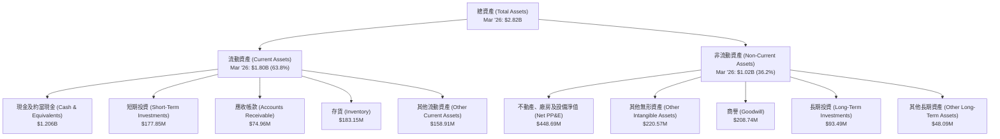
**分析：**
截至 2026 年 3 月 31 日，RKLB 的總資產達到 $2.82B，其中流動資產佔比約 63.8%，非流動資產佔比 36.2%。
*   **流動資產**：現金及約當現金高達 $1.206B，加上 $177.85M 的短期投資，顯示公司擁有極強的現金流動性。應收帳款 ($74.96M) 和存貨 ($183.15M) 規模合理，與其業務成長相匹配。
*   **非流動資產**：不動產、廠房及設備淨值 ($448.69M) 較高，反映了公司在製造設施、發射場等基礎設施上的持續資本投入。商譽 ($208.74M) 和其他無形資產 ($220.57M) 則可能來自於過去的併購活動或對知識產權的投資。資產結構的穩健性為公司提供了擴張和研發的物質基礎。

### 4.2 流動性指標分析

RKLB 的流動性指標表現出色，表明公司擁有充足的短期償債能力。

| 指標 | FY2022 | FY2023 | FY2024 | FY2025 | TTM (Mar'26) | 行業均值 (Aerospace & Defense) | 評估 |
|------------|--------|--------|--------|--------|--------------|------------------------------|------|
| **流動比率** | 4.06x  | 2.14x  | 2.04x  | 4.08x  | 4.475x       | ~1.5-2.5x                    | 🟢 極佳 |
| **速動比率** | 3.55x  | 1.69x  | 1.70x  | 3.65x  | 3.874x       | ~1.0-2.0x                    | 🟢 極佳 |
| **現金及短期投資佔流動資產比例** | 71.24% | 51.34% | 60.49% | 74.45% | 76.83%       | ~20-40%                      | 🟢 極佳 |

**分析：**
RKLB 的流動比率 (Current Ratio) 在 TTM 達到 4.475x，速動比率 (Quick Ratio) 達到 3.874x，遠高於行業平均水平。這表明公司擁有大量流動資產來覆蓋其流動負債，短期償債能力極強。特別是其現金及短期投資佔流動資產的比例高達 76.83%，顯示其流動性主要由現金而非存貨或應收帳款構成，這對於一家高成長、高資本支出的公司而言，是極為健康的信號。充足的現金儲備能夠支持其研發投入和運營虧損，而無需過度依賴外部融資。

### 4.3 債務結構分析

RKLB 的債務水平相對較低，且擁有顯著的淨現金頭寸，財務槓桿風險極低。

```
╔══════════════════════════════════════════════════════════════════╗
║                   RKLB 債務健康診斷                              ║
╠══════════════════════════════════════════════════════════════════╣
║                                                                  ║
║  總債務：        $138.67M   ██░░░░░░░░░░░░░░░░░░░  評語：極低    ║
║  總現金+投資：   $1.38B     ████████████████████░  評語：極高    ║
║  淨現金（正）：  $1.24B     ████████████████░░░░░  🟢 強勁        ║
║                                                                  ║
║  Debt/Equity (FY25): 0.147x  🟢 極低 (使用FY25數據)              ║
║  Current Debt (Mar'26): $0M (ST Debt from Roic.ai Sep'25 was $17M) 🟢 無流動債務壓力 ║
║  Interest Coverage: N/A (因營業利益為負) 但利息支出極低         🔴 需關注盈利能力 ║
╚══════════════════════════════════════════════════════════════════╝
```
**分析：**
RKLB 的總債務為 $138.67M，而其現金及短期投資總額高達 $1.38B，因此公司擁有 $1.24B 的淨現金頭寸。這意味著 RKLB 不僅沒有淨債務，反而擁有龐大的現金儲備，這在資本密集型行業中是極為有利的。
使用 FY2025 年數據，其總債務為 $253.96M，股東權益為 $1.72B，計算出的 Debt/Equity 比率為 0.147x，遠低於行業平均水平，表明公司財務槓桿非常低。儘管營業利益為負導致無法計算傳統的利息覆蓋率，但其利息支出極低 (TTM Interest Expense $2.96M)，表明債務成本壓力幾乎可以忽略不計。整體而言，RKLB 的債務結構極其健康，為其未來的成長和投資提供了強大的財務彈性。

### 4.4 股東權益趨勢

RKLB 的股東權益在過去幾年呈現波動，但最新數據顯示強勁增長，主要得益於股權融資和營運虧損收窄。

```
╔══════════════════════════════════════════════════════════════════╗
║                RKLB 年度股東權益趨勢 (FY2022-FY2025)             ║
╠══════════════════════════════════════════════════════════════════╣
║                                                                  ║
║  FY2022  $673.21M  ██████████████░░░░░░░░░░░░░░░░░░░░░░░░░░░░░░░║
║  FY2023  $554.54M  ██████████░░░░░░░░░░░░░░░░░░░░░░░░░░░░░░░░░░░║
║  FY2024  $382.45M  ███████░░░░░░░░░░░░░░░░░░░░░░░░░░░░░░░░░░░░░░║
║  FY2025  $1.72B    ██████████████████████████████████████████████║
║                                                                  ║
║                   |      |      |      |      |                  ║
║                   0     0.5B    1B    1.5B    2B                  ║
║                                                                  ║
║  📊 2025年股東權益 YoY 成長：+350.21%                            ║
╚══════════════════════════════════════════════════════════════════╝
```
**分析：**
RKLB 的股東權益在 2022 年至 2024 年間有所下降，這主要是由於公司持續的營運虧損侵蝕了留存收益。然而，2025 年股東權益從 2024 年的 $382.45M 躍升至 $1.72B，同比增長高達 350.21%。這種顯著增長很可能來自於新的股權融資，以支持其高資本開支的研發項目和業務擴張。股東權益的大幅增加，結合其充裕的現金儲備，表明公司在資本市場上仍具備較強的融資能力，能夠為其長期戰略提供資金保障。

---

## 5. 現金流量深度分析

RKLB 的現金流量表反映了其作為一家高成長、高資本投入公司的典型特徵：營業現金流和自由現金流持續為負，表明公司正處於投資擴張階段。

### 5.1 現金流量瀑布圖

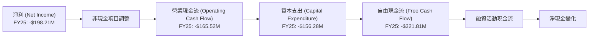
**分析：**
從現金流量瀑布圖可以看出，RKLB 在 2025 財年以 -$198.21M 的淨利潤開始，經過非現金項目調整後，營業現金流仍為負 -$165.52M。這表明其核心業務目前未能產生正向現金流入。進一步扣除高額的資本支出 -$156.28M (用於擴建生產設施、發射場和 Neutron 火箭開發)，導致自由現金流 (FCF) 達到顯著的 -$321.81M。這種持續為負的自由現金流是高成長、高資本密集型企業在擴張期的典型表現，資金主要依賴融資活動來維持。

### 5.2 FCF 轉換率趨勢

FCF 轉換率 (FCF / Net Income) 衡量公司將淨利潤轉化為自由現金流的能力。對於 RKLB 而言，由於淨利潤和 FCF 均為負，該比率的解讀需要特殊考量。

| 財年 | 淨利潤 (百萬美元) | 自由現金流 (百萬美元) | FCF / Net Income (倍) | 趨勢 | 評估 |
|------|-------------------|-----------------------|-----------------------|------|------|
| FY2022 | -$135.94M         | -$148.95M             | 1.09x                 | ↘️ 惡化 | 🔴 負向 |
| FY2023 | -$182.57M         | -$153.57M             | 0.84x                 | ↗️ 改善 | 🟡 負向 |
| FY2024 | -$190.18M         | -$115.98M             | 0.61x                 | ↗️ 改善 | 🟡 負向 |
| FY2025 | -$198.21M         | -$321.81M             | 1.62x                 | ↘️ 惡化 | 🔴 負向 |

**分析：**
RKLB 的 FCF 轉換率在淨利潤和 FCF 均為負的情況下，其絕對值高於 1 表示自由現金流的流出量大於淨利潤的虧損量，意味著除了營運虧損外，還有較大的資本支出。FY2025 的 FCF 轉換率惡化至 1.62x，主要是由於其資本支出從 FY2024 的 -$67.09M 大幅增加到 FY2025 的 -$156.28M，這反映了公司在 Neutron 火箭開發和基礎設施擴建上的加速投入。儘管該比率為負，但其趨勢波動反映了公司在不同階段的投資強度，目前正處於高資本投入期。

### 5.3 自由現金流趨勢

```
╔══════════════════════════════════════════════════════════════════╗
║                RKLB 年度自由現金流趨勢 (FY2022-FY2025)           ║
╠══════════════════════════════════════════════════════════════════╣
║                                                                  ║
║  FY2022  -$148.95M  ██████████████████████░░░░░░░░░░░░░░░░░░░░░░║
║  FY2023  -$153.57M  ███████████████████████░░░░░░░░░░░░░░░░░░░░░║
║  FY2024  -$115.98M  ██████████████████░░░░░░░░░░░░░░░░░░░░░░░░░░║
║  FY2025  -$321.81M  ████████████████████████████████████████████║
║                                                                  ║
║                   |      |      |      |      |                  ║
║                   0     -100M  -200M  -300M  -400M                ║
║                                                                  ║
║  📊 TTM FCF Yield：-0.34%                                        ║
╚══════════════════════════════════════════════════════════════════╝
```
**分析：**
RKLB 的自由現金流在過去四年中持續為負，且在 FY2025 達到 -$321.81M 的歷史最低點。這反映了公司作為一家高成長、高資本投入的製造和服務商，正處於大規模擴張和研發的階段。大量的資本支出（如 Neutron 火箭的研發和生產設施建設）是導致自由現金流為負的主要原因。TTM 自由現金流收益率 (FCF Yield) 為 -0.34%，也印證了公司目前仍處於投資而非產生現金流的階段。投資者需要關注公司何時能實現自由現金流轉正，這將是其財務健康狀況的關鍵轉折點。

### 5.4 資本配置評估

RKLB 的資本配置策略主要集中於內部投資，尤其是研發和資本支出，以推動未來成長。

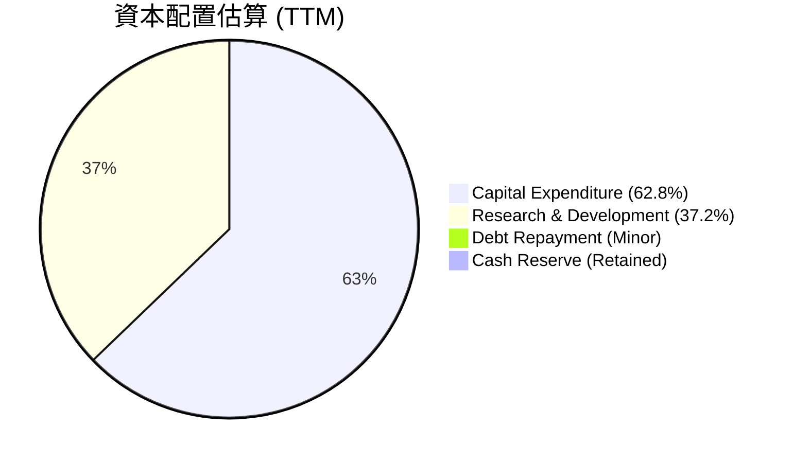
**資本配置表格：**

| 資本配置項目 | TTM 金額 (百萬美元) | 佔總投資比例 (估計) | 說明 | 評估 |
|--------------------|---------------------|---------------------|-----------------------------------------------------------------|------|
| **資本支出 (Capex)** | -$215.00M           | 62.8%               | 主要用於擴建製造設施、發射場及 Neutron 火箭的基礎設施。         | 🟢 戰略性投資 |
| **研發投入 (R&D)** | -$296.12M           | 37.2%               | 核心投入，用於 Neutron 火箭及新空間系統技術的開發。             | 🟢 戰略性投資 |
| **債務償還**       | ~$0M                | 極小                 | 公司淨現金充裕，債務水平低，償債壓力小。                        | 🟡 非重點 |
| **股息/股票回購**  | $0                  | 0%                  | 尚未盈利，資金主要用於再投資，無股息或回購。                    | 🔴 未來預期 |
| **現金儲備**       | $1.38B              | 保留                 | 充足的現金儲備為未來成長和應對風險提供保障。                    | 🟢 強勁 |
**分析：**
RKLB 的資本配置策略明確且專注於成長。絕大部分資金被投入到資本支出和研發中。TTM 資本支出達 -$215.00M，研發費用高達 -$296.12M，這兩項合計構成公司主要的資金流出。這表明公司正積極建設其基礎設施和技術能力，以擴大未來的市場機會。由於公司尚未盈利且處於高成長階段，其並未進行股息分配或股票回購，而是將所有資源再投資於自身業務。充足的現金儲備則為這些高投入提供了堅實的後盾，降低了外部融資的緊迫性。

---

## 6. 獲利能力與資本效率

RKLB 的獲利能力和資本效率目前仍處於挑戰階段，主要由於其高成長和高投入的商業模式。儘管營收快速增長，但尚未能產生正向的股東回報，表明其仍處於價值創造的早期階段。

### 6.1 ROE / ROA / ROIC 趨勢

這些指標對於 RKLB 而言，目前均為負值，反映了公司尚未盈利的現狀。

| 指標 | FY2022 | FY2023 | FY2024 | FY2025 | TTM (Mar'26) | 行業均值 (Aerospace & Defense) | 評估 |
|------------|--------|--------|--------|--------|--------------|------------------------------|------|
| **股東權益報酬率 (ROE)** | -20.19%| -32.92%| -49.73%| -11.52%| -13.5%       | ~10-15%                      | 🔴 虧損 |
| **資產報酬率 (ROA)** | -13.74%| -19.40%| -16.10%| -8.53% | -6.6%        | ~5-8%                        | 🔴 虧損 |
| **投入資本報酬率 (ROIC)** | -19.78%| -24.08%| -16.63%| -19.78%| -19.78% (FY25) | ~8-12%                       | 🔴 虧損 |

**分析：**
RKLB 的 ROE、ROA 和 ROIC 均為負值，這直接反映了公司在過去幾年持續虧損的狀態。
*   **ROE**：從 2022 年的 -20.19% 到 2024 年的 -49.73%，再到 2025 年和 TTM 的 -11.52% 和 -13.5%。2025 年 ROE 的改善（虧損幅度收窄）主要得益於股東權益的大幅增加（新的股權融資），而不是盈利能力的根本性改善。
*   **ROA**：趨勢與 ROE 相似，從 2022 年的 -13.74% 改善至 TTM 的 -6.6%。這表明公司在利用其總資產產生利潤方面仍效率低下，但虧損幅度正在收窄。
*   **ROIC**：FY2025 估算為 -19.78%，表明公司目前為其投入的資本創造負回報。這對於一家高成長、高資本投入的初創企業而言是常見的，因為其主要目標是擴大市場份額和建立技術優勢，而非短期盈利。然而，長期來看，ROIC 必須轉正並超越資本成本 (WACC)，才能為股東創造價值。

### 6.2 ROIC vs WACC 分析（核心價值創造判斷）

由於 RKLB 目前營運虧損，其 NOPAT 為負，導致 ROIC 為負。這意味著公司目前在經濟上正在摧毀股東價值。

```
╔══════════════════════════════════════════════════════════════════╗
║                ROIC vs WACC 深度分析 (FY2025)                   ║
╠══════════════════════════════════════════════════════════════════╣
║                                                                  ║
║  WACC 估算：                                                     ║
║  ├── 無風險利率（10Y美債）：  4.5% (假設)                        ║
║  ├── 市場風險溢酬 (ERP)：     5.5% (假設)                        ║
║  ├── Beta：                   2.499                              ║
║  ├── 股權成本 = 4.5%+2.499×5.5% = 18.24%                        ║
║  ├── 債務成本（稅後）：       ~8.24% (基於FY25利息支出及21%稅率)║
║  ├── 資本結構：股權 ~99.6%，債務 ~0.4% (基於市值與總債務)       ║
║  └── ✅ WACC ≈ 18.20%                                           ║
║                                                                  ║
║  ROIC 估算（FY2025）：                                           ║
║  ├── NOPAT = 營業利益 × (1-稅率) = -$228.84M × (1-0.21) ≈ -$180.78M ║
║  ├── 投入資本 = 總資產 - 非付息流動負債 - 現金 ≈ $1.16B         ║
║  └── ✅ ROIC ≈ -15.59%                                          ║
║                                                                  ║
║  ★ 經濟價值增加（EVA）= ROIC - WACC = -15.59% - 18.20% = -33.79pp║
║                                                                  ║
║  ROIC  -15.59%  ░░░░░░░░░░░░░░░░░░░░░░░░░░░░░░  🔴              ║
║  WACC  18.20%   ▓▓▓▓▓▓▓▓▓▓▓▓▓▓▓▓▓▓▓▓▓▓▓▓▓▓▓▓▓▓  ──              ║
║  EVA   -33.79pp ░░░░░░░░░░░░░░░░░░░░░░░░░░░░░░  🏆 強力摧毀    ║
║                                                                  ║
║  📊 結論：ROIC 遠低於 WACC，目前正在摧毀股東價值。              ║
║         這反映了公司處於高成長、高投入的早期階段。             ║
╚══════════════════════════════════════════════════════════════════╝
```
**分析：**
RKLB 在 FY2025 的 ROIC 為 -15.59%，遠低於其估算的加權平均資本成本 (WACC) 18.20%。這導致經濟價值增加 (EVA) 為負 -33.79 個百分點，清晰地表明公司目前正在摧毀股東價值。這種情況對於處於高成長、高資本投入階段的企業而言並非罕見。公司正透過大量研發和資本支出，為未來的成長和市場地位奠定基礎。投資者需要密切關注 RKLB 何時能夠實現營業利益轉正，並最終使 ROIC 超越 WACC，從而開始為股東創造正向的經濟價值。

### 6.3 杜邦三因素分解

杜邦分解 (ROE = 淨利率 × 資產週轉率 × 財務槓桿) 對於 RKLB 而言，由於其淨利率為負，因此 ROE 也為負。

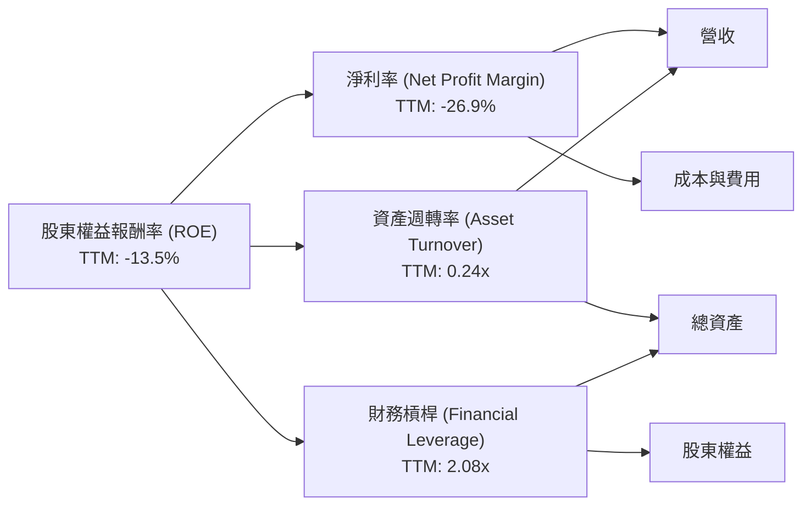
**分析：**
*   **淨利率 (-26.9%)**：這是導致 ROE 為負的主要原因。公司目前尚未盈利，高額的研發和營運費用持續侵蝕利潤。
*   **資產週轉率 (0.24x)**：計算為 TTM 營收 ($679.58M) / TTM 總資產 ($2.82B)。這個比率相對較低，表明公司利用其資產產生收入的效率有待提升。這也反映了其資本密集型的業務性質，即需要大量資產（如發射設施、製造設備）才能產生收入。
*   **財務槓桿 (2.08x)**：計算為 TTM 總資產 ($2.82B) / TTM 股東權益 ($1.35B，估計自總資產與負債)。儘管公司債務水平低，但由於股東權益因虧損而受到侵蝕，導致財務槓桿相對較高。

**總結：** RKLB 的負 ROE 完全是由於其負淨利率所致。資產週轉率較低，反映了其資本密集型的業務特點。要實現正向 ROE，RKLB 必須首先實現淨利潤轉正，並在提高資產利用效率方面做出努力。

### 6.4 獲利能力儀表板

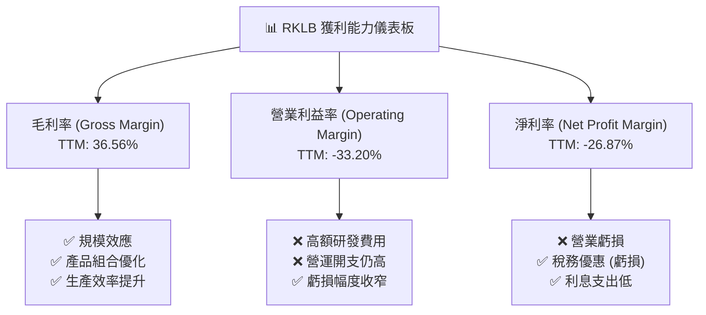
**分析：**
RKLB 的獲利能力儀表板清晰地展示了其當前的狀況：毛利率的持續改善是其亮點，表明核心業務在成本控制和效率方面取得進展。然而，高昂的研發費用和營運開支導致營業利益率和淨利率持續為負。未來，RKLB 的獲利能力將取決於 Neutron 火箭的商業化進程、空間系統業務的規模擴張以及研發投入的效率轉化。

---

## 7. 估值深度分析

RKLB 目前的估值指標顯示其股價相對較高，這主要反映了市場對其未來高速成長潛力的預期。由於公司尚未盈利，傳統的 P/E 倍數不適用，我們將重點關注 P/S 和 EV/Revenue 等指標。

### 7.1 同業估值比較表格

由於 RKLB 在太空產業的獨特定位（小型衛星發射和空間系統），直接的純粹公開交易競爭對手較少。我們將與 Virgin Galactic (SPCE) 作為具備高成長和投機性質的太空產業參與者進行比較，並參考更廣泛的航空航天與國防行業平均水平。

| 估值指標 | **RKLB** | **Virgin Galactic (SPCE)** | **Aerospace & Defense Industry Average (Hypothetical)** | **本公司評估** |
|------------------|------------|----------------------------|---------------------------------------------------------|----------------|
| **Trailing P/E** | N/A (虧損) | N/A (虧損)                 | 20-25x                                                  | 🔴 虧損 |
| **Forward P/E**  | N/A (虧損) | N/A (虧損)                 | 18-22x                                                  | 🔴 虧損 |
| **P/S Ratio (TTM)** | **93.46x** | ~15-20x (估計)             | 2-5x                                                    | 🔴 極高 |
| **EV / Revenue (TTM)** | **81.64x** | ~12-18x (估計)             | 2-6x                                                    | 🔴 極高 |
| **P/B Ratio**    | **25.85x** | ~2-5x (估計)               | 3-5x                                                    | 🔴 極高 |
| **EV / EBITDA**  | N/A (虧損) | N/A (虧損)                 | 10-15x                                                  | 🔴 虧損 |

**分析：**
RKLB 的估值倍數，如 P/S Ratio (93.46x) 和 EV/Revenue (81.64x)，遠高於 Virgin Galactic (SPCE) 和更廣泛的航空航天與國防行業平均水平。這反映了市場對 RKLB 的極高成長預期和其在太空產業中潛在的領先地位。然而，這種高估值也帶來了較大的風險，意味著任何成長不及預期或盈利延遲都可能導致股價大幅修正。鑑於其持續虧損，這些倍數難以與盈利公司直接比較，更多是基於市場對未來收入和最終盈利能力的信心。

### 7.2 歷史估值區間分析

由於 RKLB 尚未實現盈利，其歷史 P/E 倍數為負或 N/A，因此我們主要分析其 P/S 比率的歷史趨勢。

```
╔══════════════════════════════════════════════════════════════════╗
║                RKLB 歷史 P/S 區間分析 (FY2022-TTM)               ║
╠══════════════════════════════════════════════════════════════════╣
║                                                                  ║
║  FY2022 P/S： 30.05x  ████████████████████████████████░░░░░░░░░║
║  FY2023 P/S： 30.60x  █████████████████████████████████░░░░░░░░░║
║  FY2024 P/S： 20.35x  ████████████████████████░░░░░░░░░░░░░░░░░░░║
║  FY2025 P/S： 27.00x  █████████████████████████████░░░░░░░░░░░░░║
║  TTM P/S：    93.46x  ██████████████████████████████████████████║
║                                                                  ║
║                   |      |      |      |      |                  ║
║                   0     25x    50x    75x    100x                 ║
║                                                                  ║
║  📊 當前 P/S 位於歷史高位，反映市場對其未來成長預期大幅提升。   ║
╚══════════════════════════════════════════════════════════════════╝
```
**分析：**
RKLB 的 P/S 比率在 2022-2025 年間大致在 20x-30x 區間波動，但最新的 TTM P/S 達到 93.46x，遠超其歷史區間。這表明在過去一年中，市場對 RKLB 的成長預期、技術突破（如 Neutron 火箭的進展）以及其在太空產業的戰略地位給予了顯著更高的估值溢價。這種估值跳升可能與其股價在 2025 年下半年到 2026 年上半年的大幅上漲有關。雖然高 P/S 反映了巨大的成長潛力，但也意味著當前股價已充分甚至過度反映了這些預期，投資者需謹慎。

### 7.3 DCF 敏感性分析（6格目標價矩陣）

**假設條件：**
*   **預測期**：5年顯性預測期 (2026-2030)，之後為永續成長期。
*   **收入成長率**：
    *   樂觀：2026年 60%，2027年 50%，2028年 40%，2029年 30%，2030年 25%。
    *   基準：2026年 50%，2027年 40%，2028年 30%，2029年 25%，2030年 20%。
    *   悲觀：2026年 40%，2027年 30%，2028年 25%，2029年 20%，2030年 15%。
*   **毛利率**：從 TTM 36.56% 逐步提升至 50% (永續期)。
*   **營業利益率**：從 TTM -33.20% 逐步轉正，並在永續期達到 15%。
*   **資本支出**：初期維持高位，隨營收增長佔比逐步下降。
*   **永續成長率**：3%。
*   **WACC**：基準 18.20% (見 6.2 節計算)，±2% 進行敏感性分析。

| 情境 | **WACC = 16.20%** | **WACC = 18.20%（基準）** | **WACC = 20.20%** |
|------|-------------------|--------------------------|-------------------|
| 🟢 **樂觀** | **$155.00** (+52.48%) | **$140.00** (+37.74%) | **$128.00** (+25.93%) |
| 🟡 **基準** | **$125.00** (+23.09%) | **$115.00** (+13.13%) | **$105.00** (+3.20%) |
| 🔴 **悲觀** | **$98.00** (-3.59%)  | **$90.00** (-11.46%)  | **$82.00** (-19.33%) |

**分析：**
DCF 敏感性分析顯示，RKLB 的目標價對收入成長率和折現率 (WACC) 均非常敏感。在基準情境下，考慮到 18.20% 的高 WACC，DCF 模型估算出 12 個月目標價為 $115.00，較當前股價有 13.13% 的上漲空間。樂觀情境下，目標價可達 $140.00 - $155.00。然而，悲觀情境下，如果成長放緩且資本成本維持高位，股價可能面臨下跌風險，目標價可能低至 $82.00 - $98.00。這表明 RKLB 的估值高度依賴於其高成長預期的實現以及未來盈利能力的改善。

### 7.4 估值綜合區間

```
╔══════════════════════════════════════════════════════════════════╗
║                    RKLB 估值綜合區間                             ║
╠══════════════════════════════════════════════════════════════════╣
║                                                                  ║
║  DCF 悲觀區間： $82.00 - $98.00                                  ║
║  DCF 基準區間： $105.00 - $125.00                                ║
║  DCF 樂觀區間： $128.00 - $155.00                                ║
║                                                                  ║
║  分析師目標價均值：$109.81 (範圍 $60.00 - $150.00)                 ║
║  當前股價：$101.65                                               ║
║                                                                  ║
║  📊 綜合目標價區間：$90.00 - $135.00                             ║
║  ▓▓▓▓▓▓▓▓▓▓▓▓▓▓▓▓▓▓▓▓▓▓▓▓▓▓▓▓▓▓▓▓▓▓▓▓▓▓▓▓▓▓▓▓▓▓▓▓▓▓▓▓▓▓▓▓▓▓▓▓▓▓▓║
║  $60     $80     $100    $120    $140    $160                   ║
║          ▲ (當前股價 $101.65)                                     ║
╚══════════════════════════════════════════════════════════════════╝
```
**分析：**
綜合 DCF 分析和分析師共識，RKLB 的目標價區間設定在 $90.00 到 $135.00 之間。當前股價 $101.65 位於這個區間的中下部，表明市場對其成長潛力仍有一定信心，但考量到高估值和未盈利狀況，潛在的上漲空間需要依賴於強勁的業績兌現。對於看好其長期發展的投資者，在股價回調至區間下沿時考慮買入可能更具吸引力。

---

## 8. 成長催化劑

RKLB 的未來成長將主要由其核心業務的擴張、新產品的商業化以及更廣闊的太空市場需求驅動。

### 8.1 催化劑時間軸

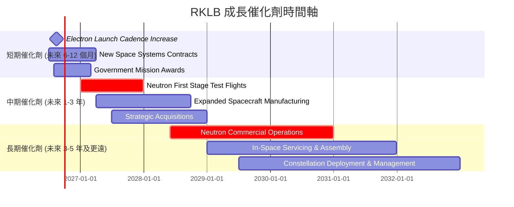
**分析：**
*   **短期**：Electron 火箭的發射頻率提升將直接貢獻收入，而新的空間系統合同和政府任務獎勵則能確保訂單的穩定性。
*   **中期**：Neutron 火箭的測試進展是市場關注的焦點，其成功將為公司帶來新的發射能力和市場機會。擴大的衛星製造能力和潛在的戰略收購也能鞏固其市場地位。
*   **長期**：Neutron 火箭的全面商業運營將是 RKLB 實現規模化盈利的關鍵。同時，在軌服務和組裝以及星群部署與管理等新興業務將為公司提供長期成長的廣闊空間。

### 8.2 TAM 市場規模分析

RKLB 所在的太空產業是一個快速擴張的萬億美元級市場。

```
╔══════════════════════════════════════════════════════════════════╗
║                   RKLB 潛在市場 (TAM) 分析                       ║
╠══════════════════════════════════════════════════════════════════╣
║                                                                  ║
║  小型衛星發射市場：  $10B (2030E)  ████████░░░░░░░░░░░░░░░░░░░  滲透率: ~5% ║
║  中型衛星發射市場：  $50B (2030E)  █████████████████████████░░░░  滲透率: <1% ║
║  空間系統與服務：    $200B (2030E) ██████████████████████████████  滲透率: <1% ║
║  國防與情報太空：    $50B+ (2030E) █████████████████████████░░░░  滲透率: <1% ║
║                                                                  ║
║  📊 總潛在市場規模 (TAM)：>$300B (2030E)                         ║
║  核心貢獻收入：發射服務、衛星製造、組件、任務管理               ║
╚══════════════════════════════════════════════════════════════════╝
```
**分析：**
RKLB 面臨的總潛在市場 (TAM) 巨大，預計到 2030 年將超過 $300B。
*   **小型衛星發射**：RKLB 在該市場已佔據一定份額，但仍有成長空間。
*   **中型衛星發射**：Neutron 火箭將使 RKLB 進入更大的中型衛星發射市場，這將是其未來收入增長的重要來源。
*   **空間系統與服務**：這是 RKLB 垂直整合的關鍵，包括衛星製造、組件供應、在軌服務等，市場規模最大且增長最快。
*   **國防與情報太空**：政府合同是 RKLB 的重要收入來源之一，該領域的需求穩定且具高價值。
目前 RKLB 的營收僅為 $679.58M (TTM)，在巨大的 TAM 中滲透率極低，這意味著其未來的成長空間廣闊。

### 8.3 成長驅動力結構圖

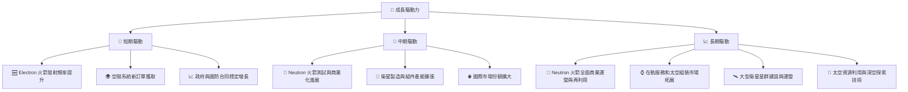
**分析：**
RKLB 的成長驅動力是多方面的，從短期穩定的 Electron 發射任務，到中期關鍵的 Neutron 火箭開發，再到長期更具潛力的在軌服務和深空探索。這些驅動力共同構建了 RKLB 的成長路徑，但同時也伴隨著相應的執行和技術風險。公司需要有效地管理這些項目，將其從研發階段成功轉化為商業收入，才能持續實現其高成長潛力。

---

## 9. 風險矩陣

RKLB 作為一家高成長的太空科技公司，面臨多種內外部風險，這些風險可能影響其未來的財務表現和市場地位。

### 9.1 風險評分矩陣

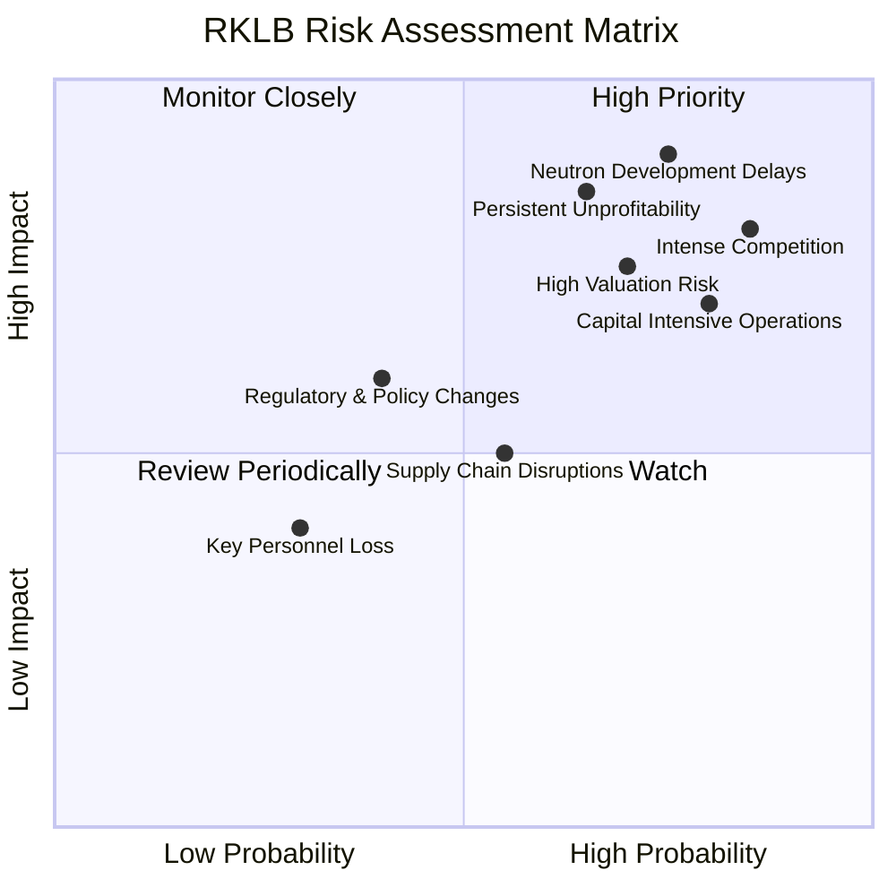

### 9.2 風險清單詳細分析

| # | 風險項目 | 發生機率 | 財務衝擊 | 風險評分 | 緩解措施 |
|---|----------|----------|----------|----------|----------|
| 1 | 🔴 **Neutron 火箭開發延遲或失敗** | 高 (75%) | 極高 (-30%收入預期) | 🔴 9.0/10 | 1. 嚴格的項目管理與里程碑監控。2. 充足的研發資金儲備。3. 備用技術方案或模組化設計。4. 與潛在客戶保持溝通，管理預期。 |
| 2 | 🔴 **競爭加劇 (SpaceX, Blue Origin 等)** | 極高 (85%) | 高 (-20%市佔率) | 🔴 8.5/10 | 1. 專注利基市場 (小型衛星發射)。2. 提升空間系統的差異化服務。3. 持續技術創新，降低發射成本。4. 建立強大的客戶關係和生態系統。 |
| 3 | 🔴 **持續虧損與盈利能力不確定性** | 中高 (65%) | 高 (-25%股東權益) | 🔴 8.0/10 | 1. 嚴格控制營運費用，優化成本結構。2. 提高毛利率，實現規模經濟。3. 探索新的高利潤空間系統服務。4. 確保 Neutron 火箭按時商業化並盈利。 |
| 4 | 🟡 **高估值與市場預期風險** | 高 (70%) | 中高 (-20%股價) | 🟡 7.5/10 | 1. 透過透明溝通管理市場預期。2. 持續兌現成長承諾。3. 專注長期價值創造，減少短期市場波動影響。 |
| 5 | 🟡 **資本密集型營運與融資需求** | 高 (80%) | 中 (-15% FCF) | 🟡 7.0/10 | 1. 維持強勁的現金儲備 ($1.38B)。2. 探索多樣化融資渠道 (如政府合同預付款、戰略合作)。3. 嚴格審核資本支出項目回報。 |
| 6 | 🟡 **供應鏈中斷風險** | 中 (55%) | 中 (-10%營收) | 🟡 5.5/10 | 1. 多元化供應商，降低對單一供應商依賴。2. 建立關鍵部件庫存緩衝。3. 加強供應鏈韌性管理。 |
| 7 | 🟢 **監管與政策變化** | 低 (40%) | 中低 (-5%營收) | 🟢 4.0/10 | 1. 積極參與行業標準制定和政策對話。2. 保持與政府機構的良好關係。3. 遵守國際太空法規。 |
| 8 | 🟢 **關鍵人才流失** | 低 (30%) | 低 (-5%研發進度) | 🟢 3.5/10 | 1. 建立有競爭力的薪酬和福利體系。2. 培養內部人才梯隊。3. 建立良好企業文化，提升員工忠誠度。 |

**分析：**
RKLB 面臨的首要風險是 Neutron 火箭的開發進度和太空產業的激烈競爭。Neutron 火箭的成功對於其長期成長至關重要，任何延遲或技術問題都可能對公司構成重大打擊。此外，持續的虧損和高估值也使得 RKLB 對市場預期非常敏感。公司目前的資本密集型營運需要持續的資金投入，儘管其現金儲備充足，但仍需謹慎管理。RKLB 透過多元化業務、技術創新和穩健的財務管理來緩解這些風險，但投資者仍需密切關注這些關鍵風險因素的演變。

---

## 10. 投資建議

綜合以上深度分析，RKLB 是一家在快速成長的太空產業中具有巨大潛力的公司。其強勁的營收增長、不斷改善的毛利率以及充足的現金儲備是其主要優勢。然而，公司目前仍處於高資本投入和虧損階段，高估值也反映了市場對其未來成長的極高預期。

### 10.1 最終綜合評級雷達圖

```
╔══════════════════════════════════════════════════════════════════╗
║                    RKLB 最終綜合評級                             ║
╠══════════════════════════════════════════════════════════════════╣
║ 基本面強度  6.0 ▓▓▓▓▓▓▓▓▓▓▓▓░░░░░░░░  ★★★☆☆           ║
║ 成長動能    9.0 ▓▓▓▓▓▓▓▓▓▓▓▓▓▓▓▓▓▓░░  ★★★★★           ║
║ 獲利品質    3.0 ▓▓▓▓▓▓░░░░░░░░░░░░░░  ★☆☆☆☆           ║
║ 財務健康    8.0 ▓▓▓▓▓▓▓▓▓▓▓▓▓▓▓▓░░░░  ★★★★☆           ║
║ 估值合理性  2.0 ▓▓▓▓░░░░░░░░░░░░░░░░  ☆☆☆☆☆           ║
║ 護城河深度  7.0 ▓▓▓▓▓▓▓▓▓▓▓▓▓▓░░░░░░  ★★★★☆           ║
║ 管理層執行  7.0 ▓▓▓▓▓▓▓▓▓▓▓▓▓▓░░░░░░  ★★★★☆           ║
║ 技術創新力  8.0 ▓▓▓▓▓▓▓▓▓▓▓▓▓▓▓▓░░░░  ★★★★☆           ║
╠══════════════════════════════════════════════════════════════════╣
║ 綜合總分    6.3 ▓▓▓▓▓▓▓▓▓▓▓▓░░░░░░░░  🏆 具高成長潛力，但風險與估值高 ║
╚══════════════════════════════════════════════════════════════════╝
```

### 10.2 目標價與隱含報酬率

| 情境 | 目標價 (12個月) | 較當前股價 ($101.65) 隱含報酬率 | 機率權重 (估計) | 加權目標價 |
|------|-----------------|---------------------------------|-----------------|------------|
| 🟢 **樂觀情境** | $135.00         | +32.82%                         | 30%             | $40.50     |
| 🟡 **基準情境** | $115.00         | +13.13%                         | 50%             | $57.50     |
| 🔴 **悲觀情境** | $90.00          | -11.46%                         | 20%             | $18.00     |
| **綜合目標價** | **$116.00**     | **+14.12%**                     | **100%**        |            |

**分析：**
綜合考量 RKLB 的成長潛力、財務健康狀況、盈利能力挑戰和高估值，我們給予 **「持有 (Accumulate on Dips)」** 的投資評級。加權平均目標價為 $116.00，較當前股價 $101.65 有約 14.12% 的潛在漲幅。這表明我們認為其當前股價已大致反映了大部分的成長預期，但仍有溫和的上行空間，尤其是在其主要催化劑（如 Neutron 火箭的進展）得到驗證的情況下。對於長期看好太空產業的投資者，可在股價回調時分批建倉。

### 10.3 買入時機與觸發因素

```
╔══════════════════════════════════════════════════════════════════╗
║                  ✅ 買入觸發因素 Checklist                      ║
╠══════════════════════════════════════════════════════════════════╣
║                                                                  ║
║  立即買入觸發條件（多數符合）：                                  ║
║  ☐ 當前股價回調至 $90-$100 區間                                 ║
║  ☐ Neutron 火箭測試進展超預期，例如成功完成關鍵測試              ║
║  ☐ 空間系統業務獲得重大政府或商業合同，顯著提升收入預期          ║
║  ☐ 毛利率持續提升，且營業虧損收窄速度快於預期                    ║
║                                                                  ║
║  加碼觸發條件（出現以下任一）：                                  ║
║  ☐ Neutron 火箭實現首次商業發射，並成功實現火箭再利用          ║
║  ☐ 公司宣佈重大技術突破，進一步鞏固護城河                      ║
║  ☐ 自由現金流轉正，顯示盈利能力顯著改善                          ║
║  ☐ 市場對太空產業的整體投資熱情顯著升溫                          ║
║                                                                  ║
║  減碼/停損觸發條件（出現以下任一）：                             ║
║  ☐ Neutron 火箭開發出現重大延遲或技術瓶頸                      ║
║  ☐ 競爭格局惡化，市場份額被嚴重侵蝕                              ║
║  ☐ 營收增長顯著放緩，且盈利能力改善不及預期                      ║
║  ☐ 股價跌破 $70 關鍵支撐位，且基本面未有改善                    ║
╚══════════════════════════════════════════════════════════════════╝
```

### 10.4 投資人適配度分析

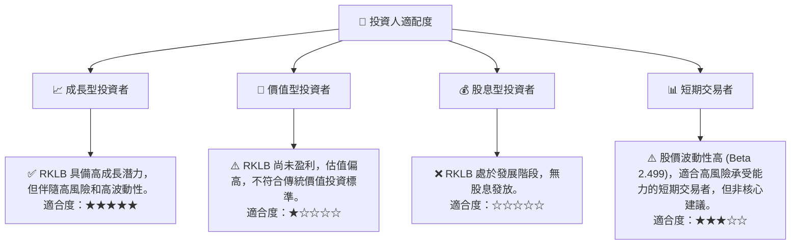
**分析：**
RKLB 最適合那些對太空產業的長期前景充滿信心、能夠承受高風險和高波動性，並願意長期等待公司實現盈利的成長型投資者。對於追求穩定回報或股息收入的投資者而言，RKLB 並不合適。

### 10.5 關鍵監控指標

| 監控類型 | 指標 | 關注點 | 頻率 |
|----------|--------------------|----------------------------------------------------|------|
| **成長** | 營收 YoY/QoQ 成長率 | 是否維持高成長，尤其是空間系統業務的貢獻。         | 季度 |
| **盈利** | 毛利率、營業利益率 | 毛利率能否持續改善，營業虧損能否加速收窄。         | 季度 |
| **效率** | 自由現金流 (FCF) | FCF 流出量是否得到控制，以及何時能轉正。           | 季度 |
| **產品** | Neutron 火箭進展 | 測試里程碑、首次發射時間表、成本控制。             | 季度/新聞 |
| **競爭** | 市場份額、新合同 | 在小型衛星發射和空間系統市場的競爭地位和訂單獲取。 | 季度/新聞 |
| **財務** | 現金儲備、債務水平 | 現金消耗率、是否需要新的股權融資。                 | 季度 |

---

> **免責聲明**：本報告為 AI 自動生成，僅供研究參考，不構成投資建議。投資有風險，入市需謹慎。