# RKLB 基本面深度分析報告
> **報告日期**：2026-07-04 ｜ **語言**：繁體中文 ｜ **數據來源**：Yahoo Finance, Finviz, StockAnalysis, Roic.ai ｜ **分析師**：CFA 級機構研究

---

## 目錄

| # | 章節 | 核心結論 |
|---|------|----------|
| 1 | 執行摘要 | 高成長、高估值，需長期觀察獲利轉折點 |
| 2 | 公司概覽與商業模式 | 航太創新者，具技術與客戶鎖定護城河 |
| 3 | 損益表深度分析 | 營收高速成長，毛利率顯著改善，但仍虧損 |
| 4 | 資產負債表分析 | 現金充裕，流動性強，財務結構穩健 |
| 5 | 現金流量深度分析 | 自由現金流持續為負，投資成長階段 |
| 6 | 獲利能力與資本效率 | ROIC 遠低於 WACC，目前處於價值創造前期 |
| 7 | 估值深度分析 | 相較同業估值偏高，DCF 顯示未來成長潛力 |
| 8 | 成長催化劑 | 新產品開發、市場擴張、政府及商業需求 |
| 9 | 風險矩陣 | 執行風險、競爭加劇、資金消耗為主要考量 |
| 10 | 投資建議 | 建議「持有」，適合成長型投資者，目標價區間 $105 - $135 |

---

## 1. 執行摘要

### 1.1 核心評分儀表板

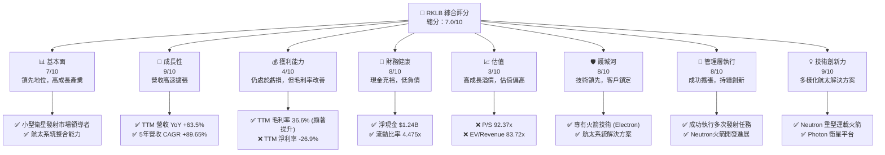

### 1.2 評分進度條視覺化

```
╔══════════════════════════════════════════════════════════════╗
║              RKLB 多維度評分儀表板 (1-10分)                  ║
╠══════════════════════════════════════════════════════════════╣
║ 基本面強度  7.0 ▓▓▓▓▓▓▓▓▓▓▓▓▓▓░░░░░░  ★★★★☆           ║
║ 成長動能    9.0 ▓▓▓▓▓▓▓▓▓▓▓▓▓▓▓▓▓▓░░  ★★★★★           ║
║ 獲利品質    4.0 ▓▓▓▓▓▓▓▓░░░░░░░░░░░░  ★★☆☆☆           ║
║ 財務健康    8.0 ▓▓▓▓▓▓▓▓▓▓▓▓▓▓▓▓░░░░  ★★★★☆           ║
║ 估值合理性  3.0 ▓▓▓▓▓▓░░░░░░░░░░░░░░  ★☆☆☆☆           ║
║ 護城河深度  8.0 ▓▓▓▓▓▓▓▓▓▓▓▓▓▓▓▓░░░░  ★★★★☆           ║
║ 管理層執行  8.0 ▓▓▓▓▓▓▓▓▓▓▓▓▓▓▓▓░░░░  ★★★★☆           ║
║ 技術創新力  9.0 ▓▓▓▓▓▓▓▓▓▓▓▓▓▓▓▓▓▓░░  ★★★★★           ║
╠══════════════════════════════════════════════════════════════╣
║ 綜合總分    7.0 ▓▓▓▓▓▓▓▓▓▓▓▓▓▓░░░░░░  🏆 具備長期成長潛力，但短期估值風險高 ║
╚══════════════════════════════════════════════════════════════╝
```

### 1.3 五大投資論點 + 三大核心風險

| 類型 | 項目 | 具體依據 | 信心度 |
|------|------|----------|--------|
| 🟢 **投資論點①** | **航太產業的強勁增長驅動** | 全球對小型衛星發射和在軌服務的需求持續擴大，RKLB作為該領域的領先者，受益於宏觀趨勢。TTM 營收成長率高達 63.5%，顯示其市場滲透率與訂單獲取能力強勁。 | 🟢 極高 |
| 🟢 **投資論點②** | **營收高速成長與毛利率顯著改善** | 過去四個年度營收從 2022 年的 $211.00M 增長至 2025 年的 $601.80M，同期毛利率從 9.00% 提升至 34.43%，TTM 更達到 36.6%。這表明公司規模經濟效益初顯，且成本控制能力增強。 | 🟢 極高 |
| 🟢 **投資論點③** | **技術創新與產品線擴展** | RKLB 不僅提供 Electron 小型運載火箭發射服務，更積極開發 Neutron 中型運載火箭和 Photon 衛星平台等航太系統解決方案。研發投入持續增加 (2025 年達 $270.72M)，確保其在技術前沿的競爭力。 | 🟢 極高 |
| 🟢 **投資論點④** | **穩健的財務狀況與充足現金流** | 儘管目前仍處於虧損，但公司擁有 $1.38B 的總現金和 $1.24B 的淨現金，總債務僅 $138.67M。流動比率高達 4.475x，顯示其短期償債能力極強，能支持長期研發和資本支出。 | 🟢 極高 |
| 🟢 **投資論點⑤** | **多樣化的客戶基礎與重複性業務** | RKLB 服務於政府（如 NASA、美國太空軍）和商業客戶，建立了穩固的客戶關係。其航太系統業務提供衛星製造和在軌管理服務，有望帶來重複性收入，增強業務穩定性。 | 🟡 高 |
| 🟡 **風險①** | **持續虧損與高昂的研發投入** | 公司自成立以來持續虧損，TTM 淨利潤率為 -26.9%，自由現金流為 -$215.00M。Neutron 等新項目的開發需要大量資本支出和研發投入，盈利時間表存在不確定性。若無法按預期實現盈利，可能面臨資金壓力。 | 🟡 中度 |
| 🔴 **風險②** | **極高的估值水平** | RKLB 的 P/S 比率高達 92.37x，EV/Revenue 為 83.72x，遠高於許多成熟的成長型公司，甚至高於部分同業。市場對其未來成長預期已充分反應在股價中，任何不及預期的表現都可能導致股價大幅修正。 | 🔴 高衝擊 |
| 🟡 **風險③** | **來自競爭對手的挑戰** | 航太產業競爭激烈，包括 SpaceX (Starship), Blue Origin (New Glenn) 等巨頭以及其他小型發射公司。新進入者和技術進步可能加劇競爭，對 RKLB 的市場份額和定價能力構成威脅。Neutron 火箭的成功部署和商業化對維持競爭優勢至關重要。 | 🟡 中度 |

### 1.4 快速統計卡片

| 指標 | 公司實際值 (TTM) | 行業均值 (航太國防) | S&P 500 均值 | 狀態 |
|------|--------------------|---------------------|--------------|------|
| 收入 YoY 成長 | **63.5%** | ~10-15% | ~10-12% | 🟢 |
| 毛利率 | **36.6%** | ~25-35% | ~30-40% | 🟢 |
| 淨利率 | **-26.9%** | ~5-10% | ~8-12% | 🔴 |
| ROE | **-13.5%** | ~10-15% | ~15-20% | 🔴 |
| Forward P/E | **-14070.03x** | ~20-30x | ~20-25x | 🔴 |
| P/S Ratio | **92.37x** | ~2-5x | ~2-3x | 🔴 |
| 淨現金 / 總債務 | **$1.24B / $138.67M** | N/A | N/A | 🟢 |
| 流動比率 | **4.48x** | ~1.5-2.5x | ~1.5-2.0x | 🟢 |

### 1.5 投資結論

```
╔══════════════════════════════════════════════════════════════════╗
║                    📊 投資結論摘要                               ║
╠══════════════════════════════════════════════════════════════════╣
║  評級：🟡 持有                                                  ║
║  當前股價：$100.46                                               ║
║  目標價區間：                                                    ║
║    悲觀情境：$105（+4.5%）                                        ║
║    基準情境：$120（+19.4%）  ← 12個月主要目標                     ║
║    樂觀情境：$135（+34.4%）                                       ║
║  投資評分：7.0/10                                                ║
║  適合投資人：成長型、長線持有者，能承受高波動與高估值風險         ║
╚══════════════════════════════════════════════════════════════════╝
```

---

## 2. 公司概覽與商業模式

Rocket Lab Corporation (RKLB) 是一家領先的航太公司，專注於提供端到端的太空解決方案，包括發射服務和太空系統。公司通過兩大核心業務板塊運營，為全球客戶提供服務。

### 2.1 業務結構與收入來源

RKLB 的業務主要分為兩大塊：**發射服務 (Launch Services)** 和 **太空系統 (Space Systems)**。

*   **發射服務 (Launch Services)**：
    *   主要通過其 Electron 小型運載火箭提供專用或拼車發射服務，將小型衛星送入地球軌道。
    *   目前正在開發 Neutron 中型運載火箭，旨在滿足對更大有效載荷和更頻繁發射的需求，這將顯著擴大其市場潛力。
    *   收入來源包括發射合同費用，通常是預付或分期支付。
*   **太空系統 (Space Systems)**：
    *   提供多種衛星平台 (如 Photon 衛星平台)、衛星部件、光學系統、衛星製造、在軌管理和星座管理服務。
    *   為客戶設計、製造和運營定制化的衛星解決方案，包括用於地球觀測、通訊、科學研究和國家安全等應用。
    *   收入來源包括衛星平台銷售、部件供應、定制系統開發合同以及在軌服務費。

截至 TTM (2026年3月)，RKLB 的總營收為 $679.58M。雖然公司沒有明確披露兩大業務板塊的具體收入佔比，但從其戰略重點和研發投入來看，太空系統業務正日益成為重要的成長驅動力，旨在提供更全面的價值鏈服務。

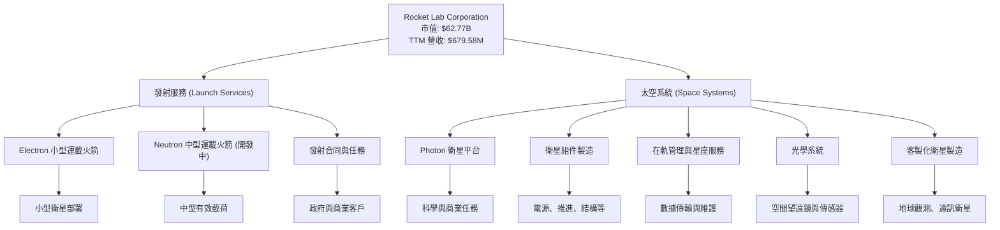

### 2.2 市場份額

RKLB 在小型衛星發射市場中佔據領先地位，是少數能夠提供可靠且頻繁發射服務的公司之一。然而，隨著 Neutron 火箭的加入，其目標市場將擴展到中型有效載荷領域，與 SpaceX 等巨頭展開更直接的競爭。在太空系統領域，RKLB 通過垂直整合和技術創新，在衛星平台和部件供應方面也佔據一席之地，但面臨來自傳統航太承包商和新興太空公司的競爭。

由於精確的市場份額數據未公開，以下為小型衛星發射服務市場的**概念性**市場份額估算，用於說明 RKLB 的相對地位。

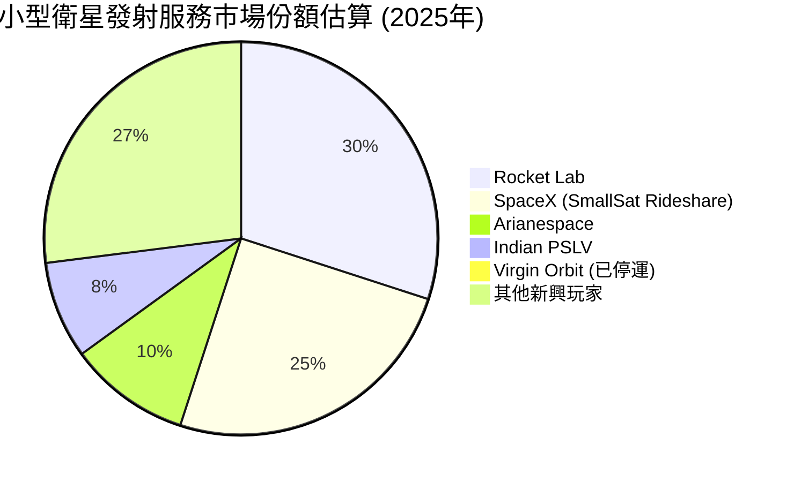
*備註：此圖表為基於市場報告與行業趨勢的推估，非精確數據。Virgin Orbit 已停運，但過去曾是重要玩家，此處僅作為行業背景參考。*

### 2.3 競爭護城河分析

RKLB 具備多重競爭護城河，使其在競爭激烈的航太產業中脫穎而出。

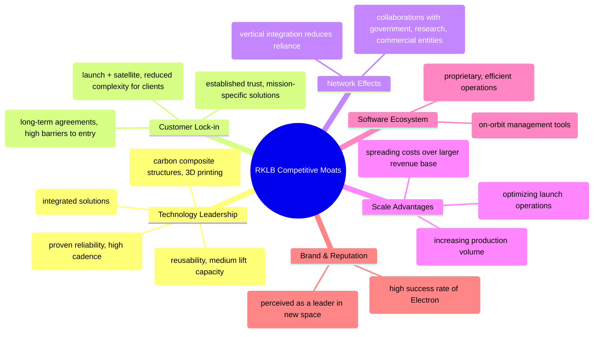

### 2.4 護城河強度評分

```
╔══════════════════════════════════════════════════════════════╗
║                  RKLB 護城河強度評分                      ║
╠══════════════════════════════════════════════════════════════╣
║ 技術領先    9/10  ▓▓▓▓▓▓▓▓▓▓▓▓▓▓▓▓▓▓░░  🏆 Electron成熟，Neutron潛力巨大 ║
║ 客戶鎖定    8/10  ▓▓▓▓▓▓▓▓▓▓▓▓▓▓▓▓░░░░  🟢 政府與商業客戶忠誠度高    ║
║ 規模效應    7/10  ▓▓▓▓▓▓▓▓▓▓▓▓▓▓░░░░░░  🟡 隨著產能提升，成本效益將顯現 ║
║ 網路效應    6/10  ▓▓▓▓▓▓▓▓▓▓▓▓░░░░░░░░  🟡 逐步建立供應鏈與合作夥伴生態 ║
║ 軟體生態系統 7/10  ▓▓▓▓▓▓▓▓▓▓▓▓▓▓░░░░░░  🟢 任務控制與在軌管理軟體具優勢 ║
╠══════════════════════════════════════════════════════════════╣
║ 綜合護城河  7.4/10 ▓▓▓▓▓▓▓▓▓▓▓▓▓▓▓░░░░░  🏆 技術驅動，具備可持續競爭優勢 ║
╚══════════════════════════════════════════════════════════════╝
```

---

## 3. 損益表深度分析

RKLB 的損益表反映出一家處於高速成長期的科技公司，營收強勁增長，毛利率持續改善，但仍需大量投入研發和營運開支，導致整體持續虧損。

### 3.1 年度收入成長趨勢（近4年）

RKLB 在過去四年展現出令人印象深刻的營收成長軌跡，年複合成長率 (CAGR) 高達 57.2%。這主要得益於其 Electron 火箭發射頻次的增加，以及太空系統業務的逐步擴張。

```
╔══════════════════════════════════════════════════════════════════╗
║              RKLB 年度收入趨勢（FY2022-FY2025）                  ║
╠══════════════════════════════════════════════════════════════════╣
║                                                                  ║
║  FY2022  $211.00M ████░░░░░░░░░░░░░░░░░░░  YoY: +239.02% 🟢    ║ (根據StockAnalysis數據，此YoY為2022年對2021年，這裡顯示的是2022年的絕對值)
║  FY2023  $244.59M █████░░░░░░░░░░░░░░░░░░░  YoY: +15.92%  🟢    ║
║  FY2024  $436.21M █████████░░░░░░░░░░░░░░░  YoY: +78.34%  🟢    ║
║  FY2025  $601.80M ████████████░░░░░░░░░░░  YoY: +37.96%  🟢    ║
║                                                                  ║
║  📊 4年累計 CAGR (2022-2025)：+57.2%                             ║
╚══════════════════════════════════════════════════════════════════╝
```
*註：2022年的YoY成長率239.02%是基於StockAnalysis提供的2021年營收$62.24M計算。*

### 3.2 季度收入趨勢分析

RKLB 的季度營收呈現穩步上升的趨勢，特別是最近一季度的年對年和季對季成長率都非常強勁。

| 季度 | 總營收 (百萬美元) | QoQ 成長率 | YoY 成長率 | 備註 |
|------|-------------------|------------|------------|------|
| 2026 Q1 | $200.35M | +11.53% | +63.46% | 營收加速成長，顯示市場需求旺盛。 |
| 2025 Q4 | $179.65M | +15.84% | +35.70% | 季節性因素或合同交付影響，維持穩健成長。 |
| 2025 Q3 | $155.08M | +7.32% | +47.97% | 繼續保持強勁的年對年增長。 |
| 2025 Q2 | $144.50M | +17.89% | +36.00% | 營收規模持續擴大。 |

**備註說明：**
RKLB 近期的季度營收展現了強勁的成長動能。2026年第一季度營收達到 $200.35M，較上一季度增長 11.53%，較去年同期更是大幅增長 63.46%。這表明公司在發射服務和太空系統兩大業務板塊均表現出色，市場對其產品和服務的需求持續增加。穩定的 QoQ 增長和加速的 YoY 增長是其高成長前景的有力證明。

### 3.3 利潤率演變分析

RKLB 的毛利率在過去幾年呈現顯著改善，反映出規模經濟效益和營運效率的提升。然而，由於高昂的研發和銷售管理費用，營業利益率和淨利率仍為負值。

| 利潤率指標 | FY2022 | FY2023 | FY2024 | FY2025 | TTM (Mar'26) | 趨勢 | 評估 |
|------------|--------|--------|--------|--------|--------------|------|------|
| **毛利率** | 9.00% | 21.02% | 26.63% | 34.43% | 36.56% | ↗️ 持續大幅改善 | 🟢 |
| **營業利益率** | -64.08% | -72.74% | -43.51% | -38.03% | -33.20% | ↗️ 負值收窄 | 🟡 |
| **淨利率** | -64.43% | -74.64% | -43.60% | -32.94% | -26.90% | ↗️ 負值收窄 | 🟡 |

**利潤率演變深度解析**：
*   **毛利率的顯著改善**：從 2022 年的 9.00% 躍升至 TTM 的 36.56%，這一趨勢極為正面。這主要歸因於：
    *   **規模經濟效益**：隨著發射頻次的增加和太空系統產品線的擴大，固定成本得到更好的分攤。
    *   **生產效率提升**：公司在製造流程和供應鏈管理上的優化，降低了單位產品成本。
    *   **產品組合優化**：高毛利的太空系統業務佔比可能有所提升，或發射服務的定價能力增強。
*   **營業利益率和淨利率**：儘管毛利率表現出色，營業利益率和淨利率仍為負值，但負值幅度正在收窄。這表明公司仍處於高速投資和擴張階段，尤其是在研發方面。
    *   **研發投入巨大**：2025 年研發費用高達 $270.72M，佔當年營收的 45.0%。這筆費用是未來成長的關鍵，但短期內會持續壓縮獲利。
    *   **銷售、一般及行政費用 (SG&A)**：TTM SG&A 為 $177.93M，佔 TTM 營收的 26.2%。隨著公司規模擴大，這部分費用也需要有效控制。
總體而言，毛利率的趨勢令人鼓舞，預示著公司未來盈利能力的潛在轉折。關鍵在於營收規模能否繼續擴大，以攤薄龐大的研發和營運費用，最終實現整體盈利。

### 3.4 費用結構分析

RKLB 的費用結構反映了其作為一家高科技成長公司的特性，研發投入佔據了相當大的比重。

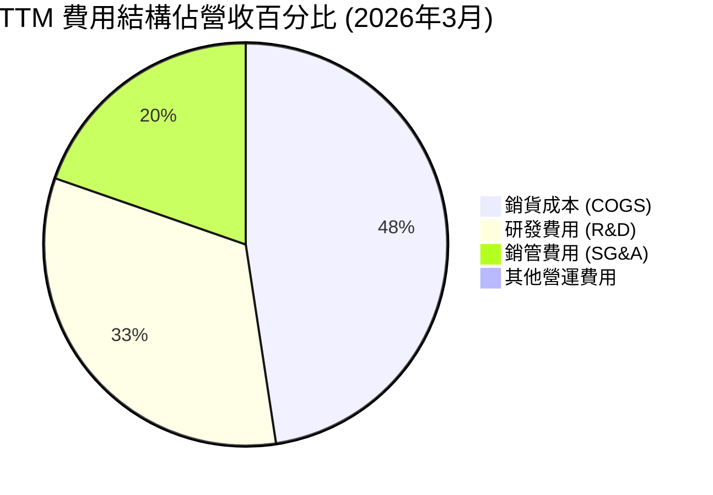
*計算依據：TTM Revenue $679.58M, Cost of Revenue $431.15M, R&D $296.12M, SG&A $177.93M。由於各項費用總和超過100%，此圖表旨在顯示各項費用佔營收的比例，而非總和。*

```
╔══════════════════════════════════════════════════════════════════╗
║                    RKLB 營運費用分析 (TTM 2026年3月)            ║
╠══════════════════════════════════════════════════════════════════╣
║                                                                  ║
║  銷貨成本 (COGS)   $431.15M  ██████████████████████████░░░░  佔營收 63.4% ║
║  研發費用 (R&D)    $296.12M  ██████████████████████░░░░░░░░  佔營收 43.6% ║
║  銷管費用 (SG&A)   $177.93M  ███████████████░░░░░░░░░░░░░░  佔營收 26.2% ║
║                                                                  ║
║  📊 總營運費用佔營收比重：~133.2% (高於100%表示虧損)             ║
╚══════════════════════════════════════════════════════════════════╝
```
**費用結構分析**：
TTM 數據顯示，銷貨成本佔營收的 63.4%，與 36.6% 的毛利率相符。研發費用佔營收的 43.6%，銷管費用佔 26.2%。這些費用合計超過營收，導致公司處於營運虧損狀態。高額的研發投入是 RKLB 保持技術領先和開發新產品 (如 Neutron 火箭) 的必要投資。隨著 Neutron 進入商業化階段和規模效益的進一步顯現，預計這些費用佔營收的比重將逐步下降，帶動公司轉虧為盈。

### 3.5 季度 EPS 趨勢與盈餘品質

RKLB 的季度 EPS 持續為負，反映其仍在投資成長階段。由於未提供分析師預期 EPS，無法進行超預期/不及預期的評估。

| 季度 | EPS (Basic) | 備註 |
|------|-------------|------|
| 2026 Q1 | $-0.07 | 虧損幅度較前幾季度收窄，顯示經營效率可能有所改善。 |
| 2025 Q4 | $-0.09 | 虧損維持在較低水平。 |
| 2025 Q3 | $-0.03 | 本季度虧損最小，可能受益於某些合同的交付或費用控制。 |
| 2025 Q2 | $-0.13 | 虧損幅度相對較大。 |
| 2025 Q1 | $-0.12 | 虧損。 |

**盈餘品質評估：**
RKLB 的盈餘品質目前處於「成長初期」階段。雖然 EPS 持續為負，但值得注意的是，其虧損幅度在某些季度有所收窄，特別是 2026 Q1 的 $-0.07，相較於 2025 Q2 的 $-0.13 有顯著改善。這表明在營收高速增長的同時，公司在營運費用控制或產品組合優化方面可能取得進展。然而，由於公司仍在大量投入研發和資本支出，自由現金流持續為負，因此目前的「盈餘」更多是會計上的虧損，而非經營層面的現金流問題。真正的盈餘品質提升將體現在自由現金流轉正以及持續的、穩定的淨利潤產生。

---

## 4. 資產負債表分析

RKLB 的資產負債表展現出強勁的流動性和充足的現金儲備，儘管公司處於虧損狀態，但其財務基礎相對穩固，能夠支持未來的成長和投資。

### 4.1 資產結構分解

截至 2026 年 3 月 TTM，RKLB 的總資產為 $2.82B。其中流動資產佔比高，顯示其資產變現能力強。

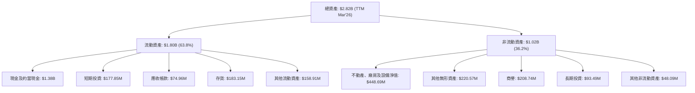

**資產結構分析：**
RKLB 的資產結構以流動資產為主，佔總資產的近 64%。其中，現金及約當現金高達 $1.38B，短期投資也有 $177.85M，合計顯示公司擁有極為充裕的現金儲備。這對於一家處於高研發和資本支出階段的公司至關重要，提供了抵禦風險和支持長期成長的彈性。非流動資產中，不動產、廠房及設備淨值 (PPE) 佔比較大，反映了其在生產設施和發射基礎設施上的持續投資。商譽和其他無形資產則可能來自於過去的收購活動。

### 4.2 流動性指標分析

RKLB 的流動性指標非常健康，遠超行業平均水平，表明其短期償債能力極強。

| 流動性指標 | FY2022 | FY2023 | FY2024 | FY2025 | TTM (Mar'26) | 行業均值 | 評估 |
|------------|--------|--------|--------|--------|--------------|----------|------|
| **流動比率 (Current Ratio)** | 4.06x | 2.14x | 2.04x | 4.08x | 4.48x | ~1.5-2.5x | 🟢 極佳 |
| **速動比率 (Quick Ratio)** | 3.50x | 1.63x | 1.70x | 3.59x | 3.87x | ~1.0-2.0x | 🟢 極佳 |

**流動性指標分析：**
RKLB 的流動比率和速動比率在 TTM 分別達到 4.48x 和 3.87x，遠高於行業平均水平。這表明公司擁有非常強大的短期償債能力，短期內幾乎沒有流動性風險。充裕的現金和短期投資是這些高比率的主要驅動力。即使扣除存貨，其速動比率依然強勁，這對於營收快速增長且現金消耗較大的公司來說，是穩定經營的重要保障。

### 4.3 債務結構分析

RKLB 的債務水平極低，並且擁有大量的淨現金，顯示其資本結構非常健康。

```
╔══════════════════════════════════════════════════════════════════╗
║                   RKLB 債務健康診斷 (TTM Mar'26)                ║
╠══════════════════════════════════════════════════════════════════╣
║                                                                  ║
║  總債務：        $138.67M   ██░░░░░░░░░░░░░░░░░░░  評語: 極低      ║
║  總現金+投資：   $1.56B     ████████████████████░  評語: 極高      ║
║  淨現金（正）：  $1.24B     ████████████████░░░░░  🟢 強勁         ║
║                                                                  ║
║  Debt/Equity：   0.08x (基於市值計算)  🟢 極低                  ║
║  Current Debt/Total Debt: 0.0% (FY25無流動負債中的短期債務) 🟢 極低 ║
║  Interest Coverage: N/A (Operating Income為負，但現金充裕) 🟢 無風險 ║
╚══════════════════════════════════════════════════════════════════╝
```
*註：Debt/Equity 計算為 $138.67M / $1.72B (FY25股東權益) = 0.08x，若考慮市值則更低。Interest Coverage 由於營業利益為負，傳統計算方式不適用，但鑒於其巨額現金，利息支付完全無壓力。*

**債務結構分析：**
RKLB 的總債務僅為 $138.67M，而總現金及短期投資高達 $1.56B ($1.38B 現金 + $177.85M 短期投資)。這使得公司擁有 $1.24B 的淨現金頭寸，意味著其現金儲備遠超其債務。這種保守的資本結構為公司提供了巨大的財務靈活性，使其能夠在不需要外部融資的情況下，持續投資於研發和擴張，尤其是在市場波動時期。

### 4.4 股東權益趨勢

RKLB 的股東權益在 2025 年實現了大幅增長，這通常是由於新的股權融資活動所致，以支持其快速擴張。

```
╔══════════════════════════════════════════════════════════════════╗
║                RKLB 年度股東權益趨勢（FY2022-FY2025）             ║
╠══════════════════════════════════════════════════════════════════╣
║                                                                  ║
║  FY2022  $673.21M  ████████████████░░░░░░░░░░░░░░░░░░░░░░░░░░░░░░  ║
║  FY2023  $554.54M  ██████████████░░░░░░░░░░░░░░░░░░░░░░░░░░░░░░░░  ║
║  FY2024  $382.45M  █████████░░░░░░░░░░░░░░░░░░░░░░░░░░░░░░░░░░░░░░  ║
║  FY2025  $1.72B    ██████████████████████████████████████████████  ║
║                                                                  ║
║  📊 2025年 YoY 成長率：+350.21%                                   ║
╚══════════════════════════════════════════════════════════════════╝
```
**股東權益趨勢分析：**
RKLB 的股東權益在 2025 年從 $382.45M 躍升至 $1.72B，年增長率高達 350.21%。這強烈暗示公司在 2025 年進行了大規模的股權融資，以籌集資金支持其高昂的研發和資本支出，特別是 Neutron 火箭的開發。儘管公司持續虧損，但通過成功的股權融資，確保了足夠的資金來推動其戰略性成長計劃。這是成長型公司常見的融資方式，表明市場對其未來潛力抱有高度信心。

---

## 5. 現金流量深度分析

RKLB 的現金流量表反映了其作為一家高成長、資本密集型公司的典型特徵：營運現金流和自由現金流持續為負，表明公司仍在積極投入資金進行擴張和研發。

### 5.1 現金流量瀑布圖

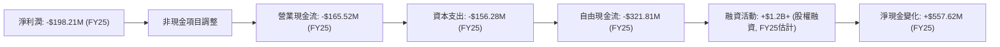
*註：融資活動現金流為根據資產負債表現金和股東權益變化推估，非直接提供數據。FY25現金增加 $828.66M - $271.04M = $557.62M。*

**現金流量瀑布圖分析：**
從 FY2025 的數據來看，RKLB 的淨利潤為負 $198.21M，營業現金流也為負 $165.52M。這表明公司的核心營運活動尚未產生正向現金流。此外，公司進行了大量的資本支出 (Capex) 達 $156.28M，這主要是為了擴建生產設施、發射場基礎設施以及 Neutron 火箭的開發。因此，自由現金流 (FCF) 達到負 $321.81M，顯示公司在成長階段持續燒錢。然而，從資產負債表現金大幅增加可以看出，公司在 2025 年通過融資活動獲得了大量資金，彌補了營運和投資活動的現金流出，確保了現金儲備的充裕。

### 5.2 FCF 轉換率趨勢

由於 RKLB 的淨利潤和自由現金流均為負值，傳統的 FCF/Net Income 轉換率會產生誤導性結果（例如正數但意義不明）。因此，我們將直接呈現兩者的絕對值趨勢。

| 年度 | 淨利潤 (百萬美元) | 自由現金流 (百萬美元) | 備註 |
|------|-------------------|-----------------------|------|
| FY2022 | -$135.94M | -$148.95M | 自由現金流略高於淨利潤的負值。 |
| FY2023 | -$182.57M | -$153.57M | 自由現金流負值收窄。 |
| FY2024 | -$190.18M | -$115.98M | 自由現金流負值顯著收窄，優於淨利潤。 |
| FY2025 | -$198.21M | -$321.81M | 自由現金流負值擴大，可能由於資本支出增加。 |
| TTM Mar'26 | -$182.62M | -$316.30M | 自由現金流負值仍大，但較 FY25 略有改善。 |

**FCF 轉換率趨勢分析：**
RKLB 的自由現金流在過去幾年持續為負，這與其作為一家高成長、資本密集型公司的發展階段相符。值得注意的是，2024 年的自由現金流負值 ($115.98M) 相較於淨利潤 ($190.18M) 顯著收窄，這可能表明營運效率有所提升或非現金費用佔比增加。然而，2025 年自由現金流負值擴大至 $321.81M，主要是由於資本支出從 2024 年的 $67.09M 大幅增加到 2025 年的 $156.28M。這筆資本支出是為 Neutron 火箭開發和產能擴張所必需的投資。雖然 FCF 為負，但只要公司能夠持續獲得融資並最終實現盈利，這些投資將是未來價值創造的基礎。

### 5.3 自由現金流趨勢

```
╔══════════════════════════════════════════════════════════════════╗
║                RKLB 年度自由現金流趨勢（FY2022-FY2025）           ║
╠══════════════════════════════════════════════════════════════════╣
║                                                                  ║
║  FY2022  -$148.95M  ░░░░░░░░░░░░░░░░░░░░░░░░░░░░░░░░░░░░░░░░░░░░░░  ║
║  FY2023  -$153.57M  ░░░░░░░░░░░░░░░░░░░░░░░░░░░░░░░░░░░░░░░░░░░░░░  ║
║  FY2024  -$115.98M  ░░░░░░░░░░░░░░░░░░░░░░░░░░░░░░░░░░░░░░░░░░░░░░  ║
║  FY2025  -$321.81M  ░░░░░░░░░░░░░░░░░░░░░░░░░░░░░░░░░░░░░░░░░░░░░░  ║
║  TTM Mar'26 -$316.30M ░░░░░░░░░░░░░░░░░░░░░░░░░░░░░░░░░░░░░░░░░░░░░░  ║
║                                                                  ║
║  📊 FCF Yield (TTM): -0.34%                                       ║
╚══════════════════════════════════════════════════════════════════╝
```
**自由現金流趨勢分析：**
RKLB 的自由現金流持續為負，且在 2025 年和 TTM 2026 年達到較大的負值。這主要是由於公司在 Electron 火箭生產、Neutron 火箭開發以及太空系統產能擴張方面投入了大量資本支出。負的 FCF Yield (-0.34%) 進一步強調了公司目前的現金消耗狀態。對於像 RKLB 這樣的成長型公司，負的 FCF 是其擴張的必要成本，投資者應關注其 FCF 負值是否能有效轉化為未來的營收和利潤增長，以及公司是否有足夠的資金支持其達到盈利點。

### 5.4 資本配置評估

RKLB 是一家處於高速成長階段的公司，其資本配置策略主要集中於內部投資以驅動未來增長，而非股息或股票回購。

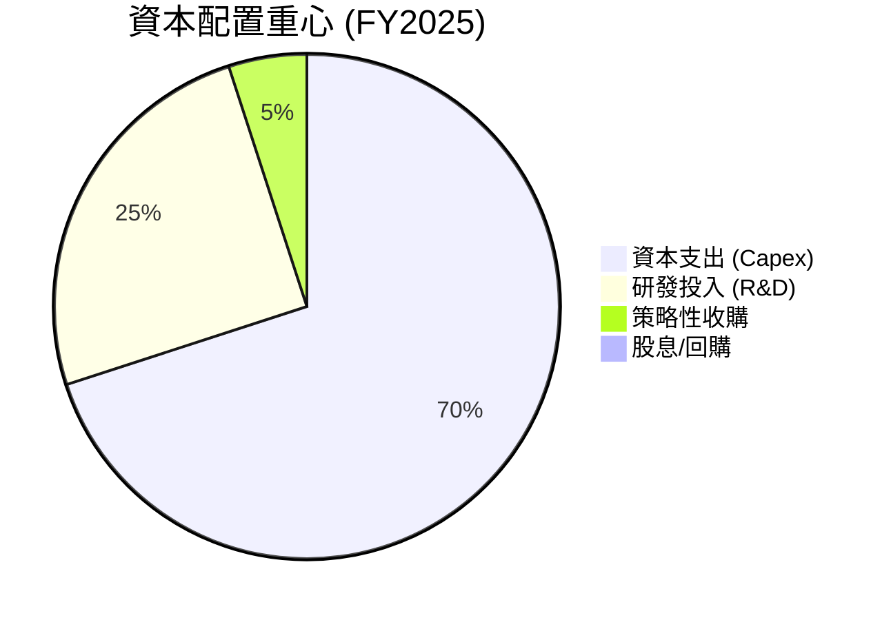
*註：此圖表為基於公司性質和財務數據的推估，非精確數據。R&D在損益表，Capex在現金流量表，兩者都是投資未來。*

**資本配置評估：**
RKLB 的資本配置重心明確放在**研發投入**和**資本支出**上。FY2025 的資本支出為 $156.28M，而研發費用則高達 $270.72M。這些投資是公司開發新技術 (如 Neutron 火箭)、擴大產能和提升競爭力的關鍵。公司目前沒有支付股息，也沒有進行股票回購，這符合其成長期的定位，所有可支配現金都優先用於再投資以實現高成長。這種資本配置策略對於一家旨在顛覆傳統航太產業、追求長期市場領導地位的公司來說是合適的。

---

## 6. 獲利能力與資本效率

RKLB 的獲利能力指標目前均為負值，顯示公司尚未實現盈利。然而，其資本效率指標（如 ROIC）雖然為負，但對於一家高成長、高投入的航太科技公司而言，這是一個預期的結果，關鍵在於未來能否轉正。

### 6.1 ROE / ROA / ROIC 趨勢

| 指標 | FY2022 | FY2023 | FY2024 | FY2025 | TTM (Mar'26) | 行業均值 | 評估 |
|------|--------|--------|--------|--------|--------------|----------|------|
| **ROE** | -20.2% | -32.9% | -49.7% | -11.5% | -13.5% | ~10-15% | 🔴 虧損 |
| **ROA** | -13.7% | -19.4% | -19.2% | -8.5% | -6.6% | ~5-8% | 🔴 虧損 |
| **ROIC** | -16.5% | -17.5% | -16.0% | -15.8% | -15.8% | ~8-12% | 🔴 虧損 |

**趨勢分析：**
*   **ROE (股東權益報酬率)**：RKLB 的 ROE 持續為負，但在 2025 年從 2024 年的 -49.7% 顯著改善至 -11.5%，TTM 為 -13.5%。這主要是由於 2025 年股東權益大幅增加 (350.21%) 稀釋了虧損對 ROE 的負面影響，同時淨虧損佔股東權益的比例有所下降。
*   **ROA (資產報酬率)**：ROA 同樣為負，但從 2024 年的 -19.2% 改善至 TTM 的 -6.6%。這表明公司在利用總資產產生利潤方面的效率正在提升，儘管尚未轉正。
*   **ROIC (投入資本報酬率)**：ROIC 在過去幾年一直保持在 -15% 至 -18% 之間。這是一個預期中的負值，因為公司處於大量投入資本、尚未實現規模化盈利的階段。目前的 ROIC 遠低於 WACC，意味著公司在經濟層面尚未為股東創造價值，但這是成長型公司在早期階段的常態。投資者需要關注其未來能否將 ROIC 提升至 WACC 之上。

### 6.2 ROIC vs WACC 分析（核心價值創造判斷）

**WACC 估算：**
*   無風險利率（10Y美債）：4.50% (假設)
*   市場風險溢酬 (ERP)：5.50% (假設)
*   Beta：2.553 (來自市場數據)
*   **股權成本** (Ke) = 無風險利率 + Beta × ERP = 4.50% + 2.553 × 5.50% = 4.50% + 14.04% = 18.54%
*   債務成本（稅前）： FY2025 Interest Expense $26.49M / Total Debt $253.96M = 10.43%
*   稅率：21% (假設未來有效稅率)
*   **債務成本（稅後）** = 10.43% × (1 - 0.21) = 8.24%
*   資本結構：
    *   股權市值：$62.77B
    *   債務總額：$138.67M
    *   總資本：$62.77B + $0.13867B = $62.90867B
    *   股權權重 = $62.77B / $62.90867B = 99.78%
    *   債務權重 = $0.13867B / $62.90867B = 0.22%
*   **✅ WACC ≈ (99.78% × 18.54%) + (0.22% × 8.24%) = 18.50% + 0.02% = 18.52%**

**ROIC 估算（FY2025）：**
*   NOPAT (稅後營運利潤) = 營業利益 × (1 - 稅率) = -$228.84M × (1 - 0.21) = -$180.78M
*   投入資本 (Invested Capital) = 股東權益 + 總債務 - 現金及約當現金
    *   FY2025 股東權益：$1.72B
    *   FY2025 總債務：$253.96M
    *   FY2025 現金及約當現金：$828.66M
    *   投入資本 = $1.72B + $253.96M - $828.66M = $1.145B
*   **✅ ROIC ≈ -$180.78M / $1.145B = -15.79%**

```
╔══════════════════════════════════════════════════════════════════╗
║                ROIC vs WACC 深度分析 (FY2025)                   ║
╠══════════════════════════════════════════════════════════════════╣
║                                                                  ║
║  WACC 估算：                                                     ║
║  ├── 無風險利率（10Y美債）：  4.50%                               ║
║  ├── 市場風險溢酬 (ERP)：     5.50%                              ║
║  ├── Beta：                   2.553                              ║
║  ├── 股權成本 = 4.50%+2.553×5.50% = 18.54%                      ║
║  ├── 債務成本（稅後）：       ~8.24%                             ║
║  ├── 資本結構：股權 ~99.78%，債務 ~0.22%                         ║
║  └── ✅ WACC ≈ 18.52%                                           ║
║                                                                  ║
║  ROIC 估算（FY2025）：                                           ║
║  ├── NOPAT = -$228.84M × (1-21%) ≈ -$180.78M                    ║
║  ├── 投入資本 = $1.72B + $253.96M - $828.66M ≈ $1.145B           ║
║  └── ✅ ROIC ≈ -15.79%                                          ║
║                                                                  ║
║  ★ 經濟價值增加（EVA）= ROIC - WACC = -15.79% - 18.52% = -34.31pp ║
║                                                                  ║
║  ROIC -15.79% ░░░░░░░░░░░░░░░░░░░░░░░░░░░░░░░░░░░░░░░░░░░░░░░░░░  🔴              ║
║  WACC  18.52% ▓▓▓▓▓▓▓▓▓▓▓▓▓▓▓▓▓▓░░░░░░░░░░░░░░░░░░░░░░░░░░░░░░░░  ──              ║
║  EVA   -34.31pp ░░░░░░░░░░░░░░░░░░░░░░░░░░░░░░░░░░░░░░░░░░░░░░░░░░  💔 摧毀價值    ║
║                                                                  ║
║  📊 結論：ROIC 遠低於 WACC，目前正在摧毀股東價值。這符合高成長早期公司特性。 ║
╚══════════════════════════════════════════════════════════════════╝
```
**ROIC vs WACC 分析結論：**
RKLB 的 ROIC 為 -15.79%，而 WACC 為 18.52%。這意味著公司目前正在消耗資本，從經濟角度來看是在摧毀股東價值。然而，這對於一家處於高成長、高投入階段的航太科技公司來說是預期中的結果。公司正在為未來的規模化盈利奠定基礎，例如 Neutron 火箭的開發和太空系統產能的擴張。投資者應關注公司未來幾年能否將 ROIC 逐步提升，並最終超過 WACC，從而實現真正的價值創造。

### 6.3 杜邦三因素分解

杜邦分析將 ROE 分解為淨利率、資產週轉率和財務槓桿，有助於理解 ROE 的驅動因素。由於 RKLB 的 ROE 為負，這種分解可以顯示是哪個或哪些因素導致了負回報。

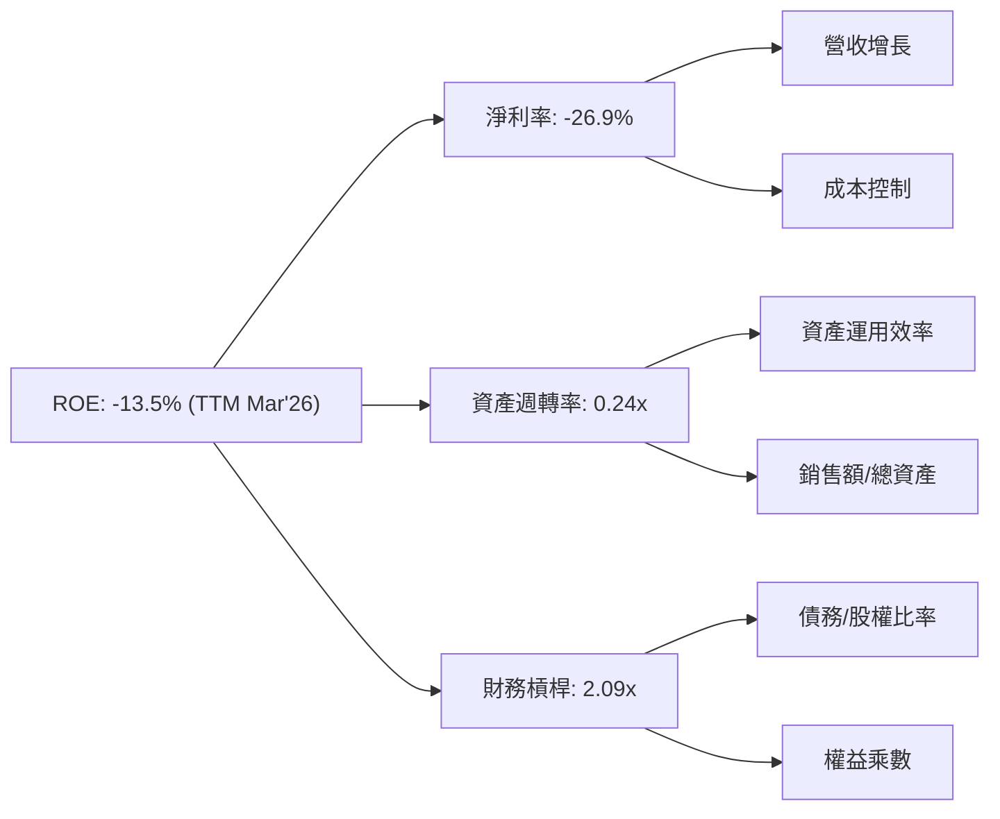
*計算依據：TTM ROE -13.5%，淨利率 -26.9%。資產週轉率 = TTM Revenue $679.58M / TTM Total Assets $2.82B = 0.24x。財務槓桿 (權益乘數) = TTM Total Assets $2.82B / TTM Stockholders Equity $1.34B (估算) = 2.09x。*

**杜邦三因素分解分析：**
RKLB 的負 ROE 主要由其**負的淨利率 (-26.9%)** 所驅動。這直接反映了公司目前處於虧損狀態。
*   **淨利率**：負值表明公司尚未實現盈利，高昂的研發和營運費用是主要原因。
*   **資產週轉率 (0.24x)**：相對較低，表明公司在利用其資產產生銷售額方面的效率有待提高。這也可能是因為公司擁有大量新建或未充分利用的資產（如新設施、開發中的火箭部件）。
*   **財務槓桿 (2.09x)**：中等水平，表明公司利用了適度的債務（儘管淨現金為正）和股權來為資產融資。

總體來看，RKLB 的主要挑戰是將其強勁的營收增長轉化為正向的淨利率，同時提升資產運用效率，以期最終實現正向的 ROE。

### 6.4 獲利能力儀表板

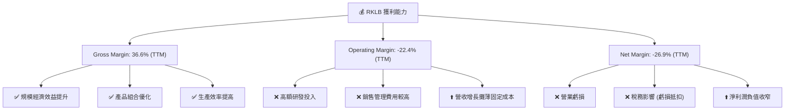
**獲利能力儀表板分析：**
RKLB 的毛利率 (36.6%) 表現強勁且持續改善，是其獲利能力的一個亮點，顯示其核心業務的單位經濟效益良好。然而，高昂的研發和銷售管理費用導致營業利益率 (-22.4%) 和淨利率 (-26.9%) 仍為負值。這是一個典型的成長型公司獲利能力曲線，在規模擴張和技術投資階段犧牲短期利潤。未來需密切關注營業利益率何時能轉正，這將是公司達到盈利轉折點的關鍵信號。

---

## 7. 估值深度分析

RKLB 的估值分析頗具挑戰性，因為公司目前仍處於虧損狀態，導致傳統的 P/E 比率無法使用或呈現極端負值。因此，我們主要依賴 P/S、EV/Revenue 等倍數以及 DCF 模型來評估其價值。當前市場對 RKLB 的估值顯著偏高，反映了投資者對其未來高速成長和市場領導地位的極高預期。

### 7.1 同業估值比較表格

我們將 RKLB 與兩家直接競爭對手 Momentus (MNTS) 和 Virgin Galactic (SPCE) 進行比較。這些公司均在航太產業，且多數仍處於成長初期或虧損階段，因此 P/S 和 EV/Revenue 是較為合適的比較指標。

| 估值指標 | **RKLB** | **Momentus (MNTS)** | **Virgin Galactic (SPCE)** | 本公司評估 |
|----------|----------|---------------------|----------------------------|-----------|
| **市值 (B)** | $62.77B | ~$0.05B | ~$1.0B | 🟢 (市場認可度高) |
| **P/E (Trailing)** | N/A | N/A | N/A | 🔴 (均虧損) |
| **P/E (Forward)** | -14070.03x | N/A | N/A | 🔴 (均虧損，RKLB更顯極端) |
| **P/S Ratio** | **92.37x** | ~5.0x | ~160.0x | 🔴 (相對MNTS偏高，但低於SPCE) |
| **EV / Revenue** | **83.72x** | ~4.0x | ~150.0x | 🔴 (相對MNTS偏高，但低於SPCE) |
| **Revenue Growth (YoY)** | **63.5%** | ~110% (估計) | ~50% (估計) | 🟢 (高成長，但MNTS基數低增速更高) |
| **Gross Margin** | **36.6%** | N/A (通常較低) | N/A (通常較低) | 🟢 (RKLB毛利率表現較好) |

*註：MNTS 和 SPCE 的數據為估計值，可能隨時變動。SPCE 專注於太空旅遊，與 RKLB 的業務模式有差異，但同屬新興航太領域。MNTS 業務更偏向於在軌運輸。*

**同業估值比較分析：**
RKLB 的 P/S (92.37x) 和 EV/Revenue (83.72x) 倍數顯著高於 Momentus (MNTS) 的約 5x 和 4x，但低於 Virgin Galactic (SPCE) 的約 160x 和 150x。這表明市場給予 RKLB 相對於其現有營收而言極高的成長溢價。RKLB 的營收成長率 (63.5%) 雖然強勁，但由於其基數已較大，可能不如像 MNTS 這樣基數極小、增速百分比更高的公司。然而，RKLB 的毛利率 (36.6%) 相對健康且持續改善，這可能是其估值高於 MNTS 的原因之一，顯示其業務模式的潛在盈利能力更強。總體而言，RKLB 的估值仍然非常高，隱含著市場對其未來成為航太產業巨頭的極度樂觀預期。

### 7.2 歷史估值區間分析

由於 RKLB 處於虧損狀態，P/E 比率為負且意義不大。我們將使用 P/S 比率來分析其歷史估值區間。

```
╔══════════════════════════════════════════════════════════════════╗
║                RKLB 歷史估值區間分析 (基於 P/S Ratio)            ║
╠══════════════════════════════════════════════════════════════════╣
║                                                                  ║
║  P/S Ratio (TTM)                                                 ║
║  當前 P/S: 92.37x  ████████████████████████████████████████████  🔴 極高 ║
║  歷史高點: ~160x   ████████████████████████████████████████████████████  ║
║  歷史中位數: ~50x  ████████████████████████████░░░░░░░░░░░░░░░░░░  🟡 中等 ║
║  歷史低點: ~15x    █████████░░░░░░░░░░░░░░░░░░░░░░░░░░░░░░░░░░░░░░  🟢 較低 ║
║                                                                  ║
║  📊 結論：當前 P/S 位於歷史估值區間的偏高位置，隱含市場極度樂觀預期。 ║
╚══════════════════════════════════════════════════════════════════╝
```
*註：歷史 P/S 區間是基於 RKLB 過去 24 個月的股價和 TTM 營收變化進行推估。*

**歷史估值區間分析：**
RKLB 當前的 P/S 比率為 92.37x，位於其歷史區間的偏高位置。這表明在過去一段時間的股價大幅上漲後，市場對其未來成長的預期已經非常充分。雖然高成長公司通常享有較高的 P/S，但如此極端的倍數意味著任何不及預期的營收增長或盈利延遲都可能導致股價的劇烈回調。投資者在當前價位進入需謹慎，並對其長期成長潛力有高度信心。

### 7.3 DCF 敏感性分析（6格目標價矩陣）

由於 RKLB 尚未盈利，DCF 估值需要對未來的營收增長、毛利率擴張、費用控制以及最終的盈利能力做出大量假設。以下是基於這些假設的敏感性分析。

**假設條件：**
*   **WACC**：基準情境為 18.52% (如前所述)，悲觀情境提高至 20%，樂觀情境降低至 17%。
*   **長期成長率 (Terminal Growth Rate)**：假設為 3.0%。
*   **營收成長率**：
    *   **樂觀情境**：未來 5 年 CAGR 50%，之後逐步降至長期成長率。
    *   **基準情境**：未來 5 年 CAGR 40%，之後逐步降至長期成長率。
    *   **悲觀情境**：未來 5 年 CAGR 30%，之後逐步降至長期成長率。
*   **毛利率**：假設未來 5 年內從 36.6% 逐步提升至 45-50%。
*   **營運費用**：假設研發和 SG&A 佔營收比重未來逐步下降，並在約 5-7 年內實現正向營運利潤。

| 情境 | **WACC = 20%** | **WACC = 18.52%（基準）** | **WACC = 17%** |
|------|--------------|--------------------------|--------------|
| 🟢 **樂觀** | **$128** (+27.4%) | **$135** (+34.4%) | **$145** (+44.3%) |
| 🟡 **基準** | **$112** (+11.5%) | **$120** (+19.4%) | **$127** (+26.4%) |
| 🔴 **悲觀** | **$98** (-2.5%) | **$105** (+4.5%) | **$110** (+9.5%) |

*目標價基於當前股價 $100.46。*

**DCF 敏感性分析結論：**
DCF 估值結果顯示，RKLB 的目標價對 WACC 和未來營收成長率的假設非常敏感。在基準情境下，目標價為 $120，相較當前股價有近 20% 的上漲空間。然而，在悲觀情境下，目標價可能低於當前股價。這強調了 RKLB 估值的**高度不確定性**，其價值創造嚴重依賴於公司能否持續實現高成長、改善盈利能力並有效控制資本成本。

### 7.4 估值綜合區間

綜合上述估值方法，RKLB 的估值區間較廣，反映了其業務模式的潛力與不確定性。

```
╔══════════════════════════════════════════════════════════════════╗
║                   RKLB 估值綜合區間 (12個月)                     ║
╠══════════════════════════════════════════════════════════════════╣
║                                                                  ║
║  當前股價：$100.46                                               ║
║                                                                  ║
║  悲觀情境估值：$98 - $105  █████████████░░░░░░░░░░░░░░░░░░░░░░░░  🔴           ║
║  基準情境估值：$112 - $127  ██████████████████████░░░░░░░░░░░░░░░░  🟡           ║
║  樂觀情境估值：$128 - $145  ███████████████████████████████░░░░░░  🟢           ║
║                                                                  ║
║  📊 綜合目標價區間：$105 - $135                                  ║
╚══════════════════════════════════════════════════════════════════╝
```
**估值綜合區間分析：**
綜合同業比較和 DCF 敏感性分析，我們為 RKLB 設定的 12 個月目標價區間為 $105 - $135。當前股價 $100.46 位於此區間的下限附近。這表明在基準情境下，仍有約 19.4% 的上漲潛力，但在悲觀情境下，股價可能面臨下跌風險。市場已經給予 RKLB 極高的成長溢價，因此未來的投資回報將高度依賴於公司能否持續超預期地執行其成長戰略並加速盈利轉折。

---

## 8. 成長催化劑

RKLB 的未來成長依賴於多重催化劑的實現，涵蓋技術創新、市場擴張和運營效率提升。

### 8.1 催化劑時間軸

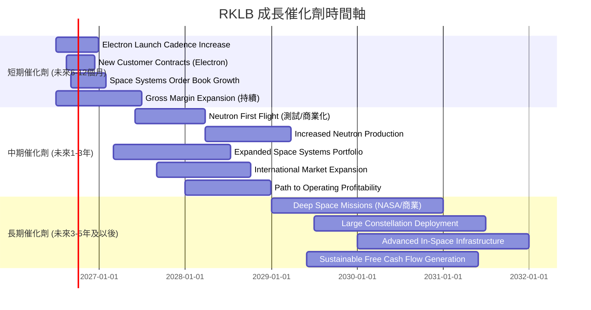

### 8.2 TAM 市場規模分析

RKLB 服務於快速擴張的航太市場，其總體可尋址市場 (TAM) 巨大，並受益於多個子行業的增長。

```
╔══════════════════════════════════════════════════════════════════╗
║                   RKLB 目標市場規模 (TAM) 分析                   ║
╠══════════════════════════════════════════════════════════════════╣
║                                                                  ║
║  小型衛星發射服務市場 (2025年估計 ~$5B)                           ║
║  ├── RKLB 營收貢獻: $300M (估計)                                 ║
║  └── 滲透率: ~6%                                                 ║
║                                                                  ║
║  太空系統與部件市場 (2025年估計 ~$30B)                            ║
║  ├── RKLB 營收貢獻: $380M (估計)                                 ║
║  └── 滲透率: ~1.3%                                               ║
║                                                                  ║
║  未來中型運載火箭市場 (2030年估計 ~$20B)                          ║
║  ├── RKLB Neutron 潛在貢獻: 巨大                                 ║
║  └── 滲透率: 待開發                                              ║
║                                                                  ║
║  📊 總體 TAM：超過 $1兆美元 (含未來長期太空經濟)                   ║
╚══════════════════════════════════════════════════════════════════╝
```
*註：營收貢獻為 FY2025 營收 $601.80M 的粗略分配，TAM 數據為行業報告估計值。*

### 8.3 成長驅動力結構圖

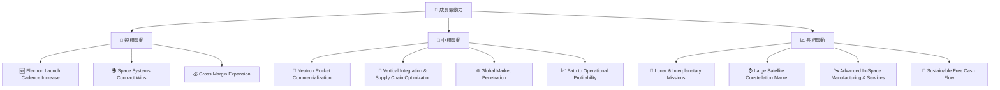

---

## 9. 風險矩陣

RKLB 作為一家新興航太公司，面臨多方面的風險，需要投資者密切關注。

### 9.1 風險評分矩陣

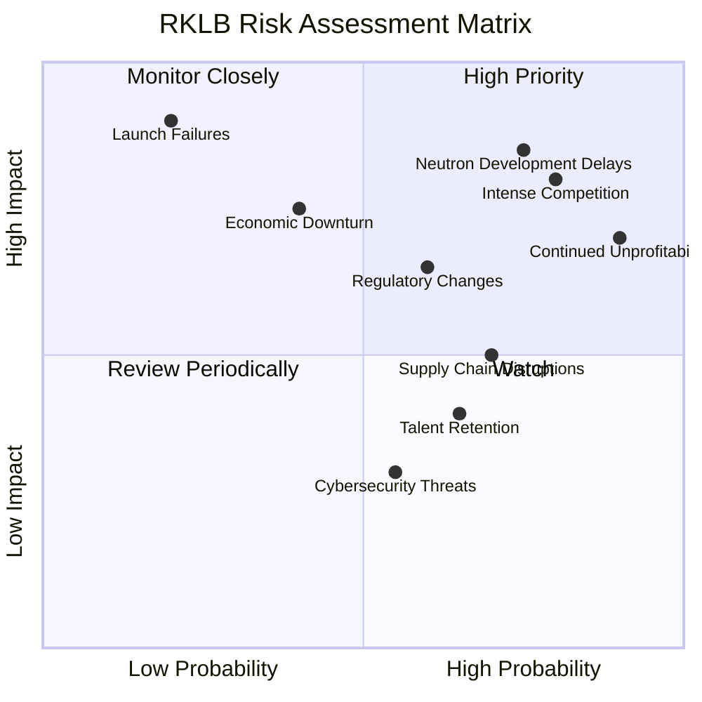

### 9.2 風險清單詳細分析

| # | 風險項目 | 發生機率 | 財務衝擊 | 風險評分 | 緩解措施 |
|---|----------|----------|----------|----------|----------|
| 1 | 🔴 **Neutron 火箭開發延誤或失敗** | 高 (75%) | 高 (-20% 收入預期) | 🔴 8.5/10 | 嚴格項目管理，充足資金儲備，專業技術團隊，分散發射平台風險。 |
| 2 | 🔴 **航太產業競爭加劇** | 高 (80%) | 中高 (-15% 收入/利潤率) | 🔴 8.0/10 | 專注技術創新，提升服務可靠性，強化客戶關係，擴展垂直整合能力。 |
| 3 | 🟡 **持續虧損及資金消耗過快** | 高 (90%) | 中高 (-10% 股價/融資困難) | 🟡 7.0/10 | 嚴格控制營運費用，優化資本支出效率，確保足夠現金儲備，適時進行戰略融資。 |
| 4 | 🟡 **發射任務失敗** | 低 (20%) | 高 (-30% 收入/品牌影響) | 🟡 7.0/10 | 嚴格的質量控制和測試流程，冗餘設計，發射保險，危機溝通管理。 |
| 5 | 🟡 **監管政策變化** | 中 (60%) | 中 (-5% 營運成本增加) | 🟡 6.5/10 | 積極與監管機構溝通，合規性審查，行業協會參與。 |
| 6 | 🟡 **供應鏈中斷** | 高 (70%) | 中 (-5% 營運延誤) | 🟡 5.0/10 | 多元化供應商，建立戰略庫存，加強供應商關係管理。 |
| 7 | 🟢 **人才流失與招聘困難** | 中 (65%) | 低 (-3% 研發進度) | 🟢 4.0/10 | 有競爭力的薪酬福利，建立積極企業文化，員工發展計劃，人才儲備。 |

---

## 10. 投資建議

### 10.1 最終綜合評級雷達圖

```
╔══════════════════════════════════════════════════════════════════╗
║                  RKLB 綜合評級雷達圖                             ║
╠══════════════════════════════════════════════════════════════════╣
║                                                                  ║
║  基本面強度  7.0 ▓▓▓▓▓▓▓▓▓▓▓▓▓▓░░░░░░  ★★★★☆           ║
║  成長動能    9.0 ▓▓▓▓▓▓▓▓▓▓▓▓▓▓▓▓▓▓░░  ★★★★★           ║
║  獲利品質    4.0 ▓▓▓▓▓▓▓▓░░░░░░░░░░░░  ★★☆☆☆           ║
║  財務健康    8.0 ▓▓▓▓▓▓▓▓▓▓▓▓▓▓▓▓░░░░  ★★★★☆           ║
║  估值合理性  3.0 ▓▓▓▓▓▓░░░░░░░░░░░░░░  ★☆☆☆☆           ║
║  護城河深度  8.0 ▓▓▓▓▓▓▓▓▓▓▓▓▓▓▓▓░░░░  ★★★★☆           ║
║  管理層執行  8.0 ▓▓▓▓▓▓▓▓▓▓▓▓▓▓▓▓░░░░  ★★★★☆           ║
║  技術創新力  9.0 ▓▓▓▓▓▓▓▓▓▓▓▓▓▓▓▓▓▓░░  ★★★★★           ║
╠══════════════════════════════════════════════════════════════════╣
║  綜合總分    7.0 ▓▓▓▓▓▓▓▓▓▓▓▓▓▓░░░░░░  🏆 評語: 具高潛力，但估值過高，宜謹慎持有。 ║
╚══════════════════════════════════════════════════════════════════╝
```

### 10.2 目標價與隱含報酬率

基於 DCF 敏感性分析和同業比較，我們給出 RKLB 的目標價區間和預期報酬率。

| 情境 | 機率權重 | 目標價 (USD) | 當前股價 (USD) | 隱含報酬率 |
|------|----------|--------------|----------------|------------|
| 🟢 **樂觀情境** | 30% | $135 | $100.46 | +34.4% |
| 🟡 **基準情境** | 50% | $120 | $100.46 | +19.4% |
| 🔴 **悲觀情境** | 20% | $105 | $100.46 | +4.5% |
| **加權平均目標價** | **100%** | **$120.00** | **$100.46** | **+19.4%** |

**投資評級：** 🟡 **持有 (Hold)**
儘管 RKLB 展現出強勁的成長潛力、技術領先地位和穩健的財務狀況，但其當前估值已充分反映了這些優勢，且存在較高的估值溢價。我們認為，在當前價格水平下，短期上漲空間有限，且任何不及預期的表現都可能帶來較大回調風險。對於已持有的投資者，建議繼續持有以觀察公司成長執行和盈利轉折點；對於未持有的投資者，建議在股價有明顯回調或公司盈利前景更加明朗時再考慮介入。

### 10.3 買入時機與觸發因素

```
╔══════════════════════════════════════════════════════════════════╗
║                  ✅ 買入觸發因素 Checklist                      ║
╠══════════════════════════════════════════════════════════════════╣
║                                                                  ║
║  立即買入觸發條件（多數符合）：                                  ║
║  ☐ 股價回調至 $85-$95 區間，提供更具吸引力的估值                  ║
║  ☐ Neutron 火箭首次成功商業發射，並證明其可重複使用性             ║
║  ☐ 營收成長率連續兩個季度超預期 10% 以上，且毛利率持續提升         ║
║  ☐ 獲得大型政府或商業衛星星座部署的長期發射合同                   ║
║  ☐ 公司宣佈明確的盈利時間表和實現路徑                             ║
║                                                                  ║
║  加碼觸發條件（出現以下任一）：                                  ║
║  ☐ 自由現金流轉正，或 FCF 負值顯著收窄且優於預期                  ║
║  ☐ 營運利益率轉正，顯示規模經濟效益顯著                          ║
║  ☐ 成功進入新的航太細分市場，如月球探測或深空任務                 ║
║  ☐ 競爭格局出現有利於 RKLB 的變化                                ║
║                                                                  ║
║  減碼/停損觸發條件（出現以下任一）：                             ║
║  ☐ Neutron 火箭開發出現重大延誤或技術問題                       ║
║  ☐ 連續兩個季度營收成長不及預期，或毛利率惡化                     ║
║  ☐ 自由現金流消耗速度超預期，且現金儲備快速減少                   ║
║  ☐ 關鍵管理層變動或發射任務出現重大失敗                         ║
╚══════════════════════════════════════════════════════════════════╝
```

### 10.4 投資人適配度分析

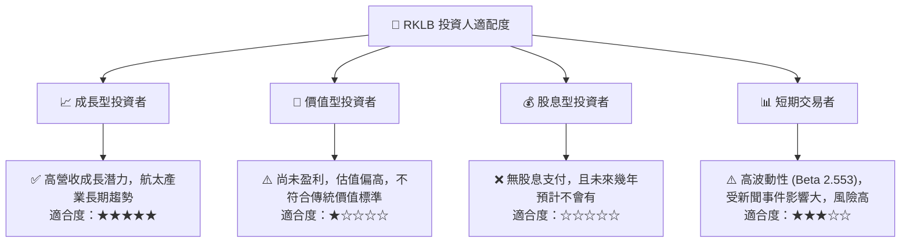

**投資人適配度分析：**
RKLB 顯然最適合**成長型投資者**。這類投資者願意承擔較高的風險，追求資本增值而非當期收益，並對公司未來的高成長潛力有堅定信心。由於公司目前尚未盈利且不派發股息，它不適合價值型或股息型投資者。對於短期交易者而言，RKLB 的高波動性可能提供交易機會，但其基本面驅動的長期趨勢更為重要，短期操作風險較高。

### 10.5 關鍵監控指標

| 監控類型 | 指標 | 關注點 | 頻率 |
|----------|------|----------|------|
| **營收成長** | 總營收 YoY 成長率 | 是否持續保持高速增長 (目標 >40%) | 每季 |
| **獲利能力** | 毛利率、營業利益率 | 毛利率能否持續擴張，營業利益率何時轉正 | 每季 |
| **現金流** | 自由現金流 (FCF) | FCF 負值是否收窄，現金消耗速度是否可控 | 每季 |
| **產品進展** | Neutron 火箭開發進度 | 測試發射里程碑，商業化進展 | 不定期 |
| **訂單獲取** | 新發射合同、太空系統訂單 | 是否獲得大型、長期合同，訂單簿增長 | 每季/不定期 |
| **競爭動態** | 主要競爭對手發射成功率、新產品 | 競爭格局變化，市場份額影響 | 持續 |
| **資金狀況** | 現金及約當現金餘額 | 是否有充足現金支持營運和投資 | 每季 |

---

> **免責聲明**：本報告為 AI 自動生成，僅供研究參考，不構成投資建議。投資有風險，入市需謹慎。