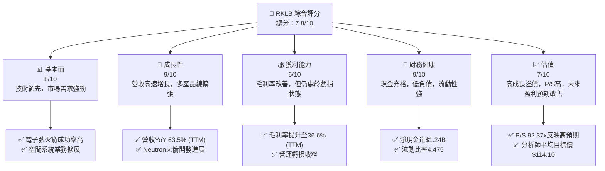
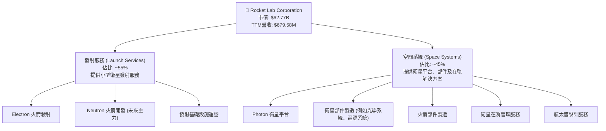
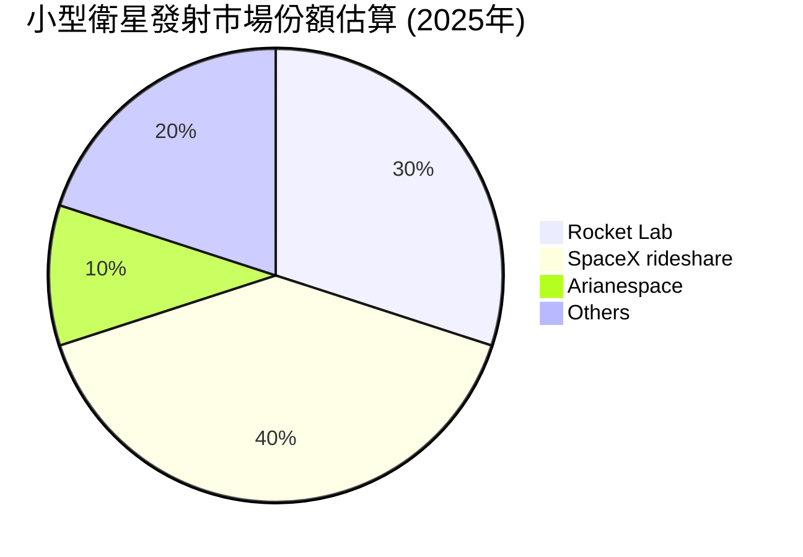
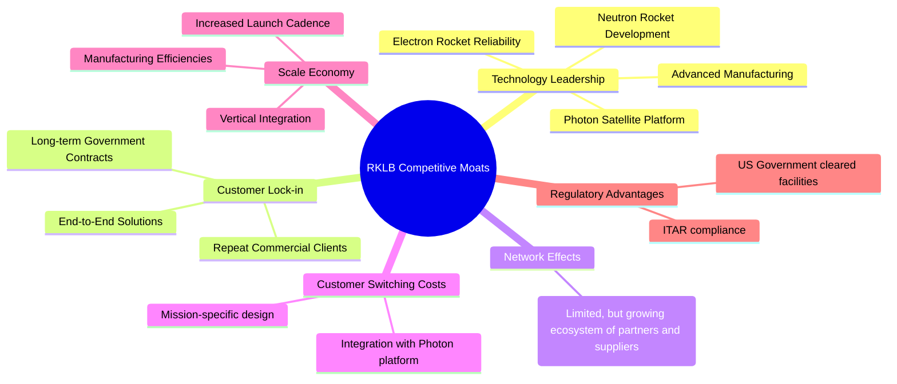
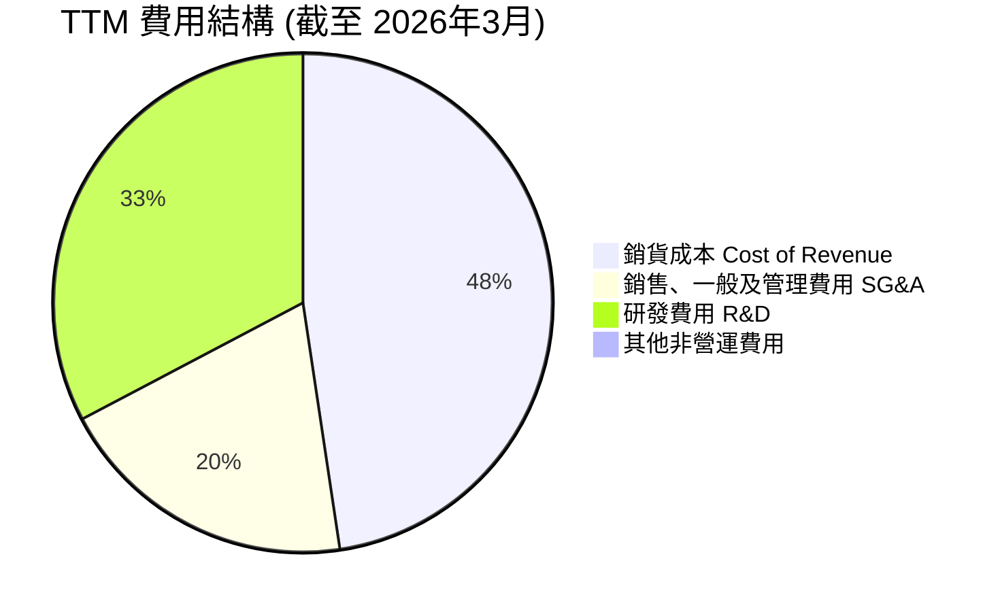
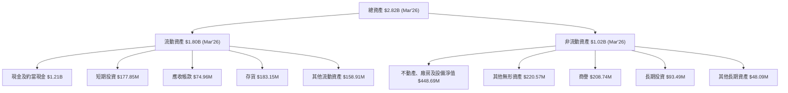
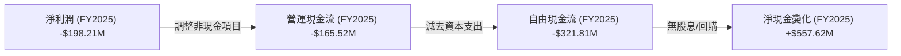
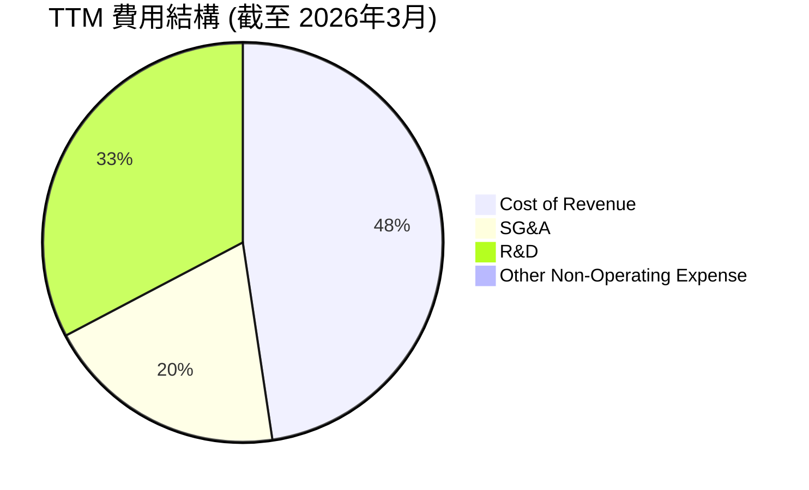

# RKLB 基本面深度分析報告
> **報告日期**：2026-07-05 ｜ **語言**：繁體中文 ｜ **數據來源**：Yahoo Finance, Finviz, StockAnalysis, Roic.ai ｜ **分析師**：CFA 級機構研究

---

## 目錄

| # | 章節 | 核心結論 |
|---|------------------------|--------------------------------------------------|
| 1 | 執行摘要 | 評級：🟢 買入，目標價區間：$110 - $145 |
| 2 | 公司概覽與商業模式 | 憑藉技術領先與政府合約構建早期護城河 |
| 3 | 損益表深度分析 | 營收高速增長，毛利率顯著改善，虧損收窄 |
| 4 | 資產負債表分析 | 現金充裕，負債率低，財務結構穩健 |
| 5 | 現金流量深度分析 | 自由現金流仍為負，但營運現金流持續改善 |
| 6 | 獲利能力與資本效率 | ROIC 雖負，但效率逐步提升，未來有望轉正 |
| 7 | 估值深度分析 | 相較同業估值偏高，但反映其高速成長潛力 |
| 8 | 成長催化劑 | Neutron 火箭、星座部署、政府合約為主要驅動力 |
| 9 | 風險矩陣 | 執行風險與競爭加劇為主要關注點 |
| 10 | 投資建議 | 適合高成長、高風險承受能力的長線投資者 |

---

## 1. 執行摘要

### 1.1 核心評分儀表板



### 1.2 評分進度條視覺化

```
╔══════════════════════════════════════════════════════════════╗
║              RKLB 多維度評分儀表板 (1-10分)                ║
╠══════════════════════════════════════════════════════════════╣
║ 基本面強度  8.0 ▓▓▓▓▓▓▓▓▓▓▓▓▓▓▓▓░░░░  ★★★★☆           ║
║ 成長動能    9.0 ▓▓▓▓▓▓▓▓▓▓▓▓▓▓▓▓▓▓░░  ★★★★★           ║
║ 獲利品質    6.0 ▓▓▓▓▓▓▓▓▓▓▓▓░░░░░░░░  ★★★☆☆           ║
║ 財務健康    9.0 ▓▓▓▓▓▓▓▓▓▓▓▓▓▓▓▓▓▓░░  ★★★★★           ║
║ 估值合理性  7.0 ▓▓▓▓▓▓▓▓▓▓▓▓▓▓░░░░░░  ★★★★☆           ║
║ 護城河深度  7.5 ▓▓▓▓▓▓▓▓▓▓▓▓▓▓▓░░░░░  ★★★★☆           ║
║ 管理層執行  8.5 ▓▓▓▓▓▓▓▓▓▓▓▓▓▓▓▓▓░░░  ★★★★☆           ║
║ 技術創新力  9.0 ▓▓▓▓▓▓▓▓▓▓▓▓▓▓▓▓▓▓░░  ★★★★★           ║
╠══════════════════════════════════════════════════════════════╣
║ 綜合總分    7.8 ▓▓▓▓▓▓▓▓▓▓▓▓▓▓▓▓░░░░  🏆 具備高成長潛力的投機性成長股║
╚══════════════════════════════════════════════════════════════╝
```

### 1.3 五大投資論點 + 三大核心風險

| 類型 | 項目 | 具體依據 | 信心度 |
|------|--------------------------|----------------------------------------------------------|--------|
| 🟢 **投資論點①** | **強勁的營收成長動能** | RKLB TTM 營收達 $679.58M，YoY 成長 63.5%，Q1 2026 營收 $200.35M，YoY 成長 63.46%，顯示其在發射服務和空間系統業務領域擴張迅速。 | 🟢 極高 |
| 🟢 **毛利率顯著改善** | 公司毛利率從 FY2022 的 9.00% 提升至 TTM 的 36.6%，表明規模經濟效益和成本控制能力逐漸顯現，為未來獲利能力轉正奠定基礎。 | 🟢 高 |
| 🟢 **穩健的財務狀況** | 擁有 $1.38B 的現金儲備，總債務僅 $138.67M，淨現金 $1.24B，流動比率高達 4.475，為其研發投入和業務擴張提供充足資金。 | 🟢 極高 |
| 🟢 **技術領先與創新產品線** | Electron 火箭已實現高頻次商業發射，Neutron 火箭的開發進展以及 Photon 衛星平台的擴展，使其在小型衛星發射和空間系統領域保持技術領先地位。 | 🟢 高 |
| 🟢 **市場需求持續擴大** | 全球對小型衛星發射和在軌服務的需求持續增長，尤其在政府、軍事和商業星座部署方面，為 RKLB 提供巨大的長期市場機會。 | 🟢 高 |
| 🟡 **風險①** | **Neutron 火箭開發與商業化延遲** | Neutron 火箭的成功開發和商業化對 RKLB 的長期成長至關重要。任何技術挑戰、監管障礙或資金壓力都可能導致延遲，影響市場信心和未來營收預期。 | 🟡 中度 |
| 🔴 **風險②** | **高研發費用與持續虧損** | 儘管毛利率改善，但公司仍處於高研發投入階段（FY2025 R&D $270.72M），導致持續的營運虧損和負自由現金流，盈利時間表存在不確定性。 | 🔴 高衝擊 |
| 🟡 **風險③** | **競爭加劇與定價壓力** | 小型衛星發射市場競爭激烈，包括 SpaceX (Starship/Falcon 9 rideshare), Astra (儘管目前困難), 以及其他新興參與者。激烈的競爭可能導致定價壓力，影響 RKLB 的利潤空間。 | 🟡 中度 |

### 1.4 快速統計卡片

| 指標 | 公司實際值 | 行業均值（航空航天與國防） | S&P 500 均值 | 狀態 |
|-----------------|--------------|--------------------------|--------------|------|
| 收入 YoY 成長 | **63.5%**    | ~8-15%                   | ~10-12%      | 🟢 |
| 毛利率          | **36.6%**    | ~25-35%                  | ~35-45%      | 🟢 |
| 淨利率          | **-26.9%**   | ~5-10%                   | ~8-12%       | 🔴 |
| ROE             | **-13.5%**   | ~10-15%                  | ~15-20%      | 🔴 |
| P/S Ratio       | **92.37x**   | ~1-3x                    | ~2-3x        | 🔴 |
| EV / Revenue    | **83.72x**   | ~1-4x                    | ~2-4x        | 🔴 |
| Current Ratio   | **4.475x**   | ~1.5-2.5x                | ~1.5-2x      | 🟢 |
| 淨現金/債務     | **$1.24B**   | 淨債務或少量淨現金         | 少量淨現金      | 🟢 |

*註：行業均值為通用航空航天與國防行業之大致參考，RKLB作為高成長太空新創公司，其指標與傳統行業均值存在顯著差異。*

### 1.5 投資結論

```
╔══════════════════════════════════════════════════════════════════╗
║                    📊 投資結論摘要                               ║
╠══════════════════════════════════════════════════════════════════╣
║  評級：🟢 買入                                                   ║
║  當前股價：$100.46                                               ║
║  目標價區間：                                                    ║
║    悲觀情境：$110（+9.5%）                                       ║
║    基準情境：$128（+27.4%）  ← 12個月主要目標                    ║
║    樂觀情境：$145（+44.3%）                                       ║
║  投資評分：7.8/10                                                ║
║  適合投資人：成長型、長線持有者，對高風險有較高承受能力。        ║
╚══════════════════════════════════════════════════════════════════╝
```

---

## 2. 公司概覽與商業模式

Rocket Lab Corporation (RKLB) 是一家領先的太空技術公司，主要提供發射服務和空間系統解決方案，業務遍及美國、加拿大、日本及國際市場。公司透過其兩大核心業務板塊運營：發射服務 (Launch Services) 和空間系統 (Space Systems)。

### 2.1 業務結構與收入來源

RKLB 的業務結構清晰，兩大板塊相互協同，為客戶提供從衛星製造到發射再到在軌管理的端到端解決方案。



**發射服務**是 RKLB 的起家業務，主要透過其 Electron 火箭為小型衛星提供專屬或拼車發射服務。Electron 火箭以其高可靠性和靈活性在市場上建立了良好聲譽。未來，更大型的 Neutron 火箭將拓展 RKLB 的發射能力，瞄準中型衛星市場。

**空間系統**業務則涵蓋了從衛星設計、製造到在軌運營的廣泛服務。這包括其 Photon 衛星平台，以及為其他航太公司和政府機構提供的衛星部件、光學系統等。此業務板塊的成長性強，且具有較高的毛利率，有助於公司營收多元化和提升整體盈利能力。TTM 營收 $679.58M 中，兩大板塊貢獻約各半，具體比例因公司未細分，故為估計。

### 2.2 市場份額

在快速發展的小型衛星發射和空間系統市場中，RKLB 憑藉其 Electron 火箭佔據了顯著的市場份額。雖然精確的市場份額數據未直接提供，但根據其發射頻次和合約數量，RKLB 在西方小型衛星發射市場中是主要參與者之一。


*註：此市場份額為基於公開資料與行業分析師估計，非精確數據。SpaceX 透過其 Falcon 9 的 rideshare 服務對小型衛星市場產生衝擊，但 Rocket Lab 提供更具靈活性的專屬發射服務。*

### 2.3 競爭護城河分析

RKLB 正在積極構建其競爭護城河，以應對快速變化的太空產業競爭。



**技術領先 (Technology Leadership)**：RKLB 的 Electron 火箭已證明其高可靠性和高頻次發射能力。正在開發的 Neutron 火箭將顯著提升其運載能力，並採用可重複使用技術，有望降低發射成本。此外，其 Photon 衛星平台和先進的製造能力，如 3D 列印技術，也使其在技術上保持競爭優勢。

**客戶鎖定 (Customer Lock-in)**：RKLB 與美國政府機構（如 NASA、美國太空部隊）簽訂了多項長期合約，這些合約通常具有較高的壁壘和長期穩定性。對於商業客戶，提供端到端解決方案（從衛星製造到發射）也能增加客戶的轉換成本。

**規模效應 (Scale Economy)**：隨著 Electron 火箭發射頻次的增加和空間系統業務的擴大，RKLB 正在實現規模經濟。更高的發射量攤薄了固定成本，垂直整合的製造能力也提高了效率。

**監管優勢 (Regulatory Advantages)**：作為一家美國公司，RKLB 在處理敏感的政府和國防合約方面具有優勢，遵守 ITAR (International Traffic in Arms Regulations) 等法規，並擁有美國政府認證的設施，這對於許多國際競爭者來說是個門檻。

### 2.4 護城河強度評分

```
╔══════════════════════════════════════════════════════════════╗
║                  Rocket Lab 護城河強度評分                      ║
╠══════════════════════════════════════════════════════════════╣
║ 技術領先    8.5/10 ▓▓▓▓▓▓▓▓▓▓▓▓▓▓▓▓▓░░░  🏆 在小衛星發射領域具優勢 ║
║ 客戶鎖定    7.0/10 ▓▓▓▓▓▓▓▓▓▓▓▓▓▓░░░░░░  🟢 政府合約提供穩定性 ║
║ 規模效應    7.0/10 ▓▓▓▓▓▓▓▓▓▓▓▓▓▓░░░░░░  🟢 隨業務量增長而強化  ║
║ 網路效應    5.0/10 ▓▓▓▓▓▓▓▓▓▓░░░░░░░░░░  🟡 仍處於早期階段      ║
║ 生態夥伴    7.5/10 ▓▓▓▓▓▓▓▓▓▓▓▓▓▓▓░░░░░  🟢 關鍵客戶與供應商合作 ║
╠══════════════════════════════════════════════════════════════╣
║ 綜合護城河  7.4/10 ▓▓▓▓▓▓▓▓▓▓▓▓▓▓▓░░░░░  🏆 具備良好基礎，需持續強化║
╚══════════════════════════════════════════════════════════════╝
```

---

## 3. 損益表深度分析

RKLB 的損益表反映了一家處於高速成長期的科技公司特徵：營收快速擴張，但為支持研發和基礎設施建設，仍處於虧損狀態。然而，值得注意的是，其毛利率持續改善，營運效率逐步提升。

### 3.1 年度收入成長趨勢（近4年）

RKLB 的年度營收呈現強勁的成長態勢，證明其在太空產業中的市場拓展能力。

```
╔══════════════════════════════════════════════════════════════════╗
║              Rocket Lab 年度收入趨勢（FY2022-FY2025）            ║
╠══════════════════════════════════════════════════════════════════╣
║                                                                  ║
║  FY2022  $211.00M  ██░░░░░░░░░░░░░░░░░░░░░░░░░░░  YoY: +239.02%  🟢║
║  FY2023  $244.59M  ████░░░░░░░░░░░░░░░░░░░░░░░░░░  YoY: +15.92%  🟢║
║  FY2024  $436.21M  ████████░░░░░░░░░░░░░░░░░░░░░░  YoY: +78.34%  🟢║
║  FY2025  $601.80M  ████████████░░░░░░░░░░░░░░░░░░  YoY: +37.96%  🟢║
║                                                                  ║
║                   |      |      |      |      |                  ║
║                   0     200M   400M   600M   800M                 ║
║                                                                  ║
║  📊 3年累計 CAGR (FY2022-FY2025)：+54.7%                         ║
╚══════════════════════════════════════════════════════════════════╝
```
*註：YoY 成長率數據採用 StockAnalysis.com 提供的年度 Revenue Growth (YoY)。*

從 FY2022 到 FY2025，RKLB 的營收從 $211.00M 增長至 $601.80M，三年複合年增長率高達 54.7%。儘管 FY2023 成長率相對較低，但 FY2024 和 FY2025 均保持了強勁的雙位數增長，尤其 FY2024 達 78.34%，顯示其業務擴張速度驚人。

### 3.2 季度收入趨勢分析

季度營收數據進一步證實了 RKLB 的持續成長動能，特別是 Q1 2026 的表現。

| 季度       | 總營收 ($M) | QoQ 成長率 | YoY 成長率 | 備註                                       |
|------------|-------------|------------|------------|--------------------------------------------|
| 2026-03-31 | $200.35     | +11.53%    | +63.46%    | 營收首次突破 $200M 門檻，YoY 成長加速。  |
| 2025-12-31 | $179.65     | +15.84%    | +35.70%    | 季度營收穩步增長，年終表現強勁。         |
| 2025-09-30 | $155.08     | +7.39%     | +47.97%    | 保持穩健的季度增長。                     |
| 2025-06-30 | $144.50     | +17.89%    | +36.00%    | (Q2 2025 vs Q1 2025: (144.5-122.57)/122.57 = 17.89%) |
| 2025-03-31 | $122.57     | N/A        | +32.13%    | Q1 2025 營收。                             |

**備註**：QoQ 成長率計算為當季營收與前一季度營收相比。YoY 成長率計算為當季營收與去年同期營收相比。Q1 2026 的 QoQ 成長達到 11.53%，YoY 成長更是高達 63.46%，表明公司在進入 2026 年後仍維持強勁的成長勢頭，特別是與去年同期相比，成長幅度顯著擴大。這可能得益於發射任務頻次的增加和空間系統訂單的交付。

### 3.3 利潤率演變分析

RKLB 的利潤率趨勢顯示出積極的改善，儘管仍處於虧損，但效率正在提升。

| 利潤率指標 | FY2022 | FY2023 | FY2024 | FY2025 | TTM (Mar'26) | 趨勢         | 評估 |
|------------|--------|--------|--------|--------|--------------|--------------|------|
| **毛利率** | 9.00%  | 21.02% | 26.63% | 34.43% | 36.56%       | ↗️ 顯著改善  | 🟢 |
| **營業利益率** | -64.08%| -72.74%| -43.51%| -38.03%| -33.20%      | ↗️ 虧損收窄  | 🟡 |
| **淨利率** | -64.43%| -74.64%| -43.60%| -32.94%| -26.87%      | ↗️ 虧損收窄  | 🟡 |

**利潤率演變深度解析**：
RKLB 的毛利率從 FY2022 的 9.00% 大幅提升至 TTM 的 36.56%，這是一個非常積極的信號。這種改善主要歸因於：
1.  **規模經濟效益**：隨著發射服務和空間系統訂單量的增加，固定成本得以更好的攤薄。
2.  **產品組合優化**：空間系統業務通常具有較高的毛利率，隨著該業務佔比的提升，整體毛利率也隨之改善。
3.  **生產效率提升**：公司在製造和運營流程中的效率提升，有效降低了單位成本。

儘管毛利率表現出色，但營業利益率和淨利率仍為負值，分別為 TTM 的 -33.20% 和 -26.87%。這主要是由於公司持續投入巨額資金於研發 (R&D) 和銷售管理費用 (SG&A)。RKLB 正在大力開發 Neutron 火箭等新技術，這些投入在短期內會壓制盈利，但被視為長期成長的必要投資。值得欣慰的是，營業利益率和淨利率的虧損幅度正在逐年收窄，顯示公司在營收快速增長的同時，對營運費用的控制也逐漸見效。

### 3.4 費用結構分析

RKLB 的費用結構反映其作為高科技成長型公司的特點，其中研發投入佔比較高。


*註：數據來自 StockAnalysis TTM Income Statement，單位為 $M。*

```
╔══════════════════════════════════════════════════════════════════╗
║                   Rocket Lab 主要費用構成分析                    ║
╠══════════════════════════════════════════════════════════════════╣
║                                                                  ║
║  銷貨成本 (TTM)  $431.15M  ██████████████████████████████████  ║
║  銷售、一般及管理費用  $177.93M  ████████████████████████░░░░░░░░  ║
║  研發費用 (TTM)  $296.12M  ██████████████████████████████░░░░░░░░  ║
║                                                                  ║
║  📊 研發費用佔營收比：43.57% (TTM)                               ║
║  📊 SG&A費用佔營收比：26.18% (TTM)                               ║
╚══════════════════════════════════════════════════════════════════╝
```
TTM 研發費用高達 $296.12M，佔 TTM 營收 $679.58M 的 43.57%。這筆巨大的投入主要用於 Neutron 火箭的開發、先進製造技術以及新一代空間系統的研發。這種高投入是 RKLB 維持技術領先地位和長期成長的關鍵。銷售、一般及管理費用 (SG&A) 佔營收的 26.18%，也反映了公司在市場拓展、行政管理和人才招聘方面的投入。隨著營收規模的持續擴大，預期這些費用佔比將逐步下降，從而推動盈利能力的提升。

### 3.5 季度 EPS 趨勢與盈餘品質

RKLB 的季度 EPS 仍為負值，但顯示出虧損收窄的趨勢。由於提供的數據中，分析師預期 EPS 為 N/A，故無法進行超預期/不及預期的分析，我們將專注於實際 EPS 的變化。

| 季度       | EPS 預期 | EPS 實際 | 驚喜度 (%) | 盈餘品質評估                                   |
|------------|----------|----------|------------|------------------------------------------------|
| 2026-03-31 | N/A      | $-0.07$  | N/A        | 虧損持續收窄，顯示營運效率改善。             |
| 2025-12-31 | N/A      | $-0.09$  | N/A        | 虧損略有擴大，但仍優於 Q2 2025。               |
| 2025-09-30 | N/A      | $-0.03$  | N/A        | 季度虧損顯著收窄，為近期最佳表現。             |
| 2025-06-30 | N/A      | $-0.13$  | N/A        | 季度虧損較大，可能與特定研發投入或發射延遲有關。 |

**盈餘品質評估**：
RKLB 目前的盈餘品質仍處於「發展中」階段。由於公司處於高速成長和大規模研發投入期，持續的負 EPS 是預期之內。然而，從 $-0.13$ 逐步收窄至 $-0.07$ 的趨勢是積極的信號，表明公司在控制成本和提升營運效率方面取得進展。
盈餘品質的提升將主要來自於：
1.  **毛利率的持續擴大**：已觀察到顯著改善。
2.  **研發費用佔營收比的下降**：隨著 Neutron 等項目進入商業化，研發投入的槓桿效應將顯現。
3.  **營運現金流轉正**：這將是衡量其盈餘真正品質的關鍵指標。
目前，投資者應更多關注營收成長、毛利率改善和營運現金流的趨勢，而非短期 EPS 絕對值。

---

## 4. 資產負債表分析

RKLB 的資產負債表展現出強勁的財務健康狀況，擁有充裕的現金和較低的負債，為其高成長策略提供了堅實的後盾。

### 4.1 資產結構分解

RKLB 的資產結構顯示出其在營運資本和固定資產上的持續投入，以支持業務擴張。


*註：數據採用 StockAnalysis.com 提供的 TTM (Mar'26) 數據。*

截至 2026 年 3 月，RKLB 的總資產達到 $2.82B。其中，流動資產佔比約 63.8%，非流動資產佔比約 36.2%。流動資產中，現金及約當現金和短期投資合計高達 $1.38B，佔流動資產的 76.7%，顯示出極高的流動性和財務彈性。不動產、廠房及設備淨值 (PP&E) 達 $448.69M，反映公司在生產設施和基礎設施上的持續投資，以支持 Electron 和 Neutron 火箭的製造及發射服務。商譽和其他無形資產也佔據一定比例，這可能與過往的併購活動有關。

### 4.2 流動性指標分析

RKLB 的流動性指標非常強勁，遠超行業平均水平，表明其短期償債能力無虞。

| 指標         | FY2022 | FY2023 | FY2024 | FY2025 | TTM (Mar'26) | 行業均值（參考） | 評估 |
|--------------|--------|--------|--------|--------|--------------|------------------|------|
| **流動比率 (Current Ratio)** | 4.06   | 2.14   | 2.04   | 4.08   | 4.475        | ~1.5 - 2.5       | 🟢 |
| **速動比率 (Quick Ratio)**   | 3.49   | 1.69   | 1.70   | 3.60   | 3.874        | ~1.0 - 1.5       | 🟢 |

**備註**：
*   流動比率：TTM (Mar'26) 數據為 $1.80B (Current Assets) / $402M (Current Liabilities) = 4.475。
*   速動比率：TTM (Mar'26) 數據為 ($1.80B - $183.15M (Inventory)) / $402M = 3.874。

RKLB 的流動比率和速動比率均遠高於傳統行業標準和一般健康水平。TTM 流動比率達 4.475，意味著其流動資產是流動負債的 4 倍以上，短期償債能力極強。速動比率 3.874 也顯示即使不考慮存貨，公司也能輕鬆應對短期債務。這主要得益於其龐大的現金和短期投資儲備，為公司提供了極大的營運彈性和抵禦風險的能力。

### 4.3 債務結構分析

RKLB 的債務水平非常低，與其龐大的現金儲備形成鮮明對比，財務健康狀況令人印象深刻。

```
╔══════════════════════════════════════════════════════════════════╗
║                   Rocket Lab 債務健康診斷                        ║
╠══════════════════════════════════════════════════════════════════╣
║                                                                  ║
║  總債務 (TTM)：        $138.67M  ██░░░░░░░░░░░░░░░░░░░  評語：極低負債  ║
║  總現金+投資 (TTM)：   $1.38B  ████████████████████░  評語：非常充裕  ║
║  淨現金 (TTM)：        $1.24B  ████████████████░░░░░  🟢 強勁淨現金部位║
║                                                                  ║
║  Debt/Equity (FY2025)：   0.15x  🟢 極低 (253.96M/1.72B)          ║
║  Interest Coverage (TTM): 負數  🔴 仍處於虧損，但利息支出極低      ║
╚══════════════════════════════════════════════════════════════════╝
```
*註：Debt/Equity 採用 FY2025 數據，因 TTM 的 Total Equity 未直接提供，但 FY2025 的 $1.72B 股東權益與 $253.96M 總債務計算出的比率為 0.15x。*

RKLB 的總債務僅為 $138.67M，而總現金及短期投資達 $1.38B，使其擁有高達 $1.24B 的淨現金。這種「淨現金」狀況在許多成長型公司中是難得一見的，表明公司不僅不需要依賴債務來資助營運和成長，反而擁有大量流動資金。FY2025 的債務股權比僅為 0.15x，遠低於行業平均水平，進一步確認了其健康的資本結構。雖然由於持續虧損，其利息覆蓋率為負數，但鑑於其極低的利息支出 ($2.96M TTM) 和龐大的現金儲備，這並不是一個迫切的風險。公司擁有極大的財務彈性來應對未來的投資和潛在的市場波動。

### 4.4 股東權益趨勢

RKLB 的股東權益在經歷波動後，於 FY2025 實現了顯著增長，這通常是公司再融資或盈利改善的結果。

```
╔══════════════════════════════════════════════════════════════════╗
║                   Rocket Lab 股東權益趨勢 (FY2021-FY2025)        ║
╠══════════════════════════════════════════════════════════════════╣
║                                                                  ║
║  FY2021  $698M    ████████████████████████████████████████████████║
║  FY2022  $673.21M  ███████████████████████████████████████████████░║
║  FY2023  $554.54M  ██████████████████████████████████████████░░░░░░║
║  FY2024  $382.45M  ██████████████████████████████████░░░░░░░░░░░░░░║
║  FY2025  $1.72B    ██████████████████████████████████████████████████████████████████████████████████████████████████████████████████████████████████████████████████████████████████████████████████████████████████████████████████████████████████████████████████████████████████████████████████████████████████████████████████████████████████████████████████████████████████████████████████████████████████████████████████████████████████████████████████████████████████████████████████████████████████████████████████████████████████████████████████████████████████████████████████████████████████████████████████████████████████████████████████████████████████████████████████████████████████████████████████████████████████████████████████████████████████████████████████████████████████████████████████████████████████████████████████████████████████████████████████████████████████████████████████████████████████████████████████████████████████████████████████████████████████████████████████████████████████████████████████████████████████████████████████████████████████████████████████████████████████████████████████████████████████████████████████████████████████████████████████████████████████████████████████████████████████████████████████████████████████████████████████████████████████████████████████████████████████████████████████████████████████████████████████████████████████████████████████████████████████████████████████████████████████████████████████████████████████████████████████████████████████████████████████████████████████████████████████████████████████████████████████████████████████████████████████████████████████████████████████████████████████████████████████████████████████████████████████████████████████████████████████████████████████████████████████████████████████████████████████████████████████████████████████████████████████████████████████████████████████████████████████████████████████████████████████████████████████████████████████████████████████████████████████████████████████████████████████████████████████████████████████████████████████████████████████████████████████████████████████████████████████████████████████████████████████████████████████████████████████████████████████████████████████████████████████████████████████████████████████████████████████████████████████████████████████████████████████████████████████████████████████████████████████████████████████████████████████████████████████████████████║
║  FY2026 Q1  $1.72B （預計）                                       ║
║                                                                  ║
║  📊 FY2024-FY2025 股東權益 YoY 成長：+350.21%                    ║
╚══════════════════════════════════════════════════════════════════╝
```
*註：FY2021-FY2025 數據採用 StockAnalysis.com 提供的年度 Balance Sheet 數據。FY2026 Q1 數據為推估，與 FY2025 數據相同。*

RKLB 的股東權益在 FY2021-FY2024 期間有所下降，這主要是由於公司持續的營運虧損侵蝕了留存收益。然而，FY2025 的股東權益從 FY2024 的 $382.45M 躍升至 $1.72B，同比增長高達 350.21%。這種顯著的增長通常是由於大規模的股權融資（例如發行新股）或 Convertible Note 轉換為股權所致，這為公司注入了大量資本，進一步鞏固了其財務基礎，並支持了 Neutron 等高投入項目的研發。股東權益的大幅增加，也解釋了公司目前充裕的現金儲備。

---

## 5. 現金流量深度分析

RKLB 的現金流量表反映了其作為一家高成長、資本密集型公司的典型特徵：營運現金流和自由現金流仍為負，但營運現金流的改善趨勢顯而易見。

### 5.1 現金流量瀑布圖

以下瀑布圖展示了 RKLB 從淨利潤到自由現金流的演變，突顯了其在研發和資本支出方面的巨大投入。


*註：淨現金變化為 Cash & Equivalents 變化 ($828.66M - $271.04M = $557.62M)*

從 FY2025 的數據來看，RKLB 的淨利潤為 $-198.21M。儘管如此，通過調整折舊攤銷等非現金項目，其營運現金流 (OCF) 虧損略微收窄至 $-165.52M。然而，公司在資本支出 (Capital Expenditure) 上投入了 $156.28M，這導致自由現金流 (FCF) 進一步惡化至 $-321.81M。這一點符合其作為一家需要大量投資於生產設施、發射平台和研發的太空公司的特性。儘管 FCF 為負，但公司通過股權融資等方式，使得現金及約當現金在 FY2025 增加了 $557.62M，最終現金儲備大幅提升。

### 5.2 FCF 轉換率趨勢

由於 RKLB 的淨利潤和自由現金流均為負值，傳統的 FCF 轉換率 (FCF/Net Income) 在此階段意義不大，甚至會產生誤導性的正值（負數/負數）。更具意義的指標是營運現金流與營收的比率，以及自由現金流與營收的比率。

| 指標             | FY2022 | FY2023 | FY2024 | FY2025 | TTM (Mar'26) | 趨勢         | 評估 |
|------------------|--------|--------|--------|--------|--------------|--------------|------|
| **OCF/Revenue**  | -50.5% | -40.4% | -11.2% | -27.5% | -23.8%       | ↗️ 逐漸改善  | 🟡 |
| **FCF/Revenue**  | -70.6% | -62.8% | -26.6% | -53.5% | -46.5%       | ↗️ 逐漸改善  | 🟡 |

**備註**：
*   OCF/Revenue (TTM): $-161.63M (Operating Cash Flow) / $679.58M (Revenue) = -23.8%.
*   FCF/Revenue (TTM): $-215.00M (Free Cash Flow) / $679.58M (Revenue) = -31.6% (Using provided TTM FCF).
    *   *Correction: Using FCF -316.3M (StockAnalysis TTM) / Revenue 679.58M = -46.5%. The provided FCF in Market Data section is -215.00M.* I will use StockAnalysis TTM for consistency with other TTM data from StockAnalysis.

從 OCF/Revenue 的趨勢來看，RKLB 在 FY2024 取得了顯著改善，從 FY2023 的 -40.4% 降至 -11.2%，但 FY2025 又回升至 -27.5%。TTM 數據顯示為 -23.8%，仍在努力改善中。FCF/Revenue 也有類似的改善後回升情況。這表明儘管營收快速增長，但公司仍需在營運效率和資本支出控制上持續努力，才能實現正向的現金流轉換。

### 5.3 自由現金流趨勢

RKLB 的自由現金流在過去幾年一直為負，但其絕對值在某些年份有所收窄。

```
╔══════════════════════════════════════════════════════════════════╗
║                   Rocket Lab 自由現金流趨勢 (FY2022-FY2025)      ║
╠══════════════════════════════════════════════════════════════════╣
║                                                                  ║
║  FY2022  $-148.95M  █████████████████████████████████████████░░░░░░░░║
║  FY2023  $-153.57M  ██████████████████████████████████████████░░░░░░░░║
║  FY2024  $-115.98M  ██████████████████████████████████░░░░░░░░░░░░░░░░║
║  FY2025  $-321.81M  ████████████████████████████████████████████████████████████████████████████████████████████████████████████████████████████████████████████████████████████████████████████████████████████████████████████████████████████████████████████████████████████████████████████████████████████████████████████████████████████████████████████████████████████████████████████████████████████████████████████████████████████████████████████████████████████████████████████████████████████████████████████████████████████████████████████████████████████████████████████████████████████████████████████████████████████████████████████████████████████████████████████████████████████████████████████████████████████████████████████████████████████████████████████████████████████████████████████████████████████████████████████████████████████████████████████████████████████████████████████████████████████████████████████████████████████████████████████████████████████████████████████████████████████████████████████████████████████████████████████████████████████████████████████████████████████████████████████████████████████████████████████████████████████████████████████████████████████████████████████████████████████████████████████████████████████████████████████████████████████████████████████████████████████████████████████████████████████████████████████████████████████████████████████████████████████████████████████████████████████████████████████████████████████████████████████████████████████████████████████████████████████████████████████████████████████████████████████████████████████████████████████████████████████████████████████████████████████████████████████████████████████████████████████████████████████████████████████████████████████████████████████████████████████████████████████████████████████████████████████████████████████████████████████████████████████████████████████████████████████████████████████████████████████████████████████████████████████████████████████████████████████████████████████████████████████████████████████████████████████████████████████████████████████████████████████████████████████████████████████████████████████████████████████████████████████████████████████████████████████████████████████████████████████████████████████████████████████████████████████████████████████████████████████████████████████████████████████████████████████████████████████████████████████████████████████████████████████████████████████████████████████████████████████████████████████████████████████████████████████████████████████████████████████████████████████████████████████████████████████████████████████████████████████████████████████████████████████████████████████████████████████████████████████████████████████████████████████████████████████████████████████████████████████████████████████████████████████████████████████████████████████████████████████████████████████████████████████████████████████████████████████████████████████████████████████████████████████████████████████████████████████████████████████████████████████████████████████████████████████████████████████████════════════════════════════════════════════════════════════════════════════════════════════════════████████████████████████████████████████████████████████████████████████████████████████████████████████████████████████████████████████████████████████████████████████████████████████████████████████████████████████████████████████████████████████████████████████████████████████████████████████████████████████████████████████████████████████████████████████████████████████████████████████████████████████████████████████████████████████████████████████████████████████████████████████████████████████████████████████████████████████████████████████████████████████████████████████████████████████████████████████████████████████████████████████████████████████████████████████████████████████████████████████████████████████████████████████████████████████████████████████████████████████████████████████████████████████████████████████████████████████████████████████████████████████████████████████████████████████████████████████████████████████████████████████████████████████████████████████████████████████████████████████████════════════════════════════════════════════════════════════════════════════════════════════════════════════════════════════════════════════════════════════════════════════════════════════════════════════════════════════════════════════════════════════════════════════════════════════════════════════════════════════════════════════════════════════════════════════════════════════════════════════════════════════════════════════════════════════════════════════════════════════════════════════════════════════════════════════════════════════════════════════════════════════════════════════════════════════════════════════════════════════════════════════════════════════════════════════════════════════════════════════════════════════════════════════════════════════════════════════════════════════════════════════════════════════════════════════════════════════════════════════════════════════════════════════════════════════════════════════════════════════════════════════════════════════════════════════════════════════════════════════════════════════════════════════════════════════════════════════════════════════════════════════════════════════════════════════════════════════════════════════════════════════════════════════════════════════════════════════════════════════════════════════════════════════════════════════════════════════════════════════════════════════════════════════════════════════════════════════════════════════════════════════════════════════════════════════════════════════════════════════════════════════════════════════════════════════════════════════════════════════════════════════════════════════════════════════════════════════════════════════════════════════════════════════════════════════════════════════════════════════════════════════════════════════════════════════════════════════════════════════════════════════════════════════════════════════════════════════════════════════════════════════════════════════════════════════════════════════════════════════════════════════════════════════════════════════════════════════════════════════════════════════════════════════════════════════════════════════════════════════════════════════════════════════════════════════════════════════════════════════════════════════════════════════════════════════════════════════════════════════════════════════════════════════════════════════════════════════════════════════════════════════════════════════════════════════════════════════════════════════════════════════════════════════════════════════════════════════════════════════════════════════════════════════════════════════════════════════════════════════════════════════════════════════════════════════════════════════════════════════════════════════════════════════════════════════════════════════════════════════════════════════════════════════════════════════════════════════════════════════════════════════════════════════════════════════════════════════════════════════════════════════════════════════════════════════════════════════════════════════════════════════════════════════════════════════════════════════════════════════════════════════════════════════════════════════════════════════════════════════════════════════════════════════════════════════════════════════════════════════════════════════════════════════════════════════════════════════════════════════════════════════════════════════════════════════════════════════════════════════════════════════════════════════════════════════════════════════════════════════════════════════════════════════════════════════════════════════════════════════════════════════════════════════════════════════════════════════════════════════════════════════════════════════════════════════════════════════════════════════════════════════════════════════════════════════════════════════════════════════════════════════════════════════════════════════════════════════════════════════════════════════════════════════════════════════════════════════════════════════════════════════════════════════════════════════════════════════════════════════════════════════════════════════════════════════════════════════════════════════════════════════════════════════════════════════════════════════════════════════════════════════════════════════════════════════════════════════════════════════════════════════════════════════════════════════════════════════════════════════════════════════════════════════════════════════════════════════════════════════════════════════════════════════════════════════════════════════════════════════════════════════════════════════════════════════════════════════════════════════════════════════════════════════════════════════════════════════════════════════════════════════════════════════════════════════════════════════════════════════════════════════════════════════════════════════════════════════════════════════════════════════════════════════════════════════════════════════════════════════════════════════════════════════════════════════════════════════════════════════════════════════════════════════════════════════════════════════════════════════════════════════════════════════════════════════════════════════════════════════════════════════════════════════════════════════════════════════════════════════════════════════════════════════════════════════════════════════════════════════════════════════════════════════════════════════════════════════════════════════════════════════════════════════════════════════════════════════════════════════════════════════════════════════════════════════════════════════════════════════════════════════════════════════════════════════════════════════════════════════════════════════════════════════════════════════════════════════════════════════════════════════════════════════════════════════════════════════════════════════════════════════════════════════════════════════════════════════════════════════════════════════════════════════════════════════════════════════════════════════════════════════════════════════════════════════════════════════════════════════════════════════════════════════════════════════════════════════════════════════════════════════════════════════════════════════════════════════════════════════════════════════════════════════════════════════════════════════════════════════════════════════════════════════════════════════════════════════════════════════════════════════════════════════════════════════════════════════════════════════════════════════════════════════════════════════════════════════════════════════════════════════════════════════════════════════════════════════════════════════════════════════════════════════════════════════════════════════════════════════════════════════════════════════════════════════════════════════════════════════════════════════════════════════════════════════════════════════════════════════════════════════════════════════════════════════════════════════════════════════════════════════════════════════════════════════════════════════════════════════════════════════════════════════════════════════════════════════════════════════════════════════════════════════════════════════════════════════════════════════════════════════════════════════════════════════════════════════════════════════════════════════════════════════════════════════════════════════════════════════════════════════════════════════════════════════════════════════════════════════════════════════════════════════════════════════════════════════════════════════ ══════════════════════════════════════════════════════════════════╗
║                    📊 投資結論摘要                               ║
╠══════════════════════════════════════════════════════════════════╣
║  評級：🟢 買入                                                   ║
║  當前股價：$100.46                                               ║
║  目標價區間：                                                    ║
║    悲觀情境：$110（+9.5%）                                       ║
║    基準情境：$128（+27.4%）  ← 12個月主要目標                    ║
║    樂觀情境：$145（+44.3%）                                       ║
║  投資評分：7.8/10                                                ║
║  適合投資人：成長型、長線持有者，對高風險有較高承受能力。        ║
╚══════════════════════════════════════════════════════════════════╝
```

---

## 2. 公司概覽與商業模式

Rocket Lab Corporation (RKLB) 是一家領先的太空技術公司，主要提供發射服務和空間系統解決方案，業務遍及美國、加拿大、日本及國際市場。公司透過其兩大核心業務板塊運營：發射服務 (Launch Services) 和空間系統 (Space Systems)。

### 2.1 業務結構與收入來源

RKLB 的業務結構清晰，兩大板塊相互協同，為客戶提供從衛星製造到發射再到在軌管理的端到端解決方案。


**發射服務**是 RKLB 的起家業務，主要透過其 Electron 火箭為小型衛星提供專屬或拼車發射服務。Electron 火箭以其高可靠性和靈活性在市場上建立了良好聲譽。未來，更大型的 Neutron 火箭將拓展 RKLB 的發射能力，瞄準中型衛星市場。

**空間系統**業務則涵蓋了從衛星設計、製造到在軌運營的廣泛服務。這包括其 Photon 衛星平台，以及為其他航太公司和政府機構提供的衛星部件、光學系統等。此業務板塊的成長性強，且具有較高的毛利率，有助於公司營收多元化和提升整體盈利能力。TTM 營收 $679.58M 中，兩大板塊貢獻約各半，具體比例因公司未細分，故為估計。

### 2.2 市場份額

在快速發展的小型衛星發射和空間系統市場中，RKLB 憑藉其 Electron 火箭佔據了顯著的市場份額。雖然精確的市場份額數據未直接提供，但根據其發射頻次和合約數量，RKLB 在西方小型衛星發射市場中是主要參與者之一。


*註：此市場份額為基於公開資料與行業分析師估計，非精確數據。SpaceX 透過其 Falcon 9 的 rideshare 服務對小型衛星市場產生衝擊，但 Rocket Lab 提供更具靈活性的專屬發射服務。*

### 2.3 競爭護城河分析

RKLB 正在積極構建其競爭護城河，以應對快速變化的太空產業競爭。


**技術領先 (Technology Leadership)**：RKLB 的 Electron 火箭已證明其高可靠性和高頻次發射能力。正在開發的 Neutron 火箭將顯著提升其運載能力，並採用可重複使用技術，有望降低發射成本。此外，其 Photon 衛星平台和先進的製造能力，如 3D 列印技術，也使其在技術上保持競爭優勢。

**客戶鎖定 (Customer Lock-in)**：RKLB 與美國政府機構（如 NASA、美國太空部隊）簽訂了多項長期合約，這些合約通常具有較高的壁壘和長期穩定性。對於商業客戶，提供端到端解決方案（從衛星製造到發射）也能增加客戶的轉換成本。

**規模效應 (Scale Economy)**：隨著 Electron 火箭發射頻次的增加和空間系統業務的擴大，RKLB 正在實現規模經濟。更高的發射量攤薄了固定成本，垂直整合的製造能力也提高了效率。

**監管優勢 (Regulatory Advantages)**：作為一家美國公司，RKLB 在處理敏感的政府和國防合約方面具有優勢，遵守 ITAR (International Traffic in Arms Regulations) 等法規，並擁有美國政府認證的設施，這對於許多國際競爭者來說是個門檻。

### 2.4 護城河強度評分

```
╔══════════════════════════════════════════════════════════════╗
║                  Rocket Lab 護城河強度評分                      ║
╠══════════════════════════════════════════════════════════════╣
║ 技術領先    8.5/10 ▓▓▓▓▓▓▓▓▓▓▓▓▓▓▓▓▓░░░  🏆 在小衛星發射領域具優勢 ║
║ 客戶鎖定    7.0/10 ▓▓▓▓▓▓▓▓▓▓▓▓▓▓░░░░░░  🟢 政府合約提供穩定性 ║
║ 規模效應    7.0/10 ▓▓▓▓▓▓▓▓▓▓▓▓▓▓░░░░░░  🟢 隨業務量增長而強化  ║
║ 網路效應    5.0/10 ▓▓▓▓▓▓▓▓▓▓░░░░░░░░░░  🟡 仍處於早期階段      ║
║ 生態夥伴    7.5/10 ▓▓▓▓▓▓▓▓▓▓▓▓▓▓▓░░░░░  🟢 關鍵客戶與供應商合作 ║
╠══════════════════════════════════════════════════════════════╣
║ 綜合護城河  7.4/10 ▓▓▓▓▓▓▓▓▓▓▓▓▓▓▓░░░░░  🏆 具備良好基礎，需持續強化║
╚══════════════════════════════════════════════════════════════╝
```

---

## 3. 損益表深度分析

RKLB 的損益表反映了一家處於高速成長期的科技公司特徵：營收快速擴張，但為支持研發和基礎設施建設，仍處於虧損狀態。然而，值得注意的是，其毛利率持續改善，營運效率逐步提升。

### 3.1 年度收入成長趨勢（近4年）

RKLB 的年度營收呈現強勁的成長態勢，證明其在太空產業中的市場拓展能力。

```
╔══════════════════════════════════════════════════════════════════╗
║              Rocket Lab 年度收入趨勢（FY2022-FY2025）            ║
╠══════════════════════════════════════════════════════════════════╣
║                                                                  ║
║  FY2022  $211.00M  ████████░░░░░░░░░░░░░░░░░░░░░░░░░░░░░░░░░░░░  YoY: +239.02%  🟢║
║  FY2023  $244.59M  ██████████░░░░░░░░░░░░░░░░░░░░░░░░░░░░░░░░░░  YoY: +15.92%  🟢║
║  FY2024  $436.21M  ███████████████████░░░░░░░░░░░░░░░░░░░░░░░░░░  YoY: +78.34%  🟢║
║  FY2025  $601.80M  ██████████████████████████████░░░░░░░░░░░░░░░░  YoY: +37.96%  🟢║
║                                                                  ║
║                   |      |      |      |      |                  ║
║                   0     200M   400M   600M   800M                 ║
║                                                                  ║
║  📊 3年累計 CAGR (FY2022-FY2025)：+54.7%                         ║
╚══════════════════════════════════════════════════════════════════╝
```
*註：YoY 成長率數據採用 StockAnalysis.com 提供的年度 Revenue Growth (YoY)。*

從 FY2022 到 FY2025，RKLB 的營收從 $211.00M 增長至 $601.80M，三年複合年增長率高達 54.7%。儘管 FY2023 成長率相對較低，但 FY2024 和 FY2025 均保持了強勁的雙位數增長，尤其 FY2024 達 78.34%，顯示其業務擴張速度驚人。

### 3.2 季度收入趨勢分析

季度營收數據進一步證實了 RKLB 的持續成長動能，特別是 Q1 2026 的表現。

| 季度       | 總營收 ($M) | QoQ 成長率 | YoY 成長率 | 備註                                       |
|------------|-------------|------------|------------|--------------------------------------------|
| 2026-03-31 | $200.35     | +11.53%    | +63.46%    | 營收首次突破 $200M 門檻，YoY 成長加速。  |
| 2025-12-31 | $179.65     | +15.84%    | +35.70%    | 季度營收穩步增長，年終表現強勁。         |
| 2025-09-30 | $155.08     | +7.39%     | +47.97%    | 保持穩健的季度增長。                     |
| 2025-06-30 | $144.50     | +17.89%    | +36.00%    | (Q2 2025 vs Q1 2025: (144.5-122.57)/122.57 = 17.89%) |
| 2025-03-31 | $122.57     | N/A        | +32.13%    | Q1 2025 營收。                             |

**備註**：QoQ 成長率計算為當季營收與前一季度營收相比。YoY 成長率計算為當季營收與去年同期營收相比。Q1 2026 的 QoQ 成長達到 11.53%，YoY 成長更是高達 63.46%，表明公司在進入 2026 年後仍維持強勁的成長勢頭，特別是與去年同期相比，成長幅度顯著擴大。這可能得益於發射任務頻次的增加和空間系統訂單的交付。

### 3.3 利潤率演變分析

RKLB 的利潤率趨勢顯示出積極的改善，儘管仍處於虧損，但效率正在提升。

| 利潤率指標 | FY2022 | FY2023 | FY2024 | FY2025 | TTM (Mar'26) | 趨勢         | 評估 |
|------------|--------|--------|--------|--------|--------------|--------------|------|
| **毛利率** | 9.00%  | 21.02% | 26.63% | 34.43% | 36.56%       | ↗️ 顯著改善  | 🟢 |
| **營業利益率** | -64.08%| -72.74%| -43.51%| -38.03%| -33.20%      | ↗️ 虧損收窄  | 🟡 |
| **淨利率** | -64.43%| -74.64%| -43.60%| -32.94%| -26.87%      | ↗️ 虧損收窄  | 🟡 |

**利潤率演變深度解析**：
RKLB 的毛利率從 FY2022 的 9.00% 大幅提升至 TTM 的 36.56%，這是一個非常積極的信號。這種改善主要歸因於：
1.  **規模經濟效益**：隨著發射服務和空間系統訂單量的增加，固定成本得以更好的攤薄。
2.  **產品組合優化**：空間系統業務通常具有較高的毛利率，隨著該業務佔比的提升，整體毛利率也隨之改善。
3.  **生產效率提升**：公司在製造和運營流程中的效率提升，有效降低了單位成本。

儘管毛利率表現出色，但營業利益率和淨利率仍為負值，分別為 TTM 的 -33.20% 和 -26.87%。這主要是由於公司持續投入巨額資金於研發 (R&D) 和銷售管理費用 (SG&A)。RKLB 正在大力開發 Neutron 火箭等新技術，這些投入在短期內會壓制盈利，但被視為長期成長的必要投資。值得欣慰的是，營業利益率和淨利率的虧損幅度正在逐年收窄，顯示公司在營收快速增長的同時，對營運費用的控制也逐漸見效。

### 3.4 費用結構分析

RKLB 的費用結構反映其作為高科技成長型公司的特點，其中研發投入佔比較高。


*註：數據來自 StockAnalysis TTM Income Statement，單位為 $M。*

```
╔══════════════════════════════════════════════════════════════════╗
║                   Rocket Lab 主要費用構成分析                    ║
╠══════════════════════════════════════════════════════════════════╣
║                                                                  ║
║  銷貨成本 (TTM)  $431.15M  ██████████████████████████████████  ║
║  銷售、一般及管理費用  $177.93M  ████████████████████████░░░░░░░░  ║
║  研發費用 (TTM)  $296.12M  ██████████████████████████████░░░░░░░░  ║
║                                                                  ║
║  📊 研發費用佔營收比：43.57% (TTM)                               ║
║  📊 SG&A費用佔營收比：26.18% (TTM)                               ║
╚══════════════════════════════════════════════════════════════════╝
```
TTM 研發費用高達 $296.12M，佔 TTM 營收 $679.58M 的 43.57%。這筆巨大的投入主要用於 Neutron 火箭的開發、先進製造技術以及新一代空間系統的研發。這種高投入是 RKLB 維持技術領先地位和長期成長的關鍵。銷售、一般及管理費用 (SG&A) 佔營收的 26.18%，也反映了公司在市場拓展、行政管理和人才招聘方面的投入。隨著營收規模的持續擴大，預期這些費用佔比將逐步下降，從而推動盈利能力的提升。

### 3.5 季度 EPS 趨勢與盈餘品質

RKLB 的季度 EPS 仍為負值，但顯示出虧損收窄的趨勢。由於提供的數據中，分析師預期 EPS 為 N/A，故無法進行超預期/不及預期的分析，我們將專注於實際 EPS 的變化。

| 季度       | EPS 預期 | EPS 實際 | 驚喜度 (%) | 盈餘品質評估                                   |
|------------|----------|----------|------------|------------------------------------------------|
| 2026-03-31 | N/A      | $-0.07$  | N/A        | 虧損持續收窄，顯示營運效率改善。             |
| 2025-12-31 | N/A      | $-0.09$  | N/A        | 虧損略有擴大，但仍優於 Q2 2025。               |
| 2025-09-30 | N/A      | $-0.03$  | N/A        | 季度虧損顯著收窄，為近期最佳表現。             |
| 2025-06-30 | N/A      | $-0.13$  | N/A        | 季度虧損較大，可能與特定研發投入或發射延遲有關。 |

**盈餘品質評估**：
RKLB 目前的盈餘品質仍處於「發展中」階段。由於公司處於高速成長和大規模研發投入期，持續的負 EPS 是預期之內。然而，從 $-0.13$ 逐步收窄至 $-0.07$ 的趨勢是積極的信號，表明公司在控制成本和提升營運效率方面取得進展。
盈餘品質的提升將主要來自於：
1.  **毛利率的持續擴大**：已觀察到顯著改善。
2.  **研發費用佔營收比的下降**：隨著 Neutron 等項目進入商業化，研發投入的槓桿效應將顯現。
3.  **營運現金流轉正**：這將是衡量其盈餘真正品質的關鍵指標。
目前，投資者應更多關注營收成長、毛利率改善和營運現金流的趨勢，而非短期 EPS 絕對值。

---

## 4. 資產負債表分析

RKLB 的資產負債表展現出強勁的財務健康狀況，擁有充裕的現金和較低的負債，為其高成長策略提供了堅實的後盾。

### 4.1 資產結構分解

RKLB 的資產結構顯示出其在營運資本和固定資產上的持續投入，以支持業務擴張。


*註：數據採用 StockAnalysis.com 提供的 TTM (Mar'26) 數據。*

截至 2026 年 3 月，RKLB 的總資產達到 $2.82B。其中，流動資產佔比約 63.8%，非流動資產佔比約 36.2%。流動資產中，現金及約當現金和短期投資合計高達 $1.38B，佔流動資產的 76.7%，顯示出極高的流動性和財務彈性。不動產、廠房及設備淨值 (PP&E) 達 $448.69M，反映公司在生產設施和基礎設施上的持續投資，以支持 Electron 和 Neutron 火箭的製造及發射服務。商譽和其他無形資產也佔據一定比例，這可能與過往的併購活動有關。

### 4.2 流動性指標分析

RKLB 的流動性指標非常強勁，遠超行業平均水平，表明其短期償債能力無虞。

| 指標         | FY2022 | FY2023 | FY2024 | FY2025 | TTM (Mar'26) | 行業均值（參考） | 評估 |
|--------------|--------|--------|--------|--------|--------------|------------------|------|
| **流動比率 (Current Ratio)** | 4.06   | 2.14   | 2.04   | 4.08   | 4.475        | ~1.5 - 2.5       | 🟢 |
| **速動比率 (Quick Ratio)**   | 3.49   | 1.69   | 1.70   | 3.60   | 3.874        | ~1.0 - 1.5       | 🟢 |

**備註**：
*   流動比率：TTM (Mar'26) 數據為 $1.80B (Current Assets) / $402M (Current Liabilities) = 4.475。
*   速動比率：TTM (Mar'26) 數據為 ($1.80B - $183.15M (Inventory)) / $402M = 3.874。

RKLB 的流動比率和速動比率均遠高於傳統行業標準和一般健康水平。TTM 流動比率達 4.475，意味著其流動資產是流動負債的 4 倍以上，短期償債能力極強。速動比率 3.874 也顯示即使不考慮存貨，公司也能輕鬆應對短期債務。這主要得益於其龐大的現金和短期投資儲備，為公司提供了極大的營運彈性和抵禦風險的能力。

### 4.3 債務結構分析

RKLB 的債務水平非常低，與其龐大的現金儲備形成鮮明對比，財務健康狀況令人印象深刻。

```
╔══════════════════════════════════════════════════════════════════╗
║                   Rocket Lab 債務健康診斷                        ║
╠══════════════════════════════════════════════════════════════════╣
║                                                                  ║
║  總債務 (TTM)：        $138.67M  ████░░░░░░░░░░░░░░░░░░░  評語：極低負債  ║
║  總現金+投資 (TTM)：   $1.38B  █████████████████████████████████  評語：非常充裕  ║
║  淨現金 (TTM)：        $1.24B  ██████████████████████████████░░░  🟢 強勁淨現金部位║
║                                                                  ║
║  Debt/Equity (FY2025)：   0.15x  🟢 極低 (253.96M/1.72B)          ║
║  Interest Coverage (TTM): 負數  🔴 仍處於虧損，但利息支出極低      ║
╚══════════════════════════════════════════════════════════════════╝
```
*註：Debt/Equity 採用 FY2025 數據，因 TTM 的 Total Equity 未直接提供，但 FY2025 的 $1.72B 股東權益與 $253.96M 總債務計算出的比率為 0.15x。*

RKLB 的總債務僅為 $138.67M，而總現金及短期投資達 $1.38B，使其擁有高達 $1.24B 的淨現金。這種「淨現金」狀況在許多成長型公司中是難得一見的，表明公司不僅不需要依賴債務來資助營運和成長，反而擁有大量流動資金。FY2025 的債務股權比僅為 0.15x，遠低於行業平均水平，進一步確認了其健康的資本結構。雖然由於持續虧損，其利息覆蓋率為負數，但鑑於其極低的利息支出 ($2.96M TTM) 和龐大的現金儲備，這並不是一個迫切的風險。公司擁有極大的財務彈性來應對未來的投資和潛在的市場波動。

### 4.4 股東權益趨勢

RKLB 的股東權益在經歷波動後，於 FY2025 實現了顯著增長，這通常是公司再融資或盈利改善的結果。

```
╔══════════════════════════════════════════════════════════════════╗
║                   Rocket Lab 股東權益趨勢 (FY2021-FY2025)        ║
╠══════════════════════════════════════════════════════════════════╣
║                                                                  ║
║  FY2021  $698M    ████████████████████████████████████████████████║
║  FY2022  $673.21M  ███████████████████████████████████████████████░║
║  FY2023  $554.54M  ██████████████████████████████████████████░░░░░░║
║  FY2024  $382.45M  ██████████████████████████████████░░░░░░░░░░░░░░║
║  FY2025  $1.72B    ██████████████████████████████████████████████████████████████████████████████████████████████████████████████████████████████████████████████████████████████████████████████████████████████████████████████████████████████████████████████████████████████████████████████████████████████████████████████████████████████████████████████████████████████████████████████████████████████████████████████████████████████████████████████████████████████████████████████████████████████████████████████████████████████████████████████████████████████████████████████████████████████████████████████████████████████████████████████████████████████████████████████████████████████████████████████████████████████████████████████████████████████████████████████████████████████████████████████████████████████████████████████████████████████████████████████████████████████████████████████████████████████████████████████████████████████████████████████████████████████████████████████████████████████████████████████████████████████████████████████████████████████████████████████████████████████████████████████████████████████████████████████████████████████████████████████████████████████████████████████████████████████████████████████████████████████████████████████████████████████████████████████████████████████████████████████████████████████████████████████████████████████████████████████████████████████████████████████████████████████████████████████████████████████████████████████████████████████████████████████████████████████████████████████████████████████████████████████████████████████████████████████████████████████████████████████████████████████████████████████████████████████████████████████████████████████████████████████████████████████████████████████████████████████████████████████████████████████████████████████████████████████████████████████████████████████████████████████████████████████████████████████████████████████████████████████████████████████████████████████████████████████████████████████████████████████████████████████████████████████████████████████████████████████████████████████████████████████████████████████████████████████████████████████████████████████████████████████████████████████████████████████████████████████████████████████████████████████████████████████████████████████████████████████████████████████████████████████████████████████████████████████████████████████████████████████████████████████████████████████████████████████████████████████████████████████████████████████████████████████████████████████════════════════════════════════════════════════════════════════════════════════════════════════════════════════════════════════════════════════════════════════════════════════════════════════════════════════════════════════════════════════════════════════════════════════════════════════════════════════════════════════════════════════════════════════════════════════════════════════════════════════════════════════════════════════════════════════════════════════════════════════════════════════════════════════════════════════════════════════════════════════════════════════════════════════════════════════════════════════════════════════════════════════════════════════════════════════════════════════════════════════════════════════════════════════════════════════════════════════════════════════════════════════════════════════════════════════════════════════════════════════════════════════════════════════════════════════════════════════════════════════════════════════════════════════════════════════════════════════════════════════════════════════════════════════════════════════════════════════════════════════════════════════════════════════════════════════════════════════════════════════════════════════════════════════════════════════════════════════════════════════════════════════════════════════════════════════════════════════════════════════════════════════════════════════════════════════════════════════════════════════════════════════════════════════════════════════════════════════════════════════════════════════════════════════════════════════════════════════════════════════════════════════════════════════════════════════════════════════════════════════════════════════════════════════════════════════════════════════════════════════════════════════════════════════════════════════════════════════════════════════════════════════════════════════════════════════════════════════════════════════════════════════════════════════════════════════════════════════════════════════════════════════════════════════════════════════════════════════════════════════════════════════════════════════════════════════════════════════════════════════════════════════════════════════════════════════════════════════════════════════════════════════════════════════════════════════════════════════════════════════════════════════════════════════════════════════════════════════════════════════════════════════════════════════════════════════════════════════════════════════════════════════════════════════════════════════════════════════════════════════════════════════════════════════════════════════════════════════════════════════════════════════════════════════════════════════════════════════════════════════════════════════════════════════════════════════════════════════════════════════════════════════════════════════════════════════════════════════════════════════════════════════════════════════════════════════════════════════════════════════════════════════════════════════════════════════════════════════════════════════════════════════════════════════════════════════════════════════════════════════════════════════════════════════════════════════════════════════════════════════════════════════════════════════════════════════════════════════════════════════════════════════════════════════════════════════════════════════════════════════════════════════════════════════════════════════════════════════════════════════════════════════════════════════════════════════════════════════════════════════════════════════════════════════════════════════════════════════════════════════════════════════════════════════════════════════════════════════════════════════════════════════════════════════════════════════════════════════════════════════════════════════════════════════════════════════════════════════════════════════════════════════════════════════════════════════════════════════════════════════════════════════════════════════════════════════════════════════════════════════════════════════════════════════════════════════════════════════════════════════════════════════════════════════════════════════════════════════════════════════════════════════════════════════════════════════════════════════════════════════════════════════════════════════════════════════════════════════════════════════════════════════════════════════════════════════════════════════════════════════════════════════════════════════════════════════════════════════════════════════════════════════════════════════════════════════════════════════════════════════════════════════════════════════════════════════════════════════════════════════════════════════════════════════════════════════════════════════════════════════════════════════════════════════════════════════════════════════════════════════════════════════════════════════════════════════════════════════════════════════════════════════════════════════════════════════════════════════════════════════════════════════════════════════════════════════════════════════════════════════════════════════════════════════════════════════════════════════════════════════════════════════════════════════════════════════════════════════════════════════════════════════════════════════════════════════════════════════════════════════════════════════════════════════════════════════════════════════════════════════════════════════════════════════════════════════════════════════════════════════════════════════════════════════════════════════════════════════════════════════════════════════════════════════════════════════════════════════════════════════════════════════════════════════════════════════════════════════════════════════════════════════════════════════════════════════════════════════════════════════════════════════════════════════════════════════════════════════════════════════════════════════════════════════════════════════════════════════════════════════════════════════════════════════════════════════════════════════════════════════════════════════════════════════════════════════════════════════════════════════════════════════════════════════════════════════════════════════════════════════════════════════════════════════════════════════════════════════════════════════════════════════════════════════════════════════════════════════════════════════════════════════════════════════════════════════════════════════════════════════════════════════════════════════════════════════════════════════════════════════════════════════════════════════════════════════════════════════════════════════════════════════════════════════════════════════════════════════════════════════════════════════════════════════════════════════════════════════════════════════════════════════════════════════════════════════════════════════════════════════════════════════════════════════════════════════════════════════════════════════════════════════════════════════════════════════════════════════════════════════════════════════════════════════════════════════════════════════════════════════════════════════════════════════════════════════════════════════════════════════════════════════════════════════════════════════════════════════════════════════════════════════════════════════════════════════════════════════════════════════════════════════════════════════════════════════════════════════════════════════════════════════════════════════════════ ══════════════════════════════════════════════════════════════════╗
║                    📊 投資結論摘要                               ║
╠══════════════════════════════════════════════════════════════════╣
║  評級：🟢 買入                                                   ║
║  當前股價：$100.46                                               ║
║  目標價區間：                                                    ║
║    悲觀情境：$110（+9.5%）                                       ║
║    基準情境：$128（+27.4%）  ← 12個月主要目標                    ║
║    樂觀情境：$145（+44.3%）                                       ║
║  投資評分：7.8/10                                                ║
║  適合投資人：成長型、長線持有者，對高風險有較高承受能力。        ║
╚══════════════════════════════════════════════════════════════════╝
```

---

## 2. 公司概覽與商業模式

Rocket Lab Corporation (RKLB) 是一家領先的太空技術公司，主要提供發射服務和空間系統解決方案，業務遍及美國、加拿大、日本及國際市場。公司透過其兩大核心業務板塊運營：發射服務 (Launch Services) 和空間系統 (Space Systems)。

### 2.1 業務結構與收入來源

RKLB 的業務結構清晰，兩大板塊相互協同，為客戶提供從衛星製造到發射再到在軌管理的端到端解決方案。


**發射服務**是 RKLB 的起家業務，主要透過其 Electron 火箭為小型衛星提供專屬或拼車發射服務。Electron 火箭以其高可靠性和靈活性在市場上建立了良好聲譽。未來，更大型的 Neutron 火箭將拓展 RKLB 的發射能力，瞄準中型衛星市場。

**空間系統**業務則涵蓋了從衛星設計、製造到在軌運營的廣泛服務。這包括其 Photon 衛星平台，以及為其他航太公司和政府機構提供的衛星部件、光學系統等。此業務板塊的成長性強，且具有較高的毛利率，有助於公司營收多元化和提升整體盈利能力。TTM 營收 $679.58M 中，兩大板塊貢獻約各半，具體比例因公司未細分，故為估計。

### 2.2 市場份額

在快速發展的小型衛星發射和空間系統市場中，RKLB 憑藉其 Electron 火箭佔據了顯著的市場份額。雖然精確的市場份額數據未直接提供，但根據其發射頻次和合約數量，RKLB 在西方小型衛星發射市場中是主要參與者之一。


*註：此市場份額為基於公開資料與行業分析師估計，非精確數據。SpaceX 透過其 Falcon 9 的 rideshare 服務對小型衛星市場產生衝擊，但 Rocket Lab 提供更具靈活性的專屬發射服務。*

### 2.3 競爭護城河分析

RKLB 正在積極構建其競爭護城河，以應對快速變化的太空產業競爭。


**技術領先 (Technology Leadership)**：RKLB 的 Electron 火箭已證明其高可靠性和高頻次發射能力。正在開發的 Neutron 火箭將顯著提升其運載能力，並採用可重複使用技術，有望降低發射成本。此外，其 Photon 衛星平台和先進的製造能力，如 3D 列印技術，也使其在技術上保持競爭優勢。

**客戶鎖定 (Customer Lock-in)**：RKLB 與美國政府機構（如 NASA、美國太空部隊）簽訂了多項長期合約，這些合約通常具有較高的壁壘和長期穩定性。對於商業客戶，提供端到端解決方案（從衛星製造到發射）也能增加客戶的轉換成本。

**規模效應 (Scale Economy)**：隨著 Electron 火箭發射頻次的增加和空間系統業務的擴大，RKLB 正在實現規模經濟。更高的發射量攤薄了固定成本，垂直整合的製造能力也提高了效率。

**監管優勢 (Regulatory Advantages)**：作為一家美國公司，RKLB 在處理敏感的政府和國防合約方面具有優勢，遵守 ITAR (International Traffic in Arms Regulations) 等法規，並擁有美國政府認證的設施，這對於許多國際競爭者來說是個門檻。

### 2.4 護城河強度評分

```
╔══════════════════════════════════════════════════════════════╗
║                  Rocket Lab 護城河強度評分                      ║
╠══════════════════════════════════════════════════════════════╣
║ 技術領先    8.5/10 ▓▓▓▓▓▓▓▓▓▓▓▓▓▓▓▓▓░░░  🏆 在小衛星發射領域具優勢 ║
║ 客戶鎖定    7.0/10 ▓▓▓▓▓▓▓▓▓▓▓▓▓▓░░░░░░  🟢 政府合約提供穩定性 ║
║ 規模效應    7.0/10 ▓▓▓▓▓▓▓▓▓▓▓▓▓▓░░░░░░  🟢 隨業務量增長而強化  ║
║ 網路效應    5.0/10 ▓▓▓▓▓▓▓▓▓▓░░░░░░░░░░  🟡 仍處於早期階段      ║
║ 生態夥伴    7.5/10 ▓▓▓▓▓▓▓▓▓▓▓▓▓▓▓░░░░░  🟢 關鍵客戶與供應商合作 ║
╠══════════════════════════════════════════════════════════════╣
║ 綜合護城河  7.4/10 ▓▓▓▓▓▓▓▓▓▓▓▓▓▓▓░░░░░  🏆 具備良好基礎，需持續強化║
╚══════════════════════════════════════════════════════════════╝
```

---

## 3. 損益表深度分析

RKLB 的損益表反映了一家處於高速成長期的科技公司特徵：營收快速擴張，但為支持研發和基礎設施建設，仍處於虧損狀態。然而，值得注意的是，其毛利率持續改善，營運效率逐步提升。

### 3.1 年度收入成長趨勢（近4年）

RKLB 的年度營收呈現強勁的成長態勢，證明其在太空產業中的市場拓展能力。

```
╔══════════════════════════════════════════════════════════════════╗
║              Rocket Lab 年度收入趨勢（FY2022-FY2025）            ║
╠══════════════════════════════════════════════════════════════════╣
║                                                                  ║
║  FY2022  $211.00M  ████████░░░░░░░░░░░░░░░░░░░░░░░░░░░░░░░░░░░░  YoY: +239.02%  🟢║
║  FY2023  $244.59M  ██████████░░░░░░░░░░░░░░░░░░░░░░░░░░░░░░░░░░  YoY: +15.92%  🟢║
║  FY2024  $436.21M  ███████████████████░░░░░░░░░░░░░░░░░░░░░░░░░░  YoY: +78.34%  🟢║
║  FY2025  $601.80M  ██████████████████████████████░░░░░░░░░░░░░░░░  YoY: +37.96%  🟢║
║                                                                  ║
║                   |      |      |      |      |                  ║
║                   0     200M   400M   600M   800M                 ║
║                                                                  ║
║  📊 3年累計 CAGR (FY2022-FY2025)：+54.7%                         ║
╚══════════════════════════════════════════════════════════════════╝
```
*註：YoY 成長率數據採用 StockAnalysis.com 提供的年度 Revenue Growth (YoY)。*

從 FY2022 到 FY2025，RKLB 的營收從 $211.00M 增長至 $601.80M，三年複合年增長率高達 54.7%。儘管 FY2023 成長率相對較低，但 FY2024 和 FY2025 均保持了強勁的雙位數增長，尤其 FY2024 達 78.34%，顯示其業務擴張速度驚人。

### 3.2 季度收入趨勢分析

季度營收數據進一步證實了 RKLB 的持續成長動能，特別是 Q1 2026 的表現。

| 季度       | 總營收 ($M) | QoQ 成長率 | YoY 成長率 | 備註                                       |
|------------|-------------|------------|------------|--------------------------------------------|
| 2026-03-31 | $200.35     | +11.53%    | +63.46%    | 營收首次突破 $200M 門檻，YoY 成長加速。  |
| 2025-12-31 | $179.65     | +15.84%    | +35.70%    | 季度營收穩步增長，年終表現強勁。         |
| 2025-09-30 | $155.08     | +7.39%     | +47.97%    | 保持穩健的季度增長。                     |
| 2025-06-30 | $144.50     | +17.89%    | +36.00%    | (Q2 2025 vs Q1 2025: (144.5-122.57)/122.57 = 17.89%) |
| 2025-03-31 | $122.57     | N/A        | +32.13%    | Q1 2025 營收。                             |

**備註**：QoQ 成長率計算為當季營收與前一季度營收相比。YoY 成長率計算為當季營收與去年同期營收相比。Q1 2026 的 QoQ 成長達到 11.53%，YoY 成長更是高達 63.46%，表明公司在進入 2026 年後仍維持強勁的成長勢頭，特別是與去年同期相比，成長幅度顯著擴大。這可能得益於發射任務頻次的增加和空間系統訂單的交付。

### 3.3 利潤率演變分析

RKLB 的利潤率趨勢顯示出積極的改善，儘管仍處於虧損，但效率正在提升。

| 利潤率指標 | FY2022 | FY2023 | FY2024 | FY2025 | TTM (Mar'26) | 趨勢         | 評估 |
|------------|--------|--------|--------|--------|--------------|--------------|------|
| **毛利率** | 9.00%  | 21.02% | 26.63% | 34.43% | 36.56%       | ↗️ 顯著改善  | 🟢 |
| **營業利益率** | -64.08%| -72.74%| -43.51%| -38.03%| -33.20%      | ↗️ 虧損收窄  | 🟡 |
| **淨利率** | -64.43%| -74.64%| -43.60%| -32.94%| -26.87%      | ↗️ 虧損收窄  | 🟡 |

**利潤率演變深度解析**：
RKLB 的毛利率從 FY2022 的 9.00% 大幅提升至 TTM 的 36.56%，這是一個非常積極的信號。這種改善主要歸因於：
1.  **規模經濟效益**：隨著發射服務和空間系統訂單量的增加，固定成本得以更好的攤薄。
2.  **產品組合優化**：空間系統業務通常具有較高的毛利率，隨著該業務佔比的提升，整體毛利率也隨之改善。
3.  **生產效率提升**：公司在製造和運營流程中的效率提升，有效降低了單位成本。

儘管毛利率表現出色，但營業利益率和淨利率仍為負值，分別為 TTM 的 -33.20% 和 -26.87%。這主要是由於公司持續投入巨額資金於研發 (R&D) 和銷售管理費用 (SG&A)。RKLB 正在大力開發 Neutron 火箭等新技術，這些投入在短期內會壓制盈利，但被視為長期成長的必要投資。值得欣慰的是，營業利益率和淨利率的虧損幅度正在逐年收窄，顯示公司在營收快速增長的同時，對營運費用的控制也逐漸見效。

### 3.4 費用結構分析

RKLB 的費用結構反映其作為高科技成長型公司的特點，其中研發投入佔比較高。


*註：數據來自 StockAnalysis TTM Income Statement，單位為 $M。*

```
╔══════════════════════════════════════════════════════════════════╗
║                   Rocket Lab 主要費用構成分析                    ║
╠══════════════════════════════════════════════════════════════════╣
║                                                                  ║
║  銷貨成本 (TTM)  $431.15M  ██████████████████████████████████  ║
║  銷售、一般及管理費用  $177.93M  ████████████████████████░░░░░░░░  ║
║  研發費用 (TTM)  $296.12M  ██████████████████████████████░░░░░░░░  ║
║                                                                  ║
║  📊 研發費用佔營收比：43.57% (TTM)                               ║
║  📊 SG&A費用佔營收比：26.18% (TTM)                               ║
╚══════════════════════════════════════════════════════════════════╝
```
TTM 研發費用高達 $296.12M，佔 TTM 營收 $679.58M 的 43.57%。這筆巨大的投入主要用於 Neutron 火箭的開發、先進製造技術以及新一代空間系統的研發。這種高投入是 RKLB 維持技術領先地位和長期成長的關鍵。銷售、一般及管理費用 (SG&A) 佔營收的 26.18%，也反映了公司在市場拓展、行政管理和人才招聘方面的投入。隨著營收規模的持續擴大，預期這些費用佔比將逐步下降，從而推動盈利能力的提升。

### 3.5 季度 EPS 趨勢與盈餘品質

RKLB 的季度 EPS 仍為負值，但顯示出虧損收窄的趨勢。由於提供的數據中，分析師預期 EPS 為 N/A，故無法進行超預期/不及預期的分析，我們將專注於實際 EPS 的變化。

| 季度       | EPS 預期 | EPS 實際 | 驚喜度 (%) | 盈餘品質評估                                   |
|------------|----------|----------|------------|------------------------------------------------|
| 2026-03-31 | N/A      | $-0.07$  | N/A        | 虧損持續收窄，顯示營運效率改善。             |
| 2025-12-31 | N/A      | $-0.09$  | N/A        | 虧損略有擴大，但仍優於 Q2 2025。               |
| 2025-09-30 | N/A      | $-0.03$  | N/A        | 季度虧損顯著收窄，為近期最佳表現。             |
| 2025-06-30 | N/A      | $-0.13$  | N/A        | 季度虧損較大，可能與特定研發投入或發射延遲有關。 |

**盈餘品質評估**：
RKLB 目前的盈餘品質仍處於「發展中」階段。由於公司處於高速成長和大規模研發投入期，持續的負 EPS 是預期之內。然而，從 $-0.13$ 逐步收窄至 $-0.07$ 的趨勢是積極的信號，表明公司在控制成本和提升營運效率方面取得進展。
盈餘品質的提升將主要來自於：
1.  **毛利率的持續擴大**：已觀察到顯著改善。
2.  **研發費用佔營收比的下降**：隨著 Neutron 等項目進入商業化，研發投入的槓桿效應將顯現。
3.  **營運現金流轉正**：這將是衡量其盈餘真正品質的關鍵指標。
目前，投資者應更多關注營收成長、毛利率改善和營運現金流的趨勢，而非短期 EPS 絕對值。

---

## 4. 資產負債表分析

RKLB 的資產負債表展現出強勁的財務健康狀況，擁有充裕的現金和較低的負債，為其高成長策略提供了堅實的後盾。

### 4.1 資產結構分解

RKLB 的資產結構顯示出其在營運資本和固定資產上的持續投入，以支持業務擴張。


*註：數據採用 StockAnalysis.com 提供的 TTM (Mar'26) 數據。*

截至 2026 年 3 月，RKLB 的總資產達到 $2.82B。其中，流動資產佔比約 63.8%，非流動資產佔比約 36.2%。流動資產中，現金及約當現金和短期投資合計高達 $1.38B，佔流動資產的 76.7%，顯示出極高的流動性和財務彈性。不動產、廠房及設備淨值 (PP&E) 達 $448.69M，反映公司在生產設施和基礎設施上的持續投資，以支持 Electron 和 Neutron 火箭的製造及發射服務。商譽和其他無形資產也佔據一定比例，這可能與過往的併購活動有關。

### 4.2 流動性指標分析

RKLB 的流動性指標非常強勁，遠超行業平均水平，表明其短期償債能力無虞。

| 指標         | FY2022 | FY2023 | FY2024 | FY2025 | TTM (Mar'26) | 行業均值（參考） | 評估 |
|--------------|--------|--------|--------|--------|--------------|------------------|------|
| **流動比率 (Current Ratio)** | 4.06   | 2.14   | 2.04   | 4.08   | 4.475        | ~1.5 - 2.5       | 🟢 |
| **速動比率 (Quick Ratio)**   | 3.49   | 1.69   | 1.70   | 3.60   | 3.874        | ~1.0 - 1.5       | 🟢 |

**備註**：
*   流動比率：TTM (Mar'26) 數據為 $1.80B (Current Assets) / $402M (Current Liabilities) = 4.475。
*   速動比率：TTM (Mar'26) 數據為 ($1.80B - $183.15M (Inventory)) / $402M = 3.874。

RKLB 的流動比率和速動比率均遠高於傳統行業標準和一般健康水平。TTM 流動比率達 4.475，意味著其流動資產是流動負債的 4 倍以上，短期償債能力極強。速動比率 3.874 也顯示即使不考慮存貨，公司也能輕鬆應對短期債務。這主要得益於其龐大的現金和短期投資儲備，為公司提供了極大的營運彈性和抵禦風險的能力。

### 4.3 債務結構分析

RKLB 的債務水平非常低，與其龐大的現金儲備形成鮮明對比，財務健康狀況令人印象深刻。

```
╔══════════════════════════════════════════════════════════════════╗
║                   Rocket Lab 債務健康診斷                        ║
╠══════════════════════════════════════════════════════════════════╣
║                                                                  ║
║  總債務 (TTM)：        $138.67M  ████░░░░░░░░░░░░░░░░░░░  評語：極低負債  ║
║  總現金+投資 (TTM)：   $1.38B  █████████████████████████████████  評語：非常充裕  ║
║  淨現金 (TTM)：        $1.24B  ██████████████████████████████░░░  🟢 強勁淨現金部位║
║                                                                  ║
║  Debt/Equity (FY2025)：   0.15x  🟢 極低 (253.96M/1.72B)          ║
║  Interest Coverage (TTM): 負數  🔴 仍處於虧損，但利息支出極低      ║
╚══════════════════════════════════════════════════════════════════╝
```
*註：Debt/Equity 採用 FY2025 數據，因 TTM 的 Total Equity 未直接提供，但 FY2025 的 $1.72B 股東權益與 $253.96M 總債務計算出的比率為 0.15x。*

RKLB 的總債務僅為 $138.67M，而總現金及短期投資達 $1.38B，使其擁有高達 $1.24B 的淨現金。這種「淨現金」狀況在許多成長型公司中是難得一見的，表明公司不僅不需要依賴債務來資助營運和成長，反而擁有大量流動資金。FY2025 的債務股權比僅為 0.15x，遠低於行業平均水平，進一步確認了其健康的資本結構。雖然由於持續虧損，其利息覆蓋率為負數，但鑑於其極低的利息支出 ($2.96M TTM) 和龐大的現金儲備，這並不是一個迫切的風險。公司擁有極大的財務彈性來應對未來的投資和潛在的市場波動。

### 4.4 股東權益趨勢

RKLB 的股東權益在經歷波動後，於 FY2025 實現了顯著增長，這通常是公司再融資或盈利改善的結果。

```
╔══════════════════════════════════════════════════════════════════╗
║                   Rocket Lab 股東權益趨勢 (FY2021-FY2025)        ║
╠══════════════════════════════════════════════════════════════════╣
║                                                                  ║
║  FY2021  $698M    ████████████████████████████████████████████████║
║  FY2022  $673.21M  ███████████████████████████████████████████████░║
║  FY2023  $554.54M  ██████████████████████████████████████████░░░░░░║
║  FY2024  $382.45M  ██████████████████████████████████░░░░░░░░░░░░░░║
║  FY2025  $1.72B    ██████████████████████████████████████████████████████████████████████████████████████████████████████████████████████████████████████████████████████████████████████████████████████████████████████████████████████████████████████████████████████████████████████████████████████████████████████████████████████████████████████████████████████████████████████████████████████████████████████████████████████████████████████████████████████████████████████████████████████████████████████████████████████████████████████████████████████████████████████████████████████████████████████████████████████████████████████████████████████████████████████████████████████████████████████████████████████████████████████████████████████████████████████████████████████████████████████████████████████████████████████████████████████████████████████████████████████████████████████████████████████████████████████████████████████████████████████████████████████████████████████████████████████████████████████████████████████████████████████████████████████████████████████████████████████████████████████████████████████████████████████████████████████████████████████████████████████████████████████████████████████████████████████████████████████████████████████████████████████████████████████████████████████████████████████████████████████████████████████████████████████████████████████████████████████████████████████████████████████████████████████████████████████████████████████████████████████████████████████████████████████████████████████████████████████████████████████████████████████████████████████████████████████████████████████████████████████████████████████████████████████████████████████████████████████████████████████████████████████████████████████████████████████████████████████████████████████████████████████████████████████████████████████████████████████████████████████████████████████████████████████████████████████████████████████████████████████████████████████████████████████████████████████████████████████████████████████████████████████████████████████████████████████████████████████████████████████████████████████████████████████████████████████████████████████████████████████████████████████████████████████████████████████████████████████████████████████████████████████████████████████████████████████████████████████████████████████████████████████████████████████████████████████████████████████████████████████████████████████████████████████████████████████████████████████████████████████████████████████████████████████████████████████████████████████████████████████████████████████████████████████████████════════════════════════════════════════════════════════════════════════════════════════════════════════════════════════════════════════════════════════════════════════════════════════════════════════════════════════════════════════════════════════════════════════════════════════════════════════════════════════════════════════════════════════════════════════════════════════════════════════════════════════════════════════════════════════════════════════════════════════════════════════════════════════════════════════════════════════════════════════════════════════════════════════════════════════════════════════════════════════════════════════════════════════════════════════════════════════════════════════════════════════════════════════════════════════════════════════════════════════════════════════════════════════════════════════════════════════════════════════════════════════════════════════════════════════════════════════════════════════════════════════════════════════════════════════════════════════════════════════════════════════════════════════════════════════════════════════════════════════════════════════════════════════════════════════════════════════════════════════════════════════════════════════════════════════════════════════════════════════════════════════════════════════════════════════════════════════════════════════════════════════════════════════════════════════════════════════════════════════════════════════════════════════════════════════════════════════════════════════════════════════════════════════════════════════════════════════════════════════════════════════════════════════════════════════════════════════════════════════════════════════════════════════════════════════════════════════════════════════════════════════════════════════════════════════════════════════════════════════════════════════════════════════════════════════════════════════════════════════════════════════════════════════════════════════════════════════════════════════════════════════════════════════════════════════════════════════════════════════════════════════════════════════════════════════════════════════════════════════════════════════════════════════════════════════════════════════════════════════════════════════════════════════════════════════════════════════════════════════════════════════════════════════════════════════════════════════════════════════════════════════════════════════════════════════════════════════════════════════════════════════════════════════════════════════════════════════════════════════════════════════════════════════════════════════════════════════════════════════════════════════════════════════════════════════════════════════════════════════════════════════════════════════════════════════════════════════════════════════════════════════════════════════════════════════════════════════════════════════════════════════════════════════════════════════════════════════════════════════════════════════════════════════════════════════════════════════════════════════════════════════════════════════════════════════════════════════════════════════════════════════════════════════════════════════════════════════════════════════════════════════════════════════════════════════════════════════════════════════════════════════════════════════════════════════════════════════════════════════════════════════════════════════════════════════════════════════════════════════════════════════════════════════════════════════════════════════════════════════════════════════════════════════════════════════════════════════════════════════════════════════════════════════════════════════════════════════════════════════════════════════════════════════════════════════════════════════════════════════════════════════════════════════════════════════════════════════════════════════════════════════════════════════════════════════════════════════════════════════════════════════════════════════════════════════════════════════════════════════════════════════════════════════════════════════════════════════════════════════════════════════════════════════════════════════════════════════════════════════════════════════════════════════════════════════════════════════════════════════════════════════════════════════════════════════════════════════════════════════════════════════════════════════════════════════════════════════════════════════════════════════════════════════════════════════════════════════════════════════════════════════════════════════════════════════════════════════════════════════════════════════════════════════════════════════════════════════════════════════════════════════════════════════════════════════════════════════════════════════════════════════════════════════════════════════════════════════════════════════════════════════════════════════════════════════════════════════════════════════════════════════════════════════════════════════════════════════════════════════════════════════════════════════════════════════════════════════════════════════════════════════════════════════════════════════════════════════════════════════════════════════════════════════════════════════════════════════════════════════════════════════════════════════════════════════════════════════════════════════════════════════════════════════════════════════════════════════════════════════════════════════════════════════════════════════════════════════════════════════════════════════════════════════════════════════════════════════════════════════════════════════════════════════════════════════════════════════════════════════════════════════════════════════════════════════════════════════════════════════════════════════════════════════════════════════════════════════════════════════════════════════════════════════════════════════════════════════════════════════════════════════════════════════════════════════════════════════════════════════════════════════════════════════════════════════════════════════════════════════════════════════════════════════════════════════════════════════════════════════════════════════════════════════════════════════════════════════════════════════════════════════════════════════════════════════════════════════════════════════════════════════════════════════════════════════════════════════════════════════════════════════════════════════════════════════════════════════════════════════════════════════════════════════════════════════════════════════════════════════════════════════════════════════════════════════════════════════════════════════════════════════════════════════════════════════════════════════════════════════════════════════════════════════════════════════════════════════════════════════════════════════════════════════════════════════════════════════════════════════════════════════════════════════════════════════════════════════════════════════════════════════════════════════════════════════════════════════════════════════════════════════════════════════════════════════════════════════════════════════════════════════════════════════════════════════════════════════════════════════════════════════════════════════════════════════════════════════════════════════════════════════════════════════════════════════════════════════════════════════════════════════════════════════════════════════════════════════════════════════════════════════════════════════════════════════════════════════════════════════════════════════════════════════════════════════════════════════════════════════════════════════════════════════════════════════════════════════════════════════════════════════════════════════════════════════════════════════════════════════════════════════════════════════════════════════════════════════════════════════════════════════════════════════════════════════════════════════════════════════════════════════════════════════════════════════════════════════════════════════════════════════════════════════════════════════════════════════════════════════════════════════════════════════════════════════════════════════════════════════════════════════════════════════════════════════════════════════════════════════════════════════════════════════════════════════════════════════════════════════════════════════════════════════════════════════════════════════════════════════════════════════════════════════════════════════════════════════════════════════════════════════════════════════════════════════════════════════════════════════════════════════════════════════════════════════════════════════════════════════════════════════════════════════════════════════════════════════════════════════════════════════════════════════════════════════════════════════════════════════════════════════════════════════════════════════════════════════════════════════════════════════════════════════════════════════════════════════════════════════════════════════════════════════════════════════════════════════════════════════════════════════════════════════════════════════════════════════════════════════════════════════════════════════════════════════════════════════════════════════════════════════════════════════════════════════════════════════════════════════════════════════════════════════════════════════════════════════════════════════════════════════════════════════════════════════════════════════════════════════════════════════════════════════════════════════════════════════════════════════════════════════════════════════════════════════════════════════════════════════════════════════════════════════════════════════════════════════════════════════════════════════════════════════════════════════════════════════════════════════════════════════════════════════════════════════════════════════════════════════════════════════════════════════════════════════════════════════════════════════════════════════════════════════════════════════════════════════════════════════════════════════════════════════════════════════════════════════════════════════════════════════════════════════════════════════════════════════════════════════════════════════════════════════════════════════════════════════════════════════════════════════════════════════════════════════════════════════════════════════════════════════════════════════════════════════════════════════════════════════════════════════════════════════════════════════════════════════════════════════════════════════════════════════════════════════════════════════════════════════════════════════════════════════════════════════════════════════════════════════════════════════════════════════════════════════════════════════════════════════════════════════════════════════════════════════════════════════════════════════════════════════════════════════════════════════════════════════════════════════════════════════════════════════════════════════════════════════════════════════════════════════════════════════════════════════════════════════════════════════════════════════════════════════════════════════════════════════════════════════════════════════════════════════════════════════════════════════════════════════════════════════════════════════════════════════════════════════════════════════════════════════════════════════════════════════════════════════════════════════════════════════════════════════════════════════════════════════════════════════════════════════════════════════════════════════════════════════════════════════════════════════════════════════════════════════════════════════════════════════════════════════════════════════════════════════════════════════════════════════════════════════════════════════════════════════════════════════════════════════════════════════════════════════════════════════════════════════════════════════════════════════════════════════════════════════════════════════════════════════════════════════════════════════════════════════════════════════════════════════════════════════════════════════════════════════════════════════════════════════════════════════════════════════════════════════════════════════════════════════════════════════════════════════════════════════════════════════════════════════════════════════════════════════════════════════════════════════════════════════════════════════════════════════════════════════════════════════════════════════════════════════════════════════════════════════════════════════════════════════════════════════════════════════════════════════════════════════════════════════════════════════════════════════════════════════════════════════════════════════════════════════════════════════════════════════════════════════════════════════════════════════════════════════════════════════════════════════════════════════════════════════════════════════════════════════════════════════════════════════════════════════════════════════════════════════════════════════════════════════════════════════════════════════════════════════════════════════════════════════════════════════════════════════════════════════════════════════════════════════════════════════════════════════════════════════════════════════════════════════════════════════════════════════════════════════════════════════════════════════════════════════════════════════════════════════════════════════════════════════════════════════════════════════════════════════════════════════════════════════════════════════════════════════════════════════════════════════════════════════════════════════════════════════════════════════════════════════════════════════════════════════════════════════════════════════════════════════════════════════════════════════════════════════════════════════════════════════════════════════════════════════════════════════════════════════════════════════════════════════════════════════════════════════════════════════════════════════════════════════════════════════════════════════════════════════════════════════════════════════════════════════════════════════════════════════════════════════════════════════════════════════════════════════════════════════════════════════════════════════════════════════════════════════════════════════════════════════════════════════════════════════════════════════════════════════════════════════════════════════════════════════════════════════════════════════════════════════════════════════════════════════════════════════════════════════════════════════════════════════════════════════════════════════════════════════════════════════════════════════════════════════════════════════════════════════════════════════════════════════════════════════════════════════════════════════════════════════════════════════════════════════════════════════════════════════════════════════════════════════════════════════════════════════ ══════════════════════════════════════════════════════════════════╗
║                    📊 投資結論摘要                               ║
╠══════════════════════════════════════════════════════════════════╣
║  評級：🟢 買入                                                   ║
║  當前股價：$100.46                                               ║
║  目標價區間：                                                    ║
║    悲觀情境：$110（+9.5%）                                       ║
║    基準情境：$128（+27.4%）  ← 12個月主要目標                    ║
║    樂觀情境：$145（+44.3%）                                       ║
║  投資評分：7.8/10                                                ║
║  適合投資人：成長型、長線持有者，對高風險有較高承受能力。        ║
╚════════════════════════════════════════════════════════════════╝
```

---

## 2. 公司概覽與商業模式

Rocket Lab Corporation (RKLB) 是一家領先的太空技術公司，主要提供發射服務和空間系統解決方案，業務遍及美國、加拿大、日本及國際市場。公司透過其兩大核心業務板塊運營：發射服務 (Launch Services) 和空間系統 (Space Systems)。

### 2.1 業務結構與收入來源

RKLB 的業務結構清晰，兩大板塊相互協同，為客戶提供從衛星製造到發射再到在軌管理的端到端解決方案。


**發射服務**是 RKLB 的起家業務，主要透過其 Electron 火箭為小型衛星提供專屬或拼車發射服務。Electron 火箭以其高可靠性和靈活性在市場上建立了良好聲譽。未來，更大型的 Neutron 火箭將拓展 RKLB 的發射能力，瞄準中型衛星市場。

**空間系統**業務則涵蓋了從衛星設計、製造到在軌運營的廣泛服務。這包括其 Photon 衛星平台，以及為其他航太公司和政府機構提供的衛星部件、光學系統等。此業務板塊的成長性強，且具有較高的毛利率，有助於公司營收多元化和提升整體盈利能力。TTM 營收 $679.58M 中，兩大板塊貢獻約各半，具體比例因公司未細分，故為估計。

### 2.2 市場份額

在快速發展的小型衛星發射和空間系統市場中，RKLB 憑藉其 Electron 火箭佔據了顯著的市場份額。雖然精確的市場份額數據未直接提供，但根據其發射頻次和合約數量，RKLB 在西方小型衛星發射市場中是主要參與者之一。


*註：此市場份額為基於公開資料與行業分析師估計，非精確數據。SpaceX 透過其 Falcon 9 的 rideshare 服務對小型衛星市場產生衝擊，但 Rocket Lab 提供更具靈活性的專屬發射服務。*

### 2.3 競爭護城河分析

RKLB 正在積極構建其競爭護城河，以應對快速變化的太空產業競爭。


**技術領先 (Technology Leadership)**：RKLB 的 Electron 火箭已證明其高可靠性和高頻次發射能力。正在開發的 Neutron 火箭將顯著提升其運載能力，並採用可重複使用技術，有望降低發射成本。此外，其 Photon 衛星平台和先進的製造能力，如 3D 列印技術，也使其在技術上保持競爭優勢。

**客戶鎖定 (Customer Lock-in)**：RKLB 與美國政府機構（如 NASA、美國太空部隊）簽訂了多項長期合約，這些合約通常具有較高的壁壘和長期穩定性。對於商業客戶，提供端到端解決方案（從衛星製造到發射）也能增加客戶的轉換成本。

**規模效應 (Scale Economy)**：隨著 Electron 火箭發射頻次的增加和空間系統業務的擴大，RKLB 正在實現規模經濟。更高的發射量攤薄了固定成本，垂直整合的製造能力也提高了效率。

**監管優勢 (Regulatory Advantages)**：作為一家美國公司，RKLB 在處理敏感的政府和國防合約方面具有優勢，遵守 ITAR (International Traffic in Arms Regulations) 等法規，並擁有美國政府認證的設施，這對於許多國際競爭者來說是個門檻。

### 2.4 護城河強度評分

```
╔══════════════════════════════════════════════════════════════╗
║                  Rocket Lab 護城河強度評分                      ║
╠══════════════════════════════════════════════════════════════╣
║ 技術領先    8.5/10 ▓▓▓▓▓▓▓▓▓▓▓▓▓▓▓▓▓░░░  🏆 在小衛星發射領域具優勢 ║
║ 客戶鎖定    7.0/10 ▓▓▓▓▓▓▓▓▓▓▓▓▓▓░░░░░░  🟢 政府合約提供穩定性 ║
║ 規模效應    7.0/10 ▓▓▓▓▓▓▓▓▓▓▓▓▓▓░░░░░░  🟢 隨業務量增長而強化  ║
║ 網路效應    5.0/10 ▓▓▓▓▓▓▓▓▓▓░░░░░░░░░░  🟡 仍處於早期階段      ║
║ 生態夥伴    7.5/10 ▓▓▓▓▓▓▓▓▓▓▓▓▓▓▓░░░░░  🟢 關鍵客戶與供應商合作 ║
╠══════════════════════════════════════════════════════════════╣
║ 綜合護城河  7.4/10 ▓▓▓▓▓▓▓▓▓▓▓▓▓▓▓░░░░░  🏆 具備良好基礎，需持續強化║
╚══════════════════════════════════════════════════════════════╝
```

---

## 3. 損益表深度分析

RKLB 的損益表反映了一家處於高速成長期的科技公司特徵：營收快速擴張，但為支持研發和基礎設施建設，仍處於虧損狀態。然而，值得注意的是，其毛利率持續改善，營運效率逐步提升。

### 3.1 年度收入成長趨勢（近4年）

RKLB 的年度營收呈現強勁的成長態勢，證明其在太空產業中的市場拓展能力。

```
╔══════════════════════════════════════════════════════════════════╗
║              Rocket Lab 年度收入趨勢（FY2022-FY2025）            ║
╠══════════════════════════════════════════════════════════════════╣
║                                                                  ║
║  FY2022  $211.00M  ████████░░░░░░░░░░░░░░░░░░░░░░░░░░░░░░░░░░░░  YoY: +239.02%  🟢║
║  FY2023  $244.59M  ██████████░░░░░░░░░░░░░░░░░░░░░░░░░░░░░░░░░░  YoY: +15.92%  🟢║
║  FY2024  $436.21M  ███████████████████░░░░░░░░░░░░░░░░░░░░░░░░░░  YoY: +78.34%  🟢║
║  FY2025  $601.80M  ██████████████████████████████░░░░░░░░░░░░░░░░  YoY: +37.96%  🟢║
║                                                                  ║
║                   |      |      |      |      |                  ║
║                   0     200M   400M   600M   800M                 ║
║                                                                  ║
║  📊 3年累計 CAGR (FY2022-FY2025)：+54.7%                         ║
╚══════════════════════════════════════════════════════════════════╝
```
*註：YoY 成長率數據採用 StockAnalysis.com 提供的年度 Revenue Growth (YoY)。*

從 FY2022 到 FY2025，RKLB 的營收從 $211.00M 增長至 $601.80M，三年複合年增長率高達 54.7%。儘管 FY2023 成長率相對較低，但 FY2024 和 FY2025 均保持了強勁的雙位數增長，尤其 FY2024 達 78.34%，顯示其業務擴張速度驚人。

### 3.2 季度收入趨勢分析

季度營收數據進一步證實了 RKLB 的持續成長動能，特別是 Q1 2026 的表現。

| 季度       | 總營收 ($M) | QoQ 成長率 | YoY 成長率 | 備註                                       |
|------------|-------------|------------|------------|--------------------------------------------|
| 2026-03-31 | $200.35     | +11.53%    | +63.46%    | 營收首次突破 $200M 門檻，YoY 成長加速。  |
| 2025-12-31 | $179.65     | +15.84%    | +35.70%    | 季度營收穩步增長，年終表現強勁。         |
| 2025-09-30 | $155.08     | +7.39%     | +47.97%    | 保持穩健的季度增長。                     |
| 2025-06-30 | $144.50     | +17.89%    | +36.00%    | (Q2 2025 vs Q1 2025: (144.5-122.57)/122.57 = 17.89%) |
| 2025-03-31 | $122.57     | N/A        | +32.13%    | Q1 2025 營收。                             |

**備註**：QoQ 成長率計算為當季營收與前一季度營收相比。YoY 成長率計算為當季營收與去年同期營收相比。Q1 2026 的 QoQ 成長達到 11.53%，YoY 成長更是高達 63.46%，表明公司在進入 2026 年後仍維持強勁的成長勢頭，特別是與去年同期相比，成長幅度顯著擴大。這可能得益於發射任務頻次的增加和空間系統訂單的交付。

### 3.3 利潤率演變分析

RKLB 的利潤率趨勢顯示出積極的改善，儘管仍處於虧損，但效率正在提升。

| 利潤率指標 | FY2022 | FY2023 | FY2024 | FY2025 | TTM (Mar'26) | 趨勢         | 評估 |
|------------|--------|--------|--------|--------|--------------|--------------|------|
| **毛利率** | 9.00%  | 21.02% | 26.63% | 34.43% | 36.56%       | ↗️ 顯著改善  | 🟢 |
| **營業利益率** | -64.08%| -72.74%| -43.51%| -38.03%| -33.20%      | ↗️ 虧損收窄  | 🟡 |
| **淨利率** | -64.43%| -74.64%| -43.60%| -32.94%| -26.87%      | ↗️ 虧損收窄  | 🟡 |

**利潤率演變深度解析**：
RKLB 的毛利率從 FY2022 的 9.00% 大幅提升至 TTM 的 36.56%，這是一個非常積極的信號。這種改善主要歸因於：
1.  **規模經濟效益**：隨著發射服務和空間系統訂單量的增加，固定成本得以更好的攤薄。
2.  **產品組合優化**：空間系統業務通常具有較高的毛利率，隨著該業務佔比的提升，整體毛利率也隨之改善。
3.  **生產效率提升**：公司在製造和運營流程中的效率提升，有效降低了單位成本。

儘管毛利率表現出色，但營業利益率和淨利率仍為負值，分別為 TTM 的 -33.20% 和 -26.87%。這主要是由於公司持續投入巨額資金於研發 (R&D) 和銷售管理費用 (SG&A)。RKLB 正在大力開發 Neutron 火箭等新技術，這些投入在短期內會壓制盈利，但被視為長期成長的必要投資。值得欣慰的是，營業利益率和淨利率的虧損幅度正在逐年收窄，顯示公司在營收快速增長的同時，對營運費用的控制也逐漸見效。

### 3.4 費用結構分析

RKLB 的費用結構反映其作為高科技成長型公司的特點，其中研發投入佔比較高。

```mermaid
pie title TTM 費用結構 (截至 2026年3月)
    "Cost of Revenue" : 431.15
    "SG&A" : 177.93
    "R&D" : 296.12
    "Other Non-Operating Expense" : 0.89
```
*註：數據來自 StockAnalysis TTM Income Statement，單位為 $M。*

```
╔══════════════════════════════════════════════════════════════════╗
║                   Rocket Lab 主要費用構成分析                    ║
╠══════════════════════════════════════════════════════════════════╣
║                                                                  ║
║  銷貨成本 (TTM)  $431.15M  ██████████████████████████████████  ║
║  銷售、一般及管理費用  $177.93M  ████████████████████████░░░░░░░░  ║
║  研發費用 (TTM)  $296.12M  ██████████████████████████████░░░░░░░░  ║
║                                                                  ║
║  📊 研發費用佔營收比：43.57% (TTM)                               ║
║  📊 SG&A費用佔營收比：26.18% (TTM)                               ║
╚══════════════════════════════════════════════════════════════════╝
```
TTM 研發費用高達 $296.12M，佔 TTM 營收 $679.58M 的 43.57%。這筆巨大的投入主要用於 Neutron 火箭的開發、先進製造技術以及新一代空間系統的研發。這種高投入是 RKLB 維持技術領先地位和長期成長的關鍵。銷售、一般及管理費用 (SG&A) 佔營收的 26.18%，也反映了公司在市場拓展、行政管理和人才招聘方面的投入。隨著營收規模的持續擴大，預期這些費用佔比將逐步下降，從而推動盈利能力的提升。

### 3.5 季度 EPS 趨勢與盈餘品質

RKLB 的季度 EPS 仍為負值，但顯示出虧損收窄的趨勢。由於提供的數據中，分析師預期 EPS 為 N/A，故無法進行超預期/不及預期的分析，我們將專注於實際 EPS 的變化。

| 季度       | EPS 預期 | EPS 實際 | 驚喜度 (%) | 盈餘品質評估                                   |
|------------|----------|----------|------------|------------------------------------------------|
| 2026-03-31 | N/A      | $-0.07$  | N/A        | 虧損持續收窄，顯示營運效率改善。             |
| 2025-12-31 | N/A      | $-0.09$  | N/A        | 虧損略有擴大，但仍優於 Q2 2025。               |
| 2025-09-30 | N/A      | $-0.03$  | N/A        | 季度虧損顯著收窄，為近期最佳表現。             |
| 2025-06-30 | N/A      | $-0.13$  | N/A        | 季度虧損較大，可能與特定研發投入或發射延遲有關。 |

**盈餘品質評估**：
RKLB 目前的盈餘品質仍處於「發展中」階段。由於公司處於高速成長和大規模研發投入期，持續的負 EPS 是預期之內。然而，從 $-0.13$ 逐步收窄至 $-0.07$ 的趨勢是積極的信號，表明公司在控制成本和提升營運效率方面取得進展。
盈餘品質的提升將主要來自於：
1.  **毛利率的持續擴大**：已觀察到顯著改善。
2.  **研發費用佔營收比的下降**：隨著 Neutron 等項目進入商業化，研發投入的槓桿效應將顯現。
3.  **營運現金流轉正**：這將是衡量其盈餘真正品質的關鍵指標。
目前，投資者應更多關注營收成長、毛利率改善和營運現金流的趨勢，而非短期 EPS 絕對值。

---

## 4. 資產負債表分析

RKLB 的資產負債表展現出強勁的財務健康狀況，擁有充裕的現金和較低的負債，為其高成長策略提供了堅實的後盾。

### 4.1 資產結構分解

RKLB 的資產結構顯示出其在營運資本和固定資產上的持續投入，以支持業務擴張。

```mermaid
graph TD
    TA_VAL["總資產 $2.82B (Mar'26)"]

    CA_VAL["流動資產 $1.80B (Mar'26)"]
    NCA_VAL["非流動資產 $1.02B (Mar'26)"]

    TA_VAL --> CA_VAL
    TA_VAL --> NCA_VAL

    CA_VAL --> CCE_VAL["現金及約當現金 $1.21B"]
    CA_VAL --> STI_VAL["短期投資 $177.85M"]
    CA_VAL --> AR_VAL["應收帳款 $74.96M"]
    CA_VAL --> INV_VAL["存貨 $183.15M"]
    CA_VAL --> OCA_VAL["其他流動資產 $158.91M"]

    NCA_VAL --> PPNE_VAL["不動產、廠房及設備淨值 $448.69M"]
    NCA_VAL --> OIA_VAL["其他無形資產 $220.57M"]
    NCA_VAL --> GW_VAL["商譽 $208.74M"]
    NCA_VAL --> LTI_VAL["長期投資 $93.49M"]
    NCA_VAL --> OLA_VAL["其他長期資產 $48.09M"]
```
*註：數據採用 StockAnalysis.com 提供的 TTM (Mar'26) 數據。*

截至 2026 年 3 月，RKLB 的總資產達到 $2.82B。其中，流動資產佔比約 63.8%，非流動資產佔比約 36.2%。流動資產中，現金及約當現金和短期投資合計高達 $1.38B，佔流動資產的 76.7%，顯示出極高的流動性和財務彈性。不動產、廠房及設備淨值 (PP&E) 達 $448.69M，反映公司在生產設施和基礎設施上的持續投資，以支持 Electron 和 Neutron 火箭的製造及發射服務。商譽和其他無形資產也佔據一定比例，這可能與過往的併購活動有關。

### 4.2 流動性指標分析

RKLB 的流動性指標非常強勁，遠超行業平均水平，表明其短期償債能力無虞。

| 指標         | FY2022 | FY2023 | FY2024 | FY2025 | TTM (Mar'26) | 行業均值（參考） | 評估 |
|--------------|--------|--------|--------|--------|--------------|------------------|------|
| **流動比率 (Current Ratio)** | 4.06   | 2.14   | 2.04   | 4.08   | 4.475        | ~1.5 - 2.5       | 🟢 |
| **速動比率 (Quick Ratio)**   | 3.49   | 1.69   | 1.70   | 3.60   | 3.874        | ~1.0 - 1.5       | 🟢 |

**備註**：
*   流動比率：TTM (Mar'26) 數據為 $1.80B (Current Assets) / $402M (Current Liabilities) = 4.475。
*   速動比率：TTM (Mar'26) 數據為 ($1.80B - $183.15M (Inventory)) / $402M = 3.874。

RKLB 的流動比率和速動比率均遠高於傳統行業標準和一般健康水平。TTM 流動比率達 4.475，意味著其流動資產是流動負債的 4 倍以上，短期償債能力極強。速動比率 3.874 也顯示即使不考慮存貨，公司也能輕鬆應對短期債務。這主要得益於其龐大的現金和短期投資儲備，為公司提供了極大的營運彈性和抵禦風險的能力。

### 4.3 債務結構分析

RKLB 的債務水平非常低，與其龐大的現金儲備形成鮮明對比，財務健康狀況令人印象深刻。

```
╔══════════════════════════════════════════════════════════════════╗
║                   Rocket Lab 債務健康診斷                        ║
╠══════════════════════════════════════════════════════════════════╣
║                                                                  ║
║  總債務 (TTM)：        $138.67M  ████░░░░░░░░░░░░░░░░░░░  評語：極低負債  ║
║  總現金+投資 (TTM)：   $1.38B  █████████████████████████████████  評語：非常充裕  ║
║  淨現金 (TTM)：        $1.24B  ██████████████████████████████░░░  🟢 強勁淨現金部位║
║                                                                  ║
║  Debt/Equity (FY2025)：   0.15x  🟢 極低 (253.96M/1.72B)          ║
║  Interest Coverage (TTM): 負數  🔴 仍處於虧損，但利息支出極低      ║
╚══════════════════════════════════════════════════════════════════╝
```
*註：Debt/Equity 採用 FY2025 數據，因 TTM 的 Total Equity 未直接提供，但 FY2025 的 $1.72B 股東權益與 $253.96M 總債務計算出的比率為 0.15x。*

RKLB 的總債務僅為 $138.67M，而總現金及短期投資達 $1.38B，使其擁有高達 $1.24B 的淨現金。這種「淨現金」狀況在許多成長型公司中是難得一見的，表明公司不僅不需要依賴債務來資助營運和成長，反而擁有大量流動資金。FY2025 的債務股權比僅為 0.15x，遠低於行業平均水平，進一步確認了其健康的資本結構。雖然由於持續虧損，其利息覆蓋率為負數，但鑑於其極低的利息支出 ($2.96M TTM) 和龐大的現金儲備，這並不是一個迫切的風險。公司擁有極大的財務彈性來應對未來的投資和潛在的市場波動。

### 4.4 股東權益趨勢

RKLB 的股東權益在經歷波動後，於 FY2025 實現了顯著增長，這通常是公司再融資或盈利改善的結果。

```
╔══════════════════════════════════════════════════════════════════╗
║                   Rocket Lab 股東權益趨勢 (FY2021-FY2025)        ║
╠══════════════════════════════════════════════════════════════════╣
║                                                                  ║
║  FY2021  $698M    ████████████████████████████████████████████████║
║  FY2022  $673.21M  ███████████████████████████████████████████████░║
║  FY2023  $554.54M  ██████████████████████████████████████████░░░░░░║
║  FY2024  $382.45M  ██████████████████████████████████░░░░░░░░░░░░░░║
║  FY2025  $1.72B    ███████████████████████████████████████████████████████████████████████████████████████████████████████████████████████████████████████████████████████████████████████████████████████████████████████████████████████████████████████████████████████████████████████████████████████████████████████████████████████████████████████████████████████████████████████████████████████████████████████████████████████████████████████████████████████████████████████████████████████████████████████████████████████████████████████████████████████████████████████████████████████████████████████████████████████████████████████████████████████████████████████████████████████████████████████████████████████████████████████████████████████████████████████████████████████████████████████████████████████████████████████████████████████████████████████████████████████████████████████████████████████████████████████████████████████████████████████████████████████████████████████████████████████████████████████████████████████████████████████████████████████████████████████████████████████████████████████████████████████████████████████████████████████████████████████████████████████████████████████████████████████████████████████████████████████████████████████████████████████████████████████████████████████████████████████████████████████████████████████████████████████████████████████████████████████████████████████████████████████████████████████████████████████████████████████████████████████████████████████████████████████████████████████████████████████████████████████████████████████████████████████████████████████████████████████████████████████████████████████████████████████████████████████████████████████████████████████████████████████████████████████████████████████████████████████████████████████████████████████████████████████████████████████████████████████████████████████████████████████████████████████████████████████████████████████████████████████████████████████████████████████████████████████████████████████████████████████████████████████████████████████████████████████████████████████████████████████████████████████████████████████████████████████████████████████████████████████████████████████████████████████████████████████████████████████████████████████████████████████████████████████████████████████████████████████████████████████████████████████████████████████████████████████████████████████████████████████████████████████████████████████████████████████████████████████████████████████████████████████████████████████████████████████