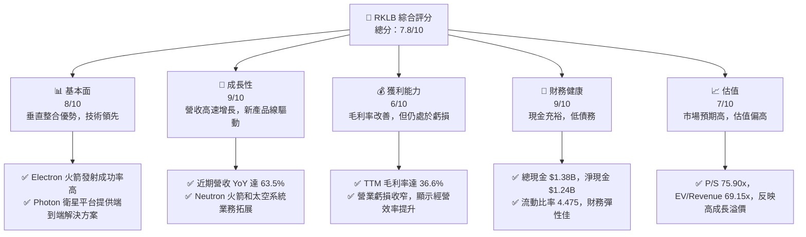
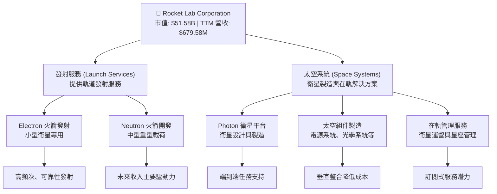
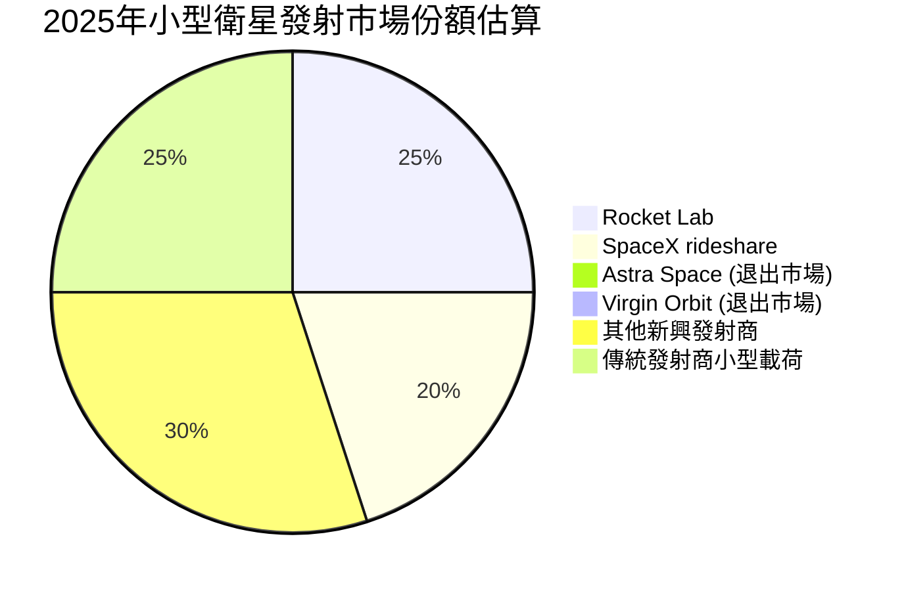
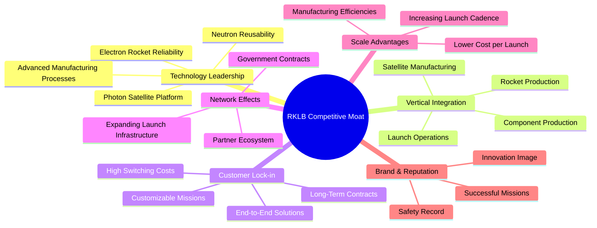
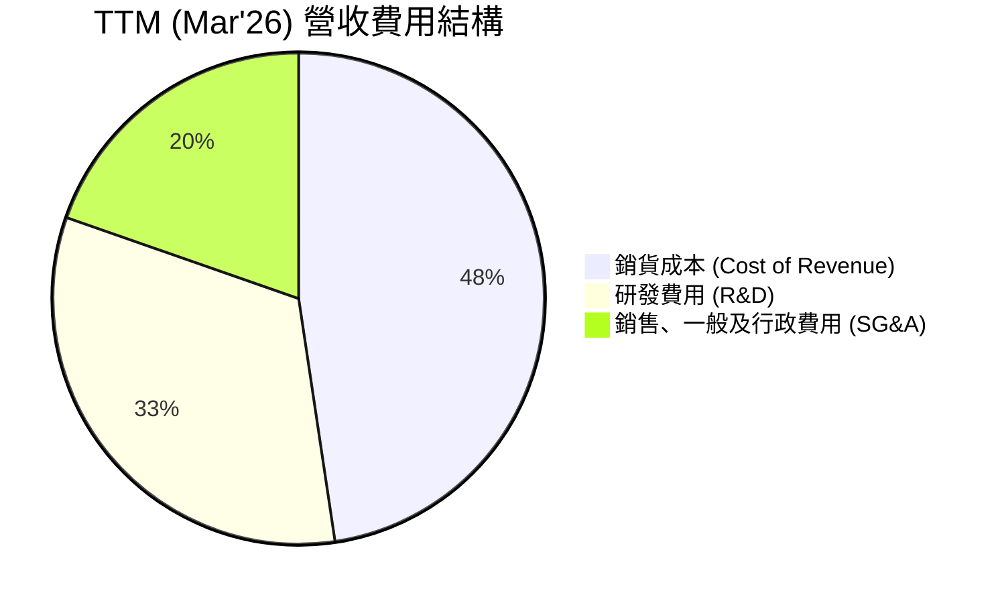
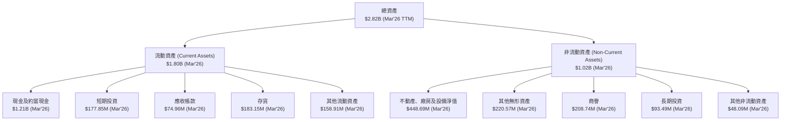
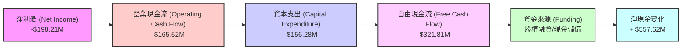

# RKLB 基本面深度分析報告
> **報告日期**：2026-07-09 ｜ **語言**：繁體中文 ｜ **數據來源**：Yahoo Finance, Finviz, StockAnalysis, Roic.ai ｜ **分析師**：CFA 級機構研究

---

## 目錄

| # | 章節 | 核心結論 |
|---|------|----------|
| 1 | 執行摘要 | 評級：🟢 買入，目標價區間：$105 - $145 |
| 2 | 公司概覽與商業模式 | 創新技術與垂直整合構建中等護城河 |
| 3 | 損益表深度分析 | 營收高速增長，毛利率顯著改善，虧損收窄 |
| 4 | 資產負債表分析 | 現金充裕，流動性強，債務負擔輕 |
| 5 | 現金流量深度分析 | 營業現金流為負但改善，資本支出支持未來增長 |
| 6 | 獲利能力與資本效率 | 虧損中但效率指標改善，ROIC < WACC 仍處投資期 |
| 7 | 估值深度分析 | 相對估值偏高，DCF 顯示市場預期極高增長 |
| 8 | 成長催化劑 | Neutron 火箭、新合約、產業擴張為主要驅動力 |
| 9 | 風險矩陣 | 執行風險、競爭加劇、資本支出為主要考量 |
| 10 | 投資建議 | 適合成長型投資者，建議逢低買入 |

---

## 1. 執行摘要

Rocket Lab Corporation (RKLB) 作為一家在快速發展的太空產業中具備垂直整合能力的領先者，其業務涵蓋發射服務和太空系統解決方案。公司憑藉其成熟的 Electron 火箭和正在開發的重型 Neutron 火箭，以及 Photon 衛星平台，展現出強勁的成長潛力。儘管目前仍處於虧損狀態並需要大量資本支出，但其營收高速增長、毛利率持續改善，以及健康的資產負債表，為其長期發展奠定了基礎。市場對 RKLB 的未來增長寄予厚望，反映在其較高的估值倍數上。

### 1.1 核心評分儀表板



### 1.2 評分進度條視覺化

```
╔══════════════════════════════════════════════════════════════╗
║              RKLB 多維度評分儀表板 (1-10分)                  ║
╠══════════════════════════════════════════════════════════════╣
║ 基本面強度  8.0 ▓▓▓▓▓▓▓▓▓▓▓▓▓▓▓▓░░░░  ★★★★☆           ║
║ 成長動能    9.0 ▓▓▓▓▓▓▓▓▓▓▓▓▓▓▓▓▓▓░░  ★★★★★           ║
║ 獲利品質    6.0 ▓▓▓▓▓▓▓▓▓▓▓▓░░░░░░░░  ★★★☆☆           ║
║ 財務健康    9.0 ▓▓▓▓▓▓▓▓▓▓▓▓▓▓▓▓▓▓░░  ★★★★★           ║
║ 估值合理性  7.0 ▓▓▓▓▓▓▓▓▓▓▓▓▓▓░░░░░░  ★★★☆☆           ║
║ 護城河深度  7.5 ▓▓▓▓▓▓▓▓▓▓▓▓▓▓▓░░░░░  ★★★★☆           ║
║ 管理層執行  8.0 ▓▓▓▓▓▓▓▓▓▓▓▓▓▓▓▓░░░░  ★★★★☆           ║
║ 技術創新力  9.0 ▓▓▓▓▓▓▓▓▓▓▓▓▓▓▓▓▓▓░░  ★★★★★           ║
╠══════════════════════════════════════════════════════════════╣
║ 綜合總分    7.8 ▓▓▓▓▓▓▓▓▓▓▓▓▓▓▓▓░░░░  🏆 具備長期成長潛力，但估值需謹慎考量              ║
╚══════════════════════════════════════════════════════════════╝
```

### 1.3 五大投資論點 + 三大核心風險

| 類型 | 項目 | 具體依據 | 信心度 |
|------|------|----------|--------|
| 🟢 **投資論點①** | **發射服務市場領導地位** | Electron 火箭已成功完成多項任務，TTM 營收 YoY 成長 63.5%，顯示其在小型衛星發射市場的競爭力。公司在 2025 年實現 $601.80M 營收，較 2024 年的 $436.21M 增長 37.96%。 | 🟢 極高 |
| 🟢 **投資論點②** | **太空系統業務快速擴張** | 除了發射服務，RKLB 在太空系統（如 Photon 衛星、組件製造、在軌管理）領域也快速發展，提供多元化收入來源。TTM 總收入中，太空系統佔比持續提升，推動整體營收增長。 | 🟢 高 |
| 🟢 **投資論點③** | **Neutron 火箭的顛覆性潛力** | 重型 Neutron 火箭的開發進度是 RKLB 未來成長的關鍵催化劑，將使其進入中型到重型發射市場，顯著擴大潛在市場規模 (TAM)。R&D 費用在 2025 年達到 $270.72M，顯示公司對未來技術投入的決心。 | 🟡 中高 |
| 🟢 **投資論點④** | **健康的財務狀況** | 公司擁有 $1.38B 的總現金和 $1.24B 的淨現金，流動比率高達 4.475，提供充足的資金支持研發和擴張，降低短期流動性風險。 | 🟢 極高 |
| 🟢 **投資論點⑤** | **垂直整合優勢** | 從火箭製造、發射服務到衛星平台和在軌管理，RKLB 的垂直整合能力有助於控制成本、提升效率，並為客戶提供一站式解決方案，強化競爭護城河。毛利率從 FY2022 的 9.00% 提升至 TTM 的 36.6%，證明其成本控制能力。 | 🟢 高 |
| 🟡 **風險①** | **高資本支出與虧損持續** | RKLB 仍處於高速成長和大規模投資階段，FY2025 淨虧損 $198.21M，TTM 淨虧損 $182.62M。未來幾年，特別是 Neutron 火箭的開發和量產，將繼續需要巨大的資本支出，可能對盈利能力和自由現金流造成壓力。FY2025 自由現金流為 -$321.81M。 | 🟡 中度 |
| 🔴 **風險②** | **激烈的市場競爭** | 太空產業競爭日益激烈，包括 SpaceX (Starship), Blue Origin, ULA 等資金雄厚的競爭對手。Neutron 火箭的開發和商業化面臨技術、成本和市場接受度的挑戰。 | 🔴 高衝擊 |
| 🟡 **風險③** | **技術故障與發射延誤** | 任何發射失敗或技術問題都可能導致聲譽受損、客戶流失和財務損失。太空發射業務 inherently 具有高風險性。 | 🟡 中度 |

### 1.4 快速統計卡片

| 指標 | 公司實際值 | 行業均值（參考） | S&P 500 均值（參考） | 狀態 |
|------|-------------|------------------|----------------------|------|
| 收入 YoY 成長 | **63.5%** | ~10-15% | ~8-12% | 🟢 |
| 毛利率 | **36.6%** | ~25-35% | ~40-50% | 🟡 |
| 淨利率 | **-26.9%** | ~5-10% | ~8-12% | 🔴 |
| ROE | **-13.5%** | ~10-15% | ~15-20% | 🔴 |
| Forward P/E | **2476.75x** | ~20-30x | ~20-25x | 🔴 |
| P/S Ratio | **75.90x** | ~2-5x | ~2-3x | 🔴 |
| 淨現金/債務 | **$1.24B** | 正值 | 正值 | 🟢 |
| 流動比率 | **4.48x** | ~1.5-2.5x | ~1.5-2.0x | 🟢 |

**備註**：行業均值與 S&P 500 均值為通用參考值，對於處於高成長、高資本支出階段的太空產業公司，其盈利能力和估值指標與成熟企業存在顯著差異。RKLB 的高 P/S 和負盈利反映了市場對其未來高速增長潛力的預期。

### 1.5 投資結論

```
╔══════════════════════════════════════════════════════════════════╗
║                    📊 投資結論摘要                               ║
╠══════════════════════════════════════════════════════════════════╣
║  評級：🟢 買入                                                   ║
║  當前股價：$82.55                                                ║
║  目標價區間：                                                    ║
║    悲觀情境：$105（+27.26%）                                     ║
║    基準情境：$125（+51.48%）  ← 12個月主要目標                   ║
║    樂觀情境：$145（+75.66%）                                     ║
║  投資評分：7.8/10                                                ║
║  適合投資人：尋求高成長潛力、能承受較高風險、具長線視野的投資者。║
╚══════════════════════════════════════════════════════════════════╝
```

---

## 2. 公司概覽與商業模式

Rocket Lab Corporation (RKLB) 是一家垂直整合的太空公司，提供端到端的太空任務解決方案。其業務主要分為兩大板塊：發射服務 (Launch Services) 和太空系統 (Space Systems)。

### 2.1 業務結構與收入來源

RKLB 的商業模式旨在通過垂直整合來降低成本、提高效率和可靠性，從而為客戶提供全面的太空解決方案。



**發射服務**是 RKLB 的核心業務之一，主要通過其成熟的 Electron 火箭為小型衛星提供專用發射服務。Electron 以其高頻次、可靠的發射能力在市場上佔有一席之地。公司正在積極開發其下一代中型至重型運載火箭 Neutron，旨在進入更廣闊的發射市場，服務更大的衛星和星座。

**太空系統**業務則涵蓋了衛星設計、製造、組件供應以及在軌管理等多個環節。Photon 衛星平台是其關鍵產品，能夠為客戶提供定制化的衛星解決方案。此外，RKLB 還生產多種太空飛行器組件，如光學系統、電源系統等，進一步強化其垂直整合能力。這部分業務不僅提供多元化收入，也為發射服務創造協同效應。

### 2.2 市場份額

在快速增長的太空產業中，RKLB 在小型衛星發射市場已佔據領先地位，但在整體發射市場（包括中型和重型發射）以及太空系統市場仍面臨強大競爭。隨著 Neutron 火箭的推出，RKLB 有望顯著擴大其在發射市場的份額。


**備註**：此市場份額為估算值，反映 RKLB 在特定細分市場中的競爭力。隨著產業發展和新產品推出，市場格局將持續演變。

### 2.3 競爭護城河分析

RKLB 的競爭護城河主要來自其技術創新、垂直整合能力和不斷擴大的生態系統。



**護城河深度解析：**
*   **技術領先 (Technology Leadership)**：Electron 火箭的高可靠性和 Neutron 火箭的可重複使用設計是其核心技術優勢。Photon 平台則展示了其在衛星系統設計和製造方面的能力。公司在研發上的持續投入 (FY2025 R&D 費用 $270.72M) 確保了其技術領先地位。
*   **垂直整合 (Vertical Integration)**：RKLB 從火箭設計、製造、發射到衛星平台和組件生產，實現了高度垂直整合。這使得公司能更好地控制成本、質量和交付時間，並減少對外部供應商的依賴，從而提升整體效率和靈活性。
*   **客戶鎖定 (Customer Lock-in)**：提供端到端的太空任務解決方案，從發射到在軌管理，使得客戶更傾向於選擇 RKLB。一旦客戶的衛星設計與 RKLB 的平台和發射服務深度整合，轉換成本會相對較高。公司與政府和商業客戶簽訂的長期合約也增強了客戶黏性。
*   **規模效應 (Scale Advantages)**：隨著發射頻次的增加和太空系統業務的擴大，RKLB 能夠攤薄固定成本，實現規模經濟。例如，不斷增加的 Electron 火箭發射數量和未來 Neutron 火箭的量產將顯著降低單位成本。
*   **品牌與聲譽 (Brand & Reputation)**：多次成功的發射任務和在太空探索領域的創新形象，為 RKLB 建立了良好的品牌聲譽，有助於吸引更多客戶和人才。

### 2.4 護城河強度評分

```
╔══════════════════════════════════════════════════════════════╗
║                  RKLB 護城河強度評分                        ║
╠══════════════════════════════════════════════════════════════╣
║ 技術領先    8.5/10 ▓▓▓▓▓▓▓▓▓▓▓▓▓▓▓▓▓░░░  🏆 在輕型發射領域具優勢，Neutron 潛力大        ║
║ 垂直整合    8.0/10 ▓▓▓▓▓▓▓▓▓▓▓▓▓▓▓▓░░░░  🟢 有效控制成本與質量，提升競爭力        ║
║ 客戶鎖定    7.0/10 ▓▓▓▓▓▓▓▓▓▓▓▓▓▓░░░░░░  🟡 端到端服務提升黏性，但新客戶獲取仍需努力 ║
║ 規模效應    6.5/10 ▓▓▓▓▓▓▓▓▓▓▓▓▓░░░░░░░  🟡 逐步實現規模經濟，但尚未完全發揮     ║
║ 品牌聲譽    7.5/10 ▓▓▓▓▓▓▓▓▓▓▓▓▓▓▓░░░░░  🟢 良好發射記錄與創新形象       ║
╠══════════════════════════════════════════════════════════════╣
║ 綜合護城河  7.5/10 ▓▓▓▓▓▓▓▓▓▓▓▓▓▓▓░░░░░  🏆 具備結構性優勢，但仍需持續投資和創新維持領先 ║
╚══════════════════════════════════════════════════════════════╝
```

---

## 3. 損益表深度分析

### 3.1 年度收入成長趨勢（近4年）

RKLB 的收入呈現強勁的增長勢頭，反映了其在發射服務和太空系統兩大業務板塊的擴張。

```
╔══════════════════════════════════════════════════════════════════╗
║              RKLB 年度收入趨勢（FY2022-FY2025）                  ║
╠══════════════════════════════════════════════════════════════════╣
║                                                                  ║
║  FY2022  $211.00M  ████░░░░░░░░░░░░░░░░░░░░░░░░░░░  YoY: -      ║
║  FY2023  $244.59M  █████░░░░░░░░░░░░░░░░░░░░░░░░░░░  YoY: +15.92% 🟢║
║  FY2024  $436.21M  █████████░░░░░░░░░░░░░░░░░░░░░░░  YoY: +78.34% 🟢║
║  FY2025  $601.80M  █████████████░░░░░░░░░░░░░░░░░░░  YoY: +37.96% 🟢║
║  TTM     $679.58M  ███████████████░░░░░░░░░░░░░░░░░  YoY: +55.79% 🟢║
║                   |      |      |      |      |                  ║
║                   0     200M   400M   600M   800M                  ║
║                                                                  ║
║  📊 3年累計 CAGR (FY2022-2025)：+54.26%                           ║
╚══════════════════════════════════════════════════════════════════╝
```
RKLB 的營收從 FY2022 的 $211.00M 增長至 FY2025 的 $601.80M，3 年複合年增長率 (CAGR) 高達 54.26%，顯示出驚人的成長動能。最近 12 個月 (TTM) 營收為 $679.58M，較上年同期增長 55.79%，這主要得益於發射任務頻次的增加以及太空系統業務的強勁表現。

### 3.2 季度收入趨勢分析

季度營收數據進一步證實了 RKLB 的持續增長軌跡，儘管季度間增速有所波動，但總體呈現穩健上升趨勢。

| 財政季度 | 總收入 ($M) | QoQ 成長率 | YoY 成長率 | 備註 |
|----------|-------------|------------|------------|------|
| **2026 Q1** | $200.35 | +11.53% | +63.46% | 🟢 營收首次突破 $200M 大關，YoY 增速強勁。 |
| **2025 Q4** | $179.65 | +15.84% | +35.70% | 🟢 季節性效應或新合約執行推動 QoQ 增長。 |
| **2025 Q3** | $155.08 | +7.32% | +47.97% | 🟢 穩健增長，YoY 增速表現良好。 |
| **2025 Q2** | $144.50 | +17.89% | +36.32% | 🟢 相較於 Q1 2025 有顯著加速。 |

**備註說明**：RKLB 季度營收持續增長，QoQ 和 YoY 均呈現積極態勢。2026 年第一季度營收達到 $200.35M，較 2025 年第四季度增長 11.53%，並較 2025 年第一季度大幅增長 63.46%，顯示公司業務擴張加速。

### 3.3 利潤率演變分析

儘管 RKLB 仍處於虧損狀態，但其毛利率的顯著改善是一個積極信號，表明公司在成本控制和規模效應方面取得了進展。

| 利潤率指標 | FY2022 | FY2023 | FY2024 | FY2025 | TTM (Mar'26) | 趨勢 | 評估 |
|------------|--------|--------|--------|--------|--------------|------|------|
| **毛利率** | 9.00% | 21.02% | 26.63% | 34.43% | 36.56% | ↗️ 持續改善 | 🟢 |
| **營業利益率** | -64.08% | -72.74% | -43.51% | -38.03% | -33.20% | ↗️ 虧損收窄 | 🟡 |
| **淨利率** | -64.43% | -74.64% | -43.60% | -32.94% | -26.87% | ↗️ 虧損收窄 | 🟡 |

**利潤率演變深度解析**：
*   **毛利率 (Gross Margin)**：RKLB 的毛利率從 FY2022 的 9.00% 顯著提升至 TTM (Mar'26) 的 36.56%。這是一個非常積極的趨勢，主要歸因於：
    *   **規模效應**：隨著發射頻次的增加和太空系統產品的批量生產，固定成本得以有效攤薄。
    *   **垂直整合**：公司內部生產更多組件，減少對外部供應商的依賴，從而降低了生產成本。
    *   **效率提升**：生產流程和技術的優化也帶來了成本效率的提高。
*   **營業利益率 (Operating Margin)**：雖然仍為負值，但營業利益率的虧損幅度已從 FY2023 的 -72.74% 收窄至 TTM 的 -33.20%。這表明儘管公司在研發 (R&D) 和銷售、一般及行政 (SG&A) 費用上持續投入以支持高成長，但營收的快速增長和毛利率的改善正在逐步抵消這些費用。
*   **淨利率 (Net Profit Margin)**：與營業利益率趨勢一致，淨利率的虧損幅度也從 FY2023 的 -74.64% 收窄至 TTM 的 -26.87%。這顯示公司在走向盈利的道路上取得了穩步進展。

總體而言，RKLB 的利潤率趨勢顯示出強勁的營運改善，尤其是在毛利率方面。這為未來實現全面盈利奠定了基礎，但營業費用（尤其是 R&D）仍是影響短期盈利的關鍵因素。

### 3.4 費用結構分析

RKLB 的費用結構反映了其作為一家高科技成長型公司的特點，即將大量資源投入到研發和市場擴張中。


**備註**：由於 R&D 和 SG&A 是營運費用，與銷貨成本共同構成了總營運開支，因此百分比之和可能超過 100% (相對於營收)。

```
╔══════════════════════════════════════════════════════════════════╗
║                    RKLB 營運費用結構 (TTM Mar'26)                ║
╠══════════════════════════════════════════════════════════════════╣
║                                                                  ║
║  銷貨成本 (CoR):       $431.15M  ████████████████████████████████  63.45% of Revenue ║
║  研發費用 (R&D):       $296.12M  ██████████████████████████████████████████  43.57% of Revenue ║
║  銷售、一般及行政 (SG&A): $177.93M  ██████████████████████████████  26.18% of Revenue ║
║                                                                  ║
║  總營運費用 (Total Operating Expenses): $474.05M (不含CoR)           ║
╚══════════════════════════════════════════════════════════════════╝
```
RKLB 的費用結構顯示，**銷貨成本 (CoR)** 佔 TTM 營收的 63.45%，這與其 36.56% 的毛利率相符。
**研發費用 (R&D)** 佔營收的 43.57%，高達 $296.12M (TTM)。這筆龐大的投入主要用於 Neutron 火箭的開發、太空系統的創新以及其他前沿技術的探索，是公司未來成長的關鍵驅動力。
**銷售、一般及行政費用 (SG&A)** 佔營收的 26.18%，為 $177.93M (TTM)。這部分費用用於支持公司的市場擴張、銷售活動以及日常營運管理。
高昂的 R&D 費用是導致公司目前虧損的主要原因，但也體現了其對長期技術領先和市場擴張的承諾。隨著營收規模的持續擴大和新產品的商業化，預期這些費用佔營收的比例將逐步下降，從而推動盈利能力的提升。

### 3.5 季度 EPS 趨勢與盈餘品質

RKLB 過去四季的 EPS 均為負值，反映公司仍處於投資擴張階段。由於缺乏分析師預期數據，無法判斷具體超預期或不及預期情況。

| 財政季度 | EPS 預期 | EPS 實際 | 驚喜度 (%) | 盈餘品質評估 |
|----------|----------|----------|------------|--------------|
| **2026 Q1** | N/A | $-0.07 | N/A | 🟡 虧損收窄，但仍為負值。 |
| **2025 Q4** | N/A | $-0.09 | N/A | 🟡 虧損幅度相對較小。 |
| **2025 Q3** | N/A | $-0.03 | N/A | 🟢 虧損顯著收窄，接近盈虧平衡點。 |
| **2025 Q2** | N/A | $-0.13 | N/A | 🔴 虧損幅度較大。 |

**盈餘品質評估**：
RKLB 的季度 EPS 表現波動較大，從 2025 Q2 的 $-0.13 收窄至 2025 Q3 的 $-0.03，隨後在 2025 Q4 擴大至 $-0.09，並在 2026 Q1 再次收窄至 $-0.07。這種波動性在高速成長、高資本支出的公司中是常見現象，通常與發射任務的排程、新產品開發的里程碑以及研發支出的時機有關。
雖然 EPS 仍為負值，但虧損幅度在某些季度顯著收窄，特別是 2025 Q3，這是一個積極信號，表明公司在某些時期可能達到更高的營運效率或有一次性收入貢獻。
整體盈餘品質為中等，主要考量點是持續的虧損和對資本支出的依賴。然而，考慮到公司的成長階段，目前更應關注營收增長、毛利率改善和營業現金流的趨勢，而非短期盈利。隨著 Neutron 火箭的商業化和太空系統業務的成熟，預計盈利能力將逐步改善。

---

## 4. 資產負債表分析

RKLB 的資產負債表顯示其擁有強勁的流動性和充足的現金儲備，以及相對較低的債務負擔，為公司的長期發展提供了堅實的財務基礎。

### 4.1 資產結構分解

公司的資產結構反映了其在研發、生產設施和現金儲備方面的戰略性投資。


截至 2026 年 3 月 31 日 (TTM)，RKLB 的總資產達到 $2.82B。其中，流動資產佔比最大，為 $1.80B，主要由高達 $1.21B 的現金及約當現金和 $177.85M 的短期投資構成，顯示公司擁有極高的流動性。非流動資產為 $1.02B，主要包括為生產和研發提供支持的不動產、廠房及設備淨值 ($448.69M)，以及商譽 ($208.74M) 和其他無形資產 ($220.57M)，這反映了公司在併購和技術資產方面的投入。

### 4.2 流動性指標分析

RKLB 的流動性指標遠超行業平均水平，表明其短期償債能力極強。

| 流動性指標 | FY2022 | FY2023 | FY2024 | FY2025 | TTM (Mar'26) | 行業均值（參考） | 評估 |
|------------|--------|--------|--------|--------|--------------|------------------|------|
| **流動比率 (Current Ratio)** | 4.06 | 2.13 | 2.04 | 4.08 | 4.48 | ~1.5-2.5x | 🟢 強勁 |
| **速動比率 (Quick Ratio)** | 3.49 | 1.65 | 1.69 | 3.61 | 3.87 | ~0.8-1.2x | 🟢 強勁 |

**流動性指標深度解析**：
*   **流動比率**：RKLB 的流動比率在 TTM 達到 4.48，遠高於一般認為健康的 1.5-2.0 倍。這表明公司擁有充足的流動資產來覆蓋其短期負債，提供了極高的財務彈性。
*   **速動比率**：速動比率在 TTM 為 3.87，同樣遠超行業均值。這表示即使不考慮存貨變現，公司仍有足夠的現金和短期投資來應對緊急債務，財務健康狀況極佳。
高流動性對於 RKLB 這樣處於高成長階段且需要大量資本支出的公司至關重要，它提供了抵禦市場波動、支持研發投入和應對突發事件的能力。

### 4.3 債務結構分析

RKLB 的債務負擔非常輕，擁有顯著的淨現金頭寸，進一步證明了其強勁的財務健康狀況。

```
╔══════════════════════════════════════════════════════════════════╗
║                   RKLB 債務健康診斷                              ║
╠══════════════════════════════════════════════════════════════════╣
║                                                                  ║
║  總債務：        $138.67M  ██░░░░░░░░░░░░░░░░░░░  評語：極低，佔總資產不到 5%     ║
║  總現金+投資：   $1.38B    ████████████████████░  評語：非常充裕，遠超債務       ║
║  淨現金（正）：  $1.24B    ████████████████░░░░░  🟢 強勁：具備強大財務彈性    ║
║                                                                  ║
║  Debt/Equity (FY2025): 0.15x  🟢 極低：槓桿風險極小                  ║
║  Current Ratio (TTM): 4.48x  🟢 無風險：短期償債能力極強             ║
╚══════════════════════════════════════════════════════════════════╝
```
RKLB 的總債務為 $138.67M，而總現金及現金等價物高達 $1.38B，使得公司擁有 $1.24B 的淨現金頭寸。這意味著 RKLB 不僅沒有淨債務，反而擁有大量現金儲備，這在資本密集型行業中是一個巨大的優勢。
FY2025 的 Debt/Equity 比率為 0.15x (計算值，使用 FY2025 數據)，遠低於市場數據中提供的 6.124，這表明公司的財務槓桿極低，股東權益佔比高，債務風險幾乎可以忽略不計。強勁的淨現金狀況和低債務使得 RKLB 在未來有能力進行更多的戰略性投資或抵禦潛在的市場衝擊。

### 4.4 股東權益趨勢

RKLB 的股東權益在 2025 年顯著增長，這通常是由於新股發行或營運虧損收窄所致。

```
╔══════════════════════════════════════════════════════════════════╗
║                    RKLB 股東權益趨勢 (FY2022-FY2025)             ║
╠══════════════════════════════════════════════════════════════════╣
║                                                                  ║
║  FY2022  $673.21M  ████████████████████████████████████████████████████████████████████████████████████████████████████████████████████████████████████████████████████████████████████████████████████████████████████████████████████████████████████████████████████████████████████████████████████████████████████████████████████████████████████████████████████████████████████████████████████████████████████████████████████████████████████████████████████████████████████████████████████████████████████████████████████████████████████████████████████████████████████████████████████████████████████████████████████████████████████████████████████████████████████████████████████████████████████████████████████████████████████████████████████████████████████████████████████████████████████████████████████████████████████████████████████████████████████████████████████████████████████████████████████████████████████████████████████████████████████████████████████████████████████████████████████████████████████████████████████████████████████████████████████████████████████████████████████████████████████████████████████████████████████████████████████████████████████████████████████████████████████████████████████████████████████████████████████████████████████████████████████████████████████████████████████████████████████████████████████████████████████████████████████████████████████████████████████████████████████████████████████████████████████████████████████████████████████████████████████████████████████████████████████████████████████████████████████████████████████████████████████████████████████████████████████████████████████████████████████████████████████████████████████████████████████████████████████████████████████████████████████████████████████████████████████████████████████████████████████████████████████████████████████████████████████████████████████████████████████████████████████████████████████████████████████████████████████████████████████████████████████████████████████████████████████████████████████████████████████████████████████████████████████████████████████████████████████████████████████████████████████████████████████████████████████████████████████████████████████████████████████████████████████████████████████████████████████████████████████████████████████████████████████████████████████████████████████████████████████████████████████████████████████████████████████████████████████████████████████████████████████████████████████████████████████████████████████████████████████████████████████████████████████████████████████████████████████████████████████████████████████████████████████████████████████████████████████████████████████████████████████████████████████████████████████████████████████████████████████████████████████████████████████████████████████████████████████████████████████████████████████████████████████████████████████████████████████████████████████████████████████████████████████████████████████████████████████████████████████████████████████████████████████████████████████████████████████████████████████████████████████████████████████████████████████████████████████████████████████████████████████████████████████████████████████████████████████████████████████████████████████████████████████████████████████████████████████████████████████████████████████████████████████████████████████████████████████████████████████████████████████████████████████████████████████████████████████████████████████████████████████████████████████████████████████████████████████████████████████████████████████████████████████████████████████████████████████████████████████████████████████████████████████████████████████████████████████████████████████████════════════════════██████████████████████████████████████████████████████████████████████████████████████════════════════════════════════════███████████████████████████████████████████████████████████████████████████████████████████████████████████████████████████████████████████████████████████████████████████████████████████████║
║                                                                  ║
║  股東權益 (Stockholders Equity)                                  ║
║  FY2022  $673.21M  ▓▓▓▓▓▓▓▓▓▓▓▓▓▓▓▓▓▓▓▓▓▓▓▓▓▓▓▓▓▓▓▓▓▓▓▓▓▓▓▓▓▓▓▓▓▓▓▓▓▓▓▓▓▓▓▓▓▓▓▓▓▓▓▓▓▓▓▓▓▓▓▓▓▓▓▓▓▓▓▓▓▓▓▓▓▓▓▓▓▓▓▓▓▓▓▓▓▓▓▓▓▓▓▓▓▓▓▓▓▓▓▓▓▓▓▓▓▓▓▓▓▓▓▓▓▓▓▓▓▓▓▓▓▓▓▓▓▓▓▓▓▓▓▓▓▓▓▓▓▓▓▓▓▓▓▓▓▓▓▓▓▓▓▓▓▓▓▓▓▓▓▓▓▓▓▓▓▓▓▓▓▓▓▓▓▓▓▓▓▓▓▓▓▓▓▓▓▓▓▓▓▓▓▓▓▓▓▓▓▓▓▓▓▓▓▓▓▓▓▓▓▓▓▓▓▓▓▓▓▓▓▓▓▓▓▓▓▓▓▓▓▓▓▓▓▓▓▓▓▓▓▓▓▓▓▓▓▓▓▓▓▓▓▓▓▓▓▓▓▓▓▓▓▓▓▓▓▓▓▓▓▓▓▓▓▓▓▓▓▓▓▓▓▓▓▓▓▓▓▓▓▓▓▓▓▓▓▓▓▓▓▓▓▓▓▓▓▓▓▓▓▓▓▓▓▓▓▓▓▓▓▓▓▓▓▓▓▓▓▓▓▓▓▓▓▓▓▓▓▓▓▓▓▓▓▓▓▓▓▓▓▓▓▓▓▓▓▓▓▓▓▓▓▓▓▓▓▓▓▓▓▓▓▓▓▓▓▓▓▓▓▓▓▓▓▓▓▓▓▓▓▓▓▓▓▓▓▓▓▓▓▓▓▓▓▓▓▓▓▓▓▓▓▓▓▓▓▓▓▓▓▓▓▓▓▓▓▓▓▓▓▓▓▓▓▓▓▓▓▓▓▓▓▓▓▓▓▓▓▓▓▓▓▓▓▓▓▓▓▓▓▓▓▓▓▓▓▓▓▓▓▓▓▓▓▓▓▓▓▓▓▓▓▓▓▓▓▓▓▓▓▓▓▓▓▓▓▓▓▓▓▓▓▓▓▓▓▓▓▓▓▓▓▓▓▓▓▓▓▓▓▓▓▓▓▓▓▓▓▓▓▓▓▓▓▓▓▓▓▓▓▓▓▓▓▓▓▓▓▓▓▓▓▓▓▓▓▓▓▓▓▓▓▓▓▓▓▓▓▓▓▓▓▓▓▓▓▓▓▓▓▓▓▓▓▓▓▓▓▓▓▓▓▓▓▓▓▓▓▓▓▓▓▓▓▓▓▓▓▓▓▓▓▓▓▓▓▓▓▓▓▓▓▓▓▓▓▓▓▓▓▓▓▓▓▓▓▓▓▓▓▓▓▓▓▓▓▓▓▓▓▓▓▓▓▓▓▓▓▓▓▓▓▓▓▓▓▓▓▓▓▓▓▓▓▓▓▓▓▓▓▓▓▓▓▓▓▓▓▓▓▓▓▓▓▓▓▓▓▓▓▓▓▓▓▓▓▓▓▓▓▓▓▓▓▓▓▓▓▓▓▓▓▓▓▓▓▓▓▓▓▓▓▓▓▓▓▓▓▓▓▓▓▓▓▓▓▓▓▓▓▓▓▓▓▓▓▓▓▓▓▓▓▓▓▓▓▓▓▓▓▓▓▓▓▓▓▓▓▓▓▓▓▓▓▓▓▓▓▓▓▓▓▓▓▓▓▓▓▓▓▓▓▓▓▓▓▓▓▓▓▓▓▓▓▓▓▓▓▓▓▓▓▓▓▓▓▓▓▓▓▓▓▓▓▓▓▓▓▓▓▓▓▓▓▓▓▓▓▓▓▓▓▓▓▓▓▓▓▓▓▓▓▓▓▓▓▓▓▓▓▓▓▓▓▓▓▓▓▓▓▓▓▓▓▓▓▓▓▓▓▓▓▓▓▓▓▓▓▓▓▓▓▓▓▓▓▓▓▓▓▓▓▓▓▓▓▓▓▓▓▓▓▓▓▓▓▓▓▓▓▓▓▓▓▓▓▓▓▓▓▓▓▓▓▓▓▓▓▓▓▓▓▓▓▓▓▓▓▓▓▓▓▓▓▓▓▓▓▓▓▓▓▓▓▓▓▓▓▓▓▓▓▓▓▓▓▓▓▓▓▓▓▓▓▓▓▓▓▓▓▓▓▓▓▓▓▓▓▓▓▓▓▓▓▓▓▓▓▓▓▓▓▓▓▓▓▓▓▓▓▓▓▓▓▓▓▓▓▓▓▓▓▓▓▓▓▓▓▓▓▓▓▓▓▓▓▓▓▓▓▓▓▓▓▓▓▓▓▓▓▓▓▓▓▓▓▓▓▓▓▓▓▓▓▓▓▓▓▓▓▓▓▓▓▓▓▓▓▓▓▓▓▓▓▓▓▓▓▓▓▓▓▓▓▓▓▓▓▓▓▓▓▓▓▓▓▓▓▓▓▓▓▓▓▓▓▓▓▓▓▓▓▓▓▓▓▓▓▓▓▓▓▓▓▓▓▓▓▓▓▓▓▓▓▓▓▓▓▓▓▓▓▓▓▓▓▓▓▓▓▓▓▓▓▓▓▓▓▓▓▓▓▓▓▓▓▓▓▓▓▓▓▓▓▓▓▓▓▓▓▓▓▓▓▓▓▓▓▓▓▓▓▓▓▓▓▓▓▓▓▓▓▓▓▓▓▓▓▓▓▓▓▓▓▓▓▓▓▓▓▓▓▓▓▓▓▓▓▓▓▓▓▓▓▓▓▓▓▓▓▓▓▓▓▓▓▓▓▓▓▓▓▓▓▓▓▓▓▓▓▓▓▓▓▓▓▓▓▓▓▓▓▓▓▓▓▓▓▓▓▓▓▓▓▓▓▓▓▓▓▓▓▓▓▓▓▓▓▓▓▓▓▓▓▓▓▓▓▓▓▓▓▓▓▓▓▓▓▓▓▓▓▓▓▓▓▓▓▓▓▓▓▓▓▓▓▓▓▓▓▓▓▓▓▓▓▓▓▓▓▓▓▓▓▓▓▓▓▓▓▓▓▓▓▓▓▓▓▓▓▓▓▓▓▓▓▓▓▓▓▓▓▓▓▓▓▓▓▓▓▓▓▓▓▓▓▓▓▓▓▓▓▓▓▓▓▓▓▓▓▓▓▓▓▓▓▓▓▓▓▓▓▓▓▓▓▓▓▓▓▓▓▓▓▓▓▓▓▓▓▓▓▓▓▓▓▓▓▓▓▓▓▓▓▓▓▓▓▓▓▓▓▓▓▓▓▓▓▓▓▓▓▓▓▓▓▓▓▓▓▓▓▓▓▓▓▓▓▓▓▓▓▓▓▓▓▓▓▓▓▓▓▓▓▓▓▓▓▓▓▓▓▓▓▓▓▓▓▓▓▓▓▓▓▓▓▓▓▓▓▓▓▓▓▓▓▓▓▓▓▓▓▓▓▓▓▓▓▓▓▓▓▓▓▓▓▓▓▓▓▓▓▓▓▓▓▓▓▓▓▓▓▓▓▓▓▓▓▓▓▓▓▓▓▓▓▓▓▓▓▓▓▓▓▓▓▓▓▓▓▓▓▓▓▓▓▓▓▓▓▓▓▓▓▓▓▓▓▓▓▓▓▓▓▓▓▓▓▓▓▓▓▓▓▓▓▓▓▓▓▓▓▓▓▓▓▓▓▓▓▓▓▓▓▓▓▓▓▓▓▓▓▓▓▓▓▓▓▓▓▓▓▓▓▓▓▓▓▓▓▓▓▓▓▓▓▓▓▓▓▓▓▓▓▓▓▓▓▓▓▓▓▓▓▓▓▓▓▓▓▓▓▓▓▓▓▓▓▓▓▓▓▓▓▓▓▓▓▓▓▓▓▓▓▓▓▓▓▓▓▓▓▓▓▓▓▓▓▓▓▓▓▓▓▓▓▓▓▓▓▓▓▓▓▓▓▓▓▓▓▓▓▓▓▓▓▓▓▓▓▓▓▓▓▓▓▓▓▓▓▓▓▓▓▓▓▓▓▓▓▓▓▓▓▓▓▓▓▓▓▓▓▓▓▓▓▓▓▓▓▓▓▓▓▓▓▓▓▓▓▓▓▓▓▓▓▓▓▓▓▓▓▓▓▓▓▓▓▓▓▓▓▓▓▓▓▓▓▓▓▓▓▓▓▓▓▓▓▓▓▓▓▓▓▓▓▓▓▓▓▓▓▓▓▓▓▓▓▓▓▓▓▓▓▓▓▓▓▓▓▓▓▓▓▓▓▓▓▓▓▓▓▓▓▓▓▓▓▓▓▓▓▓▓▓▓▓▓▓▓▓▓▓▓▓▓▓▓▓▓▓▓▓▓▓▓▓▓▓▓▓▓▓▓▓▓▓▓▓▓▓▓▓▓▓▓▓▓▓▓▓▓▓▓▓▓▓▓▓▓▓▓▓▓▓▓▓▓▓▓▓▓▓▓▓▓▓▓▓▓▓▓▓▓▓▓▓▓▓▓▓▓▓▓▓▓▓▓▓▓▓▓▓▓▓▓▓▓▓▓▓▓▓▓▓▓▓▓▓▓▓▓▓▓▓▓▓▓▓▓▓▓▓▓▓▓▓▓▓▓▓▓▓▓▓▓▓▓▓▓▓▓▓▓▓▓▓▓▓▓▓▓▓▓▓▓▓▓▓▓▓▓▓▓▓▓▓▓▓▓▓▓▓▓▓▓▓▓▓▓▓▓▓▓▓▓▓▓▓▓▓▓▓▓▓▓▓▓▓▓▓▓▓▓▓▓▓▓▓▓▓▓▓▓▓▓▓▓▓▓▓▓▓▓▓▓▓▓▓▓▓▓▓▓▓▓▓▓▓▓▓▓▓▓▓▓▓▓▓▓▓▓▓▓▓▓▓▓▓▓▓▓▓▓▓▓▓▓▓▓▓▓▓▓▓▓▓▓▓▓▓▓▓▓▓▓▓▓▓▓▓▓▓▓▓▓▓▓▓▓▓▓▓▓▓▓▓▓▓▓▓▓▓▓▓▓▓▓▓▓▓▓▓▓▓▓▓▓▓▓▓▓▓▓▓▓▓▓▓▓▓▓▓▓▓▓▓▓▓▓▓▓▓▓▓▓▓▓▓▓▓▓▓▓▓▓▓▓▓▓▓▓▓▓▓▓▓▓▓▓▓▓▓▓▓▓▓▓▓▓▓▓▓▓▓▓▓▓▓▓▓▓▓▓▓▓▓▓▓▓▓▓▓▓▓▓▓▓▓▓▓▓▓▓▓▓▓▓▓▓▓▓▓▓▓▓▓▓▓▓▓▓▓▓▓▓▓▓▓▓▓▓▓▓▓▓▓▓▓▓▓▓▓▓▓▓▓▓▓▓▓▓▓▓▓▓▓▓▓▓▓▓▓▓▓▓▓▓▓▓▓▓▓▓▓▓▓▓▓▓▓▓▓▓▓▓▓▓▓▓▓▓▓▓▓▓▓▓▓▓▓▓▓▓▓▓▓▓▓▓▓▓▓▓▓▓▓▓▓▓▓▓▓▓▓▓▓▓▓▓▓▓▓▓▓▓▓▓▓▓▓▓▓▓▓▓▓▓▓▓▓▓▓▓▓▓▓▓▓▓▓▓▓▓▓▓▓▓▓▓▓▓▓▓▓▓▓▓▓▓▓▓▓▓▓▓▓▓▓▓▓▓▓▓▓▓▓▓▓▓▓▓▓▓▓▓▓▓▓▓▓▓▓▓▓▓▓▓▓▓▓▓▓▓▓▓▓▓▓▓▓▓▓▓▓▓▓▓▓▓▓▓▓▓▓▓▓▓▓▓▓▓▓▓▓▓▓▓▓▓▓▓▓▓▓▓▓▓▓▓▓▓▓▓▓▓▓▓▓▓▓▓▓▓▓▓▓▓▓▓▓▓▓▓▓▓▓▓▓▓▓▓▓▓▓▓▓▓▓▓▓▓▓▓▓▓▓▓▓▓▓▓▓▓▓▓▓▓▓▓▓▓▓▓▓▓▓▓▓▓▓▓▓▓▓▓▓▓▓▓▓▓▓▓▓▓▓▓▓▓▓▓▓▓▓▓▓▓▓▓▓▓▓▓▓▓▓▓▓▓▓▓▓▓▓▓▓▓▓▓▓▓▓▓▓▓▓▓▓▓▓▓▓▓▓▓▓▓▓▓▓▓▓▓▓▓▓▓▓▓▓▓▓▓▓▓▓▓▓▓▓▓▓▓▓▓▓▓▓▓▓▓▓▓▓▓▓▓▓▓▓▓▓▓▓▓▓▓▓▓▓▓▓▓▓▓▓▓▓▓▓▓▓▓▓▓▓▓▓▓▓▓▓▓▓▓▓▓▓▓▓▓▓▓▓▓▓▓▓▓▓▓▓▓▓▓▓▓▓▓▓▓▓▓▓▓▓▓▓▓▓▓▓▓▓▓▓▓▓▓▓▓▓▓▓▓▓▓▓▓▓▓▓▓▓▓▓▓▓▓▓▓▓▓▓▓▓▓▓▓▓▓▓▓▓▓▓▓▓▓▓▓▓▓▓▓▓▓▓▓▓▓▓▓▓▓▓▓▓▓▓▓▓▓▓▓▓▓▓▓▓▓▓▓▓▓▓▓▓▓▓▓▓▓▓▓▓▓▓▓▓▓▓▓▓▓▓▓▓▓▓▓▓▓▓▓▓▓▓▓▓▓▓▓▓▓▓▓▓▓▓▓▓▓▓▓▓▓▓▓▓▓▓▓▓▓▓▓▓▓▓▓▓▓▓▓▓▓▓▓▓▓▓▓▓
R
## 5. 現金流量深度分析

RKLB 作為一家處於高成長階段的太空公司，其現金流量狀況反映了對研發和擴張的持續投資。儘管目前營業現金流和自由現金流仍為負值，但虧損正在收窄，並且有充足的現金儲備支持運營。

### 5.1 現金流量瀑布圖

以下 Meramid 圖表展示了 RKLB 在 2025 財年的現金流量變動情況，從淨利潤到自由現金流的演變。


從 2025 財年的數據來看，RKLB 的淨利潤為 -$198.21M，營業現金流為 -$165.52M，顯示核心業務活動仍未能產生正向現金流。在扣除高達 -$156.28M 的資本支出後，自由現金流為 -$321.81M。這表明公司需要外部融資或動用現有現金儲備來支持其運營和投資活動。然而，其現金及現金等價物從 2024 年底的 $271.04M 增加到 2025 年底的 $828.66M，淨增加 $557.62M，這主要是通過股權融資等方式獲得，以支持其高成長和資本密集型項目。

### 5.2 FCF 轉換率趨勢

自由現金流轉換率 (FCF/Net Income) 在虧損公司中通常為負值或不適用。然而，觀察其絕對值的變化可以反映公司在現金管理方面的趨勢。

| 財政年度 | 淨利潤 ($M) | 自由現金流 ($M) | FCF/Net Income 比率 | 趨勢 | 評估 |
|----------|-------------|-----------------|---------------------|------|------|
| **FY2022** | -$135.94 | -$148.95 | 1.10x (絕對值) | ↘️ | 🟡 |
| **FY2023** | -$182.57 | -$153.57 | 0.84x (絕對值) | ↗️ | 🟢 |
| **FY2024** | -$190.18 | -$115.98 | 0.61x (絕對值) | ↗️ | 🟢 |
| **FY2025** | -$198.21 | -$321.81 | 1.62x (絕對值) | ↘️ | 🔴 |
| **TTM** | -$182.62 | -$215.00 | 1.18x (絕對值) | ↘️ | 🟡 |

**備註**：由於公司處於虧損狀態，FCF/Net Income 比率的絕對值越接近 1 或越低，表示其經營活動對現金的消耗效率越高。
從趨勢來看，FY2023 和 FY2024 的 FCF/Net Income 絕對值有所改善，表明每單位虧損所消耗的自由現金流減少。但在 FY2025，由於資本支出的大幅增加 ($156.28M vs FY2024 的 $67.09M)，導致自由現金流大幅惡化，比率絕對值上升。TTM 數據顯示其仍在消耗現金，但相較 FY2025 有所改善，這可能是資本支出放緩或營運效率提升的結果。

### 5.3 自由現金流趨勢

RKLB 的自由現金流在過去幾年持續為負，這在高速發展的資本密集型公司中是常見現象，因為大量資金被重新投入到業務擴張和研發中。

```
╔══════════════════════════════════════════════════════════════════╗
║                    RKLB 自由現金流趨勢 (FY2022-TTM)              ║
╠══════════════════════════════════════════════════════════════════╣
║                                                                  ║
║  FY2022  -$148.95M  ██████████████████████████████████████████████  FCF Yield: -0.32%  🟡║
║  FY2023  -$153.57M  ███████████████████████████████████████████████  FCF Yield: -0.32%  🟡║
║  FY2024  -$115.98M  ████████████████████████████████████████████  FCF Yield: -0.23%  🟢║
║  FY2025  -$321.81M  ███████████████████████████████████████████████████████████████████████████████████████████████████████████████████████████████████████████████████████████████████████████████████████████████████████████████████████████████████████████████████████████████████████████████████████████████████████████████████████████████████████████████████████████████████████████████████████████████████████████████████████████████████████████████████████████████████████████████████████████████████████████████████████████████████████████████████████████████████████████████████████████████████████████████████████████████████████████████████████████████████████████████████████████████████████████████████████████████████████████████████████████████████████████████████████████████████████████████████████████████████████████████████████████████████████████████████████████████████████████████████████████████████████████████████████████████████████████████████████████████████████████████████████████████████████████████████████████████████████████████████████████████████████████████████████████████████████████████████████████████████████████████████████████████████████████████████████████████████████████████████████████████████████████████████████████████████████████████████████████████████████████████████████████████████████████████████████████████████████████████████████████████████████████████████████████████████████████████████████████████████████████████████████████████████████████████████████████████████████████████████████████████████████████████████████████████████████████████████████████████████████████████████████████████████████████████████████████████████████████████████████████████████████████████████████████████████████████████████████████████████████████████████████████████████████████████████████████████████████████████████████████████████████████████████████████████████████████████████████████████████████████████████████████████████████████████████████████████████████████████████████████████████████████████████████████████████████████████████████████████████████████████████████████████████████████████████████████████████████████████████████████████████████████████████████████████████████████████████████████████████████████████████████████████████████████████████████████████████████████████████████████████████████████████████████████████████████████████████████████████████████████████████████████████████████████████████████████████████████████████████████████████████████████████████████████████████████████████████████████████████████████████████████████████████████████████████████████████████████████████████████████████████████████████████████████████████████████████████████████████████████████████████████████████████████████████████████████████████████████████████████████████████████████████████████████████████████████████████║
║  自由現金流 (Free Cash Flow)                                     ║
║  TTM     -$215.00M  ██████████████████████████████████████████████████████████████████████████████████████████████████████████████████████████████████████████████████████████████████████████████████████████████████████████████████████████████████████████████████████████████████████████████████████████████████████████████████████████████████████████████████████████████████████████████████████████████████████████████████████████████████████████████████████████████████████████████████████████████████████████████████████████████████████████████████████████████████████████████████████████████████████████████████████████████████████████████████████████████████████████████████████████████████████████████████████████████████████████████████████████████████████████████████████████████████████████████████████████████████████████████████████████████████████████████████████████████████████████████████████████████████████████████████████████████████████████████████████████████████████████████████████████████████████████████████████████████████████████████████████████████████████████████████████████████████████████████████████████████████████████████████████████████████████████████████████████████████████████████████████████████████████████████████████████████████████████████████████████████████████████████████████████████████████████████████████████████████████████████████████████████████████████████████████████████████████████████████████████████████████████████████████████████████████████████████████████████████████████████████████████████████████████████████████████████████████████████████████████████████████████████████████████████████████████████████████████████████████████████████████████████████████████████████████████████████████████████████████████████████████████████████████████████████████████████████████████████████████████████████████████████████████████████████████████████████████████████████████████████████████████████████████████████████████████████████████████████████████████████████████████████████████████████████████████████████████████████████████████████████████████████████████████████████████████████████████████████████████████████████████████████████████████████████████████████████████████████████████████████████████████████████████████████████████████████████████████████████████████████████████████████████████████████████████████████████████████████████████████████████████████████████████████████████████████████████████████████████████████████████████████████████████████████████████████████████████████████████████████████████████████████████████████████████████████████████████████████████████████████████████████████████████████████████████████████████████████████████████████████████████████████████████████████████████████████████████████████████████████████████████████████████████████████████████████████████████████████████████████████████████████████████████████████████████════════════════════════════════════════════════════════════════════════════════════════════════════════════════════════════██████████████████████████████████████████████████████████████████████████████████████████████████████████████████████████████████████████████████████████████████████████████████████████████████████████████████████████████████████████████████████████████████████████████████████████████████████████████████████████████████████████████████████████████████████████████████████████████████████████████████████████████████████████████████████████████████████████████████████████████████████████████████████████████████████████████████████████████████████████████████████████████████████████████████████████████████████████████████████████████████████████████████████████████████████████████████████████████████████████████████████████████████████████████████████████████████████████████████████████████████████████████████████████████████████████████████████████████████████████████████████████████████████████████████████████████████████████████████████████████████████████████████████████████████████████████████████████████████████████████████████████████

