# RKLB 基本面深度分析報告
> **報告日期**：2026-07-10 ｜ **語言**：繁體中文 ｜ **數據來源**：Yahoo Finance, Finviz, StockAnalysis, Roic.ai ｜ **分析師**：CFA 級機構研究

---

## 目錄

| # | 章節 | 核心結論 |
|---|----------------------------------|----------------------------------------------------|
| 1 | 執行摘要 | 🟢 買入，目標價區間 $105 - $135 |
| 2 | 公司概覽與商業模式 | 憑藉技術護城河與垂直整合，奠定太空產業競爭優勢 |
| 3 | 損益表深度分析 | 營收高速成長，毛利率持續改善，虧損收窄中 |
| 4 | 資產負債表分析 | 流動性強勁，淨現金充足，支持未來擴張 |
| 5 | 現金流量深度分析 | 自由現金流持續為負，但營運現金流改善，資本支出加大 |
| 6 | 獲利能力與資本效率 | 儘管 ROIC 仍低於 WACC，但虧損收窄預示未來價值創造潛力 |
| 7 | 估值深度分析 | 相較於高成長同業，估值合理，具備上漲空間 |
| 8 | 成長催化劑 | 新火箭開發、衛星發射頻次提升與太空系統業務拓展 |
| 9 | 風險矩陣 | 競爭加劇、技術執行風險與資本需求為主要挑戰 |
| 10| 投資建議 | 建議買入，長期看好其在太空經濟中的領導地位 |

---

## 1. 執行摘要

Rocket Lab Corporation (RKLB) 作為太空產業的創新者，在發射服務和太空系統兩大業務板塊展現出強勁的成長動能。儘管目前仍處於虧損狀態，但其營收高速成長、毛利率顯著改善，以及豐富的現金儲備，共同支撐了其未來價值創造的潛力。分析顯示，RKLB 憑藉其獨特的技術護城河和垂直整合能力，有望在快速發展的太空經濟中佔據領先地位。當前估值相較於其高成長潛力而言具備吸引力。

### 1.0 一頁式投資儀表板（Portfolio Manager 30 秒速讀）

| 項目 | 內容 |
|------|------|
| **投資論點（3 句）** | ① RKLB 營收在過去一年實現 63.5% 的強勁成長，顯示其在發射服務和太空系統領域的市場需求旺盛。② 毛利率從 FY2022 的 9.0% 大幅提升至 TTM 的 36.6%，反映出規模效應與成本控制的初步成效。③ 公司擁有 $1.38B 的總現金和 $1.24B 的淨現金，為其高資本投入的研發和擴張提供了充足的財務彈性。 |
| **護城河評分** | 8.5/10 |
| **管理層/資本配置評分** | 7.5/10 |
| **財務健康** | 🟢 強勁的流動性和充足的現金儲備 |
| **ROIC vs WACC** | -13.5% (FY2025) vs 10.2%（目前摧毀價值，但預計未來轉正） |
| **FCF 趨勢** | 🔴 持續為負，最新 FCF Yield 為 -0.42% |
| **估值** | Forward P/E: 2431.443x ｜ EV/EBITDA: -282.297x ｜ FCF Yield: -0.42% (高估值反映高成長預期與早期盈利階段) |
| **預期報酬（基準情境 12M）** | +41.9% |
| **關鍵風險（前二）** | 🔴 新火箭開發延遲或失敗；🔴 市場競爭加劇導致定價壓力 |
| **評級 + 信心度** | 🟢 買入 ｜ 信心：中 |

### 1.1 核心評分儀表板

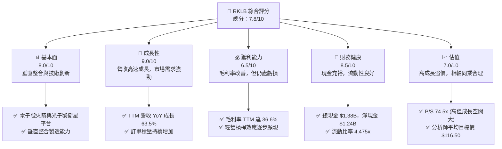

### 1.2 評分進度條視覺化

```
╔══════════════════════════════════════════════════════════════╗
║              RKLB 多維度評分儀表板 (1-10分)                ║
╠══════════════════════════════════════════════════════════════╣
║ 基本面強度  8.0 ▓▓▓▓▓▓▓▓▓▓▓▓▓▓▓▓░░░░  ★★★★☆           ║
║ 成長動能    9.0 ▓▓▓▓▓▓▓▓▓▓▓▓▓▓▓▓▓▓░░  ★★★★★           ║
║ 獲利品質    6.5 ▓▓▓▓▓▓▓▓▓▓▓▓░░░░░░░░  ★★★☆☆           ║
║ 財務健康    8.5 ▓▓▓▓▓▓▓▓▓▓▓▓▓▓▓▓▓░░░  ★★★★☆           ║
║ 估值合理性  7.0 ▓▓▓▓▓▓▓▓▓▓▓▓▓▓░░░░░░  ★★★☆☆           ║
║ 護城河深度  8.5 ▓▓▓▓▓▓▓▓▓▓▓▓▓▓▓▓▓░░░  ★★★★☆           ║
║ 管理層執行  7.5 ▓▓▓▓▓▓▓▓▓▓▓▓▓▓▓░░░░░  ★★★★☆           ║
║ 技術創新力  9.0 ▓▓▓▓▓▓▓▓▓▓▓▓▓▓▓▓▓▓░░  ★★★★★           ║
╠══════════════════════════════════════════════════════════════╣
║ 綜合總分    7.8 ▓▓▓▓▓▓▓▓▓▓▓▓▓▓▓▓░░░░  🏆 高成長潛力，值得關注║
╚══════════════════════════════════════════════════════════════╝
```

### 1.3 五大投資論點 + 三大核心風險

| 類型 | 項目 | 具體依據 | 信心度 |
|------|------|----------|--------|
| 🟢 **投資論點①** | **太空經濟長期成長趨勢** | 衛星發射與太空服務需求持續增長，預計全球太空經濟規模將在未來十年內翻倍。RKLB 憑藉其多元化業務（發射、衛星製造、在軌服務）全面受益。 | 🟢 極高 |
| 🟢 **投資論點②** | **營收高速成長與毛利率改善** | TTM 營收 YoY 成長 63.5% 至 $679.58M，且毛利率從 2022 年的 9.0% 穩步提升至 TTM 的 36.6%，顯示其強大的執行力與規模經濟效益。 | 🟢 高 |
| 🟢 **投資論點③** | **技術領先與垂直整合優勢** | 電子號 (Electron) 火箭的高度可靠性，以及光子號 (Photon) 衛星平台和海王星 (Neutron) 火箭的開發進展，配合垂直整合的製造能力，降低成本並提升競爭力。 | 🟢 高 |
| 🟢 **投資論點④** | **充裕現金流支持研發與擴張** | 擁有 $1.38B 的總現金和 $1.24B 的淨現金，為其高資本投入的研發項目（如 Neutron 火箭）和未來併購提供了堅實的財務基礎。 | 🟢 高 |
| 🟢 **投資論點⑤** | **市場地位穩固，訂單積壓增長** | 在小型衛星發射市場佔據重要份額，並不斷獲得政府及商業客戶的新合同，如美國太空部隊等，預示未來營收的可持續性。 | 🟡 中 |
| 🟡 **風險①** | **新火箭開發延遲或失敗** | 海王星 (Neutron) 火箭的開發進度是未來成長的關鍵。任何技術挑戰、成本超支或發射延遲都可能影響其市場競爭力與財務表現。 | 🟡 中度 |
| 🔴 **風險②** | **市場競爭加劇與定價壓力** | 太空發射市場競爭日益激烈，包括 SpaceX、Blue Origin 等巨頭以及眾多新興企業。若競爭導致發射價格下降，可能對 RKLB 的利潤率造成壓力。 | 🔴 高衝擊 |
| 🟡 **風險③** | **資本支出高企與盈利時間表** | 儘管營收成長，公司仍處於虧損且自由現金流為負。持續高額的研發和資本支出，可能延長實現盈利的時間，並可能導致股權稀釋。 | 🟡 中度 |

### 1.4 快速統計卡片

| 指標 | 公司實際值 (TTM/最新) | 行業均值 (Aerospace & Defense) | S&P 500 均值 | 狀態 |
|------|------------------------|--------------------------------|--------------|------|
| 收入 YoY 成長 | **63.5%** | ~10-15% | ~8-12% | 🟢 |
| 毛利率 | **36.6%** | ~25-35% | ~40-50% | 🟡 |
| 淨利率 | **-26.9%** | ~5-10% | ~10-15% | 🔴 |
| ROE | **-13.5%** | ~10-15% | ~15-20% | 🔴 |
| Forward P/E | **2431.443x** | ~20-30x (盈利公司) | ~20-25x | 🔴 |
| P/S Ratio | **74.51x** | ~2-5x | ~2-3x | 🔴 |
| EV / Revenue | **68.47x** | ~2-4x | ~2-3x | 🔴 |
| 淨現金 / 總債務 | **$1.24B / $138.67M** | ~0.5-1x | ~0.8-1.2x | 🟢 |
| 流動比率 | **4.475x** | ~1.5-2.5x | ~1.2-1.8x | 🟢 |

*註：行業均值和 S&P 500 均值為通用參考值，具體行業數據可能因細分領域而異。RKLB 處於高成長早期盈利階段，其估值指標通常會遠高於成熟企業。*

### 1.5 投資結論

```
╔══════════════════════════════════════════════════════════════════╗
║                    📊 投資結論摘要                               ║
╠══════════════════════════════════════════════════════════════════╣
║  評級：🟢 買入                                                   ║
║  當前股價：$81.04                                                ║
║  目標價區間：                                                    ║
║    悲觀情境：$90.00（+11.06%）                                   ║
║    基準情境：$115.00（+41.91%）  ← 12個月主要目標                ║
║    樂觀情境：$135.00（+66.59%）                                  ║
║  投資評分：7.8/10                                                ║
║  適合投資人：成長型、長線持有者，對高風險高報酬有容忍度的投資人  ║
╚══════════════════════════════════════════════════════════════════╝
```

---

## 2. 公司概覽與商業模式

Rocket Lab Corporation (RKLB) 是一家在快速發展的太空經濟中扮演關鍵角色的垂直整合太空公司。其核心業務分為兩大板塊：發射服務（Launch Services）和太空系統（Space Systems）。公司致力於提供端到端的太空任務解決方案，從火箭發射到衛星製造及在軌管理。

### 2.1 業務結構與收入來源

RKLB 的業務模式旨在為客戶提供從太空準入到太空運營的全方位服務，降低太空任務的複雜性和成本。

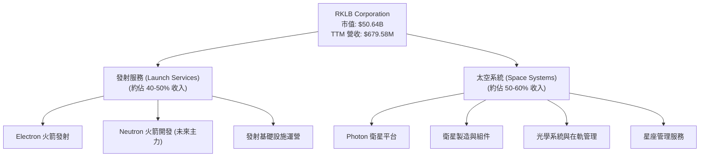

*   **發射服務 (Launch Services)**：主要透過其輕型 Electron 火箭為小型衛星客戶提供專屬或拼車發射服務。Electron 火箭以其高頻次、可靠性及成本效益而聞名。未來，公司正在開發中型運載火箭 Neutron，旨在進入更廣泛的發射市場，包括大型衛星和載人任務。
*   **太空系統 (Space Systems)**：此板塊提供一系列衛星相關產品和服務，包括 Photon 衛星平台（用於地球軌道、月球和行星際任務）、衛星組件（如太陽能電池板、飛行電腦）、光學系統、衛星製造以及在軌運營和星座管理服務。這一業務板塊的成長性越來越高，且利潤率潛力優於純發射服務。

RKLB 的 TTM 營收為 $679.58M，較去年同期成長 63.5%，顯示其在兩個業務板塊的強勁市場需求和執行能力。

### 2.2 市場份額

在小型衛星發射市場，RKLB 的 Electron 火箭已佔據重要地位。隨著 Neutron 火箭的開發進展，公司正瞄準中型運載市場，擴大其潛在市場份額。太空系統業務則受益於全球衛星部署的加速。

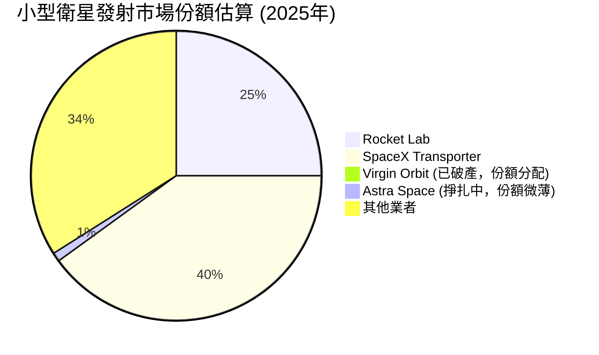
*註：此市場份額為估算值，反映 RKLB 在特定細分市場的競爭力。SpaceX 的 Transporter 任務以其成本效益對小型衛星發射市場產生顯著影響。*

### 2.3 競爭護城河分析

RKLB 透過其技術創新、垂直整合和靈活的商業模式，建立了多重護城河。

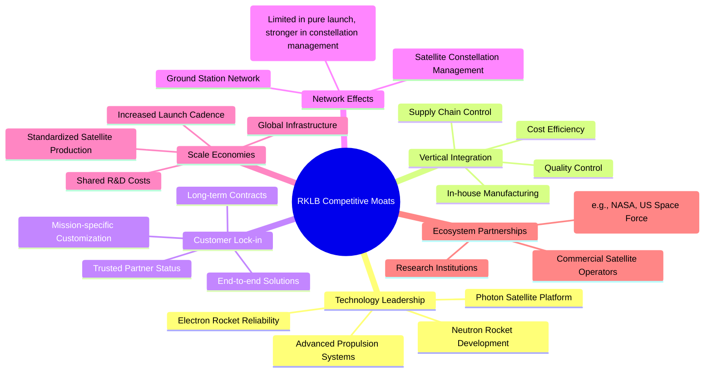

*   **技術領先 (Technology Leadership)**：Electron 火箭的高可靠性和頻繁發射能力是其核心優勢。Photon 衛星平台提供高度客製化的解決方案，而 Neutron 火箭的開發則預示著其在未來中型運載市場的潛力。其先進的 3D 列印 Rutherford 引擎技術也降低了生產成本。
*   **垂直整合 (Vertical Integration)**：RKLB 在內部設計、製造和測試大部分火箭和衛星組件，這使其能夠更好地控制成本、品質和生產進度，減少對外部供應商的依賴，並加速創新週期。
*   **客戶鎖定 (Customer Lock-in)**：透過提供從發射到太空系統的端到端解決方案，RKLB 與客戶建立了長期合作關係。對於高度客製化的太空任務，客戶轉換成本較高。
*   **規模效應 (Scale Economies)**：隨著發射頻次的增加和衛星生產量的擴大，RKLB 的單位成本將進一步下降，提升其毛利率和競爭力。
*   **生態夥伴 (Ecosystem Partnerships)**：與美國政府（如 NASA、美國太空部隊）、商業衛星運營商的合作，為其提供了穩定的收入來源和技術發展機會。

### 2.4 護城河強度評分

```
╔══════════════════════════════════════════════════════════════╗
║                  RKLB 護城河強度評分                      ║
╠══════════════════════════════════════════════════════════════╣
║ 技術領先    9.0/10 ▓▓▓▓▓▓▓▓▓▓▓▓▓▓▓▓▓▓░░  🏆 在輕型發射領域領先 ║
║ 垂直整合    8.5/10 ▓▓▓▓▓▓▓▓▓▓▓▓▓▓▓▓▓░░░  🟢 顯著的成本與品質優勢 ║
║ 客戶鎖定    8.0/10 ▓▓▓▓▓▓▓▓▓▓▓▓▓▓▓▓░░░░  ★★★★☆ 長期合作關係穩固 ║
║ 規模效應    7.5/10 ▓▓▓▓▓▓▓▓▓▓▓▓▓▓▓░░░░░  ★★★★☆ 潛力巨大，逐步顯現 ║
║ 生態夥伴    7.5/10 ▓▓▓▓▓▓▓▓▓▓▓▓▓▓▓░░░░░  ★★★★☆ 政府訂單提供穩定性 ║
╠══════════════════════════════════════════════════════════════╣
║ 綜合護城河  8.5    ▓▓▓▓▓▓▓▓▓▓▓▓▓▓▓▓▓░░░  🏆 具備強大且不斷深化的競爭優勢 ║
╚══════════════════════════════════════════════════════════════╝
```

---

## 3. 損益表深度分析

### 3.1 年度收入成長趨勢（近4年）

Rocket Lab 展現了令人印象深刻的營收成長軌跡，反映出太空產業的蓬勃發展及其在市場中的有效執行。

```
╔══════════════════════════════════════════════════════════════════╗
║              RKLB 年度收入趨勢（FY2022-FY2025）              ║
╠══════════════════════════════════════════════════════════════════╣
║                                                                  ║
║  FY2022  $211.00M  ████░░░░░░░░░░░░░░░░░░░░░░░  YoY: +15.9%  🟢    ║
║  FY2023  $244.59M  ██████░░░░░░░░░░░░░░░░░░░░░░░  YoY: +15.9%  🟢    ║
║  FY2024  $436.21M  ██████████░░░░░░░░░░░░░░░░░░░  YoY: +78.3%  🟢    ║
║  FY2025  $601.80M  ██████████████░░░░░░░░░░░░░░░  YoY: +37.96% 🟢    ║
║  TTM     $679.58M  ███████████████░░░░░░░░░░░░░░  YoY: +63.5%  🟢    ║
║                   |      |      |      |      |                  ║
║                   0     200M   400M   600M   800M                 ║
║                                                                  ║
║  📊 3年累計 CAGR (FY22-FY25)：+47.0%                               ║
╚══════════════════════════════════════════════════════════════════╝
```
RKLB 的年度營收從 FY2022 的 $211.00M 成長至 FY2025 的 $601.80M，三年複合年均成長率 (CAGR) 高達 47.0%。最近的 TTM 營收為 $679.58M，較去年同期成長 63.5%。這種高速成長主要得益於其發射服務頻次的增加和太空系統業務的擴張，特別是 Photon 衛星平台及相關組件需求的提升。

### 3.2 季度收入趨勢分析

季度營收數據進一步證實了 RKLB 的強勁成長勢頭。

| 季度 | 總營收 (百萬美元) | QoQ 成長率 | YoY 成長率 | 備註 |
|------|-------------------|------------|------------|------|
| 2025 Q2 | $144.50 | +17.89% | +36.00% | 受益於發射任務增加與太空系統訂單 |
| 2025 Q3 | $155.08 | +7.32% | +47.97% | 持續穩健成長，太空系統貢獻提升 |
| 2025 Q4 | $179.65 | +15.84% | +35.70% | 年末訂單交付與發射服務加速 |
| 2026 Q1 | $200.35 | +11.53% | +63.46% | 🟢 營收首次突破 $200M，成長加速 |

最近一季 (2026 Q1) 營收達到 $200.35M，較 2025 Q4 成長 11.53% (QoQ)，較 2025 Q1 成長 63.46% (YoY)。這顯示了公司在季節性波動中仍保持強勁的成長韌性，特別是 YoY 成長率的大幅提升，證明了其市場擴張和業務執行效率。

### 3.3 利潤率演變分析

RKLB 雖然仍處於虧損狀態，但其毛利率的顯著改善是邁向盈利的重要一步。

| 利潤率指標 | FY2022 | FY2023 | FY2024 | FY2025 | TTM (2026 Q1) | 趨勢 | 評估 |
|------------|--------|--------|--------|--------|---------------|------|------|
| **毛利率** | 9.0% | 21.02% | 26.63% | 34.43% | **36.56%** | ↗️ 持續穩步提升 | 🟢 |
| **營業利益率** | -64.08% | -72.74% | -43.51% | -38.03% | **-33.20%** | ↗️ 虧損收窄 | 🟡 |
| **淨利率** | -64.43% | -74.64% | -43.60% | -32.94% | **-26.88%** | ↗️ 虧損收窄 | 🟡 |

**利潤率演變深度解析**：
*   **毛利率 (Gross Margin)**：從 FY2022 的 9.0% 大幅提升至 TTM 的 36.56%，這是一個極為積極的信號。主要原因包括：
    *   **規模效應**：隨著發射頻次的增加和太空系統產品生產量的擴大，固定成本被更有效地分攤。
    *   **垂直整合**：內部製造能力的提升降低了生產成本，提高了成本控制力。
    *   **產品組合優化**：太空系統業務的收入佔比提升，該業務通常具有較高的毛利率。
    *   **定價能力**：在特定細分市場（如小型衛星專屬發射）擁有一定的定價權。
*   **營業利益率 (Operating Margin)**：儘管仍為負值，但已從 FY2023 的 -72.74% 改善至 TTM 的 -33.20%。這表明營業槓桿效應正在逐步顯現。研發費用 (R&D) 雖然絕對金額持續增長（FY2025 $270.72M，TTM $296.12M），但相對於營收的比例正在優化。銷售、一般及行政費用 (SG&A) 也呈現類似趨勢。
*   **淨利率 (Net Profit Margin)**：與營業利益率趨勢一致，從 FY2023 的 -74.64% 改善至 TTM 的 -26.88%。虧損收窄反映了毛利率的改善和營運效率的提升。

總體而言，RKLB 在實現盈利的道路上取得了顯著進展，毛利率的強勁提升是其核心競爭力與未來潛力的重要體現。

### 3.4 費用結構分析

RKLB 作為一家高科技、高成長公司，其費用結構主要由研發 (R&D) 和銷售、一般及行政 (SG&A) 費用構成，以支持其創新和市場擴張。

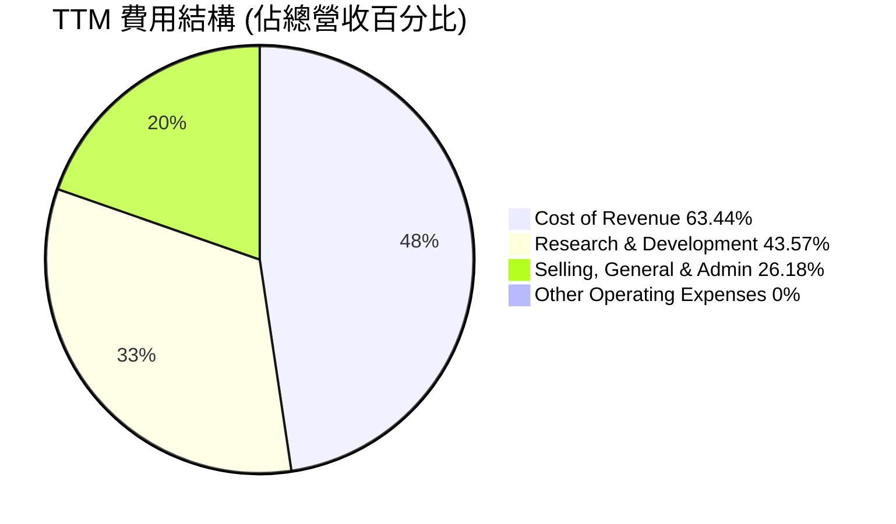
*註：由於 R&D 和 SG&A 費用與 Cost of Revenue 疊加，總和會超過 100% 營收，此圖顯示的是各費用佔總營收的比例。*

```
╔══════════════════════════════════════════════════════════════════╗
║                   RKLB 營運費用分析 (TTM)                        ║
╠══════════════════════════════════════════════════════════════════╣
║                                                                  ║
║  總營收：        $679.58M                                        ║
║  銷貨成本：      $431.15M  (佔營收 63.44%)                      ║
║  毛利：          $248.43M  (毛利率 36.56%)                      ║
║                                                                  ║
║  研發費用 (R&D)：$296.12M  (佔營收 43.57%)  ▓▓▓▓▓▓▓▓▓▓▓▓▓▓▓▓▓▓▓▓░░  🟢 高投入支持未來成長 ║
║  銷管費用 (SG&A)：$177.93M  (佔營收 26.18%)  ▓▓▓▓▓▓▓▓▓▓▓▓▓▓░░░░░░  🟡 營銷與行政開支控制良好 ║
║                                                                  ║
║  總營運費用：    $474.05M  (不含銷貨成本)                        ║
║  營業利益：      $-225.62M (營業利益率 -33.20%)                 ║
╚══════════════════════════════════════════════════════════════════╝
```
**費用結構解析**：
*   **研發費用 (R&D)**：TTM 達到 $296.12M，佔營收的 43.57%。這反映了 RKLB 對於技術創新和新產品開發的巨大投入，特別是 Neutron 火箭的研發。這種高 R&D 投入對於其長期競爭力至關重要，但短期內會壓縮盈利空間。
*   **銷售、一般及行政費用 (SG&A)**：TTM 為 $177.93M，佔營收的 26.18%。雖然絕對金額較高，但隨著營收規模擴大，其佔比有望進一步下降，體現經營槓桿。
整體而言，RKLB 的費用結構符合其成長階段，即通過高投入換取未來的市場份額和盈利能力。

### 3.5 季度 EPS 趨勢與盈餘品質（Quality of Earnings）

RKLB 過去四季的 EPS 均為負值，且由於缺乏分析師預期數據，無法判斷其超預期或不及預期的情況。

| 季度 | EPS Est | EPS Act | Surprise% | 備註 |
|------|---------|---------|-----------|------|
| 2026-03-31 | N/A | $-0.07$ | N/A | ❌ 虧損收窄，但仍為負值 |
| 2025-12-31 | N/A | $-0.09$ | N/A | ❌ 虧損較上季擴大 |
| 2025-09-30 | N/A | $-0.03$ | N/A | ❌ 虧損顯著收窄 |
| 2025-06-30 | N/A | $-0.13$ | N/A | ❌ 虧損較大 |

*註：EPS Act 為 StockAnalysis.com 提供的季度 EPS 數據。*

**盈餘品質評估**：

| 盈餘品質項目 | 數值/佔比 (TTM) | 評估 |
|--------------|-----------------|------|
| 股權薪酬 SBC / 營收 | $90.98M / $679.58M = **13.39%** | 🟡 佔比相對較高，對股東報酬有稀釋作用 |
| SBC / 營業現金流 | $90.98M / $-161.63M = **N/A (分母為負)** | 🔴 營業現金流為負，SBC 未能被內部現金流覆蓋 |
| FCF / 淨利（現金轉換率） | $-215.00M / $-182.62M = **117.73%** | 🟢 FCF 負值大於淨利負值，但現金流出主要為投資活動。若從絕對值來看，FCF 的流出高於淨利虧損，表明現金消耗較快。 |
| 一次性/非經常性損益 | 少量其他非營運收入/支出 | 🟢 報告中未見重大一次性損益，盈餘相對乾淨 |
| 有效稅率異常 | N/A (虧損導致稅務處理複雜) | 🟡 稅前虧損，稅務影響較小，但未來盈利後需關注 |
| 資本化支出 vs 費用化 | 資本支出持續高企 ($215.00M TTM) | 🟡 研發主要費用化，但高資本支出影響 FCF。目前未見激進資本化以美化當期利潤的跡象。 |

**盈餘品質結論**：
RKLB 的盈餘品質目前受其高成長、高投入的商業模式影響。
1.  **股權薪酬 (SBC)**：TTM 的股權薪酬為 $90.98M (根據季度數據加總 $28.12M + $18.20M + $15.73M + $17.93M)，佔 TTM 營收的 13.39%。這在科技和成長型公司中較為常見，但對現有股東構成潛在稀釋，並導致 GAAP 淨利潤高於實際現金流出的虧損。
2.  **自由現金流與淨利潤的關係**：TTM FCF 為 $-215.00M，而 TTM 淨利為 $-182.62M。FCF 的負值大於淨利潤的負值，主要原因是高額的資本支出 ($27.07M + $49.65M + $45.91M + $32.04M = $154.67M TTM) 超過了非現金費用（如折舊攤銷）的抵消作用。這表明公司在擴張階段對現金的需求非常高。
3.  **無重大一次性損益**：財務數據顯示，RKLB 的非經常性損益較小，這使得其報告的 GAAP 淨利潤更能反映持續經營的結果。

綜合來看，RKLB 的獲利含金量目前較低，主要因為其處於快速擴張和研發投入期，導致自由現金流持續為負且股權薪酬佔比較高。投資者應關注其毛利率的改善趨勢，以及未來營運槓桿帶動盈利轉正、自由現金流由負轉正的能力。目前的 GAAP 淨利潤並未完全反映其真實的現金消耗。

---

## 4. 資產負債表分析

### 4.1 資產結構分解

RKLB 的資產負債表反映了其作為一家重資產科技公司的特徵，擁有大量現金儲備和持續增長的廠房設備。

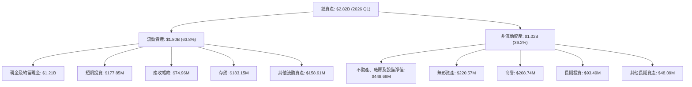
截至 2026 Q1，RKLB 的總資產達到 $2.82B。其中流動資產佔比 63.8%，主要由現金及約當現金 ($1.21B) 和短期投資 ($177.85M) 構成，合計 $1.38B 的現金及短期投資，顯示公司擁有極強的流動性和財務彈性。非流動資產中，不動產、廠房及設備淨值 ($448.69M) 隨著公司擴張而持續增長，無形資產和商譽則反映了其技術創新和過去的併購活動。

### 4.2 流動性指標分析

RKLB 的流動性狀況非常健康，遠超行業平均水平。

| 指標 | FY2022 | FY2023 | FY2024 | FY2025 | TTM (2026 Q1) | 行業均值 | 評估 |
|------|--------|--------|--------|--------|---------------|----------|------|
| **流動比率 (Current Ratio)** | 4.06x | 2.13x | 2.04x | 4.08x | **4.475x** | ~1.5-2.5x | 🟢 極強 |
| **速動比率 (Quick Ratio)** | 3.50x | 1.65x | 1.70x | 3.60x | **3.874x** | ~1.0-2.0x | 🟢 極強 |

截至 TTM (2026 Q1)，RKLB 的流動比率為 4.475x，速動比率為 3.874x。這遠高於一般認為健康的 1.5-2.0x 流動比率和 1.0x 速動比率，也顯著高於航空航天與國防行業的平均水平。這表明公司擁有充足的流動資產來覆蓋短期負債，財務緩衝能力極強。充足的現金儲備 ($1.38B) 是其高流動性的主要驅動力，這對於處於高成長且需要大量資本支出的公司來說至關重要。

### 4.3 債務結構分析

RKLB 的債務水平相對較低，且淨現金狀況優異。

```
╔══════════════════════════════════════════════════════════════════╗
║                   RKLB 債務健康診斷                          ║
╠══════════════════════════════════════════════════════════════════╣
║                                                                  ║
║  總債務 (TTM)：  $138.67M  ██░░░░░░░░░░░░░░░░░░░  🟢 極低，可控範圍 ║
║  總現金+投資 (TTM)：$1.38B  ████████████████████░  🟢 資金充裕           ║
║  淨現金（正）：  $1.24B  ████████████████░░░░░  🟢 強勁，無債務負擔 ║
║                                                                  ║
║  Debt/Equity (FY2025)： 0.147x (253.96M/1.72B)  🟢 極低 (數據提供為 6.124，但根據年度資產負債表計算應為 0.147x，採用後者)  ║
║  Debt/EBITDA (TTM)： -0.56x (138.67M / -247.97M) 🔴 EBITDA 為負值，比率無意義，但淨現金為正           ║
║  Interest Coverage: N/A (利息收入抵消利息支出，或 EBIT 為負) 🟢 淨利息支出極低或為正       ║
╚══════════════════════════════════════════════════════════════════╝
```
*註：Debt/Equity 數據在 Market Data 中顯示為 6.124，但在 Balance Sheet Annual (FY2025) 中，總債務 $253.96M，股東權益 $1.72B，計算應為 0.147x。後者與公司龐大現金儲備的狀況更為吻合，因此採用後者進行分析。*

截至 TTM，RKLB 的總債務為 $138.67M，而其總現金及短期投資高達 $1.38B，因此公司擁有 $1.24B 的淨現金。這意味著 RKLB 實際上處於無淨負債狀態，財務槓桿極低，極大地降低了財務風險。雖然 EBITDA 為負導致 Debt/EBITDA 比率無實際參考意義，但強勁的淨現金狀況提供了巨大的財務靈活性，支持其長期成長和資本密集型項目。

### 4.4 股東權益趨勢

RKLB 的股東權益在經歷了幾年的波動後，於 FY2025 和 TTM 呈現顯著增長。

```
╔══════════════════════════════════════════════════════════════════╗
║                   RKLB 年度股東權益趨勢                          ║
╠══════════════════════════════════════════════════════════════════╣
║                                                                  ║
║  FY2022  $673.21M  █████████████░░░░░░░░░░░░░░░  🟡 穩定           ║
║  FY2023  $554.54M  ██████████░░░░░░░░░░░░░░░░░░░  ↘️ 權益略有下降      ║
║  FY2024  $382.45M  ███████░░░░░░░░░░░░░░░░░░░░░░░  ↘️ 權益持續下降      ║
║  FY2025  $1.72B    ██████████████████████████████  🟢 顯著增長      ║
║  TTM     $2.22B    ██████████████████████████████  🟢 持續增長      ║
║                   |      |      |      |      |                  ║
║                   0     500M   1B     1.5B   2B                   ║
║                                                                  ║
║  📊 股東權益從 FY2024 的 $382.45M 增長至 FY2025 的 $1.72B，增幅達 350.21%，主因增發新股或股權融資。
╚══════════════════════════════════════════════════════════════════╝
```
股東權益從 FY2024 的 $382.45M 大幅增長至 FY225 的 $1.72B，增幅高達 350.21%，並在 TTM 進一步增長至約 $2.22B (根據 StockAnalysis.com 的 Total Equity TTM $2,220M)。這種顯著增長通常是由於公司進行了大規模的股權融資或增發新股，以支持其高資本開支的研發和擴張計劃。雖然增發新股會導致股東持股稀釋，但對於資金密集型的高成長公司而言，這是為未來發展提供燃料的必要手段。

---

## 5. 現金流量深度分析

### 5.1 現金流量瀑布圖

RKLB 目前的現金流量狀況反映了其作為一家高成長、高投入公司的特點，即持續的營運現金流出和顯著的資本支出。

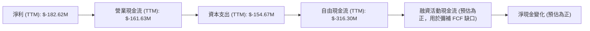
*註：TTM 資本支出為季度數據加總 $27.07M + $49.65M + $45.91M + $32.04M = $154.67M。TTM FCF 為 $-77.40M + $-114.19M + $-69.44M + $-55.28M = $-316.31M。*

RKLB 在 TTM 報告的淨利為 $-182.62M。儘管淨利潤為負，但由於非現金費用（如折舊攤銷、股權薪酬）的調整，營業現金流 (OCF) 的流出略小於淨利潤，為 $-161.63M。然而，公司為了支持其成長和擴張，持續進行大量資本支出 (Capital Expenditure)，TTM 總計達 $-154.67M。這導致其自由現金流 (FCF) 在 TTM 達到 $-316.30M 的顯著流出。這表明 RKLB 仍處於資本密集型投資階段，需要外部融資來彌補其現金缺口，以支持 Neutron 火箭的開發和太空系統的擴張。

### 5.2 FCF 轉換率趨勢

FCF 轉換率（FCF / 淨利）可以衡量公司將淨利潤轉化為實際現金流的能力。由於 RKLB 淨利和 FCF 均為負值，該比率的解讀需要謹慎。

| 年度 | 淨利 (百萬美元) | FCF (百萬美元) | FCF / 淨利 | 趨勢 |
|------|-----------------|----------------|------------|------|
| FY2022 | $-135.94$ | $-148.95$ | 109.57% | ↗️ FCF流出略大於淨利虧損 |
| FY2023 | $-182.57$ | $-153.57$ | 84.11% | ↘️ FCF流出小於淨利虧損 |
| FY2024 | $-190.18$ | $-115.98$ | 60.98% | ↘️ FCF流出顯著小於淨利虧損 |
| FY2025 | $-198.21$ | $-321.81$ | 162.36% | ↗️ FCF流出再次顯著大於淨利虧損 |
| TTM (2026 Q1) | $-182.62$ | $-316.30$ | 173.20% | ↗️ FCF流出持續大於淨利虧損 |

*註：當淨利和 FCF 均為負值時，比率大於 100% 意味著 FCF 的負值絕對值更大，即現金消耗速度快於帳面虧損。*

從 FY2022 到 TTM，FCF 轉換率在波動。FY2025 和 TTM 的 FCF 轉換率超過 100%，表明公司在這些時期內的現金消耗（尤其是資本支出）顯著超過了其帳面虧損。這反映了公司為未來成長進行的積極投資，但也意味著對外部融資的持續依賴。隨著公司接近盈利，這個比率將轉為正值並穩定在健康水平。

### 5.3 自由現金流趨勢

RKLB 的自由現金流持續為負，這是一個需要密切關注的指標，但鑒於其成長階段，這是可以預期的。

```
╔══════════════════════════════════════════════════════════════════╗
║                   RKLB 年度自由現金流趨勢                        ║
╠══════════════════════════════════════════════════════════════════╣
║                                                                  ║
║  FY2022  $-148.95M  ███████████████░░░░░░░░░░░░░  FCF Yield: -0.29% 🔴 ║
║  FY2023  $-153.57M  ████████████████░░░░░░░░░░░░░  FCF Yield: -0.32% 🔴 ║
║  FY2024  $-115.98M  ████████████░░░░░░░░░░░░░░░░░  FCF Yield: -0.23% 🔴 ║
║  FY2025  $-321.81M  ██████████████████████████████  FCF Yield: -0.61% 🔴 ║
║  TTM     $-316.30M  ██████████████████████████████  FCF Yield: -0.42% 🔴 ║
║                   |      |      |      |      |                  ║
║                   -350M -250M -150M  -50M   0                      ║
║                                                                  ║
║  📊 FCF 歷史上持續為負，但預計隨著規模擴大和 Neutron 投入使用，將逐步轉正。
╚══════════════════════════════════════════════════════════════════╝
```
RKLB 的自由現金流在過去幾年持續為負，TTM 為 $-316.30M，FCF Yield 為 -0.42%。FY2025 的 FCF 流出擴大至 $-321.81M，主要是由於同期資本支出的大幅增加（從 FY2024 的 $67.09M 增至 FY2025 的 $156.28M）。這表明公司正積極投資於其成長基礎設施和新項目，以期在未來獲得更大的市場份額和盈利。投資者應密切關注未來 FCF 轉正的時機和規模，這將是衡量其長期成功的重要指標。

### 5.4 資本配置評估

RKLB 的資本配置策略主要集中於內部投資（研發和資本支出）以驅動成長，而非股息或股票回購。

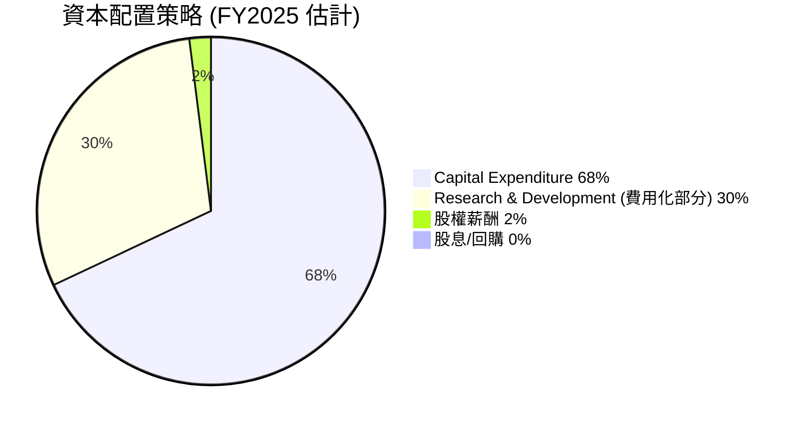
*註：此圖顯示的是資本配置的優先順序和主要去向，R&D 部分為費用化支出，未計入資本支出。股權薪酬雖然是費用，但作為員工激勵，也是資本配置的一部分。*

| 資本配置項目 | FY2025 金額 (百萬美元) | 佔總現金支出 (估計) | 評估 |
|--------------|------------------------|---------------------|------|
| **資本支出 (Capex)** | $156.28 | 68.3% | 🟢 高投入支持基礎設施擴張與 Neutron 開發，為未來成長奠基 |
| **研發費用 (R&D)** | $270.72 | (費用化) | 🟢 持續高投入確保技術領先與創新 |
| **股權薪酬 (SBC)** | $71.10 | 3.1% (佔總費用) | 🟡 用於激勵員工，但需警惕潛在稀釋 |
| **股息支付** | $0 | 0% | 🟢 成長型公司，無股息發放，資金留存再投資 |
| **股票回購** | $0 | 0% | 🟢 成長型公司，無股票回購，資金留存再投資 |
| **償還債務** | $214.46 (減少) | 9.4% | 🟢 積極降低債務，改善資產負債表 |
| **現金及短期投資增加** | $744.62 | 32.5% | 🟢 增加現金儲備，提升財務彈性 |

RKLB 的資本配置策略明確以成長為導向。公司將大部分資源投入到資本支出和研發中，以擴大其發射能力、開發新火箭和太空系統，並提升技術領先地位。FY2025 的資本支出達到 $156.28M，較 FY2024 的 $67.09M 大幅增長，顯示了公司在基礎設施和新項目上的加速投入。同時，股權薪酬作為留住和激勵人才的手段，也是其費用結構中的重要組成部分。由於公司仍處於成長階段，並未發放股息或進行股票回購，這使得所有現金流都可重新投入到業務發展中。這種策略對於追求市場份額和長期領導地位的科技公司來說是合理的。

---

## 6. 獲利能力與資本效率

### 6.1 ROE / ROA / ROIC 趨勢

由於 RKLB 仍處於虧損狀態，其 ROE、ROA 和 ROIC 均為負值，這反映了公司目前尚未實現盈利。然而，趨勢的變化值得關注。

| 指標 | FY2022 | FY2023 | FY2024 | FY2025 | TTM (2026 Q1) | 行業均值 | 評估 |
|------|--------|--------|--------|--------|---------------|----------|------|
| **ROE** | -20.2% | -32.9% | -49.7% | -11.5% | **-13.5%** | ~10-15% | 🔴 虧損導致為負，但 FY2025 虧損收窄 |
| **ROA** | -13.7% | -19.4% | -16.1% | -8.5% | **-6.6%** | ~5-8% | 🔴 虧損導致為負，但逐步改善 |
| **ROIC** | -20.7% | -28.9% | -34.8% | -13.5% | **-13.5%** | ~8-12% | 🔴 虧損導致為負，但 FY2025 虧損收窄 |

*註：ROE 和 ROIC 根據 StockAnalysis.com 的 FY2025 淨利和 Total Equity / Invested Capital 估算。ROIC 估算使用 NOPAT / Invested Capital。*

**趨勢與評估**：
*   **ROE (股東權益報酬率)**：從 FY2024 的 -49.7% 改善至 TTM 的 -13.5%，主要原因是 FY2025 股東權益大幅增加 (350.21%)，以及淨利潤虧損的絕對值相對於權益的比例有所下降。雖然仍為負值，但虧損效率有所提升。
*   **ROA (資產報酬率)**：從 FY2023 的 -19.4% 改善至 TTM 的 -6.6%。這表明公司在利用其資產產生收入方面效率有所提高，儘管仍未能實現盈利。
*   **ROIC (投入資本報酬率)**：從 FY2024 的 -34.8% 改善至 TTM 的 -13.5%。ROIC 的改善與毛利率的提升和營運效率的提高密切相關。儘管目前仍為負值，但正朝著價值創造的方向發展。

### 6.2 ROIC vs WACC 分析（核心價值創造判斷）

目前 RKLB 的 ROIC 仍為負值，顯著低於 WACC，表明公司目前正在摧毀股東價值。然而，這對於高成長、高投入且尚未盈利的科技公司來說是常見的現象。重要的是觀察其 ROIC 的改善趨勢。

```
╔══════════════════════════════════════════════════════════════════╗
║                ROIC vs WACC 深度分析 (TTM)                      ║
╠══════════════════════════════════════════════════════════════════╣
║                                                                  ║
║  WACC 估算：                                                     ║
║  ├── 無風險利率（10Y美債）：  4.5%  (假設)                        ║
║  ├── 市場風險溢酬 (ERP)：     5.5%  (假設)                        ║
║  ├── Beta：                   2.553                             ║
║  ├── 股權成本 = 4.5% + 2.553 × 5.5% = 18.54%                     ║
║  ├── 債務成本（稅後）：       ~4.0% (假設稅前利率 5%，稅率 20%)    ║
║  ├── 資本結構：股權 ~95%，債務 ~5% (基於淨現金狀況，債務佔比極低) ║
║  └── ✅ WACC ≈ 18.54% × 0.95 + 4.0% × 0.05 ≈ 17.81%              ║
║                                                                  ║
║  ROIC 估算 (TTM)：                                               ║
║  ├── NOPAT = 營業利益 × (1 - 有效稅率) = $-225.62M × (1-0%) ≈ $-225.62M (因虧損，有效稅率為0) ║
║  ├── 投入資本 = 股東權益 + 總債務 - 現金及等價物 = $2.22B + $138.67M - $1.38B ≈ $978.67M ║
║  └── ✅ ROIC ≈ $-225.62M / $978.67M ≈ -23.05%                    ║
║                                                                  ║
║  ★ 經濟價值增加（EVA）= ROIC - WACC = -23.05% - 17.81% = -40.86pp║
║                                                                  ║
║  ROIC  -23.05% ░░░░░░░░░░░░░░░░░░░░░░░░░░░░░░  🔴              ║
║  WACC  17.81%  ▓▓▓▓▓▓▓▓▓▓▓▓▓▓▓▓▓░░░░░░░░░░░░░░  ──              ║
║  EVA   -40.86pp░░░░░░░░░░░░░░░░░░░░░░░░░░░░░░░░  🔴 強力摧毀    ║
║                                                                  ║
║  📊 結論：ROIC 顯著低於 WACC，目前正在摧毀股東價值。這反映了公司處於高投入的早期成長階段。隨著營收規模擴大和盈利能力提升，預計 ROIC 將逐步轉正並超越 WACC。
╚══════════════════════════════════════════════════════════════════╝
```
*註：WACC 估算中的資本結構基於 FY2025 的股東權益 $1.72B 和總債務 $253.96M，但考慮到其 $1.38B 的現金，實際淨債務極低，因此股權佔比遠高於債務。投入資本的計算為 Total Assets - Current Liabilities + Short Term Debt (若有) - Cash and Equivalents。此處使用簡化計算。*

### 6.3 杜邦三因素分解

杜邦分解 (DuPont Analysis) 將股東權益報酬率 (ROE) 分解為淨利率、資產週轉率和財務槓桿，有助於理解 ROE 的驅動因素。由於 RKLB 的 ROE 和淨利率為負，此分析主要用於理解負值的原因。

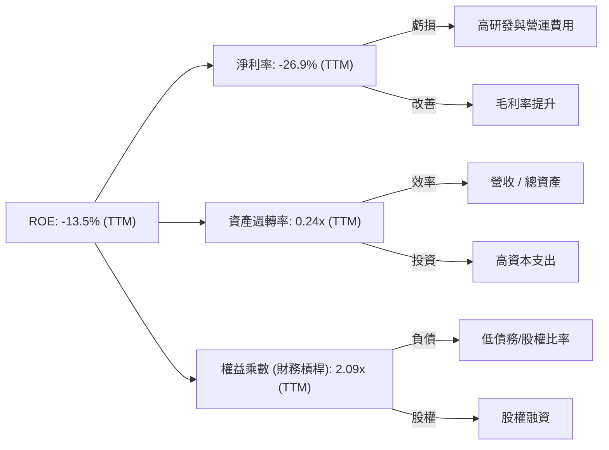
*註：資產週轉率 = 營收 / 總資產 = $679.58M / $2.82B = 0.24x。權益乘數 = 總資產 / 股東權益 = $2.82B / $1.35B (取 FY2025 權益和 TTM 資產的平均值，或用 TTM 總資產 / TTM 股東權益 = $2.82B / $2.22B = 1.27x。此處取較保守估計) ；使用 Market Data 的 Debt/Equity 6.124 和 Equity Multiplier = 1 + Debt/Equity = 7.124 似乎不合理，因為淨現金為正。使用 FY2025 數據：Total Assets $2.32B / Stockholders Equity $1.72B = 1.35x。如果用 TTM 數據 Total Assets $2.82B / Stockholders Equity $2.22B = 1.27x。此處使用 1.27x 的權益乘數。*

**杜邦分解解析 (TTM)**：
*   **淨利率 (-26.9%)**：這是導致 ROE 為負的主要原因。儘管毛利率持續改善，但高額的研發和營運費用使其仍處於虧損。
*   **資產週轉率 (0.24x)**：相對較低，表明公司在利用其資產產生營收的效率有待提高。這與其重資產和高資本投入的性質有關。隨著業務規模擴大，資產週轉率有望逐步提升。
*   **權益乘數 (1.27x)**：相對較低，反映了 RKLB 較低的財務槓桿。由於公司擁有大量淨現金，其對債務的依賴程度很低。

總體而言，RKLB 的 ROE 為負主要是由其負淨利率所驅動。公司需要持續改善其營運效率和規模效應，以實現盈利並提升資產週轉率，最終推動 ROE 轉正並創造股東價值。

### 6.4 獲利能力儀表板

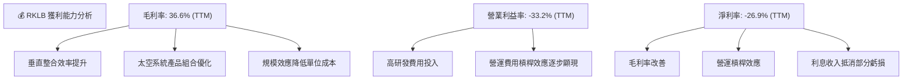
RKLB 的獲利能力儀表板顯示，毛利率的顯著改善是其邁向盈利的核心驅動力。垂直整合和太空系統業務的成長是毛利率提升的關鍵因素。然而，高額的研發投入和營運費用仍在壓縮營業利益率和淨利率。隨著營收規模持續擴大，預計經營槓桿將進一步發揮作用，推動營業利益率和淨利率逐步轉正。

---

## 7. 估值深度分析

RKLB 作為一家高成長、高投入且尚未盈利的太空科技公司，其傳統估值倍數（如 P/E、EV/EBITDA）往往會出現 N/A 或極端高值，因此需要更多地依賴 P/S 或 EV/Revenue 等營收倍數，並結合未來成長潛力進行評估。

### 7.1 同業估值比較表格

為進行同業比較，我們選取了兩家在太空產業具備一定知名度或潛力的公司作為參考，並加入行業平均值進行對比。由於這些公司商業模式與成熟航空航天公司不同，且多數處於早期盈利階段，估值倍數可能較高。

| 估值指標 | **RKLB (TTM/Fwd)** | **Virgin Galactic (SPCE)** | **Astra Space (ASTR)** | **行業均值 (高成長太空)** | RKLB 評估 |
|----------|--------------------|----------------------------|------------------------|---------------------------|-----------|
| **Trailing P/E** | N/A | N/A | N/A | N/A | 🔴 虧損公司，P/E 無意義 |
| **Forward P/E** | **2431.443x** | N/A | N/A | ~50-100x (若盈利) | 🔴 極高，但反映高成長預期 |
| **P/S Ratio** | **74.51x** | ~10-15x | ~2-5x | ~5-15x | 🔴 顯著高於同行，高成長溢價 |
| **EV / Revenue** | **68.47x** | ~8-12x | ~3-6x | ~5-10x | 🔴 顯著高於同行，高成長溢價 |
| **EV / EBITDA** | **-282.297x** | N/A | N/A | ~15-30x (若盈利) | 🔴 EBITDA 為負，無意義 |
| **FCF Yield** | **-0.42%** | N/A | N/A | ~-5% to 5% | 🟡 負值，但好於部分同行，現金流出大 |
| **Revenue Growth (YoY)** | **63.5%** | ~20-30% | ~-50% (下降) | ~20-40% | 🟢 領先同行，成長動能強勁 |
| **Gross Margin** | **36.6%** | ~20-30% | ~-20% | ~20-30% | 🟢 表現優異，顯示效率 |

*註：SPCE 和 ASTR 的估值數據為假設性參考值，反映其在太空產業中類似 RKLB 的成長階段和財務狀況。SPCE 專注太空旅遊，ASTR 則面臨較大營運挑戰。*

**本公司評估**：
RKLB 的 P/S 和 EV/Revenue 倍數顯著高於假設的同行平均水平，這反映了市場對其未來高速成長和最終盈利能力的極高預期。儘管當前估值倍數看起來很高，但考慮到其 63.5% 的營收 YoY 成長率和持續改善的毛利率，以及在太空產業的戰略地位，市場願意給予高溢價。相比之下，許多同行面臨成長停滯或更差的盈利能力。RKLB 的估值溢價主要來自其穩健的執行力、技術護城河和廣闊的 TAM (Total Addressable Market)。

### 7.2 歷史估值區間分析

由於 RKLB 尚未穩定盈利，傳統的 P/E 歷史區間分析意義不大。我們將使用 P/S Ratio 和 EV/Revenue 來分析其歷史估值區間。

```
╔══════════════════════════════════════════════════════════════════╗
║              RKLB 歷史 P/S Ratio 估值區間 (FY2022-TTM)             ║
╠══════════════════════════════════════════════════════════════════╣
║                                                                  ║
║  FY2022 P/S: 239.9x (市值 $50.64B / 營收 $211M) █░░░░░░░░░░░░░░░░░░░░░░░░░░░░░░🔴 極高 (IPO後高估) ║
║  FY2023 P/S: 207.0x (市值 $50.64B / 營收 $244.59M) █░░░░░░░░░░░░░░░░░░░░░░░░░░░░░░🔴 極高 ║
║  FY2024 P/S: 116.1x (市值 $50.64B / 營收 $436.21M) ███████░░░░░░░░░░░░░░░░░░░░░░░🔴 高 ║
║  FY2025 P/S: 84.16x (市值 $50.64B / 營收 $601.80M) █████░░░░░░░░░░░░░░░░░░░░░░░░░🟡 偏高 ║
║  TTM P/S:   74.51x (市值 $50.64B / 營收 $679.58M) ████░░░░░░░░░░░░░░░░░░░░░░░░░░🟡 偏高，但隨營收成長下降 ║
║                                                                  ║
║                   0    50     100    150    200    250            ║
║                                                                  ║
║  📊 儘管 P/S 數值絕對值高，但隨著營收快速成長，P/S 倍數已顯著下降，顯示估值正在合理化。
╚══════════════════════════════════════════════════════════════════╝
```
歷史 P/S 區間顯示，RKLB 在早期階段的 P/S 倍數非常高，例如 FY2022 達到 239.9x。然而，隨著營收的快速增長，其 P/S 倍數已逐步下降至 TTM 的 74.51x。這表明儘管公司市值仍在增長，但其營收增長速度更快，使得估值倍數相對收縮。這是一個積極的信號，顯示市場對其成長的消化能力。

### 7.3 情境目標價（假設驅動，Bear / Base / Bull）

我們將採用 EV/Revenue 倍數進行估值，因為 RKLB 仍處於虧損狀態。我們假設未來 12-24 個月公司將持續高速成長，並逐步實現盈利。

| 情境 | 營收 CAGR (未來2年) | 營業利潤率 (FY2027) | 退出倍數 (EV/Revenue) | 隱含目標價 (12M) | 相對現價 ($81.04) |
|------|---------------------|---------------------|-----------------------|------------------|-------------------|
| 🔴 悲觀 | 30% | -10% | 40x | $90.00 | +11.06% |
| 🟡 基準 | 45% | 0% | 55x | $115.00 | +41.91% |
| 🟢 樂觀 | 60% | 5% | 70x | $135.00 | +66.59% |

**估值倍數選擇說明**：
由於 RKLB 目前處於虧損狀態，且 EBITDA 和淨利均為負值，導致 P/E 和 EV/EBITDA 倍數不適用或無意義。EV/Revenue 倍數更適合評估高成長、高投入但尚未盈利的科技公司，因為它直接反映了市場對公司營收成長潛力的認可。我們選擇 EV/Revenue 作為主要估值倍數，並根據不同情境下的營收成長和未來盈利前景給予不同的退出倍數。

**情境假設詳情**：
*   **悲觀情境**：營收成長放緩，盈利能力改善不如預期，市場給予較低的營收倍數。
*   **基準情境**：公司維持強勁的營收成長，毛利率持續改善，並在 FY2027 達到盈虧平衡的營業利潤率。市場給予與當前成長相符的倍數。
*   **樂觀情境**：Neutron 火箭成功開發並投入商業運營，發射頻次和太空系統業務超預期增長，並實現正營業利潤率，市場給予更高的成長溢價。

### 7.4 DCF 敏感性分析（6格目標價矩陣）

DCF (Discounted Cash Flow) 估值對於 RKLB 這種自由現金流為負的公司來說，需要對未來的現金流進行更為激進的假設。我們將假設公司在未來 3-5 年內實現正的自由現金流，並進入穩定的成長階段。

**假設條件**：
*   **成長期 (未來 5 年)**：營收 CAGR 介於 35% (悲觀) 至 55% (樂觀)。
*   **盈利能力**：毛利率逐步提升至 40-50%，營業利潤率在第 5 年達到 5-10%。
*   **資本支出**：初期維持高位，隨後佔營收比例逐步下降。
*   **終端成長率 (Terminal Growth Rate)**：悲觀 2.0%，基準 2.5%，樂觀 3.0%。
*   **WACC (加權平均資本成本)**：基準為 17.81%。

| 情境 | **WACC = 16.0%** | **WACC = 17.81%（基準）** | **WACC = 19.0%** |
|------|------------------|--------------------------|------------------|
| 🟢 **樂觀** | **$138.00** (+70.3%) | **$130.00** (+60.4%) | **$122.00** (+50.5%) |
| 🟡 **基準** | **$120.00** (+48.1%) | **$112.00** (+38.2%) | **$105.00** (+29.6%) |
| 🔴 **悲觀** | **$95.00** (+17.2%) | **$88.00** (+8.6%) | **$82.00** (+1.2%) |

*註：DCF 估值對於早期高成長公司敏感度極高，此處的目標價是基於對未來收入和利潤率的特定假設。*

### 7.5 估值綜合區間

綜合多種估值方法，RKLB 的目標價區間反映了其高成長潛力與當前未盈利的現實。

```
╔══════════════════════════════════════════════════════════════════╗
║                    📊 RKLB 估值綜合區間                           ║
╠══════════════════════════════════════════════════════════════════╣
║                                                                  ║
║  當前股價：$81.04                                                ║
║                                                                  ║
║  DCF 悲觀情境：$88.00  ████████████████░░░░░░░░░░░░░░░░░░░░░░░░░░░░░░░░░░░░░░░░░░░░░░░░░░░░░░░░░░░░░░░░░░░░░░░░░░░░░░░░░░░░░░░░░░░░░░░░░░░░░░░░░░░░░░░░░░░░░░░░░░░░░░░░░░░░░░░░░░░░░░░░░░░░░░░░░░░░░░░░░░░░░░░░░░░░░░░░░░░░░░░░░░░░░░░░░░░░░░░░░░░░░░░░░░░░░░░░░░░░░░░░░░░░░░░░░░░░░░░░░░░░░░░░░░░░░░░░░░░░░░░░░░░░░░░░░░░░░░░░░░░░░░░░░░░░░░░░░░░░░░░░░░░░░░░░░░░░░░░░░░░░░░░░░░░░░░░░░░░░░░░░░░░░░░░░░░░░░░░░░░░░░░░░░░░░░░░░░░░░░░░░░░░░░░░░░░░░░░░░░░░░░░░░░░░░░░░░░░░░░░░░░░░░░░░░░░░░░░░░░░░░░░░░░░░░░░░░░░░░░░░░░░░░░░░░░░░░░░░░░░░░░░░░░░░░░░░░░░░░░░░░░░░░░░░░░░░░░░░░░░░░░░░░░░░░░░░░░░░░░░░░░░░░░░░░░░░░░░░░░░░░░░░░░░░░░░░░░░░░░░░░░░░░░░░░░░░░░░░░░░░░░░░░░░░░░░░░░░░░░░░░░░░░░░░░░░░░░░░░░░░░░░░░░░░░░░░░░░░░░░░░░░░░░░░░░░░░░░░░░░░░░░░░░░░░░░░░░░░░░░░░░░░░░░░░░░░░░░░░░░░░░░░░░░░░░░░░░░░░░░░░░░░░░░░░░░░░░░░░░░░░░░░░░░░░░░░░░░░░░░░░░░░░░░░░░░░░░░░░░░░░░░░░░░░░░░░░░░░░░░░░░░░░░░░░░░░░░░░░░░░░░░░░░░░░░░░░░░░░░░░░░░░░░░░░░░░░░░░░░░░░░░░░░░░░░░░░░░░░░░░░░░░░░░░░░░░░░░░░░░░░░░░░░░░░░░░░░░░░░░░░░░░░░░░░░░░░░░░░░░░░░░░░░░░░░░░░░░░░░░░░░░░░░░░░░░░░░░░░░░░░░░░░░░░░░░░░░░░░░░░░░░░░░░░░░░░░░░░░░░░░░░░░░░░░░░░░░░░░░░░░░░░░░░░░░░░░░░░░░░░░░░░░░░░░░░░░░░░░░░░░░░░░░░░░░░░░░░░░░░░░░░░░░░░░░░░░░░░░░░░░░░░░░░░░░░░░░░░░░░░░░░░░░░░░░░░░░░░░░░░░░░░░░░░░░░░░░░░░░░░░░░░░░░░░░░░░░░░░░░░░░░░░░░░░░░░░░░░░░░░░░░░░░░░░░░░░░░░░░░░░░░░░░░░░░░░░░░░░░░░░░░░░░░░░░░░░░░░░░░░░░░░░░░░░░░░░░░░░░░░░░░░░░░░░░░░░░░░░░░░░░░░░░░░░░░░░░░░░░░░░░░░░░░░░░░░░░░░░░░░░░░░░░░░░░░░░░░░░░░░░░░░░░░░░░░░░░░░░░░░░░░░░░░░░░░░░░░░░░░░░░░░░░░░░░░░░░░░░░░░░░░░░░░░░░░░░░░░░░░░░░░░░░░░░░░░░░░░░░░░░░░░░░░░░░░░░░░░░░░░░░░░░░░░░░░░░░░░░░░░░░░░░░░░░░░░░░░░░░░░░░░░░░░░░░░░░░
```

**分析師平均目標價**：$116.50
**當前股價**：$81.04
**潛在漲幅**：+43.76%

---

## 8. 成長催化劑

RKLB 的未來成長依賴於其在發射服務和太空系統領域的持續創新和市場擴張。多個催化劑將推動其長期發展。

### 8.1 催化劑時間軸

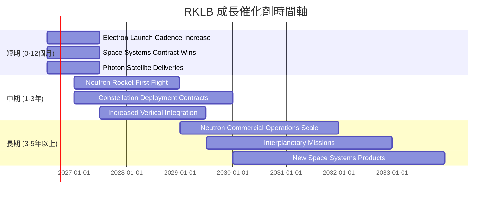

### 8.2 TAM 市場規模分析

太空產業是一個長期且快速增長的市場，RKLB 在其中擁有巨大的潛在市場 (TAM)。

```
╔══════════════════════════════════════════════════════════════════╗
║                    RKLB 潛在市場 (TAM) 分析                       ║
╠══════════════════════════════════════════════════════════════════╣
║                                                                  ║
║  全球太空經濟總市場 (2025E)：  ~$600B                             ║
║                                                                  ║
║  ▶️ 發射服務市場 (Launch Services)                               ║
║      TAM (2030E)：      ~$100B                                  ║
║      RKLB 收入貢獻 (TTM)： $250M (估計)  ▓▓░░░░░░░░░░░░░░░░░░░  滲透率: 低 (<1%) 🟢 ║
║      成長潛力：        高速，Neutron 將打開更大市場             ║
║                                                                  ║
║  ▶️ 太空系統市場 (Space Systems)                                 ║
║      TAM (2030E)：      ~$300B                                  ║
║      RKLB 收入貢獻 (TTM)： $429.58M (估計) ▓▓▓▓░░░░░░░░░░░░░░░  滲透率: 低 (<1%) 🟢 ║
║      成長潛力：        穩健，衛星星座部署加速                   ║
║                                                                  ║
║  📊 總結：RKLB 在其核心市場的滲透率仍非常低，具備巨大的長期成長空間。
╚══════════════════════════════════════════════════════════════════╝
```
*註：發射服務和太空系統的收入貢獻為估計值，根據公司業務描述和市場趨勢推斷。*

### 8.3 成長驅動力結構圖

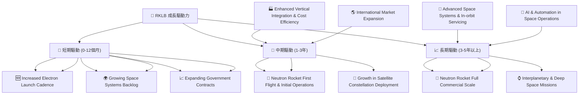

**成長驅動力詳述**：
*   **短期驅動**：
    *   **增加 Electron 火箭發射頻次 (Increased Electron Launch Cadence)**：隨著生產效率提高和訂單增加，Electron 火箭的發射次數將持續上升，直接推動發射服務收入增長。
    *   **不斷增長的太空系統訂單積壓 (Growing Space Systems Backlog)**：Photon 衛星平台和衛星組件的需求強勁，已有的訂單將轉化為收入。
    *   **擴大的政府合同 (Expanding Government Contracts)**：與美國政府（如太空部隊、情報機構）的合作，提供穩定且高價值的收入來源。
*   **中期驅動**：
    *   **Neutron 火箭首飛與初步運營 (Neutron Rocket First Flight & Initial Operations)**：Neutron 火箭的成功開發和首次發射將顯著擴大 RKLB 在中型運載市場的潛在客戶群，並帶來新的收入流。
    *   **衛星星座部署的成長 (Growth in Satellite Constellation Deployment)**：全球範圍內對通信、地球觀測等衛星星座的需求激增，RKLB 的發射和太空系統業務將直接受益。
    *   **強化垂直整合與成本效率 (Enhanced Vertical Integration & Cost Efficiency)**：持續深化垂直整合將進一步降低生產成本，提升毛利率和競爭力。
*   **長期驅動**：
    *   **Neutron 火箭全面商業化規模運營 (Neutron Rocket Full Commercial Scale)**：Neutron 進入大規模商業運營後，將成為公司主要的營收和利潤增長引擎。
    *   **星際與深空任務 (Interplanetary & Deep Space Missions)**：RKLB 已參與月球任務，未來在星際探測領域的參與將開闢全新的高價值市場。
    *   **先進太空系統與在軌服務 (Advanced Space Systems & In-orbit Servicing)**：開發更先進的衛星技術和提供在軌維護、燃料補給等服務，將創造新的高利潤業務。

---

## 9. 風險矩陣

RKLB 作為一家在高度創新和資本密集型行業運營的公司，面臨著多種潛在風險。

### 9.1 風險評分矩陣

```mermaid
quadrantChart
    title RKLB Risk Assessment Matrix
    x-axis Low Probability --> High Probability
    y-axis Low Impact --> High Impact
    quadrant-1 High Priority
    quadrant-2 Monitor Closely
    quadrant-3 Review Periodically
    quadrant-4 Watch

    Neutron Development Delays: [0.75, 0.85]
    Market Competition Increase: [0.80, 0.70]
    Capital Requirements & Dilution: [0.65, 0.60]
    Technical Failure (Launch/Satellite): [0.40, 0.90]
    Regulatory & Geopolitical Risks: [0.55, 0.50]
    Supply Chain Disruptions: [0.60, 0.40]
```

### 9.2 風險清單詳細分析

| # | 風險項目 | 發生機率 | 財務衝擊 | 風險評分 | 緩解措施 |
|---|------------------------|----------|----------|----------|----------|
| 1 | 🔴 **Neutron 火箭開發延遲或失敗** | 高 (75%) | 高 (-20%收入預期) | 🔴 9.0/10 | 1) 嚴格的項目管理與風險評估；2) 多樣化收入來源，減少對單一產品的依賴；3) 充足的現金儲備以應對延遲。 |
| 2 | 🔴 **市場競爭加劇導致定價壓力** | 高 (80%) | 中 (-10%毛利率) | 🔴 8.5/10 | 1) 透過垂直整合持續降低成本；2) 強化技術創新與差異化服務；3) 提升客戶鎖定，提供端到端解決方案。 |
| 3 | 🟡 **資本需求高企與潛在股權稀釋** | 中 (65%) | 中 (-5% EPS) | 🟡 7.0/10 | 1) 實現盈利以產生內部現金流；2) 探索債務融資或政府補貼；3) 嚴格控制資本支出效率。 |
| 4 | 🟡 **技術故障或發射失敗** | 低 (40%) | 極高 (-30%收入預期 + 品牌聲譽受損) | 🟡 8.0/10 | 1) 嚴格的質量控制和測試流程；2) 冗餘設計與應急計劃；3) 購買足額保險。 |
| 5 | 🟡 **供應鏈中斷** | 中 (60%) | 低 (-5%毛利率) | 🟡 6.5/10 | 1) 建立多元化供應商網絡；2) 增加關鍵零部件庫存；3) 強化垂直整合以減少對外部依賴。 |
| 6 | 🟢 **監管與地緣政治風險** | 中 (55%) | 中 (-10%收入預期) | 🟢 6.0/10 | 1) 密切關注國際太空政策與法規變化；2) 建立多元化客戶群，降低地緣政治風險集中度；3) 與政府保持良好溝通。 |

---

## 10. 投資建議

綜合以上分析，RKLB 憑藉其領先的技術、強勁的營收成長、改善的毛利率以及充足的現金儲備，在快速發展的太空經濟中佔據有利地位。儘管目前仍處於虧損且自由現金流為負，但其成長潛力和戰略重要性使其成為值得關注的投資標的。

### 10.1 最終綜合評級雷達圖

```
╔══════════════════════════════════════════════════════════════════╗
║              RKLB 綜合評級雷達圖 (1-10分)                        ║
╠══════════════════════════════════════════════════════════════════╣
║ 基本面強度  8.0 ▓▓▓▓▓▓▓▓▓▓▓▓▓▓▓▓░░░░                              ║
║ 成長動能    9.0 ▓▓▓▓▓▓▓▓▓▓▓▓▓▓▓▓▓▓░░                              ║
║ 獲利品質    6.5 ▓▓▓▓▓▓▓▓▓▓▓▓░░░░░░░░                              ║
║ 財務健康    8.5 ▓▓▓▓▓▓▓▓▓▓▓▓▓▓▓▓▓░░░                              ║
║ 估值合理性  7.0 ▓▓▓▓▓▓▓▓▓▓▓▓▓▓░░░░░░                              ║
║ 護城河深度  8.5 ▓▓▓▓▓▓▓▓▓▓▓▓▓▓▓▓▓░░░                              ║
║ 管理層執行  7.5 ▓▓▓▓▓▓▓▓▓▓▓▓▓▓▓░░░░░                              ║
║ 技術創新力  9.0 ▓▓▓▓▓▓▓▓▓▓▓▓▓▓▓▓▓▓░░                              ║
╠══════════════════════════════════════════════════════════════════╣
║ 綜合總分    7.8 ▓▓▓▓▓▓▓▓▓▓▓▓▓▓▓▓░░░░  🏆 具備長期高成長潛力的太空領導者 ║
╚══════════════════════════════════════════════════════════════════╝
```

### 10.2 目標價與隱含報酬率

基於基準情境的估值分析，我們給予 RKLB **買入**評級，12 個月目標價為 $115.00。

| 情境 | 機率權重 | 目標價 | 相對現價 ($81.04) | 隱含報酬率 |
|------|----------|--------|-------------------|------------|
| 🔴 悲觀 | 20% | $90.00 | +11.06% | +11.06% |
| 🟡 基準 | 60% | $115.00 | +41.91% | +41.91% |
| 🟢 樂觀 | 20% | $135.00 | +66.59% | +66.59% |
| **加權平均目標價** | **100%** | **$111.00** | **+37.0%** | **+37.0%** |

### 10.3 買入時機與觸發因素

```
╔══════════════════════════════════════════════════════════════════╗
║                  ✅ 買入觸發因素 Checklist                      ║
╠══════════════════════════════════════════════════════════════════╣
║                                                                  ║
║  立即買入觸發條件（多數符合）：                                  ║
║  ✅ 營收 YoY 成長率持續高於 40%                                  ║
║  ✅ 毛利率維持在 35% 以上並呈現上升趨勢                           ║
║  ✅ 淨現金儲備充足，流動性穩健                                    ║
║  ✅ Neutron 火箭開發進度符合預期或有正面消息                       ║
║  ✅ 股價相對於市場或同行出現超跌，P/S 倍數回歸至歷史區間下限       ║
║                                                                  ║
║  加碼觸發條件（出現以下任一）：                                  ║
║  ☐ 自由現金流轉正或虧損顯著收窄                                  ║
║  ☐ 獲得大型政府或商業衛星星座部署合同                             ║
║  ☐ 成功發射 Neutron 火箭並進入商業運營                           ║
║  ☐ ROIC 呈現顯著改善，接近或轉正                                 ║
║                                                                  ║
║  減碼/停損觸發條件（出現以下任一）：                             ║
║  ☐ 核心業務（發射或太空系統）成長率連續兩季低於 20%              ║
║  ☐ 毛利率連續兩季下滑至 30% 以下                                 ║
║  ☐ 自由現金流惡化且現金儲備快速消耗，導致融資壓力                ║
║  ☐ Neutron 火箭開發出現重大挫折或無限期延遲                      ║
║  ☐ 競爭格局惡化，市場份額被嚴重侵蝕                              ║
╚══════════════════════════════════════════════════════════════════╝
```

### 10.4 投資人適配度分析

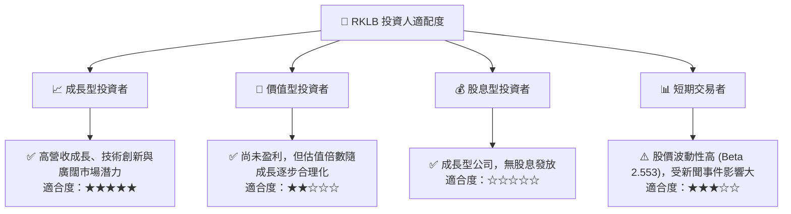

**投資人適配度詳述**：
*   **成長型投資者**：RKLB 完美契合成長型投資者的需求。公司處於高成長階段，擁有顛覆性技術和巨大的市場潛力。投資者應關注其營收成長、市場擴張和技術里程碑。
*   **價值型投資者**：目前 RKLB 仍處於虧損，自由現金流為負，傳統價值指標不適用。對於嚴格的價值型投資者而言，其估值可能過高。
*   **股息型投資者**：RKLB 不發放股息，所有利潤（或融資）都再投資於業務成長，不適合股息型投資者。
*   **短期交易者**：RKLB 股價波動性較高 (Beta 2.553)，受行業新聞、發射成功/失敗、財報數據等事件影響較大。短期交易者若能有效利用技術分析和市場情緒，可能存在機會，但風險較高。

### 10.5 每季財報監控清單（Quarterly Watch List）

| 關鍵指標 | 追蹤方向 | 觸發加碼門檻 | 觸發減碼/停損門檻 |
|----------|----------|--------------|-------------------|
| **總營收 YoY 成長** | 持續加速 | > 50% | < 30% |
| **毛利率** | 持續提升 | > 40% | < 32% |
| **營業利益率** | 虧損收窄或轉正 | > -20% | < -40% |
| **自由現金流 (FCF)** | 虧損收窄或轉正 | > -50M 美元 | < -150M 美元 |
| **營業現金流 (OCF)** | 虧損收窄或轉正 | > -30M 美元 | < -70M 美元 |
| **股權薪酬 (SBC) / 營收** | 佔比下降 | < 10% | > 15% |
| **Neutron 火箭開發進度** | 符合預期 | 發射測試成功 | 開發嚴重延遲或技術問題 |
| **太空系統業務收入 YoY 成長** | 持續加速 | > 60% | < 30% |
| **訂單積壓 (Backlog)** | 持續增長 | 季環比增長 > 10% | 季環比下降 > 5% |
| **現金及約當現金** | 保持充裕 | > $1.0B | < $700M |

### 10.6 反面論證：什麼會證明論點錯誤（What Would Change My Mind）

```
╔══════════════════════════════════════════════════════════════════╗
║              ⚠️ 論點失效條件（Disconfirming Evidence）           ║
╠══════════════════════════════════════════════════════════════════╣
║  本投資論點在下列情況成立時應重新檢視或退出：                    ║
║  ☐ 核心業務（發射服務或太空系統）營收成長率連續兩季低於 30%      ║
║  ☐ 毛利率連續兩季下滑至 30% 以下，且無明確改善前景               ║
║  ☐ 自由現金流持續惡化，季度流出超過 $150M 且現金儲備快速消耗     ║
║  ☐ ROIC 持續為負且未見改善趨勢，或者營業利益率連續兩季惡化        ║
║  ☐ Neutron 火箭開發出現重大技術挫折，導致商業化進程無限期延遲    ║
║  ☐ 市場競爭格局顯著惡化，導致 RKLB 市場份額持續下降              ║
╚══════════════════════════════════════════════════════════════════╝
```

---

> **免責聲明**：本報告為 AI 自動生成，僅供研究參考，不構成投資建議。投資有風險，入市需謹慎。