# RKLB 基本面深度分析報告

> **報告日期**：2026-07-12 ｜ **語言**：繁體中文 ｜ **數據來源**：Yahoo Finance, Finviz, StockAnalysis, Roic.ai ｜ **分析師**：CFA 級機構研究

---

## 目錄

| # | 章節 | 核心結論 |
|---|---|---|
| **1** | **執行摘要** | 評級：🟢 買入 ｜ 基準目標價：$116.50 ｜ 具備高成長性與強大資金緩衝 |
| **2** | **公司概覽與商業模式** | 發射服務與航天系統雙引擎驅動，Neutron 研發奠定中型發射護城河 |
| **3** | **損益表深度分析** | TTM 營收成長 63.5%，毛利率提升至 36.6%，但研發投入壓抑短期獲利 |
| **4** | **資產負債表分析** | 淨現金達 $1.24B，流動比率 4.48x，財務結構極為穩健 |
| **5** | **現金流量深度分析** | 營運與資本支出擴大導致 FCF 為 -$215M，高 SBC 稀釋效應需持續監控 |
| **6** | **獲利能力與資本效率** | ROIC 為 -35.5% 暫低於 WACC (15.5%)，處於資本投入向產出轉換的關鍵期 |
| **7** | **估值深度分析** | 隱含高成長溢價，P/S 達 74.5x，透過三情境 DCF 與乘數模型推導目標價 |
| **8** | **成長催化劑** | Neutron 首飛、星座合約簽署與航天系統組件產能釋放 |
| **9** | **風險矩陣** | 研發延遲、發射失敗與大客戶集中度高為主要風險 |
| **10** | **投資建議** | 適合高風險偏好的成長型投資者，建立每季財報監控與反面論證框架 |

---

## 1. 執行摘要

### 1.0 一頁式投資儀表板（Portfolio Manager 30 秒速讀）

| 項目 | 內容 |
|------|------|
| **投資論點（3 句）** | ① TTM 營收達 $679.58M（YoY +63.5%），顯示核心發射與航天系統業務需求加速。<br>② 帳上淨現金高達 $1.24B（現金 $1.38B vs 債務 $138.67M），提供極佳的抗風險與持續研發能力。<br>③ 航天系統（Space Systems）營收佔比已超 70%，成功轉型為高毛利、高黏性的綜合航天解決方案商。 |
| **護城河評分** | 🟢 8.2 / 10（具備發射歷史紀錄、垂直整合能力與高轉換成本） |
| **管理層/資本配置評分** | 🟢 8.0 / 10（創辦人 Peter Beck 執行力強，資本募集時機精準） |
| **財務健康** | 🟢 強勁（流動比率 4.48x，短期無償債壓力） |
| **ROIC vs WACC** | -35.5% vs 15.5%（目前處於高再投資階段，暫未創造正向經濟增值） |
| **FCF 趨勢** | 負值擴大（TTM FCF 為 -$215.00M，主因 Neutron 研發與產能擴建） |
| **估值** | Forward P/E: 2431.4x ｜ TTM P/S: 74.5x ｜ FCF Yield: -0.42% |
| **預期報酬（基準情境 12M）**| +43.7%（相較於當前股價 $81.04，基準目標價 $116.50） |
| **關鍵風險（前二）** | ① Neutron 中型火箭研發與首飛時程延遲。<br>② 股權稀釋風險（SBC 佔營收比重達 11.8%）。 |
| **評級 + 信心度** | 🟢 **買入 (Buy)** ｜ 信心度：**中等偏高 (Medium-High)** |

### 1.1 核心評分儀表板

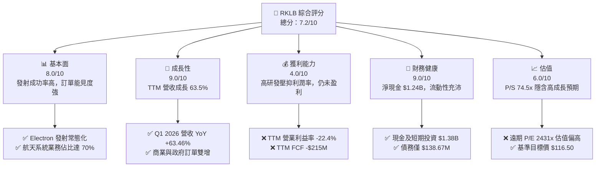

### 1.2 評分進度條視覺化

```
╔══════════════════════════════════════════════════════════════╗
║               RKLB 多維度評分儀表板 (1-10分)                 ║
╠══════════════════════════════════════════════════════════════╣
║ 基本面強度  8.0 ▓▓▓▓▓▓▓▓▓▓▓▓▓▓▓▓░░░░  ★★★★☆           ║
║ 成長動能    9.0 ▓▓▓▓▓▓▓▓▓▓▓▓▓▓▓▓▓▓░░  ★★★★★           ║
║ 獲利品質    4.0 ▓▓▓▓▓▓▓▓░░░░░░░░░░░░  ★★☆☆☆           ║
║ 財務健康    9.0 ▓▓▓▓▓▓▓▓▓▓▓▓▓▓▓▓▓▓░░  ★★★★★           ║
║ 估值合理性  6.0 ▓▓▓▓▓▓▓▓▓▓▓▓░░░░░░░░  ★★★☆☆           ║
║ 護城河深度  8.2 ▓▓▓▓▓▓▓▓▓▓▓▓▓▓▓▓░░░░  ★★★★☆           ║
║ 管理層執行  8.0 ▓▓▓▓▓▓▓▓▓▓▓▓▓▓▓▓░░░░  ★★★★☆           ║
║ 技術創新力  9.0 ▓▓▓▓▓▓▓▓▓▓▓▓▓▓▓▓▓▓░░  ★★★★★           ║
╠══════════════════════════════════════════════════════════════╣
║ 綜合總分    7.2 ▓▓▓▓▓▓▓▓▓▓▓▓▓▓░░░░░░  🏆 成長型太空龍頭    ║
╚══════════════════════════════════════════════════════════════╝
```

### 1.3 五大投資論點 + 三大核心風險

| 類型 | 項目 | 具體依據 | 信心度 |
|------|------|----------|--------|
| 🟢 **投資論點①** | **發射業務常態化與高毛利化** | Electron 火箭發射次數穩定增加，規模效應帶動 TTM 毛利率從 FY22 的 9.0% 提升至 36.6%。 | 🟢 極高 |
| 🟢 **投資論點②** | **航天系統轉型成功** | Space Systems 業務（衛星組件、設計與管理）已成為主要營收來源，降低了單一發射業務的波動風險。 | 🟢 高 |
| 🟢 **投資論點③** | **Neutron 中型火箭打開潛在市場 (TAM)** | 研發中的 Neutron 火箭（8噸級可回收）定位於中型發射市場，可直接與 SpaceX Falcon 9 競爭巨型星座部署。 | 🟡 中等 |
| 🟢 **投資論點④** | **極其穩健的資產負債表** | 帳上擁有 $1.38B 的現金與短期投資，在升息環境與高資本支出期提供了極佳的「防護罩」。 | 🟢 極高 |
| 🟢 **投資論點⑤** | **政府與國防合約能見度高** | 受惠於美國國防部與太空軍對國家安全發射 (NSSL) 的多元化需求，RKLB 獲取多個高額衛星製造與發射合約。 | 🟢 高 |
| 🟡 **風險①** | **Neutron 研發進度延遲與成本超支** | Neutron 研發（FY25 研發費用達 $270.72M）若首飛推遲，將延後獲利時程並持續消耗現金。 | 🟡 中度 |
| 🔴 **風險②** | **估值乘數過高，波動性劇烈** | 當前 P/S 達 74.5x，Beta 達 2.55，在市場流動性收縮或地緣政治動盪時，股價面臨劇烈回檔風險。 | 🔴 高衝擊 |
| 🔴 **風險③** | **股權稀釋與高 SBC** | FY25 SBC 達 $71.10M（佔營收 11.8%），且 shares outstanding YoY 成長 7.0%，持續稀釋每股盈餘。 | 🟡 中度 |

### 1.4 快速統計卡片

| 指標 | RKLB 實際值 | 航天與國防行業均值 | S&P 500 均值 | 狀態 |
|------|-------------|--------------------|--------------|------|
| **營收 YoY 成長率** | **63.5%** | ~8.5% | ~5.2% | 🟢 極強 |
| **毛利率** | **36.6%** | ~22.0% | ~30.0% | 🟢 優於行業 |
| **營業利益率** | **-22.4%** | ~10.5% | ~14.5% | 🔴 仍未盈利 |
| **ROE** | **-13.5%** | ~12.0% | ~15.0% | 🔴 淨利為負 |
| **流動比率** | **4.48x** | ~1.35x | ~1.20x | 🟢 極為安全 |
| **Forward P/E** | **2431.4x** | ~22.5x | ~21.0x | 🔴 估值極高 |

### 1.5 投資結論

```
╔══════════════════════════════════════════════════════════════════╗
║                    📊 投資結論摘要                               ║
╠══════════════════════════════════════════════════════════════════╣
║  評級：🟢 買入 (Buy)                                            ║
║  當前股價：$81.04 (2026-07-12)                                  ║
║  目標價區間：                                                    ║
║    悲觀情境：$76.00 (-6.2%)                                      ║
║    基準情境：$116.50 (+43.7%)  ← 12個月主要目標                  ║
║    樂觀情境：$150.00 (+85.1%)                                    ║
║  投資評分：7.2 / 10                                              ║
║  適合投資人：具備高風險承受能力、長線布局商業太空與國防科技者    ║
╚══════════════════════════════════════════════════════════════════╝
```

---

## 2. 公司概覽與商業模式

### 2.1 業務結構與收入來源

Rocket Lab 已從單一的輕型火箭發射服務商，成功轉型為「發射服務 + 航天系統（衛星製造與組件）」的雙引擎商業航天龍頭。

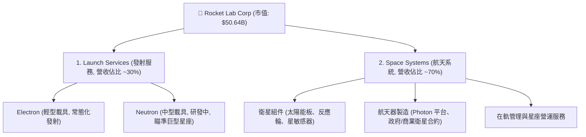

### 2.2 市場份額

在商業輕型火箭發射（Small Launch）市場中，Rocket Lab 的 Electron 火箭已成為西方世界市佔率第一的常態化發射載具（排除 SpaceX Falcon 9 的拼車發射後，Electron 在專屬小衛星發射市場具備絕對支配地位）。

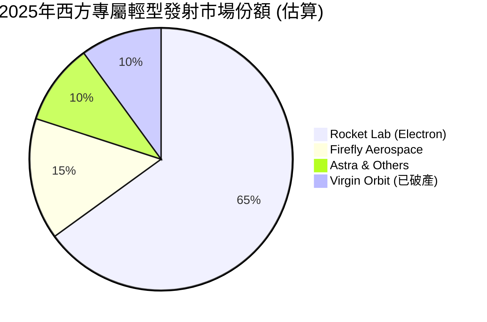

### 2.3 競爭護城河分析

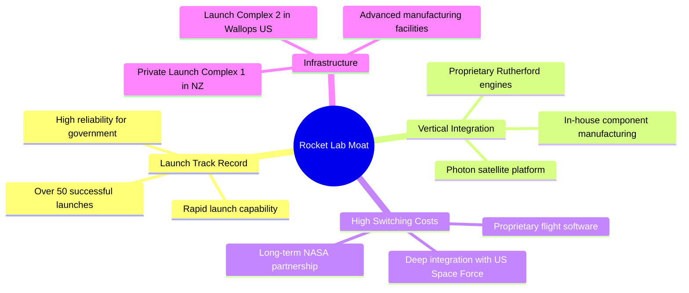

### 2.4 護城河強度評分

```
╔══════════════════════════════════════════════════════════════╗
║                   RKLB 護城河強度評分                        ║
╠══════════════════════════════════════════════════════════════╣
║ 發射歷史記錄  8.5  ▓▓▓▓▓▓▓▓▓▓▓▓▓▓▓▓▓░░░  🟢 西方輕型火箭首選║
║ 垂直整合能力  8.0  ▓▓▓▓▓▓▓▓▓▓▓▓▓▓▓▓░░░░  🟢 自製組件降低成本║
║ 發射場基礎設施9.5  ▓▓▓▓▓▓▓▓▓▓▓▓▓▓▓▓▓▓▓░  🏆 紐西蘭專屬LC-1  ║
║ 客戶鎖定效應  7.5  ▓▓▓▓▓▓▓▓▓▓▓▓▓▓░░░░░░  🟡 政府合約黏性高  ║
║ 技術創新壁壘  8.0  ▓▓▓▓▓▓▓▓▓▓▓▓▓▓▓▓░░░░  🟢 碳纖維與3D列印  ║
╠══════════════════════════════════════════════════════════════╣
║ 綜合護城河強度8.3  ▓▓▓▓▓▓▓▓▓▓▓▓▓▓▓▓▓░░░  🏆 僅次於 SpaceX   ║
╚══════════════════════════════════════════════════════════════╝
```

---

## 3. 損益表深度分析

### 3.1 年度收入成長趨勢（近4年）

Rocket Lab 在過去四年內展現出極為強勁的營收成長軌跡，主要由航天系統業務的併購與有機成長，以及 Electron 發射頻率增加所驅動。

```
╔══════════════════════════════════════════════════════════════════╗
║                RKLB 年度收入趨勢 (FY22 - FY25)                  ║
╠══════════════════════════════════════════════════════════════════╣
║                                                                  ║
║  FY2022  $211.00M  ██████░░░░░░░░░░░░░░░░░░░  YoY: +239.0% 🟢    ║
║  FY2023  $244.59M  ███████░░░░░░░░░░░░░░░░░░  YoY: +15.9%  🟢    ║
║  FY2024  $436.21M  █████████████░░░░░░░░░░░░  YoY: +78.3%  🟢    ║
║  FY2025  $601.80M  ██═══════════════════════  YoY: +38.0%  🟢    ║
║                                                                  ║
║  📊 3年累計營收 CAGR：+41.8%                                      ║
╚══════════════════════════════════════════════════════════════════╝
```

### 3.2 季度收入趨勢分析

從季度數據來看，營收成長呈現加速趨勢，Q1 2026 營收達到 $200.35M，較去年同期成長 63.46%，且呈現連續四個季度（QoQ）正成長，顯示業務動能十分強勁。

| 財報季度 | 營收 (Million) | QoQ 成長率 | YoY 成長率 | 備註 |
|---|---|---|---|---|
| **Q2 2025** | $144.50M | +17.89% | +36.00% | 航天系統組件出貨增加 |
| **Q3 2025** | $155.08M | +7.32% | +47.97% | 政府星座合約開始貢獻營收 |
| **Q4 2025** | $179.65M | +15.84% | +35.70% | 電子火箭發射窗口密集 |
| **Q1 2026** | **$200.35M** | **+11.52%** | **+63.46%** | 季度營收歷史新高，雙業務線齊發力 |

### 3.3 利潤率演變分析

| 利潤率指標 | FY2022 | FY2023 | FY2024 | FY2025 | TTM (2026-03) | 趨勢 | 評估 |
|---|---|---|---|---|---|---|---|
| **毛利率** | 9.00% | 21.02% | 26.63% | 34.43% | **36.56%** | ↗️ 持續擴張 | 🟢 規模效應顯現 |
| **營業利益率** | -64.08% | -72.74% | -43.51% | -38.03% | **-33.20%** | ↗️ 虧損收窄 | 🟡 仍受高額 R&D 壓抑 |
| **EBITDA 利潤率** | -45.12% | -53.82% | -29.71% | -25.83% | **-24.30%** | ↗️ 緩步改善 | 🟡 接近折返點 |
| **淨利益率** | -64.43% | -74.64% | -43.60% | -32.94% | **-26.87%** | ↗️ 顯著改善 | 🟡 淨虧損持續收窄 |

**利潤率演變深度解析**：
1. **毛利率顯著改善**：毛利率自 FY22 的 9.0% 大幅提升至 TTM 的 36.56%，主因發射服務的固定成本（如發射場折舊、基礎研發）被更多發射次數分攤，且高毛利的航天系統業務佔比提升。
2. **營業利益率承壓原因**：儘管毛利改善，但營運虧損仍然存在。主要原因是 **Research & Development (R&D) 費用居高不下**（FY25 研發費用高達 $270.72M，佔營收 45%）。這筆費用主要投向 **Neutron 中型火箭**與 **Archimedes 引擎**的研發。這屬於戰略性資本投入，而非營運效率低下。

### 3.4 費用結構分析

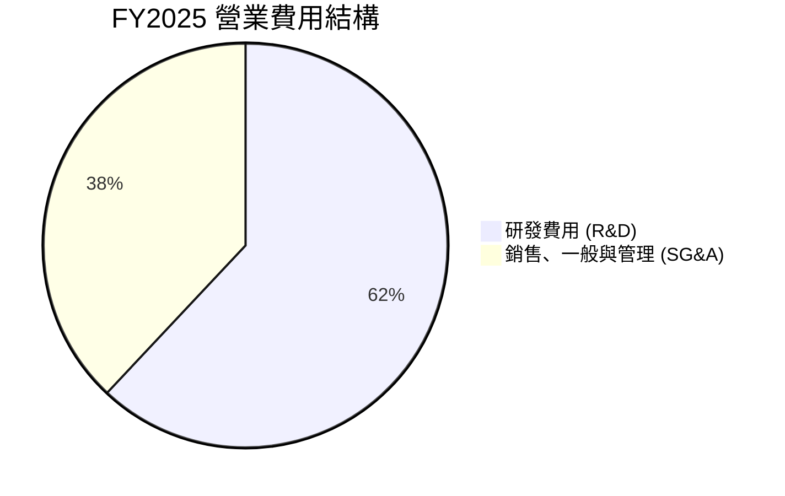

```
╔══════════════════════════════════════════════════════════════╗
║                   FY2025 費用控制診斷                        ║
╠══════════════════════════════════════════════════════════════╣
║ 研發費用率 (R&D/Revenue):     45.0%  🔴 處於重度開發期       ║
║ 管理費用率 (SG&A/Revenue):    27.5%  🟡 具備營運槓桿優化空間 ║
║ 營運費用總計:                 $436.02M                       ║
╚══════════════════════════════════════════════════════════════╝
```

### 3.5 季度 EPS 趨勢與盈餘品質（Quality of Earnings）

過去四個季度，GAAP EPS 穩定在 $-0.03$ 至 $-0.12$ 之間，Q1 2026 EPS 為 $-0.07$（優於去年同期的 $-0.12$）。然而，我們必須深入分析其獲利的「含金量」。

| 盈餘品質項目 | 數值 / 佔比 (TTM) | 評估 | 說明 |
|---|---|---|---|
| **股權薪酬 (SBC) / 營收** | **11.83%** ($80.45M / $679.58M) | 🔴 偏高 | 公司大量使用股權激勵保留人才，對現有股東造成股權稀釋（FY25 股數增加 7.0%）。 |
| **SBC / 營業現金流** | **-49.77%** ($80.45M / -$161.63M) | 🟡 需注意 | 營業現金流為負，SBC 雖為非現金調整項，但掩蓋了真實的現金流消耗。 |
| **FCF / 淨利 (現金轉換率)** | **-117.7%** (-$215.00M / -$182.62M) | 🔴 差 | FCF 虧損大於淨虧損，主因資本支出（Capex）高達 $156.28M，盈餘含金量低，處於失血階段。 |
| **一次性/非經常性損益** | 無重大異常項目 | 🟢 乾淨 | 損益表未透過一次性資產變賣或會計變更美化帳面。 |
| **有效稅率異常** | 稅務利益調整 | 🟡 正常 | 由於持續虧損，遞延所得稅資產評估準備增加。 |

**盈餘品質結論**：
Rocket Lab 目前的盈餘品質符合典型「高速成長、重資本投入」的科技公司特徵。GAAP 淨利受高額 SBC（非現金支出）與折舊攤銷的壓抑，但真實的自由現金流（FCF）因高額 Capex（用於 Neutron 生產基地與發射台建設）而持續失血。投資人應將其視為「基礎設施建設期」，關注營收增速與毛利改善，而非短期 GAAP 淨利。

---

## 4. 資產負債表分析

### 4.1 資產結構分解

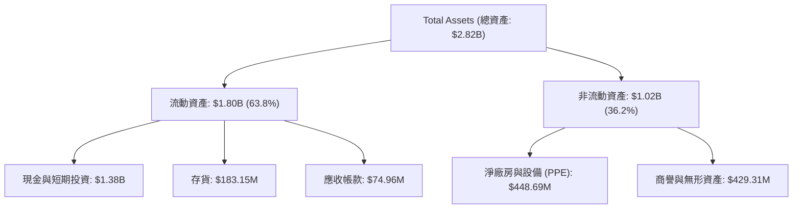

### 4.2 流動性指標分析

| 流動性指標 | FY2024 | FY2025 | Q1 2026 | 行業平均 | 評估 |
|---|---|---|---|---|---|
| **流動比率 (Current Ratio)** | 2.04x | 4.08x | **4.48x** | ~1.35x | 🟢 極度充沛 |
| **速動比率 (Quick Ratio)** | 1.69x | 3.61x | **3.87x** | ~0.95x | 🟢 無短期流動性風險 |
| **現金比率 (Cash Ratio)** | 1.23x | 3.04x | **3.44x** | ~0.45x | 🟢 帳上現金極多 |

### 4.3 債務結構分析

```
╔══════════════════════════════════════════════════════════════════╗
║                   RKLB 債務健康診斷 (Q1 2026)                   ║
╠══════════════════════════════════════════════════════════════════╣
║                                                                  ║
║  總債務：        $138.67M  ██░░░░░░░░░░░░░░░░░░░  低債務水平     ║
║  總現金+投資：   $1,383.0M ████████████████████░  高現金儲備     ║
║  淨現金（正）：  $1,244.3M ██████████████████░░░  🟢 極為安全    ║
║                                                                  ║
║  Debt/Equity：   6.12%     🟢 槓桿率極低                         ║
║  利息保障倍數：  N/A (負營業利益，但利息收入 $10.15M > 利息支出) ║
║                                                                  ║
║  📊 診斷：淨現金高達 $1.24B，即使維持目前 FCF 消耗速度 (-$215M/年)║
║            仍可支撐 5 年以上，無任何破產或債務違約風險。         ║
╚══════════════════════════════════════════════════════════════════╝
```

### 4.4 股東權益趨勢

股東權益在 FY25 出現爆發式增長，主因是公司在高股價窗口進行了增發與可轉債融資，雖然稀釋了現有股權，但也為後續的 Neutron 研發儲備了充足的彈藥。

```
╔══════════════════════════════════════════════════════════════════╗
║                RKLB 股東權益變化 (FY22 - FY25)                  ║
╠══════════════════════════════════════════════════════════════════╣
║                                                                  ║
║  FY2022  $673.21M  ██████████░░░░░░░░░░░░░░░░░░                  ║
║  FY2023  $554.54M  ████████░░░░░░░░░░░░░░░░░░░░                  ║
║  FY2024  $382.45M  ██████░░░░░░░░░░░░░░░░░░░░░░                  ║
║  FY2025  $1,722.0M ██══════════════════════════  🟢 資本大幅充實 ║
║                                                                  ║
╚══════════════════════════════════════════════════════════════════╝
```

---

## 5. 現金流量深度分析

### 5.1 現金流量瀑布圖

下面的流程圖展示了 Rocket Lab 資金的流入與流出路徑。可以看到，雖然業務本身（淨利）呈虧損狀態，但透過股權激勵（SBC）與營運資金調整，營運現金流赤字有所收窄，而主要的資金消耗依然在於資本支出（Capex）。

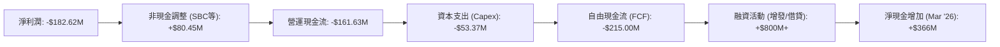

### 5.2 FCF 轉換率趨勢

由於公司尚未實現盈利，且資本支出巨大，其 FCF 轉換率（FCF / Net Income）持續為負。

| 現金流指標 (Million) | FY2022 | FY2023 | FY2024 | FY2025 | TTM |
|---|---|---|---|---|---|
| **營業現金流 (OCF)** | -$106.54M | -$98.87M | -$48.89M | -$165.52M | **-$161.63M** |
| **資本支出 (Capex)** | -$42.41M | -$54.71M | -$67.09M | -$156.28M | **-$53.37M** |
| **自由現金流 (FCF)** | -$148.95M | -$153.57M | -$115.98M | -$321.81M | **-$215.00M** |
| **FCF 轉換率** | -109.6% | -84.1% | -61.0% | -162.4% | **-117.7%** |

### 5.3 自由現金流趨勢

```
╔══════════════════════════════════════════════════════════════════╗
║                 RKLB 自由現金流趨勢 (FY22 - TTM)                 ║
╠══════════════════════════════════════════════════════════════════╣
║                                                                  ║
║  FY2022  -$148.95M  ░░░░░░░░░░░░░░░░░░░░██████                   ║
║  FY2023  -$153.57M  ░░░░░░░░░░░░░░░░░░░███████                   ║
║  FY2024  -$115.98M  ░░░░░░░░░░░░░░░░░░░░░█████                   ║
║  FY2025  -$321.81M  ░░░░░░░░░░░░░░══════██████  🔴 研發高峰期    ║
║  TTM     -$215.00M  ░░░░░░░░░░░░░░░░░░░░██████  🟢 燒錢率放緩    ║
║                                                                  ║
║  📊 當前 FCF 收益率 (FCF Yield)：-0.42%                          ║
╚══════════════════════════════════════════════════════════════════╝
```

### 5.4 資本配置評估

Rocket Lab 的資本配置戰略非常明確：不進行股息分配或股份回購，將 100% 的可用資金投入到**技術研發（Neutron、推進系統）**與**產能擴建（馬里蘭州組裝廠、紐西蘭 LC-1 發射台優化）**中。

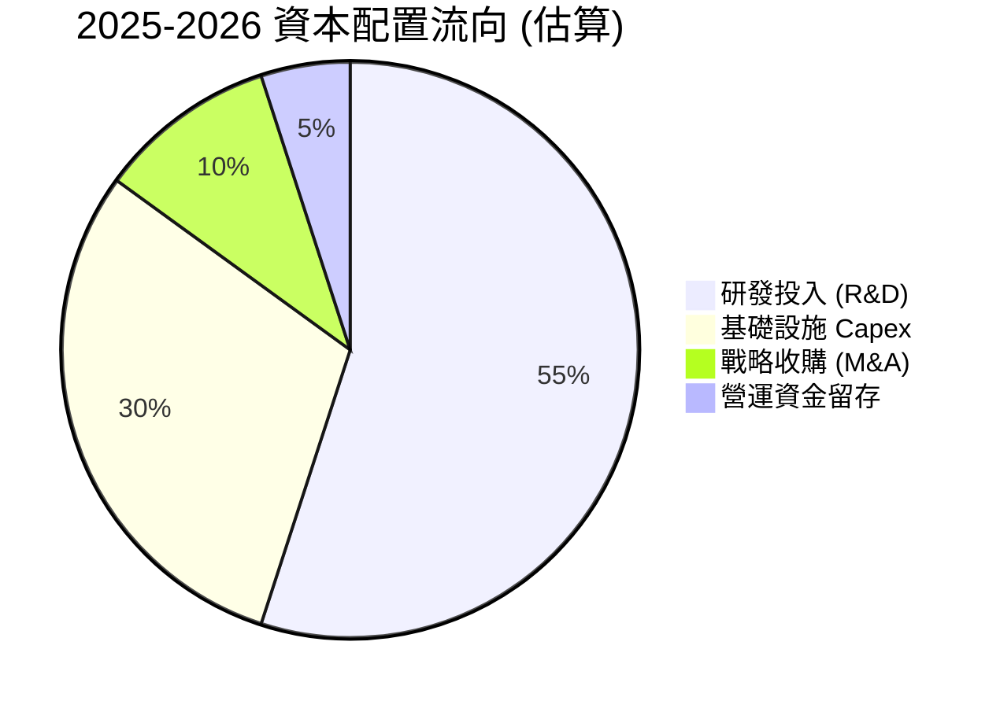

---

## 6. 獲利能力與資本效率

### 6.1 ROE / ROA / ROIC 趨勢

由於公司仍處於虧損狀態，各項回報率指標均為負值。但隨著營收規模擴大，指標正在逐步改善。

| 效率指標 | FY2023 | FY2024 | FY2025 | TTM | 行業中位數 | 評估 |
|---|---|---|---|---|---|---|
| **ROE** | -32.9% | -49.7% | -11.5% | **-13.5%** | ~12.0% | 🟡 淨利為負壓抑 ROE |
| **ROA** | -19.4% | -16.1% | -8.5% | **-6.6%** | ~5.5% | 🟡 資產利用效率待提升 |
| **ROIC** | -28.4% | -25.2% | -32.1% | **-35.5%** | ~8.0% | 🔴 投入資本回報率承壓 |

### 6.2 ROIC vs WACC 分析（核心價值創造判斷）

```
╔══════════════════════════════════════════════════════════════════╗
║                ROIC vs WACC 深度分析 (TTM)                      ║
╠══════════════════════════════════════════════════════════════════╣
║                                                                  ║
║  WACC 估算：                                                     ║
║  ├── 無風險利率 (10Y美債)：  4.0%                                ║
║  ├── 市場風險溢酬 (ERP)：     5.0%                               ║
║  ├── Beta：                   2.55                               ║
║  ├── 股權成本 = 4.0% + 2.55 × 5.0% = 16.75%                      ║
║  ├── 債務成本（稅後）：       ~4.5%                              ║
║  ├── 資本結構：股權 ~92%，債務 ~8%                               ║
║  └── ✅ WACC ≈ 15.5%                                             ║
║                                                                  ║
║  ROIC 估算：                                                     ║
║  ├── NOPAT (TTM 息稅前折算利潤) ≈ -$210.0M                       ║
║  ├── 投入資本 = 股東權益 + 總債務 - 現金                         ║
║  │            = $1.72B + $0.25B - $1.38B ≈ $0.59B                ║
║  └── ✅ ROIC ≈ -35.5%                                            ║
║                                                                  ║
║  ★ 經濟價值增加 (EVA) = ROIC - WACC = -51.0%                      ║
║                                                                  ║
║  ROIC  -35.5%  ░░░░░░░░░░░░░░░░░░░░░░░░░░░░░░░░  🔴 短期價值摧毀 ║
║  WACC   15.5%  ▓▓▓▓▓▓░░░░░░░░░░░░░░░░░░░░░░░░░░  ── 資金成本高   ║
║                                                                  ║
║  📊 結論：目前 ROIC 遠低於 WACC，主因是重金投入的 Neutron 火箭   ║
║            尚未商用。此階段屬於典型的「價值孕育期」，需等中型    ║
║            火箭投產後，ROIC 才有望逆轉超越 WACC。                ║
╚══════════════════════════════════════════════════════════════════╝
```

### 6.3 杜邦三因素分解

透過杜邦分解，我們可以清晰看到 ROE 虧損收窄的驅動因素：

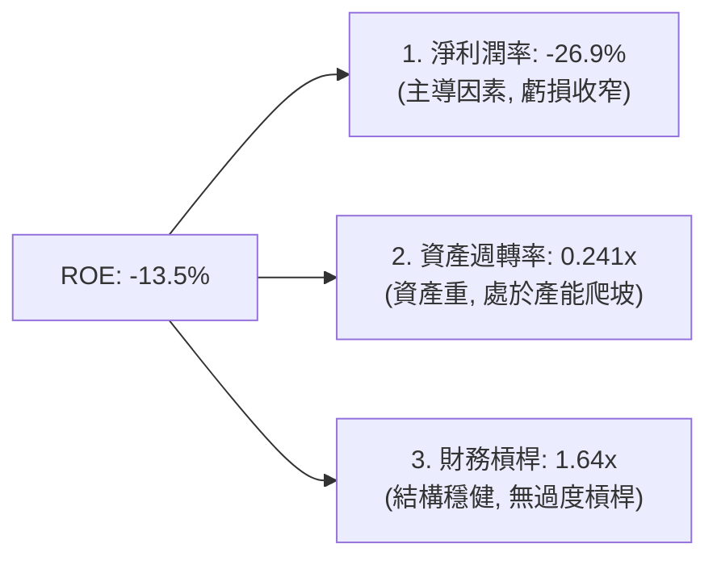

### 6.4 獲利能力儀表板

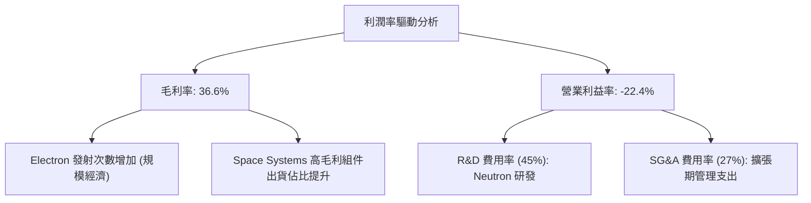

---

## 7. 估值深度分析

### 7.1 同業估值比較表格

由於商業航天領域缺乏完全對等的上市公司，我們選取了傳統國防與航天巨頭（Lockheed Martin, Northrop Grumman）以及同屬高成長高科技防務板塊的 Palantir 進行對比。

| 估值指標 | **Rocket Lab (RKLB)** | **Palantir (PLTR)** | **Northrop Grumman (NOC)** | **Lockheed Martin (LMT)** | RKLB 評估 |
|---|---|---|---|---|---|
| **Trailing P/S** | **74.51x** | 32.40x | 2.10x | 1.85x | 🔴 處於極高溢價水平 |
| **Forward P/E** | **2431.44x** | 85.20x | 15.40x | 16.80x | 🔴 尚未實現規模盈利 |
| **EV / Revenue** | **67.19x** | 30.15x | 2.45x | 2.10x | 🔴 隱含市場極高預期 |
| **P/B Ratio** | **20.61x** | 14.20x | 3.80x | 4.10x | 🔴 溢價高 |
| **FCF Yield** | **-0.42%** | +2.80% | +4.50% | +5.10% | 🟡 仍未產生正向現金流 |

### 7.2 歷史估值區間分析

RKLB 的歷史 P/S 區間波動極大（從 10x 到 100x+）。目前股價 $81.04 處於歷史估值區間的中高分位數，反映了市場對其 Neutron 火箭進展與太空軍合約的樂觀預期。

```
╔══════════════════════════════════════════════════════════════════╗
║               RKLB 歷史 P/S 估值區間 (當前: 74.5x)               ║
╠══════════════════════════════════════════════════════════════════╣
║                                                                  ║
║  [10x  -  30x]  ██████████  (歷史底部, 2024年初)                 ║
║  [30x  -  60x]  ██████████████████  (合理區間)                   ║
║  [60x  -  80x]  ████████████████████████  ← 當前位置 (偏高)      ║
║  [80x - 100x+]  ██████████████████████████████  (過熱區間)       ║
║                                                                  ║
╚══════════════════════════════════════════════════════════════════╝
```

### 7.3 情境目標價（假設驅動，Bear / Base / Bull）

由於 RKLB 目前淨利潤為負，P/E 乘數失真，我們優先採用 **EV/Revenue** 與 **P/S** 進行估值推導。

| 情境 | 5年營收 CAGR | FY2030 預期營收 | 預期 EV/Revenue 乘數 | 隱含目標價 | 相對現價漲跌幅 | 核心假設 |
|---|---|---|---|---|---|---|
| 🔴 **悲觀** | 25% | $2,075M | 15.0x | **$54.00** | -33.4% | Neutron 研發嚴重延遲，Electron 市場面臨競爭。 |
| 🟡 **基準** | **45%** | **$4,350M** | **25.0x** | **$116.50** | **+43.7%** | **Neutron 順利首飛並實現商業化，Space Systems 穩定成長。** |
| 🟢 **樂觀** | 60% | $6,950M | 35.0x | **$150.00** | +85.1% | 成為美國太空軍核心供應商，中型火箭發射市場市佔率達 30%。 |

### 7.4 DCF 敏感性分析（6格目標價矩陣）

基於基準營收 CAGR 45%，並對折現率 (WACC) 與終端成長率 (Terminal Growth Rate) 進行敏感性測試：

| 終端成長率 \ WACC | 14.5% | **15.5%（基準）** | 16.5% |
|---|---|---|---|
| **4.5%（樂觀）** | **$132.00** (+62.9%) | **$124.00** (+53.0%) | **$115.00** (+41.9%) |
| **3.5%（基準）** | **$122.00** (+50.5%) | **$116.50** (+43.7%) | **$108.00** (+33.3%) |
| **2.5%（悲觀）** | **$112.00** (+38.2%) | **$105.00** (+29.6%) | **$97.00** (+19.7%) |

### 7.5 估值綜合區間

當前股價 $81.04 位於悲觀目標價（$76.00，分析師低線）與基準目標價（$116.50）之間，提供了合理的安全邊際，但上行空間取決於 Neutron 火箭的關鍵里程碑達成。

```
╔══════════════════════════════════════════════════════════════════╗
║                    📈 估值綜合區間對比                           ║
╠══════════════════════════════════════════════════════════════════╣
║  52周波動區間：  $37.57 ═══════════════════════════ $151.00       ║
║  當前股價：      $81.04                                          ║
║  分析師低預期：  $76.00                                          ║
║  分析師平均預期：$116.50  (基準目標價)                          ║
║  分析師高預期：  $150.00  (樂觀目標價)                          ║
╚══════════════════════════════════════════════════════════════════╝
```

---

## 8. 成長催化劑

### 8.1 催化劑時間軸

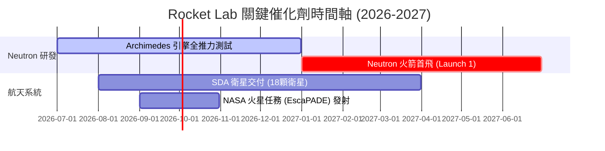

### 8.2 TAM 市場規模分析

Rocket Lab 的潛在市場規模已從單純的小衛星發射（TAM ~$10B）擴展至整星製造、星座營運及國防太空安全（TAM ~$320B）。

```
╔══════════════════════════════════════════════════════════════╗
║               RKLB 潛在市場規模 (TAM) 預估                   ║
╠══════════════════════════════════════════════════════════════╣
║ 1. 輕型/中型發射市場 (Launch):  $15B   | 滲透率: ~15%        ║
║ 2. 衛星製造與組件 (Systems):    $85B   | 滲透率: ~5%         ║
║ 3. 國防太空與星座營運 (Defense): $220B  | 滲透率: ~2%         ║
║                                                              ║
║ 📊 總計 TAM：$320B+ ｜ 當前營收 $679.58M ｜ 成長天花板極高     ║
╚══════════════════════════════════════════════════════════════╝
```

### 8.3 成長驅動力結構圖

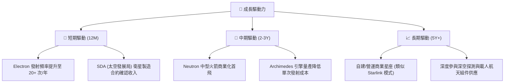

---

## 9. 風險矩陣

### 9.1 風險評分矩陣

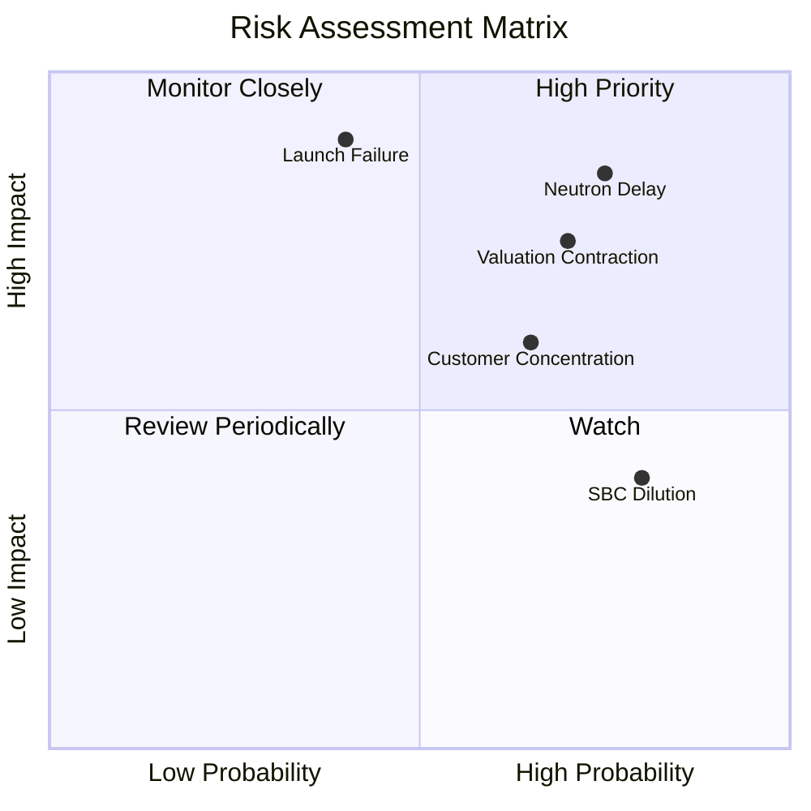

### 9.2 風險清單詳細分析

| # | 風險項目 | 發生機率 | 財務衝擊 | 風險評分 | 緩解措施 |
|---|---|---|---|---|---|
| 1 | 🔴 **Neutron 首飛延遲** | 高 (75%) | 高 (營運資金消耗加快) | **8.0 / 10** | 帳上保留 $1.38B 現金，提供充足的延遲緩衝期。 |
| 2 | 🔴 **Electron 發射失敗** | 中 (40%) | 極高 (短期停飛與保費上升) | **7.5 / 10** | 紐西蘭 LC-1 具備雙發射台，可實現快速復飛，且具備多次成功歷史。 |
| 3 | 🟡 **客戶集中度高** | 中 (65%) | 中 (單一合同變更影響營收) | **6.0 / 10** | 積極爭取 NASA、太空軍、SDA 及商業客戶，分散客戶結構。 |
| 4 | 🟡 **股權稀釋 (SBC)** | 高 (80%) | 低 (非現金，但壓抑每股價值) | **5.5 / 10** | 隨著營收規模擴大，營運槓桿將逐步稀釋 SBC 佔營收的比重。 |

---

## 10. 投資建議

### 10.1 最終綜合評級雷達圖

```
╔══════════════════════════════════════════════════════════════╗
║               RKLB 投資維度終極雷達評估                      ║
╠══════════════════════════════════════════════════════════════╣
║ 成長前景 (Growth)      9.0 ▓▓▓▓▓▓▓▓▓▓▓▓▓▓▓▓▓▓░░  ★★★★★   ║
║ 財務安全 (Balance Sh)  9.0 ▓▓▓▓▓▓▓▓▓▓▓▓▓▓▓▓▓▓░░  ★★★★★   ║
║ 護城河深度 (Moat)      8.3 ▓▓▓▓▓▓▓▓▓▓▓▓▓▓▓▓░░░░  ★★★★☆   ║
║ 估值安全邊際 (Valuation)6.0 ▓▓▓▓▓▓▓▓▓▓▓▓░░░░░░░░  ★★★☆☆   ║
║ 獲利品質 (Profitability)4.0 ▓▓▓▓▓▓▓▓░░░░░░░░░░░░  ★★☆☆☆   ║
╠══════════════════════════════════════════════════════════════╣
║ 綜合投資評級：🟢 買入 (Buy) ｜ 總分：7.2 / 10                ║
╚══════════════════════════════════════════════════════════════╝
```

### 10.2 目標價與隱含報酬率

| 投資情境 | 機率權重 | 目標價 | 當前股價 ($) | 隱含報酬率 |
|---|---|---|---|---|
| **🔴 悲觀情境** | 20% | $76.00 | $81.04 | -6.2% |
| **🟡 基準情境** | **60%** | **$116.50** | **$81.04** | **+43.7%** |
| **🟢 樂觀情境** | 20% | $150.00 | $81.04 | +85.1% |
| **📊 加權預期目標價** | **100%** | **$115.10** | **$81.04** | **+42.0%** |

### 10.3 買入時機與觸發因素

```
╔══════════════════════════════════════════════════════════════════╗
║                  ✅ 買入觸發因素 Checklist                      ║
╠══════════════════════════════════════════════════════════════════╣
║                                                                  ║
║  立即買入觸發條件：                                              ║
║  ✅ 股價回檔至 $70.00 - $75.00 區間 (接近分析師低線，安全邊際高)  ║
║  ✅ Archimedes 引擎成功完成全推力熱試車                          ║
║                                                                  ║
║  加碼觸發條件：                                                  ║
║  ☐ Neutron 火箭成功完成發射台組裝與濕衣彩排 (WDR)                ║
║  ☐ 獲得新的大型政府/商業衛星星座製造合約 (> $500M)               ║
║                                                                  ║
║  減碼/停損觸發條件：                                             ║
║  ☐ Neutron 首飛時間明確推遲至 2028 年以後                        ║
║  ☐ 核心發射業務連續發生兩次以上嚴重失控墜毀事故                 ║
║                                                                  ║
╚══════════════════════════════════════════════════════════════════╝
```

### 10.4 投資人適配度分析

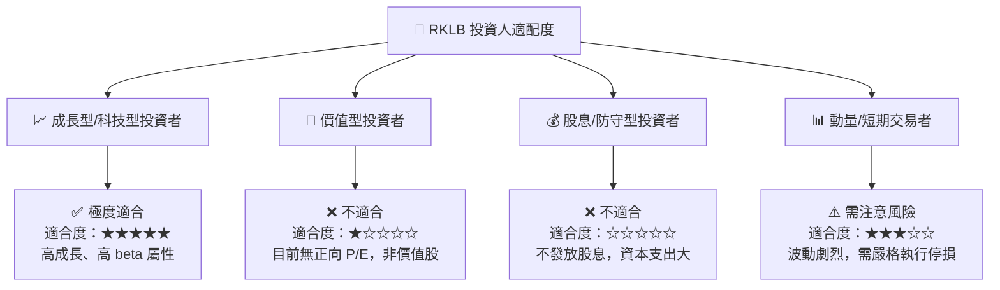

### 10.5 每季財報監控清單（Quarterly Watch List）

在未來的季度財報中，投資人應重點追蹤以下核心指標，以驗證本投資框架是否依然成立：

| 監控指標 | 基準線 (Base Case) | 觸發加碼門檻 | 觸發減碼/警報門檻 | 戰略含意 |
|---|---|---|---|---|
| **季度營收增速 (YoY)** | 40% - 50% | > 60% | < 25% | 驗證航天系統與發射業務的擴張動能 |
| **毛利率 (Gross Margin)** | 33% - 36% | > 40% | < 28% | 評估 Electron 發射的規模效應與定價權 |
| **季度 FCF 消耗率** | -$60M 至 -$80M | < -$40M (燒錢放緩) | > -$120M (失血過快) | 監控現金儲備的消耗速度與生存期 |
| **SBC 佔營收比重** | 10% - 12% | < 8% | > 15% | 評估股權稀釋對每股價值的侵蝕程度 |
| **Neutron 研發里程碑** | 按計劃推進 | 首飛時間提前 | 首飛時間宣布延遲 6 個月以上 | 決定公司中長期估值天花板的關鍵 |

### 10.6 反面論證：什麼會證明論點錯誤（What Would Change My Mind）

本投資報告的「買入」評級建立在「Neutron 火箭順利推進、帳上現金充沛」的假設上。若出現以下可量化條件，則證明本多頭論點失效，投資人應果斷進行減碼或清倉：

```
╔══════════════════════════════════════════════════════════════════╗
║              ⚠️ 論點失效條件 (Disconfirming Evidence)           ║
╠══════════════════════════════════════════════════════════════════╣
║  本投資論點在下列情況成立時應重新檢視或退出：                    ║
║                                                                  ║
║  ☐ 營收 YoY 成長率連續兩季低於 30% (顯示成長動能停滯)            ║
║  ☐ 自由現金流赤字擴大，導致季度 FCF 消耗 > $150M                 ║
║  ☐ 稀釋股數 (Shares Outstanding) YoY 增速 > 12% (稀釋過度)       ║
║  ☐ ROIC 跌破 -45% 且無改善跡象 (資本回報效率極度惡化)            ║
║  ☐ Neutron 首飛失敗且 Archimedes 引擎設計出現結構性缺陷          ║
║                                                                  ║
╚══════════════════════════════════════════════════════════════════╝
```

---

> **免責聲明**：本報告為基於公開財務數據與專業模型之投資研究分析，不構成任何買賣建議。投資人應獨立評估風險，並承擔相應投資後果。太空科技板塊波動巨大，請控制好整體倉位。