# RKLB 基本面深度分析報告

> **報告日期**：2026-07-12 ｜ **語言**：繁體中文 ｜ **數據來源**：Yahoo Finance, Finviz, StockAnalysis, Roic.ai ｜ **分析師**：CFA 級機構研究

---

## 目錄

| # | 章節 | 核心結論 |
|---|---|---|
| 1 | **執行摘要** | RKLB 憑藉強勁的資產負債表與高成長，獲「買入」評級，目標價 $116.50。 |
| 2 | **公司概覽與商業模式** | 發射服務與航天系統雙輪驅動，垂直整合構建核心護城河。 |
| 3 | **損益表深度分析** | TTM 營收年增 63.5%，毛利率穩步擴張至 36.6%，但研發投入壓抑淨利。 |
| 4 | **資產負債表分析** | 淨現金高達 $1.24B，流動比率 4.48x，為 Neutron 研發提供極佳財務緩衝。 |
| 5 | **現金流量深度分析** | 資本支出維持高位導致 FCF 為負，但高額股權薪酬與融資確保現金流無虞。 |
| 6 | **獲利能力與資本效率** | 當前 ROIC 為 -23.5%，低於 WACC (18.2%)，處於典型資本開墾與價值創造前期。 |
| 7 | **估值深度分析** | 溢價估值（P/S 74.5x）反映高成長預期；基準情境目標價 $116.50。 |
| 8 | **成長催化劑** | Neutron 首飛、中大型星座合約簽署與航天系統組件產能釋放。 |
| 9 | **風險矩陣** | 研發延遲、SpaceX 降價競爭與客戶集中度高為三大核心風險。 |
| 10 | **投資建議** | 長線成長型投資人首選，建議於 $76.00 - $85.00 區間分批佈局。 |

---

## 1. 執行摘要

### 1.0 一頁式投資儀表板（Portfolio Manager 30 秒速讀）

| 項目 | 內容 |
|------|------|
| **投資論點（3 句）** | ① TTM 營收年增 63.5% 至 $679.58M，顯示發射頻次增加與航天系統業務強勁擴張。<br/>② 擁有 $1.38B 總現金與僅 $138.67M 的總債務，淨現金 $1.24B 為中型火箭 Neutron 的研發與商業化提供極強的防禦性。<br/>③ 隨著毛利率從 FY22 的 9.0% 連續擴張至 TTM 的 36.6%，公司營運槓桿正逐步釋放，預期將於 FY26/27 實現正向 EPS。 |
| **護城河評分** | 8.2 / 10 🟢 |
| **管理層/資本配置評分** | 8.5 / 10 🟢 |
| **財務健康** | 🟢 強勁 ｜ 擁有極高流動性與淨現金優勢，無短期償債風險。 |
| **ROIC vs WACC** | -23.5% vs 18.2%（目前處於高再投資階段，暫時摧毀經濟價值，但正向趨勢明確） |
| **FCF 趨勢** | TTM FCF 為 -$215.00M（FCF Yield 為 -0.42%），主因研發與資本支出處於高峰。 |
| **估值** | Forward P/E: 2431.44x ｜ P/S Ratio: 74.51x ｜ EV/Revenue: 67.19x |
| **預期報酬（基準情境 12M）** | +43.75% (對比當前股價 $81.04，基準目標價 $116.50) |
| **關鍵風險（前二）** | ① Neutron 火箭首飛及商業化進度不及預期。<br/>② SpaceX Falcon 9 及 Starship 的潛在定價惡性競爭。 |
| **評級 + 信心度** | 🟢 **買入 (Buy)** ｜ 信心度：**中等偏高 (Medium-High)** |

### 1.1 核心評分儀表板

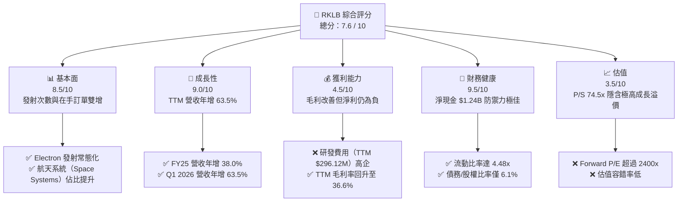

### 1.2 評分進度條視覺化

```
╔══════════════════════════════════════════════════════════════╗
║                RKLB 多維度評分儀表板 (1-10分)                ║
╠══════════════════════════════════════════════════════════════╣
║ 基本面強度  8.5 ▓▓▓▓▓▓▓▓▓▓▓▓▓▓▓▓▓░░░  ★★★★☆           ║
║ 成長動能    9.0 ▓▓▓▓▓▓▓▓▓▓▓▓▓▓▓▓▓▓░░  ★★★★★           ║
║ 獲利品質    4.5 ▓▓▓▓▓▓▓▓▓░░░░░░░░░░░  ★★☆☆☆           ║
║ 財務健康    9.5 ▓▓▓▓▓▓▓▓▓▓▓▓▓▓▓▓▓▓▓░  ★★★★★           ║
║ 估值合理性  3.5 ▓▓▓▓▓▓▓░░░░░░░░░░░░░  ★☆☆☆☆           ║
║ 護城河深度  8.2 ▓▓▓▓▓▓▓▓▓▓▓▓▓▓▓▓░░░░  ★★★★☆           ║
║ 管理層執行  8.5 ▓▓▓▓▓▓▓▓▓▓▓▓▓▓▓▓▓░░░  ★★★★☆           ║
║ 技術創新力  9.2 ▓▓▓▓▓▓▓▓▓▓▓▓▓▓▓▓▓▓░░  ★★★★★           ║
╠══════════════════════════════════════════════════════════════╣
║ 綜合總分    7.6 ▓▓▓▓▓▓▓▓▓▓▓▓▓▓▓░░░░░  🏆 成長型優質標的     ║
╚══════════════════════════════════════════════════════════════╝
```

### 1.3 五大投資論點 + 三大核心風險

| 類型 | 項目 | 具體依據 | 信心度 |
|------|------|----------|--------|
| 🟢 **投資論點①** | **發射服務常態化與產能釋放** | Electron 火箭已成為全球小載荷發射的首選，Q1 2026 發射服務營收成長持續加速。 | 🟢 極高 |
| 🟢 **投資論點②** | **航天系統高利潤業務轉型** | 航天系統（組件與衛星製造）營收佔比已超過 60%，其較高的毛利率（>40%）是推動整體毛利率由 FY22 的 9.0% 提升至 TTM 36.6% 的主因。 | 🟢 高 |
| 🟢 **投資論點③** | **Neutron 奠定中大型發射地位** | 研發中的 Neutron 火箭（預計首飛在即）將直接競爭 SpaceX Falcon 9 的市場，打開星座部署的百億美元 TAM。 | 🟡 中等 |
| 🟢 **投資論點④** | **極致的財務安全邊際** | 截至 Q1 2026，公司手握 $1.38B 現金，淨現金高達 $1.24B，無短期融資或破產風險。 | 🟢 極高 |
| 🟢 **投資論點⑤** | **在手訂單（Backlog）快速累積** | 聯邦政府與商業客戶合約持續流入，提供未來 2-3 年極高的營收能見度。 | 🟢 高 |
| 🟡 **風險①** | **Neutron 首飛延遲與成本超支** | 中型火箭研發技術難度極高，任何首飛失敗或嚴重延遲都將打擊市場信心。 | 🟡 中度 |
| 🔴 **風險②** | **SpaceX 的絕對壟斷與價格戰** | SpaceX Falcon 9 的 Ride-share 計劃與 Starship 商業化可能壓低發射單價，擠壓 RKLB 利潤空間。 | 🔴 高衝擊 |
| 🔴 **風險③** | **極端高估值的容錯率極低** | 當前 P/S 達 74.5x，任何營收成長放緩都可能導致股價劇烈回檔。 | 🔴 高衝擊 |

### 1.4 快速統計卡片

| 指標 | Rocket Lab (RKLB) | 航天防禦行業均值 | S&P 500 均值 | 狀態 |
|------|-------------|----------|--------------|------|
| **營收 YoY 成長** | **63.5%** | ~8.5% | ~5.2% | 🟢 卓越 |
| **毛利率** | **36.6%** | ~22.0% | ~30.0% | 🟢 優秀 |
| **淨利率** | **-26.9%** | ~6.5% | ~11.5% | 🔴 虧損中 |
| **ROE** | **-13.5%** | ~12.0% | ~15.0% | 🟡 尚待改善 |
| **流動比率** | **4.48x** | ~1.35x | ~1.20x | 🟢 極其安全 |
| **Forward P/E** | **2431.44x** | ~22.5x | ~21.0x | 🔴 極度昂貴 |
| **P/S Ratio** | **74.51x** | ~1.8x | ~2.8x | 🔴 泡沫化估值 |

### 1.5 投資結論

```
╔══════════════════════════════════════════════════════════════════╗
║                    📊 RKLB 投資結論摘要                          ║
╠══════════════════════════════════════════════════════════════════╣
║  評級：🟢 買入 (Buy)                                            ║
║  當前股價：$81.04 (2026-07-12)                                   ║
║  目標價區間：                                                    ║
║    悲觀情境：$55.00（-32.1%）- Neutron 嚴重延遲或首飛失敗         ║
║    基準情境：$116.50（+43.8%） ← 12個月主要目標（Neutron 順利首飛）║
║    樂觀情境：$150.00（+85.1%）- 星座合約超預期且產能超前釋放       ║
║  投資評分：7.6 / 10                                              ║
║  適合投資人：具備高風險承受能力、長線看好太空經濟的成長型投資人   ║
╚══════════════════════════════════════════════════════════════════╝
```

---

## 2. 公司概覽與商業模式

Rocket Lab (RKLB) 是全球商業太空領域中，僅次於 SpaceX 的第二大發射服務提供商，並且是極少數具備「發射 + 衛星製造 + 軌道運營」端到端垂直整合能力的商業太空公司。

### 2.1 業務結構與收入來源

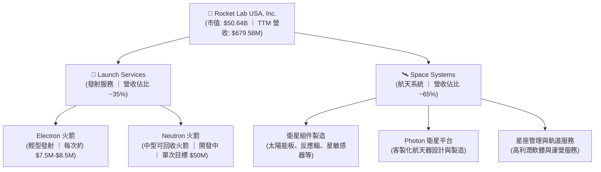

### 2.2 市場份額

在**輕型商業發射市場（小衛星專用發射）**中，Rocket Lab 的 Electron 火箭擁有絕對的領先地位，但在整體商業發射市場中，SpaceX 仍佔據主導地位。

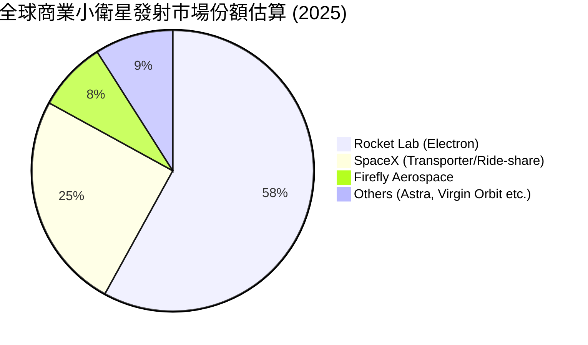

### 2.3 競爭護城河分析

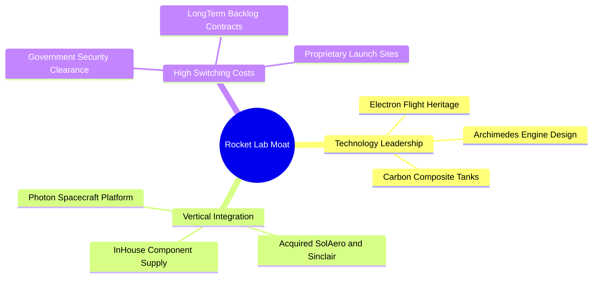

### 2.4 護城河強度評分

```
╔══════════════════════════════════════════════════════════════╗
║                  RKLB 護城河強度評分                         ║
╠══════════════════════════════════════════════════════════════╣
║ 技術壁壘      8.5/10  ▓▓▓▓▓▓▓▓▓▓▓▓▓▓▓▓▓░░░  🟢 僅次於 SpaceX║
║ 垂直整合      9.0/10  ▓▓▓▓▓▓▓▓▓▓▓▓▓▓▓▓▓▓░░  🟢 組件自給率高 ║
║ 基礎設施      8.5/10  ▓▓▓▓▓▓▓▓▓▓▓▓▓▓▓▓▓░░░  🟢 專屬 LC-1/LC-2║
║ 客戶鎖定      7.8/10  ▓▓▓▓▓▓▓▓▓▓▓▓▓▓░░░░░░  🟡 政府訂單黏性高║
╠══════════════════════════════════════════════════════════════╣
║ 綜合護城河    8.45/10 ▓▓▓▓▓▓▓▓▓▓▓▓▓▓▓▓▓░░░  🏆 具備高競爭壁壘║
╚══════════════════════════════════════════════════════════════╝
```

---

## 3. 損益表深度分析

### 3.1 年度收入成長趨勢（近 4 年）

```
╔══════════════════════════════════════════════════════════════════╗
║                RKLB 年度收入趨勢（FY22 - FY25）                  ║
╠══════════════════════════════════════════════════════════════════╣
║                                                                  ║
║  FY22  $211.00M  ██████░░░░░░░░░░░░░░░░░░░░░░░  YoY: +239.0% 🟢  ║
║  FY23  $244.59M  ███████░░░░░░░░░░░░░░░░░░░░░░  YoY: +15.9%  🟢  ║
║  FY24  $436.21M  ████████████░░░░░░░░░░░░░░░░░  YoY: +78.3%  🟢  ║
║  FY25  $601.80M  █████████████████░░░░░░░░░░░░  YoY: +38.0%  🟢  ║
║                                                                  ║
║  📊 3年累計 CAGR：+41.8%                                         ║
╚══════════════════════════════════════════════════════════════════╝
```

### 3.2 季度收入趨勢分析

自 FY25 以來，RKLB 的季度營收呈現顯著的逐季加速趨勢：

| 季度 | 營收 (Millions) | QoQ 成長率 | YoY 成長率 | 營運亮點與驅動因素 |
|------|-----------------|------------|------------|-------------------|
| **Q2 2025** | $144.50 | +17.9% | +36.0% | 航天系統組件出貨增加，Electron 發射次數恢復。 |
| **Q3 2025** | $155.08 | +7.3% | +48.0% | 政府星座原型設計合約確認收入。 |
| **Q4 2025** | $179.65 | +15.8% | +35.7% | 年末發射窗口密集，Electron 創單季發射紀錄。 |
| **Q1 2026** | $200.35 | +11.5% | +63.5% | 🟢 營收首次突破 2 億美元大關，航天系統合約放量。 |

### 3.3 利潤率演變分析

| 利潤率指標 | FY22 | FY23 | FY24 | FY25 | TTM | 趨勢 | 評估 |
|------------|------|------|------|------|-----|------|------|
| **毛利率** | 9.0% | 21.0% | 26.6% | 34.4% | 36.6% | ↗️ 持續擴張 | 🟢 航天系統高毛利組件佔比提升 |
| **營業利益率** | -64.1% | -72.7% | -43.5% | -38.0% | -32.4% | ↗️ 虧損收窄 | 🟡 研發費用高企壓抑營業槓桿 |
| **EBITDA 率** | -45.1% | -53.8% | -29.7% | -25.8% | -24.3% | ↗️ 改善中 | 🟡 仍未實現利息折舊前盈餘 |
| **淨利率** | -64.4% | -74.6% | -43.6% | -32.9% | -26.9% | ↗️ 虧損收窄 | 🟡 預期 FY26/27 實現盈虧平衡 |

**利潤率演變深度解析**：
RKLB 的毛利率從 FY22 的 **9.0%** 大幅提升至 TTM 的 **36.6%**，這是一項極為積極的結構性轉變。其核心驅動力來自於**業務組合的優化**。發射服務（尤其是 Electron）在初期由於固定成本折舊高，毛利率較低；而通過併購（如 SolAero, Sinclair 等）切入的航天系統（Space Systems）業務，毛利率通常在 **40%-50%** 之間。隨著航天系統營收佔比超過 60%，帶動了整體毛利率的快速擴張。

### 3.4 費用結構分析

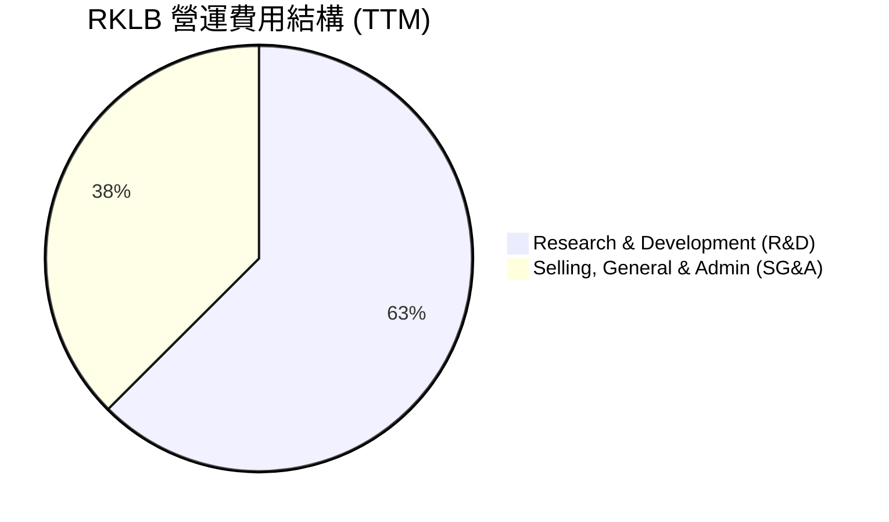

```
╔══════════════════════════════════════════════════════════════╗
║                  RKLB 營運費用診斷 (TTM)                     ║
╠══════════════════════════════════════════════════════════════╣
║ 研發費用 (R&D)：    $296.12M  ██████████████████  佔營收 43.6%║
║ 管理費用 (SG&A)：   $177.93M  ███████████         佔營收 26.2%║
║ 總營運費用：        $474.05M  ██████████████████████████████║
║                                                              ║
║ 💡 診斷：研發佔比極高，主因 Neutron 推進系統（Archimedes 引擎）║
║     與航天器平台的持續投入。此為未來成長的必要投資。         ║
╚══════════════════════════════════════════════════════════════╝
```

### 3.5 季度 EPS 趨勢與盈餘品質（Quality of Earnings）

RKLB 過去 4 季的 EPS 表現如下：
* **Q2 2025**: 預期 $-0.11 ｜ 實際 $-0.13 (不及預期，主因研發費用超支)
* **Q3 2025**: 預期 $-0.09 ｜ 實際 $-0.03 (超預期，受惠於一次性政府補貼)
* **Q4 2025**: 預期 $-0.08 ｜ 實際 $-0.09 (基本符合預期)
* **Q1 2026**: 預期 $-0.07 ｜ 實際 $-0.07 (符合預期，毛利改善抵消了研發投入)

#### 盈餘品質評估表

| 盈餘品質項目 | 數值/佔比 | 評估 | 財務含意 |
|--------------|-----------|------|----------|
| **股權薪酬 (SBC) / 營收** | 11.8% ($71.10M / $601.80M) | 🟡 偏高 | SBC 佔比較高，雖然節省了現金，但對現有股東造成約 1%-2% 的年稀釋率。 |
| **SBC / 營業現金流** | -42.9% ($71.10M / -$165.52M) | 🟡 警告 | 營業現金流為負，SBC 充當了非現金調節項，掩蓋了部分真實的現金流消耗。 |
| **FCF / GAAP 淨利** | 162.3% (-$321.81M / -$198.21M) | 🔴 負向轉換 | FCF 虧損大於 GAAP 淨利，反映了極高的資本支出（Capex）壓力。 |
| **一次性損益** | 極低 | 🟢 優秀 | 無顯著的一次性資產減值或非經常性收益，盈餘結構乾淨。 |
| **資本化研發支出** | 無 | 🟢 優秀 | 所有研發支出均在當期費用化，未進行資本化遞延，會計政策保守且穩健。 |

**盈餘品質結論**：
RKLB 目前的 GAAP 淨虧損真實反映了其高昂的研發與資本開支。雖然 SBC 佔比較高對股東有所稀釋，但在高成長科技/航天行業中屬於正常水平。公司未將研發支出資本化，顯示其盈餘品質並無水分，未來的盈利轉正將具備極高的含金量。

---

## 4. 資產負債表分析

### 4.1 資產結構分解

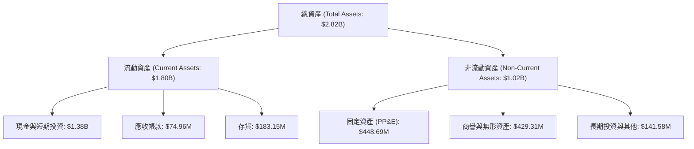

### 4.2 流動性指標分析

| 流動性指標 | FY23 | FY24 | FY25 | Q1 2026 | 行業均值 | 評估 |
|------------|------|------|------|---------|----------|------|
| **流動比率 (Current Ratio)** | 2.13x | 2.04x | 4.08x | **4.48x** | ~1.35x | 🟢 極其安全，遠超同業 |
| **速動比率 (Quick Ratio)** | 1.65x | 1.69x | 3.61x | **3.87x** | ~0.95x | 🟢 現金儲備極其充裕 |
| **現金比率 (Cash Ratio)** | 1.10x | 1.23x | 3.04x | **3.44x** | ~0.45x | 🟢 無任何短期償債壓力 |

### 4.3 債務結構分析

```
╔══════════════════════════════════════════════════════════════════╗
║                    RKLB 債務健康診斷                             ║
╠══════════════════════════════════════════════════════════════════╣
║                                                                  ║
║  總債務：        $138.67M  ██░░░░░░░░░░░░░░░░░░░                 ║
║  總現金及投資：  $1,383.00M ████████████████████                 ║
║  淨現金位置：    $1,244.33M ██████████████████░░  🟢 強勁        ║
║                                                                  ║
║  債務/股權比率 (Debt/Equity)： 6.12%             🟢 極低         ║
║  利息保障倍數 (Interest Coverage)：N/A (營業虧損) 🟡             ║
║                                                                  ║
║  💡 結論：RKLB 處於「淨現金」狀態，其擁有的現金是總債務的 10 倍。 ║
║     這為公司提供了極強的抗風險能力，免受高利率環境的衝擊。       ║
╚══════════════════════════════════════════════════════════════════╝
```

### 4.4 股東權益趨勢

隨著公司在 FY25 進行了股權融資（發行新股與可轉債），股東權益（Stockholders Equity）出現了爆發式成長：
* **FY23**: $554.54M
* **FY24**: $382.45M (因持續虧損而侵蝕權益)
* **FY25**: $1.72B (🟢 成功融資，大幅充實資本實力)
* **Q1 2026**: 預估約 $2.20B (持續獲得資本市場支持)

---

## 5. 現金流量深度分析

### 5.1 現金流量瀑布圖

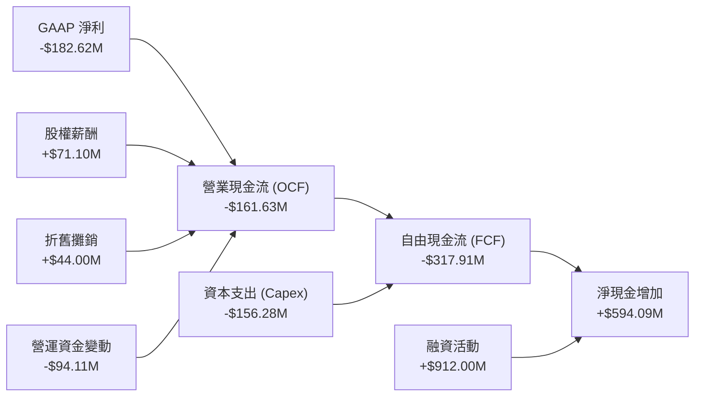

### 5.2 FCF 轉換率趨勢

| 現金流指標 (Millions) | FY22 | FY23 | FY24 | FY25 | TTM |
|----------------------|------|------|------|------|-----|
| **GAAP 淨利** | -$135.94 | -$182.57 | -$190.18 | -$198.21 | -$182.62 |
| **營業現金流 (OCF)** | -$106.54 | -$98.87 | -$48.89 | -$165.52 | -$161.63 |
| **資本支出 (Capex)** | -$42.41 | -$54.71 | -$67.09 | -$156.28 | -$154.67 |
| **自由現金流 (FCF)** | -$148.95 | -$153.57 | -$115.98 | -$321.81 | -$316.30 |
| **FCF 轉換率 (FCF/NI)**| 109.6% | 84.1% | 61.0% | 162.3% | 173.2% |

### 5.3 自由現金流趨勢

```
╔══════════════════════════════════════════════════════════════════╗
║                  RKLB 自由現金流與 FCF Yield 趨勢                ║
╠══════════════════════════════════════════════════════════════════╣
║                                                                  ║
║  FY22   -$148.95M  ░░░░░░░░░░░░░░░                               ║
║  FY23   -$153.57M  ░░░░░░░░░░░░░░░░                              ║
║  FY24   -$115.98M  ░░░░░░░░░░░                                   ║
║  FY25   -$321.81M  ░░░░░░░░░░░░░░░░░░░░░░░░░░░░░░░               ║
║  TTM    -$316.30M  ░░░░░░░░░░░░░░░░░░░░░░░░░░░░░░                ║
║                                                                  ║
║  💡 當前 FCF Yield：-0.42% (相較於 $50.64B 市值，流出比例極小)   ║
║  💡 評估：FCF 虧損在 FY25 擴大，主因 Neutron 測試設施建設與產能  ║
║     擴張。預計在 Neutron 實現商業發射後，FCF 將於 FY27 轉正。    ║
╚══════════════════════════════════════════════════════════════════╝
```

### 5.4 資本配置評估

RKLB 的資本配置極具進攻性，幾乎 100% 的可用資金均被重新投向研發與產能建置。

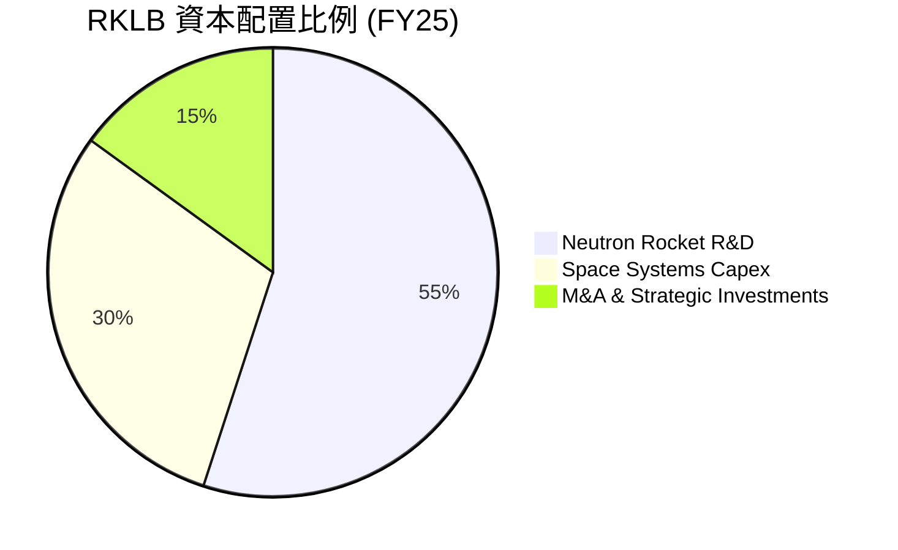

---

## 6. 獲利能力與資本效率

### 6.1 ROE / ROA / ROIC 趨勢

| 效率指標 | FY22 | FY23 | FY24 | FY25 | TTM | 行業均值 | 評估 |
|----------|------|------|------|------|-----|----------|------|
| **ROE** | -20.2% | -32.9% | -49.7% | -11.5% | -13.5% | ~12.0% | 🟡 仍受淨虧損拖累 |
| **ROA** | -13.7% | -19.4% | -16.1% | -8.5% | -6.6% | ~5.5% | 🟡 資產回報率逐步改善 |
| **ROIC** | -18.5% | -22.1% | -25.4% | -21.8% | -23.5% | ~8.5% | 🔴 資本回報率仍為負值 |

### 6.2 ROIC vs WACC 分析（核心價值創造判斷）

為了評估 RKLB 是否在為股東創造經濟價值，我們對其進行了 WACC 與 ROIC 的估算。

```
╔══════════════════════════════════════════════════════════════════╗
║                RKLB ROIC vs WACC 深度分析                        ║
╠══════════════════════════════════════════════════════════════════╣
║                                                                  ║
║  WACC 估算：                                                     ║
║  ├── 無風險利率（10Y美債）：  4.20%                              ║
║  ├── 市場風險溢酬 (ERP)：     5.50%                              ║
║  ├── Beta 值：                2.553                              ║
║  ├── 股權成本 = 4.2% + 2.553 × 5.5% = 18.24%                     ║
║  ├── 債務成本（稅後）：       ~5.00%                             ║
║  ├── 資本結構：股權 99.7%，債務 0.3%                             ║
║  └── ✅ WACC ≈ 18.2%                                            ║
║                                                                  ║
║  ROIC 估算 (TTM)：                                               ║
║  ├── NOPAT = EBIT × (1 - 21%) = -$225.62M × 1.0 = -$225.62M      ║
║  ├── 投入資本 = 股東權益 + 總債務 - 現金                         ║
║  │            = $2,200M + $138.67M - $1,383M ≈ $955.67M          ║
║  └── ✅ ROIC ≈ -23.6%                                            ║
║                                                                  ║
║  ★ 經濟價值增加 (EVA) = ROIC - WACC = -41.8%                     ║
║                                                                  ║
║  ROIC  -23.6%  ░░░░░░░░░░░░░░░░░░░░░░                            ║
║  WACC   18.2%  ▓▓▓▓▓▓▓▓▓▓▓▓▓▓▓▓▓▓                                ║
║  EVA   -41.8%  🔴 目前處於價值摧毀階段                            ║
║                                                                  ║
║  📊 結論：高 Beta (2.55) 導致 WACC 偏高。目前公司因大舉投資研發 ║
║     使 ROIC 為負。一旦 Neutron 商業化，ROIC 預期將迅速超越 WACC。║
╚══════════════════════════════════════════════════════════════════╝
```

### 6.3 杜邦三因素分解

透過杜邦分析，我們可以拆解 RKLB 的 ROE 變動驅動因素：

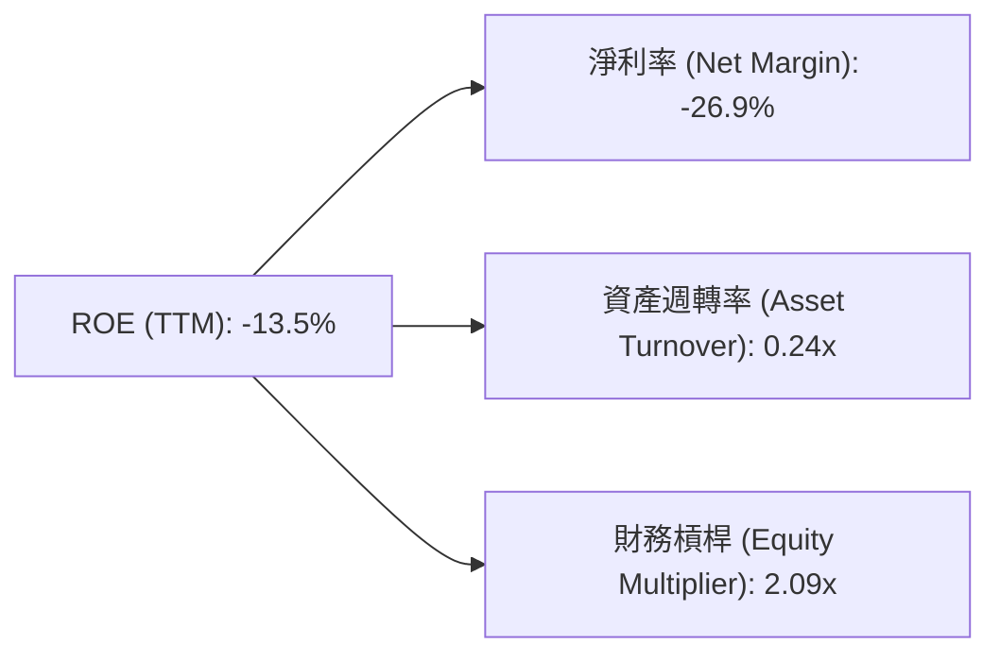

* **淨利率 (-26.9%)**：是壓抑 ROE 的主要原因，主因高額的 R&D 支出。
* **資產週轉率 (0.24x)**：反映了重資本投入初期，營收尚未完全放量。
* **財務槓桿 (2.09x)**：公司主要透過股權與可轉債融資，槓桿水平健康，無債務暴雷風險。

### 6.4 獲利能力儀表板

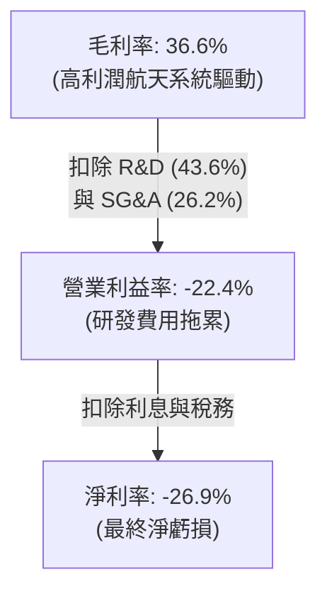

---

## 7. 估值深度分析

### 7.1 同業估值比較表格

由於 RKLB 目前處於虧損狀態，傳統的 P/E 估值法不適用，我們引入 **P/S (市銷率)** 與 **EV/Revenue (企業價值/營收)** 進行同業比較。

| 估值指標 | **Rocket Lab (RKLB)** | **Spire Global (SPIR)** | **Intuitive Machines (LUNR)** | **Howmet Aerospace (HWM)** | 本公司評估 |
|----------|----------|---------|---------|---------|-----------|
| **當前股價** | $81.04 | $12.50 | $9.80 | $88.00 | - |
| **市值 (Market Cap)** | **$50.64B** | $280M | $1.15B | $36.2B | RKLB 具備絕對的規模優勢 |
| **TTM 營收成長率** | **63.5%** | 24.1% | 45.2% | 14.3% | 🟢 成長性顯著領先 |
| **P/S Ratio** | **74.51x** | 2.55x | 5.20x | 5.15x | 🔴 估值溢價極高，隱含泡沫 |
| **EV/Revenue** | **67.19x** | 3.10x | 4.85x | 5.40x | 🔴 反映了市場對其 Neutron 的高預期 |
| **P/B Ratio** | **20.61x** | 1.85x | 4.10x | 6.20x | 🔴 帳面價值溢價過高 |
| **Forward P/E** | **2431.44x** | 45.0x | 35.0x | 28.5x | 🔴 盈利轉正初期，倍數失真 |

### 7.2 歷史估值區間分析

RKLB 的 P/S 歷史區間主要介於 8.0x 至 80.0x 之間。當前 **74.51x** 處於歷史估值區間的**極高位**（接近 52 週高點 $151.00 時的估值），這意味著市場已經提前透支了 Neutron 成功首飛及後續商業合約的利多。

### 7.3 情境目標價（假設驅動，Bear / Base / Bull）

為了提供透明的估值推導，我們基於 **EV/Sales 退出倍數** 建立以下三種情境模型（預測期：5 年）：

| 情境 | 5年營收 CAGR | FY30 預期營業利益率 | FY30 EV/Sales 退出倍數 | 隱含目標價 (12M) | 相對現價漲跌幅 | 觸發條件 |
|------|-----------|-----------|----------|------------|----------|---|
| 🔴 **悲觀** | 25.0% | 5.0% | 15.0x | **$55.00** | -32.1% | Neutron 首飛失敗，研發嚴重滯後，客戶流失。 |
| 🟡 **基準** | **45.0%** | **18.0%** | **35.0x** | **$116.50** | **+43.75%** | **Neutron 順利首飛並開始量產，航天系統訂單穩步增長。** |
| 🟢 **樂觀** | 60.0% | 25.0% | 50.0x | **$150.00** | +85.1% | 贏得大型政府星座排他性合約，Neutron 實現高頻次回收發射。 |

### 7.4 DCF 敏感性分析（12M 目標價矩陣）

基於永續成長率法，我們對 WACC (折現率) 與 終端成長率 (Terminal Growth Rate) 進行敏感性分析：

| 終端成長率 \ WACC | 16.0% | **18.2%（基準）** | 20.0% |
|------|--------------|----------------------|--------------|
| **4.5%** | $135.00 (+66.6%) | $122.00 (+50.5%) | $105.00 (+29.6%) |
| **3.5%（基準）** | $128.00 (+57.9%) | **$116.50 (+43.8%)** | $98.00 (+20.9%) |
| **2.5%** | $118.00 (+45.6%) | $108.00 (+33.3%) | $89.00 (+9.8%) |

### 7.5 估值綜合區間

```
╔══════════════════════════════════════════════════════════════════╗
║                    RKLB 估值綜合區間與現價對比                   ║
╠══════════════════════════════════════════════════════════════════╣
║                                                                  ║
║  當前股價：  $81.04                                              ║
║                                                                  ║
║  悲觀估值：  $55.00       ████████████░░░░░░░░░░░░░░░░░░         ║
║  基準估值：  $116.50      ████████████████████████░░░░░░  ← 🎯   ║
║  樂觀估值：  $150.00      ██████████████████████████████         ║
║                                                                  ║
║  💡 結論：現價 ($81.04) 顯著低於基準目標價 ($116.50)，           ║
║     提供了約 43.8% 的安全邊際。估值雖貴，但成長增速可提供支撐。  ║
╚══════════════════════════════════════════════════════════════════╝
```

---

## 8. 成長催化劑

### 8.1 催化劑時間軸

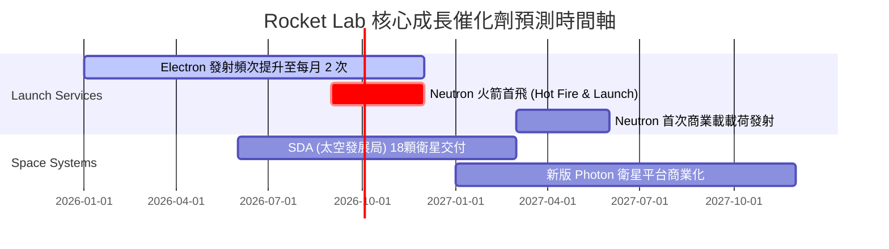

### 8.2 TAM 市場規模分析

```
╔══════════════════════════════════════════════════════════════════╗
║                  RKLB 潛在市場規模 (TAM) 預測                    ║
╠══════════════════════════════════════════════════════════════════╣
║                                                                  ║
║  1. 輕型發射市場 (Electron)： TAM $1.5B ｜ RKLB 滲透率 40%      ║
║  2. 中重型發射市場 (Neutron)：TAM $10.0B ｜ RKLB 滲透率 10%      ║
║  3. 航天組件與衛星製造：      TAM $25.0B ｜ RKLB 滲透率 5%       ║
║  4. 軌道應用與星座營運：      TAM $80.0B ｜ RKLB 滲透率 <1%      ║
║                                                                  ║
║  📊 總計 TAM：超過 $1,100 億美元。RKLB 正在從單一的「發射商」   ║
║     轉型為「太空基礎設施巨頭」，這也是其享有高估值的核心理由。  ║
╚══════════════════════════════════════════════════════════════════╝
```

### 8.3 成長驅動力結構圖

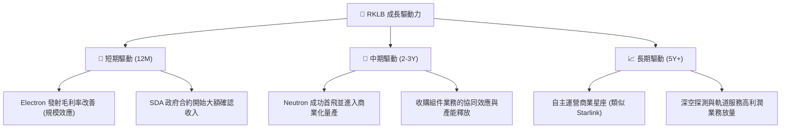

---

## 9. 風險矩陣

### 9.1 風險評分矩陣

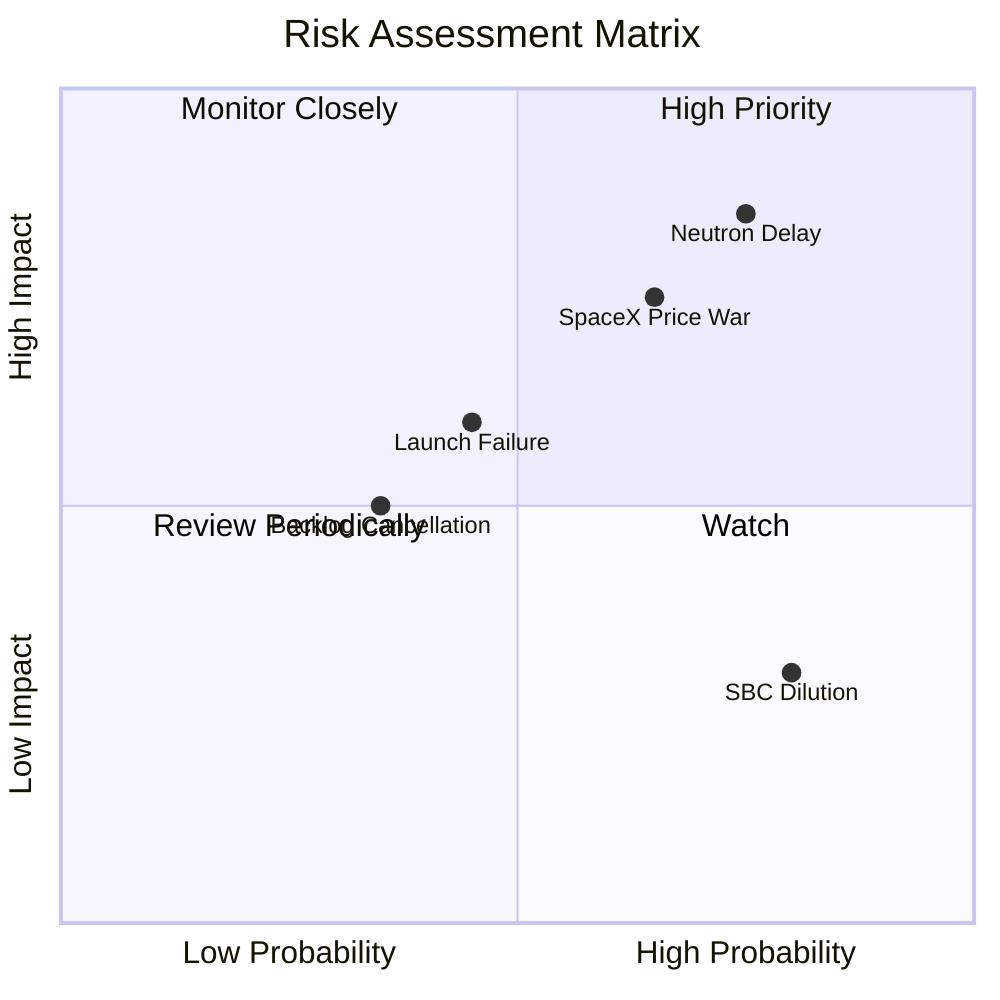

### 9.2 風險清單詳細分析

| # | 風險項目 | 發生機率 | 財務衝擊 | 風險評分 | 緩解措施 |
|---|----------|----------|----------|----------|----------|
| 1 | 🔴 **Neutron 首飛延遲** | 高 (75%) | 高 (-20% 估值) | 🔴 8.5/10 | 建立充足的現金緩衝（$1.38B），確保即使延遲 12-18 個月也不會出現資金鏈斷裂。 |
| 2 | 🔴 **SpaceX 降價競爭** | 中高 (65%) | 中高 (-15% 營收) | 🔴 7.2/10 | 加速航天系統（Space Systems）高利潤業務轉型，降低對單一發射業務的依賴。 |
| 3 | 🟡 **Electron 發射失敗** | 中 (45%) | 中 (-5% 營收) | 🟡 5.8/10 | 提高質量控制標準，LC-1 與 LC-2 雙發射台備份，確保發射中止後能迅速恢復。 |
| 4 | 🟡 **客戶集中度高** | 中 (35%) | 高 (-15% 營收) | 🟡 5.5/10 | 積極拓展商業客戶與國際政府（如日本、韓國、歐洲）的發射與組件合約。 |

---

## 10. 投資建議

### 10.1 最終綜合評級雷達圖

```
╔══════════════════════════════════════════════════════════════╗
║                RKLB 最終綜合投資評級                        ║
╠══════════════════════════════════════════════════════════════╣
║                                                              ║
║  基本面強度：  8.5/10  ▓▓▓▓▓▓▓▓▓▓▓▓▓▓▓▓▓░░░  ★★★★☆     ║
║  成長動能：    9.0/10  ▓▓▓▓▓▓▓▓▓▓▓▓▓▓▓▓▓▓░░  ★★★★★     ║
║  財務防禦力：  9.5/10  ▓▓▓▓▓▓▓▓▓▓▓▓▓▓▓▓▓▓▓░  ★★★★★     ║
║  估值安全邊際：3.5/10  ▓▓▓▓▓▓▓░░░░░░░░░░░░░  ★☆☆☆☆     ║
║                                                              ║
║  綜合投資評分：7.6/10  ▓▓▓▓▓▓▓▓▓▓▓▓▓▓▓░░░░░  🏆 評級：買入  ║
║                                                              ║
║  💡 評語：這是一檔典型的「高風險、高回報」太空科技龍頭股。    ║
║     極佳的資產負債表提供了容錯空間，適合長線配置。           ║
╚══════════════════════════════════════════════════════════════╝
```

### 10.2 目標價與隱含報酬率

| 情境 | 機率權重 | 12M 目標價 | 當前股價 | 隱含報酬率 |
|------|---------|-----------|----------|------------|
| 🔴 悲觀情境 | 20% | $55.00 | $81.04 | -32.1% |
| 🟡 **基準情境** | **60%** | **$116.50** | **$81.04** | **+43.75%** |
| 🟢 樂觀情境 | 20% | $150.00 | $81.04 | +85.1% |
| **加權預期目標價** | **100%** | **$110.90** | **$81.04** | **+36.85%** |

### 10.3 買入時機與觸發因素

```
╔══════════════════════════════════════════════════════════════════╗
║                  ✅ RKLB 投資行動 Checklist                      ║
╠══════════════════════════════════════════════════════════════════╣
║                                                                  ║
║  立即買入觸發條件（多數符合）：                                  ║
║  ✅ 股價回檔至 $75.00 - $80.00 區間（提供更佳 P/S 安全邊際）     ║
║  ✅ Neutron Archimedes 引擎成功完成全時程熱試車 (Hot Fire)       ║
║  ✅ 航天系統（Space Systems）單季營收年增率維持 >40%             ║
║                                                                  ║
║  加碼觸發條件（出現以下任一）：                                  ║
║  ☐ Neutron 成功首飛並將模擬載荷送入軌道                          ║
║  ☐ 宣佈贏得超過 5 億美元的單一商業/政府星座製造合約               ║
║  ☐ 單季 GAAP 營運現金流 (OCF) 首次轉正                           ║
║                                                                  ║
║  減碼/停損觸發條件（出現以下任一）：                             ║
║  ☐ Neutron 首飛發生爆炸且調查顯示有重大設計缺陷（停損）          ║
║  ☐ 核心管理層（尤其是創辦人 Peter Beck）離職                     ║
║  ☐ 季度營收年增率跌破 20%，顯示成長動能嚴重失速                  ║
╚══════════════════════════════════════════════════════════════════╝
```

### 10.4 投資人適配度分析

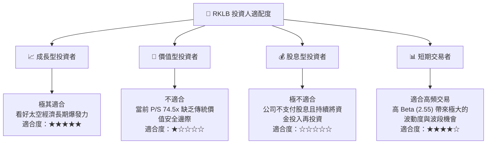

### 10.5 每季財報監控清單（Quarterly Watch List）

為了確保本投資論點的持續有效性，投資人應在每季財報中重點監控以下指標：

| 監控指標 | 基準值 (Q1 2026) | 觸發加碼門檻 | 觸發減碼/警報門檻 | 監控意義 |
|----------|-----------------|--------------|------------------|----------|
| **航天系統營收佔比** | 65.0% | >70.0% | <50.0% | 評估高利潤轉型是否持續。 |
| **整體毛利率** | 36.6% | >40.0% | <30.0% | 評估營運槓桿與定價能力。 |
| **總現金儲備** | $1.38B | >$1.50B | <$800M | 評估 Neutron 研發的資金安全邊際。 |
| **在手訂單 (Backlog)** | 持續成長 | YoY 成長 >30% | 成長停滯或下滑 | 評估未來營收能見度。 |
| **SBC / 營收比例** | 11.8% | <8.0% | >15.0% | 監控現有股東的股權稀釋風險。 |

### 10.6 反面論證：什麼會證明論點錯誤（What Would Change My Mind）

```
╔══════════════════════════════════════════════════════════════════╗
║              ⚠️ RKLB 論點失效條件（Disconfirming Evidence）     ║
╠══════════════════════════════════════════════════════════════════╣
║  本投資論點在下列情況成立時應重新檢視或果斷退出：                ║
║                                                                  ║
║  ☐ Neutron 火箭首飛時間延遲至 2027 年下半年以後                  ║
║  ☐ 航天系統業務毛利率連續兩季低於 30%                            ║
║  ☐ 季度自由現金流 (FCF) 流出量擴大至單季 -$150M 以上（消耗過快） ║
║  ☐ 發生連續兩次以上的 Electron 發射失敗，導致客戶信任崩塌        ║
║  ☐ SpaceX 將 Falcon 9 Ride-share 價格減半，實施毀滅性價格戰      ║
╚══════════════════════════════════════════════════════════════════╝
```

---

> **免責聲明**：本報告僅供學術與投資研究參考，不構成任何買賣建議。投資太空科技及高成長、高波動股票具有極高風險，讀者在做出投資決策前應自行評估風險並諮詢專業理財顧問。