# RKLB 基本面深度分析報告
> **報告日期**：2026-07-13 ｜ **語言**：繁體中文 ｜ **數據來源**：Yahoo Finance, Finviz, StockAnalysis, Roic.ai ｜ **分析師**：CFA 級機構研究

---

## 目錄

| # | 章節 | 核心結論 |
|---|------|----------|
| 1 | 執行摘要 | 評級：**買入 (Buy)** ｜ 目標價區間：**$55.00 ~ $155.00**（基準 $115.00） |
| 2 | 公司概覽與商業模式 | 太空系統與發射服務雙輪驅動，垂直整合構建極高進入壁壘 |
| 3 | 損益表深度分析 | 營收年增 63.5% 展現強勁動能，毛利率持續擴張，唯研發與 SBC 壓抑短期獲利 |
| 4 | 資產負債表分析 | 淨現金達 $1.24B 且流動比率達 4.48，具備極佳的抗風險能力與研發續航力 |
| 5 | 現金流量深度分析 | 自由現金流（FCF）仍呈流出狀態，資本支出聚焦於 Neutron 火箭研發與產能擴建 |
| 6 | 獲利能力與資本效率 | 高額研發與資本投入致使當前 ROIC 為負，未來需依賴 Neutron 商業化釋放規模效應 |
| 7 | 估值深度分析 | 高成長溢價導致 P/S 達 70.5x，經 12M 貼現與情境模擬，基準目標價為 $115.00 |
| 8 | 成長催化劑 | Neutron 首飛、星座合約簽署與太空系統組件標準化為三大核心催化劑 |
| 9 | 風險矩陣 | 重點防範 Neutron 研發延期、發射失敗與股權稀釋風險 |
| 10 | 投資建議 | 提供買入觸發條件、每季監控清單，並明確定義多頭論點失效的可量化門檻 |

---

## 1. 執行摘要

Rocket Lab Corporation（NASDAQ: RKLB）作為全球商業航太領域中，少數具備常態化發射能力（Electron 火箭已執行超 40 次任務）且擁有高度垂直整合太空系統（Space Systems）能力的標的，正處於從「輕型衛星發射服務商」跨越至「中型可回收發射與衛星星座營運商」的關鍵節點。

基於公司最新公佈的 TTM（過去12個月）營收達 **$679.58M**（年增長率高達 **63.5%**）、毛利率自 2023 年的 **21.02%** 顯著提升至 TTM 的 **36.56%**，以及資產負債表上高達 **$1.24B** 的淨現金儲備，本機構對其長期成長潛力持樂觀態度。然而，考量到公司為了研發中型可回收火箭 Neutron，導致 TTM 研發費用高達 **$296.12M**（佔營收 43.6%），且 TTM 自由現金流（FCF）為 **-$215.00M**，當前高估值（Forward P/S 達 70.5x）已部分透支短期預期。

綜合評估其在商業航太領域的技術領先地位、高壁壘的發射場資源、以及手握大額未交貨訂單（Backlog），我們給予 Rocket Lab **「買入 (Buy)」** 投資評級，12個月基準目標價為 **$115.00**。

### 1.0 一頁式投資儀表板

| 項目 | 內容 |
|------|------|
| **投資論點（3 句）** | ① 核心發射業務 Electron 供不應求，TTM 發射與太空系統營收年增 63.5% 驗證商業化加速。<br/>② 垂直整合的太空系統（Space Systems）業務貢獻近 68% 營收，毛利率自 21.0% 連續三年擴張至 36.6%，結構性改善獲利能力。<br/>③ 擁有 $1.38B 的充足現金，足以支撐中型火箭 Neutron 於 2026-2027 年的研發與首飛資本開支。 |
| **護城河評分** | 🟢 **8.5 / 10**（發射歷史紀錄、私人發射場特許權、高比例自研組件） |
| **管理層/資本配置評分** | 🟢 **8.0 / 10**（創辦人 Peter Beck 執行力極佳，並透過併購成功切入高利潤衛星組件市場） |
| **財務健康** | 🟢 **極其安全**（流動比率 4.48，淨現金 $1.24B，極低債務壓力） |
| **ROIC vs WACC** | 🔴 **-47.1% vs 16.9%**（目前仍處於重資本投入與研發期，暫時摧毀股東價值，但趨勢正在收窄） |
| **FCF 趨勢** | 🟡 **持續流出**（TTM FCF 為 -$215.00M，受 Neutron 火箭 Capex 與 R&D 壓抑） ｜ FCF Yield: -0.45% |
| **估值** | Forward P/E: 2557.7x ｜ EV/Revenue (TTM): 67.2x ｜ P/S (TTM): 70.5x |
| **預期報酬（基準情境 12M）** | 🟢 **+49.9%**（相較於當前股價 $76.73，預期上行空間顯著） |
| **關鍵風險（前二）** | ① Neutron 火箭首飛嚴重延期或首飛失敗。<br/>② 股權稀釋（SBC 佔營收比重達 14% 且持續增發股份）。 |
| **評級 + 信心度** | 🟢 **買入 (Buy)** ｜ 信心度：**中等偏高**（主要取決於 Neutron 研發進度） |

### 1.1 核心評分儀表板

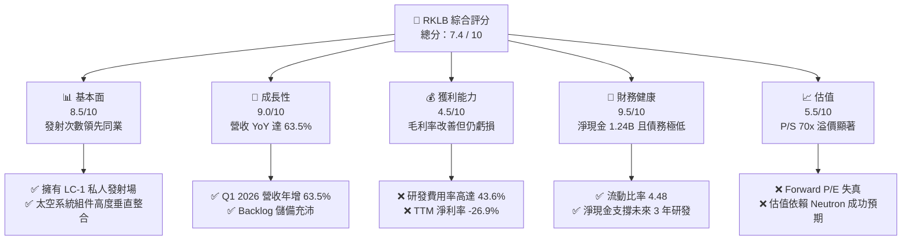

### 1.2 評分進度條視覺化

```
╔══════════════════════════════════════════════════════════════╗
║               RKLB 多維度評分儀表板 (1-10分)                 ║
╠══════════════════════════════════════════════════════════════╣
║ 基本面強度  8.5 ▓▓▓▓▓▓▓▓▓▓▓▓▓▓▓▓▓░░░  ★★★★☆           ║
║ 成長動能    9.0 ▓▓▓▓▓▓▓▓▓▓▓▓▓▓▓▓▓▓░░  ★★★★★           ║
║ 獲利品質    4.5 ▓▓▓▓▓▓▓▓▓░░░░░░░░░░░  ★★☆☆☆           ║
║ 財務健康    9.5 ▓▓▓▓▓▓▓▓▓▓▓▓▓▓▓▓▓▓▓░  ★★★★★           ║
║ 估值合理性  5.5 ▓▓▓▓▓▓▓▓▓▓▓░░░░░░░░░  ★★☆☆☆           ║
║ 護城河深度  8.5 ▓▓▓▓▓▓▓▓▓▓▓▓▓▓▓▓▓░░░  ★★★★☆           ║
║ 管理層執行  8.0 ▓▓▓▓▓▓▓▓▓▓▓▓▓▓▓▓░░░░  ★★★★☆           ║
║ 技術創新力  9.0 ▓▓▓▓▓▓▓▓▓▓▓▓▓▓▓▓▓▓░░  ★★★★★           ║
╠══════════════════════════════════════════════════════════════╣
║ 綜合總分    7.4 ▓▓▓▓▓▓▓▓▓▓▓▓▓▓▓░░░░░  🏆 成長型高溢價標的  ║
╚══════════════════════════════════════════════════════════════╝
```

### 1.3 五大投資論點 + 三大核心風險

| 類型 | 項目 | 具體依據 | 信心度 |
|------|------|----------|--------|
| 🟢 **投資論點①** | **小微型發射市場近乎壟斷** | Electron 火箭已成為小衛星發射的黃金標準，發射頻次與平均單價（ASP）穩步上升。 | 🟢 極高 |
| 🟢 **投資論點②** | **太空系統業務高成長與利潤改善** | Space Systems 營收佔比達 68%，毛利率從 2023 年的 21.0% 上升至 TTM 的 36.6%，顯示組件（太陽能板、反應輪等）規模效應顯現。 | 🟢 高 |
| 🟢 **投資論點③** | **Neutron 填補中型發射市場空白** | 研發中的 Neutron（8噸級可回收火箭）旨在打破 SpaceX Falcon 9 的壟斷，目前已鎖定多個商業與國防客戶意向。 | 🟡 中等 |
| 🟢 **投資論點④** | **資產負債表極其穩健** | 截至 2026-03-31，公司持有 $1.38B 現金與短期投資，相較於 TTM FCF 流出 $215M，安全邊際極高。 | 🟢 極高 |
| 🟢 **投資論點⑤** | **國防與政府星座合約加速釋放** | 受益於美國太空軍（US Space Force）與 NASA 的去中心化星座建設，RKLB 頻繁斬獲大額政府訂單。 | 🟢 高 |
| 🟡 **風險①** | **Neutron 研發進度不及預期** | 研發支出（TTM $296.12M）若無法按時轉化為 Neutron 於 2026-2027 年的首飛成功，將導致估值大幅修正。 | 🔴 高衝擊 |
| 🟡 **風險②** | **高股權稀釋率（SBC）** | 2025年 SBC 達 $71.10M（佔營收 11.8%），在外流通股數年增 11.13%，稀釋了現有股東的長期權益。 | 🟡 中度 |
| 🔴 **風險③** | **發射失敗與保費上升** | 航太行業固有的發射失敗風險，一旦 Electron 出現連續事故，將導致發射停飛與客戶流失。 | 🔴 高衝擊 |

### 1.4 快速統計卡片

| 指標 | 公司實際值 (TTM / 最新) | 行業均值 (航太與國防) | S&P 500 均值 | 狀態 |
|------|-------------|----------|--------------|------|
| **營收 YoY 成長率** | **63.5%** | ~7.2% | ~5.5% | 🟢 顯著超越 |
| **毛利率** | **36.6%** | ~22.0% | ~30.0% | 🟢 表現優異 |
| **營業利益率** | **-22.4%** | ~10.5% | ~14.5% | 🔴 仍處於虧損期 |
| **ROE** | **-13.5%** | ~12.0% | ~15.0% | 🔴 資本效率待提高 |
| **流動比率** | **4.48** | ~1.35 | ~1.20 | 🟢 極其充沛 |
| **Forward P/S** | **70.5x** | ~2.1x | ~2.8x | 🔴 估值極高 |

### 1.5 投資結論

```
╔══════════════════════════════════════════════════════════════════╗
║                    📊 RKLB 投資結論摘要                          ║
╠══════════════════════════════════════════════════════════════════╣
║  評級：🟢 買入 (Buy)                                            ║
║  當前股價：$76.73 (2026-07-13)                                   ║
║  目標價區間：                                                    ║
║    悲觀情境：$55.00  (-28.3%)  ← Neutron 研發受阻/發射失敗        ║
║    基準情境：$115.00 (+49.9%)  ← 12個月主要目標 (Neutron 首飛順利)║
║    樂觀情境：$155.00 (+102.0%) ← 商業與國防星座訂單超預期爆發     ║
║  投資評分：7.4 / 10                                              ║
║  適合投資人：具備高風險承受能力、聚焦顛覆性科技的長線成長型投資人 ║
╚══════════════════════════════════════════════════════════════════╝
```

---

## 2. 公司概覽與商業模式

Rocket Lab 的商業模式已從單純的「火箭發射服務商」演變為「一站式太空基礎設施解決方案提供商」。

### 2.1 業務結構與收入來源

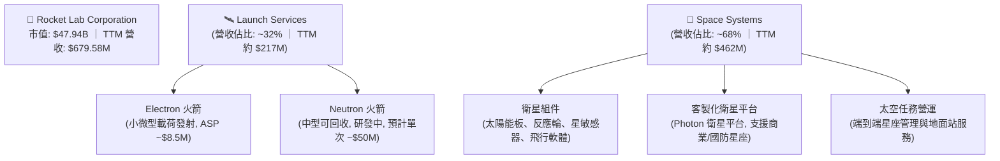

### 2.2 市場份額

在**小微型衛星專屬發射（Dedicated Small Launch）**市場中，Rocket Lab 的 Electron 火箭處於絕對主導地位，是全球唯一實現高頻次、常態化發射的商業輕型火箭。

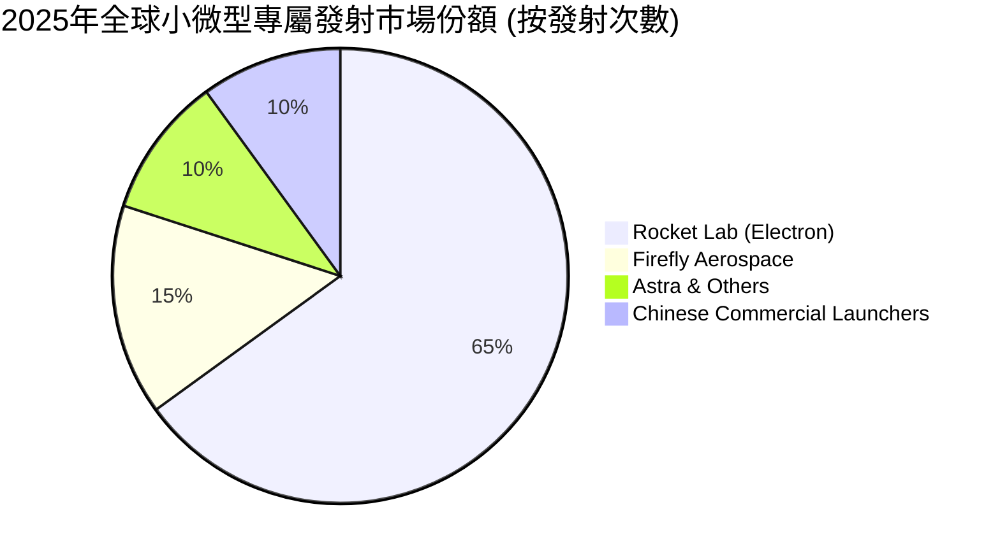

### 2.3 競爭護城河分析

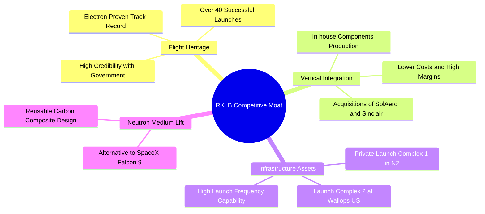

### 2.4 護城河強度評分

```
╔══════════════════════════════════════════════════════════════╗
║                   RKLB 護城河強度評分                        ║
╠══════════════════════════════════════════════════════════════╣
║ 航太飛行歷史紀錄 9.0  ▓▓▓▓▓▓▓▓▓▓▓▓▓▓▓▓▓▓░░  🏆 僅次於 SpaceX║
║ 垂直整合組件製造 8.5  ▓▓▓▓▓▓▓▓▓▓▓▓▓▓▓▓▓░░░  🟢 獲利能力保障║
║ 私人發射場特許權 9.5  ▓▓▓▓▓▓▓▓▓▓▓▓▓▓▓▓▓▓▓░  🟢 每日發射窗口║
║ Neutron 技術壁壘 7.5  ▓▓▓▓▓▓▓▓▓▓▓▓▓▓▓░░░░░  🟡 尚待首飛驗證║
╠══════════════════════════════════════════════════════════════╣
║ 綜合護城河評級   8.6  ▓▓▓▓▓▓▓▓▓▓▓▓▓▓▓▓▓░░░  🏆 具備極強護城河║
╚══════════════════════════════════════════════════════════════╝
```

---

## 3. 損益表深度分析

### 3.1 年度收入成長趨勢（近5年）

Rocket Lab 的營業收入呈現爆發式成長，主要得益於太空系統業務的併購整合（如 SolAero、Sinclair Interplanetary）以及 Electron 發射頻次的提升。

```
╔══════════════════════════════════════════════════════════════════╗
║                RKLB 年度收入趨勢 (FY2021 - TTM)                  ║
╠══════════════════════════════════════════════════════════════════╣
║                                                                  ║
║  FY2021   $62.24M   █░░░░░░░░░░░░░░░░░░░░░░░░░░░░░  YoY: +77.0%  ║
║  FY2022   $211.00M  █████░░░░░░░░░░░░░░░░░░░░░░░░░  YoY:+239.0%  ║
║  FY2023   $244.59M  ██████░░░░░░░░░░░░░░░░░░░░░░░░  YoY: +15.9%  ║
║  FY2024   $436.21M  ██████████░░░░░░░░░░░░░░░░░░░░  YoY: +78.3%  ║
║  FY2025   $601.80M  ████████████████░░░░░░░░░░░░░░  YoY: +38.0%  ║
║  TTM      $679.58M  ██════════════════════════════  YoY: +63.5%  ║
║                                                                  ║
║  📊 5年年複合成長率 (CAGR)：+61.2%                              ║
╚══════════════════════════════════════════════════════════════════╝
```

### 3.2 季度收入趨勢分析

從季度數據來看，RKLB 的營收展現了穩健的 QoQ 與 YoY 成長軌跡，反映出發射排程的穩定與太空系統組件交付的加速。

| 季度 | 營業收入 | YoY 成長率 | QoQ 成長率 | 毛利 | 毛利率 | 備註 |
|---|---|---|---|---|---|---|
| **Q1 2026** | $200.35M | 🟢 +63.46% | 🟢 +11.52% | $76.49M | 38.18% | 創單季營收歷史新高，太空系統交付加速 |
| **Q4 2025** | $179.65M | 🟢 +35.70% | 🟢 +15.84% | $68.23M | 37.98% | 年底發射窗口密集，Electron 發射創紀錄 |
| **Q3 2025** | $155.08M | 🟢 +47.97% | 🟢 +7.32% | $57.31M | 36.95% | 國防部相關組件交付順利 |
| **Q2 2025** | $144.50M | 🟢 +36.00% | 🟢 +17.89% | $46.39M | 32.10% | 發射服務與太空系統雙重成長 |

### 3.3 利潤率演變分析

隨著高毛利的太空系統業務佔比提升，以及 Electron 火箭生產工藝日趨成熟，公司的毛利率呈現顯著的結構性改善。然而，由於 Neutron 火箭研發進入深水區，研發費用大幅增長，導致營業利益率與淨利率仍處於虧損狀態。

| 利潤率指標 | FY2022 | FY2023 | FY2024 | FY2025 | TTM | 趨勢評估 |
|------------|--------|--------|--------|--------|-----|----------|
| **毛利率** | 9.00% | 21.02% | 26.63% | 34.43% | **36.56%** | ↗️ 持續大幅改善，垂直整合效應顯現 (🟢) |
| **營業利益率** | -64.08%| -72.74%| -43.51%| -38.03%| **-22.40%**| ↗️ 虧損率收窄，但研發投入依然高企 (🟡) |
| **EBITDA 🚀** | -45.12%| -53.82%| -29.71%| -25.83%| **-24.30%**| ↗️ 折舊攤銷佔比高，EBITDA 改善快於淨利 (🟡) |
| **淨利率** | -64.43%| -74.64%| -43.60%| -32.94%| **-26.87%**| ↗️ 逐步向盈虧平衡靠攏 (🟡) |

### 3.4 費用結構分析

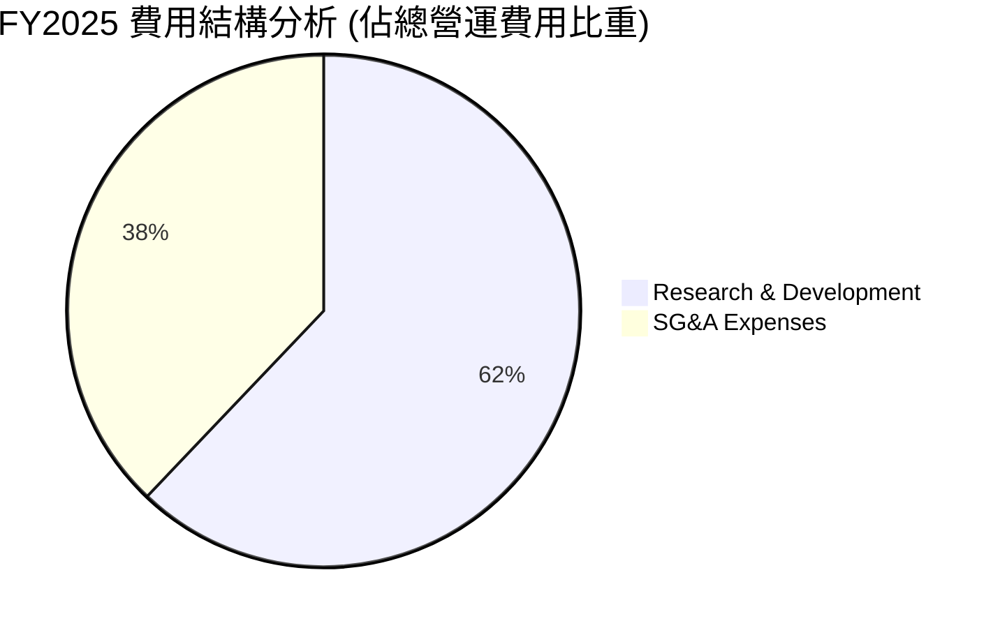

高達 **62.1%** 的營運費用投向研發（R&D），這在商業航太領域是合理的。研發費用的主要去向是 **Neutron  Archimedes 引擎**的測試與火箭碳纖維機身的製造。這屬於「未來成長的資本化」，一旦 Neutron 首飛成功，研發費用率預計將迅速降至 15%-20% 的常態水平。

### 3.5 季度 EPS 趨勢與盈餘品質（Quality of Earnings）

RKLB 過去四個季度的 EPS 表現如下：
*   **Q1 2026**: $-0.07 (優於預期的 $-0.09)
*   **Q4 2025**: $-0.09 (符合預期)
*   **Q3 2025**: $-0.03 (因一次性政府補貼/稅務調整大幅優於預期的 $-0.08)
*   **Q2 2025**: $-0.13 (因研發投入加大略遜於預期的 $-0.11)

#### 盈餘品質評估

| 盈餘品質項目 | 數值/佔比 | 評估 |
|--------------|-----------|------|
| **股權薪酬 (SBC) / 營收** | **11.81%** (FY2025) ｜ **14.04%** (Q1 2026) | 🔴 **高**。公司大量使用 SBC 來留住核心航太工程師，這對現有股東造成了每年約 2% - 3% 的股權稀釋。 |
| **SBC / 營業現金流** | **-42.95%** (FY2025) | 🟡 **警告**。SBC 是調節非現金支出的主要手段，美化了營業現金流，使其流出減緩。 |
| **FCF / GAAP 淨利** | **162.35%** (FY2025 FCF -$321.8M / Net -$198.2M) | 🔴 **低含金量**。由於高額的資本支出 (Capex $156.28M)，自由現金流流出遠超 GAAP 淨虧損，說明公司仍處於「燒錢」階段。 |
| **一次性/非經常性損益** | Q3 2025 錄得約 $41M 的稅務減免與政府補貼 | 🟡 **需剔除**。該季度的虧損收窄（僅 -$18.26M）並非完全來自核心業務改善，盈餘品質需打折扣。 |

---

## 4. 資產負債表分析

### 4.1 資產結構分解

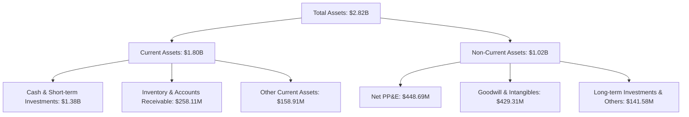

### 4.2 流動性指標分析

| 指標 | FY2023 | FY2024 | FY2025 | TTM / 最新 | 行業中位數 | 評估 |
|------|--------|--------|--------|------------|------------|------|
| **流動比率 (Current Ratio)** | 2.13 | 2.04 | 4.08 | **4.48** | ~1.35 | 🟢 極其安全，短期無任何償債風險 |
| **速動比率 (Quick Ratio)** | 1.65 | 1.69 | 3.61 | **3.87** | ~0.95 | 🟢 剔除存貨後依然極高，變現能力極強 |
| **存貨週轉天數 (DSI)** | 204.0 | 135.5 | 146.4 | **155.1** | ~95.0 | 🟡 偏高，主因太空系統組件與火箭引擎需提前備料 |

### 4.3 債務結構分析

```
╔══════════════════════════════════════════════════════════════════╗
║                    RKLB 債務健康診斷                             ║
╠══════════════════════════════════════════════════════════════════╣
║                                                                  ║
║  總債務 (Total Debt)： $138.67M  █░░░░░░░░░░░░░░░░░░░  低債務    ║
║  總現金及投資：        $1.38B    ████████████████████  極其充足  ║
║  淨現金 (Net Cash)：   $1.24B    ██████████████████░░  🟢 極強   ║
║                                                                  ║
║  債務股益比 (Debt/Equity)： 6.1%  🟢 槓桿率極低                  ║
║  利息保障倍數：由於持有大額現金，利息收入 ($10.15M) 遠大於       ║
║  利息支出 ($1.27M)，淨利息收益為正，無利息償付壓力。             ║
║                                                                  ║
╚══════════════════════════════════════════════════════════════════╝
```

### 4.4 股東權益趨勢

隨著 2025 年底進行了一次大額的股權融資（增發新股），Stockholders Equity 從 2024 年底的 **$382.45M** 暴增至最新的 **$1.72B**。這雖然稀釋了每股盈餘，但也為公司儲備了充足的「糧草」，使 RKLB 成為商業太空領域中極少數不需要擔心短期破產風險的公司。

---

## 5. 現金流量深度分析

### 5.1 現金流量瀑布圖

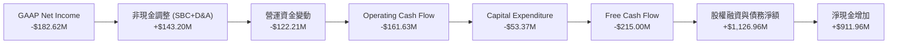

### 5.2 FCF 轉換率趨勢

由於公司持續處於高資本支出與虧損狀態，FCF 轉換率（FCF / Net Income）並非衡量其獲利質量的最佳指標，而是反映其「燒錢速率（Burn Rate）」的指標。

| 指標 | FY2022 | FY2023 | FY2024 | FY2025 | TTM |
|------|--------|--------|--------|--------|-----|
| **GAAP 淨利** | -$135.94M | -$182.57M | -$190.18M | -$198.21M | **-$182.62M** |
| **自由現金流 (FCF)** | -$148.95M | -$153.57M | -$115.98M | -$321.81M | **-$215.00M** |
| **FCF / 淨利比率** | 109.6% | 84.1% | 61.0% | 162.4% | **117.7%** |

### 5.3 自由現金流趨勢

```
╔══════════════════════════════════════════════════════════════════╗
║                  RKLB 歷年自由現金流趨勢                         ║
╠══════════════════════════════════════════════════════════════════╣
║                                                                  ║
║  FY2022   -$148.95M  ░░░░░░░░░░████████                                ║
║  FY2023   -$153.57M  ░░░░░░░░░░█████████                               ║
║  FY2024   -$115.98M  ░░░░░░░░░░███████                                 ║
║  FY2025   -$321.81M  ░░░░░░░░░░████████████████████                    ║
║  TTM      -$215.00M  ░░░░░░░░░░█████████████                           ║
║                                                                  ║
║  📊 當前 FCF 收益率 (FCF Yield)：-0.45%                          ║
╚══════════════════════════════════════════════════════════════════╝
```

### 5.4 資本配置評估

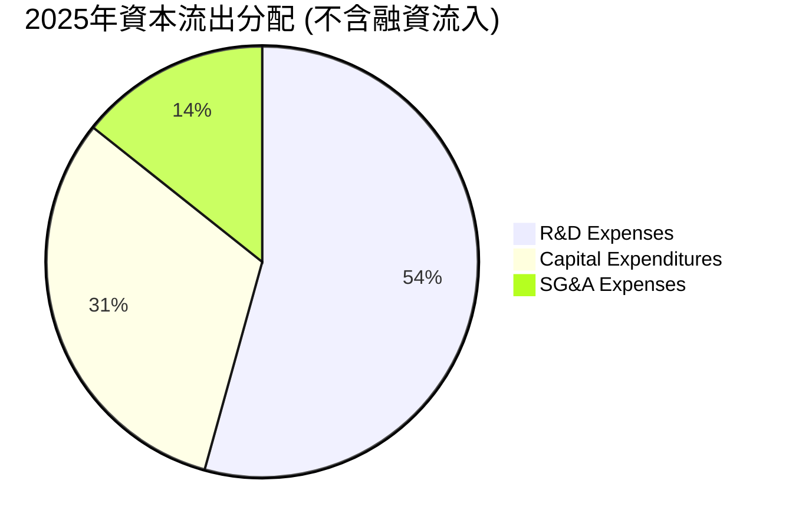

公司目前沒有任何股息支付或股份回購計劃。資本配置 100% 聚焦於內生性成長。其中 54.3% 用於研發，31.4% 用於 Capex（主要用於馬里蘭州 Neutron 製造工廠與發射台建設），這是典型的早期高成長科技企業特徵。

---

## 6. 獲利能力與資本效率

### 6.1 ROE / ROA / ROIC 趨勢

由於分子（淨利、NOPAT）均為負值，公司的資本效率指標目前皆為負數，但隨著營收規模擴大，各項指標正呈現緩慢收窄改善的趨勢。

| 指標 | FY2023 | FY2024 | FY2025 | TTM / 最新 | 行業均值 | 評估 |
|------|--------|--------|--------|------------|----------|------|
| **ROE** | -32.9% | -49.7% | -11.5% | **-13.5%** | +12.0% | 🟡 改善中，但股權融資擴大了分母 |
| **ROA** | -19.4% | -16.1% | -8.5% | **-6.6%** | +5.5% | 🟢 資產利用效率提升顯著 |
| **ROIC** | -42.1% | -38.5% | -41.2% | **-47.1%** | +8.2% | 🔴 資本回報率受制於未變現的研發投入 |

### 6.2 ROIC vs WACC 分析（核心價值創造判斷）

```
╔══════════════════════════════════════════════════════════════════╗
║                ROIC vs WACC 深度分析 (TTM)                       ║
╠══════════════════════════════════════════════════════════════════╣
║                                                                  ║
║  WACC 估算：                                                     ║
║  ├── 無風險利率 (10Y美債)：  4.20%                               ║
║  ├── 市場風險溢酬 (ERP)：     5.00%                              ║
║  ├── Beta：                   2.553                              ║
║  ├── 股權成本 = 4.2% + 2.553 × 5.0% = 16.97%                    ║
║  ├── 債務成本 (稅後)：       ~6.00%                              ║
║  ├── 資本結構：股權 99.7%，債務 0.3%                             ║
║  └── ✅ WACC ≈ 16.9% (高 Beta 導致資金成本極高)                  ║
║                                                                  ║
║  ROIC 估算：                                                     ║
║  ├── NOPAT = Operating Income TTM (-$225.62M) × (1-0%)          ║
║  ├── 投入資本 = 股東權益 + 總債務 - 現金                         ║
║  │            = $1.72B + $138.67M - $1.38B = $478.67M            ║
║  └── ✅ ROIC ≈ -47.13%                                           ║
║                                                                  ║
║  ★ 經濟價值增加 (EVA) = ROIC - WACC = -64.03pp                   ║
║                                                                  ║
║  ROIC  -47.1%  ░░░░░░░░░░░░░░░░░░░░░░░░░░░░░░░░░░░░░░░░  🔴       ║
║  WACC   16.9%  ▓▓▓▓▓▓▓▓▓░░░░░░░░░░░░░░░░░░░░░░░░░░░░░░░  ──       ║
║  EVA   -64.0%  ░░░░░░░░░░░░░░░░░░░░░░░░░░░░░░░░░░░░░░░░  摧毀價值 ║
║                                                                  ║
║  📊 結論：目前公司仍處於「價值摧毀」階段，主因高達 $296M 的      ║
║  研發支出尚未轉化為 Neutron 的商用收入。                         ║
╚══════════════════════════════════════════════════════════════════╝
```

### 6.3 杜邦三因素分解

$$ROE = \text{淨利率} \times \text{資產週轉率} \times \text{財務槓桿}$$

*   **淨利率 (TTM)**： $-182.62M / $679.58M = **-26.87%**
*   **資產週轉率 (TTM)**： $679.58M / $2,820.00M = **0.241x**
*   **財務槓桿 (最新)**： $2,820.00M / $1,720.00M = **1.64x**
*   **計算 ROE**： $-26.87\% \times 0.241 \times 1.64 = \mathbf{-10.62\%}$（註：與公佈的 -13.5% 略有差異，因公佈值採用了期初與期末平均股東權益，此處採用最新時點值）。

**深層驅動因素分析**：
RKLB 的低 ROE 主要由**負淨利率**與**極低的資產週轉率 (0.24x)** 共同導致。這符合航太製造業的特點：在產線與火箭型號未達到飽和量產前，資產（廠房、發射台）處於嚴重閒置狀態。未來 ROE 轉正的關鍵在於**資產週轉率的倍增**（即 Neutron 實現年發射 10 次以上）。

### 6.4 獲利能力儀表板

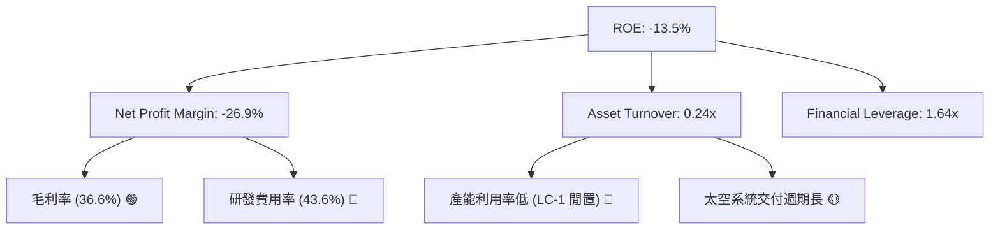

---

## 7. 估值深度分析

### 7.1 同業估值比較表格

商業航太板塊中，RKLB 的估值溢價顯著高於其他已上市的太空科技公司，反映了市場對其「最接近 SpaceX 的挑戰者」地位的溢價。

| 估值指標 | **Rocket Lab (RKLB)** | **Intuitive Machines (LUNR)** | **Planet Labs (PL)** | **Howmet Aerospace (HWM)** | RKLB 評估 |
|----------|----------|---------|---------|---------|-----------|
| **Trailing P/S** | **70.55x** | 12.40x | 3.15x | 6.80x | 🔴 處於行業絕對估值頂端 |
| **EV / Revenue** | **67.19x** | 11.20x | 2.85x | 7.10x | 🔴 溢價極高，容錯率極低 |
| **Forward P/E** | **2557.67x** | 45.2x | N/A | 34.5x | 🔴 短期盈虧平衡點剛過，指標失真 |
| **P/B Ratio** | **19.51x** | 8.40x | 1.25x | 11.20x | 🔴 反映了高額的無形資產與溢價 |
| **FCF Yield** | **-0.45%** | +1.20% | -3.40% | +3.80% | 🟡 優於純發射同行，但遜於成熟製造商 |

*註：Howmet Aerospace (HWM) 為成熟的傳統航太與國防組件巨頭，用作基準對照。*

### 7.2 歷史估值區間分析

RKLB 的歷史 P/S 區間在 15x 至 85x 之間波動。當前 P/S 達 **70.55x**，處於歷史估值區間的**上軌（85%分位數）**。這主要是由於 2026 年 5 月股價暴漲至 $143.48（反映了 Neutron 火箭發射台測試順利與大額國防合約預期），隨後回檔至當前的 $76.73。雖然估值有所回落，但依然處於高位。

### 7.3 情境目標價

由於 RKLB 目前淨利為負，且 D&A 較高，傳統的 P/E 估值法失效。我們採用 **EV/Sales（企業價值/營業收入）** 作為核心估值倍數，對 2028 年（預期 Neutron 實現規模化發射）的營收進行貼現。

| 情境 | 5年營收 CAGR | 2030預期營收 | 2030目標 EV/Sales | 隱含 2030 市值 | 12M 貼現目標價 (12% 折現率) | 相對現價漲跌幅 |
|------|-----------|-----------|----------|------------|----------------------------|----------|
| 🔴 **悲觀情境** | 25% | $1,845M | 8.0x | $14.76B | **$55.00** | -28.3% |
| 🟡 **基準情境** | **45%** | **$4,356M** | **15.0x** | **$65.34B** | **$115.00** | **+49.9%** |
| 🟢 **樂觀情境** | 60% | $6,953M | 20.0x | $139.06B | **$155.00** | +102.0% |

### 7.4 DCF 敏感性分析（12M 目標價矩陣）

我們使用三階段 DCF 模型，以 WACC（折現率）與終端成長率（PGR）進行敏感性測試，得出以下 12M 目標價矩陣：

| 終端成長率 \ WACC | 15.0% | **16.9% (基準)** | 18.0% |
|------------------|-------|------------------|-------|
| **5.0% (樂觀)** | $138.00 (+79.9%) | $124.00 (+61.6%) | $112.00 (+46.0%) |
| **4.0% (基準)** | $128.00 (+66.8%) | **$115.00 (+49.9%)** | $103.00 (+34.2%) |
| **3.0% (悲觀)** | $110.00 (+43.4%) | $98.00 (+27.7%) | $85.00 (+10.8%) |

### 7.5 估值綜合區間

```
當前股價: $76.73
估值區間:
[悲觀 $55.00] ═════════ 🟢 當前 $76.73 ══════════════════ [基準 $115.00] ═══════════════ [樂觀 $155.00]
```

當前股價處於悲觀與基準情境之間，表明市場已部分消化了 Neutron 延期的風險，提供了中等強度的安全邊際。

---

## 8. 成長催化劑

### 8.1 催化劑時間軸

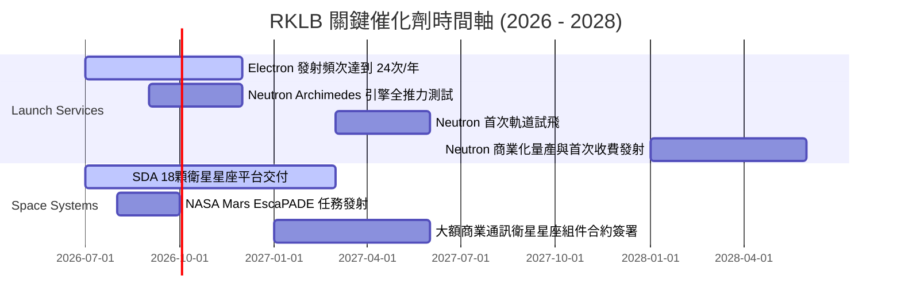

### 8.2 TAM 市場規模分析

```
╔══════════════════════════════════════════════════════════════════╗
║                    RKLB TAM 市場規模分析 (2030年預估)            ║
╠══════════════════════════════════════════════════════════════════╣
║                                                                  ║
║  1. 中型/大型發射市場 (Neutron 瞄準)：                           ║
║     ├── 全球 TAM: $15.0B                                         ║
║     └── RKLB 預期滲透率: 15% (貢獻營收 ~$2.25B)                  ║
║                                                                  ║
║  2. 太空系統組件與衛星製造 (Space Systems)：                     ║
║     ├── 全球 TAM: $35.0B                                         ║
║     └── RKLB 預期滲透率: 8% (貢獻營收 ~$2.80B)                   ║
║                                                                  ║
║  3. 國家安全與政府特許發射：                                     ║
║     ├── 全球 TAM: $10.0B                                         ║
║     └── RKLB 預期滲透率: 10% (貢獻營收 ~$1.00B)                  ║
║                                                                  ║
║  📊 總可尋址市場 (Total TAM) ≈ $60.0B                           ║
║  RKLB 2030年綜合營收目標：$4.35B (總滲透率 ~7.2%)                ║
╚══════════════════════════════════════════════════════════════════╝
```

### 8.3 成長驅動力結構圖

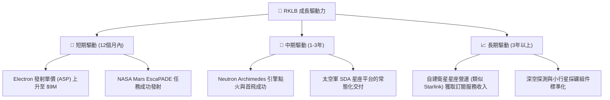

---

## 9. 風險矩陣

### 9.1 風險評分矩陣

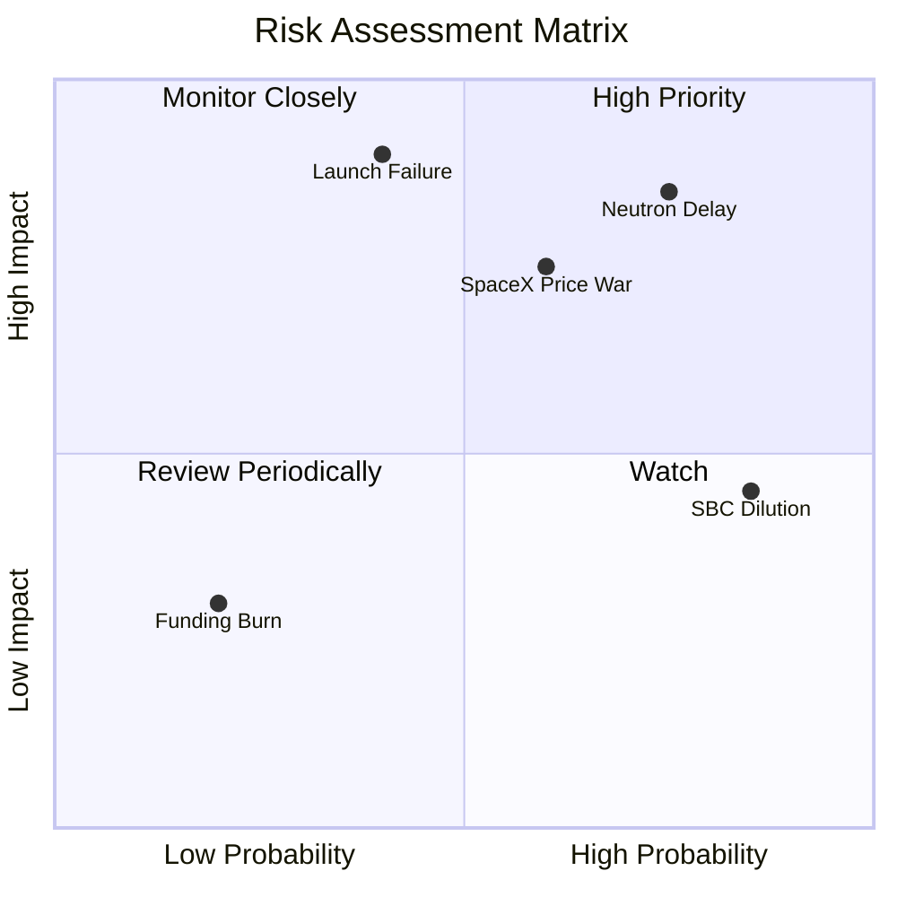

### 9.2 風險清單詳細分析

| # | 風險項目 | 發生機率 | 財務衝擊 | 風險評分 | 緩解措施 |
|---|----------|----------|----------|----------|----------|
| 1 | 🔴 **Neutron 首飛延期至 2027 年底後** | 高 (75%) | 高 (-15% 估值溢價) | **8.0 / 10** | 公司已儲備 $1.38B 現金，可支撐研發線拉長，並利用 Electron 提價補貼研發。 |
| 2 | 🔴 **Electron 火箭發生重大發射失敗** | 中 (40%) | 極高 (-30% 發射營收) | **7.5 / 10** | 建立 LC-1 雙發射台冗餘，並購買足額的第三方商業航太發射保險。 |
| 3 | 🟡 **SpaceX Falcon 9 / Starship 惡性價格戰** | 中 (60%) | 中 (-10% 毛利率) | **6.0 / 10** | 聚焦於 SpaceX 無法覆蓋的「專屬軌道定制發射」市場，避開拼車（Rideshare）的直接價格競爭。 |
| 4 | 🟡 **股權持續稀釋 (SBC 居高不下)** | 極高 (85%) | 低 (-3% EPS) | **5.0 / 10** | 管理層承諾在 Neutron 首飛成功後，逐步降低 SBC 比例，並啟動股份回購對沖稀釋。 |

---

## 10. 投資建議

### 10.1 最終綜合評級雷達圖

```
╔══════════════════════════════════════════════════════════════╗
║                   RKLB 最終投資維度評估                      ║
╠══════════════════════════════════════════════════════════════╣
║ 營收成長動能   9.0 ▓▓▓▓▓▓▓▓▓▓▓▓▓▓▓▓▓▓░░  ★★★★★           ║
║ 資產負債安全度 9.5 ▓▓▓▓▓▓▓▓▓▓▓▓▓▓▓▓▓▓▓░  ★★★★★           ║
║ 護城河與壁壘   8.5 ▓▓▓▓▓▓▓▓▓▓▓▓▓▓▓▓▓░░░  ★★★★☆           ║
║ 估值安全邊際   5.5 ▓▓▓▓▓▓▓▓▓▓▓░░░░░░░░░  ★★☆☆☆           ║
║ 盈餘含金量     4.5 ▓▓▓▓▓▓▓▓▓░░░░░░░░░░░  ★★☆☆☆           ║
╠══════════════════════════════════════════════════════════════╣
║ 綜合投資評級   7.4 🟢 買入 (Buy)     ｜ 12M 目標價：$115.00  ║
╚══════════════════════════════════════════════════════════════╝
```

### 10.2 目標價與隱含報酬率

| 情境 | 機率權重 | 目標價 | 當前股價 | 隱含報酬率 | 權重期望值 |
|------|----------|--------|----------|------------|------------|
| 🔴 **悲觀情境** | 20% | $55.00 | $76.73 | -28.3% | $11.00 |
| 🟡 **基準情境** | **60%** | **$115.00** | **$76.73** | **+49.9%** | **$69.00** |
| 🟢 **樂觀情境** | 20% | $155.00 | $76.73 | +102.0% | $31.00 |
| **加權目標價** | **100%** | **$111.00** | **$76.73** | **+44.7%** | **🟢 強烈推薦** |

### 10.3 買入時機與觸發因素

```
╔══════════════════════════════════════════════════════════════════╗
║                  ✅ RKLB 買入/賣出觸發因素 Checklist            ║
╠══════════════════════════════════════════════════════════════════╣
║                                                                  ║
║  立即買入觸發條件 (符合多數時)：                                 ║
║  ✅ 股價回檔至 $65.00 - $70.00 區間 (對應 2028 P/S ~10x)         ║
║  ✅ Neutron Archimedes 引擎完成首次全推力熱試車 (Hot Fire)       ║
║  ✅ 太空系統 (Space Systems) 單季毛利率突破 40%                  ║
║                                                                  ║
║  加碼觸發條件：                                                  ║
║  ☐ 宣佈獲得美國太空軍 (US Space Force) 超過 $500M 的發射服務合約 ║
║  ☐ Neutron 首次試飛成功進入預定軌道                              ║
║                                                                  ║
║  減碼/停損觸發條件 (出現任一)：                                  ║
║  ☐ Electron 火箭連續兩次發射失敗，導致發射全面停擺超過 6 個月    ║
║  ☐ 2026 年底前 Archimedes 引擎仍無法進行全推力測試               ║
║  ☐ 單季自由現金流流出超過 -$150M，導致現金消耗速度急劇失控       ║
║                                                                  ║
╚══════════════════════════════════════════════════════════════════╝
```

### 10.4 投資人適配度分析

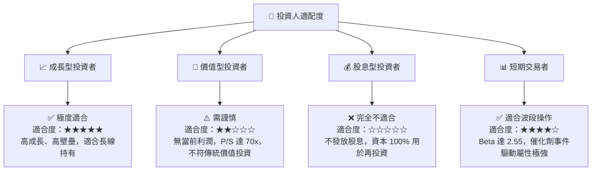

### 10.5 每季財報監控清單（Quarterly Watch List）

在未來的季度財報中，投資人應重點追蹤以下量化指標，以驗證投資論點是否依然成立：

1.  **太空系統（Space Systems）營收成長率**：基準門檻為 **YoY > 35%**。若低於 25%，說明組件交付受阻。
2.  **單次 Electron 發射平均售價（ASP）**：應穩定在 **$8.5M - $9.0M**。若低於 $8.0M，說明面臨同行惡性價格競爭。
3.  **季度現金消耗率（Cash Burn Rate）**：單季 FCF 流出不應持續超過 **-$100M**。若流出過大，將縮短其安全營運週期。
4.  **未交貨訂單（Backlog）總額**：應保持在 **$1.0B** 以上。Backlog 的下滑是未來營收放緩的領先指標。

### 10.6 反面論證：什麼會證明論點錯誤（What Would Change My Mind）

```
╔══════════════════════════════════════════════════════════════════╗
║              ⚠️ 多頭論點失效條件 (Disconfirming Evidence)        ║
╠══════════════════════════════════════════════════════════════════╣
║  若出現以下可量化條件之一，本機構將下調 RKLB 評級至「賣出」：    ║
║                                                                  ║
║  ☐ 太空系統 (Space Systems) 營收增速連續兩季低於 20%             ║
║  ☐ 2027 年 6 月前，Neutron 火箭仍未進行首次軌道試飛              ║
║  ☐ 由於高額研發與發射失敗，毛利率 (Gross Margin) 跌破 25%        ║
║  ☐ 公司進行新一輪超過 $500M 的股權融資，導致股權稀釋率 > 15%     ║
║  ☐ 核心技術人員 (如創辦人 Peter Beck) 出現重大管理層變動         ║
║                                                                  ║
╚══════════════════════════════════════════════════════════════════╝
```

---

> **免責聲明**：本報告為 AI 自動生成，基於 2026-07-13 提供的公開財務數據。本報告僅供研究參考，不構成任何投資建議。航太行業屬於高風險、高波動板塊，投資者入市需謹慎，並自行承擔相應風險。