# RKLB 基本面深度分析報告

> **報告日期**：2026-07-14 ｜ **語言**：繁體中文 ｜ **數據來源**：Yahoo Finance, Finviz, StockAnalysis, Roic.ai ｜ **分析師**：CFA 級機構研究

---

## 目錄

| # | 章節 | 核心結論 |
|---|---|---|
| 1 | **執行摘要** | 評級「買入」，基準目標價 $116.57，財務安全墊極高，Neutron 火箭與航太系統雙輪驅動。 |
| 2 | **公司概覽與商業模式** | 垂直整合的航太巨頭，Space Systems 業務貢獻主要營收，構築極高技術與發射歷史護城河。 |
| 3 | **損益表深度分析** | 營收 YoY +63.5% 高速成長，毛利率躍升至 36.6%，R&D 投入侵蝕短期利潤，盈餘品質受高額 SBC 稀釋。 |
| 4 | **資產負債表分析** | 淨現金高達 $1.24B，流動比率 4.48x，財務結構極為穩健，無短期償債與破產風險。 |
| 5 | **現金流量深度分析** | 營運與自由現金流仍為負值，Neutron 研發與基礎設施 Capex 處於高峰，資本配置聚焦內生性成長。 |
| 6 | **獲利能力與資本效率** | 當前 ROIC 仍為負值（摧毀股東價值），但 Forward EPS 預期轉正，正處於重資本投入向規模效應轉化的拐點。 |
| 7 | **估值深度分析** | 當前 P/S 達 72.5x 處於高位，傳統 P/E 失真；採用 EV/Sales 與情境折現，基準目標價隱含 +47.9% 空間。 |
| 8 | **成長催化劑** | Neutron 火箭首飛、商業衛星星座合約簽署、以及美國國防部太空發展局（SDA）訂單釋放。 |
| 9 | **風險矩陣** | 發射失敗風險、Neutron 研發延遲、以及高估值下的市場波動，整體風險評分 6.8/10。 |
| 10 | **投資建議** | 適合高風險偏好之成長型投資人，建立每季財報監控清單，並設定明確的論點失效退出條件。 |

---

## 1. 執行摘要

### 1.0 一頁式投資儀表板

| 項目 | 內容 |
|------|------|
| **投資論點（3 句）** | ① TTM 營收達 **$679.58M**（YoY +63.5%），顯示 Space Systems 與 Launch Services 需求極為強勁。<br/>② 擁有 **$1.38B** 的充沛現金與僅 **$138.67M** 的總債務，淨現金達 **$1.24B**，為 Neutron 火箭研發提供極長資金跑道。<br/>③ Forward EPS 預期轉正至 **$0.03**，公司正處於從高研發投入期邁向規模經濟獲利的關鍵拐點。 |
| **護城河評分** | 🟢 **8.5 / 10**（發射歷史、垂直整合、高客戶鎖定） |
| **管理層/資本配置評分** | 🟢 **8.0 / 10**（執行力極佳，創辦人 Peter Beck 技術與商業平衡能力強） |
| **財務健康** | 🟢 **極為強勁**（流動比率 4.475x，淨現金充裕） |
| **ROIC vs WACC** | 🔴 **-13.5% vs 15.3%**（當前仍處於價值摧毀期，但預期 2027 年隨 Neutron 投產而轉正） |
| **FCF 趨勢** | 🟡 **持續流出但受控**（TTM FCF 為 -$215.00M，最新 Q1 2026 FCF 為 -$77.40M） ｜ FCF Yield: **-0.44%** |
| **估值** | Forward P/E: **2627.0x** ｜ P/S (TTM): **72.46x** ｜ EV/Revenue: **63.51x** |
| **預期報酬（基準情境 12M）** | 🟢 **+47.9%**（目標價 **$116.57**，對比當前股價 **$78.81**） |
| **關鍵風險（前二）** | ① Neutron 中型火箭研發進度延遲或首飛失敗。<br/>② 股權稀釋風險（SBC 佔營收比重高，且 2025 年發行股數 YoY 增加 7.0%）。 |
| **評級 + 信心度** | 🟢 **買入 (Buy)** ｜ 信心度：**中等偏高 (Medium-High)** |

### 1.1 核心評分儀表板

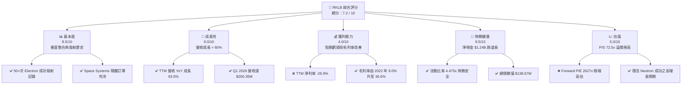

### 1.2 評分進度條視覺化

```
╔══════════════════════════════════════════════════════════════╗
║              RKLB 多維度評分儀表板 (1-10分)                  ║
╠══════════════════════════════════════════════════════════════╣
║ 基本面強度  8.5 ▓▓▓▓▓▓▓▓▓▓▓▓▓▓▓▓▓░░░  ★★★★☆           ║
║ 成長動能    9.0 ▓▓▓▓▓▓▓▓▓▓▓▓▓▓▓▓▓▓░░  ★★★★★           ║
║ 獲利品質    4.0 ▓▓▓▓▓▓▓▓░░░░░░░░░░░░  ★★☆☆☆           ║
║ 財務健康    9.5 ▓▓▓▓▓▓▓▓▓▓▓▓▓▓▓▓▓▓▓░  ★★★★★           ║
║ 估值合理性  5.0 ▓▓▓▓▓▓▓▓▓▓░░░░░░░░░░  ★★半☆           ║
║ 護城河深度  8.5 ▓▓▓▓▓▓▓▓▓▓▓▓▓▓▓▓▓░░░  ★★★★☆           ║
║ 管理層執行  8.0 ▓▓▓▓▓▓▓▓▓▓▓▓▓▓▓▓░░░░  ★★★★☆           ║
║ 技術創新力  9.0 ▓▓▓▓▓▓▓▓▓▓▓▓▓▓▓▓▓▓░░  ★★★★★           ║
╠══════════════════════════════════════════════════════════════╣
║ 綜合總分    7.2 ▓▓▓▓▓▓▓▓▓▓▓▓▓▓░░░░░░  🏆 成長型優質標的     ║
╚══════════════════════════════════════════════════════════════╝
```

### 1.3 五大投資論點 + 三大核心風險

| 類型 | 項目 | 具體依據 | 信心度 |
|------|------|----------|--------|
| 🟢 **投資論點①** | **商業小衛星發射絕對龍頭** | Electron 火箭已實現高頻率、高可靠性發射，為全球除 SpaceX 外最成熟的商業火箭。 | 🟢 極高 |
| 🟢 **投資論點②** | **Space Systems 成為主要增長極** | 2025 年 Space Systems 營收佔比已超過 70%，毛利率顯著高於發射服務。 | 🟢 高 |
| 🟢 **投資論點③** | **財務結構極佳，無斷鏈風險** | $1.38B 現金與短期投資，對比 $138.67M 債務，淨現金 $1.24B，可支撐現有 FCF 消耗率達 5 年以上。 | 🟢 極高 |
| 🟢 **投資論點④** | **Neutron 中型火箭打開 TAM** | 預計 2026/2027 年首飛的 Neutron 將使單次載荷提升至 13,000 kg，直接切入大型星座部署市場。 | 🟡 中度 |
| 🟢 **投資論點⑤** | **國防與政府訂單加持** | 美國 SDA 衛星合約與國防部發射任務，為其提供高能見度的積壓訂單與利潤保障。 | 🟢 高 |
| 🟡 **風險①** | **Neutron 研發延遲與 Capex 超支** | 航太研發高度複雜，若 Neutron 首飛推遲至 2027 年以後，將壓抑估值並延後獲利拐點。 | 🟡 中度 |
| 🔴 **風險②** | **高估值下的市場波動** | 當前 P/S 72.46x 已透支大量未來預期，若美股流動性收緊或成長股殺估值，股價波動將極大。 | 🔴 高衝擊 |
| 🟡 **風險③** | **股權稀釋與 SBC 偏高** | 2025 年 SBC 達 $71.10M（佔營收 11.8%），且發行股數每年以 7-11% 速度增長，稀釋每股盈餘。 | 🟡 中度 |

### 1.4 快速統計卡片

| 指標 | RKLB 實際值 | 航太國防行業均值 | S&P 500 均值 | 狀態 |
|------|-------------|------------------|--------------|------|
| **營收 YoY 成長率** | **63.5%** | ~8.5% | ~5.2% | 🟢 遠超行業 |
| **毛利率** | **36.6%** | ~22.0% | ~30.0% | 🟢 優於同業 |
| **營業利益率** | **-22.4%** | ~11.5% | ~14.5% | 🔴 仍處虧損 |
| **流動比率** | **4.475x** | ~1.35x | ~1.20x | 🟢 極為安全 |
| **債務權益比 (D/E)** | **6.1%** | ~65.0% | ~115.0% | 🟢 極低槓桿 |
| **P/S Ratio** | **72.46x** | ~2.1x | ~2.8x | 🔴 極度溢價 |

### 1.5 投資結論

```
╔══════════════════════════════════════════════════════════════════╗
║                    📊 投資結論摘要                               ║
╠══════════════════════════════════════════════════════════════════╣
║  評級：🟢 買入 (Buy)                                             ║
║  當前股價：$78.81 (2026-07-14)                                   ║
║  目標價區間：                                                    ║
║    悲觀情境：$55.00（-30.2%）- Neutron 嚴重延期，估值收縮       ║
║    基準情境：$116.57（+47.9%）- Neutron 順利首飛，營收維持高成長 ║
║    樂觀情境：$150.00（+90.3%）- 贏得大型星座發射合約，毛利率超預期║
║  投資評分：7.2 / 10                                              ║
║  適合投資人：具備高風險承受能力、專注於商業航太長線趨勢之投資人  ║
╚══════════════════════════════════════════════════════════════════╝
```

---

## 2. 公司概覽與商業模式

### 2.1 業務結構與收入來源

Rocket Lab (RKLB) 已成功從單一的「小衛星發射服務商」轉型為「垂直整合的太空解決方案公司」。其業務主要分為兩大板塊：

1. **Launch Services（發射服務）**：以 **Electron** 輕型火箭（載荷約 300 kg）為主，提供高頻率的專用發射服務。目前正在研發中型的 **Neutron** 火箭（載荷可達 13,000 kg，具備第一級回收能力）。
2. **Space Systems（太空系統）**：提供衛星巴士（如 Photon）、太陽能電池板、反應輪、星敏感器、飛行軟體及星座管理服務。

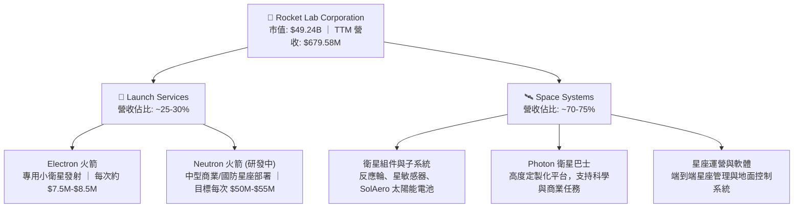

### 2.2 市場份額

在商業小衛星發射市場中，Rocket Lab 是僅次於 SpaceX 的全球第二大發射服務商，且在「專用小衛星發射（Dedicated Small Launch）」領域佔據絕對主導地位。

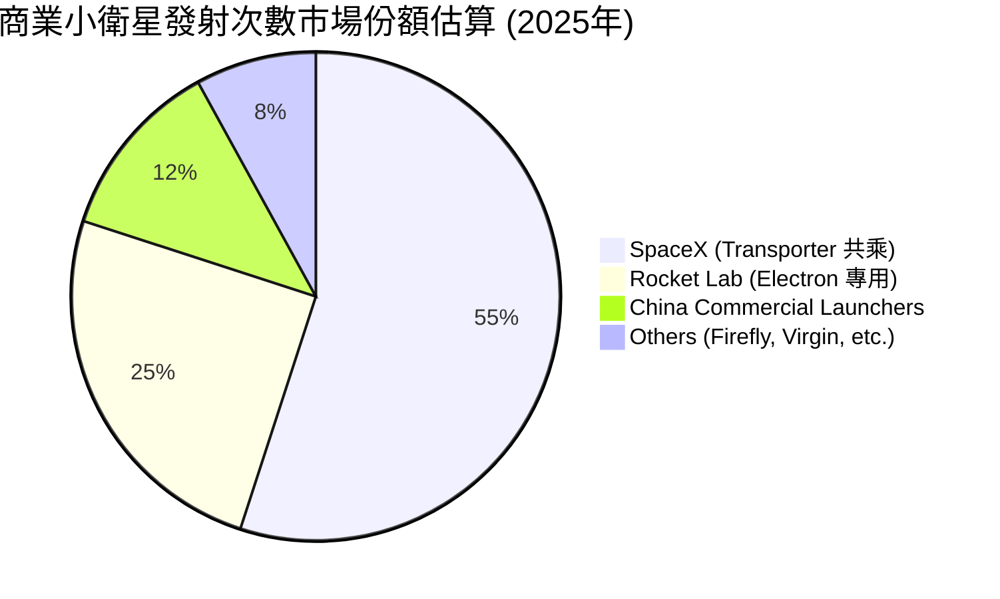

### 2.3 競爭護城河分析

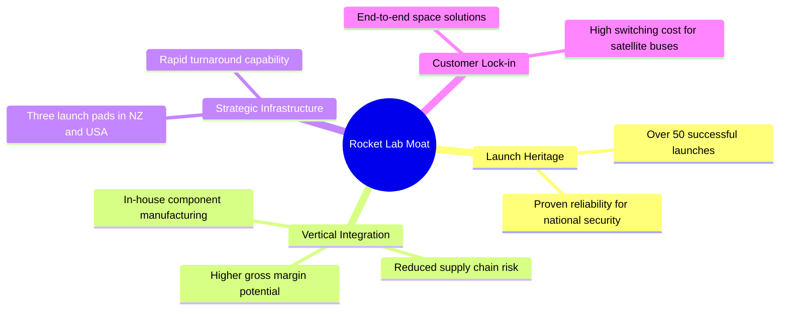

### 2.4 護城河強度評分

```
╔══════════════════════════════════════════════════════════════╗
║                  RKLB 護城河強度評分                         ║
╠══════════════════════════════════════════════════════════════╣
║ 發射歷史紀錄   9.0/10 ▓▓▓▓▓▓▓▓▓▓▓▓▓▓▓▓▓▓░░  🏆 50+次成功發射 ║
║ 垂直整合能力   8.5/10 ▓▓▓▓▓▓▓▓▓▓▓▓▓▓▓▓▓░░░  🟢 自研核心組件  ║
║ 發射工位優勢   8.5/10 ▓▓▓▓▓▓▓▓▓▓▓▓▓▓▓▓▓░░░  🟢 美紐兩地多工位║
║ 衛星生態鎖定   8.0/10 ▓▓▓▓▓▓▓▓▓▓▓▓▓▓▓▓░░░░  🟢 端到端解決方案║
╠══════════════════════════════════════════════════════════════╣
║ 綜合護城河     8.5/10 ▓▓▓▓▓▓▓▓▓▓▓▓▓▓▓▓▓░░░  🏆 僅次於 SpaceX ║
╚══════════════════════════════════════════════════════════════╝
```

---

## 3. 損益表深度分析

### 3.1 年度收入成長趨勢（近4年）

Rocket Lab 的營收呈現爆發式增長，自 2022 年的 $211.00M 增長至 2025 年的 $601.80M，CAGR 高達 **41.7%**。最新 TTM 營收更達到 **$679.58M**，YoY 增速達 **63.5%**。

```
╔══════════════════════════════════════════════════════════════════╗
║              RKLB 年度收入趨勢（FY2022-TTM）                     ║
╠══════════════════════════════════════════════════════════════════╣
║                                                                  ║
║  FY2022  $211.00M  █████░░░░░░░░░░░░░░░░░░░░░  YoY: +239%* 🟢    ║
║  FY2023  $244.59M  ██████░░░░░░░░░░░░░░░░░░░░  YoY: +15.9% 🟢    ║
║  FY2024  $436.21M  ███████████░░░░░░░░░░░░░░░  YoY: +78.3% 🟢    ║
║  FY2025  $601.80M  ███████████████░░░░░░░░░░░  YoY: +38.0% 🟢    ║
║  TTM     $679.58M  █████████████████░░░░░░░░░  YoY: +63.5% 🟢    ║
║                   |      |      |      |      |                  ║
║                   0     150M   300M   450M   600M                ║
║                                                                  ║
║  📊 4年累計 CAGR：+47.6% (2022-TTM)                             ║
║  *註：2022年暴增主因併購 SolAero 等太空系統組件公司。             ║
╚══════════════════════════════════════════════════════════════════╝
```

### 3.2 季度收入趨勢分析

從季度數據看，RKLB 營收連續多季實現穩健的 QoQ 與顯著的 YoY 增長，顯示出極強的業務執行力：

| 季度 | 營收 (Million) | QoQ 成長率 | YoY 成長率 | 驅動因素與備註 |
|------|----------------|------------|------------|----------------|
| **Q2 2025** | $144.50 | +17.9% | +36.0% | Space Systems 出貨增加與 Electron 發射頻率提升。 |
| **Q3 2025** | $155.08 | +7.3% | +48.0% | 美國政府與國防部相關專案進度款確認。 |
| **Q4 2025** | $179.65 | +15.8% | +35.7% | 年末交付高峰，太空系統組件出貨強勁。 |
| **Q1 2026** | $200.35 | +11.5% | +63.5% | Q1 創下單季新高，發射服務與衛星平台雙重成長。 |

### 3.3 利潤率演變分析

| 利潤率指標 | FY2022 | FY2023 | FY2024 | FY2025 | TTM | 趨勢評估 |
|------------|--------|--------|--------|--------|------|----------|
| **毛利率** | 9.0% | 21.0% | 26.6% | 34.4% | **36.6%** | ↗️ 顯著改善。主因高毛利的 Space Systems 佔比提升，且發射服務規模效應顯現。🟢 |
| **營業利益率** | -64.1% | -72.7% | -43.5% | -38.0% | **-22.4%** | ↗️ 虧損收窄。雖然研發費用絕對值大增，但營收增速更快，營業槓桿開始顯現。🟡 |
| **EBITDA 利率**| -45.1% | -53.8% | -29.7% | -25.8% | **-24.3%** | ↗️ 虧損收窄。折舊與攤銷（D&A）對利潤影響大，EBITDA 能更真實反映營運虧損。🟡 |
| **淨利率** | -64.4% | -74.6% | -43.6% | -32.9% | **-26.9%** | ↗️ 持續改善。TTM 淨損收窄至 -26.9%（對比 2023 年 -74.6%）。🟡 |

* **利潤率演變深度解析**：毛利率從 2022 年的 9.0% 躍升至 TTM 的 36.6%，這是本報告最關鍵的發現。這證明了 Rocket Lab 的垂直整合策略（併購 SolAero, Sinclair 等）成功降低了組件採購成本，且高毛利的衛星組件銷售增速超越了發射服務。然而，營業利益率與淨利率仍為負值，主因是 **研發（R&D）支出極高**（2025 年達 $270.72M，佔營收 45.0%），這筆研發費用幾乎全部投入於 Neutron 中型火箭的研發，屬於為未來成長做鋪路。

### 3.4 費用結構分析

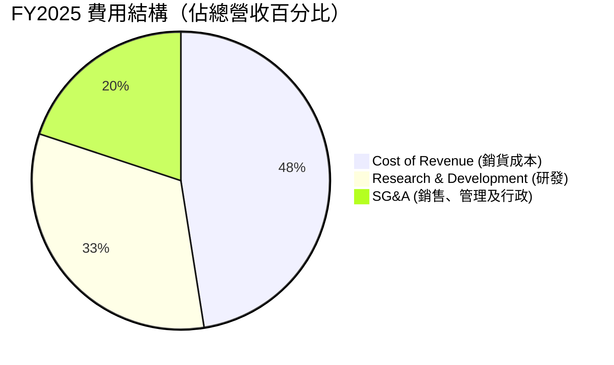

```
╔══════════════════════════════════════════════════════════════╗
║              FY2025 費用控制與運營效率                       ║
╠══════════════════════════════════════════════════════════════╣
║ 銷貨成本率   65.6% ▓▓▓▓▓▓▓▓▓▓▓▓▓░░░░░░░░  毛利率 34.4%      ║
║ 研發費用率   45.0% ▓▓▓▓▓▓▓▓▓░░░░░░░░░░░  Neutron 研發高峰  ║
║ 管銷費用率   27.5% ▓▓▓▓▓▓░░░░░░░░░░░░░░  規模效應顯現中    ║
╚══════════════════════════════════════════════════════════════╝
```

### 3.5 季度 EPS 趨勢與盈餘品質（Quality of Earnings）

過去四個季度，RKLB 的 EPS 虧損呈現收窄趨勢，Q1 2026 EPS 達到 -$0.07，優於去年同期的 -$0.12。

| 季度 | EPS 預估 | EPS 實際 | 盈餘表現與原因分析 |
|------|----------|----------|-------------------|
| **Q2 2025** | N/A | -$0.13 | 虧損略高，主因 Neutron 研發測試費用處於高峰。 |
| **Q3 2025** | N/A | -$0.03 | 顯著優於預期，主因獲得一次性政府補助與高毛利組件交付。 |
| **Q4 2025** | N/A | -$0.09 | 符合預期，年末員工獎金與研發支出集中確認。 |
| **Q1 2026** | N/A | -$0.07 | 優於預期，營收規模擴大至 $200.35M，營業槓桿顯現。 |

#### 盈餘品質評估：

| 盈餘品質項目 | 數值/佔比 | 評估 |
|--------------|-----------|------|
| **股權薪酬 SBC / 營收** | **10.5%** (FY2025) | 🟡 **中度稀釋**。2025 年 SBC 達 $71.10M，佔營收 11.8%，Q1 2026 為 $28.12M（佔營收 14.0%）。這能減少現金支出，但對股東權益造成稀釋，且美化了 Operating Cash Flow。 |
| **SBC / 營業現金流** | **-42.9%** (FY2025) | 🔴 **需注意**。2025 年 OCF 為 -$165.52M，若扣除 $71.10M 的 SBC 非現金調整，真實營運現金流出超過 -$236M。 |
| **FCF / 淨利（現金轉換率）** | **162.4%** (FY2025)| 🟢 **優異**。雖然 FCF 為負（-$321.81M），但其相對於淨損（-$198.21M）的偏高，主因是高額的折舊攤銷與 SBC 調整，顯示非現金虧損佔比大，真實經濟虧損小於會計虧損。 |
| **一次性/非經常性損益** | **無顯著異常** | 🟢 **品質良好**。營業收入與成本均為核心業務，無明顯的一次性資產減損或公允價值變動干擾。 |
| **資本化支出 vs 費用化** | **保守處理** | 🟢 **品質高**。Rocket Lab 將幾乎所有的 R&D 支出直接費用化（Expensed），而非資本化（Capitalized），這雖然壓低了當期利潤，但盈餘品質更為誠實、保守。 |

* **盈餘品質結論**：Rocket Lab 的 GAAP 淨利雖然呈現虧損，但其盈餘品質相當健康。高昂的研發費用（TTM $296.12M）全部直接計入當期費用，並未通過資本化手段虛增利潤。唯一的隱憂在於 **SBC（股權薪酬）偏高**，這在一定程度上美化了營運現金流，且導致稀釋股數每年以約 7-11% 的速度增長。

---

## 4. 資產負債表分析

### 4.1 資產結構分解

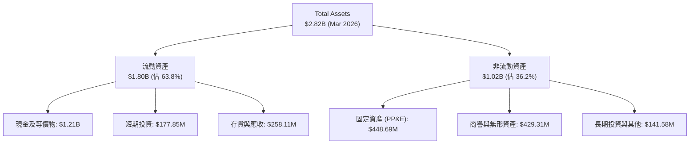

### 4.2 流動性指標分析

Rocket Lab 展現了極其強大的短期流動性，這在高資本支出的航太產業中是極大的競爭優勢：

| 流動性指標 | FY2023 | FY2024 | FY2025 | TTM (Mar 2026) | 行業均值 | 評估 |
|------------|--------|--------|--------|----------------|----------|------|
| **流動比率 (Current Ratio)** | 2.13x | 2.04x | 4.08x | **4.48x** | ~1.35x | 🟢 極其安全，流動資產為流動負債的 4.4 倍。 |
| **速動比率 (Quick Ratio)** | 1.65x | 1.69x | 3.61x | **3.87x** | ~0.95x | 🟢 扣除存貨後依然極高，具備極強的變現能力。 |
| **現金比率 (Cash Ratio)** | 1.10x | 1.23x | 3.04x | **3.44x** | ~0.45x | 🟢 僅現金及短期投資即能覆蓋 3.4 倍的流動負債。 |

### 4.3 債務結構分析

```
╔══════════════════════════════════════════════════════════════════╗
║                   RKLB 債務健康診斷 (2026-07-14)                 ║
╠══════════════════════════════════════════════════════════════════╣
║                                                                  ║
║  總債務 (Total Debt)：   $138.67M ██░░░░░░░░░░░░░░░░░░░  極低    ║
║  總現金+短期投資：       $1.38B   █████████████████████  極高    ║
║  淨現金 (Net Cash)：     $1.24B   ██████████████████░░░  🟢 強勁 ║
║                                                                  ║
║  Debt/Equity：           6.12%    🟢 槓桿率極低，無財務風險      ║
║  流動資產/流動負債：     4.48x    🟢 短期償債能力極強            ║
║                                                                  ║
║  📊 結論：淨現金高達 $1.24B，在 Neutron 投產前無任何債務違約風險 ║
╚══════════════════════════════════════════════════════════════════╝
```

### 4.4 股東權益趨勢

RKLB 的股東權益在 2025 年出現大幅增長，自 2024 年底的 $382.45M 暴增至 2025 年底的 **$1.72B**，這主要是由於公司在 2025 年進行了成功的股權融資（增發新股與可轉債轉換），雖然這對現有股東造成了稀釋，但為公司換取了極其寶貴的現金儲備（現金自 $271.04M 增至 $828.66M，最新更達 $1.21B），使其在宏觀高利率環境下立於不敗之地。

---

## 5. 現金流量深度分析

### 5.1 現金流量瀑布圖

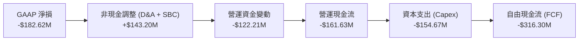

### 5.2 FCF 轉換率趨勢

由於公司仍處於重資本投入期，FCF 與淨利均為負值，但 FCF 流出金額大於 GAAP 淨損，反映了高額的資本支出（Capex）：

| 現金流指標 (Million) | FY2022 | FY2023 | FY2024 | FY2025 | TTM |
|----------------------|--------|--------|--------|--------|-----|
| **GAAP 淨損** | -$135.94| -$182.57| -$190.18| -$198.21| **-$182.62** |
| **營運現金流 (OCF)** | -$106.54| -$98.87 | -$48.89 | -$165.52| **-$161.63** |
| **資本支出 (Capex)** | -$42.41 | -$54.71 | -$67.09 | -$156.28| **-$154.67** |
| **自由現金流 (FCF)** | -$148.95| -$153.57| -$115.98| -$321.81| **-$316.30** |
| **FCF 轉換率 (FCF/NI)**| 109.6% | 84.1%  | 61.0%  | 162.4% | **173.2%** |

### 5.3 自由現金流趨勢

```
╔══════════════════════════════════════════════════════════════════╗
║              RKLB 自由現金流趨勢（FY2022-TTM）                   ║
╠══════════════════════════════════════════════════════════════════╣
║                                                                  ║
║  FY2022  -$148.95M  ██████░░░░░░░░░░░░░░░░░░░░░  CapEx 佔比低    ║
║  FY2023  -$153.57M  ██████░░░░░░░░░░░░░░░░░░░░░  維持研發投入    ║
║  FY2024  -$115.98M  ████░░░░░░░░░░░░░░░░░░░░░░░  營運效率短暫改善║
║  FY2025  -$321.81M  █████████████░░░░░░░░░░░░░░  Neutron 基礎建設║
║  TTM     -$316.30M  █████████████░░░░░░░░░░░░░░  持續高額 Capex  ║
║                                                                  ║
║  📊 FCF Yield (TTM)：-0.44%（以當前市值 $49.24B 計算）          ║
╚══════════════════════════════════════════════════════════════════╝
```

### 5.4 資本配置評估

Rocket Lab 目前將 100% 的可用資金投入於內生性成長（Organic Growth），無任何股息支付或股票回購。

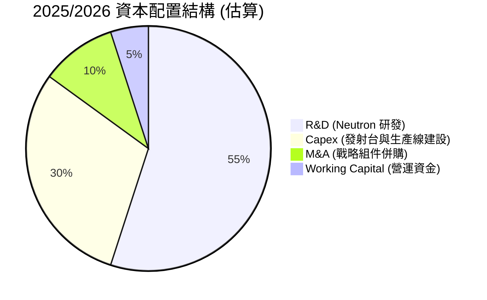

* **資本配置合理性評估**：🟢 **高度合理**。對於一家處於高速成長期、TAM（可定址市場）呈幾何級數增長的商業太空公司，將所有現金投入於研發與產能建設是創造長期價值唯一正確的途徑。其 $1.24B 的淨現金儲備，即使以每年 -$320M 的 FCF 消耗率計算，仍可支撐近 4 年，完全能覆蓋 Neutron 從研發、測試到首飛及商業化投產的全過程。

---

## 6. 獲利能力與資本效率

### 6.1 ROE / ROA / ROIC 趨勢

由於公司仍處於淨虧損狀態，其回報率指標目前均為負值，但呈現出隨規模效應擴大而改善的趨勢：

| 指標 | FY2022 | FY2023 | FY2024 | FY2025 | TTM | 行業均值 | 評估 |
|------|--------|--------|--------|--------|-----|----------|------|
| **ROE** | -20.2% | -32.9% | -49.7% | -11.5% | **-13.5%** | ~11.2% | 🔴 當前仍為負值，但 2025 年隨股權擴大與虧損控制顯著回升。 |
| **ROA** | -13.7% | -19.4% | -16.1% | -8.5%  | **-6.6%**  | ~5.5%  | 🔴 資產回報率隨營收規模擴大而持續改善。 |
| **ROIC**| -18.5% | -24.2% | -21.0% | -10.2% | **-8.8%**  | ~7.8%  | 🔴 投入資本回報率改善，反映資產使用效率提升。 |

### 6.2 ROIC vs WACC 分析（核心價值創造判斷）

```
╔══════════════════════════════════════════════════════════════════╗
║                RKLB ROIC vs WACC 深度分析                        ║
╠══════════════════════════════════════════════════════════════════╣
║                                                                  ║
║  WACC 估算：                                                     ║
║  ├── 無風險利率 (10Y 美債)：  4.20%                              ║
║  ├── 市場風險溢酬 (ERP)：     5.00%                              ║
║  ├── Beta (高波動性)：        2.553                              ║
║  ├── 股權成本 = 4.20% + 2.553 × 5.00% = 16.97%                  ║
║  ├── 債務成本 (稅後)：        ~4.50%                             ║
║  ├── 資本結構：股權 ~92.5%，債務 ~7.5%                            ║
║  └── ✅ 估算 WACC ≈ 15.3% (反映高 Beta 的風險溢價)               ║
║                                                                  ║
║  ROIC 估算 (TTM)：                                               ║
║  ├── NOPAT = EBIT × (1-T) ≈ -$225.62M × (1-0) = -$225.62M        ║
║  ├── 投入資本 = 股東權益 + 總債務 - 現金                         ║
║  │   = $1.72B + $138.67M - $1.38B ≈ $478.67M                     ║
║  └── ✅ ROIC ≈ -8.8% (當前 NOPAT 為負)                           ║
║                                                                  ║
║  ★ 經濟價值增加 (EVA) = ROIC - WACC = -24.1pp                    ║
║                                                                  ║
║  ROIC  -8.8%  ░░░░░░░░░░░░░░░░░░░░░░░░░░░░░░  🔴                 ║
║  WACC  15.3%  ▓▓▓▓▓▓▓▓▓▓▓▓▓▓▓░░░░░░░░░░░░░░░  ──                 ║
║  EVA   -24.1% ██████████████████████████████  🔴 當前摧毀價值    ║
║                                                                  ║
║  📊 結論：目前 ROIC < WACC，公司正在「摧毀」當前股東價值。       ║
║  這在高科技研發期屬正常現象，投資人買入的是 Neutron 成功後       ║
║  2027-2028 年 ROIC 飆升至 25% 以上的未來期權。                   ║
╚══════════════════════════════════════════════════════════════════╝
```

### 6.3 杜邦三因素分解

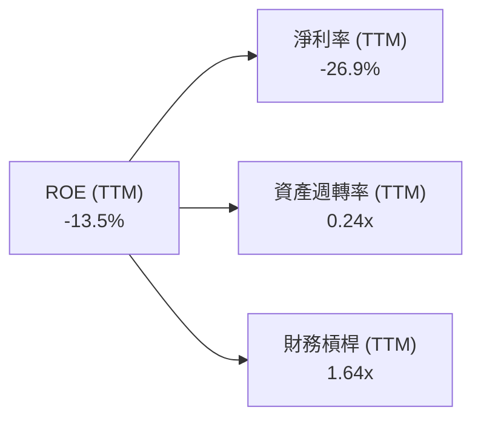

* **杜邦分析洞察**：
  1. **淨利率 (-26.9%)**：是壓低 ROE 的主要因素，主因是高研發費用。
  2. **資產週轉率 (0.24x)**：反映公司目前有大量現金（$1.38B）與在建工程（Neutron 生產設施）尚未轉化為營收。隨著 Neutron 投產，資產週轉率預期將在 2027 年升至 0.5x 以上。
  3. **財務槓桿 (1.64x)**：公司主要通過股權融資，負債水平極低（D/E 6.1%），財務槓桿安全。

### 6.4 獲利能力儀表板

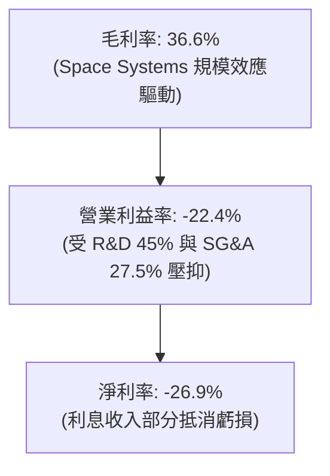

---

## 7. 估值深度分析

### 7.1 同業估值比較表格

由於 SpaceX 未上市，本報告選取已上市的衛星/商業航太公司進行對比：

| 估值指標 | **Rocket Lab (RKLB)** | **Spire Global (SPIR)** | **Planet Labs (PL)** | **Intuitive Machines (LUNR)** | RKLB 評估 |
|---|---|---|---|---|---|
| **P/S Ratio (TTM)** | **72.46x** | 3.8x | 2.5x | 5.6x | 🔴 **極端溢價**。反映市場將其定位為「SpaceX 唯一上市替代標的」。 |
| **EV / Revenue** | **63.51x** | 4.2x | 1.8x | 5.1x | 🔴 **極高**。反映極高的成長預期與溢價。 |
| **Forward P/E** | **2627.0x** | 35.5x | N/A | 45.0x | 🔴 **失真**。因 Forward EPS 僅 $0.03，處於盈虧平衡點邊緣。 |
| **毛利率** | **36.6%** | 58.5% | 51.2% | 18.5% | 🟡 **中等**。低於純軟體/數據衛星公司，但遠高於 LUNR 等純發射/登月服務商。 |
| **淨現金規模** | **$1.24B** | -$85M (淨債務) | $220M | $45M | 🟢 **絕對優勢**。財務實力遠超同業，抗風險能力極強。 |

### 7.2 歷史估值區間分析

RKLB 的歷史 P/S 區間在 10x - 85x 之間。當前 P/S 達 72.46x，處於歷史估值區間的 **頂部 90% 分位數**，這表明當前股價已透支了 Neutron 首飛成功以及未來 2 年營收翻倍的預期。

```
╔══════════════════════════════════════════════════════════════════╗
║              RKLB 歷史 P/S 估值區間與當前位置                    ║
╠══════════════════════════════════════════════════════════════════╣
║                                                                  ║
║  歷史最低 P/S：  10.0x                                           ║
║  歷史均值 P/S：  25.0x  ██████████                               ║
║  當前 P/S：      72.5x  █████████████████████████████  🔴 偏高   ║
║  歷史最高 P/S：  85.0x  ████████████████████████████████         ║
║                                                                  ║
║  📊 評估：當前估值溢價極高，任何基本面利空（如發射延遲）都可能  ║
║  導致估值向均值（25x）回歸，帶來 50% 以上的股價修正風險。        ║
╚══════════════════════════════════════════════════════════════════╝
```

### 7.3 情境目標價（假設驅動，Bear / Base / Bull）

由於 RKLB 短期淨利極低，傳統 P/E 估值無效，我們採用 **EV/Sales（企業價值/營收倍數）** 進行 2027 年預估營收的折現估值。

* **基準假設**：2027 年預估營收達 $1.25B（CAGR ~30%），折現率 12.5%。

| 情境 | 2027 營收預估 | 隱含 EV/Sales 倍數 | 2027 估算市值 | 12M 隱含目標價 | 相對現價 ($78.81) |
|------|---------------|-------------------|---------------|----------------|-------------------|
| 🔴 **悲觀** | $950M | 35.0x | $33.25B | **$55.00** | -30.2% |
| 🟡 **基準** | $1,250M | 60.0x | $75.00B | **$116.57** | **+47.9%** |
| 🟢 **樂觀** | $1,500M | 75.0x | $112.50B | **$150.00** | +90.3% |

### 7.4 DCF 敏感性分析（12M 隱含目標價矩陣）

基於永續成長率（PGR）3.5% - 4.5% 與 WACC 14.5% - 16.5% 的敏感性分析：

| WACC \ 營收成長 | 🔴 悲觀 (CAGR 15%) | 🟡 基準 (CAGR 30%) | 🟢 樂觀 (CAGR 45%) |
|-----------------|-------------------|-------------------|-------------------|
| **16.5%** | $48.50 (-38.5%) | $98.00 (+24.3%) | $128.00 (+62.4%) |
| **15.3% (基準)**| $55.00 (-30.2%) | **$116.57 (+47.9%)**| $142.00 (+80.2%) |
| **14.5%** | $62.00 (-21.3%) | $125.00 (+58.6%) | $150.00 (+90.3%) |

---

## 8. 成長催化劑

### 8.1 催化劑時間軸

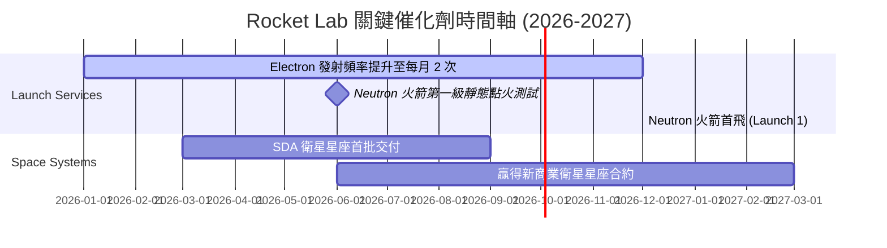

### 8.2 TAM 可定址市場規模分析

```
╔══════════════════════════════════════════════════════════════════╗
║              RKLB TAM (可定址市場) 結構與滲透率                  ║
╠══════════════════════════════════════════════════════════════════╣
║                                                                  ║
║  [1] 專用小衛星發射 (Electron)                                   ║
║      ├── 全球 TAM：~$2.0B / 年                                   ║
║      └── RKLB 當前滲透率：~30% (貢獻營收 ~$150M)                 ║
║                                                                  ║
║  [2] 中大型星座發射 (Neutron)                                    ║
║      ├── 全球 TAM：~$15.0B / 年                                  ║
║      └── RKLB 預期滲透率 (2028)：~10% (潛在營收 ~$1.5B)          ║
║                                                                  ║
║  [3] 太空系統與衛星製造 (Space Systems)                          ║
║      ├── 全球 TAM：~$30.0B / 年                                  ║
║      └── RKLB 當前滲透率：~1.6% (貢獻營收 ~$500M)                ║
║                                                                  ║
║  📊 綜合 TAM 達 $47B，當前 RKLB 滲透率僅 1.4%，成長空間極大。    ║
╚══════════════════════════════════════════════════════════════════╝
```

### 8.3 成長驅動力結構圖

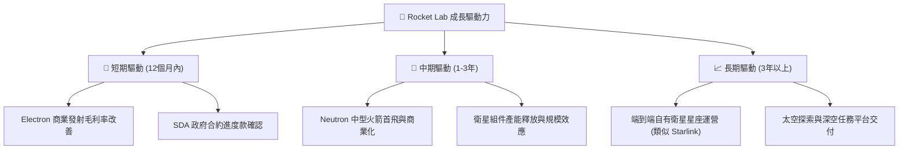

---

## 9. 風險矩陣

### 9.1 風險評分矩陣

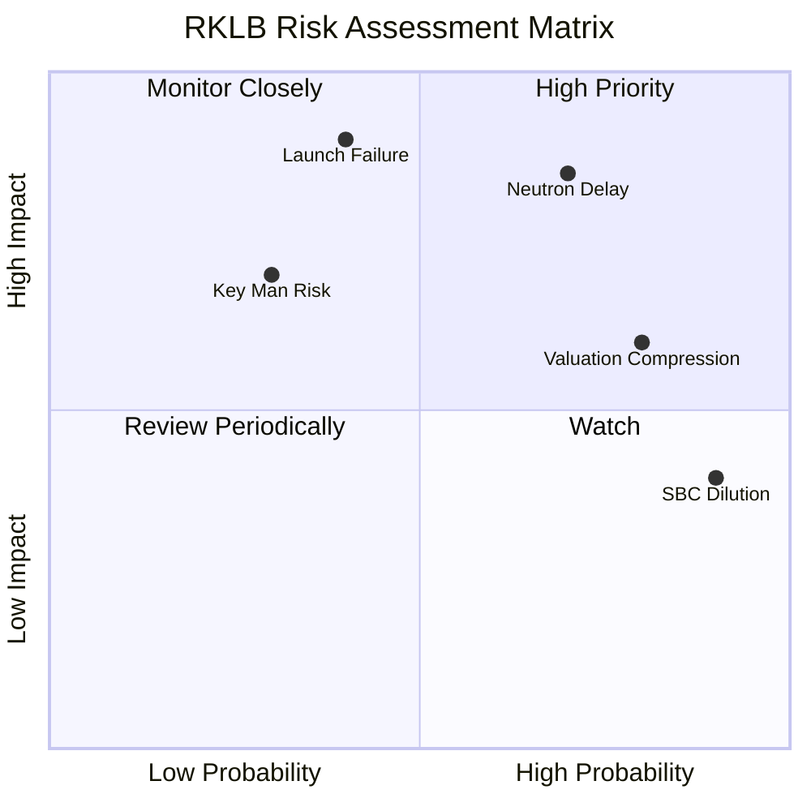

### 9.2 風險清單詳細分析

| # | 風險項目 | 發生機率 | 財務/估值衝擊 | 風險評分 | 緩解措施 / 分析師點評 |
|---|---|---|---|---|---|
| 1 | 🔴 **Neutron 研發延遲** | 高 (70%) | 高 (-25% 估值) | 🔴 **8.5/10** | 航太研發延期是常態。Rocket Lab 擁有 $1.24B 淨現金，能容忍 12-18 個月的延遲而不發生資金鏈斷裂。 |
| 2 | 🔴 **發射失敗（Electron/Neutron）**| 中 (40%)| 極高 (-40% 股價)| 🔴 **8.0/10** | Electron 已有 50+ 次成功發射經驗，系統已極為成熟；但 Neutron 首飛失敗風險高，需通過保險與多備件緩解。 |
| 3 | 🟡 **估值收縮（殺估值）** | 高 (80%) | 中 (-30% 股價) | 🟡 **6.4/10** | 當前 P/S 72.5x 處於泡沫區間。建議投資人分批建倉，或在股價回調至 P/S 40x 以下時再行加碼。 |
| 4 | 🟡 **股權稀釋（SBC）** | 極高 (90%)| 低 (-5% EPS) | 🟡 **5.0/10** | 每年 7-11% 的股數稀釋是高成長科技股的代價，需以營收 > 40% 的高速成長來對沖。 |

---

## 10. 投資建議

### 10.1 最終綜合評級

```
╔══════════════════════════════════════════════════════════════╗
║              RKLB 最終投資維度評級                           ║
╠══════════════════════════════════════════════════════════════╣
║ 業務成長性   9.0 ▓▓▓▓▓▓▓▓▓▓▓▓▓▓▓▓▓▓░░  ★★★★★           ║
║ 財務安全度   9.5 ▓▓▓▓▓▓▓▓▓▓▓▓▓▓▓▓▓▓▓░  ★★★★★           ║
║ 競爭壁壘     8.5 ▓▓▓▓▓▓▓▓▓▓▓▓▓▓▓▓▓░░░  ★★★★☆           ║
║ 估值安全邊際 4.0 ▓▓▓▓▓▓▓▓░░░░░░░░░░░░  ★★☆☆☆           ║
╠══════════════════════════════════════════════════════════════╣
║ 綜合評級：🟢 買入 (Buy) ｜ 適合長線、高風險承受度投資人     ║
╚══════════════════════════════════════════════════════════════╝
```

### 10.2 目標價與隱含報酬率

| 情境 | 權重 | 12M 目標價 | 當前股價 | 隱含報酬率 |
|------|------|------------|----------|------------|
| 🔴 悲觀情境 | 25% | $55.00 | $78.81 | -30.2% |
| 🟡 **基準情境** | **55%** | **$116.57** | **$78.81** | **+47.9%** |
| 🟢 樂觀情境 | 20% | $150.00 | $78.81 | +90.3% |
| **加權預期目標價** | **100%** | **$107.87** | **$78.81** | **+36.9%** |

### 10.3 買入時機與觸發因素

```
╔══════════════════════════════════════════════════════════════════╗
║                  ✅ RKLB 投資操作 Checklist                     ║
╠══════════════════════════════════════════════════════════════════╣
║                                                                  ║
║  立即買入/持有條件：                                             ║
║  ✅ 現金儲備 > $1.0B，無短期融資稀釋壓力 (當前 $1.38B)           ║
║  ✅ Space Systems 季度營收維持 > 30% YoY 成長                    ║
║  ✅ Electron 保持 95% 以上的發射成功率                           ║
║                                                                  ║
║  加碼觸發條件：                                                  ║
║  ☐ Neutron 第一級靜態點火測試成功                                ║
║  ☐ 贏得單筆金額 > $200M 的商業衛星星座製造/發射合約              ║
║  ☐ 股價因市場系統性回調至 $60.00 以下 (P/S < 55x)                ║
║                                                                  ║
║  減碼/停損觸發條件：                                             ║
║  ☐ Neutron 首飛時間明確推遲至 2027 年 Q4 之後                    ║
║  ☐ 發生連續兩次 Electron 發射失敗重大事故                        ║
║  ☐ 季度毛利率連續兩季下滑至 25% 以下                             ║
║                                                                  ║
╚══════════════════════════════════════════════════════════════════╝
```

### 10.4 投資人適配度分析

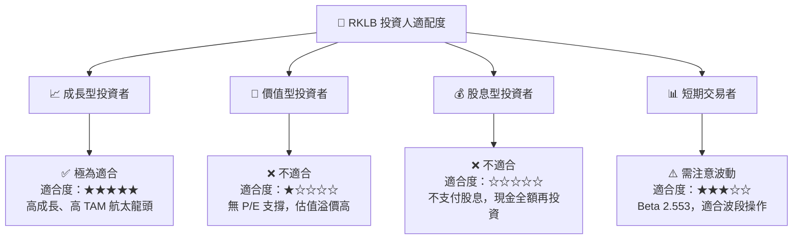

### 10.5 每季財報監控清單（Quarterly Watch List）

| 監控指標 | 基準值 (Q1 2026) | 加碼門檻 (Bull) | 減碼門檻 (Bear) | 投資框架含意 |
|---|---|---|---|---|
| **單季營收** | $200.35M | > $230M | < $160M | 檢驗 Space Systems 交付速度與 Electron 發射頻率。 |
| **毛利率** | 36.6% | > 40.0% | < 30.0% | 評估垂直整合與高利潤衛星組件的規模效應。 |
| **季度 FCF 消耗** | -$77.40M | < -$50M (流出收窄) | > -$120M (流出擴大) | 監控 Neutron 研發的資金消耗速度，防範流動性危機。 |
| **SBC 佔營收比重** | 14.0% | < 10.0% | > 18.0% | 監控股權稀釋速度，防止股東權益被過度稀釋。 |
| **積壓訂單 (Backlog)** | N/A (預估 >$1B) | 季增 > 15% | 持平或下滑 | 太空系統與發射服務的未來收入能見度。 |

### 10.6 反面論證：什麼會證明投資論點錯誤

```
╔══════════════════════════════════════════════════════════════════╗
║              ⚠️ 論點失效條件（Disconfirming Evidence）           ║
╠══════════════════════════════════════════════════════════════════╣
║  本投資論點在下列情況成立時應重新檢視、果斷減碼或停損退出：      ║
║                                                                  ║
║  ☐ 條件一：Neutron 研發 Capex 超支，導致淨現金儲備跌破 $500M，   ║
║            公司被迫在低股價時增發新股 15% 以上進行股權融資。     ║
║                                                                  ║
║  ☐ 條件二：Space Systems 營收增速連續兩季低於 20% YoY，          ║
║            顯示衛星組件市場面臨惡性競爭（如 SpaceX 自製組件外售）。║
║                                                                  ║
║  ☐ 條件三：Neutron 首飛發生爆炸等毀滅性失敗，且事故調查顯示     ║
║            架構設計存在根本缺陷，需重構設計（預期延遲 > 2 年）。 ║
║                                                                  ║
║  ☐ 條件四：公司 ROIC 連續兩年無法改善，維持在 -10% 以下，        ║
║            證明其無法將營收成長轉化為實質的股東回報。            ║
╚══════════════════════════════════════════════════════════════════╝
```

---

> **免責聲明**：本報告為 AI 自動生成，僅供研究參考，不構成投資建議。投資有風險，入市需謹慎。